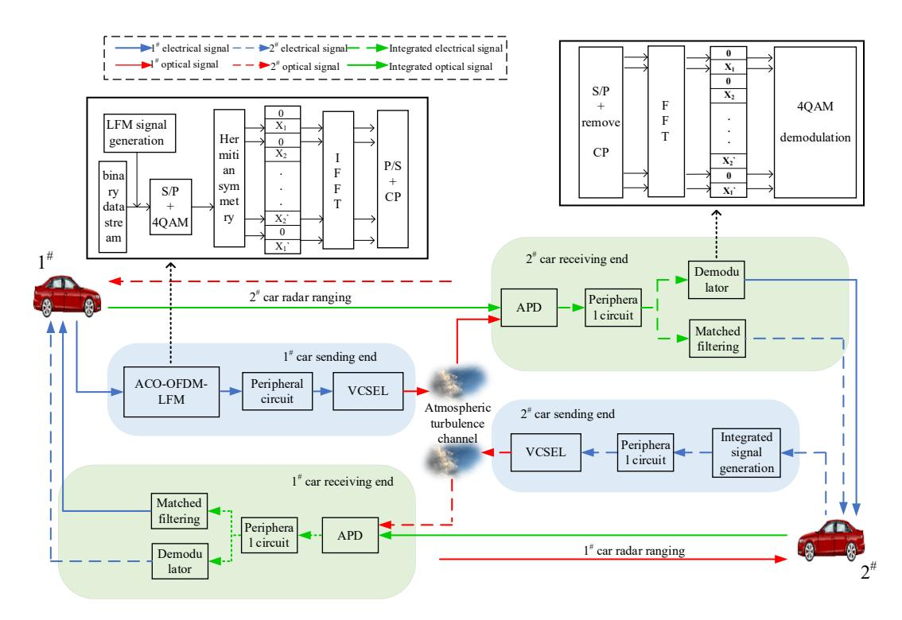
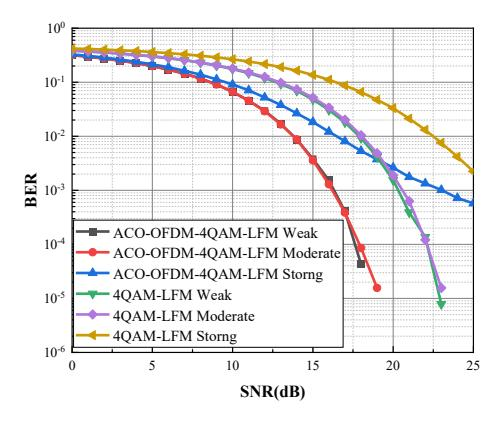
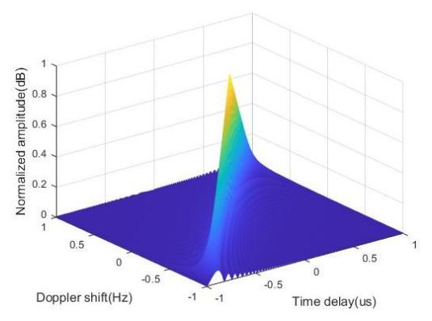
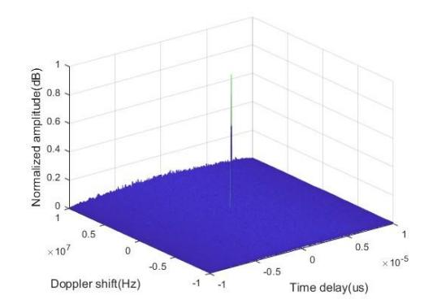
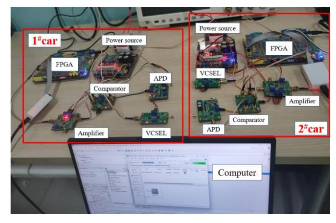
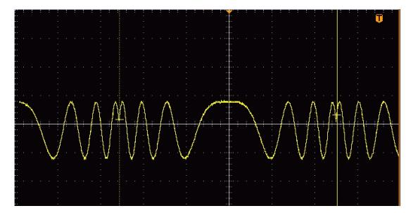
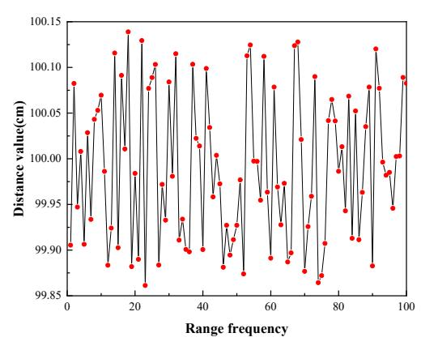

{0}------------------------------------------------

# Integrated Design of OFDM-LFM Lidar Communication in IoV Environment

Genxue Zhou Lanzhou University of **Technology** School of Computer and Communication Lanzhou, China zzgx0525@163.com

Minghua Cao\* Lanzhou University of **Technology** School of Computer and Communication Lanzhou, China caominghua@lut.edu.cn \*Corresponding author

Shengchun Han Lanzhou University of Technology School of Computer and Communication Lanzhou, China 17693546983@163.com

Qing Yang Lanzhou University of Technology School of Computer and Communication Lanzhou, China 15682903583@ 163.com

Yue Zhang Lanzhou University of Technology School of Computer and Communication Lanzhou, China zyue940209@163.com

Huigin Wang Lanzhou University of Technology School of Computer and Communication Lanzhou, China whq1222@lut.edu.cn

Abstract—To address the challenges associated with traditional communication-sensing integrated systems in the Internet of Vehicle (IoV) environment, particularly in terms of spectrum demand and hardware implementation costs, a lidar communication-sensing integrated system is proposed. This system combines asymmetric limiting optical orthogonal frequency division multiplexing (ACO-OFDM) and linear frequency modulation (LFM) technologies to seamlessly integrate optical communication and lidar ranging. Simulation results demonstrate that the system's bit error rate (BER) performance improves by 4.2 dB under Gamma-Gamma weak and medium turbulence channel conditions compared to a single LFM signal. Additionally, the overall ambiguity function of the integrated system exhibits a distinctive 'peg' shape, indicating superior distance and speed resolution capabilities. A laboratory prototype successfully demonstrates the system's capability to transmit data at 10 Mbps while maintaining an impressive ranging accuracy of less than 0.14 cm.

Keywords—integrated sensing and communication, bit error rate, fuzzy function graph, FPGA

# INTRODUCTION

Perception-based common-sense integrated designs usually use pulsed radar signals as carriers for communication signals. Linear Frequency Modulation (LFM) signals are widely used in radar systems due to their large time-width bandwidth product and compressible pulses. A method is introduced for modulating LFM signals using Minimum Shift Keying (MSK) in [1]. Simulation experiments show that as the input data increases, the contour of the ambiguity function tends to become more distinct and well-defined. However, this also leads to inter-band interference issues. To address this concern, [2] proposes utilizing Binary Phase Shift Keying (BPSK) for LFM signals. nevertheless, this results in a low data rate. To overcome these challenges, [3] develops a novel 16QAM-LFM hybrid waveform by using Quadrature Amplitude Modulation (QAM) with the LFM signal serving as the carrier. Simulation

experiments confirm that this hybrid waveform exhibits similar BER performance compared to 16QAM while demonstrating good distance resolution in its ambiguity function plot.

On the other hand, Orthogonal Frequency Division Multiplexing (OFDM) is commonly used in communicationbased integrated systems due to its high spectrum utilization. For instance, [4] constructs OFDM symbols as radar pulses forming frames for communication, and applies decoherence and compensation processes on received target echo information to achieve both communication and sensing functions. However, since only one bit can be embedded in each waveform, it leads to a low communication rate making it suitable only for specific ranging scenarios. Addressing these limitations, [5] proposes an OFDM-based integrated waveform design method which significantly enhances overall performance compared to traditional waveforms through weighting and optimization of the communication data rate along with conditional mutual information between observation signal and random target response pulses.

Based on this idea, an integrated communication-sensing scheme incorporates LiDAR technology is proposed, leveraging the superior radar performance of LFM waveforms and the excellent communication performance of OFDM waveforms. This ensures that both radar and communication requirements are met simultaneously.

# II. SYSTEM MODEL

The form of the transmitted signal differs from optical wireless communication (OWC) and RF communication. In OWC systems, the transmitted signal must be a non-negative real number with unipolar characteristics. Therefore, this design introduces the Asymmetrically Clipped Optical (ACO) OFDM technique to align with the signal requirements of OWC systems[6]. The block diagram of the integrated ACO-OFDM-LFM LIDAR communication sensing system is depicted in Fig.

This work was funded by the NSFC Program (62265010, 62261033).

{1}------------------------------------------------

Fig. 1 OFDM-LFM integrated system

The vehicle's transmitter generates the integrated signal, which is then transmitted to the Vertical Cavity Surface Emitting Laser (VCSEL) array after undergoing preliminary processing by peripheral circuits. This array converts the electrical signal into an optical signal and emits it into the atmospheric turbulence channel. In the scenario where Vehicle 2 captures the integrated optical signal directly through its Avalanche Photo Diode (APD) array at the receiving end, inter-vehicle laser communication is established. Conversely, if Vehicle 1's integrated optical signal encounters Vehicle 2 and gets reflected before being detected by bits APD array at the receiving end, the LIDAR sensing function can be realized.

# A. Integrated Signal Generation

Firstly, the binary data '0' and '1' are mapped to the starting frequency of the LFM signal,  $f_0$ , and the ending frequency of the LFM signal,  $f_1$ , respectively. The binary data changes once in the time period  $T_b$ . The resulting LFM signal can be expressed as follows[7]:

$$s(t) = \begin{cases} A \cdot \exp(j \cdot 2\pi (f_0 t + \frac{K}{2} t^2)), & if \quad a(t) = 0 \\ A \cdot \exp(j \cdot 2\pi (f_1 t + \frac{K}{2} t^2)), & if \quad a(t) = 1 \end{cases}$$
 (1)

where a(t) is the original binary user data stream, A is the amplitude of the signal, K is the frequency slope, which indicates the rate of change of frequency over time, t is a time variable,  $T_b$  is the period of a bit, and j represents an imaginary unit. Subsequently, serial-to-parallel conversion and 4QAM modulation are applied to this signal. The resulting modulation symbols are assigned to the odd subcarriers, while

the even subcarriers are set to zero. The assigned signal can be represented as follows[8]:

$$X_{mapping} = [0, s(1), 0, s(2), ..., s(\frac{N}{4} - 1), 0,$$

$$s^*(\frac{N}{4} - 1), ..., 0, s^*(1)]$$
(2)

where N represents the number of subcarriers and  $s^*(\bullet)$  denotes the complex conjugate of  $s(\bullet)$ . Subsequently, the frequency-domain signal undergoes processing through an Inverse Fast Fourier Transform (IFFT) module. The resulting time-domain signal obtained from this conversion can be expressed as follows[9]:

$$x_{IFFT}(k,n) = \frac{1}{\sqrt{N}} X_{mapping}(n) \exp(\frac{j2\pi nk}{N})$$
 (3)

and

$$x_{IFFT}(k + \frac{N}{2}, n) = \frac{1}{\sqrt{N}} X_{mapping}(n)$$

$$\times \exp(\frac{j2\pi nk}{N}) \exp(j\pi n)$$
(4)

where k denotes the k-th sampling value moment and n is the length of IFFT. In cases where n is even,  $X_{maping} = 0$ , resulting in:

$$x_{IFFT}(k) = -x_{IFFT}(k + \frac{N}{2}), \quad 0 < k < \frac{N}{2}$$
 (5)

The signal then undergoes a series of processing steps, including serial-to-parallel conversion, the addition of cyclic prefixes, and other processing steps. As a result, the ACO-

{2}------------------------------------------------

OFDM-LFM signal can be represented as follows[10]:

$$X_{ACO-OFDM-LFM}$$

$$= \frac{1}{\sqrt{N}} \sum_{k=0, x_{IFFT}(k) \ge 0}^{N/2-1} x_{IFFT}(k) \exp(\frac{-j2\pi nk}{N})$$

$$+ \frac{1}{\sqrt{N}} \sum_{k=0, x_{IFFT}(k) \le 0}^{N/2-1} x_{IFFT}(k) \exp(\frac{-j2\pi nk}{N})$$
(6)

#### B. Channel Model

The propagation of light waves in OWC systems is affected by atmospheric turbulence, resulting in refraction, scattering, and disordered phase fluctuations. To accurately characterize the stochastic nature of these optical channels, the widely used Gamma-Gamma distribution model effectively describes variations in atmospheric channel properties through its probability density function. It can be expressed as follows[11]:

$$\varphi_{h} = \frac{2(\alpha\beta)^{\frac{\alpha+\beta}{2}}}{\Gamma(\alpha) \cdot \Gamma(\beta)} \cdot h^{\frac{\alpha+\beta}{2}} \cdot N_{\alpha-\beta} \cdot (2\sqrt{\alpha\beta h}), \qquad (7)$$

$$h > 0$$

where  $\alpha$  denotes the large-scale scattering coefficient,  $\beta$  denotes the small-scale scattering coefficient,  $\Gamma(\bullet)$  stands for the Gamma function, and  $N_V(\bullet)$  refers to the V-order Type II modified Bessel function. The parameters  $\alpha$  and  $\beta$  can be expressed as follows[12]:

$$\alpha = \left\{ \exp\left[\frac{0.49\sigma^2}{(1+0.18d^2 + 0.56\sigma^{12/5})^{7/6}}\right] - 1 \right\}^{-1}$$
 (8)

$$\beta = \left\{ \exp\left[\frac{0.51\sigma^2}{(1+0.9d^2+0.62\sigma^{12/5})^{6/5}}\right] - 1 \right\}^{-1}$$
 (9)

After traversing the atmospheric turbulence channel and reaching the receiver, the received signal can be expressed as:

$$Y(t) = \eta h \cdot X_{ACO-OFDM-LFM}(t) + \omega \tag{10}$$

where  $\eta$  denotes the photoelectric conversion efficiency, and  $\omega$  denotes the additive Gaussian white noise.

# C. Communication Receiver

The received signal undergoes operations at the communication receiver, including serial-to-parallel conversion and removal of cyclic prefixes. Subsequently, the processed signal is directed to the Fast Fourier Transform (FFT) module, which transforms it into a frequency domain representation. The resulting equation can be expressed as follows:

$$Y_{FFT}(k) = \sum_{n=0}^{N-1} y(n) \cdot e^{-j\frac{2\pi}{N}kn}$$
 (11)

where y(n) denotes the discrete amplitude of the time-domain signal Y at the n-th sampling point. Following this step, the signal is then passed through a QAM demodulator for binary sequence demodulation.

#### D. LIDAR Receiver

The LIDAR receiver utilizes a matched filter with an inverse time-frequency characteristic to that of the input integrated signal. As a result, the higher frequency portion of the echo passes through the matched filter at a faster rate, while the lower frequency portion does so at a slower rate. This results in a significant increase in amplitude as the echo traverses through the filter, accompanied by a narrowing of pulse width.

$$\begin{array}{c} Y(t) \\ \hline \end{array} \text{ matched filter } \phi(t) \\ \hline \end{array} \begin{array}{c} S_0(t) \\ \hline \end{array}$$

Fig. 2 matched filtering process

Fig.2 illustrates the process of matched filtering. The expression of the matched filtered signal is as follows[13]:

$$S_{0}(t) = Y(t) \cdot \varphi(t)$$

$$= \int_{-\infty}^{\infty} Y(u)\varphi(t-u)du$$

$$= \int_{-\infty}^{\infty} e^{-j\pi Ku^{2}} rect(\frac{u}{T})e^{j2\pi f_{c}u}$$

$$\times e^{j\pi K(t-u)^{2}} rect(\frac{t-u}{T})e^{j2\pi f_{c}(t-u)}du$$
(12)

where  $f_c$  denotes the carrier frequency, T denotes the pulse duration, rect stands for the rectangular function,  $\varphi(t)$  represents the matched filter function, and u serves as an intermediate variable.

#### III. SIMULATION AND ANALYSIS

The performance of the integrated system is simulated using MATLAB, with the parameters specified in Table 1.

TABLE I. SUMMARY OF SIMULATION PARAMETERS

| Parameter                               | Value                                            |
|-----------------------------------------|--------------------------------------------------|
| carrier frequency of electrical signals | 100MHz                                           |
| bandwidth                               | 2MHz                                             |
| pulse width                             | $1 \times 10^{-5}$ s                             |
| pulse repetition period                 | 1×10 -4 s                             |
| sampling frequency                      | 20MHz                                            |
| tuning frequency                        | 5×10 10                               |
| number of IFFT points                   | 256                                              |
| number of subcarriers                   | 256                                              |
| number of bits per symbol               | 2bit                                             |
| number of cyclic prefixes               | 16                                               |
| optical conversion efficiency           | 0.5                                              |
| transmission distance                   | 120m                                             |
| receiver aperture                       | 0.2m                                             |
| laser wavelength                        | 1550nm                                           |
| atmospheric refractive index[14]        | strong: $1.13 \times 10^{-13} \text{m}^{-2/3}$   |
|                                         | medium: 1.13×10 -14 m -2/3 |
|                                         | weak: $1.13 \times 10^{-17} \text{m}^{-2/3}$     |

# A. BER

The BER performance of the integrated system at a communication distance of 120 m under various channel environments is illustrated in Fig. 3. It is evident that, under identical turbulence conditions, the proposed integrated system outperforms the standalone LFM system, exhibiting a

{3}------------------------------------------------

remarkable improvement in BER performance by 4.2 dB. Under weak and medium turbulence conditions, both systems achieve nearly identical BER level of 10-3 at 16 dB. However, in strong turbulence channel conditions, the integrated system experiences approximately a 7 dB degradation in achieving a BER level of 10-3 compared to weak and medium turbulence scenarios. This degradation can be attributed to severe channel fading induced by strong turbulence. Fortunately, it has been documented that the likelihood of strong turbulence occurring in a real Telematics communication environment is quite low [15].

Fig. 3 BER performance of different turbulence intensities

#### B. Fuzzy Function

The fuzzy function is employed to illustrate the relationship between the received target echo signal and the ideal echo signal of the radar system, commonly employed for assessing the distance resolution and speed resolution of the radar. Fig.4 and Fig.5 depict the simulation results of the fuzzy function for both LFM signal and ACO-OFDM-LFM signal, respectively. It is evident that the ACO-OFDM-LFM signal exhibits a more distinct fuzzy pattern resembling a 'peg' shape. This observation indicates that the proposed ACO-OFDM-LFM integrated signal outperforms the LFM signal in both distance resolution and speed resolution.

Fig. 4 LFM signal fuzzy function

Fig. 5 ACO-OFDM-LFM signal fuzzy function

#### IV. EXPERIMENTAL EVALUATION

Fig. 6 FPGA-based hardware test platforms

The FPGA-based hardware platform depicted in Fig. 1 is illustrated in Fig. 6, which consists of FPGA, VCSEL, APD, amplifier, comparator, and computer. The test environment is an indoor test chamber with a set transmission distance of 1 meter and a data transfer rate of 10 Mbps.

Fig. 7 ModelSim simulation of the received signal

Fig. 8 Oscilloscope diagram of the received signal

The ModelSim simulation of the received signal is shown in Fig.7, while the oscilloscope display results of the received 

{4}------------------------------------------------

signal from the hardware platform are illustrated in Fig. 8. Due to the limited laboratory conditions, the oscilloscope does not show a complete integrated signal. However, as evident from Fig. 8, it is apparent that the received integrated signal aligns with the results obtained from ModelSim simulation. This observation signifies that the system possesses reliable communication capabilities.

The LiDAR ranging function has been validated by setting a distance of 1 meter between car 1# and car 2# and conducting distance measurements for a total of 100 times. The measurements outcomes are shown in Fig.9, which shows that the maximum ranging error amounts to approximately 100.1389 cm and the minimum distance measurement records at around 99.8613 cm. Consequently, an approximate ranging accuracy of about 0.14 cm can be inferred. The experiment substantiates that both ranging ability and simulation coincide.

Fig. 9 The result of 100 times distance measurement

# V. CONCLUSIONS

By integrating the advantages of LFM and OFDM technologies in their respective fields, a novel LIDAR-based ACO-OFDM-LFM communication sensing system is proposed. This system exhibits excellent BER performance in Gamma-Gamma channels and outperforms conventional LFM signals in terms of distance resolution and velocity resolution. Finally, the feasibility of our proposal is verified by a hardware experimental platform conducted under laboratory conditions.

# REFERENCES

- CHEN X B, LIU Z P, LIU Y M. Energy leakage analysis of the radar and communication integrated waveform[J]. IET Signal Processing, 2018, 12(3): 375-382.
- [2] ZHOU Y X, ZHAO S H, LI X, et al. Photonic-aid dual-formats LFM signals generator for joint radar-communication system[J]. Optik, 2022, 270: 1-22
- [3] ZENG H, JL L X, LI F et al. Integrated Signal Design for 16QAM-LFM Radar communication [J]. Journal of Communications, 2020,41(03): 182-189.
- [4] Kim G, Ashraf I, Eom J, et al. Coded Pulse Stream LiDAR Based on Optical Orthogonal Frequency-Division Multiple Access[J]. IEEE Access, 2023,11: 142734-142747.
- [5] XIONG Z M, WANG D W, LI X H. Adaptive suppression of recurrent mainlobe interference in OFDM-MIMO radar [J]. Journal of National University of Defense Technology, 2023, 45(01):25-34.
- [6] Long F, Tang J, Li L, et al. Adaptive Modulation and Coding with LDPC Codes and Retransmission for Ultraviolet Communication[J]. IEEE Photonics Journal, 2024.

- [7] Barakat J M H, El Falou A R, Gurkan Z N, et al. Enhanced Performance of Intensity Modulation with Direct Detection Using Golay Encoded Nyquist Pulses and Electronic Dispersion Compensation[J]. IEEE Photonics Journal, 2024
- [8] Ramadan K, ElHalawany B M, Elbakry M S. Performance improvement for DCO-OFDM and ACO-OFDM systems using symbol time compression[J]. Telecommunication Systems, 2023, 84(1): 77-100.
- [9] Hao L, Cao P, Li C, et al. The CESAE multiple objection optimization network of the ACO-OFDM VLC system[J]. Optics Communications, 2024: 130365.
- [10] Qiu J, Wang J, Zhang K, et al. Performance Analysis of Power-Constrained DFT-Precoded ACO-OFDM Using Weighted Bussgang Theorem[J]. IEEE Communications Letters, 2023.
- [11] CAO M H, WU Z H, ZHANG W, et al. Bit error Rate performance of Hybrid modulated ultra-Nyquist super gas-optic Communication system in Gamma-Gamma channel [J]. Advances in Laser and Optoelectronics, 2019,59(13):175-181.
- [12] Elamassie M. Path Selection in Parallel Multihop UVLC Systems Over Turbulence Channels[J]. IEEE Journal of Oceanic Engineering, 2024.
- [13] Levanon N, Cohen I. Waveforms Search for Non-Coherent Pulse Compression[J]. IEEE Aerospace and Electronic Systems Magazine, 2024.
- [14] CAO M H, WANG R, ZHANG Y, et al. Performance of CNN-AE in ultra-Nyquist wireless optical Communication end-to-end system [J]. Journal of Chongqing University of Posts and Telecommunications (Natural Science Edition), 2024,36(01):181-190.
- [15] CAO M H, YAO Y, SONG L H, et al. Performance analysis of laser communication system in sand-dust channel [J]. Chinese Journal of Luminescence, 2019, 40(05):659-665.