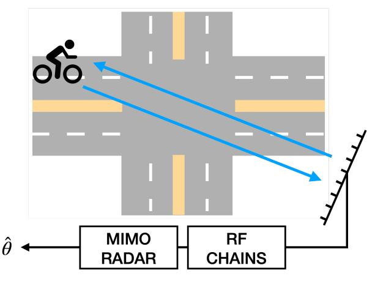
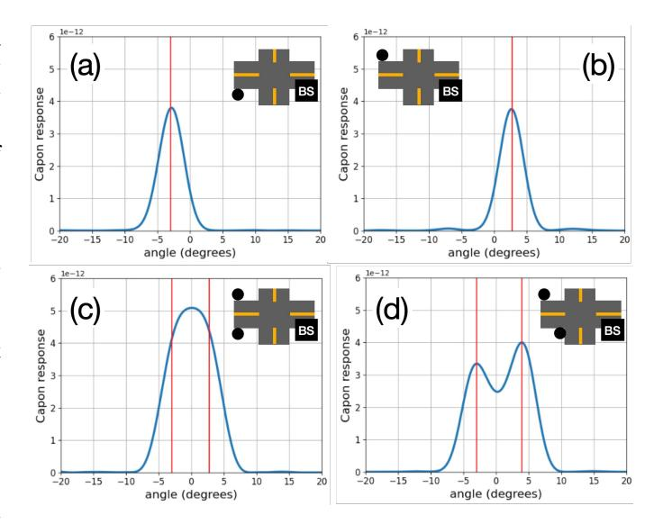
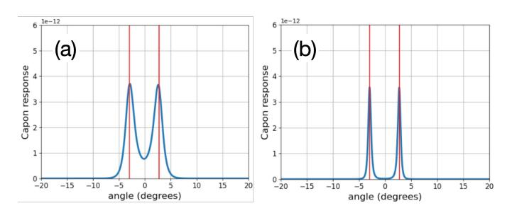
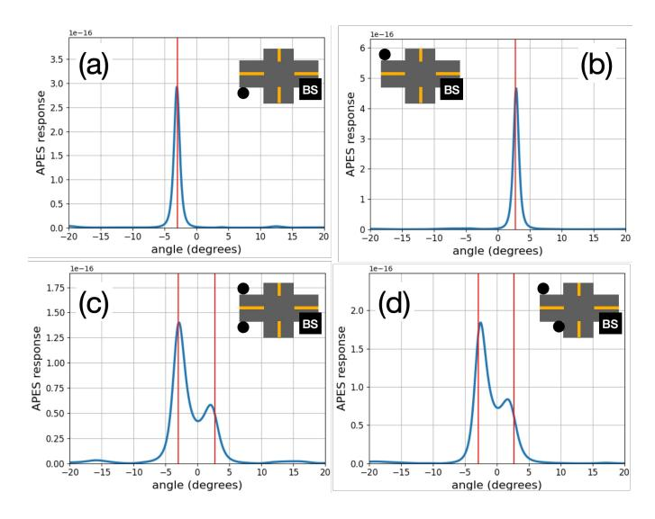
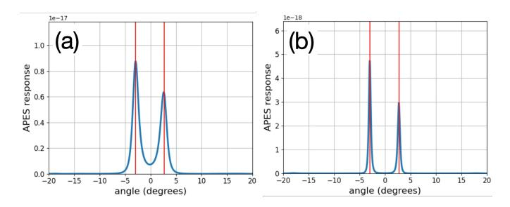
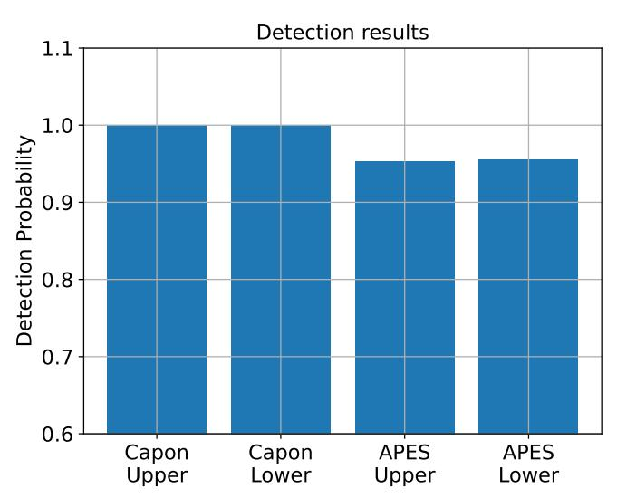
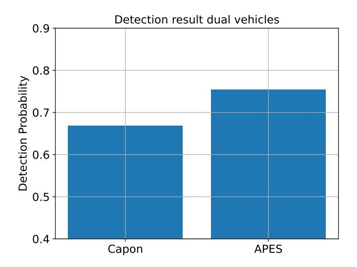

{0}------------------------------------------------

# On the Feasibility of Cyclist Detection Using MIMO-Radar for Long-Range ISAC Scenarios

# Heetae Jin

*Grad. School of Information Science and Technology The University of Osaka* Suita 565-0871, Japan jin@ist.osaka-u.ac.jp

# Akira Uchiyama

*Grad. School of Information Science and Technology The University of Osaka* Suita 565-0871, Japan uchiyama@ist.osaka-u.ac.jp

*Abstract*—The prevalence of personal mobility devices poses growing risks to road safety, particularly at intersections where high-speed entries can lead to accidents. To address this issue, we propose a Multiple Input Multiple Output (MIMO) radarbased cyclist detection method for long-range scenarios. With Integrated Sensing And Communication (ISAC), cellular base stations can now function as radars, offering a cost-effective alternative to systems based on camera and LiDAR. However, long-range operation introduces challenges due to low Signalto-Noise Ratio (SNR). To overcome this limitation, we propose an optimization-based detection using Capon and amplitude and phase estimation (APES) beamforming techniques. The detection method estimates AoA response, detects peaks and determines the presence of targets through a thresholding approach. We evaluate the proposed method through Monte-Carlo simulations in both single and dual target settings. The results demonstrate that Capon provides accurate angle estimation but suffers from limited resolution, whereas APES offers superior resolution at the cost of estimation accuracy.

*Index Terms*—Detection, mmWave, MIMO, Radar, Traffic monitoring

# I. INTRODUCTION

Traffic conditions are becoming diverse. New types of mobility such as autonomous vehicles are enabled by AI and vehicle sensor technologies [1]. Additionally, personal mobility devices let individuals move at high speeds [2]. However, the diverse traffic conditions pose significant safety challenges [3]. For instance, at intersections, some cyclists may unexpectedly enter the path of oncoming vehicles, leading to potential collisions. As such situations frequently occur, it is essential to develop technologies that can inform nearby vehicles and pedestrians about potential threats.

Sensing technology, which provides a position and velocity of objects can be applied to road safety applications. Various modalities such as cameras and LiDAR can be used for sensing [1], [4], [5]. Although these devices provide rich and accurate information, their installation across numerous intersections is cost-prohibitive. Moreover, they require additional processing hardware, further increasing the cost.

With the emergence of Integrated Sensing and Communication (ISAC), cellular base stations can be used for sensing [6]. This approach leverages existing infrastructure, avoiding the high deployment costs of cameras and LiDAR while utilizing the base stations' processing capabilities.

Millimeter-wave (mmWave) Frequency Modulated Continuous Wave (FMCW) is frequently used for sensing due to two key advantages [7]. First, mmWave's high directionality reduces false alarms caused by multipath reflections. Second, the output of FMCW provides distance and velocity information of the target. In [8], the authors proposed an end-to-end simulator for mmWave radar data, which can generate radar signatures of different vehicle types such as regular cars, buses, and motorcycles. They validated their generated data using models trained on the simulated dataset. In [9], the authors proposed a method for pedestrian trajectory tracking. They improved tracking performance by employing techniques such as MUSIC and particle filters.

However, directly using mmWave radar for safety-critical intersection sensing is challenging when base stations are located far from intersections. The long distance causes reflected signals from targets to be significantly attenuated, making them indistinguishable from noise. This limitation in existing methods under low SNR conditions further motivates our approach [8], [9]. As a result, obtaining accurate position information—or even received signals—becomes nearly impossible.

To overcome the challenge of low SNR conditions, we propose a detection method based on Multiple-Input Multiple-Output (MIMO) radar. Especially, we leverage Capon and amplitude and phase estimation (APES), which are datadependent beamforming techniques, as it enables angle estimation for low SNR regime. Our contributions can be summarized as follows:

- We address the low SNR challenge in long-range sensing by employing data-dependent beamforming techniques. Specifically, we adopt Capon and APES detectors to optimize received SNR, and we provide a comparative analysis of their advantages and limitations in our target scenarios.
- We conduct a quantitative evaluation of the proposed methods through various illustrative examples and Monte-Carlo simulations. Based on these results, we identify the operating conditions under which Capon and APES perform effectively.

{1}------------------------------------------------

Fig. 1. Overview of the method.

Fig. 2. Received signal power simulated using WaveFarer

#### II. RADAR BASIC

Radar technology is a fundamental tool in wireless sensing, enabling the estimation of various environmental parameters. This capability is primarily attributed to the availability of complete knowledge regarding the transmitted signal, which allows for a direct comparison with the received signal. By analyzing the distortions between the transmitted and received signals, essential environmental parameters can be inferred.

For instance, a continuous phase difference between the transmitted and received signals over time indicates target motion. This phase difference can be used to estimate the Doppler shift, which is directly related to the target's relative velocity. Similarly, the phase difference between signals received at multiple antennas, which is a function of the angle of arrival (AoA), provides information about the target's direction.

Transmission waveforms in radar systems are typically categorized based on their distance estimation methods, with pulsed and continuous waves being the most common. Pulsed radar, exemplified by Ultra Wide Band (UWB) systems [10], estimates distance based on the delay of the received signal. While this approach offers high distance estimation accuracy, it suffers from severe self-interference between transmitted and received signals, particularly for nearby targets, making them difficult to detect. Conversely, continuous wave (CW) systems can detect targets at any range but exhibit poor distance estimation performance [7].

Frequency Modulated Continuous Wave (FMCW) radar [7], a variant of continuous wave radar, employs chirp signals as its transmission waveform. Upon demodulation, the delayed chirp signal produces a sinusoidal waveform, allowing for target detection through Fast Fourier Transform (FFT) processing. The time axis is divided into two domains: fast time, representing the sampling interval, and slow time, representing the chirp repetition interval. By performing FFT across fast time, slow time, and even across the antenna array, FMCW radar can simultaneously estimate target range, velocity, and AoA. Finally, target detection is typically conducted using the Constant False Alarm Rate (CFAR) technique. [11]

However, detecting targets in low SNR regions is challenging for FMCW radar. Signal detection in such conditions can be achieved with more samples, more number of transmissions, and more antennas. However, the number of samples and antennas is limited by the receiver's hardware. Moreover, increasing the number of transmissions means longer sensing time, which can conflict with the need to allocate sufficient time for communication.

To address the challenges of FMCW radar in low SNR condition, we propose using MIMO radar for AoA estimation under low SNR conditions. MIMO radar offers two significant advantages over traditional FMCW radar.

First, MIMO radar allows for the freedom to design distinct waveforms for each transmitting antenna, optimizing reception performance. While FMCW radar maximizes received power by transmitting identical waveforms across antennas, MIMO radar can optimize the received power by treating the transmitted waveform design as an optimization variable.

Second, the degrees of freedom provided by MIMO radar enhance AoA resolution, allowing it to extract more detailed information. Consequently, we demonstrate the feasibility of target detection under low SNR conditions using the MIMO radar algorithms, Capon and APES, providing a comprehensive performance analysis.

# III. SYSTEM MODEL

We assume that the resources for communication and sensing are independent, ensuring that sensing performance is not degraded by communication signals. As illustrated in Fig. 1, we set the center of the intersection at (0, 0, 0) and place the base station at (x, y, z), located far from the intersection. The target is assumed to be positioned on the opposite side of the intersection relative to the base station. In practical deployment, the base station is located over 200 meters away from the intersection, creating a low Signal-to-Noise Ratio (SNR) scenario for sensing. Fig. 2 illustrates the power of the signal reflected from a cyclist, simulated using the ray

{2}------------------------------------------------

tracing simulator, WaveFarer [12]. Given that the reflected signal power is approximately -185 dBm when transmiting 0 dBm signal while the Equivalent Isotropic Radiated Power (EIRP) is 75 dBm, the resulting SNR is estimated to be around -15 dB with a bandwidth of 100 MHz, which corresponds to a noise power of -94 dBm. Our objective is to estimate the target AoA by utilizing MIMO radar.

The base station is equipped with  $N_t$  transmitting antennas, each emitting mutually independent waveforms, and  $N_r$  receiving antennas. We consider a total of K point targets, each characterized by AoA  $\theta_k$  relative to the base station. Given a monostatic radar sensing scenario, we assume that the AoA and angle of departure (AoD) are identical. Additionally, due to the high directionality of mmWave, we focus solely on direct reflections, neglecting multipath components. The steering vector of a transmitter is

$$\mathbf{a}(\theta) = \left[1 \ e^{j\frac{2\pi d_t \sin \theta}{\lambda}} \ \dots \ e^{j\frac{2\pi (N_r - 1)d_t \sin \theta}{\lambda}}\right]^T \tag{1}$$

and the steering vector of a receiver is

$$\mathbf{b}(\theta) = \left[1 e^{j\frac{2\pi d_T \sin \theta}{\lambda}} \dots e^{j\frac{2\pi (N_T - 1)d_T \sin \theta}{\lambda}}\right]^T, \tag{2}$$

where  $d_t$  and  $d_r$  are the antenna spacing of the transmitter and the receiver, respectively. The received signal of the antenna array is

$$\mathbf{Y} = \sum_{k=1}^{K} \mathbf{H}_k \mathbf{X} + \mathbf{Z},\tag{3}$$

where  $\mathbf{H}_k \in N_r \times N_t$  is the target state matrix,  $\mathbf{X} \in \mathbb{C}^{N_t \times N_s}$  is the transmitting waveform with  $N_s$  symbols, and  $\mathbf{Z} \in \mathbb{C}^{N_r \times N_s}$  is the complex noise which zero mean and unit variance. As we assume that the transmit waveform is independent with each other, the covariance matrix of  $\mathbf{X}$  is identity matrix multiplied positive scalar, which can be expressed as

$$\mathbf{H}_{\mathbf{XX}} = \frac{1}{N_s} \mathbf{XX}^H = \frac{P_T}{N_t} \mathbf{I}_{N_t},\tag{4}$$

where  $P_T$  is the transmit power and  $\mathbf{I}_{N_t}$  is the identity matrix with the size of  $N_t \times N_t$ . The target state matrix can be expressed as

$$\mathbf{H}_k = \alpha_k \mathbf{b}^*(\theta_k) \mathbf{a}^H(\theta_k), \tag{5}$$

where  $\alpha_k$  is the complex gain, reflecting radar cross section (RCS) and the pathloss. After applying receiving beamforming, the response is

$$\mathbf{w}^{H}\mathbf{Y} = \sum_{k=1}^{K} \alpha_{k} \mathbf{w}^{H} \mathbf{b}^{*}(\theta_{k}) \mathbf{a}^{H}(\theta_{k}) \mathbf{X} + \mathbf{w}^{H} \mathbf{Z},$$
(6)

where  $\mathbf{w} \in \mathbb{C}^{N_r}$  is the received beamforming vector. By appropriately defining the objective function and constraints, a beamforming vector suitable for the intended purpose can be obtained through optimization.

#### IV. Low SNR MIMO DETECTION METHODS

Phased array radar has been widely used for its ability to focus signals in a specific direction during transmission and reception. However, because all antennas only control the phase, it is challenging to achieve additional gains through optimization. In contrast, MIMO radar allows independent processing for each antenna. This capability enables beamforming in multiple directions during transmission and provides flexibility in estimation during reception, facilitating more precise and accurate estimations through optimization-based methods.

Therefore, we propose the application of MIMO radar for long-range bicycle detection. Specifically, we demonstrate this using fundamental algorithms in MIMO radar, namely Capon [13] and APES [14]. This section provides an introduction to each of these techniques.

#### A. Capon Beamforming

The Capon beamformer is one of the methods used for target AoA estimation, known for its high resolution and intuitive design of optimization, making it widely adopted [13]. The Capon beamformer can be formulated as

$$\min_{\mathbf{w}} \mathbf{w}^{H} \hat{\mathbf{R}}_{YY} \mathbf{w} 
\text{s.t.} \quad \mathbf{w}^{H} \mathbf{b}(\theta) = 1,$$

where  $\hat{\mathbf{R}}_{\mathbf{YY}}$  is the sample covariance matrix of the received signal which can be expressed as

$$\hat{\mathbf{R}}_{\mathbf{YY}} = \frac{1}{N_{\circ}} \mathbf{YY}^{H}.$$
 (8)

Capon beamformer's objective function when scanning AoA one of the reflecting AoA  $\theta_k$  is

$$\mathbf{w}^{H}\hat{\mathbf{R}}_{\mathbf{YY}}\mathbf{w} = \frac{|\beta|_{2}^{2}\mathbf{a}^{H}(\theta)\mathbf{X}\mathbf{X}^{H}\mathbf{a}(\theta) + \mathbf{w}^{H}\mathbf{R}_{\mathbf{ZZ}}\mathbf{w}}{N_{c}}, \quad (9)$$

The equation (9) can be decomposed into two parts: the signal component and the noise component. In this approach, the beamforming vector does not affect the signal component, which remains constant by the constraint regardless of the beamformer's configuration. This property allows the beamformer to suppress undesired components while preserving the desired signal. In contrast, the noise component varies with the beamforming vector and can be minimized through its proper design. Thus, this method can be interpreted as maximizing the received SNR by minimizing the noise power.

After solving Eq. (7), we can get beamforming vector

$$\hat{\mathbf{w}}_{Capon} = \frac{\hat{\mathbf{R}}_{\mathbf{YY}}^{-1} \mathbf{b}^*(\theta)}{\mathbf{b}^T(\theta) \mathbf{R}_{\mathbf{YY}}^{-1} \mathbf{b}^*(\theta)},\tag{10}$$

and beamforming response is

$$\hat{\beta}_{Capon}(\theta) = \frac{\mathbf{b}^{T}(\theta)\hat{\mathbf{R}}_{\mathbf{YY}}^{-1}\mathbf{Y}\mathbf{X}^{H}\mathbf{a}(\theta)}{N[\mathbf{b}^{T}(\theta)\hat{\mathbf{R}}_{\mathbf{YY}}^{-1}\mathbf{b}^{*}(\theta)][\mathbf{a}^{*}(\theta)\hat{\mathbf{R}}_{\mathbf{XX}}\mathbf{a}(\theta)]}.$$
 (11)

It is worth noting that estimating  $\beta$  after the beamformer optimization is done by Least Squared (LS) estimation process.

{3}------------------------------------------------

The LS method derives its solution under the assumption of a noise-free environment, which leads to severe distortion in low SNR scenarios. In such cases, the beamforming vector may amplify noise, further exacerbating the problem. Therefore, exploring alternative methods that can avoid the limitations of the LS method is also meaningful.

#### *B. APES*

APES estimates the target's angle by optimization of the complex coefficient β resulting from RCS and path loss [14]. Although it does not excel in noise robustness, it remains valuable because the RCS information is critical for target classification. The optimization problem of the APES is

$$\min_{\mathbf{w},\beta} |\mathbf{w}^H \mathbf{Y} - \beta(\theta) \mathbf{a}^H(\theta) \mathbf{X}|_2^2$$
s.t. 
$$\mathbf{w}^H \mathbf{b}(\theta) = 1.$$

Through the objective function of Eq. (12), we observe that it introduces an additional variable compared to Eq. (7), providing a more precise estimate of the complex coefficient. It is important to note that a H(θ) and X are known if we fix θ, as they are determined by the configuration of the radar antenna array and the waveform used in the radar setup.

#### *C. Cyclist Localization via Threshold-Based Angular Analysis*

For target detection, either a Constant False Alarm Rate (CFAR) scheme or a fixed thresholding method can be employed. Since we assume point targets, it is reasonable to consider a single dominant reflection from each target, making the use of a fixed threshold a valid approach.

$$\beta(\theta) \ge \gamma,\tag{13}$$

where γ is the threshold, and we use the accepted θ as estimated value ˆθ. Here, we set γ as 0.1βmax, which is the maximum value among the response. We set the boresight of the antenna array to be the angle bisector between the lines connecting the base station to the upper and lower sides of the road. Accordingly, we can detect which side the targets are by comparing the estimated angles with 0.

# V. SIMULATION RESULTS

This section is composed of two subsections. We present the simulation environment and setup, which explains the position of the entities, and then the results will be illustrated. By presenting detection examples and Monte-Carlo simulations, we validate our methods.

#### *A. Simulation Environment and Setup*

Since the objective of this study is long-range target sensing using ISAC in an intersection environment, we assume that the ISAC base station is located on right-bottom side of the intersection, while the target is on the left-top or leftbottom side, as illustrated in Fig. 1. The positions of the entities are expressed as (x, y, z), where x, y, and z denote the horizontal coordinate, vertical coordinate, and antenna height, respectively. The center of the intersection is defined

Fig. 3. Capon AoA estimation examples

Fig. 4. Capon AoA estimation examples for better SNR cases. (a) -10 dB, (b) 0 dB

as (0, 0, 0), with the base station positioned at (250, −18, 50) and the target located at (x, y, 1).

Given the use of mmWave, we assume the absence of clutter. The antenna array has Nt = Nr = 16 antennas, both arranged as critically spaced uniform linear arrays. We also set the boresight of the antenna array to align with the line formed between the base station position and the point (−279.13, 15, 1). If the estimated angle is greater than or equal to zero, the target is considered to be on the upper side of the road; otherwise, it is considered to be on the lower side.

To reflect path loss and radar cross-section (RCS), we utilized the ray-tracing simulator WaveFarer to obtain these values [12]. Although these values can vary with target position, we use the value of -189 dBm, derived at (−50, 15, 1) as a representative case, given that the changes are negligible due to the long-range nature of the scenario. In accordance with EIRP defined by the Federal Communications Commission (FCC), we assume a transmit power of 75 dBm. The bandwidth is 100 MHz, and corresponding the noise power is -94 dBm.

### *B. Simulation Results*

*1) Cases Studies:* We begin by presenting example results of AoA estimation to examine both the effectiveness and limitations of the proposed method. For every figures, the red

{4}------------------------------------------------

Fig. 5. APES AoA estimation examples

Fig. 6. APES AoA estimation examples for better SNR cases. (a) -10 dB, (b) 0 dB

lines are the ground truth of the targets. Fig. 3 shows the angle estimation results for four different cases. In fig. 3(a) and (b), we observe that when there is only one user, the system can estimate the angle with a fairly high level of precision. Based on this configuration, we can determine whether the estimated angle is positive or negative relative to  $0^{\circ}$ , allowing us to infer which side of the intersection the cyclist is located on. These results indicate that in a free intersection with single bicycle user, the proposed system performs well.

Fig. 3(c) and Fig. 3(d) show the AoA response when there are two cyclists. In the case of Fig. 3(d), where the users are sufficiently separated, distinct peaks appear in the AoA response, allowing us to clearly distinguish the two cyclists. However, in Fig. 3(c), the reflected signals from the two cyclists are not resolved, caused by a resolution limitation under low SNR conditions. The Capon beamformer estimates the arrival angle based on the received signal, and when the noise level is high, it fails to precisely localize the signal direction. This is because noise spreads across all directions in the angular domain. This is further illustrated in Fig. 4. Fig. 4(a) and Fig. 4(b) show the AoA estimation results for the same placement of the cyclists as Fig. 3(c) but different SNRs of -10 dB and 0 dB, respectively, where we can see that the beam width is significantly narrower at higher SNR.

Fig. 7. Detection results for single target detections

Fig. 5 present the results obtained using the APES beamformer, with scenarios identical to those shown for the Capon beamformer. Based on these figures, we observe that APES provides higher angular resolution than Capon. In particular, Fig. 5(c) shows that APES is able to distinguish the two users that Capon failed to resolve. The difference in resolution between APES and Capon under noisy conditions arises from the distinction in their optimization strategies. The primary goal of Capon is to minimize noise power. However, even with beamforming that effectively suppresses noise, there is residual noise amplified by the LS-based AoA estimation. Thus, in low SNR scenarios, the influence of noise can be significant. In contrast, APES estimates the AoA versus amplitude response through an optimization procedure, which results in better angular resolution compared to the LS-based approach.

Although APES provides high resolution, it exhibits a different type of limitation. Fig. 5(d) reveals that APES exhibits inferior accuracy in angle estimation compared to Capon, as the peaks of the response are not align with the ture AoA. As APES minimizes the difference between the estimated and true values, it introduces bias in low SNR case. We observe from Fig. 6 that the bias tends to increase as the noise level rises. This indicates that the residual noise in the APES optimization formulation contributes to the generation of this bias.

2) Monte-Carlo simulations: We present the results of a Monte-Carlo simulation to evaluate the performance of the proposed detector. Fig. 7 shows the detection outcomes when

TABLE I
STATISTICAL RESULT OF MONTE-CARLO SIMULATION FOR SINGLE
TARGET CASES

|       | Mean                   | Standard deviation |
|-------|------------------------|--------------------|
| Capon | $4.523 \times 10^{-5}$ | 0.0020             |
| APES  | $1.789 \times 10^{-3}$ | 0.2253             |

{5}------------------------------------------------

Fig. 8. Detection results for dual target detections

there is a single target, using both Capon and APES. We define the cases where the target is located on the upper side of the road as "Upper" and the lower side as "Lower", each evaluated over 1,000 trials. The target's vertical position was sampled from a uniform random variable ranging from -50 to 0.

We observe that Capon consistently detects the presence of the target regardless of its side, demonstrating high reliability. In contrast, APES achieves approximately 95% accuracy. This reduction in performance is attributed to the less accurate angle estimates produced by APES compared to Capon. This behavior is further quantified in Table I, which presents the mean and standard deviation of estimation errors over all Monte-Carlo trials. APES exhibits both mean and standard deviation values approximately 100 times larger than those of Capon, indicating that estimation errors become more pronounced when the estimated value approaches the threshold.

Fig. 8 shows the detection results using Capon and APES beamforming when there are two targets. In this Monte-Carlo simulation, which was repeated 1000 times, two targets were randomly generated. The horizontal coordinates were sampled from a uniform random variable in the range of -50 to 0, and the vertical coordinate of each target was randomly chosen between -15 and 15.

The simulation results indicate that the APES-based method yields superior detection performance. This is attributed to the nature of the APES optimization, which also estimates the reflection coefficients of the signals. The improved resolution of APES enables the separation of two closely spaced targets in terms of angle, thereby outperforming the Capon-based method in such scenarios. However, since APES does not always provide accurate angle estimates, some degradation in performance is observed.

#### VI. CONCLUSION AND FUTURE WORK

In this paper, we proposed a method for detecting cyclists under low SNR conditions. To inform vehicles of a cyclist's location, we introduced radar sensing based on ISAC base stations. We highlighted that the long distance between the ISAC base station and the intersection often leads to low SNR conditions, emphasizing the need for methods that remain effective under such challenging environments. To address this, we employed MIMO radar techniques—specifically, Capon and APES beamformers—to estimate the AoA of the target.

The proposed methods showed strong performance in single-target scenarios. However, each approach has limitations. Capon suffers from reduced angular resolution under low SNR, leading to challenges in multi-target detection. On the other hand, although APES maintains better resolution, it exhibits bias in the estimated angles, which can be problematic for applications requiring high-precision sensing.

As a future work, we aim to develop methods that enhance angular resolution while reducing estimation bias. To this end, we plan to leverage the fact that the angular distribution of targets is constrained by the scenario. This opens possibilities to explore solutions such as transmit beamforming and Bayesian estimation approaches.

#### ACKNOWLEDGMENT

These research results were obtained from the commissioned research (No. JPJ012368C08701) by National Institute of Information and Communications Technology (NICT), Japan.

#### REFERENCES

- P. Sun et al., "Scalability in perception for autonomous driving: Waymo open dataset," in Proc. IEEE/CVF Conf. Comput. Vis. Pattern Recognit. (CVPR), Seattle, WA, USA, 2020, pp. 2443–2451.
- [2] S. Boglietti, B. Barabino, and G. Maternini, "Survey on e-powered micro personal mobility vehicles: Exploring current issues towards future developments," Sustainability, vol. 13, no. 7, p. 3692, 2021.
- [3] J. Zagorskas and M. Burinskienė, "Challenges caused by increased use of e-powered personal mobility vehicles in European cities," *Sustainability*, vol. 12, no. 1, p. 273, 2019.
- [4] D.H. Paek, S.H. Kong, and K. T. Wijaya, "K-radar: 4D radar object detection for autonomous driving in various weather conditions," Adv. Neural Inf. Process. Syst., vol. 35, pp. 3819–3829, 2022.
- [5] J. Rebut et al., "Raw high-definition radar for multi-task learning," in Proc. IEEE/CVF Conf. Comput. Vis. Pattern Recognit. (CVPR), 2022.
- [6] F. Liu et al., "Integrated sensing and communications: Toward dual-functional wireless networks for 6G and beyond," IEEE J. Sel. Areas Commun., vol. 40, no. 6, pp. 1728–1767, Jun. 2022.
- [7] M. A. Richards, Fundamentals of Radar Signal Processing, vol. 1. New York, NY, USA: McGraw-Hill, 2005.
- [8] M. Zong, Z. Zhu, and H. Wang, "A simulation method for millimeterwave radar sensing in traffic intersection based on bidirectional analytical ray-tracing algorithm," *IEEE Sensors J.*, vol. 23, no. 13, pp. 14276–14284, Jul. 2023.
- [9] X. Fang, J. Li, Z. Zhang, and G. Xiao, "FMCW-MIMO radar-based pedestrian trajectory tracking under low-observable environments," *IEEE Sensors J.*, vol. 22, no. 20, pp. 19675–19687, Oct. 2022.
- [10] J.H. Choi, J.E. Kim, and K.-T. Kim, "People counting using IR-UWB radar sensor in a wide area," *IEEE Internet Things J.*, vol. 8, no. 7, pp. 5806–5821, Apr. 2021.
- [11] I. S. Reed and X. Yu, "Adaptive multiple-band CFAR detection of an optical pattern with unknown spectral distribution," *IEEE Trans. Acoust.*, *Speech, Signal Process.*, vol. 38, no. 10, pp. 1760–1770, Oct. 1990.
- [12] WaveFarer Reference Manual, Remcom, State College, PA, USA, Nov. 2020.
- [13] J. Capon, "High-resolution frequency-wavenumber spectrum analysis," Proc. IEEE, vol. 57, no. 8, pp. 1408–1418, Aug. 1969.
- [14] P. Stoica, H. Li, and J. Li, "A new derivation of the APES filter," *IEEE Signal Process. Lett.*, vol. 6, no. 8, pp. 205–206, Aug. 1999.