{0}------------------------------------------------

# Integration of Sensing and Communication in a W-Band Fiber-Wireless Link Enabled by Electromagnetic Polarization Multiplexing

Mingzheng Lei , Min Zhu, Member, IEEE, Yuancheng Cai, Member, IEEE, Miaomiao Fang, Wei Luo, Jiao Zhang, Member, IEEE, Bingchang Hua, Member, IEEE, Yucong Zou, Xiang Liu, Weidong Tong, and Jianjun Yu, Fellow, IEEE

Abstract—The coexistence needs of sensing and communication in millimeter-wave (mmW) bands have urgently driven the seamless integration of sensing and communication in the upcoming mmW era. However, the time-frequency competition between the two functions makes it difficult to accommodate both high sensing resolution and large communication capacity. In this article, we have designed a W-band fiber-wireless link with the integrated sensing and communication functions enabled by electromagnetic polarization multiplexing. The ultra-wideband fiber-wireless link in W band is enabled by the asymmetrical single-sideband modulation along with the optical heterodyne up-conversion. The electromagnetic polarization multiplexing allocates the sensing and communication functions on two orthogonal electromagnetic polarizations, respectively. Thus, all time-frequency resources of the fiber-wireless link can simultaneously serve these two functions without any resource competition, contributing to an ultra-high spatial resolution and an ultra-large data capacity at the same time. Our experimental results show the spatial resolution of up to 15  $\,\mathrm{mm}$ and data rate as high as 92 Gbit/s were simultaneously realized in W band after delivering over a 10.8-m wireless distance. The overall improvement of both the sensing and communication performance, to the best of our knowledge, led to a record capacity-resolution quotient of 61.333 Gbit/s/cm. In addition, we have qualitatively investigated the integrated sensing and communication fiber-wireless link, in terms of the carrier frequency, system bandwidth, multimmW access, and electromagnetic polarization crosstalk.

Manuscript received 15 December 2022; revised 6 May 2023; accepted 23 May 2023. Date of publication 26 May 2023; date of current version 2 December 2023. This work was supported in part by the National Natural Science Foundation of China under Grants 62201393 and 62201397, in part by the Natural Science Foundation of Jiangsu Province under Grants BK20220210 and BK20221194, in part by the Open Fund of IPOC (BUPT) under Grant IPOC2021A01, and in part by the Major Key Project of Peng Cheng Laboratory under Grant PCL2021A01-2. (Corresponding author: Min Zhu.)

Mingzheng Lei, Bingchang Hua, and Yucong Zou are with the Purple Mountain Laboratories, Nanjing, Jiangsu 211111, China (e-mail: mingzhenglei@bupt. cn; huabingchang@pmlabs.com.cn; zouyucong@pmlabs.com.cn).

Min Zhu, Yuancheng Cai, Miaomiao Fang, Wei Luo, Jiao Zhang, Xiang Liu, and Weidong Tong are with the Purple Mountain Laboratories, Nanjing, Jiangsu 211111, China, and also with the National Mobile Communications Research Laboratory, Southeast University, Nanjing 210096, China (e-mail: minzhu@seu.edu.cn; caiyuancheng@pmlabs.com.cn; mmfang@seu.edu.cn; wluo@seu.edu.cn; jiaozhang@seu.edu.cn; xianglliu@seu.edu.cn; weidongtong@seu.edu.cn).

Jianjun Yu is with the Purple Mountain Laboratories, Nanjing, Jiangsu 211111, China, and also with the Key Laboratory for Information Science of Electromagnetic Waves, Fudan University, Shanghai 200433, China (e-mail: jianjun@fudan.edu.cn).

Color versions of one or more figures in this article are available at https://doi.org/10.1109/JLT.2023.3280388.

Digital Object Identifier 10.1109/JLT.2023.3280388

Index Terms—LFM, microwave photonics, mmW, photonics-assisted wireless communication, radar sensing.

#### I. Introduction

HE depletion of frequency resources below 6 GHz has driven mobile communications to develop into millimeterwave (mmW) bands due to the sufficient available bandwidth. Recently, mmW radar has been widely used in industry, for example, the 77-GHz vehicular radar for intelligent driving [1]. The coexistence of the mmW radar and mobile communication, as well as the emerging intelligent applications have greatly promoted the integration of sensing and communication in mmW bands. Compared with the independent mmW radar or communication systems, the integrated sensing and communication (ISAC) system not only can reduce the overall complexity, but also greatly facilitate the unified and intelligent allocation of software and hardware resources [2].

For mmW applications, photonics-assisted techniques have shown many potentials compared with conventional electronic ones [3]. On the one hand, it is easy to obtain mmW signals with ultra-high frequency and large bandwidth using photonic up-conversion. On the other hand, the ultra-low loss of photonic links can facilitate the distributed deployment of mmW signals indoors. Consequently, various photonics-assisted mmW radars [4], [5], [6], [7], [8], [9], [10], [11], [12] and mmW communication systems [13], [14], [15], [16], [17], [18], [19], [20], [21], [22] have been demonstrated. The radial resolution was up to sub-centimeter level using an optical frequency shifting loop with a total 18.2-GHz bandwidth [10]. The wireless rate was as high as 432 Gbit/s in W band using a multiple-input multipleoutput architecture [16]. Fig. 1 gives an application scenario for centralized management of intelligent factories enabled by the photonics-assisted mmW techniques. In this scenario, the interconnection between the centralized monitoring site (i.e., center office) and each workshop is realized by the photonics-assisted mmW links. In each workshop (i.e., intelligent factory), the commands are transmitted through the mmW communication. Meanwhile, the operation status is accurately monitored by the mmW radar. Nonetheless, the existing works in [3], [4], [5], [6], [7], [8], [9], [10], [11], [12], [13], [14], [15], [16], [17], [18], [19], [20], [21], [22] relate to the photonic mmW links only realized one of the radar or communication function.

0733-8724 © 2023 IEEE. Personal use is permitted, but republication/redistribution requires IEEE permission. See https://www.ieee.org/publications/rights/index.html for more information.

{1}------------------------------------------------

Fig. 1. Application of photonics-assisted mmW techniques in centralized intelligent factories.

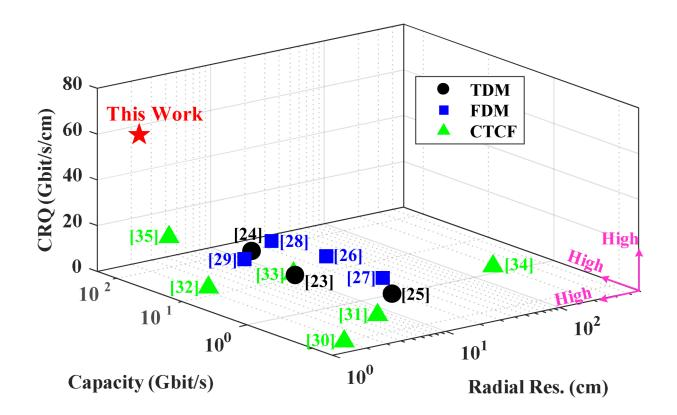

Fig. 2. Research results of typical photonics-assisted JRC works.

To integrate radar and communication functions in mmW bands, many photonics-assisted joint radar and communication (JRC) systems have been reported in recent two years, using time-division multiplexing (TDM) [\[23\],](#page-9-0) [\[24\],](#page-9-0) [\[25\],](#page-9-0) frequencydivision multiplexing (FDM) [\[26\],](#page-9-0) [\[27\],](#page-9-0) [\[28\],](#page-9-0) [\[29\],](#page-9-0) and cotime and co-frequency (CTCF) mechanisms [\[30\],](#page-9-0) [\[31\],](#page-9-0) [\[32\],](#page-9-0) [\[33\],](#page-10-0) [\[34\],](#page-10-0) [\[35\].](#page-10-0) Fig. 2 summarizes these existing photonicsassisted JRC links, in terms of the waveform mode, radar resolution, communication capacity, and capacity-resolution quotient (CRQ). Here, the CRQ is defined as the ratio of wireless rate to radial resolution (A more detailed explanation will be given in the next section).

The TDM mechanism arranges radar and communication waveforms in different time slots to share the limited operating bandwidth of the JRC systems. In [\[23\],](#page-9-0) a W-band JRC system using frequency quadrupling was presented. By balancing the time slots for radar and communication, a 10-cm radial resolution and a 10-Gbit/s communication rate were achieved. To improve the communication rate, the frequency quadrupling was replaced by coherent up-conversion to obtain higher modulation bandwidth [\[24\].](#page-9-0) Despite the communication rate was increased to 46.55 Gbit/s using advanced digital signal processing (DSP), the radial resolution remained unchanged. For higher carrier frequency, a 300-GHz band JRC system using an uni-travelingcarrier photodiode was reported in [\[25\].](#page-9-0) However, the radial resolution and data rate were respectively limited to only 19 cm and 1 Gbit/s, resulting in a CRQ of only 0.0526 Gbit/s/cm.

The FDM mechanism arranges radar and communication waveforms in different frequency bands to avoid the service interruptions. In our previous work [\[26\],](#page-9-0) a 28-GHz band JRC system based on polarization interleaving and polarizationinsensitive filtering was reported. The communication rate reached 23 Gbit/s, but the radial resolution was only 30 cm due to the bandwidth competition. In a W-band JRC system with more available bandwidth [\[27\],](#page-9-0) despite the communication capacity was improved to 78 Gbit/s using sophisticated DSP, the measured radial resolution was merely improved to 20 cm. To flexibly allocate the bandwidth resource for the two functions, a W-band JRC network with adaptive waveforms was put forward in [\[28\].](#page-9-0) When the access rate was switched from 5.98 to 32.34 Gbit/s, the radial resolution was correspondingly deteriorated from 1.86 to 6.94 cm. For multi-user communication, non-orthogonal multiple access was adopted in a 100-GHz JRC system [\[29\].](#page-9-0) However, the low data rate and poor radial resolution limited the CRQ to only 0.104 Gbit/s/cm.

The CTCF mechanism usually achieves the two functions using integrated waveforms, which can ensure uninterrupted services and avoid the mutual interference between the radar and communication frequency bands. In [\[30\],](#page-9-0) a K-band ISAC method was reported by simply encoding the radar waveform with an amplitude-shift keying signal. Even though the radial resolution was up to 1.9 cm, the communication capacity was only 0.1 Gbit/s due to the binary amplitude modulation. To increase the modulation order, two-channel data fusion was used in [\[31\],](#page-9-0) but the communication capacity was slightly improved to 0.3356 Gbit/s. To further improve the overall performance, the radial resolution and communication capacity were respectively boosted to 8 Gbit/s and 1.5 cm using angle modulation [\[32\].](#page-9-0) In our previous work, we balanced the radar and communication performance by encoding a DC-offset QPSK signal on a linear frequency-modulated continuous wave (LFMCW) [\[33\].](#page-10-0) In [\[34\],](#page-10-0) an orthogonal frequency-division multiplexing (OFDM) waveform was used to achieve the two functions in Ka band for better compatibility with commercial communication networks. However, the CRQ only reached 0.008 Gbit/s/cm due to the limited data rate and poor radial resolution. In [\[35\],](#page-10-0) a tunable K/W-band OFDM ISAC system was proposed based on optoelectronic oscillation. The radial resolution and data rate were improved to 1.5 cm and 32 Gbit/s in W band, leading to a CRQ of 21.333 Gbit/s/cm.

Given the above, the time-frequency competition or the limitation of integrated waveforms makes it more difficult to simultaneously obtain ultra-high radar resolution and ultra-large communication capacity. In this work, we integrate the sensing and communication in a W-band fiber-wireless link based on

{2}------------------------------------------------

Fig. 3. Architecture of our proposed mmW fiber-wireless link with ISAC. DSP: digital signal processing, D/A: digital-to-analog convention, ECL: external cavity laser, I/Q: I/Q modulator, EDFA: erbium-doped fiber amplifier, MOF: multi-channel optical filter, OC: optical coupler, PC: polarization controller, PBC: polarization beam combiner, SMF: single-mode fiber, PD: photodetector, LNA, low noise amplifier, OMT: orthomode transducer, LCA: lens corrected antenna, HM: harmonic mixer, RF: radio frequency clock, EA: electrical amplifier, D/C: down-convention, A/D: analog-to-digital convention.

electromagnetic polarization multiplexing. It is an extension of our OFC paper [36]. The ultra-wideband sensing and communication waveforms in W-band are obtained by the asymmetrical single-sideband (ASSB) modulation along with the optical heterodyne up-conversion. The electromagnetic polarization multiplexing enables the radar and communication to operate in a CTCF mode without any time-frequency competition using two orthogonal electromagnetic polarizations. Thus, all timefrequency resources of the ultra-wideband fiber-wireless link can be independently and simultaneously assigned to these two functions, facilitating an ultra-high spatial resolution and an ultra-high data rate at the same time. The proof-of-concept experimental results demonstrate that a 23-GHz bandwidth LFMCW and a 23-GBaud 16QAM signal were successfully generated in a CTCF mode and transmitted over a wireless distance of 10.8 m. The ultra-wideband CTCF signals in W band contributed to a spatial resolution of up to 15 mm and a data rate as high as 92 Gbit/s, resulting in a record CRQ of 61.333 Gbit/s/cm. Additionally, we have also qualitatively investigated the carrier frequency, system bandwidth, multimmW access, and electromagnetic polarization crosstalk for the proposed W-Band ISAC link.

#### II. LINK ARCHITECTURE AND PRINCIPLE

#### A. mmW ISAC Transmitter

Fig. 3 shows the architecture of our proposed ISAC in a mmW fiber-wireless link enabled by electromagnetic polarization multiplexing. The link is mainly composed of an ISAC transmitter (ISAC Tx), a sensing receiver (Sen. Rx), and a communication receiver (Com. Rx). In the ISAC transmitter, the ISAC signal to be transmitted is generated by a software-defined DSP routine followed by the digital-to-analog convention (D/A). To make full use of the D/A bandwidth, the sensing and communication signals occupy opposite frequency ranges in digital domain. Mathematically, the digital ISAC signal can be expressed as

$$E(t)_{IQ} = A_s s(t) e^{j\omega_s t} + A_c c(t) e^{-j\omega_c t}, \qquad (1)$$

where s(t)/c(t) is the baseband sensing/communication signal;  $A_s/A_c$  is the amplitude of the digital sensing/communication

signal;  $\omega_s/\omega_c$  is the central angular frequency of the digital sensing/communication signal.

After the D/A, two analog signals corresponding to the real and imaginary parts of the digital ISAC signal are obtained, which can be expressed as

$$E(t)_{I} = real \left[ A_{s}s(t)e^{j\omega_{s}t} + A_{c}c(t)e^{-j\omega_{c}t} \right], \qquad (2)$$

$$E(t)_{O} = imag \left[ A_{s}s(t)e^{j\omega_{s}t} + A_{c}c(t)e^{-j\omega_{c}t} \right].$$
 (3)

Then, the pair of analog signals are modulated on a linearly polarized lightwave (marked as LS) from an external cavity laser (ECL1) via an in-phase/quadrature modulator (I/Q MOD). By appropriately biasing the I/Q MOD, two asymmetrical optical SSB signals (i.e., the Sen-OSB and Com-OSB) centered on the LS can be obtained [26]. The two sidebands are first boosted by an erbium-doped fiber amplifier (EDFA) and further separated by a multi-channel optical filter (MOF). The separated Sen-OSB is combined with an optical local oscillation (LO1) emitted from the ECL2 via an optical coupler (OC1) for sensing. Meanwhile, the separated Com-OSB is coupled with the LO2 from the ECL3 via the OC2 for communication. The pair of coupled signals can be written as

$$E(t)_{Sen} \propto \frac{A_1 A_s \pi}{n_s} s(t) e^{j(\omega_1 + \omega_s)t} + A_2 e^{j\omega_2 t}, \tag{4}$$

$$E(t)_{Com} \propto \frac{A_1 A_c \pi}{v_{\pi}} c(t) e^{j(\omega_1 - \omega_c)t} + A_3 e^{j\omega_3 t}, \qquad (5)$$

where  $v_{\pi}$  is the half-wave voltage of the I/Q MOD;  $A_1$ ,  $A_2$ , and  $A_3$  represents the amplitudes of the three ECLs, respectively;  $\omega_1$ ,  $\omega_2$ , and  $\omega_3$  are the angular frequencies of the three ECLs, respectively.

The pair of optical signals are finally delivered in parallel to a remote unit (RU) through their corresponding single-mode fibers (i.e., the SMF1 and SMF2). Notably, only one SMF will be required by shifting the LO lasers and MOF to the RU. However, the overall cost will heavily increase, because massive RUs will be distributed in a mmW network due to the severe atmospheric attenuation. In addition, the two SMFs can also be replaced by only one multi-core fiber. At the remote node, a mmW sensing signal can be generated by beating the Sen-OSB with the LO1 via a photodetector (PD1) in the horizontal path

{3}------------------------------------------------

(H-path). Meanwhile, a mmW communication signal can also be obtained by beating the Com-OSB with the LO2 via the PD2 in the vertical path (V-path). The two mmW signals can be formulated as

$$i(t)_{Sen} \propto \frac{A_1 A_2 A_s \pi}{v_{\pi}} s(t) \cos[\omega_2 - (\omega_1 + \omega_s)],$$
 (6)

$$i(t)_{Com} \propto \frac{A_1 A_3 A_c \pi}{v_{\pi}} c(t) \cos[\omega_3 - (\omega_1 - \omega_c)].$$
 (7)

From (6) and (7), the mmW carrier frequencies can be flexibly tuned by jointly manipulating the three ECLs and the Tx DSP routine. The resulting mmW signals are first boosted by two low noise amplifiers (LNAs), and then polarization-multiplexed in electromagnetic dimension (i.e., the H-polarization and V-polarization) through a mmW orthomode transducer (OMT1). The electromagnetically multiplexed mmW ISAC signal can be given by

$$i(t)_{ISAC} \propto i(t)_{Sen} \vec{H} + i(t)_{Com} \vec{V}.$$
 (8)

Thanks to the orthogonal electromagnetic polarizations, the sensing signal can be independent of the communication signal in time-frequency dimension. Thus, the sensing and communication signals can transmit in a CTCF mode. The generated CTCF ISAC signal is finally radiated to user terminals (UEs) via a lens corrected antenna (LCA1).

#### B. mmW Radar and Communication Receivers

For the radiated mmW ISAC signal, one part is received by the communication receiver integrated inside the UEs, and the other part is reflected back to the sensing receiver co-located with the transmitting end. The sensing receiver has the same structure as the communication one, while the outputs of the two OMTs (i.e., the OMT2 and OMT3) are of the orthogonal electromagnetic polarization directions, as shown in Fig. 3.

The mmW sensing/communication signal received by the receiver antenna is first polarization-filtered by the internal OMT. For the upstream mmW sensing echo, the OMT2 extracts the sensing signal in the H-polarization. For the downstream mmW signal, the OMT3 picks up the communication signal in the V-polarization instead. Owing to the high electromagnetic polarization isolation, the sensing signal has hardly any interference with the communication signal. The filtered signals are then down-converted to the intermediate frequency (IF) band by frequency down-conversion (D/C). The down-converted signals are further power-compensated by an electrical amplifier (EA) and digitized by analog-to-digital convention (A/D) for final offline DSP.

For the mmW ISAC system, both the transmission and reception can operate in a CTCF mode using electromagnetic polarization multiplexing. Therefore, all time-frequency resources of the fiber-wireless link can be used for sensing and communication at the same time without competition. For the sensing function, the radial resolution gets better as the sensing bandwidth  $(B_{Sen})$  increases according to the

$$\delta_{Sen} \propto \frac{c}{2B_{Sen}}.$$
 (9)

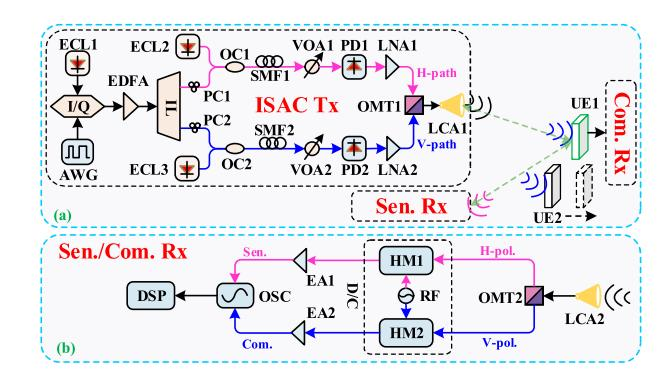

Fig. 4. (a) Experimental set-up of our proposed W-band fiber-wireless link with ISAC; (b) topology of the sensing and commination receivers. AWG: arbitrary waveform generator, ECL: external cavity laser, I/Q: I/Q modulator, EDFA: erbium-doped fiber amplifier, IL: interleaver, PC: polarization controller, OC: optical coupler, SMF: single-mode fiber, VOA: variable optical attenuator, PD: photodetector, LNA, low noise amplifier, OMT: orthomode transducer, LCA: lens corrected antenna, UE, user terminal, HM: harmonic mixer, RF: radio frequency clock, EA: electrical amplifier, OSC: oscilloscope, DSP: digital signal processing.

Given communication signal-to-noise ratio  $(SNR_{Com})$ , the channel capacity is positively correlated with the communication bandwidth  $(B_{Com})$ , as formulated by

$$C_{Com} = B_{Com} \log_2(1 + SNR_{Com}). \tag{10}$$

Hence, it is desired to design an ISAC system that has both high sensing resolution and large communication capacity. To characterize the overall performance for the ISAC system, we defined a CRQ value, which is proportional to both the sensing and communication bandwidths, as expressed by

$$CRQ \propto \frac{C_{Com}}{\delta_{Sen}} = \frac{2\log_2(1 + SNR_{Com})}{c} B_{Com} B_{Sen}.$$
 (11)

As can be seen, the CRQ gets larger with the increase of sensing or communication bandwidths. Besides, the CRQ generally outlines the bandwidth competition principle of an ISAC link with the limited bandwidth. In particular, for our proposed mmW fiber-wireless ISAC link, because the time-frequency competition is avoided via the electromagnetic polarization multiplexing, the ultra-high spatial resolution and ultra-large communication capacity can be satisfied simultaneously, thus leading to an incredible CRQ.

#### III. EXPERIMENTAL SET-UP AND RESULTS

#### A. W-Band ISAC Signals Generation and Reception

Fig. 4(a) illustrates the experimental set-up of our proposed W-band fiber-wireless link with ISAC. In the ISAC transmitter, the digital ISAC signal to be delivered were generated offline and then converted into a pair of analog IF signals with orthogonal phases by an arbitrary waveform generator (AWG) operating at 92 GSa/s. Initially, the digital sensing signal was a LFMCW with a carrier frequency of 10 GHz and a bandwidth of 11.5 GHz. The digital communication signal was a 11.5-GBaud 16QAM signal centered at -10 GHz. The average QAM-to-LFM amplitude ratio (QLAR) was fixed at 2.88 after the pulse shaping. The I/Q

{4}------------------------------------------------

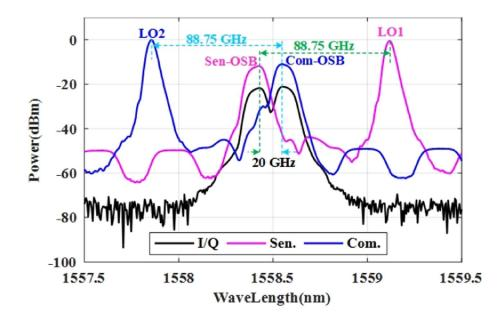

Fig. 5. Optical spectra at the output of the I/Q MOD (black), SMF1 (pink), and SMF2 (blue).

MOD was automatically biased to implement ASSB modulation for loading the analog IF ISAC signals on the LS fixed at 14.4 dBm and 1558.492 nm. Accordingly, two sidebands (i.e., the Sen-OSB and Com-OSB) spaced by about 20 GHz were observed at the output of the I/Q MOD, as shown by the black line in Fig. 5. The two sidebands were boosted to about 10 dBm by an EDFA and then separated by a 25-GHz interleaver (IL). To operate at W band, the LO1 and LO2 were initially set at 1559.122 nm and 1557.862 nm, respectively. The power of the two LOs was 4 dB lower than the LS, given the electro-optic modulation loss. Moreover, the linewidth of all three ECLs is less than 100 kHz. Due to the length limitation of the available SMF in our laboratory, the length of the two SMFs delivering the optical sensing and communication signals to a remote unit was 50 m and 100 m, respectively.

After the SMF, the optical power into each 100-GHz PD was attenuated to 4 dBm by respective variable optical attenuator (VOA). The measured optical spectra for the sensing and communication were shown as the pink and blue lines in Fig. 5, respectively. The wavelength space between the LO1/LO2 and Sen-OSB/Com-OSB was calculated to be about 0.70 nm. Thus, a mmW LFMCW and 16QAM signal both centered at about 87.5 GHz will be generated in the H-path and V-path, respectively. Notably, two polarization controllers (PCs) before the two OCs were applied to match the polarizations for maximizing the output mmW power. The generated mmW signals were first boosted by about 35 dB using respective LNA, then polarizationmultiplexed in electromagnetic dimension by the OMT1 which has a typical electromagnetic polarization isolation of over 30 dB, and finally radiated into the free space via the LCA1 with a gain of 30 dBi.

Reflected by the UEs, the upstream mmW echoes were received by the sensing receiver via the LCA2, as illustrated in Fig. [4\(b\).](#page-3-0) The antennas of the sensing receiver and ISAC transmitter (i.e., the LCA2 and LCA1) were placed side by side at a transverse interval of 32 cm, as shown in Fig. 6(a). Then the upstream echoes for sensing were polarization-filtered by the OMT2. According to the principle mentioned in Section [II,](#page-2-0) only the mmW sensing signals are output at the H-polarization port of the OMT2, and down-converted into IF band by the HM1. Due to the polarization crosstalk, a fraction of the mmW echoes leak into another branch of the OMT2 (i.e., V-polarization port). To monitor the polarization crosstalk, the mmW echoes from the

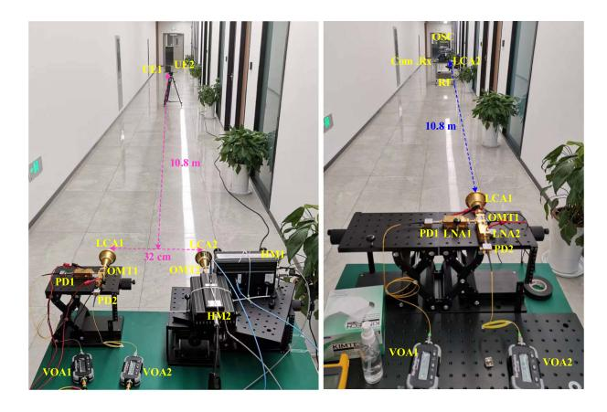

Fig. 6. Photographs of (a) sensing and (b) communication scenes.

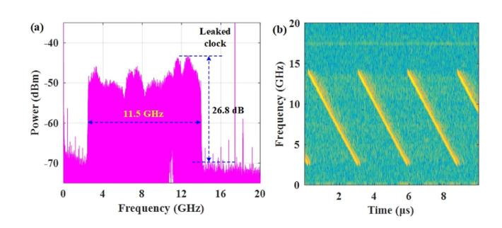

Fig. 7. (a) Frequency spectrum and (b) time-frequency characteristic of the down-converted H-polarization radar echo at 87.5 GHz.

V-polarization port were also down-converted into IF band by the HM2. Each of the HM integrated a ×6 frequency multiplier chain and operated with the same RF.

The downstream mmW signals were received by the communication receiver via the LCA2, which was located about 10.8 m away from the ISAC transmitter, as shown in Fig. 6(b). The communication receiver had the same structure as the sensing one. Then the downstream signals for communication were also polarization-detected by the OMT2, and further down-converted into IF band by the two HMs. Different from the sensing process, the down-converted IF signals from the H-polarization port were used for monitoring the polarization crosstalk instead.

The obtained IF signals in both the sensing and communication receivers were power-compensated by about 26 dB and finally digitized by a multichannel oscilloscope (OSC) for further signal processing via offline DSP.

### *B. System Performance Vs. Carrier Frequency*

First, we tested the sensing performance in a single-user scenario. A metal plate serving as the UE1 was placed about 10.8 m away from the perpendicular bisector of the LCA1 and LCA2, as shown in Fig. 6(a). The RF was operated at 16 GHz, thus the down-converted sensing echo in the H-polarization was centered at about 16 × 6–87.5 = 8.5 GHz, as shown in Fig. 7(a). The measured peak power is more than 26 dB higher than the noise floor. Fig. 7(b) shows the time-frequency characteristic of

{5}------------------------------------------------

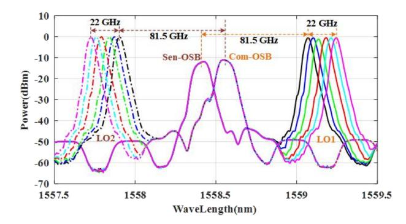

Fig. 8. Optical spectra at the output of the SMF1 (solid line) and SMF2 (dotted line) at different mmW carrier frequencies.

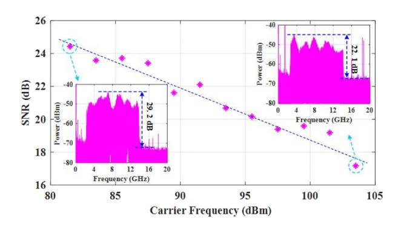

Fig. 9. Calculated sensing SNR at different carrier frequencies; inset: Left (81.5 GHz), right (103.5 GHz).

the sensing echo, where the frequency varies periodically and linearly in the range of about 2.5-14 GHz.

Subsequently, we investigated the frequency tunability of the sensing function and calculated the SNR using discrete gradient integration in frequency domain. The carrier frequency of the resulting mmW signal was tuned in a 2-GHz step by simultaneously shifting the LO1 and LO2 to ensure that the radar and communication were operated in the same frequency range. The RF was correspondingly tuned to fix the received IF at about 8.5 GHz. Fig. 8 shows the partial spectra at the output of the SMF1 (solid line) and SMF2 (dotted line). The interval between the two LOs and their respective sidebands is simultaneously shifted from 81.5 GHz to 103.5 GHz. Fig. 9. gives the sensing SNR at different carrier frequencies. The calculated SNR exhibits a gradual decay trend with the increasing carrier frequency. The SNR is up to 24.43 dB at 81.5 GHz, while it is attenuated to 17.44 dB at 103.5 GHz due to the larger transmission loss and lower component response. Nevertheless, the echo is more than 22 dB higher than the noise floor in the worst case, indicating that the mmW sensing function can be successfully realized in the entire W band.

Then, when testing the communication performance, the receiver was moved 10.8 m away from the transmitting end to act as the communication receiver. The RF was also operated at 16 GHz to down-convert the V-polarization downstream data. The obtained IF data is also centered at about 8.5 GHz, as shown in Fig. 10(a). Notably, the spectrum in Fig. 10(a) occupies

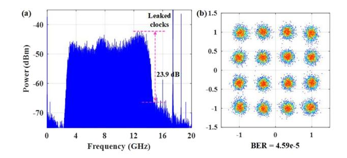

Fig. 10. (a) Frequency spectrum and (b) constellation diagram of the downconverted V-polarization downstream data at 87.5 GHz.

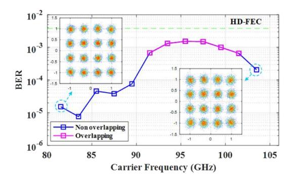

Fig. 11. Calculated BER at different carrier frequencies; inset: Left (81.5 GHz), right (103.5 GHz).

almost the same frequency range as that in Fig. [7\(a\),](#page-4-0) indicating that the proposed ISAC system was successfully operated in a CTCF mode. Fig. 10(b) plots the constellation diagram of the demodulated downstream data. The remarkably clustered constellation points with the bit error ratio (BER) of 4.59e-5 is much better than the hard-decision forward-error-correction

limit (HD-FEC, BER = 3.8e-3). Also, we investigated the frequency tunability of the communication function and calculated the corresponding BER. The operation process was similar to the sensing system. Fig. 11 shows the calculated BER at different carrier frequencies. In the entireW band, the BER is lower than the HD-FEC threshold. The insets in Fig. 11 are the constellation diagrams at the edges of the W band, from which we found that good communication performance can be obtained. In addition, performance degradation is observed from 91.5 to 101.5 GHz, mainly due to the RF leakage of the HM2. To explain the degradation, Fig. [12](#page-6-0) extracts the frequencies of the leaked RF, which linearly shifts from 119.4 to 97.39 GHz in a step of about 2 GHz. The leaked RF is overlapped with the downstream mmW data within 91.5 to 101.5 GHz, as shown in the illustrated spectra in Fig. [12.](#page-6-0) The leaked RF with high power interfered with the cascaded constant modulus algorithm (CMMA) for converging the radius of the constellation points, ultimately degrading the mmW communication performance. It should be pointed out that, the results within 91.5 to 101.5 GHz in Fig. 11 were achieved by directly using an ultra-narrow digital filter to remove the high-level RF leakages. The digital filter effectly improved the BER perfomance from the HD-FEC limit level [\[36\]](#page-10-0) to far below the HD-FEC limit.

{6}------------------------------------------------

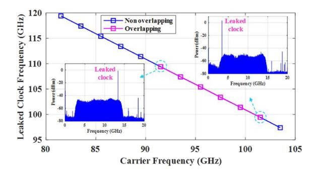

Fig. 12. Leaked clock at different carrier frequencies; inset: Left (91.5 GHz), right (101.5 GHz).

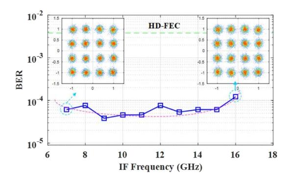

Fig. 13. Calculated BER at fixed 87.5-GHz carrier frequency by shifting the Tx IF and two LOs; inset: Left (7 GHz), right (16 GHz).

According to [\(6\)](#page-3-0) and [\(7\),](#page-3-0) the carrier frequency can be flexibly tuned by jointly manipulating the three ECLs and the Tx DSP routine. Here, we tested the communication performance at the fixed 87.5-GHz carrier frequency by shifting the Tx IF from 7 to 16 GHz in a step of 2 GHz and synchronously shifting the two LOs. Fig. 13 shows the calculated BER versus the Tx IF. The BER is basically better when IF varies from 9 to 14 GHz. The slightly deteriorated BERs in lower and higher IFs are mainly due to the damage of optical filtering and lower response of the used components, respectively. Nonetheless, all of the measured BERs are far lower than the HD-FEC limit. The constellation diagrams at the edges of the IF are inset in Fig. 13. In these two worst cases, we found that the constellation points are still well gathered.

## *C. System Performance Vs. Bandwidth*

Next, we measured the bandwidth tunability of the sensing and communication functions. The bandwidth of the digital sensing signal was changed to 23 GHz. Given the larger modulation bandwidth, the IF was shifted to 14 GHz. The digital communication signal was correspondingly changed to 23 GBaud and also centered at −14 GHz. To ensure the CTCF mode and a fixed 87.5-GHz carrier frequency, the LO1 and LO2 were shifted to 1559.09 and 1557.894 nm (0.032 nm/4 GHz depart from the respective LO in Section [II-A\)](#page-2-0), respectively. The RF was operated at 16.8 GHz to down-convert the received mmW signals to about 16.8 × 6–87.5 = 13.3 GHz.

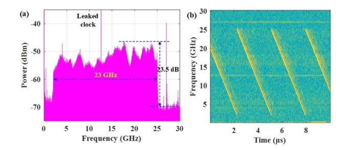

Fig. 14. (a) Frequency spectrum and (b) time-frequency characteristic of the down-converted H-polarization radar echo with 23-GHz bandwidth.

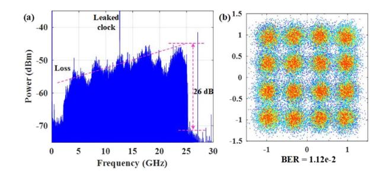

Fig. 15. (a) Frequency spectrum and (b) constellation diagram of the downconverted 23-GBaud downstream data from V-polarization port.

For sensing function, we analyzed the received H-polarization mmW echoes. Fig. 14(a) shows the down-converted frequency spectrum, with the spectral line centered at about 13.5 GHz. The deviation from the theoretical frequency is mainly due to the frequency deviation of the lasers and the lack of unified calibration by different laser manufacturers. Because of the bandwidth expansion, the measured peak power is slightly attenuated and about 23.5 dB above the noise floor. Fig. 14(b) shows the time-frequency characteristic of the ultra-wideband radar echo, from which the frequency periodically and linearly ranges within about 2-25 GHz.

As to wireless communication, we analyzed the received V-polarization downstream mmW signals. Fig. 15(a) shows the down-converted frequency spectrum. Though the generated 16QAM signal is up to 23 GBaud, the peak power is still about 26 dB above the noise floor. Notably, the spectrum is distributed in almost the same frequency range as the LFMCW in Fig. 14(a), revealing that a CTCF mode was successfully realized. Fig. 15(b) shows the constellation diagram of demodulated 16QAM signal. Despite the severe divergence of the constellation points, the communication performance with the BER of 1.12e-2 is slightly better than the soft-decision forward-error-correction threshold (SD-FEC, BER = 2.4e-2). The performance degradation is mainly due to the RF leakage and the severe high-frequency attenuation, as observed from the spectrum.

## *D. Sensing Resolution and Communication Capacity*

To investigate the sensing resolution, a dual-user scenario was tested by placing two metal plates radially. During the measurement, the CTCF mode with the 87.5-GHz carrier frequency was kept as described in Section [II-A](#page-2-0) and [B.](#page-3-0)

{7}------------------------------------------------

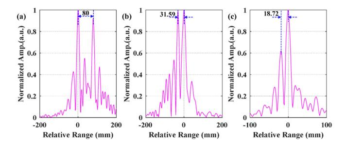

Fig. 16. Normalized cross-correlation between the 11.5-GHz bandwidth echo and the reference digital LFM wave when the distances were set at (a) 80.0 mm, (b) 29.0 mm, and (c) 15.0 mm.

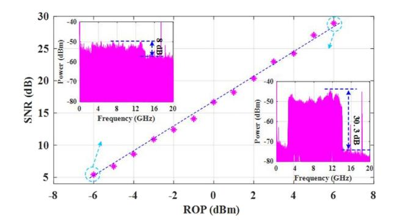

Fig. 17. Calculated sensing SNR versus the ROP.

First, the sensing signal with a 11.5-GHz bandwidth was generated. Fig. 16(a)–(c) show the normalized cross-correlations between the down-converted echoes and the reference digital LFM wave when the radial distances between the two UEs were set at (a) 80.0 mm, (b) 29.0 mm, and (c) 15.0 mm, respectively. The distance intervals between the two UEs calculated from the cross-correlation results are 80.00 mm, 31.59 mm, and 18.72 mm, respectively. The maximum error is only 3.72 mm.

To simulate the multi-mmW access, we measured the optical margin by simultaneously attenuating the optical power into the two PDs with the same amplitude. The SNR versus the received optical power (ROP) is shown in Fig. 17, from which the SNR improves linearly with the increase of injected optical power. When the ROP exceeds −5 dBm, the measured SNR measured by discrete gradient integration is better than 6 dB.

Then, we shifted the bandwidth of the sensing signal to 23 GHz. Fig. 18(a)–(c) show the normalized cross-correlations as the radial distances between the two UEs were also fixed at (a) 80.0 mm, (b) 29.0 mm, and (c) 15.0 mm, respectively. The radial intervals calculated from the cross-correlation results were 80.00 mm, 30.42 mm, and 12.87 mm, respectively. The maximum error was only 2.59 mm thanks to the ultra-large sensing bandwidth.

To investigate the communication capacity, we measured the BER of the 11.5- and 23-GBaud downstream 16QAM signals at different ROP. During the measurement, the CTCF mode with the carrier frequency of 87.5 GHz was also kept to simulate the practical polarization crosstalk in applications. Moreover, the optical power into the two PDs were attenuated to the same

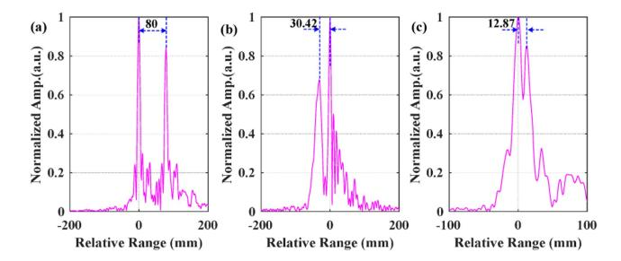

Fig. 18. Normalized cross-correlation between the 23-GHz bandwidth echo and the reference digital LFM wave when the distances were set at (a) 80.0 mm, (b) 29.0 mm, and (c) 15.0 mm.

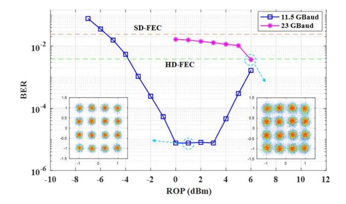

Fig. 19. Calculated BER as a function of the ROP at 11.5 GBaud (blue) and 23 GBaud (pink); inset: Left (1 dBm), right (6 dBm).

value for also simulating the multi-node access of both mmW sensing and communication. The calculated BER as a function of the ROP at 11.5 GBaud is shown as the blue line in Fig. 19. When the ROP is within [−3, 6] dBm, the calculated BERs are better than the HD-FEC, resulting a 46-Gbit/s data rate. Furthermore, the optimal optical power is found at about 0 to 3 dBm. At a 1-dB ROP, the constellation points are ideally clustered near the desired points, as inset at the left of Fig. 19. Besides, the calculated BER versus the ROP at 23 GBaud is shown as the pink line in Fig. 19. When the ROP is within [0, 6] dBm, the all calculated BERs are lower than the SD-FEC. Especially, at a 6-dB ROP, the communication performance with the BER of 3.67e-3 is slightly better than the HD-FEC. The moderately divergent constellation points, as inset at the right of Fig. 19, indicate that data rate of up to 92 Gbit/s is successfully transmitted.

According to Ref.[\[37\],](#page-10-0) the generated mmW ISAC signals will vary less than ±0.2 GHz over 10 hours. The transmission bandwidth of the ISAC signals is larger than 11.5 GHz, obviously meeting the long-term frequency tolerance of 2% frequency drift specified by ITU.

For mmW sensing, since the cross-correlation is not sensitive to the frequency variation, the mmW frequency offset caused by the laser beating has a relatively small impact on the relative position estimation between the two users. Moreover, the phase noise of the lasers slowly changes over time, resulting in almost identical phase noise of the two echoes reflected by the closely

{8}------------------------------------------------

| Wave mode | Central Freq. (GHz) | Wireless Distance (m) | Data Rate (Gb/s) | Radial Resolution (cm) | CRQ (Gb/s/cm) | Ref.      |
|-----------|------------------------|--------------------------|------------------|---------------------------|---------------|-----------|
| TDM       | 92                     | 1                        | 10               | 10                        | 1.000         | [23]      |
| TDM       | 77                     | 1                        | 46.55            | 10                        | 4.655         | [24]      |
| TDM       | 300                    | Null                     | 1                | 19                        | 0.053         | [25]      |
|           |                        |                          | 1                |                           |               |           |
| FDM       | 28                     | 1.2–2                    | 23               | 30                        | 0.767         | [26]      |
| FDM       | 100                    | 0.8                      | 3.125            | 30                        | 0.105         | [27]      |
| FDM       | 89.5                   | 1                        | 78               | 20                        | 3.900         | [28]      |
| FDM       | 96.5                   | 1                        | 5.98/32.34       | 1.86/6.94                 | 3.215/4.660   | [29]      |
| CTCF      | 22                     | 1.5                      | 0.1              | 1.9                       | 0.053         | [30]      |
| CTCF      | 24                     | 0                        | 0.336            | 7.5                       | 0.045         | [31]      |
| CTCF      | 60                     | 1.2-2                    | 8                | 1.5                       | 5.333         | [32]      |
| CTCF      | 28                     | 1.2 - 1.6                | 11.5             | 10.4                      | 1.106         | [33]      |
| CTCF      | 28                     | 1-3.4                    | 1.56             | 188                       | 0.008         | [34]      |
| CTCF      | 26/94                  | 19.5/187.5               | 12.8/32          | 7.5/1.5                   | 1.707/21.333  | [35]      |
| CTCF      | 88.75                  | 10.8                     | 92               | 1.5                       | 61.333        | This Work |

TABLE I COMPARISON OF TYPICAL PHOTONICS-AIDED JRC LINKS

spaced two users. Therefore, the impact of mmW phase noise on relative position measurement can also be accepted. Successfully, we distinguished two users with a relative distance of 15.0 mm. However, the frequency offset and phase noise will limit more precise spatial distance measurement. According to [\(9\),](#page-3-0) a 23-GHz bandwidth LFM wave can lead to a 6.5-mm spatial resolution, but we only achieved a 15.0-mm spatial resolution.

For mmW communication, the mmW frequency offset and phase noise translated by the laser beating can be easily removed at the communication receiver via the mature frequency offset estimation (FOE) and carrier phase estimation (CPE), respectively. In our experiment, an FFT-based FOE and Viterbi-Viterbibased CPE were applied [\[38\],](#page-10-0) [\[39\].](#page-10-0)

To effectively eliminate the frequency offset and phase noise at the transmitting end, phase-locked loops, optical injection locking, or optical frequency combs can be used. But the complexity of the transmitter will greatly increase. A trade-off between the performance and complexity needs to be made based on actual needs.

Table I summarizes the waveform mode, central frequency, wireless distance, radar resolution, communication rate, and CRQ of typical photonics-assisted mmW JRC links. Thanks to the electromagnetic polarization multiplexing, all timefrequency resources of the proposed ultra-wideband fiberwireless link independently and simultaneously served the two functions without competition. As a result, we successfully achieved a 1.5-cm spatial resolution and a 92-Gbit/s data rate at the same time, contributing to a record CRQ of 61.333 Gbit/s/cm.

### *E. Polarization Crosstalk of Sensing to Communication*

Due to the limited electromagnetic polarization isolation and polarization mismatch, there is mutual electromagnetic polarization crosstalk between the mmW sensing and communication. Here, we analyzed the polarization crosstalk of sensing to communication considering the larger tolerance of LFMCW with a large time-bandwidth product. Fig. 20 plots the calculated BER of the 11.5-GBaud downstream data as a function of the ROP in

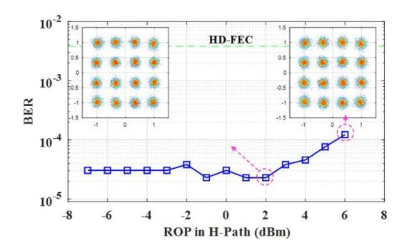

Fig. 20. Calculated BER of the 11.5-GBaud downstream data as a function of the ROP in the H-path; inset: Left (2 dBm), right (6 dBm).

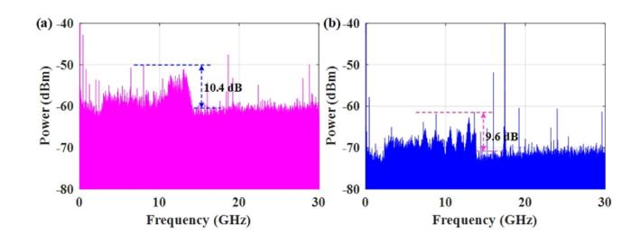

Fig. 21. Leaked spectra in (a) V- and (b) H-polarization.

the H-path. During the measurement, the ROP in the V-path was fixed at 4 dBm, and the CTCF mode was kept at an 87.5-GHz carrier frequency. From Fig. 20, the BER slowly deteriorates when the ROP in V-path was increased from 2 to 6 dBm. To further explore the polarization crosstalk, we measured the polarization leakage by fixing one of the optical signals at 6 dBm and attenuating the other below −20 dB. Fig. 21(a) and (b) show the leaked spectra in V- and H-polarization, respectively. When the V-path optical signals were attenuated, the leaked spectrum into the V-polarization was about 10.4 dB higher than the noise floor. When the H-path optical signals were attenuated, the leaked spectrum into the H-polarization was about 9.6 dB 

{9}------------------------------------------------

above the noise floor. In spite of the electromagnetic polarization crosstalk, the calculated BER is far below the HD-FEC while the ROP in the V-path is 2 dB higher than that in the H-path. At such an ROP, the two PDs are saturated according to Fig. [19,](#page-7-0) but the constellation points are still closely gathered, as inset at the right of Fig. [20.](#page-8-0) As the ROP is lower than 2 dBm, the electromagnetic polarization crosstalk of radar to communication can be almost ignored. Therefore, according to the application requirements, the optical power in the radar path can be slightly reduced to improve the communication performance.

## IV. CONCLUSION

In this article, we have proposed and systematically demonstrated a photonics-assisted W-band CTCF ISAC link. The ultra-wideband W-band sensing and communication signals are generated by combing the spectrum-efficient ASSB modulation with flexible optical heterodyne up-conversion. The timefrequency competition between the sensing and communication functions in conventional ISAC links are removed owing to the electromagnetic polarization multiplexing. Thus, for the proposed ultra-wideband mmW link, all time-frequency resources can be independently and simultaneously applied to the sensing and communication functions, contributing to an ultra-high spatial resolution and an ultra-large communication capacity at the same time. The proof-of-concept experimental results demonstrate that a 15-mm spatial resolution with the ranging error of 2.59 mm and a 92-Gbit/s data rate with the BER of 3.67e-3 were simultaneously achieved after transmitting over a 10.8-m wireless distance. The ultra-high spatial resolution and ultra-high data rate led to a record CRQ of 61.333 Gbit/s/cm. The proposed ISAC link, with the ability to operate in the entire W band, is expected to widely used in the upcoming intelligent mmW era.

# REFERENCES

- [1] J. Hasch, E. Topak, R. Schnabel, T. Zwick, R. Weigel, and C. Waldschmidt, "Millimeter-wave technology for automotive radar sensors in the 77 GHz frequency band," *IEEE Trans. Microw. Theory Techn.*, vol. 60, no. 3, pp. 845–860, Mar. 2012.
- [2] X. Gao et al., "Towards converged millimeter-wave/terahertz wireless communication and radar sensing," *ZTE Commun.*, vol. 18, no. 1, pp. 73–82, Mar. 2020.
- [3] J. Yao, "Microwave photonics," *J. Lightw. Technol.*, vol. 27, no. 3, pp. 314–335, Feb. 2009.
- [4] W. Chen et al., "Photonic generation of binary and quaternary phase-coded microwave waveforms with frequency quadrupling," *IEEE Photon. J.*, vol. 8, no. 2, Apr. 2016, Art. no. 5500808.
- [5] Y. Tong et al., "Photonic generation of phase-stable and wideband chirped microwave signals based on phase-locked dual optical frequency combs," *Opt. Lett.*, vol. 41, no. 16, pp. 3787–3790, Aug. 2016.
- [6] X. Li et al., "Frequency-octupled phase-coded signal generation based on carrier-suppressed high-order double sideband modulation," *Chin. Opt. Lett.*, vol. 15, no. 7, Jul. 2017, Art. no. 070603.
- [7] Y. Chen and S. Pan, "Photonic generation of tunable frequency-multiplied phase-coded microwave waveforms," *IEEE Photon. Technol. Lett.*, vol. 30, no. 13, pp. 1230–1233, Jul. 2018.
- [8] M. Lei et al., "Photonic generation of background-free binary and quaternary phase-coded microwave pulses based on vector sum," *Opt. Exp.*, vol. 27, no. 14, pp. 20774–20784, Jul. 2019.
- [9] X. Zhang, Q. Sun, J. Yang, J. Cao, and W. Li, "Reconfigurable multi-band microwave photonic radar transmitter with a wide operating frequency range," *Opt. Exp.*, vol. 27, no. 24, pp. 34519–34529, Nov. 2019.

- [10] C. Ma et al., "Microwave photonic imaging radar with a sub-centimeterlevel resolution," *J. Lightw. Technol.*, vol. 38, no. 18, pp. 4948–4954, Sep. 2020.
- [11] S. Pan and Y. Zhang, "Microwave photonic radars," *J. Lightw. Technol.*, vol. 38, no. 19, pp. 5450–5484, Oct. 2020.
- [12] S. Zhu et al., "Photonic generation and antidispersion transmission of background-free multiband arbitrarily phase-coded microwave signals," *IEEE Trans. Microw. Theory Techn.*, vol. 70, no. 4, pp. 2290–2298, Apr. 2022.
- [13] C. T. Lin, J. Chen, P. T. Shih, W. J. Jiang, and S. Chi, "Ultra-high data-rate 60 GHz radio-over-fiber systems employing optical frequency multiplication and OFDM formats," *J. Lightw. Technol.*, vol. 28, no. 16, pp. 2296–2306, Apr. 2010.
- [14] A. Stöhr et al., "Robust 71–76 GHz radio-over-fiber wireless link with high-dynamic range photonic assisted transmitter and laser phase-noise insensitive SBD receiver," in *Proc. Opt. Fiber Commun. Conf.*, 2014, pp. 1–3.
- [15] P. T. Dat, A. Kanno, N. Yamamoto, and T. Kawanishi, "Simultaneous transmission of 4G LTE-A and wideband MMW OFDM signals over fiber links," in *Proc. IEEE Int. Topical Meeting Microw. Photon.*, 2016, pp. 87–90.
- [16] J. Yu, "Photonics-assisted millimeter-wave wireless communication," *IEEE J. Quantum Electron.*, vol. 53, no. 6, Dec. 2017, Art. no. 8000517.
- [17] L. Huang et al., "Simple multi-RAT RoF system with 2×2 MIMO wireless transmission," *IEEE Photon. Technol. Lett.*, vol. 31, no. 13, pp. 1025–1028, Jul. 2019.
- [18] F. Shi et al., "Wideband dual-channel photonic RF repeater based on polarization division multiplexing modulation and polarization control," *J. Lightw. Technol.*, vol. 38, no. 6, pp. 1275–1285, Mar. 2020.
- [19] D. N. Nguyen et al., "Polarization division multiplexing-based hybrid microwave photonic links for simultaneous mmW and sub-6 GHz wireless transmissions," *IEEE Photon. J.*, vol. 12, no. 6, Dec. 2020, Art. no. 5502814.
- [20] H. Song et al., "DSP-free remote antenna unit in a coherent radio over fiber mobile fronthaul for 5G mm-wave mobile communication," *Opt. Exp.*, vol. 29, no. 17, pp. 27481–27492, Aug. 2021.
- [21] L. Zhao et al., "Independent dual-single-sideband QPSK signal detection based on a single photodetector," *Opt. Exp.*, vol. 30, no. 13, pp. 22946–22956, Jun. 2022.
- [22] H. H. Lu et al., "Simultaneous transmission of 5G MMW and sub-THz signals through a fiber-FSO-5G NR converged system," *J. Lightw. Technol.*, vol. 40, no. 8, pp. 2348–2356, Apr. 2022.
- [23] Y. Wang, J. Ding, M. Wang, Z. Dong, F. Zhao, and J. Yu, "W-band simultaneous vector signal generation and radar detection based on photonic frequency quadrupling," *Opt. Lett.*, vol. 47, no. 3, pp. 537–540, Feb. 2022.
- [24] Y. Wang et al., "Photonics-assisted joint high-speed communication and high-resolution radar detection system," *Opt. Lett.*, vol. 46, no. 24, pp. 6103–6106, Dec. 2021.
- [25] A. Kanno, N. Sekine, Y. Uzawa, I. Hosako, and T. Kawanishi, "300-GHz versatile transceiver front-end for both communication and imaging," in *Proc. 40th Int. Conf. Infrared, Millimeter, Terahertz Waves*, 2015, pp. 1–2.
- [26] M. Lei et al., "A spectrum-efficient MoF architecture for joint sensing and communication in B5G based on polarization interleaving and polarization-insensitive filtering," *J. Lightw. Technol.*, vol. 40, no. 20, pp. 6701–6711, Oct. 2022.
- [27] R. Song and J. He, "OFDM-NOMA combined with LFM signal for W-band communication and radar detection simultaneously," *Opt. Lett.*, vol. 47, no. 11, pp. 2931–2934, Jun. 2022.
- [28] Y. Wang, J. Liu, J. Ding, M. Wang, F. Zhao, and J. Yu, "Joint communication and radar sensing functions system based on photonics at the W-band," *Opt. Exp.*, vol. 30, no. 8, pp. 13404–13415, Apr. 2022.
- [29] B. Dong et al., "Demonstration of photonics-based flexible integration of sensing and communication with adaptive waveforms for a W-band fiberwireless integrated network," *Opt. Exp.*, vol. 30, no. 22, pp. 40936–40950, Oct. 2022.
- [30] H. Nie, F. Zhang, Y. Yang, and S. Pan, "Photonics-based integrated communication and radar system," in *Proc. IEEE Int. Topical Meeting Microw. Photon.*, 2019, pp. 1–4.
- [31] Z. Xue, S. Li, X. Xue, X. Zheng, and B. Zhou, "Photonics-assisted joint radar and communication system based on an optoelectronic oscillator," *Opt. Exp.*, vol. 29, no. 14, pp. 22442–22454, Jun. 2021.
- [32] W. Bai et al., "Millimeter-wave joint radar and communication system based on photonic frequency-multiplying constant envelope LFM-OFDM," *Opt. Exp.*, vol. 30, no. 15, pp. 26407–26425, Jul. 2022.

{10}------------------------------------------------

- [33] M. Lei et al., "Photonics-aided integrated sensing and communications in mmW bands based on a DC-offset QPSK-encoded LFMCW," *Opt. Exp.*, vol. 30, pp. 43088–43103, Nov. 2022.
- [34] L. Huang, R. Li, S. Liu, P. Dai, and X. Chen, "Centralized fiber-distributed data communication and sensing convergence system based on microwave photonics," *J. Lightw. Technol.*, vol. 37, no. 21, pp. 5406–5416, Nov. 2019.
- [35] Z. Xue, S. Li, X. Xue, X. Zheng, and B. Zhou, "Tunable K/W-band OFDM integrated radar and communication system based on optoelectronic oscillator for intelligent transportation," *Opt. Exp.*, vol. 30, no. 20, pp. 35270–35281, Sep. 2022.
- [36] M. Lei et al., "Photonics-assisted joint radar and communication system in W band using electromagnetic polarization multiplexing," in *Proc. Opt. Fiber Commun. Conf.*, 2023, pp. 1–3.
- [37] L. Gonzalez-Guerrero et al., "Pilot-tone assisted 16-QAM photonic wireless bridge operating at 250 GHz," *J. Lightw. Technol.*, vol. 39, no. 9, pp. 2725–2736, May 2021.
- [38] H. Shams, M. J. Fice, K. Balakier, C. C. Renaud, F. V. Dijk, and A. J. Seeds, "Photonic generation for multichannel THz wireless communication," *Opt. Exp.*, vol. 22, no. 19, pp. 23465–23472, Sep. 2014.
- [39] H. Zhang et al., "Single-lane 200 Gbit/s photonic wireless transmission of multicarrier 64-QAM signals at 300 GHz over 30 m," *Chin. Opt. Lett.*, vol. 21, no. 2, pp. 023901–023904, Nov. 2022.