{0}------------------------------------------------

# A Reconfigurable Phase-Time Array Transmitter Achieving Keyless Secured Transmission and Multi-Receiver Localization for Low-Latency Joint Communication and Sensing

Naga Sasikanth Mannem®, *Student Member IEEE*, Jeongsoo Park, *Member, IEEE*, Elham Erfani, *Member, IEEE*, Edward Liu®, *Student Member, IEEE*, Jeongseok Lee®, *Student Member, IEEE*, and Hua Wang®, *Fellow, IEEE* 

Abstract—The vast available spectrum at millimeter-wave (mm-Wave)/terahertz (THz) frequencies is envisioned as a key enabler to solve the ever-increasing data rate needs in crowded urban environments and lead the next wireless technology revolution. To overcome the high path loss present at mm-Wave/THz, highly directional antenna arrays have become ubiquitous. Their future large-scale deployment will naturally create dense wireless sensor networks, which in-turn enable joint communication and sensing. However, the beamforming of high-directivity antenna arrays relies on real-time precise localization between transmitters (TXs) and receivers (RXs) to ensure robustness in dynamic mobile applications. Moreover, traditional digital encryption and decryption at multi-Gbps data rate cause large power and latency overhead, and thus, wireless physical layer security has become a promising solution. In this article, we propose and demonstrate a reconfigurable phase-time array (PTA) TX with prism-like spectral-to-spatial mapping of wideband transmitted signals, which achieves keyless physically secured wireless communication and fast multi-RX localization to enable lowlatency joint communication and sensing within the same wireless electronics frontend. The PTA realizes reconfigurable spectral-tospatial mapping by applying both a phase shift and true time delay (TTD) at each array element. This intentionally creates and exploits the array beam squinting effect, such that different frequency components of a wideband signal are transmitted in different directions, analogous to an optical prism. Therefore, multiple RX nodes can simultaneously determine their angular positions relative to the TX array using their received signals for fast multi-RX localization. Judiciously engineering the prismlike beam squinting in PTA TX can also selectively distort signal transmission to unwanted directions for secured communication without cryptography. Furthermore, the PTA scheme can reconfigure its element-level phase-time delay combinations to attain

Manuscript received 19 July 2022; revised 4 November 2022 and 13 December 2022; accepted 4 January 2023. Date of publication 25 January 2023; date of current version 28 June 2023. This article was approved by Associate Editor Kenichi Okada. (Corresponding author: Naga Sasikanth Mannem.)

Naga Sasikanth Mannem, Jeongsoo Park, Elham Erfani, Edward Liu, and Jeongseok Lee are with the School of Electrical and Computer Engineering, Georgia Institute of Technology, Atlanta, GA 30308 USA (e-mail: nmannem3@gatech.edu).

Hua Wang is with the School of Electrical and Computer Engineering, Georgia Institute of Technology, Atlanta, GA 30308 USA, and also with Eidgenössische Technische Hochschule Zürich (ETH Zürich), 8092 Zürich, Switzerland.

Color versions of one or more figures in this article are available at https://doi.org/10.1109/JSSC.2023.3237462.

Digital Object Identifier 10.1109/JSSC.2023.3237462

variable levels of communication security and localization/sensing performance depending on the needs.

Index Terms—5G, 6G, joint communication and sensing, localization, millimeter-wave (mm-Wave), multi input multi output (MIMO), over-the-air (OTA), phased arrays, receiver (RX), transmitter (TX).

#### I. INTRODUCTION

OINT communication and sensing is rapidly emerging as a key feature for future beyond-5G/6G wireless systems, where the massively deployed wireless communication nodes can be leveraged for spatial and environment sensing, which in turn enhances communication reliability itself and enables new applications [1]. In particular, the extensive use of antenna arrays in millimeter-wave (mm-Wave)/Terahertz (THz) 6G systems necessitates spatial/location sensing of wireless nodes, since the pencil-sharp beams produced by large antenna arrays need precise localization of transmitter (TX) and receiver (RX) angular positions to attain accurate beam alignment and optimal link signal-to-noise-ratio (SNR). Hence, sensing-aided communication is essential for 5G and beyond-5G communication with highly directional arrays. Moreover, the ubiquitous deployment of mm-Wave/THz array-based wireless links naturally establishes the infrastructure for densely distributed electromagnetic (EM) sensor networks. Large mm-Wave/THz arrays ensure high directionality for accurate angular sensing, while the massive available bandwidth enables radar sensing with accurate depth detection. Therefore, it is inherently beneficial to support joint wireless communication and sensing on the same platform for electronics reuse, antenna aperture sharing, and area/power saving.

In practice, directional TX antenna arrays require prior knowledge of the RX position to prevent TX/RX beam misalignments and SNR degradation [2], [3], [4], [5], [6]. As large arrays have sharp beamwidths proportional to  $\sin^{-1}(1/N)$  with N as the array element number, precise TX/RX localization is essential. Moreover, emerging applications in dense and dynamic environments require rapid beamforming to track mobile TX/RX nodes. Furthermore, it is desirable to perform one-shot localization of multiple RX nodes over the TX full field-of-view (FoV), to minimize link beamforming latency

0018-9200 © 2023 IEEE. Personal use is permitted, but republication/redistribution requires IEEE permission. See https://www.ieee.org/publications/rights/index.html for more information.

{1}------------------------------------------------

and allow multi-beam multi input multi output (MIMO) operations. Conventional beam forming and alignment techniques sweep the phase shifter states in both TX/RX arrays, leading to a large communication latency proportional to *M*2, where *M* is the total number of states in TX/RX phase shifters. This latency is particularly problematic in future beyond-5G/6G systems with strict latency budgets. Although multi-beam MIMOs [3], [4], [6] can potentially reduce this localization latency, they add major area and power overhead. Alternatively, leaky wave antennas [7], [8], [9] are reported for fast full-FoV RX localization but contain a fundamental limitation; their large physical antenna sizes exceed the element grid size of 2-D scalable arrays. Therefore, new high-precision TX/RX localization techniques are needed to support lowoverhead, one-shot multi-RX localization, full FoV operation, and compatibility with 2-D scalable arrays.

Wireless information security is a necessity in 5G/beyond-5G era with high-capacity wireless data transmissions [10], [11]. Conventional cryptography-based security techniques are unsuitable for multi-Gbps high data rates in 5G/beyond-5G links due to their large computational overhead. Therefore, embedding physical layer security in wireless frontend electronics and antenna systems [12], [13], [14], [15], [16] is emerging as a promising solution. Wireless systems with omnidirectional antennas essentially transmit the same information in all directions with no embedded security measures. Phased arrays provide spatial selectivity and security by degrading the SNR in directions close to their nulls, which can still be picked up by sensitive eavesdroppers. Larger arrays generate sharper beams for enhanced security, but this inherent phased array security comes at a direct tradeoff with an array size, which corresponds to increased area and power consumption [17], which is not conducive to mobile user equipment (UE) devices with constrained form-factor and resources. Recently reported wireless physical layer security techniques include time-modulated Arrays (TMAs) [14], [18], constellation decomposition arrays (CDAs) [15], and spatial in-phase quadrature-phase (IQ) combining [19]. Although they support highly secured links with sharp spatial selectivity, they present various limitations for resource constrained mobile UEs. The TMA scheme achieves security at the expense of reduced radiated power and array gain. It also needs a significant digital overhead to generate "non-overlapping" pulsed signals for multi-GHz modulations and large arrays. The CDA scheme, as a generalization of spatial IQ combining, needs digital overhead to decompose low-order CDA signals. The security levels of the CDA scheme are also fixed with no reconfigurability. Thus, there is an unmet need for physical layer security schemes that simultaneously satisfy: low hardware complexity to support mobile UE applications, minimal link degradation (e.g., radiated power and EVM), adjustable levels of security, and compatibility with 2-D scalable arrays.

In this article, we propose and demonstrate a new antenna array technique and TX electronics front-end, i.e., a reconfigurable phase-time array (PTA), to realize the desired fast multi-RX localization over full FoV and wireless physical security communication with adjustable security levels, supporting joint communication and sensing on a single electronics hardware platform. The key innovation lies in combining a reconfigurable time delay and phase shift in each array element to create a prism-like spectral-to-spatial mapping property, i.e., different frequency components pointing to different directions. Also, unlike leaky antennas [7], [8], [9], our PTA technique is agnostic to antenna designs and compatible with 2-D scalable arrays.

This article is organized as follows. Section II revisits the beam squinting phenomenon in phased arrays with simulations on phased array versus time delay array. Section III describes the proposed PTA technique for programmable beam squinting and its extension for realizing physical layer security and RX localization. Section IV details the TX architecture along with ON-wafer measurements on a single TX channel. Section V describes the over-the-air (OTA) modulation/localization measurements using the TX and ON-printed circuit board (PCB) antenna array. Section VI concludes this article.

### II. BEAM SQUINTING IN PHASED ARRAYS

Phased arrays apply a phase difference between adjacent antenna elements to steer the array's radiated beam to a specific direction. The applied phase shift can compensate for the time delay difference between the elements at a single frequency, but this approximation falls apart for wideband input signals, especially for large arrays and/or large scan angles. Consequently, spatial dispersion, commonly known as beam squinting, happens in the main lobes for wideband input signals, i.e., different frequency components pointing to different directions [2], [20].

Fig. 1 compares the TX array beamforming as a phased array versus a true time delay (TTD) array with wideband modulated signals. Under zero phase difference, the far-field RX along the broadside observes the same undistorted spectrum as that of the TX output [see Fig. 1(a)]. However, due to beam squinting at large scan angles, the far-field RX nodes at θ = ±60◦ observe a highly dispersed frequency spectrum. This dispersion effect by beam squinting is exacerbated for larger phased arrays due to their sharp beams [2], [20]. In contrast, when TTD is applied between antenna elements, wideband beams can be preserved at large scan angles with no distortions [see Fig. 1(b)].

The beam squinting phenomenon is further elaborated through simulations on a phased array. The array uses omni-directional antenna elements and a three-tone input to represent a 5-GHz wideband signal centered at 30 GHz (16.7% fractional bandwidth). Using a 16-element phased array [see Fig. 1(c)], when the center frequency is pointed at small scan angles 30◦, the far-field RX at 30◦ receives the three tones with small amplitude variation (<2 dB). However, as the beam scan is increased to 60◦, the three tones will point to largely different directions, i.e., 48◦, 60◦, and 73◦, due to the increasing phase-delay mismatch over bandwidth [see Fig. 1(d)]. Hence, the far-field RX at 60◦ receives the three tones with an amplitude variation of >6 dB. Moreover, this frequency dispersion phenomenon worsens for larger array sizes and larger scan angles [see Fig. 1(e) and (f)]. Note that this is a critical issue for both wideband communication

{2}------------------------------------------------

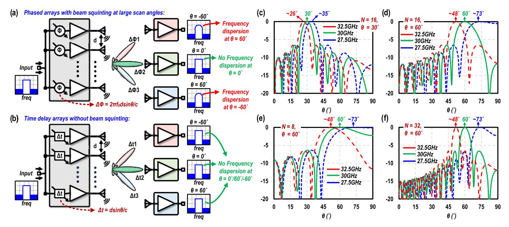

Fig. 1. (a) and (b) Comparison between conventional phased array and TTD array with wideband inputs. Phased arrays produce beam squinting at large scan angles, while TTD arrays create no beam squinting. (c)–(f) Simulated radiation patterns using phased arrays with three-tone inputs to emulate a 5-GHz wideband signal centered at 30 GHz versus the scan angle ( $\theta$ ) when focusing at  $\theta = 30^{\circ}$  or  $60^{\circ}$  using eight-element, 16-element, and 32-element antenna arrays.

and high-performance radar sensing, as radars require large bandwidth for accurate depth resolution. Therefore, to support the next-generation wideband wireless systems with large FoV, time delay elements are necessary especially for large-scaled arrays.

## III. PROGRAMMABLE PHYSICAL LAYER SECURITY AND LOCALIZATION USING PTA TX

## A. Programmable Beam Squinting and Spatial Dispersion Using PTA

From Section II, it is concluded that phased arrays produce beam squinting as frequency-dependent spatial dispersion. In Section III, we will demonstrate that this spatial dispersion phenomenon can be utilized to localize multiple RX nodes simultaneously and realize physically secured keyless wireless communication. Using phased array's natural beam squinting alone, the spatial dispersion phenomenon is significant only for large arrays and/or large none-broadside scan angles, limiting their real-world applications. Therefore, we propose a reconfigurable PTA, as shown in Fig. 2(a), which can deliberately enhance beam squinting spatial dispersion over the entire FoV, including the array broadside by the application of phase shift and time delay together.

The PTA's operation for broadside beam squinting is explained in Fig. 2(a). By first employing a phase shift, the PTA points to a large scan angle at the center frequency with beam squinting at other frequencies. If we also employ a time delay that exactly cancels out the phase shift at the center frequency, the beam at the center frequency will point toward the broadside direction. Since the phase shift and time delay only cancel each other at the center frequency, other frequency contents will experience beam squinting and thus point away from broadside.

In general, the normalized electric field of a PTA TX observed at an angle  $\theta$  at a frequency of operation "f" can

be derived, as shown in (1), with  $\Delta t = \tau$  and  $\Delta \Phi = -2\pi f_0 \tau - \pi \sin\theta_D$ , with center frequency at  $f_0$  and the " $f_0$ " beam focused at an angle  $\theta_D$ . Here, k is the wavenumber, i.e.,  $k = 2\pi/\lambda$  and d is the distance between antenna elements, and we assume  $d = \lambda_0/2$  (at center frequency).  $\Delta t$  and  $\Delta \Phi$  are the applied time/phase delay difference between adjacent antenna elements in antenna array

$$E_{\text{norm}} = \frac{\sin(\frac{N\Psi}{2})}{\sin(\frac{\Psi}{2})}$$

$$\Psi = kd\sin\theta + 2\pi f \Delta t + \Delta \Phi$$

$$= \frac{\pi f}{f_0}\sin\theta + 2\pi (f - f_0)\tau - \pi \sin\theta_D. \tag{1}$$

Due to the PTA operation, spatial dispersion can be created with peaks of radiation pattern at different frequencies focused at different directions ( $\theta_{\text{peak},f}$ ), as shown in (2). It shows that using larger  $\tau$  results in greater dispersion as a function of frequency

$$\Psi = \frac{\pi f}{f_0} \sin\theta_{\text{peak},f} + 2\pi (f - f_0)\tau - \pi \sin\theta_D = 0$$

$$\theta_{\text{peak},f} = \sin^{-1} \left( \frac{f_0}{\pi f} (\pi \sin\theta_D - 2\pi (f - f_0)\tau) \right). \tag{2}$$

 $\Psi$  in the normalized electric field (1) at an angle  $\theta$  for frequencies  $f_{\text{max}}$  ( $f_0 + \Delta f$ ) and  $f_{\text{min}}$  ( $f_0 - \Delta f$ ), i.e., maximum, and minimum frequencies of a wideband signal can be derived as shown in the following equations:

$$\Psi_{f\text{max}} = \pi \sin\theta - \pi \sin\theta_D + \frac{\pi \Delta f}{f_0} \sin\theta + 2\pi \Delta f \tau \qquad (3)$$

$$\Psi_{f\min} = \pi \sin\theta - \pi \sin\theta_D - \frac{\pi \Delta f}{f_0} \sin\theta - 2\pi \Delta f \tau. \quad (4)$$

The simulated radiation patterns for a four-element PTA TX with a three-tone inputs (27.5, 30, and 32.5 GHz) are shown in Fig. 2(b) for different phase shift and time delay combinations.

{3}------------------------------------------------

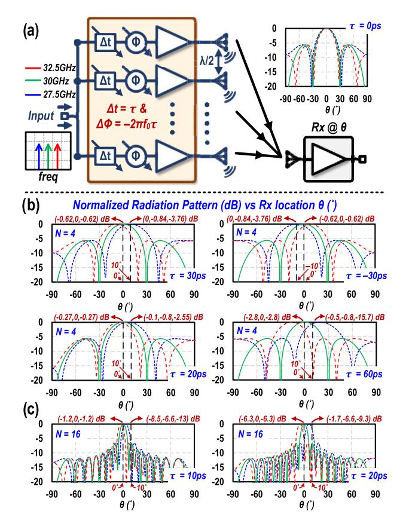

Fig. 2. (a) Proposed PTA scheme with element-level phase shift and TTD to produce beam squinting at broadside direction. Simulated normalized radiation pattern of a three-tone input (27.5, 30, and 32.5 GHz) to (b) four-element PTA TX versus scan angle using different values of  $\tau$  of 30/–30/20/60 ps,  $\Delta t = \tau$  and  $\Delta \Phi = -2\pi f_0 \tau$ ,  $f_0 = 30$  GHz. (c) Sixteen-element PTA versus scan angle using different values of  $\tau$  of 10/20 ps. Larger values of  $\tau$  create larger spatial dispersion between the three-tone signals, similar to beam squinting at large scan angles in a phased array. The 16-element PTA creates a much larger beam squinting effect than the four-element PTA, similar to phased array from Fig. 1(c)–(f).

Here, the time delay and phase shift follow  $\Delta t = \tau$  and  $\Delta \Phi =$  $-2\pi f_0 \tau$ ,  $f_0 = 30$  GHz for broadside pointing of 30-GHz tone [see Fig. 2(a)]. The results show that increasing the time delay  $\Delta t$  and phase shift  $\Delta \Phi$  applied between the elements results in larger spatial dispersion. For a four-element array, when  $(\Delta t, \Delta \Phi) = (30 \text{ ps}, -324^{\circ})$  is applied between the adjacent elements, the three beams undergo beam squinting and point at  $-9^{\circ}/0^{\circ}/9^{\circ}$ , respectively. Hence, the RX at the broadside observes an amplitude of -0.62/0/-0.62 dB for the three tones, compared to 0/0/0 dB for  $(\Delta t, \Delta \Phi) = (0 \text{ ps}, 0^{\circ})$ , i.e., no PTA operation. Furthermore, when  $(\Delta t, \Delta \Phi)$  is increased to (60 ps,  $-648^{\circ}/-288^{\circ}$ ), the beam squinting is enhanced; hence, the three beams point to  $-19^{\circ}/0^{\circ}/19^{\circ}$ , respectively. The RX located at the broadside will observe an amplitude of -2.8/0/-2.8 dB, respectively. Moreover, larger dispersions also happen for the RXs located away from broadside. For  $(\Delta t, \Delta \Phi) = (30 \text{ ps}, -324^{\circ})$ , the RX located at 10° observes a significant amplitude dispersion with the three tones of 0/-0.84/-3.76 dB, respectively. Similar dispersion behavior is also observed with  $(\Delta t, \Delta \Phi) = (-30 \text{ ps}, 324^{\circ})$  for the RXs located at  $\theta = 0^{\circ}/-10^{\circ}$ . This dispersion behavior at non-broadside further increases to -0.5/-0.8/-15.7 dB for  $(\Delta t, \Delta \Phi) = (60 \text{ ps}, -648^{\circ}/-288^{\circ}) \text{ for the RX at } 10^{\circ}.$ 

Therefore, similar to beam squinting in phased arrays, antenna array size affects the spatial dispersion in PTA, as shown in Fig. 2(c).

### B. Secured Keyless High Data-Rate Wireless Communication Using PTA TX

With the PTA operation, the RX located at the broadside direction observes minor amplitude variations over frequency (even with a large  $\tau$  of 30 ps), i.e.,  $(\Delta t, \Delta \Phi) = (30 \text{ ps},$  $-324^{\circ}$ ), as shown in Fig. 2(b), while the non-broadside RXs experience large spatial dispersion with significant amplitude variations versus frequency. Therefore, our proposed PTA technique can realize secured wireless communication as explained in Fig. 2(a). When a wideband signal is input to the PTA, the non-broadside eavesdropper RX nodes will receive heavily distorted spectrums due to the PTA's spatial dispersion, worsening their observed EVMs, while the broadside desired RX receives low EVM. Moreover, the PTA TX can apply randomized time-swapping to dynamically switch between different  $(\Delta t, \Delta \Phi)$  settings, creating time-scrambled spatial dispersions on the frequency contents, while the main beam pointing to the broadside continues to receive the desired spectrum.

 $\Psi$  in the normalized electric fields (1) at f max and f min observed at an eavesdropper (at  $\theta_E$ ) is derived, as shown in (5) and (6), when the desired RX is located at  $\theta_D$ . Using larger  $\tau$  creates more dispersion; hence, eavesdroppers observe higher distortion between the frequencies

$$\Psi_{E,f\text{max}} = \pi \sin \theta_E - \pi \sin \theta_D + \frac{\pi \Delta f}{f_0} \sin \theta_E + 2\pi \Delta f \tau \quad (5)$$

$$\Psi_{E,f\min} = \pi \sin\theta_E - \pi \sin\theta_D - \frac{\pi \Delta f}{f_0} \sin\theta_E - 2\pi \Delta f \tau. \quad (6)$$

For the simplified case of desired RX at  $0^{\circ}$ ,  $\Psi$  in the normalized electric fields (1) at f max and f min observed at eavesdropper can be derived, as shown in the following equations:

$$\Psi_{E,f\text{max}} = \pi \sin \theta_E + \frac{\pi \Delta f}{f_0} \sin \theta_E + 2\pi \Delta f \tau, \ \theta_D = 0^{\circ} \quad (7)$$

$$\Psi_{E,f\min} = \pi \sin\theta_E - \frac{\pi \Delta f}{f_0} \sin\theta_E - 2\pi \Delta f \tau, \ \theta_D = 0^{\circ}. \ (8)$$

The received normalized electric field at the desired RX at f max and f min can be simplified, as shown in (9) and (10). Therefore, the desired RX also suffers a slight distortion when PTA operation is used

$$E_{\text{norm},D,f\text{max}} = \frac{\sin(\frac{N\Psi}{2})}{\sin(\frac{\Psi}{2})}, \Psi = \frac{\pi \Delta f}{f_0} \sin\theta_D + 2\pi \Delta f \tau$$

$$= \frac{\sin(N\pi \Delta f \tau)}{\sin(\pi \Delta f \tau)}, \ \theta_D = 0^{\circ}$$

$$E_{\text{norm},D,f\text{min}} = \frac{\sin(\frac{N\Psi}{2})}{\sin(\frac{\Psi}{2})}, \ \Psi = -\frac{\pi \Delta f}{f_0} \sin\theta_D - 2\pi \Delta f \tau$$

$$= \frac{\sin(N\pi \Delta f \tau)}{\sin(\pi \Delta f \tau)}, \ \theta_D = 0^{\circ}.$$
(10)

The spectral deviation between the three tones is simulated for RXs located at  $0^{\circ}/5^{\circ}/10^{\circ}/20^{\circ}$  as a function of  $\tau$  for

{4}------------------------------------------------

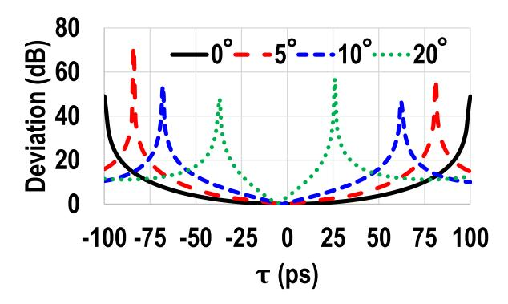

Fig. 3. Spectral deviation between the 27.5/30/32.5-GHz tones for RXs at  $0^{\circ}/5^{\circ}/10^{\circ}/20^{\circ}$  as a function of  $\tau$  using a four-element PTA TX.

four-element PTA TX scheme with  $\Delta t = \tau$  and  $\Delta \Phi = -2\pi f_0 \tau$ ,  $f_0 = 30$  GHz. As shown in Fig. 3, the RXs away from broadside experience higher amount of dispersion; hence, the spectral deviation is greater than the RX at  $0^{\circ}$ .

Although it is not experimentally demonstrated in this work, by setting  $(\Delta t, \Delta \Phi)$  pairs with additional phase difference (4) and (5), the desired main beam direction can be pointed away from broadside. On the other hand, the off-beam directions continue to exhibit severe dispersions. This provides physically secured wireless communication for the main beam direction (not just the broadside direction) and efficiently blocks eavesdroppers. Furthermore, as the beam squinting effects become more prominent with large array sizes, larger arrays will realize better physical layer security like the simulations shown in Fig. 2(c).

Although the proposed basic PTA security scheme can selectively distort the spectrum at the eavesdropper, the information beamwidth (IB) of the scheme (e.g., with 20% EVM for QPSK) is still relatively wide (IB of  $\pm 17^{\circ}$  and  $\pm 12^{\circ}$  for  $\tau = \pm 32/\pm 48$  ps, respectively, in the measurements), and unintended RXs within the IB will continue to receive relatively undistorted signals and demodulate the information. In basic PTA operation, this IB can only be reduced for enhanced security by either using larger time delay or a larger array size (sharper beams). However, the practical delay-bandwidth limit makes it very challenging to realize larger delay over such wide bandwidths (5 GHz), while large arrays are incompatible with many resource-constrained mobile UE applications. To improve the security achieved using a small array (e.g., four-element), we propose an enhanced PTA wireless security with a shifted beam approach [see Fig. 4(a)]. We recognize that the beam squinting phenomenon in PTA is asymmetric for positive or negative beam directions, if we move the main beam at the center frequency slightly away from the broadside direction  $\theta = 0^{\circ}$ . For example, if the main beam direction at the center frequency is shifted with a positive angle, the RX nodes located in  $\theta$  < 0° FoV will observe increased spatial dispersion, as shown in Fig. 4(b), resulting in worsened EVMs than those in the basic PTA scheme. However, the RXs located in  $\theta > 0^{\circ}$  FoV can still eavesdrop on the communication. Similarly, if we shift the main beam at the center frequency to a negative

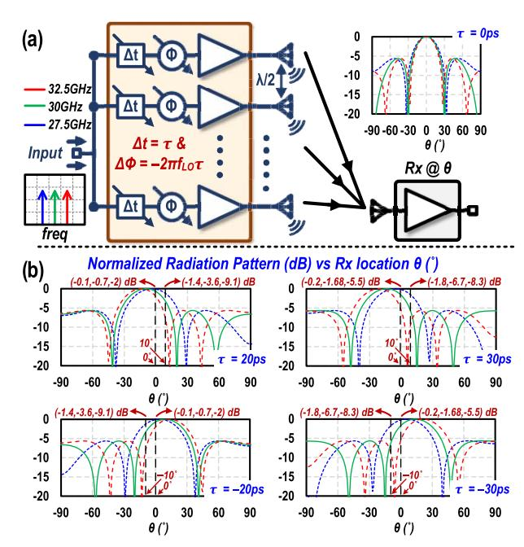

Fig. 4. (a) PTA with joint phase-delay settings to engineer spatial dispersions slightly away from 0° using  $\Delta t_{\rm RF} = \tau$  and  $\Delta \Phi = -2\pi f_{\rm LO}\tau$ ,  $f_{\rm LO} = 26$  GHz. The additional phase shift introduced between the elements when compared to the basic PTA is  $\Delta \Phi = 2\pi f_{\rm IF}\tau$ , where  $f_{\rm IF}$  is 4 GHz. (b) Simulated normalized radiation pattern of a three-tone inputs to a four-element antenna array versus scan angle using different values of  $\tau$  of 20/–20/30/–30 ps. Larger values of  $\tau$  create larger deviation between the amplitude of three tones in  $\theta > 0^\circ$  and  $\theta < 0^\circ$  angles for positive and negative values of  $\tau$ , respectively, where  $\theta$  is the RX angular location with respect to TX.

angle, the RXs in  $\theta>0^\circ$  FoV will exhibit more distorted spectrums while the RXs in  $\theta<0^\circ$  FoV can still eavesdrop on the communication. This threat of unsecure regions in half of the FoV can be overcome by temporally switching between the two beam settings, i.e., dithering between positive and negative main beam angles. Furthermore, the switching sequence can be randomly scrambled to make it hard to recover the information. In contrast, the target RX at  $0^\circ$ , since it is always close to the dithered main beam directions, will receive the spectrum with negligible dispersion in both the cases. On the other hand, the eavesdropper RX nodes in full FoV will receive two aliased and scrambled different spectra, which reliably worsens their reception.

In the measurements for shifted beam PTA approach, an additional phase shift is applied between the TX elements (in addition to  $\Delta t_{\rm RF} = \tau$  and  $\Delta \Phi = -2\pi f_{\rm RF} \tau$ ). Here, without loss of generality, additional phase shift of  $2\pi f_{\rm IF} \tau$  is chosen. This results in a net overall time delay and phase shift needed to be  $\Delta t_{\rm RF} = \tau$  and  $\Delta \Phi = -2\pi f_{\rm LO} \tau$ . Using the frequency translational delay (FTD) on chip, this corresponds to a net IF time delay and LO phase shift of  $\Delta t_{\rm IF} = \tau$  and  $\Delta \Phi = -2\pi f_{\rm LO} \tau + 2\pi f_{\rm LO} \tau = 0^\circ$ . We chose this specific additional phase shift  $(2\pi f_{\rm IF} \tau)$  as it is easier to program the TX in measurements, since we do not need to program the phase shifters of each channel (as  $\Delta \Phi = 0^\circ$ ).

#### C. Multi-RX Localization Using PTA TX

The engineered beam squinting frequency dispersion of PTA can also be utilized to simultaneously determine the

{5}------------------------------------------------

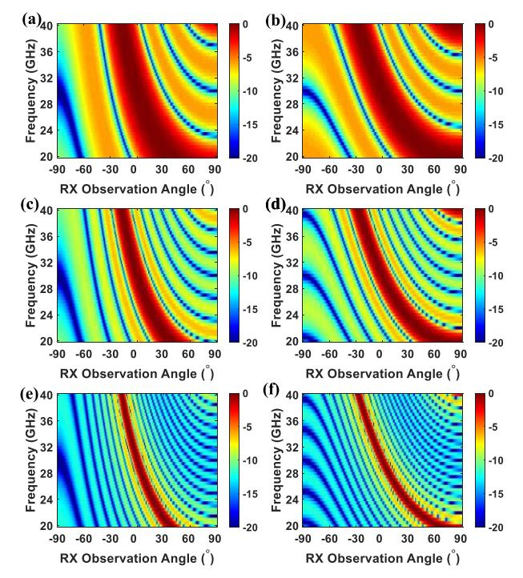

Fig. 5. Simulated radiation pattern of a PTA TX ( $\Delta t_{\rm RF} = \tau$  and  $\Delta \Phi = -2\pi f_{\rm RF}\tau$ ,  $f_{\rm RF} = 30$  GHz) shown as a heat map (in dB scale) against carrier frequency (20–40 GHz) and RX observation angle. Spectral-to-spatial mapping of a PTA with array size and  $\tau$  of (a) N=4 and  $\tau=20$  ps, (b) N=4 and  $\tau=30$  ps, (c) N=8 and  $\tau=20$  ps, (d) N=8 and  $\tau=30$  ps, (e) N=16 and  $\tau=20$  ps, and (f) N=16 and  $\tau=30$  ps. The PTA center frequency of 30 GHz is pointed to the broadside. Larger array size leads to a narrower beamwidth. A larger delay leads to a larger dispersion between the frequency contents as evident from the amplitude distribution over the carrier frequency and scan angle.

angular location of multiple RXs with respect to the TX array, since each RX receives a different and unique spectral content depending on its angular location, i.e., different amplitudes for different carrier frequencies. Therefore, the proposed PTA achieves its localization function similar to a leaky-wave antenna [7], [8], but using a generic antenna array architecture, which can support standard communication or radar sensing functionalities. Moreover, unlike the leaky-wave antenna scheme that uses bulky radiator structures, the PTA can employ any element antennas and ensure compactness for 2-D scalable arrays. Simulations performed on the PTA scheme using a wideband carrier signal from 20 to 40 GHz are shown in Fig. 5 as a heat map versus the RX observation angle and frequency. As expected, the PTA produces the desired spatial dispersion, i.e., different frequency inputs produce their peaks in different directions, essential for simultaneous multi-RX localization. Moreover, using larger array size and larger phase/delay settings ( $\Delta t_{\rm RF} = \tau$  and  $\Delta \Phi = -2\pi f_{\rm RF} \tau$ ) between the antenna elements, stronger spatial dispersion is observed, which can achieve spatial sensing and localization with higher accuracy, as shown in Fig. 5.

# IV. TX ARCHITECTURE AND ON-WAFER MEASUREMENTS A. Time Delay Realization

For an eight-element array at 28 GHz, the maximum time delay required to steer the beam to  $\pm 60^{\circ}$  is 108 ps for the

outer two elements. Realizing this delay at 28 GHz requires a T-line of length 17 mm ( $\varepsilon_r = 3.6$ ) that is infeasible for ON-chip integration due to its size. Other passive T-Line designs, e.g., LC ladders, are used in [20] and [21], but still with substantial area overhead.

The recent work realizes RF delays by digital backend delays and appropriate phase shifts [3]. However, the digital backend delays are inefficient for wideband high-resolution mm-Wave/sub-THz arrays with large IF BW. For example, a 25% fractional BW of a 28-GHz array results in a 7-GHz IF BW.

On the other hand, as most wireless systems are bandpass in nature, the desired delay only needs to be maintained around the carrier frequency unlike all-pass T-line-based delay lines. Therefore, the optimum approach is to generate sufficient delay only over the modulation BW. Realizing this time delay at mm-wave carrier frequencies would require inductors to achieve a bandpass response, s till posing a large area overhead. Alternatively, time delay can be realized at IF. However, simply realizing all the delay in the IF domain has a fundamental issue, since the IF delay scales by the ratio of the IF to RF frequencies ( $\tau_{RF} = \tau_{IF} \times \omega_{IF}/\omega_{RF}$ ) after a simple up-/downconversion. Thus, the amount of time delay required in the IF path will be substantially higher (6 × for  $f_{IF} = 5$  GHz and  $f_{RF} = 30$  GHz). This motivates us to use FTD approach [21]. FTD uses IF time delay along with an additional phase shift to realize equivalent RF time delay. The analysis for FTD approach is not repeated here for the sake of brevity, but the final equations derived in [21] are presented in the following.

To ensure that the time delay introduced in the IF path ( $\tau_{IF}$ ) is the same as the time delay in the RF path ( $\tau_{RF} = \tau_{IF}$ ), an additional phase shift is applied, which is shown in the following equation:

$$\Phi = \omega_{\text{LO}} \times \tau_{\text{IF}}.\tag{11}$$

Assuming that the antenna array is designed with a spacing of "d," the required IF time delay and phase shift to steer the array toward an angle " $\theta$ " are shown in the following equation:

$$\tau_{\rm IF} = \frac{d \sin \theta}{c}, \ \Phi = \frac{\omega_{\rm LO} \times d \sin \theta}{c}.$$
(12)

This additional phase shift can be introduced in the IF, LO, or RF paths. In our design, we use LO path phase shift.

#### B. TX Architecture

As a proof of concept, a four-element PTA TX array chip is designed and fabricated in the GlobalFoundries 45-nm CMOS SOI. The architecture and the chip die photograph for the proposed TX are shown in Fig. 6. The TX utilizes an FTD architecture to realize TTD [21]. The delay elements are designed in IF frequency chain and the phase shifter is implemented in the LO chain. The TX is equipped with IQ IF chains to support single sideband upconversion.

The TX IF input is connected to a single-ended IF TTD chain. Its schematic is shown in Fig. 7(a), and it contains four stages of TTD cells. The TTD unit uses a Gm-C-based active all-pass filter circuit with switched capacitors [22] for realizing a compact and tunable time delay. A few minor modifications

{6}------------------------------------------------

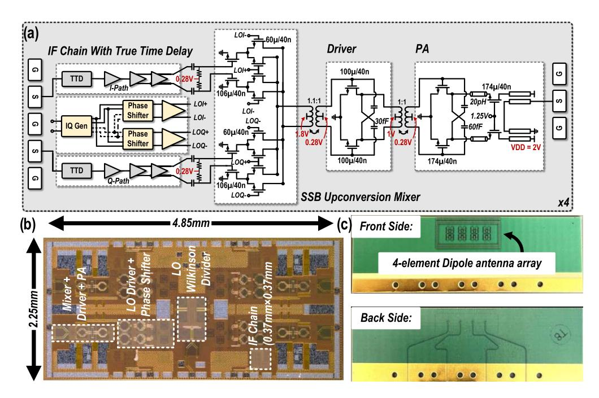

Fig. 6. (a) Architecture for the proposed PTA TX. (b) Chip die photograph for four-channel PTA TX in 45-nm CMOS SOI. (c) Wideband dipole antenna array on PCB.

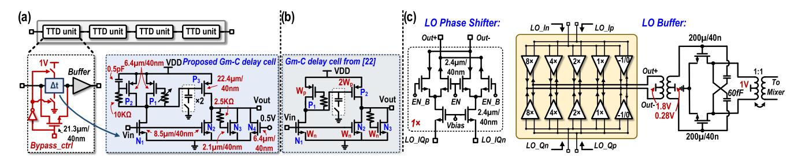

Fig. 7. (a) Circuits for IF TTD in the PTA TX. (b) Gm-C delay cell from [22]. (c) Phase shifter + LO buffer schematics in the PTA TX.

were made to the circuit from [22] for adaptation to lower 45-nm CMOS node and wideband operation. First, due to low output impedance in advanced technologies, the combination of N1 and P1 in Fig. 7(b) does not result in a unity gain. To overcome this, we introduced a pMOS transistor P2 with a low-pass filter in the diode connection [see Fig. 7(a)]. The transistor P2 works as a diode connected load at dc, thus biasing itself. At higher frequencies, P2 works as an active load, thus resulting in higher output impedance. In addition, the gain at the output due to P2 and N2 and N3 in Fig. 7(b) can once again fall below 1 if we use only a diode connected N3 load. Hence, we also introduced a transistor biased at 500 mV [N4 in Fig. 7(a)] separately to restore the overall gain from input to output to 1 as it presents a high output impedance. The TTD cells also consist of tunable active inductors [P1 in Fig. 7(a)] to linearize the time delay and extend the IF delay bandwidth. They are realized using diode connected load in TTD cell with a tunable resistor connecting gate and drain. Tunable resistor is realized using 3-bit switches. The tunable inductor is necessary to maintain an optimal inductive loading in each capacitor configuration. The PMOS and NMOS in TTD unit cell are sized, such that a unity gain is achieved, and the output from Gm-C all-pass filter is buffered to lower the effect of capacitive loading from the following stages. Smaller sizing is used for the PMOS and NMOS transistors to reduce the dc power consumption per unit cell. All the transistors (PMOS and NMOS) in the TTD cell and buffers are gate biased at 500 mV to ease cascadability. To boost the maximum achievable time delay, the TTD unit cells are equipped with bypass switches connected between their input and output. The full TTD chain is designed to support a peak time delay of 112 ps, sufficient for an eight-element antenna array at 28 GHz with ±60◦ beam steering. The TTD is connected to singleended IF amplifier with an active inductor to compensate for possible losses. The IF chain also consists of an active balun to convert single ended IF to differential IF signal. A differential IF amplifier drives the mixer. The transistor level circuits for rest of the IF chain are not included for brevity. The full IF chain only consumes 0.37 × 0.37 mm/channel.

The mixer uses the differential Hartley architecture with gilbert cells to support single sideband upconversion. The LO chain consists of an IQ generation network followed by two variable gain amplifier (VGA)-based phase shifters (360◦ coverage) and two LO buffers corresponding to the I/Q paths, 

{7}------------------------------------------------

respectively [see Fig. 7(c)]. One potential advantage of using LO phase shifter over IF/RF phase shifter is it allows us to have more tolerance to non-linearity in phase shifters since mixer operation inherently relies on non-linear operation of LO signal. On the other hand, IF/RF phase shift would need stringent linear operation for phase shifters. The mixer's common source transistor is biased at 0.28 V and the LO transistor is biased at 1.2 V for realizing class-AB operation with a 1.8-V supply. The output of mixer is connected to a driver amplifier. The driver and PA stages use common source and cascode topologies [15] with neutralization for enhanced differential gain and stability. Both driver and PA stages are biased in class-AB region with 0.28-V gate bias and 1/2-V supply voltages for driver/PA stages, respectively. Transformer-based interstage matching networks are used in between mixer/driver and driver/PA stages. The differential output from the PA core is transformed to a single-ended output using coupled-linebased wideband output balun. The phase shifter, mixer, driver, and PA stages in all the channels are biased using ON-chip programmable bias generation circuits. The phase shifter and TTD cells in all the channels are programmed using ON-chip serial-peripheral interface (SPI).

#### C. Effect of Circuit Non-Idealities on PTA

IQ mismatch: IQ mismatch between the I/Q paths of IF/LO paths can affect the PTA system performance. Analysis is performed in the following.

Here, we assumed a frequency-dependent delay mismatch  $(\Delta \tau_{\rm IF})$  between the I and Q paths of IF chain and phase mismatch between the I and Q paths of LO chain  $(\Delta \Phi)$ . We also considered the amplitude mismatch between the two tones with amplitudes  $A_1$  and  $A_2$  for I/Q signals, respectively. The resulting up-converted signal due to the IQ mismatch is shown in the following equation:

$$X_{\text{UP}} = A_1 \cos(\omega_{\text{LO}}t + \omega_{\text{LO}}\tau) \times \cos(\omega_{\text{IF}}t + \omega_{\text{IF}}\tau)$$
$$-A_2 \sin(\omega_{\text{LO}}t + \omega_{\text{LO}}\tau + \Delta\Phi)$$
$$\times \sin(\omega_{\text{IF}}t + \omega_{\text{IF}}\tau + \omega_{\text{IF}}\Delta\tau_{\text{IF}}). \tag{13}$$

Equation (13) can be simplified as (14) with four-tones centered at  $\omega_{RF} = \omega_{LO} + \omega_{IF}$  and  $\omega_{IM} = \omega_{LO} - \omega_{IF}$ 

$$X_{\text{UP}} = 0.5A_1 \cos (\omega_{\text{RF}}t + \omega_{\text{RF}}\tau) + 0.5A_2 \cos(\omega_{\text{IM}}t + \omega_{\text{IM}}\tau)$$
$$-0.5A_2 \cos(\omega_{\text{IM}}t + \omega_{\text{IM}}\tau - \omega_{\text{IF}}\Delta\tau_{\text{IF}} + \Delta\Phi)$$
$$+0.5A_2 \cos(\omega_{\text{RF}}t + \omega_{\text{RF}}\tau + \omega_{\text{IF}}\Delta\tau_{\text{IF}} + \Delta\Phi).$$
(14)

RF and image (IM) tones from (14) can be simplified as (15) and (16). The resulting up-converted output contains two tones centered at RF and two tones centered at image frequency. The first RF tone is the time-delayed RF tone, i.e., the same as the ideal case with no IQ mismatch. However, the second tone has a frequency-dependent delay mismatch, as shown in (17). Moreover, due to time and phase mismatch between the I/Q signals, it could result in non-zero image frequency tones, thus worsening the image rejection ratio (IMRR)

$$X_{RF} = 0.5A_1 \cos(\omega_{RF}t + \omega_{RF}\tau) + 0.5A_2 \cos(\omega_{RF}t + \omega_{RF}\tau + \omega_{IF}\Delta\tau_{IF} + \Delta\Phi)$$
 (15)

$$X_{\rm IM} = 0.5A_1 \cos(\omega_{\rm IM}t + \omega_{\rm IM}\tau) -0.5A_2 \cos(\omega_{\rm IM}t + \omega_{\rm IM}\tau - \omega_{\rm IF}\Delta\tau_{\rm IF} + \Delta\Phi)$$
 (16)  
$$\tau_2 = \tau + \frac{\omega_{\rm IF}}{\omega_{\rm RF}}\Delta\tau_{\rm IF} + \frac{\Delta\Phi}{\omega_{\rm RF}}.$$
 (17)

If a similar IQ mismatch happens over all the channels, the PTA's radiation pattern would not be affected as the relative time delay between two adjacent channels continues to remain  $\tau$  for both the RF tones, as shown in the following equations:

$$\Delta \tau_{1} = 2\tau - \tau = \tau$$

$$\Delta \tau_{2} = 2\tau + \frac{\omega_{IF}}{\omega_{RF}} \Delta \tau_{IF} + \frac{\Delta \Phi}{\omega_{RF}} - \left(\tau + \frac{\omega_{IF}}{\omega_{RF}} \Delta \tau_{IF} + \frac{\Delta \Phi}{\omega_{RF}}\right)$$

$$\rightarrow \Delta \tau_{2} = \tau.$$

$$(18)$$

If the IQ mismatch is different between channels, it should be potentially calibrated before transmission to avoid non-ideal radiation pattern.

Delay mismatch between channels: frequency dependent and independent delay mismatch between the channels can degrade the performance of the PTA scheme, since any delay mismatch directly affects the radiation pattern. Without loss of generality, we derived the received signal at the broadside (desired RX) to understand the effects of delay mismatch on PTA's performance at the broadside target RX

$$E_{\text{norm}} = \sum_{i=1}^{N} e^{-j\Psi_i}, \Psi_i = (i-1) \times (kd\sin\theta + 2\pi f \tau + \Phi)$$

$$\Psi_i = (i-1) \times (kd\sin\theta + 2\pi (f - f_0)\tau) + 2\pi f \Delta \tau_i.$$
(20)

#### D. TX Channel On-Wafer Measurements

The TX channel is characterized using ON-wafer probing using measurement setup in Fig. 9(a). First, small signal conversion gain is measured across all the delay states over IF frequency sweep of 1-12 GHz and LO frequency of 22 GHz. The delay states are varied from no delay cells on to all delay cells being on with highest cap loading (a total of 25 configurations). The results are summarized in Fig. 8(a). The TX supports a wide IF bandwidth greater than 7 GHz. The worst case 3-dB IF bandwidth is 3.5–10.5 GHz, i.e., RF of 25.5-32.5 GHz. The in-band gain variation between different delay states is <1 dB. For time delay measurements, the Keysight network analyzer PNA-X 5247B is used. PNA's port-1 is used for the IF 1–12-GHz input signal. The RF output from the TX channel is downconverted using the same LO (power divided from source) and is connected to Port-2 of PNA. The results for the measured IF time delay over the delay states are shown in Fig. 8(b). The IF time delay is calculated with zero delay state as timing reference, and it supports a maximum time delay of 112 ps with a minimum time delay step of ~4 ps. Next, the LO phase shifter is characterized using the same setup as time delay. The LO phase shifter supports a dense phase interpolation with a worst case phase step of 12.12° over 360° at 22 GHz, as shown in Fig. 8(c). Next, the RF time delay is measured as a combination of IF time delay and LO phase shift. The RF time delay results

{8}------------------------------------------------

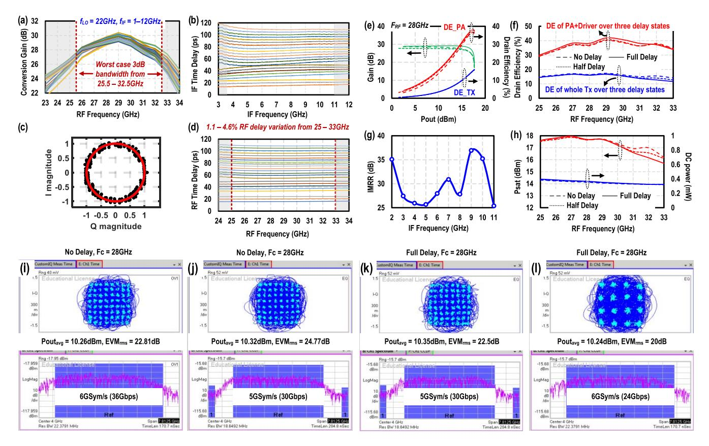

Fig. 8. (a) Measured IF to RF conversion gain over delay settings. (b) Measured IF time delay over all the delay settings. (c) Measured LO phase shifter performance. (d) Measured RF time delay using IF time delay + LO phase shift. (e) Measured CW results at *f*RF = 28 GHz over three delay modes: no delay, half delay, and highest delay. (f) Summary for drain efficiencies of PTA TX and PA stages over *f*RF (25–33 GHz) between the delay modes. (g) Measured IMRR over IF frequency (2–11 GHz). (h) Summary of *P*sat and dc power over *f*RF (25–33 GHz) between the delay modes. Measurements on TX channel using wideband modulated signals in (i) and (j) no delay and (k) and (l) full delay states.

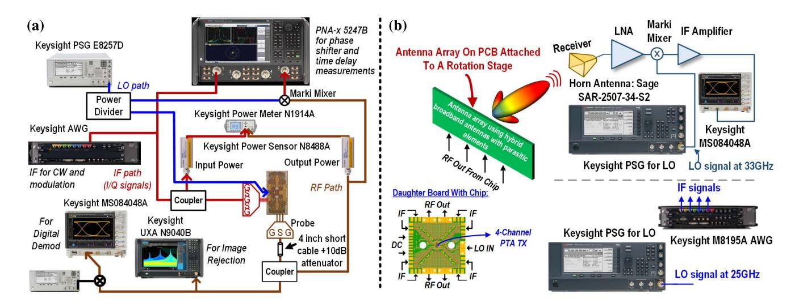

Fig. 9. Measurement setup for (a) ON-wafer measurements of PTA TX channel and (b) OTA physical layer security and RX localization schemes.

are summarized in Fig. 8(d). The time delay variation is between 1.1% and 4.6% over 25–33 GHz (27% FBW). The variation in RF delay [see Fig. 8(d)] is lower than the delay variation in IF [see Fig. 8(b)] as the RF delay is only a fraction of IF delay (since τRF = τIF× ωIF/ωRF + /ωRF). This is another advantage of using FTD. In contrast, using only phase shift, the delay variation is 27% over the same bandwidth.

The TX is also measured under CW signal and modulated signals. First, under CW, the TX is measured over the three delay states, as shown in Fig. 8(e)–(h). The TX achieves a similar CW performance over the three states. At 28 GHz,

{9}------------------------------------------------

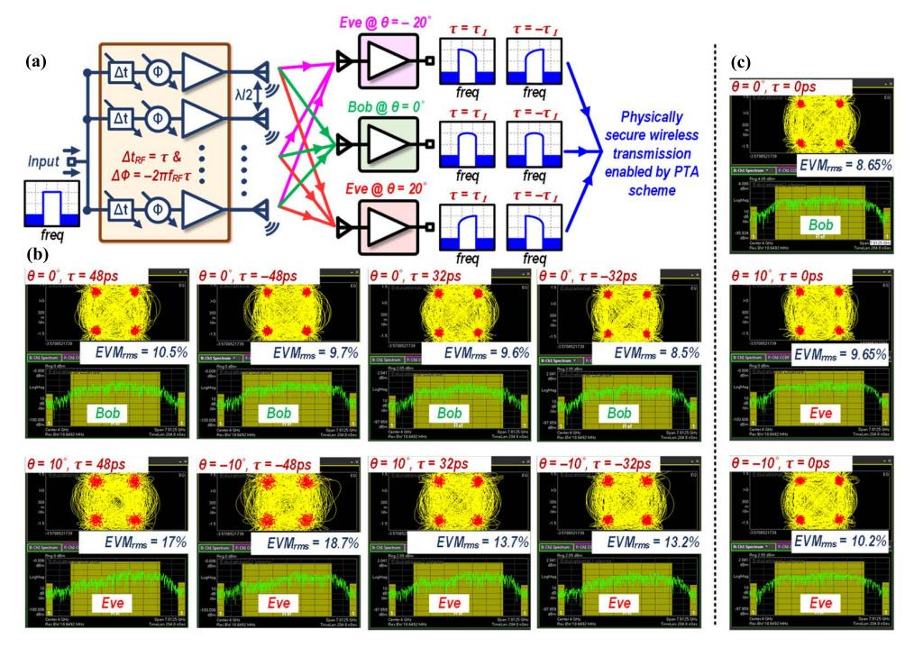

Fig. 10. (a) Concept of the proposed PTA for physically secured wireless transmission using time delay and phase shift ( $\Delta t$  and  $\Delta \Phi$ ) settings. Desired RX (Bob) receives an undistorted spectrum in the intended direction, while the eavesdroppers (Eve) at unintended directions observe heavily distorted spectrum and EVM that block their receptions. (b) Measured OTA EVMs with constellations and spectra for a 5-GHz QPSK modulated signal (10-Gbps bit rate) on a PTA with  $\tau = 32/-32/48/-48$  ps,  $\Delta t_{RF} = \tau$ ,  $\Delta \Phi = -2\pi \times f_{RF} \times \tau$ , and  $f_{RF} = 30$  GHz. Bob at 0° observes a low EVM of <10.5%, while Eve at 10°/-10° observe a large EVM of 13.2%-18.7%. (c) Received constellations at Bob (0°) and Eve (10°/-10°) without PTA operation ( $\tau = 0$  ps).

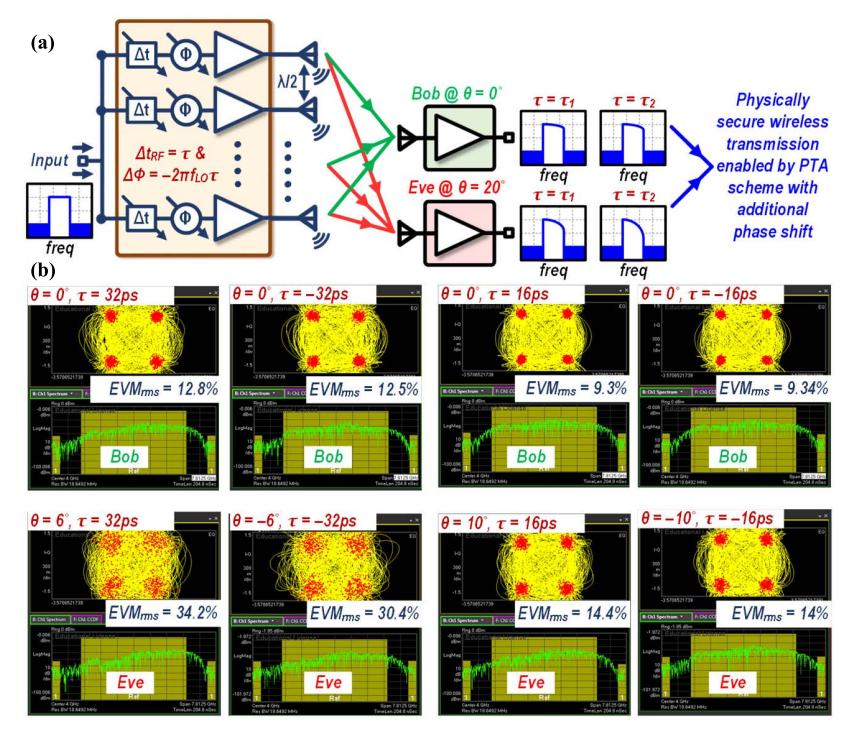

Fig. 11. (a) Enhancing physical wireless security in the broadside direction by shifting the main beam at center frequency with an extra small phase shift. The intended RX Bob in the broadside receives a slightly degraded spectrum, while the eavesdroppers Eve away from the broadside observe significantly degraded EVM for enhanced security. (b) Measured spectrum and EVM of 5-GHz modulated QPSK signal (10-Gbps bit rate) with  $\tau = 16/-16/32/-32$  ps,  $\Delta t_{\rm RF} = \tau$ , and  $\Delta \Phi = -2\pi f_{\rm LO}\tau$ ,  $f_{\rm LO} = 26$  GHz for the intended RX Bob ( $\theta = 0^{\circ}$ ). Eavesdroppers Eves at  $\theta = 6^{\circ}/-6^{\circ}$  receive an EVM of >30.4% with  $\tau = 32/-32$  ps, respectively, when compared to Bob's EVM of <12.8%. Eavesdroppers at  $\theta = 10^{\circ}/-10^{\circ}$  receive an EVM of >14% with  $\tau = 16/-16$  ps, when compared to Bob's ( $\theta = 0^{\circ}$ ) EVM of  $\sim$ 9.3%.

the TX realizes a *P*sat, OP1 dB, and drain efficiency (PA) of 17.66 dBm, 15/15.57/16.2 dBm, and 35%/36%/37%, respectively, in the three states. The measured CW results over

the three delay states across frequency are summarized in Fig. 8(f) and (h). The TX also supports >25-dB IMRR over IF bandwidth, as shown in Fig. 8(g). Under wideband modulated

{10}------------------------------------------------

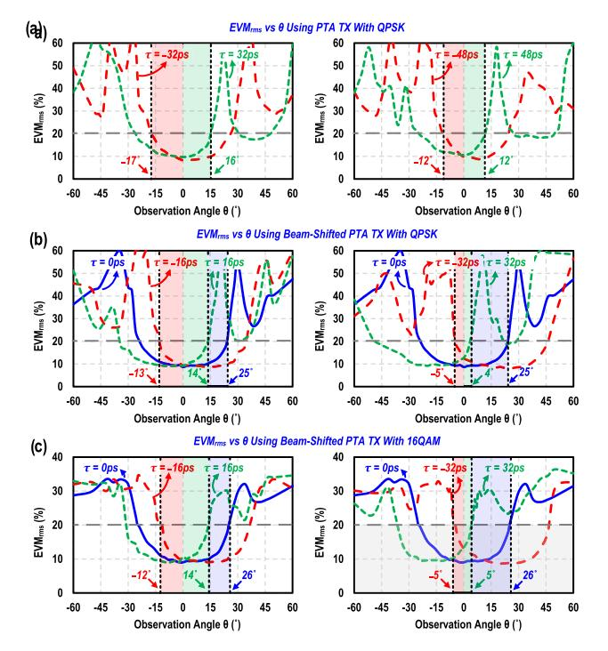

Fig. 12. Summarized measurement results for the PTA schemes. (a) RMS EVM versus  $\theta$  with 5-GHz QPSK input for  $\theta=-60^\circ$  to  $60^\circ$  using  $\tau=32/-32/48/-48$  ps,  $\Delta t_{\rm RF}=\tau$ , and  $\Delta\Phi=-2\pi\,f_{\rm RF}\tau$ ,  $f_{\rm RF}=30$  GHz. Larger delay result in enhanced security (higher degradation versus observation angle). The IB with 20% rms EVM is  $\pm17^\circ$  and  $\pm12^\circ$  for  $\tau=\pm32/\pm48$  ps, respectively. (b) RMS EVM versus  $\theta$  with 5-GHz QPSK input for  $\theta=-60^\circ$  to  $60^\circ$  using  $\tau=32/-32/16/-16$  ps,  $\Delta t_{\rm RF}=\tau$ , and  $\Delta\Phi=-2\pi\,f_{\rm LO}\tau$ ,  $f_{\rm LO}=26$  GHz. (c) RMS EVM versus  $\theta$  with 5-GHz 16 QAM input for  $\theta=-60^\circ$  to  $60^\circ$  using  $\tau=32/-32/16/-16$  ps,  $\Delta t_{\rm RF}=\tau$ , and  $\Delta\Phi=-2\pi\,f_{\rm LO}\tau$ ,  $f_{\rm LO}=26$  GHz. The IB with 20% rms EVM is  $\pm14^\circ$  and  $\pm5^\circ$  for  $\tau=\pm16/\pm32$  ps, respectively, for (b) and (c).

input, the TX supports a 6 GSym/s 64 QAM signal (36 Gbps data rate) with zero delay setting and 6 GSym/s 16 QAM and 5 GSym/s 64 QAM signals under the highest delay setting [see Fig. 8(i)–(l)].

# V. OTA SECURITY/RX LOCALIZATION DEMONSTRATION USING PTA TX

OTA measurements were performed using the four-element PTA TX to demonstrate the proposed physical layer security and RX localization schemes. The measurement setup for the OTA measurements is shown in Fig. 9(b). A horn antenna with low noise amplifier (LNA) and a downconversion mixer is used as the RX to demodulate the modulated signal being transmitted. The TX array is wire-bonded onto a daughter board. The RF output from the daughter board is connected to a hybrid dipole antenna array (with active \$11 < -10 dB from 23.5 to 46 GHz) on mother board PCB [see Fig. 6(e)] using four phase matched cables. The motherboard is mounted on a rotation stage to perform scan angle measurements. The wideband IF modulated signals are generated using Keysight arbitrary waveform generator (AWG) M8195A.

For the experimental demonstration of PTA secured communication, a wideband modulated QPSK signal with a bandwidth of 5 GHz is used [see Fig. 10(b)]. A four-element PTA TX with ON-chip time delay elements and phase shifters is used for the proposed PTA security scheme. First, a fixed RF

delay of 32 ps is introduced between the elements along with a phase difference of  $-346^{\circ}$  ( $-2\pi \times f_{RF} \times \tau$ ,  $f_{RF} = 30$  GHz) between the array elements. The PTA TX is initially focused at the broadside direction and is then rotated by the rotational stage, so that a fixed RX node is used to measure the rms EVM of the received signal over the full FoV.

The measured received spectra and constellations are shown in Fig. 10(b) for different TX–RX angles using  $\Delta t_{RF} = \tau$  and  $\Delta\Phi = -2\pi \times f_{RF} \times \tau$ ,  $f_{RF} = 30$  GHz. With  $\tau = 32$  ps, the RX located at broadside receives an undistorted spectrum with a 9.6% EVM of the received QPSK (e.g., suggested rms EVM for a QPSK signal is <17.5%). However, the RX at  $\theta = 10^{\circ}$  observes a distorted spectrum that worsens the received QPSK's EVM to 13.7%. Similarly, with  $\tau = -32$  ps, the broadside RX observes an EVM of 8.5% and the RX at  $\theta = -10^{\circ}$  receives a worsened EVM of 13.2%. Moreover, when  $\tau$  is increased to 48/–48 ps (additional 16-ps differential IF delay provided by AWG), the broadside RX observes an EVM of 10.5%/9.7%, respectively, still sufficient for demodulation, while the RX at  $10^{\circ}/-10^{\circ}$  observes a significantly worsened EVM of 17%/18.7%, respectively. These results demonstrate the physically secured wireless communication of the proposed PTA scheme for the intended and unintended RXs. Moreover,  $(\Delta t, \Delta \Phi)$  settings with larger time delay and phase shift values enhance the security due to elevated beam squinting, thus offering adjustable levels of wireless security. Measurements are performed for received rms EVM versus RX observation angle  $(\theta)$  over  $-60^{\circ}$  to  $60^{\circ}$ , and the results are summarized in Fig. 12(a). Please note that security can also be realized toward non-broadside direction ( $\theta \neq 0^{\circ}$ ) as well, by introducing additional phase difference between the array elements to focus at intended non-broadside angles.

Therefore, using the proposed PTA without any cryptograph or digital computation overhead, wideband modulated signals can be securely transmitted to the desired RX while distorting the spectrum and EVMs for eavesdroppers at unintended directions. Although we did not experimentally demonstrate it here due to delay limitation ON chip, please note that the proposed PTA scheme can also be extended to low-bandwidth modulated signals using larger  $(\Delta t, \Delta \Phi)$  settings between the elements to attain desired level of beam squinting dispersion for wireless security. For example, at 20° unintended transmission direction, a 1-GHz modulated signal at 30-GHz carrier frequency will undergo the same level of spectrum dispersion and EVM degradation with  $(\Delta t, \Delta \Phi) = (160 \text{ ps},$  $-1728^{\circ}/-288^{\circ}$ ) as a 5-GHz modulated signal using ( $\Delta t$ ,  $\Delta\Phi$ ) = (32 ps, -346°). Fortunately, the delay-bandwidth product limit governs that a delay step of 160 ps over a 1-GHz bandwidth has a similar implementation complexity as a 32-ps delay over a 5-GHz bandwidth [20]. Therefore, the proposed PTA scheme with reconfigurable  $(\Delta t, \Delta \Phi)$ settings can support secured transmission of a wide variety of modulated signals.

Next, the beam-shifted PTA security scheme is demonstrated in Fig. 11. The measurement setup is the same as before; however, an additional phase difference is introduced to shift the main beam. The measurement results are shown in Fig. 11. As expected, for RXs located away from the broadside

{11}------------------------------------------------

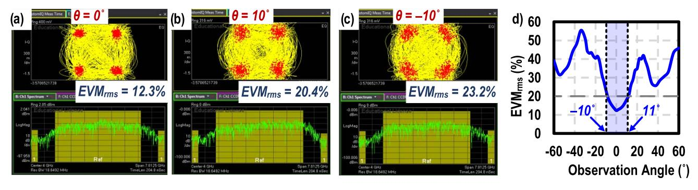

Fig. 13. (a)–(c) Measured EVM results after employing time swapping between  $\tau = 16/-16$  ps with  $\Delta t_{RF} = \tau$  and  $\Delta \Phi = -2\pi f_{LO}\tau$  at  $\theta = 0^\circ/10^\circ/-10^\circ$ . (d) EVMrms versus observation angle ( $\theta = -60^\circ$  to  $60^\circ$ ) with time swap. IB (20% rms EVM) with  $\tau = 16/-16$  ps setting is  $\pm 11^\circ$ .

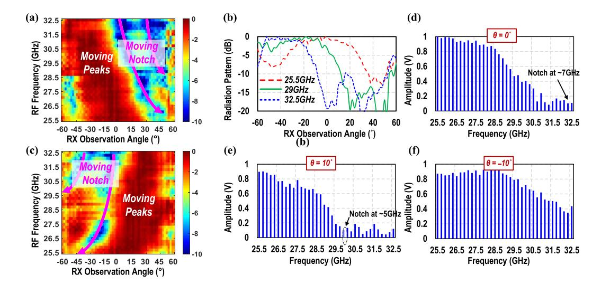

Fig. 14. Heatmap showing measured radiation pattern amplitude response in dB scale ( $f_{RF}=25.5$ –32.5 GHz) of a four-element PTA against RX observation by creating beam squinting. The amplitude peak and null of the spectrum moves as a function of angle using (a)  $\tau=32$  ps and (b)  $\tau=-32$  ps, both with  $\Delta t_{RF}=\tau$  and  $\Delta \Phi=-2\pi f_{LO}\tau$ ,  $f_{LO}=25$  GHz. (c) Radiation pattern over observation angle for the three tones at  $f_{RF}=25.5/29/32.5$  GHz showing beam squinting phenomenon  $\tau=32$  ps with  $\Delta t_{RF}=\tau$  and  $\Delta \Phi=-2\pi f_{LO}\tau$ . (d)–(f) Distinct spectral content received by RX nodes at  $\theta=0^{\circ}/-10^{\circ}/10^{\circ}$  with notch at different frequencies using  $\tau=32$  ps, with  $\Delta t_{RF}=\tau$  and  $\Delta \Phi=-2\pi f_{LO}\tau$ ,  $f_{LO}=26$  GHz.

direction, the EVM degrades much more rapidly by using this shifted beam approach using the same amount of delay. With a  $\tau=\pm 16$  ps ( $\Delta t_{\rm RF}=\tau$ ,  $\Delta \Phi=-2\pi f_{\rm LO}\tau$ , and  $f_{\rm LO}=26$  GHz) between the array elements, the RX at 0° receives a QPSK signal with similar rms EVM of 9.3%/9.34%, respectively, with successful demodulation. On the other hand, the eavesdropper RXs at  $\theta=\pm 10^\circ$  receive a QPSK signal with rms EVM of 14.4%/14% with  $\tau=\pm 16$  ps, respectively.

Furthermore, by using a larger  $\tau=\pm32$  ps, the RX at 0° receives slightly degraded rms EVM of 12.8%/12.5%, while even the RXs located at  $\theta=\pm6^\circ$  receive significantly worse rms EVM of 34.2%/30.4%. In comparison to the basic PTA scheme, we can obtain a much better security for the same delay setting  $\Delta t$ . The measured EVM over the observation angle ( $\theta$ ) is summarized in Fig. 12(b). When compared to the case of  $\tau=0$ , i.e., the conventional phased array with no phase shift, the proposed shifted beam PTA technique offers enhanced security in unintended directions especially for small sized arrays. For example, using  $\tau=32/-32$  ps, the proposed shifted-beam PTA delivers an IB of  $\pm5^\circ$  with 20% rms EVM for QPSK modulation (10-Gbps data rate).

On the other hand, with conventional four-element phased array, the IB with 20% rms EVM is  $\pm 25^{\circ}$ . Furthermore, the security can be reconfigured depending on the requirements by setting a  $\tau = \pm 16$  ps to obtain an IB of  $\pm 14^{\circ}$  with 20% rms EVM. Experiments were also performed with 5-GHz 16 QAM modulated input (20-Gbps data rate). The EVM versus RX observation angle is summarized in Fig. 12(c). The EVM shows a similar profile, but the 16 QAM constellation unlocks at a lower EVM of 30%; hence, the EVM is limited to  $\sim 35\%$ .

As expected from simulations in Fig. 4(b), with positive  $\tau$  settings, the scheme can provide secure transmission with worsened EVM in  $\theta > 0^{\circ}$  FoV, while the RXs located on the opposite half of the FoV can continue eavesdropping, creating unsecure regions. Therefore, the temporal swapping is applied between the two beams.

Measurements are performed using temporal swapping between the two beams to validate that the temporal swapping on shifted beam PTA indeed eliminates these unsecure regions. The measurement results are presented in Fig. 13(a)–(c). Here, the temporal swapping is performed between  $\tau=\pm 16$  ps for the proof-of-concept, but it can be extended to different

{12}------------------------------------------------

delay settings. The swapping is performed in a pseudorandom fashion to scramble the settings. Due to temporal swapping, the eavesdroppers at  $\theta=10^\circ/-10^\circ$  observe two different spectra; hence, the eavesdropper RXs face difficulty in locking onto a constellation with low EVM and observe worsened rms EVM of 20.4%/23.1%, respectively. The RX at  $\theta=0^\circ$  on the other hand still receives identical spectrum in both the settings with 12.2% EVM sufficient for demodulations. The measured results over observation angle  $\theta$  are summarized in Fig. 13(d).

Measurements are performed to verify the PTA multi-RX localization capabilities. A continuous wave IF signal is fed to the PTA TX and is frequency swept, so that the PTA TX output carrier covers 25.5–32.5 GHz. The resulting spectrum is observed as a function of RX location ( $\theta$ ). Here, a  $\tau=\pm 32$  ps is used with  $\Delta t_{\rm RF}=\tau$  and  $\Delta\Phi=-2\pi f_{\rm LO}\tau$ . The resulting spectral to spatial conversion is shown in Fig. 14(a) and (b). The peak of the spectrum moves between  $\sim 15^{\circ}/-15^{\circ}$  and  $-45^{\circ}/45^{\circ}$  when the frequency is swept from 25.5 to 32.5 GHz for  $\tau=32/-32$  ps, respectively.

However, using the peak of the main lobe over frequency to determine the angular location will have large angular ambiguity, especially with just a four-element array that has a wide beamwidth of  $26^{\circ}$  ( $\pm 13^{\circ}$ ). Hence, we also show the notch/null as a function of RX observation angle [see Fig. 14(a) and (b)]. Since the null for this technique is determined as (12) (see Appendix), which is quite sensitive to frequency input and scan angle, it provides a sharper angular response, as shown in Fig. 14(a) and (b). Therefore, by using two settings for  $\tau =$ 32/-32 ps and by sweeping the frequency over a 7 GHz range and observing the null frequency, we can potentially localize the RXs over the full FoV. This is assuming that there are no unintended transmissions toward RXs happening at the same time, as the RXs could potentially not observe any spectral null in the presence of unintended transmissions. Note that using a larger bandwidth can cover larger angular range and larger array size can lead to narrower beams, hence making it easier to detect RX location (see Fig. 5).

#### VI. CONCLUSION

In this article, we propose a PTA technique using a combination of time delay and phase shift between the antenna elements in an array to achieve a reconfigurable prism-like spectral-to-spatial mapping property by purposefully creating and engineering the array beam squinting phenomenon. We demonstrated reconfigurable modes of operation for the PTA TX where it could be configured in: 1) communication mode with no security by applying no joint delay and phase shift settings between elements; 2) communication mode with variable security by configuring the joint delay and phase shift settings; and 3) localization mode for angular sensing of multi-RXs. In security mode, IB (with 20% rms EVM) as low as  $\pm 5^{\circ}$  is achieved. On the other hand, in localization mode, the PTA operation covers the entire FoV using just two settings of  $\tau$ , i.e.,  $\tau = \pm 32$  ps, covering positive and negative observation angles in the two settings, respectively.

We also envision that this proposed PTA with prismlike spectral-to-spatial mapping property can be potentially explored to create a single input interface for multi-beam MIMO operation, where different frequency contents in a multi-frequency input are focused in different directions. Single-wire MIMO interface remains an active research area for large-scale MIMO arrays where routing multiple IF inputs to multiple chiplets is cumbersome [23], [24], [25]. Since this behavior is reconfigurable as a function of the joint delay/phase shift combination, the beam directions in the spatial MIMO operation could also be re-programmed.

#### APPENDIX

The normalized radiation pattern of an N-element antenna array with an applied time delay and phase shift can be expressed as shown in (21) using a variable  $\Psi$ . Here, f is the RF frequency of operation and  $f_0$  is the center frequency

$$E_{\text{norm}} = \frac{\sin(\frac{N\Psi}{2})}{\sin(\frac{\Psi}{2})}, \ \Psi = kd\sin\theta + 2\pi f \,\Delta t + \Delta\Phi.$$
 (21)

Equation (22) shows the condition for the peak in radiation pattern, i.e.,  $\Psi = 0$ 

$$kd\sin\theta_{\text{peak}} + 2\pi f \Delta t + \Delta \Phi = 0, \ l \in \mathbb{Z}, \ l \neq 0.$$
 (22)

Next, we substitute  $\Delta t$  and  $\Delta \Phi$  used for the PTA operation, i.e.,  $\Delta t = \tau$  and  $\Delta \Phi = -2\pi f_0 \tau$ . We also substitute wavenumber (k), d with  $k = 2\pi/\lambda$  and  $d = \lambda_0/2$ . Equation (22) can be simplified as follows:

$$\frac{2\pi}{\lambda} \times \frac{\lambda_0}{2} \times \sin\theta_{\text{peak}} + 2\pi f \tau - 2\pi f_0 \tau = 0$$
 (23)

$$\frac{f}{f_0} \times \sin\theta_{\text{peak}} = 2 \times (f_0 - f) \times \tau. \tag{24}$$

The peak of the radiation pattern " $\theta_{\text{peak}}$ " for a frequency "f" can be derived, as shown in (25). As expected, the peak changes as a function of operation frequency "f" and  $\tau$  used for PTA operation. Larger  $\tau$  results in greater amount of dispersion

$$\theta_{\text{peak}} = \sin^{-1}\left(\frac{2}{\times}(f_0 - f) \times \tau \frac{f}{f_0}\right). \tag{25}$$

Equation (26) shows the condition for a null in radiation pattern for an antenna array, i.e.,  $\Psi = 2l\pi/N$ 

$$kd\sin\theta_{\text{NULL}} + 2\pi f \Delta t + \Delta \Phi = \frac{l \times 2\pi}{N}, \quad l \neq 0.$$
 (26)

Next, we substitute  $\Delta t$  and  $\Delta \Phi$  used for the PTA operation, i.e.,  $\Delta t = \tau$  and  $\Delta \Phi = -2\pi f_0 \tau$ . We also substitute wavenumber (k), d with  $k = 2\pi/\lambda$  and  $d = \lambda_0/2$ . Equation (26) can be simplified as follows:

$$\frac{2\pi}{\lambda} \times \frac{\lambda_0}{2} \times \sin\theta_{\text{NULL}} + 2\pi f \tau - 2\pi f_0 \tau = \frac{l \times 2\pi}{N}$$
 (27)

$$\frac{f}{f_0} \times \sin\theta_{\text{NULL}} = 2 \times (f_0 - f) \times \tau + \frac{2l}{N}.$$
 (28)

The null of the radiation pattern could be expressed as  $\theta_{\text{NULL}}$ , which could be derived as shown in (29), a function of the frequency of operation,  $\tau$  used for PTA and the center frequency

$$\theta_{\text{NULL}} = \sin^{-1}\left(\frac{2}{\times}(f_0 - f) \times \tau + \frac{2l}{N}\frac{f}{f_0}\right), \ l \in \mathbb{Z}, \ l \neq 0.$$
(29)

{13}------------------------------------------------

### ACKNOWLEDGMENT

The authors would like to thank Prof. Matthieu Bloch at the Georgia Institute of Technology (Georgia Tech), Atlanta, GA, USA, and members of the Georgia Tech Electronics and Micro-Systems (GEMS) Group for their technical discussions. They would also like to thank GlobalFoundries for MPW tapeout support.

### REFERENCES

- [1] T. Wild, V. Braun, and H. Viswanathan, "Joint design of communication and sensing for beyond 5G and 6G systems," *IEEE Access*, vol. 9, pp. 30845–30857, 2021.
- [2] *Phased Array Antenna Patterns—Part 1*. Accessed: May 2022. [Online]. Available: https://www.analog.com/en/analog-dialogue/articles/phasedarrayantenna-patterns-part1.html
- [3] S. Shahramian, M. J. Holyoak, A. Singh, and Y. Baeyens, "A fully integrated 384-element, 16-tile, W-band phased array with selfalignment and self-test," *IEEE J. Solid-State Circuits*, vol. 54, no. 9, pp. 2419–2434, Aug. 2019.
- [4] T. Sowlatiet et al., "A 60-GHz 144-element phased-array transceiver for backhaul application," *IEEE J. Solid-State Circuits*, vol. 53, no. 12, pp. 3640–3659, Dec. 2018.
- [5] A. Valdes-Garcia et al., "A fully integrated 16-element phased-array transmitter in SiGe BiCMOS for 60-GHz communications," *IEEE J. Solid-State Circuits*, vol. 45, no. 12, pp. 2757–2773, Dec. 2010.
- [6] B. Sadhu et al., "A 28-GHz 32-element TRX phased-array IC with concurrent dual-polarized operation and orthogonal phase and gain control for 5G communications," *IEEE J. Solid-State Circuits*, vol. 52, no. 12, pp. 3373–3391, Dec. 2017.
- [7] H. Saeidi, S. Venkatesh, X. Lu, and K. Sengupta, "THz prism: One-shot simultaneous multi-node angular localization using Spectrum-to-space mapping with 360-to-400 GHz broadband transceiver and dual-port integrated leaky-wave antennas," in *IEEE Int. Solid-State Circuits Conf. (ISSCC) Dig. Tech. Papers*, Feb. 2021, pp. 314–316.
- [8] Y. Ghasempour, R. Shrestha, A. Charous, E. Knightly, and D. M. Mittleman, "Single-shot link discovery for terahertz wireless networks," *Nature Commun.*, vol. 11, no. 1, pp. 1–6, Apr. 2020.
- [9] C.-Y. Yeh, Y. Ghasempour, Y. Amarasinghe, D. M. Mittleman, and E. W. Knightly, "Security in terahertz WLANs with leaky wave antennas," in *Proc. 13th ACM Conf. Secur. Privacy Wireless Mobile Netw.*, Jul. 2020, pp. 317–327.
- [10] M. Bloch and J. Barros, *Physical-Layer Security: From Information Theory to Security Engineering*. Cambridge, U.K.: Cambridge Univ. Press, 2011.
- [11] M. Bloch, J. Barros, M. R. D. Rodrigues, and S. W. McLaughlin, "Wireless information-theoretic security," *IEEE Trans. Inf. Theory*, vol. 54, no. 6, pp. 2515–2534, Jun. 2008.
- [12] N. N. Alotaibi and K. A. Hamdi, "Switched phased-array transmission architecture for secure millimeter-wave wireless communication," *IEEE Trans. Commun.*, vol. 64, no. 3, pp. 1303–1312, Mar. 2016.
- [13] M. P. Daly, E. L. Daly, and J. T. Bernhard, "Demonstration of directional modulation using a phased array," *IEEE Trans. Antennas Propag.*, vol. 58, no. 5, pp. 1545–1550, May 2010.
- [14] X. Lu, S. Venkatesh, B. Tang, and K. Sengupta, "4.6 space-time modulated 71-to-76 GHz mm-wave transmitter array for physically secure directional wireless links," in *IEEE Int. Solid-State Circuits Conf. (ISSCC) Dig. Tech. Papers*, Feb. 2020, pp. 86–88.
- [15] N. S. Mannem et al., "A 25–34-GHz eight-element MIMO transmitter for keyless high throughput directionally secure communication," *IEEE J. Solid-State Circuits*, vol. 57, no. 5, pp. 1244–1256, May 2022.
- [16] N. Valliappan, A. Lozano, and R. W. Heath Jr., "Antenna subset modulation for secure millimeter-wave wireless communication," *IEEE Trans. Commun.*, vol. 61, no. 8, pp. 3231–3245, Aug. 2013.
- [17] N. S. Mannem, T.-Y. Huang, E. Erfani, S. Li, and H. Wang, "A mmwave transmitter MIMO with constellation decomposition array (CDA) for keyless physically secured high-throughput links," in *Proc. IEEE Radio Freq. Integr. Circuits Symp. (RFIC)*, Jun. 2021, pp. 199–202.
- [18] J. Guo, L. Poli, M. A. Hannan, P. Rocca, S. Yang, and A. Massa, "Time-modulated arrays for physical layer secure communications: Optimization-based synthesis and experimental assessment," *IEEE Trans. Antennas Propag.*, vol. 66, no. 12, pp. 6939–6949, Dec. 2018.
- [19] J. Chen et al., "A digitally modulated mm-wave Cartesian beamforming transmitter with quadrature spatial combining," in *IEEE Int. Solid-State Circuits Conf. (ISSCC) Dig. Tech. Papers*, Feb. 2013, pp. 232–233.

- [20] T.-S. Chu, J. Roderick, and H. Hashemi, "An integrated ultra-wideband timed array receiver in 0.13 μm CMOS using a path-sharing true time delay architecture," *IEEE J. Solid-State Circuits*, vol. 42, no. 12, pp. 2834–2850, Dec. 2007.
- [21] S. Jang, R. Lu, J. Jeong, and M. Flynn, "A 1-GHz 16-element fourbeam true-time-delay digital beamformer," *IEEE J. Solid-State Circuits*, vol. 54, no. 5, pp. 1304–1314, May 2019.
- [22] S. K. Garakoui, E. A. M. Klumperink, B. Nauta, and F. E. van Vliet, "Compact cascadable g*m*-C all-pass true time delay cell with reduced delay variation over frequency," *IEEE J. Solid-State Circuits*, vol. 50, no. 3, pp. 693–703, Mar. 2015.
- [23] R. Garg et al., "A 28-GHz beam-space MIMO RX with spatial filtering and frequency-division multiplexing-based single-wire IF interface," *IEEE J. Solid-State Circuits*, vol. 56, no. 8, pp. 2295–2307, Aug. 2020.
- [24] M. Johnson et al., "A 4-element 28 GHz millimeter-wave MIMO array with single-wire interface using code-domain multiplexing in 65 nm CMOS," in *Proc. IEEE Radio Freq. Integr. Circuits Symp. (RFIC)*, Jun. 2019, pp. 243–246.
- [25] A. Binaie et al., "A scalable 60 GHz 4-element MIMO transmitter with a frequency-domain-multiplexing single-wire interface and harmonicrejection-based de-multiplexing," in *Proc. IEEE Radio Freq. Integr. Circuits Symp. (RFIC)*, Aug. 2020, pp. 1–4.

**Naga Sasikanth Mannem** (Student Member, IEEE) received the B.Tech. and M.Tech. degrees in electronics and electrical communication engineering with specialization in VLSI from IIT Kharagpur (IIT KGP), Kharagpur, India, in 2018, and the Ph.D. degree in electrical and computer engineering from the Georgia Institute of Technology, Atlanta, GA, USA, in 2022.

His research interests include RF/millimeter-wave (mm-Wave) integrated circuits and systems.

Dr. Mannem was a recipient of the Analog Devices Inc., Outstanding Student Designer Award in 2021 and the SSCS Predoctoral

Achievement Award in 2021–2022. He was a recipient of the Best Student Paper Award Second Place at the IEEE Radio Frequency Integrated Circuits (RFIC) Conference 2021 and a co-recipient of the International Microwave Symposium (IMS) Best Student Paper Award Second Place at IMS 2021.

**Jeongsoo Park** (Member, IEEE) received the B.S. and Ph.D. degrees in electronic engineering from Kwangwoon University, Seoul, South Korea, in 2015 and 2020, respectively.

From 2020 to 2022, he was a Research Engineer with the Georgia Tech Electronics and Micro-System Laboratory (GEMS), School of Electrical and Computer Engineering, Georgia Institute of Technology, Atlanta, GA, USA. In 2022, he joined the Integrated Devices, Electronics, and Systems Laboratory (IDEAS), Department of Information Technology

and Electrical Engineering, Eidgenössische Technische Hochschule Zürich (ETH Zürich), Zürich, Switzerland, as a Post-Doctoral Researcher. His current research interests include broadband phased-array antenna systems, integrated radio and radar systems for wireless communications, wireless sensing and detection, and imaging applications at RF, microwave, millimeter-wave, and sub-millimeter-wave regimes.

Dr. Park was a recipient of the 2020 Best Paper Award of the IEEE Microwave Theory and Technology Society, Seoul Chapter.

**Elham Erfani** (Member, IEEE) received the Ph.D. degree in telecommunication engineering from the Institute National de la Recherche Scientifique (INRS), Montreal, QC, Canada, in 2019.

From September 2015 to February 2017, she was with the Center for Intelligent Antenna and Radio Systems (CIARS), University of Waterloo, Waterloo, ON, Canada, as a Visiting Researcher, to work on the theoretical analysis and fabrication of planar transmit-array antennas for mm-wave backhaul application. She has been with the Georgia Tech

Electronics and Micro-System Laboratory (GEMS) Research Group, Georgia Institute Technology, Atlanta, GA, USA, as a Post-Doctoral Researcher, working on mm-wave antenna-in-package and antenna-on chip since 2019. Her research interests include millimeter-wave (mm-Wave) antennas, artificial materials, mm-Wave receivers to transceivers, phased arrays, and mm-Wave integrated circuits.

{14}------------------------------------------------

Dr. Erfani was awarded the Alexander Graham Bell Scholarship, the Natural Sciences and Engineering Research Council (NSERC) Scholarship, the Postgraduate Scholarships-Doctoral Program (NSERC), and the Fonds de Recherche du Qubec Nature et Technologies (FRQNT) Scholarship during her Ph.D. She was also a recipient of the NSERC Post-Doctoral Fellowship Scholarship.

**Edward Liu** (Student Member, IEEE) received the B.S. and M.S. degrees in electrical and computer engineering (ECE) from the University of Texas at Austin, Austin, TX, USA, both in 2020. He is currently pursuing the Ph.D. degree with the Department of Information Technology and Electrical Engineering, Swiss Federal Institute of Technology, Zürich, Switzerland.

His research interests include RF/mm-Wave integrated circuits and systems.

**Jeongseok Lee** (Student Member, IEEE) received the B.S. and M.S degrees in electronic and electrical engineering from Sungkyunkwan University, Suwon, South Korea, in 2007 and 2014, respectively. He is currently pursuing the Ph.D. degree with the Georgia Institute of Technology, Atlanta, GA, USA.

He has been an RF/Antenna Design Engineer with the Mobile Communication Division, Samsung Electronics Company Ltd., Suwon, since 2007, where he has been involved in RF front-end circuits and antennas design for mobile devices. His current

research interests include novel RF/mm-Wave integrated circuits/systems and CMOS power amplifier design.

**Hua Wang** (Fellow, IEEE) received the M.S. and Ph.D. degrees in electrical engineering from the California Institute of Technology, Pasadena, CA, USA, in 2007 and 2009, respectively.

He is currently a Full Professor and the Chair of electronics with the Department of Information Technology and Electrical Engineering (D-ITET), Swiss Federal Institute of Technology Zürich (ETH Zürich), Zürich, Switzerland. He is also the Director of the ETH Integrated Devices, Electronics, and Systems (IDEAS) Group. He is also jointly affiliated

with the School of Electrical and Computer Engineering (ECE), Georgia Institute of Technology (Georgia Tech), Atlanta, GA, USA. He held the Demetrius T. Paris Professorship at the School of ECE, Georgia Tech. He was the Founding Director of the Georgia Tech Center of Circuits and Systems (CCS) and the Director of the Georgia Tech Electronics and Micro-System (GEMS) Laboratory. He worked with Intel Corporation and Skyworks Solutions from 2010 to 2011. He has authored or coauthored over 200 peerreviewed journal and conference papers. He is interested in innovating analog, mixed-signal, RF, and mm-Wave integrated circuits and hybrid systems for wireless communication, sensing, and bioelectronics applications.

Dr. Wang received the Qualcomm Faculty Award in 2020 and 2021, the DARPA Director's Fellowship Award in 2020 (the First Awardee in Georgia Tech's history), the DARPA Young Faculty Award in 2018, the IEEE Microwave Theory and Techniques Society (MTT-S) Outstanding Young Engineer Award in 2017, the Georgia Tech Sigma Xi Young Faculty Award in 2016, the National Science Foundation CAREER Award in 2015, the Georgia Tech ECE Outstanding Junior Faculty Member Award in 2015, and the Lockheed Dean's Excellence in Teaching Award in 2015. His research group has won multiple academic awards and best paper awards, including the 2019 Marconi Society Paul Baran Young Scholar; the IEEE RFIC Best Student Paper Award in 2014, 2016, 2018, and 2021; the IEEE International Microwave Symposium (IMS) Best Student Paper Award in 2021; the IEEE CICC Outstanding Student Paper Award in 2015, 2018, and 2019; the IEEE CICC Best Conference Paper Award in 2017; the 2016 *IEEE Microwave Magazine* Best Paper Award; and the IEEE SENSORS Best Live Demo Award (Second Place in 2016). He also serves as the Chair for the Atlanta's IEEE CAS/Solid-State Circuits Society (SSCS) Joint Chapter that won the IEEE SSCS Outstanding Chapter Award in 2014. He is a Technical Program Committee (TPC) Member of IEEE ISSCC, RFIC, CICC, and BCICTS conferences. He is a Steering Committee Member of IEEE RFIC and CICC. He is the Conference Chair of CICC 2019 and the Conference General Chair of CICC 2020. He is a Distinguished Microwave Lecturer (DML) of the IEEE MTT-S for the term of 2022–2024. He is a Distinguished Lecturer (DL) for the IEEE SSCS for the term of 2018–2019.