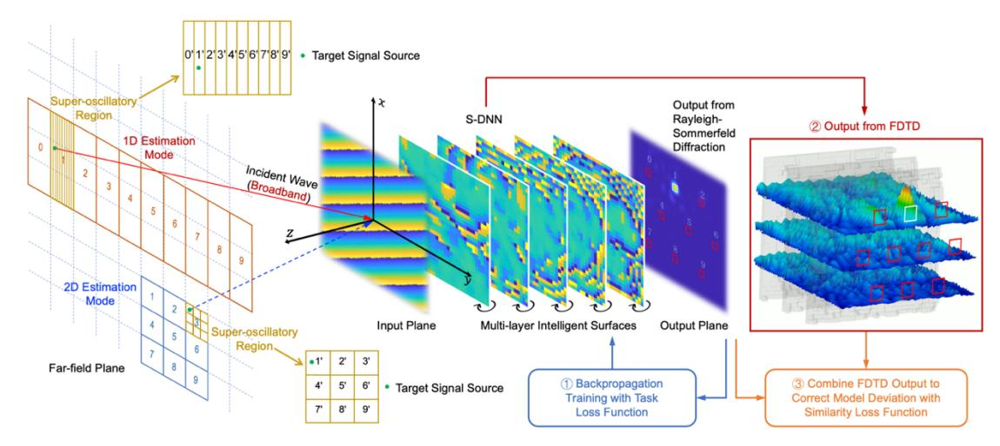
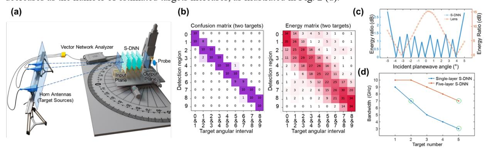

{0}------------------------------------------------

# **All-optical Computing for Direction-of-arrival Estimation Beyond Diffraction Limits**

**Sheng Gao1 , Hang Chen1 , Haiou Zhang1 , Zhi Sun1 , Yuan Shen1 , and Xing Lin1\*** *Department of Electronic Engineering, Tsinghua University, Beijing, 100084, China \*Corresponding author: lin-x@tsinghua.edu.cn*

**Abstract:** We propose a super-resolution diffractive neural network (S-DNN) for all-optical DOA estimation, achieving angular resolution beyond the diffraction limit and enabling low-latency, cost-effective integrated sensing and communication. © 2025 The Author(s)

#### **1. Introduction**

In the fields of communications, radar, and navigation, the angles of spatial target sources are critical information for wireless signal processing. Consequently, direction-of-arrival (DOA) estimation techniques have been extensively studied [1]. However, due to the storage-compute separation architecture, the electronic processors require a large number of RF circuits, analog-to-digital converters, and digital signal processing, leading to high latency, energy consumption, and cost. As a result, there is an urgent need for advanced computing paradigms to replace electronic processors. Optical computing, as an in-memory computing architecture, offers advantages such as light-speed computation, no energy consumption, and high parallelism, making it a promising candidate to replace electronic wireless signal processors [2]. Diffractive neural networks can directly perceive and process spatial electromagnetic (EM) waves to perform tasks such as object recognition and wireless encoding [3]. However, diffractive neural networks are limited by the modeling of meta-atoms and training optimization methods, making it difficult to achieve spatial super-resolution wireless signal processing. Here, we propose the super-resolution diffractive neural network (S-DNN), an all-optical computing paradigm for DOA estimation beyond diffraction limits [4]. The S-DNN can perform broadband DOA estimation for multiple coherent sources, with a maximum bandwidth of 10 GHz. It generates super-oscillatory angular responses within a local angular range, enabling superresolution DOA estimation. Experimental results show that the angular resolution of the S-DNN surpasses the Rayleigh diffraction limit by four times. The all-optical DOA estimation delay is 1.67 microseconds, improving performance by four orders of magnitude.

## **2. Method**

Based on the integrated sensing–memory–computing architecture, the S-DNN consists of multi-layer metasurfaces and a detector array, enabling light-speed computation on EM waves without the need for digital conversion (see Fig. 1(a)). The principle of the S-DNN involves identifying the phase distribution of far-field EM waves to determine the angles of the target sources, concentrating incident energy into the corresponding detection regions on the output plane. Ultimately, all-optical DOA estimation is achieved by measuring the peak energy in the detection regions. Far-field EM waves with varying elevation and azimuth angles generate distinct phase distributions on the input plane. As a result, the S-DNN can be designed to operate in 1D or 2D estimation mode to estimate the elevation and azimuth angles. Each metasurface utilizes subwavelength diffraction elements to modulate the amplitude and phase of the input EM waves across a broad frequency range, thereby creating large-scale optical diffraction-weighted interconnections between layers.

To enhance the working bandwidth and experimental performance of S-DNN, we propose a broadband robust training method adapted to the model deviation and physical environments shown in Fig. 1(b) [5]. The training data includes the EM field distributions over a wide frequency range, effectively increasing the working bandwidth of the S-DNN and mitigating system errors caused by frequency mismatches during experiments. Random Gaussian noise is added to the training data to improve the robustness of the S-DNN to experimental noise. The proposed broadband robust training method involves three main steps. First, the loss function is computed and backpropagated in the numerical simulation model to optimize the modulation coefficients of the S-DNN. Next, the optimized multi-layer metasurfaces are modeled in finite-difference time-domain (FDTD) software, where full-wave simulations are performed. Finally, by integrating the results from the FDTD simulations with those from Rayleigh-Sommerfeld diffraction simulations, a similarity loss function is calculated and used to further fine-tune the network parameters.

{1}------------------------------------------------

Fig. 1. The architecture and principle of S-DNN for all-optical DOA estimation, where the broadband and robust training method is developed to adapt to the model deviation and physical environment.

### **3. Experimental Results**

The experimental system for S-DNN is shown in Fig. 2 (a), consisting of a vector network analyzer, transmitting antennas, and waveguide probes. We designed and fabricated a four-layer S-DNN that is capable of achieving superresolution DOA estimation with an angular resolution of 1°, which exceeds the diffraction limit by four times. In the experiment, two transmitting antennas were placed 1° apart, and we determined the angles by measuring the two largest detection peaks, achieving an accuracy of 96% (see Fig. 2 (b)). The principle behind the S-DNN's superresolution capability is its ability to fit super-oscillatory function, generating super-oscillatory angular responses within local angular ranges, thus enabling super-resolution DOA estimation (see Fig. 2 (c)). In addition, the angular resolution limit of S-DNN is proportional to the aperture size, the number of layers and the energy efficiency. Based on broadband robust training, the maximum bandwidth of S-DNN is 10 GHz, and the bandwidth of S-DNN decreases as the number of estimated targets increases, as illustrated in Fig. 2 (d).

Fig. 2. (a) The experimental system. (b) Super-resolution DOA estimation results of four-layer S-DNN. (c) Super-oscillatory angular response of S-DNN compared with lens. (d) The bandwidth varies with the target number.

#### **4. Conclusion**

In summary, we propose a super-resolution diffractive photonic computing architecture capable of performing broadband DOA estimation at the speed of light, with an angular resolution beyond the diffraction limit. This highbandwidth, low-latency, and super-resolution all-optical DOA estimation paradigm is anticipated to be utilized in integrated sensing and communication for 5G applications.

## **5. References**

- [1] Schmidt, R., *IEEE Transactions on Antennas and Propagation* **34**(3), 276–280 (1986).
- [2] Gao, S., Wu, C., and Lin, X., *Light: Science & Applications* **13**(1), 58 (2024).
- [3] Lin, X., Rivenson, Y., Yardimci, N.T., et al., *Science* **361**(6406), 1004–1008 (2018).
- [4] Gao, S., Chen, H., Wang, Y., et al., *Light: Science & Applications* **13**(1), 161 (2024).
- [5] Zheng, Z., Duan, Z., Chen, H., et al., *Nature Machine Intelligence* **5**(10), 1119-1129 (2023).