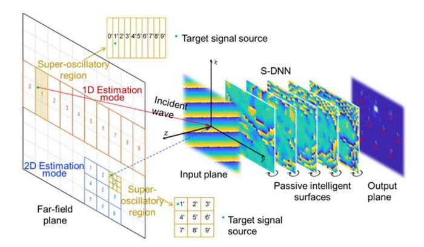
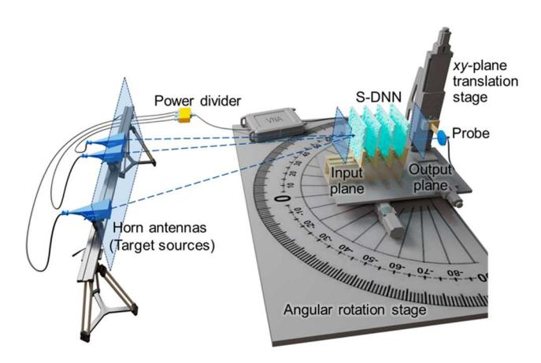
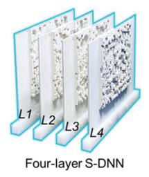
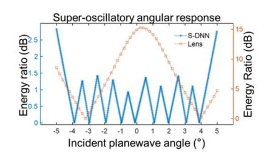
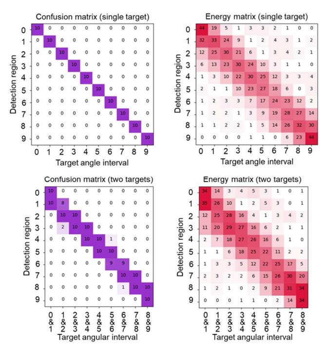
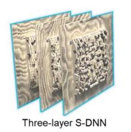
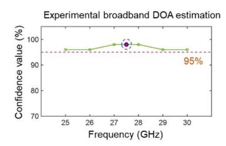
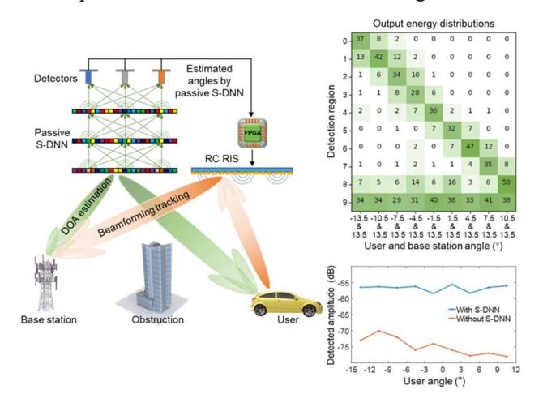

{0}------------------------------------------------

# All-optical computing for super-resolution direction of arrival estimation

Sheng Gao Department of Electronic Engineering Tsinghua University Beijing, China gao-s22@mails.tsinghua.edu.cn

Zhi Sun Department of Electronic Engineering Tsinghua University Beijing, China zhisun@tsinghua.edu.cn

Hang Chen Department of Electronic Engineering Tsinghua University Beijing, China chenhang@tsinghua.edu.cn

Yuan Shen Department of Electronic Engineering Tsinghua University Beijing, China shenyuan\_ee@tsinghua.edu.cn

Haiou Zhang Department of Electronic Engineering Tsinghua University Beijing, China azhho@tsinghua.edu.cn

Xing Lin\* Department of Electronic Engineering Tsinghua University Beijing, China lin-x@tsinghua.edu.cn

*Abstract***—Direction of arrival estimation technology is the foundation for communications, radar, navigation, etc. However, conventional electronic devices for DOA estimation require expensive RF circuits, high-precision analogue-todigital converters and complex digital signal processing algorithms. Here, we propose a super-resolution diffractive neural network (S-DNN) to directly process electromagnetic (EM) waves for super-resolution DOA estimation over a broadband frequency range. The multilayer meta-structures of the S-DNN produces super-oscillatory angular responses in local angular range, which can perform all-optical DOA estimation with angular resolution beyond the diffraction limit. Space-time multiplexing of passive and reconfigurable S-DNNs is used to achieve high-resolution DOA estimation over a wide field of view. Experiments show that the angular resolution of the S-DNN is four times higher than the diffraction limited resolution. The fabricated S-DNN can be used for superresolution DOA estimation of multiple coherent sources over a 5 GHz frequency bandwidth, with an estimation delay that is in principle two to four orders of magnitude lower than commercial devices. We also use the all-optical DOA estimation capability of the S-DNN to provide angular direction to reconfigurable intelligent surface, to achieve low-latency and low-power integrated sensing and communication. Our work is an important step towards enabling various wireless sensing and communication tasks using photonic computing processors that outperform electronic computing in both computational paradigm and performance.**

*Keywords—diffractive neural network, super-resolution DOA estimation, diffraction limit, integrated sensing and communication* 

## I. INTRODUCTION

In the fields of wireless communication and phased array radar, determining the angular direction of target interests is crucial for subsequent complex signal processing. Beamforming from communication and radar systems necessitates precise alignment of beams in space to achieve accurate detection and high-speed information transfer. Therefore, low-complexity, fast, and high-resolution techniques for direction of arrival (DOA) estimation have long been a focal point of research [1, 2, 3]. The classical multiple signal classification (MUSIC) algorithm utilizes subspace characteristics to solve for target angles but involves complex matrix inversions [1]. Moreover, MUSIC requires extensive snapshot data acquisition, thus traditional DOA estimation techniques are constrained by latency, power consumption, and cost. The evolution of modern radar and communication technology systems urgently demands advanced computational paradigms to replace traditional electronic processors for real-time sensing and computation in wireless environments [4, 5].

Photonics computing, using photons as information carriers, completely revolutionizes traditional electronic computing in terms of computational speed, throughput, and energy efficiency [6,7,8]. Photonics computing harnesses various optical characteristics including amplitude, phase, frequency, and polarization, thereby holding tremendous potential beyond Moore's law. In microwave photonics technology, RF signals are encoded onto optical signals to achieve bandwidth enhancement by several orders of magnitude, enabling superior performance in tasks such as filtering, time integration and differentiation, and blind source separation [9,10]. Diffractive neural networks, as a spatial optical computing paradigm, enable direct perception and computation of spatial electromagnetic (EM) waves. Leveraging the disruptive computational capabilities of diffractive neural networks, tasks like object recognition and wireless encoding/decoding have been achieved at light speed with minimal energy consumption [11,12]. Additionally, reconfigurable intelligent surfaces (RIS) modulate both amplitude and phase of spatial EM waves, serving as wireless relays to establish non-line-of-sight communication links between base stations and users [13]. However, RIS lacks perception and computation capabilities without RF circuit components, necessitating communication with base stations for control signals and user angle information. This limitation hinders RIS from providing low-latency beam tracking for applications like autonomous driving and high-speed rail communications.

Here, we propose a super-resolution diffractive neural network (S-DNN) for broadband all-optical DOA estimation, achieving angular resolution surpassing the Rayleigh diffraction limit. The S-DNN eliminates the need for traditional RF circuits, ADCs, and digital signal processing, enabling DOA estimation at the speed of light with angular resolution superior to that of the MUSIC algorithm. Unlike the MUSIC algorithm, the S-DNN can effortlessly achieve broadband super-resolution DOA estimation for multiple coherent target sources. Passive S-DNN models can be spatially multiplexed to estimate multiple target angles within a wide field of view with high resolution. We apply the S-DNN to RIS-based communication systems, providing RIS with sensing and edge computing capabilities that facilitate 

{1}------------------------------------------------

low-latency beamforming and tracking, thus achieving integrated sensing and communication.

#### II. PRINCIPLE OF PROPOSED S-DNN

The fundamental principle of using the S-DNN for DOA estimation involves classifying the input EM field distribution of different target sources into distinct angular intervals. The architecture of the S-DNN consists of multiple cascaded diffraction modulation layers, followed by a detector array on the output plane (see Fig. 1). Each detection region corresponds to a specific input angular interval and is used to measure the intensity of the output EM field. The S-DNN can be designed to operate in either 1D or 2D estimation modes to estimate the elevation and azimuth angles of the targets individually or simultaneously. Assuming the center of the input plane of the S-DNN is the origin of the coordinate system, the EM field distribution of a target source at an elevation angle  $\theta$  and azimuth angle  $\varphi$  on the z-axis can be approximated as a far-field plane wave:

$$E(x, y, \lambda) = A' \exp\{jk(x\sin\theta + y\cos\theta\sin\varphi)\} + n_{noise}$$
(1)

where  $A' = Aexp(jkz_0 \cos\theta \cos\varphi)$  is the constant complex value with far-field distance  $z_0$ , vacuum wavenumber  $k = 2\pi / \lambda$  with wavelength  $\lambda$ .  $n_{noise}$  denotes the spatial random Gaussian noise. Different z will result in uniform phase delay, but will not affect the DOA estimation result of S-DNN. Equation (1) shows that target sources with different elevation and azimuth angles produce different phase patterns on the input plane of S-DNN. We implement the diffractive modulation layers using passive intelligent surfaces (PIS). PIS employs sub-wavelength diffractive elements, known as meta-atoms, to modulate the amplitude and phase of EM waves over a broadband frequency range, generating largescale optical diffractive interconnections between layers. The forward EM field propagation in the S-DNN utilizes the Rayleigh-Sommerfeld diffraction formula, implemented via the angular spectrum method:

$$U(P_0) = \frac{1}{j\lambda} \iint_{\Sigma} U(P_1) \frac{e^{jkr}}{r} \cos\theta ds \tag{2}$$

where  $U(P_1)$  is the complex amplitude of the secondary wave at  $P_1$ ,  $P_0$  is any point in the space, r is the distance. Therefore, the free-space diffraction weight of the secondary wave generated by each neuron in S-DNN can be expressed as follows

$$w_i^l(\lambda, x, y, z) = \frac{z - z_i}{r^2} \left( \frac{1}{2\pi r} + \frac{1}{j\lambda} \right) e^{jkr}$$
 (3)

where l represents the l-th PIS, i represents the i-th neuron on the l-th PIS, (x, y, z) are the coordinates of neuron on the next layer. The complex transmission coefficients t is the modulation effect of PIS on the input EM waves. Therefore, the output wave from the i-th neuron on the l-th layer to any neuron on the (l+1)-th layer can be expressed as follows

$$n_i^l(\lambda, x, y, z) = w_i^l(\lambda, x, y, z)t_i^l \sum_{k} n_k^{l-1}(\lambda, x_i, y_i, z_i)$$
(4)

The EM field intensity measured by the i-th detector at the (M+1)-th output layer of S-DNN can be expressed as

$$P_i^{M+1} = \left| \sum_k n_k^M \left( \lambda, x, y, z \right) \right|^2 \tag{5}$$

Based on the forward propagation model of the S-DNN, the network output error is calculated using a loss function, and the phase modulation coefficients of the PIS are updated through backpropagation. The S-DNN learns to accumulate the energy of the incident plane waves with unknown angle into their corresponding detection regions on the output plane. The K target angular intervals are determined by identifying the top K intensity measurements within the detection regions.

Fig. 1. Principle of S-DNN for all-optical DOA estimation. S-DNN, constructed with multiple intelligent surfaces, maps angular intervals to detection regions, generates super-oscillatory responses, which can be trained for 1D or 2D DOA estimation with varying FOVs and resolutions.

#### III. EXPERIMENT AND RESULTS

We first demonstrated the super-resolution DOA estimation of a multi-layer S-DNN within a local angular range. The experimental system used to characterize the S-DNN includes a Vector Network Analyzer (VNA) connected to horn antennas as the target sources, a waveguide probe for detection, an azimuth rotation stage for rotating the S-DNN, and an *xy*-plane translation stage for positioning the waveguide probe's detection region (see Fig. 2).

Fig. 2. Schematic illustrating the experimental system. The experimental system characterizes and measures the output field distributions of S-DNN to achieve super-resolution DOA estimation with low latency.

{2}------------------------------------------------

## *A. DOA estimation with S-DNN beyond diffraction limits*

We designed and fabricated a four-layer passive S-DNN based on PIS to perform azimuth DOA estimation with 1° angular resolution within the angular range of [-5°, 5°] (see Fig. 3). Each PIS layer consists of 32×32 modulation units, with each unit sized at half the wavelength. Fig. 3 presents a comparison of the angular response between the S-DNN and a lens system under the same optical setup. The lens system exhibits a smooth angular response, leading to limited angular resolution. In contrast, the S-DNN utilizes multiple layers of sub-wavelength diffractive elements to effectively modulate the incident light field and generate a super-oscillatory angular response within a local angular range, achieving superresolution DOA estimation. During the experiment, the source signal from the VNA is distributed through a power splitter and connected to two horn antennas spaced 1° apart, representing two coherent target sources. The azimuth rotation stage rotates uniformly to generate different angle test samples within the field of view. The four-layer S-DNN was experimentally tested in both single-target and two-target DOA estimation scenarios, achieving confidence value of 100% and 95%, respectively. The corresponding angular estimation accuracies were 0.23° and 0.24°. Fig. 4 shows the corresponding experimental results of the confusion and energy distribution matrices for the test samples, verifying that the four-layer all-optical S-DNN can achieve super-resolution DOA estimation with 1° angular resolution, surpassing the diffraction limited resolution four times.

Fig. 3. Four-layer S-DNN implemented with PIS for estimating azimuth angle with 1° angular resolution. The super-oscillatory angular response of four-layer S-DNN for super-resolution DOA estimation.

## *B. Broadband super-resolution DOA estimation*

The S-DNN can be spatially or temporally multiplexed to perform the coarse-to-fine DOA estimation, enabling superresolution DOA estimation over a wide field of view (see Fig. 1). In addition to the four-layer S-DNN, we designed a threelayer S-DNN for super-resolution DOA estimation within the angular range of [-15°, 15°] with 3° resolution (see Fig. 5). The three-layer S-DNN employs a broadband training method that significantly enhances its dispersion resistance, allowing it to operate effectively across a wide frequency range of 25 GHz to 30 GHz. Fig. 5 experimentally demonstrates that the fabricated three-layer S-DNN can achieve high-confidence broadband DOA estimation within the 25 GHz to 30 GHz frequency range.

Fig. 4. The experimental confusion matrices and energy distribution matrices evaluated on the single-target and two-target testing datasets. The two targets spaced 1° apart, are at adjacent angular intervals.

Fig. 5. Three-layer S-DNN implemented with PIS for estimating azimuth angle with 3° angular resolution. The broadband DOA estimation performance of S-DNN between the frequency range of 25 GHz and 30 GHz.

#### *C. S-DNN for integrated sensing and communication*

We demonstrated the application of S-DNN in RIS-based millimeter-wave communication to achieve low-latency integrated sensing and communication (see Fig. 6). The passive S-DNN receives EM waves from both the base station and the user, enabling super-resolution DOA estimation of multiple targets at the speed of light. Based on the S-DNN's estimation results, an FPGA optimizes the beamforming phases and configures the RIS to reflect the EM waves from base station towards the user, establishing a real-time communication link. In the experiment, two horn antennas represented the base station and the mobile user. The base station angle was fixed at 13.5°, while the user angle varied from -13.5° to 10.5° in 3° increments. The output energy distribution in the 10 detection regions shown in Fig. 6 indicates that the S-DNN achieved super-resolution DOA estimation for both the base station and the user. Using the output from the passive S-DNN, the RIS could optimize the beamforming phases, establishing a communication link between the base station and the user, resulting in an average detection amplitude gain of 17.9 dB.

{3}------------------------------------------------

## IV. CONCLUSION

In summary, we propose the super-resolution diffractive neural network for all-optical DOA estimation beyond diffraction limits. It achieves light-speed, super-resolution angular estimation, eliminating the need for traditional RF circuits or digital processing systems. Our research shows potential of all-optical computing for sensing breakthroughs with applications in autonomous driving, high-speed rail, radar detection, and satellite navigation. Future research will focus on developing reconfigurable S-DNN using reconfigurable transmissive metasurfaces, capable of performing wireless signal processing tasks such as encoding/decoding, positioning, and beamforming. Reconfigurable S-DNN has the potential to replace commercial software-defined radio processors or shift part of the computational load from base stations to edge devices.

Fig. 6. Schematic illustrating the application of DOA estimation with passive S-DNNs for RIS-based communications. Experimental output energy distribution of the three-layer passive S-DNN for angular estimation of users and base stations (top) for the RIS-based communication (bottom).

#### ACKNOWLEDGMENT

This work is supported by the National Natural Science Foundation of China (No. 62275139).

#### REFERENCES

- [1] R. Schmidt, "Multiple emitter location and signal parameter estimation," IEEE Trans. Antennas Propag., vol. 34, no. 3, pp. 276– 280, Mar. 1986.
- [2] Z. Tan, Y. C. Eldar, and A. Nehorai, "Direction of Arrival Estimation Using Co-Prime Arrays: A Super Resolution Viewpoint," IEEE Trans. Signal Process., vol. 62, no. 21, pp. 5565–5576, Nov. 2014.
- [3] H. Huang, J. Yang, H. Huang, Y. Song, and G. Gui, "Deep Learning for Super-Resolution Channel Estimation and DOA Estimation Based Massive MIMO System," IEEE Trans. Veh. Technol., vol. 67, no. 9, pp. 8549–8560, Sep. 2018.
- [4] X. Lin, "Artificial intelligence built on wireless signals," Nat. Electron, vol. 5, no. 2, Feb. 2022.
- [5] S. Dang, O. Amin, B. Shihada, and M.-S. Alouini, "What should 6G be?," Nat. Electron, vol. 3, no. 1, Jan. 2020.
- [6] Bogaerts, W., Pérez, D., Capmany, J. et al., "Programmable photonic circuits," Nature, vol. 586, no. 7828, Oct. 2020.
- [7] Shastri, B.J., Tait, A.N., Ferreira de Lima, T. et al., "Photonics for artificial intelligence and neuromorphic computing," Nat. Photonics, vol. 15, no. 2, Feb. 2021.
- [8] S. Gao, H. Chen, and Y. Wang, et al., "Super-resolution diffractive neural network for all-optical direction of arrival estimation beyond diffraction limits," Light Sci. Appl., vol. 13, no. 1, p. 161, Jul. 2024.
- [9] W. Zhang, A. Tait, C. Huang et al., "Broadband physical layer cognitive radio with an integrated photonic processor for blind source separation," Nat Commun., vol. 14, no. 1, Feb. 2023.
- [10] S. Gao, C. Wu, and X. Lin, "Demixing microwave signals using system-on-chip photonic processor," Light Sci. Appl., vol. 13, no. 1, Feb. 2024.
- [11] X. Lin, Y. Rivenson, N. Yardimci et al., "All-optical machine learning using diffractive deep neural networks," Science, vol. 361, no. 6406, pp. 1004–1008, Sep. 2018.
- [12] C. Liu, Q. Ma, Z. Luo, et al., "A programmable diffractive deep neural network based on a digital-coding metasurface array," Nat. Electron., vol. 5, no. 2, Feb. 2022.
- [13] T. J. Cui, M. Q. Qi, X. Wan, J. Zhao, and Q. Cheng, "Coding metamaterials, digital metamaterials and programmable metamaterials," Light Sci. Appl., vol. 3, no. 10, Oct. 2014.