{0}------------------------------------------------

# Antenna-on-Display with EH1-mode Wide Spatial Beam Scanning for User-Centric Sensing and Vehicle-to-Everything Communication

Dongseop Lee, *Graduate Student*, *IEEE*, Sirous Bahrami, *Member*, *IEEE*, Myoungsun Kim, Jeonghyo Lee, *Graduate Student*, *IEEE*, Keita Iimura, *Member*, *IEEE* and Wonbin Hong, *Fellow*, *IEEE* 

Abstract—This article presents the first reported leaky-wave antenna (LWA) concept and displays-integrated solution for integrated sensing and communication (ISAC) applications. Despite via-less, single-layer, and extremely thin substrate, leaky wave antenna-on-display (LWAoD) achieves a wide band wideangle beam-scanning characteristics. The grid-shaped structure is initially designed for EH1-mode radiation and optimized with bending angle  $\alpha'$ . In addition, cross patch and slit structures ensure stable gain and improved impedance matching. Due to high sheet resistance, unit cell optimization method is proposed for balancing the cumulative resistance termination situated at the end of the devised LWAoD and antenna performance. The 1-D LWAoD is fabricated and achieves a wide scanning angle of -48° to +45° across 22 – 38 GHz. Based on the LWAoD elements, the 1-D linear array is expanded and exemplified to validate 2-D frequency-phase scanning (FS/PS) mode capability, which is key requirement for ISAC applications. Experimental results show that the 3-dB scanning angles in the E-plane are approximately ±60° at 28 GHz, with sidelobe levels below -10 dB and crosspolarization levels below -15 dB. By addressing core limitations of current ISAC antennas, this solution establishes a new concept for compact, high-performance solutions providing for integrated radar, communication and jamming applications for display integrated vehicle display panel.

Index Terms—2-dimensinoal (2D) spatial beam scanning, antenna-on-display (AoD),  $EH_1$ -mode radiation, millimeter-wave, traveling-wave, integrated sensing and communication (ISAC).

### I. INTRODUCTION

Recent advancement in integrated sensing and communication (ISAC) has rapidly emerged as a key enabling technology for next-generation smart platforms, ranging from autonomous vehicles, drones, industrial environments [1], [2], [3]. Early commercial implementations demonstrate the practical benefits of merging sensing and communication functions on a single hardware platform. The integration of traditional radar systems with vehicle-to-everything (V2X) networks, including vehicle-to-vehicle

This work was supported in part by the Institute of Information and Communications Technology Planning and Evaluation (IITP) grant funded by the Korea Government (MSIT) (No.2021-0-00763, No.RS-2024-00354970 and No.2020-0-00858); and in part by ICT through the National Research Foundation of Korea (NRF) under the Next Generation Engineering Research Program under Grant 2019H1D8A2106519 (Corresponding author: Wonbin Hong).

Fig. 1. Application of the leaky-wave antenna-on-display (LWAoD) with multibeam and wide spatial coverage for vehicular ISAC systems.

(V2V), vehicle-to-pedestrian (V2P), vehicle-to-infrastructure (V2I), and vehicle-to-satellite (V2S) communications, is essential for connected and autonomous vehicles (CAVs). This integration enables real-time data exchange under challenging propagation conditions, improving traffic efficiency and driving safety while ensuring reliable vehicular communication systems. Furthermore, in autonomous driving, driver-centric sensing has become increasingly crucial to enhance driver safety and situational awareness.

However, these advances are also critical challenges: while high-resolution radar demands a large aperture for accurate and wide-field detection, compact devices are inherently limited in size. Although communication systems are used to compact antennas [4], [5], the narrow bandwidths and limited beam steerings having been limited factors for spatial flexibility. The demands for both sensing and communication require a new class of antenna design offering wide bandwidth, high directivity, and two-dimensional (2D) beam steering within a compact form factor [6], [7], [8]. To address this challenge, an antenna-on-display (AoD) architecture for ISAC is presented in

The authors are with the Department of Electrical Engineering, Pohang University of Science and Technology (POSTECH), Pohang 37673, South Korea (e-mail: dongseopl@postech.ac.kr, whong@postech.ac.kr).

Keita Iimura is with the Department of Fine Device Operations, Dai Nippon Printing co., Ltd., Saitama, Japan (Iimura-K2@mail.dnp.co.jp).

{1}------------------------------------------------

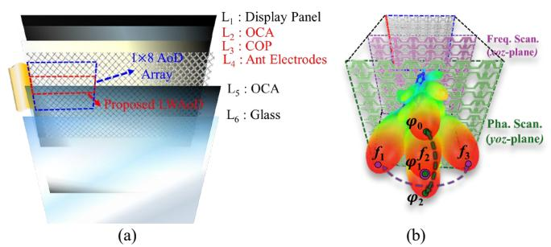

Fig. 2. (a) Stack-up of the proposed array employing leaky-wave antenna-ondisplay (LWAoD) elements concept. (b) 2-dimensional (2D) spatial beam scanning for vehicle ISAC applications.

Fig. 1. The proposed antenna enables independent high-speed communication links and high-resolution radar sensing in automotive display panels.

Conventional ISAC systems based on standing-wave (SW) antenna array either share the main beam or allocate the main beam to radar/sensing while steering the communication beam into sidelobes [9]. These approaches introduce mutual interference (MI) between communication and sensing functions, degrading overall system performance [10], [11]. To mitigate MI, numerous studies propose operating sensing and communication at different frequency bands with independent beam control. However, conventional ISAC antenna designs, which are typically based on SW architectures implemented via antenna-in-package (AiP) or antenna-on-chip (AoC) technologies, face significant limitations [4], [5], [10], [11], [12], [13], [14], [15], [16]. In [8], AiP designs must partition the operational bands due to their narrow bandwidth constraint, which necessitates separate subsystems for each band. Moreover, achieving wide spatial beam steering with narrow beamwidth typically requires large antenna arrays with many elements, resulting in multiple RF chains and increased system complexity and cost. AoC‑based ISAC antennas, while compact, generally exhibit low radiation efficiency and limited gain due to silicon substrate losses [14], [15], [16].

In recent years, leaky-wave antennas (LWAs) for vehicular applications have been investigated for their wideband, highdirectivity characteristics [17], [18], [19], [20], [21] and their potential for frequency-dependent spatial beam steering. LWAs enable the simultaneous use of different frequency tones for sensing and communication while using a single antenna aperture. However, no ISAC LWA solution has been realized to date because conventional LWAs require bulky termination networks, multiple vias, multilayer configurations, and more than ten-unit cells for high‑directivity beam steering [17], [18], [19], [20], [21], [22], [23], [24], [25]. These topologies impose severe physical constraints for integration into compact ISAC platforms.

To overcome these size limitations, the antenna‑on‑display (AoD) approach has emerged as an effective strategy [26], [27], [28], [29], [30], [31], [32], [33]. In these systems, the antenna is fabricated on a transparent film and integrated onto the top cover or inserted between the cover and the metallic display panel (e.g., in LCDs (Liquid Crystal Displays) or OLEDs (Organic Light Emitting Diodes)) [27], [28], [29], [30], [31],

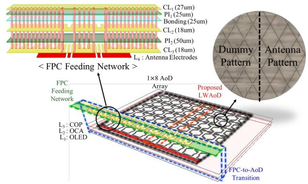

Fig. 3. 3-D view configuration of the proposed leaky-wave antenna-on-display (LWAoD) structure.

[32]. This method provides full frontside beam coverage using optically invisible electrodes and packaging technologies compatible with current displays. However, past AoD studies have been limited to phase scanning along a single axis, constraining their suitability for ISAC in vehicular applications [33], [34]. Moreover, conventional AoD designs often utilize SW antenna architectures, which exhibit narrow bandwidth and limited beam steering capabilities. As a result, these AoD solutions cannot achieve the full 2D spatial beam scanning, wide bandwidth for vehicular scenarios. Thus, there are no ISAC LWAs in the form of AoD at present.

To address the critical size and beam steering constraints of LWAs for ISAC, this paper presents a leaky-wave antenna integrated into the transparent region of the automotive display panel—referred to as the leaky-wave antenna‑on‑display (LWAoD) as shown in Fig. 2. LWAoD overcomes spatial limitations and eliminates the need for termination by employing a unit cell optimization method. Despite its single‑layer, via‑less structure, the design introduces a shared aperture concept that supports both phase scanning (PS) and frequency scanning (FS) modes. Section II presents a detailed description of the antenna structure and unit cell optimization method. Section III shows an integrated AoD array for dualbeam scanning. This platform achieves independent beam steering in two directions. Section IV, S-parameter and E-/Hplane phase-frequency scanning capabilities are validated. Finally, Section V discusses the simulated and experimental results of the proposed LWAoD compared with the previously reported AoD technology and conventional LWA structures.

# II. LEAKY-WAVE ANTENNA-ON-DISPLAY

## *A. Configuration*

Fig. 3 presents configuration of the proposed LWAoD structure. It consists of three regions: Display Antenna, flexible printed circuit (FPC) feeding network, and FPC-to-display antenna transition. In display antenna region, the AoD technology is an optically invisible antenna layer (L4) situated in the active area of the display panel by utilizing meshpatterned electrodes. It is worth mentioning that the dimensions of the mesh pattern are determined with consideration of the pixel size of the display panel, display stack up, and other optical factors [35]. In addition, the proposed antenna region is

{2}------------------------------------------------

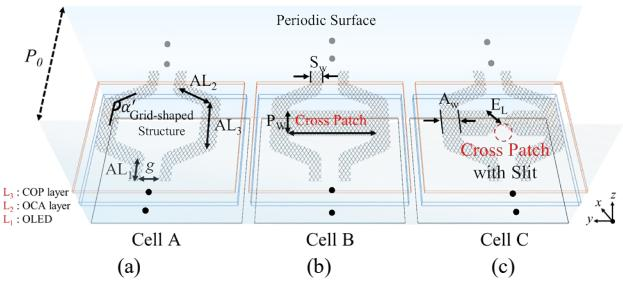

Fig. 4. Evolutionary process of the proposed LWAoD unit cell. (a) Cell A: Grid-shaped structure. (b) Cell B: EH1-mode cross patch. (c) Cell C: Cross Patch with slit structure. (Design parameters: AL1=1.95, AL2= 1.36, AL3=0.87, *g*=0.6, =118°, Pw=1.2, PL=2.87, SW =0.39, EL=0.6 and AW =0.6, *P0*=5.2, Unit = mm).

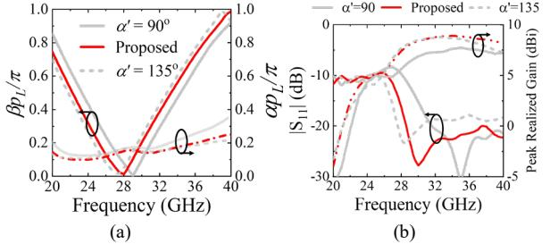

Fig. 5. (a) Simulated dispersion diagram as function of bending angle α'. (b) Simulated reflection coefficient and peak realized gain of the proposed unit cell A as function of bending angle (Proposed: α'=115°).

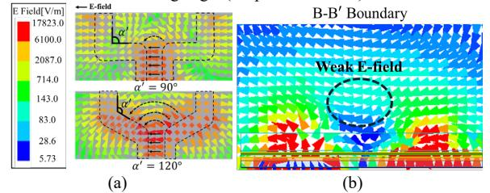

Fig. 6. (a) Simulated electric-field (E-field) distribution of the proposed cell A with current vector diagram at lower frequencies. (b) E-filed distribution of the proposed cell A at B-B' boundary

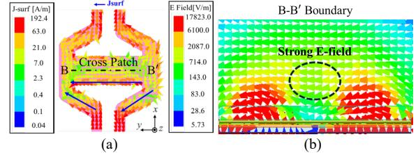

Fig. 7. (a) Current distribution of the Cell B. (b) Electric-field (E-field) distribution of the proposed unit cell at B-B' boundary Cell B at lower frequencies.

encompassed with dummy-mesh pattern to eliminate any difference in optical transparency. As a result, the optical transparency and haze are measured to be 88% and 2.2%, respectively, which satisfy universal specification in the display engineering community. The antenna electrodes (L4) and COP layer (L3) are laminated between the OLED panel (L1) and the front glass (L6) using optically clear adhesive films (OCA). The substrate layers of the cyclo-olefin polymer (COP) and OCA are considered as composite dielectric featuring an effective relative permittivity of 2.35 and a loss tangent of 0.02. Upper substrate layers of OCA (L5) and cover glass (L6) are considered as superstrate layers featuring relative permittivity of 5.3 and a loss tangent of 0.04. They are used to protect the antenna electrodes and OLED panel (L1) from environmental hazards. Layer L1 serves as an electrical ground for the antenna electrodes (L4).

## *B. Operation Principle*

The design scheme of the LWAoD unit cell is proposed to ensure complete compatibility with the manufacturing display process, as shown in Fig. 4. The design scheme is composed of three evolutionary stages to enhance the performance of the proposed LWAoD unit cell. Cell A represents the initial gridshaped structure, which establishes the fundamental leakywave path while ensuring seamless integration with the display panel, as shown in Fig. 4(a). In Fig. 4(b), Cell B incorporates a cross patch to excite the EH1-mode, thereby improving broadside radiation characteristics and impedance matching. Fig. 4(c) presents Cell C, which further optimizes the design by introducing a slit into the cross patch to enhance bandwidth, gain, and current distribution, leading to improved radiation stability. Each unit cell is periodically repeated along the *x*-axis, forming a leaky-wave structure described by Floquet's theorem [36]. As a result, the propagation constant can be expressed as (1)

$$k_{x,n} = \beta_0 + \frac{2\pi n}{p_0} + j\alpha, n = 0, \pm 1, \pm 2 \dots$$
 (1)

where *P0* denotes the periodic length of the unit cell, and *β0* and *α* are the fundamental phase and attenuation constants, respectively. In Fig. 5(a), Brillouin dispersion diagram of 1 dimension (1D) periodic structures, considering both spacewave leakage and surface-wave leakage, has been accurately described in [39], providing a theoretical framework for analyzing the radiation characteristics of the proposed structure. The proposed antenna utilizes the first higher-order mode (EH1 mode) for broadside radiation at 28 GHz. In general, microstrip LWAs are designed to operate in EH1-mode [19], rather than the EH0-mode. EH1-mode radiation is preferred due to the compact size and efficient radiation characteristics, while EH0 mode radiation features lower efficiency, higher losses, and narrower bandwidth [21]. However, conventional EH1-mode LWAs designs are realized using multiple-vias and the use of multi-stack antenna layers, which structures are not allowed by the display panel manufacturing process.

To overcome these fabrication constraints, the proposed LWAoD structure is realized as a via-less, single-layer design, where the grid-shaped structure (Cell A) ensures effective wave propagation while maintaining EH1-mode propagation by being excited with an out-of-phase difference at both ports. Initially, the grid-shaped structure is configured as a meander line (′=90°) with symmetrical placement. Fig. 5(b) illustrates the impact of the bending effect on the S-parameter, comparing different bending angles, and demonstrating how the variation in ′ influences impedance matching and radiation performance. The Cell A with (′=90°) design suffers from impedance mismatches due to electromagnetic discontinuities [37], [38], leading to a narrow impedance bandwidth and degraded radiation performance at lower frequencies.

To resolve this, the bending angle ′ is gradually increased for mitigating impedance mismatches and enhancing the

{3}------------------------------------------------

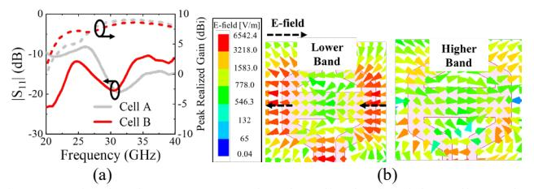

Fig. 8. (a) Simulated S-parameter and peak realized gain of the Cell A and B. (b) Simulated E-field distribution of Cell B at lower band (at 22-24GHz) and at higher band (36-38GHz).

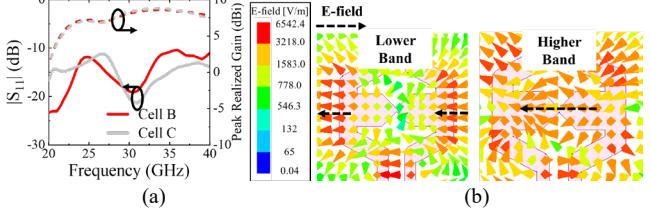

Fig. 9. (a) Simulated S-parameter and peak realized gain of the Cell B and C. (b) Simulated E-field distribution of Cell C at lower band (at 22-24GHz) and at higher band (36-38GHz).

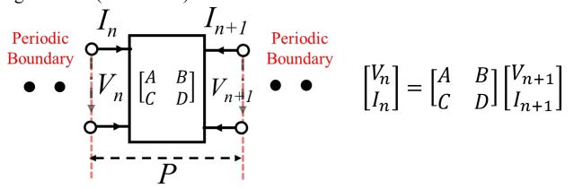

Fig. 10. Two-port network modeling of a periodic leaky-wave structure in terms of the ABCD parameters of its unit cell. (*P* = 5.2 mm).

bandwidth. Radiation characteristics and impedance bandwidth are improved due to continuous wave propagation and phase progression. To further analyze this effect, the current distribution of Cell A is presented in Fig. 6(a). In EH1-mode operation, increasing bending angles reduces the impact of discontinuities, which strengthens the coupling effects within structure. This behavior extends the effective current path, enabling smoother wave propagation and improving the impedance bandwidth, particularly at lower frequencies. However, increasing the bending angle beyond 115° (e.g., 135°) introduces a trade-off by significantly reducing the gain at higher frequencies, as shown in Fig. 5(b). Therefore, the bending angle is optimized to a range of 118° to 120°, achieving balanced performance with adequate coverage at lower frequencies while maintaining boresight gain at 28 GHz, as shown in Fig. 5(a). In addition, the dispersion diagram confirms that the proposed unit cell is operated as *n*=-1 first higher-order harmonic within the fast-wave region from 22 to 38 GHz. However, the antenna gains and impedance matching at lower frequency bands are significantly reduced due to insufficient current paths [39]. To analyze insufficient current paths, Fig. 6(b) presents the electric field distribution of Cell A at the B-B' boundary. The coupling field is weak at the center of the Cell A due to the large spacing in the grid-shaped structure.

To address this limitation, the cross patch structure is introduced in Cell A, effectively enhancing antenna performance at lower frequencies. As shown in Fig. 7(a), the current distribution analysis reveals that the incorporation of the cross patch structure extends the effective current path along the y-direction, leading to improved impedance matching and enhanced antenna gain at lower frequency bands. To further investigate its impact on radiation characteristics, the electricfield distribution is evaluated in Fig. 7(b), demonstrating how the cross patch structure contributes to stronger and more uniform radiation. This structure not only reduces impedance mismatches but also minimizes losses, allowing for more efficient wave propagation within the unit cell. As a result, the optimized current path enhances radiation efficiency, leading to a more focused and directive radiation pattern, as shown in Fig. 8(a). To analyze the radiation characteristics, the E-field distribution demonstrates that the cross patch structure exhibits a field pattern similar to a quasi-dipole antenna, in Fig. 8(b). In lower band, the electric field distribution of the antenna is similar to the conventional dipole, exhibiting maximum intensity at the center and minimal intensity at the ends [40]. However, the electric-field strength is significantly reduced at higher frequencies due to the impedance mismatch. As a result, the impedance matching is poor at higher frequencies, as shown in Fig. 8(a).

To mitigate these issues, the slit technique of the Cell C is introduced to enhance impedance matching at the center of the Cell B. As shown in Fig. 9(a), the slit structure gradually extends the current path, which improves impedance matching by reducing high-frequency reflection losses. This structure effectively broadens the impedance bandwidth, ensuring stable operation across a wider frequency range. Furthermore, Fig. 9(b) illustrates the E-field distribution across different frequency bands, where the slit structure enables a more uniform and continuous current flow, particularly at higher frequencies. This enhancement contributes to optimal radiation efficiency and improved gain performance, confirming the effectiveness of the slit in maintaining stable impedance characteristic over the operation bandwidth.

# *C. Unit Cell Optimization for Display Panel Integration*

For the 1D LWAoD, unit cells should be periodically arranged to ensure efficient wave propagation. However, due to the high sheet resistance (≥ 0.04 Ω/sq) of the mesh electrodes (L4), the proposed unit cell features high loss compared to PCBbased leaky-wave antennas unit cells [17], [18], [19], [20], [21]. This can be attributed to the higher sheet resistance of the metal mesh structure compared to solid copper. The proposed mesh exhibits a sheet resistance of 0.34 Ω/sq, which is significantly greater than that of copper (approximately 0.00096 Ω/sq for a 0.018 mm layer), resulting in increased transmission line attenuation. While the mesh structure achieves over 88% optical transmittance, its lower electrical conductivity results in notable insertion loss.

To mitigate these losses and maintain sufficient electrical conductivity while preserving optical transparency, a unit cell optimization (UCO) method is proposed. This approach determines the optimal number of unit cells, ensuring that the LWAoD structure remains optically transparent at 88% transmittance, while achieving minimal cumulative loss. Based on the antenna theory [41], [42], the two-port network model for a periodic AoD structure is presented in Fig. 10. The relationship between the voltage *V* and current *I* at the input and

{4}------------------------------------------------

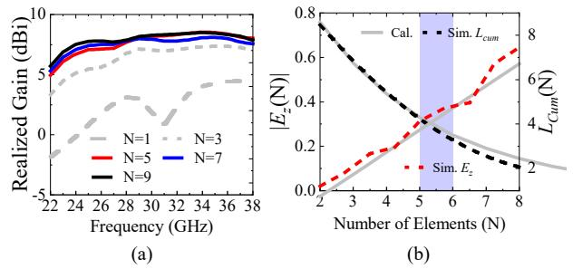

Fig. 11. (a) Simulated realized gain as function of element count. (b) Simulated and calculated the magnitude electric field  $E_z(N)$  and cumulative loss  $L_{cum}$  as function of the number of unit cell (N).

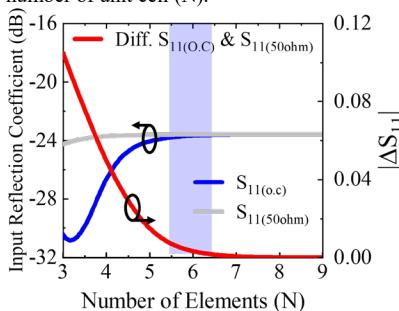

Fig. 12. Calculated input reflection coefficient of LWAoD with open circuit and 50-ohm termination at 28 GHz.

output of a unit cell can be expressed using the ABCD matrix, where for *n* unit cells, the total ABCD matrix  $\underline{T_{total}}$  is given as

$$T_{total} = T_{unit}^n = \begin{bmatrix} A_N & B_N \\ C_N & D_N \end{bmatrix}, \cosh(\gamma) = \frac{A+D}{2}, \alpha = \frac{Re(r)}{p}$$
 (2)

where  $\gamma$  is the propagation constant, and  $\alpha$  represents the attenuation constant. The cumulative voltage and current propagation through the periodic structure follows (3). Where  $V_0$  is the initial voltage at the first unit cell. In addition, the electric field magnitude across the unit cell follows an exponential decay, given by (4).

$$V_n = V_0 e^{-aNp}, I_n = I_0 e^{-aNp}$$
 (3)

$$V_n = V_0 e^{-aNp}, I_n = I_0 e^{-aNp}$$

$$|E_z(N)| = \frac{|V_0|e^{-aNp}}{p}, L_{cum}(N) = \sum_{k=1}^n \alpha d$$
(3)

Therefore, as the number of unit cells N increases,  $L_{cum}$  is shown to linearly increase according to equation (4). The cumulative loss and electric field attenuation are analyzed to optimize the efficiency LWAoD integrated with the display panel.

To determine the optimal number of unit cells, a convergence-based approach is applied. The difference in electric field magnitude between successive unit cells is evaluated, and the number of unit cells is optimized when the variation falls below a predefined threshold  $\epsilon = 1\%$ , leading to (5) and (6). The threshold is selected based on prior studies, where 1% criterion has been demonstrated to effectively indicate negligible additional energy contributions impedance matrix analysis of RF structure [43], [44].

$$\Delta |E_z| = |E_z(N+1)| - |E_z(N)| < \epsilon \tag{5}$$

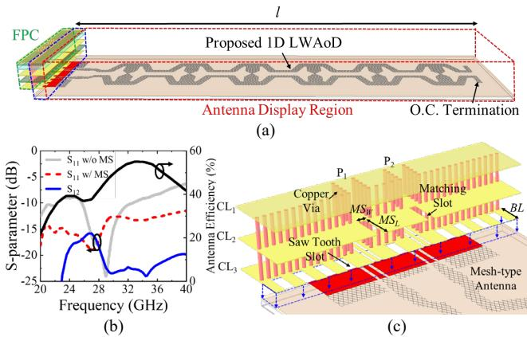

Fig. 13. (a) The 3-D view of the exemplified 1-Dimension (1D) LWAoD with 6-unit cell. (b) Simulated S-parameter and antenna efficiency of the proposed 1D LWAoD as function of matching slot (MS) structure (c) Illustration of the FPC-to-AoD transition. (Design parameters:  $MS_w$ =0.2,  $MS_L$ = 1, BL=0.8, l =

$$\Delta |E_z| = E_0(e^{-\alpha(N+1)p} - e^{-\alpha Np}), N_c > \frac{-\ln(\frac{\epsilon}{E_0(e^{-\alpha p} - 1)})}{\alpha p} \quad (6)$$

While conventional gain-versus-element curves are often used to determine the optimal number of unit cells, as shown in Fig 11(a). However, mesh-type leaky-wave antennas exhibit unique energy loss characteristics due to their discontinuous conductive paths, making direct gain saturation analysis insufficient. Thus, our proposed UCO method provides novel design guidelines for mesh-integrated leak-wave antennas in display panels. By evaluating energy attenuation along the periodic structure, this method ensures that additional unit cells contribute negligibly to overall performance while maintaining sufficient impedance matching and radiation efficiency. As result, this convergence analysis determines that the most practical unit cell count is N=5 to 6, balancing cumulative loss and electric field attenuation for optimal performance, as shown in Fig. 11(b).

To validate the feasibility of an open-circuit (OC) configuration, the reflection coefficient ( $\Gamma_{Port1}$ ) is analyzed under both OC  $(Z_L \rightarrow \infty)$  and 50-ohm termination  $(Z_L =$  $Z_0$ ) conditions. The impedance at Port 1 is expressed as (6) and

$$Z_{in,OC} = \frac{B}{D}, \Gamma_{Port1,OC} = \frac{\frac{B}{D} - Z_0}{\frac{B}{D} + Z_0}$$
 (7)

$$Z_{in,OC} = \frac{B}{D}, \Gamma_{Port1,OC} = \frac{\frac{B}{D} - Z_0}{\frac{B}{D} + Z_0}$$

$$Z_{in,50} = \frac{AZ_0 + B}{CZ_0 + D}, \Gamma_{Port1,50} = \frac{\frac{AZ_0 + B}{CZ_0 + D} - Z_0}{\frac{AZ_0 + B}{CZ_0 + D} + Z_0}$$
(8)

The calculated reflection coefficient for both open-circuit and 50-ohm termination conditions, as a function of the unit cell count, are shown in Fig. 12. The results indicate that  $\Gamma_{Port1}$  for both conditions converge at N = 6, confirming that the 1D LWAoD with 6-unit cells operates effectively with an opencircuit termination. This ensures its feasibility within a display panel without requiring additional termination structures.

## D. Simulation Results of the Proposed 1D LWAoD

In Fig.13(a), the exemplified LWAoD is realized with sixunit cells, adopting the OC termination as previously discussed

{5}------------------------------------------------

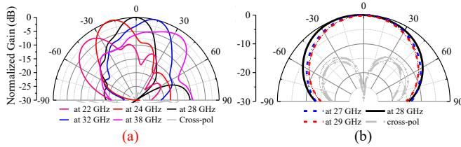

Fig. 14. Simulated co- and cross-polarization radiation pattern of the proposed 1-D LWAoD. (a) E-plane (*yoz*-plane) at 22-37 GHz. (b) H-plane (*xoz*-plane) at 27-29 GHz.

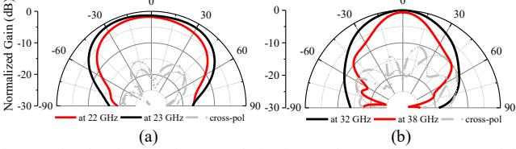

Fig. 15. Simulated co- and cross-polarization E-plane radiation pattern of the proposed LWAoD. (a) at 22 and 23 GHz. (b) at 32 and 38 GHz.

to ensure feasible operation. The structure is segmented into three primary regions—the FPC region, the FPC-to-AoD transition region, and the mesh-based display panel region and includes two ports for out-of-phase excitation, thereby enabling EH1-mode radiation. The BL length is considered the bonding area. As shown in Fig. 13(b), directly connecting the existing FPC feeding network to the display panel environment results in poor impedance matching, attributable to the significant difference between the FPC environment and the antenna display panel. To address this, the matching slot at CL2 layer in the FPC-to-AoD transition is proposed, as shown in Fig. 13(c). This structure enhances additional capacitance and improves impedance matching in the transition region. Furthermore, the saw-tooth structure facilitates minimizing the air gap in the bonding area, effectively reducing fabrication errors encountered during the bonding process. The simulated impedance bandwidth of  $|S_{11}| < -10$  dB achieves at 22 - 38 GHz. In addition, the simulated isolation level between the two ports is demonstrated at less than 20 dB. Furthermore, LWAoD achieves average radiation efficiencies of 44.2% from 20 to 40 GHz in simulation.

Fig. 14 shows the simulated H- and E-plane radiation patterns of the 1D LWAoD. In Fig. 14(a), the H-plane (xozplane) frequency scanning pattern covers a scanning range from  $-50^{\circ}$  to  $+42^{\circ}$  across 22 -38GHz. In Fig. 14(b), the E-plane (*yoz*plane) pattern exhibits broadside radiation in the 27 – 29 GHz bands. In addition, Fig. 15(a) and (b) present simulated E-plane radiation patterns at 22 GHz, 23 GHz, 32 GHz, 38 GHz. As the frequency increases, the beamwidth decreases because the shorter wavelength causes the antenna to focus its radiation into a narrower main lobe. Moreover, the simulated crosspolarization levels are maintained below -15 dB. The proposed 1D LWAoD achieves stable gain over a wide bandwidth and exhibits wide-frequency continuous beam performance, despite its single-layer structure. Compared to conventional LWAs, the proposed design offers a compact size, low profile, and wide bandwidth performance, and it is fully compatible with the display panel manufacturing process.

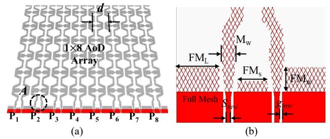

Fig. 16. (a) Configuration of the 1×8 AoD array utilizing 1D LWAoD element. (b) Configuration of the point A. (Design parameters:  $FM_L = 1.42$ ,  $FM_S = 0.9$ ,  $M_w = 0.4$ ,  $S_{mw} = 0.1$ ,  $g_{mw} = 0.05$ , Units: mm)

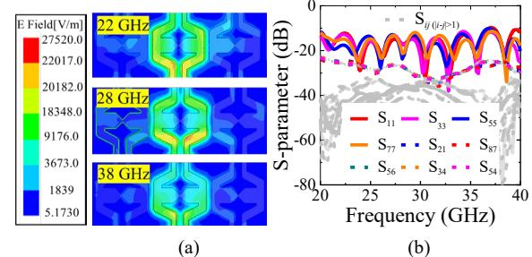

Fig. 17. (a) Simulated electric field distribution of the proposed antenna at 22, 28, and 38 GHz. (b) Simulated S-parameter of the proposed AoD array. ( $S_{ij}$ ,  $i \neq j$ )

#### III. ANTENNA-ON-DISPLAY ARRAY

# A. Array Configuration

Display antenna topologies traditionally exhibit only 1D Hplane beam scanning, which is insufficient for achieving fullspace beam steering coverage in ISAC vehicle applications [26], [27], [28], [29], [30], [31], [32]. According to the antenna theory, two-dimensional (2D) spatial beam steering requires controlling the phase progression or wave flow across two orthogonal planes (xoz-/yoz-plane). This mechanism is essential for effectively steering radiation patterns, regardless of whether the antenna operates in leaky-wave or standing-wave mode. However, due to practical constraints in automotive RF devices, existing AoD techniques employ a single-directional FPC feeding network, limiting phase control to a single plane and resulting in only 1D beam steering. In this work, for the first time, the concept of frequency scanning (FS) and phase scanning (PS) are introduced into AoD technology, thereby enabling full 2D spatial beam steering capabilities. Based on 1D LWAoD element, an exemplified 1×8 AoD array is designed to verify E-plane phase scanning capability for full-space beam coverage, as shown in Fig. 16(a) and (b). The distance between the LWAoD elements is 4.6 mm.

In FS Mode, the beam angle varies as a function of frequency by utilizing the EH1-mode characteristics. The perpendicularly coupled electric and magnetic fields in EH1-mode facilitate high directivity and broad angular coverage over a wide frequency range. Furthermore, in PS Mode, at a fixed frequency, the phase of each electrode is independently controlled. Due to EH1-mode radiation, the current distribution on adjacent elements is approximately equal in magnitude and out-of-phase to improve isolation. As shown in Fig. 17(a), this arrangement significantly reduces power coupling between neighboring elements, ensuring that each element operates with minimal interference. Despite the closely spaced elements, the port-to-port isolation of the proposed array achieves over 20 dB across

{6}------------------------------------------------

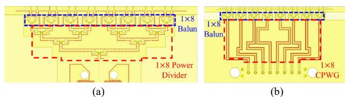

Fig. 18. Configuration of the FPC feeding network. (a) FS type. (b) PS type.

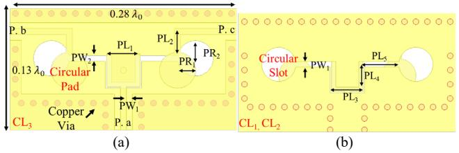

Fig. 19. Configuration of the proposed power divider. (a) Top view. (b) Bottom View. (Design parameters: PL1=0.5, PR1=0.3, PR2=0.3, BR1=0.3, BR2=0.3, Unit = mm).

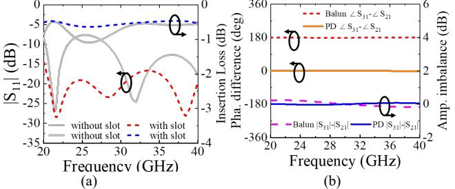

Fig. 20. (a) Simulated reflection coefficient and insertion loss of the back-toback power divider. (b) Simulated of the phase difference and amplitude imbalance at proposed balun and power divider structure.

all frequencies, as shown in Fig. 17(b). Only odd-numbered ports are presented to represent the overall performance, as the array is symmetric structure. Moreover, the mutual coupling between non-adjacent elements exhibits below -20 dB across the operating band. This confirms that the array maintains high isolation beyond adjacent elements. As a result, this independent phase adjustment permits the formation of multiple beams with high isolation and minimal mutual coupling among the array elements, thereby supporting simultaneous multi-user communication and multi-target tracking.

As shown in Fig. 18, the FPC-based feeding networks are presented for dual scanning mode performance. To provide differential feeding for EH1-mode radiation, each LWAoD element is connected to an FPC-based balun structure. For evaluating FS mode (*xoz*-plane), 1×8 power divider is designed to provide uniform phase and amplitude feeding, as shown in Fig. 18(a). For phase beam steering in the *yoz*-plane, the WMXseries connector is utilized to connect the feeding network to the RF module, which supplies the necessary phase shifts for radiation pattern scanning. As shown in Fig. 18(b), the active feeding network is fabricated using a flexible printed circuit (FPC) process, ensuring a compact and efficient design for beam steering applications.

Traditional FPCB feeding network, such as T-junction and impedance transformers, features single layer design and extremely thin substrates (≤0.008) [26], [27], [28], [29], [30], [31], [32]. However, achieving wideband operation under these conditions is challenging due to impedance mismatches and parasitic coupling, especially across the 20 – 40 GHz range. Although wideband power-divider techniques with lumped

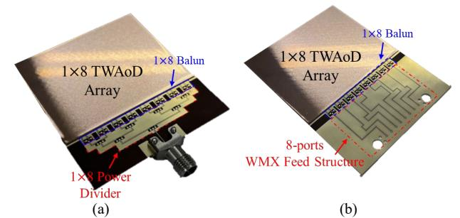

Fig. 21. Photograph of the fabricated 1×8 AoD array (a) with 1×8 power divider for FS and (b) with 8-ports feeding network for PS.

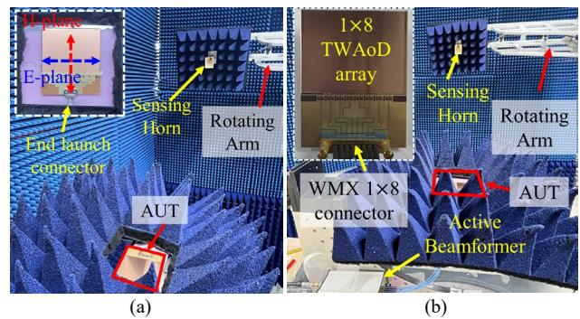

Fig. 22. (a) Photograph of the frequency scanning measurement setup for antenna-under-test (AUT). (b) Photograph of the phase scanning measurement setup for the proposed array with WMX 8-port connector.

components and multilayer configurations [45], [46] can utilize impedance mismatches and parasitic effects, such approaches are typically unsuitable for FPC-based devices due to substrate thickness limitations and fabrication constraints. To address these challenges, the proposed feeding network is configured microstrip-type circular pads and circular slot resonator, as shown in Fig. 19(a) and (b). Because the circular slot and pads couple across multiple impedance transitions, the overall impedance matching is improved. This FPC configuration is composed of three copper layers (CL1-3), two substrate layers (PI1-2), and one bonding layer (BL). As shown in Fig. 20(a), the simulated reflection coefficient and insertion loss of back-toback power-divider configuration remain below -20dB and 1dB, respectively, across the 20 – 40 GHz band.

Furthermore, different configuration of placement between circular slot and pads is implemented to realize out-of-phase response in balun structure. Fig. 20(b) presents the phase difference and amplitude imbalance at the proposed power divider and balun structure. The amplitude imbalances of the balun and power divider are within ±0.05 dB and ±0.08 dB, respectively. Moreover, the phase differences of the balun and power divider are achieved in-phase and out-of-phase response, which exhibit a good equal amplitude and phase response. The dimensions of the proposed FPCB balun and power divider are 0.13 × 0.28 0 and 0.13 × 0.23 0, respectively. As a result, the proposed balun and power divider are achieved compact size and wideband bandwidth, respectively.

# IV. SIMULATION AND MEASUREMENT RESULTS

The fabricated 1×8 antenna array with FS and PS type feeding network are presented in Fig. 21(a) and (b). The

{7}------------------------------------------------

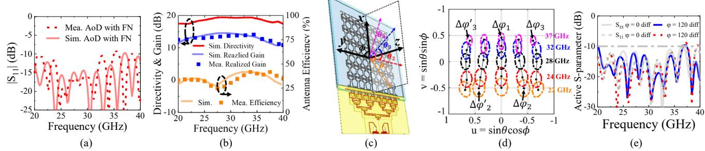

Fig. 23. (a) Simulated and measured reflection coefficient of the proposed AoD array with feeding network (FN). (b) Simulated and measured gain and antenna efficiency of the AoD array. (c) Coordinate systems and beam scanning angles for the proposed structure. The  $\theta_{(1-4)}$  angles indicate representative main beam directions in the *xoz*-plane (H-plane) and *yoz*-plane (E-plane), used for 2D spatial scanning. (d) Simulated 2D spatial beam patterns on the *u-v* plane under phase shift control at different frequencies (22–37 GHz). (e) Active S-parameter of the proposed AoD array.

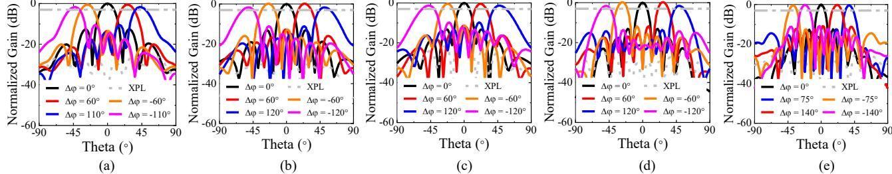

Fig. 24. Simulated scanning pattern of the proposed AoD array. (a) at 22 GH ( $\theta_1$ ). (b) at 24 GHz ( $\theta_2$ ). (c) at 28 GHz ( $\theta_3$ ). (d) at 32 GHz ( $\theta_4$ ). (e) at 37 GHz ( $\theta_5$ ).

measurement setup for the fabricated array antennas in an anechoic chamber is presented in Fig. 22. In Fig. 21(a), the antenna under test (AUT) is connected with an end-launch connector to measure FS radiation patterns. Moreover, the AUT is connected to an 8-port WMX connector, interfacing with an active beamformer that provides precise phase control across eight ports, enabling phase-steering at a fixed frequency, as shown in Fig. 21(b). The active beam former activates the phase beam scanning performance, which serves equal amplitude and applicable phase difference at 8 ports of the LWAoD array. A horn antenna is used as the sensing antenna to measure the far-field radiation patterns over a wide angular range.

Fig. 23(a) shows the measured reflection coefficient of the proposed AoD array with feeding network (FN). The measured impedance bandwidth of  $|S_{11}| < -10$  dB covers 20–40 GHz. As shown in Fig. 23(b), in addition, simulated the peak gain is achieved in the range of 10-12 dBi while the measured peak gain is 9.8-11.3 dBi, remaining higher than 9.5 dBi in the operation frequency range of 22-38 GHz. Moreover, the proposed antenna exhibits a radiation efficiency ranging from approximately 28% to 45% across the 22-38 GHz band, which an average exceeding 38%. While this is lower than typical copper-based antennas, it is consistent with the use of a transparent metal mesh and a display-integrated stack (including OCA and cover glass). The measured and simulated impedance bandwidths are in good agreement. However, the discrepancy between simulated and measured gain is mainly due to fabrication errors in the bonding process where the signal traces between the antenna layer and feeding network are misaligned [27].

Fig. 23(c) and (d) present 2D spatial beam patterns on the *u-v* plane under phase shift control at different frequencies (22-37 GHz). Each black dot indicates the direction of the peak point, while the surrounding contours represent the corresponding

TABLE I
PHASE SHIFT CONFIGURATIONS FOR 2D BEAM STEERING USING FS AND PS
ACROSS DIFFERENT OPERATING FREQUENCIES

| Freq. [GHz]               | $\Delta arphi_3$ [°] | $\Delta arphi_2$ [°] | $\Delta arphi_1$ [°] | $\Delta {arphi'}_2$ [°] | $\Delta {arphi'}_3$ [°] | Scanning Angle [°] |
|------------------------------|----------------------|----------------------|----------------------|-------------------------|-------------------------|-----------------------|
| 22 (θ 1 = 22°) | - 110                | - 60                 | 0                    | 60                      | 110                     | ±52°                  |
| 24 (θ 2 =18°)  | - 120                | - 60                 | 0                    | 60                      | 120                     | ±61°                  |
| 28 (θ=0°)                 | - 120                | - 60                 | 0                    | 60                      | 120                     | ±59°                  |
| 32 (θ 3 =-16°) | - 120                | - 60                 | 0                    | 60                      | 120                     | ±56°                  |
| 37 (θ 4 =-30°) | - 140                | - 75                 | 0                    | 75                      | 140                     | ±46°                  |

3dB beamwidth, effectively visualizing the spatial coverage and directivity at each frequency. Based on the phase shift configuration in Table I, the proposed AoD array demonstrates 3dB beam scanning angles of approximately ±50°, ±61°, ±59°, ±56°, and ±46° at 22, 24, 28, 32, and 37 GHz, respectively. The variation in scanning angles across frequency is due to the fixed inter-element spacing of 4.6 mm, optimized for 28 GHz. Moreover, as shown in Fig. 23(e), even with a phase difference of up to 120°, the active reflection coefficients achieve below 10 dB, indicating that impedance matching is not significantly affected.

To validate 2D beam scanning performance, Fig. 24 presents scanning pattern of the proposed array. The  $\theta_{1-4}$  angles indicate representative main beam directions at different frequencies (22-37GHz). In Fig. 24(a), the effective scanning range at 22 GHz is reduced despite the absence of grating lobes. This is primarily due to increased mutual coupling and radiation pattern distortion, which are common in dense arrays with electrically small element spacing ( $\sim 0.34\lambda$ ). These effects can limit beam steering fidelity, even when the theoretical scan range is wide. In contrast, at 37 GHz the spacing becomes  $\sim 0.57$   $\lambda$ , which limits the maximum steering angle to around 46° due

{8}------------------------------------------------

 $TABLE\ II$  Comparison of the Proposed Antenna With State-of-the-Art Transparent and mmWave-tHz Antennas

| Ref.         | Operation Mechanism | Frequency (GHz)    | Impedance Bandwidth (%) | Scan Dimension | Optically Transparency (%) | Maximum Gain (dBi) | 2D Spatial Beam Scanning        | Applicability To Vehicle Display Panel | Antenna Profile $(\lambda_0)$ |
|--------------|------------------------|-----------------------|-------------------------------|----------------|----------------------------------|-----------------------|---------------------------------------|----------------------------------------------|-------------------------------|
| [4]          | Standing Wave          | 28.03/29.3            | N/A                           | 2-D            | No                               | 9.65                  | No                                    | No                                           | 2.33                          |
| [5]          | Standing Wave          | 2.55- 2.8/4.4-5.85 | 9.3/26.9                      | 1-D            | No                               | 12.9-14.5             | No                                    | No                                           | 0.25                          |
| [10]         | Leaky-Wave             | 22.8-31               | 26                            | 2-D            | No                               | 13                    | 60° ×60°                              | No                                           | 0.14                          |
| [23]         | Leaky-Wave             | 325-400               | 20.69                         | 2-D            | No                               | 25.28                 | 22° ×60°                              | No                                           | 1.67                          |
| [24]         | Leaky-Wave             | 4.4-6                 | 30.77                         | 2-D            | No                               | 12                    | 58° ×25°                              | No                                           | 0.014                         |
| [27]         | Standing Wave          | 27.1-29.7             | 9.15                          | 1-D            | 88                               | 6.66                  | No                                    | Yes                                          | 0.085                         |
| [28]         | Standing Wave          | 26.2-38.1             | 37.01                         | 1-D            | 88 ≥                             | 9.4                   | No                                    | Yes                                          | 0.021                         |
| [29]         | Standing Wave          | 24.6-31.9             | 25.84                         | 1-D            | 88 ≥                             | 2.62                  | No                                    | Yes                                          | 0.018                         |
| [31]         | Standing Wave          | 26 - 31               | 17.54                         | 1-D            | 88 ≥                             | 7.2                   | No                                    | Yes                                          | 0.021                         |
| [32]         | Standing Wave          | 25.6-31.9             | 21.91                         | 1-D            | No                               | 12.32                 | No                                    | No                                           | 0.023                         |
| [33]         | Standing Wave          | 23.9-26.5             | 10.32                         | 1-D            | 85.1                             | 2.8                   | No                                    | Yes                                          | 0.018                         |
| This work | Leaky-Wave             | 22-40                 | 55.33                         | 2-D            | 88                               | 12                    | $\cong 93^{\circ} \times 108^{\circ}$ | Yes                                          | 0.018                         |

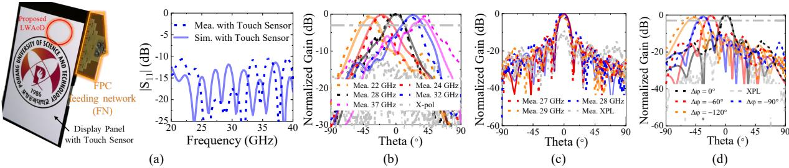

Fig. 25. (a) Prototype fabricated on a thin-film display platform for demonstration of antenna-on-display (AoD) feasibility. The structure is compatible with invehicle display systems due to its planar geometry and FPC-based feeding interface. Measured S-parameter of the proposed AoD in display platforms. (b) Measured frequency scanning patterns at 22-37 GHz. (c) Measured boresight pattern at 22-29 GHz. (d) Measured phase scanning pattern at 28 GHz.

to increased risk of grating lobes, as shown in Fig. 24(e). As a result, the proposed array achieves 2D spatial beam steering with an average coverage of 93° in the H-plane and 54° in the E-plane. This corresponds to an overall 2D angular coverage of approximately 93°×108°, confirming the array's wide-angle scanning capability for dual-mode operation.

To validate the feasibility of AoD concept in display platforms, the prototype is implemented on a flat display panel, which is structurally similar to in-vehicle displays, such as dashboard screens, as shown in Fig. 25(a). The measured reflection coefficient achieves wide operational bandwidth ranging from 20 to 40 GHz. In Fig. 25(b), the measured crosspolarization level (XPL) is achieved higher than 10 dB. To validate FS mode, the horn scans the proposed AoD array in xoz-plane for measuring H-plane radiation patterns at different frequencies. The measured H-plane radiation patterns are shown in Fig. 25(a). The measured H-plane scanning angle is achieved -48° to +45° in the 22-38 GHz. Moreover, the proposed LWAoD array demonstrates backward-to-forward continuous beam scanning in operation frequencies. The XPLs remain below -13 dB. The distortions of the radiation patterns at different frequencies are found to be attributed to unwanted scattering within a practical measurement environment.

Despite the narrow inter-element spacing, high isolation level ensures that mutual coupling scarcely affects the antenna performance. The measured E-plane beam pattern is presented in Fig. 25(b). When progressive active phase shifts  $(\Delta \phi)$  of  $\pm 90^{\circ}$  are applied, the 3-dB scanning angles exhibit approximately

±60° at 28 GHz. The sidelobe level (SLL) and XPL of the Eplane pattern in both measurement and simulation are achieved to be greater than 8 dB and 15 dB, respectively. The discrepancies between the simulated and measured results are mainly due to the mismatches in the gain level of the measured active radiation pattern [27].

As a result, the proposed 1×8 AoD array demonstrates stable gain over a wide bandwidth and achieves continuous beam scanning, despite its single layer structure. Moreover, the antenna exhibits wide-angle frequency (H-plane) and phase (E-plane) beam scanning that fully cover 2-D space, highlighting the versatility and effectiveness for compact vehicle ISAC applications.

## V. DISCUSSION

Table II compares previously reported transparent mmWave/THz antennas with the proposed antenna array. For both communication and radar applications, wide bandwidth and broad spatial beam-steering angles are key requirements. The LWAs reported in [23], [24] exhibit finite 2-D spatial beam coverage. Nevertheless, these topologies are incompatible with display panels due to multilayers, via posts, bulky size. In addition, SW transparent antennas within display panel suffer from degraded antenna efficiency and impedance bandwidth due to extremely thin substrate [27], [28], [29], [30], [31], [32]. Despite its ultra-low profile, the proposed LWAoD array broader bandwidth than a antenna-on-display solutions, while also offering higher gain and a compact unit-cell footprint relative to [27], [28], [33], [34].

{9}------------------------------------------------

Conventional AoD technologies primarily enhance beam coverage along the display front surface [27], [28], [29], [30], [31], [32], [33], [34]. However, these antenna topologies are insufficient for full-space beam steering coverage due to the manufacturing process of the FPC feeding structure in one direction. Those antenna array structures are arranged in the *yoz*-plane, resulting in 1-D beam steering characteristics. It is noted that the real-life display panel topology constrains beam steering characteristics in the *xoz*-plane. The shared aperture concept for PS and FS mode achieves backward-to-forward continuous wide-angle frequency scanning in front of the display panel. The AoD array achieves a -48°-+45° scanning range in the *xoz*-plane. Thus, the final design demonstrates 2-D spatial beam steering in both the *xoz*-plane (E-plane PS) and *yoz*-plane (H-plane FS). This work is the first to demonstrate flexible beam scanning within a single, ultra‑thin display‑integrated platform, offering new possibilities for radar, jamming, and communication applications.

## VI. CONCLUSION

This paper presents a novel wideband leaky-wave antennaon-display (LWAoD) with 2-D wide-angle beam-scanning capabilities, offering an integrated solution for ISAC applications. The proposed design features a via-less, singlelayer structure and utilizes an optimized unit cell methodology to balance antenna performance, bandwidth, and optical transparency. Experimental results demonstrate continuous beam scanning with a wide impedance bandwidth of 20–40 GHz. The measured sidelobe and cross-polarization levels remain below -10 dB and -15 dB, respectively, confirming their high radiation efficiency and suitability for space-constrained environments. By addressing critical limitations of conventional AoD and leaky-wave antennas, this work establishes the feasibility of a compact, high-performance platform for integrated radar, communication, and jamming functionalities in automotive systems. The proposed work demonstrates novelty compared to the referred designs by achieving the wide impedance bandwidth (55.33%) and widest 2-D spatial beam coverage (≅ 93°×108°) while maintaining a compact profile (0.018λ) and supporting display panel integration for vehicle ISAC systems.

# REFERENCES

- [1] Y. Liu et al., "Secure Rate Maximization for ISAC-UAV Assisted Communication Amidst Multiple Eavesdroppers," *IEEE Trans. Veh. Technol.*, vol. 73, no. 10, pp. 15843-15847, Oct. 2024.
- [2] Y. Shu, C. Qi and S. Mao, "Joint Transmit Waveform and Receive Filter Design for ISAC System With Jamming," *IEEE Trans. Veh. Technol.,*  2025.
- [3] Q. Zhu, M. Li, R. Liu and Q. Liu, "Joint Transceiver Beamforming and Reflecting Design for Active RIS-Aided ISAC Systems," *IEEE Trans. Veh. Technol.*, vol. 72, no. 7, pp. 9636-9640, July 2023.
- [4] Z. Zhang, S. -W. Wong, Y. Wen, S. -Q. Zhang, W. Li and Y. He, "A Full-Metal Dual-Band Millimeter-Wave Antenna Array With Concomitant Multifold Orthogonal Beamforming for V2V and V2I Communications," *IEEE Trans. Veh. Technol.*, vol. 73, no. 7, pp. 10381-10389, July 2024.
- [5] G. -W. Yang and S. Zhang, "A Dual-Band Shared-Aperture Antenna With Wide-Angle Scanning Capability for Mobile System Applications," *IEEE Trans. Veh. Technol.*, vol. 70, no. 5, pp. 4088-4097, May 2021
- [6] R. Li, X. Shao, S. Sun, M. Tao and R. Zhang, "IRS Aided Millimeter-Wave Sensing and Communication: Beam Scanning, Beam Splitting, and Performance Analysis," *IEEE Transactions on Wireless Communications*, vol. 23, no. 12, pp. 19713-19727, Dec. 2024.

- [7] X. Yuan et al., "Spatial-Temporal Power Optimization for MIMO Joint Communication and Radio Sensing Systems With Training Overhead," *IEEE Trans. Veh. Technol.*, vol. 70, no. 1, pp. 514-528, Jan. 2021, doi: 10.1109/TVT.2020.3046438.
- [8] R. Zhang, B. Shim, W. Yuan, M. D. Renzo, X. Dang and W. Wu, "Integrated Sensing and Communication Waveform Design With Sparse Vector Coding: Low Sidelobes and Ultra Reliability," *IEEE Trans. Veh. Technol.*, vol. 71, no. 4, pp. 4489-4494, Apr. 2022.
- [9] R. Li, X. Shao, S. Sun, M. Tao and R. Zhang, "IRS Aided Millimeter-Wave Sensing and Communication: Beam Scanning, Beam Splitting, and Performance Analysis," *IEEE Transactions on Wireless Communications*, vol. 23, no. 12, pp. 19713-19727, Dec. 2024.
- [10] J. Li, W. Yang, Q. Xue and W. Che, "Millimeter-Wave Dual-Circularly Polarized Wide-Angle Scanning Antenna Array for Vehicular Communication Systems," *IEEE Trans. Veh. Technol.*, 2025.
- [11] S. L. Ma, J. Lu, C. Gu and J. Mao, "A Wideband Dual-Circularly Polarized, Simultaneous Transmit and Receive (STAR) Antenna Array for Integrated Sensing and Communication in IoT," *IEEE Internet of Things Journal*, vol. 10, no. 7, pp. 6367-6376, 1 Apr. 2023.
- [12] L. Ma, J. Lai, Y. Yin, C. Xia, C. Gu and J. Mao, "A Wideband Co-Linearly Polarized Full-Duplex Antenna-in-Package With High Isolation for Integrated Sensing and Communication," *IEEE Antennas Wireless Propag. Lett.*, vol. 22, no. 9, pp. 2185-2189, Sept. 2023.
- [13] G. Zhao et al., "Dual-Polarized Antenna Arrays Based on Non-Uniform Partial Reflective Decoupling Layers for Vehicular Base Station Systems," *IEEE Trans. Veh. Technol.,* vol. 73, no. 3, pp. 3051-3064, Mar. 2024.
- [14] D. Lee et al., "Planar Asymmetric Fed Interdigital Coupling Antenna-in-Package Using FOWLP Process Operating at 60–90 GHz in Endfire Mode," *IEEE Trans Microw. Theory and Techn.*, vol. 72, no. 4, pp. 2378- 2390, Apr. 2024.
- [15] B. Yu et al., "A wideband mmWave antenna in fan-out wafer level packaging with tall vertical interconnects for 5G wireless communication," *IEEE Trans. Antennas Propag.*, vol. 69, no. 10, pp. 6906–6911, Oct. 2021.
- [16] Y. Song et al., "An On-Chip Frequency-Reconfigurable Antenna For Q-Band Broadband Applications," *IEEE Antennas Wireless Propag. Lett.*, vol. 16, pp. 2232-2235, 2017.
- [17] Y. Cao, S. Yan, J. Li and J. Chen, "A Pillbox Based Dual Circularly-Polarized Millimeter-Wave Multi-Beam Antenna for Future Vehicular Radar Applications," *IEEE Trans. Veh. Technol.*, vol. 71, no. 7, pp. 7095- 7103, July 2022.
- [18] Y. Chen, L. Zhang, Y. He and Z. N. Chen, "A Polarization and Radiation Beam Reconfigurable Integrated Antenna With Broadband and High Gain for mmWave Vehicular Communication," *IEEE Trans. Veh. Technol.*, vol. 74, no. 3, pp. 4526-4538, Mar. 2025.
- [19] J. Werner, J. Wang, A. Hakkarainen, D. Cabric and M. Valkama, "Performance and Cramer–Rao Bounds for DoA/RSS Estimation and Transmitter Localization Using Sectorized Antennas*," IEEE Trans. Veh. Technol.*, vol. 65, no. 5, pp. 3255-3270, May 2016.
- [20] D. Xie, L. Zhu and X. Zhang, "An EH0-Mode Microstrip Leaky-Wave Antenna With Periodical Loading of Shorting Pins," *IEEE Trans Antennas Propag.*, vol. 65, no. 7, pp. 3419-3426, Jul. 2017.
- [21] H. -D. Li and L. Zhu, "Study on Bandwidth Properties of EH1-Mode Microstrip Leaky-Wave Antenna for Broadside Radiation," *IEEE Antennas Wireless Propag. Lett*, vol. 20, no. 10, pp. 2028-2032, Oct. 2021.
- [22] Z. Dongze et al., "Transversely Slotted SIW Leaky-Wave Antenna Featuring Rapid Beam-Scanning for Millimeter-Wave Applications," *IEEE Trans. Antennas Propag.*, vol. 68, no. 6, pp. 4172-4185, Jun. 2020.
- [23] S.Yao, Y. Cheng, Y. Wu, and H. Yang, "THz 2-D Frequency Scanning Planar Integrated Array Antenna With Improved Efficiency," *IEEE Antennas Wireless Propag. Lett.*, vol. 20, no. 6, pp. 983-987, Jun. 2021.
- [24] Y. Li, Q. Xue, E. Yung, and Y. Long, "Quasi Microstrip Leaky-Wave Antenna with a Two-Dimensional Beam-Scanning Capability," *IEEE Trans. Antennas Propag.*, vol. 57, no. 2, pp. 347-354, Feb. 2009.
- [25] H. Wang, S. Sun, and X. Xue, "A periodic meandering microstrip line leaky-wave antenna with consistent gain and wide-angle beam scanning," *Int. J. RF Microw. Comput.-Aided Eng.*, vol. 32, no. 7, Jul. 2022, Art. no. e23162.
- [26] J. Park et al., "An optically invisible antenna-on-Display concept for millimeter-wave 5G cellular devices," *IEEE Trans. Antennas Propag.*, vol. 67, no. 5, pp. 2942-2952, May. 2019.
- [27] J. Park et al., "Differentially Fed, 1-D Phased-Array Antenna-on-Display Featuring Wideband and Polarization Agility for Millimeter-Wave Wireless Applications," *IEEE Trans. Antennas Propag.*, vol. 71, no. 9, pp. 7196-7205, Sep. 2023.

{10}------------------------------------------------

- [28] J. Park et al., "Circuit-on-Display: A Flexible, Invisible Hybrid Electromagnetic Sensor Concept," *IEEE Journal of Microwaves*, vol. 1, no. 2, pp. 550-559, Apr. 2021.
- [29] W. Hong, K.-H. Baek, and S. Ko, "Millimeter-wave 5G antennas for smartphones: Overview and experimental demonstration," *IEEE Trans. Antennas Propag.*, vol. 65, no. 12, pp. 6250-6261, Dec. 2017.
- [30] D. Lee et al., "Dual-polarized Dual-Band Antenna-on-Display Using Via-Less and Single-Layer Topology for mmWave Wireless Scenarios," *IEEE Antennas Wireless Propag. Lett.*, May. 2023.
- [31] Oh. J et al., "High-Gain Millimeter-Wave Antenna-in-Display Using Non-Optical Space for 5G Smartphones," *IEEE Trans. Antennas Propag.*, vol. 71, no. 2, pp.1458-1468, Feb. 2023.
- [32] T. D. Nguyen et al., "Optically Invisible Artificial Magnetic Conductor Subarrays for Triband Display-Integrated Antennas," *IEEE Trans. Microw. Theory and Techn.*, vol. 70, no. 8, pp. 3975-3986, Aug. 2022.
- [33] W. Kun et al., "A Novel Low-Profile Phased Antenna With Dual-Port and Its Application in 1-D Linear Array to 2-D scanning," *IEEE Trans Antennas Propag.*, vol. 70, no. 8, pp.6718-6731, Aug. 2022.
- [34] Y. Wanchen et al., "94-GHz Compact 2-D Multibeam LTCC Antenna Based on Multifolded SIW Beam-Forming Network," *IEEE Trans. Antennas Propag.*, vol. 65, no. 8, pp.4238-4333, Aug. 2017.
- [35] K. Iimura, D. Lee and W. Hong, "A Study on the Influence of Metal Mesh Design on a Transparent Antenna on Display for Radar and Communication using Ultra Fine Mesh Film," *2024 IEEE Asia-Pacific Microwave Conference (APMC)*, Bali, Indonesia, 2024.
- [36] R. E. Collin, Field Theory of Guided Waves. New York, NY, USA: McGraw-Hill, 1960.
- [37] P. Baccarelli, S. Paulotto, D. R. Jackson and A. A. Oliner, "A New Brillouin Dispersion Diagram for 1-D Periodic Printed Structures," *IEEE Trans. Microw. Theory Techn.,* vol. 55, no. 7, pp. 1484-1495, Jul. 2007.
- [38] P. Silvester and P. Benedek, "Microstrip Discontinuity Capacitances for Right-Angle Bends, T Junctions, and Crossings," *IEEE Trans. Microw. Theory Techn.*, vol. 21, no. 5, pp. 341-346, May 1973.
- [39] A. Gopinath and B. Easter, "Moment Method of Calculating Discontinuity Inductance of Microstrip Right-Angled Bends (Short Papers)," *IEEE Trans. Microw. Theory Techn.*, vol. 22, no. 10, pp. 880- 883, Oct. 1974.
- [40] X. N. Low, Z. N. Chen and T. S. P. See, "A UWB Dipole Antenna With Enhanced Impedance and Gain Performance," *IEEE Trans. Antennas Propag.*, vol. 57, no. 10, pp. 2959-2966, Oct. 2009.
- [41] C. A. Balanis, Antenna Theory: Analysis and Design, 4th ed. Hoboken, NJ, USA: Wiley, 2016.
- [42] D. M. Pozar, Microwave Engineering, 3rd ed. New York: Wiley, 2004.
- [43] J. Smith, et al., "Impedance Matrix Analysis for Convergence in RF Structures," *IEEE Trans. Antennas Propag.*, vol. 60, no. 5, pp. 1500–1508, May 2012.
- [44] A. Brown, et al., "Design Criteria for Traveling-Wave Antennas with Leaky-Wave Radiation," *IEEE Trans. Antennas Propag.*, vol. 62, no. 3, pp. 1205–1213, Mar. 2014.
- [45] K. Song and Q. Xue, "Novel ultra-wideband (UWB) multilayer slotline power divider with bandpass response," *IEEE Microw. Compon. Lett.*, vol. 20, no. 1, pp.13-15, Jan. 2010.
- [46] P. Wu et al., "A Novel Ka-Band Planar Balun Using Microstrip-CPS-Microstrip Transition," *IEEE Microw. Wireless Compon. Lett.*,vol. 21, no. 3, pp.136-138, Mar. 2011.