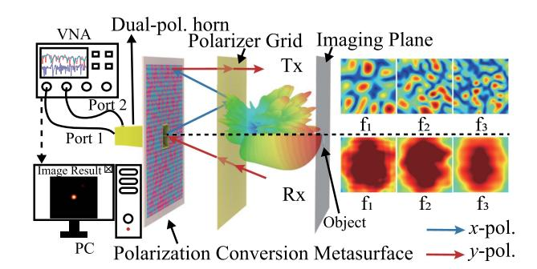
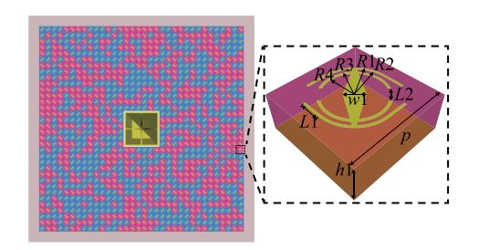
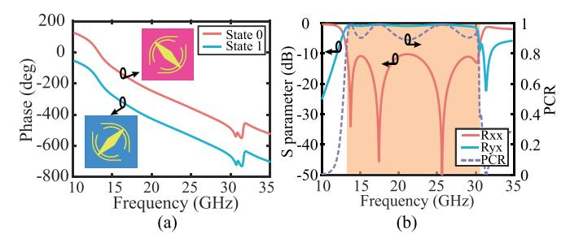
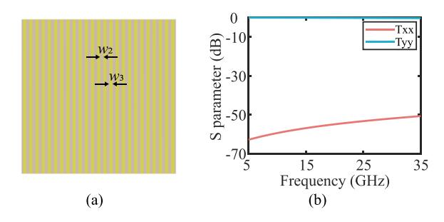
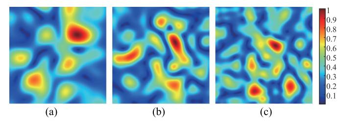
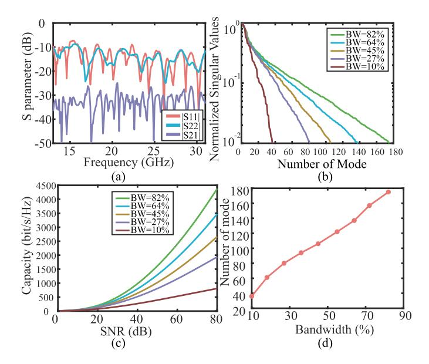
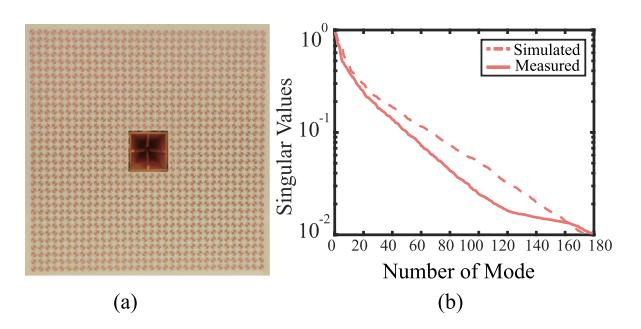
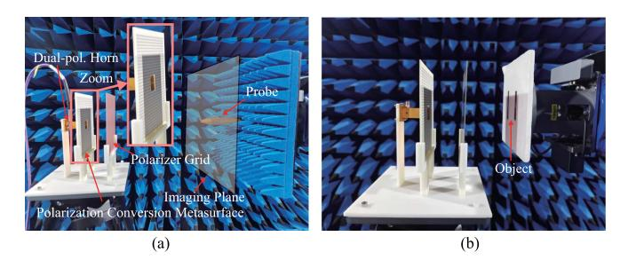
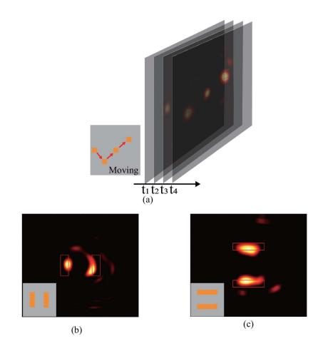
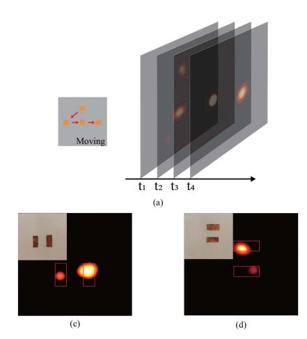

{0}------------------------------------------------

# Low-Profile Broadband 1-Bit Randomly Encoded Folded Reflectarray Co-Aperture Transceiver for Frequency-Diverse Microwave Imaging

Xinhao Chen , Yifei Wei , Jinyu Wu, Jiachen DU , *Graduate Student Member, IEEE*, Dingfei Ma , Baiyang Liu , *Member, IEEE*, and Qingfeng Zhang , *Senior Member, IEEE* 

Abstract—In this letter, we propose a low-profile broadband 1-bit randomly encoded folded reflectarray co-aperture transceiver for frequency-diverse microwave imaging. The system consists of a broadband polarization conversion metasurface, a polarizer grid, and a dual-polarized horn. The designed metasurface exhibits a high polarization conversion ratio above 90% and a broad operational frequency band of 13 GHz to 31 GHz (corresponding to 82% relative bandwidth), which is much wider than the state of arts. By combining a polarizing grid and a polarization converter, the feed optical path of the transmitter can be folded. So the overall thickness of the system is reduced by half in comparison to traditional reflective or transmissive metasurface imaging systems. Furthermore, we integrate the transmitting and receiving antennas into a single dual-polarized antenna for feed. Real-time microwave imaging examples are provided to demonstrate the high performance of the folded reflectarray co-aperture tranceiver. The proposed system may find wide applications in real-time tracking of objects in integrated sensing and communication.

Index Terms—1-bit metasurface, co-aperture transceiver, folded reflectarray, microwave imaging, polarization conversion.

## I. INTRODUCTION

ICROWAVE imaging finds extensive applications in medical imaging [1], [2], [3], radio frequency identification [4], nondestructive testing [5], security screening [6], wireless sensing [7], and remote sensing [8]. The advantage of microwave imaging lies in their ability to penetrate many optically opaque materials, such as clothing and walls, and is much safer to use than X-ray imaging [9].

Manuscript received 16 July 2024; accepted 29 July 2024. Date of publication 2 August 2024; date of current version 4 December 2024. This work was supported in part by the Basic and Applied Basic Research Foundation of Guangdong Province under Grant 2021B1515120029; in part by the Shenzhen Key Laboratory of EM Information under Grant ZDSYS20210709113201005; and in part by High-Level Special Funds under Grant G03034K004. (Corresponding author: Oingfeng Zhang.)

Xinhao Chen, Yifei Wei, Jinyu Wu, Jiachen DU, and Qingfeng Zhang are with the State Key Laboratory of Optical Fiber and Cable Manufacture Technology, Department of Electronic and Electrical Engineering, Southern University of Science and Technology, Shenzhen 518055, China, and also with the National Center for Applied Mathematics Shenzhen (NCAMS), Shenzhen 518055, China (e-mail: zhangqf@sustech.edu.cn).

Dingfei Ma is with the College of Information Engineering, Guangdong University of Technology, Guangzhou 510006, China (e-mail: madf@gdut.edu.cn). Baiyang Liu is with the College of Big Data and Internet, Shenzhen Technology University, Shenzhen 518118, China.

Digital Object Identifier 10.1109/LAWP.2024.3436914

Fig. 1. Frequency-diverse microwave imaging using a low-profile broadband 1-bit randomly encoded folded reflectarray co-aperture transceiver.

Traditional microwave imaging methods mainly rely on mechanical scanning antennas or phased array arrays with active phase shifters or complex feeding networks, which suffer from slow data acquisition, high power consumption, and high costs [10], [11], [12], [13], [14]. Recently, frequency-diverse microwave imaging based on leaky-wave antennas (LWAs) and metasurface antennas emerges as a new technique featuring fast data acquisition, low power consumption, simple architecture, and low manufacturing cost [15], [16], [17], [18], [19], [20], [21], [22], [23]. These antennas generate frequency-diverse radiation patterns to illuminate the object under test. However, if multiple 1-D LWAs are used to form a 2-D aperture, multiple ports are typically required [24], [25]. Active metasurface antennas using diode switches were proposed to form a 2-D aperture for microwave imaging [26]. However, large amount of diodes consumes significant power and slows down imaging speed. Moreover, since the feed source should be placed at the focal point of the metasurface, these metasurface imaging systems in [26], [27], [28], and [29] are high profile, which can be potentially improved by applying folded array technology [30], [31]. Therefore, static frequency-diverse metasurface with a low profile is highly demanded for imaging applications.

In this letter, we design a low-profile, wideband 1-bit randomly encoded folded reflectarray co-aperture transceiver for frequency-diverse imaging, as shown in Fig. 1. The proposed wideband metasurface operates from 13 GHz to 31 GHz (corresponding to 82% relative bandwidth), which converts linearly polarized incident waves into cross-polarized reflected waves with 0° or 180° phases. In combination with a polarizer grid on top, the metasurface enables 1-bit encoding degree of freedom to control the transmission radiation pattern randomly

1536-1225 © 2024 IEEE. Personal use is permitted, but republication/redistribution requires IEEE permission. See https://www.ieee.org/publications/rights/index.html for more information.

{1}------------------------------------------------

frequency-diverse, while maintaining the receiving radiation pattern frequency independent. This frequency-diverse imaging system features a high diversity owe to the broadband nature of the designed metasurface, a reduced profile owe to the usage of folded reflectarray, and improved aperture efficiency owe to the integration of transmitting and receiving antennas into a single source under a single aperture.

#### II. PRINCIPLE OF FREQUENCY-DIVERSE IMAGING

The proposed imaging system, as shown in Fig. 1, consists of a polarizer (y-polarized), a polarization conversion metasurface, and a dual-polarization horn antenna. We first uses the horn antenna to radiate x-polarized waves, which, after being reflected by the polarizer, are converted to y-polarized waves by the polarization conversion metasurface, and finally go through the polarizer to shine the imaging object. The scattered y-polarized waves by the object directly go back through the polarizer to the horn antenna. So the dual-polarization horn antenna serves both as a transmitter and as a receiver.

The electric field excitation per cell of the polarization conversion metasurface can be expressed as [32], [33], [34]

$$E^{Tx}(\theta,\phi) = \sum_{m=1}^{M} \sum_{n=1}^{N} A_0^{mn} e^{-j\varphi_0^{mn}} \Gamma^{mn} e^{-j\varphi_1^{mn}}$$

$$\times e^{-jkp\sin\theta(m\cos\theta + n\sin\phi)} \tag{1}$$

where  $A_0^{mn}$  and  $\varphi_0^{mn}$  represent the incident amplitude and phase due to the source illuminating onto the element, respectively,  $\Gamma^{mn}$  and  $\varphi_1^{mn}$  denote the reflection amplitude and phase (0° or  $180^\circ$ ) of the mnth element, the wavenumber is  $k=2\pi/\lambda$ , and p represents the periodicity of each element.  $\varphi_0^{mn}=k|\mathbf{r}_{\rm s}-\mathbf{r}_{\rm mn}|$ , where  $\mathbf{r}_{\rm s}$  is the position of the source, which needs to be converted into the position of the focal point (0,0,F) in the folded array.

The reflected field of the metasurface can be regarded as the radiated field generated by the induced current excited by the incident field. Due to polarization conversion, the reflected wave is then y-polarized, which successfully goes through the polarizer grid to illuminate the object under test. The scattered waves maintains y-polarization and then directly goes through the polarizer grid to the dual-polarization horn antenna. By using the Born approximation, the transmission coefficient between transmitter and receiver due to object scattering,  $S_{f_n}$ , is expressed as [24]

$$S_{f_n} = \int \Delta \epsilon(\mathbf{r}) E_{f_n}^{Rx}(\mathbf{r}) \cdot E_{f_n}^{Tx}(\mathbf{r}) d\mathbf{r}$$
 (2)

where  $\Delta\epsilon(\mathbf{r})$  is the reflectivity difference between the object and the background, and  $E_{f_n}^{\mathrm{Tx}}$  and  $E_{f_n}^{\mathrm{Rx}}$  are the electric fields within the imaging domain generated by the transmitting and receiving antennas at frequency  $f_n$ , respectively,  $n=1,2,\ldots,N_f$ . Note that the transmitting field  $E_{f_n}^{\mathrm{Tx}}$  is produced by the metasurface, which is calculated through (1), while the receiving field  $E_{f_n}^{\mathrm{Rx}}$  is directly generated by the horn antenna. Therefore, as indicated by Fig. 1, the two radiation fields are completely different. After discretization, (2) is reformulated as a linear problem

$$\mathbf{H}\Delta\epsilon = \mathbf{S} \tag{3}$$

where  $\mathbf{S} \in \mathbb{C}^{N_f \times 1}$  refers to the transmission vector consisting of  $S_{n_f}$  for all  $N_f$  frequencies, the contrast vector  $\Delta \epsilon \in \mathbb{C}^{N \times 1}$ 

Fig. 2. Metasurface configuration (p = 4,  $R_1 = 1.46$ ,  $R_2 = 1.36$ ,  $R_3 = 1.21$ ,  $R_4 = 1.1$ ,  $w_1 = 0.76$ ,  $L_1 = 0.8$ ,  $L_2 = 0.3$ , and  $h_1 = 1.524$ ; unit: mm).

contains elements  $\Delta \epsilon(\mathbf{r}_n)$  is unknown to be reconstructed, and  $\mathbf{H} \in \mathbb{C}^{N_f \times N}$  refers to the measurement matrix and is arranged by  $\mathbf{H} = [E_1^{\mathrm{Rx}} E_1^{\mathrm{Tx}}; \dots E_{n_f}^{\mathrm{Rx}} E_{n_f}^{\mathrm{Tx}}; \dots E_{N_f}^{\mathrm{Rx}} E_{N_f}^{\mathrm{Tx}}]$ . In summary, the imaging problem is finally formulated as (3), where  $\Delta \epsilon$  containing the object information is the unknown to be solved.

The sensing capacity of an imaging system is determined by the number of independent modes provided by the measurement matrix H [25]. The more independent modes a system has, the higher its capacity achieves. Mathematically, one may apply singular value decomposition to the measurement matrix, i.e.,

$$\mathbf{H} = \mathbf{U}\mathbf{\Sigma}\mathbf{V}^T \tag{4}$$

where  $\Sigma$  is a diagonal matrix, which contains all the singular values. The number of nonzero singular values quantifies the imaging capability of the system. The sensing capacity can be quantified using the singular values [35]

$$C = \sum_{k=1}^{K} \log \left( 1 + \frac{P_k}{N_0} \lambda_k \right) \tag{5}$$

where  $\lambda_k$  represents the kth singular value in  $\Sigma$  of (4), and  $P_k/N_0$  is the signal-to-noise ratio.

As indicated by (2), the measurement matrix is determined by both transmitting field and receiving field. Since the receiving field, being completely determined by the horn antenna, is almost frequency independent (as illustrated by Fig. 1), the measurement matrix is mainly determined by the transmitting field, which is described by (1). Note from (1) that the parts that provide frequency diversity are  $\varphi_0^{mn} = k|\mathbf{r}_{\rm s} - \mathbf{r}_{\rm mn}|$  and  $kp\sin\theta(m\cos\theta+n\sin\phi)$ , where the free-space wavenumber k plays the key role. When using frequency-diverse imaging with static metasurfaces, increasing the bandwidth is a way to enhance the system's imaging capability. The broader the bandwidth, the more the measurement modes, and the higher the sensing capacity can be offered. In summary, one needs to design a broadband metasurface for capacity-enhanced frequency-diverse imaging.

#### III. DESIGN OF FOLDED REFLECTARRAY TRANCEIVER

The configuration of the designed broadband polarization conversion metasurface is shown in Fig. 2, which consists of a single-layer dielectric substrate (Rogers 4003 C  $\epsilon = 3.55$ ), a backside ground plane, and a top-layer cat-eye pattern. The red and blue colors represent phase 0° (state 0) and 180° (state 1), respectively. The two phases can be exchanged by rotating the metaunit by 90°, as shown in Fig. 3(a), where a phase difference of 180° between states "0" and "1" can be observed. The polarization conversion responses are shown in Fig. 3(b).

{2}------------------------------------------------

| Ref.      | Туре                               | Method       | Bandwidth(GHz) | Num. of Port   | Workload | Aperture( $\lambda_0^2$ ) |
|-----------|------------------------------------|--------------|----------------|----------------|----------|---------------------------|
| [20]      | Cavity-backed metasurface          | MISO         | 9-11(20%)      | 6(5Tx and 1Rx) | 5        | $13.3 \times 13.3$        |
| [21]      | Cavity-backed metasurface          | SIMO Dynamic | 20-24(18.2%)   | 5(1Tx and 4Rx) | 24       | N.A.                      |
| [36]      | Cavity-backed metasurface          | Static       | 32-36(11.7%)   | 2(1Tx and 1Rx) | 1        | 22.67×22.67               |
| [26]      | Traditional reflective metasurface | Dynamic      | 35(/)          | 2(1Tx and 1Rx) | 64       | 11.66×11.66               |
| [29]      | Traditional reflective metasurface | Static       | 15-31(69.6%)   | 4(2Tx and 2Rx) | 2        | N.A.                      |
| This work | Fold reflective metasurface        | Static       | 13-31(81.8%)   | 2(1Tx and 1Rx) | 1        | 9.98×9.98                 |

TABLE I COMPARISON WITH OTHER IMAGING SYSTEM

Fig. 3. (a) Phase of metaunit and (b) polarization conversion responses.

Fig. 4. (a) Configuration and (b) transmission response of the designed polarizer grid ( $w_2 = 0.1, w_3 = 0.1$ ; unit: mm).

Note that the designed metasurface operates within 13 GHz to 31 GHz (corresponding to 82% relative bandwidth) and has a high PCR above 90%. The parameter PCR is defined by  $PCR = |R_{yx}|^2/(|R_{yx}|^2 + |R_{xx}|^2)$ .

Fig. 4(a) shows the configuration of the designed polarization grid, which is composed of a single-layer dielectric substrate and a metal grid pattern where the width and gap size of the metal are shown in Fig. 2. The function of the metal grid is to reflect x-polarized wave and transmit y-polarized wave. The transmission response of the polarization grid is illustrated in Fig. 4(b), which shows that, within the operating frequency band, x-polarized wave is almost fully reflected and y-polarized wave is almost fully transmitted.

The combination of the metasurface and polarizer grid forms the folded reflectarray tranceiver. In the application of frequency-diverse microwave imaging, the key factor is the operational bandwidth. Table I compares this work with other imaging systems. The proposed folded reflectarray tranceiver has the widest bandwidth among all the reported works. Moreover, this work utilizes frequency diversity for microwave imaging, resulting in the lowest workload, reduced time consumption, and minimal number of ports compared with others.

Fig. 5. Simulated E-field in the imaging area at (a) 13 GHz, (b) 22 GHz, and (c) 31 GHz.

# IV. EXPERIMENTAL DEMONSTRATION OF MICROWAVE IMAGING

To generate radiation fields covering a 2-D aperture, we randomly arrange the metaunit with states "0" and "1" in a  $34 \times 34$  metasurface array. Within the operational bandwidth, the amplitude response of each pixel is unity, and the phase response is 0° or 180°. The unit period is 4 mm, and the overall size of the metasurface is 136 mm  $\times$  136 mm. Through calculation, the focal length F of the metasurface should be 120 mm [30]. We place the broadband dual-polarization feed source, with dimensions of 23 mm  $\times$  23 mm, at the center of the metasurface. Polarization grid is placed at a distance of F/2 from the metasurface. The imaging plane is located 150 mm away from the metasurface, with each pixel of 1 mm  $\times$  1 mm. We set the size of the imaging plane to be 120 mm  $\times$  120 mm. We set the frequency sampling interval to be 0.1 GHz.

Fig. 5 plots the electric-field distributions on the imaging plane at 13 GHz, 22 GHz, and 31 GHz, respectively. Note that these fields cover the imaging area and vary with frequency. Fig. 6(a) shows the S-parameters of the whole imaging system, and the Fig. 6(b)–(d) demonstrates the singular value distributions, sensing capacities, and number of modes (with singular values above 0.01) for different operational bandwidths. Note that as the bandwidth increases, the number of modes and sensing capacity increases. When the bandwidth increases from 10% to 82%, the number of effective measurements modes increases from 36 to 175.

A prototype is fabricated and its phtograph is shown in Fig. 7(a). Fig. 8 illustrates the setup of near-field measurement and microwave imaging in the anechoic chamber. Fig. 7(b) shows the measured singular value distribution of the measurement matrix against the simulated one. The measured singular values are slightly smaller than the simulated ones, which are probably due to the additional loss caused by the metal and substrate used in fabricated prototype.

{3}------------------------------------------------

Fig. 6. (a) S-parameters of the imaging system. (b) Singular value distributions, (c) sensing capacities, and (d) number of modes (with singular values above 0.01) for different bandwidths.

Fig. 7. (a) Fabricated metasurface and (b) its singular value distribution.

Fig. 8. Experiment setup for (a) near-field measurement and (b) imaging demonstration in an anechoic chamber.

For imaging reconstruction, we needs to solve the inverse problem in (3). Since we need to solve  $120 \times 120 \times 1 = 14400$  unknowns using only  $N_f = 181$  measurements, compressive sensing algorithms is a favorable strategy for image reconstruction under sparsity condition. Solving (3) for  $x = \Delta \epsilon$  is a convex optimization problem, i.e.,

$$\mathbf{x} = \operatorname{argmin} \left\{ \frac{1}{2} \|\mathbf{S} - \mathbf{\Theta} \mathbf{x}\|_{2}^{2} + \tau \Phi(\mathbf{x}) \right\}$$
 (6)

where  $\Phi(\mathbf{x})$  may use  $||x||_1$  to promote sparsity, where  $||\cdot||_1$  represents the  $l_1$  norm, and  $\tau$  is the regularization parameter. TwIST algorithm is particularly well-suited for signal recovery

Fig. 9. Simulated imaging results of (a) a moving patch, (b) vertically placed static patch, and (c) horizontally placed static patch.

Fig. 10. Measured imaging results of (a) a moving patch, (b) vertically placed static patch, and (c) horizontally placed static patch.

problems involving sparse signals and exhibits good robustness in cases with significant noise [37]. Figs. 9 and 10 provide simulated and experimental results of microwave imaging using the proposed folded reflectarray tranceiver. Both real-time moving and static objects are used to validate the imaging performance. Particularly, the well reconstructed images of a moving object in Figs. 9(a) and 10(a) demonstrate the high-speed imaging capability of the proposed system. This may find wide applications in real-time tracking of objects in integrated sensing and communication of next-generation communications.

#### V. CONCLUSION

In this letter, we design a low-profile, wideband 1-bit randomly encoded folded reflectarray co-aperture transceiver for frequency-diverse imaging, which is much wider than the state of arts. The combination of polarization conversion metasurface and polarizer grid enables the co-aperture integration of transmitter and receiver with different radiation patterns, and reduces the whole thickness by half compared conventional designs. Real-time microwave imaging examples are provided to demonstrate the high performance of the folded reflectarray co-aperture tranceiver. The proposed system may find wide applications in real-time tracking of objects in ISAC.

{4}------------------------------------------------

### REFERENCES

- [1] P. Meaney, M. Fanning, D. Li, S. Poplack, and K. Paulsen, "A clinical prototype for active microwave imaging of the breast," *IEEE Trans. Microw. Theory Techn.*, vol. 48, no. 11, pp. 1841–1853, Nov. 2000.
- [2] L. Xu and X. Wang, "Focused microwave breast hyperthermia monitored by thermoacoustic imaging: A computational feasibility study applying realistic breast phantoms," *IEEE J. Electromagn., RF, Microw. Med. Biol.*, vol. 4, no. 2, pp. 81–88, Jun. 2020.
- [3] R. Scapaticci, P. Kosmas, and L. Crocco, "Wavelet-based regularization for robust microwave imaging in medical applications," *IEEE Trans. Biomed. Eng.*, vol. 62, no. 4, pp. 1195–1202, Apr. 2015.
- [4] A. Buffi, A. A. Serra, P. Nepa, H.-T. Chou, and G. Manara, "A focused planar microstrip array for 2.4 GHz RFID readers," *IEEE Trans. Antennas Propag.*, vol. 58, no. 5, pp. 1536–1544, May 2010.
- [5] R. K. Amineh, M. Ravan, and R. Sharma, "Nondestructive testing of nonmetallic pipes using wideband microwave measurements," *IEEE Trans. Microw. Theory Techn.*, vol. 68, no. 5, pp. 1763–1772, May 2020.
- [6] J. L. Fernandes, J. R. Tedeschi, D. M. Sheen, and D. L. McMakin, "Threedimensional millimeter-wave imaging for concealed threat detection in shoes," in *Proc. Passive Act. Millimeter-Wave Imag. XVI*, 2013, pp. 90–97.
- [7] S. Ullah, C. Ruan, M. S. Sadiq, T. U. Haq, and W. He, "High efficient and ultra wide band monopole antenna for microwave imaging and communication applications," *Sensors*, vol. 20, no. 1, 2019, Art. no. 115.
- [8] M. Pieraccini et al., "Remote sensing of building structural displacements using a microwave interferometer with imaging capability," *NDT E. Int.*, vol. 37, no. 7, pp. 545–550, 2004.
- [9] M. F. Imani et al., "Review of metasurface antennas for computational microwave imaging," *IEEE Trans. Antennas Propag.*, vol. 68, no. 3, pp. 1860–1875, Mar. 2020.
- [10] D. S. Shumakov and N. K. Nikolova, "Fast quantitative microwave imaging with scattered-power maps," *IEEE Trans. Microw. Theory Techn.*, vol. 66, no. 1, pp. 439–449, Jan. 2018.
- [11] Q. Zhang et al., "1-D frequency-diverse single-shot guided-wave imaging using surface-wave goubau line," *IEEE Trans. Antennas Propag.*, vol. 68, no. 4, pp. 3194–3206, Apr. 2020.
- [12] X. Peng, W. Tan, W. Hong, C. Jiang, Q. Bao, and Y. Wang, "Airborne DL-SLA 3-D SAR image reconstruction by combination of polar formatting and *L*1 regularization," *IEEE Trans. Geosci. Remote Sens.*, vol. 54, no. 1, pp. 213–226, Jan. 2016.
- [13] J. W. Smith and M. Torlak, "Efficient 3-D near-field MIMO-SAR imaging for irregular scanning geometries," *IEEE Access*, vol. 10, pp. 10283–10294, 2022.
- [14] F. Gumbmann and L.-P. Schmidt, "Millimeter-wave imaging with optimized sparse periodic array for short-range applications," *IEEE Trans. Geosci. Remote Sens.*, vol. 49, no. 10, pp. 3629–3638, Oct. 2011.
- [15] S. Li and S. Wu, "Low-cost millimeter wave frequency scanning based synthesis aperture imaging system for concealed weapon detection," *IEEE Trans. Microw. Theory Techn.*, vol. 70, no. 7, pp. 3688–3699, Jul. 2022.
- [16] Y. Shi, A. K. Rashid, D. Ma, and Q. Zhang, "Spoof surface plasmonbased single-shot super-resolution compressive imaging," *IEEE Plasma Sci.*, vol. 48, no. 8, pp. 2742–2750, Aug. 2020.
- [17] S. Ge, Q. Zhang, C.-Y. Chiu, Y. Chen, and R. D. Murch, "Single-sidescanning surface waveguide leaky-wave antenna using spoof surface plasmon excitation," *IEEE Access*, vol. 6, pp. 66020–66029, 2018.
- [18] T. Sleasman, M. F. Imani, M. Boyarsky, K. P. Trofatter, and D. R. Smith, "Computational through-wall imaging using a dynamic metasurface antenna," *OSA Continuum*, vol. 2, no. 12, pp. 3499–3513, Dec. 15 2019.
- [19] T. V. Hoang, V. Fusco, T. Fromenteze, and O. Yurduseven, "Computational polarimetric imaging using two-dimensional dynamic metasurface apertures," *IEEE Open J. Antennas Propag.*, vol. 2, pp. 488–497, 2021.

- [20] T. V. Hoang et al., "Spatial diversity improvement in frequency-diverse computational imaging with a multi-port antenna," *Results Phys.*, vol. 22, 2021, Art. no. 103906.
- [21] T. A. Sleasman, M. F. Imani, A. V. Diebold, M. Boyarsky, K. P. Trofatter, and D. R. Smith, "Implementation and characterization of a twodimensional printed circuit dynamic metasurface aperture for computational microwave imaging," *IEEE Trans. Antennas Propag.*, vol. 69, no. 4, pp. 2151–2164, Apr. 2021.
- [22] X. Chen, Q. Zhang, and B. Liu, "An ultra wideband reflective polarization conversion surface for near-field sensing," in *2023 IEEE 11th Asia-Pacific Conf. Antennas Propag.*, vol. 1, 2023, pp. 1–2.
- [23] J. N. Gollub et al., "Large metasurface aperture for millimeter wave computational imaging at the human-scale," *Sci. Rep.*, vol. 7, no. 1, pp. 42650–42650, 2017.
- [24] D. Ma et al., "Millimeter-wave 3-D imaging using leaky-wave antennas and an extended rytov approximation in a frequency-diverse MIMO system," *IEEE Trans. Microw. Theory Techn.*, vol. 71, no. 4, pp. 1809–1825, Apr. 2023.
- [25] D. Ma et al., "Single-shot frequency-diverse near-field imaging using highscanning-rate leaky-wave antenna," *IEEE Trans. Microw. Theory Techn.*, vol. 69, no. 7, pp. 3399–3412, Jul. 2021.
- [26] J. Han, L. Li, S. Tian, G. Liu, H. Liu, and Y. Shi, "Millimeter-wave imaging using 1-bit programmable metasurface: Simulation model, design, and experiment," *IEEE Trans. Emerg. Sel. Topics Circuits Syst.*, vol. 10, no. 1, pp. 52–61, Mar. 2020.
- [27] L. Wang, L. Li, Y. Li, H. C. Zhang, and T. J. Cui, "Single-shot and singlesensor high/super-resolution microwave imaging based on metasurface," *Sci. Rep.*, vol. 6, no. 1, 2016, Art. no. 26959.
- [28] Y. B. Li et al., "Transmission-type 2-bit programmable metasurface for single-sensor and single-frequency microwave imaging," *Sci. Rep.*, vol. 6, no. 1, 2016, Art. no. 23731.
- [29] B. Liu, J. Wu, Q. Zhang, and H. Wong, "High-speed wide-angle sensing and imaging by wideband metasurfaces with joint frequency, polarization, and spatial diversities," *Laser Photon. Rev.*, 2024, Art. no. 2400207.
- [30] B. Xi, Y. Xiao, H. Dong, M. Xiang, F. Yang, and Z. Chen, "Low-profile wideband 1-bit reconfigurable transmitarray with 2D beam-scanning capacity," *IEEE Trans. Antennas Propag.*, vol. 71, no. 4, pp. 3228–3237, Apr. 2023.
- [31] X. Chen, Q. Zhang, and B. Liu, "A millimeter-wave wideband low-profile folded reflectarray transceiver for frequency-diverse near-field imaging," in *Proc. 2023 Cross Strait Radio Sci. Wireless Technol. Conf.*, 2023, pp. 1–4.
- [32] G. Lipworth et al., "Comprehensive simulation platform for a metamaterial imaging system," *Appl. Opt.*, vol. 54, no. 31, pp. 9343–9353, 2015.
- [33] G. Lipworth et al., "Metamaterial apertures for coherent computational imaging on the physical layer," *J. Opt. Soc. Amer. A, Opt., Image Sci., Vis.*, vol. 30, no. 8, pp. 1603–1612, 2013.
- [34] J. Hunt et al., "Metamaterial apertures for computational imaging," *Sci. (Amer. Assoc. Advance. Sci.)*, vol. 339, no. 6117, pp. 310–313, 2013.
- [35] J. Du et al., "Probe-free high-resolution millimeter-wave frequencydiverse sensing based on spoof surface plasmon polaritons," *IEEE Trans. Antennas Propag.*, vol. 72, no. 1, pp. 1057–1062, Jan. 2024.
- [36] M. Zhao et al., "Frequency-diverse metacavity cassegrain antenna for differential coincidence imaging," *IEEE Trans. Antennas Propag.*, vol. 71, no. 11, pp. 9054–9059, Nov. 2023.
- [37] J. M. Bioucas-Dias and M. A. T. Figueiredo, "A new TwIST: Two-step iterative shrinkage/thresholding algorithms for image restoration," *IEEE Trans. Image Process.*, vol. 16, no. 12, pp. 2992–3004, Dec. 2007.