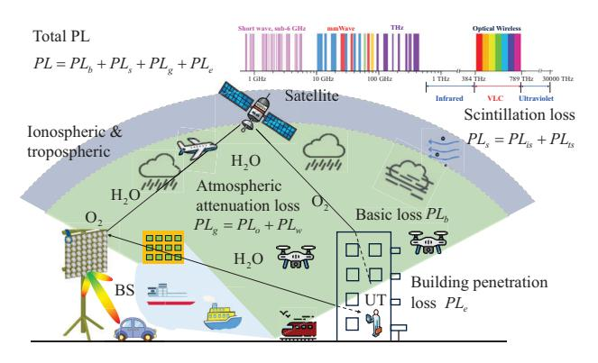
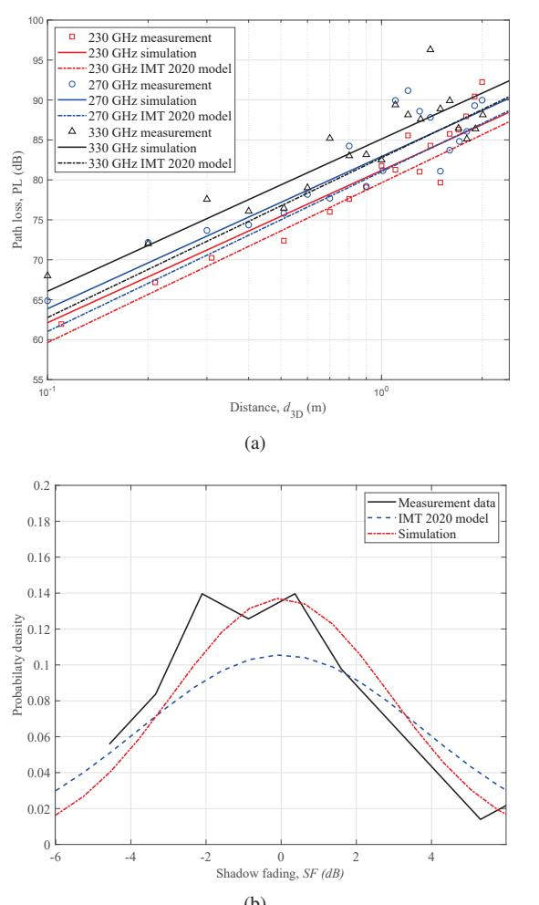
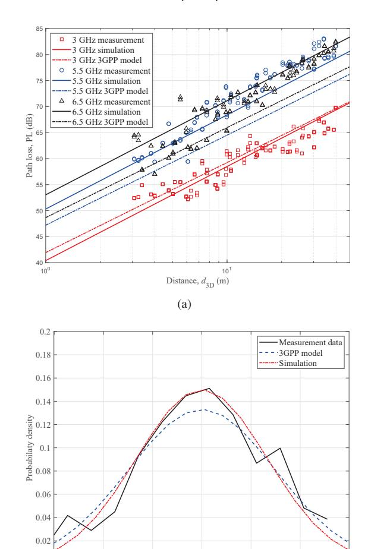
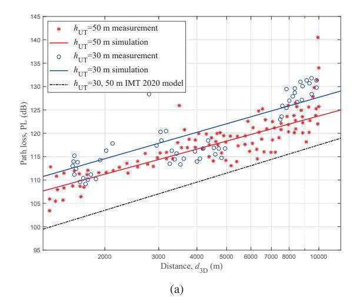
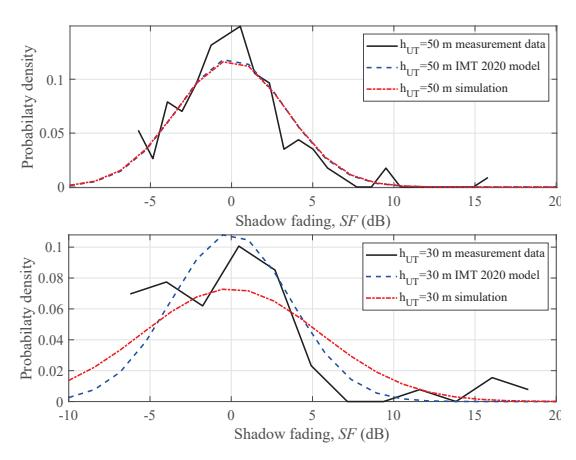

{0}------------------------------------------------

# A General 6G Large-scale Fading Channel Model for Multiple Frequency Bands and Scenarios

Yuhang Pan1, Lijian Xin2, Hengtai Chang2,3, Jie Huang1,2, Junling Li1,2, Cheng-Xiang Wang1,2\* 1National Mobile Communications Research Laboratory, School of Information Science and Engineering, Southeast University, Nanjing 211189, China.

2Pervasive Communication Research Center, Purple Mountain Laboratories, Nanjing 211111, China. 3School of Information Science and Engineering, Shandong University, Qingdao, 266237, China. \*Corresponding Author: Cheng-Xiang Wang

Email: panyh@seu.edu.cn, xinlijian@pmlabs.com.cn, hunter chang@126.com, {j huang, junlingli, chxwang}@seu.edu.cn

*Abstract*—Large-scale fading (LSF) channel models play a significant role in network planning and deployment of the sixth generation (6G) wireless communication systems. This paper proposes a 6G general large-scale fading channel model (6GLSFCM) for multiple frequency bands and scenarios. The basic loss, atmospheric attenuation loss, scintillation loss, and building penetration loss are jointly considered in this model to characterize the frequency band channels ranging from sub-6 GHz to visible light communication (VLC). It also encompasses multiple scenario channels, including unmanned aerial vehicle (UAV), industrial Internet of thing (IIoT), satellite, integrated sensing and communication (ISAC), etc. The proposed 6GLS-FCM can be simplified to specific frequency band and scenario models based on the large-scale fading characteristics across different frequency bands and scenarios. Furthermore, the path loss and shadow fading characteristics of the 6GLSFCM are simulated and validated with channel measurement data for multiple frequency bands and scenarios.

*Index Terms*—6G general channel model, large-scale fading, path loss, shadow fading, multiple frequency bands and scenarios.

### I. INTRODUCTION

As the foundation for designing the sixth-generation (6G) wireless communication systems, theoretical analysis, performance evaluation, optimization, and standardization efforts must account for the new characteristics introduced by emerging frequency bands, scenarios, and technologies. Conducting channel measurements and modeling for multiple frequency bands, global-coverage scenarios, and full-application scenarios are fundamental to researching 6G communication systems [1]–[3]. Wireless channels are generally classified into small-scale and large-scale fading channels . In [4], [5], the authors summarized various channel types of 6G wireless communications, categorizing them into multiple frequency band channels, global-coverage scenario channels, and full-application scenario channels. Unlike small-scale fading channels, large-scale fading channels are crucial in network planning and optimization. Investigating the characteristics of large-scale fading channels across multiple frequency bands and scenarios, as well as developing appropriate models, is vital for the development of 6G.

The large-scale fading reflects the power variation of wireless signals over long distances, which can be divided into the path loss (PL) and shadow fading (SF). The SF describes the change in signal strength caused by the obstruction of electromagnetic waves during propagation and describes the slow power variation of the received signal. The PL describes the power variation of the received signal between the transmitter (Tx) and receiver (Rx). The Okumura-Hata model extended the Okumura model to various propagation environments, considering urban, suburban, and open areas. In [6], the Lee model considered terrain influence and can be used to simulate macro cellular at 150-2000 MHz and micro cellular at 450-2000 MHz. In [7], the COST231-Hata model used a correction factor to extend the Okumura-Hata model's applicable frequency to 2000 MHz. In [8], the 3GPP TR 38.901 channel model provided path loss and shadow fading models for scenarios such as urban macro cells, urban micro cells, and industrial Internet of things (IIoTs) in the 0.5-100 GHz frequency bands, considering the influence of transmitting and receiving antenna heights. In [9], the IMT-2020 constructed the large-scale fading models of new frequencies and techniques, such as terahertz (THz), integrated sensing and communication (ISAC), and reconfigurable intelligent surface (RIS).

Future 6G networks aim to achieve allmultiple frequency band communications, global-coverage scenario communications, and full-application scenario communications. A major challenge in channel modeling for these advanced wireless systems lies in integrating large-scale electromagnetic propagation characteristics from multiple frequency bands and scenarios into a unified framework. This integration is essential to fulfill the diverse requirements of future 6G communication environments. To our knowledge, there are currently no largescale fading channels that comprehensively incorporates the propagation characteristics of multiple frequency bands and multiple scenarios. To fill this research gap, this paper aims to propose a 6G general large-scale fading channel model (6GLS-FCM) that integrates the electromagnetic propagation characteristics across multiple frequency bands and scenarios. Additionally, a parameter simplification and optimization method of the 6GLSFCM is provided for specific frequency bands and scenarios, which can be used to characterize the large-scale fading channel in these contexts. 6GLSFCM provides a simple method for modeling large-scale fading channels and a closed

{1}------------------------------------------------

Fig. 1. Various scenarios and their properties of the electromagnetic wave propagation for the 6GLSFCM.

form expression in complex environments, which facilitates the calculation and implementation of 6G network planning and optimization. The novelty and main contributions of this paper are summarized as follows:

- A 6GLSFCM is proposed based on the general channel modeling theory, which comprehensively considers the large-scale fading characteristics of the electromagnetic propagation for multiple frequency bands and scenarios of 6G.
- Corresponding measurement data across multiple frequency bands and scenarios are used to fit and evaluate
  the path loss and shadow fading of the 6GLSFCM.
  Results indicate that the proposed 6GLSFCM model can
  accurately capture the large-scale propagation characteristics of the specific frequency bands and specific scenarios,
  demonstrating its accuracy, consistency, and applicability.

The rest of this paper is organized as follows. Section II introduces the proposed 6G general large-scale fading channel model. Section III presents the specific model parameters of multiple frequencies and scenarios by simplifying the 6GLS-FCM. Validation results are presented in Section IV, where the performance of the proposed channel model is validated by using various channel measurement data. Finally, conclusions are drawn in Section V.

### II. 6G GENERAL CHANNEL MODEL FOR LARGE-SCALE FADING

The large-scale fading channel models in various frequency bands and scenarios of 6G are almost related to the carrier center frequency, Tx distance, and Rx height. However, some frequency bands and scenarios need to consider the certain unique losses due to their unique electromagnetic wave propagation characteristics. Therefore, it is crucial to account for the various scenarios and the properties of the electromagnetic wave propagation, as shown in Fig. 1.

To characterize the path losses of the various propagation channels, the path loss of the 6GLSFCM can be expressed as

$$PL = PL_b + PL_a + PL_s + PL_e \tag{1}$$

where  $PL_b$  denotes the basic path loss,  $PL_g$  denotes the atmospheric attenuation loss,  $PL_s$  is the scintillation loss, and  $PL_e$  represents the building penetration loss.

TABLE I SPECIFIC SYMBOLS OF THE 6GLSFCM.

|  | Labels | Meanings                     | Frequencies/Scenarios |
|--|--------|------------------------------|-----------------------|
|  | $PL_b$ | Basic Loss                   | All                   |
|  | $PL_g$ | Atmospheric Attenuation Loss | Satellite             |
|  | $PL_s$ | Scintillation Loss           | Satellite, shortwave  |
|  | $PL_e$ | Building Penetration Loss    | All                   |

Shadow fading follows a Gaussian random distribution with a mean of zero and a standard deviation of  $\sigma_{SF}$ , which can be expressed as

$$SF = N(0, \sigma_{SF}^2). \tag{2}$$

#### A. Basic Loss

The basic loss describes the loss of electromagnetic waves as they propagate through space, which is the most common loss caused by the free space propagation. Based on the dual slope model of QuaDRiGa channel model in [12], the basic loss can be expressed as

$$PL_b = \begin{cases} PL_1, & d_{3D} \le d_{BP}^{3D} \\ PL_2, & d_{3D} > d_{BP}^{3D} \end{cases}$$
 (3)

with

$$PL_{1} = A_{1} \cdot \log_{10} d_{3D} + B + C \cdot \log_{10} f_{c} + D \cdot d_{3D}$$

$$PL_{2} = PL_{1} \left( d_{BP}^{3D} \right) + A_{2} \cdot \log_{10} \left( d_{3D} / d_{BP}^{3D} \right)$$

$$d_{BP}^{2D} = E \cdot (h_{BS} - h_{E}) \cdot (h_{UT} - h_{E}) \cdot f_{c}$$

$$d_{BP}^{3D} = \sqrt{\left( d_{BP}^{2D} \right)^{2} + \left( h_{BS} - h_{UT} \right)^{2}}$$

where  $d_{\rm 2D}$  and  $d_{\rm 3D}$  denote the two dimensional (2D) and three dimensional (3D) distance (m) between Tx and Rx, respectively,  $f_c$  denotes the center frequency (GHz),  $h_{\rm BS}$  and  $h_{\rm UT}$  denote the height (m) of BS and UT, respectively. In addition,  $d_{\rm BP}^{\rm 2D}$  and  $d_{\rm BP}^{\rm 3D}$  mean 2D and 3D break-point distance (m), respectively, and  $h_E$  denotes environment height relative to the ground. Moreover,  $A_1$ ,  $A_2$ , B, C, D, and E are adjustable parameters that vary with different frequency bands and scenarios. Further,  $A_1$  and  $A_2$  are distance-dependence (logarithm scaling) of PL before and after the break-point, respectively, E is reference coefficient of PL, E is frequency-dependence of PL, E is distance-dependence (linear), and E is the break-point scaling factor.

The characteristic of the basic path loss is that when the 3D distance is smaller than the 3D break-point distance, the path loss is positively correlated with the 3D distance and the central frequency. When the 3D distance exceeds the 3D break-point distance, due to the influence of ground reflection waves, the distance correlation coefficient changes from  $A_1$  to  $A_2$ , usually with  $A_1 < A_2$ , indicating that the correlation between basic path loss and distance increases.

#### B. Atmospheric Attenuation Loss

Atmospheric attenuation loss is caused by atmospheric absorption during electromagnetic wave propagation, which is negligible at frequencies below 10 GHz. As provided in the standardized channel document [13], atmospheric attenuation

{2}------------------------------------------------

loss adopts the instantaneous prediction method, which can be expressed as

$$PL_a = PL_o + PL_w \tag{4}$$

where  $PL_o$  and  $PL_w$  represent gaseous attenuation attributable to the oxygen and water vapour, respectively.

1) Oxygen Attenuation Loss: Oxygen attenuation loss  $PL_o$  can be expressed as

$$PL_o(f_c, P_s, T_s, \rho_{w_s}) = \frac{\gamma_o(f_c, p_s, T_s, e_s) \cdot h_o(f_c, P_s, T_s, \rho_{w_s})}{\sin \theta}$$
(5)

where  $P_s$  and  $p_s$  denote the instantaneous total and dry surface pressure, respectively. In addition,  $T_s$  denotes the instantaneous surface temperature,  $\rho_{w_s}$  denotes the instantaneous surface water vapour density, and  $\theta$  denotes elevation angle. Further,  $\gamma_o$  denotes the specific gaseous attenuation attributable to oxygen and  $h_o$  denotes the oxygen equivalent height.

2) Water Vapour Attenuation Loss: Water vapour attenuation loss  $PL_w$  can be expressed as

$$PL_w(f_c, p_s, T_s, \rho_{w_s}) = \frac{\gamma_w(f_c, p_s, T_s, e_s) \cdot h_w(f_c)}{\sin \theta}$$
 (6)

where  $\gamma_w$  denotes the specific gaseous attenuation attributable to water vapour, and  $h_o$  denotes the water vapour equivalent height.

#### C. Scintillation Loss

Scintillation loss is caused by ionospheric and tropospheric scintillation during electromagnetic wave propagation, which includes the ionospheric scintillation loss  $PL_{\rm is}$  and tropospheric scintillation loss  $PL_{\rm ts}$ . Scintillation loss can be expressed as

$$PL_s = PL_{\rm is} + PL_{\rm ts} \tag{7}$$

where  $PL_{\rm is}$  and  $PL_{\rm ts}$  denote the loss caused by the ionospheric scintillation and the tropospheric scintillation, respectively.

1) Ionospheric Scintillation Loss: Ionospheric scintillation loss refers to the rapid variations in signal strength and phase caused by irregularities and disturbances in the ionosphere. Ionospheric scintillation can be expressed as

$$PL_{\rm is} = \frac{P_{fluc}}{\sqrt{2}} \times \left(\frac{f_c}{4}\right)^{-1.5}, f_c > 0.1 \text{ GHz}$$
 (8)

where  $P_{fluc}$  denotes peak-to-peak amplitude fluctuations given in [14].

To calculate ionospheric scintillation loss at frequencies below 100 MHz, [10] presents a semi-empirical formula, which can be expressed as

$$PL_{\rm is} = \frac{677.2 N_H I_a \sec \theta_{100}}{\left(f_c \left(\text{MHz}\right) + f_{100}\right)^{1.98} + 10.2}, f_c < 100 \text{ MHz}$$
 (9)

where  $N_H$  denotes the number of path hops,  $\theta_{100}$  denotes the incidence angle of the electromagnetic wave at the height of 100 km, and  $f_{100}$  denotes the gyromagnetic frequency at the height of 100 km.  $I_a$  denotes the absorption index.

2) Tropospheric Scintillation Loss: Tropospheric scintillation loss refers to the rapid variations in signal strength and phase caused by irregularities and turbulence in the troposphere, such as changes in temperature, humidity, and pressure, during electromagnetic wave propagation.

3GPP TR 38.811 provides the relationship between typical power attenuation levels and elevation angles at frequencies below 20 GHz, which can be used as a reference for calculating tropospheric scintillation loss.

#### D. Building Penetration Loss

Building penetration loss refers to the attenuation of signals caused by the absorption, reflection, and scattering effects of walls, windows, doors, floors, and other building materials as electromagnetic waves propagate through buildings. According to recommendation [15], building penetration loss  $PL_e$  not exceeding probability P can be expressed as

$$PL_{e}(P) = 10\log_{10}(10^{0.1N_{1}(P)} + 10^{0.1N_{2}(P)} + 10^{0.1N_{3}}) (10)$$

where  $N_1(P)$  and  $N_2(P)$  are random variables with a normal distribution related to P, and  $N_3$  is a constant.

## III. MODEL PARAMETERS OF 6GLSFCM FOR MULTIPLE FREQUENCY BANDS AND SCENARIOS

Based on the general channel modeling theory, a parameter-adjustable general large-scale fading channel model have been detailed in Section II. By introducing specific model parameters, it can be simplified to large-scale fading channel models for the specific frequency band and scenario. Based on the proposed 6GLSFCM, the model parameters of various frequency bands and scenarios under both LoS and NLoS conditions are provided in Table II. The parameters in Table II are concluded from standard models. The 6GLSFCM parameters can be instantiated by the measurement data of corresponding frequency band scenario, as conducted in Section IV.

The 6GLSFCM is applicable for cross-scenario large-scale fading modeling, provided that the fading characteristics across different scenarios are effectively fused within the processing model. For cross-scenario cases, such as UAV-indoor communication, in addition to considering large-scale fading models for UAV and indoor scenarios, it is also necessary to consider building penetration losses.

#### IV. RESULTS AND ANALYSIS

#### A. Parameter Optimization Methods

The idea of the least squares method is to determine the optimal fitting parameters by minimizing the sum of the squared residuals between the actual measurement data and the simulation data. Suppose there is a set of channel measurement data consisting of N data points, where each data point includes the independent variables of  $x_{n,1}, x_{n,2}, \cdots, x_{n,m}$  and the dependent variable  $y_n$ . The goal is to find a channel model f that satisfies  $y = f(\mathbf{X}, \mathbf{\Theta})$ , where the vector  $\mathbf{X} = (x_{n,1}, x_{n,2}, \cdots, x_{n,m})$  and  $\mathbf{\Theta}$  represents the vector of the model parameters. For the RMa scenarios,  $\mathbf{\Theta}$  is

{3}------------------------------------------------

| TABLE II                                             |
|------------------------------------------------------|
| 6GLSECM SIMULATION PARAMETERS FOR LOS AND NLOS CASES |

| Frequency band                | Scenario                                                     | LoS                                                                                                                                                                                                                                                                                                                                                                                                                                   | NLoS                                                                                                                                                                                                                       |
|-------------------------------|--------------------------------------------------------------|---------------------------------------------------------------------------------------------------------------------------------------------------------------------------------------------------------------------------------------------------------------------------------------------------------------------------------------------------------------------------------------------------------------------------------------|----------------------------------------------------------------------------------------------------------------------------------------------------------------------------------------------------------------------------|
|                               | RMa                                                          | $A_1 = 20 + \min(0.03h^{1.72}, 10), A_2 = 40, \\ B = 32.44 - \min(0.044h^{1.72}, 14.77), \\ C = 20, D = 0.002 \log_{10}(h), E = \pi/150, \\ h_E = 0, \sigma_{\rm SF} = 4$                                                                                                                                                                                                                                                             | $A_1 = 43.42 - 3.1 \log_{10}(h_{\rm BS}), A_2 = 0, B = 47.11 - 7.1 \log_{10}(W) + 7.5 \log_{10}(h) - [15.07 - 3.7(h/h_{\rm BS})^2] \log_{10}(h_{\rm BS}) - 3.2(\log_{10}(11.75h_{\rm UT}))^2, C = 20, \sigma_{\rm SF} = 8$ |
|                               | UMa                                                          | $A_1 = 22, A_2 = 40, B = 28, C = 20, D = 0,$ $E = 1/75, h_E = 1, \sigma_{SF} = 4$                                                                                                                                                                                                                                                                                                                                                  | $A_1 = 30, A_2 = 0, B = 32.4, C = 20, \sigma_{SF} = 7.8$                                                                                                                                                                   |
|                               | UMi                                                          | $A_1 = 21, A_2 = 40, B = 32.4, C = 20, D = 0,$ $E = 1/75, h_E = 1, \sigma_{SF} = 4$                                                                                                                                                                                                                                                                                                                                                | $A_1 = 31.9, A_2 = 0, B = 32.4, C = 20, \sigma_{SF} = 8.1$                                                                                                                                                                 |
|                               | Indoor                                                       | $A_1 = 17.3, A_2 = 0, B = 32.4, C = 20, \sigma_{SF} = 3$                                                                                                                                                                                                                                                                                                                                                                              | $A_1 = 31.9, A_2 = 0, B = 32.4, C = 20, \sigma_{SF} = 8.3$                                                                                                                                                                 |
|                               | UAV- RMa                                                  | use PL model in RMa when $h_{\rm UT} < 10 {\rm m}$ $A_1 = {\rm max}(23.9 - 1.8 h_{\rm UT}, 20), A_2 = 0, B = 32.4,$ $C = 20, \sigma_{\rm SF} = 4.2 \exp(-0.0046 h_{\rm UT})$ in other cases                                                                                                                                                                                                                                           | use PL model in RMa when $h_{\mathrm{UT}} < 10 \mathrm{m}$ $A_1 = 35 - 5.3 h_{\mathrm{UT}}, A_2 = 0, B = 20.4,$ $C = 20, \sigma_{\mathrm{SF}} = 6$ in other cases                                                          |
|                               | UAV- UMa                                                  | use PL model in UMa when $h_{\rm UT} < 22.5 {\rm m}$ $A_1 = 28, A_2 = 0, B = 22,$ $C = 20, \sigma_{\rm SF} = 4.2 \exp(-0.0066 h_{\rm UT})$ in other cases                                                                                                                                                                                                                                                                             | use PL model in UMa when $h_{\rm UT} < 22.5$ m $A_1 = 46-7h_{\rm UT}, A_2 = 0, B = 24.9,$ $C = 20, \sigma_{\rm SF} = 6$ in other cases                                                                                     |
| Sub-6 GHz cmWave mmWave | UAV- UMi                                                  | use PL model in RMa when $h_{\rm UT} < 22.5 {\rm m}$ $A_1 = {\rm max}(22.3 - 0.5 h_{\rm UT}, 20), A_2 = 0, B = 30.9,$ $C = 20, \sigma_{\rm SF} = {\rm max}(5 \exp(-0.1 h_{\rm UT}), 2)$ in other cases                                                                                                                                                                                                                       | use PL model in UMi when $h_{\rm UT} < 22.5 {\rm m}$ $A_1 = 43.2 - 7.6 h_{\rm UT}, A_2 = 0, B = 32.4,$ $C = 20, \sigma_{\rm SF} = 8$ in other cases                                                                        |
|                               | MariA2S                                                      | $A_1 = 19, A_2 = 0, B = 37.5, C = 20, \sigma_{SF} = 3.8$                                                                                                                                                                                                                                                                                                                                                                              | /                                                                                                                                                                                                                          |
|                               | MariNS                                                       | $A_1 = 20, A_2 = 0, B = 32.4 + A_{ref}, C = 20$                                                                                                                                                                                                                                                                                                                                                                                       |                                                                                                                                                                                                                            |
|                               | IIoT                                                         | $A_1 = 21.5, A_2 = 0, B = 31.84, C = 19, \sigma_{SF} = 4$                                                                                                                                                                                                                                                                                                                                                                             | $\begin{array}{c} \text{SL:} A_1 = 25.5, A_2 = 0, B = 33, C = 20, \sigma_{\text{SF}} = 5.7 \\ \text{DL:} \ A_1 = 35.7, A_2 = 0, B = 18.6, C = 20, \sigma_{\text{SF}} = 7.2 \end{array}$                                    |
| ·                             |                                                              |                                                                                                                                                                                                                                                                                                                                                                                                                                       | SH: $A_1 = 23.0, A_2 = 0, B = 32.4, C = 20, \sigma_{SF} = 5.9$ DH: $A_1 = 21.9, A_2 = 0, B = 33.6, C = 20, \sigma_{SF} = 4.0$                                                                                           |
|                               | V2V- Highway                                              | $A_1 = 20, A_2 = 0, B = 32.4, C = 20, \sigma_{SF} = 3$                                                                                                                                                                                                                                                                                                                                                                                |                                                                                                                                                                                                                            |
|                               | V2V-                                                         | $A_1 = 16.7, A_2 = 0, B = 38.77, C = 18.2, \sigma_{SF} = 3$                                                                                                                                                                                                                                                                                                                                                                           | DH: $A_1 = 21.9, A_2 = 0, B = 33.6, C = 20, \sigma_{SF} = 4.0$                                                                                                                                                             |
|   -                     | V2V- Highway V2V-                                      | $A_1 = 16.7, A_2 = 0, B = 38.77, C = 18.2, \sigma_{SF} = 3$ $A_1 = 20, A_2 = 0, B = 32.4, C = 20,$ $PL_g, PL_s, PL_e$                                                                                                                                                                                                                                                                                                                 | DH: $A_1 = 21.9, A_2 = 0, B = 33.6, C = 20, \sigma_{SF} = 4.0$                                                                                                                                                             |
| -                             | V2V- Highway V2V- Urban                             | $A_1 = 16.7, A_2 = 0, B = 38.77, C = 18.2, \sigma_{SF} = 3$ $A_1 = 20, A_2 = 0, B = 32.4, C = 20,$ $PL_g, PL_s, PL_e$                                                                                                                                                                                                                                                                                                                 | DH: $A_1 = 21.9, A_2 = 0, B = 33.6, C = 20, \sigma_{SF} = 4.0$ $A_1 = 30.0, A_2 = 0, B = 36.85, C = 18.9, \sigma_{SF} = 4$                                                                                                 |
| _                             | V2V- Highway V2V- Urban Satellite ISAC HST | $A_{1} = 16.7, A_{2} = 0, B = 38.77, C = 18.2, \sigma_{\mathrm{SF}} = 3$ $A_{1} = 20, A_{2} = 0, B = 32.4, C = 20,$ $PL_{g}, PL_{s}, PL_{e}$ $PL_{1}(d_{1}) + PL_{2}(d_{2}) + 10 \log_{10} \frac{\lambda_{0}^{2}}{4\pi} + 10 \log_{10} \sigma_{RCS}$ $A_{1} = 36.04 - 6.55 \log h_{\mathrm{UT}}, A_{2} = 0,$ $B = 3.77 + 20.47 \log h_{\mathrm{BS}} - 3.2 (\log 11.75 h_{\mathrm{UT}})^{2},$ $C = 26.16, \sigma_{\mathrm{SF}} = 3.78$ | DH: $A_1 = 21.9, A_2 = 0, B = 33.6, C = 20, \sigma_{SF} = 4.0$ $A_1 = 30.0, A_2 = 0, B = 36.85, C = 18.9, \sigma_{SF} = 4$                                                                                                 |
| THz                           | V2V- Highway V2V- Urban Satellite ISAC HST | $A_1 = 16.7, A_2 = 0, B = 38.77, C = 18.2, \sigma_{\rm SF} = 3$ $A_1 = 20, A_2 = 0, B = 32.4, C = 20,$ $PL_g, PL_s, PL_e$ $PL_1(d_1) + PL_2(d_2) + 10\log_{10}\frac{\lambda_0^2}{4\pi} + 10\log_{10}\sigma_{RCS}$ $A_1 = 36.04 - 6.55\log h_{\rm UT}, A_2 = 0,$ $B = 3.77 + 20.47\log h_{\rm BS} - 3.2(\log 11.75h_{\rm UT})^2,$ $C = 26.16, \sigma_{\rm SF} = 3.78$ $A_1 = 19.3, A_2 = 0, B = 13.3, C = 21, \sigma_{\rm SF} = 3.8$   | DH: $A_1 = 21.9, A_2 = 0, B = 33.6, C = 20, \sigma_{SF} = 4.0$ $A_1 = 30.0, A_2 = 0, B = 36.85, C = 18.9, \sigma_{SF} = 4$                                                                                                 |
| THz OWC                    | V2V- Highway V2V- Urban Satellite ISAC HST | $A_{1} = 16.7, A_{2} = 0, B = 38.77, C = 18.2, \sigma_{\mathrm{SF}} = 3$ $A_{1} = 20, A_{2} = 0, B = 32.4, C = 20,$ $PL_{g}, PL_{s}, PL_{e}$ $PL_{1}(d_{1}) + PL_{2}(d_{2}) + 10 \log_{10} \frac{\lambda_{0}^{2}}{4\pi} + 10 \log_{10} \sigma_{RCS}$ $A_{1} = 36.04 - 6.55 \log h_{\mathrm{UT}}, A_{2} = 0,$ $B = 3.77 + 20.47 \log h_{\mathrm{BS}} - 3.2 (\log 11.75 h_{\mathrm{UT}})^{2},$ $C = 26.16, \sigma_{\mathrm{SF}} = 3.78$ | DH: $A_1 = 21.9, A_2 = 0, B = 33.6, C = 20, \sigma_{SF} = 4.0$ $A_1 = 30.0, A_2 = 0, B = 36.85, C = 18.9, \sigma_{SF} = 4$                                                                                                 |
|                               | V2V- Highway V2V- Urban Satellite ISAC HST | $A_1 = 16.7, A_2 = 0, B = 38.77, C = 18.2, \sigma_{\rm SF} = 3$ $A_1 = 20, A_2 = 0, B = 32.4, C = 20,$ $PL_g, PL_s, PL_e$ $PL_1(d_1) + PL_2(d_2) + 10\log_{10}\frac{\lambda_0^2}{4\pi} + 10\log_{10}\sigma_{RCS}$ $A_1 = 36.04 - 6.55\log h_{\rm UT}, A_2 = 0,$ $B = 3.77 + 20.47\log h_{\rm BS} - 3.2(\log 11.75h_{\rm UT})^2,$ $C = 26.16, \sigma_{\rm SF} = 3.78$ $A_1 = 19.3, A_2 = 0, B = 13.3, C = 21, \sigma_{\rm SF} = 3.8$   | DH: $A_1 = 21.9, A_2 = 0, B = 33.6, C = 20, \sigma_{SF} = 4.0$ $A_1 = 30.0, A_2 = 0, B = 36.85, C = 18.9, \sigma_{SF} = 4$                                                                                                 |

 $(A_1, A_2, B, C, D, E, h_E, \sigma_{SF})$ . The goal is to minimize the sum of squared residuals  $S(\Theta)$ , which is

$$S(\Theta) = \sum_{n=1}^{N} (y_n - f(\mathbf{X}_n, \mathbf{\Theta}))^2.$$
 (11)

Note that sufficient data is needed to obtain the optimal model parameters. For instance, parameter  $A_1$  requires multiple distance-related path loss data points, while parameter C needs multiple frequency-related path loss data points. However, for parameters related to the height of the transmitter and receiver, such as UAVs or high-speed trains, multiple height-related path loss data points are required to fit the parameter relationship with the height. Therefore, to fit the parameter relationship with the height of the transmitter and receiver, data on the path loss at different heights needs to be collected. Additionally, although the large-scale path loss channel models indicate that path loss should be expressed as the linear combination of  $\log_{10} d_{\rm 3D}$ ,  $\log_{10} f_c$ ,  $d_{\rm 3D}$  and constant

B, for scenarios where the distance correlation coefficient D=0 and for the breakpoint distance correlation coefficient  $A_2=0$  after the breakpoint. It is necessary to obtain the measurement data of path loss for  $d_{3D} \leq d_{\rm BP}^{\rm 3D}$  and  $d_{\rm 3D} > d_{\rm BP}^{\rm 3D}$  in order to fit the value of  $A_2$ .

#### B. THz Scenarios

To validate the performance of the proposed 6GLSFCM, the simulation results of the path loss and shadow fading in the THz frequency bands are shown based on the measurement data in Fig. 2 (a) and Fig. 2 (b) respectively. Fig. 2 (a) and Fig. 2 (b) indicate that the proposed general large-scale fading channel model can effectively emulate the large-scale fading characteristics in the THz frequency bands. The fitted model parameters are  $A_1 = 19.05$ , B = 21.9, C = 25.1, D = 0, and  $\sigma_{\rm SF} = 2.91$ . The results show that the frequency correlation coefficient is greater than the distance correlation coefficient, indicating that the frequency has a more significant impact on

{4}------------------------------------------------

Fig. 2. Simulations and validations of the large-scale fading model in THz frequency bands: (a) path loss and (b) shadow fading.

path loss than distance in THz communications. Comparing the model parameters in free space  $A_1=20,\ B=32.4,\ C=20,\ D=0,$  and  $\sigma_{\rm SF}=7.81,$  it is evident that the large-scale fading in the THz frequency bands is more affected by frequency than propagation in free space propagation. The root mean square error (RMSE) of 6GLSFCM is 2.89, outperforming the IMT 2020 model (RMSE = 3.55) by 18.6%, demonstrating the accuracy of 6GLSFCM in large-scale fading modeling of THz scenarios.

#### C. Indoor Scenarios

In [16], we have conducted single-input-single-output (SISO) channel measurements at 3, 5.5, and 6.5 GHz in large indoor office environments to explore the frequency dependence of LSF. A total of 56 spatial measurement points were recorded for each frequency band. The simulation results of the proposed LSF model are shown in Fig. 3 (a) by fitting channel measurement data, and the results of shadow fading are shown in Fig. 3 (b). As shown in the figure, the path loss in indoor environments increases with both distance and frequency. From Fig. 3 (a) and Fig. 3 (b).

The fitting parameters of the 6GLSFCM are  $A_1=18.08$ , B=22.44, C=37.64, D=0, and  $\sigma_{\rm SF}=2.66$  by using channel measurement data, then those of 3GPP recommendation are  $A_1=17.3$ , B=32.4, C=20, D=0, and

Fig. 3. Simulations and validations of the large-scale fading model in indoor scenarios: (a) path loss and (b) shadow fading.

 $\sigma_{\rm SF}=3$ . The frequency correlation coefficient C obtained from measurement fitting is significantly greater than that provided by 3GPP TR 38.901 in [8]. This is mainly due to the large number of scatterers in the measured indoor environment, which increases the impact of frequency on the path loss. The RMSE of 6GLSFCM is 2.65, outperforming the 3GPP model (RMSE = 4.64) by 42.9%. This demonstrates the reliability of 6GLSFCM in large-scale fading modeling of indoor scenarios.

#### D. UAV Scenarios

In [17], UAV channel measurements were conducted for rural scenarios with a Tx height of  $h_{\rm BS}=50$  m and UAV Rx heights of  $h_{\rm UT}=50$  m and  $h_{\rm UT}=30$  m at a frequency of 1.8 GHz. The path loss and shadow fading of the measurement data are shown in Fig. 4 (a) and Fig. 4 (b), respectively. In addition, the simulation results of the proposed model are further given by fitting measurement data at these two heights, which are compared to the 3GPP TR 36.777 channel model.

The fitting parameters of the 6GLSFCM are  $A_1=17.81$ , B=47.35, C=20, D=0,  $\sigma_{\rm SF}=3.4$  at  $h_{\rm UT}=50$  m and  $A_1=18.81$ , B=47.35, C=20, D=0,  $\sigma_{\rm SF}=5.46$  at  $h_{\rm UT}=30$  m. The path loss parameters of 3GPP TR 36.777 are  $A_1=20$ , B=32.4, C=20, D=0,  $\sigma_{\rm SF}=3.34$  at  $h_{\rm UT}=50$  m and  $A_1=20$ , B=32.4, C=20, D=0,  $\sigma_{\rm SF}=3.66$  at  $\sigma_{\rm UT}=30$  m. The 3GPP

{5}------------------------------------------------

Fig. 4. Simulations and validations of the large-scale fading model in UAV scenarios: (a) path loss and (b) shadow fading.

model constrains the correlation coefficient  $A_1$  of the large-scale fading model for UAV scenarios to not be less than 20, matching the correlation coefficient of the free-space path loss model. However, measurement results clearly indicate that the model parameter  $A_1$  can be less than this value. Additionally, the relative reference coefficient B is significantly higher than the value given by the 3GPP model, indicating a deviation in the measurement data. The 6GLSFCM achieves an RMSE of 4.13, outperforming the IMT 2020 model (RMSE = 9.81) by 57.9%. Combined with prior findings, these results validate the accuracy, consistency, and applicability of the 6GLSFCM.

#### V. CONCLUSIONS

In this paper, we have studied the large-scale fading factors that need to be considered in various frequency bands and scenarios of 6G, and proposed a general large-scale fading channel model for multiple frequency bands and scenarios. This model is capable of modeling frequency bands including sub-6 GHz, cmWave, mmWave, THz, VLC channels, coverage scenarios including terrestrial, satellites, UAV, and application scenarios such as ISAC, IIoT, V2V, HST communications. This model has categorized large-scale fading into four types of losses, namely basic loss, atmospheric fading loss, scintillation loss, and building penetration loss. Simulation results have been conducted to verify the accuracy, unity, and applicability

of the proposed 6GLSFCM through channel measurement data in THz frequency bands, UAV scenarios, and indoor scenarios. It is expected that the proposed 6GLSFCM will play a significant role in network planning and optimization for 6G wireless communication systems.

#### ACKNOWLEDGEMENT

This work was supported by the National Natural Science Foundation of China (NSFC) under Grants 61960206006 and 62301151, the Fundamental Research Funds for the Central Universities under Grant 2242022k60006, the Key Technologies R&D Program of Jiangsu (Prospective and Key Technologies for Industry) under Grants BE2022067, BE2022067-1, and BE2022067-4, the Research Fund of National Mobile Communications Research Laboratory, Southeast University, under Grant 2024A05, and the Start-up Research Fund of Southeast University under Grant RF1028623029.

#### REFERENCES

- X.-H. You et al., "Towards 6G wireless communication networks: Vision, enabling technologies, and new paradigm shifts," Sci. China Inf. Sci., vol. 64, no. 1, Jan. 2021.
- [2] C.-X. Wang et al., "On the road to 6G: Visions, requirements, key technologies and testbeds," *IEEE Commun. Surveys Tuts.*, vol. 25, no. 2, pp. 905–974, 2nd Quart. 2023.
- [3] C.-X. Wang, Z. Lv, Y. Chen, and H. Haas, "A complete study of space-time-frequency statistical properties of the 6G pervasive channel model," *IEEE Trans. Commun.*, vol. 71, no. 12, pp. 7273–7287, Dec. 2023.
- [4] C.-X. Wang, Z. Lv, X. Gao, X.-H. You, Y. Hao, and H. Haas, "Pervasive wireless channel modeling theory and applications to 6G GBSMs for all frequency bands and all scenarios," *IEEE Trans. Veh. Technol.*, vol. 71, no. 9, pp. 9159–9173, Sept. 2022.
- [5] C.-X. Wang, J. Huang, H. Wang, X. Gao, X.-H. You, and Y. Hao, "6G wireless channel measurements and models: Trends and challenges," *IEEE Veh. Technol. Mag.*, vol. 15, no. 4, pp. 22–32, Dec. 2020.
- [6] William C. Y. Lee, Mobile communications engineering: Theory and applications, McGraw-Hill, Inc., 1997.
- [7] P. Mogensen, C. Jensen, and J. B. Andersen, "1800 MHz mobile net planning based on 900 MHz measurements." COST 231 TD (91)-008. 1991.
- [8] 3GPP TR 38.901, "Study on channel model for frequencies from 0.5 to 100 GHz," 3GPP, Tech. Rep., v14.1.1, July 2017.
- [9] Preliminary Draft New Report ITU-R M. [IMT-2020.EVAL], Standard R15-WP5D-170613-TD-0332, Niagara Falls, Canada, Jun. 2017.
- [10] F. Lai, C.-X. Wang, J. Huang, R. Feng, X. Gao, and F. Zheng, "A novel 3D non-stationary massive MIMO channel model for shortwave communication systems," *IEEE Trans. Commun.*, vol. 71, no. 9, pp. 5473–5486, Sept. 2023.
- [11] 3GPP TR 38.811, "Study on New Radio (NR) to support non-terrestrial networks," 3GPP, Tech. Rep., v15.2.0, July 2019.
- [12] S. Jaeckel, L. Raschkowski, K. Borner, L. Thiele, F. Burkhardt, and E. Eberlein, "QuaDRiGa-Quasi deterministic radio channel generator, user manual and documentation," Wireless Commun. Netw. Dept., Fraunhofer Heinrich Hertz Inst., Berlin, Germany, Rep. V2.2.0, June 2019.
- [13] ITU-R P.676-13, "Attenuation by atmospheric gases and related effects," International Telecommunication Union, 2022.
- [14] ITU-R P.531-15, "Ionospheric propagation data and prediction methods required for the design of satellite networks and systems," International Telecommunication Union, 2023.
- [15] ITU-R P.2109-2, "Prediction of building entry loss," International Telecommunication Union, 2023.
- [16] L. Zhang et al., "Multi-frequency wireless channel measurements and characterization in large indoor office environments," *IEEE Trans. Antennas Propag.*, vol. 71, no. 6, pp. 5221–5234, June 2023.
- Antennas Propag., vol. 71, no. 6, pp. 5221–5234, June 2023.

  [17] X. Lin et al., "The sky is not the limit: LTE for unmanned aerial vehicles," IEEE Commun. Mag., vol. 56, no. 4, pp. 204–210, Apr. 2018.