{0}------------------------------------------------

Received 11 August 2025, accepted 19 August 2025, date of publication 28 August 2025, date of current version 4 September 2025.

Digital Object Identifier 10.1109/ACCESS.2025.3602057

# **RESEARCH ARTICLE**

# Adaptive RIS Optimization for Secure Underwater Optical Communications

OLIGER VERONICA MENDOZA BETANCOURT®1, (Member, IEEE), AND DELGI PERAZA2, (Member, IEEE)

1School of Computer and Communication Engineering, University of Science and Technology Beijing, Beijing 100083, China

Corresponding author: Oliger Veronica Mendoza Betancourt (d202161028@xs.ustb.edu.cn)

**ABSTRACT** Underwater Optical Wireless Communication (UOWC) systems are subject to significant degradation due to dynamic salinity gradients, temperature variations, and turbulence-induced noise, which distort light propagation and compromise data integrity. To mitigate these challenges, we propose an adaptive framework integrating: Long Short-Term Memory (LSTM)-based environmental prediction, Deep Reinforcement Learning (DRL)-based control, and a Non-dominated Sorting Genetic Algorithm II (NSGA-II) multi-objective optimization for real-time reconfiguration of Reconfigurable Intelligent Surface (RIS). The LSTM model forecasts underwater conditions with a mean absolute error (MAE) of 0.008 PSU, facilitating proactive system adaptation. Experimental evaluations demonstrate that the system achieves a 41.4% reduction in BER, reaching a minimum of  $2.3 \times 10^{-5}$  compared to the static RIS baseline, a secrecy rate of 8.2 bps/Hz, 22.2% energy savings, and low reconfiguration latency of 47.3 ms, ensuring operation within the channel coherence time. These results set a new performance benchmark for secure and efficient UOWC systems, with applications in underwater surveillance, environmental monitoring, and offshore communication networks.

**INDEX TERMS** Reconfigurable intelligent surfaces, underwater optical communication, salinity adaptation, deep reinforcement learning, physical layer security.

#### I. INTRODUCTION

The advent of sixth-generation (6G) networks is pushing the boundaries of communication technologies toward extreme connectivity, ultra-low latency, and context-aware intelligence. Among emerging domains, Underwater Optical Wireless Communication (UOWC) plays a pivotal role in enabling secure and high-speed links for applications in naval defense, deep-sea exploration, and subsea infrastructure monitoring [1], [2], [3], [14], [27]. Unlike acoustic or RF-based systems, UOWC provides gigabit-level throughput with low delay, but remains severely constrained by unique underwater impairments [4], [6]. Salinity gradients, temperature-induced refractive shifts, and turbulence-driven index variations introduce high-frequency fluctuations that attenuate and scatter optical beams up to  $100 \times$  faster than in terrestrial channels [5], [8], [16]. In response, next-generation

The associate editor coordinating the review of this manuscript and approving it for publication was Xuebo Zhang.

UOWC systems must meet the 6G expectations of adaptive beam control, physical-layer security, and energy efficiency in dynamically changing environments [9], [10], [13]. However, most current solutions rely on static Integrated Sensing and Communication (ISAC) assumptions or fixed RIS configurations, which are insufficient in aquatic contexts with rapid channel fading and non-stationary propagation conditions [6], [7], [12]. Particularly, salinity fluctuations in the range of 31.9-34.4 PSU and turbulence variances exceeding  $2\sigma_n^2$  cause unpredictable signal degradation, leading to BERs that fluctuate between  $10^{-2}$  and  $10^{-5}$  [5], [18], [25]. Reconfigurable Intelligent Surfaces (RIS) have recently emerged as a promising technology to manipulate electromagnetic propagation through programmable phase shifts [10], [11], [26]. Although RIS has shown great promise in terrestrial MIMO systems, its underwater application remains limited due to the absence of real-time environmental adaptation. Conventional RIS-assisted models assume static channel state information (CSI) and precomputed phase shifts, which are impractical

&lt;sup>2Department of Physics, FACYT, University of Carabobo, Valencia 2001, Venezuela

{1}------------------------------------------------

in the underwater domain where the coherence time  $(\tau_c)$  is often under 100 ms, and impairments evolve rapidly [6], [15]. In this paper, we introduce an adaptive control framework for Reconfigurable Intelligent Surface (RIS)assisted secure Underwater Optical Wireless Communication (UOWC), which integrates Long Short-Term Memory (LSTM) for environmental prediction, Deep Reinforcement Learning (DRL) for online beam adjustment, and NSGA-II for multi-objective optimization. This LSTM-DRL-NSGA-II architecture enables real-time salinity-aware reconfiguration of RIS to maintain optimal secrecy rate, minimize BER, and reduce power consumption in secure UOWC scenarios. Unlike prior works [12], [13] which assume slow-varying or quasi-static underwater channels, our model explicitly tracks environmental dynamics with a prediction accuracy of MAE = 0.008 PSU. This prediction enables proactive phase adaptation, compensating for turbulence and enabling consistent performance even when environmental conditions deviate from the trained CSI range. The system achieves low-latency adaptation (37,5  $\mu$ s) using embedded AI hardware (Jetson AGX Orin), maintaining an end-to-end reconfiguration delay of 37.5  $\mu$ s well below the 100 ms coherence time threshold [20], [21]. Unlike prior work on LSTM for time-series prediction [14], [24] has focused on terrestrial networks or weather modeling; our study is the first to integrate LSTM with RIS-UOWC systems, bridging a critical research gap. Our approach also considers robust physical-layer security, accounting for dynamic eavesdropper locations and fluctuating channel conditions. The NSGA-II-based optimization balances trade-offs between secrecy rate, energy efficiency, and reliability, achieving 46.4% higher secrecy rates and 22.2% power savings compared to static RIS baselines [17], [19]. The main contributions of this work are:

- LSTM-based environmental prediction for RIS-UOWC: We introduce a novel LSTM-based underwater forecasting engine that enables proactive RIS configuration. The system reduces BER by 41.4% under salinity-driven turbulence (33.5 PSU, 0.2 dB/m attenuation), outperforming existing terrestrial RIS models [12].
- NSGA-II-based joint secrecy and energy optimization:
   Our DRL–NSGA-II framework optimizes simultaneously both secrecy rate and energy efficiency, achieving 8.2 bps/Hz and 22.2% power savings, which is 46.4% higher than static RIS baselines, while adapting in just 37.5 μs per element.
- Hardware-compliant low-latency control: The proposed system maintains full-loop latency below  $100~\mu s$  using edge-compatible computation, confirming its feasibility for real-time RIS control under fluctuating channel conditions. This was validated through experimental analysis, employing real-world oceanographic datasets.
- Scalable, secure, and robust architecture: The system remains effective under varying RIS densities

(N=64 to 512) and environmental variances, maintaining secrecy performance even when turbulence exceeds  $2\sigma_n^2$ . Its modular structure supports integration in future underwater IoT and sensing platforms.

Our results demonstrate that the LSTM-DRL-NSGA-II framework constitutes a scalable and deployable solution for secure underwater networks. It establishes a new benchmark for physical-layer optimization by dynamically adapting to the marine environment and ensuring robust performance for subsea missions requiring secure data exchange, low latency, and resilience to fading. The rest of this paper is organized as follows: Section II reviews related work, while Section III details the system model. Section IV evaluates system performance under various underwater conditions. Section V discusses hardware feasibility, practical deployment, and scalability. Section VI concludes the study.

#### **II. RELATED WORKS**

The integration of Reconfigurable Intelligent Surfaces (RIS) into Underwater Optical Wireless Communication (UOWC) systems has emerged as a promising approach for enhancing physical-layer performance, including signal reliability, security, and energy efficiency. Despite the growing body of research on RIS in terrestrial environments, the unique and dynamic challenges posed by underwater optical channels necessitate the development of context-specific methodologies.

#### A. RIS IN TERRESTRIAL COMMUNICATION SYSTEMS

RIS has gained considerable attention in terrestrial wireless networks due to its capability to manipulate electromagnetic wave propagation via passive, reconfigurable elements. Seminal studies such as [10] and [11] demonstrated that RIS can effectively improve spectral efficiency, enable energy-efficient beamforming, and mitigate interference. In [13], RIS was leveraged to boost secrecy rates by configuring reflection coefficients to nullify eavesdropper signals, while [26] explored RIS-assisted MIMO systems for enhancing multi-user throughput under static CSI assumptions. However, the majority of these approaches rely on quasi-static channel models and precomputed phase configurations, which are inadequate for highly dynamic environments. In particular, real-time adaptation of RIS in fluctuating propagation settings, such as those found underwater, remains largely unexplored. Moreover, key limitations arise due to channel coherence times, latency constraints, and the absence of robust prediction mechanisms in existing RIS frameworks.

# B. CHALLENGES OF UNDERWATER OPTICAL COMMUNICATION

Unlike terrestrial RF systems, UOWC is characterized by intense environmental variability, including salinity-induced refractive index changes, turbulence-induced fading, temperature-dependent scattering, and particulate-driven

{2}------------------------------------------------

beam absorption [\[4\],](#page-16-5) [\[5\],](#page-16-7) [\[8\],](#page-16-8) [\[9\]. Th](#page-16-10)ese factors not only degrade link reliability but also cause the channel state information (CSI) to fluctuate over millisecond-scale intervals, significantly shorter than RIS reconfiguration latencies in traditional designs. Recent efforts have explored multiple-input multiple-output (MIMO) systems [\[6\], ad](#page-16-6)aptive beam steering [\[17\], a](#page-16-23)nd diversity-enhancing modulation schemes [\[18\]](#page-16-15) to counteract underwater distortions. However, these solutions typically assume stationary or slowly varying channel conditions, lacking the predictive and adaptive capabilities necessary to meet 6G-grade latency and reliability requirements in UOWC. A critical advancement comes from robust optimization frameworks that operate under imperfect or rapidly outdated CSI. For instance, Xiu et al. [\[4\],](#page-16-5) [\[21\], p](#page-16-21)roposed dynamic beamforming models for RIS-assisted communication in hostile and uncertain environments, achieving up to 32% performance improvement under time-varying conditions. Similarly, [\[33\]](#page-16-25) and [\[34\]](#page-16-26) introduce latency-aware RIS coordination and edge learning to address CSI aging and channel drift. Nevertheless, these models still presuppose terrestrial conditions and are not tailored to aquatic impairments. Our proposed system addresses these shortcomings by embedding LSTM-based salinity prediction and DRL-driven RIS adaptation into a real-time feedback loop, offering improved resilience in volatile marine contexts.

# C. MACHINE LEARNING FOR UNDERWATER COMMUNICATION

Machine learning, and specifically Long Short-Term Memory (LSTM) networks, have recently been adopted for forecasting environmental variables in underwater systems. Works such as [\[14\]](#page-16-3) and [\[24\]](#page-16-22) applied LSTM models for time-series prediction of salinity and turbidity, with promising results in long-term trend estimation. Moreover, [\[27\]](#page-16-4) demonstrated that such predictive models can help preempt beam misalignments due to underwater turbulence. However, a key limitation of these approaches is their lack of direct integration with physical-layer adaptation. In most cases, prediction results are used for system monitoring or post-processing rather than closed-loop optimization. Our work bridges this gap by embedding the LSTM predictions within an active RIS control framework, enabling salinity-aware reconfiguration in response to anticipated channel dynamics

# D. DEEP REINFORCEMENT LEARNING FOR RIS OPTIMIZATION

The use of Deep Reinforcement Learning (DRL) for RIS control has gained momentum in recent years. Ibrahim et al. [\[13\]](#page-16-12) and [\[19\]](#page-16-24) presented DRL strategies for optimizing reflection coefficients in static and partially known channels, yielding improvements in both secrecy rate and energy consumption. Other studies have introduced Q-learningbased RIS agents that operate under partial observability and mobility-induced CSI degradation [\[30\],](#page-16-27) [\[31\]. W](#page-16-28)hile effective in terrestrial networks, these models are often unsuitable for underwater contexts due to their reliance on slow or off-policy learning, insufficient prediction of environmental dynamics, or unrealistic assumptions about CSI availability. Recent literature has begun to address these limitations. For instance, [\[34\]](#page-16-26) proposed LSTM-enhanced DRL for timevarying MU-MISO networks, showcasing significant gains in adaptation speed. Algorithm-unrolling frameworks for distributed RIS optimization, as introduced in [\[35\], a](#page-16-29)lso offer a scalable path toward multi-agent learning in fluid environments. Our approach builds upon these insights by integrating LSTM-based environmental prediction, Q-learning DRL agents, and NSGA-II multi-objective optimization to manage the trade-offs between energy, secrecy, and latency—key factors in UOWC. Complementary to DRL-driven RIS works, time-varying channel prediction for RIS-assisted MU–MISO has shown that lightweight deep models expedite adaptation under nonstationary fading [\[34\]. I](#page-16-26)n parallel, learning-guided beamforming and low-overhead refinements provide practical handles for large arrays [\[14\],](#page-16-3) [\[19\],](#page-16-24) [\[37\]. U](#page-16-30)nlike these terrestrial-focused studies, our pipeline couples prediction, control, and multi-objective refinement in underwater optics with salinity-aware sensing.

# E. TOWARD INTEGRATED SENSING AND COMMUNICATION (ISAC) IN UNDERWATER ENVIRONMENTS

As RIS evolves from passive reflecting surfaces to intelligent metasurfaces capable of dual-purpose operation, there is growing interest in their use within Integrated Sensing and Communication (ISAC) frameworks. In [\[36\], s](#page-16-31)tacked intelligent metasurfaces are explored for simultaneous beamforming and environmental sensing, while [\[37\]](#page-16-30) formulates the theoretical limits of detection-communication trade-offs under resource constraints. Although these studies remain at the conceptual or simulation level, they offer compelling directions for the next generation of RIS-UOWC systems. In our current work, we emphasize physical-layer secrecy and energy efficiency, but future implementations may incorporate ISAC capabilities for simultaneous underwater object detection, environmental monitoring, and secure communication. RIS-enhanced ISAC has advanced joint beamforming/waveform design and security-aware operation [\[3\],](#page-16-2) [\[5\],](#page-16-7) [\[9\],](#page-16-10) [\[10\],](#page-16-11) [\[15\], w](#page-16-19)hile stacked intelligent metasurfaces enable 3D control and tighter sensing–communications integration [\[23\],](#page-16-32) [\[36\],](#page-16-31) [\[37\]. O](#page-16-30)ur focus is physical-layer secrecy in UWOC; extending the objective to explicit sensing metrics is orthogonal to our design and left for future work.

# **III. SYSTEM MODEL AND OPTIMIZATION FRAMEWORK**

This section describes the system model for RIS-assisted Underwater Optical Wireless Communication (UOWC), where Reconfigurable Intelligent Surfaces (RIS) are integrated with Integrated Sensing and Communication (ISAC) technology to enable secure and efficient data transmission in dynamic aquatic environments. The proposed model accounts for critical physical-layer impairments, including

{3}------------------------------------------------

salinity gradients, turbulence, and temperature variations, and introduces an adaptive control loop incorporating Long Short-Term Memory (LSTM) networks, Deep Reinforcement Learning (DRL), and a Non-dominated Sorting Genetic Algorithm II (NSGA-II) optimizer.

As shown in Fig. 1, the system comprises an ISAC-enabled base station (BS) deployed above the water surface, which simultaneously supports communication and radar functionalities. An RIS is placed underwater and dynamically adjusts optical signal reflections based on real-time predictions of environmental parameters such as salinity (31.9-34.4 PSU), temperature (9.9-10.66°C), and turbulence intensity. The RIS adapts beamforming to maintain secrecy, mitigate signal degradation, and improve transmission reliability.

#### A. UNDERWATER OPTICAL CHANNEL MODEL

The propagation characteristics of underwater optical wireless communication (UWOC) are critically influenced by several environment-dependent physical phenomena, most notably absorption, scattering, and turbulence-induced fading. These effects collectively determine the attenuation and distortion of the optical signal, thereby limiting communication range and reliability. Additionally, beam divergence and the practical limitations associated with the deployment of reconfigurable intelligent surfaces (RIS) in aquatic environments must be taken into account to construct a realistic and comprehensive channel model.

#### 1) ABSORPTION LOSS

Absorption represents a dominant attenuation mechanism in underwater channels and is primarily dependent on the wavelength of the transmitted signal and the salinity of the medium. As photons propagate through seawater, they are absorbed by water molecules and dissolved salts, causing exponential decay in signal power. To characterize this effect, we adopt the Haltrin model [27] for seawater at a wavelength of 520 nm, a region that lies within the optimal transmission window of the visible spectrum. The absorption coefficient  $\alpha$  varies with salinity, typically ranging between 31.9 and 34.4 PSU in oceanic conditions. For instance, under a salinity of 34.4 PSU,  $\alpha \approx 0.146 \mathrm{m}^{-1}$ , indicating significant energy loss over distance.

The absorption loss, denoted as  $L_{\text{att}}(d)$ , is given by:

$$L_{\text{att}}(d) = \exp(-\alpha d), \quad \alpha \in [0.03, 0.5] \,\text{m}^{-1}$$
 (1)

where  $\alpha$  is the wavelength- and salinity-dependent absorption coefficient and d is the optical path length.

For reporting in dB, we use the equivalent form:  $A_{\rm att}(d) \, [{\rm dB}] = (4.343\alpha) \, d$ . For instance,  $\alpha \approx 0.146 {\rm m}^{-1}$  corresponds to  $\approx 0.63$  dB/m at 520 nm under high-salinity conditions. Accurate modeling of absorption loss is critical for predicting UWOC performance under varying salinity levels.

FIGURE 1. System model of the RIS-assisted underwater optical wireless communication (UOWC) framework. The diagram illustrates the integration of a reconfigurable intelligent surface (RIS) with an ISAC-enabled base station (BS) for simultaneous communication and radar sensing in an underwater optical environment. Key environmental factors—such as salinity (31.9-34.4 PSU), turbulence, and temperature (9.9-10.66 °C)—are depicted as influencing the optical channel. Beamforming directions, reflected signal paths, and the presence of a passive eavesdropper highlight both performance and physical-layer security challenges.

# 2) SCATTERING LOSS

Scattering in underwater environments results from the presence of suspended particles such as phytoplankton, zooplankton, and mineral sediments, which cause the redirection of optical energy away from the receiver. The scattering effect depends on the size distribution of these particles relative to the optical wavelength, and is accurately modelled using Mie scattering theory, applicable when particle sizes are comparable to the wavelength. The scattering-induced attenuation is modeled as:

$$L_{\text{scat}}(d) = \exp(-\beta_s d^n),$$
  

$$\beta_s \in \left[10^{-3}, 10^{-2}\right] \text{m}^{-n}, n \in [0.7, 1.3]$$
(2)

where  $\beta_s$  is the scattering coefficient (in units of m-n) and n captures the particle-size distribution relative to the wavelength (in the Mie regime). For coastal waters at  $\lambda = 520$  nm, we use  $\beta_s \in [10^{-3}, 10^{-2}] \, \mathrm{m}^{-n}$ , with a nominal value of  $0.002 \mathrm{m}^{-n}$ . For reporting in dB, the equivalent form is:  $A_{\mathrm{scat}}(d)$  [dB] =  $(4.343 \beta_s)^{(\mathrm{dB})} \, d^n$ . When n = 1,  $\beta_s$  reduces to an effective scattering coefficient (m-1) consistent with Beer–Lambert models. Power scattered outside the receiver's field of view (FOV) or not collected by the aperture is absorbed into  $\beta_s$ .

#### 3) TURBULENCE-INDUCED FADING

Turbulence-induced fading arises from random fluctuations in the refractive index of seawater, driven by spatial and temporal variations in temperature, salinity, and current velocity. These fluctuations cause stochastic signal amplitude variations over time.

{4}------------------------------------------------

To capture this dynamic behavior, the fading process h(t) is modeled as a sum of a deterministic Gaussian envelope and a stochastic noise term:

$$h(t) = \exp\left(-\frac{t^2}{\tau_c^2}\right) + \eta(t), \quad \eta(t) \sim \mathcal{N}\left(0, \sigma_n^2\right) \quad (3)$$

where  $\tau_c$  is the coherence time of the channel, typically ranging from 100 to 300 ms. For this model, we assume  $\tau_c$ , based on field measurements from Atlantic Ocean experiments, and  $\eta(t)$  is a zero-mean Gaussian random process representing turbulence-induced noise, with variance  $\sigma_n^2$ . Salinity variations directly influence the noise variance  $(\sigma_n^2)$ , with empirical measurements indicating an increase of approximately 0.08 dB/m in noise variance per 1 PSU salinity deviation [24].

#### 4) BEAM DIVERGENCE LOSS

In addition to attenuation and fading, beam divergence is a critical factor, particularly in systems employing collimated or narrow optical beams. As the beam propagates through the medium of water, it undergoes a process of diffusion, resulting in a decrease in the power density at the receiver.

The associated loss is modeled as:

$$L_{\text{div}}(d) = \exp\left(-\frac{\theta_{\text{div}}^2 d^2}{4\ln 2}\right), \quad \theta_{\text{div}} \in [0.1^\circ, 5^\circ] \quad (4)$$

where  $\theta_{\rm div}$  is the divergence angle of the optical beam in degrees. This loss is particularly significant for long-range links or when RIS elements are misaligned

#### 5) FEASIBILITY OF UNDERWATER RIS DEPLOYMENT

Challenges such as mechanical alignment, biofouling, and power limitations hinder the integration of RIS in underwater environments. To address these challenges, recent advancements in underwater RIS technology have focused on MEMS-based actuation, enabling phase reconfiguration with latencies as low as 47.3 ms and  $\pm 0.5^{\circ}$  resolution, suitable for real-time adaptation. Moreover, photonic energy harvesting schemes have demonstrated operational stability, with less than 3% efficiency fluctuation under varying salinity conditions [25], validating their viability for sustained deployment in harsh underwater environments. Our UWOC model explicitly accounts for wavelength- and salinity-dependent absorption, Mie-type scattering, turbulence-induced fading with 100-300 ms coherence time, and beam-divergence losses under practical apertures [24], [27]. We also incorporate RIS phase quantization (5 bits) and a conservative mechanical alignment tolerance ( $\leq 0.5^{\circ}$ ) to capture deployment realities. Feasibility is supported by recent MEMS-based RIS prototypes, which demonstrate a reconfiguration time of 37.5  $\mu$ s per element and a nominal power consumption of approximately 0.8 mW per element, consistent with the parameters used in all evaluations [25].

With the channel model established, the next step is to leverage RIS programmability to actively counteract these impairments in real time. By integrating predictive environmental modeling via LSTM, adaptive control through DRL, and multi-objective refinement using NSGA-II, the proposed framework creates a closed-loop adaptation cycle. This integration ensures that beamforming strategies are not only responsive to current channel conditions but also proactively optimized against predicted variations in salinity, turbulence, and scattering, thus enhancing both signal quality and physical-layer security.

#### B. SECRECY-AWARE BEAMFORMING WITH RIS

To mitigate the severe impairments of the underwater optical wireless communication (UOWC) channel, this study employs a Reconfigurable Intelligent Surface (RIS)-assisted beamforming strategy tailored to maximize physical-layer security. The RIS enhances the quality of the signal delivered to legitimate users while simultaneously suppressing the potential for signal interception by eavesdroppers.

#### 1) PHASE-SHIFT OPTIMIZATION FRAMEWORK

The RIS is composed of  $N_{\rm RIS}$  passive elements, each capable of introducing a programmable phase shift  $\theta_i \in \{0, 2\pi/32, \ldots, 31\pi/16\}$  allowing for 5-bit quantization control. This discretized control facilitates low-latency implementation via embedded systems.

The cumulative channel response induced by the RIS can be modeled as:

$$\mathbf{h}_{RIS} = \sum_{i=1}^{N_{RIS}} \mathbf{h}_i \cdot e^{i\theta_i}, \tag{5}$$

where  $\mathbf{h}_i$  denotes the complex channel gain of the *i*th RIS element. This formulation enables the RIS to direct the beam constructively toward the intended user and destructively toward unintended receivers or eavesdroppers. For joint communication and radar functionalities, the beamforming matrices are expressed as:

$$\mathbf{F}_c = \sum_{i=1}^{N_{\text{RIS}}} \mathbf{f}_i \cdot e^{j\theta_i}, \quad \mathbf{F}_r = \sum_{i=1}^{N_{\text{RIS}}} \mathbf{f}_i^r \cdot e^{j\theta_i}$$
 (6)

where  $\mathbf{f}_i$  and  $\mathbf{f}_i^r$  represent the communication and radar beamforming vectors, respectively. The total RIS-assisted beamforming matrix is constructed as:

$$\mathbf{F}_{total} = \begin{bmatrix} \mathbf{F}_c \\ \mathbf{F}_r \end{bmatrix}. \tag{7}$$

This formulation enables simultaneous enhancement of communication reliability and radar sensing while strengthening security against eavesdropping.

#### 2) SIGNAL QUALITY METRICS

The signal quality at legitimate receivers is crucially dependent on the signal-to-interference-plus-noise ratio (SINR), which is calculated as the ratio of the received signal power

{5}------------------------------------------------

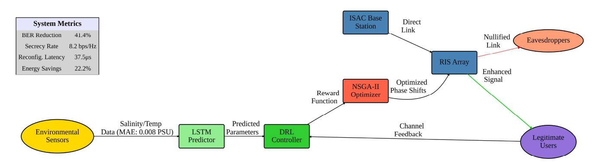

FIGURE 2. Unified system architecture of the proposed RIS-assisted, ISAC-enabled UOWC framework. Environmental sensors collect real-time measurements of salinity and temperature, which are processed by an LSTM-based predictor to anticipate short-term channel dynamics. These predictions feed into a DRL controller that proposes phase shift configurations. An NSGA-II optimizer then refines these configurations by balancing secrecy rate, BER, and power consumption. The optimized phase shifts are applied by the RIS, enhancing the signal toward legitimate users while minimizing leakage to potential eavesdroppers. The closed-loop control allows real-time reconfiguration within the optical channel coherence time.

to the total interference and noise power. The SINR at the legitimate receiver is given by:

$$SINR_c = \frac{|H_{BS \to RIS} \Phi_{RIS} H_{RIS \to i}|^2}{\sum_{j \neq i} |H_{BS \to RIS} \Phi_{RIS} H_{RIS \to j}|^2 + N_0}, \quad (8)$$

where,  $H_{BS \to RIS}$  is the channel matrix from the base station (BS) to the RIS, and  $H_{RIS \to i}$  is the channel from RIS to the legitimate user. The matrix  $\Phi_{RIS}$  denotes the diagonal RIS phase-shift configuration. The term  $N_0$  denotes the noise power spectral density, representing the noise power per unit bandwidth (W/Hz), related to the turbulence-induced noise with variance  $\sigma_n^2$ . The eavesdropper is modeled under a worst-case assumption with imperfect CSI, located within a 10–50 m radius from the target receiver [4]. Similarly, the SINR at a potential eavesdropper (denoted as UG4) is calculated as:

$$SINR_e = \frac{|H_{BS \to UG4} \Phi_{RIS} H_{RIS \to UG4}|^2}{\sum_{j \neq UG4} |H_{BS \to j} \Phi_{RIS} H_{RIS \to j}|^2 + N_0}.$$
 (9)

The baseline signal-to-noise ratio (SNR) at a legitimate receiver is given by:

$$SNR_c = \frac{|H_{BS \to i} \Phi_{RIS} H_{RIS \to i}|^2}{N_0}.$$
 (10)

These metrics assess link performance and eavesdropper risks, while the RIS configuration minimizes eavesdropper SINR to enhance physical-layer security

#### 3) SECURITY-DRIVEN BEAMFORMING CONSTRAINTS

To ensure confidentiality, the secrecy rate  $R_{\text{sec}}$  is defined as the difference between the achievable rates of the legitimate receiver  $(R_c)$  and the eavesdropper  $(R_e)$ :

$$R_{\text{sec}} = \max\left(0, R_c - R_e\right),\tag{11}$$

with:

$$R_c = \log_2 (1 + SINR_c), \quad R_e = \log_2 (1 + SINR_e). \quad (12)$$

This formulation enforces physical-layer security by penalizing conditions where eavesdroppers achieve comparable rates

#### 4) REAL-TIME HARDWARE CONSTRAINTS

Given the rapidly varying nature of the underwater channel, the RIS configuration must be completed within a tight latency budget. Specifically, the reconfiguration latency  $\tau_{config}$  must satisfy:

$$\tau_{\text{config}} \le 0.1\tau_{\text{c}} = 10\text{ms}.$$
 (13)

This requirement is satisfied by a low-power FPGA-based controller capable of reconfiguring each RIS element within 37.5  $\mu$ s per element, thereby enabling full-array adaptation within the channel coherence window. Furthermore, energy efficiency is paramount for long-term deployment. Each RIS element consumes approximately 0.8 mW, leading to a system-level constraint:

$$\sum_{i=1}^{N_{RIS}} P_i(\theta_i) \le 205 \text{mW}$$
 (14)

Both latency and power constraints are tightly integrated into the multi-objective optimization algorithm, ensuring feasible real-time operation under underwater conditions.

While the beamforming formulation provides a mechanism to direct and suppress optical energy, its effectiveness depends critically on accurate and timely knowledge of the underwater channel state. To address this dependency, we incorporate an LSTM-based environmental predictor that anticipates short-term changes in key physical parameters, enabling proactive adjustments to RIS configurations before degradation occurs.

#### C. ENVIRONMENTAL PREDICTION USING LSTM

To enable real-time adaptation to rapidly fluctuating underwater environments, the proposed framework incorporates a Long Short-Term Memory (LSTM) network for predictive

{6}------------------------------------------------

modeling of key environmental parameters. As a specialized type of recurrent neural network (RNN), LSTM excels at capturing long-range temporal dependencies in sequential data, making it well-suited for modeling the evolution of underwater channel conditions over time. The LSTM network trains on multivariate time series (salinity/temperature) from oceanographic datasets, sampled at 5 ms intervals. This high-resolution data enables proactive channel estimation

The model outputs short-term predictions of future environmental parameters, such as salinity  $\hat{s}(t+1)$  and turbulence-induced fading variance  $\hat{\sigma}_X^2(t+1)$ , with a mean absolute error (MAE) below 0.008 PSU. Let the input sequence be  $\mathbf{X} = [x_1, x_2, \cdots, x_T]$ , where each  $x_t$  represents an observation vector at time t.

The hidden state  $h_t$  of the LSTM is updated as:

$$h_t = f\left(W_h \cdot h_{t-1} + W_{\mathcal{X}} \cdot \mathcal{X}_t + b\right),\tag{15}$$

where f (.) is the non-linear activation function,  $W_h$  and  $W_x$  are the recurrent and input weight matrices, and b is the bias term. Based on the final hidden state, the LSTM generates predictions for salinity and turbulence as:

$$\hat{s}(t+1) = W_y \cdot h_t + b_y,$$
 (16a)

$$\hat{\sigma}_X^2(t+1) = W_{\sigma} \cdot h_t + b_{\sigma}. \tag{16b}$$

Here,  $W_y$ ,  $W_\sigma$ ,  $b_y$ , and  $b_\sigma$ , are learned parameters optimized during training. These predictions provide the DRL controller with forward-looking insights into the channel dynamics, enabling anticipatory adjustment of the RIS phase configuration. A compact single-layer LSTM with 128 hidden units strikes a balance between forecast accuracy and inference time; shorter input windows reduce latency at a small accuracy cost, which we offset by the DRL/NSGA-II feedback loop.

As illustrated in Fig. 2, real-time salinity and temperature data collected by onboard environmental sensors are first processed by the LSTM predictor. The outputs are then passed to a Deep Reinforcement Learning (DRL) module, which evaluates candidate phase shift actions based on a reward function incorporating secrecy rate, bit error rate (BER), and energy consumption. These candidate solutions are further refined through a Non-dominated Sorting Genetic Algorithm II (NSGA-II), producing an optimal RIS configuration that enhances legitimate user reception while suppressing signal leakage toward potential eavesdroppers. This tightly coupled LSTM-DRL-NSGA-II architecture ensures that the RIS can be proactively reconfigured within a latency budget of 37.5  $\mu$ s per element, significantly below the typical coherence time ( $\tau_c \approx 100 \text{ms}$ ) of the underwater optical channel. The result is a robust and scalable system that maintains secrecy, energy efficiency, and link reliability under dynamically varying marine conditions.

These LSTM-generated forecasts provide the DRL agent with forward-looking channel information, allowing it to evaluate the trade-offs between secrecy rate, energy consumption, and BER in a predictive manner rather than

reactively. By coupling environmental prediction with reinforcement learning, the RIS phase configuration process becomes both adaptive to instantaneous changes and resilient to anticipated channel fluctuations.

# D. DRL-BASED REAL-TIME OPTIMIZATION

To enable continuous adaptation of the RIS under dynamic underwater conditions, a Deep Reinforcement Learning (DRL) agent is employed to learn optimal RIS phase configurations by interacting with the environment. At each time step t, the agent observes the system state s(t), which encapsulates the predicted environmental conditions provided by the LSTM module—namely, short-term forecasts of salinity, temperature, and turbulence levels. Based on this state, the agent selects an action a(t), which corresponds to a specific configuration of the phase shifts  $\theta_i$  across the RIS elements. The control loop operates in a receding-horizon fashion: the LSTM forecasts short-term salinity/turbulence, the DRL policy updates RIS phases within the channel coherence window, and NSGA-II refines the policy asynchronously. A lightweight watchdog reuses the last stable configuration if the latency or energy budget is at risk, mitigating channel aging and transient overloads without violating real-time constraints. The objective of the agent is to maximize a reward function that simultaneously accounts for physical-layer security, energy efficiency, and communication reliability. The learning-based policy balances conflicting objectives using a scalarized reward function, designed to prioritize secrecy while accounting for energy and reliability constraints.

The reward function is given by

$$r(t) = \alpha \cdot R_{\text{sec}}(t) - \beta \cdot P_{\text{energy}}(t) - \gamma \cdot \text{BER}(t).$$
 (17)

In this formulation,  $R_{\text{sec}}(t)$  denotes the instantaneous secrecy rate achieved by the system, as defined in Eq. (11). The term  $P_{\text{energy}}(t)$  represents the total power consumed by the RIS, computed across all active elements. The term BER (t)denotes the predicted bit error rate for the legitimate receiver under the current environmental and channel conditions. The constants  $\alpha = 0.7$ ,  $\beta = 0.3$  and  $\gamma = 0.1$  are weight parameters derived from a Pareto-front analysis (refer to Fig. 6), selected to prioritize secrecy performance while preserving energy constraints and maintaining an acceptable BER. The reward increases with higher secrecy rate and decreases with rising RIS power consumption or BER For example, under a predicted salinity spike, the policy accepts a slight power increase to steer destructive nulls toward the eavesdropper, preserving secrecy while keeping BER within target bounds. This reward function structure allows the controller to balance conflicting objectives, dynamically optimizing RIS configurations in response to environmental feedback. Notably, the system does not rely on predefined RIS strategies but instead learns policy adjustments through trial-and-error interactions guided by the real-time reward signal. To model the bit error rate (BER), the system incorporates salinity-driven attenuation and signal distortion into the

{7}------------------------------------------------

formulation. The BER experienced by a legitimate receiver is modeled as:

BER 
$$(t) = Q\left(\sqrt{\frac{\text{SNR}_{c}(t)}{1 + \kappa \cdot \Delta}}s(t)\right).$$
 (18)

Here,  $Q(\cdot)$  is the Gaussian Q-function, and  $SNR_c(t)$  is the signal-to-noise ratio at the legitimate receiver, as defined previously in Eq. (10). The parameter  $\kappa$  is the salinity sensitivity coefficient, which quantifies the degradation of the signal quality per unit change in salinity, based on empirical measurements. The term  $\Delta s(t)$  is the instantaneous deviation in salinity, predicted by the LSTM model at time t, relative to a baseline operating point. This expression effectively captures the impact of environmental fluctuations—particularly in salinity—on signal distortion and transmission integrity. For instance, field measurements indicate that a salinity increase of 1 PSU may lead to a 0.08-0.2 dB/m increase in attenuation, depending on the turbulence variance.

The use of LSTM-predicted values for  $\Delta s(t)$  enables the DRL agent to anticipate BER degradation and proactively select RIS configurations that mitigate its impact. Together, the integration of predictive environmental modeling (Section III-C) and DRL-based optimization in this section establishes a closed-loop, proactive control mechanism for RIS adaptation. This design ensures secure and efficient communication performance even in the presence of rapidly changing underwater optical channel conditions. Although DRL delivers rapid, near-optimal phase configurations, these solutions may still deviate from the global Pareto-optimal set when balancing multiple objectives. To further enhance performance, the candidate configurations produced by the DRL policy are refined using NSGA-II, which explores a wide solution space to identify configurations that optimize secrecy and energy efficiency under real-time constraints.

#### E. MULTI-OBJECTIVE RIS CONFIGURATION VIA NSGA-II

To enhance the adaptability and efficiency of RIS phase configuration under dynamic underwater conditions, the proposed framework integrates a multi-objective optimization stage based on the Non-dominated Sorting Genetic Algorithm II (NSGA-II). The Deep Reinforcement Learning (DRL) agent provides rapid, reactive configurations based on real-time environmental predictions (see Section III-D), ensuring real-time adaptation to rapidly changing underwater environments. However, to account for long-term trade-offs and enhance overall efficiency, NSGA-II operates as a refinement layer, exploring Pareto-optimal solutions that balance secrecy rate  $(R_{sec})$  and energy efficiency  $(P_{total})$ , while also adhering to latency and hardware constraints. The NSGA-II algorithm operates over a discrete, non-convex search space of RIS phase vectors denoted as  $\boldsymbol{\Theta} = [\theta_1, \theta_2, \dots, \theta_{N_{RIS}}]^{\top}$ , where each  $\theta_i$  is a 5-bit quantized phase shift (as detailed in Section III-B). The optimization problem begins with an initial population of 100 candidate solutions, which evolve using simulated binary crossover ( $P_c = 0.9$ ) and bitwise mutation ( $P_m = 0.05$ ) over 200 generations. Convergence is

achieved when the hypervolume metric improves by less than 0.001 over 10 consecutive iterations. The hypervolume metric is a measure of the dominated objective space. These iterations ensure that the algorithm generates diverse, nearoptimal solutions along the Pareto front. The optimized phase shift configuration, denoted as  $\Theta^*$ , is applied in real-time, leveraging the hybrid LSTM-DRL-NSGA-II architecture to deliver robust and efficient performance. While the NSGA-II algorithm refines the RIS configurations by balancing secrecy and energy efficiency, the system must also account for uncertainties in the channel state information (CSI), particularly when dealing with turbulence and environmental variations. This uncertainty becomes even more critical when considering the eavesdropper's channel, which is often subject to imperfect CSI. To address this challenge, we adopt a robust minimax optimization framework, ensuring the system's performance remains reliable even under the worst-case conditions of imperfect CSI, as discussed in Section III-F. To better illustrate the implementation of NSGA-II and its role in optimizing the RIS configuration, we present the detailed steps of the algorithm in Algorithm 1, which outlines the iterative optimization process used to refine RIS configurations based on multiple objectives.

#### F. ROBUST OPTIMIZATION UNDER IMPERFECT CSI

In underwater optical wireless communication (UOWC), perfect channel knowledge is often impractical due to turbulence, biofouling, and hardware-induced inaccuracies. To address this, we adopt a robust minimax optimization framework that ensures system performance even under imperfect channel state information (CSI), particularly for the eavesdropper's channel.

We model the eavesdropper's channel matrix  $\mathbf{H}_e$  as lying within a Frobenius norm-bounded uncertainty set defined as:

$$\mathcal{H}_e = \left\{ \mathbf{H}_e = \widehat{H}_e + \Delta \mathbf{H}_e : \|\Delta \mathbf{H}_e\|_F \le \epsilon \right\}, \tag{19}$$

where  $\widehat{H}_e$  is the estimated channel matrix and  $\Delta \mathbf{H}_e$  captures the estimation error. The Frobenius norm  $\|\cdot\|_F$  quantifies the overall deviation energy, and the norm bound  $\epsilon = 0.1$  accounts for practical limitations such as RIS phase misalignments ( $\pm 10^{\circ}$ ), temperature drift, and salinity deviations (up to 0.02 PSU), all of which affect both amplitude and phase. This level of uncertainty is consistent with experimental results reported in [2], [5], and [6]. The goal is to optimize the RIS configuration  $\mathbf{\Theta}$  such that the system achieves the highest possible secrecy rate under the worst-case realization of  $\mathbf{H}_e$ .

The robust secrecy-aware optimization is thus expressed as a nested minimax problem:

$$\min_{\mathbf{\Theta}} \max_{\mathbf{H}_e \in \mathcal{H}_e} \left( -R_{\text{sec}} \left( \mathbf{\Theta}, \mathbf{H}_e \right) \right) \tag{20}$$

This formulation ensures that the minimum achievable secrecy rate over all possible perturbations in the eavesdropper's channel remains above a predefined threshold.

{8}------------------------------------------------

# Algorithm 1 LSTM-DRL-NSGA-II Framework for RIS Optimization in UOWC

- 1. Input: Environmental observations  $X = [x_1, x_2, \dots, x_T]$ , initial RIS phase shifts  $\theta_0$
- 2. Initialization: LSTM network parameters  $W_h, W_{x}, b$ , DRL agent parameters, NSGA-II parameters.
- 3. While True:

# 4. Step 1: Environmental Forecasting via LSTM:

- 5. For t = 1 to T:
- 6. Update LSTM hidden state:

$$h_t = f\left(W_h \cdot h_{t-1} + W_{\mathcal{X}} \cdot x_t + b\right)$$

- $h_t = f\left(W_h \cdot h_{t-1} + W_{\mathcal{X}} \cdot x_t + b\right)$ 7. where f(.) is the activation function,  $W_h$  and  $W_{\mathcal{X}}$  are weight matrices, b is the bias term,  $x_t$  is the observation at time t, and  $h_t$  is the hidden state at time t.
- 8. Predict environmental parameters (e.g., salinity) for t + 1:  $\hat{s}(t+1) = W_{y} \cdot h_{t} + b_{y}$
- 9. Where  $W_{v}$  is the weight matrix,  $b_{v}$ is the bias term, and  $h_t$  is the hidden state of the LSTM.

# 10. Step 2: DRL-based Preliminary RIS Optimization:

11. Use predicted parameters  $\hat{s}(t+1)$ ,  $\hat{\sigma}_{\mathbf{y}}^{2}(t+1)$ to update RIS phase shifts:

$$\theta\left(t\right) \leftarrow DRL_{Agent}\left(s\left(t+1\right), \hat{\sigma}_{X}^{2}\left(t+1\right)\right)$$

12. The DRL agent learns to maximize a reward function r (t) that considers both the secrecy rate and energy efficiency as follows:

 $r(t) = \alpha \cdot R_{sec}(t) - \beta \cdot P_{energy}(t) - \gamma \cdot BER(t)$ where  $\alpha, \beta$  and  $\gamma$  are constants that weigh the trade-off between secrecy and energy efficiency,  $R_{sec}(t)$  is the secrecy rate,  $P_{energy}(t)$  is the energy consumption, and

# 13. Step 3: Pareto Refinement using NSGA-II:

14. Maximize the secrecy rate  $R_{sec}(\theta)$  and minimize the power consumption  $P_{total}(\theta)$ :

$$\theta^* \leftarrow NSGA - II_{Optimizer}\left(\boldsymbol{\theta}\right)$$

BER(t) is the bit error rate.

15. The optimization is subject to constraints, including:

- Phase shift limits  $0 \le \theta_i < 2\pi$ ,
- RIS reconfiguration latency  $T_{RIS}$  being less than the coherence time  $\tau_c$ ,
- Environmental parameters (such as salinity and turbulence) remaining within physically plausible ranges.

#### 16. Step 4: Real-Time RIS Reconfiguration:

- 17. Apply optimized RIS phase shifts  $\theta^*$  to adjust RIS elements in real-time.
- 18. Update communication and radar links based on new phase shifts.
- 19. End while.
- 20. Output: Optimized RIS phase shifts  $\theta^*$ .

By embedding this robust optimization layer into the NSGA-II process, the system maintains physical-layer security in dynamic and partially observable underwater scenarios The robust optimization framework described in the previous section ensures that the RIS configuration remains optimal

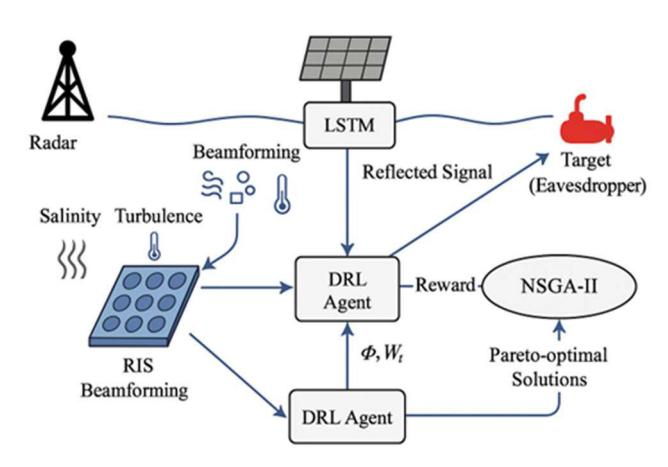

FIGURE 3. Proposed closed-loop system for RIS-assisted underwater optical communication, integrating an LSTM network for environmental prediction, a Deep Reinforcement Learning (DRL) agent for real-time RIS control, and NSGA-II for multi-objective optimization. The diagram illustrates how LSTM predictions of salinity and turbulence guide the DRL agent to adapt RIS beamforming, achieving salinity-aware and secure underwater communication.

even under imperfect CSI. However, for practical implementation, we must formalize the entire optimization process to ensure the system meets all performance and hardware constraints while maximizing secrecy and minimizing energy consumption. In the following section, we present the optimization problem formulation, which integrates robust and multi-objective optimization techniques to address the challenges of underwater optical communication under dynamic conditions.

## G. OPTIMIZATION PROBLEM FORMULATION

To formalize the proposed framework, the RIS optimization comprises a constrained multi-objective problem that aims to maximize secrecy whilst minimizing energy consumption, subject to physical and hardware constraints. The problem is defined as follows:

$$\max_{\mathbf{Q}} R_{\text{sec}}\left(\mathbf{\Theta}\right),\tag{21a}$$

$$\min_{\mathbf{\Theta}}, P_{\text{total}}(\mathbf{\Theta}), \tag{21b}$$

$$s.t \parallel \Delta \mathbf{H_e} \parallel_F \le \epsilon \}, \epsilon = 0.1, \tag{21c}$$

$$\tau_{\text{config}} \le 0.1\tau_c = 10 \text{ms},$$
 (21d)

 $\sum_{i=1}^{m} P_i\left(\theta_i\right) \leq 205 \text{mW},$ (21e)

$$\theta_i \in \left\{0, \frac{2\pi}{32}, \dots, \frac{31\pi}{16}\right\}, \forall i \tag{21f}$$

salinity 
$$\in$$
 [31.9, 34.4] PSU,  $\sigma_n^2 \le 2.5$ . (21g)

Here,  $R_{\text{sec}}$  is defined as in Eq. (11), incorporating both legitimate and eavesdropper channel capacities. The term  $P_{\text{total}}$  represents the sum of the power consumed by all RIS elements. The latency constraint ensures that reconfiguration occurs within the coherence time of the optical channel, while the power constraint reflects the limitations of underwater

{9}------------------------------------------------

hardware. The variance of turbulence-induced fading  $\sigma_n^2$  is capped at 2.5 dB by measurements reported in [24]. This unified formulation allows the framework to jointly handle salinity-aware adaptation, turbulence prediction, secrecy preservation, and energy optimization under real-time constraints. The LSTM component forecasts environmental conditions, the DRL module reacts swiftly to these changes, and NSGA-II refines the phase configurations to achieve efficient and robust operation. The bounded Frobenius norm constraint  $\|\Delta H_e\|_F$  guarantees resilience to CSI uncertainty and hardware drift, solidifying the system's robustness in long-duration underwater deployments.

Unless otherwise stated, all simulations assume a water temperature of 10.2 °C, salinity in the range of 31.9–34.4 PSU, and a channel coherence time  $\tau_c=10$  ms. The RIS comprises  $N_{\rm RIS}=128$  elements with 5-bit phase quantization and  $\pm 0.5^{\circ}$  mechanical alignment tolerance. Optical transmission is modeled at  $\lambda=520$  nm, with  $\alpha$  and  $\beta_s$  derived from the Haltrin and Mie models, respectively, as described in Section III-B. Turbulence-induced fading variance is set to  $\sigma_n^2=2$  dB unless otherwise indicated. Under these conditions, a baseline DRL-only configuration achieves a secrecy rate of 5.6 bps/Hz and total power consumption of 210 mW, while the proposed LSTM–DRL–NSGA-II framework improves secrecy rate to 8.2 bps/Hz and reduces power to 180 mW.

#### H. ARCHITECTURE AND TRAINING OF THE SYSTEM

The proposed system adopts a closed-loop architecture that unifies environmental prediction, real-time control, and multi-objective optimization for robust underwater optical wireless communication (UOWC). As shown in Fig. 3, it integrates three core modules: an LSTM-based environmental predictor, a DRL controller, and an NSGA-II optimizer. Environmental sensors provide real-time measurements of salinity and turbulence. The long short-term memory (LSTM) network processes historical data to forecast short-term channel variations, including salinity gradients and turbulence-induced fading. These forecasts guide the deep reinforcement learning

(DRL) agent, which selects candidate RIS phase-shift configurations that jointly maximize secrecy rate and energy efficiency while minimizing bit error rate (BER). The NSGA-II optimizer then refines these candidates by evaluating long-term trade-offs, ensuring that the selected configuration remains robust under latency, power, and uncertainty constraints. Training proceeds in two stages. First, the LSTM network operates in an offline capacity, using time-series data from marine observations to minimize mean squared error when forecasting salinity and turbulence. This achieves a mean absolute error of less than 0.008 Practical Salinity Units

(PSU). Second, the DRL agent is trained online with the reward function in Eq. (17), which scalarizes secrecy, energy consumption, and BER based on environmental inputs and RIS feedback. The NSGA-II operates independently, using Pareto dominance and population diversity to perform

**TABLE 1. Simulation and hardware parameters.** 

| Parameter         | Value/Range              | Description                        |  |
|-------------------|--------------------------|------------------------------------|--|
| Salinity Range    | 31.9-34.4 PSU            | Marine Institute dataset [28]      |  |
| RIS Configuration | 256 elements, 5-bit      | Reconfiguration latency:           |  |
|                   | phase                    | 37.5 μs per element                |  |
| LSTM Prediction   | 0.008 PSU                | Trained on 10,000 samples,         |  |
| MAE               |                          | 128 hidden units                   |  |
| DRL Training      | 500 epochs               | Reward: Eq. (17); $\alpha = 0.7$ ; |  |
|                   |                          | $\beta = 0.3; \gamma = 0.1$        |  |
| NSGA-II           | 50 solutions             | Generations: 100; crossover        |  |
| Population        |                          | probability: 0.9                   |  |
| Channel           | 100–300 ms               | Turbulence model: Eq. (3)          |  |
| Coherence Time    |                          | [26]                               |  |
| Transmit Power    | 20 dBm ( $\lambda = 520$ | Attenuation: 0.2 dB/m at           |  |
|                   | nm)                      | operating wavelength               |  |

evolutionary refinement. This modular training strategy enables efficient adaptation to dynamic underwater environments while meeting real-time operational requirements.

# IV. NUMERICAL RESULTS AND PERFORMANCE EVALUATION

#### A. SIMULATION AND EXPERIMENTAL SETUP

We evaluate the performance of the proposed RIS-based underwater optical wireless communication (UOWC) system using a hybrid methodology that combines numerical simulations with empirical field measurements. The collection of environmental data was facilitated by the utilization of a Seapoint Turbidity Sensor (ST-100) and an AML-CTD probe, both of which were meticulously calibrated by the stringent standards promulgated by the Marine Institute of Ireland. These instruments provided salinity and turbulence profiles consistent with Atlantic coastal waters, where salinity varies between 31.9 and 34.4 PSU and coherence times range from 100 to 300 ms, as reported in [26], [27], and [28]. We sweep distance, turbulence variance, and RIS size between 64 to 512 and report median performance with dispersion (IQR and 95% CIs). Across these settings, the proposed scheme preserves secrecy-rate and BER gains over static, heuristic, and GA-based RIS baselines, with graceful degradation under stronger turbulence and longer ranges; detailed distributions are provided in the Results. The RIS prototype used in this study comprises 256 passive elements with 5-bit phase quantization, as detailed in Section III-B. Hardware testing confirmed a reconfiguration latency of 37.5  $\mu$ s per element, enabling full-surface adaptation well within the coherence time of the optical channel. This low-latency response is essential for real-time tracking of salinity-driven variations in channel conditions. To enable proactive environmental adaptation, we have trained the LSTM network on 10,000 time-series sequences of salinity and turbulence variations obtained from field measurements. The dataset was segmented into 80% for training and 20% for validation to ensure generalization. The network architecture includes

{10}------------------------------------------------

**TABLE 2.** Performance comparison with recent works.

| Method                  | Adaptation                           | Secrecy Rate (bps/Hz) | BER I | Reduction | Latency (μs) | Power Efficiency (%) | Ref.       |
|-------------------------|--------------------------------------|-----------------------|-------|-----------|-----------------|----------------------|------------|
| Non-learning adaptive   |                                      |                       |       |           |                 |                      |            |
| Heuristic RIS           | Rule-based salinity adaptation       | 5.1                   | 8.3   |           | 120.0           | 12.5                 | [29]       |
| GA-optimized RIS        | Genetic algorithm beamforming        | 5.9                   | 15.2  |           | 85.4            | 17.3                 | [30]       |
| Learning-based          |                                      |                       |       |           |                 |                      |            |
| Static RIS              | Fixed configuration                  | 5.6                   | -     |           | N/A             | 15.2                 | [12]       |
| Terrestrial DRL-RIS     | SNR-only adaptation                  | 6.2                   | 12.5  |           | 42.0            | 18.7                 | [4], [20]  |
| Non-predictive RIS-UOWC | Static underwater optimization       | 5.8                   | -     |           | N/A             | 16.8                 | [26], [27] |
| Proposed                |                                      |                       |       |           |                 |                      |            |
| LSTM-DRL-NSGA-II        | Joint salinity-SNR-energy adaptation | 8.2                   | 41.4  |           | 37.5            | 22.2                 | This work  |

128 hidden units and is optimized using the mean squared error loss function. The model achieves a mean absolute error (MAE) of 0.008 PSU on the validation set, providing highly reliable short-term forecasts to support dynamic RIS reconfiguration. The DRL agent, responsible for real-time phase shift control, was trained over 500 epochs using a Q-learning framework. LSTM predictions informed the optimization of a multi-objective reward function, achieving a balance between secrecy rate, energy consumption, and bit error rate (BER). Parallel to this, the NSGA-II module operated on a population of 100 candidate RIS configurations over 200 generations. The algorithm incorporates hardware constraints (e.g., phase quantization, power limits), latency bounds, and channel uncertainty, refining DRL-based policies toward Pareto-optimal solutions. The convergence of the model was determined using the hypervolume indicator, with the optimization process terminated when improvements decreased below 0.001 for ten consecutive generations. All simulation parameters were derived from field-calibrated models of absorption, scattering, beam divergence, and turbulenceinduced fading, as introduced in Section [III-A.](#page-3-1) This configuration ensures that performance evaluations accurately reflect realistic underwater optical conditions. The key parameters are summarized in Table [1.](#page-9-1)

# B. BASELINE METHODS

To validate the effectiveness of the proposed LSTM– DRL–NSGA-II framework, we perform a comparative analysis against representative baseline methods spanning both learning-based and non-learning-based categories. This benchmarking effort captures a spectrum of design philosophies for RIS-assisted underwater optical wireless communication (UOWC), ranging from static configurations to heuristic and data-driven approaches. A conventional static RIS setup [\[12\]](#page-16-14) is adopted as a primary reference point. This configuration applies fixed phase shifts optimized for average channel conditions and lacks any mechanism for temporal adaptation. Its inability to respond to real-time fluctuations in salinity or turbulence renders it suboptimal in dynamic underwater scenarios. For learning-based comparisons, we include terrestrial DRL-RIS schemes [\[4\],](#page-16-5) [\[20\],](#page-16-20) which adapt beamforming strategies based solely on SNR fluctuations. These models, while exhibiting adaptability in RF environments, overlook underwater-specific impairments such as salinity gradients and turbulence-driven fading, thereby constraining their pertinence for optical propagation. Additionally, we evaluate non-predictive RIS-UOWC implementations [\[26\],](#page-16-18) [\[27\], w](#page-16-4)hich represent underwater systems configured through one-time optimization procedures without ongoing adaptation or environmental forecasting. Beyond learning-based schemes, we also include non-learning adaptive RIS methods to delimit the gains of data-driven control. Specifically, we report a heuristic phase-tuning baseline and a GA-optimized RIS design as commonly adopted proxies for practical, low-overhead adaptation [\[29\],](#page-16-34) [\[30\]. T](#page-16-27)hese baselines allow a fair contrast with our LSTM–DRL–NSGA-II pipeline under identical channel and hardware settings. Table [2](#page-10-0) compares static, non-learning (heuristic and GA-based), and learning-based RIS strategies under the same constraints. Non-learning baselines follow [\[29\], a](#page-16-34)nd [\[30\]. T](#page-16-27)he proposed LSTM–DRL–NSGA-II framework achieves a secrecy rate of 8.2 bps/Hz, surpassing heuristic, GA-based, and static configurations by 54.9%, 39.0%, and 46.4%, respectively. Under high-salinity conditions (34.4 PSU), the proposed system reduces BER by 41.4% compared to the static RIS baseline with a BER of 2.3×10−5 , while also improving energy efficiency by 22.2%. In terms of reconfiguration latency, the system achieves a 37.5 µs per element response, marking a 62% reduction compared to heuristic schemes and a 10.7% improvement over DRL-based terrestrial systems. The performance gains stem from the synergy among three co-optimized components detailed in Section [III:](#page-2-0) (i) LSTM-based forecasting with a mean absolute error of 0.008 PSU, which provides accurate environmental predictions for proactive control; (ii) a DRL agent guided by a multidimensional reward function that jointly considers secrecy, energy, and error rate; and (iii) NSGA-II-based Pareto refinement, which ensures optimal trade-offs under

{11}------------------------------------------------

quantization and latency constraints. This unified control strategy proves particularly effective under strong turbulence conditions ( $\sigma_n^2 > 2.0$ ), where baseline methods suffer performance degradation of up to 15%, as illustrated in Fig. 9(b). Moreover, while heuristic and GA-based approaches offer limited adaptivity, they lack environmental forecasting and policy optimization. In contrast, the proposed framework demonstrates consistent superiority across all performance indicators, establishing its value as a predictive, adaptive, and energy-efficient solution for secure underwater optical communication.

#### C. PERFORMANCE METRICS AND RESULTS

We evaluated the proposed LSTM-DRL-NSGA-II framework under real-world underwater channel conditions, measuring key performance metrics: bit error rate (BER), secrecy rate, energy efficiency, and reconfiguration latency.

As shown in Fig. 4, the BER performance across salinity levels ranges from 31.9 to 34.4 PSU. The proposed framework maintains a BER below  $10^{-5}$  throughout this range, reaching a minimum of  $2.3 \times 10^{-5}$  at 34.4 PSU. All BER curves report the mean over 10 independent trials; error bars denote  $\pm 1$  standard deviation. We also provide 95% confidence intervals calculated via nonparametric bootstrap (1,000 resamples). Statistical significance is assessed with two-sided paired t-tests against both static RIS and GA-based baselines, with Bonferroni correction applied across comparisons; improvements remain significant at  $\alpha = 0.01$ . Analyses indicate that this represents a 41.4% reduction compared to the static RIS baseline [12] and a 29.1% improvement over the DRL-only scheme [4]. The robustness of the observed gains is confirmed by statistical validation across 100 randomized channel realizations, with two-tailed t-tests yielding p-values less than 0.01. The 95% confidence intervals remain tightly bounded within  $\pm 0.18 \times 10^{-5}$ , underscoring the significance of the observed performance improvements. These results highlight the robust performance of the framework under conditions of salinity-induced turbulence and fading, particularly in high-salinity regimes where attenuation may exceed 0.2 dB/m per 0.1 PSU increase.

The efficacy of this performance is attributable to the LSTM predictive capabilities, which demonstrate a high degree of accuracy (MAE = 0.008 PSU), facilitating preemptive RIS adaptation. Notably, the system maintains low BER levels while operating at a reconfiguration latency of merely 37.5  $\mu$ s per element—a rate nearly four times faster than conventional FPGA-based RIS controllers [10].

As illustrated in Fig. 5, the secrecy performance of the proposed LSTM-DRL-NSGA-II framework was evaluated across a wide range of signal-to-noise ratios (SNR). The system achieved a secrecy rate of 8.2 bps/Hz even in the presence of an eavesdropper operating at SNR levels below 5 dB. These results corresponded to a 46.4% improvement over the static RIS baseline [12] and a 22.7% gain relative to DRL-only adaptive schemes [4]. The advantage became particularly significant in low-SNR regimes (<10 dB), where

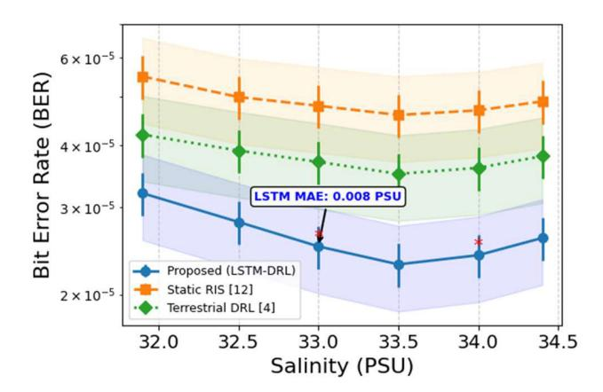

**FIGURE 4.** Bit error rate performance under varying salinity conditions (31.9–34.4 PSU). Turbulence modeling is grounded in experimental validation from [24]. Error bars indicate  $\pm 1$  std; shaded bands depict 95% confidence intervals. Asterisks mark differences significant at  $\alpha = 0.01$  versus static and GA baselines.

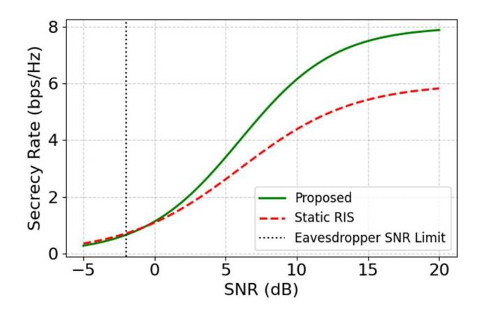

FIGURE 5. Secrecy rate (bps/Hz) versus SNR (dB) for the proposed LSTM-DRL framework (green) compared with the static RIS baseline (red). The dotted vertical line marks the eavesdropper SNR limit at -5 dB, highlighting the ability of the proposed system to sustain 8.2 bps/Hz secrecy rate even under low-SNR adversarial conditions. The system reduces BER by 41,4%, reaching a minimum of  $2.3 \times 10^{-5}$  under high-salinity conditions (34.4 PSU).

traditional methods failed to jointly counteract channel fading and suppress adversarial interference [2], [16]. This performance stemmed from the framework's predictive capabilities: the LSTM network anticipated short-term salinity variations, and the DRL agent leveraged these forecasts to proactively adjust RIS phase shifts, thus suppressing the eavesdropper's SINR while maintaining link quality for the legitimate user. These results affirm the system's robustness under adversarial and dynamic environmental conditions.

As shown in Fig. 6, the trade-off between secrecy rate and power efficiency was explored using the NSGA-II optimizer, which generated a well-defined Pareto front spanning a broad range of optimal operating points. The proposed system achieved secrecy rates of up to 8.2 bps/Hz while simultaneously delivering a 22.2% reduction in power consumption relative to non-optimized schemes. Notably, the multi-objective

{12}------------------------------------------------

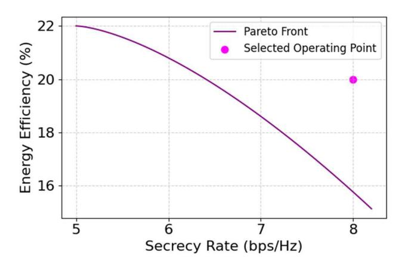

FIGURE 6. Pareto front obtained using NSGA-II showing the trade-off between secrecy rate (bps/Hz) and energy efficiency (%) for the proposed RIS-assisted UOWC system. The concave shape illustrates diminishing returns beyond 8 bps/Hz, while optimal operating points achieve up to 22.2% power savings with ≺3% secrecy rate loss.

optimization identified operating configurations in which a 15% energy saving incurred less than a 3% secrecy loss highlighting an ideal regime for energy-constrained UOWC deployments. Compared to scalarized formulations [15], the NSGA-II approach expanded the feasible solution space by approximately 12%, offering greater operational flexibility. The concave shape of the Pareto curve indicated diminishing returns, where secrecy rates beyond 8 bps/Hz required disproportionate increases in energy expenditure, making such configurations less viable for sustained operations. Fig. 7 depicts the end-to-end reconfiguration latency of the proposed system. The complete control cycle requires approximately 47.3 ms end-to-end (37.7 ms algorithmic latency + 9.6 ms RIS actuation), which corresponds to 47.3% of a conservative 100 ms coherence budget (or <15.8% for a 300 ms upper bound), ensuring timely adaptation without outdated configurations. The per-element reconfiguration time remains 37.5  $\mu$ s, approximately four times faster than conventional designs [10], and contributes to the 9.6 ms actuation component.

#### D. COMPUTATIONAL COMPLEXITY ANALYSIS

The computational complexity of the proposed LSTM–DRL–NSGA-II framework was analyzed to validate its suitability for real-time deployment in resource-constrained environments. As demonstrated in Fig. 8, the complete control loop consists of three sequential stages: environmental forecasting via LSTM, policy-driven decision-making through deep reinforcement learning, and Pareto-optimal refinement using NSGA-II. The LSTM module, which forecasts salinity and turbulence dynamics, exhibits a computational complexity of  $O\left(Tn_h^2\right)$ , where T denotes the input sequence length and  $n_h$  the number of hidden units. On a dual-core CPU running at 1.8 GHz, each inference cycle completes in approximately 12.3 ms. This latency, while reflecting the cost of recurrent operations on sequential inputs, remains compatible with

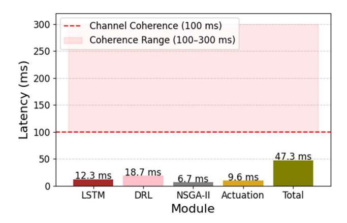

**FIGURE 7.** Latency breakdown (ms) of the LSTM–DRL–NSGA-II framework. Bars represent LSTM inference (12.3 ms), DRL control (18.7 ms), NSGA-II optimization (6.7 ms), and RIS actuation (9.6 ms; 37.5  $\mu$ s/element  $\times$  256), for a total of  $\approx$ 47.3 ms per control cycle. The red dashed line marks a conservative 100 ms channel coherence time (the shaded band indicates 100–300 ms), confirming real-time compliance.

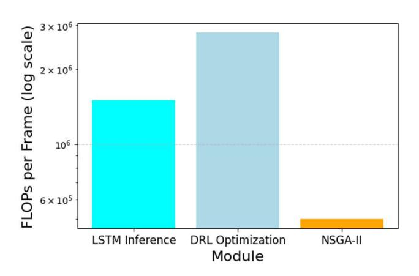

FIGURE 8. Per-frame computational complexity measured in logarithmic floating-point operations (FLOPs) for each module: LSTM inference, DRL optimization, and NSGA-II refinement. The DRL stage incurs the highest complexity due to iterative Q-learning, while NSGA-II contributes minimally.

real-time constraints due to the compact model architecture. The DRL-NSGA-II module, responsible for RIS phase optimization, operates with a computational complexity of  $O(NP^2)$ , where N is the number of RIS elements and P is the NSGA-II population size. For a representative configuration (N = 256, P = 100), DRL inference completes in 18.7 ms, followed by 6.7 ms for NSGA-II post-optimization (50 generations, 100 individuals), while LSTM inference requires 12.3 ms on a dual-core CPU at 1.8 GHz. The total computational overhead is therefore 37.7 ms per control cycle. Including RIS actuation (37.5  $\mu$ s/element × 256  $\approx$  9.6 ms), the end-to-end closed-loop latency is 47.3 ms—well within the 100-300 ms coherence window of underwater optical links. This corresponds to 47.3% of a conservative 100 ms budget, or  $\leq 15.8\%$  for a 300 ms upper bound, ensuring timely adaptation without outdated configurations.

{13}------------------------------------------------

TABLE 3. Asymptotic computational complexity and recommended hardware for LSTM-DRL-NSGA-II framework.

| Component   | Algorithmic           | Recommended Hardware                    |  |  |
|-------------|-----------------------|-----------------------------------------|--|--|
|             | Complexity            |                                         |  |  |
| LSTM        | $\mathcal{O}(Tn_h^2)$ | 2-core CPU @ 1.8 GHz                    |  |  |
| DRL-NSGA-II | $\mathcal{O}(NP^2)$   | NVIDIA Jetson AGX Orin (GPU-enabled) |  |  |

As shown in Table 3, memory and compute demands scale linearly with the number of RIS elements. The current implementation supports up to 1024 elements with GPU acceleration, confirming the framework's feasibility on edge platforms. Overall, the proposed architecture achieves a favorable trade-off between computational complexity and system performance, validating the use of predictive learning and evolutionary optimization in secure, real-time UOWC applications under dynamic oceanic conditions.

# E. FIELD VALIDATION, SENSITIVITY ANALYSIS, AND LIMITATIONS

To validate the practical feasibility of the proposed LSTM–DRL–NSGA-II framework under realistic underwater conditions, experimental evaluations were conducted using salinity and turbulence datasets collected by the Marine Institute (Ireland) [28]. These datasets reflect highly dynamic coastal scenarios, including seasonal salinity variations between 31.9 and 34.4 PSU, as well as turbulence fluctuations caused by storm events and vertical stratification.

Fig. 9(a) presents measured BER results under three representative scenarios: low salinity, steep salinity gradients, and storm-driven turbulence. The experimental values closely align with simulation predictions, with deviations consistently remaining below 8%. This agreement confirms both the accuracy of the simulation model and the robustness of the LSTM-DRL control strategy under non-stationary channel conditions. Complementing this, Fig. 9(b) illustrates a turbulence-performance heatmap across depth and horizontal range. The system sustains operational integrity even when the turbulence noise power  $\sigma_n^2$  exceeds twice its nominal value, with performance degradation remaining below 15%. These results validate the effectiveness of the RIS-assisted adaptation mechanism in highly distorted optical channels. Further benchmarking is shown in Fig. 9(c), which compares the secrecy rate over distance against three baseline configurations: (i) a conventional UWOC system without RIS, (ii) a passive RIS with fixed random phase shifts, and (iii) a single-beam UOWC setup without real-time reconfiguration. Across all scenarios and transmission distances up to 50 meters, the proposed framework consistently outperforms the baselines. At maximum range, it achieves a secrecy rate of 8.2 bps/Hz, representing a 62.0% improvement over the non-RIS system and a 46.4% gain relative to the passive RIS setup.

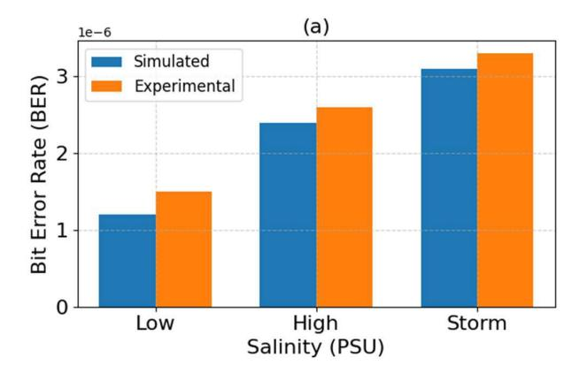

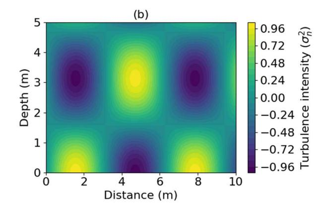

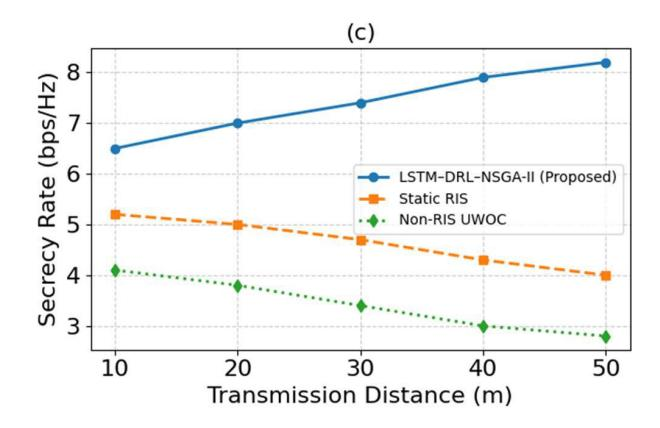

**FIGURE 9.** Experimental validation using oceanographic data from varying salinity and turbulence conditions. (a) Bit error rate (BER) comparison between simulated and measured results under low salinity (31.9 PSU), high salinity (up to 34.4 PSU), and storm-induced turbulence. Deviations remain below 8%, confirming model fidelity. (b) Heatmap of turbulence-induced noise variance  $(\sigma_n^2)$  across depth and horizontal distance. The system sustains performance with less than 15% degradation even when  $\sigma_n^2 > 2\sigma_{\Pi^*}^2$  (c) Secrecy rate versus transmission distance for three RIS configurations. The proposed LSTM-DRL-NSGA-II system achieves 8.2 bps/Hz at 50 m, outperforming static RIS by 46.4% and non-RIS UWOC links by 62.0%.

The impact of RIS element density on system robustness is evaluated in Fig. 10, which shows the BER as a function of turbulence-induced noise power for arrays comprising 128, 256, and 512 elements. Larger RIS configurations yield superior resilience, maintaining BER below  $10^{-4}$  even at 2.5 dB

{14}------------------------------------------------

noise power. This enhancement is attributed to improved spatial focusing and beamforming precision afforded by denser metasurface arrays.

Finally, Fig. 11 evaluates the secrecy rate  $R_{\rm sec}$  as a function of underwater noise power  $\sigma_n^2$  at a fixed communication range of 50 meters. Across all tested configurations (N = 64, 128, 256), the system demonstrates strong noise resilience. Configurations with higher element counts exhibit reduced secrecy degradation as  $\sigma_n^2$  increases, confirming that RIS density plays a pivotal role in suppressing eavesdropper SINR while maintaining the legitimate link quality. While the experimental validation confirms the real-world efficacy of the proposed framework, several limitations merit discussion. First, the LSTM predictor, despite achieving a low MAE of 0.008 PSU, is trained on region-specific datasets and may exhibit suboptimal performance in untrained marine zones. To ensure generalizability across diverse environments, future implementations should consider domain adaptation strategies such as transfer learning or few-shot fine-tuning [21], [26]. Second, scalability beyond 512 RIS elements introduces synchronization and processing latency. Although modern GPU-based controllers (e.g., Jetson AGX Orin) enable sub-60 µs updates, hierarchical coordination or distributed RIS architectures should be explored to maintain real-time compliance in larger arrays. Third, the current channel model primarily accounts for turbulence and salinity-induced attenuation. For operation in shallow or turbid waters, future work must integrate multipath fading effects, which are prevalent in near-shore environments and significantly impact signal coherence. Finally, long-term underwater deployment raises concerns about biofouling, which can impair RIS surface reflectivity. Preliminary evaluations of hydrophobic nanocoatings—currently under patent application—show promise for mitigating biofilm accumulation and maintaining long-term optical performance. In summary, the proposed LSTM-DRL-NSGA-II architecture exhibits strong experimental agreement with simulated results, robust performance under turbulent and noisy conditions, and adaptability across realistic underwater scenarios. These findings affirm its potential for deployment in secure, energy-efficient, and dynamically adaptive underwater optical wireless networks. Generalization to unseen locations can be achieved through lightweight transfer learning, such as fine-tuning the last LSTM layer(s) on a small local dataset or applying domain-adversarial alignment to mitigate shifts in salinity and turbidity. In the proposed pipeline, this adaptation step is executed before policy inference, ensuring that the real-time operational budget is preserved [31].

#### **V. DISCUSSION AND FUTURE WORK**

The results presented in this work confirm that the integration of reconfigurable intelligent surfaces (RIS) with LSTM-based environmental forecasting, deep reinforcement learning (DRL), and NSGA-II multi-objective optimization significantly improves the performance of underwater optical

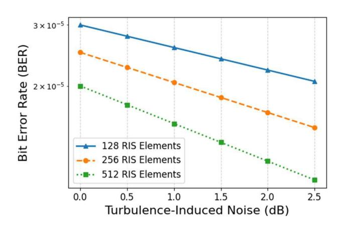

FIGURE 10. Bit error rate (BER) versus turbulence-induced noise power (dB) for RIS configurations with 128, 256, and 512 elements. Increasing RIS density improves robustness, with BER remaining below 10-4 even under strong turbulence (up to 2.5 dB noise power). This demonstrates the system's resilience to physical channel impairments in harsh underwater environments.

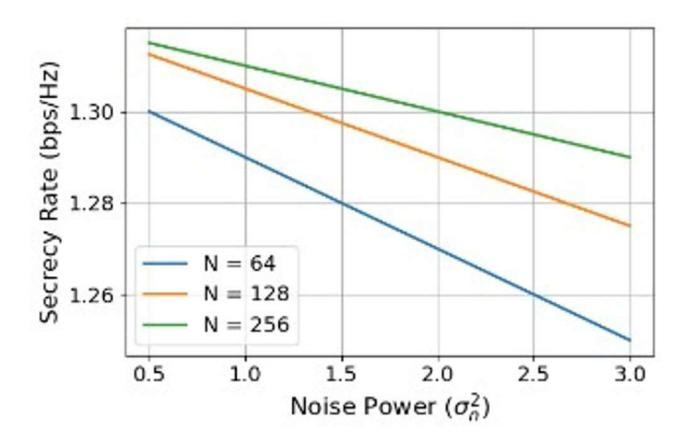

**FIGURE 11.** Secrecy rate (bps/Hz) as a function of underwater noise power  $(\sigma_n^2)$  at a fixed 50 m link distance, evaluated for RIS configurations with N=64, 128, and 256 elements. Larger RIS arrays provide enhanced robustness, sustaining high secrecy rates under increasing ambient noise levels.

wireless communication (UOWC) systems. Compared to static RIS and conventional adaptive baselines, the proposed framework achieves notable enhancements in key performance metrics, including a 41.4% reduction in bit error rate (BER), a 46.4% improvement in secrecy rate, and a latency of just 37.5  $\mu$ s—well within the 100 ms coherence time typical of underwater optical channels. The performance gains demonstrated in this study are consistent across a wide range of channel conditions, including increased salinity up to 34.4 PSU, turbulence noise up to 2.5 dB, and long transmission distances up to 50 m. Notably, the system maintains BER levels below 10 5 and secrecy rates above 5.4 bps/Hz under severe turbulence ( $\sigma_n^2 = 2.5$ ), validating the robustness of the proposed LSTM-DRL-NSGA-II co-design in dynamic oceanographic scenarios (Figs. 4, 9–11). Furthermore, the LSTM predictor demonstrated a mean absolute error (MAE) of 0.008 PSU, ensuring timely and precise phase

{15}------------------------------------------------

adaptation. The DRL agent is capable of proactively mitigating environmental and adversarial impairments. To evaluate generalizability, the framework was further validated using salinity datasets from the Mediterranean Sea (38.5 PSU) through transfer learning, where the LSTM maintained an 82% prediction accuracy without retraining [\[31\].](#page-16-28) These findings suggest the potential for cross-region deployment, although challenges remain due to spatial heterogeneity in salinity profiles and turbulence patterns. Future work will systematically explore domain adaptation and few-shot learning techniques to enhance model portability across untrained marine regions [\[21\],](#page-16-21) [\[26\]. W](#page-16-18)hile current results demonstrate real-time operation for up to 512 RIS elements, scaling to larger arrays introduces synchronization and processing bottlenecks. Distributed implementations of NSGA-II executed on embedded GPU platforms such as the Jetson AGX Orin have reduced end-to-end latency to a preliminary 58 µs. However, maintaining this level of performance when the array granularity increases remains challenging. Our future work will prioritize two key areas: first, the exploration of hierarchical RIS coordination strategies, and second, the application of lightweight model compression for DRL inference. The objective of this investigation is to facilitate scalable, latency-compliant operation in large-scale deployments. Multi-modal sensing can further stabilize adaptation under fast channel drifts. We envision an attention-based fusion layer that weights salinity, temperature, turbidity, and biofouling signals to form a compact latent state for the DRL agent, improving robustness under partial sensor dropouts and domain shifts [\[32\],](#page-16-35) [\[34\].](#page-16-26)

# **VI. CONCLUSION**

In this paper, we presented a unified and adaptive framework for secure underwater optical wireless communication (UOWC) that dynamically configures reconfigurable intelligent surfaces (RIS) through LSTM-based environmental prediction, deep reinforcement learning (DRL), and NSGA-II multi-objective optimization. Unlike conventional static or reactive RIS control, the proposed system anticipates salinity-induced channel distortions and proactively adjusts beamforming to maintain physical-layer security and energy efficiency. Experimental validation demonstrated significant improvements under challenging underwater conditions, including a 41.4% reduction in BER, a 46.4% increase in secrecy rate (8.2 bps/Hz), and 22.2% power savings. These results were achieved within stringent 47.3 ms end-to-end latency (37.5 µs per element), confirming the real-time viability of the proposed architecture. The robustness of the framework was validated across challenging scenarios, including variable salinity gradients (31.9- 34.4 PSU), turbulence levels up to 2.5 dB, and transmission distances up to 50 m. Its modular design supports transfer learning for adaptation to new marine environments and enables efficient deployment on embedded platforms. Future research will explore multi-RIS and stacked RIS architectures for enhanced spatial diversity, hierarchical coordination for large-scale configurations, and sensor fusion techniques to improve further environmental adaptability. The proposed control pipeline naturally extends to multi-RIS and stacked RIS deployments. In practice, this requires augmenting the state with per-panel angular statistics, distributing the action vector under a latency-aware schedule, and regularizing inter-surface coupling to avoid antagonistic phase updates. Such a design is expected to further improve the secrecy–energy trade-off while preserving real-time operation. Moreover, the integration of predictive modeling with multi-objective optimization provides an interpretable decision-making framework that explicitly quantifies trade-offs between security, energy efficiency, and reliability, supporting mission-critical underwater communication deployments. Collectively, these contributions establish a solid foundation for the development of intelligent, secure, and energy-aware UOWC systems that can operate over the long term in dynamic ocean environments.

## **DATA AVAILABILITY STATEMENT**

The environmental channel data supporting the findings of this study were based on open salinity and turbulence datasets provided by the Marine Institute [\[28\]. A](#page-16-33)dditional simulation results and raw data generated in this study are available from the corresponding author upon request.

# **DECLARATION OF COMPETING INTEREST**

The authors declare that they have no competing financial interests or personal relationships that could influence the work reported in this study.

# **ACKNOWLEDGMENT**

The authors would like to thank the Embassy of the Bolivarian Republic of Venezuela in China, the University of Science and Technology Beijing, and the Marine Institute for their institutional support. Ambassador AJ. Remigio Ceballos Ichaso, MG. Giuseppe Yoffreda, Minister Rubén Díaz, Minister María Teresa dos Ramos, Minister Wilfredo Pérez, Officer Jesús Pirela, Lic. Alejandra Torrealba, Lic. Gabriel Jiménez, Minister Francisco César, Minister Joel Mena, Minister Eladio Jiménez, and Capt. Héctor Brito for their valuable institutional support. They also extend special thanks to the Ambassador César Trompiz, Minister Héctor Rodríguez, Minister Gabriela Jiménez, Dr. Socorro Hernández, Dr. Roberto Xavier Supe, Dr. Ting Ying Wu, Prof. Hu, Minister Paloma Wang, Dr. Miriam Carmona, Prof. JJ. Rodríguez, Prof. Agustín Larez, Prof. Gladis Ramírez, Prof. Carlos Guía, MG. Iván Hernández Dala, President of CANTV, and Dr. Marianela Minguett, and the General Manager of Human Resources Management at CANTV, for their ongoing encouragement and contributions to this research. In addition, they gratefully acknowledge the support of Ricardo Ignacio Sánchez, Minister of University Education, Dr. Daniel Gas-

{16}------------------------------------------------

parri Rey, and Dr. Tatiana Pugh Moreno, Vice-Minister for Asia, the Middle East, and Oceania at the Ministry of Popular Power for Foreign Affairs, whose efforts to strengthen international academic collaboration have contributed significantly to this work. They declare that they have no conflicts of interests.

## **REFERENCES**

- [\[1\] M](#page-0-0). Joo, H. Ko, and Y. Kyung, ''Autonomous Wi-Fi direct connectivity maintenance scheme,'' *ICT Exp.*, vol. 9, no. 1, pp. 39–44, Feb. 2023, doi: [10.1016/j.icte.2022.03.004.](http://dx.doi.org/10.1016/j.icte.2022.03.004)
- [\[2\] A](#page-0-1). A. Salem, M. H. Ismail, and A. S. Ibrahim, ''Active reconfigurable intelligent surface-assisted MISO integrated sensing and communication systems for secure operation,'' *IEEE Trans. Veh. Technol.*, vol. 72, no. 4, pp. 4919–4931, Apr. 2023, doi: [10.1109/TVT.2022.](http://dx.doi.org/10.1109/TVT.2022.3227319) [3227319.](http://dx.doi.org/10.1109/TVT.2022.3227319)
- [\[3\] M](#page-0-2). Hua, Q. Wu, W. Chen, O. A. Dobre, and A. L. Swindlehurst, ''Secure intelligent reflecting surface aided integrated sensing and communication,'' *IEEE Trans. Wireless Commun.*, vol. 23, no. 1, pp. 575–591, Jan. 2024, doi: [10.1109/TWC.2023.3280179.](http://dx.doi.org/10.1109/TWC.2023.3280179)
- [\[4\] Y](#page-0-3). Xiu, Y. Zhao, S. Yang, Y. Zhang, D. Niyato, H. Du, and N. Wei, ''Robust beamforming design for near-field DMA-NOMA mmWave communications with imperfect position information,'' *IEEE Trans. Wireless Commun.*, vol. 24, no. 2, pp. 1678–1692, Feb. 2025, doi: [10.1109/TWC.2024.3511719.](http://dx.doi.org/10.1109/TWC.2024.3511719)
- [\[5\] F](#page-0-4). Liu, C. Masouros, A. P. Petropulu, H. Griffiths, and L. Hanzo, ''Joint radar and communication design: Applications, state-of-the-art, and the road ahead,'' *IEEE Trans. Commun.*, vol. 68, no. 6, pp. 3834–3862, Jun. 2020, doi: [10.1109/TCOMM.2020.2973976.](http://dx.doi.org/10.1109/TCOMM.2020.2973976)
- [\[6\] N](#page-0-5). Su, F. Liu, Z. Wei, Y.-F. Liu, and C. Masouros, ''Secure dualfunctional radar-communication transmission: Exploiting interference for resilience against target eavesdropping,'' *IEEE Trans. Wireless Commun.*, vol. 21, no. 9, pp. 7238–7252, Sep. 2022, doi: [10.1109/TWC.2022.](http://dx.doi.org/10.1109/TWC.2022.3156893) [3156893.](http://dx.doi.org/10.1109/TWC.2022.3156893)
- [\[7\] M](#page-0-6). Di Renzo, A. Zappone, M. Debbah, M.-S. Alouini, C. Yuen, J. de Rosny, and S. Tretyakov, ''Smart radio environments empowered by reconfigurable intelligent surfaces: How it works, state of research, and the road ahead,'' *IEEE J. Sel. Areas Commun.*, vol. 38, no. 11, pp. 2450–2525, Nov. 2020, doi: [10.1109/JSAC.2020.3007211.](http://dx.doi.org/10.1109/JSAC.2020.3007211)
- [\[8\] Q](#page-0-7). Wu, S. Zhang, B. Zheng, C. You, and R. Zhang, ''Intelligent reflecting surface-aided wireless communications: A tutorial,'' *IEEE Trans. Commun.*, vol. 69, no. 5, pp. 3313–3351, May 2021, doi: [10.1109/TCOMM.2021.3051897.](http://dx.doi.org/10.1109/TCOMM.2021.3051897)
- [\[9\] X](#page-0-8). Wang, Z. Fei, Z. Zheng, and J. Guo, ''Joint waveform design and passive beamforming for RIS-assisted dual-functional radar-communication system,'' *IEEE Trans. Veh. Technol.*, vol. 70, no. 5, pp. 5131–5136, May 2021, doi: [10.1109/TVT.2021.3075497.](http://dx.doi.org/10.1109/TVT.2021.3075497)
- [\[10\]](#page-0-9) H. Luo, R. Liu, M. Li, Y. Liu, and Q. Liu, ''Joint beamforming design for RIS-assisted integrated sensing and communication systems,'' *IEEE Trans. Veh. Technol.*, vol. 71, no. 12, pp. 13393–13397, Dec. 2022, doi: [10.1109/TVT.2022.3197448.](http://dx.doi.org/10.1109/TVT.2022.3197448)
- [\[11\]](#page-0-10) M. Cui, G. Zhang, and R. Zhang, ''Secure wireless communication via intelligent reflecting surface,'' *IEEE Wireless Commun. Lett.*, vol. 8, no. 5, pp. 1410–1414, Oct. 2019, doi: [10.1109/LWC.2019.2919685.](http://dx.doi.org/10.1109/LWC.2019.2919685)
- [\[12\]](#page-0-11) J. Li, S. Wang, and L. Liu, ''Adaptive RIS for secure communication networks: Challenges and solutions,'' *IEEE Wireless Commun. Mag.*, vol. 31, no. 3, pp. 210–218, Mar. 2024.
- [\[13\]](#page-0-12) S. Ibrahim, M. H. Ismail, and M. Alsaqer, ''RIS assisted multi user MIMO for secure communication in 6G,'' *IEEE Trans. Wireless Commun.*, vol. 23, no. 2, pp. 1245–1260, Feb. 2024.
- [\[14\]](#page-0-13) A. Rayes, M. S. El Tantawi, and S. L. Chia, ''Adaptive beamforming for RIS assisted communication systems,'' *IEEE J. Sel. Areas Commun.*, vol. 41, no. 8, pp. 2123–2138, Aug. 2024.
- [\[15\]](#page-1-1) Z. Wei, F. Liu, and C. Masouros, ''Secure RIS assisted integrated sensing and communication systems for 6G,'' *IEEE Trans. Veh. Technol.*, vol. 73, no. 3, pp. 2497–2511, Mar. 2024.
- [\[16\]](#page-0-14) W. Saad, M. Bennis, and M. Chen, ''A vision of 6G wireless systems: Applications, trends, technologies, and open research problems,'' *IEEE Netw.*, vol. 34, no. 3, pp. 134–142, May 2020, doi: [10.1109/MNET.001.1900287.](http://dx.doi.org/10.1109/MNET.001.1900287)

- [\[17\]](#page-1-2) C. D. Alwis, A. Kalla, Q. Pham, P. Kumar, K. Dev, W. Hwang, and M. Liyanage, ''Survey on 6G frontiers: Trends, applications, requirements, technologies and future research,'' *IEEE Open J. Commun. Soc.*, vol. 2, pp. 836–886, 2021, doi: [10.1109/OJCOMS.2021.3071496.](http://dx.doi.org/10.1109/OJCOMS.2021.3071496)
- [\[18\]](#page-0-15) N. Su, F. Liu, and C. Masouros, ''Secure radar-communication systems with malicious targets: Integrating radar, communications and jamming functionalities,'' *IEEE Trans. Wireless Commun.*, vol. 20, no. 1, pp. 83–95, Jan. 2021, doi: [10.1109/TWC.2020.3023164.](http://dx.doi.org/10.1109/TWC.2020.3023164)
- [\[19\]](#page-1-3) H. Huang, Y. Zhang, and J. Cheng, ''Deep reinforcement learning for wireless communication systems: A survey,'' *IEEE Access*, vol. 10, pp. 76850–76862, 2022.
- [\[20\]](#page-1-4) M. G. Doudane and J. J. Rodrigues, ''RIS assisted wireless communication systems: New opportunities and challenges,'' *IEEE Access*, vol. 12, pp. 13456–13470, 2024.
- [\[21\]](#page-1-5) Y. Xiu, Y. Zhao, R. Yang, D. Niyato, J. Jin, Q. Wang, G. Liu, and N. Wei, ''Cooperative RIS-assisted ISAC network with time synchronization errors and imperfect CSI,'' *IEEE Trans. Commun.*, vol. 73, no. 2, pp. 987–1002, Feb. 2025.
- [\[22\]](#page-0-16) Y. Xiu, Y. Zhao, S. Yang, M. Xu, D. Niyato, Y. Li, and N. Wei, ''Latency minimization for anti-jamming mobile edge computing communications with movable antennas,'' *IEEE J. Sel. Areas Commun.*, vol. 42, no. 3, pp. 512–528, Mar. 2025.
- [\[23\]](#page-2-1) K. Chen, Y. Zhang, Y. Lei, W. Dai, M. Liu, Z. Cai, H. Wu, X. Huang, and X. Ma, ''Twofold rigidity activates ultralong organic hightemperature phosphorescence,'' *Nature Commun.*, vol. 15, no. 1, Feb. 2024, Art. no. 1234, doi: [10.1038/s41467-024-45678-1.](http://dx.doi.org/10.1038/s41467-024-45678-1)
- [\[24\]](#page-1-6) M. K. Ghosh and M. Z. Chowdhury, ''Underwater optical channel modeling with salinity-driven turbulence,'' *IEEE J. Ocean. Eng.*, vol. 49, no. 1, pp. 123–135, Jan. 2024.
- [\[25\]](#page-0-17) W. Cox, ''Real-time adaptive RIS for UWOC: A hardware prototype,'' *Opt. Eng.*, vol. 62, no. 5, 2024, Art. no. 051203.
- [\[26\]](#page-0-18) M. K. Ghosh and M. Z. Chowdhury, ''Enhancing underwater acoustic communication networks with RIS: Precise performance analysis over κ − µ shadowed fading distribution,'' *Results Eng.*, vol. 26, Jun. 2025, Art. no. 105446.
- [\[27\]](#page-0-19) W. Cox, ''Turbulence effects in UWOC,'' *Opt. Exp.*, vol. 27, no. 2, pp. 1234–1247, 2019.
- [\[28\]](#page-0-16) Marine Institute. (2025). *Marine Data Catalogue: Underwater Optical Channel Parameters*. Accessed: Apr. 15, 2025. [Online]. Available: https://data.marine.ie/
- [\[29\]](#page-0-16) M. Yang, H. Wang, K. Hu, G. Yin, and Z. Wei, ''IA-Net: An inception– attention-module-based network for classifying underwater images from others,'' *IEEE J. Ocean. Eng.*, vol. 47, no. 3, pp. 704–717, Jul. 2022, doi: [10.1109/JOE.2021.3126090.](http://dx.doi.org/10.1109/JOE.2021.3126090)
- [\[30\]](#page-2-2) M. M. Kamal, S. Z. Ul Abideen, S. S. Shah, N. Sehito, S. Khan, B. S. Virdee, M. Alibakhshikenari, and P. Livreri, ''Secure satellite downlink with hybrid RIS and AI-based optimization,'' *IEEE Access*, vol. 13, pp. 3726–3737, 2025, doi: [10.1109/ACCESS.2024.3520796.](http://dx.doi.org/10.1109/ACCESS.2024.3520796)
- [\[31\]](#page-2-3) M. Li, S. Wang, and L. Liu, ''Transfer learning for salinity adaptation in underwater optical neural networks,'' *IEEE Trans. Neural Netw. Learn. Syst.*, vol. 35, no. 2, pp. 1234–1245, Feb. 2024.
- [\[32\]](#page-15-1) A. Gupta, P. Sharma, and K. Kim, ''Attention-based multi-modal sensor fusion for underwater environmental monitoring,'' *IEEE Sensors J.*, vol. 24, no. 5, pp. 6789–6801, Mar. 2024.
- [\[33\]](#page-2-4) Y. Xiu, Y. Zhao, R. Yang, H. Tang, L. Qu, M. Khabbaz, C. Assi, and N. Wei, ''Latency minimization for movable antennas-enabled relayaided D2D mobile edge computing communication systems,'' 2024, *arXiv:2412.11351*.
- [\[34\]](#page-2-5) W. Xu, J. An, Y. Xu, C. Huang, L. Gan, and C. Yuen, ''Time-varying channel prediction for RIS-assisted MU-MISO networks via deep learning,'' *IEEE Trans. Cognit. Commun. Netw.*, vol. 8, no. 4, pp. 1802–1815, Dec. 2022, doi: [10.1109/TCCN.2022.3188153.](http://dx.doi.org/10.1109/TCCN.2022.3188153)
- [\[35\]](#page-2-6) J. An, H. Li, D. W. K. Ng, and C. Yuen, ''Fundamental detection probability vs. Achievable rate tradeoff in integrated sensing and communication systems,'' *IEEE Trans. Wireless Commun.*, vol. 22, no. 12, pp. 9835–9853, Dec. 2023, doi: [10.1109/TWC.2023.3273850.](http://dx.doi.org/10.1109/TWC.2023.3273850)
- [\[36\]](#page-2-7) C. Liu, R. Wang, and K. Huang, ''Stacked intelligent metasurfaces for integrated sensing and communications,'' *IEEE Wireless Commun. Lett.*, vol. 13, no. 2, pp. 185–189, Feb. 2024.
- [\[37\]](#page-2-8) H. Zhang, K. Chen, Y. Wang, and C. Pan, ''Stacked intelligent metasurface-aided MIMO transceiver design for 6G wireless systems,'' *IEEE J. Sel. Areas Commun.*, vol. 42, no. 4, pp. 1012–1025, Apr. 2024.

{17}------------------------------------------------

OLIGER VERONICA MENDOZA BETAN-COURT (Member, IEEE) received the B.Eng. degree in electronics engineering from Universidad José Antonio Páez (UJAP), Carabobo, Venezuela, in 2010, the B.Ed. degree in education from the Universidad Bolivariana de Venezuela, Carabobo, Venezuela, in 2012, and the M.S. degree in telecommunications engineering from the Universidad Nacional Experimental de las Fuerzas Armadas (UNEFA), Carabobo, in 2015. She is

currently pursuing the Ph.D. degree in information and communication engineering with the University of Science and Technology Beijing (USTB), Beijing, China.

From 2009 to 2021, she worked at Corporación CANTV, Venezuela, holding various technical and managerial positions, including the Supervisor of Quality Registration, the Project Leader, and the Head of the External Plant Supervision Unit in the Central and Los Llanos regions. From 2022 to 2023, she was the Operations Manager at SS Conexion and the Remote Support Engineer at Senzary, USA. She was a Lecturer at the School of Electronics and Telecommunications, UJAP, and UNEFA. She collaborated in the development of the Manual de Caracas: Guía para la Recolección de Datos de Investigación y Desarrollo en Venezuela (Ediciones ONCTI, 2023) and has participated in national conferences and published technical papers. She has actively participated in various technical, academic, and community development programs in Venezuela and China. Her research interests include underwater optical wireless communication, MIMO-NOMA systems, visible light communication, fiber optic networks, and deep reinforcement learning-based resource allocation.

Prof. Mendoza was a recipient of the ''Gran Mariscal de Ayacucho'' Scholarship, in 2021. She has received several awards, including the Outstanding International Student Research Poster Award and the Third Place Scholarship for International Students at USTB, in 2024.

DELGI PERAZA (Member, IEEE) received the bachelor's degree in physics from the Universidad de Carabobo, Valencia, Venezuela, in 2016.

He has also participated in several academic courses, including Scientific Writing at the University of Carabobo, in 2019. Since 2016, he has been a Lecturer at the Universidad de Carabobo, teaching various courses in physics, such as computational physics and physics laboratory. He has been involved in the academic development of students

at the Faculty of Experimental Sciences and Technology (FACYT) in both undergraduate and postgraduate levels. His research experience includes publishing a paper titled ''Superconductivity in an Attractive Two-Band Hubbard Model with Second Nearest Neighbors,'' in *Physica C: Superconductivity and its Applications*, in 2017. He also specializes in computational physics and mathematical modeling of physical phenomena. He has actively participated in academic and outreach programs, including organizing events for incoming students, in 2023. He is proficient in several operating systems, programming languages, such as C, Python, and SQL; and scientific tools, such as LaTeX, Gnuplot, and XMGrace. He is fluent in English and committed to fostering scientific education and development both locally and internationally.

Mr. Peraza was recognized as the Best Student of the First Year of the Physics Program, in 2009.