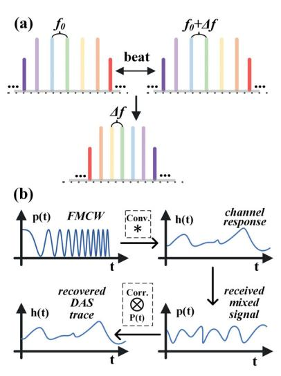
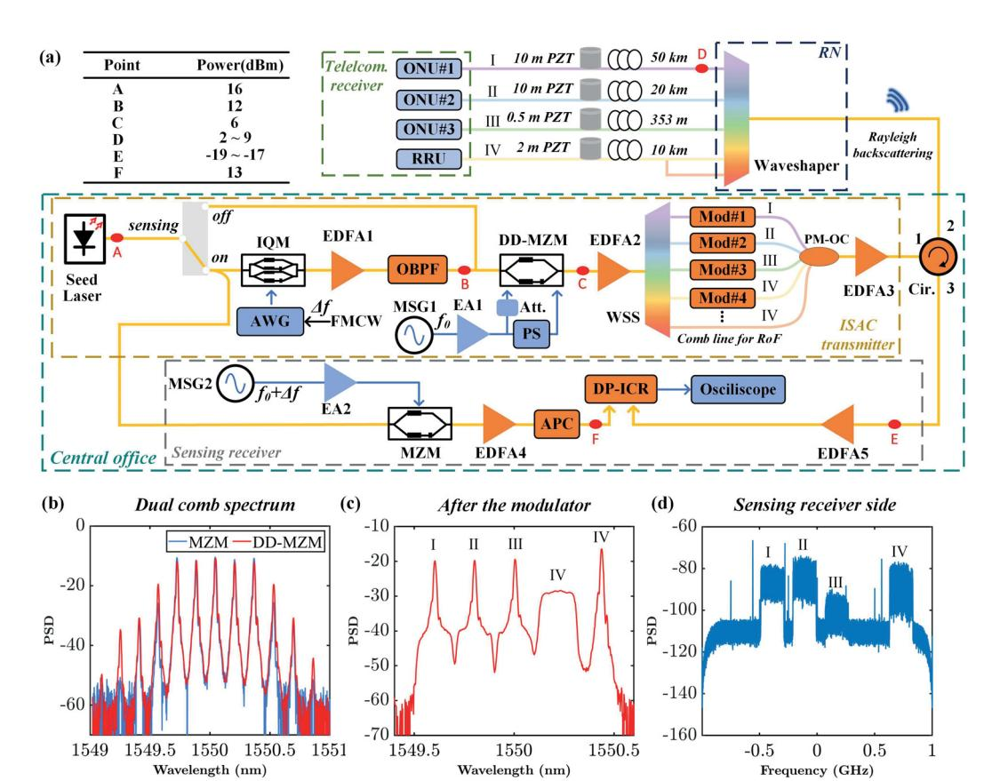
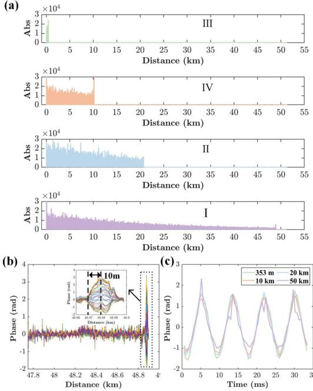
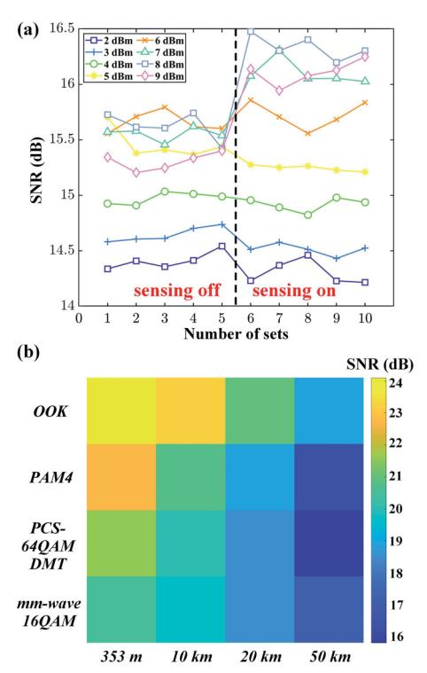

{0}------------------------------------------------

# Dual comb enabled simultaneously multi-path sensing and communication over fiber access network

Jingchuan Wang(1), Huan He(2,\*), Yaxi Yan(1), Liwang Lu(1), Li Wang(1), Zhiyong Zhao(2), Hwa Yaw Tam(1), Alan Pak Tao Lau(1), Chao Lu(1)

- (1) Photonics Research Institute (PRI), The Hong Kong Polytechnic University
- (2) Wuhan National Laboratory for Optoelectronics (WNLO), HUST, hehuan@hust.edu.cn

*Abstract We propose a dual-comb-enabled integrated sensing and communication method that allows for real-time interrogation of all paths across access networks without adding complexity at the user end. We demonstrate a 0.5 m sensing resolution and no communication penalty across various modulation schemes and link lengths. ©2024 The Author(s)*

# **Introduction**

In the era of 5G and fifth-generation fixed networks (F5G), fiber access technologies are pivotal to the rapid growth of internet traffic speeds[1]. Future access networks based on both passive optical networks (PON) and radio access network (RAN) front-haul require massive data transmission[2], flexible network scheduling[3], and advanced intelligent functions[4]. Recently, integrated sensing and communication (ISAC) technology over optical fibers has garnered significant interest from network operators due to its potential to leverage existing telecommunication fibers for simultaneous sensing and communication.

Coherent techniques[5] like Multiple Input Multiple Output (MIMO) used in phase-sensitive optical time-domain reflectometry (ø-OTDR) or distributed acoustic sensing (DAS) enable ultra-long range sensing for smart optical network monitoring. This technology has been applied to ISAC over submarine fibers through detection of phase changes[6] or polarization state rotations[7]. Additionally, a combination of Intensity Modulated Direct Detection (IM-DD) with Frequency Modulated Continuous Wave (FMCW) carriers supports integrated sensing and communication on single links, but multiple links require numerous ultra-narrow linewidth lasers[8]. Optical E-O combs offer a cost-effective alternative by generating multiple coherent lasers from one seed laser, useful for multi-path ISAC[9]. Moreover, fiber access networks often face multi-path interference in ø-OTDR traces, complicating event localization. Although Reflective Semiconductor Optical Amplifiers (RSOAs) can reduce this interference using Time-Domain Multiplexing (TDM) in Optical Network Units (ONUs), it necessitates user-end equipment modifications[10].

In this paper we introduce, for the first time, a dual-comb-enabled ISAC for fiber access networks, achieving high fidelity in communication and effective DAS of all link paths without adding complexity to user-end equipment. This ISAC transmitter can switch the sensing function on or

**Fig. 1:** Principles of (a) dual comb and (b) match filter DAS off while maintaining communication quality and even improving communication performance in high launch power (LP) situations. We achieve a sensing spatial resolution of up to 0.5 meters for various modulation schemes and across various fiber lengths.

## **Operation theory**

Using a single narrow linewidth seed laser, we generate two optical combs: one dedicated to communication and another with a slightly offset frequency spacing for sensing. As depicted in Fig. 1(a), a comb with f0 spacing is produced to carry different data channels of the access network, with each line representing a distinct path. Additionally, we modulate the comb with FMCW, typically within the MHz bandwidth range, which can be achieved using either a modulator or a piezoelectric element. This configuration allows for the separation of Rayleigh backscattering by different frequency band, enabling low-bandwidth coherent receivers to accurately reconstruct the sensing information. All sensing components are integrated on the central office side, streamlining the user experience. We then apply the corresponding matched filters to recover the DAS traces for each path, following the principle illustrated in Fig. 1(b).

{1}------------------------------------------------

**Fig. 2:** (a) Dual comb enabled ISAC experimental setup over fiber access network; (b-d) spectrums at different location.

For communication purposes, data streams are used to modulate FMCW carriers, both IM-DD and coherent transmission can be utilized. When IM-DD is used, DAS demodulation functions effectively because the energy of the pulse is concentrated on the symbol carrier. In coherent setups, even though IQ modulation significantly reduces the carrier signal, a Kramers-Kronig (KK) receiver can be used to reconstruct the communication signal using just two comb lines, hence the unmodulated comb line can be used for sensing. This way can be also used for generating millimeterwave (mm-wave) signals for radio-over-fiber (RoF) scenarios in RAN front-haul.

#### **Experimental setup**

We demonstrate ISAC over PON and RAN using five optical comb lines and four fiber spools to simulate a variety of optical access application scenarios, as depicted in Fig. 2(a). A narrow linewidth source (NKT E15) seeds the generation of the dual combs. The light passes through a polarization-maintaining coupler, which directs one path to the ISAC transmitter and the other to the sensing receiver. When the sensing switch is activated, the transmitter side first modulates the light with a FMCW of 200 MHz bandwidth starting from 70 MHz using an IQ modulator (Fujitsu 7962EP) and an Arbitrary Waveform Generator (AWG) (Keysight M8190A), followed by a Polarization-Maintaining Erbium-Doped Fiber Amplifier (PM-EDFA) and a narrow band-pass filter. The light then enters a dual-drive Mach-Zehnder modulator (DD-MZM) (Fujitsu 7937EZ) driven by a 25 GHz microwave signal generator (MSG1) (Agilent E8267C), creating optical combs. These combs are modulated with data sequences from another AWG (Keysight M8196A), using both intensity and IQ modulation across different lines. The combined signals pass through a high-power booster (Amonics BA-33) and a waveshaper (Finisar 4000A) before being transmitted over the fiber links. Three links (353m, 20 km, 50 km) carry the intensity-modulated signal, while one link (10 km) carries both the IQ-modulated signal and an unmodulated FMCW comb line, with signal processing realized by a K-K receiver. The four data streams are captured by a four-channel oscilloscope (Keysight DSAZ594A), followed by offline communication digital signal processing (DSP).

At the sensing receiver, Rayleigh backscattering signals from four fiber links (I~IV) are simultaneously received in time domain but are frequencyseparated owing to the properties of the dual comb. A 25.28 GHz microwave, generated by MSG2 (Keysight E8257D) and amplified by an amplifier (SHF 816), drives the MZM (Ixblue MX40) to produce the second comb. The dual comb spectrum is illustrated in Fig. 2(b). As shown in Fig. 2(d), the dual comb facilitates the frequency distribution of backscattered light from different paths, with zero frequency as the center, effectively utilizing the double sideband configuration of DAS.

{2}------------------------------------------------

**Fig. 3:** (a) Recovered traces from different paths; (b) differential phase variation at the end of 50 km path; (c) reconstructed vibrations of each path

# **Results and discussions**

We assessed the sensing capabilities of the proposed ISAC scheme for a fiber access network. The FMCW parameters included a sweep period of 524 μs, which is longer than the round-trip time of 50 km fiber, and a sweep bandwidth of 200 MHz. The launch power for each channel was set to approximately 5 dBm. To ensure a fair comparison, sine waveforms at 120 Hz with varying voltages (6 Vpp, 1.2 Vpp, 0.3 Vpp, 0.3 Vpp) generated by the same function generator were applied to piezoelectric transducers (PZTs) to produce vibration over fiber lengths of 0.5 m, 2 m, and 10 m. Matched filters produced four distinct traces from the composite waveform, representing individual paths as depicted in Fig. 3(a). The 200 MHz bandwidth was segmented for the 2 m and 10 m PZT scenarios, but not for the 0.5 m PZT. These segments were combined using rotate-vector-summing (RVS) to counteract interference fading, followed by differential and phase unwrapping operations as detailed in our previous work[11]. Fig. 3(b) shows the vibration-induced phase variation at the 50 km fiber endpoint after completing the DSP flow. By applying the same DSP process to all traces concurrently, we obtained four distinct vibration waveforms, as illustrated in Fig. 3(c). These raw unfiltered waveforms indicate that, despite minor distortion in the 50 km case due to SNR degradation, all vibrations from different traces were successfully demodulated without crosstalk.

We also examined the communication performance of a 23 GBaud PAM-4 signal over a 50 km link, both with and without the sensing function activated. LPs ranged from 2 to 9 dBm, as shown in

**Fig. 4:** (a) The demodulated SNR with sensing on/off in different LPs; (b) the performance of commonly used short-reach modulation with sensing on, LP = 8 dBm.

Fig. 4(a). Without pre-CD compensation and using FFE+DFE for equalization, we noted there is a CDinduced power fading at around 9.5 GHz. At LP of about 5 dBm, the SNR was marginally lower with sensing enabled, likely due to noise from EDFA1, which could be mitigated with an integrated piezo modulator. However, at LPs above 6 dBm, the SNR with sensing activated exceeded that with sensing off, owing to the FMCW's suppression of stimulated Brillouin scattering (SBS) and subsequent reduction of CD-induced power fading due to higher SPM. In these instances, the received power with sensing was about 1.3 dB higher than without. Furthermore, we demonstrated the ISAC transmitter's compatibility with various modulation formats (OOK, PAM4, PCS-64QAM DMT with an entropy of 5.27, mm-wave 16QAM with a KK receiver, each modulation signal occupying 25 GHz bandwidth), as presented in Fig. 4(b). These findings validate the ISAC scheme's adaptability for a range of applications in PONs or RANs, supporting different modulations and fiber lengths.

## **Conclusions**

We introduce a dual comb based ISAC scheme that allows for real-time, independent sensing of all channels within a fiber access network without incurring a significant communication penalty. This approach avoids adding complexity to the cost-sensitive user-end infrastructure and shows great potential for practical implementation in real PON/RAN settings. It features a simple switch at central office to activate the sensing function.

{3}------------------------------------------------

#### **Acknowledgements**

The authors acknowledge the funding support of Research Grant Council of the Hong Kong SAR Government project (PolyU, 15227321). Special thanks to Dr. Xiong Wu.

### **References**

- [1] Z. Zhou, J. Wei, Y. Luo, *et al.*, "Communications with guaranteed bandwidth and low latency using frequencyreferenced multiplexing", *Nat. Electron*, vol. 6, pp. 694– 702, 2023. DOI: 10.1038/s41928-023-01022-x.
- [2] C. Zhang, Y. Zhu, B. He, *et al.*, "Clone-comb-enabled high-capacity digital-analogue fronthaul with high-order modulation formats", *Nat. Photon.*, vol. 17, pp. 1000– 1008, 2023. DOI: 10.1038/s41566-023-01273-2.
- [3] Y. He, Z. Zhai, L. Dou, *et al.*, "Improved qot estimations through refined signal power measurements and datadriven parameter optimizations in a disaggregated and partially loaded live production network", *J. Opt. Commun. Netw.*, vol. 15, pp. 638–648, 2023. DOI: 10.1364/ JOCN.496720.
- [4] J. Wang, L. Lu, Y. Yan, A. P. T. Lau, and C. Lu, "Jointdesign of ultra high resolution vibration sensing and optical heterodyne mm-wave rof", in *Conference on Lasers and Electro-Optics*, Charlotte, USA, 2024, SW4N.4.
- [5] C. Dorize, S. Guerrier, E. Awwad, K. Benyahya, H. Mardoyan, and J. Renaudier, "Advanced fiber sensing leveraging coherent systems technology for smart network monitoring", in *Optical Fiber Communication Conference (OFC) 2022*, 2022, M2F.6. DOI: 10.1364/OFC.2022.M2F. 6.
- [6] G. Marra, D. Fairweather, V. Kamalov, *et al.*, "Optical interferometry–based array of seafloor environmental sensors using a transoceanic submarine cable", *Science*, vol. 376, no. 6595, pp. 874–879, 2022. DOI: 10. 1126/science.abo1939.
- [7] Z. Zhan, M. Cantono, V. Kamalov, *et al.*, "Optical polarization–based seismic and water wave sensing on transoceanic cables", *Science*, vol. 371, no. 6532, pp. 931–936, 2021. DOI: 10.1126/science.abe6648.
- [8] H. He, L. Jiang, Y. Pan, *et al.*, "Integrated sensing and communication in an optical fibre", *Light: Science & Applications*, vol. 12, no. 1, p. 25, 2023. DOI: 10.1038/ s41377-022-01067-1.
- [9] H. Feng, T. Ge, X. Guo, *et al.*, "Integrated lithium niobate microwave photonic processing engine", *Nature*, pp. 1– 8, 2024. DOI: 10.1038/s41586-024-07078-9.
- [10] Y.-K. Huang and E. Ip, "Simultaneous optical fiber sensing and mobile front-haul access over a passive optical network", in *Optical Fiber Communication Conference*, 2020, Th1K.4. DOI: 10.1364/OFC.2020.Th1K.4.
- [11] J. Wang, L. Lu, L. Wang, Y. Yan, A. P. T. Lau, and C. Lu, "High-efficiency isac to enable sub-meter level vibration sensing for coherent fiber networks", in *Optical Fiber Communication Conference*, 2024, Tu2J.3.