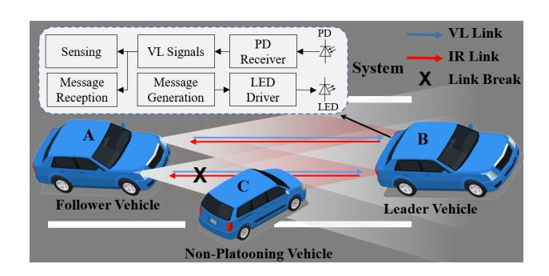
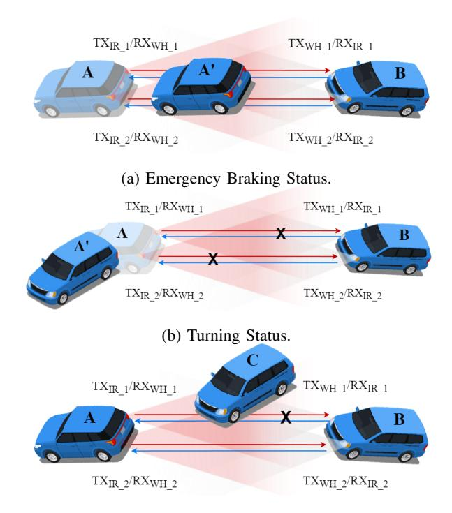
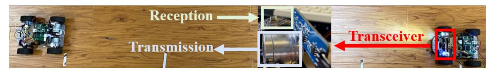
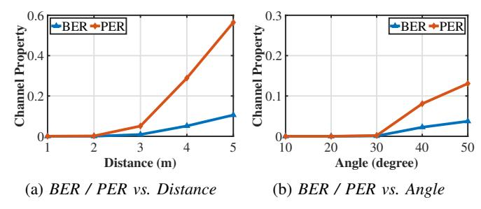
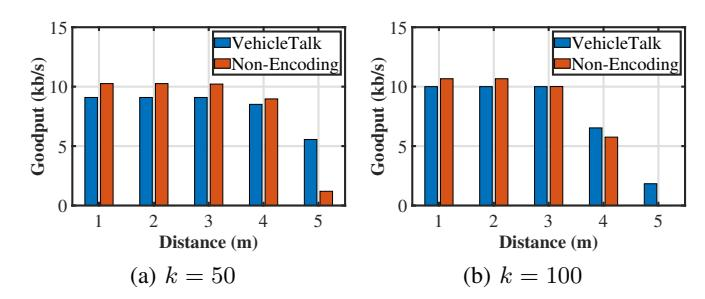
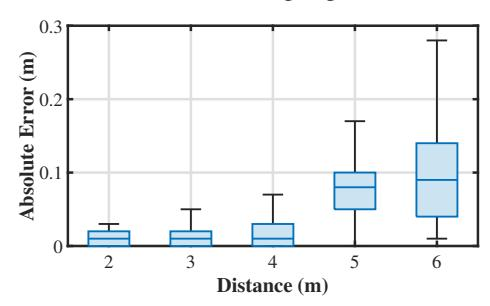
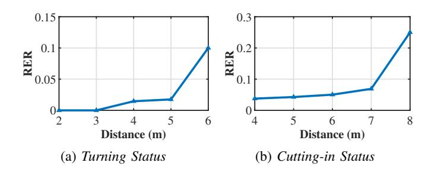

{0}------------------------------------------------

# VehicleTalk: Lightweight V2V Network Enabled by Optical Wireless Communication and Sensing

\*Yang Song<sup>1</sup>, \*Ruoshen Mo<sup>1</sup>, Pinpin Zhang<sup>1</sup>, Chenchen Wang<sup>1</sup>, Zhengguo Sheng<sup>2</sup>, Yimao Sun<sup>1</sup>, Yanbing Yang<sup>1</sup>

College of Computer Science, Sichuan University, Chengdu, China

Department of Engineering and Design, University of Sussex, Brighton, United Kingdom

Emails: steveshun@gmail.com, {yimaosun,yangyanbing}@scu.edu.cn

Abstract—Platooning has been proven to dramatically increase traffic flow and reduce fuel consumption, and vehicle-to-vehicle (V2V) communication and sensing are requisite for platooning stability. However, most of the existing works only address V2V communication or sensing functions respectively, which is far away from meeting the 6G requirements in availability and synchronization for platooning applications. Inspired by the recent advanced integrated sensing and communication (ISAC), in this paper, we propose VehicleTalk, a lightweight V2V communication and sensing framework. Essentially, VehicleTalk reuses the head/tail LED lights of the vehicles to construct communication/sensing channels for achieving concurrent message exchange and status awareness between adjacent vehicles. In particular, VehicleTalk innovates in both message transmission and vehicle sensing to improve communication robustness and lower system latency for platooning. It leverages Raptor Codes to combat serious packet loss in the V2V network. We also engineer a fast risk detection algorithm by simply monitoring the strength change of the received optical signals from the head/tail lights to improve safety in extreme cases such as emergency brake and cutting-in. Finally, we build a prototype of VehicleTalk with low-cost Commercial Off-The-Shelf (COTS) devices to quickly verify its effectiveness, and the extensive experimental results demonstrate the promising performance of VehicleTalk.

Index Terms—Platooning, V2V network, ISAC, Optical Wireless Communication

#### I. INTRODUCTION

Platooning is widely recognized as strategy to improve road safety and traffic capacity within the realm of Intelligent Transportation Systems (ITS) [1]. It relies on the synergy between two critical components: vehicle-to-vehicle (V2V) communication and perception function. Communication component enables dependable and high-speed data transfer among vehicles, while perception component empowers vehicles to perceive each other, enabling prompt motion adjustments and elevating the safety of platooning. Currently, the majority of the V2V network systems commonly depend on Radio Frequency (RF) technologies for inter-vehicle communication, exemplified by Dedicated Short Range Communications (DSRC) and Cellular Vehicle-to-Everything (C-V2X) [2]. However, the interference generated by a large number of nodes is detrimental to the timely delivery of critical control messages in situations where multiple nodes within an RFbased V2V network transmit data simultaneously.

**Supported by:** National Natural Science Foundation of China under the Grants No 62272329 and the H2020 research and innovation programme under the Marie Skłodowska-Curie grant agreement No 101006411.



Fig. 1: The overview of the VehicleTalk framework.

Fortunately, Optical Wireless Communication (OWC) has recently emerged as a promising solution for implementing V2V communication [3]. Given the increasing need for low latency and high reliability in V2V communication, the demand for optical wireless solutions is intuitive due to its advantages of the unlicensed optical spectrum, high bandwidth, and antielectromagnetic interference [4], [5]. Extensive experimental results have consistently demonstrated that OWC can enhance traffic efficiency and achieve superior performance over RF in high-density scenarios [6], [7]. In platooning applications, another critical component is the perception function, typically provided by sensing devices such as LiDARs or cameras [8], [9]. However, tackling V2V communication or sensing functions separately falls significantly short of satisfying the 6G requirements for availability and synchronization in platooning applications. Fortunately, Integrated Sensing and Communication (ISAC), as a new enabling technology, can synergize communication and sensing functions within a single system by reusing communication signals, thus avoiding the need for dedicated sensing device and improving coordination between communication and sensing functions [10].

Inspired by the recent advanced ISAC, in this paper, we propose VehicleTalk, a lightweight V2V communication and sensing framework for concurrent messages exchange and status awareness between adjacent vehicles. In particular, we innovate in both message transmission and vehicle sensing in realistic scenarios to improve V2V network performance.

We make the following major contributions in this paper:

 We establish a lightweight V2V communication and sensing framework, named VehicleTalk, which utilizes the head/tail LED lights of the vehicles to construct com-

<sup>\*</sup> Co-primary authors. Yanbing Yang is the corresponding author.

{1}------------------------------------------------

munication/sensing channels and employ Raptor Codes in our system to combat serious packet loss.

- We innovate in proposing a status sensing algorithm to fast detect the status changes of adjacent vehicles, enabling early detection of potential risk situations and collision avoidance.
- We build a prototype of VehicleTalk with low-cost COTS devices to quickly verify its effectiveness; the extensive experiment results evidently demonstrate the promising performance of VehicleTalk.

The remaining part of this paper is organized as follows. Section II presents the design of VehicleTalk. Extensive evaluations on VehicleTalk are reported in Section III. Finally, Section IV concludes the whole paper.

## II. VEHICLETALK DESIGN

# *A. System Overview*

We establish a proof-of-concept platooning system enhanced by the proposed VehicleTalk. Figure 1 illustrates the overview of the VehicleTalk framework. Specifically, VehicleTalk employs full-duplex communication, where the leader vehicle communicates with the follower vehicle using IR LEDs, while the follower vehicle communicates with the leader vehicle using white light LEDs. At the transmitter side, the original data undergoes encoding/modulation and then transmitted by the LED driver as high-frequency optical signals. At the receiver side, photodiodes (PDs) installed in the head/tail lights capture the modulated optical signals transmitted via the Line-of-Sight (LoS) link. Finally, the received signals are used for communication and sensing functions, simultaneously.

#### *B. Message Packet Generation*

Forward Error Correction (FEC) is adpoted in VehicleTalk to improve the overall communication performance. The basic idea is to transmit redundant data packets to recover the original data instead of retransmitting the entire data when packet loss or error occurs. Raptor Codes, as a class of fountain codes, is chosen for its linear-time encoding and decoding capabilities [11]. After sending out the *k* original packets, the transmitter continuously generates and transmits the repair packets. Upon receiving slightly more *k* packets, the receiver starts recovering the original data. If the receiver successfully recovers the original data, an acknowledgment (ACK) packet is fed back to the transmitter to trigger the next transmission. Otherwise, both the transmitter and the receiver abort the transmission due to an operation timeout.

## *C. Status Change Sensing*

Based on the Lambertian attenuation model, we can calculate the distance to adjacent vehicles by reusing the communication signals to restore the light level to its original intensity. On this basis, we establish the symmetric channel and integrate it with perception algorithms to achieve sensing functions between adjacent vehicles. In Section II-C1, we demonstrate the distance sensing mechanism using the Lambertian model. In Section II-C2, we will elucidate the challenges present in the real-world scenarios for which our sensing capabilities are designed to provide solutions.

*1) Lambertian Model:* In a LoS optical wireless link, we typically assume that the radiation intensity of LEDs follows the Lambertian radiation pattern [12]. The received optical power can be described as [13]:

$$P_r = P_t \cdot H(A, \phi, m, \theta, d) \cdot G_r, \tag{1}$$

where P<sup>r</sup> and P<sup>t</sup> represent the receiver power and transmitter power, respectively. H(d) represents the channel DC gain related to the distance d between the transmitter and receiver. G<sup>r</sup> represents the receiver gain, which can be calibrated once. The expression for H(d) is as follows:

$$H(A, \phi, m, \theta, d) = A \cdot g(\phi) \cdot \left[ \frac{m+1}{2\pi} \right] \cdot \cos^{m}(\phi) \cdot \frac{\cos \theta}{d^{2}}, (2)$$

where *A* denotes the physical area of the detector in a PD and g(ϕ) denotes the gain of an optical concentrator, which is a constant if the incidence angle falls within the field of view (FoV) of the detector. θ and ϕ denote the incidence angle and irradiation angle, respectively. m denotes the Lambertian radiation index of the LED, which is related to ϕ1/<sup>2</sup> (halfintensity radiation angle) by m = − ln 2 ln(cos ϕ1/2) . According to the physical meaning of the parameters, A, g(ϕ) and m are all constants in the same set of hardware. Therefore, we can simplify Equation (2) to the following equation:

$$H(\phi, \theta, d) = c \cdot \frac{\cos(\phi)\cos(\theta)}{d^2},\tag{3}$$

where c is a constant determined by hardware, which can be tested through experiments. Ultimately, we use Equation (3) as the basic model for sensing distance.

To validate the effectiveness of the model, we collect data varying the distance from 2 m to 6 m with a step size of 0.5 m, while keeping cos(ϕ) and cos(θ) as constants. Since ϕ and θ are always approximately regarded as 0 ◦ when vehicles move straight along the road. We then fit the scatters with the function c/d<sup>2</sup>+v, where v is set to 1.68 V due to the presence of the DC bias in the receiver hardware. When c = 3.3679, the Root-Mean-Square Error (RMSE) reaches the its minimum value of 7.7 × 10<sup>−</sup><sup>3</sup> , indicating the optimal fitting result. This model accurately describes the relationship between distance and RSSI. Therefore, the receiver can utilize the voltage to calculate the distance by this function.

*2) Risk Detection Algorithm:* Whether in platooning or general transportation systems, risk detection has always been an important area of research due to its significant impact on people's safety. Considering the real-world circumstances and the inherent characteristics of our system, we have identified three scenarios that are prone to triggering traffic accidents. In Figure 2, we illustrate these scenarios and analyse the signal characteristics within them. This analysis serves as a fundamental basis for the subsequent design of our algorithm.

The probability of traffic accidents rises in three specific scenarios: when vehicles execute abrupt braking, when vehicles make sharp turns, and when vehicles merge into traffic.

{2}------------------------------------------------



(c) Cutting-in Status.

Fig. 2: Three types of status awareness in VehicleTalk.

We refer to these three scenarios as *Emergency Braking Status* (Figure 2a), *Turning Status* (Figure 2b) and *Cuttingin Status* (Figure 2c). In the *Emergency Braking Status*, the optical signals within the symmetric channels undergo rapid amplification as the distance decreases. In the *Turning Status*, the distances from the vehicle's left and right taillights to the following vehicle are no longer equal, leading to a disparity in signal strength within the symmetric channel. Similarly, one side of the link will be blocked when a vehicle maneuvers into the space between two other vehicles, resulting in a noticeable disparity in signal strength on both sides. To be precise, we

## Algorithm 1 Risk Detection Algorithm

```
Require: VLef t, VRight, dSaf e
Ensure: Status
 1: function SENSE(VLef t, VRight)
 2: dLef t ← Distance sense(VLef t)
 3: dRight ← Distance sense(VRight)
 4: if dLef t < dSaf e or dRight < dSaf e then
 5: Status ← Emergency braking
 6: else if |dLef t − dRight| → ∞ then
 7: Status ← Cutting in
 8: else if |dLef t − dRight| < dT urning then
 9: Status ← T urning
10: else
11: Status ← F ollowing
12: end if
13: return Status
14: end function
```

input the safety distance (dSaf e) and voltages (VLef t, VRight) converted from the received optical signal strength into the SENSE function. The voltage can be used to calculate the distances on the left and right sides between adjacent vehicles (dLef t, dRight) and illustrate the status. By monitoring the strength changes of the optical signal, we can perceive the three crucial statuses in the platooning according to different judgment conditions, as illustrated in Algorithm 1.

## III. SYSTEM EVALUATION

In this section, we report the evaluation results obtained from our testbed. We first explain the experiment setups and then discuss both the communication and sensing performance of VehicleTalk under various experiment parameters, aiming to give insights for further improving the performance of V2V network in realistic scenarios.

# *A. Prototype and Experiment Setup*

In order to evaluate the performance of VehicleTalk enabled by the ISAC scheme, we build a prototype of VehicleTalk using two smart model vehicles (WHEELTEC L130), each equipped with a COTS MCU-Espressif ESP32 and four novel transceivers: two on the front and two on the rear, as shown in Figure 3. In this setup, data transmission and signal reception are integrated into a single transceiver:

- *1) Data Transmission:* VehicleTalk reuses commercial white light LEDs (AQ-P3W140K-F) as the headlights. To avoid driving safety issues caused by high-intensity visible light, VehicleTalk utilizes IR LEDs (AQ-P3IR140K-G42) with a wavelength of 850 nm installed in the vehicle taillights as the signal transmission module.
- *2) Signal Reception:* When the optical signal is received, µA-level currents of different strengths are generated on the PD (BPW20RF) based on the strength of the optical signal and are converted into output voltage signals with an amplitude of 0-3.3 V by the amplifier circuit. Subsequently, the ADC module of the MCU captures and converts these voltage signals into digital signals, which the MCU can employ for communication and sensing.
- *3) Data Packet Structure:* The original data is divided into *k* packets and encoded by Raptor Codes to generate *n* encoded packets. Transmitted data blocks are generated by combing *m* encoded packets and an 8-bit Sequence Number (SN). The transmitted data blocks are encoded using Manchester Codes to avoid dimming changes and flicker. To indicate the start and end of a transmission session, each data block has a preamble composed of "11110" and ends with a single bit "0". The packet length is 8 bits, n = 1.25k, and m = 4.

#### *B. Channel Property*

In this subsection, we report the communication channel properties with respect to various metrics, aiming to verify the effectiveness of the communication module of VehicleTalk. To be specific, we evaluate the communication performance of VehicleTalk in terms of Bit Error Rate (BER) and Packet Error Rate (PER). The former is the ratio of the error bits to the

{3}------------------------------------------------



Fig. 3: Illustration of VehicleTalk prototype and experiment setup.

total number of transmitted bits. The latter is the percentage of incorrect blocks among all successfully identified blocks.

1) Impact of Varying Distances: We first evaluate the performance of VehicleTalk under a varying communication distance. Specifically, we fix the data rate at 40 kbps and vary the communication distance from 1 m to 5 m, and the results are shown in Figure 4a. We observe that BER and PER remain at a low level regardless of the increasing communication distance until the distance exceeds 3 m. At a distance of 4 m, the BER and PER are dynamically increased to  $5.13 \times 10^{-2}$ and  $2.89 \times 10^{-1}$ , respectively. This phenomenon can be explained by the fact that the received signal strength is not high enough to be captured by the low-cost MCU ADC, leading to demodulation failures. Nevertheless, the proposed VehicleTalk can achieve a reasonable BER and PER at a distance of 3 meters, which confirms the feasibility and effectiveness of the proposed communication module. In practical applications, using higher-power vehicle lamps instead of experimental lighting fixtures is anticipated to achieve a communicative range of up to 50 meters.

2) Impact of Varying Angles: We then fix the receiver at a distance of 0.5 m from the transmitter and measure the channel properties for different incident angles. The results are reported in Figure 4b. As we expected, the BER and PER are lower when the tilt angle is small. As the incident angle increases, both the BER and PER gradually increase due to the tilt angle of the receiver, causing non-alignment between the transmitter and receiver, which affects the received signal strength. Nevertheless, a tilt angle of 30 degrees is often sufficient for vehicles moving straight ahead. Once the tilt angle is too large, it indicates that the vehicle is in a turning state, and the sensing module will respond to such situations.

#### C. Goodput

In this section, we evaluate the advantages of using Raptor Codes in terms of goodput by comparing VehicleTalk with the baseline non-encoding scheme. The non-encoding mechanism



Fig. 4: Channel properties of VehicleTalk under varying distances and angles.

is to send the set of k original packets assigned to a signal transmitter in a circular shift manner. We calculate the goodput (also known as effective throughput) as the useful bits of the k packets divided by the latency. It is a superior metric compared to throughput because it focuses on the rate of successfully transmitted useful data in the network, providing a more precise reflection of the actual performance and efficiency of the network. Furthermore, the latency is the elapsed time from the receiver starts to receive data to when it recovers (for VehicleTalk) or receives all the original data packets (for the baseline). In short, we conduct the experiments with k=50 and k=100 to evaluate the how VehicleTalk performs under different data lengths.



Fig. 5: The goodput of both VehicleTalk and non-encoding under varying distances and data lengths (k = 50, k = 100).

The achieved goodput is plotted in Figure 5 for different values of k. We can observe that Raptor Codes do not bring significant improvements compared to the baseline mechanism due to the favorable signal-to-noise ratio within a 3 m range. However, VehicleTalk demonstrates a substantial improvement in goodput when the channel property deteriorates (as the distance increases), as illustrated in Figure 5. This notable improvement stems from the increase in packet loss and error rates under adverse channel conditions. Raptor Codes have a distinct advantage in such scenarios, as they can either recover the original message or correct "bad information" into "good information" from redundant data packets instead of retransmitting the entire packet sequence. Moreover, there is a notable decrease in goodput as the message length increases since the entire message becomes unusable if any data packet is corrupted. Consequently, the impact of Raptor Codes becomes more pronounced with longer data lengths.

#### D. Sensing Performance Verification and Evaluation

In this subsection, we report the sensing performance of VehicleTalk under varying distances to verify the effectiveness of the proposed sensing module. We evaluate the accuracy of 

{4}------------------------------------------------

sensing distance using Abusolute Error (AE) and the accuracy of status perception using Recognition Error Rate (RER).

1) Sensing distance resolution: Our risk detection algorithm relies on high-precision distance sensing. Therefore, we first examine the performance of the proposed sensing module under a varying distance. We keep transmitter at the same power and conduct 1000 tests at different distances varying from 2 m to 6 m to calculate the AE between the actual distance and the sensing distance for each data point. The error results are plotted in Figure 6. From 2 m to 4 m, the distance sensing module performs optimally with a AE below 1 cm. It can be also seen that even at the distance of 6 m, the median of AE remains consistently below 10 cm, which is acceptable for common vehicle-following distances. The experiment results confirm the effectiveness of distance sensing using VL, which lays the foundation for our sensing algorithms.



Fig. 6: Sensing distance resolution under varying distances.

2) Sensing status resolution: Building upon distance sensing, we evaluate the sensing performance of the proposed sensing algorithm under Emergency Braking Status, Turning Status, and Cutting-in Status. The Emergency Braking Status is usually identified by determining whether the acceleration is beyond the threshold. In our algorithm, we replace the acceleration with the distance. If the distance falls below the safe distance, it is considered the Emergency Braking Status which makes it equivalent to distance sensing. Thus, we ultimately report the RERs for the Turning Status and Cuttingin Status as illustrated in Figures 7a and 7b, respectively. It can be seen that the RERs for Turning status and Cuttingin Status consistently remain below 10% within a sensing distance of 6 m and 7 m, respectively. However, the RERs for both statuses significantly increase when the sensing distance exceeds 6 m and 7 m. This is because the derivative of distance with respect to voltage becomes larger as the sensing distance gradually increases, which leads to minor voltage fluctuations can lead to significant variations in the sensing distance. In VehicleTalk, the transmitter power is far lower than the vehicle headlights. It is feasible to achieving high-precision sensing within a range of 70 meters when using vehicle headlights in the real world. In a nutshell, the experiment results obtained by our current prototype confirm the feasibility and effectiveness of the proposed sensing module.

## IV. CONCLUSION

In this paper, we implement an ISAC framework called VehicleTalk, which integrates V2V communication and V2V



Fig. 7: Sensing algorithm resolution under varying distances. sensing services into a unified visible light architecture. Employing Raptor Codes and status sensing algorithm, the VehicleTalk framework handles severe packet loss in the V2V communication while detecting risks in extreme cases to its maximum in the V2V sensing, thus releasing its full potential within the V2V network. With extensive evaluations under several experiment settings, we have demonstrated the promising performance of VehicleTalk in simultaneous communication and sensing, where the communication task achieves a goodput of 5 kbps and the sensing task remains median RE and RER below 1.6% and 10% at a distance of 5 m. We plan to further enhance the VehicleTalk framework by addressing some of its limitations in the future to promote a broader acceptance of our ISAC-VLC concept.

#### REFERENCES

- G. Dimitrakopoulos and P. Demestichas, "Intelligent Transportation Systems," in IEEE Vehicular Technology Magazine, vol. 5, no. 1, pp. 77-84, March 2010
- [2] K. Abboud, H. A. Omar and W. Zhuang, "Interworking of DSRC and Cellular Network Technologies for V2X Communications: A Survey," in IEEE Transactions on Vehicular Technology, vol. 65, no. 12, pp. 9457-9470, Dec. 2016
- [3] A. Memedi and F. Dressler, "Vehicular Visible Light Communications: A Survey," in IEEE Communications Surveys & Tutorials, vol. 23, no. 1, pp. 161-181, Firstquarter 2021
- [4] H. Elgala, R. Mesleh and H. Haas, "Indoor optical wireless communication: potential and state-of-the-art," in IEEE Communications Magazine, vol. 49, no. 9, pp. 56-62, September 2011
- [5] M. Z. Chowdhury, M. T. Hossan, A. Islam and Y. M. Jang, "A Comparative Survey of Optical Wireless Technologies: Architectures and Applications," in IEEE Access, vol. 6, pp. 9819-9840, 2018
- [6] M. Y. Abualhoul, O. Shagdar and F. Nashashibi, "Visible Light intervehicle Communication for platooning of autonomous vehicles," 2016 IEEE Intelligent Vehicles Symposium (IV), Gothenburg, Sweden, 2016, pp. 508-513
- [7] W. -H. Shen and H. -M. Tsai, "Testing vehicle-to-vehicle visible light communications in real-world driving scenarios," 2017 IEEE Vehicular Networking Conference (VNC), Turin, Italy, 2017, pp. 187-194
- [8] A. Mukhtar, L. Xia and T. B. Tang, "Vehicle Detection Techniques for Collision Avoidance Systems: A Review," in IEEE Transactions on Intelligent Transportation Systems, vol. 16, no. 5, pp. 2318-2338, Oct. 2015
- [9] B. Soner and S. Coleri, "Visible Light Communication Based Vehicle Localization for Collision Avoidance and Platooning," in IEEE Transactions on Vehicular Technology, vol. 70, no. 3, pp. 2167-2180, March 2021
- [10] Y. Cui, F. Liu, X. Jing and J. Mu, "Integrating Sensing and Communications for Ubiquitous IoT: Applications, Trends, and Challenges," in IEEE Network, vol. 35, no. 5, pp. 158-167, September/October 2021
- [11] A. Shokrollahi, "Raptor codes," in IEEE Transactions on Information Theory, vol. 52, no. 6, pp. 2551-2567, June 2006
- [12] J. M. Kahn and J. R. Barry, "Wireless infrared communications," in Proceedings of the IEEE, vol. 85, no. 2, pp. 265-298, Feb. 1997
- [13] Li, Liqun and Hu, Pan and Peng, Chunyi and Shen, Guobin and Zhao, Feng, "Epsilon: A visible light based positioning system," in NSDI 2014, pp. 331-343