{0}------------------------------------------------

# Microalgae Density Measurement Using Quantum-Dot-Integrated Sensing and Communication System

Hua Xiao®, Member, IEEE, Wensong Wang®, Senior Member, IEEE, Kuokuo Zhang®, Feng Li®, and Caiming Sun®, Senior Member, IEEE

Abstract—Assessing microalgae density is essential for microalgae cultivation and marine environmental surveillance. This study introduces a quantum dot (QD)-based visible light sensing and communication (VLSC) system that employs emissions spanning the blue, green, yellow, orange, and red spectra to evaluate the density of microalgae across different species and varying densities. The bit error rate (BER) of the VLSC system serves as an intermediate to calculate microalgae density under various data rates and light colors by fitting the linear area of BERs. Orange light demonstrates superior linearity, high optical power, rapid response, and high accuracy in assessing microalgae species of Euchlorocystis marina and Isochrysis galbana. The highest accuracy attained for *I. galbana* samples is 0.98, averaging at 0.79, when utilizing orange light. These values surpass those obtained through direct measurement of optical power. The proposed method offers high feasibility and adjustable color options for assessing microalgae density, showing potential for integration into smart illumination-sensor-communication systems aimed at microalgae cultivation and marine environmental monitoring.

Index Terms—Density measurement, Euchlorocystis marina, Isochrysis galbana, marine microalgae, quantum dots (QDs).

#### I. INTRODUCTION

ICROALGAE are photosynthetic organisms that contribute essential molecules such as amino acids, carotenoids, polyunsaturated fatty acids, vitamins, and lipids, which support ecological life [1]. Additionally, microalgae also serve as a promising renewable source in aquatic environments by reducing carbon emissions and producing biofuels

Received 24 December 2024; revised 26 April 2025; accepted 23 July 2025. Date of publication 13 August 2025; date of current version 27 August 2025. This work was supported in part by the National Natural Science Foundation of China under Grant 62304054, in part by the Marine Young Talent Innovation Program of Zhanjiang City under Grant 2022E05003, and in part by the Program for Scientific Research Start-Up Funds of Guangdong Ocean University under Grant 060302112101. The Associate Editor coordinating the review process was Dr. Shiraz Sohail. (Corresponding authors: Feng Li; Caiming Sun.)

Hua Xiao is with the School of Electronic and Information Engineering, Guangdong Ocean University, Zhanjiang 524088, China (e-mail: oliviaxh@gdou.edu.cn).

Wensong Wang is with the National Key Laboratory of Microwave Imaging, Aerospace Information Research Institute, Chinese Academy of Sciences, Beijing 100190, China (e-mail: uscnuaa@gmail.com).

Kuokuo Zhang and Caiming Sun are with Shenzhen Institute of Artificial Intelligence and Robotics for Society (AIRS), School of Science and Engineering, The Chinese University of Hong Kong, Shenzhen 518172, China (e-mail: zhangkuokuo@cuhk.edu.cn; cmsun@cuhk.edu.cn).

Feng Li is with the College of Fisheries, Guangdong Ocean University, Zhanjiang 524088, China (e-mail: lifeng2318@gdou.edu.cn).

Digital Object Identifier 10.1109/TIM.2025.3595231

[2]. While they are commonly found in open water environments, microalgae are also cultivated on an industrial scale using closed systems, such as photobioreactors [3]. In these settings, manual interventions such as cleaning, sterilizing, sampling, inoculating, and harvesting should be minimized during the monitoring process until the microalgae reach maturity. As a result, continuously characterizing the reproductive rate of microalgae poses a significant technical challenge in cultivation and water quality monitoring. Among the various indices of microalgae growth, density is the most direct indicator of biomass and growth rate [4]. With the progression of "marine ranching" concepts in China, there is a growing demand for intelligent detection devices with integrated sensor-communication capabilities [5]. A flexible monitoring method for microalgae density is highly desired in both microalgae cultivation and marine environmental assessment [6]. Among all observable physical quantities, optical signals offer high adjustability in emission wavelength, modulation frequency, and light intensity, making them effective media for detecting and transmitting microalgae density without interference from radio frequency signals [7], [8], [9].

It is known that light significantly influences the growth of microalgae. To investigate the impact of light stress on lipid production in Nannochloropsis oculata, Nannochloropsis salina, and Nannochloropsis oceanica, Ra et al. [10] experimented with various colored LEDs for microalgae cultivation and determined the optimal color and light exposure duration. Additionally, Pang et al. [11] designed multilevel heuristic LED regimes that integrated light, nitrogen, and carbon sources to enhance bioproduct accumulation under mixotrophic conditions in Haematococcus pluvialis cultivation. Furthermore, Prates et al. [12] evaluate the impact of different LED wavelengths and photoperiods on protein productivity in Spirulina sp., finding that red and green LEDs in both integral and partial photoperiods achieved the highest protein productivity. Therefore, it is anticipated that a visiblelight-based illumination, sensing, and communication system can be developed to promote growth, monitor density, and transmit data for various microalgae species.

For seawater assessment, parameters such as temperature, pH, ammonia, salinity, and dissolved oxygen are primarily monitored using commercial low-cost sensors from companies like DFRobot, Atlas Scientific, and Vernier [13]. Turbidity is

{1}------------------------------------------------

also measured by using optical sensors, which analyze light absorbance, reflection, or dispersion to quantify suspended particles in water based on the Beer–Lambert law. Common brands for turbidity sensors include Gravity Analog and ReYeBu [\[14\].](#page-10-5) For microalgae density measurement, Nguyen et al. [\[15\]](#page-10-6) developed a cost-effective Raspberry Pi camera to periodically capture images of algal microorganisms under white LEDs. Furthermore, Morgado et al. [\[16\]](#page-10-7) developed a noninvasive monitoring technique to observe microalgae biofilms, utilizing reflectance indices to assess biomass, astaxanthin, and chlorophyll under various light and nutrient regimes. Among these detection technologies, manual cell counting, dry cell weight measurement, and optical density measurement are conventionally employed to evaluate the growth status of microalgae [\[17\].](#page-10-8) Other techniques, including photometers [\[18\],](#page-10-9) focused beam reflectance probes [\[19\],](#page-10-10) spectroscopy [\[20\],](#page-10-11) and image processing [\[21\],](#page-10-12) can also be utilized for evaluating microalgae growth. For these methods, challenges such as sample contamination, the range of measured density, and the complexity and accuracy of measurements have not been fully addressed. Moreover, the effects of different light wavelengths on the optical properties of specific microalgae species are unclear.

Using a visible-light sensing and communication system for microalgae density measurement allows for simultaneous density monitoring and communication. The bit error rate (BER) in communication can reflect changes in microalgae density by detecting fluctuations in small optical signals caused by density variation. Since light color affects both microalgae absorption and photodetector (PD) sensitivity, which impacts the accuracy of measured optical parameters, a color-tunable light source is essential for reliable monitoring with this system [\[22\].](#page-10-13)

There are three main methods to obtain light with different colors: 1) commercial inorganic LED chips; 2) incandescent and fluorescent lamps; and 3) fluorescent material-based LEDs. All types of light sources can use a filter to control the range of emitting wavelengths. Commercial inorganic LED chips struggle to deliver continuously tunable spectra across the visible range through simple integration of multiple chips. Incandescent and fluorescent lights can provide nearly full spectra for selection; however, their low response limits their application in communication. Fluorescent materials, including phosphors [\[23\],](#page-10-14) organic dyes [\[24\],](#page-10-15) perovskites [\[25\],](#page-10-16) and quantum dots (QDs) [\[26\],](#page-10-17) are conventionally used in illumination, display, and communication. Among them, II–VI family QDs, especially CdSe QDs, possess outstanding performance in quantum yield, modulation bandwidth, color tunability, stability, and color purity simultaneously [\[27\].](#page-10-18) These merits make the CdSe QDs the optimal choice as color converters in an integrated illumination, sensing, and communication system.

In this study, a visible light sensing and communication (VLSC) system based on QD color-conversion layer (CCL) is proposed for microalgae density assessment. *Euchlorocystis marina* [\[28\]](#page-10-19) and *Isochrysis galbana* [\[29\],](#page-10-20) which have spherical structures and small sizes, are chosen as measuring samples. Lights of blue, green, yellow, orange, and red, converted by QDs, are used as carrier wave media for communication, as well as to provide various wavebands for observing the sensitivity of microalgae to light. The BER of the VLSC system serves as a key observable variable for evaluating communication capacity, as well as an intermediate indicator of microalgae density. A multifactorial function is proposed to reflect the mapping process from BER to microalgae density in universal occasions. Factors, including the type of QDs, data rate in communication, and microalgae species, are considered in constructing the multifactorial function. The accuracy of the proposed method is assessed by comparing the calculated densities using the proposed method with those obtained from the conventional counting method. Results show that the proposed method exhibits high average accuracies for both *E. marina* and *I. galbana* samples under various light colors, especially under orange light. Thus, it is expected to be an effective solution for integrated intelligent illumination–sensor–communication systems aimed at microalgae cultivation and marine environmental assessment.

The remainder of this article is structured as follows. Section [II](#page-1-0) introduces the methodology of the proposed method and compares it with the conventional method for measuring microalgae density. Section [III](#page-2-0) details the preparation procedures for microalgal solution, morphological observations, absorbance measurements, and statistical analysis techniques. Section [IV](#page-4-0) describes the preparation and characterization processes for QD CCLs, including their fabrication, emission spectra characteristics, and quantum yield assessments. Section [V](#page-4-1) depicts the experimental setup of the VLSC system and evaluates the frequency response of various QD CCLs. In Section [VI,](#page-5-0) BER and received optical power are measured and analyzed under different color light conditions and microalgae densities. Additionally, the accuracy of the proposed method is validated by comparing calculated densities using the proposed method against those obtained from the conventional counting method. Good concordance is demonstrated between the measured and calculated microalgae densities across different light colors. Section [VII](#page-9-8) concludes with summary of the contributions and significance of the entire work.

## II. CONVENTIONAL VERSUS PROPOSED MICROALGAE DENSITY MEASUREMENT SYSTEMS

#### *A. Proposed Microalgae Density Measurement System*

To enable microalgae density monitoring using the QD integrated VLSC system, monochromatic lights of blue, green, yellow, orange, and red are prepared for communication. It is achieved by employing a blue LED chip with QD CCLs. Microalgae species of *E. marina* and *I. galbana*, which exhibit green and brown pigmentation, respectively, are prepared in liquid suspension at varying densities. As illustrated in Fig. [1\(a\),](#page-2-1) following the preparation of light sources and microalgal samples, a training process is necessary to be carried out prior to measuring unknown densities.

Conventionally, BER is used to assess the communication speed. However, in our study, BER serves as a sensitive indicator that varies with changes in microalgae density. The training process aims to establish the mapping relationship

{2}------------------------------------------------

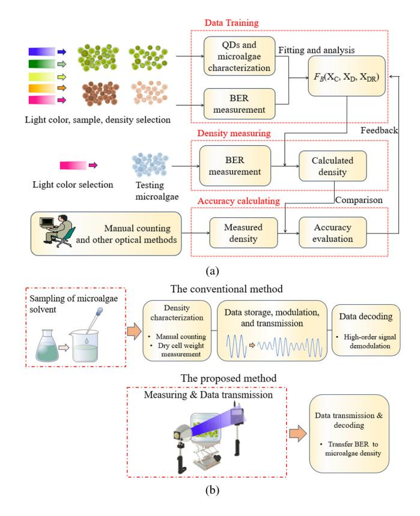

Fig. 1. (a) Research methodology of the proposed method. (b) Comparison between the conventional method and the proposed method in microalgae density measurement.

between BER and microalgae density under different communication conditions. This relationship can be described as a function *FB*(*XC*, *XD*, *XDR*), where *XC*, *XD*, and *XDR* signify the color of QDs, microalgae density, and communication data rate during measurement, respectively. The actual quantity of *XD* is derived by fitting empirical data of measured BER under various testing conditions. Prior to data training, quantum yields and frequency response of QD CCLs are characterized to assess their optical emission performance. Additionally, the absorbance of different microalgae species is evaluated to analyze their behavior under diverse exposure wavebands. By fitting empirical data of measured BER across various microalgae densities, the function *FB*(*XC*, *XD*, *XDR*) can be established. Considering data rate and light color before establishing *FB*(*XC*, *XD*, *XDR*) is crucial for accurately evaluating microalgae density with different light sources and communication rates.

The primary object of the data training process is to derive *FB*(*XC*, *XD*, *XDR*), which will subsequently be used to estimate the density of unknown microalgae sample based on the measured BER. In the "density measuring" phase, microalgae with different densities can be conveniently measured with the VLSC system using selected excitation light and data rates. The accuracy of the proposed method is validated by comparing its results with those obtained from conventional manual counting methods. If the accuracy falls below the predefined threshold, recalibration and rederivation of *FB*(*XC*, *XD*, *XDR*) are required.

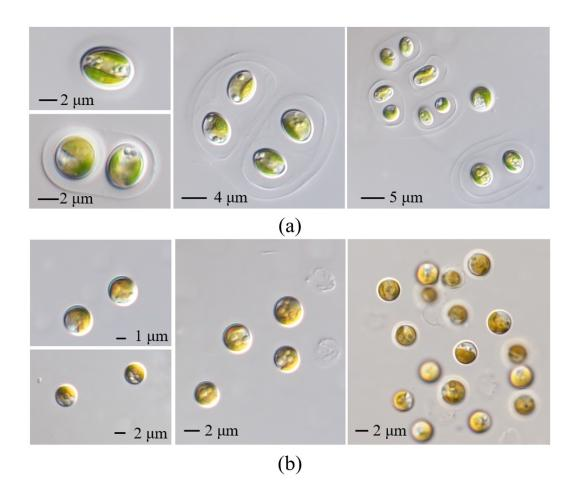

Fig. 2. Microscope photographs of (a) *E. marina* and (b) *I. galbana* samples.

## *B. Comparative Analysis of Two Measurement Systems*

To distinguish the proposed from conventional methods, Fig. [1\(b\)](#page-2-1) illustrates the steps involved in measuring microalgae density for both methods. In the conventional method, a sample of microalgal culture must be extracted from the nutrient solution for density characterization. Characterization can be achieved through methods such as dry weight testing, ultrasonic detection, and cell counting. Following the determination of microalgae density, further steps, including data storage, processing, modulation, transmission, and decoding, are required for communication. Except the high labor cost, there is also a risk of contaminating the microalgal solution during sampling. In contrast, the proposed method streamlines the measurement by integrating the sensing and communication processes. By directing light through the microalgal solution, the density can be directly inferred from the observed variations in BER, using the established mapping relationship of *FB*(*XC*, *XD*, *XDR*). It is important to note that the BER value does not directly affect the accuracy of the measurement. In essence, the proposed method is tolerant of high BER levels during the measurement process of the VLSC system.

# III. MICROALGAE PREPARATION AND CHARACTERIZATION

## *A. Microalgae Species Selection and Characterization*

In this study, marine microalgae of *E. marina* and *I. galbana* are selected as the subjects of observation because they exhibit favorable growth characteristics under different nutritional conditions. Additionally, these two microalgae are commonly used in microalgal research, and the available literature on them provides rich References for experimental design. *E. marina* [as shown in Fig. [2\(a\)\]](#page-2-2) and *I. galbana* [as shown in Fig. [2\(b\)\]](#page-2-2) are supplied by the Laboratory for Algae Resource Development and Culture Environment Ecological Remediation, Guangdong Ocean University, with the preparation methods detailed in [\[30\].](#page-10-21) *E. marina* is cultured in Zhanshui-107 medium, which contains the following main components per liter of seawater: 8-mg KH2PO4 and 80-mg NaNO3, along with 2-mg FeC6H5O7. Both types of microalgae are cultured with continuous exposure to light

{3}------------------------------------------------

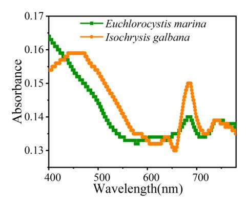

Fig. 3. Absorbances of E. marina and I. galbana samples.

(T8 LED Tube white light at 30  $\mu$ mol·m-2·s-1), continuous aeration (0.4 L·min-1 of air), and a culture temperature of 25 °C  $\pm$  1 °C within a 5-L Erlenmeyer flask. Meanwhile, *I. galbana* is cultured with F/2 medium, with the following principal constituents per liter of seawater: 75-mg NaNO3, 5-mg NaH2PO4·H2O, 30-mg Na2SiO3·9H2O, and 1-mL trace metal solution. The trace metal solution per liter contains 3.15-g FeCl3·6H2O, 4.36-g Na2EDTA·2H2O, 9.8-mg CuSO4·5H2O, 6.3-mg Na2MoO4·2H2O, 22-mg ZnSO4·7H2O, 10-mg CoCl2·6H2O, and 180-mg MnCl2·4H2O. Algal cells that are 20 days old in the logarithmic growth phase are selected for experimental observation. Their morphology and absorbance are assessed using a light microscope and spectrophotometer, respectively.

The solitary cells and colonial forms of *E. marina* are depicted in Fig. 2(a). The cells are enveloped by a thin, hyaline mucilage, and our samples also exhibit expanded mother cell walls. All these cells are predominantly round, oval, and slightly reniform, with lengths ranging from 3 to 6  $\mu$ m and widths from 2 to 4  $\mu$ m. In contrast to the rugby ball-like cell morphology observed in Fig. 2(a), *I. galbana*, as shown in Fig. 2(b), exhibits a spherical shape with a diameter of 2–3  $\mu$ m.

Absorbance measurements for *E. marina* and *I. galbana* are presented in Fig. 3. Both species exhibit relatively high absorbance in shorter wavebands. As the wavelength of light increases, the absorbance decreases for both microalgae. Specifically, at the wavelengths of 580 nm for *E. marina* and 657 nm for *I. galbana*, the absorbance reaches its minimum within the visible spectrum. Interestingly, at a wavelength of 600 nm, the absorbance value for both *E. marina* and *I. galbana* are notably similar. Despite the similarity in the red region of the spectrum, the absorbance of *I. galbana* between the wavelengths of 430–600 nm is consistently lower than that of *E. marina*. This discrepancy can be attributed to the combined optical effects of pigment, cell shape, and cell shell structure.

#### B. Microalgal Solution Preparation

The steps for preparing microalgal solutions of varying densities are illustrated in Fig. 4(a). Initially, a 40-mL primary microalgal solution is prepared, which has the highest density among others. Subsequently, 35 mL of this primary solution is dumped into the beaker, and 5 mL of culture medium is then added using a dropper. By repeating these steps, eight

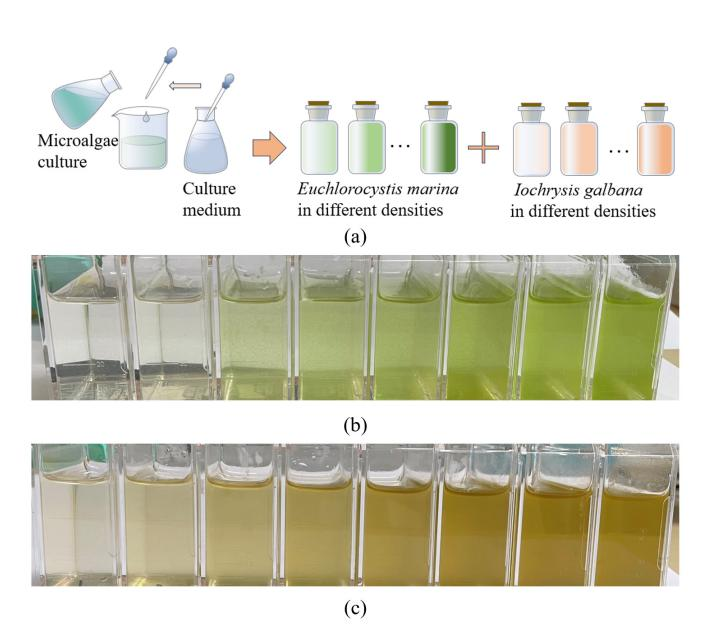

Fig. 4. (a) Preparation steps for microalgal solution with different densities. (b) Photograph of *E. marina* in various densities. (c) Photograph of *I. galbana* in various densities.

TABLE I
DENSITIES OF MICROALGAE

| Serial Number | Density (cells/L)        |                      |
|------------------|--------------------------|----------------------|
|                  | Euchlorocystis marina | Iochrysis galbana |
| 1                | 6.33×10 7     | 7.20×10 8 |
| 2                | $7.92 \times 10^7$       | 1.45×10 9 |
| 3                | 2.37×10 8     | 2.17×10 9 |
| 4                | 3.17×10 8     | $2.89 \times 10^{9}$ |
| 5                | $3.96 \times 10^{8}$     | $3.61\times10^{9}$   |
| 6                | 4.75×10 8     | 4.34×10 9 |
| 7                | 5.54×10 8     | $5.06 \times 10^9$   |
| 8                | 6.33×10 8     | $5.78 \times 10^9$   |

liquid samples of *E. marina* and *I. galbana* are prepared, each with a similar density gradient achieved through the dilution process. As shown in Fig. 4(b) and (c), the resulting microalgal solutions are of high uniformity, with clear samples exhibiting a distinct gradient in density, presented in green and brown colors.

## C. Statistical Measurement for Microalgae Samples

Prior to statistical measurement, Lugol's solution is prepared in a brown glass using potassium iodide potassium iodide, iodine crystals, and water, following the method described in [31]. Thick glassy blood counting chambers are utilized as the primary tools for cell counting [32]. To facilitate cell counting,  $20 \mu L$  of Lugol's solution is injected into 1 mL of microalgal solution using a pipette. This process immobilizes the microalgae cells without affecting their morphology.

After cell sedimentation, the chamber is secured on the microscope stage, and five central grids are selected for counting. Thus, the cell number  $(C_N)$  can be calculated as follows:

$$C_N = \frac{\text{Total number}}{80} \times 400 \times 10^4 \times D_P \tag{1}$$

{4}------------------------------------------------

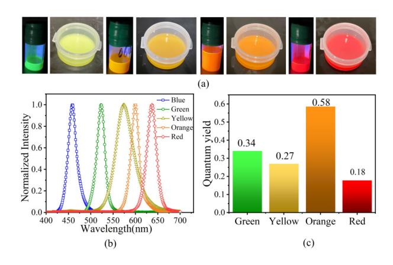

Fig. 5. (a) Photographs of QDs in solvent and in solidified status. (b) Normalized emission spectra of blue, green, yellow, orange, and red light. (c) Quantum yields of green, yellow, orange, and red light at 460-nm excitation.

where *DP* represents the dilute proportion of the microalgal solution prior to measurement. To ensure the accuracy of the statistical results, the counting process for each sample was repeated 2–3 times. The measured microalgae densities are displayed in Table [I.](#page-3-2) The unit of the calculated *CN* is mL, while the unit of microalgae densities is cells/L. A distinct gradient in density is observed in Table [I](#page-3-2) for both *E. marina* and *I. galbana* samples. Due to the smaller size of *I. galbana* cells, the typical cultivating density of *I. galbana* is relatively higher than that of *E. marina*.

#### IV. QD PREPARATION AND CHARACTERIZATION

Green-, yellow-, orange-, and red-emissive CdSe-based QDs are synthesized for color conversion in a VLSC-based measuring system. The synthesis techniques for QDs are detailed in [\[26\]](#page-10-17) and [\[33\].](#page-10-24) The manufacturing process of QD CCLs is as follows. Initially, a QD solution with a concentration of 30 mg/mL in octane is prepared. Subsequently, 100 µL of this QD solution is injected into 3 mL of silicone gel housed in a transparent container. The QD–silicone mixture is then stirred using a rod until the QDs are uniformly dispersed throughout the silicone gel. A vacuum pump is utilized to evacuate air from the container. After several minutes, the QD–silicone mixture is dumped into a circular, transparent mold, which is then heated on a heating platform at 110 ◦C to facilitate solidification. Once the QD CCL has solidified, the mold is moved to a cooling stage until it reaches ambient temperature. Finally, the QD CCL is carefully removed using tweezers and affixed to a fixture in front of the excitation source. The thickness of each manufactured QD CCL is controlled at 3 mm to guarantee that the emitted light is monochromatic. These steps are repeatable for producing QD CCLs in various colors.

Photographs of CdSe-based QDs in both solvent and solidified status are presented in Fig. [5\(a\),](#page-4-2) showcasing green-, yellow-, orange-, and red-emissive QDs that have been synthesized. Apart from the differences in color between green QD solvents and films [as shown in the left figure of Fig. [5\(a\)\]](#page-4-2), yellow, orange, and red QDs exhibit similar appearances in both solvent and film states. To quantitatively assess the optical performance of QD CCLs, the normalized emission spectra

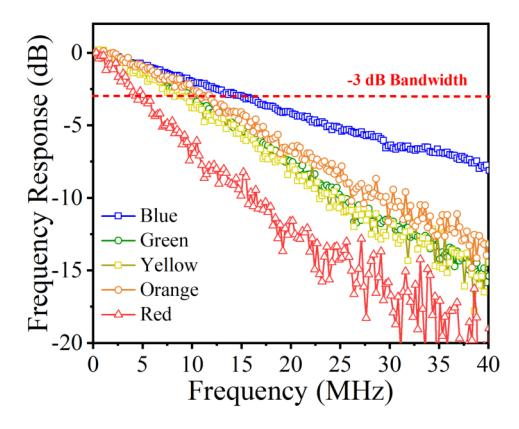

Fig. 6. Frequency responses of the blue LED chip and QD CCLs in different colors.

of the blue LED chip and all QD CCLs are measured using an optical spectrometer (HPCS-320, Hopoo Light and Color Technology Company Ltd.), as depicted in Fig. [5\(b\).](#page-4-2) The peak wavelengths for blue, green, yellow, orange, and red light are 458, 523, 574, 600, and 637 nm, respectively. Except for the yellow QD sample, the full width at half maximum (FWHM) of all QD spectra reaches approximately 20 nm. Quantum yields of the QD CCLs are measured using an absolute PL quantum yield spectrometer (HAMAMATSU C11347), as shown in Fig. [5\(c\).](#page-4-2) The orange QD CCL demonstrates the highest quantum yield at 0.58, while those of green, yellow, and red QD CCLs are 0.34, 0.27, and 0.18, respectively. The red QD CCL exhibits the lowest quantum yield, potentially due to factors such as light extraction efficiency from the film surface, the inherent quantum yield of the red QD solution, and QD aggregation during synthesis, as discussed in [\[34\].](#page-10-25)

#### V. EXPERIMENT DETAILS OF THE VLSC SYSTEM

# *A. Modulation Performance Characterization*

The frequency responses of the blue LED chip and QD CCLs directly impact the communication performance of the VLSC system. Therefore, a Network Analyzer (KEYSIGHT E5063a, 100 kHz–3 GHz) is employed to measure the frequency responses of the blue LED chip and QD CCLs of varying colors within the specified frequency range from 300 kHz to 40 MHz. A small signal generated from the Network Analyzer is transmitted into the blue LED. Upon receiving the alternating optical signal, the PD injects the signal into the adjacent channel of the Network Analyzer for analysis. The frequency responses of the QD CCLs are measured with the blue LED as the excitation source, with the QD CCL positioned in front of the blue LED. Throughout the measurement, a glass filter is fixed in front of the PD to eliminate the impact of blue light on the measurement. As illustrated in Fig. [6,](#page-4-3) the frequency response of the blue LED (blue curve) shows a gradual decrease with increasing frequency, with a −3-dB bandwidth of 15.7 MHz. Compared to the blue LED, the green, yellow, orange, and red QD CCLs possess bandwidths of 10.8, 9.5, 11.7, and 5.0 MHz, respectively. These values are significantly higher than those of phosphor-based and organic material-based LED systems

{5}------------------------------------------------

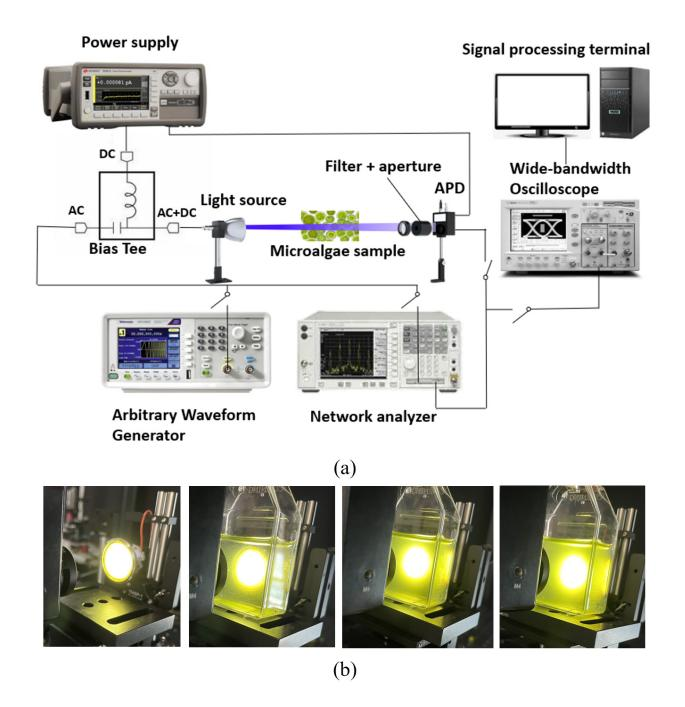

Fig. 7. (a) Arrangement of the VLSC measuring system. (b) Measurement photographs of microalgae at varying densities by using the yellow QD CCL.

(typically tens of hertz), which are also used for illumination and communication [\[35\],](#page-10-26) [\[36\].](#page-10-27)

The VLSC system comprises the emission, transmission, and reception channels. The emission terminal of the VLSC system integrates a blue LED for excitation and a QD CCL for light conversion. As depicted in the schematic of Fig. [7\(a\),](#page-5-1) a Bias-Tee (MINICIRCUITS ZFBT, 100 kHz–4200 MHz) is employed to couple the direct current (dc) and alternating current (ac) signals for the QD-based blue LED light source. The dc signal originates from the power supply (KEYSIGHT 2231K), while the ac signal generated from the Arbitrary Waveform Generator (SIGLENT SDG102A, 1 GHz, 5 GS/s). The modulation scheme of nonreturn-to-zero on–off keying (NRZ-OOK) with a pseudorandom binary sequence (PRBS) pattern of 214 − 1 is utilized. The data stream, generated by the Arbitrary Waveform Generator, is injected into the blue LED chip. The light emitted from the QD-based blue LED passes through the microalgal solution, the filter, the aperture, and is ultimately detected by the PD (THORLABS APD 120A2/M, 200–1100 nm). Additionally, a mixed-signal oscilloscope (TEKTRONIX MSO64B, 2.5 GHz, 5 GS/s) is used to receive and store the signal. Through the data link, the optical signal is converted into an electrical signal, which is then processed using MATLAB software on a mobile terminal. Finally, eye diagrams and BERs can be derived at various data rates. To minimize the impact of system instability, all effective BER values are measured multiple times. These measurement procedures are all conducted on an optical bench in a dark environment to eliminate the effects of ambient light.

## *B. Experimental Setup for the VLSC System*

Photographs illustrating the measurement of microalgae densities using the yellow QD CCL are presented in Fig. [7\(b\).](#page-5-1)

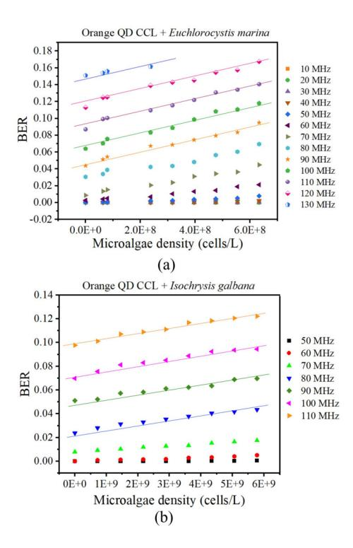

Fig. 8. (a) BER versus microalgae density by using *E. marina* and the orange QD CCL. (b) BER versus microalgae density by using *I. galbana* and the orange QD CCL.

As the density of microalgae increases, the transmitted yellow light becomes progressively blurred. Correspondingly, the received optical power from the yellow QD CCL is observed to decrease gradually with the rise in microalgae density. During the measurement process, the blue LED is controlled at a current of 20 mA and a voltage of 3.5 V to ensure a stable emission. The light source is positioned 1 cm away from the microalgae sample, while the PD is placed 2 cm behind the microalgae sample. The microalgae container measures 0.1 cm in thickness, 2 cm in width, and 4 cm in length. The ambient temperature throughout the measurement is approximately 22 ◦C. To prevent contamination, the microalgal solution is kept in a closed, transparent container during the measurement process.

## VI. RESULTS AND DISCUSSION

## *A. Measurement and Calculation*

To assess the impact of microalgae density on communication performance, BER is measured across various data rates at eight calibrated levels of microalgae density. In Fig. [8\(a\),](#page-5-2) the orange QD CCL is utilized as the light converter, with *E. marina* serving as the subject of observation. As microalgae density increases, the BER also increases, showing an approximately linear trend. Additionally, higher communication data rates correlate with increased BER values. In Fig. [8\(a\),](#page-5-2) the data rate spans from 10 to 130 MHz. For data rates below 50 MHz, variations in BER are minimal and not easily discernible. However, when the data rate is between 60 and 80 MHz, the rate of increase in BER varies with changes in microalgae density across different data rates. Consequently, we focus on 

{6}------------------------------------------------

analyzing and fitting the BER values corresponding to data rates above 90 MHz. To capture the linear trend of BER under various microalgae densities, a linear equation with a single variable of  $X_D$  is selected for the fitting process

$$F_B = \alpha + \left[ k_1(S_p, X_C) X_D + B_1(S_p, X_C, X_{DR}) \right]$$
 (2)

where  $F_B$  represents the dependent variable of BER and  $X_D$  indicates the variable of microalgae density.  $k_1(S_p, X_C)$  is the slope of the linear relationship, which depends on the species of microalgae  $(S_p)$  and the type of QD CCL.  $B_1(S_p, X_C, X_{DR})$  is the value of BER when the microalgae density equals zero, and it depends on the selected types of QD CCL and microalgae.  $\alpha$  indicates the adjustment coefficient for  $F_B$ . The purpose of setting  $\alpha$  is to minimize the influence of system errors on the measured BER results. We assume that system errors uniformly affect BER values across various data rates. Consequently,  $\alpha$  can be evaluated using the following method:

$$\alpha = B_0 - B_{M0} \tag{3}$$

where  $B_0$  is the calibrated BER when microalgae density equals zero and  $B_{M0}$  is the fit BER of measured data when the microalgae density equals zero. If  $B_0$  is larger than  $B_{M0}$ , then  $\alpha$  is positive, indicating that the measured BERs for unknown microalgal solutions are relatively higher than those measured during the training process. Conversely, if  $\alpha$  is negative, it suggests that the measured BER values are lower than those obtained during the training process. Utilizing the parameter  $\alpha$ , the variation in measured BER can be reduced between two independent measurements.

Similar measurements are also conducted with *I. galbana*, as depicted in Fig. 8(b). Unlike the results in Fig. 8(a), the highest BER in Fig. 8(b) is observed only at 110 MHz, which can be attributed to differences in the microalgae species and density gradient. For the fitting lines in Fig. 8(a) and (b), the corresponding values of  $k_1(S_p, X_C)$  are  $7.64 \times 10^{-11}$  and  $4.29 \times 10^{-12}$ , respectively. The slope of the fit lines shows a high degree of consistency, which greatly benefits the subsequent measurements. The BER versus microalgae densities exhibits a more linear trend compared to the optical density versus cell count observed in previous studies [37], suggesting that BER-based measurement is comparable or superior to optical density-based methods.

To further elucidate the expression of  $B_1(S_p, X_C, X_{DR})$ , the relationship between BER and data rate for E. marina and I. galbana is assessed in Fig. 9(a) and (b), under conditions where the microalgae density equals zero. As illustrated in Fig. 9(a), BER increases with the increase in data rate but follows a nonlinear trend, particularly when the data rate is below 50 MHz. This nonlinear trend in BER is consistent with findings from other studies on VLC systems [38]. According to the Shannon–Hartley theorem [39], the channel capacity in communication, which represents the upper boundary of data transmission, is influenced by three key factors: modulation bandwidth, signal power, and noise power. To verify the nonlinear relationship between BER and optical power, BER measurements under various driving currents are taken with blue light at a frequency of 150 MHz at a density of  $2.17 \times 10^9$ cells/L for *I. galbana*. As shown in Fig. 9(c), when the driving

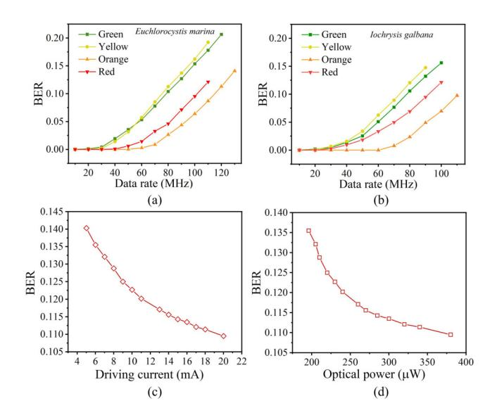

Fig. 9. (a) BER versus data rate with *E. marina* under various light colors. (b) BER versus data rate with *I. galbana* under various light colors. (c) BER versus driving current of the blue LED chip. (d) BER versus optical power of the blue LED chip.

current of the blue LED increases, the optical power output from the blue LED also increases, leading to a decrease in BER. By monitoring the optical power of the blue LED across various driving currents, the direct impact of the optical power on BER is obtained in Fig. 9(b). A similar nonlinear trend between BER and optical power can be observed when using light of other colors.

As the optical power increases from 200 to 380  $\mu$ W, the BER decreases nonlinearly from 0.13 to 0.11. Furthermore, a nonlinear relationship is observed between the modulation frequency and the intensity of the response in Fig. 6, particularly in the lower frequency range. In other words, when the data rate increases, the optical emission of the blue LED chip may not be able to match the increased modulation speed. This discrepancy can lead to a nonlinear increase in BER.

Additionally, an unexpected observation in Fig. 9(a) and (b) is that the BER for red light is relatively lower compared to that of green and yellow light. Given the lower quantum yield and bandwidth associated with red light, one would expect it to exhibit the highest BER across various data rates. However, this counterintuitive finding is attributed to the relatively higher BER observed for green and yellow light when the microalgae density is zero. This phenomenon will be further explored in Fig. 10. Additionally, when the data rate exceeds 60 MHz, the BER exhibits an approximately linear increase with the rise in data rate. Similar to the approach in (2), a linear equation with a single variable of  $X_{DR}$  can be selected for fitting, by using a portion of subset of discrete data points in Fig. 9(a) and (b)

$$B_1(S_p, X_C, X_{DR}) = k_2(S_p, X_C)X_{DR} + B_2(S_p, X_C)$$
 (4)

where  $k_2(S_p, X_C)$  represents the slope of the linear line, which depends on the species of microalgae  $S_p$  and the type of QD CCL.  $B_2(S_p, X_C)$  denotes the value of BER when the data rate equals zero, a condition that does not hold prac-

{7}------------------------------------------------

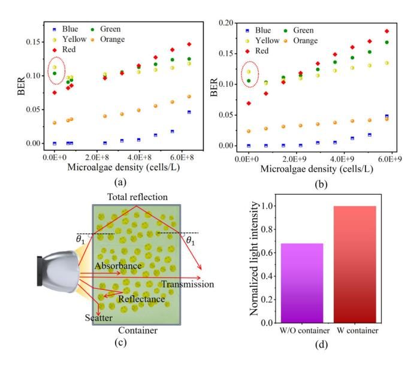

Fig. 10. (a) BER versus microalgae density using *E. marina* and QD CCLs in various colors. (b) BER versus microalgae density using *I. galbana* and QD CCLs in various colors. (c) Schematic of light transmission through the microalgae container. (d) Simulation results of received light intensity with and without a container.

tical physical significance. When the linearity of all curves for  $B_1(S_p, X_C, X_{DR})$  is comparable, a representative value of  $k_2(S_p, X_C)$  can be determined for  $B_1(S_p, X_C, X_{DR})$ .

Except for orange light, lights of other colors are utilized in microalgae density measurements. In Fig. 10(a), the BER of blue light is the lowest compared to others under various microalgae densities, attributed its rapid frequency response and high optical power. After light conversion, orange light shows a relatively lower BER among all the converted lights. BERs for green, yellow, orange, and red lights can predominantly be modeled with linear functions. However, the BER of blue light distinctly demonstrates a nonlinear trend across different microalgae densities, as shown in Fig. 10(a) and (b). This trend is likely influenced by the strong absorption of blue light by microalgae, as evidenced by the results in Fig. 3. Additionally, anomalous BER values for green and yellow lights are highlighted with red-dot curves in Fig. 10(a) and (b). The BER for green and yellow lights, when measured at a microalgae density of zero, is relatively higher than that at lower microalgae densities. As depicted in Fig. 10(c), this phenomenon can be ascribed to the combined effect of absorption, reflection, and scattering of light by microalgae cells. The container will restrict the lateral escape of some light due to the principle of total internal reflection. When the light containment effect of the container surpasses the extinction effect of microalgae, there is a slight increase in received optical power. Conversely, when light traverses through the microalgae container, the received optical power slightly decreases. The final transmitted light is influenced by parameters such as the dimension of algal cells, the metabolites within algal cells, and the morphology of algal cells.

To verify the effect of the microalgae container on the transmitted light beam, ray tracing simulations are conducted.

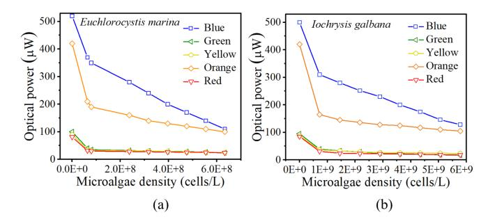

Fig. 11. (a) Optical power versus microalgae density using *E. marina* and QD CCLs in various colors. (b) Optical power versus microalgae density using *I. galbana* and QD CCLs in various colors.

These simulations model the transmitting process involving a Lambertian light source, a receiver, and a plastic-textured container filled with liquid. The simulation results, as depicted in Fig. 10(d), show that the intensity of the received light is significantly higher when the container is present as opposed to when there is no container. In other words, using a container with low-density microalgae alters the light path from the LED, thereby increasing the light intensity received by the PD and consequently reducing the detected BER. The simulation results in Fig. 10(c) and (d) clearly explain the observed phenomena indicated by the dot-line-shaped red circles in Fig. 10(a) and (b).

The optical powers of various OD CCLs are measured under different densities of microalgae for both E. marina and I. galbana samples using a power meter (SANWA LP-10). As depicted in Fig. 11(a) and (b), a consistent decrease in optical power is observed as the density of microalgae increases. Blue light exhibits the highest optical power of 520  $\mu$ W when it is not passed through E. marina samples. However, when blue light traverses E. marina samples of varying densities, there is a linear decline in optical power. Among light of different colors, blue light maintains the highest optical power since it is not subject to conversion by QD CCLs. Excluding blue light, the light converted by the orange QD CCL also exhibits higher optical power compared to other converted colors, which can be attributed to the high quantum yield of the orange QD CCL. The rate of decrease in blue light intensity is greater than that of other colors, due to the high absorbance of blue light by the microalgal solution, as evidenced by the results in Fig. 3. Green, yellow, and red light show similar trends in optical power variation under varying microalgae densities. Among other colors, red light exhibits the lowest optical power and a relatively mild decreasing trend as microalgae density increases. This can be attributed to the combined effect of its lowest quantum yield [see Fig. 5(c)] and the low absorbance of red light by the microalgae solution (Fig. 3).

#### B. Accuracy Assessment

The accuracy of the proposed method is validated by measuring microalgal solutions with unknown densities. After the calculations, the determined microalgae densities are compared to those obtained using the conventional counting

{8}------------------------------------------------

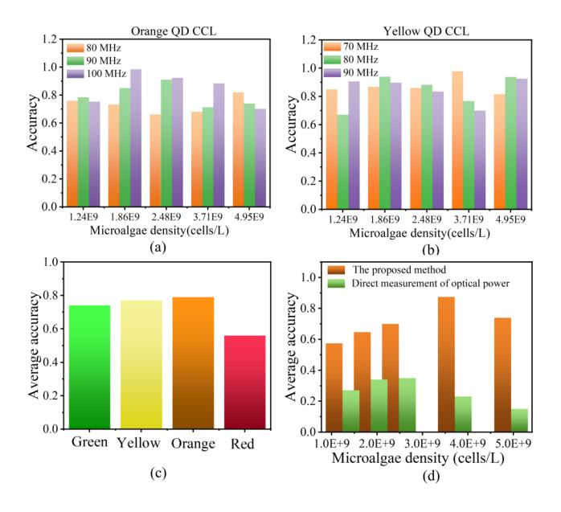

Fig. 12. Measurement accuracy of the proposed method by using (a) orange and (b) yellow QD CCLs under various data rates (*I. galbana*). (c) Average accuracy of the proposed method by using green, yellow, orange, and red QD CCLs. (d) Average accuracy of the proposed method and the method by directly measuring the optical power (evaluated by using green light).

method. According to [\[40\]](#page-10-31) and [\[41\],](#page-10-32) the accuracy is defined as follows:

$$Accuracy = 1 - \frac{|M_D - C_D|}{M_D}$$
 (5)

where *MD* and *CD* represent the measured and calculated densities, respectively. Green, yellow, orange, and red lights are all utilized as light sources for the measurements. As illustrated in Fig. [12\(a\),](#page-8-0) the accuracy is assessed at 80, 90, and 100 MHz using orange light with the same fitting slope. The highest accuracy reaches 0.98 when a data rate of 100 MHz is utilized in evaluation. The accuracy achieved by the proposed method is comparable or even superior to other microalgae density measurement techniques [\[15\].](#page-10-6) The average accuracy measured at 80 MHz is comparatively lower than at other data rates. When yellow light is used for measurement, the fitting range is adjusted to 70–90 MHz due to the difference in modulation speed of yellow light. As shown in Fig. [12\(d\),](#page-8-0) the values of accuracy are similar to those of Fig. [12\(a\).](#page-8-0) To assess the reliability of the proposed method under various light conditions, Fig. [12\(c\)](#page-8-0) presents a comparison of the average accuracy of green, yellow, orange, and red-light sources. Measurements using orange light possess the highest average accuracy of 0.79 among others, while the lowest average accuracy of 0.56 is associated with red light. The unsatisfactory performance of red light can be directly attributed to its slow modulation response (as shown in the red curve in Fig. [6\)](#page-4-3), which causes an apparent increase in BER throughout the measurement. This increase enhances the instability of BER measured under various microalgae densities. Another factor is the relatively low absorbance of microalgae to red light (as shown in Fig. [3\)](#page-3-0), which decreases the sensitivity of red light to the measured BER results.

In this study, we use the conventional counting method as a benchmark to ascertain the accuracy of the proposed method. To further assess the proposed method, the average accuracy of the proposed method is compared against a method that directly measures the varying optical power of green light across various microalgae densities. In Fig. [12\(d\),](#page-8-0) there is a noticeable increasing trend in average accuracy from 0.57 to 0.87 as the microalgae density increases. However, this value drops to 0.74 when the microalgae density continues to increase. The low accuracy under low microalgae densities can be attributed to the instability of BER in response to changes in microalgae density when the density is particularly low. Conversely, at high microalgae densities, the significant decrease in optical power greatly enhances BER, resulting in the nonlinearity of the slope *k*1(*S p*, *XC*) in [\(2\).](#page-6-1) These factors collectively contribute to the reduced accuracy in measurements obtained by directly measuring the emitted optical power that passes through the microalgal solution. Compared to the proposed method, the direct optical power measurement method exhibits relatively lower average accuracy, with the highest accuracy reaching only 0.35. This phenomenon is caused by the inevitable variation of optical power during measurement, which can be affected by system errors. The validation results demonstrate the feasibility of the proposed method, particularly with small ac signals. Additionally, orange light has been found to offer high linearity during measurements, making it an optimal choice for a light source in calculating microalgae density.

#### *C. Discussion of the Proposed Method*

QD-based LEDs offer various advantages in microalgae density measurement. In addition to surpassing commercial inorganic LEDs, incandescent and fluorescent lamps, and fluorescent material-based LEDs, QD-based LEDs also outperform laser diodes in this specific application: 1) QD-base LEDs are more cost-effective and can simultaneously fulfill both illumination and communication requirements; 2) due to the narrow beam of laser diodes, a significant drop is observed when the laser beam penetrates through high-density microalgal solution, resulting in a drastic increase in BER; and 3) the measured BER exhibits a nonlinear relationship with microalgae density, primarily due to the significant impact of light scattering on the detected light spot size emitted by the laser diode. Thus, the use of QD-based LEDs emerges as the optimal technique for creating a continuously tunable monochromatic light source, making it highly suitable for microalgae density assessment.

The proposed method offers several contributions.

- 1) Compared to conventional methods for measuring microalgae density, the proposed method is contactless, eco-friendly, and offers convenience in automatic measurement without the need for sampling or risking contamination of the original microalgal solution.
- 2) Unlike dc signal detection, the proposed method employs small ac signal monitoring when detecting shifts in light. This method provides a sensitive response to the variation in light intensity and enables simultaneous illumination, sensing, and communication.

{9}------------------------------------------------

- 3) It offers high flexibility in color tunability, which significantly benefits the culturing and measurement of microalgae across various densities and facilitates communication at various speeds. It also demonstrates the impact of differences between light colors in optical measurements.
- 4) It achieves high accuracy across a wide range of densities. Calculation and evaluation steps are adopted to validate the accuracy of microalgae density measurement. These results can feedback to the training process to guide the calibration for the expressions of [\(2\)](#page-6-1) and [\(3\).](#page-6-2)
- 5) The calculation results for microalgae density are unaffected by changes in light color, communication data rate, BER, and problems such as surface depression in test samples.
- 6) It provides a comprehensive study on microalgae density measurement. These studies are expected to greatly benefit further studies on distributed testing in microalgae density and may potentially be integrated into marine intelligent sensing-communication systems.

The accuracy of the proposed method is mainly affected by four factors, including the microalgae pigment, microalgae density range, data rate in communication, and the QD species. First, the pigment content of microalgae is determined by their species and growth stage, which influences their light absorption characteristics. Different pigment contents in microalgae result in different small-signal light powers and BER values. These differences in turn affect the fluctuation range of BER, thereby impacting the accuracy of the measurements. Second, the accuracy varies with the testing microalgae density ranges. Since low-density microalgae are more sensitive to light, the BER fluctuates more significantly. In contrast, high-density microalgae absorb more light, which greatly reduces the light signal strength for testing. Therefore, samples with intermediate microalgae densities tend to achieve higher accuracy. Third, the choice of data rate has a significant impact on the accuracy results. Using a lower data rate for measurement results in a lower BER; however, the slope of BER variation with microalgae density is flatter. This means that a small change in BER can lead to a large fluctuation in the calculated microalgae density, thereby reducing accuracy. Finally, the accuracy varies with different colored QDs. For example, orange QDs have a higher light emission intensity, resulting in a lower BER during testing and better linearity across different microalgae densities, both of which are factors that improve accuracy.

Thus, subsequent research should focus on several key aspects: 1) investigate the impact of varying wavelengths on microalgae growth, thereby informing the construction of an intricate system designed for microalgae cultivation, sensing, and communication, utilizing diverse wavelength combinations; 2) initiate a comprehensive study on the materials and configurations of measurement vessels to enhance the microalgae density quantification accuracy, particularly in customized photobioreactors; and 3) investigate the impact of color variability in microalgae pigments and biochemical composition on the accuracy of microalgae density evaluation, and optimize the algorithm for microalgae density assessment.

## VII. CONCLUSION

In this study, a VLSC system is proposed for calculating the densities of *E. marina* and *I. galbana* samples using green-, yellow-, orange-, and red-color QD CCLs. During the training process, BER is utilized as an indicator to reflect the variations in microalgae density across various data rates and light colors, employing a linear fitting technique. With the deduced linear expressions, microalgae density can be directly inferred from VLSC measurements. Among all light sources, orange light exhibits superior linearity, high optical power, and rapid response in both communication and deduction of microalgae density. In verification, the highest accuracy of 0.98 and the average accuracy of 0.79 are achieved for *I. galbana* samples using orange light. The high feasibility and color tunability of the proposed method offer significant advantages in light sensing, microalgae density evaluation, and signal transmission. The proposed method is potentially to be applied in integrated intelligent illumination–sensor–communication systems for microalgae cultivation and marine environmental assessment.

#### ACKNOWLEDGMENT

The authors would like to thank the Institute of Nanoscience and Applications, Department of Electrical and Electronic Engineering, Southern University of Science and Technology, Shenzhen, China, and the Key Laboratory for Special Functional Materials of Ministry of Education, National and Local Joint Engineering Research Center for High-Efficiency Display and Lighting Technology, Henan University, Kaifeng, China.

## REFERENCES

- [\[1\]](#page-0-0) D. K. Nguyen, L. Nguyen, and D. Viet Le, "A low-cost efficient system for monitoring microalgae density using Gaussian process," *IEEE Trans. Instrum. Meas.*, vol. 70, pp. 1–8, 2021.
- [\[2\]](#page-0-1) A. Maghzian, A. Aslani, and R. Zahedi, "A comprehensive review on effective parameters on microalgae productivity and carbon capture rate," *J. Environ. Manage.*, vol. 355, pp. 1–16, Mar. 2024.
- [\[3\]](#page-0-2) R. Barboza-Rodr´ıguez, R. M. Rodr´ıguez-Jasso, G. Rosero-Chasoy, M. L. Rosales Aguado, and H. A. Ruiz, "Photobioreactor configurations in cultivating microalgae biomass for biorefinery," *Bioresource Technol.*, vol. 394, pp. 1–14, Feb. 2024.
- [\[4\]](#page-0-3) L. Porras Reyes, I. Havlik, and S. Beutel, "Software sensors in the monitoring of microalgae cultivations," *Rev. Environ. Sci. Bio*/*Technol.*, vol. 23, no. 1, pp. 67–92, Mar. 2024.
- [\[5\]](#page-0-4) J. Jin and Y. Quan, "Assessment of marine ranching ecological development using DPSIR-TOPSIS and obstacle degree analysis: A case study of Zhoushan," *Ocean Coastal Manage.*, vol. 244, pp. 1–15, Oct. 2023.
- [\[6\]](#page-0-5) H. R. Lim, K. S. Khoo, W. Y. Chia, K. W. Chew, S.-H. Ho, and P. L. Show, "Smart microalgae farming with Internet-of-Things for sustainable agriculture," *Biotechnol. Adv.*, vol. 57, pp. 1–13, Jul. 2022.
- [\[7\]](#page-0-6) A. B. Socorro-Leranoz, K. I. Aginaga-Etxamendi, S. D ´ ´ıaz, A. Urrutia, I. D. Villar, and I. R. Matias, "Monitoring of water freeze–thaw cycle by means of an etched single- mode–multimode–single-mode fiber-optic refractometer," *IEEE Sensors J.*, vol. 23, no. 12, pp. 12889–12898, Jun. 2023.
- [\[8\]](#page-0-7) M. S. P. E. Silva, H. P. Alves, H. J. B. De Oliveira, L. H. V. Leao, ˜ J. F. D. Nascimento, and J. F. Martins-Filho, "Temperature, refractive index, and corrosion simultaneous monitoring using Raman anti-Stokes reflectometric optical fiber sensor," *IEEE Trans. Instrum. Meas.*, vol. 72, pp. 1–8, 2023.

{10}------------------------------------------------

- [\[9\]](#page-0-8) W. K. Wong, Y. J. Teoh, F. H. Juwono, J. Ling, and S. Y. Lau, "Microalgal density and mass estimation using low-cost spectrometer: NIR-VIS modeling with evolutionary optimization," *IEEE Sensors Lett.*, vol. 8, no. 11, pp. 1–4, Nov. 2024.
- [\[10\]](#page-0-9) C.-H. Ra, C.-H. Kang, J.-H. Jung, G.-T. Jeong, and S.-K. Kim, "Effects of light-emitting diodes (LEDs) on the accumulation of lipid content using a two-phase culture process with three microalgae," *Bioresource Technol.*, vol. 212, pp. 254–261, Jul. 2016.
- [\[11\]](#page-0-10) N. Pang, X. Fu, J. S. M. Fernandez, and S. Chen, "Multilevel heuristic LED regime for stimulating lipid and bioproducts biosynthesis in haematococcus pluvialis under mixotrophic conditions," *Bioresource Technol.*, vol. 288, pp. 1–8, Sep. 2019.
- [\[12\]](#page-0-11) D. Da Fontoura Prates et al., "Role of light emitting diode (LED) wavelengths on increase of protein productivity and free amino acid profile of spirulina sp. Cultures," *Bioresource Technol.*, vol. 306, pp. 1–5, Jun. 2020.
- [\[13\]](#page-0-12) N. A. M. Jais, A. F. Abdullah, M. S. M. Kassim, M. M. A. Karim, M. Abdulsalam, and N. Muhadi, "Improved accuracy in IoT-based water quality monitoring for aquaculture tanks using low-cost sensors: Asian seabass fish farming," *Heliyon*, vol. 10, no. 8, Apr. 2024, Art. no. e29022.
- [\[14\]](#page-1-1) M. I. H. Zaidi Farouk, Z. Jamil, and M. F. Abdul Latip, "Towards online surface water quality monitoring technology: A review," *Environ. Res.*, vol. 238, Dec. 2023, Art. no. 117147.
- [\[15\]](#page-1-2) D. K. Nguyen, H. Q. Nguyen, H. T. T. Dang, V. Q. Nguyen, and L. Nguyen, "A low-cost system for monitoring pH, dissolved oxygen and algal density in continuous culture of microalgae," *HardwareX*, vol. 12, Oct. 2022, Art. no. e00353.
- [\[16\]](#page-1-3) D. Morgado, A. Fanesi, T. Martin, S. Tebbani, O. Bernard, and F. Lopes, "Non-destructive monitoring of microalgae biofilms," *Bioresource Technol.*, vol. 398, pp. 1–10, Apr. 2024.
- [\[17\]](#page-1-4) V. A. Thiviyanathan et al., "Microalgae biomass and biomolecule quantification: Optical techniques, challenges and prospects," *Renew. Sustain. Energy Rev.*, vol. 189, pp. 1–22, Jan. 2024.
- [\[18\]](#page-1-5) P. Wungmool, N. Rangsi, T. Hormwantha, M. Sutthiopad, and C. Luengviriya, "Measurement of the cell density of microalgae by an optical method," *J. Phys., Conf. Ser.*, vol. 1298, no. 1, Aug. 2019, Art. no. 012005.
- [\[19\]](#page-1-6) P. Lopez-Exposito, C. Negro, and A. Blanco, "Direct estimation of microalgal flocs fractal dimension through laser reflectance and machine learning," *Algal Res.*, vol. 37, pp. 240–247, Jan. 2019.
- [\[20\]](#page-1-7) G. Fekete et al., "Comparative analysis of laboratory-based and spectroscopic methods used to estimate the algal density of chlorella vulgaris," *Microorganisms*, vol. 12, no. 6, pp. 1–22, May 2024.
- [\[21\]](#page-1-8) D. M. Madkour, M. I. Shapiai, S. E. Mohamad, H. H. Aly, Z. H. Ismail, and M. Z. Ibrahim, "A systematic review of deep learning microalgae classification and detection," *IEEE Access*, vol. 11, pp. 57529–57555, 2023.
- [\[22\]](#page-1-9) W. Wang, W. Tian, F. Chen, J. Wang, W. Zhai, and L. Li, "Filterless color-selective photodetector derived from integration of parallel perovskite photoelectric response units," *Adv. Mater.*, vol. 36, no. 33, pp. 1–9, Jun. 2024.
- [\[23\]](#page-1-10) H. Xiao, X. Xiao, D. Wu, R. Wang, K. Wang, and K. S. Chiang, "Effects of injection current on the modulation bandwidths of quantum-dot light-emitting diodes," *IEEE Trans. Electron Devices*, vol. 66, no. 11, pp. 4805–4810, Nov. 2019.
- [\[24\]](#page-1-11) J. Jargus et al., "Measurement of the effect of luminescent layer parameters on light and communication properties," *IEEE Trans. Instrum. Meas.*, vol. 72, pp. 1–16, 2023.
- [\[25\]](#page-1-12) S. Alshaibani et al., "Wide-field-of-view optical detectors for deep ultraviolet light communication using all-inorganic CsPbBr3 perovskite nanocrystals," *Opt. Exp.*, vol. 31, no. 16, pp. 25385–25397, Jul. 2023.
- [\[26\]](#page-1-13) Z. Li et al., "Synthesis and evaluation of ideal core/shell quantum dots with precisely controlled shell growth: Nonblinking, single photoluminescence decay channel, and suppressed FRET," *Chem. Mater.*, vol. 30, no. 11, pp. 3668–3676, Jun. 2018.
- [\[27\]](#page-1-14) N. Li et al., "Room-temperature synthesis of CdS quantum dots towards efficient single-phase white light-emitting diode phosphors," *Ceram. Int.*, vol. 51, no. 8, pp. 9730–9739, Mar. 2025.
- [\[28\]](#page-1-15) F. Li et al., "Euchlorocystis marina sp. Nov. (oocystaceae, trebouxiophyceae), a new species of green algae from a seawater shrimp culture pond," *Diversity*, vol. 14, no. 2, p. 119, Feb. 2022.
- [\[29\]](#page-1-16) M. Wu et al., "Impact of three phycospheric bacterial strains on the growth and fatty acid composition of isochrysis galbana," *Algal Res.*, vol. 74, Jul. 2023, Art. no. 103183.

- [\[30\]](#page-2-3) X. Rui et al., "Effects of different nitrogen concentrations on coproduction of fucoxanthin and fatty acids in conticribra weissflogii," *Mar. Drugs*, vol. 21, no. 2, pp. 1–12, Feb. 2023.
- [\[31\]](#page-3-3) T. Grønseth et al., "Lugol's solution eradicates Staphylococcus aureus biofilm in vitro," *Int. J. Pediatric Otorhinolaryngology*, vol. 103, pp. 58–64, Dec. 2017.
- [\[32\]](#page-3-4) S. K. Tulashie and S. Salifu, "Potential production of biodiesel from green microalgae," *Biofuels*, vol. 11, no. 2, pp. 201–208, Jul. 2017.
- [\[33\]](#page-4-4) Y.-S. Park, J. Lim, and V. I. Klimov, "Asymmetrically strained quantum dots with non-fluctuating single-dot emission spectra and subthermal room-temperature linewidths," *Nature Mater.*, vol. 18, no. 3, pp. 249–255, Mar. 2019.
- [\[34\]](#page-4-5) H. Zhang, Q. Su, and S. Chen, "Suppressing Forster resonance ¨ energy transfer in close-packed quantum-dot thin film: Toward efficient quantum-dot light-emitting diodes with external quantum efficiency over 21.6%," *Adv. Opt. Mater.*, vol. 8, no. 10, pp. 1–7, May 2020.
- [\[35\]](#page-5-3) A. Soni, L. Pulikkool, R. Mulaveesala, S. K. Dubey, and D. S. Mehta, "Multi-color phosphor-converted wide spectrum LED light source for simultaneous illumination and visible light communication," *Photonics*, vol. 11, no. 10, pp. 1–18, Sep. 2024.
- [\[36\]](#page-5-4) D. Kim et al., "Visible-light communication with lighting: RGB wavelength division multiplexing OLEDs/OPDs platform," *Adv. Mater.*, vol. 36, no. 4, pp. 1–10, Jan. 2024.
- [\[37\]](#page-6-3) S. L. Nielsen and B. W. Hansen, "Evaluation of the robustness of optical density as a tool for estimation of biomass in microalgal cultivation: The effects of growth conditions and physiological state," *Aquaculture Res.*, vol. 50, no. 9, pp. 2698–2706, Jun. 2019.
- [\[38\]](#page-6-4) Z. Chen et al., "Experimental demonstration of over 14 AL underwater wireless optical communication," *IEEE Photon. Technol. Lett.*, vol. 33, no. 4, pp. 173–176, Feb. 1, 2021.
- [\[39\]](#page-6-5) Y. Zhang, L. Wang, K. Wang, K. S. Wong, and K. Wu, "Recent advances in the hardware of visible light communication," *IEEE Access*, vol. 7, pp. 91093–91104, 2019.
- [\[40\]](#page-8-1) Y. Zhao, Y. Chen, and Y. Zhou, "Novel mechanical models of tensile strength and elastic property of FDM AM PLA materials: Experimental and theoretical analyses," *Mater. Design*, vol. 181, Nov. 2019, Art. no. 108089.
- [\[41\]](#page-8-2) J. Xiong, F. Yu, C. Fu, J. Dong, and Q. Liu, "Evaluation and improvement of the ERA5 wind field in typhoon storm surge simulations," *Appl. Ocean Res.*, vol. 118, pp. 1–11, Jan. 2022.

Hua Xiao (Member, IEEE) received the M.Sc. degree in condensed matter physics from Xiamen University, Fujian, China, in 2014, and the Ph.D. degree in electric engineering from the City University of Hong Kong, Hong Kong, China, in 2020.

She is currently a Lecturer and a Research Supervisor with the School of Electronic Information Engineering, Guangdong Ocean University, Zhanjiang, China. Her current research interests include nanocrystal-based illumination devices, visible-light communication, and optical spectrum optimization.

Dr. Xiao was a reviewer of IEEE PHOTONICS JOURNAL and *Chinese Journal of Luminescence*.

{11}------------------------------------------------

Wensong Wang (Senior Member, IEEE) received the Ph.D. degree from Nanjing University of Aeronautics and Astronautics, Nanjing, China, in 2016.

From 2013 to 2015, he was a Visiting Scholar at the University of South Carolina, Columbia, SC, USA. From 2017 to 2024, he was a Research Fellow and Senior Research Fellow with Nanyang Technological University, Singapore. He is currently a Full Professor with the National Key Laboratory of Microwave Imaging, Aerospace Information Research Institute, Chinese Academy of Sciences,

Beijing, China. His research interests include aerospace information radar technology.

Dr. Wang is/was an Associate Editor of *IEEE Geoscience and Remote Sensing Magazine*, IEEE INTERNET OF THINGS JOURNAL, IEEE TRANS-ACTIONS ON VEHICULAR TECHNOLOGY, IEEE SENSORS JOURNAL, and *IET Microwaves, Antennas and Propagation*.

Kuokuo Zhang received the B.S. degree from Nanjing University of Posts and Telecommunications, Nanjing, China, in 2019, and the M.S. degree from Shenzhen University, Shenzhen, China, in 2022.

He is currently an Engineer with Shenzhen Institute of Artificial Intelligence and Robotics for Society (AIRS), Shenzhen. His research interests include underwater optical wireless communications and all-optical communication devices.

Feng Li received the B.S. degree from Jimei University, Xiamen, China, in 2011, the M.S. degree from Guangdong Ocean University, Zhanjiang, China, in 2014, and the Ph.D. degree in marine biotechnology from Xiamen University, Xiamen, in 2019.

He has more than ten years of research and development experience in algae classification, marine microalgae resource development and utilization, and microalgae mass culture technology. He is currently a Lecturer with the College of Fisheries, Guangdong Ocean University. His research interests

include marine microalgae resource development and utilization, microalgae biotechnology, and microalgae-based wastewater treatment.

Caiming Sun (Senior Member, IEEE) received the B.S. and M.S. degrees from Beijing Normal University, Beijing, China, in 2002 and 2005, respectively, and the Ph.D. degree in electronic engineering from The Chinese University of Hong Kong (CUHK), Hong Kong, in 2008.

He has over ten years of research and development experience, supported by NSFC and HK ITF. His work covers optical communications, nanophotonics, nanofabrication, and wearable electronics. He is currently a Research Associate Professor with

Shenzhen Institute of Artificial Intelligence and Robotics for Society (AIRS), School of Science and Engineering, The Chinese University of Hong Kong, Shenzhen, China. His current research interests include LiDAR technologies for robotics, optical wireless communications, and silicon photonics.