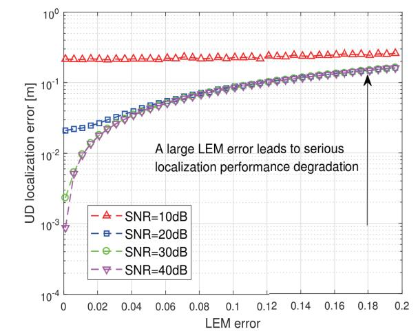
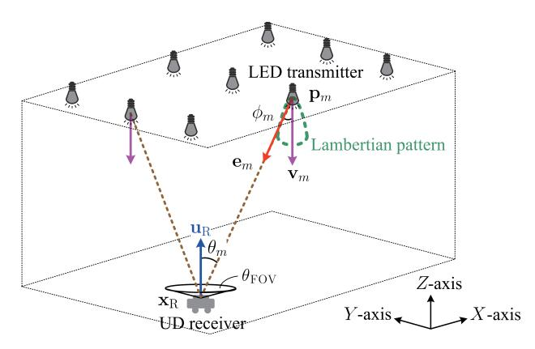
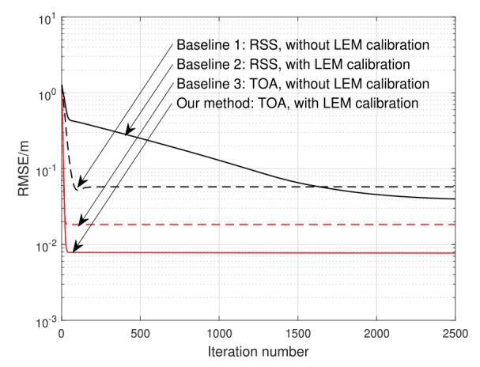
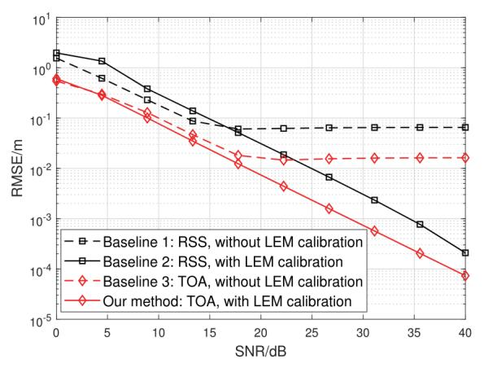
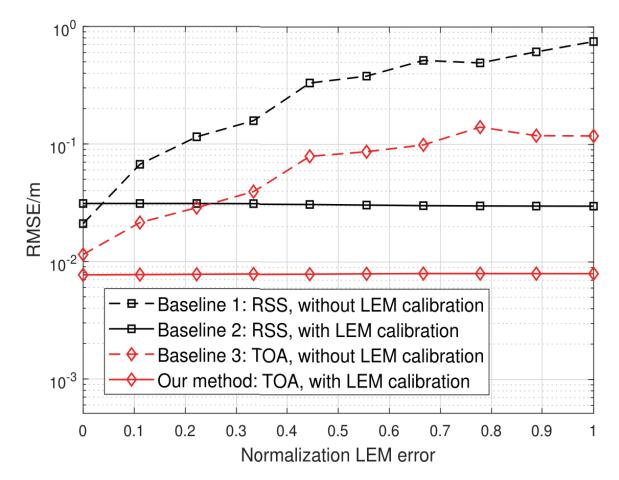
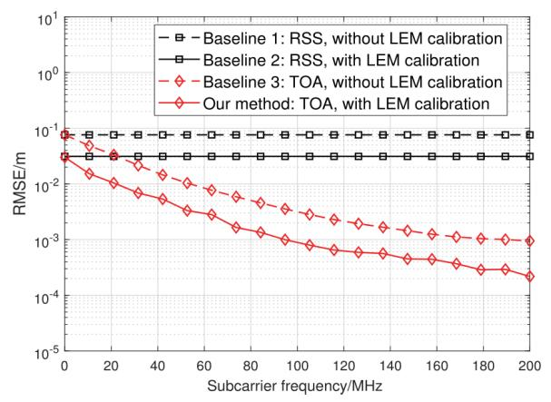

{0}------------------------------------------------

# Joint Lambertian Model Calibration and Positioning of Photodiode Devices towards Integrated Optical Wireless Communication and Sensing

Guangsen Chen, Yueqian Yan, Xin Wang, Zilong Liu, and Bingpeng Zhou\*

Abstract—Visible light-based positioning (VLP) is indispensable for integrated sensing and communication in optical wireless networks. Conventional VLP methods require an accurate Lambertian emission model (LEM) with fixed parameters. However, this is hard to be met in practice due to inevitable measurement errors, and thus a small LEM error will lead to serious VLP performance loss. To solve this issue, a joint LEM calibration and positioning (JCAP) scheme is proposed. As the JCAP problem is non-convex in nature, a majorization minimizationbased joint optimization method is developed to exploit hiddenconvex substructures of system models, thus yielding a tractable JCAP scheme. Moreover, the impact of system parameters (e.g., carrier frequency, initial LEM error and noise) on the VLP performance is revealed, which is useful for efficient VLP network development. It is verified by simulations that the proposed JCAP method outperforms the state-of-the-art VLP baselines due to our problem-specific joint LEM calibration mechanism design.

*Index Terms*—Lambertian emission model, visible light-based positioning, Integrated sensing and communication.

# I. INTRODUCTION

ITH rapid development of electronic information technologies, visible light communication-assisted positioning (VLP) using photodiodes has attracted widespread research attentions from both academia and industry in recent years [1]. Basically, the study of integrated VLP and optical wireless communication (OWC) is driven by its great potentials in boosting localization-aware applications for user devices (UDs), such as intelligent robotic navigation and autonomous vehicles [2], [3], where both data transmission and accurate localization are required.

A number of VLP methods have been developed, e.g., using received signal strength (RSS) [4]– [8], angle-of-arrival [9], and time-of-flight [10]. The key idea of these VLP detection approaches is to estimate UD location and orientation direction from received visible light signals, by leveraging the mapping from measurement signal space to UD location space [11]. Hence, a well-defined Lambertian emission model (LEM) with fixed and accurate parameters, e.g., emitting powers of light-emitting-diodes (LEDs), optical filtering gains of photodiodes

This work was supported by Major Talent Program of Guangdong Province under Grant 2021QN02X074, by Natural Science Foundation of Guangdong Province under Grant 2024A1515012259, and by National Natural Science Foundation of China under Grant 62371478.

G. Chen, Y. Yan, X. Wang and B. Zhou are with the School of Electronics and Communication Engineering, Sun Yat-sen University, Shenzhen 518000, China (email: zhoubp3@mail.sysu.edu.cn). Z. Liu is with with the School of Computer Science and Electronics Engineering, University of Essex, U.K. (email: zilong.liu@essex.ac.uk).

Fig. 1. UD localization error versus LEM error [12].

and large-scale path loss exponent, is required. However, due to inevitable errors in optical filtering gain specification and thermal noise, the LEM parameters are usually inaccurate, and a small LEM error may lead to a serious localization performance degradation [12], as shown in Fig. 1. Thus, it is desired to develop a novel VLP method to efficiently deal with LEM error for achieving an accurate localization solution.

In this paper, a OWC-based joint LEM calibration and positioning (JCAP) scheme is proposed to alleviate the disturbance from LEM errors. The optimization of JCAP, however, is challenging due to its non-convexity nature. In order to address this challenge, we propose a majorization minimization (MM)-based optimization method to exploit certain hiddenconvex substructures of the system model. This leads to an efficient JCAP solution, where the overall problem is solved by iterations of three subproblems including LEM calibration, response gain estimate and UD localization. To quantify the performance limits of the proposed JCAP method, the impact of system parameters, e.g., subcarrier frequency, initial LEM error, and signal-to-noise ratio (SNR), on the VLP performance is revealed. It is verified by numerical experiments that the proposed JCAP method outperforms the state-of-theart VLP baselines, due to our problem-specific joint LEM calibration mechanism design.

# II. SYSTEM MODEL

In this section, we elaborate the associated system setup and the visible light signal propagation model.

{1}------------------------------------------------

Fig. 2. Illustration of OWC-based JCAP system.

## A. System Setup

We consider a OWC-based JCAP system with a number of LEDs and one UD receiver equipped with a photodiode (PD), as shown in Fig. 2. Let M the number of LEDs. We assume that LEDs are modulated on different subcarriers such that their signals can be distinguished. Let  $\mathbf{p}_m \in \mathbb{R}^3$  and  $\mathbf{v}_m \in \mathbb{R}^3$  be the known location and orientation direction vectors of the mth LED, respectively, where  $\|\mathbf{v}_m\|_2 = 1$  for  $m = 1, \cdots, M$ . Let  $\mathbf{x}_R \in \mathbb{R}^3$  and  $\mathbf{u}_R \in \mathbb{R}^3$  be the unknown location and orientation vectors of the UD, subject to  $\|\mathbf{u}_R\|_2 = 1$ . Let  $\boldsymbol{\beta}_R = [\mathbf{x}_R; \mathbf{u}_R] \in \mathbb{R}^6$  be the joint vector of the UD state.

We adopt the received OWC signal waveform samples as measurement data for VLP. LED emitters will act as beacons to transmit visible lights, and the UD's photodiode will sense visible light signals for JCAP.

## B. Measurement Model

Let  $\mathbf{z}_m^{(t)} \in \mathbb{C}$  be the waveform sample of the tth symbol from the mth LED, for  $m=1,\cdots,M$  and  $t=1,\cdots,M_{\mathrm{S}}$ , where  $M_{\mathrm{S}}$  denotes the number of symbols. This sample depends on the LED-to-PD geometry. Given the UD location parameter  $\boldsymbol{\beta}_{\mathrm{R}}$ , the measurement sample  $\mathbf{z}_m$  is given by

$$\mathbf{z}_{m}^{(t)} = \mathbf{a}_{m}^{(t)} \mathbf{h}_{m}' \exp\left(-2\pi \iota f_{m} \tau_{m}\right) + \epsilon_{m}^{(t)}, \tag{1}$$

$$\mathbf{h}'_{m} = \mathbf{h}_{R} \frac{(\gamma + 1)(\cos(\phi_{m}))^{\gamma}\cos(\theta_{m})}{2\pi \|\mathbf{x}_{R} - \mathbf{p}_{m}\|_{2}^{\alpha}},$$
 (2)

$$\tau_m = \frac{\|\mathbf{x}_{\mathrm{R}} - \mathbf{p}_m\|_2}{c},\tag{3}$$

where  $\mathbf{a}_m^{(t)} \in \mathbb{C}$  is the tth pilot symbol with  $\mathbb{E}\{\|\mathbf{a}_m^{(t)}\|_2^2\} = 1$ ,  $\epsilon_m^{(t)} \in \mathbb{C}$  is measurement noise,  $\iota = \sqrt{-1}$  is the unit imaginary number,  $f_m$  is the mth LED's subcarrier frequency, and c denotes the speed of light. In addition,  $\mathbf{h}_{\mathrm{R}} \in \mathbb{C}$  is a joint parameter absorbing PD aperture and optical filtering gain,  $\gamma$  is the LED Lambertian order, and  $\alpha$  is the path-loss exponent, which are unknown. Furthermore,  $\phi_m$  is the radiation angle of the mth LED emitter to the UD, and  $\theta_m$  is the incidence angle from the mth LED, where

$$\phi_m = \arccos\left((\mathbf{e}_m)^\top \mathbf{v}_m\right),\tag{4}$$

$$\theta_m = \arccos\left(-\left(\mathbf{e}_m\right)^{\top}\mathbf{u}_{\mathrm{R}}\right),$$
 (5)

and  $e_m$  is given by

$$\mathbf{e}_m = \frac{\mathbf{x}_{\mathrm{R}} - \mathbf{p}_m}{\|\mathbf{x}_{\mathrm{R}} - \mathbf{p}_m\|_2}.$$
 (6)

For clarity, let  $\wp \in \mathbb{C}^3 = [\gamma, h_R, \alpha]$  be the collection of propagation parameters. It is nondeterministic in harsh environments, and thus brings great challenges to VLP.

Let  $\mathbf{z} \in \mathbb{C}^{M_{\mathrm{S}}M} = \text{vec}[\mathbf{z}_m^{(t)}|\forall m=1:M, \forall t=1:M_{\mathrm{S}}].$  Based on the above geometric relationship,  $\mathbf{z}$  is cast as

$$\mathbf{z} = \mathbf{g}(\boldsymbol{\wp}; \boldsymbol{\beta}_{\mathrm{R}}) + \boldsymbol{\epsilon},\tag{7}$$

where  $\mathbf{g}(\boldsymbol{\wp};\boldsymbol{\beta}_{\mathrm{R}})\in\mathbb{C}^{M_{\mathrm{S}}M}$  is the model function given by

$$\mathbf{g}(\boldsymbol{\wp}; \boldsymbol{\beta}_{\mathrm{R}}) = \mathsf{vec}[\mathbf{g}_{m}^{(t)}(\boldsymbol{\wp}; \boldsymbol{\beta}_{\mathrm{R}}) | \forall m = 1 : M, \forall t = 1 : M_{\mathrm{S}}],$$
$$\mathbf{g}_{m}^{(t)}(\boldsymbol{\wp}; \boldsymbol{\beta}_{\mathrm{R}}) = \mathbf{a}_{m}^{(t)} \mathbf{h}_{m}^{\prime} \exp\left(-2\pi \iota f_{m} \tau_{m}\right),$$

and  $\boldsymbol{\epsilon} \in \mathbb{C}^{M_{\mathrm{S}}M}$  is the zero-mean noise vector.

## III. THE PROPOSED JCAP ALGORITHM

In this section, we first present the problem formulation of JCAP, followed by our proposed solution.

## A. Problem Formulation

JCAP aims to acquire the UD location parameter  $\beta_R$  under unknown propagation parameter  $\wp$  using received visible light signal samples z, via the following optimization process,

$$\mathcal{P}_{\text{JCAP}}: \ \hat{\boldsymbol{\beta}}_{\text{R}} = \arg\min_{\boldsymbol{\beta}_{\text{R}}} \min_{\boldsymbol{\wp}} \|\mathbf{z} - \mathbf{g}(\boldsymbol{\wp}; \boldsymbol{\beta}_{\text{R}})\|_{2}.$$
 (8)

Challenge: It is not easy to solve the above  $\mathcal{P}_{JCAP}$  problem due to its non-convex problem nature arising from the complex measurement model  $\mathbf{g}(\wp; \boldsymbol{\beta}_R)$ .

For achieving a tractable JCAP solution, we resort to an MM method to address its challenge by exploiting hidden convex substructures in the system model. Specifically, we observe hidden convex substructures with respect to (w.r.t.) equivalent response coefficient  $h_{\rm R}$  and UD orientation  $\mathbf{u}_{\rm R}$  in the system model (7), which is exploited to boost the JCAP algorithm,

For clarity, let  $\mu_R = h_R \mathbf{u}_R \in \mathbb{C}^3$  be the equivalent response gain vector, where its norm reflects the response coefficient  $h_R$  and its direction means the UD orientation direction  $\mathbf{u}_R$ . Let  $\boldsymbol{\vartheta} = [\gamma, \alpha] \in \mathbb{R}^2$  be the collection of LEM parameters.

Based on the system model in (1)-(7), the measurement sample vector  $\mathbf{z}$  can be reformulated as

$$\mathbf{z} = \mathbf{\Psi}(\mathbf{x}_{\mathrm{R}}, \boldsymbol{\vartheta})\boldsymbol{\mu}_{\mathrm{R}} + \boldsymbol{\epsilon},\tag{9}$$

where  $\Psi(\mathbf{x}_{\mathrm{R}}, \boldsymbol{\vartheta}) \in \mathbb{C}^{M_{\mathrm{S}}M \times 3}$  is a matrix function of  $\boldsymbol{\vartheta}$  and  $\mathbf{x}_{\mathrm{R}}$ . This matrix is dependent on  $\mathbf{x}_{\mathrm{R}}$  and given by

$$\mathbf{\Psi}(\mathbf{x}_{\mathrm{R}}, \boldsymbol{\vartheta}) = \mathrm{mat} \big[ \big( \boldsymbol{\varphi}_m^{(t)} \big)^\top | \forall m = 1: M, \forall t = 1: M_{\mathrm{S}} \big], \ (10)$$

$$\boldsymbol{\varphi}_{m}^{(t)} = \tilde{\boldsymbol{\varphi}}_{m}^{(t)} \exp\left(-2\pi \iota f_{m} \frac{\|\mathbf{x}_{R} - \mathbf{p}_{m}\|_{2}}{c}\right), \quad (11)$$

$$\tilde{\boldsymbol{\varphi}}_{m}^{(t)} = \mathbf{a}_{m}^{(t)} \frac{(\gamma + 1)((\mathbf{x}_{R} - \mathbf{p}_{m})^{\mathsf{T}} \mathbf{v}_{m})^{\gamma} (\mathbf{p}_{m} - \mathbf{x}_{R})}{2\pi \|\mathbf{x}_{R} - \mathbf{p}_{m}\|_{2}^{\gamma + \alpha + 1}}, \quad (12)$$

where mat yields a matrix by stacking all row vectors.

{2}------------------------------------------------

As such, based on (9), the JCAP problem is recast as

$$\mathcal{P}_{\mathrm{JCAP}}^{\sharp}:\ (\hat{\mathbf{x}}_{\mathrm{R}},\hat{\boldsymbol{\mu}}_{\mathrm{R}},\hat{\boldsymbol{\vartheta}}) = \arg\min_{\mathbf{x}_{\mathrm{R}},\boldsymbol{\mu}_{\mathrm{R}},\boldsymbol{\vartheta}} \|\mathbf{z} - \boldsymbol{\Psi}(\mathbf{x}_{\mathrm{R}},\boldsymbol{\vartheta})\boldsymbol{\mu}_{\mathrm{R}}\|_{2}.$$

We can observe that  $\mathcal{P}_{JCAP}^{\sharp}$  is linear w.r.t.  $\mu_R$ , and hence  $\mathcal{P}_{JCAP}^{\sharp}$  is convex in  $\mu_R$  conditioned on  $(\vartheta, \mathbf{x}_R)$ . Based on this, the overall JCAP problem  $\mathcal{P}_{JCAP}^{\sharp}$  can be partitioned into three subproblems, i.e., the (convex) response gain estimate, the (non-convex) LEM calibration, and the (non-convex) UD localization subproblem. Then, given initial point of  $\vartheta$  and  $\mathbf{x}_R$ , these three subproblems can be alternately iterated, till iterations of all parameters converge.

# B. Algorithm Design

Let  $\hat{\mu}_{[j]}$ ,  $\hat{\vartheta}_{[j]}$  and  $\hat{\mathbf{x}}_{[j]}$  be the jth iteration state of  $\mu_R$ ,  $\vartheta$  and  $\mathbf{x}_R$ , respectively. Then, at the (j+1)th iteration of our JCAP algorithm, each parameter is updated as follows.

1) Response Gain Estimate: For the (j+1)th iteration of  $\mu_R$ , we assume that  $\hat{\vartheta}_{[j]}$  and  $\hat{\mathbf{x}}_{[j]}$  have been determined at the previous iteration. Given  $\hat{\vartheta}_{[j]}$  and  $\hat{\mathbf{x}}_{[j]}$ ,  $\mu_R$  is updated as

$$\mathcal{P}_{RG}: \ \hat{\boldsymbol{\mu}}_{[j+1]} = \arg\min_{\boldsymbol{\mu}_{R}} \|\mathbf{z} - \boldsymbol{\Psi}(\hat{\mathbf{x}}_{[j]}, \hat{\boldsymbol{\vartheta}}_{[j]}) \boldsymbol{\mu}_{R}\|_{2}.$$
 (13)

As such, based on the linear structure w.r.t.  $\mu_R$ , the next iteration  $\hat{\mu}_{[i+1]}$  is directly obtained as

$$\hat{\boldsymbol{\mu}}_{[j+1]} = \left( \boldsymbol{\Psi}(\hat{\mathbf{x}}_{[j]}, \hat{\boldsymbol{\vartheta}}_{[j]}) \right)^{\dagger} \mathbf{z}, \tag{14}$$

where •† is the pseudo-inverse. In such a case, we have

$$\hat{\mathbf{h}}_{[j+1]} = \|\hat{\boldsymbol{\mu}}_{[j+1]}\|_2,\tag{15}$$

$$\hat{\mathbf{u}}_{[j+1]} = \frac{\Re{\{\hat{\boldsymbol{\mu}}_{[j+1]}\}}}{\|\hat{\boldsymbol{\mu}}_{[j+1]}\|_2},\tag{16}$$

where  $\Re\{\bullet\}$  is the real part of a complex vector.

2) LEM Calibration: Once the response gain estimate  $\hat{\mu}_{[j]}$  is determined at the jth iteration, the LEM parameter  $\vartheta$  is then updated based on the following optimization subproblem,

$$\mathcal{P}_{\text{LEM}}: \ \hat{\boldsymbol{\vartheta}}_{[j+1]} = \arg\min_{\boldsymbol{\vartheta}} \underbrace{\|\mathbf{z} - \boldsymbol{\Psi}(\hat{\mathbf{x}}_{[j]}, \boldsymbol{\vartheta}) \hat{\boldsymbol{\mu}}_{[j]}\|_{2}}_{\eta_{\text{LEM}}(\boldsymbol{\vartheta}; \hat{\mathbf{x}}_{[i]}, \hat{\boldsymbol{\mu}}_{[i]})}, \tag{17}$$

where  $\eta_{\text{LEM}}(\boldsymbol{\vartheta};\hat{\mathbf{x}}_{[j]},\hat{\boldsymbol{\mu}}_{[j]})$  denotes the cost function w.r.t.  $\boldsymbol{\vartheta}$ .

We can see that the above problem  $\mathcal{P}_{\mathrm{LEM}}$  is still non-convex in  $\vartheta$ , due to the nonlinear model  $\Psi(\vartheta; \hat{\mathbf{x}}_{[j]}) \hat{\mu}_{[j]}$  w.r.t.  $\vartheta$ . To address this challenge, we further resort to the MM approach for facilitating algorithm design. Specifically, we exploit a convex approximation (surrogate function) of the cost function  $\eta_{\mathrm{LEM}}(\vartheta; \hat{\mathbf{x}}_{[j]}, \hat{\mu}_{[j]})$  of the original LEM calibration subproblem  $\mathcal{P}_{\mathrm{LEM}}$ , and optimize  $\vartheta$  by successively minimizing the convex approximation of the cost function of  $\mathcal{P}_{\mathrm{LEM}}$ , as follows,

$$\mathcal{P}_{\mathrm{LEM}}^{\sharp}:\ \hat{\boldsymbol{\vartheta}}_{[j+1]} = \arg\min_{\boldsymbol{\vartheta}} \eta_{\mathrm{LEM}}^{\sharp} \big(\boldsymbol{\vartheta}; \hat{\boldsymbol{\vartheta}}_{[j]}, \hat{\mathbf{x}}_{[j]}, \hat{\boldsymbol{\mu}}_{[j]} \big), \quad (18)$$

where  $\eta_{\mathrm{LEM}}^{\sharp}(\boldsymbol{\vartheta}; \hat{\boldsymbol{\vartheta}}_{[j]}, \hat{\mathbf{x}}_{[j]}, \hat{\boldsymbol{\mu}}_{[j]})$  is the convex surrogate function of  $\eta_{\mathrm{LEM}}(\boldsymbol{\vartheta}; \hat{\mathbf{x}}_{[j]}, \hat{\boldsymbol{\mu}}_{[j]})$  around  $\boldsymbol{\vartheta} = \hat{\boldsymbol{\vartheta}}_{[j]}$ , which is given by (19), and  $\boldsymbol{\mathcal{R}}(\hat{\boldsymbol{\vartheta}}_{[j]}; \mathbf{x}_{[j]}, \hat{\boldsymbol{\mu}}_{[j]}) \in \mathbb{C}^{2 \times M_{\mathrm{S}} M}$  is the derivative of

 $\Psi(artheta,\mathbf{x}_{[j]})\hat{m{\mu}}_{[j]}$  over artheta around  $artheta=\hat{m{artheta}}_{[j]},$  given by

$$\mathcal{R}(\hat{\vartheta}_{[j]}; \mathbf{x}_{[j]}, \hat{\boldsymbol{\mu}}_{[j]}) = \mathcal{Q}(\hat{\vartheta}_{[j]}, \hat{\mathbf{x}}_{[j]}) \hat{\mathbf{U}}_{[j]}, \tag{20}$$

where  $\hat{\mathbf{U}}_{[j]} \in \mathbb{R}^{3M_{\mathrm{S}}M \times M_{\mathrm{S}}M}$  and  $\mathbf{Q}(\hat{\boldsymbol{\vartheta}}_{[j]}, \hat{\boldsymbol{\beta}}_{[j]}) \in \mathbb{R}^{2 \times 3M_{\mathrm{S}}M}$  is respectively given by

$$\hat{\mathbf{U}}_{[j]} = \mathbf{I}_{M_{\mathrm{S}}M} \otimes \hat{\boldsymbol{\mu}}_{[j]},\tag{21}$$

$$\mathbf{Q}(\hat{\boldsymbol{\vartheta}}_{[j]}, \hat{\mathbf{x}}_{[j]}) = [\mathbf{Q}_{m,[j]}^{(t)} | \forall m = 1: M, \forall t = 1: M_{S}],$$
 (22)

where  $\mathbf{I}_{M_{\mathrm{S}}M}$  is the  $M_{\mathrm{S}}M$ -dimensional identity matrix,  $\otimes$  is the Kronecker product, and  $\mathbf{\mathcal{Q}}_{m,[\mathrm{j}]}^{(t)} = \nabla_{\boldsymbol{\vartheta}}\,\boldsymbol{\varphi}_{m}^{(t)}(\hat{\mathbf{x}}_{[\mathrm{j}]},\boldsymbol{\vartheta})\big|_{\boldsymbol{\vartheta}=\hat{\boldsymbol{\vartheta}}_{[\mathrm{j}]}}$   $\in \mathbb{R}^{2\times 3}$  is the derivative of  $\boldsymbol{\varphi}_{m}^{(t)}(\hat{\mathbf{x}}_{[\mathrm{j}]},\boldsymbol{\vartheta})$  over  $\boldsymbol{\vartheta}$  around  $\boldsymbol{\vartheta}=\hat{\boldsymbol{\vartheta}}_{[\mathrm{j}]}$ , which is given by

$$\mathbf{Q}_{m,[j]}^{(t)} = [\mathbf{q}_{m,[j]}^{(t)}; \boldsymbol{\rho}_{m,[j]}^{(t)}]^{\top}, \tag{23}$$

where  $\mathbf{q}_{m,[j]}^{(t)}$  and  $\boldsymbol{\rho}_{m,[j]}^{(t)} \in \mathbb{C}^3$  are given by (24) and (25), respectively. As a result, at the (j+1)th iteration, the update of LEM parameter  $\hat{\boldsymbol{\vartheta}}_{[j+1]}$  can be easily determined as per its convex subproblem  $\mathcal{P}_{\mathrm{LEM}}^{\sharp}$ , given by

$$\hat{\boldsymbol{\vartheta}}_{[j+1]} = \hat{\boldsymbol{\vartheta}}_{[j]} + \left( \mathcal{R}(\hat{\boldsymbol{\vartheta}}_{[j]}; \hat{\mathbf{x}}_{[j]}, \hat{\boldsymbol{\mu}}_{[j]}) \right)^{\dagger} \mathbf{z}_{[j]}^{\sharp}, \tag{26}$$

$$\mathbf{z}_{[i]}^{\sharp} = \mathbf{z} - \mathbf{\Psi}(\hat{\boldsymbol{\vartheta}}_{[j]}; \hat{\mathbf{x}}_{[j]}) \hat{\boldsymbol{\mu}}_{[j]}. \tag{27}$$

In such a case, the estimate of Lambertain order  $\gamma$  and path loss exponent  $\alpha$  at current iteration is given respectively by

$$\hat{\gamma}_{[i]} = [\Re{\{\hat{\boldsymbol{\vartheta}}_{[i]}\}}]_1,\tag{28}$$

$$\hat{\alpha}_{[j]} = [\Re{\{\hat{\boldsymbol{\vartheta}}_{[j]}\}}]_2,$$
 (29)

where  $[\bullet]_1$  means the first element of a vector.

3) UD Localization: At iterations of UD location  $\mathbf{x}_R$ , we assume that  $\hat{\boldsymbol{\vartheta}}_{[j]}$  and  $\hat{\boldsymbol{\mu}}_{[j]}$  have been determined at the previous iteration. Hence, given  $\hat{\boldsymbol{\vartheta}}_{[j]}$  and  $\hat{\boldsymbol{\mu}}_{[j]}$  at the jth iteration, the UD location parameters  $\hat{\mathbf{x}}_{[j+1]}$  can be determined as follows:

$$\mathcal{P}_{LC}: \ \hat{\mathbf{x}}_{[j+1]} = \arg\min_{\mathbf{x}_{R}} \underbrace{\|\mathbf{z} - \mathbf{\Psi}(\mathbf{x}_{R}; \hat{\boldsymbol{\vartheta}}_{[j]}) \hat{\boldsymbol{\mu}}_{[j]}\|_{2}}_{\eta_{LC}(\mathbf{x}_{R}; \hat{\boldsymbol{\vartheta}}_{[j]}, \hat{\boldsymbol{\mu}}_{[j]})}$$
(30)

where  $\eta_{LC}(\mathbf{x}_R; \hat{\boldsymbol{\vartheta}}_{[j]}, \hat{\boldsymbol{\mu}}_{[j]})$  denotes the cost function w.r.t.  $\mathbf{x}_R$ .

Similar to  $\mathcal{P}_{\rm LEM}$ , the subproblem  $\mathcal{P}_{\rm LC}$  is also a non-convex optimization problem w.r.t.  $\mathbf{x}_{\rm R}$ , due to the nonlinear measurement function  $\Psi(\mathbf{x}_{\rm R}; \hat{\boldsymbol{\vartheta}}_{[j]})\hat{\boldsymbol{\mu}}_{[j]}$  w.r.t.  $\mathbf{x}_{\rm R}$ . To address this challenge, we still resort to an MM method. We optimize  $\mathbf{x}_{\rm R}$  via iteratively minimizing the convex surrogate of  $\mathcal{P}_{\rm LC}$ :

$$\mathcal{P}_{\mathrm{LC}}^{\sharp}: \ \hat{\mathbf{x}}_{[j+1]} = \arg\min_{\mathbf{x}_{\mathrm{R}}} \eta_{\mathrm{LC}}^{\sharp}(\mathbf{x}_{\mathrm{R}}; \hat{\mathbf{x}}_{[j]}, \hat{\boldsymbol{\vartheta}}_{[j]}, \hat{\boldsymbol{\mu}}_{[j]}), \tag{31}$$

where  $\eta_{\mathrm{LC}}^{\sharp}(\mathbf{x}_{\mathrm{R}};\hat{\mathbf{x}}_{[j]},\hat{\boldsymbol{\vartheta}}_{[j]},\hat{\boldsymbol{\mu}}_{[j]})$  denotes the convex surrogate of  $\eta_{\mathrm{LC}}(\mathbf{x}_{\mathrm{R}};\hat{\boldsymbol{\vartheta}}_{[j]},\hat{\boldsymbol{\mu}}_{[j]})$  around  $\mathbf{x}_{\mathrm{R}}=\hat{\mathbf{x}}_{[j]}$ , which is given by (32), and  $\boldsymbol{\Theta}(\hat{\mathbf{x}}_{[j]};\hat{\boldsymbol{\vartheta}}_{[j]},\hat{\boldsymbol{\mu}}_{[j]}) \in \mathbb{R}^{3\times M_{\mathrm{S}}M}$  is the derivative of  $\boldsymbol{\Psi}(\mathbf{x}_{\mathrm{R}},\hat{\boldsymbol{\vartheta}}_{[j]})\hat{\boldsymbol{\mu}}_{[i]}$  over  $\mathbf{x}_{\mathrm{R}}$  around  $\mathbf{x}_{\mathrm{R}}=\hat{\mathbf{x}}_{[j]}$ , given by

$$\Theta(\hat{\mathbf{x}}_{[j]}; \hat{\boldsymbol{\vartheta}}_{[j]}, \hat{\boldsymbol{\mu}}_{[j]}) = \Lambda(\hat{\boldsymbol{\vartheta}}_{[j]}, \hat{\mathbf{x}}_{[j]}) \hat{\mathbf{U}}_{[j]}, \tag{33}$$

where  $\hat{\mathbf{U}}_{[j]}$  is given by (21), and  $\mathbf{\Lambda}(\hat{\boldsymbol{\vartheta}}_{[j]},\hat{\mathbf{x}}_{[j]}) \in \mathbb{C}^{3 \times 3M_{\mathrm{S}}M}$  is

{3}------------------------------------------------

$$\eta_{\text{LEM}}^{\sharp}(\boldsymbol{\vartheta}; \hat{\boldsymbol{\vartheta}}_{[j]}, \hat{\mathbf{x}}_{[j]}, \hat{\boldsymbol{\mu}}_{[j]}) = \mathbf{z} - \boldsymbol{\Psi}(\hat{\boldsymbol{\vartheta}}_{[j]}, \hat{\mathbf{x}}_{[j]}) \hat{\boldsymbol{\mu}}_{[j]} + \left(\boldsymbol{\mathcal{R}}(\hat{\boldsymbol{\vartheta}}_{[j]}; \hat{\mathbf{x}}_{[j]}, \hat{\boldsymbol{\mu}}_{[j]})\right)^{H} (\boldsymbol{\vartheta} - \hat{\boldsymbol{\vartheta}}_{[j]}).$$
(19)

$$\mathbf{q}_{m,[j]}^{(t)} = \mathbf{a}_{m}^{(t)} \frac{\left( (\hat{\mathbf{x}}_{[j]} - \mathbf{p}_{m})^{\top} \mathbf{v}_{m} \right)^{\hat{\gamma}_{[j]}} (\mathbf{p}_{m} - \hat{\mathbf{x}}_{[j]})}{2\pi \|\hat{\mathbf{x}}_{[j]} - \mathbf{p}_{m}\|_{2}^{\hat{\gamma}_{[j]} + \hat{\alpha}_{[j]} + 1}} \left( (\hat{\gamma}_{[j]} + 1) \ln \frac{(\hat{\mathbf{x}}_{[j]} - \mathbf{p}_{m})^{\top} \mathbf{v}_{m}}{\|\hat{\mathbf{x}}_{[j]} - \mathbf{p}_{m}\|_{2}} + 1 \right) \exp \left( -2\pi \iota f_{m} \frac{\|\mathbf{x}_{R} - \mathbf{p}_{m}\|_{2}}{c} \right), \quad (24)$$

$$\rho_{m,[j]}^{(t)} = -a_m^{(t)} \frac{(\hat{\gamma}_{[j]} + 1)((\hat{\mathbf{x}}_{[j]} - \mathbf{p}_m)^{\top} \mathbf{v}_m)^{\hat{\gamma}_{[j]}} (\mathbf{p}_m - \hat{\mathbf{x}}_{[j]})}{2\pi \|\hat{\mathbf{x}}_{[j]} - \mathbf{p}_m\|_2^{\hat{\gamma}_{[j]} + \hat{\alpha}_{[j]} + 1}} \ln (\|\hat{\mathbf{x}}_{[j]} - \mathbf{p}_m\|_2) \exp \left(-2\pi \iota f_m \frac{\|\mathbf{x}_R - \mathbf{p}_m\|_2}{c}\right).$$
(25)

$$\eta_{\rm LC}^{\sharp}(\mathbf{x}_{\rm R}; \hat{\mathbf{x}}_{[j]}, \hat{\boldsymbol{\vartheta}}_{[j]}, \hat{\boldsymbol{\mu}}_{[j]}) = \mathbf{z} - \Psi(\hat{\boldsymbol{\vartheta}}_{[j]}, \hat{\mathbf{x}}_{[j]}) \hat{\boldsymbol{\mu}}_{[j]} + (\Theta(\hat{\mathbf{x}}_{[j]}; \hat{\boldsymbol{\vartheta}}_{[j]}, \hat{\boldsymbol{\mu}}_{[j]}))^{\rm H}(\mathbf{x}_{\rm R} - \hat{\mathbf{x}}_{[j]}). \tag{32}$$

given by

$$\mathbf{\Lambda}(\hat{\boldsymbol{\vartheta}}_{[i]}, \hat{\mathbf{x}}_{[i]}) = [\mathbf{\Lambda}_{m}^{(t)}] | \forall m = 1 : M, \forall t = 1 : M_{\mathrm{S}}], \quad (34)$$

in which  $\Lambda_{m,[j]}^{(t)} = \nabla_{\mathbf{x}_{\mathrm{R}}} \varphi_{m}^{(t)}(\mathbf{x}_{\mathrm{R}}, \hat{\boldsymbol{\vartheta}}_{[j]})\big|_{\mathbf{x}_{\mathrm{R}} = \hat{\mathbf{x}}_{[j]}} \in \mathbb{C}^{3\times3}$  is the derivative of  $\varphi_{m}^{(t)}(\mathbf{x}_{\mathrm{R}}, \hat{\boldsymbol{\vartheta}}_{[j]})$  over  $\mathbf{x}_{\mathrm{R}}$  around  $\mathbf{x}_{\mathrm{R}} = \hat{\mathbf{x}}_{[j]}$ , which is given by (35).

As a result, the UD location is updated as follows,

$$\hat{\mathbf{x}}_{[j+1]} = \hat{\mathbf{x}}_{[j]} + \Re\left\{ \left( \mathbf{\Theta} \left( \hat{\mathbf{x}}_{[j]}; \hat{\boldsymbol{\vartheta}}_{[j]}, \hat{\boldsymbol{\mu}}_{[j]} \right) \right)^{\dagger} \mathbf{z}_{[j]}^{\sharp} \right\}, \tag{36}$$

where  $\mathbf{z}_{[i]}^{\sharp}$  is given by (27).

constants given below,

4) Initial Setup: Since the LEM calibration problem  $\mathcal{P}_{\text{LEM}}^{\sharp}$  is non-convex in  $(\gamma, \alpha)$ , it is non-trivial to setup a good initial point  $(\hat{\gamma}_{[0]}, \hat{\alpha}_{[0]})$  close to the true value. In this paper, we propose to use the coarse solution of an approximate calibration method to act as the initial point.

We suppose that the initial point  $(\hat{\mathbf{x}}_{[0]}, \hat{\mathbf{u}}_{[0]})$  of UD location parameters is already determined by a certain initialization method in [9] and [13] or using inertial measurement units. Then, we extract the strength of received visible signal  $\mathbf{z}_m^{(t)}$ , as follows,  $y_m = \mathbb{E}\{\|\mathbf{z}_m^{(t)}\|_2 : \forall t=1,\cdots,M_{\mathrm{S}}\}$ . Then, the received signal strength  $y_m$  follows that (ignoring the noise term temporarily) [1], [4]

$$y_m \approx h_R \frac{(\gamma + 1)(\cos(\phi_m))^{\gamma}\cos(\theta_m)}{2\pi \|\mathbf{x}_R - \mathbf{p}_m\|_2^{\alpha}}.$$
 (37)

where the propagation angles  $\phi_m$  and  $\theta_m$  is determined by  $(\hat{\mathbf{x}}_{[0]}, \hat{\mathbf{u}}_{[0]})$ . Then, generally let  $y_1$  with m=1 be the reference sample, and let  $\tilde{y}_m = \ln \left(y_m/y_1\right) - \kappa_m$  be the difference-log RSS,  $\forall m \neq 1$ , where  $\kappa_m = \ln \left(\frac{\cos \left(\theta_m\right)}{\cos \left(\theta_1\right)}\right)$ . As such, based on (37), we have  $\tilde{y}_m \approx \lambda_m \gamma + \chi_m \alpha$ , where  $\lambda_m$  and  $\chi_m$  are

$$\lambda_m = \ln\left(\frac{\cos\left(\phi_m\right)}{\cos\left(\phi_1\right)}\right),\tag{38}$$

$$\chi_m = \ln\left(\frac{\|\mathbf{x}_R - \mathbf{p}_1\|_2}{\|\mathbf{x}_R - \mathbf{p}_m\|_2}\right). \tag{39}$$

Moreover, let  $\mathbf{w}_m = [\lambda_m, \chi_m] \in \mathbb{R}^2$ , let  $\mathbf{W} \in \mathbb{R}^{(M-1) \times 2} = \max[\mathbf{w}_m^\top | \forall m \neq 1]$ , and let  $\mathbf{y} \in \mathbb{R}^{M-1} = \text{vec}[\tilde{y}_m | \forall m \neq 1]$ . Then, we have  $\mathbf{y} \approx \mathbf{W} \boldsymbol{\vartheta}$ . Therefore, the initial LEM parameter

 $\vartheta$  is determined based on least square as

$$\hat{\boldsymbol{\vartheta}}_{\text{ini}} = \mathbf{W}^{\dagger} \boldsymbol{y},\tag{40}$$

and thus the initial solutions of Lambertian order and path loss exponent are given respectively by

$$\hat{\gamma}_{[0]} = [\hat{\boldsymbol{\vartheta}}_{\text{ini}}]_1, \tag{41}$$

$$\hat{\alpha}_{[0]} = [\hat{\boldsymbol{\vartheta}}_{\text{ini}}]_2. \tag{42}$$

# C. Summary of LEM Calibration Algorithm

As mentioned above, by exploiting hidden convex substructures of system models through using MM methods, the nonconvex JCAP problem is addressed, where JCAP is partitioned into three subproblems, i.e., (i) response gain estimate, (ii) LEM calibration and (iii) UD localization. Accordingly, given an initial point  $(\hat{\gamma}_{[0]}, \hat{\alpha}_{[0]}, \hat{\mathbf{x}}_{[0]}, \hat{\mathbf{u}}_{[0]})$ , the three parameters  $\boldsymbol{\mu}_R$ ,  $\boldsymbol{\vartheta}$  and  $\mathbf{x}_R$  will be alternately optimized, as per their respective optimization subproblem. As a result, an efficient MM-based JCAP algorithm is achieved. Once iterations converge, the UD location parameter and LEM parameter  $\hat{\mathbf{x}}_R$ ,  $\hat{\mathbf{u}}_R$ ,  $\hat{\mathbf{h}}_R$ ,  $\hat{\gamma}$  and  $\hat{\alpha}$  will be determined. The pseudo-codes of our MM-based LEM calibration algorithm are given in **Algorithm 1**.

### IV. NUMERICAL RESULTS

In this section, we provide simulation results to evaluate our MM-based JCAP algorithm.

### A. Simulation Settings

The simulation parameters are set as follows, unless specified otherwise. The room size is set as  $5 \text{ m} \times 5 \text{ m} \times 3 \text{ m}$ ,

## **Algorithm 1:** The proposed MM-based JCAP algorithm

**Input**: Received sample vector **z**.

- 1 Initialize  $\mathbf{x}_{[0]}$ ,  $\mathbf{u}_{[0]}$ ,  $\hat{\gamma}_{[0]}$  and  $\hat{\alpha}_{[0]}$  as per (41) and (42).
- **2 While** not converge **do** (iterating for  $j = 1, 2, 3, \cdots$ )
- Update response gain  $\hat{\mu}_{[j]}$  as per (14).
- 4 Update LEM parameter  $\hat{\vartheta}_{[i]}$  as per (26).
- 5 Update UD location  $\hat{\mathbf{x}}_{[i]}$  as per (36).
- 6 End
- 7 Determine  $\hat{\mathbf{h}}_{[j]}$ ,  $\hat{\mathbf{u}}_{[j]}$ ,  $\hat{\alpha}_{[j]}$  and  $\hat{\gamma}_{[j]}$ , as per (15), (16), (29) and (28), respectively.

**Output**:  $\hat{\mathbf{x}}_{R}$ ,  $\hat{\mathbf{u}}_{R}$ ,  $\hat{\mathbf{h}}_{R}$ ,  $\hat{\alpha}$  and  $\hat{\gamma}$ .

{4}------------------------------------------------

$$\Lambda_{m,[j]}^{(t)} = -a_{m}^{(t)*} \frac{\hat{\gamma}_{[j]}(\hat{\gamma}_{[j]} + 1)}{2\pi} \frac{\left((\hat{\mathbf{x}}_{[j]} - \mathbf{p}_{m})^{\top} \mathbf{v}_{m}\right)^{\hat{\gamma}_{[j]} - 1}}{\|\hat{\mathbf{x}}_{[j]} - \mathbf{p}_{m}\|_{2}^{\hat{\gamma}_{[j]} + \hat{\alpha}_{[j]} + 1}} \mathbf{v}_{m}(\hat{\mathbf{x}}_{[j]} - \mathbf{p}_{m})^{\top} \exp\left(2\pi\iota f_{m} \frac{\|\hat{\mathbf{x}}_{[j]} - \mathbf{p}_{m}\|_{2}}{c}\right) \\
-a_{m}^{(t)*} \frac{(\hat{\gamma}_{[j]} + 1)}{2\pi} \frac{\left((\hat{\mathbf{x}}_{[j]} - \mathbf{p}_{m})^{\top} \mathbf{v}_{m}\right)^{\hat{\gamma}_{[j]}}}{\|\hat{\mathbf{x}}_{[j]} - \mathbf{p}_{m}\|_{2}^{\hat{\gamma}_{[j]} + \hat{\alpha}_{[j]} + 1}} \exp\left(2\pi\iota f_{m} \frac{\|\hat{\mathbf{x}}_{[j]} - \mathbf{p}_{m}\|_{2}}{c}\right) \\
+a_{m}^{(t)*} \frac{(\hat{\gamma}_{[j]} + 1)(\hat{\gamma}_{[j]} + \hat{\alpha}_{[j]} + 1)}{2\pi} \frac{\left((\hat{\mathbf{x}}_{[j]} - \mathbf{p}_{m})^{\top} \mathbf{v}_{m}\right)^{\hat{\gamma}_{[j]}}}{\|\hat{\mathbf{x}}_{[j]} - \mathbf{p}_{m}\|_{2}^{\hat{\gamma}_{[j]} + \hat{\alpha}_{[j]} + 3}} (\hat{\mathbf{x}}_{[j]} - \mathbf{p}_{m})(\hat{\mathbf{x}}_{[j]} - \mathbf{p}_{m})^{\top} \exp\left(2\pi\iota f_{m} \frac{\|\hat{\mathbf{x}}_{[j]} - \mathbf{p}_{m}\|_{2}}{c}\right) \\
-\iota a_{m}^{(t)*} \frac{(\hat{\gamma}_{[j]} + 1)f_{m}}{c} \frac{\left((\hat{\mathbf{x}}_{[j]} - \mathbf{p}_{m})^{\top} \mathbf{v}_{m}\right)^{\hat{\gamma}_{[j]}}}{\|\hat{\mathbf{x}}_{[j]} - \mathbf{p}_{m}\|_{2}^{\hat{\gamma}_{[j]} + \hat{\alpha}_{[j]} + 2}} (\hat{\mathbf{x}}_{[j]} - \mathbf{p}_{m})(\hat{\mathbf{x}}_{[j]} - \mathbf{p}_{m})^{\top} \exp\left(2\pi\iota f_{m} \frac{\|\hat{\mathbf{x}}_{[j]} - \mathbf{p}_{m}\|_{2}}{c}\right).$$

and we set *M*S = 10, and the number of LEDs is set to be *M* = 16, where those LEDs are uniformly deployed on the room ceiling, pointing downwards, i.e., **v***m* = [0*,* 0*, −*1]*⊤*, *∀m* = 1*, · · · , M*. We set that the UD appears in the room with a random location and a random orientation direction. We set the ground-truth value of path loss exponent and Lambertian order as *α* = 2 and *γ* = 2, respectively, and the response coefficient is set as hR = 0*.*08, which follows from a typical specification of LEDs and PDs [14], [15]. The LEDs' subcarrier frequencies *{fm|∀m* = 1*, · · · , M}* are set to be around 35MHz, and their frequency spacing is 1KHz. In addition, we consider the receiver side SNR for fair comparison, given by SNR = 10 log E*{∥***g**(*℘*; *β*R)*∥*2*}* E*{∥ϵ∥*2*}* dB, which is set as 20 dB, unless specified otherwise.

We adopt the following VLP methods as our baselines for performance comparison with the proposed JCAP method.

- *• Baseline 1:* RSS-based VLP method in [6], without LEM calibration, where LEM parameter are determined experimentally with a normalized error of 0*.*1.
- *• Baseline 2:* RSS-based VLP method in [7], with joint LEM calibration, where the initial LEM parameters are is set with a normalized error of 0*.*1.
- *• Baseline 3:* TOA-based VLP without LEM calibration in [10], where LEM parameters are fixed with a normalized error of 0*.*1.

# *B. Numerical Analysis*

We demonstrate the efficiency of the proposed MM-based JCAP method in two aspects: iteration convergence, and the achieved VLP performance over different scenarios.

- *1) Iteration Convergence:* The convergence of various VLP methods is plotted in Fig. 3. We can see that the proposed MM-based JCAP algorithm converges rapidly, and a lower stationary UD localization error is achieved, compared with diverse VLP baselines, which is resulted from our problemspecific iteration design in (14)–(36). This result validates the efficiency of our MM-based JCAP algorithm.
- *2) VLP Performance versus SNR:* The achieved localization error of various VLP methods under different SNR conditions is plotted in Fig. 4. It is shown that our MM-based JCAP method outperforms those VLP baseline methods. Moreover,

Fig. 3. Convergence of various VLP methods.

Fig. 4. VLP error versus SNR.

as SNR increases, baseline methods 1 and 3 without LEM calibration will get saturated with an error floor, caused by inevitable LEM error. In contrast, our JCAP method's localization error will be gradually decreased as the SNR increases. This is because LEM error is reduced via our joint optimization procedure, thus breaking the VLP error floor. In addition, the performance gain of our JCAP method over baseline methods 1 and 3 tends to be enlarged as SNR increases, meaning that LEM error will be a dominant error source in the high SNR region. Hence, the associated performance

{5}------------------------------------------------

Fig. 5. VLP error versus initial LEM error.

Fig. 6. VLP error versus subcarrier frequency of LEDs.

gain from joint LEM calibration will be increased. This result verifies the superiority of the proposed JCAP method.

- *3) VLP Performance versus LEM Error:* The achieved UD localization error versus LEM error is plotted in Fig. 5. We can observe that, as LEM error increases, the UD localization errors of baselines 1 and 3 get increased, while our MMbased JCAP performance is not affected due to its joint LEM calibration scheme. This verifies the contribution of joint LEM calibration in suppressing LEM error.
- *4) VLP Performance versus Subcarrier Frequency:* The achieved UD localization performance of various VLP methods over different baseband subcarrier frequencies is plotted in Fig. 6. It is shown that an enlarged VLP performance gain of our JCAP method over RSS-based baseline methods 1 and 2 can be achieved, as baseband subcarrier frequency is increasing. This is because phase information of received visible light signal waveforms is exploited by our JCAP method compared with RSS-based VLP baseline 1 and 2, and hence a larger subcarrier frequency leads to an increased spatial resolution (via visible light waveform-based TOA extraction).

# V. CONCLUSIONS

Lambertian emission model is indispensable for visible light communication-based positioning. Conventional VLP method usually needs an accurate Lambertian emission model with fixed parameters, but this is hard to be met in practice. In this paper, an efficient OWC-based JCAP scheme is proposed to solve this problem. To address the non-convex optimization challenge, a novel MM-driven JCAP algorithm is proposed, where hidden convex substructures of the system models are exploited. A low-cost initialization method is proposed to offer a good initial point for our iterative MM-based JCAP algorithm. It is verified by simulation results that the proposed MM-driven JCAP algorithm can break the LEM mismatchresulted VLP error floor, which outperforms the state-of-theart LEM-based VLP baseline methods, due to our problemspecific joint LEM calibration mechanism design.

# REFERENCES

- [1] X. Liu, Y. Chen, L. Guo and S. Song, "HY-PC: Enabling consistent positioning and communication using visible light," *China Communications*, vol. 20, no. 4, 2023, pp. 180-194
- [2] R. Krug, T. Stoyanov, V. Tincani, H. Andreasson, R. Mosberger, G. Fantoni, and A. J. Lilienthal, "The next step in robot commissioning: Autonomous picking and palletizing." *IEEE Robotics and Automation Letters*, 1.1 (2016): 546-553.
- [3] G. Singh, A. Srivastava, V. A. Bohara, Z. Liu, M. Noor-A-Rahim and G. Ghatak, "Heterogeneous Visible Light and Radio Communication for Improving Safety Message Dissemination at Road Intersection," *IEEE Trans. Intell. Transp. Syst.*, vol. 23, no. 10, 2022, pp. 17607-17619,
- [4] F. Garbuglia, W. Raes, J. De Bruycker, N. Stevens, D. Deschrijver and T. Dhaene, "Bayesian Active Learning for Received Signal Strength-Based Visible Light Positioning," *IEEE Photonics Journal*, vol. 14, no. 6, pp. 1-8, Dec. 2022, Art no. 8559208.
- [5] B. Zhou, A. Liu and V. Lau, "Robust visible light-based positioning under unknown user device orientation angle", *IEEE 12th International Conference on Signal Processing and Communication Systems (ICSPCS)*, Cairns, QLD, 2018, pp. 1-5.
- [6] X. Sun, et al., "RSS-Based Visible Light Positioning Using Nonlinear Optimization," *IEEE Internet of Things Journal*, vol. 9, no. 15, 2022, pp. 14137-14150,
- [7] B. Zhou, A. Liu, and V. Lau, "Joint User Location and Orientation Estimation in Visible Light Communication Systems with Unknown Power Emission", *IEEE Transactions on Wireless Communications*, Vol.18, No.11, 2019, pp. 5181-5195
- [8] S. Bastiaens, J. Mommerency, K. Deprez, W. Joseph and D. Plets, "Received Signal Strength Visible Light Positioning-based Precision Drone Landing System," *2021 International Conference on Indoor Positioning and Indoor Navigation (IPIN)*, Lloret de Mar, Spain, 2021, pp. 1-8
- [9] C.-Y. Hong, et al., "Angle-of-Arrival (AOA) Visible Light Positioning (VLP) System Using Solar Cells With Third-Order Regression and Ridge Regression Algorithms," *IEEE Photonics Journal*, vol. 12, no. 3, 2020, Art no. 7902605, pp. 1-5,
- [10] T. Akiyama, M. Sugimoto and H. Hashizume, "Time-of-arrival-based smartphone localization using visible light communication," *Int. Conf. on Indoor Positioning and Indoor Navigation*, Sapporo, 2017, pp. 1-7
- [11] B. Zhou, V. Lau, Q. Chen, and Y. Cao, "Simultaneous positioning and orientating (SPAO) for visible light communications: Algorithm design and performance analysis," *IEEE Transactions on Vehicular Technology*, Vol. 67, No. 12, 2018, pp. 11790-11804.
- [12] W. Cen, J. Deng, G. Chen, Y. Yan, and B. Zhou, "Lambertian Emission Model Calibration for Enhancing Visible Light Communication-Based User Device Positioning," *IEEE International Conference on Information, communication and networks (ICICN)*, 2023
- [13] S. Shen, S. Li and H. Steendam, "Simultaneous Position and Orientation Estimation for Visible Light Systems With Multiple LEDs and Multiple PDs," *IEEE Journal on Selected Areas in Communications*, vol. 38, no. 8, 2020, pp. 1866-1879
- [14] M. Yasir, S.-W. Ho, and B. N. Vellambi, "Indoor positioning system using visible light and accelerometer," *J. Lightw. Technol.*, vol. 32, no. 19, 2014, pp. 3306-3316.
- [15] A. Sahin, Y. S. Eroglu, I. Guvenc, N. Pala, and M. Yuksel, "Accuracy of AOA-based and RSS-based 3D localization for visible light communications," *Proc. IEEE Veh. Technol. Conf. (VTC Fall)*, 2015, pp. 1-5.