{0}------------------------------------------------

# Broadband Photon-Assisted Terahertz Communication and Sensing

Jianjun Yu®, Fellow, IEEE, Yanyi Wang®, Junjie Ding®, Jiao Zhang®, Member, IEEE, Weiping Li®, Feng Wang, Chen Wang®, Kaihui Wang®, Member, IEEE, Yuxuan Tan®, Min Zhu®, Member, IEEE, Yuancheng Cai®, Member, IEEE, Bingchang Hua®, Member, IEEE, Mingzheng Lei®, Tangyao Xie, Jianguo Yu®, Feng Zhao®, Wen Zhou®, and Xiaohu You®, Fellow, IEEE

(Invited Paper)

Abstract—Terahertz band (0.1 to 10 THz) with high carrier frequency and large available bandwidth has become a promising candidate to meet the 100 Gbit/s or even 1 Tbit/s data rate required by the future six-generation (6G) mobile communication networks. Compared with the all-electrical methods to generate terahertz signals, the photon-assisted technology can break the bottleneck of the bandwidth limit of the electronics devices, and generate the terahertz signal with high frequency, large bandwidth, flexible tunability and easy integration with the large capacity fiber link. In this paper, we introduce the typical methods to generate terahertz signals based on the photon-assisted technology, and review the representative achievements in different areas of terahertz communication, such as the large capacity terahertz transmission, the long distance terahertz transmission, the real-time terahertz communication, and the integrated terahertz sensing and communication. Based on the photon-assisted technology and various key techniques, devices and advanced digital signal processing (DSP)

Manuscript received 2 November 2022; revised 29 January 2023; accepted 28 February 2023. Date of publication 6 March 2023; date of current version 9 June 2023. This work was supported by the National Natural Science Foundation of China under Grants 61935005, 61720106015, 61835002, and 62127802. (Corresponding author: Jianjun Yu.)

Jianjun Yu, Yanyi Wang, Junjie Ding, Weiping Li, Feng Wang, Chen Wang, Kaihui Wang, Yuxuan Tan, and Wen Zhou are with the Department of Communication Science and Engineering, and the Key Laboratory for Information Science of Electromagnetic Waves (MoE), Fudan University, Shanghai 200433, China (e-mail: jianjun@fudan.edu.cn; 19110720079@fudan.edu.cn; 18110720017@fudan.edu.cn; 19210720141@fudan.edu.cn; 20210720078@fudan.edu.cn; khwang@fudan.edu.cn; 20210720230@fudan.edu.cn; zwen@fudan.edu.cn).

Jiao Zhang and Min Zhu are with the Department of Communication Science and Engineering, and the Key Laboratory for Information Science of Electromagnetic Waves (MoE), Fudan University, Shanghai 200433, China, and also with the Southeast University, Nanjing 211111, China (e-mail: jiaozhang@seu.edu.cn; minzhu@seu.edu.cn).

Xiaohu You is with the Southeast University, Nanjing 211111, China (e-mail: xhyu@seu.edu.cn).

Yuancheng Cai, Bingchang Hua, and Mingzheng Lei are with the Purple Mountain Laboratories, Nanjing 211111, China (e-mail: caiyuancheng@pmlabs.com.cn; huabingchang@pmlabs.com.cn; mingzhenglei@bupt.edu.cn).

Tangyao Xie and Jianguo Yu are with the Beijing University of Posts and Telecommunications, Beijing 100876, China (e-mail: xietangyao@bupt.edu.cn; yujg@bupt.edu.cn).

Feng Zhao is with the School of Electronic Engineering, Xi'an University of Posts and Telecommunications, Xi'an 710121, China (e-mail: hfengzhao@xupt.edu.cn).

Color versions of one or more figures in this article are available at https://doi.org/10.1109/JLT.2023.3252821.

Digital Object Identifier 10.1109/JLT.2023.3252821

algorithms, we have obtained many great achievements in broadband terahertz communication and sensing, and the experimental setups and results have also been demonstrated in detail.

Index Terms—Integrated sensing and communication, large capacity, long distance, photon-assisted terahertz signal generation, real-time communication.

#### I. INTRODUCTION

ERAHERTZ (THz) band with frequency ranging from 0.1 to 10 THz can provide a high carrier frequency and a huge available bandwidth, and can play an important role in many novel application scenarios such as the holographic communication, the micro-nano scale communication, the ultra-large capacity data backhaul, the short-reach ultra-high-speed transmission, the high-precision integrated sensing and communication, and so on, thus being considered as one of the potential key techniques in the future 6G mobile communication networks to satisfy the required 100 Gbit/s or even 1 Tbit/s data rate [1], [2], [3], [4]. According to the 2019 World Radiocommunication Conference (WRC), the frequency bands of 275~296 GHz, 306~313 GHz, 318~333 GHz, and 356~450 have been decided for implementing land mobile services and fixed services.

The terahertz signal can be generated in both the traditional pure electronical and the novel photon-assisted ways. For the electronics-based approaches, terahertz signals can be generated by some electronics devices such as the integrated circuit (IC) oscillator [5], the resonant tunnel diode (RTD) [6] and so on directly, or by the frequency multiplication of the low-frequency millimeter-wave signal via the multiplier [7], such as the Schottky barrier diode (SBD) based multiplier. In 2018, a simple system which realized the 88 cm wireless transmission of the 3.5 Gbit/s 441.504 GHz terahertz signal with a bit error rate (BER) under the 7% hard-decision forward error correction (HD-FEC) threshold of  $3.8 \times 10^{-3}$  was demonstrated [8]. The high frequency terahertz signal in this paper is generated based on the pure electronics devices by using the cascaded multiplication ( $\times 4$  and  $\times 12$ ) of the 9.198 GHz sinusoidal wave signal. In 2020, Ref. [9] generated the 300 GHz terahertz signal by the monolithic microwave integrated circuit (MMIC) based frequency multiplication (×36) of the 8.244 GHz signal generated by the dielectric resonator

0733-8724 © 2023 IEEE. Personal use is permitted, but republication/redistribution requires IEEE permission. See https://www.ieee.org/publications/rights/index.html for more information.

{1}------------------------------------------------

oscillator (DRO), and achieved the 500 m and 1 km wireless outdoor transmission with a net bit rate of 76.8 and 44.8 Gbit/s, respectively. However, the electronics-aided methods to generate terahertz signals have the disadvantages such as the limited bandwidth, the inflexible frequency tunability, difficult integration with fiber network, the weak stability, and so on.

The photon-assisted terahertz signal generation technologies can break the bottleneck of electronics devices and exhibit the superior characteristics of high frequency, large bandwidth, and low transmission loss of optical devices. Two typical methods are commonly used to obtain the photogenerated terahertz signal [\[10\],\[11\].](#page-15-0) One is to use two independent narrow-linewidth lasers with operating frequency space corresponding to the terahertz band and obtain the terahertz signal by the heterodyne beating of the photodiode. In 2022, 6.4 Tbit/s 325 GHz terahertz signal transmission over 54 m wireless link with satisfying the 25% soft-decision forward error correction (SD-FEC) threshold of 4.2 × 10−2 was achieved by using 80 independent lasers [\[12\],](#page-16-0) [\[13\].](#page-16-0) Generating the terahertz signal by this way has the advantages of the flexible tuning and a high frequency, but the frequency and phase drifts between the two laser sources will lead to the decrease in the stability, which must be compensated by the advanced digital signal processing (DSP) algorithms at the receiver end. The other method is to use the optical frequency comb (OFC) to generate the high-stability terahertz carrier. Multiple optical carriers with a specific frequency interval can be generated by using a radio frequency (RF) signal to drive an optical external modulator, and the terahertz signal can be obtained by the heterodyne beating of two selected optical carrier.

Terahertz signals are commonly transmitted wirelessly in free space, which has a high propagation loss due to the absorption of water vapor and the scattering of dust particles in the atmosphere. Devices such as low-noise terahertz amplifiers, high-gain terahertz antennas, terahertz lenses, and so on, are needed to compensate for the large free-space loss and realize a long-distance wireless delivery. In Ref. [\[9\],](#page-15-0) parabolic antennas with 55 dBi gain are used to realize the long-distance transmission distance up to 1 km [\[9\];](#page-15-0) In Ref [\[14\],](#page-16-0) a pair of polytetrafluoroethylene (PTFE) lenses in the wireless link and a low-noise amplifier with 25 dB gain at the receiver are used to collimate and amplify and terahertz signal, and 110 m indoor wireless transmission can be realized. For outdoor wireless transmission, an additional terahertz amplifier at the transmitter can be used to compensate for the additional attenuation caused by the weather [\[14\].](#page-16-0) In Ref. [\[15\],](#page-16-0) a specially designed plano-convex lens made by polytetrafluoroethylene with low dielectric constant is used to realize a transmission distance of 4.6 km[\[15\].](#page-16-0) Another method to realize the low-loss terahertz transmission is to use the terahertz waveguide as the transmission medium. For example, the hollow core fiber has been studied as a promising medium for the low-loss and long-distance transmission of the terahertz signal. Ref. [\[16\]](#page-16-0) verified the feasibility of transmitting terahertz signal with the metallic hollow core fiber, and realized the transmission of the 325 GHz terahertz signal over 1 m metallic hollow core fiber with a net bit rate of more than 140 Gbit/s. Ref. [\[17\]](#page-16-0) demonstrated the transmission of the 325 GHz 32 Gbaud probabilistic shaping (PS) 4096-ary quadrature-amplitude-modulation (QAM) signal over 1 m hollow core fiber and achieved the record-high 275.2 Gbit/s net bit rate and 8.6 bit/s/Hz net spectral efficiency. In Ref. [\[18\],](#page-16-0) 288 Gbit/s net bit rate and 9 bit/s/Hz net spectral efficiency have been successfully realized.

For the reception of the terahertz signal, there are also two commonly used methods. One is the direct detection by using the SBD, which can directly convert the terahertz signal into the baseband signal based on the square-law detection for the following DSP. The direct detection scheme has a simple system structure, but it can only work in the intensity modulation systems. Ref. [\[19\]](#page-16-0) realized the 50 Gbit/s 330 GHz amplitude shift keying (ASK) signal transmission and the reception based on the SBD. The coherent detection has advantages of high spectral efficiency, full utilization of both phase and polarization diversity, high receiver sensitivity, and so on [\[20\],](#page-16-0) and it can be used to detect both intensity modulation signal and vector signal. It can be realized by the mixing of the received terahertz signal and the electrical local oscillator (LO) signal to generate an intermediate frequency (IF) signal. The ultra-large capacity transmission of 6.4 Tbit/s is achieved based on the coherent detection [\[12\],](#page-16-0) [\[13\].](#page-16-0) In addition, the coherent detection is also commonly used in long-distance transmission to improve the receiver sensitivity for the detection of the weak terahertz signal [\[21\],](#page-16-0) [\[22\].](#page-16-0)

Advanced DSP algorithms are essential to compensate for the damages during the generation, transmission, and reception, and to further improve the photon-assisted system performance [\[23\],](#page-16-0) [\[24\].](#page-16-0) The orthogonality between I- and Q-path signal will be destroyed due to the noise and the imperfect devices, which can be recovered by the Gram-Schmidt orthogonalization process (GSOP). The sampling error caused by the unsynchronization between the local sampling clock and the transmitter signal clock can be compensated by the clock recovery algorithm to obtain the best sampling signal. Linear equalization algorithms, such as the constant modulus algorithm (CMA), the cascaded multi-modulus algorithm (CMMA), the decision-directed least mean square (DD-LMS), and so on, can be used to realize the channel dynamic equalization and correct the linear damages of the system, while the nonlinear damages can be compensated by the Volterra nonlinearity compensation algorithm. In addition to these traditional algorithms for channel equalization, the neural network can also be used to resist the linear and nonlinear impairments effectively [\[25\].](#page-16-0) In the photon-assisted system based on independent lasers, the carrier recovery is of vital importance to compensate the frequency offset caused by the frequency drift between the signal laser and the LO laser, and the phase offset caused by the laser linewidth. For the high-speed transmission system, high-order QAM is used to improve the achievable information rate, but the outside points with high energy in the constellation will suffer severe nonlinear effects, which degrades the system performance seriously. By using PS technique with a non-equal probability code scheme following specific configurations, such as the Maxwell-Boltzmann distribution which is a most commonly used distribution, the inner points with lower energy have higher transmission probability 

{2}------------------------------------------------

than the outer points with higher energy, thus decreasing the average power of the PS signal. The PS technique can adapt the channel flexibly, and extend the transmission distance or increase the capacity at the certain transmission distance [\[26\],](#page-16-0) [\[27\],](#page-16-0) [\[28\].](#page-16-0)

For the application scenarios, in addition to the large-capacity, long-distance, and real-time transmission required by the emerging services, the integration of sensing and communication (ISAC), which aims to integrate sensing and communication into a system to reduce the cost, size, power consumption and complexity of the system, is also a promising development trend [\[29\],](#page-16-0) [\[30\],](#page-16-0) [\[31\],](#page-16-0) [\[32\].](#page-16-0) In the increasingly complex environment, by sensing and communicating with the surrounding environment at the same time, the dimension, depth, and precision of sensing can be effectively improved, and better communication performance can also be obtained due to the more accurate estimation to the channel [\[33\],](#page-16-0) [\[34\].](#page-16-0) Based on photon-assisted technology, we have obtained great achievements in different terahertz application areas, such as the long-distance transmission, the real-time transmission, and the integrated sensing and communication, which have been partially introduced in our ECOC 2022 invited paper [\[4\].](#page-15-0) This paper is an extension to the conference paper, which gives a more detailed demonstration of the experimental setups and results. What's more, our achievements in the large-capacity terahertz transmission have also been added in this extended paper.

The remainder of the paper is organized as follows. Section II introduces our achievements in the large capacity transmission of the terahertz signal with using multiple techniques, such as the antenna polarization diversity multiplexing, the multipleinput multiple-output transmission link, the multi-carrier modulation, and so on, and the achieved largest capacity is up to 6.4 Tbit/s. Section [III](#page-6-0) demonstrates our experimental results in the long-distance wireless delivery of the terahertz signal, and some techniques such as the high gain terahertz amplifier and antenna, the high sensitive detection, the advanced DSP algorithms and so on, are used to resist the large atmospheric loss in the terahertz band. Section [IV](#page-9-0) presents our work on the real time terahertz communication. The architecture of the real-time photon-assisted THz-wireless transmission system is demonstrated, and the experimental results are analyzed in detail. Section [V](#page-13-0) introduces the novel terahertz sensing and communication integration systems by using the frequency division multiplexing (FDM) and time division multiplexing (TDM) respectively. Section [VI](#page-14-0) summarizes the challenges of terahertz communication and Section [VII](#page-15-0) gives the summarization of the paper.

## II. LARGE CAPACITY TERAHERTZ TRANSMISSION

Optical fiber communication can realize the huge transmission capacity as well as the ultra-long delivery distance, while wireless transmission can achieve a good flexibility and wide seamless coverage [\[11\],](#page-15-0) [\[35\].](#page-16-0) The fiber wireless integration communication can combine the advantages of both fiber and wireless communication, and meet the requirements of large bandwidth and good mobility for the future communication network.

To match the large transmission capacity of fiber communication in integrated fiber-wireless communication system, the development of the large capacity wireless link is becoming extremely urgent. Table [I](#page-3-0) summarizes some representative achievements in large capacity terahertz transmission [\[12\],](#page-16-0) [\[13\],](#page-16-0) [\[36\],](#page-16-0) [\[37\],](#page-16-0) [\[38\],](#page-16-0) [\[39\],](#page-16-0) [\[40\],](#page-16-0) [\[41\].](#page-16-0) In 2018, 425 GHz terahertz signal was generated based on OFC and transmitted over 0.5 m wireless link with a net rate of 106 Gbit/s in a single channel without using any multiplexing technique [\[37\].](#page-16-0) In 2019, a monolithically integrated dual-distributed feedback (DFB) laser chip was used to generate the terahertz carrier with 408 GHz frequency, and achieved the transmission of over 10.7 m wireless link with a single-channel bit rate of 131 Gbit/s [\[40\].](#page-16-0) In the same year, four independent lasers were used to generate two different D-band carrier frequencies, and realized the 3.1 m 4 × 4 multiple-input multiple-output (MIMO) wireless transmission of the PS 64QAM signal with a net rate of 762.2 Gbit/s [\[41\].](#page-16-0)

There have been various typical techniques for large capacity signals delivery [\[42\],](#page-16-0) such as antenna polarization multiplexing, high-level QAM modulation, electrical/optical multi-carrier modulation, and so on. In addition, advanced transmitter-based and receiver-based DSP algorithms can compensate for various linear and nonlinear effects in the optical and electrical components, as well as improve the receiver sensitivity and system performances. The following parts demonstrate our achievements in the integrated fiber wireless large capacity transmission by using different multi-dimensional multiplexing techniques.

## *A. Antenna Polarization Diversity for High-Speed Polarization Multiplexing Wireless Signal Delivery at W-band*

Large capacity wireless link, such as the MIMO system which uses multiple transmitting and receiving antennas combined with optical polarization multiplexing, is needed in the integrated optical wireless system to match the large capacity of the optical fiber. In the MIMO systems realized by using antennas with the same polarization in previous experiments [\[43\],](#page-16-0) [\[44\],](#page-16-0) each antenna at the receiver end can receive the transmitted wireless signals from different transmitter antennas, which causes a severe wireless crosstalk. In Ref. [\[36\],](#page-16-0) we demonstrate a novel MIMO wireless link based on antenna polarization diversity, which uses a pair of horizontal-polarization (H-polarization) and a pair of vertical-polarization (V-polarization) horn antennas (HAs). The antenna polarization based MIMO wireless link can be combined with the polarization division multiplexing (PDM) signal transmission in the integrated optical wireless system, which can effectively double the wireless transmission capacity and solve the crosstalk at the same time.

The experimental setup of the proposed integrated optical wireless transmission system is shown as Fig. [1,](#page-3-0) which consists of the optical baseband transmitter, the optical fiber link, the optical heterodyne up-converter, the 2 × 2 MIMO wireless link, and the W-band wireless receiver. At the baseband transmitter, the continuous light wave from the external cavity laser 1 (ECL1) is modulated by the in-phase/quadrature (I/Q) modulator, which

{3}------------------------------------------------

| Reference | Center Frequency | Modulation | Capacity     | Fiber Distance | Wireless Distance | Time |
|-----------|------------------|------------|--------------|----------------|-------------------|------|
| [36]      | 100 GHz          | PDM-QPSK   | 130 Gbit/s   | 80 km          | 2 m               | 2014 |
| [37]      | 425 GHz          | 16QAM      | 106 Gbit/s   | -              | 0.5 m             | 2018 |
| [38]      | 375-500 GHz      | PDM-QPSK   | 120 Gbit/s   | 10 km          | 142 cm            | 2018 |
| [39]      | 350 GHz          | 16QAM      | 100.8 Gbit/s | -              | 26.8 m            | 2019 |
| [40]      | 408 GHz          | 16QAM      | 131 Gbit/s   | -              | 10.7 m            | 2019 |
| [41]      | 124.5&150.5 GHz  | PS-64QAM   | 762.2 Gbit/s | 10 km          | 3.1 m             | 2019 |
| [12][13]  | 325 GHz          | 16OAM      | 5.12 Tbit/s  | 20 km          | 54 m              | 2022 |

TABLE I REPRESENTATIVE ACHIEVEMENTS OF LARGE CAPACITY PHOTON-ASSISTED THZ-WAVE TRANSMISSION

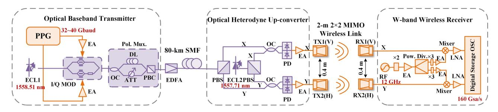

Fig. 1. The experimental setup of the integrated optical wireless transmission system based on antenna polarization diversity and PDM. ECL: External cavity laser, PPG: Pulse pattern generator, I/Q MOD: In-phase/quadrature modulator, EA: Electrical amplifier, Pol. Mux.: Polarization multiplier, OC: Optical coupler, DL: Delay line, ATT: Attenuator, PBC: Polarization beam combiner, EDFA: Erbium-doped fiber amplifier, SMF: Single-mode fiber, PBS: Polarization beam splitter, PD: Photodiode, RF: Radio frequency, Pow. Div: Power divider, LNA: Low noise amplifier, OSC: Oscillator.

is driven by the digital-to-analog converted baseband electrical signal. In the polarization multiplexer, the modulated optical signal is first divided into two branches by the polarizationmaintaining optical coupler (OC). The upper branch passes an optical delay line (DL) to get a 150-symbol delay, and an optical attenuator is added to the lower branch for the power balance of the two branches. The polarization beam combiner (PBC) recombines the two branches to generate the PDM signal. After appropriately amplified by the Erbium-doped fiber amplifier (EDFA), the PDM signal is transmitted through the 80 km singlemode fiber-28 (SMF-28) to the optical heterodyne up-converter for optical-to-electrical conversion.

At the optical up-converter, two polarization beam splitters (PBS) are used for the polarization diversity of the received PDM signal and the continuous lightwave from ECL2 respectively, which serves as the LO. The X- and Y-polarization components of the PDM signal and LO are respectively coupled by two parallel OCs, and converted to electrical signals by the two photodiodes (PD). The operating wavelengths of the ECL1 and ECL2 are 1558.51 nm and 1557.71 nm, so the frequency of the generated electrical PDM signal is 100 GHz, which belongs to W-band. The optical spectrum of the PDM signal and the optical LO at OC is shown in Fig. 2(b).

The 2 × 2 MIMO wireless link with 2 m distance is used for the transmission of the W-band PDM signals. A pair of horizontal-polarization horn antennas (HA) and a pair of vertical-polarization horn antennas are placed in parallel with 0.4 m distance to transmit the X- and Y-polarization components into the free space. According to the previous experimental result, the isolation between the H- and V- polarization HAs is more than 33 dB [\[45\],](#page-16-0) therefore the crosstalk between the Xand Y-polarization signals can be ignored.

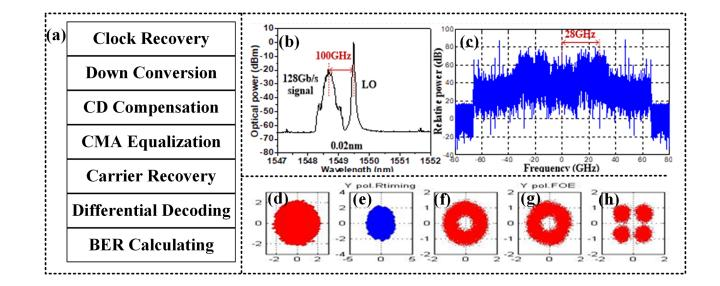

Fig. 2 (a) The offline digital signal processing at the receiver. (b) Optical spectrum (0.02 resolution) after polarization diversity splitting. (c) Electrical spectrum after analog down conversion. The received Y-polarization constellations (d) Before clock recovery, (e) After clock recovery, (f) After CMA equalization, (g) After frequency offset estimation, and (h) After carrier phase estimation.

At the receiver, the 12 GHz sinusoidal RF signal is frequency doubled (×2) and divided into two branches by a power divider for the following heterodyne coherent reception of the X- and Y-polarization signals. After the frequency tripler (×3), the final frequency of the RF signal is 72 GHz, and the frequency of the IF signal generated by the mixer is 28 GHz, whose electrical spectrum is shown in Fig. 2(c). After properly amplified by the low noise amplifiers (LNA), the two IF signals are sampled by the digital storage oscilloscope (DSO) with a sampling rate of 160 GSa/s and an electrical bandwidth of 65 GHz for the offline DSP, which is shown in Fig. 2(a). The received Y-polarization constellations before clock recovery, after clock recovery, after CMA equalization, after frequency offset estimation (FOE), and after carrier phase estimation (CPE) are shown in Fig. 2(d) to (h), respectively.

{4}------------------------------------------------

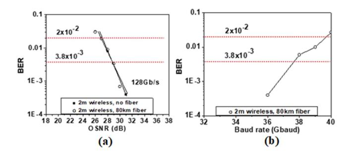

Fig. 3. (a) The relationship between BER and OSNR of 128 Gbit/s signal after 2 m wireless with and without fiber transmission. (b) The relationship between BER and baud rate after 80 km SMF-28 and 2 m wireless transmission.

Fig. 3(a) shows the relationships between the BER and the optical signal-to-noise ratio (OSNR) of the 128 Gbit/s signal over 2 m wireless transmission with and without optical fiber transmission. It can be seen that with the increase of OSNR, the BER performance improves, and there is little OSNR penalty after 80 km SMF-28 transmission. The required OSNR to meet the 20% SD-FEC threshold of  $2.0 \times 10^{-2}$  is 27 dB, while that for 7% HD-FEC threshold of  $3.8 \times 10^{-3}$  is 29 dB.

Fig. 3(b) shows the relationship between the BER and baud rate after 80-km SMF-28 and 2 m wireless transmission. The BER performance deteriorates with the increase of baud rate. Up to 36 and 39 Gbaud PDM-QPSK signal transmission can be realized with satisfying the 7% HD-FEC threshold of  $3.8 \times 10^{-3}$  and 20% SD-FEC threshold of  $2.0 \times 10^{-2}$ , respectively. Taking the 20% code overhead into account, the achieved highest net bit rate is 130 Gbit/s.

## B. 120-Gb/s Multi-Channel Wireless Terahertz-Wave Signal Delivery in a $2 \times 2$ MIMO System

Optical multi-carrier modulation can be combined with PDM and MIMO techniques to further increase the system capacity. In Ref. [38], we proposed a photon-assisted multi-channel PDM terahertz signal transmission over 10-km SMF-28 and 142 cm  $2\times 2$  MIMO wireless link with BER less than the 7% HD-FEC threshold of  $3.8\times 10^{-3}$ .

The experimental setup is shown in Fig. 4(a), and the photos of the wireless transmitter and receiver are shown in Fig. 4(e) and (f), respectively. The photonic remote heterodyning is used to generate the multi-channel terahertz signal to break the bandwidth limit of the electronic devices. ECL1-ECL6 at the optical transmitter end are used to generate the multi-channel optical carriers for modulation. The 5 Gbaud baseband electrical signal is digital-to-analog converted by the arbitrary waveform generator 1 (AWG) and amplified by the parallel EAs to drive the I/Q modulator 1. The continuous light waves from ECL1-ECL3 are combined via a PM-OC, and then input to the I/O modulator 1 to generate the modulated optical signal. The lightwaves from ECL4-ECL6 are coupled and modulated in the same way by the PM-OC2 and I/Q modulator 2 to generate another modulated optical signal. The two three-channel optical signals are then combined by PM-OC3 to obtain a six-channel signal. After PM-EDFA, the amplified signal is polarization multiplexed by the PM, which has the same structure with the aforementioned part A. The optical spectrum after PM is shown in Fig. 4(b).

After 10 km SMF-28 transmission, the PDM signal is transmitted to the wireless transmitter end for photoelectric conversion. ECL7 works as the optical LO signal, whose polarization direction is adjusted by the polarization controller (PC) and power is boosted to 14.4 dBm by an EDFA. The following integrated optical hybrid consists of two PBSs (PBS1 and PBS2) for the polarization diversity of the received PDM six-channel signal and LO, and two 90° optical hybrids for the coupling of the X- and Y- polarization components respectively. The spectrum of the coupled signal is shown in Fig. 4(d). The output Xand Y-polarization signals are then polarization adjusted by the PCs and amplified by the EDFAs. For photoelectric conversion and radiation into free space, we use two parallel NTT Electronics antenna-integrated photomixer modules (AIPM), which integrate a uni-travelling carrier photodiode (UTC-PD) and a bow-tie or log-periodic antenna. The variable optical attenuator (VOA) added before the AIPM is to adjust the input power of the UTC-PD. The frequencies of the generated six-channel terahertz signals range from 375 to 500 GHz with 25 GHz frequency space.

The  $2 \times 2$  MIMO wireless link is 142 cm in length, and three lenses are added to each parallel link to focus the wireless terahertz signal and guarantee the maximum received power. It is worth noting that the MIMO structure in our experiments is used for space division multiplexing to realize the crosstalk suppression in the PDM signal, especially the polarization crosstalk in the fiber. It offers a point-to-point straight transmission and brings neither interference nor gain, which is different from the traditional MIMO link defined in the traditional wireless communication.

The receiving processes of the X- and Y- polarization signals are similar. Take X-polarization as an example. At the receiver, the PDM six-channel terahertz signal is received by the HA with 26 dBi gain, and then enters the integrated mixer/amplifier/multiplier chain (IMAMC) driven by 12.308 GHz sinusoidal RF signal for analog down conversion. The RF signal is frequency multiplied (×36) by the multiplier in IMAMC. The IF signal is amplified by an LNA, and then completes the analog-to-digital conversion by DSO with 80 GSa/s sampling rate. For Y-polarization signal, the RF signal frequency is 9.231 GHz and a spectrum analyzer extender (SAX) is used for frequency multiplication (×48) and mixing. Therefore, the final RF frequencies used for down-conversion in X- and Y-polarization are both 443.088 GHz.

Fig. 5(d) shows the relationship between the BER and the input power of UTC-PD for the 6  $\times$  20 Gbit/s PDM signal over 10 km SMF-28 and 142 cm wireless transmission. The measurement power range is from 13 dBm to 16 dBm. It can be seen that with the increase of the input power, the BERs for the six channels all decrease, and ch6 has the best BER performance. When the input power is greater than 15 dBm, all channels can satisfy the 7% HD-FEC threshold of  $3.8 \times 10^{-3}$ .

{5}------------------------------------------------

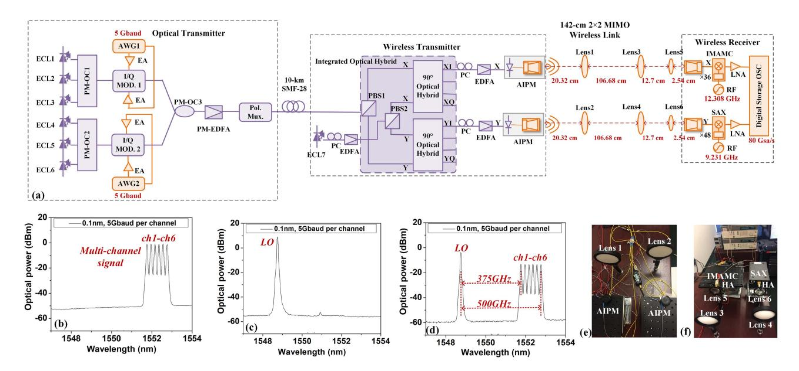

Fig. 4. (a) The experimental setup of the 6-channel terahertz signal wireless transmission system. The optical spectra of (b) The multiple-channel signal after PM, (c) The LO, and (d) The coupled PDM signal. The photos of (e) The wireless transmitter and (f) The wireless receiver.

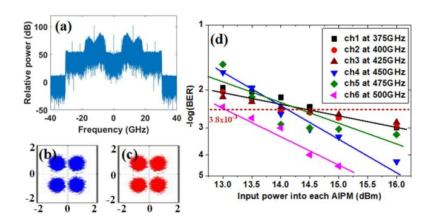

Fig. 5. (a) The electrical spectrum of the sampled IF signal of Ch6. The recovered QPSK constellations of (b) X-polarization and (c) Y-polarization. (d) The relationship between BER and input power into each AIPM after 142 cm wireless transmission for the six channels.

## C. Demonstration of 6.4-Tbit/s THz-Wave Signal Transmission Over 20-km Wired and 54-m Wireless Distance

Compared with the double sideband (DSB) modulation, the single-sideband (SSB) modulation can overcome the walk-off effect of fiber dispersion and realize the long-distance transmission, which is also a promising technique used in the large capacity system. In Ref. [12] and [13], we demonstrated an 80-channel wavelength division multiplexing (WDM) transmission in terahertz band based on optical asymmetric single-sideband (ASSB) modulation, and realized 6.4 Tbit/s terahertz signal transmission over 20 km standard single mode fiber (SSMF) and 54 m wireless distance.

The experimental setup is shown in Fig. 6(a). 80 ECLs with operating wavelengths ranging from 1531.51 nm to 1563.05 nm (full tunable in the C-band) are used to generate 80-channel optical carriers with 50 GHz frequency interval. The 80 WDM channels are divided into odd-channel group (Ch1, Ch3, Ch5, ..., Ch79) corresponding to H18~57 channels in ITU-T standard

and even-channel group (Ch2, Ch4, Ch6, ..., Ch80) corresponding to C18~57 channels in ITU-T standard, and the channels in each group are then combined by two polarization-maintaining arrayed waveguide grating (PM-AWG) respectively for modulation. For ASSB modulation, a modulated upper sideband (USB) located at the positive frequency  $f_{s1}$  and an unmodulated lower sideband (LSB) located at the negative frequency  $-f_{s2}$ are generated. In our experiment, the frequency of the modulated USB signal is 16 GHz, while that of the unmodulated LSB signal is -9 GHz. After digital-to-analog converted by the 64 GSa/s AWG and amplified by EAs, the baseband ASSB electrical signals drive the two I/Q modulators in each group to generate the optical ASSB signals at center frequencies of  $f_{ci}$  (i = 1, 2, 3, ......, 80), thus the frequencies of USBs carrying baseband signal are  $f_{ci} + f_{s1}$ , while those of LSBs are  $f_{ci}$ - $f_{s2}$ . The center optical carriers are significantly suppressed by adjusting the DC bias of the I/Q modulators. The two groups of channels are combined by a PM-OC to obtain the 80-channel WDM signal. It can be calculated that the frequency intervals between the LSB and USB, and between the USB and the LSB in the next channel are both 25 GHz.

After amplified by the PM-EDFA, the WDM signal enters the 20 km SSMF for wired transmission to the wavelength selective switch (WSS), which selects a modulated USB and an unmodulated DSB for heterodyne beating. To generate the 325 GHz terahertz signal, we choose the USB at optical carrier  $f_{ci}$  and the LSB at optical carrier  $f_{ci} + \gamma$  (i  $\leq 73$ ) or  $f_{ci-6}$  (i > 73). The optical spectra of the WDM signal before fiber transmission, after fiber transmission, before WSS, and after WSS are shown in Fig. 6(b) to (e), respectively. The selected sideband is then converted to electrical terahertz signal by UTC-PD, and the input power and polarization state are adjusted by the EDFA and PC added before. The terahertz signal is then amplified by the LNA for long-distance transmission and transmitted into free space via the antenna.

{6}------------------------------------------------

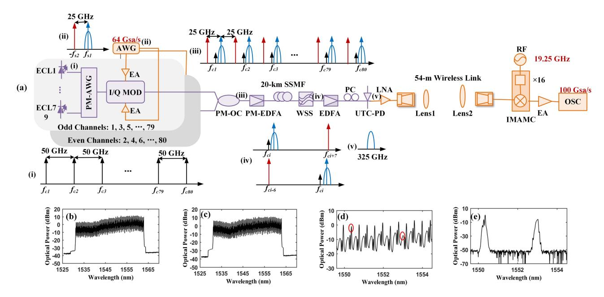

Fig. 6. (a) The experimental setup of the wireless transmission in the 80-channel WDM system. The optical spectra of 80-channel 20 Gbaud 16QAM signals (b) Before and (c) After 20 km fiber transmission. The optical spectra of 20 Gbaud 16QAM signal (d) Before and (e) After WSS.

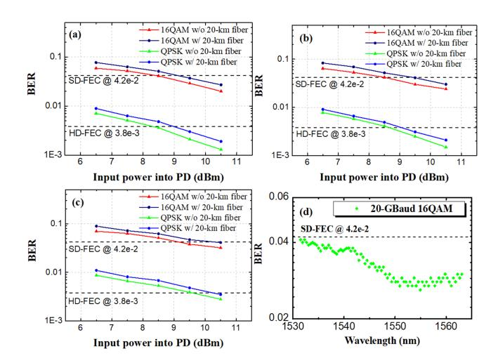

Fig. 7. The relationships between BER and the input power into PD for 20 Gbaud 16QAM and QPSK signals with and without 20 km fiber transmission before 54 m wireless transmission at the wavelengths of (a) 1553.33 nm, (b) 1563.05 nm, and (c) 1531.51 nm. (d) BER for 20 Gbaud 16QAM terahertz signal after 20 km fiber and 54 m wireless transmission in all 80 channels.

In the wireless transmission link, a pair of PTFE lenses is added to focus the terahertz signal. After 54 m wireless transmission, the received terahertz signal is mixed with the frequency multiplied RF signal (19.25 GHz  $\times$  16 = 308 GHz) to get the 17 GHz IF signal. After amplification by the EA, the IF signal is captured by the digital OSC with a sampling rate of 100 GSa/s for the subsequent offline DSP.

Fig. 7(a) to (c) show the relationships between BER and the input power into PD for 20 Gbaud 16QAM and QPSK signals with and without 20 km fiber transmission before 54 m wireless transmission at the wavelengths of 1553.33 nm, 1563.05 nm,

and 1531.51 nm, respectively. It can be seen that at the three wavelengths, the BERs all decrease with the increase of the input power. At 1553.33 nm, the 20 Gbaud QPSK and 16QAM signals can satisfy the 7% HD-FEC threshold of  $3.8 \times 10^{-3}$  and 25% SD-FEC threshold of  $4.2 \times 10^{-2}$  respectively, and the power penalties caused by 20 km fiber transmission are both 0.6 dB in the two cases. Comparing the transmission performances between 1563.05 nm and 1531.51 nm wavelengths, there are 1.2 dB power penalty at 7% HD-FEC threshold and 0.8 dB power penalty at 25% SD-FEC threshold at 1531.51 nm.

Fig. 7(d) shows the BER for 325 GHz 20 Gbaud 16QAM terahertz signal after 20 km fiber and 54 m wireless transmission in all 80 channels at 10.5 dBm input power. It can be seen that all 80 channels can satisfy the 25% SD FEC threshold, and the total line bit rate is  $20 \times 4 \times 80 = 6.4$  Tbit/s. When taking the 25% overhead into account, the net bit rate is 6.4 / (1 + 25%) = 5.12 Tbit/s.

#### III. LONG DISTANCE TERAHERTZ COMMUNICATION

Table II summarizes the essential achievements of photon-assisted THz-wave wireless communication. In our recent research, with the assistance of terahertz Lens Antenna, THz-LNA, high-sensitivity receivers and advanced DSP algorithms, 104 m wireless transmission of 124.8 Gbit/s signals, 200 m wireless transmission of 56 Gbit/s signals, and 400 m wireless transmission of 32 Gbit/s signals have been successfully achieved [21], [22], [46], [47], which will be demonstrate in detail in the following parts.

## A. High Gain and High Sensitivity Terahertz Modules

Constrained by the transmitting power of the photon-assisted system and the large atmospheric attenuation in the THz-band,

{7}------------------------------------------------

| Reference | Center Frequency | Modulation | Data Rate    | Distance | Time |
|-----------|------------------|------------|--------------|----------|------|
| [14]      | 300 GHz          | 16QAM      | 115 Gbit/s   | 110 m    | 2020 |
| [46][47]  | 339 GHz          | PS-256QAM  | 124.8 Gbit/s | 104 m    | 2022 |
| [21][22]  | 335 GHz          | PS-64QAM   | 56 Gbit/s    | 200 m    | 2022 |
| [22]      | 335 GHz          | 16QAM      | 32 Gbit/s    | 400 m    | 2022 |
| [48]      | 123 GHz          | 4096QAM    | 103.2 Gbit/s | 180 m    | 2022 |
| [15]      | 135 GHz          | 16QAM      | 19.64 Gbit/s | 4.6 km   | 2022 |

TABLE II
REPRESENTATIVE ACHIEVEMENTS OF LONG DISTANCE PHOTON-ASSISTED THZ-WAVE TRANSMISSION

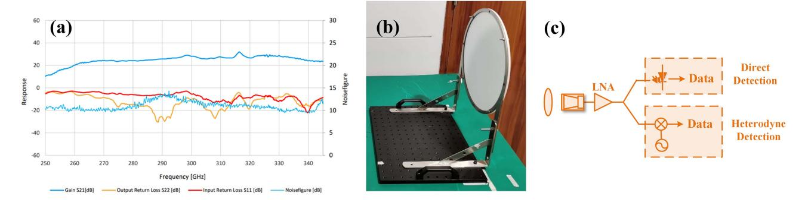

Fig. 8. (a) The gain and noise factor curves of the THz-LNA; (b) The photograph of the high gain Terahertz Lens Antenna; (c) The comparison of direct detection scheme and heterodyne detection scheme at the receiver.

the wireless distance of the photon-assisted terahertz communication system is short. Therefore, several techniques are used in our experiment to increase the THz transmission distance.

First, to increase the radiated power of the transmitter, we introduce a THz-LNA into the communication system. As shown in Fig. 8(a), the gain of this THz-LNA is greater than 20 dB and the noise factor is about 10 dB in the 250–350 GHz frequency band. Though the utilization of the THz-LNAs can increase the radiated power of the transmitter, the nonlinear impairments are also introduced to the system. Thankfully, we can compensate for the nonlinearity by using advanced DSP algorithms at the receiver side. In addition, to further extend the wireless transmission distance, the high gain terahertz Lens Antennas instead of Cassegrain Antennas are used in the wireless link. Fig. 8(b) shows a photograph of the Lens Antennas used in our experiment with a gain of more than 50 dB at 100~500 GHz. The Lens Antenna is made of PTFE material with a low dielectric constant.

However, the signal power at the receiving end is still weak in spite of using the above-mentioned terahertz modules after long-distance THz-wave wireless transmission. Therefore, a high sensitivity receiver based on heterodyne detection is essential. Fig. 8(c) shows a comparison of the principles of heterodyne detection scheme and direct detection scheme. In heterodyne detection, an additional RF LO is mixed with the received terahertz signal via a mixer to complete the down-conversion process. Supposing that the terahertz signal received by the antenna is expressed as [23]:

$$S(t) = A[I(t)\sin(2\pi f_c t + \theta_c(t)) + Q(t)\cos(2\pi f_c t + \theta_c(t))]$$
(1)

Where  $A, f_c$  and  $\theta_c(t)$  represent the amplitude, frequency and phase of the terahertz signal, respectively. I(t) and Q(t) represent the in-phase and quadrature component of the modulation signal carried by the terahertz carrier. The RF LO signal can be expressed as:

$$S_{LO}(t) = A_{LO}\cos(2\pi f_{LO}t + \theta_{LO}(t)) \tag{2}$$

Where  $A_{LO}$ ,  $f_{LO}$  and  $\theta_{LO}(t)$  represent the amplitude, frequency and phase of the RF LO signal. The terahertz signal and RF LO signal are then mixed via a mixer to get the IF signal, which can be expressed as:

$$S_{IF}(t) = A_{LO}A[I(t)\sin(2\pi f_c t - 2\pi f_{LO}t + \theta_c(t) - \theta_{LO}(t)) + Q(t)\cos(2\pi f_c t - 2\pi f_{LO}t + \theta_c(t) - \theta_{LO}(t))]$$

$$= A_{LO}A[I(t)\sin(2\pi f_{IF}t + \theta_{IF}(t)) + Q(t)\cos(2\pi f_{IF}t + \theta_{IF}(t))]$$
(3)

It can be seen that the output amplitude of the IF signal after the coherent mixing is proportional to the product of the terahertz signal amplitude and LO signal amplitude, and the amplitude of the LO signal is usually larger than that of the terahertz signal. Therefore, heterodyne detection is commonly used to detect weak signals and its sensitivity is improved by several orders of magnitude compared with direct detection. As a result, the use

{8}------------------------------------------------

| Up-conversion techniques | Frequency (GHz) | Modulation | Data Rate (Gb/s) | Distance (m) | Year | Reference |
|--------------------------|--------------------|------------|---------------------|-----------------|------|-----------|
| Electronics              | 625                | Duo-Binary | 2.5                 | 0.2             | 2011 | [7]       |
| Electronics              | 340                | 16QAM      | 3                   | 50              | 2014 | [49]      |
| Electronics              | 240                | QPSK       | 64                  | 850             | 2015 | [50]      |
| Electronics              | 220                | ASK        | 11                  | 3               | 2015 | [51]      |
| Electronics              | 140                | 16QAM      | 5                   | 21000           | 2017 | [52]      |
| Electronics              | 300                | QPSK       | 100                 | 0.5             | 2020 | [53][54]  |
| Photonics                | 300                | ASK        | 12.5                | 0.5             | 2010 | [55]      |
| Photonics                | 300                | ASK        | 40                  | 1               | 2010 | [56]      |
| Photonics                | 300                | ASK        | 100                 | 0.7             | 2013 | [57]      |
| Photonics                | 328                | NRZ        | 6                   | 1.5             | 2017 | [58]      |
| Photonics                | 340-510            | QPSK       | 103.125             | 3               | 2022 | [59][60]  |
| Photonics                | 385&435            | QPSK       | 2×103.125           | 3               | 2022 | [61][62]  |

TABLE III SUMMARY OF REAL TIME THZ COMMUNICATION

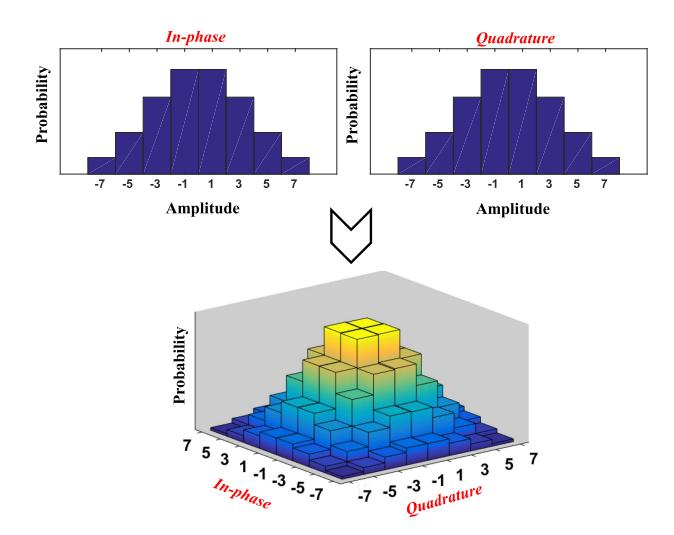

Fig. 9. Principle of the probabilistic shaping.

of high-sensitivity receivers based on the heterodyne detection scheme can reduce the requirements for the power level of the received signals.

### *B. Probabilistic Shaping Technique*

Due to the lack of Terahertz Power Amplifiers (THz-PAs), low-power wireless channels often constrain the wireless transmission distance or the capacity of higher-order QAM signals. As a novel technique, the PS technique can change the probability of constellation points to realize a Gaussian-like constellation distribution, providing an additional shaping gain to the signals. As shown in Fig. 9, the transmitted PS-64QAM signals can be decomposed into *I-th* and *Q-th* 8-ary pulseamplitude-modulation (PAM-8) signals. The levels of the PAM-8 signals follow the Maxwell-Boltzmann distribution rather than the equivalent probability. It is obvious that the transmission probability of the external constellation points with high energy is lower than that of the internal constellation points with low energy in the PS-64QAM signals constellation. At a fixed transmitting power, the Euclidean distance between constellation points is increased after PS. Therefore, the PS echnique can improve the noise robustness.

## *C. Photon-Assisted Long Distance THz-Wave Wireless Transmission Experiment*

The experimental setup of the photon-assisted THz-wave wireless transmission is shown in Fig. [10.](#page-9-0) At the transmitter side, the digital QAM/PS-QAM signals are generated in the offline MATLAB software. To overcome the system bandwidth limitations, the upsampled QAM/PS-QAM signals are fed into a root-raised cosine (RRC) filter with a roll-off factor of 0.01. Finally, after normalization, the signals are fed to an AWG for digital-to-analog conversion. The I-path and Q-path outputs from the AWG are amplified by two parallel EAs respectively to drive the I/Q modulator for the modulation of the continuous waves generated by the ECL1. The modulated signals are amplified by the PM-EDFA and then coupled with the continuous waves generated by ECL2 in the PM-OC. After amplified by the following EDFA, the electrical THz signal is obtained by the UTC-PD, and a PC is utilized to adjust the polarization of the optical signals into the UTC-PD to maximize the intensity of the output THz-wave signals. The THz-wave signals from the UTC-PD are transmitted to free space through the combination of THz-LNA, horn antenna (HA) and Terahertz Lens.

At the receiver side, based on the heterodyne detection scheme, the THz-wave signals received by the combination of HA and Terahertz Lens, are down-converted by the IMAMC to generate the IF signals. After amplified by an EA, the IF signals are captured by a 100 GSa/s digital OSC to obtain the digital signals. The offline DSP operations at the receiver side include resampling, I/Q quadrature, CMA equalization, FOE, CPE, DD-LMS equalization algorithm to estimate the frequency bias and calculate the BER. In addition, we use a second-order Volterra nonlinear equalizer (VNLE) to compensate for the nonlinear impairments.

Fig. [10\(a\)](#page-9-0) presents the measured normalized generalized mutual information (NGMI) performance of the 16 Gbaud 64QAM and PS-256QAM (7.8bit/symbol/Hz) signals after 104 m wireless transmission at 339 GHz. Considering the 0.83-NGMI threshold, the minimum input power of PD required for 16 Gbaud 64QAM signals and PS-256QAM signals is 8.2 dBm and 10.6 dBm, respectively. The insets in Fig. [10\(a\)](#page-9-0) present the demodulated constellation diagrams of 64QAM and PS-256QAM signals with 11 dBm input power of PD. Accounting for the

{9}------------------------------------------------

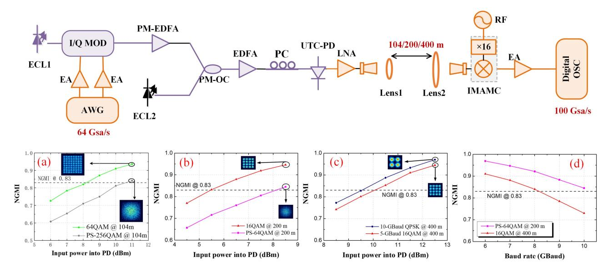

Fig. 10. The experimental setup of the photon-assisted 104 m/200 m/400 m THz-wave wireless transmission. (a-d) The NGMI performance of signals after 104/200/400 m wireless transmission.

25% overhead of SD-FEC, the maximum net bit rate for 16 Gbaud PS-256QAM signals in the system is 99.2 Gbit/s ([7.8–8  $\times$  (1–0.8)]  $\times$  16 = 99.2 Gbit/s).

Fig. 10(b) presents the measured NGMI performance of 10 Gbaud 16QAM and PS-64QAM (5.6bit/symbol/Hz) signals after 200 m wireless transmission at 335 GHz. The insets in Fig. 10(b) present the demodulated constellation diagrams of the 16QAM and PS-64QAM signals with 8.5 dBm input power of PD. Fig. 10(c) presents the measured NGMI performance of the 10 Gbaud QPSK and 5Gbuad 16QAM signals after 400m wireless transmission at 335 GHz. The insets in Fig. 10(c) present the demodulated constellation diagrams of the QPSK and 16QAM signals with 12.5 dBm input power of PD.

Fig. 10(d) shows the relationships between the measured NGMI performance and baud rate of the PS-64QAM signals after 200 m wireless transmission and the 16QAM signals after 400 m wireless transmission. Accounting for the 25% overhead of SD-FEC, for 200 m PS-64QAM signals wireless transmission, the maximum baud rate is 10 Gbaud and the maximum net bit rate is 44 Gbit/s ( $[5.6-6 \times (1-0.8)] \times 10 = 44$  Gbit/s). For 400 m 16QAM signals wireless transmission, the maximum baud rate is 8 Gbaud and the maximum net bit rate is 25.6 Gbit/s ( $4 \times 8 \times 0.8 = 25.6$  Gbit/s).

#### D. THz-Wave Wireless Transmission Link Budget

For 400 m wireless THz-wave transmission system, the Friis formula can be adopted to calculate the wireless link power budget:

$$P_R = P_T + G_T + G_{lens1} + G_{lens2}$$

$$+ G_R - 20 \log \frac{4\pi df}{c} - L_m$$
(4)

Where  $P_T$  indicates the transmitting power of the wireless transmission, and its value after LNA is -6 dBm in our experiment.  $G_T$  indicates the gain of the HA at the transmitter side. The value of  $G_T$  is about 25 dBi.  $G_{\mathrm{lens}1}$  and  $G_{\mathrm{lens}2}$  indicate the gain of the Lens Antenna at the transmitter and receiver side, respectively. Lens1 together with Lens2 can provide a total gain of 70 dBi. Therefore, the value of  $G_{\mathrm{lens}1} + G_{\mathrm{lens2}}$  is 70 dBi.  $G_R$  indicates the gain of the HA at the receiver side. The value of  $G_R$  is about 25 dBi. d indicates the wireless transmission distance and c indicates the speed of light.  $L_m$  indicates the atmospheric loss of the wireless link. In this experiment, the atmospheric loss of the 400 m wireless link is 4 dB. According to the above data, we calculate the received power after 400 meters wireless link transmission is -25 dBm.

#### IV. REAL TIME TERAHERTZ COMMUNICATION

It is difficult to achieve real-time sampling and processing for ultra-high-speed THz communication data because of the bandwidth, sampling rate and accuracy limitations of high-speed digital-to-analog/analog-to-digital converters (DAC/ADC), which limits the commercial application. Table III lists the typical research works on all-electrics and photon-assisted THz real time communication systems in recent years [7], [49], [50], [51], [52], [53], [54], [55], [56], [57], [58], [59], [60], [61], [62]. All-electrics techniques can generate highfrequency THz signal by frequency multiplying a low-frequency microwave signal [7], [49], [50], [51], [52], [53], [54]. In 2011, a 625 GHz THz wave was generated with an all-solid-state electric mixer, and the 2.5 Gb/s Duo-Binary signal was transmitted with a transmission power of 1 mW [7]. In 2017, an ultra-long-distance THz communication is demonstrated with 5 Gb/s transmission rate over up to 21 km wireless distance [52]. In 2020, the transmission of the 34 GBaud PDM-QPSK signal with 100 Gb/s net capacity at 25% SD-FEC threshold using MMIC-based THz

{10}------------------------------------------------

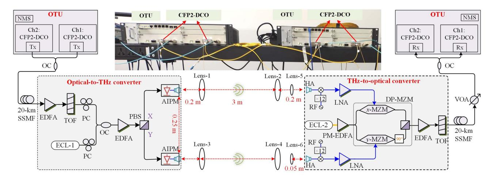

Fig. 11. The experimental setup of the 100/200G real-time photon-assisted THz-wireless transmission system.

transceiver has been demonstrated over two fiber links and 0.5 m 2 × 2 MIMO wireless link at 300 GHz by using high-speed real-time commercial digital coherent optics (DCO) modules [53], [54]. Photon-assisted THz can generate high-frequency THz signal by heterodyne beating two lightwaves, which is an emerging technical route for 6G ultra-high-speed THz wireless communications [55], [56], [57], [58], [59], [60], [61], [62]. In 2013, at 300 GHz, real-time error-free transmission has been demonstrated with the highest data rate up to 50 Gbit/s and 100 Gbit/s for a single channel and polarization multiplexed channel, respectively [57]. In 2022, we for the first time realize the photon-assisted  $100/2 \times 100$  GbE real-time THz wireless transmission at 330~500 GHz band, whose capacity is 10 to 20 times higher than that of 5G [59], [60], [61], [62]. The architecture can significantly reduce the research difficulty and development cost by reusing commercial DCO modules.

## A. Architecture of the 100/200 G Real-Time Photon-Assisted THz-Wireless Transmission System

Fig. 11 shows the experimental setup of our proposed real-time 2 × 2 MIMO THz transmission system using optical-to-THz (O/T) and THz-to-optical (T/O) conversion. Commercial CFP2-DCO modules are used for optical baseband signals real-time processing. Each CFP2-DCO module can support DP-QPSK modulation, 50 GHz ITU-T grid, polarization diversity homodyne detection, and high speed real-time DSP demodulating. In our experiment, 31.379 GBaud DP-QPSK modulated optical baseband signal with a roll-off factor of 0.2 is generated by setting each module in network management system (NMS). Each CFP2-DCO module has built-in optical transport network (OTN) framer and can be directly used for 100 GbE transponder application.

At the O/T converter side, over 20 km SSMF transmission, the optical signals and the ECL-1 with 13.5 dBm optical power operating at 193.115 THz as an optical LO are coupled, and then amplified by an EDFA to effectively drive the AIPMs based on UTC-PD. A PBS is used for polarization diversity, and X- and Y-polarization components are up-converted by AIPMs to two

THz-wave wireless signals. The AIPMs are polarization sensitive, and two PCs are necessary to adjust the incident polarization direction to maximize output power from AIPMs. Then, the THz-wave signals are delivered over a 3 m  $2 \times 2$  MIMO wireless transmission link. Three pairs of lenses are used to focus the wireless THz-wave to maximize the received THz-wave signal power. The X-polarization and Y-polarization wireless link are align with lens 1, 2, 5 and lens 3, 4, 6, respectively, as shown in Fig. 11. The lenses 1-4 are the same, and each of them has 10 cm diameter and 20 cm focal length. For THz-waves high accuracy alignment to HA, the smaller lens 5 and 6 with 5 cm diameter and 10 cm focal length are used. The longitudinal separation distances between the AIPM and lens 1 (lens 3), lens 1 (lens 3) and lens 2 (lens 4), lens 5 (lens 6) and the receiver HA are 0.2 m, 3 m and 5 cm, respectively. The O/T conversion module and T/O conversion module are placed at the height of 20 cm in order to avoid multi-path fading from reflections on the optical table. The lateral separation between two HAs pairs and two AIPMs is 25 cm.

At the T/O converter side, the hybrid optoelectronic downconversion is used for T/O conversion in order to reduce the carrier frequency and the bandwidth requirement for the modulators. For X- and Y-polarization THz-wave wireless signals, two identical THz receivers are driven by electronic LO sources to implement analog down conversion, and each consists of a mixer, a × 12 frequency multiplier chain and an amplifier. The IF signal bandwidth of the THz receivers is 40 GHz. The down-converted X- and Y-polarization IF signals are boosted by electrical low-noise amplifiers to drive one integrated dualpolarization Mach-Zehnder Modulator (DP-MZM) with 35 GHz 3 dB bandwidth and 1.8 V half-wave voltage, which operates at the optical-carrier-suppression (OCS) point. The ECL-2 as the optical carrier input of the DP-MZM works at 193.525 THz, and the optical power after PM-EDFA is 19 dBm. The optical baseband signal filtering from TOF is delivered over the second span of 20 km SSMF, and fed into the same CFP2-DCO module for real-time DSP processing. Finally, the OSNR and BER are recorded through the NMS operation interface.

{11}------------------------------------------------

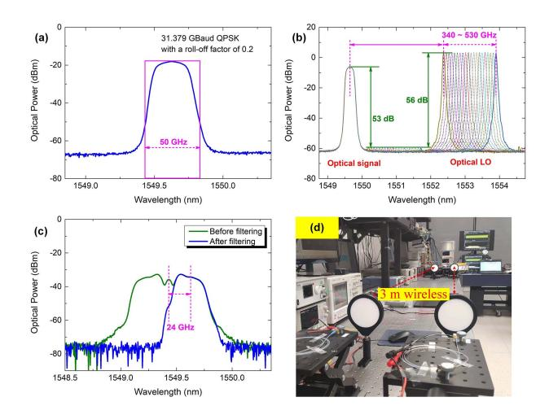

Fig. 12. The optical spectra of (a) The optical baseband signal after OUT; (b) The optical signal with tunable optical LO after optical coupler; (c) Before and after filtering [60]. (d) Setup of THz  $2 \times 2$  MIMO 3 m wireless link.

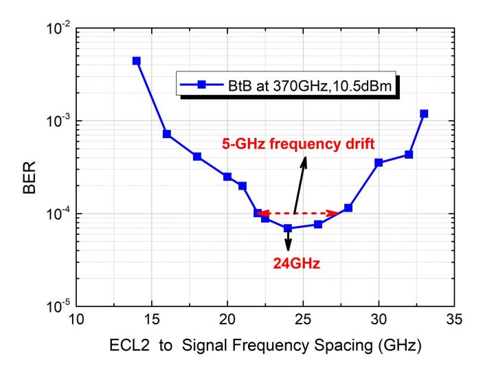

Fig. 13. BER versus ECL-2 to optical signal frequency spacing.

#### B. 100 GbE Real-Time THz Transmission

For 100 GbE real-time THz transmission, one CFP2-DCO module in OTU works at 100 GbE mode with 125.516 Gb/s line rate (i.e., 103.125 Gb/s net rate), and generates optical baseband signal with 31.379 GBaud DP-QPSK and 0.2 roll-off factor, as shown in Fig. 12(a) with 0.03 nm resolution. Then, the signal bandwidth can be computed as  $31.379 \times (1 + 0.2)$ = 37.6548 GHz. At the O/T conversion side, the carrier frequency of the optical signal is set at 193.5 THz, and the center wavelength of ECL-1 is tuned to generate THz wireless signals with frequencies ranging from 330 GHz to 500 GHz. Fig. 12(b) shows the optical spectrum of the optical signal and optical LO after OC. There are > 50 dB side-mode suppression ratio (SMSR) of the optical signal and optical LO. At T/O conversion side, the frequency spacing between optical baseband signal and ECL-2 can affect the BER performance. Hence, we optimize the frequency space in the 100 G  $2 \times 2$  MIMO system without fiber and wireless distance transmission. As shown in Fig. 13, the transmission system has better BER performance at 24 GHz IF,

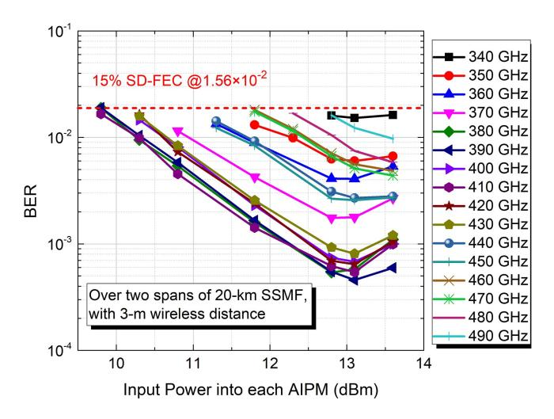

Fig. 14. BER versus input power into each AIPM based on DP-MZM over two spans of 20-km SSMF and 3-m wireless distance transmission.

and the performance of BER is stable within 5 GHz frequency drift range. The measured spectra before and after filtering at 0.03 nm resolution are shown in Fig. 12(c). The photo of the 3 m THz wireless transmission link is shown in Fig. 12(d).

Based on the optimized system parameters, the BER versus input power into each AIPMs over 3 m wireless link and two spans of 20 km SSMF are measured by using DP-MZM modulator, as shown in Fig. 14. At 15% SD-FEC limit, the system can successfully work at frequency range from 340 GHz to 490 GHz. Under the THz carrier frequency range from 340 GHz to 450 GHz, the best BER performance can be realized at 13.3 dBm. Finally, for the 100 G real-time transmission, the optical power penalty is about 3 dB at 15% SD-FEC limit.

#### C. 2 × 100 GbE Real-Time THz Transmission

For  $2 \times 100$  GbE real-time THz transmission, the doublecarrier frequency of channel 1 (Ch1) and channel 2 (Ch2) is fixed at 193.5 THz and 193.55 THz with 3 dBm output optical power, respectively. The frequency space between Ch1 and Ch2 is 50 GHz. After OTU, Ch1 and Ch2 are combined by an OC. The optical spectrum of the coupled Ch1 and Ch2 is shown at 0.03 nm resolution in Fig. 15(a). Each CFP2-DCO module works at 100 GbE mode, and 31.379 GBaud DP-QPSK modulated optical baseband signal with a roll-off factor of 0.2 is generated. The optical spectrum of the coupled optical signals and ECL-1 (optical LO) is shown in Fig. 15(b). The frequency spaces between Ch1, Ch2 and ECL-1 are fixed at 385 GHz and 435 GHz, respectively. At T/O conversion side, the clock LO sources for Ch1 and Ch2 are set as 30 GHz and 38.333 GHz, respectively. Hence, the frequency of IF signals corresponding to Ch1 and Ch2 are the same:  $385 - 30 \times 12 = 25$  GHz and 38.3333 $\times$  12 – 435 = 25 GHz. Note that, Ch1 and Ch2 are separately measured, but the total  $2 \times 100$  GbE line rate from transmitter is consistent all the time. For Ch1, one TOF is set to filter out the lower sideband and the ASE noise as well as the central optical carrier, only leaving the upper sideband. Similarly, for Ch2, TOF

{12}------------------------------------------------

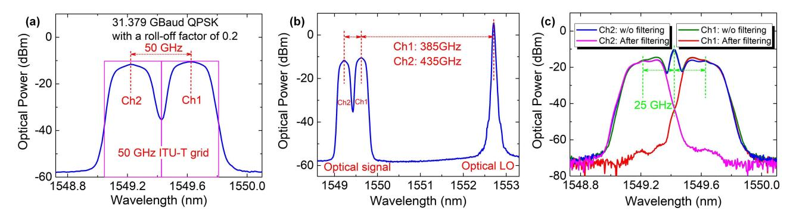

Fig. 15. Measured optical spectra for  $2 \times 100$  GbE: (a) The baseband optical signals of dual-channels after OTU; (b) The optical signals and optical LO after optical coupler; (c) Optical signals without and with filtering [62].

10-1

15% SD-FEC

@1.56×10-2

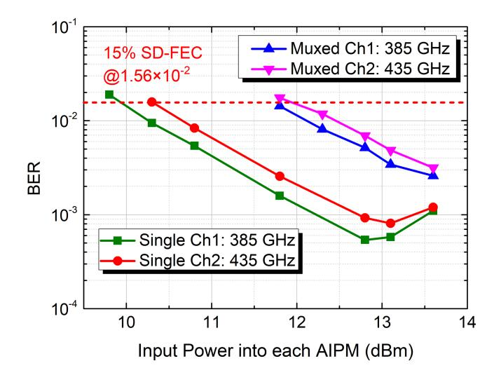

10-2
Single Ch1: 385 GHz
Single Ch2: 435 GHz
DCO Received Optical Power (dBm)

Muxed Ch1: 385 GHz

Muxed Ch2: 435 GHz

Fig. 16. BER versus input power into each AIPM for single channel case and dual-channel case

Fig. 17. BER versus ROP of each CFP2-DCO module for single channel case and dual-channel case at 385 GHz and 435 GHz, respectively.

is set to filter out the upper sideband and optical carrier, leaving the lower sideband. Fig. 15(c) shows the measured spectra at 0.03 nm resolution after optical polarization diversity and filtering for Ch1 and Ch2, respectively. Over the full duration of the experiment, 15% SD-FEC limit for pre-FEC BER of  $1.56 \times 10^{-2}$  is used. The dual-channel 31.379 GBaud (125.516 Gbps) DP-QPSK signals can provide  $2 \times 103.125$  Gbps net capacity for  $2 \times 100$  GbE clients. Each CFP2-DCO module has high-speed real-time DSP module and can compensate the optical impairments such as polarization mode dispersion (PMD) and chromatic dispersion, recover carrier phase, remove carrier frequency offset and symbol timing, track polarization rotation. The mean PMD and CD tolerance is 30 ps and 40000 ps/nm, respectively.

Fig. 16 gives the BER versus the input power into each AIPM over 3 m wireless link and two spans of 20 km SSMF for single channel case and dual-channel case at 385 GHz and 435 GHz, respectively. The BER performance starts to deteriorate over 13.1 dBm for single channel case, because of the saturated power into AIPMs. There is about 0.5 dB BER gain achieved for Ch1 at 385 GHz at 15% SD-FEC limit compared with Ch2 at 485

GHz. For out demonstration, the input optical power remains below 13.8 dBm in order to avoid damaging AIPMs for the single-channel case. The BER performances of Ch1 and Ch2 are similar, and there is no power saturation phenomenon because dual-channel multiplexing can reduce the average power of each channel. At 15% SD-FEC limit, there is around 2 dB optical power penalty at 385 GHz and 435 GHz for dual-channel case compared with single channel case.

Then, we evaluate the BER performance versus received optical power (ROP) of each CFP2-DCO module over 3 m wireless distance link and two spans of 20 km SSMF. Fig. 17 shows the BER versus ROP at 385 GHz and 435 GHz for single channel case and dual-channel case, respectively. With the increasing of ROP, the BER is gradually stable. We can observe that there is around 5 dB optical power penalty for dual-channel case at 385 GHz and 435 GHz compared with single channel case at 15% SD-FEC limit. This demonstrated  $2 \times 100$  GbE real-time THz transmission system can potentially support tens of users for bandwidth-consuming services, such as 8 K/10 K video, metaverse and 3D holographic.

{13}------------------------------------------------

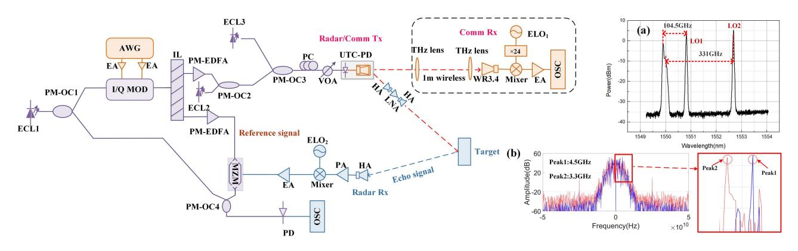

Fig. 18. The experimental setup of the photonics-based THz data communication and radar sensing integrated system. (a) The optical spectrum after the PM-OC3. (b) Spectra of the de-chirped signal for 40 cm away from the reference position.

## V. TERAHERTZ INTEGRATED SENSING AND COMMUNICATION

Photonic technology with advantages of high operating frequency, large instantaneous bandwidth, and strong antielectromagnetic interference ability, is widely used in the fields of large-capacity wireless communication [\[63\]](#page-17-0) and highresolution radar sensing [\[64\].](#page-17-0) Nowadays, photonics technology has exhibited great potential in the ISAC systems [\[65\],](#page-17-0) [\[66\],](#page-17-0) [\[67\],](#page-17-0) [\[68\].](#page-17-0) Based on photonics, the linear frequency modulation (LFM) radar waveform is generated and modulated by ASK to realize ISAC function [\[65\].](#page-17-0) However, since the ASK modulation embedded in the radar pulse unit destroys the orthogonality of the integrated signal communication, the communication rate is as low as 100 Mbit/s. The OFDM signal is used to realize the ISAC function. Nevertheless, the radar has a low sensing performance with a resolution of 0.3 m in Ref [\[66\].](#page-17-0) An OFDM integrated system based on optoelectronic oscillator at K band is proposed [\[67\].](#page-17-0) However, the communication capacity of 335.6 Mbps is difficult to meet the needs of modern communication. The ISAC function is realized by spectrum-spreading multiplexing techniques and photonic phase-coding in Ref [\[68\].](#page-17-0) The operating frequency is as low as 35 GHz due to the optical carrier suppressed modulation. Although most of these methods exhibited acceptable performances, the ISAC systems in the THz frequency band are rarely reported.

We have developed several multiplexing techniques to realize the THz ISAC, and here are two solutions to achieve this function. The first scheme is realized by allocating different frequency band to each function [\[69\],](#page-17-0) as shown in Fig. 18. At the transmitting end, A USB signal centered at 7 GHz carrying 16QAM signal and an LFM signal centered at 17.5 GHz with a bandwidth of 5 GH is generated by an AWG. Then, the frequency division multiplexing based signal is utilized to drive the I/Q modulator. Following the I/Q modulator, an interleaver (IL) is utilized to split the optical signal. The upper path from IL is combined with ECL2 by PM-OC2, and the frequency difference between ECL1 and ECL2 is 87 GHz. Afterward, the output of PM-OC2 is coupled with another ECL3 by PM-OC3. The frequency gap between ECL1 and ECL3 is 324 GHz, as shown in Fig. (a). The LFM signal and the 16QAM signal are produced at the same time in the output of UTC-PD.

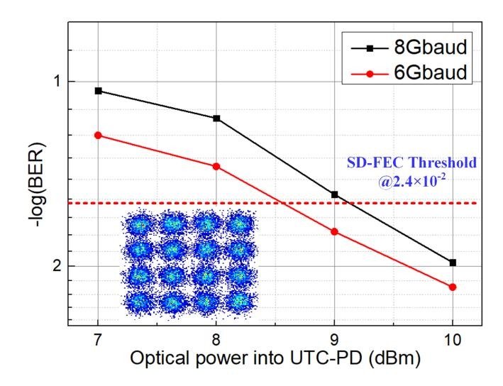

Fig. 19. BER versus input power for the 16QAM signal after 1 m wireless transmission.

For the THz LFM signal transmission and reception, due to the transmission loss increasing with the frequency, we choose the 104.5 GHz band for radar sensing. The reflected echo signal is received and down-converted into the IF domain. After down-conversion, the echo signal is utilized to drive the MZM. The reference optical signal from the lower path of the IL is modulated by the echo signal. The modulated signal is coupled with the lower path optical carrier from the PM-OC1 by PM-OC4. At last, the optical signal is sent to a PD for dechirping. As can be seen from Fig. 18(b), the distance between the two positions is calculated to be 36 cm, which is close to the practical value (40 cm).

For the communication data transmission and reception, the THz 16QAM signal is delivered over a 1 m free-space wireless link. At the receiver side, the received THz signal is downconverted into the IF domain by using a THz WR3.4. The experimental result shows that the rate of 32 Gbit/s has been successfully achieved over a 1 m wireless link at 324 GHz band, as shown in Fig. 19.

The second scheme is obtained by using time division multiplexing in a signal frame for dual-function [\[70\],](#page-17-0) as shown in

{14}------------------------------------------------

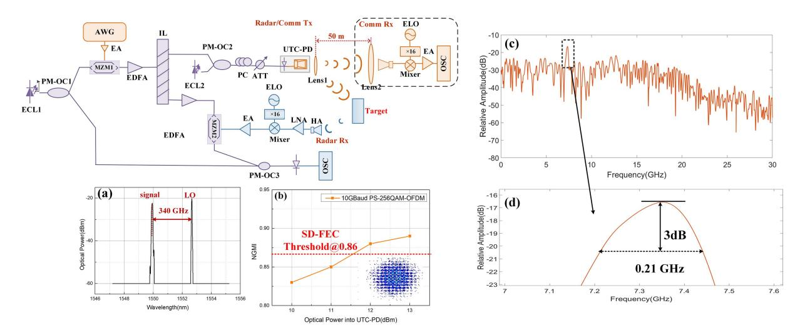

Fig. 20. The principle the photonics-based THz high-resolution radar sensing and high-speed data communication integrated system. (a) The optical spectrum (0.01-nm resolution) after PM-OC2. (b) NGMI versus optical power into UTC-PD for the PS-256QAM-OFDM signal. (c) Spectrum of the de-chirped signal for the 10 cm from the reference position. (d) The zoom-in views of the spectra around the peak.

Fig. 20. At the transmitting end, the 15 GHz IF time division multiplexing (TDM) based signal with a bandwidth of 10 GHz is utilized to drive the MZM1. Subsequently, the modulated signal was divided into two paths by an IL. The upper path optical signal was coupled with ECL2 using the PM-OC2, and the frequency difference between ECL1 and ECL2 is 340 GHz. The measured optical spectrum after the PM-OC2 was shown in Fig. 20(a). The THz band LFM signal and OFDM signal were simultaneously generated by optical heterodyne beating at the output of UTC-PD. The PS-256QAM-OFDM signal was successfully captured after 50 m wireless transmission. Fig. 20(b) presents the measured NGMI as a function of the optical power into the UTC-PD for PS-256QAM (6.8 bit/symbol) after 50 m wireless transmission. Based on the result, we have realized the 38.1 Gbit/s transmission over a 50-m wireless link at 340 GHz band.

For the radar, the echo signal was captured and downconverted into the IF domain. The echo signal is then utilized to drive the MZM2. The lower path optical signal of the IL was automatically modulated by the IF-band echo signal. Then, the modulated signal was coupled with another part of the optical signal from the PM-OC1. Finally, the optical signal was sent to a PD for the de-chirping. The de-chirped signal is captured by the OSC. Fig. 20(c) shows the spectra of the de-chirped signal after executing FFT. The 3 dB width of the spectrum peak is 0.21 GHz, as shown by the zoom-in view in Fig. 20(d). Therefore, the range resolution calculated according to the spectrum width is 1.58 cm, which was very close to the theoretical range resolution of 1.5 cm.

## VI. CHALLENGES OF THZ COMMUNICATION

Although terahertz technology is a promising technology to satisfy the ultra-high data rate required for the future 6G mobile communication networks, there are still challenges for its application due to its unique characteristics. We summarize the challenges of terahertz communication from the following four aspects:

First, in terms of transmission, terahertz signal can be transmitted in both the wireless and the wired ways. In free-space terahertz wireless transmission, the total path loss is caused by both the spreading loss and the large molecular absorption [\[71\].](#page-17-0) Due to the high frequency of the terahertz wave, the spreading loss is considerably large, which limits the distance of wireless terahertz communication. In addition, the molecular in the air, especially the water vapour, will cause different absorption peaks and divide the terahertz band into different transmission windows, which makes it difficult to use a broad continuous frequency band. What's more, terahertz wave has a low penetration and cannot penetrate walls and other surfaces. Therefore, terahertz wave is sensitive to the blocking between the transmitter and the receiver, and is commonly used in the line-of-sight (LOS) transmission. For terahertz wired communication, although various terahertz waveguide with low loss, low nonlinear effect and low latency has been investigated widely, the achievements on terahertz communication systems based on waveguides are still relatively few at present.

Second, in terms of terahertz transceiver architecture, there are three typical kinds of terahertz communications systems at present, including terahertz systems based on all-solid-state electronics technology, terahertz systems based on direct modulation, and terahertz systems based on photon-assisted technology. For all-solid-state electronics technology, it has advantages of small size, easy integration, low power consumption, and so on. However, the terahertz signals will suffer a serious phase noise deterioration after multiple frequency multiplication, and the outpower of carrier signals is at microwatt level. For the direct modulation technology, it can be combined with high-power terahertz sources to achieve systems with more than 10 mW output carrier, which can realize long-range wireless communication. However, it is still a problem to improve the speed of the direct modulator and reduce the overall loss of the system. 

{15}------------------------------------------------

For the photon-assisted technology, it has advantages of high transmission speed and high bandwidth utilization, and offline terahertz wireless communication systems up to 1 Tbps capacity have been realized based on this method. However, the UTC-PD for photoelectric conversion usually has a low conversion efficiency at present, and its input power is also limited to avoid the nonlinear impairments caused by the power saturation. In addition, systems based on photon-assisted technology usually have a large size and complexity. Therefore, it is necessary to solve these limitations in the above systems and promote terahertz systems with small size, low cost and high efficiency [\[72\],](#page-17-0) [\[73\].](#page-17-0)

Third, in terms of devices, high-performance terahertz devices are needed, including high performance terahertz signal source, amplifier, photodiode, antenna, mixer, frequency multiplier, receiver, and so on. For example, it's difficult for the current terahertz RF devices to satisfy the commercial requirements of low cost, high efficiency and long life, and further exploration in devices based on new semiconductor materials such as SiGe, InP are needed [2]. In addition, it is necessary to improve the efficiency of photoelectric conversion when generating terahertz signals by photoelectric mixing. For terahertz antenna, the reflector antenna technology is a main method to realize the high gain, while it's difficult to achieve a flexible beamforming, which limits the multi-user complex communication in terahertz band. To increase the flexibility of the terahertz antenna, the phase array antenna can be used, but technical breakthroughs in materials, devices, and so on, are necessary [\[74\].](#page-17-0)

Last but not least, in terms of terahertz channel, accurate channel measurement and modeling is the basis for a better design of terahertz wireless communication systems. Terahertz wave is easily blocked by objects in the transmission link, and there are also propagation fading and molecular absorption problems. Therefore, multipath effects, such as LOS path, reflection path, diffusion path, diffraction path, and so on, exist in terahertz wave wireless transmission [\[75\].](#page-17-0) There are three kinds of channel models, including deterministic channel model, statistical channel model, and mixture channel model [\[73\],](#page-17-0) and researchers at home and abroad have conducted terahertz channel measurement and modeling for various typical indoor and outdoor transmission scenarios. However, the current channel measurement and modeling results mainly concentrate in 100-300 GHz frequency band, while channel characteristics above 300 GHz are still needed for extensive exploration in the future [\[76\].](#page-17-0) In addition, the channel measurement and modeling for some new application scenarios, such as massive MIMO, will be more complex and the existing modeling methods may be not accurate enough. Therefore, new modeling methods are necessary to ensure the accuracy for the complex channel condition for a better application [2], [\[73\],](#page-17-0) [\[74\].](#page-17-0)

## VII. CONCLUSION

In this paper, representative achievements in broadband photon-assisted terahertz communication and sensing have been reviewed, and our experimental progresses in four different areas: the large capacity terahertz transmission, the long distance terahertz transmission, the real-time terahertz communication, and the terahertz integrated sensing and communication, have been demonstrated in detail. In the large capacity transmission, multiple multiplexing techniques, such as multi-dimensional multiplexing, high-level QAM modulation, electrical/optical multi-carrier modulation, the MIMO transmission and so on are used to obtain larger capacity, and the largest capacity we achieved is up to 6.4 Tbit/s over 20 km fiber and 54 m wireless transmission. In the long distance transmission, we realized the 400 m transmission of the 335 GHz terahertz signal with a net bit rate of 25.6 Gbit/s with the help of the high gain high sensitivity terahertz modules and advanced DSP algorithms. In terms of real-time terahertz communication, 100/2 × 100 GbE real-time terahertz wireless transmissions have been achieved based on the photon-assisted technology for the first time with 10 to 20 times higher capacity than 5G. In the area of terahertz sensing and communication integration, the sensing and communication signals are generated based on photon-assisted technology at the same time and multiplexed based on the FDM and TDM schemes respectively. In the TDM system, the 38.1 Gbit/s data transmission over 50 m wireless link at 340 GHz band and the sensing function with 1.58 cm range resolution can be successfully realized simultaneously. All these achievements are beneficial explorations to the potential application of terahertz communication technique in the future 6G, but there are still challenges to be overcome to achieve the transmission with larger capacity (Tbps) and longer distance (km) to realize the mature application of terahertz communication in the future.

## REFERENCES

- [1] I. F. Akyildiz, J. M. Jornet, and C. Han, "TeraNets: Ultra-broadband communication networks in the terahertz band," *IEEE Wireless Commun.*, vol. 21, no. 4, pp. 130–135, Aug. 2014.
- [2] IMT-2030 Promotion Group, "The overall vision and potential key technologies of 6G," White Paper, 2021. [Online]. Available: [https://www.imt2030.org.cn/html/default/zhongwen/chengguofabu/](https://www.imt2030.org.cn/html/default/zhongwen/chengguofabu/baipishu/index.html{?}index$=$2) [baipishu/index.html?index=2](https://www.imt2030.org.cn/html/default/zhongwen/chengguofabu/baipishu/index.html{?}index$=$2)
- [3] S. R. Moon et al., "6G indoor network enabled by photonics-and electronics-based sun-THz technology," *J. Lightw. Technol.*, vol. 40, no. 2, pp. 499–510, Jan. 2022.
- [4] J. Yu et al., "Broadband photon-assisted terahertz communication and sensing," in *Proc. IEEE Eur. Conf. Opt. Commun.*, 2022, pp. 1–4.
- [5] P. Rodriguez-Vazquez, J. Grzyb, B. Heinemann, and U. R. Pfeiffer, "A QPSK 110-Gb/s polarization-diversityMIMO wireless link with a 220-255 GHz tunable LO in a SiGe HBT technology," *IEEE Trans. Microw. Theory Techn.*, vol. 68, no. 9, pp. 3834–3851, Sep. 2020.
- [6] M. Asada, N. Orihashi, and S. Suzuk, "Voltage controlled harmonic oscillation around 1 THz in resonant tunneling diodes integrated with slot antennas," in *Proc. IEEE Int. Conf. Indium Phosphide Related Mater.*, 2006, pp. 321–324.
- [7] L. Moeller et al., "2.5 Gbit/s duobinary signaling with narrow bandwidth 0.625 GHz terahertz source," *Electron. Lett.*, vol. 47, no. 15, pp. 856–858, 2011.
- [8] M. Zhao et al., "3.5 Gbit/s OOK THz signal delivery over 88 cm freespace at 441.504 GHz," *Microw. Opt. Technol. Lett.*, vol. 60, no. 6, pp. 1435–1439, Jun. 2018.
- [9] C. Csatro, R. Elschner, T.Merkle, C. Schubert, and R. Freund, "Long-range high-speed THz-wireless transmission in the 300 GHz band," in *Proc. IEEE 3rd Int. Workship Mobile Terahertz Syst.*, 2020, pp. 1–4.
- [10] T. Kawanishi, "THz and photonics seamless communications," *J. Lightw. Technol.*, vol. 37, no. 7, pp. 1671–1679, Apr. 2019.
- [11] K. Li and J. Yu, "Photonics-aided terahertz-wave wireless communication," *J. Lightw. Technol.*, vol. 40, no. 13, pp. 4186–4195, Jul. 2022.

{16}------------------------------------------------

- [12] J. Ding et al., "Demonstration of 6.4-Tbit/s THz-wave signal transmission over 20-km wired and 54-m wireless distance," in *Proc. IEEE Eur. Conf. Opt. Commun.*, 2022, pp. 1–4.
- [13] J. Ding et al., "THz-over-fiber transmission with a net rate of 5.12 Tbps in an 80 channel WDM system," *Opt. Lett.*, vol. 47, no. 12, pp. 3103–3106, Jun. 2022.
- [14] T. Harter et al., "Generalized Kramers–Kronig Receiver for coherent terahertz communications," *Nature Photon.*, vol. 14, no. 10, pp. 601–606, 2020.
- [15] W. Li et al., "Photonics-aided THz-wireless transmission over 4.6 km free space by Plano-Convex lenses," in *Proc. IEEE Eur. Conf. Opt. Commun.*, 2022, pp. 1–4.
- [16] Y. Tan et al., "Transmission of high-frequency terahertz band signal beyond 300 GHz over metallic hollow core fiber," *J. Lightw. Technol.*, vol. 40, no. 3, pp. 700–707, Feb. 2022.
- [17] M. Zhu et al., "Demonstration of record-high 452-Gbps terahertz wired transmission over hollow-core fiber at 325 GHz," *Sci. China (Inf. Sci.)*, vol. 65, no. 2, pp. 237–238, 2022.
- [18] J. Ding et al., "352-Gbit/s single line rate THz wired transmission based on PS-4096QAM employing hollow-core fiber," *Digit. Commun. Netw.*, 2022, doi: [10.1016/j.dcan.2022.04.018.](https://dx.doi.org/10.1016/j.dcan.2022.04.018)
- [19] T. Nagatsuma and G. Carpintero, "Recent progress and future prospect of photonics-enabled terahertz communications research," *IEICE Trans. Electron.*, vol. 98, no. 12, pp. 1060–1070, 2015.
- [20] Y. Xu et al., "Coherent digital-analog radio-over-fiber (DA-RoF) system with a CPRI-equivalent data rate beyond 1 Tb/s for fronthaul," *Opt. Exp.*, vol. 30, no. 16, pp. 29409–29420, Aug. 2022.
- [21] J. Ding et al., "Wireless transmission of a 200-m PS-64QAM THz-wave signal using a likelihood-based selection radius-directed equalizer," *Opt. Lett.*, vol. 47, no. 15, pp. 3904–3907, Aug. 2022.
- [22] J. Ding et al., "Demonstration of 32-Gbit/s terahertz-wave signal transmission over 400-m wireless distance," in *Proc. Eur. Conf. Opt. Commun.*, 2022, pp. 1–4.
- [23] X. Li, J. Yu, and G. -K. Chang, "Photonics-assisted technologies for extreme broadband 5G wireless communications," *J. Lightw. Technol.*, vol. 37, no. 12, pp. 2851–2865, Jun. 2019.
- [24] J. Yu et al., "Digital signal processing for high-speed THz communications," *Chin. J. Electron.*, vol. 31, no. 3, pp. 534–546, May 2022.
- [25] C. Wang et al., "High-speed terahertz band radio-over-fiber system using hybrid time-frequency domain equalization," *IEEE Photon. Technol. Lett.*, vol. 34, no. 11, pp. 559–562, Jun. 2022.
- [26] K. Wang et al., "Probabilistically shpaed 16QAM signal transmission in a photonics-aided wireless terahertz-wave system," in *Proc. IEEE Opt. Fiber Commun. Conf. Expo.*, 2018, pp. 1–3.
- [27] K. Wang et al., "Transmission of probabilistically shaped 100 GBd DP-16QAM over 5,200 km in a 100 GHz spacing WDM system," in *Proc. 45th Eur. Conf. Opt. Commun.*, 2019, pp. 1–3.
- [28] W. Li et al., "Photonics millimeter wave bidirectional full-duplex communication based on polarization multiplexing," *Opt. Lett.*, vol. 47, no. 24, pp. 6389–6392, 2022.
- [29] L. Zheng, M. Lops, Y. C. Eldar, and X. Wang, "Radar and communication coexistence: An overview: A review of recent methods," *IEEE Signal Process. Mag.*, vol. 36, no. 5, pp. 85–99, Sep. 2019.
- [30] K. V. Mishra, M. R. B. Shankar, V. Koivunen, B. Ottersten, and S. A. Vorobyov, "Toward millimeter-wave joint radar communications: A signal processing perspective," *IEEE Signal Process. Mag.*, vol. 36, no. 5, pp. 100–114, Sep. 2019.
- [31] A. Hassanien, M. G. Amin, Y. D. Zhang, and F. Ahmad, "Signaling strategies for dual-function radar communications: An overview," *IEEE Aerosp. Electron. Syst. Mag.*, vol. 31, no. 10, pp. 36–45, Oct. 2016.
- [32] Y. Liu, G. Liao, J. Xu, Z. Yang, and Y. Zhang, "Adaptive OFDM integrated radar and communication waveform design based on information theory," *IEEE Commun. Lett.*, vol. 21, no. 10, pp. 2174–2177, Oct. 2017.
- [33] Future Mobile Communication Forum, "Integration of sensing, communication and computing toward 6G," White Paper V7.0 C, 2020. [Online]. Available: [http://www.future-forum.org.cn/cn/d\\_list.asp?classid=%B9%](http://www.future-forum.org.cn/cn/d_list.asp{?}classid$=$%B9%A4%D7%F7%D7%E9%B0%D7%C6%A4%CA%E9&page$=$3) [A4%D7%F7%D7%E9%B0%D7%C6%A4%CA%E9&page=3](http://www.future-forum.org.cn/cn/d_list.asp{?}classid$=$%B9%A4%D7%F7%D7%E9%B0%D7%C6%A4%CA%E9&page$=$3)
- [34] C. Pan et al., "Technology analysis of integration of wireless sensing and communication," *Radio Commun. Technol.*, vol. 47, no. 2, pp. 143–148, 2021.
- [35] S. Jia et al., "A unified system with integrated generation of highspeed communication and high-resolution sensing signals based on THz photonics," *J. Lightw. Technol.*, vol. 36, no. 19, pp. 4549–4556, Oct. 2018.
- [36] X. Li et al., "Antenna polarization diversity for high-speed polarization multiplexing wireless signal delivery at W-band," *Opt. Lett.*, vol. 39, no. 5, pp. 1169–1172, Mar. 2014.

- [37] S. Jia et al., "0.4 THz photonics-wireless link with 106 Gb/s single channel bitrate," *J. Lightw. Technol.*, vol. 36, no. 2, pp. 610–616, Jan. 2018.
- [38] X. Li et al., "120Gb/s wireless terahertz-wave signal delivery by 375GHz-500GHz multi-carrier in a 2 × 2 MIMO system," in *Proc. Opt. Fiber Commun. Conf.*, 2018, Paper M4J.4.
- [39] Z. Lu et al., "26.8 m 350 GHz wireless transmission of beyond 100 Gbit/s supported by THz photonics," in *Proc. Asia Commun. Photon. Conf.*, 2019, Paper M4D-6.
- [40] S. Jia et al., "Integrated dual-DFB laser for 408 GHz carrier generation enabling 131 Gbit/s wireless transmission over 10.7 meters," in *Proc. Opt. Fiber Commun. Conf. Exhib.*, 2019, Paper Th1C-2.
- [41] X. Li et al., "1-Tb/s millimeter-wave signal wireless delivery at D-band," *J. Lightw. Technol.*, vol. 37, no. 1, pp. 196–204, Jan. 2019.
- [42] J. Yu, "Photonics-assisted millimeter-wave wireless communication," *IEEE J. Quantum Electron.*, vol. 53, no. 6, Dec. 2017, Art. no. 8000517.
- [43] X. Li et al., "Fiber-wireless transmission system of 108 Gb/s data over 80 km fiber and 2 × 2 multiple-input multiple-output wireless links at 100 GHz W-band frequency," *Opt. Lett.*, vol. 37, no. 24, pp. 5106–5108, Dec. 2012.
- [44] X. Li et al., "Investigation of interference in multiple-input multiple-output wireless transmission at W-band for an optical wireless integration system," *Opt. Lett.*, vol. 38, no. 5, pp. 742–744, Mar. 2013.
- [45] X. Li et al., "Doubling transmission capacity in optical wireless system by antenna horizontal- and vertical-polarization multiplexing," *Opt. Lett.*, vol. 38, no. 12, pp. 2125–2127, Jun. 2013.
- [46] J. Ding et al., "104-m terahertz-wave wireless transmission employing 124.8-Gbit/s PS-256QAM signal," in *Proc. IEEE Opt. Fiber Commun. Conf. Exhib.*, 2022, pp. 1–3.
- [47] J. Ding et al., "124.8-gbit/s PS-256QAM signal wireless delivery over 104 m in a photonics-aided terahertz-wave system," *IEEE Trans. Terahertz Sci. Technol.*, vol. 12, no. 4, pp. 409–414, Jul. 2022.
- [48] W. Li et al., "Delivery of 103.2 Gb/s 4096QAM signal over 180 m wireless distance at D-band enabled by truncated probabilistic shaping and MIMO volterra compensation," in *Proc. Opt. Fiber Commun. Conf.*, 2022, pp. 1–3.
- [49] C. Wang et al., "0.34-THz wireless link based on high-order modulation for future wireless local area network applications," *IEEE Trans. Terahertz Sci. Technol.*, vol. 4, no. 1, pp. 75–85, Jan. 2014.
- [50] I. Kallfass et al., "64 Gbps transmission over 850 m fixed wireless link at 240 Ghz carrier frequency," *J. Infrared, Millimeter, Terahertz Waves*, vol. 36, no. 2, pp. 221–233, 2015.
- [51] M. Fujishima et al., "Terahertz CMOS design for low-power and highspeed wireless communication," *IEICE Trans. Electron.*, vol. 98, no. 12, pp. 1091–1104, Dec. 2015.
- [52] Q. Wu et al., "A 21km 5Gbps real time wireless communication system at 0.14 THz," in *Proc.IEEE 42nd Int. Conf. Infrared, Millimeter, Terahertz Waves*, 2017, pp. 1–2.
- [53] C. Castro et al., "100 Gb/s real-time transmission over a THz wireless fiber extender using a digitalcoherent optical modem," in *Proc. Opt. Fiber Commun. Conf.*, 2020, Paper M4I.2.
- [54] C. Castro, R. Elschner, J. Machado, T. Merkle, C. Schubert, and R. Freund, "Ethernet transmission over a 100 Gb/s real-time terahertz wireless link," in *Proc. IEEE Globecom Workships*, 2019, pp. 1–5.
- [55] H.-J. Song et al., "Terahertz wireless communication link at 300 GHz," in *Proc. IEEE Int. Topical Meeting Microw. Photon.*, 2010, pp. 42–45.
- [56] H.-J. Song et al., "24 Gbit/s data transmission in 300 GHz band for future terahertz communications," *Electron. Lett.*, vol. 48, no. 1, pp. 953–954, Jul. 2012.
- [57] T. Nagatsuma et al., "Terahertz wireless communications based on photonics technologies," *Opt. Exp.*, vol. 21, no. 20, pp. 23736–23747, Oct. 2013.
- [58] A. Stöhr, M. F. Hermelo, M. Steeg, P. -T. B. Shih, and A. Ng'oma, "Coherent radio-over-fiber THz communication link for high data-rate 59 Gbit/s 64-QAM-OFDM and real-time HDTV transmission," in *Proc. Opt. Fiber Commun. Conf. Exhib.*, 2017, pp. 1–3.
- [59] J. Zhang et al., "Real-time demonstration of 103.125-Gbps fiber–THz– fiber 2 × 2 MIMO transparent transmission at 360–430 GHz based on photonics," *Opt. Lett.*, vol. 47 no. 5, pp. 1214–1217, Mar. 2022.
- [60] J. Zhang et al., "Real-time demonstration of 100 GbE THz-wireless and fiber seamless integration networks," *J. Lightw. Technol.*, vol. 41, no. 4, pp. 1129–1138, Feb. 2023, doi: [10.1109/JLT.2022.3204268.](https://dx.doi.org/10.1109/JLT.2022.3204268)
- [61] M. Zhu et al., "Ultra-wideband fiber-THz-fiber seamless integration communication system towards 6G: Architecture, key techniques and testbed implementation," *Sci. China. Inf. Sci.*, vol. 66, no. 1, 2023, Art. no. 113301, doi: [10.1007/s11432-022-3565-3.](https://dx.doi.org/10.1007/s11432-022-3565-3)
- [62] J. Zhang et al., "Real-time dual-channel 2 × 2 MIMO fiber-THz-fiber seamless integration system at 385 GHz and 435 GHz," in *Proc. IEEE Eur. Conf. Opt. Commun.*, 2022, pp. 1–4.

{17}------------------------------------------------

- [63] J. Yu et al., "Tutorial: Broadband fiber-wireless integration for 5G+ communication," *APL Photon.*, vol. 3, no. 11, Sep. 2018, Art. no. 111101.
- [64] C. Ma et al., "Microwave photonic imaging radar with a sub-centimeterlevel resolution," *J. Lightw. Technol.*, vol. 38, no. 18, pp. 4948–4954, Sep. 2020.
- [65] H. Nie et al., "Photonics-based integrated communication and radar system," in *Proc. IEEE Int. Topical Meeting Microw. Photon.*, 2019, pp. 1–4.
- [66] L. Huang, R. Li, S. Liu, P. Dai, and X. Chen, "Centralized fiber-distributed data communication and sensing convergence system based on microwave photonics," *J. Lightw. Technol.*, vol. 37, no. 21, pp. 5406–5416, Nov. 2019.
- [67] Z. Xue et al., "Photonics-assisted joint radar and communication system based on an optoelectronic oscillator," *Opt. Exp.*, vol. 29, no. 14, pp. 22442–22454, 2021.
- [68] W. Bai et al., "Photonic millimeter-wave joint radar-communication system using spectrum-spreading phase-coding," *IEEE Trans. Microw. Theory Techn.*, vol. 70, no. 3, pp. 1552–1561, Mar. 2022.
- [69] Y. Wang et al., "Integrated terahertz high-speed data communication and high-resolution radar sensing system based-on photonics," in *Proc. IEEE Eur. Conf. Opt. Commun.*, 2021, pp. 1–4.
- [70] Y.Wang et al., "Integrated high-resolution radar and long-distance communication based-on photonic in terahertz band," *J. Lightw. Technol.*, vol. 40, no. 9, pp. 2731–2738, May 2022.

- [71] J. M. Jornet and I. F. Akyildiz, "Channel modeling and capacity analysis for electromagnetic wireless nanonetworks in the terahertz band," *IEEE Trans. Wireless Commun.*, vol. 10, no. 10, pp. 3211–3221, Oct. 2011.
- [72] T. Zhou et al., "Terahertz direct modulation techniques for high-speed communication systems," *China Commun.*, vol. 18, no. 5, pp. 221–244, 2021.
- [73] IMT-2030 Promotion Group, "Terahertz communication technology research report," 2022. [Online]. Available: [https://www.imt2030.](https://www.imt2030.org.cn/html//default/zhongwen/chengguofabu/yanjiubaogao/list-4.html{?}index$=$2) [org.cn/html//default/zhongwen/chengguofabu/yanjiubaogao/list-](https://www.imt2030.org.cn/html//default/zhongwen/chengguofabu/yanjiubaogao/list-4.html{?}index$=$2)[4.html?index=2](https://www.imt2030.org.cn/html//default/zhongwen/chengguofabu/yanjiubaogao/list-4.html{?}index$=$2)
- [74] S. Xie et al., "A survey of terahertz communication technologies for 6G networks," *Mobile Commun.*, vol. 44, no. 6, pp. 36–43, 2020.
- [75] L. Liu, M. Jian, and Y. Chen, "Development and challenges of terahertz technology for 6G applications," *ZTE Technol. J.*, vol. 27, no. 2, pp. 17–24, 2021.
- [76] W. Feng, S. Wei, and J. Cao, "6G technology development vision and terahertz communication," *Acta Physica Sinica*, vol. 70, no. 24, 2021, Art. no. 244303.