{0}------------------------------------------------

# Passive Sensing Technique Using Cyclic Prefix in Power-Constrained Optical Wireless Communication Systems

Benben Li, Jiale Wang, Dianbin Lian, Yan Gao, Jie Lian, Chengkai Tang, and Baowang Lian

Abstract-In the era of 6G, the merging of wireless communication with sensing technologies has become a key area of research, particularly in addressing limitations in spectrum resources. Optical wireless communication (OWC) is an advanced technology that provides high data rates and broad bandwidth, creating new opportunities for integrated sensing and communication (ISAC). However, current studies have not adequately investigated how to efficiently use communication signals in OWC systems for sensing in scenarios with a transmitted peak power constraint and signal clipping distortions. This work introduces a novel approach using the cyclic prefix (CP) of the signal frame in a clipping-enhanced optical orthogonal frequency division multiplexing (CEO-OFDM) system for integrated passive sensing and communication (IPSAC) using the OFDM signal itself without transmitting extra sensing signals. Employing CEO-OFDM technology mitigates the clipping distortion due to the peak transmitted power restrictions, ensuring optimal communication performance. Additionally, it leverages the inherent cyclic prefix of the OFDM signal for sensing purposes, eliminating the need for extra sensing signals like pilots, thus achieving efficient target detection and time difference of arrival estimation (TDOA). The study also uses the Cramér-Rao lower bound (CRLB) to measure the sensing capabilities of the system. Simulation results demonstrate that the proposed technique surpasses conventional DCbiased optical OFDM (DCO-OFDM) and asymmetrically clipped optical OFDM (ACO-OFDM) systems in sensing performance and bit error rate (BER). From the results, in the multi-frame TDOA estimation process, the TDOA estimation error in the CEO-OFDM system is 4 times less than that of the DCO-OFDM system and 2 times less than that of the ACO-OFDM system. This suggests that the CEO-OFDM system demonstrates notably reduced estimation errors and enhanced precision compared to the other systems.

Index Terms—Optical wireless communication, ISAC, Cyclic prefix, CEO-OFDM, CRLB

#### I. Introduction

IRELESS communication technology is fundamental to modern communication and is widely used in mobile phones, wireless networks, vehicle-to-everything (V2X)

This work was supported by the National Science Foundation of China (NSFC) (Program No. 52571390), the Xi'an Science and Technology Association Youth Talent Lifting Plan (Program No. 959202313081), the Xi'an Science and Technology Plan Project (Grant No. 23GXFW0079), and Scientist & Engineer Team Development (2025JH-KGYB-0041). (Corresponding author: Jie Lian.).

Benben Li, Dianbin Lian, Yan Gao, Chengkai Tang and Baowang Lian are with the School of Electronics and Information, Northwestern Polytechnical University, Xi'an, 710072, China (e-mail: libenben@mail.nwpu.edu.cn; link@mail.nwpu.edu.cn; yangao\_5@mail.nwpu.edu.cn; cktang@nwpu.edu.cn; bwlian@nwpu.edu.cn).

Jiale Wang and Jie Lian are with the School of Marine Science and Technology, Northwestern Polytechnical University, Xi'an, 710072, China (e-mail: wang.jl@mail.nwpu.edu.cn; jielian@nwpu.edu.cn).

communication, drone communications, and other areas. Despite its prevalence, traditional wireless communication encounters challenges such as restricted spectrum resources and interference, particularly in light of the escalating demand for data transmission. In response to these limitations, optical wireless communication (OWC) emerges as a promising technology that leverages visible light, infrared, and ultraviolet light for data transmission. OWC presents benefits including a broad spectrum, robust confidentiality, and high resistance to interference, positioning it as a valuable alternative to conventional wireless communication systems [1]–[5]. This multifunctionality has made OWC widely applied in residential, office, and medical environments [6], drone communications, as well as in vehicular-to-vehicular transmission and traffic management [7]–[9].

Orthogonal frequency division multiplexing (OFDM) is a method of multi-carrier modulation that splits the data stream into several subcarriers for simultaneous transmission, enhancing spectral efficiency and resistance to multipath interference [10], [11]. The utilization of OFDM in OWC has gained significant attention in recent times [12]. OWC commonly employs intensity modulation and direct detection (IM/DD) [13], which necessitates the transmitted signal to be a positive real signal. This requirement makes traditional complex OFDM signals unsuitable for direct implementation in OWC systems. Consequently, various OFDM modulation techniques have been introduced for OWC applications, such as DC-biased optical OFDM (DCO-OFDM) [14], asymmetrically clipped optical OFDM (ACO-OFDM) [15], and unipolar OFDM (U-OFDM) [16]. However, these methods encounter clipping distortion due to the peak power constraints of light sources, resulting in performance degradation. To tackle this challenge, clipping-enhanced optical OFDM (CEO-OFDM) transmits the clipped signal portion in an additional time slot to mitigate distortion caused by the limited peak power of the light source [17]. These OFDM strategies employ hermitian symmetry to produce real signals from complex data sequences, fulfilling the unipolar criteria for optical OFDM. By leveraging the benefits of OFDM, OWC systems can achieve high data rates with improved reliability, which paves the way for more sophisticated applications, such as integrated communication and sensing.

Time difference of arrival (TDOA) technology is an efficient target localization method that estimates the position and velocity of a target based on the differences in signal arrival times between multiple receivers. It offers advantages such as

{1}------------------------------------------------

low cost, high accuracy, and ease of implementation, making it widely applicable in practical scenarios [18], [19]. In the field of indoor positioning, reference [20] proposed a lowcomplexity TDOA indoor visible light positioning system that reduces hardware complexity through the use of a virtual local oscillator and cubic spline interpolation, achieving an average localization accuracy of 9.2 centimeters. Reference [21] employed a visible light communication (VLC) system utilizing five LEDs and a single receiver, analyzing the impact of key factors on centimeter-level positioning accuracy through the Cramer-Rao lower bound (CRLB). Reference [22] combined ´ TDOA with low-rank estimation, demonstrating improved localization accuracy through simulations and experiments. Additionally, an indoor positioning system based on ultra-wide band technology further enhanced localization performance by implementing unidirectional transmission and clock synchronization between connection points [23]. Furthermore, iterative and interpolation techniques were improved to enhance the accuracy of TDOA estimation, effectively addressing the limitations of system sampling frequency [24]. In outdoor localization, reference [25] employed a semidefinite programming algorithm to jointly estimate source localization and signal propagation velocity, validating accuracy close to the CRLB. Reference [26] presented a stepwise accuracy enhancement method, capable of accurately estimating signal propagation velocity and direction without prior knowledge of distance. Additionally, reference [27] introduced a TDOA localization method based on neural networks that demonstrated precision and robustness in spatial target tracking. Overall, these studies emphasize the critical role of time offset synchronization in achieving precise TDOA estimation.

However, traditional radio frequency (RF) based technologies have several deficiencies in sensing, including electromagnetic interference, sensitivity to environmental changes, multipath effects, and spectrum scarcity. OWC and sensing offer effective alternatives for location-based services [28]– [30]. Currently, most studies investigate wireless optical sensing and communication separately [31]–[33]. In an integrated network of wireless optical integrated sensing and communication (ISAC), both operations can be optimized through the shared use of a single hardware platform and a unified signal processing framework. This integration provides significant advantages, such as immunity to electromagnetic interference, reduced multipath effects, and lower deployment costs, attracting increasing attention from both industry and academia. Beyond these advantages, ISAC systems can be further classified into two categories depending on whether sensing is conducted in an active or passive mode [34]. In ISAC, the sensing receiver has prior knowledge of the transmitted signal, and sensing and communication demodulation are typically performed at different nodes [35]. In contrast, in integrated passive sensing and communication (IPSAC), the receiver has no prior knowledge of the transmitted signal, and both sensing and communication demodulation must be performed at the same node.

In this paper, we investigate the challenges of communication signal sensing in OWC systems, particularly under conditions of power limitations and peak clipping. To combat the distortion caused by the maximum power limits of the light source, the CEO-OFDM system introduces additional OFDM blocks to transmit clipped signals, thus enhancing the signal to noise ratio (SNR) of the received signal. However, this approach also presents two key challenges: first, the transmission of additional OFDM blocks increases bandwidth consumption and intensifies channel noise, necessitating a careful balance between mitigating clipping distortion and limiting noise enhancement; second, the segmented transmission and signal reconstruction structure of CEO-OFDM significantly increases system and algorithmic complexity, thereby impeding the straightforward application of conventional synchronization and sensing techniques. Expanding on this, we propose a passive sensing and communication system based on cyclic prefix (CP) CEO-OFDM. This system effectively utilizes communication signals for sensing, eliminating the need for additional sensing signals, thereby conserving spectrum resources while ensuring that communication performance is met. The simulation results demonstrate that the proposed approach excels over conventional DCO-OFDM and ACO-OFDM systems regarding both sensing performance and BER, validating its effectiveness and advantages. The main contributions of this paper are summarized as follows:

- 1) At the system level, we propose an IPSAC signal processing scheme. Compared to independent communication and sensing signal processing algorithms, this scheme does not require the use of pilot or other sensing signals, thereby conserving spectrum resources while achieving integration of communication and sensing at the same node.
- 2) In terms of signal processing, we directly use the autocorrelation property of the CP in signal frames to estimate the TDOA. Considering the peak power constraint, CEO-OFDM is used. The proposed algorithm achieves the goal of utilizing the communication signal itself for sensing while not relying on extra sensing signals.
- 3) In terms of theoretical analysis, we derive the CRLB to estimate the performance limit of the proposed passive sensing algorithm in both communication and passive sensing tasks.

The remainder of the paper is organized as follows. Section II introduces the CEO-OFDM system model. In Section III, we outline the CEO-OFDM based passive sensing and communication algorithms and performance analysis. Section IV simulates the numerical analysis and results, and conducts comparison and verification. The paper is concluded in Section V.

## II. CEO-OFDM SYSTEM MODEL

This section presents a detailed overview of the CEO-OFDM transmission principle within the discrete signal processing framework. To intuitively illustrate the deployment, a representative UAV-based IPSAC scenario is depicted in Fig. 1. In this system, a transmitting UAV equipped with IPSAC functionality establishes a direct line-of-sight (LOS) communication and sensing link with a receiving UAV. In addition to the LOS path, non-line-of-sight (NLOS) components caused by reflections from surrounding buildings are also

{2}------------------------------------------------

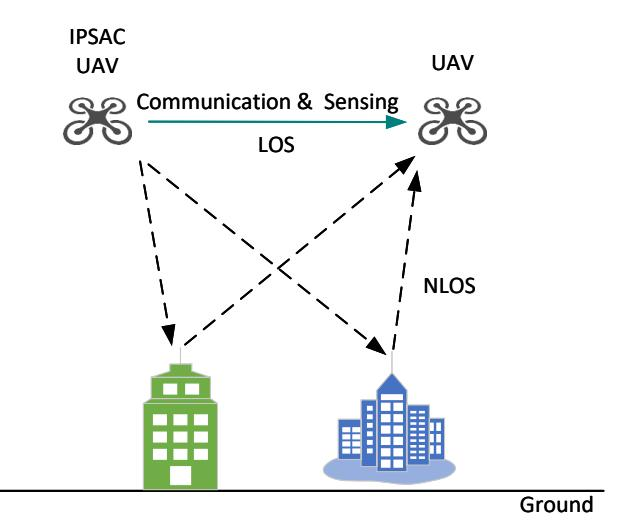

Fig. 1: UAV based communication and sensing scenarios.

taken into account [36]. These reflections result in multipath propagation, which significantly impacts both communication quality and sensing accuracy.

It is worth noting that the considered scenario is not limited to a narrow propagation condition but inherently encompasses both direct and reflected signal components, thereby capturing the essential characteristics of an urban UAV-to-UAV optical wireless channel. Within this framework, this paper focuses on TDOA estimation, which provides fundamental ranging information for localization. Although angle of arrival (AoA) estimation can further enhance localization accuracy, it typically requires additional hardware complexity, such as multiaperture optical receivers or array-based detection. As such, the present work concentrates on TDOA-based analysis, while AoA-assisted extensions can be explored in future studies to achieve full-dimensional localization.

#### A. Transmitted Signal Model

The transmitter of the CEO-OFDM system is illustrated in Fig. 2. The bit stream sent is converted to complex symbols based on the chosen modulation scheme  $\mathbf{X} = [X_{m,0}, X_{m,1}, \ldots, X_{m,N-1}]$ , where m represents the OFDM symbol index and N is the subcarrier count. Maintaining real-valued output requires the input symbol vector of the inverse fast Fourier transform (IFFT) to adhere to Hermitian symmetry. Therefore,  $\mathbf{X}$  must fulfill  $X_{m,k} = X_{m,N-k}^*$  for  $0 < k < \frac{N}{2}$ . The IFFT is applied to  $\mathbf{X}$  to generate the time-domain signal sequence. After the parallel-to-serial conversion, the transmitted OFDM signal is expressed as

$$x_m[n] = \beta \sum_{k=0}^{N-1} X_{m,k} \exp\left(\frac{j2\pi nk}{N}\right)$$

$$n = 0, 1, \dots, N-1.$$
(1)

where  $\beta$  is defined as the power index, it controls the signal scale, affecting the clipping distortion and the transmitted signal power.

A bipolar signal can be converted into a unipolar signal by inverting the negative segment and combining it with the positive segment. When the value of this unipolar signal exceeds  $P_{\rm max}$ , it undergoes hard clipping, and the clipped section is transmitted in the subsequent OFDM block. The nth data of the mth OFDM symbol in CEO-OFDM is represented

$$\hat{x}_{m}[n] = \varphi(x_{m}[n]) + \varphi(-x_{m}[n-N]) + \sum_{\ell=3}^{L} \varphi(|x_{m}[n-(\ell-1)N]| - (\ell-2)P_{\text{max}}),$$
(2)

where  $n = 0, 1, \dots, LN-1$ , indicating that the carrier data has been extended from n to Ln, with L representing a positive integer equal to or exceeding 3.

$$\varphi(x) = \begin{cases} P_{\text{max}}, & x > P_{\text{max}} \\ x, & 0 \le x \le P_{\text{max}} \\ 0, & x < 0. \end{cases}$$
 (3)

The CEO-OFDM technique is designed to reduce distortion by incorporating extra OFDM blocks to relay clipping information. In this method, the original bipolar real OFDM signal is divided into its positive and negative components. These components are transmitted sequentially in the first and second OFDM blocks. Any portion of the signal that exceeds the maximum power  $P_{\rm max}$  is clipped, while additional OFDM blocks are utilized to convey clipping information and thereby mitigate its effects. In L-CEO-OFDM, each OFDM symbol is divided into L blocks, and clipping distortion occurs only in the final block. It is essential to maintain consistent block durations across all OFDM blocks to ensure accurate signal retrieval at the receiver.

The multipath effect in wireless transmission channels leads to inter-symbol interference (ISI). To mitigate ISI, a CP is inserted into each OFDM block. Consequently, the transmitted signal model, including the CP, can be represented as

$$\tilde{x}_m[n] = \varphi(x_m^{\text{cp}}[n]) + \varphi(-x_m^{\text{cp}}[n-N]) + \sum_{\ell=3}^{L} \varphi\left(|x_m^{\text{cp}}[n-(\ell-1)N]| - (\ell-2)P_{\text{max}}\right),$$
(4)

where

$$x_m^{\text{cp}}[n] = \begin{cases} x_m[n - N_{\text{cp}} + N] & \text{for } 0 \le n < N_{\text{cp}} \\ x_m[n - N_{\text{cp}}] & \text{for } N_{\text{cp}} \le n < N_{\text{o}}. \end{cases}$$
(5)

 $N_{\rm cp}$  is the length of the CP, and  $N_{\rm o}=N_{\rm cp}+N$  represents the overall length of the OFDM symbol.

#### B. Channel Model

In OWC systems, multipath propagation is a common phenomenon that often leads to severe ISI in the received signal, resulting in frequency-selective fading. To mitigate the detrimental effects of multipath channels, the system typically introduces a CP between OFDM symbols, while at the receiver, a frequency domain single-tap equalizer is employed to independently compensate for distortions on each subcarrier, thereby effectively suppressing multipath-induced impairments [37]–[39].

In contrast, for wireless sensing tasks, although the received signal also contains multipath components, the accuracy of

{3}------------------------------------------------

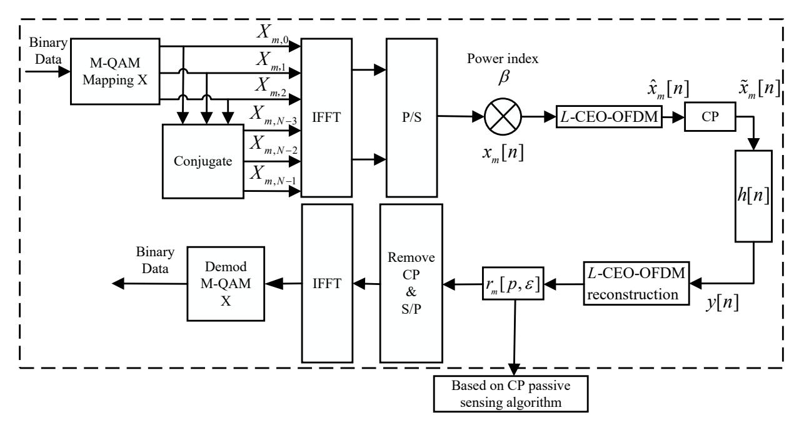

Fig. 2: A block diagram of the proposed system model.

distance estimation and target localization primarily relies on the time-delay information conveyed by the LoS path. In the time domain, the LoS component makes it a critical feature for achieving time-delay estimation and precise sensing. Therefore, to simplify channel modeling and highlight the dominant influence of the LoS path on sensing performance, this work considers only the strong LoS component in the sensing channel model, while neglecting the contributions of weaker reflected paths, thereby focusing on the most informative delay feature. As a result, the channel impulse response can be expressed mathematically as

$$h[n] = g\delta[n - \varepsilon],\tag{6}$$

where g symbolizes the channel loss from the transmitter to the receiver, under the assumption that g remains constant. The notation  $\delta[n-\varepsilon]$  signifies the Dirac delta function delayed by  $\varepsilon$ , reflecting the time delay resulting from the transmission distance. This research employs a CP for the estimation of time of arrival (TOA) and TDOA, which are then used to determine the distance and velocity between the transmitter and receiver.

Although this study focuses on a simplified single-path channel model, the proposed sensing method demonstrates strong adaptability to multi-path environments. In practical scenarios involving multiple reflections, the echoes induced by different paths result in multiple small valued correlation peaks in the output of the proposed algorithm, enabling effective separation and identification of delay of the LOS path. Thus, in this work, we do not discuss the multi-path scenario.

### C. Received Signal Model

At the receiver, the signal received undergoes interference from both the channel and noise sources. The discrete signal received, denoted as y[n], can be represented as

$$y[n] = \rho \cdot h[n] * \tilde{x}_m[n] + w_y[n]$$
  
=  $q\rho \cdot \tilde{x}_m[n - \varepsilon] + w_y[n],$  (7)

where  $\rho$  is the responsivity of the photodetector (PD). For simplicity, let us assume that  $g\rho$  remains constant. The symbol \* denotes discrete-time convolution, while  $w_y[n]$  represents additive noise, which includes shot noise and thermal noise. This additive noise is expected to adhere to a Gaussian distribution with a mean of zero and a variance of  $\sigma_n^2 = N_n f_s$ , where  $N_n$  stands for the noise power spectrum density, and  $f_s$  represents the sampling frequency, assumed to match the effective bandwidth of the receiver.

To facilitate signal reconstruction, the discrete signal y[n] that is received is divided into sections, each with a length of  $LN_{\rm o}$ . Furthermore, each segment of  $LN_{\rm o}$  length is then subdivided into L data segments each of length  $N_{\rm o}$ , denoted as  $y_m[\ell,p]$ , where

$$m = \left\lfloor \frac{n}{LN_{o}} \right\rfloor$$

$$\ell = \left\lfloor \frac{\langle n \rangle_{LN_{o}}}{N_{o}} \right\rfloor + 1$$

$$p = \left\langle \langle n \rangle_{LN_{o}} \right\rangle_{N_{o}}.$$
(8)

In (8),  $\lfloor \cdot \rfloor$  represents the floor function. We denote the remainder of n modulo N by  $\langle n \rangle_N$ , which can be expressed as  $\langle n \rangle_N = n \mod N$ . Assume that the arbitrary discrete-time delay is smaller than the CP length, denoted as  $\forall \ \varepsilon \leq N_{\rm cp}$ .

The received L-CEO-OFDM signal undergoes a transformation into a bipolar OFDM signal by consolidating data from

{4}------------------------------------------------

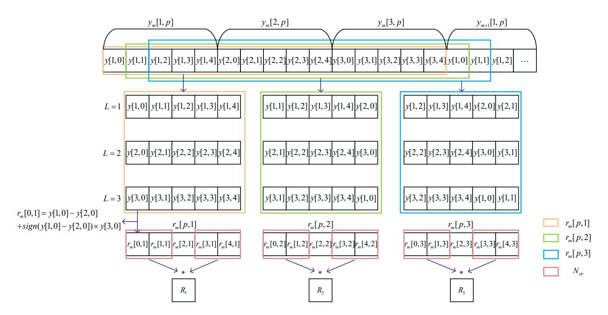

Fig. 3: The signal flowchart of the proposed passive sensing algorithm.

all OFDM blocks, the pth sample of the reconstructed signal within an OFDM symbol can be expressed as [17]

$$r_{m}[p,\varepsilon] = \left(y_{m}\left[1 + \left\lfloor \frac{p+\varepsilon}{N_{o}} \right\rfloor, \langle p+\varepsilon \rangle_{N_{o}} \right] - y_{m}\left[2 + \left\lfloor \frac{p+\varepsilon}{N_{o}} \right\rfloor, \langle p+\varepsilon \rangle_{N_{o}} \right]\right) + \sum_{\ell=3}^{L} \operatorname{sign}\left(y_{m}\left[1 + \left\lfloor \frac{p+\varepsilon}{N_{o}} \right\rfloor, \langle p+\varepsilon \rangle_{N_{o}} \right]\right) - y_{m}\left[2 + \left\lfloor \frac{p+\varepsilon}{N_{o}} \right\rfloor, \langle p+\varepsilon \rangle_{N_{o}} \right]\right) \times y_{m}\left[\ell + \left\lfloor \frac{p+\varepsilon}{N_{o}} \right\rfloor, \langle p+\varepsilon \rangle_{N_{o}}\right].$$
(9)

Upon the removal of the CP, the signal received after transmission is denoted as  $r_m[n,\varepsilon]$ . Due to the peak power limit of the light source, the reconstructed signal  $r_m[n,\varepsilon]$  can be characterized with the Bussgang theorem, resulting in the following formulation

$$r_m[n,\varepsilon] = \rho h[n] * (\alpha(\beta) \cdot x_m[n] + w_{\text{clip}}[n]) + w_r[n]$$
  
=  $\alpha(\beta) x_m[n-\varepsilon] + w_{\text{clip}}[n-\varepsilon] + w_r[n],$  (10)

where  $\alpha(\beta)$  quantifies the clipping factor induced by power limitations,  $w_{\text{clip}}[n]$  represents the clipping noise caused by hard clipping at the transmitter,

$$\alpha(\beta) = \frac{1}{\sigma_x^3 \sqrt{2\pi}} \int_{-\infty}^{+\infty} x \psi(x, L) \exp\left(-\frac{x^2}{2\beta^2 \sigma_x^2}\right) dx$$
$$= 1 - \operatorname{erfc}\left(\frac{(L+1)P_{\text{max}}}{\beta\sqrt{2\sigma_x^2}}\right). \tag{11}$$

 $\beta^2 \sigma_x^2$  represents the variance of  $x_m[n]$ ,  $\psi(x, L)$  is a non-linear function, represented as

$$\psi(x,L) = \begin{cases} -(L+1)P_{\text{max}}, x < -(L+1)P_{\text{max}} \\ x, -(L+1)P_{\text{max}} < x < (L+1)P_{\text{max}} \\ (L+1)P_{\text{max}}, x > (L+1)P_{\text{max}}. \end{cases}$$
(12)

Since  $w_y[n]$  follows a Gaussian distributed,  $w_r[n]$  is also a Gaussian-distributed random variable with zero mean and a variance of  $\sigma_r^2 = L\sigma_n^2$ .

# III. PASSIVE SENSING ALGORITHM USING CYCLIC PREFIX IN CEO-OFDM

This section presents a CP-based IPSAC technique that employs the CP for correlation analysis in estimating the TDOA of the signal to achieve precise distance and velocity measurements. Furthermore, the CRLB of the algorithm expression is derived to assess the system's sensing accuracy.

#### A. CEO-OFDM Passive Sensing Algorithm

The received L-CEO-OFDM signal can be reconstructed into a bipolar OFDM signal by combining the information from all data blocks. Due to a delay  $\varepsilon$ , only the correct reconstruction of the OFDM blocks can restore the original transmitted signal. When the signal is fully reconstructed, the correlation between the CP of the reconstructed signal and the subsequent data blocks reaches its maximum. The signal is progressively reconstructed by employing an exhaustive search method, and the correlation values are calculated to find the optimal match.

In Fig. 3, assuming L=3,  $N_{\rm o}=5$ , and  $N_{\rm cp}=2$ , a complete OFDM symbol with CP is reconstructed by combining three received OFDM blocks with CP. From the received signal y[n], continuous data segments of length 20 are reconstructed

{5}------------------------------------------------

for subsequent signal processing and further reconstruction. Since the delay is smaller than the length of the CP, the  $x_m[n]$  signal can be fully reconstructed. Initially, data segments of length  $LN_0$  (15 subcarriers) are extracted and reconstructed as  $r_m[p,1]$  starting from the first subcarrier of the received signal. The first subcarrier of the reconstructed signal  $r_m[0,1]$  is calculated as  $r_m[0,1] = y_m[1,0] - y_m[2,0] + \mathrm{sign}(y_m[1,0] - y_m[2,0]) \times y_m[3,0]$ , and this process continues for the subsequent subcarrier until the last subcarrier data is reconstructed as  $r_m[4,1]$ . Following this, additional segments of length 15 are reconstructed starting from the second subcarrier of the received signal into  $r_m[p,2]$ , repeating the process until  $r_m[p,5]$  is obtained. Correlation processing is then performed on the reconstructed signal, which is

$$R_{\varepsilon} = \frac{1}{M} \sum_{m=1}^{M} \sum_{p=0}^{N_{\text{cp}}-1} r_m[p, \varepsilon] r_m[p+N, \varepsilon]$$

$$= \frac{1}{M} \sum_{m=1}^{M} \sum_{p=0}^{N_{\text{cp}}-1} (\alpha(\beta) x_m[p-\varepsilon] + w_{\text{clip}}[p-\varepsilon] + w[p])$$

$$\times (\alpha(\beta) x_m[p+N-\varepsilon] + w_{\text{clip}}[p+N-\varepsilon] + w[p+N])$$

$$= \frac{1}{M} \sum_{m=1}^{M} \sum_{p=0}^{N_{\text{cp}}-1} \left\{ \alpha^2(\beta) x_m[p-\varepsilon] x_m[p+N-\varepsilon] + \alpha(\beta) x_m[p+N-\varepsilon] w[p] + w[p] w_{\text{clip}}[p+N-\varepsilon] + w_{\text{clip}}[p-\varepsilon] w_{\text{clip}}[p+N-\varepsilon] + w[p] w[p+N] + \alpha(\beta) x_m[p-\varepsilon] w[p+N] + w[p+N] w_{\text{clip}}[p-\varepsilon] + \alpha(\beta) x_m[p-\varepsilon] w_{\text{clip}}[p+N-\varepsilon] + \alpha(\beta) x_m[p-\varepsilon] w_{\text{clip}}[p+N-\varepsilon] + \alpha(\beta) x_m[p+N-\varepsilon] w_{\text{clip}}[p-\varepsilon] \right\}.$$
(13)

In (13), as the value of M tends towards infinity, according to the law of large numbers, the cross terms, being mutually independent, converge to zero in expectation, and only the autocorrelation terms with non-zero means are retained as the final expected value. It can be observed that

$$\hat{R}_{\varepsilon} = E\{R_{\varepsilon}\}\$$

$$= \alpha^{2}(\beta)x_{m}[p-\varepsilon]x_{m}[p+N-\varepsilon] + w_{\text{clin}}[p-\varepsilon]w_{\text{clin}}[p+N-\varepsilon] + w[p]w[p+N],$$
(14)

and for each reconstructed signal, the corresponding  $\hat{R}_{\varepsilon}$  value is calculated. When the signal is accurately recovered, the  $\varepsilon$  value reaches its maximum, leading to the following conclusion,

$$\hat{\varepsilon}^* = \arg\max_{\varepsilon} \left\{ \hat{R}_{\varepsilon} \right\}. \tag{15}$$

In the case of multi-user communication, each user can sequentially follow the above procedure to compute its respective  $\varepsilon$  and the corresponding  $\hat{R}_{\varepsilon}$  value.

# B. Estimation of Distance and velocity in Passive Sensing Process

In the considered IPSAC system, the actual communication content remains confidential; only the size of the OFDM blocks and the length of the CP are known. The CP contains a copy of the trailing portion of the OFDM symbol to combat inter-symbol interference and preserve orthogonality. This inherent structural similarity facilitates synchronization and enhances the accuracy of TOA and TDOA estimations. Consequently, both the distance and velocity of the target can be accurately determined.

OFDM transmits data by dividing the bandwidth B into multiple orthogonal subcarriers. Specifically, OFDM employs an N-point FFT to transform the signal between the time and frequency domains. The subcarrier spacing is  $\Delta f = \frac{B}{N}$ , and the corresponding OFDM symbol duration is  $T = \frac{N}{B}$ . The sampling interval is  $\frac{1}{B}$ , and the distance resolution is given by  $\frac{c}{B}$ , where c is the speed of light. Based on the maximum value  $\hat{\varepsilon}^*$  estimated by the sliding window, the distance between the receiver and the transmitter can be expressed as

$$\hat{d} = \frac{c\hat{\varepsilon}^*}{R}.\tag{16}$$

In OFDM systems, TDOA can be exploited for velocity estimation. Denote the first estimated TOA by  $\frac{\hat{\varepsilon}_i^*}{B}$ , which corresponds to a distance of  $\hat{d}_i = c\frac{\hat{\varepsilon}_i^*}{B}$ . Assuming the target moves with a relative velocity v, the second TOA estimate after a time interval t is given by  $\frac{\hat{\varepsilon}_{i+1}^*}{B}$ , corresponding to a distance  $\hat{d}_{i+1} = c\frac{\hat{\varepsilon}_{i+1}^*}{B}$ . The relative velocity can then be estimated as

$$\hat{v} = \frac{\Delta d}{t},\tag{17}$$

here,  $\Delta d = \hat{d}_{i+1} - \hat{d}_i$  denotes the difference between two consecutive distance estimates, and the relative velocity is given by

$$\hat{v} = \frac{c(\hat{\varepsilon}_{i+1}^* - \hat{\varepsilon}_i^*)}{Bt}.$$
 (18)

The relative velocity  $\hat{v}$  is affected by errors in the TDOA estimation. When such errors are absent,  $\hat{v}$  precisely corresponds to the true velocity of the target's motion.

#### C. CRLB Estimation of Passive Sensing

This paper examines the CRLB for integrated passive sensing and OWC. Based on equation (10), the likelihood function is given by

$$p(r_m, \varepsilon) = \frac{1}{(2\pi\sigma_r^2)^{\frac{N}{2}}} \times \exp\left\{-\frac{1}{2\sigma_r^2} \sum_{n=0}^{N-1} (r_m[n, \varepsilon] - \alpha(\beta)x_m[n-\varepsilon] - w_{\text{clip}}[n-\varepsilon])^2\right\}.$$
(19)

Taking the derivative once yields,

$$\frac{\partial \ln p(r_m, \varepsilon)}{\partial \varepsilon} = \frac{1}{\sigma_r^2} \sum_{n=0}^{N-1} (r_m[n, \varepsilon] - \alpha(\beta) x_m[n - \varepsilon] 
-w_{\text{clip}}[n - \varepsilon]) \times \frac{\partial (\alpha(\beta) x_m[n - \varepsilon] + w_{\text{clip}}[n - \varepsilon])}{\partial \varepsilon}.$$
(20)

{6}------------------------------------------------

The second derivative is

$$\frac{\partial^{2} \ln p(r_{m}, \varepsilon)}{\partial \varepsilon^{2}} = \frac{1}{\sigma_{r}^{2}} \sum_{n=0}^{N-1} \left\{ (r_{m}[n, \varepsilon] - \alpha(\beta) x_{m}[n - \varepsilon] - w_{\text{clip}}[n - \varepsilon]) \times \frac{\partial^{2} (\alpha(\beta) x_{m}[n - \varepsilon] + w_{\text{clip}}[n - \varepsilon])}{\partial \varepsilon^{2}} - \left( \frac{\partial (\alpha(\beta) x_{m}[n - \varepsilon] + w_{\text{clip}}[n - \varepsilon])}{\partial \varepsilon} \right)^{2} \right\}.$$
(21)

After taking the mathematical expectation of the formula, we can get

$$E\left(\frac{\partial^2 \ln p\left(r_m,\varepsilon\right)}{\partial \varepsilon^2}\right) = -\frac{1}{\sigma_r^2} \sum_{n=0}^{N-1} \left(\frac{\partial \alpha(\beta) x_m[n-\varepsilon]}{\partial \varepsilon}\right)^2.$$
(22)

Thus, we have

$$\operatorname{var}(\hat{\varepsilon}^*) \ge \frac{\sigma_r^2}{\sum_{n=0}^{N-1} \left(\frac{\partial \alpha(\beta) x_m[n-\varepsilon]}{\partial \varepsilon}\right)^2}.$$
 (23)

Assuming the sampling time interval is small enough to approximate the sum with an integral, we have

$$\operatorname{var}(\hat{\varepsilon}^*) \ge \frac{\sigma_r^2}{B \int_0^T \left(\frac{d\alpha(\beta)x_m(t)}{dt}\right)^2 dt},$$
 (24)

where

$$x_m(t) = \frac{\beta}{N} \sum_{n=0}^{N-1} X_{m,n} \exp(j2\pi f_n t).$$
 (25)

Simplified, we can get

$$\frac{\operatorname{var}(\hat{\varepsilon}^*) \ge}{4B(\alpha(\beta)\pi\beta)^2 \int_0^T \left(\sum_{n=0}^{N-1} f_n X_{m,n} \exp(j2\pi f_n t)\right)^2 dt}.$$
 (26)

Thus, the CRLB for the estimated distance can be expressed as

$$\frac{\operatorname{var}(\hat{d}) \ge}{4B(\alpha(\beta)\pi\beta)^2 \int_0^T \left(\sum_{n=0}^{N-1} f_n X_{m,n} \exp(j2\pi f_n t)\right)^2 dt}.$$
 (27)

#### IV. PERFORMANCE ANALYSIS

For drone target detection, this section provides a comparative analysis of the communication and sensing performance of DCO-OFDM, ACO-OFDM, and CEO-OFDM under the same effective data transmission rate. Although CEO-OFDM occupies a wider bandwidth, resulting in reduced spectral efficiency, this bandwidth expansion enhances communication reliability and improves sensing accuracy. Consequently, a favorable balance is achieved between bandwidth utilization and overall system performance. It is important to mention that the parameters employed in this section adhere to the standard values outlined in Table I, which align with the typical settings found in the reference paper [40].

TABLE I: Parameters Used For Simulation Results

| Parameters                           | Values                   |
|--------------------------------------|--------------------------|
| Peak optical power limit, $P_{\max}$ | 15 mW                    |
| Number of subcarriers , $N$          | 256,512                  |
| Noise spectral density, $N_{\rm n}$  | $3 \times 10^{-9}$ mW/Hz |
| Modulation constellation size, $K$   | 16                       |
| Number of OFDM blocks , $L$          | 3                        |
| CP length, $N_{\rm cp}$              | 32,64,128                |

Fig. 4 demonstrates the changes in bit error rate (BER) and TDOA for different  $\beta/P_{\rm max}$  values. This research employs simulations of DCO-OFDM, ACO-OFDM, and CEO-OFDM systems to evaluate the communication and sensing capabilities of optical communication systems. Concerning communication performance, an increase in  $\beta/P_{\text{max}}$  initially decreases BER before eventually causing a rise. This trend is due to the absence of signal clipping initially, allowing for additional signal power enhancement, thereby improving the signal-to-noise ratio (SNR) and reducing BER. The analysis reveals the lowest BER at  $\beta/P_{\rm max}$  values of 0.14, 0.57, and 0.71 for DCO-OFDM, ACO-OFDM, and CEO-OFDM systems, respectively. However, a continuous increase in  $\beta/P_{\rm max}$ results in significant clipping, introducing noticeable clipping noise and subsequently increasing BER. In terms of sensing performance, the TDOA error gradually decreases with higher  $\beta/P_{\rm max}$  values, attributed to increased signal power and enhanced signal correlation. At a  $\beta/P_{\rm max}$  of 0.71, the TDOA errors stabilize across all systems, with the CEO-OFDM system consistently demonstrating the lowest TDOA

Fig. 5 shows how the variation in TDOA error changes with different transmission rates. Among the three systems, the optimal communication performance corresponding to the lowest BER is achieved at  $\beta/P_{\rm max}$  values of 0.14 for DCO-OFDM, 0.57 for ACO-OFDM, and 0.71 for CEO-OFDM, respectively. With increasing transmission rates, noise levels also increase,

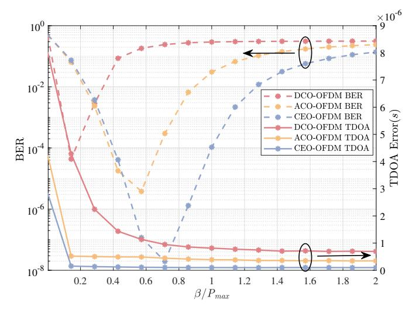

Fig. 4: Analysis of BER and TDOA error performance under different  $\beta/P_{\rm max}$  values when  $N=256,\,N_{\rm cp}=64$  and M=1

{7}------------------------------------------------

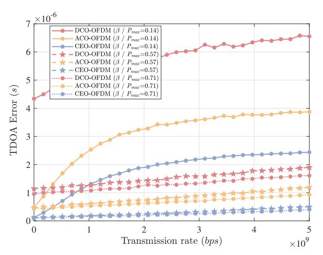

Fig. 5: TDOA error performance under different β/Pmax values for DCO-OFDM, ACO-OFDM, and CEO-OFDM as a function of transmission rate when N = 256, Ncp = 64 and M = 1.

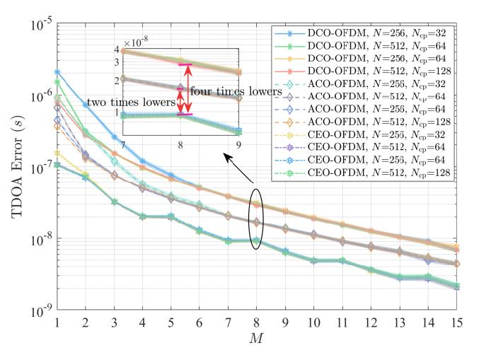

Fig. 6: TDOA error performance as a function of frame number M for DCO-OFDM, ACO-OFDM and CEO-OFDM under varying carrier counts N and Ncp length, with β/Pmax = 0.71, and a 95% confidence interval.

leading to a decrease in system synchronization accuracy and an uptick in TDOA errors. This is because higher transmission rates require increased bandwidth, which in turn introduces more noise power within the system. At β/Pmax = 0.14, the low signal power makes noise significantly impact TDOA errors with rising transmission rates. However, with β/Pmax at 0.57 and 0.71, the rate at which TDOA errors grow slows down, suggesting better noise resilience and synchronization performance at higher power levels. Noteworthy is that under all three β/Pmax scenarios, CEO-OFDM consistently exhibits the smallest TDOA error, emphasizing its superior synchronization accuracy and improved sensing capabilities.

Fig. 6 demonstrates the influence of the lengths of N and Ncp on TDOA error and its confidence interval across various transmission frame numbers. With an increase in the number of transmission frames M, the sensing error in optical

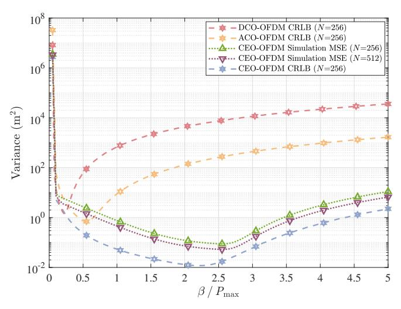

Fig. 7: Variation of CRLB for distance estimation in DCO-OFDM, ACO-OFDM and CEO-OFDM systems with varying β/Pmax values.

communication systems decreases gradually. This reduction can be attributed to the enhanced correlation and decreased noise interference in multi-frame transmissions compared to single-frame transmissions, which ultimately leads to improved system synchronization. The selection of the length of Ncp is based on the maximum delay of the multipath channel; a longer Ncp enhances signal synchronization and boosts the accuracy of correlation analysis. However, as the number of frames increases, the impact of varying subcarrier numbers and Ncp lengths on the TDOA error tends to converge. Even in single-frame transmissions, the CEO-OFDM system demonstrates the lowest TDOA estimation error. As the value of M increases, the TDOA estimation error in the CEO-OFDM system is less than four times that of the DCO-OFDM system and less than twice that of the ACO-OFDM system.

Fig. 7 presents the performance trends of five representative curves as functions of β/Pmax. These curves include the CRLBs for distance estimation in the DCO-OFDM, ACO-OFDM, and CEO-OFDM systems, along with the mean square error (MSE) obtained from simulations of the CEO-OFDM system with N = 256 subcarriers and an additional CEO-OFDM MSE curve obtained by increasing the number of subcarriers to N = 512, effectively doubling the signal sampling points. All three CRLB curves exhibit a consistent trend: the bound initially decreases with increasing β/Pmax, reaches a minimum, and subsequently rises to a steady state value, indicating the presence of an optimal power ratio beyond which estimation performance deteriorates. The initial improvement is attributable to increased signal power and improved correlation performance facilitated by the CP. Once β/Pmax exceeds a certain threshold, severe clipping noise degrades correlation, thus reducing estimation precision. The MSE obtained from simulations of the CEO-OFDM system with N = 256 closely follows its corresponding CRLB over most of the range, although noticeable deviations appear in certain regions. Increasing the number of subcarriers to N = 512 substantially reduces these deviations, as the higher

{8}------------------------------------------------

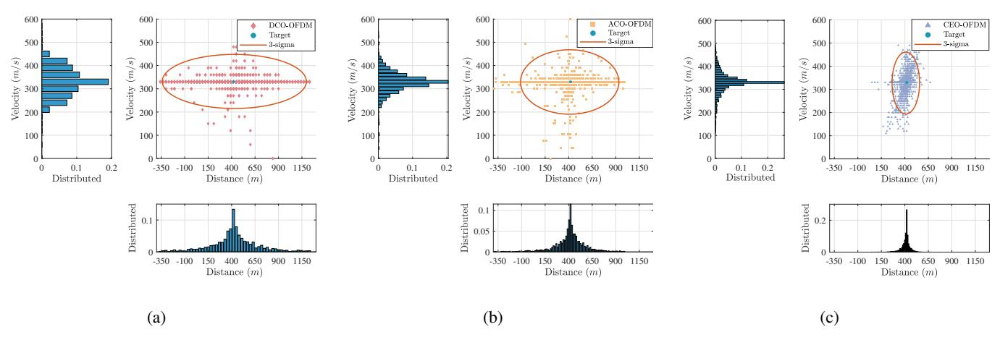

Fig. 8: Distributions of distance and velocity estimates for DCO-OFDM, ACO-OFDM, and CEO-OFDM with M = 1, N = 256, β/Pmax = 0.71, and Ncp = 64.

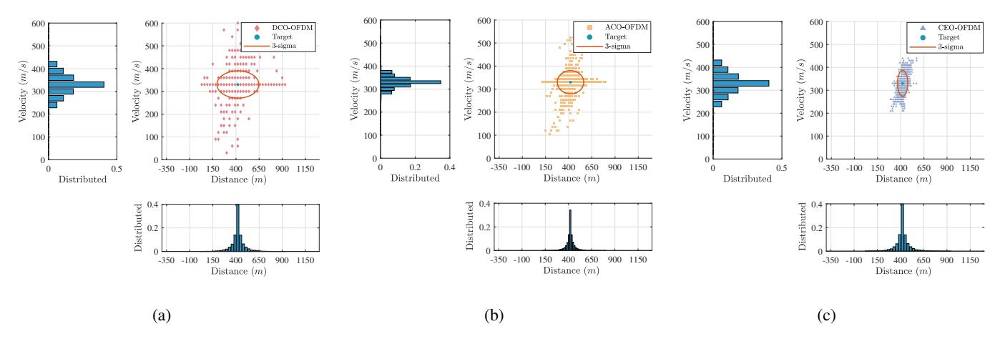

Fig. 9: Distributions of distance and velocity estimates for DCO-OFDM, ACO-OFDM, and CEO-OFDM with M = 3, N = 256, β/Pmax = 0.71, and Ncp = 64.

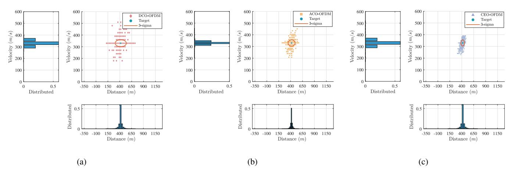

Fig. 10: Distributions of distance and velocity estimates for DCO-OFDM, ACO-OFDM, and CEO-OFDM with M = 5, N = 256, β/Pmax = 0.71, and Ncp = 64.

frequency-domain resolution enables a more accurate representation of the signal structure, bringing the MSE closer to the theoretical bound. Taken together, CEO-OFDM consistently outperforms the DCO-OFDM and ACO-OFDM systems for all examined β/Pmax values in terms of both CRLBs and MSE, highlighting its superior capability for high-precision sensing applications.

Figs.8, 9, and 10 present the variations in estimated distance and velocity errors across different numbers of frames. It is evident that with an increasing number of frames, the errors in

{9}------------------------------------------------

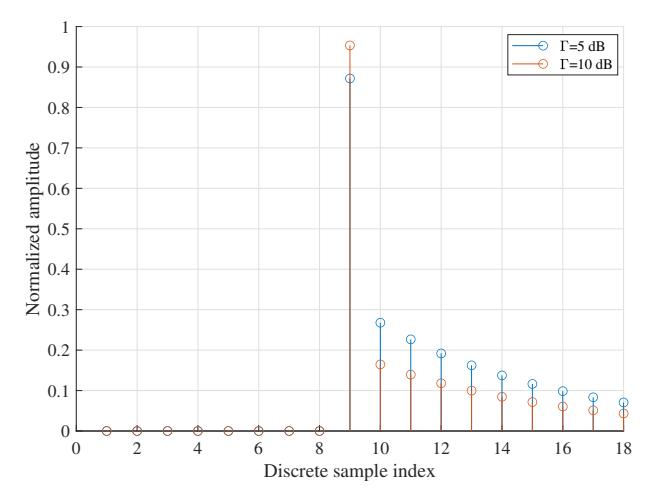

Fig. 11: Multipath channel impulse response one LOS and NLOS taps under  $\Gamma=5$  dB and  $\Gamma=10$  dB.

distance and velocity estimation consistently decrease for all modulation schemes: DCO-OFDM, ACO-OFDM, and CEO-OFDM. Moreover, the range within three standard deviations becomes narrower, indicating a more precise clustering of estimates around the true values. This pattern suggests an improved accuracy in estimating both distance and velocity as the number of frames grows. Notably, when comparing performance under the same number of frames, CEO-OFDM consistently demonstrates lower estimation errors for both distance and velocity compared to DCO-OFDM and ACO-OFDM. This observation highlights the superior precision of CEO-OFDM in these aspects, thereby increasing the likelihood of achieving accurate estimates for distance and velocity.

Fig. 11 depicts the discrete multipath channel impulse response with normalized amplitude. The channel is characterized by a 3GPP reference signal and encompasses both LOS and NLOS paths [41]. To assess the impact of multipath propagation, we introduce  $\Gamma$  as the power ratio between the LOS component and the total NLOS power. When  $\Gamma=5$  dB, the NLOS components exhibit significant influence, resulting in a broader range of amplitudes and more pronounced fading effects. Conversely, when  $\Gamma=10$  dB, the LOS component predominates, leading to amplitudes concentrated around the main tap. This multipath channel model is used to validate the proposed sensing technique.

Fig. 12 presents the distributions of the estimated distance and velocity for CEO-OFDM under the two distinct  $\Gamma$  conditions. The results indicate that the estimated distances deviate from a Gaussian distribution and instead capture the statistical characteristics of the multipath channel, while remaining concentrated around the dominant peak, consistent with the LOS-dominated scenario. In contrast, the estimated velocities exhibit an approximately Gaussian distribution across both  $\Gamma$  values. These findings demonstrate that, although multipath propagation introduces statistical variations, the proposed CEO-OFDM algorithm consistently provides robust and reliable estimation performance in UAV optical communication scenarios.

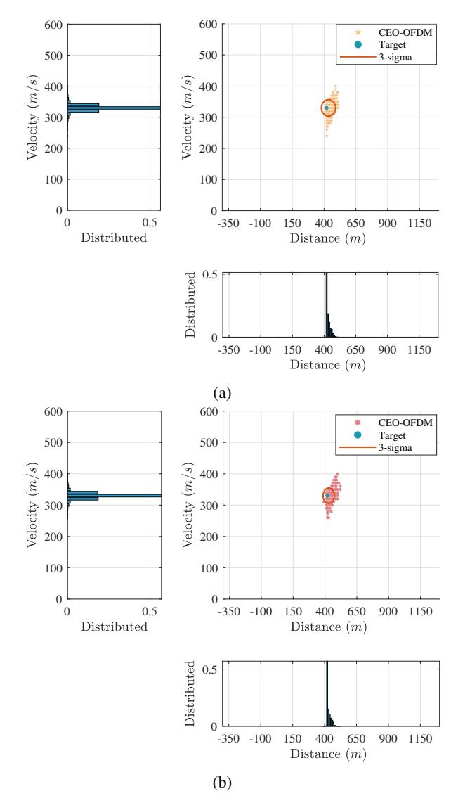

Fig. 12: Distributions of distance and velocity estimates of CEO-OFDM in multipath channels with N=256 and M=5 under different  $\Gamma$  values (a)  $\Gamma=5$  dB; (b)  $\Gamma=10$  dB.

#### V. CONCLUSION

This study investigates passive sensing techniques in powerlimited OWC systems utilizing communication signals. To overcome the peak transmitted power constraint in OWC systems, CEO-OFDM is utilized to alleviate signal distortion instead of the traditional DCO- and ACO-OFDM. By leveraging the communication signal for sensing, a novel approach is introduced that utilizes the CP blocks within the CEO-OFDM system to estimate target distance and velocity without requiring additional sensing signals. This method effectively caters to both communication and passive sensing requirements. Simulation results demonstrate that our proposed method outperforms conventional DCO-OFDM and ACO-OFDM systems in terms of BER performance, as well as the accuracy of distance and velocity estimation. Furthermore, we establish CRLB formulas for O-OFDM systems employed in passive sensing and communication through theoretical analysis. The 

{10}------------------------------------------------

results indicate that the use of CEO-OFDM greatly improves sensing accuracy. During the multi-frame TDOA estimation phase, the TDOA estimation error is about four times less in the CEO-OFDM system compared to the DCO-OFDM system and two times less than the ACO-OFDM system. This demonstrates significant enhancements in estimating both target distance and velocity when compared to traditional optical communication methods.

#### REFERENCES

- [1] C.-W. Chow, "Recent advances and future perspectives in optical wireless communication, free space optical communication and sensing for 6G," *Journal of Lightwave Technology*, vol. 42, no. 11, pp. 3972–3980, 2024.
- [2] M. Karbalayghareh, F. Miramirkhani, H. B. Eldeeb, R. C. Kizilirmak, S. M. Sait, and M. Uysal, "Channel modelling and performance limits of vehicular visible light communication systems," *IEEE Transactions on Vehicular Technology*, vol. 69, no. 7, pp. 6891–6901, 2020.
- [3] X. Zhang, G. Klevering, X. Lei, Y. Hu, L. Xiao, and G.-H. Tu, "The security in optical wireless communication: A survey," *ACM Computing Surveys*, vol. 55, no. 14s, pp. 1–36, 2023.
- [4] Z. Zhang, J. Dang, L. Wu, H. Wang, J. Xia, W. Lei, J. Wang, and X. You, "Optical mobile communications: Principles, implementation, and performance analysis," *IEEE Transactions on Vehicular Technology*, vol. 68, no. 1, pp. 471–482, 2019.
- [5] Z. Wei, Z. Wang, J. Zhang, Q. Li, J. Zhang, and H. Fu, "Evolution of optical wireless communication for B5G/6G," *Progress in Quantum Electronics*, vol. 83, p. 100398, 2022. [Online]. Available: https://www.sciencedirect.com/science/article/pii/S0079672722000246
- [6] P. Sharda, "Next generation based vehicular visible light communications: A novel transmission scheme," *IEEE Transactions on Vehicular Technology*, vol. 73, no. 11, pp. 16 735–16 743, 2024.
- [7] R. Raj, K. Jindal, and A. Dixit, "Fairness enhancement of Non-Orthogonal Multiple Access in VLC-Based IoT networks for intravehicular applications," *IEEE Transactions on Vehicular Technology*, vol. 71, no. 7, pp. 7414–7427, 2022.
- [8] B. Soner and S. Coleri, "Visible light communication based vehicle localization for collision avoidance and platooning," *IEEE Transactions on Vehicular Technology*, vol. 70, no. 3, pp. 2167–2180, 2021.
- [9] N. Hu, J. Yang, W. Pan, Q. Xu, S. Shao, and Y. Tang, "UAV detection based on the variance of higher-order cumulants," *IEEE Transactions on Vehicular Technology*, vol. 73, no. 8, pp. 11 182–11 195, 2024.
- [10] H. Harkat, P. Monteiro, A. Gameiro, F. Guiomar, and H. Farhana Thariq Ahmed, "A survey on MIMO-OFDM systems: Review of recent trends," *Signals*, vol. 3, no. 2, pp. 359–395, 2022.
- [11] R. Alindra, P. S. Priambodo, and K. Ramli, "Review of orthogonal frequency division multiplexing-based modulation techniques for light fidelity," *Journal of Low Power Electronics and Applications*, vol. 13, no. 3, p. 46, 2023.
- [12] J. Armstrong, "OFDM for optical communications," *Journal of Lightwave Technology*, vol. 27, no. 3, pp. 189–204, 2009.
- [13] ——, "OFDM and MIMO OFDM for intensity-modulated directdetection systems," in *2014 OptoElectronics and Communication Conference and Australian Conference on Optical Fibre Technology*. IEEE, 2014, pp. 935–937.
- [14] S. D. Dissanayake and J. Armstrong, "Comparison of ACO-OFDM, DCO-OFDM and ADO-OFDM in IM/DD systems," *Journal of lightwave technology*, vol. 31, no. 7, pp. 1063–1072, 2013.
- [15] J. Armstrong and A. J. Lowery, "Power efficient optical OFDM," *Electronics letters*, vol. 42, no. 6, p. 1, 2006.
- [16] D. Tsonev, S. Sinanovic, and H. Haas, "Novel unipolar orthogonal frequency division multiplexing (U-OFDM) for optical wireless," in *2012 IEEE 75th Vehicular Technology Conference (VTC Spring)*. IEEE, 2012, pp. 1–5.
- [17] J. Lian and M. Brandt-Pearce, "Clipping-enhanced optical OFDM for visible light communication systems," *Journal of Lightwave Technology*, vol. 37, no. 13, pp. 3324–3332, 2019.
- [18] G. Wang, A. M.-C. So, and Y. Li, "Robust convex approximation methods for TDOA-based localization under NLOS conditions," *IEEE Transactions on Signal processing*, vol. 64, no. 13, pp. 3281–3296, 2016.
- [19] K. Yang, J. An, X. Bu, and G. Sun, "Constrained total least-squares location algorithm using time-difference-of-arrival measurements," *IEEE Transactions on Vehicular Technology*, vol. 59, no. 3, pp. 1558–1562, 2009.

- [20] P. Du, S. Zhang, C. Chen, A. Alphones, and W.-D. Zhong, "Demonstration of a low-complexity indoor visible light positioning system using an enhanced TDOA scheme," *IEEE Photonics Journal*, vol. 10, no. 4, pp. 1–10, 2018.
- [21] A. Naeem, N. U. Hassan, M. A. Pasha, C. Yuen, and A. Sikora, "Performance analysis of TDOA-based indoor positioning systems using visible LED lights," in *2018 IEEE 4th International Symposium on Wireless Systems within the International Conferences on Intelligent Data Acquisition and Advanced Computing Systems (IDAACS-SWS)*. IEEE, 2018, pp. 103–107.
- [22] H. Li, O. Elnahas, and Z. Quan, "TDOA-based indoor localization via linear fusion with low-rank matrix approximation," *IEEE Internet of Things Journal*, 2023.
- [23] J. J. Perez-Solano, S. Ezpeleta, and J. M. Claver, "Indoor localization ´ using time difference of arrival with UWB signals and unsynchronized devices," *Ad Hoc Networks*, vol. 99, p. 102067, 2020.
- [24] J. Yang, T. Yan, and W. Sun, "Polynomial fitting and interpolation method in TDOA estimation of sensors network," *IEEE Sensors Journal*, vol. 23, no. 4, pp. 3837–3847, 2023.
- [25] Y. Zou and H. Liu, "TDOA localization with unknown signal propagation speed and sensor position errors," *IEEE Communications Letters*, vol. 24, no. 5, pp. 1024–1027, 2020.
- [26] Y. Liu, C. Chen, Y. Wang, and C. Liu, "Range-independent TDOA localization using stepwise accuracy enhancement under speed uncertainty," *IEEE Signal Processing Letters*, vol. 30, pp. 1372–1376, 2023.
- [27] B. Park, H. Cheon, C. Kang, and D. Hong, "A novel timing estimation method for OFDM systems," *IEEE Communications letters*, vol. 7, no. 5, pp. 239–241, 2003.
- [28] Z. Tian, K. Wright, and X. Zhou, "The darklight rises: visible light communication in the dark: demo," in *Proceedings of the 22nd Annual International Conference on Mobile Computing and Networking*, ser. MobiCom '16. New York, NY, USA: Association for Computing Machinery, 2016, p. 495–496.
- [29] Z. Li, Z. Zang, M. Li, and H. Fu, "LiDAR integrated high-capacity indoor OWC system with user localization capability," in *2021 Optical Fiber Communications Conference and Exhibition (OFC)*. IEEE, 2021, pp. 1–3.
- [30] J. Wang, Z. Bai, J. Lian, Y. Guo, G. Zhu, and Y. Wang, "A power-domain non-orthogonal integrated sensing and communication waveform design using OFDM," *IEEE Wireless Communications Letters*, 2024.
- [31] J. Hu, Y. Wang, H. Jia, W. Hu, M. Hassan, A. Uddin, B. Kusy, and M. Youssef, "Passive light spectral indoor localization," in *Proceedings of the 28th Annual International Conference on Mobile Computing And Networking*, 2022, pp. 832–834.
- [32] Z. Yang, S. Gao, X. Cheng, and L. Yang, "Superposed im-ofdm (S-IM-OFDM): An enhanced OFDM for integrated sensing and communications," *IEEE Transactions on Vehicular Technology*, vol. 73, no. 10, pp. 15 832–15 836, 2024.
- [33] Z. Wei, Z. Wang, J. Zhang, Q. Li, J. Zhang, and H. Fu, "Evolution of optical wireless communication for B5G/6G," *Progress in Quantum Electronics*, vol. 83, p. 100398, 2022.
- [34] J. A. Zhang, M. L. Rahman, K. Wu, X. Huang, Y. J. Guo, S. Chen, and J. Yuan, "Enabling joint communication and radar sensing in mobile networks—a survey," *IEEE Communications Surveys & Tutorials*, vol. 24, no. 1, pp. 306–345, 2021.
- [35] Z. Wei, R. Xu, Z. Feng, H. Wu, N. Zhang, W. Jiang, and X. Yang, "Symbol-level integrated sensing and communication enabled multiple base stations cooperative sensing," *IEEE Transactions on Vehicular Technology*, vol. 73, no. 1, pp. 724–738, 2023.
- [36] P. Raut, K. Singh, C.-P. Li, M.-S. Alouini, and W.-J. Huang, "Nonlinear EH-based UAV-assisted FD IoT networks: Infinite and finite blocklength analysis," *IEEE Internet of Things Journal*, vol. 8, no. 24, pp. 17 655– 17 668, 2021.
- [37] M. Gum¨ us¸ and T. M. Duman, "Channel estimation and symbol de- ¨ modulation for OFDM systems over rapidly varying multipath channels with hybrid deep neural networks," *IEEE Transactions on Wireless Communications*, vol. 22, no. 12, pp. 9361–9373, 2023.
- [38] M. Gum¨ us¸ and T. M. Duman, "Channel estimation and symbol de- ¨ modulation for OFDM systems over rapidly varying multipath channels with hybrid deep neural networks," *IEEE Transactions on Wireless Communications*, vol. 22, no. 12, pp. 9361–9373, 2023.
- [39] Y. Chen, B. Dong, and Y. Xiao, "Fast Blind channel equalization based on online deep neural network," *IEEE Communications Letters*, vol. 28, no. 9, pp. 2161–2165, 2024.
- [40] J. Lian, M. Noshad, and M. Brandt-Pearce, "Comparison of optical OFDM and M-PAM for LED-based communication systems," *IEEE Communications Letters*, vol. 23, no. 3, pp. 430–433, 2019.

{11}------------------------------------------------

[41] T. Jiang, J. Zhang, P. Tang, L. Tian, Y. Zheng, J. Dou, H. Asplund, L. Raschkowski, R. D'Errico, and T. Jams ¨ a, "3gpp standardized 5g ¨ channel model for iiot scenarios: A survey," *IEEE Internet of Things Journal*, vol. 8, no. 11, pp. 8799–8815, 2021.

Jie Lian is an associate professor of electrical engineering at Northwestern Polytechnical University, Xi'an, China. He received a B.S. degree from Northwestern Polytechnical University, China, in 2011 and an M.S. and Ph.D. in electrical engineering from the University of Virginia, Charlottesville, VA, USA, in 2014 and 2017, respectively. From 2018-2019, he was a research associate with the University of Virginia. His research interests include integrated sensing and communication system design, signal processing in communication systems, wireless op-

tical communications, visible light communications and indoor positioning, radar signal processing, and underwater optical wireless communication and sensing. Prof. Lian has served on the editorial board of Optical Communication Technology.

Benben Li received the B.Sc. degree in Computer Science and Technology in 2020 at Henan Polytechnic University in Jiaozuo, China. The master's degree was obtained in Electronic Information from Shaanxi University of Science and Technology in 2023. He is currently pursuing the Ph.D. degree in communication engineering (including broadband networks, mobile communications, etc.) at Northwestern Polytechnical University in Xi'an, China. His main research focus is on optical wireless communication, particularly in the area of optical

integrated sensing and communication.

Jiale Wang received a B.Sc. in detection, guidance, and controlling engineering in 2019 at Northwestern Polytechnical University (NPU) in Xi'an, China. The master's degree is obtained in signal and information processing in the Center of Intelligent Acoustic and Immersive Communication (CIAIC) of NPU in 2022. He is pursuing a Ph.D. in oceanic electronic information from the NPU. His research interests include integrated sensing and communications, optical wireless communication, and acoustical array signal processing.

Chengkai Tang received the Ph.D. degree in communication and information engineering from Northwestern Polytechnical University, Xi'an, Shannxi, China, in May 2015. He is currently an Associate Professor with Northwestern Polytechnical University, a Visiting Scholar with University of Virginia, Charlottesville, VA, USA. He is the author of more than 30 articles. He build the State Key Laboratory for intelligent navigation. He is a co-author of four books and over ten patent families. His research interests include intelligent position, UAV wireless

communication, and cooperative navigation.

Dianbin Lian received the B.S. degree in electrical engineering and the M.S. degree in electronics engineering from Northwestern Polytechnical University (NWPU), Xi'an, China, in 2001 and 2004, respectively.,He was a Senior Engineer with ZTE. He is currently a Research Fellow with NWPU. His research interests include digital signal processing, stochastic signal processing, satellite communication, machine learning, data mining, and wireless communications.

and wireless communication systems.

Baowang Lian received the B.S., M.S., and Ph.D. degrees from Northwestern Polytechnical University. Since April 1986, he has been dedicated to research in satellite navigation, positioning, and wireless communication technology. Since December 1999, he has been a Professor, a Doctoral Supervisor, and the Team Leader of the Department of Communication Engineering, School of Electronics and Information, Northwestern Polytechnical University. Additionally, he was the Director of the DSPs Laboratory, a collaboration between Northwestern

Yan Gao received the B.S. degree from Northwestern University, Xi'an, China, in 2011, and the M.S. degree from the City University of Hong Kong, in 2013.,From 2014 to 2015, she was a Visiting Scholar with West Virginia University. She is currently a Lecturer with Xi'an University. Her current research interests include signal systems, data and information engineering, digital signal processing, Polytechnical University and Texas Instruments. He has undertaken numerous national key projects and many of the research projects he has completed have played significant roles in local areas. His research interests include satellite communication and navigation, visual navigation, integrated navigation, collaborative navigation, and signal processing.

