{0}------------------------------------------------

Received 31 March 2025; revised 9 May 2025; accepted 31 May 2025. Date of publication 6 June 2025; date of current version 25 June 2025.

Digital Object Identifier 10.1109/OJCOMS.2025.3577193

## Radar-LiDAR Fusion-Aided RF Beams Prediction for Vehicular Communications

ZHONG YE®1, YINGHUI HE2 (Member, IEEE), GUANDING YU®1 (Senior Member, IEEE), AND PAVEL LOSKOT® (Senior Member, IEEE)

(Special Issue: Emerging Technologies Enhanced Cooperative Integrated Sensing and Communication in 6G Era)

1College of Information Science and Electronic Engineering, Zhejiang University, Hangzhou 310027, China 2College of Computing and Data Science, Nanyang Technological University, Singapore 639798 3University of Illinois Urbana-Champaign Institute, Zhejiang University, Haining 314400, China

CORRESPONDING AUTHOR: P. LOSKOT (e-mail: pavelloskot@intl.zju.edu.cn).

This work was supported by the Research Grant from Zhejiang University

ABSTRACT The large-scale antenna arrays have become a critical component of the cellular networks infrastructure, since the roll-out of 5G networks. They allow supporting the increased number of mobile users by creating multiple radio-frequency (RF) beams. The hidden problem is the large communication overhead associated with the beamforming in cells with many highly mobile users. In order to reduce the beamforming overhead, the radar-sensing at the base stations has been recently proposed. In this paper, the tracking of mobile users is further enhanced by considering the fusion of radar and LiDAR. It is shown that the fusion improves the accuracy of beam predictions. The radar-LiDAR fusion is designed as a two-step process. In the first step, the relevant features are extracted from sensing data. In the second step, a novel multimodal transformer (MMT) has been devised to perform the data fusion from different sources. In addition, the trade-off between the number of beams and the beam selection is exploiting by adopting beam-pruning. The proposed scheme is evaluated numerically using the DeepSense 6G real-world dataset. The numerical results confirm that the MMT fusion outperforms other deep neural network architectures in terms of both the beam prediction accuracy and the beam stability. These results translate directly into improved beamforming and communication efficiency.

**INDEX TERMS** Beamforming, LiDAR, multimodal fusion, radar, transformer, vehicular communications.

#### I. INTRODUCTION

THE INTEGRATED sensing and communications (ISAC) is an important design feature of the upcoming 6G communication networks [1], [2]. The main motivation of ISAC is to enhance the real-time adaptation of transmissions by exploiting the environment sensing in order to improve the performance and efficiency of communications. The recent works in ISAC mainly focused on dual-function waveform designs, and on developing the underlying signal processing techniques [3], [4]. However, sharing the allocated frequency band between communications and the radar sensing can be rather challenging. For these configurations, the accuracy of channel state information (CSI) estimation and the achievable resolution of the radio-frequency (RF)

beamforming is limited, especially in the low signal-to-interference and noise ration (SINR) conditions and substantial multipath propagation. In order to achieve the desired SINR at the receiver, the millimeter-wave (mmWave) communications and the beam prediction techniques are often considered [5].

The sensing-assisted communications are particularly attractive in vehicular networks, where the fast moving vehicles cause rapid changes in the communication channel conditions. However, estimating the CSI, and tracking the vehicle locations require a significant pilot symbols overhead. The sensing devices such as cameras, radar and LiDAR can capture highly accurate information about the vehicle movements as well as the surrounding environment.

{1}------------------------------------------------

It creates prior information for more accurate prediction channel conditions, and also the beamforming, so the need for pilot symbols is greatly reduced.

Different sensing technologies are complementary, as they provide different resolution under different environment conditions including extreme weather and low-light visibility. For instance, LiDAR has been used extensively in autonomous driving applications. The main disadvantage of LiDAR is a high computational complexity and the sparsity of the acquired data for training the neural network models, which negatively affects the target tracking. Hence, combining multiple sensing technologies at the base station (BS) to aid the RF beamforming is expected to be a costeffective solution for greatly reducing the pilot symbol overhead, especially when large antenna arrays are deployed in the cells with many highly mobile users.

## *A. RELATED WORK*

The radar-assisted beam alignment for the mmWave vehicular communications was proposed in [\[6\]](#page-12-5). The radar-assisted beam prediction was studied in [\[7\]](#page-12-6), and subsequently validated using the real-world dataset in [\[8\]](#page-12-7). The other technologies, which were used to aid the beam predictions include cameras [\[9\]](#page-12-8), LiDAR [\[10\]](#page-12-9), and also the GPS [\[11\]](#page-12-10). In [\[12\]](#page-12-11), the authors utilized the extracted environment semantics as a replacement for the camera images in order to obtain the desired beam prediction accuracy while reducing the storage and computational overhead.

Every sensing modality has their own advantages and limitations [\[13\]](#page-12-12). For example, the cameras can capture detailed images, but they are highly susceptible to adverse visibility conditions, limited field of view, object occlusion, and they also pose the privacy concerns [\[14\]](#page-12-13). The radar can operate effectively in low-light and adverse weather conditions. It also excels at long-range detection and tracking, but may struggle with extracting more information about the target, and it is also prone to RF interference [\[15\]](#page-12-14). The LiDAR provides detailed environmental information, and works well in low-light conditions. However, the LiDAR is expensive, and it consumes a lot of electricity [\[16\]](#page-12-15). Moreover, combining several sensing modalities can leverage their advantages, and compensate for their disadvantages. For example, the LiDAR and camera are often integrated [\[17\]](#page-12-16), even though the combined device remains susceptible to adverse visibility conditions. The accuracy of LiDAR-based beam selection can be improved by the GPS [\[18\]](#page-12-17). In autonomous driving applications, the radar is often integrated with cameras as the key sensing modality [\[19\]](#page-12-18). However, to the best of our knowledge, there are no investigations how to combine the radar and LiDAR for enhancing the performance and efficiency of communication systems.

## *B. PAPER CONTRIBUTIONS*

It is well known that the presence of line-of-sight (LOS) propagation of radio waves between the transmitter and the receiver can greatly enhance the performance of wireless communication systems. The LOS communications not only experience less co-channel interference, but they also allow focusing the transmitted energy directly at the receiver. The improved SINR translates directly into higher data rates, larger BS coverage, and more users being supported. The LOS transmissions are normally achieved by beamforming techniques using the antenna arrays mounted at the BS. Alternatively, the radar tracking of mobile targets can be used to provide information about the target distance, angle and velocity in order to establish the LOS communications. In addition, LiDAR can capture information about the surrounding environment including identifying any obstacles, which may enforce the non-LOS mode of communications.

Our research concentrates on providing a robust and costeffective solution for integrating radar and LiDAR within the 6G BS to aid the beamforming in large-scale antenna arrays by greatly reducing the required pilot symbols overhead when supporting many mobile users. Combining radar and LiDAR provides an accurate estimate of the mobile user's locations as prior information for the beamformer in the communication system. In particular, whereas the mobility parameters are extracted by radar, the environment is reconstructed from the LiDAR measurements. An efficient fusion of these two sensing devices with application beamforming for large antenna arrays is the main goal of this paper, since it received little attention in the existing literature, particularly in the context of wireless communications.

The fusion of radar and LiDAR data is performed in two major steps as follows. The key parameters describing the target trajectory are extracted from radar data. These parameters can serve as prior information in extracting the important features from LiDAR data representing the environment. This helps in reducing the vast amounts of cloud points generated by LiDAR by removing redundant information, and thus, it significantly reduces the computational burden. The cloud points are mapped into much smaller number of identified radiowave reflectors. All this data processing yielding the dataset of effective radiowaves reflectors is referred to as the first step fusion.

In the second fusion step, the image-like dataset of reflectors is processes by deep neural network architecture, which is referred here as the MMT. The input layer of the MMT is designed to allow integrating the outputs from multiple different multimodal sensing devices. In particular, the image stitching and the image merging are considered as the data integration methods in the input layer of the MMT before additional downstream processing. The first method simply concatenates the input images into a mosaic, whilst the other method combines the color channels of the input images.

The contributions of this paper can be summarized as follows.

• A multimodal fusion sensing framework is designed to reduce the pilot symbol overhead for the BS beamforming in vehicular networks. The proposed scheme integrates the radar inferred parameters of the user

{2}------------------------------------------------

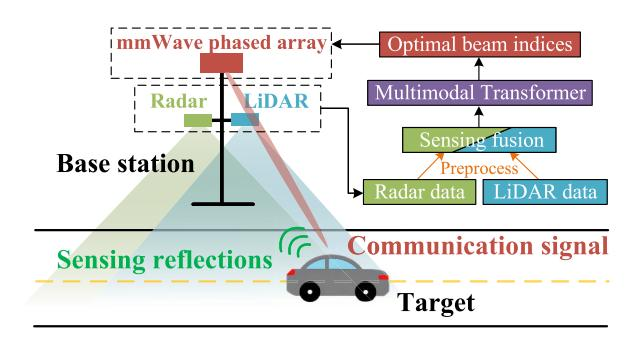

FIGURE 1. Overall system model and the measurements and data processing flows

mobility with the semantic of LiDAR generated cloud points.

- The multimodal fusion is achieved in two steps. In the first step, the mobility parameters are assumed as priors when constructing the environment semantics. In the second step, the fusion of radar and LiDAR data is performed by the designed MMT.
- The accuracy of beam prediction is further improved by beam pruning. It exploits the frequency of occurrence of the optimal beam indices as prior knowledge allowing eliminating the less likely beam directions.
- The performance and the complexity of the proposed scheme is evaluated numerically in terms of the beam prediction accuracy under several fusion and data processing configurations, and for different training dataset sizes. These results demonstrate a clear improvement in the beam prediction accuracy while reducing the pilot symbol overhead, and thus, also improving the utilization of communication channels.

The rest of this paper is organized as follows. System model consisting of communication, radar and LiDAR subsystems is provided in Section II. The proposed scheme of multimodal sensing assisted RF beamforming is introduced in Section III. The multimodal data processing steps are described in Section IV. Numerical results are presented in Section V, and the conclusions are given in Section VI.

### **II. SYSTEM MODEL**

Consider sensing-assisted communication system with mmWave antenna array at the BS as indicated in Fig. 1. It is assumed that the BS is also equipped with the radar and Lidar sensing devices that are mounted on the same mast with the antennas. For instance, the frequency modulated continuous waveform (FMCW) radar and the 3D LiDAR can be considered. Compared to traditional pulse radar, the FMCW radar offers lower power consumption, better range resolution, and it has also lower cost [20]. Focusing on the vehicular terminals, the communication channels are fast varying. It requires frequent CSI estimation in order to track changes in the channels, and overall, a large pilot symbols overhead. The purpose of radar and LiDAR is to assist the communication subsystem by providing side information about the vehicle locations, and about the changes in the surrounding radiowave environment. The fused data from the radar and LiDAR are processed by a neural network in order to obtain the optimal RF beam among multiple beamforming candidates. The models of the communication, radar and LiDAR subsystems are described in the following three subsections.

#### A. COMMUNICATION SUBSYSTEM

The mmWave transceiver at the BS is equipped with  $M_c$  antennas, whereas each vehicle is assumed to only have one antenna. The complex-valued channel vector between  $M_c$  BS antennas and the vehicle mounted antenna can be expressed as,

$$\boldsymbol{h} = \sum_{p=1}^{P} \alpha_p \, \boldsymbol{a} \big( \theta_p, \phi_p \big) \in \mathbb{C}^{(M_c \times 1)}, \tag{1}$$

where  $\alpha_p$  represents the complex-valued gain of the *p*-th propagation path, and  $\boldsymbol{a}(\theta_p,\phi_p)$  is the steering vector of the antenna array with the azimuth,  $\theta_p$ , and the elevation,  $\phi_p$ , respectively.

In the downlink, the beamforming vector,  $f \in \mathbb{C}^{M_c \times 1}$ , is scaled by the transmitted symbol, s, so the symbol received at the vehicle is modeled as,

$$\mathbf{v} = \sqrt{\varepsilon} \, \boldsymbol{h}^H \boldsymbol{f} s + n,\tag{2}$$

where  $\sqrt{\varepsilon}$  represents the antenna gain, and n denotes the zero-mean additive white Gaussian noise with the variance,  $\sigma_n^2$ . The transmitted symbols also have zero-mean, and they are normalized to have the energy,  $P = E[s^2]$ , where  $E[\cdot]$  denotes the expectation. Furthermore, the beamforming vectors are not chosen arbitrarily, but they are selected from a pre-defined codebook, F, containing M beamforming vectors,  $f_m$ ,  $m = 1, 2, \ldots, M$ .

#### B. RADAR SUBSYSTEM

The radar subsystem at the BS is depicted in Fig. 2. The purpose of this subsystem is to estimate the key parameters of the vehicle movements. It is assumed that the radar obtains one measurement every  $T_f$  seconds, after every transmission of a continuous waveform containing A chirps. The transmitted frame of such a radar can be modeled as,

$$r_{\text{frame}}^{\text{Tx}}(t) = b\sqrt{\varepsilon_t} \sum_{a=1}^{A} r_{\text{chirp}}^{\text{Tx}}(t - a(T_{\text{c}} + T_{\text{w}})),$$

$$0 < t < T_f, \qquad (3)$$

where the constant, b, is used to set the transmit power,  $\varepsilon_t$  is the radar antenna gain,  $T_c$  is the chirp duration, and  $T_w$  denotes a waiting time between the successive chirps. The chirp waveform,  $r_{chirp}^{Tx}$ , can be expressed as,

$$r_{\text{chirp}}^{\text{Tx}}(t) = b \sin(2\pi (f_c + kt)t), \quad 0 \le t < T_c,$$
 (4)

where  $f_c$  is the carrier frequency, B is the radar bandwidth, and  $k = B/T_c$  denotes the frequency modulation slope.

The signal reflected from a target at a distance, R, arrives back at the radar antenna with the round-trip delay,

{3}------------------------------------------------

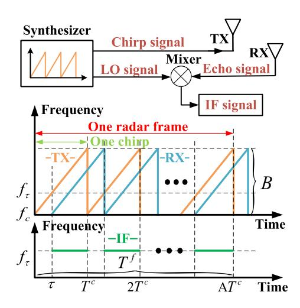

FIGURE 2. The transmit and the receive parts of the radar subsystem, and the corresponding transmit and receive waveforms.

 $\tau = 2R/c$ , where c is the speed of light. The echoed signal can be expressed as,

$$r_{\text{chirp}}^{\text{Rx}}(t) = b\sqrt{\varepsilon_t \varepsilon_c} \sin(2\pi (f_c + k(t - \tau))(t - \tau)),$$
  
$$\tau < t < T_c + \tau, \quad (5)$$

where  $\sqrt{\varepsilon_c}$  represents the combined gain of the radar cross-section (RCS) and the channel path-loss. The mixer at the receiver combines the signal,  $r_{\rm chirp}^{\rm LO}(t)$ , produced by the local oscillator (LO) with the echoed signal resulting in the intermediate frequency (IF) signal as shown in Fig. 2. In addition to the IF signal, the mixer output contains other frequency components and also a high-frequency noise. After low-pass filtering to eliminate undesired components, the filtered IF signal can be approximated as,

$$r_{\text{chirp}}^{\text{IF}}(t) \approx \frac{b}{2} \sqrt{\varepsilon_t \varepsilon_r} \cos(2\pi (kt\tau - f_c \tau)), \quad \tau \le t < T_c.$$
 (6)

The filtered IF signal is then sampled at a rate,  $f_s$ , of S samples per chirp. For the radar with N receive antennas, the raw data from one radar frame is represented as  $X^R \in \mathbb{C}^{N \times S \times A}$ .

### C. LIDAR SUBSYSTEM

The LiDAR operational principles are similar to those that are used in radar. However, the purpose of LiDAR is primarily remote sensing of the environment rather than target tracking. LiDAR can detect objects in the environment by transmitting short laser pulses, and processing their reflections as depicted in Fig. 3. In particular, the LiDAR uses a laser scanner to collect the measurements. The scanner rotates on a 2D plane, whereas the laser prism rotates in a vertical direction to acquire 3D information about the surrounding environment [21].

Let  $P_e$ ,  $\alpha$ , and R denote the laser emission energy, an angle of the laser emitter, and the distance between the target and the emitter, respectively. With a small angle approximation,

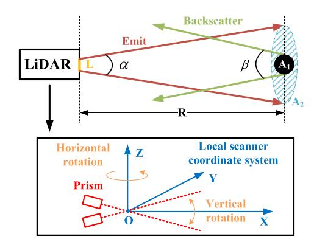

FIGURE 3. Remote sensing of the environment using LiDAR subsystem.

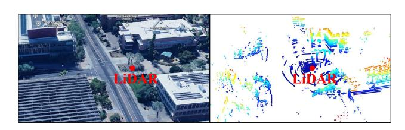

FIGURE 4. The actual environment (left) and the corresponding LiDAR point cloud (right).

the cross-sectional area of the laser spot on the target can be computed as,

$$A_1 = \frac{\pi}{4} \alpha^2 R^2. \tag{7}$$

Assuming that the laser energy is uniformly distributed over the laser spot, the scattered energy,  $P_s$ , is equal to,

$$P_s = \frac{P_e A_1 \rho}{A_2} = \frac{4P_e A_1 \rho}{\pi \alpha^2 R^2},$$
 (8)

where  $\rho$  denotes the reflectivity of the target.

Let  $\beta$  and L denote the fixed angle of backscattering, and the diameter of the laser receiver, respectively. Assuming that the scatterer uniformly scatters the impinging energy into a cone with the angle,  $\beta$ , the energy received due to backscattering can be expressed as,

$$P_r = \pi d_r \left(\frac{L}{2}\right)^2 = \frac{\pi P_s L^2}{4\beta R^2}.$$
 (9)

For the LiDAR cross-section (LRCS) parameter,  $\sigma = 4\pi \rho A_1/\beta$ , the received energy at the LiDAR corresponding to a single scatterer is computed as,

$$P_r = P_e \frac{\sigma L^2}{4\pi \alpha^2 R^4}. (10)$$

Provided that the received energy is greater than a given threshold, the echo signal is recorded as one discrete point. The collection of these points having 3D coordinates is referred to as point cloud, and it is also a representation of the surrounding environment. This is practically illustrated in Fig. 4, where we conducted the LiDAR scanning of the environment.

{4}------------------------------------------------

# III. MULTIMODAL SENSING ASSISTED BEAM PREDICTION

Our aim is to obtain the optimal beam index,  $m^*$ , from the codebook of beamformers, F. In particular, the optimum beamformer should maximize the RF power received at a vehicle, i.e.,

$$m^* = \arg\max_{m} |\boldsymbol{h}^H \boldsymbol{f}_m|^2 \quad \text{s.t.} \quad \boldsymbol{f}_m \in \boldsymbol{\mathcal{F}}.$$
 (11)

However, the search (11) is conditioned on knowing the CSI vector, h. For highly mobile users, the CSI, and thus, also the optimum beam index must be estimated periodically. Moreover, the CSI estimation requires to reserve some of the transmission resources for pilot symbols, which leads to a significant communication overhead.

In this paper, it is proposed to support the base station transmissions in high-mobility scenarios by exploiting side information about the mobile users obtained from radar and LiDAR. It can be used to find the most likely optimum beam without using any pilot symbols. In particular, the outputs of these two sensing devices are fused, and processed by a neural network to find the beam index, which most likely gives the largest received power as defined in (11). If D denotes the fused data of multimodal sensing, then the neural networks with weights, or other parameters,  $\Theta$ , perform the mapping,

$$\Phi(\Theta) : \{ \boldsymbol{D} \} \to \{ m^{\star} \}. \tag{12}$$

Thus, the purpose of the neural network is to narrow down the number of potential candidates of the best beam indices.

There are two main challenges, which must be considered when predicting the best beam indices. First, the multimodal data fusion can be performed at three different levels depending whether the raw data, extracted features, or the partial decisions are considered [22]. The advantage of the raw data fusion is that it preserves most original information about the environment and users. However, it often has significant computational and storage requirements. The decision-level fusion integrates the separate decision outcomes at the final stage, so some sensing information may not be fully utilized. The feature-level fusion extracts and combines relevant information from different sensing modalities. It has smaller computational and storage requirements than the raw data fusion, since the redundancy in data can be eliminated. However, the feature extraction and selection may not be an easy task.

The second challenge is how to design a neural network to yield the most likely candidates of the best beam indices from the fused sensing data. For image-like data, convolutional neural networks (CNNs) often have a good performance. However, the CNNs tend to focus on the local features, and deciding their hyper-parameters often require many trials. Therefore, the decision was to consider transformers as the deep neural network [23]. Compared to other types of deep neural networks, transformers can capture global features, and long-range and long-term dependencies.

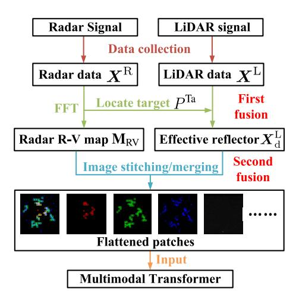

FIGURE 5. The multimodal fusion and data processing flows.

Moreover, transformers support parallel computations to speed up the fusion process.

## IV. MULTIMODAL DATA PROCESSING AND FUSION

The data fusion enables gaining an understanding about the communication opportunities with vehicular users in the area about the BS. As explained earlier, the radar is used to obtain the mobility parameters of the target, whereas LiDAR can identify obstacles and other objects in the environment. The aim is to leverage the feature level multimodal data fusion from these two sensing devices. In particular, the data fusion combines location information provided by radar such as the range-velocity map of the vehicles, and spatial information from LiDAR about the effective radiowave reflectors. Considering the MMT design, the most important is the input layer, which is used to extract the relevant features. The features are then combined and refined at subsequent layers as transformed feature maps concatenated along different dimensions.

The overall multimodal fusion and data processing flows are shown in Fig. 5. In particular, the raw radar data,  $X^R$ , are processed to obtain the range-velocity (R-V) or the range-angle (R-A) maps about the target vehicles. These maps are used to extract the mobility and location parameters,  $P^{Ta}$ , about the target as prior information for the LiDAR measurements. The raw LiDAR data,  $X^L$ , are filtered, segmented, and clustered to produce the point clouds representing the environment. The effective reflectors,  $X_d^L$ , having the greatest impact on the radiowave propagation are extracted from  $X^L$  as the environmental semantic features. The fused features are turned into a series of patches in the second fusion step before being fed to the MMT. The data fusion and processing steps are described in more detail in the following subsections.

## A. RADAR DATA PROCESSING

The radar data processing is outlined in Fig. 6. In particular, the first task is the estimation of trajectory parameters of

{5}------------------------------------------------

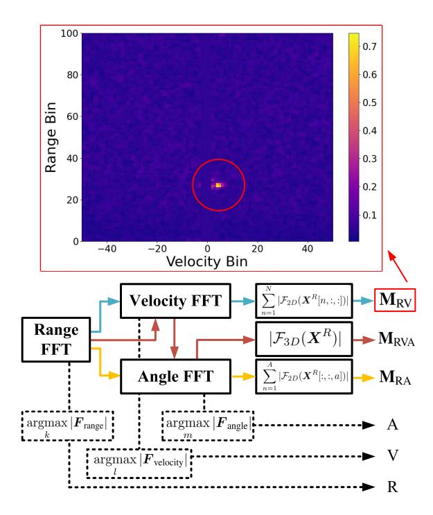

FIGURE 6. The radar data processing flows for estimating the target trajectory parameters and constructing the range maps.

the targets including range, speed and angle. Since the target distance, R, is proportional to echo delay,  $\tau$ , and the frequency shift of the IF signal is proportional to the frequency modulation slope, k, i.e.,

$$f_{\rm IF} = k\tau = \frac{2BR}{T_{c}c},\tag{13}$$

the target distance can be calculated by measuring the frequency shift of the IF signal, i.e.,

$$R = \frac{T_{\rm c}cf_{\rm IF}}{2R}. (14)$$

The frequency samples,  $F_{\text{range}}$ , of the IF signal are obtained by applying the fast Fourier transform (FFT) over the dimension corresponding to S chirp samples, i.e.,

$$F_{\text{range}} = \mathcal{F}\{X^{R}\},$$
 (15)

where the subscript emphasizes that the frequency bins correspond to different ranges. The range-FFT is performed mainly to be able to separate the echo signals according to their target distances. Specifically, assuming the sampling rate,  $f_s$ , the discrete frequencies  $f_i$ , are calculated as,

$$f_i = \frac{if_s}{S}$$
  $i = 0, 1, \dots, S - 1.$  (16)

The frequency bin,  $f_{i_{\text{max}}}$ , having the largest FFT magnitude also defines the frequency shift,  $f_{\text{IF}}$ , of the IF signal, i.e.,

$$f_{\rm IF} = f_{i_{\rm max}} = \arg\max_{i} |F_{\rm range}|.$$
 (17)

Substituting it to (14), the target range is then calculated as,

$$R = \frac{cT_c}{2B} \frac{k_{\text{max}} f_s}{S} = k_{\text{max}} \frac{cT_c f_s}{2BS} = k_{\text{max}} \frac{c}{2B},$$
 (18)

where c/(2B) is the range resolution. Therefore, the target range R depends on two factors, range bin index  $k_{\text{max}}$  and the range resolution c/(2B).

Next, the velocity-FFT is used to infer the Doppler shifts and the relative velocity of each target. In particular, the non-zero radial velocity, V, between the target and the radar gives rise to the Doppler shift,

$$f_D = \frac{2Vf_c}{c}. (19)$$

The velocity-FFT is performed over slower time-varying A chirp signals in each radar frame, i.e.,

$$F_{\text{velocity}} = \mathcal{F}\{F_{\text{range}}\} = \mathcal{F}_{2D}\{X^{R}\},$$
 (20)

where the last operation is a 2D FFT. Performing again the peak search, and denoting as,  $f_{PRF}$ , the pulse repetition frequency, the frequency bin,  $b_k^V$ , corresponding to the Doppler shift is,

$$f_l = \frac{lf_{\text{PRF}}}{A}, \quad l = 0, 1, \dots, A - 1.$$
 (21)

Consequently, the estimated Doppler shift of the target is calculated as.

$$f_D = f_{l_{\text{max}}} = \arg \max_{l} |F_{\text{velocity}}|,$$
 (22)

so the estimated target velocity is,

$$V = \frac{c}{2f_c} \frac{l_{\text{max}} f_{\text{PRF}}}{A} = l_{\text{max}} \frac{cf_{\text{PRF}}}{2f_c A}.$$
 (23)

The scaling term,  $cf_{PRF}/(2f_cA)$ , in the last expression defines the velocity resolution.

The estimated target parameters can be now used to infer the target position, which, in turn, can serve as prior information for LiDAR to extract the environmental features. After obtaining the estimates of range and velocity of each target, the R-V map of targets can be constructed by combining the range-velocity parameter values from different radar antennas, i.e.,

$$M_{\text{RV}} = \sum_{n=1}^{N} |\mathcal{F}_{2D}\{X^{\text{R}}(n)\}|.$$
 (24)

An example of such an R-V map is shown in Fig. 6. Note that other maps such as R-A or even the 3D map can be constructed, and serve as one of the inputs for the subsequent processing by MMT.

Finally, the angle parameter, *A*, can be obtained in a similar fashion as the range and velocity parameters, so the details of the calculations omitted.

### B. LIDAR DATA PROCESSING

The LiDAR data processing flows are summarized in Fig. 7. In particular, the preceding radar data processing yields location information about the target. It can be exploited to identify the possible LOS communication path. However, given the complexity of the vehicular network environments, the LOS path may not always exist. In such a case, the beam

{6}------------------------------------------------

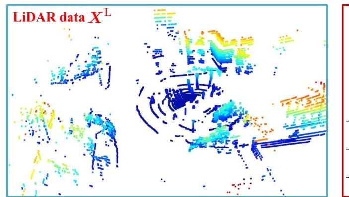

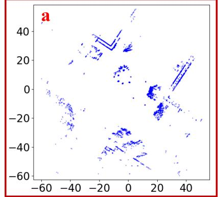

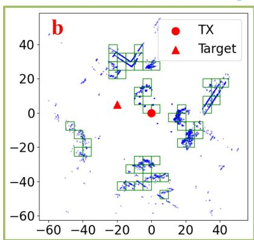

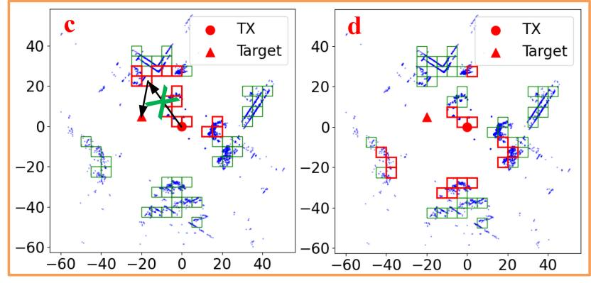

**FIGURE 7. The three steps of LiDAR data processing.**

selection must consider to match any non-LOS propagation paths. In order to identify the non-LOS components, the LiDAR can be used to extract the environmental features representing non-LOS information.

In general, there are usually many scattered in the area, so the point cloud generated by LiDAR may be too complex to process in order to identify the significant non-LOS components. Hence, the following three steps are proposed for processing the LiDAR data. In the first step, the range limitation and dimensionality reduction are carried out. Since the point cloud at greater distances is sparser, and provides only limited information, it is sufficient to restrict the range of points in the cloud considered, and at the same time, the dimensionality of points can be reduced. In the second step, the cloud points are segmented in order to find the radiowave reflectors. The denser the points, the larger the obstacle surface, and the more likely this obstacle can reflect radiowaves, and contribute to multipath propagation. In the third step, the effective reflectors are chosen, since many reflectors are likely to have only a negligible influence on present communications, depending on the vehicular user location, and the beamforming configuration used.

## 1) RANGE LIMITATION AND DIMENSIONALITY REDUCTION

The LiDAR data are stored as a matrix, *X*L ∈ R(*P*×3)), with rows containing the *x*, *y*,*z*-coordinates of each point in the cloud. In order to restrict the range being considered, only the points having the coordinates within the specified limits retained, i.e.,

$$\mathbf{X}^{L} = \{ (x, y, z) \in \mathbf{X}^{L} \mid x_{\min} \le x \le x_{\max}, y_{\min} \le y \le y_{\max}, z_{\min} \le z \le z_{\max} \}.$$
 (25)

Next, we project each 3D point onto a 2D plane using the dimension reduction matrix, *D* ∈ R(2×3) , i.e.,

$$\boldsymbol{X}_{a}^{\mathrm{L}} = \boldsymbol{D} \big( \boldsymbol{X}^{\mathrm{L}} \big)^{T}. \tag{26}$$

An example of the 2D cloud, *X*L *a* , is given in Fig. [7\(](#page-6-0)a).

## 2) POINT CLOUD SEGMENTATION AND IDENTIFYING REFLECTORS

The 2D cloud points must be clustered in order to identify the potential radiowave reflectors. This can be done by first dividing the points into a grid of *g*2 boxes assuming the box sizes, *x* = (*x*max − *x*min)/*g*, and, *y* = (*y*max − *y*min)/*g*. The points are assigned to boxes as,

$$G_{i,j} = \{(x_a, y_a) \in X_a^{L}\},\$$

$$\begin{cases} x_{\min} + (i-1)\Delta x \le x_a \le x_{\max} + i\Delta x,\\ y_{\min} + (j-1)\Delta y \le y_a \le y_{\max} + j\Delta y, \end{cases}$$
(27)

where *i*, *j* = 1, 2,..., *g*. The boxes containing at least *N*pc points are retained as potential reflectors; these boxes are

{7}------------------------------------------------

stored as the data,  $X_b^L$ . The example of identified potential reflectors is shown as the green grid in Fig. 7(b).

At this point, the first step of the fusion of the radar and LiDAR data can be performed. This requires aligning the data from both sensing devices to be within the same coordinate system as well as to be time-synchronized. The example coordinates of the base station,  $P^{Tx}$ , and of the target,  $P^{Ta}$ , are marked as red circle and red triangle in Fig. 7(b). In addition, since the base station is stationary, it can be placed at the origin, i.e.,  $P^{Tx} = (0, 0)$ . Then, the target location,  $P^{Ta}$ , can be calculated assuming the parameters obtained from the radar data processing, i.e.,

$$P^{\mathrm{Ta}} = (R\cos(A), R\sin(A)). \tag{28}$$

#### 3) EFFECTIVE REFLECTOR SELECTION

The first fusion step enables selecting of effective reflectors which are affecting the multipath propagation in ongoing communications, while other reflectors should be excluded. Classifying the reflectors depends on the mutual position of the transmitter, receiver, and the reflecting obstacles.

Assume that there are n reflectors,  $X_{b,i}^L$ ,  $i=1,2,\ldots,n$ . Let  $R_i^{\mathrm{Tx}}$  be the path length between the BS transmitter,  $P^{\mathrm{Tx}}$ , and the reflector,  $X_{b,i}^L$ , and  $R_i^{\mathrm{Ta}}$  be the path length from  $X_{b,i}^L$  to the target vehicle,  $P^{\mathrm{Ta}}$ . Then, the overall propagation distance is,  $R_i^{\mathrm{Total}} = R_i^{\mathrm{Tx}} + R_i^{\mathrm{Ta}}$ .

It is reasonable to assume that the shorter paths are less attenuated, and also experience shorter delays, so they have greater impact on the ongoing communications. Thus, in order to select  $z \ll n$  effective reflectors, define binary variables,  $y_i \in \{0, 1\}$ , to indicate the chosen reflectors, and consider the constrained path optimization problem,

$$\min_{y_i} \sum_{i=1}^{n} y_i R_i^{\text{Total}}, \quad \text{s.t.} \quad \sum_{i=1}^{n} y_i = z.$$
 (29)

An example of selecting the set,  $X_c^L$ , of z=15 effective reflectors among n identified reflectors in Fig. 7(b) is shown in Fig. 7(c) with one propagation path marked explicitly by two black arrows. More importantly, we can observe that there are other reflectors obstructing this propagation path, i.e., the marked reflector is not effective. Consequently, solving the optimization problem (29) is necessary but not sufficient to find the set of effective reflectors, and further filtering steps in choosing the effective reflectors are needed.

Let  $N^{\text{Tx}}$  be the number of reflectors along the path,  $R_i^{\text{Tx}}$ , and  $N^{\text{Ta}}$  be the number of reflectors along the path,  $R_i^{\text{Ta}}$ . Define the binary functions,

$$\delta^{\square}(m) = \begin{cases} 1, N^{\square} \le m \\ 0, \text{ otherwise} \end{cases}$$
 (30)

where the superscript,  $\Box = \{Tx, Ta\}$ , and the integer, m, represents an acceptable number of obstacles. The optimization problem (29) can be then reformulated as,

$$\min_{y_i} \sum_{i=1}^n y_i \delta^{\text{Tx}} \delta^{\text{Ta}} R_i^{\text{Total}}, \quad \text{s.t.} \sum_{i=1}^n y_i = z.$$
 (31)

Solving this optimization problem yields the effective reflector set,  $X_{\rm d}^{\rm L}$ . An example set,  $X_{\rm d}^{\rm L}$ , is shown in Fig. 7(d) assuming z=15 and m=2.

In summary, after obtaining the potential reflector set,  $X_{\rm b}^{\rm L}$ , the reflectors abstracting the propagation paths are excluded. The additional reflectors are then excluded, so that only z effective reflectors with the shortest propagation paths are kept.

## C. MULTIMODAL DATA FUSION

After describing the data processing steps for each sensing modality, this subsection outlines the data processing steps of multimodal data fusion using a transformer neural network. In particular, the data fusion is performed in two steps. The first fusion step is the feature fusion as explained in the subsection on LiDAR data processing. The second fusion step exploits a transformer as the most suitable neural network architecture.

Consider first the architecture of the designed MMT. Since the transformers normally process the input vectors, the radar and LiDAR image-like data must be converted into sequences of patches. However, such a conversion is not so simple when there are multiple image-like inputs in case of the multimodal sensing. Hence, image stitching and image merging are proposed here as the two possible multimodal fusion methods for image-like input data.

The image stitching concatenates the input images, and then generate the candidate patches. This method can consider larger number of input images in order to provide the richer contents without risking losing important information, while also allowing the flexibility in how the patches are created. The image merging combines the input images at the level of their RGB color channels. It can reduce the information redundancy in input images, so the number of generated patches can be much smaller. These two multimodal fusion methods are illustrated in Fig. 8 assuming the following notations. The radar image is denoted as  $M_{\rm RV}$ , and the LiDAR images are denoted as:  $X_{\rm a}^{\rm L}$  is the 2D point cloud,  $X_{\rm b}^{\rm L}$  is the 2D image of identified potential reflectors, and  $X_{\rm d}^{\rm L}$  is the 2D image of chosen effective reflectors.

## D. MULTIMODAL TRANSFORMER (MMT)

The designed MMT consists of the three layers: an input layer, a self-attention layer, and a multi-head layer as shown in Fig. 9.

## 1) INPUT LAYER

The input layer of a canonical transformer is modified in order to accommodate the multimodal fusion. The fused images (shown in black in Fig. 8) are first split into multiple patches. The patches are further unfolded into 1D vectors,  $x_i$ , using a linear mapping operator. The resulting sequence of 1D vectors is fed into the standard transformer. However, the patches and the corresponding unfolded 1D vectors lack a natural ordering, so a position embedding,  $PE_i$ ,

{8}------------------------------------------------

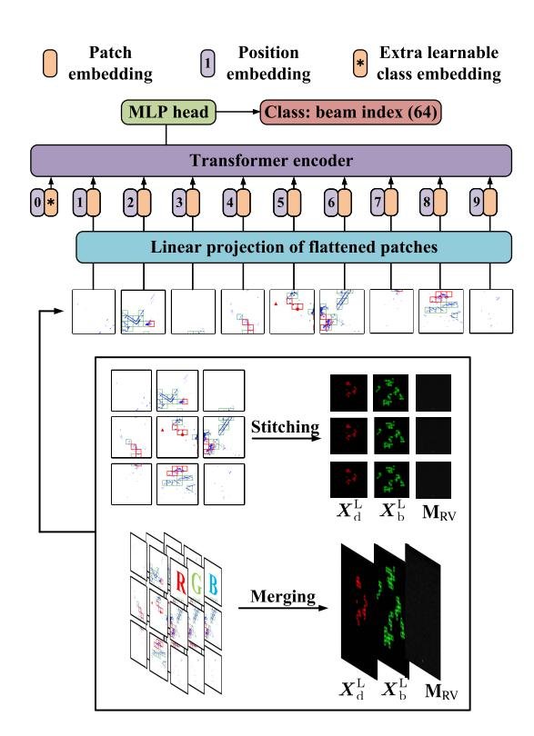

FIGURE 8. The two multimodal data fusion methods suitable for processing by transformers.

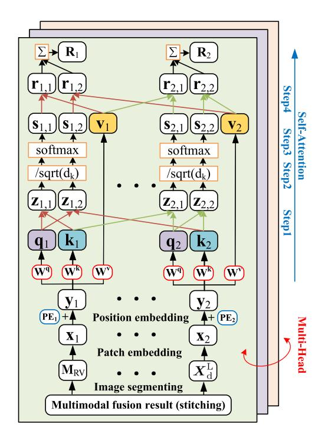

FIGURE 9. The architecture of the designed MMT.

information is inserted in order to maintain information about the relative position of patches within the input images. The output vectors of the input layer are denoted as  $y_i$  in Fig. 9.

## 2) SELF-ATTENTION LAYER

The self-attention mechanism can capture the dependencies between the sequence elements within a defined context window. Moreover, the relative importance of the sequence elements is computed as a weighted sum of cosine distances between linearly projected input elements. The cosine distance represents the correlation between two vectors. The larger the correlation, the larger the weight should be assumed to express their relationship. The linear projections enable adapting the transformer to different tasks with various input data distributions. Specifically, the scaled dot-product attention is computed as [23],

Attention(
$$Q, K, V$$
) = softmax $\left(\frac{QK^T}{\sqrt{d_k}}\right)V$ , (32)

where Q, K, and V are the query matrix, the key matrix, the value matrix, respectively, and  $d_k$  is the size of the input elements. The scaling by  $\sqrt{d_k}$  proved to be useful in preventing the vanishing gradient problem as the vector dimensions increase.

The transformer processing can be briefly described in a few steps (cf. Fig. 9). In the first step, the scaled dot products between the query and key vectors are computed, i.e.,  $z_{1,i} = q_1 k_i$ ,  $z_{2,i} = q_2 k_i$ . In the second step, the softmax produces a probability distribution,  $S_i$ , of the query vector corresponding to the multiple key vectors. Finally, the expected value is approximated by a weighted sum of value vectors,  $R_i$ .

#### 3) MULTI-HEAD LAYER

The multi-head attention enables learning the data patterns in parallel in different subspaces using different linear projections. This may speed up the learning, and it also enhances the performance. Provided that there are h heads, the input is divided into h sets,  $\{Q_j\}_{j=1}^h$ ,  $\{K_j\}_{j=1}^h$ , and  $\{V_j\}_{j=1}^h$ , and also denote,  $\text{Head}_j = \text{Attention}(Q_j, K_j, V_j)$ ,  $j = 1, 2, \ldots, h$ . The outputs of all attention heads are concatenated, and then linearly combined using the matrix,  $W^O$ , i.e.,

$$MultiHead(\mathbf{Q}, \mathbf{K}, \mathbf{V}) = Concat(Head_1, \dots, Head_h)\mathbf{W}^O.$$
(33)

### E. MMT TRAINING

Let  $\Phi_{\Theta}$  denote the MMT having the parameters,  $\Theta$ . The task is to find the optimal parameter values,  $\Theta^{\star}$ , which can be formalized by defining the loss function,  $\mathcal{L}$ , as,

$$\Theta^{\star} = \arg\min_{\Theta} = \frac{1}{L} \sum_{l=1}^{L} \mathcal{L}(\Phi_{\Theta}(\mathbf{M}_{l}), m_{l}^{\star}), \qquad (34)$$

where L denotes the number of training time-slots.

The selection of the most likely beam indices is a multi-class classification problem, for which a suitable loss function is the cross-entropy loss, i.e.,

$$\mathcal{L}(y, \hat{y}) = -\frac{1}{N} \sum_{i=1}^{N} \sum_{j=1}^{C} y_{i,j} \log \hat{y}_{i,j},$$
 (35)

{9}------------------------------------------------

where N denotes the number of samples, C is the number of categories,  $y_{i,j}$  are the true labels, and  $\hat{y}_{i,j}$  are the predicted labels. For example, the labels can be one-hot encoded.

The performance of the designed MMT as a multi-class classifier for the best beam index prediction can be evaluated as the top-k accuracy. The top-k accuracy measures the proportion of correct labels among the predicted labels that are within the top k results. Considering the beam index prediction, the trained MMT produces an ordered set of the best k beam indices,  $\hat{m}_{l}^{\star} = \{\hat{m}_{l,1}^{\star}, \ldots, \hat{m}_{l,k}^{\star}\}$ , from a predefined beamforming codebook,  $\mathcal{F}$ . Consequently, the top-k accuracy is computed as,

Top-k = 
$$\frac{1}{L} \sum_{l=1}^{L} \sum_{k=1}^{K} \mathbf{1}_{\{m_{l,k}^{\star} = m_{l}^{\star}\}},$$
 (36)

where  $\mathbf{1}_x$  denotes the indicator function, i.e.,  $\mathbf{1} = 1$ , if x evaluates to 1, and  $\mathbf{1} = 0$ , otherwise. The beamformer at the BS only needs to consider the best k candidates, which were identified with high accuracy by the MMT. This substantially reduces the communication overhead, which would otherwise be required to acquire information about the multipath propagation channels.

#### V. NUMERICAL RESULTS

The proposed beam prediction method involving multimodal sensing with subsequent processing using the MMT has been evaluated assuming the real-world DeepSense 6G dataset [8]. It is a multimodal dataset, which was produced to enable development of sensing-aided communication applications. In this paper, we present the results specifically for Scenario No. 31 from this dataset. The numerical experiments assume  $M_c = 16$  mmWave antennas in the phased array, and N = 4 radar antennas. In addition, the transmission frames consists of A = 128 chirps with S = 256 samples each, and the beam codebook has M = 64 entries. The simulation parameters are comprehensively summarized in Table 1.

## A. MULTIMODAL FUSION

The objective is to assess how much the proposed multimodal fusion can improve the beam prediction accuracy. Using only the point cloud from LiDAR is assumed as a baseline system to determine the performance improvement when the data from both LiDAR and radar are fused. The empirically measured beam prediction accuracy is presented in Fig. 10. We can observe using only the LiDAR point cloud (the baseline system), the accuracy is unacceptably small. If only one-level fusion (first fusion) is employed, and the radar data are used to assist LiDAR in finding the effective reflectors, the accuracy improves, but not substantially. A noticeable improvement in the accuracy is only achieved when the two-stage fusion is performed by the MMT. The stitching of sensing image-like data outperforms the image merging method as one may expect. The image merging suffers from information loss, but the amount of data at the input to the MMT is smaller - there is a trade-off between

**TABLE 1. Simulation parameters.** 

| Parameter                                 | Value      | Parameter                                 | Value     |
|-------------------------------------------|------------|-------------------------------------------|-----------|
| antenna number $M_{ m c}$                 | 16         | # beam indexes M                          | 64        |
| carrier frequency                         | 60 GHz     | vehicle speed                             | 40.6 km/h |
| radar Rx antennas N                       | 4          | samples per chirp $S$                     | 256       |
| chirps per frame A                        | 128        | time slot duration                        | 100 ms    |
| radar frequency range                     | 76-81 GHz  | radar bandwidth                           | 4 GHz     |
| radar max range                           | 100 m      | radar frame rate                          | 10 Hz     |
| LiDAR FoV vertical                        | 45(±22.5)° | LiDAR FoV horiz.                          | 360°      |
| LiDAR spin freq.                          | 10 Hz      | LiDAR max range                           | 120 m     |
| coordinate $x_{\min}$                     | -60 m      | coordinate $x_{\text{max}}$               | 60 m      |
| coordinate $y_{\min}$                     | -60 m      | coordinate $y_{\text{max}}$               | 60 m      |
| coordinate $z_{\min}$                     | -1 m       | coordinate $z_{\max}$                     | 10 m      |
| grids number $g^2$                        | 576        | threshold $N_{ m pc}$                     | 20        |
| effective reflectors $z$                  | 15         | obstacles number $m$                      | 2         |
| image size                                | 224        | patch size                                | 16        |
| embedding dimension                       | 768        | head number                               | 12        |
| batch size                                | 8          | learning rate                             | 0.001     |
| all beams $B_{\rm all}$                   | 2546       | beam pruning $N_{\rm bp}$                 | 14        |
| lowest frequent $B_{\min}$                | 42         | highest freq. $B_{\text{max}}$            | 1576      |
| merging $A_{\mathrm{bp}}^{\mathrm{high}}$ | 43.75%     | stitching A bp high | 46.02%    |

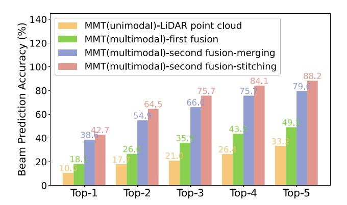

FIGURE 10. A comparison of the beam prediction accuracies using different multimodal data fusion schemes.

the information loss and the computational complexity. In addition, assuming higher-orders of the top-k scheme improves the performance, even though we can notice the effect of diminishing returns.

A reduction in the pilot symbol overhead due to the improved beam prediction accuracy can be equivalently evaluated as an increase in the data throughput. The data throughput curves are shown in Fig. 11 as a function of the number of the best beam candidates for the four schemes considered in Fig. 10. It can be observed that the proposed multimodal fusion approach not only achieves the best improvement in the beam prediction accuracy, but it also yields a significant throughput enhancement. These results reveal a strong positive correlation between the beam prediction accuracy and the data throughput.

### B. OPTIMIZATION OF MULTIMODAL DATA FUSION

The objective is to explore how different parameters and the MMT configurations affect the beam prediction accuracy. In particular, the batch of 8 input images, and the patch size of

{10}------------------------------------------------

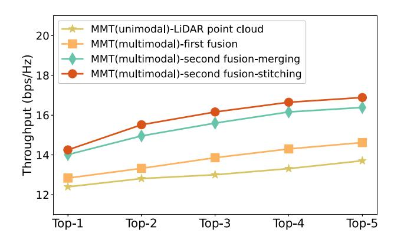

**FIGURE 11. The beam prediction accuracy as a function of the number of best beam candidates for four different multimodal fusion configurations.**

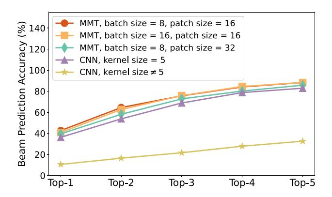

**FIGURE 12. A comparison of the beam prediction accuracy under different data processing configurations.**

16 vectors defines the baseline scheme, which is assumed for comparison. The resulting beam prediction accuracy curves are presented in Fig. [12.](#page-10-1) The curve for the baseline scheme is marked with circles, the square markers are used for varying batch sizes, and the curves for varying the patch sizes are marked with diamonds. We can observe that, for the baseline configuration, the performance only modestly improves with the order of top-*k* selection. Overall, the beam prediction accuracy does not seem to influenced much by the batch size. On the other hand, as the patch size increases, the beam prediction accuracy tends to decrease. This is likely happening due to the loss of details when the patch size is increased.

Furthermore, Fig. [12](#page-10-1) compares the performance of the proposed MMT with the performance of the CNN having three convolutional layers, two fully connected layers, and two different kernel sizes. The corresponding performance curves are marked by the triangles and stars, respectively. We can observe that when the CNN parameters are not welltuned, the performance may be greatly affected. On the other hand, the MMT appears to be much more robust, and does not require parameter fine-tuning.

## *C. OTHER PERFORMANCE EVALUATIONS*

Fig. [13](#page-10-2) reports the counts (frequencies) of the optimal beams appearing in different directions in the DeepSense 6G

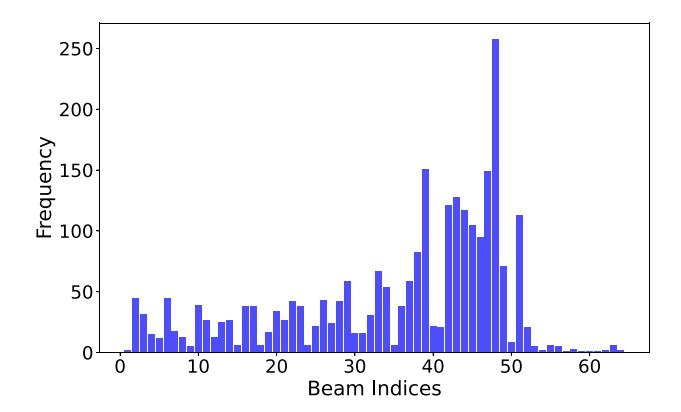

**FIGURE 13. The counts (frequencies) of the optimal beams in different directions expressed as the beam indices.**

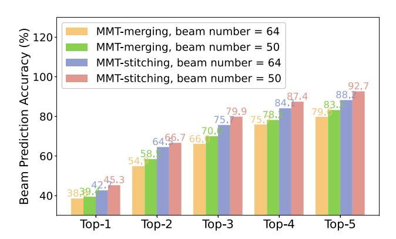

**FIGURE 14. The beam prediction accuracy involving beam pruning.**

dataset. We can observe that there exist certain directions that favor the communications, and other directions that should be completely avoided. This reflects the obstacle distribution within the area surrounding the BS, and it affects the multipath radiowave propagation. More importantly, the nonuniformity observed in Fig. [13](#page-10-2) directly motivates the beam pruning, so the directions which are identified by the fusion of radar and LiDAR data can be excluded. This has a beneficial effect upon the beam prediction accuracy, since it simplifies the MMT classification problem.

The beam index statistics provided in Fig. [13](#page-10-2) can be exploited by the MMT as prior knowledge to prune very unlike beam patterns. The beam pruning can be used for both image merging and stitching methods. The corresponding results are shown in Fig. [14.](#page-10-3) It can be observed that beam pruning is effective no matter what multimodal fusion strategy is employed. However, in the extreme case, if all but one beam direction is pruned, the beam prediction accuracy in that direction becomes 100%, whereas in all other directions the accuracy would be very small. It would then lead to a sharp decline in the performance of the communication system.

It should noted that our ultimate goal is to improve the beam prediction accuracy in order to enhance the communications between the BS and the vehicular users. Hence, when beam pruning is used, it is essential to also check the performance of the communication system. Moreover, the

{11}------------------------------------------------

TABLE 2. Number of correctly estimated optimal beam indices

| Method    | No beam | Pruning lowest | Pruning highest |
|-----------|---------|----------------|-----------------|
| Method    | pruning | frequency beam | frequency beam  |
| Merging   | 981     | 987            | 449             |
| Stitching | 1081    | 1134           | 471             |

TABLE 3. Latency and complexity (FLOPS) of data processing steps

| 1st fusion (GPU)     | 2nd fusion (CPU)     | MMT (GPU)            | Total          |
|----------------------|----------------------|----------------------|----------------|
| 0.0774 ms            | 4.31 ms              | 3.97 ms              | 8.3 ms         |
| $4.16 \times 10^{7}$ | $5.54 \times 10^{4}$ | $1.68 \times 10^{9}$ | $\approx 10^9$ |

number of correctly predicted beams is positively correlated with the performance of the communication system, and thus, the former metric can be used as a proxy for the latter. In particular, let the total number of optimal beams be,  $B_{\rm all}$ , the sum of the optimal beams for the  $N_{\rm bp}$  least frequent beam directions be,  $B_{\rm min}$ , and the  $N_{\rm bp}$  most frequent beam directions be,  $B_{\rm max}$ . We also denote the accuracy of the beam prediction without beam pruning as,  $A_{\rm nbp}$ , and with beam pruning as,  $A_{\rm bp}$ . Then, the number of correctly predicted optimal beams (beam indices) without beam pruning,  $C_{\rm nbp}$ , can be evaluated as,

$$C_{\rm nbp} = B_{\rm all} \cdot A_{\rm nbp},\tag{37}$$

and with beam pruning as,

$$C_{\text{bp}}^{\text{low}} = (B_{\text{all}} - B_{\text{low}})A_{\text{bp}}^{\text{low}} + \frac{B_{\text{low}}}{M},$$

$$C_{\text{bp}}^{\text{high}} = (B_{\text{all}} - B_{\text{high}})A_{\text{bp}}^{\text{high}} + \frac{B_{\text{high}}}{M},$$
(38)

where  $C_{\rm bp}^{\rm low}$ , and  $C_{\rm bp}^{\rm high}$  denote the number of correctly predicted optimal beam indices corresponding to the least and the most frequent beam directions, and  $A_{\rm bp}^{\rm low}$ , and  $A_{\rm bp}^{\rm high}$  are the corresponding beam prediction accuracies, respectively. The resulting numerical values of expressions (38) are provided in Table 2. We can observe that pruning the least frequent beams effectively increases the number of correctly predicted beams.

#### D. LATENCY AND DATASET SIZE

It is useful as well as important to analyze the overall data processing latency, and to also evaluate the effect of the dataset size. The multimodal fusion scheme was implemented on a standard PC with the Intel i7-12700H CPU and the NVIDIA RTX 3070Ti GPU. The overall average data processing latency of 8.3 ms was obtained. The latency of each data processing step including the sensing signal acquisition, and a subsequent beam index prediction is reported in Table 3. Since the data transmission phase is of an order of several seconds, the data processing latency can be neglected. The actual latency can be expected to be further reduced when the scheme is implemented on a dedicated hardware at the base station. Moreover, it is sufficient to estimate multiple optimal beam directions once

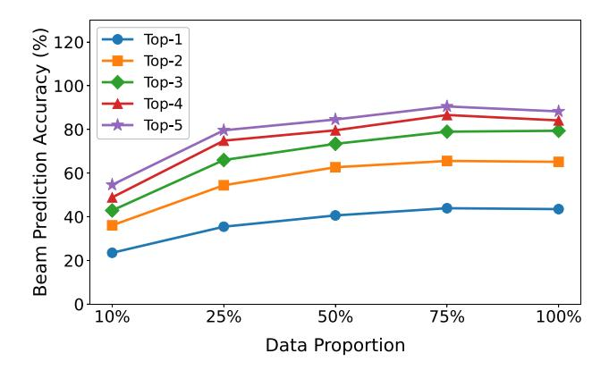

FIGURE 15. A comparison of the beam prediction accuracy with data size.

every 100 ms of typical radar and LiDAR sensing time. From this perspective, the data processing latency of several ms is again justified. Consequently, and importantly, the number of pilot symbols required for the beam prediction can be greatly reduced.

The computational complexity of the three data processing steps is also reported in Table 3 as the number of floating point operations (FLOPs). It can be observed that the last stage involving the MMT dominates the overall complexity. For comparison, the CNN-based methods were reported in [18] to have the complexity of the order of 106 FLOPs. Although the transformers (i.e., also the MMT) have higher complexity than the CNN, their processing latency is acceptable. The transformers are also more flexible, and their main advantage is that they can more readily accommodate other multi-modal sources in future system upgrades.

Furthermore, the required amount of training data is another important factor to consider in practical deployments. The beam prediction accuracy as a function of the training dataset size for different number of the best beam candidates is shown in Fig. 15. In particular, the experimental dataset consists of 2,546 samples. The 80% of samples in the dataset are used for training, and the remaining 20% of samples are reserved for testing. As shown in Fig. 15, the training data were further limited to 10%, 25%, 50%, 75%, and 100% of  $0.80 \times 2546 \doteq 2037$  training samples, respectively. It can be observed that about 75% of the training data corresponding to approximately 1, 500 training samples are sufficient to achieve the maximum beam prediction accuracy. Beyond this value, the performance may even slightly deteriorate when larger numbers of the beam candidates are considered.

#### VI. CONCLUSION

A multimodal sensing fusion assisted beam prediction scheme was proposed in this paper. The performance was evaluated on the real-world sensing dataset. It was demonstrated that the proposed sensing fusion can significantly improve the beam prediction accuracy. The scheme not only enables combining multiple sensing data sources, but also involves beam pruning to reduce the requirements on the neural network classifier. The beam pruning exploits

{12}------------------------------------------------

knowledge about the prior distribution of beams. This has benign effect on the efficiency of communication system, since the pilot symbol overhead required for beamforming in dynamic environments with highly mobile users is greatly reduced. The sensing fusion is achieved in two steps with the help of a multi-modal transformer, for which the input layer was specifically designed. The simulations confirmed that the MMT has superior performance as well as it is more robust than the CNN-based methods.

The proposed framework can be readily extended to multitarget scenarios. It is likely that multi-target tracking can greatly benefit from including other sensing modalities. Multiple targets can be distinguished by their velocities and spatial locations using the R-V and R-A maps obtained from the radar measurements. The challenge is how to identify all nearby targets, since the radar has limited resolution, and how to identify the effective reflectors for the individual targets using the LiDAR point clouds. Computing the beam indices for each target using the MMT is then straightforward. In addition, the GPS can be used to supplement radar positioning, whereas the environment sensing by LiDAR can be aided by cameras, which will improve the target resolution and tracking. It should be emphasized that the ultimate objective is to improve the performance and efficiency of the underlying communication system including reducing the overall energy consumption. These are more complex design issues, and they are left for our future investigations.

## **REFERENCES**

- [\[1\]](#page-0-0) Y. He, G. Yu, Y. Cai, and H. Luo, "Integrated sensing, computation, and communication: System framework and performance optimization," *IEEE Trans. Wireless Commun.*, vol. 23, no. 2, pp. 1114–1128, Feb. 2024.
- [\[2\]](#page-0-0) J. Hu, D. Niyato, and J. Luo, "Cross-domain learning framework for tracking users in RIS-aided multi-band ISAC systems with sparse Labeled data," *IEEE J. Sel. Areas Commun.*, vol. 42, no. 10, pp. 2754–2768, Oct. 2024.
- [\[3\]](#page-0-1) Z. Wei et al., "Integrated sensing and communication signals toward 5G-a and 6G: A survey," *IEEE Internet Things J.*, vol. 10, no. 13, pp. 11068–11092, Jul. 2023.
- [\[4\]](#page-0-1) Y. He, Y. Cai, H. Mao, and G. Yu, "RIS-assisted communication radar coexistence: Joint Beamforming design and analysis," *IEEE J. Sel. Areas Commun.*, vol. 40, no. 7, pp. 2131–2145, Jul. 2022.
- [\[5\]](#page-0-2) K. Vuckovic, M. B. Mashhadi, F. Hejazi, N. Rahnavard, and A. Alkhateeb, "PARAMOUNT: Toward Generalizable deep learning for mmWave beam selection using sub-6 GHz channel measurements," *IEEE Trans. Wireless Commun.*, vol. 23, no. 5, pp. 5187–5202, May 2024.
- [\[6\]](#page-1-0) J. Zhang, Y. Huang, Q. Shi, J. Wang, and L. Yang, "Codebook design for beam alignment in millimeter wave communication systems," *IEEE Trans. Commun.*, vol. 65, no. 11, pp. 4980–4995, Nov. 2017.
- [\[7\]](#page-1-1) U. Demirhan and A. Alkhateeb, "Radar aided 6G beam prediction: Deep learning algorithms and real-world demonstration," in *Proc. IEEE WCNC*, May 2022, pp. 2655–2660.
- [\[8\]](#page-1-2) A. Alkhateeb et al., "DeepSense 6G: A large-scale real-world multimodal sensing and communication dataset," *IEEE Commun. Mag.*, vol. 61, no. 9, pp. 122–128, Sep. 2023.
- [\[9\]](#page-1-3) G. Charan, T. Osman, A. Hredzak, N. Thawdar, and A. Alkhateeb, "Vision-position multi-modal beam prediction using real millimeter wave datasets," in *Proc. IEEE WCNC*, May 2022, pp. 2727–2731.
- [\[10\]](#page-1-4) S. Jiang, G. Charan, and A. Alkhateeb, "LiDAR aided future beam prediction in real-world millimeter wave V2I communications," *IEEE Wireless Commun. Lett.*, vol. 12, no. 2, pp. 212–216, Feb. 2022.

- [\[11\]](#page-1-5) J. Morais, A. Bchboodi, H. Pezeshki, and A. Alkhateeb, "Positionaided beam prediction in the real world: How useful GPS locations actually are?" in *Proc. IEEE ICC*, Oct. 2023, pp. 1824–1829.
- [\[12\]](#page-1-6) S. Imran, G. Charan, and A. Alkhateeb, "Environment semantic aided communication: A real world demonstration for beam prediction," in *Proc. IEEE ICC*, Oct. 2023, pp. 48–53.
- [\[13\]](#page-1-7) M. Hasanujjaman, M. Z. Chowdhury, and Y. M. Jang, "Sensor fusion in autonomous vehicle with traffic surveillance camera system: Detection, localization, and AI networking," *Sensors*, vol. 23, no. 6, p. 3335, Mar. 2023.
- [\[14\]](#page-1-8) Y. Almalioglu, M. Turan, N. Trigoni, and A. Markham, "Deep learning-based robust positioning for all-weather autonomous driving," *Nat. Mach. Intell.*, vol. 4, no. 9, pp. 749–760, Sep. 2022.
- [\[15\]](#page-1-9) S. M. Patole, M. Torlak, D. Wang, and M. Ali, "Automotive radars: A review of signal processing techniques," *IEEE Signal Process. Mag.*, vol. 34, no. 2, pp. 22–35, Mar. 2017.
- [\[16\]](#page-1-10) L. de Paula Veronese et al., "Evaluating the limits of a LiDAR for an autonomous driving localization," *IEEE Trans. Intell. Transp. Syst.*, vol. 22, no. 3, pp. 1449–1458, Mar. 2021.
- [\[17\]](#page-1-11) Y. Xiao, F. Codevilla, A. Gurram, O. Urfalioglu, and A. López, "Multimodal end-to-end autonomous driving," *IEEE Trans. Intell. Transp. Syst.*, vol. 23, no. 1, pp. 537–547, Jan. 2022.
- [\[18\]](#page-1-12) M. Zecchin, M. B. Mashhadi, M. Jankowski, D. Gündüz, M. Kountouris, and D. Gesbert, "LiDAR and position-aided mmWave beam selection with non-local CNNs and curriculum training," *IEEE Trans. Veh. Technol.*, vol. 71, no. 3, pp. 2979–2990, Mar. 2022.
- [\[19\]](#page-1-13) S. Yao et al., "Radar-camera fusion for object detection and semantic segmentation in autonomous driving: A comprehensive review," *IEEE Trans. Intell. Veh.*, vol. 9, no. 1, pp. 2094–2128, Jan. 2024.
- [\[20\]](#page-2-2) M. Jankiraman, *FMCW Radar Design*. Norwood, MA, USA: Artech House, 2018.
- [\[21\]](#page-3-3) Q. Guo, Y. Su, and T. Hu, *LiDAR Principles, Processing and Applications in Forest Ecology*. Cambridge, MA, USA: Academic, 2023.
- [\[22\]](#page-4-4) S. A. Kashinath et al., "Review of data fusion methods for realtime and multi-sensor traffic flow analysis," *IEEE Access*, vol. 9, pp. 51258–51276, 2021.
- [\[23\]](#page-4-5) A. Vaswani et al., "Attention is all you need," in *Proc. Adv. Neural Inf. Process. Syst. (NeurIPS)*, Jun. 2017, pp. 5998–6008.

**ZHONG YE** received the B.E. degree in communication engineering from Zhejiang University City College, Hangzhou, China, in 2019, and the M.Sc. degree in information and communication engineering from Zhejiang Gongshang University, Hangzhou. He is currently pursuing the Ph.D. degree with the College of Information and Electronic Engineering, Zhejiang University, Hangzhou, where he is a Research Assistant. His research interests include vehicular networking systems and integrated sensing and communications.

**YINGHUI HE** (Member, IEEE) received the B.E. degree in information engineering and the Ph.D. degree in information and communication engineering from Zhejiang University, Hangzhou, China, in 2018 and 2023, respectively. His research interests mainly include mobile edge computing, device-to-device communications, and integrated sensing and communications.

{13}------------------------------------------------

**GUANDING YU** (Senior Member, IEEE) received the B.E. and Ph.D. degrees in communication engineering from Zhejiang University, Hangzhou, China, in 2001 and 2006, respectively.

In 2006, he joined the Zhejiang University where he is currently a Professor with the College of Information and Electronic Engineering. From 2013 to 2015, he was a Visiting Professor with the School of Electrical and Computer Engineering, Georgia Institute of Technology, Atlanta, GA, USA. His research interests include integrated

sensing and communications, mobile edge computing/learning, and machine learning for wireless networks. He received the 2016 IEEE ComSoc Asia-Pacific Outstanding Young Researcher Award. He regularly sits on the technical program committee (TPC) boards of prominent IEEE conferences such as ICC, GLOBECOM, and VTC. He also served as the Symposium Co-Chair for IEEE Globecom 2019 and a Track Chair for IEEE VTC 2019 Fall. He was a Guest Editor of IEEE COMMUNICATIONS MAGAZINE special issue on Full-Duplex Communications, an Editor of IEEE JOURNAL ON SELECTED AREAS IN COMMUNICATIONS Series on Green Communications and Networking, and Series on Machine Learning in Communications and Networks, an Editor of IEEE WIRELESS COMMUNICATIONS LETTERS, the Lead Guest Editor of IEEE WIRELESS COMMUNICATIONS MAGAZINE special issue on LTE in Unlicensed Spectrum, an Editor of the IEEE TRANSACTIONS ON GREEN COMMUNICATIONS AND NETWORKING, and IEEE ACCESS. He is currently an Editor of the IEEE TRANSACTIONS ON MACHINE LEARNING IN COMMUNICATIONS AND NETWORKING.

**PAVEL LOSKOT** (Senior Member, IEEE) received the B.Sc. and M.Sc. degrees in biomedical electronics and radioelectronics from the Czech Technical Universiyt of Prague, Czech Republic, and the Ph.D. degree in wireless communications from the University of Alberta, Canada.

Before joining ZJU-UIUC Institute as an Associate Professor in 2021. He was a Senior Lecturer with Swansea University, U.K. From 2014 to 2015, he was a Visiting Researcher with Computational Science Research Center, Beijing,

China. From 1999 to 2001, he was a Research Scientist with the Centre for Wireless Communications, Oulu, Finland. His research interests focuse on mathematical modeling, statistical signal processing and machine learning for multi-sensor, and time-series data. He is an Elected IARIA Fellow 2025, a Fellow of the Higher Education Academy, U.K., and holds a Recognized Research Supervisor distinction by the U.K. Council for Graduate Education. He is a Technical Committee Member of many IEEE conferences annually. From 2014 to 2020, he served on the IEEE Membership Development Team and Selection Committee, the U.K., and Ireland Section.