{0}------------------------------------------------

# Multisatellite Multisensor Observations of a Sub-Plinian Volcanic Eruption: The 2015 Calbuco Explosive Event in Chile

Frank S. Marzano®, *Fellow, IEEE*, Stefano Corradini, Luigi Mereu®, Arve Kylling, Mario Montopoli®, Domenico Cimini®, Luca Merucci, and Dario Stelitano

Abstract—A-train satellite data, acquired during the Calbuco volcano (Chile) sub-Plinian eruption in April 2015, are discussed to explore the complementarity of spaceborne observations in the microwave (MW), thermal infrared (TIR), and visible wavelengths for both near-source plume and distal ash clouds. The analysis shows that TIR-based detection techniques are not suitable near the volcanic vent where rising convective columns are associated with large optical depths. Detection and parametric estimates of near-source tephra mass loading and plume height from MW radiometric data, available 69 min after the eruption onset, are proposed. Results indicate a maximum plume altitude of about 21 km above the sea level and an ash mass of  $3.65 \times 10^{10}$  kg, in agreement with mass values obtained from empirical formulas, but less than proximal-distal mass deposit of  $1.86 \times 10^{11}$  kg. This discrepancy may be explained by extrapolating Advanced Technology Microwave Sounder-based estimates to 6 h, thus obtaining a total mass of about  $1.90 \times 10^{11}$  kg. Distal volcanic cloud retrievals are derived from TIR imagery and results show a good agreement between Moderate-Resolution Imaging Spectroradiometer (MODIS) and Visible Infrared Imaging Radiometer Suite (VIIRS) retrievals of total mass taking into account the overpass time shift. If only the overlapping pixels between MODIS and VIIRS are considered, the respective estimates are  $1.90 \times 10^9$  kg and  $1.80 \times 10^9$  kg. TIR radiometric estimates of distal ash cloud height and mass loadings are also compared with Cloud-Aerosol

Manuscript received January 27, 2017; revised July 2, 2017, August 14, 2017, and October 6, 2017; accepted October 26, 2017. Date of publication March 6, 2018; date of current version April 20, 2018. This work was supported in part by the European Union APhoRISM Project under Grant 606738 and in part by the FutureVolc Project through the FP7/2007-2013 Program under Grant 308377. The work of A. Kylling was supported by the Research Council of Norway under Contract 224716/E10. (Corresponding author: Frank S. Marzano.)

- F. S. Marzano and L. Mereu are with the Dipartimento di Ingegneria dell'Informazione, Sapienza Università di Roma, 00184 Rome, Italy, and also with the CETEMPS Center of Excellence, Università dell'Aquila, 67100 L'Aquila, Italy (e-mail: marzano@diet.uniroma1.it; mereu@diet.uniroma1.it).
- S. Corradini, L. Merucci, and D. Stelitano are with the National Institute of Geophysics and Volcanology, 00143 Rome, Italy (e-mail: stefano.corradini@ingv.it; luca.merucci@ingv.it; dario.stelitano@ingv.it).
- A. Kylling is with the Norwegian Institute for Air Research (NILU), 2027 Kjeller, Norway (e-mail: arve.kylling@nilu.no).
- M. Montopoli is with the National Research Council (CNR), ISAC, 00133 Rome, Italy (e-mail: m.montopoli@isac.cnr.it).
- D. Cimini is with the National Research Council (CNR), IMAA, 85050 Potenza, Italy, and also with the CETEMPS Center of Excellence, Università dell'Aquila, 67100 L'Aquila, Italy (e-mail: domenico.cimini@imaa.cnr.it).

Color versions of one or more of the figures in this paper are available online at http://ieeexplore.ieee.org.

Digital Object Identifier 10.1109/TGRS.2017.2769003

Lidar and Infrared Pathfinder Satellite Observations lidar retrievals. For low-to-medium optically thick ash cloud, average Cloud-Aerosol Lidar with Orthogonal Polarization-derived mass loading is about  $0.8~{\rm g/m^2}$  against  $0.4~{\rm g/m^2}$  from VIIRS and  $1.4~{\rm g/m^2}$  from MODIS.

Index Terms—Advanced Technology Microwave Sounder (ATMS), ash cloud, Cloud-Aerosol Lidar with Orthogonal Polarization (CALIOP), lidar, microwave (MW) and thermal infrared (TIR) radiometry, Moderate-Resolution Imaging Spectroradiometer (MODIS), retrieval, satellite remote sensing, Visible Infrared Imaging Radiometer Suite (VIIRS), volcanic plume.

#### I. Introduction

VOLCANIC ejections during an eruption can be divided into gas and solid emissions [1]. The latter is made by mineral fragments with size from micrometers to several centimeters, generally referred as tephra. Tephra can be schematically distinguished into very fine ash (VA) (mean radius less than 8  $\mu$ m), fine ash (FA) (mean radius between 8 and 64  $\mu$ m), coarse ash (mean radius between 64 and 512  $\mu$ m), lapilli (mean radius between 0.5 and 4.1 mm), and large lapilli (mean radius larger than 4.1 mm). Both emissions represent one of the most impacting sources of natural pollution as well as a natural hazard for nearby communities and activities [2]. In addition, the prediction of time—space dispersion of volcanic particle emissions is crucial for better assessing the solar-earth energy budget in the climatic trend as well as for ensuring an enhanced safety standard for flight routing [3].

Numerical forecasts of tephra evolution after an eruption can be accomplished by volcanic transport and dispersion models (VTDMs), mainly based on Lagrangian or hybrid approaches (see [4], [5], [9]). There is a substantial lack of knowledge in the initialization of VTDMs due to the difficulty to set the volcanic source parameters, such as eruption mass flow rate (MFR), mass concentration vertical profile, plume height, and ash particle size distribution [5]. Erroneous or arbitrary specifications of these near-source parameters can strongly affect the space—time accuracy of VTDM predictions. A way to constrain VTDM forecasts is to assimilate quantitative estimates of distal ash-cloud mass loading and altitude into VTDM by perturbing its initial conditions. But this data inversion approach is also significantly dependent on the accuracy of distal ash cloud retrievals.

Satellite observation of near-source volcanic plumes and distal ash clouds at a global scale is typically carried out by

0196-2892 © 2018 IEEE. Personal use is permitted, but republication/redistribution requires IEEE permission. See http://www.ieee.org/publications\_standards/publications/rights/index.html for more information.

{1}------------------------------------------------

exploiting mainly thermal infrared (TIR) radiometric sensor imaging both from low earth orbit (LEO) and geosynchronous earth orbit platforms [6]-[9]. TIR wavelengths from about 10 to 13  $\mu$ m are ideal to detect ash particles due to the different behavior of the ash particle refractive index in this wavelength region, compared to ice and liquid water clouds (see [42]). Techniques based on two-channel TIR brightness temperature difference (BTD) are used for quantitative detection and estimates of the tephra mass loading (TML). However, there are evidences that BTD techniques cannot be applied to particle size larger than about 20  $\mu$ m due to saturation effects [7], unless exploiting fluid dynamics plume models [42]. In this respect, spaceborne microwave (MW) and millimeterwave (MMW) radiometers can be complementary observation techniques since MW and MMW radiation is sensitive to larger particles and hardly saturate since the optical extinction is significantly lower than that in the TIR [10], [11]. The drawback is the spatial resolution, which is about ten times larger for MW than TIR, reducing the capability of plume detection due to beam filling problems [12]. Moreover, the temporal sampling of the acquisitions performed in the MW spectrum can be sensibly lower than that obtained when considering TIR sensors because of a reduced coverage of the former with respect of the latter. Experimental evidences show that current state-of-the-art spaceborne MW radiometric technology allows only the observation of intense explosive eruptions such as sub-Plinian and Plinian ones. On the other hand, the synergy and optimal exploitation of TIR and MW radiometers aboard LEO satellites for ash plume detection and estimation is still an open issue [13].

The recent Calbuco volcanic sub-Plinian eruption in southern Chile is an excellent case study where previously mentioned issues can be explored due to the large number of available spaceborne measurements. In the evening of April 22, 2015, the Calbuco volcano started to erupt with tephra column overshooting 15 km [14], [15]. As a consequence, the local authorities evacuated thousands of people living nearby and several flights were canceled. The 2015 Calbuco eruption was observed by the cross-track scanning Visible Infrared Imaging Radiometer Suite (VIIRS) and the Advanced Technology Microwave Sounder (ATMS), both of them on board the LEO Suomi National Polarorbiting Partnership (S-NPP) platform. Moreover, it was observed by the Moderate-Resolution Imaging Spectroradiometer (MODIS), on board Terra and Aqua satellites, and the visible (VIS) and near-IR (NIR) lidar aboard the LEO-based Cloud-Aerosol Lidar and Infrared Pathfinder Satellite Observations (CALIPSO), part of the so-called A-Train. Since in this satellite formation Cloud-Aerosol Lidar with Orthogonal Polarization (CALIOP) follows MODIS-Aqua after less than 2 min, the acquisitions of the two instruments can be considered as simultaneous for the purposes of this paper. Other spaceborne passive sensors observed this explosive event at different times, but they are not considered in this paper.

The above list of active and passive satellite instruments provides an unprecedented picture of the Calbuco sub-Plinian eruption ranging from VIS–IR (0.512–12.013  $\mu$ m) to MW

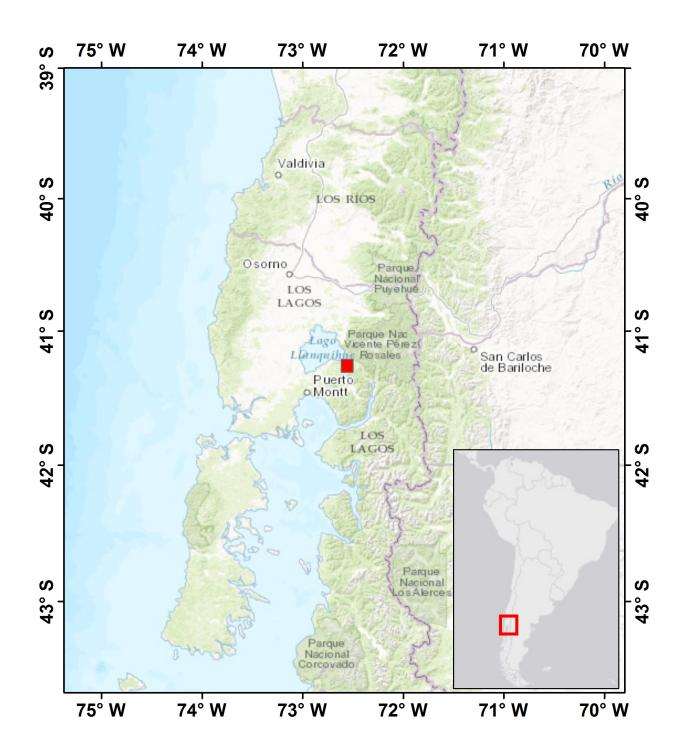

Fig. 1. Calbuco volcano's geographic location (red square at 41.33°S, 72.61°W), Chile, South America (credit: ESRI basemap).

(23.8–183.31 GHz) spectra. The goal of this paper is to quantitatively show the following.

- How satellite MW radiometric measurements can complement satellite TIR measurements for the detection and estimation of near-source volcanic plume parameters.
- 2) How TIR-based volcanic products, derived from different sensors and algorithms, can provide a physically consistent characterization of distal ash clouds and can be coupled with LEO spaceborne lidar retrievals, properly tuned for volcanic ash particles.
- 3) How satellite-based products of near-source tephra plume and distal ash-cloud mass loading are in a fairly good agreement with available ground-based sampling of volcanic deposits due to the 2015 Calbuco eruption.

This paper is organized as follows. Section II illustrates the 2015 sub-Plinian Calbuco eruption and the considered satellite data sets in the VIS–NIR, TIR, and MW ranges. Section III introduces and applies the tephra ATMS MW detection and parametric retrieval of near-source parameters and shows the useful complemental information given by VIIRS. Section IV shows the VIS–TIR ash retrieval intercomparison for the distal ash cloud. Section V makes a summary and addresses future developments.

#### II. 2015 CALBUCO ERUPTION AND SATELLITE DATA

Calbuco is an active stratovolcano with a summit at 2003 m in southern Chile (South America) located at -41.33°S, -72.61°W (see Fig. 1) [40], [44]. After 54 years since its last major eruption in 1961, the first eruption unexpectedly started at 21:08 UTC on April 22, 2015, following 2 h of

{2}------------------------------------------------

TABLE I

SATELLITE PLATFORMS, SENSOR CHARACTERISTICS, AND TIME OF OBSERVATION RELATED TO THE CALBUCO EVENT ON APRIL 23, 2015. VIS, NIR, IR, AND MW STAND FOR VISIBLE, NEAR-INFRARED, INFRARED, AND MICROWAVE, RESPECTIVELY. FOR OTHER ACRONYMS AND INFORMATION, SEE TEXT

| Satellite | Orbit | Sensor  | Sensor | Frequency | Overpass time |
|-----------|-------|---------|--------|-----------|---------------|
|           |       | type    | name   | band      | (UTC)         |
| Suomi-NPP | LEO   | Passive | VIIRS  | VIS-IR    | 05:09         |
|           |       |         |        |           | 19:04         |
| Suomi-NPP | LEO   | Passive | ATMS   | MW        | 05:09         |
|           |       |         |        |           | 19:04         |
| Aqua      | LEO   | Passive | MODIS  | VIS-IR    | 06:35         |
| -         |       |         |        |           | 18:35         |
| CALIPSO   | LEO   | Active  | CALIOP | VIS-NIR   | 18:34         |

strong seismic activity. This basaltic andesitic (with about 55% of silica) eruption suddenly started with a high-intensity explosive phase. Over 4000 people were evacuated or fled from an area within 20-km radius of the volcano during the first hour. A significant ashfall occurred in areas to the east and northeast of the volcano. The airport of Puerto Montt was closed. The first pulse lasted about 2 h and was followed by a lava flow that was active by around 22:30 UTC. A large ash plume moved northeast and reached Villa Angostura and Bariloche in Argentina. In nearby areas, such as the Región de Los Lagos, up to 40 cm of ash was reported.

The second huge explosion occurred at 04:00 UTC on April 23, stronger than the first one and lasted about 6 h. The Buenos Aires Volcanic Ash Advisory Centre reported ash from 12-km altitude up to 15–20 km. Pyroclastic flows occurred during the second eruption on the southeast flank, caused by partial collapse of the eruption column. Erupting jets of incandescent tephra (ash and bombs) during the eruption were accompanied by frequent lightning. Ballistic bombs were ejected to distances of up to 5 km. Strong seismic activity with an average of 150 volcanic-tectonic earthquakes of magnitudes up to 3.6 was recorded during the paroxysmal phase of the eruption. Significant tephra fall up to 50–60 cm occurred in nearby downwind areas, while in the more distant areas of Los Ríos and Araucaní, few millimeters of ash were reported. The third smaller explosion started at 02:30 UTC on April 24, 2015, producing more or less continuous small to moderate ash emission. The latter reached up to 2-km height and drifted mainly northeast and continued till the midnight of April 25 [40], [41].

Table I lists spaceborne sensors aboard polar orbit platforms, used in this paper to analyze the 2015 Calbuco volcanic eruption. Within the multisatellite multisensor approach of this paper, we will focus our quantitative analysis on the two couples of coupled instruments described above, that is, ATMS and VIIRS aboard S-NPP plus MODIS and CALIOP aboard the A-train. Their main technical specifications are summarized in the following text.

ATMS is one of the five earth-observing instruments onboard S-NPP (see [30], [31]). It is a cross-track scanning total-power MW radiometer with 22 channels from 23.8 up to 183.31 GHz. All channels detect quasi-horizontal (QH) polarization except 23.8-, 31.4-, and 88.2-GHz channels, which detect quasi-vertical (QV) polarization. Spatial resolution goes from 74 km2 at 23.8 GHz down to 34 km2 at 88.2 GHz and 17 km2 at 183 GHz. ATMS provides sounding observations needed to retrieve profiles of atmospheric temperature and moisture for civilian operational weather forecasting as well as continuity of these measurements for climate monitoring purposes. VIIRS is a whiskbroom cross-track scanning radiometer aboard the S-NPP satellite (see [21], [22]). It has 22 spectral bands covering the spectrum between 0.412 and 12.01 μm, including 16 moderate resolution bands (M-bands, 750-m spatial resolution), five imaging resolution bands (I-bands, 375-m spatial resolution), and one panchromatic (DNB). VIIRS observations primarily focus on clouds and earth surface variables. MODIS is a spaceborne spectrometer launched in 1999 on board Terra (EOS AM) and in 2002 on board Aqua (EOS PM) satellites (see [23]). The cross-track scanning instrument has 36 spectral bands ranging (in wavelength) from 0.4 to 14.4 μm and at different spatial resolutions (two bands at 250 m, five bands at 500 m, and 29 bands at 1 km). CALIOP is a near-nadir looking lidar aboard the CALIPSO satellite (see [24]) that provides high-resolution vertical profiles of aerosols and clouds. CALIOP operates at 532 and 1064 nm with a nadir pointing in order to acquire vertical profiles of backscattered power of the atmosphere. Distributed products also contain VIS and NIR backscatter profiles already corrected for two-way path attenuation.

# *A. TIR Radiometric Imagery*

TIR BTs are the most used observations to detect volcanic ash clouds from space. This is because the fine tephra relatively absorbs more radiation than water and ice at 11 μm compared to 12 μm (see [42]). Thus, the BTD between 11- and 12-μm channels is taken as a proxy of the presence of ash when BTD < 0, whereas its negative strength depends on the cloud optical thickness and particle mean size [6], [7]. However, when the particle absorption is particularly large, as near the volcano vent during an eruption, the two channels saturate making the BTD technique useless for ash plume detection. In this respect, MW and MMW spaceborne radiometric observations can play a synergic role from space, especially if acquired from the same satellite, being sensible to the coarser particles and having a higher saturation threshold. Moreover, the spaceborne lidar can provide excellent height and thickness estimates for aerosols (sulfuric aerosol in the case of volcanic clouds) and smallest ash particles. The synergistic utilization of high quality lidar, in combination with

{3}------------------------------------------------

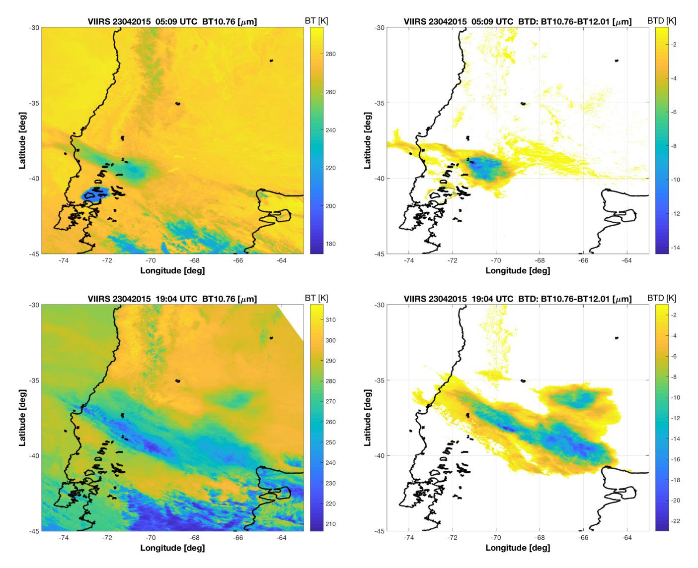

Fig. 2. VIIRS imagery from S-NPP satellite on April 23, 2015 at (Top) 05:09 UTC and (Bottom) 19:04 UTC. (Left) BT at 10.8 μm. (Right) BTD.

realistic particle models, is recommended for improving ash mass concentration retrievals [15].

The distal ash cloud from the Calbuco eruption was observed by VIIRS in two subsequent overpasses on April 23 at 05:09 and 19:04 UTC, both shown in Fig. 2. In the right column plots, pixels with BTD (defined as BT at 10.8 minus BT at 12 μm) less than −1 K are shown and identified as containing ash. There is no unique way to determine this BTD threshold since it may vary among different volcanic eruptions and environmental conditions. Setting the BTD threshold is an experience-based compromise between avoiding too many false alarms and missing ash pixels (qualitatively evaluated in the absence of any other reference data). For both overpasses, the dispersed ash cloud is readily identified using the BTD technique. However, the near-vent ash cloud at 05:09 UTC that is clearly seen in the BT image [see Fig. 2 (top left)] is not detected in the BTD plot [Fig. 2 (top right)], indicating a very thick ash column over the vent. The plots in Fig. 2 also nicely demonstrate the well-known fact that the BTD technique works best for medium optically thick ash clouds and saturates for dense ash clouds.

# *B. MW and MMW Radiometric Imagery*

The Calbuco eruption has been observed by ATMS crossscanning MW radiometer in the same VIIRS overpasses on April 23 (see Table I), as shown in Figs. 3 and 4. Fig. 3, showing MW BTs at 05:09 UTC for the near-source plume, can be directly compared with the top row plots in Fig. 2. Similarly, for the distal ash cloud at 19:04 UTC, Fig. 4 may be compared with the bottom row plots in Fig. 2. Figs. 3 and 4 clearly show the signature of land and ocean at MW window frequencies (e.g., at 51 and 88 GHz) mainly due to differences of the surface emissivity between 0.4 and 0.6 over ocean and between 0.9 and 1 over land. Note that ATMS BT is also slightly affected by the variability of cross-scanning polarization which is most evident over ocean due to the predominance of Fresnelian specular emissivity (at zenith BT polarization is linear at 45° whereas it becomes horizontal and vertical at the scan edges). Moreover, this land/ocean contrast is attenuated

{4}------------------------------------------------

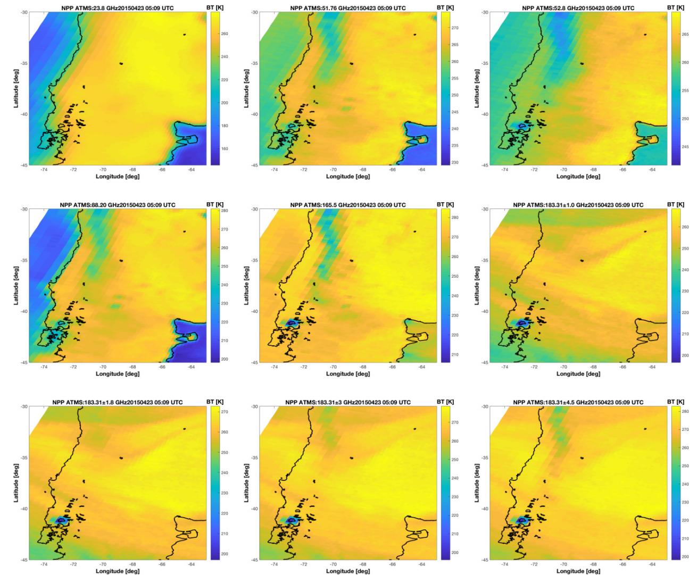

Fig. 3. S-NPP ATMS BTs at 23.8, 51.76, 52.8, 88.2, 165, 183.3 ± 1, 183.3 ± 1.8, 183.3 ± 3, and 183.3 ± 4.5 GHz acquired at 05:09 UTC on April 23, 2015, over the Calbuco volcanic area.

as the frequency increases due to the contribution of gaseous absorption (water vapor around 22 and 183 GHz and oxygen around 55–60 and 118 GHz). Above 100 GHz, the MW contrast of land and ocean BTs is almost completely masked by gaseous emission.

From Figs. 3 and 4, it also emerges that an MW signature of the near-source plume is clearly detectable between 89 and 183 GHz at 05:09 UTC, whereas the distal ash clouds cannot be detected in any of the cases. When compared to VIIRS imagery in Fig. 2, at 19:04 UTC, only BTs at the highest MMW frequencies around 183 GHz could partially discriminate the dispersed ash cloud, even though ice cirrus clouds may generate similar signatures. These MW and MMW volcanic signatures and their differences can be physically explained [10]. MW radiometric observations hardly saturate the optical extinction being much lower than that in the TIR, so that they can exhibit a clear differential signature corresponding to volcanic tephra close to the volcano [11]. On the other hand, the low spatial resolution of spaceborne MW measurements and their poor sensitivity to the finest tephra particles (say less than 50-μm radius) make both MW and MMW observations insensitive to distal diluted ash cloud compared to TIR observations [12].

# III. NEAR-SOURCE TEPHRA MW RETRIEVAL

The S-NPP satellite has the quite unique feature to carry both the VIS–IR radiometer VIIRS and ATMS MW radiometer. Thus, we can exploit MW data to detect the tephra plume near the volcanic vent and combine with TIR data to better characterize and track the dispersion of ash clouds. A data integration of the two TIR and MW images can be simply obtained by resampling lower resolution ATMS images on the VIIRS high-resolution grid using nearest-neighbor approach.

In Sections III-A and III-B, we will focus on the near-source plume by distinguishing its detection, similar to the product obtained from the TIR BTD technique, from its parameter estimation such as TML, plume height, and total erupted mass.

# *A. MW Detection of Tephra Plume*

Tephra plume over land can be detected by adapting to ATMS the MW spectral difference in the window region (MSDW), as proposed and defined in [11]. The basic

{5}------------------------------------------------

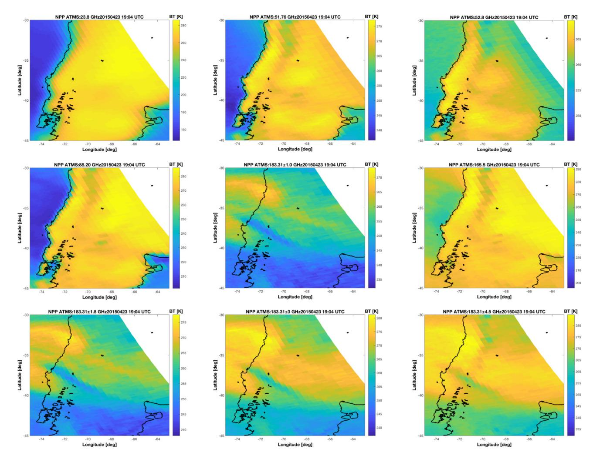

Fig. 4. S-NPP ATMS BTs at 23.8, 51.76, 52.8, 88.2, 165, 183.3 ± 1, 183.3 ± 1.8, 183.3 ± 3, and 183.3 ± 4.5 GHz acquired at 19:04 UTC on April 23, 2015 over the Calbuco volcanic area.

idea behind the MSDw is that at higher MW window frequencies, the convective volcanic plume tends to scatter more than at lower MW window frequencies due to the larger ratio between particle size and wavelength. The use of frequencies larger than 60 GHz over land ensures that the scatteringbased radiation mechanism is predominant with respect to the emission-based one (e.g., see Fig. 3). On this basis, within the plume and over land, MW BT at 165 GHz is expected to be less than that at 88.2 GHz for ATMS.

Assuming that the antenna pattern deconvolution is already accomplished (so that antenna noise temperatures are transformed into BTs), MSDW (in K) over land can be, in general, defined for an off-nadir viewing angle θ as

$$MSD_W = T_{Bp}(f_{W1}, \theta) - T_{Bq}(f_{W2}, \theta)$$
 (1)

where *TB p* and *TBq* (in K) stand for BT at *p* and *q* polarization states, respectively, with *fW*1 > *fW*2 two frequencies in the 85–95 and 155–165 GHz frequency ranges. Over land, the polarization diversity is not helpful so that it can be chosen indifferently horizontal ( *p* = *H*) or vertical (*p* = *V* ), on the basis of the considered sensor. Note that in case of complex nonuniform surface emissivity conditions (e.g., snow and vegetated surfaces), an alternative approach to MSDW is the MSD in the absorption region (MSDA) [11], exploiting absorption channels around 183 GHz. In this case study, by visual inspection, MSDA provides more false alarms than those of MSDW.

Due to its cross-scanning, ATMS has a polarization state which varies with the pointing angle θ, so that ATMS indeed measures QH ( *p* = QH) and QV (*p* = QV) MW BT. In this case, the relation linking *T*BH and *T*BV to *T*BQH and *T*BQV is given by

$$\begin{cases} T_{\text{BQH}}(f,\theta) = T_{\text{BV}}(f,\theta)\sin^2\theta + T_{\text{BH}}(f,\theta)\cos^2\theta \\ T_{\text{BQV}}(f,\theta) = T_{\text{BV}}(f,\theta)\cos^2\theta + T_{\text{BH}}(f,\theta)\sin^2\theta. \end{cases}$$
(2)

Tephra plume is detected when MSDW < MSDWth, where MSDWth is an arbitrarily chosen threshold. A typical value for MSDWth is equal to 0 K so that negative values of MSDWth indicate the presence of tephra. In general, the dependence of MSDW on θ is relatively small since the detected plume is quite limited in extension. Note that over ocean MSDw cannot

{6}------------------------------------------------

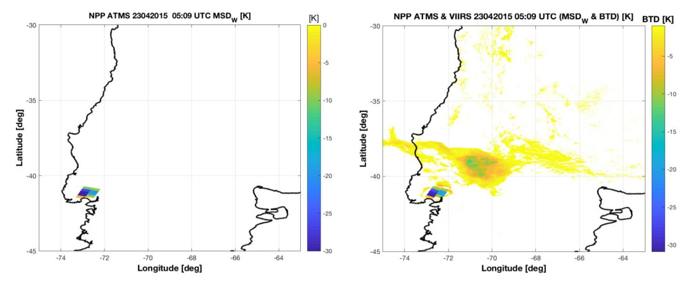

Fig. 5. S-NPP satellite image processing at 05:09 UTC. (Left) MSDW mask at MW whose negative values are able to isolate over land the volcanic near-source plume. (Right) BTD mask values at TIR, combined together with resampled MSDW at MW, showing the detection of both near-source and distal tephra.

be defined and other techniques should be used, such as the MSDA, as defined in [11].

For this ATMS case study, we have used MSDWth = 0 and set in (1)  $f_{W1}$  = 165 GHz and  $f_{W2}$  = 88.2 GHz for  $T_{\rm BQH}$  and  $T_{\rm BQV}$ , respectively.  $T_{\rm BQH}$  and  $T_{\rm BQV}$  are obtained by inverting (2).

A map of negative  $MSD_W$  at 05:09 UTC is shown in Fig. 5 where it is also remapped and combined with TIR BTD mask derived from Fig. 2. The combination clearly shows how MW and TIR signatures are complementary even though with a quite different spatial resolution (an order of magnitude). Using negative values of  $MSD_W$ , the near-source plume is well detected by ATMS at 05:09 UTC. The same  $MSD_W$  mask criterion would not be useful if applied to ATMS at 19:04 UTC in Fig. 4, since the distal ash cloud is too optically thin at the considered MW frequencies and spatial resolutions.

### B. MW Estimation of Tephra Plume

Once detected, the near-source tephra plume can be characterized in terms of geometrical and physical properties. In particular, we can use a parametric retrieval algorithm, developed by regression analysis applied to numerical model simulations of sub-Plinian plumes over land in terms of MW BTs [12], [15]. The eruption source parameters, used to initialize the model simulations, and listed in [12] show an initial velocity and potential temperature at the vent of 200 m/s and 813 K, respectively, as well as a Gaussian width of 20 km. The MW forward model is based on a 2-D plume model, named Active Tracer High-Resolution Atmospheric Model, coupled with the radiative transfer model Ash Satellite Data Simulator Unit using the delta-Eddington approximation and including Mie scattering for spherical particles [12]. The assumption of spherical tephra particles is a simplification whose validity may fail for realistic volcanic scenarios, but the characterization of nonsphericity for volcanic particles

is far from being fully assessed, especially for near-source plumes [15], [29]. This implies that spherical shapes are a fair and conservative compromise to deal with real applications.

Previous analyses have shown that the exploitation of water-vapor absorbed BTs around 183 GHz should guarantee estimates relatively independent of the surface emissivity [12]. The uncertainty due to the columnar water vapor may have an impact on the MW estimation accuracy, but nearsource convective plume scattering should be predominant with respect to water-vapor absorption in the BT radiative process. Over land, MW surface emissivity is always fairly high at all frequencies (above 0.9) and typically unpolarized. Moreover, the spatial integration of large field-of-views makes land emissivity quite uniform at a regional scale and the use of absorption channels makes BT rather insensitive to surface characteristics. This means that the parametric regressive inversion method, even though not necessarily adaptive and generalizable to other scenarios, represents a useful and easyto-implement approach for the Calbuco case study.

To retrieve the tephra columnar content or mass loading  $L_t$  (in kg/m2) of a sub-Plinian plume, the following parametric formula can be used over land:

$$L_t = a_t \left(\frac{\rho}{\rho_0}\right) + b_t \left(\frac{\rho}{\rho_0}\right) T_B(f_{A1}, \theta)$$
 (3a)

where the weighted unpolarized BT  $T_B$  (in K) is given by

$$T_B(f_{A1}, \theta) = \left[ \frac{1 - \exp\left(-\frac{1}{\cos \theta}\right)}{1 - \exp\left(-\frac{1}{\cos \theta_0}\right)} \right] \left[ \frac{T_{Bp}(f_{A1}, \theta) + T_{Bq}(f_{A1}, \theta)}{2} \right]$$
(3b)

with  $f_{A1}=183.3\pm4.5$  GHz and  $\theta_0=45^\circ$ , whereas the regression coefficients for sub-Plinian eruptions are set to  $a_t=63.84$  and  $b_t=-0.2564$  with  $\rho_0=2500$  kg/m3. The following may be noted.

{7}------------------------------------------------

- 1) The scalable expression in (3a) allows choosing the proper tephra density for the considered erupted plume.
- 2)  $L_t$  is almost not depending on the surface land emissivity variation due to the use in (2) of the absorbed channel around 183 GHz (whose low sensitivity to surface conditions is also confirmed when varying the relative humidity from 50% up to 100%) [12].

For this Calbuco case study, we have chosen  $\rho = \rho_0$  using for ATMS  $T_{Bp} = T_{\text{BQH}}$  and  $T_{Bq} = T_{\text{BQH}}$  since the sounding channel at  $f_{A1}$  has only a single QH polarization.

From the spatial distribution of TML  $L_t$ , we can evaluate the erupted tephra total mass  $M_t$  (in kg) by integrating over the detected plume area  $A_p$  (in m2) as follows:

$$M_t = \int_{A_n} L_t(x, y) dA \tag{4}$$

where  $A_p$  is provided by the MSDW mask, defined in (1).

Passive MW observations may also help estimating the spatial distribution of the plume maximum height  $H_p$ , using the highly absorbed double-side channels at 183 GHz. From the same numerical simulations in [12], we have derived the following parametric polynomial estimator to infer  $H_p$  (in km) above the vent level (avl):

$$H_p = \sum_{n=0}^{5} c_n [T_B(f_{A2}, \theta)]^n - h_v$$
 (5)

where  $T_B$  is derived from (3b) with  $f_{A2}=183.3\pm1$  GHz and  $c_n$  are the regression coefficients set to  $c_0=7068.2$ ,  $c_1=171.9666789$ ,  $c_2=1.6671962$ ,  $c_3=-0.0080283$ ,  $c_4=1.9206628\times10^{-5}$ , and  $c_5=-1.8271631\times10^{-8}$  with  $h_v$  (in km), the volcano vent altitude above the sea level (asl). For this Calbuco case study,  $h_v$  is equal to 2 km and we have again set  $T_{Bp}=T_{\rm BQH}$  and  $T_{Bq}=T_{\rm BQH}$  since the sounding channel at  $f_{A2}$  has only a single QH polarization.

Using a standard power-law relationship linking the top plume height  $H_p$  (in km) to the volcanic MFR, the latter  $F_R$ , expressed in kg/s, can be derived from [5]

$$F_R = a_f H_p^{b_f} \tag{6}$$

where  $a_f = 140$  and  $b_f = 4.15$  are semiempirical coefficients for a sub-Plinian eruption. By (5), we can transform the MW-based estimate of plume top height, close to volcano vent, into MFR even though the LEO-satellite single overpass time sampling may affect this retrieval whose value may be influenced by plume bending above the neutral buoyancy level [38]. In this respect, we can retrieve a spatial distribution of plume height  $H_p$  from a spaceborne MW radiometer taking the associated maximum value of  $F_R$  as the best approximation of tephra mass flux.

Results of TML  $L_t$  from (3), plume maximum height  $H_p$  from (5), and MFR  $F_R$  from (6) at 05:09 UTC are shown in Fig. 6. The TML shows values up to 9 kg/m2, probably due to the presence of lapilli and bombs closer to the volcano vent (where TIR BTD is unable to detect ash). The top plume height near the volcano vent shows a maximum value of about 21-km asl (i.e., about 19-km avl), which is representative of the eruption activity beginning as shown by ground-based

#### TABLE II

TEM DERIVED FROM: 1) SPARKS et al. [1] AND MASTIN et al. [5] EMPIRICAL FORMULAS [SEE (6), (7)] USING A TIME LAG OF 69 min by CONSIDERING THE MAXIMUM (19 km) AND MEAN (17 km) VALUES OF PLUME HEIGHT  $H_p$  AND A PIXEL-BASED APPROACH AND 2) ATMS ASH RETRIEVAL

| Mass estimation method                                   | Mass (kg)              |
|----------------------------------------------------------|------------------------|
| Sparks et al. (1997) [1] - 69 min $(H_p=19km)$           | $17.4 \cdot 10^{10}$   |
| Sparks et al. (1997) [1] - 69 min (H p =17km) | $7.60 	ext{ } 10^{10}$ |
| Sparks et al. (1997) [1] - 69 min (pixel based)          | 11.4 10 10             |
| Mastin et al. (1997) [5] - 69 min (H p =19km) | 11.7 10 10             |
| Mastin et al. (1997) [5] - 69 min (H p =17km) | 7.40 10 10             |
| Mastin et al. (1997) [5] - 69 min (pixel based)          | 7.60 10 10             |
| ATMS at 05:09 UTC (all pixels, 7020 km 2 )    | 3.65 10 10             |

measurements [44]. This estimate provides a relatively high volcanic MFR reaching a value up to  $2.8 \times 10^7$  kg/s, typical of intense sub-Plinian eruptions such as that of the Calbuco volcano in 2015.

The detected plume area  $A_p$  is about 7020 km2. By integrating the ash mass loading estimated from ATMS at 05:09 UTC as in (4), the total tephra mass of the near-source plume is  $3.65 \times 10^{10}$  kg (i.e., 36.5 Tg or  $36.5 \times 10^{6}$  tons), as reported in Table II. This ATMS-based estimate can be compared with ground measurements of volcanic deposits, carried out after the end of the 2015 Calbuco eruption [40] and with the values obtained considering the Sparks *et al.* [1] and Mastin *et al.* [5] formulas. A quantitative intercomparison will be the topic of Section III-C.

#### C. Empirical and Experimental Estimation of Tephra Mass

Near-source volcanic parameters are difficult to estimate and there are several semiempirical approaches to provide the total mass. By applying the following parametric formula from [1]:

$$M_t = \gamma^{-4} H_p^4 \Delta t_e \tag{7}$$

where  $H_p$  (in km) is the plume top altitude above the vent,  $\gamma = 0.236 \text{ km} \cdot \text{kg}^{-4} \cdot \text{s}^{-4}$  is an empirical coefficient for Plinian and sub-Plinian eruptions, and  $\Delta t_e$  (in s) is the eruption duration time.

A rough estimate of tephra total mass from (7) can be derived by using ATMS-based estimates of maximum value of  $H_p$  (about 19-km avl) and considering a duration of 69 min (the second explosive eruption started at 04:00 UTC on April 23, 2015, and the ATMS image has been collected at 05:09 UTC). Under these assumptions, we obtain a value for  $M_t$  equal to  $1.74 \times 10^{11}$  kg, about one order of magnitude larger than ATMS-based estimate (see Table II). The reason why the value obtained is larger than the ATMS retrieval can be attributed to the use of the maximum height of the tephra column in (7). This would imply indeed that the plume top height remained around 19 km from the beginning of the eruption onward. Therefore, this value is the maximum total estimated mass (TEM) that can be obtained from (7), whereas from ATMS data, a significant variation of the column height during the first 69 min of the eruption can be estimated.

{8}------------------------------------------------

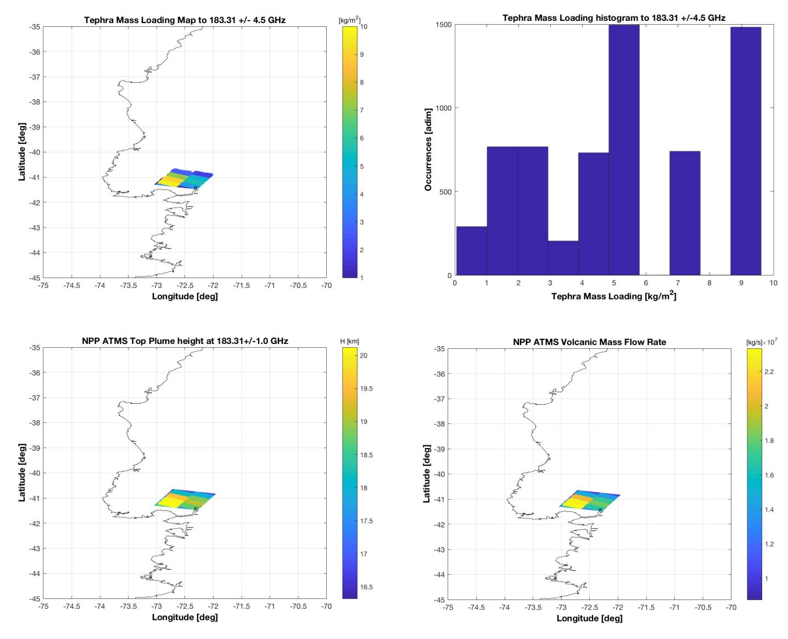

Fig. 6. Calbuco erupted plume at 05:09 UTC observed by S-NPP ATMS. (Top left) Map of estimated TML using (3). (Top right) Histogram of TML (in kg/m²) map derived from ATMS. (Bottom left) Map of tephra top height altitude asl using (5). (Bottom right) Map of tephra MFR using (6).

To take into account the volcanic plume height evolution, we might consider an average value of the plume heights retrieved by ATMS.  $H_p$  average value is about 17 km [estimated as the mean altitude of the values shown in Fig. 6 (bottom left)]. By using this value, the total mass from (7) becomes  $7.6 \times 10^{10}$  kg, that is, in agreement with the estimate based on ATMS data. Moreover, considering that (7) is not linear, we can obtain a third total erupted mass estimate by applying the formula to each pixel separately. Indeed, Fig. 6 shows that the cloud detected by ATMS consists of eight pixels with variable estimated heights. By assuming a constant wind direction and speed in the time interval (i.e., 69 min) between the beginning of the eruption and the acquisition of the ATMS image, the cloud can be considered as composed by eight puffs of equal duration and different heights. This means that we can apply (7) by summing up the results obtained, considering for each pixel the plume height estimated by ATMS with a duration of 69/8 min, obtaining a final TEM of  $1.14 \times 10^{11}$  kg.

The same approaches described above can be considered to evaluate the TEM using (6) with the same duration of 69 min. The values in this case are  $1.17 \times 10^{11}$ ,  $7.4 \times 10^{10}$ , and  $7.6 \times 10^{10}$  kg, for maximum, average, and pixel-based heights, respectively. In Table II, all these results have been summarized.

All these results obtained from the different applications of (6) and (7) are comparable and in agreement with the independent ATMS TEM estimation. The higher TEM values, obtained from (6) and (7), are in some way expected because these formulas take into account all the tephra particle sizes, while ATMS gives an estimation of TEM only due to particles with effective radius from 25  $\mu$ m to some millimeters. Anyway, our results confirm that model expressions in (6) and (7) should be used with a careful attention, probably better characterizing  $\gamma$  parameter for the specific volcanic eruption or introducing some equivalent time window for  $\Delta t_e$ .

An extensive ground-based field campaign was carried out in 2015 to characterize stratigraphy, grain size, clast density,

{9}------------------------------------------------

#### TABLE III

TEM Derived From: 1) Sparks  $\it et al.$  [1] Empirical Formula Using a Time Lag of 6 h by Considering the Mean Value of Plume Height (17 km) and 2) Deposit Ash Measurements by Romero  $\it et al.$  [40] From the Layers  $\it C+D$  of the Proximal–Distal Deposit on April 23, 2015

| Mass estimation method                                                 | \ 0/                 |
|------------------------------------------------------------------------|----------------------|
| Sparks et al. (1997) [1] - 6h $(H_p=17km)$                             | $3.88  10^{11}$      |
| Mastin et al. (1997) [5] $-6h (H_p=17km)$                              | $2.58 \cdot 10^{11}$ |
| ATMS extrapolated to 6 hours (all pixels, 7020 km 2 )       | $1.90\ 10^{11}$      |
| Romero et al. (2016) [41] - Average, event C+D, proximal-distal regime | $1.86 \ 10^{11}$     |

total erupted volume, column height, and eruption duration of the tephra fall deposits associated with the April 22, 2015-April 23, 2015 eruption, as widely described by Romero et al. [40]. The first pulse started on April 22 at 21:05 UTC with a column  $\sim$ 15 km high above the crater and deposited layers called A, B, and B1 (interpreted as sedimentation of a secondary low-altitude plume). Another eruption pulse occurred on April 23 at 04:00 UTC, and deposited layers called C and D (see [40] for geolocation of ash layers A, B, B1, C, and D). The proximal stratigraphy revealed that most of the ejected products range from coarse lapilli to bomb size, but coarse ash has been found at distances longer than 27 km. The deposits thinned and particle diameters mainly decreased with distance along the downwind axis. The first phase released ~38% of the total volume with layer C accounting for ~46% of the total released tephra. Layer D accounted for 16% of the deposited tephra [40].

The mass estimates from the ground-based observations and ATMS are inherently different. The ground-based observations give the total deposited mass in various layers and regimes, whereas the ATMS value is an instantaneous estimate of the mass of ash in the air. Thus, care must be exercised when comparing these mass estimates. Moreover, ATMS is mostly sensitive to coarse particles which typically represent about 90% of total erupted mass (fine particles typically represent less than 5%). ATMS will thus generally slightly underestimate the total mass and is equal to  $3.65 \times 10^{10}$  kg.

This value cannot be compared directly with the ground deposit, the latter being an integral of the tephra fallout during the second eruption pulse on April 23 that lasted for about 6 h [40]. The eruption is not usually constant over time and ATMS only provides a snapshot 69 min after the first pulse. However, if we assume that the eruption rate is constant and the ATMS snapshot contains the tephra emitted during these 69 min, then ATMS-based estimate can be proportionally extrapolated to 360 min (through the factor 360/69) providing about a total mass of about  $1.90 \times 10^{11}$  kg. This value is comparable with the ground-based value of  $1.86 \times 10^{11}$  kg derived from the C + D proximal-distal deposit, as reported in Table III. Thus, while a direct comparison of the instantaneous ATMS measurement and ground-based observations (representing various regimes of the eruption) is challenging, from the above discussion, we may infer that these ATMS estimates are indeed coherent with the tephra proximal-distal deposit sampling. In Table III, the tephra masses, obtained by the application of (6) and (7) for a time range of 6 h, are also shown for comparison.

## IV. DISTAL ASH CLOUD VIS-IR RETRIEVAL

The near-source plume is characterized over the vent by the gas-thrust region and buoyancy-driven convective region. Above the latter, there is the expansion of the umbrella region around the neutral buoyancy level, possibly advected by the transverse horizontal wind [1]. The transport of the tephra is typically related to the finest particles (below 20  $\mu$ m) which are then forming the distal volcanic ash cloud. This ash cloud is poorly detected at MWs, as already discussed, but well sensed by VIS and IR passive and active sensors.

The shape of the size distribution of the ash cloud particles and its modification during its transport represent one of the largest uncertainties for the retrieval of ash mass concentration and effective radius together with ash particle refractive index, ash cloud top height, and thickness (see [26]–[29]). Typical effective ash particle size tends to decrease with transport from the volcanic source as larger particles are removed by sedimentation even though ash aggregation processes must also be considered [14]. Retrieval approaches, based on spaceborne IR spectroradiometers, need to make some *a priori* assumptions about these unknown properties on the basis of external sources [26]. Using lidar systems, profiling of ash concentration and diameter is possible even though ash refractive index needs to be characterized [17], [18].

In this section, we will show the intercomparison of ash cloud retrievals, based on VIIRS and MODIS data and processed using two different approaches based on the same microphysical assumptions. Besides, VIIRS and MODIS retrievals will be compared to CALIOP lidar estimations in order to perform a quantitative validation and to estimate the degree of uncertainty due to different TIR retrieval techniques.

# A. Retrievals From VIIRS and MODIS Radiometers

The ash-cloud mass loadings  $L_a$  from VIIRS and MODIS have been estimated by applying two different well-established minimization approaches using ash cloud optical thickness and effective radius as driving variables to match BTD and BT at 11  $\mu$ m [7], [26], [28]. Both are based on TIR radiative transfer forward models (RTM, namely, libRadtran for VIIRS and ModTran for MODIS data processing), applied to 11- and 12- $\mu$ m band data using ad hoc lookup tables of spherical particle ensemble optical parameters [7], [37], [38]. Main assumptions are those related to ash cloud thickness of 2 km (in this paper, between 16-18 km asl), andesitetype spherical particles with a lognormal grain-size distribution (mean and standard deviation equal to 5 and 1.77  $\mu$ m, respectively), a surface emissivity of 0.954 (11  $\mu$ m) and  $0.962 (12 \mu m)$ , and an ash density of 2600 kg · m-3 [20]. The surface temperatures range between 265 and 302 K and water-vapor profiles used in the RTM are based on data derived from the European Centre for Medium-Range Forecasts and from the Puerto Montt WMO weather station, which is very close to the Calbuco volcano.

Fig. 7 shows the maps of estimated ash-cloud mass loading from MODIS and VIIRS at 18:35 and 19:04 UTC, respec-

{10}------------------------------------------------

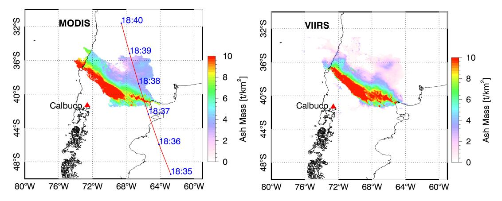

Fig. 7. Retrieval products from MODIS and VIIRS spaceborne VIS–IR radiometer data sets collected on April 23, 2015. (Left) Map of ash-cloud mass loading retrieved from Aqua MODIS at 18:35 UTC. The red line indicates the CALIOP track nearly simultaneous to the MODIS acquisition with the UTC time labels of the satellite overpass. (Right) Map of ash-cloud mass loading retrieved from S-NPP VIIRS at 19:04 UTC.

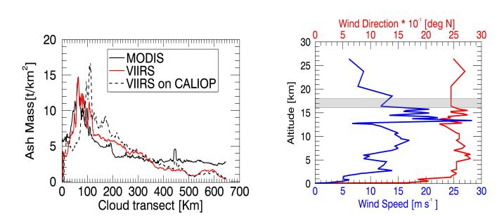

Fig. 8. (Left) MODIS and VIIRS ash mass map retrieval transects on the CALIOP track (black solid and dotted lines, respectively) and VIIRS best correlated transect (red solid line) obtained by considering the transects parallel to the CALIOP track on the VIIRS ash mass map. The best correlation (r=0.906) with the MODIS transept corresponds to an ash cloud shift of 18 km between the two images. (Right) Wind direction and speed profiles of the closest radiosounding collected from the Puerto Montt WMO station at 12:00 UTC on April 23, 2015. From these measurements, we obtain an average wind direction of 245°, nearly perpendicular to the CALIOP transept, and an average wind speed of 11.2 m·s-1 at the ash cloud altitude of 16–18 km estimated by CALIOP lidar. This yields a cloud shift of 19.5 km during the 29-min lag between MODIS and VIIRS acquisitions.

tively. Fig. 7 shows how VIIRS- and MODIS-based retrievals are in good agreement, even though the VIIRS retrieval tends to be slightly lower in the north-eastern upper portion of the distal ash cloud. These differences may be attributed to the different sensitivity of the two instruments and the differences in the acquisition time between the images of the two sensors.

In this respect, for a more detailed intercomparison, we have extracted from the MODIS ash mass map retrieval the transect coincident with the CALIOP track as shown in Fig. 7. We have then considered the transects parallel to the CALIOP track on the VIIRS ash mass map and found that the best correlation (r=0.906) with the MODIS transect corresponds to an ash cloud shift of 18 km between the two images in the north-west direction, as shown in Fig. 8. An independent check of this cloud shift can be obtained considering the closest radiosounding from Puerto Montt station at 12:00 UTC on April 23, 2015. From these measurements, we can derive an average wind direction of 245° (with respect to the north), nearly perpendicular to the CALIOP transept, and an average wind speed of 11.2 m  $\cdot$  s-1 between 16 and 18 km, which is the average ash cloud altitude estimated by

TABLE IV
TEM FROM MODIS AND VIIRS RETRIEVAL ALGORITHMS USING
ALL PIXELS OR COMMON PIXELS (WITH DETECTED AREA)

| Mass estimation method                                      | Mass (kg) |
|-------------------------------------------------------------|-----------|
| MODIS at 18:35 UTC (all pixels, 346356 km 2 )    | 2.30 109  |
| VIIRS at 19:04 UTC (all pixels, , 410701 km 2 )  | 1.90 109  |
| MODIS at 18:35 UTC (common pixels, 295655 km 2 ) | 1.90 109  |
| VIIRS at 19:04 UTC (common pixels, 295655 km 2 ) | 1.80 109  |

CALIOP [see Fig. 8 (right panel)]. Considering the gap of 29 min between the MODIS and VIIRS images acquisition times, these results yield to a cloud shift of 19.5 km, which is in very good agreement with the 18-km shift previously estimated from the retrieval images.

Under the reasonable assumption that the total ash burden variation of the distal ash cloud is negligible during this 29-min time lag, we can consider another quantitative intercomparison in terms of total ash-cloud mass estimates by summing up the retrieved vertical column mass loadings. The latter, derived from the MODIS at 18:35 UTC and VIIRS at 19:04 UTC for the distal ash cloud, is about  $0.23 \times 10^{10}$  and  $0.19 \times 10^{10}$  kg, respectively, as shown in Table IV. If only the overlapping pixels are taken into account, the values change into  $0.19 \times 10^{10}$  and  $0.18 \times 10^{10}$  kg, respectively, whose values are in very good agreement. Being the average deposit estimate equals to  $1.86 \times 10^{11}$  kg (see Table III), these results indicate that the emitted FA (particles with effective radii between about 0.5 and 15  $\mu$ m) is about the 1% of the total tephra ejected during the April 23 paroxysm.

Note that by applying suitable techniques described in [13], the MODIS-derived cloud top height is about 18.7-km asl. As expected, this top altitude is less than that of 21 km estimated near the Calbuco vent from ATMS data (see Fig. 6). The two explosive events produced an umbrella cloud that consists of an overshooting core and a lower anvil that spreads in all directions. The ATMS maximum height of 21 km likely corresponds to the overshooting core, while the 18.7 km maximum height inferred from CALIOP is likely associated with the anvil. The CALIOP height is lower because it is part of the dispersed umbrella cloud anvil (see [43]).

{11}------------------------------------------------

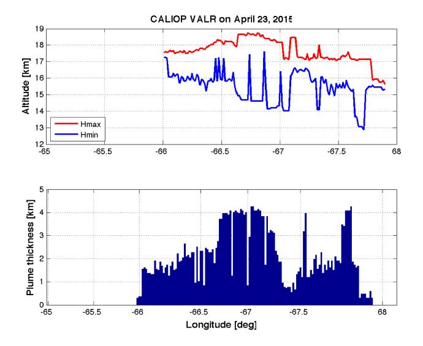

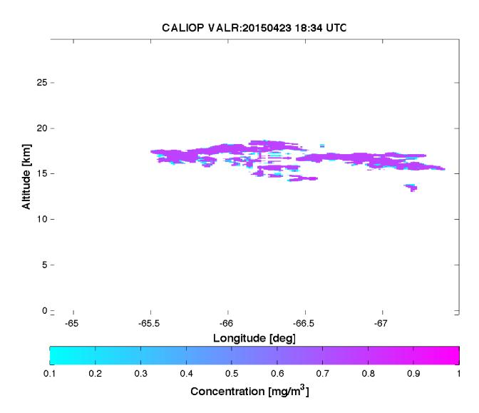

Fig. 9. Retrieval products from CALIOP lidar aboard CALIPSO satellite at 18:27 UTC using VALR inversion algorithm. (Left) Distal ash cloud maximum and minimum altitude and its relative thickness in the panel below. (Right) Vertical cross section of estimated ash mass concentration.

# *B. Retrievals From CALIOP Lidar*

The CALIPSO lidar can provide excellent height estimates for aerosols (mainly silicate aerosol in case of volcanic clouds) and small ash particles [17], [39]. CALIOP is an elastic backscatter lidar, which cannot independently measure the aerosol extinction and backscatter coefficients. Thus, a common assumption is a lidar ratio vertically constant throughout the entire column, either prescribed or inferred using additional measurements as constraints [32]. In this case study, we adopt a lidar ratio of 60 sr in order to reconstruct the nonattenuated backscatter [24]. The synergistic utilization of realistic particle models is recommended for improving ash mass concentration retrievals from backscatter measurements.

To analyze this Calbuco eruption, we have applied the volcanic ash lidar retrieval (VALR) algorithm [16], developed for ground-based applications and here extended to spaceborne observations. The approach is based on a statistical technique applied to lidar backscatters at 1064 and 532 nm, both corrected for path attenuation, and volume depolarization ratio at 532 nm. In order to identify ash particles within the dispersed cloud, we have selected cross-sectional pixels characterized by a lidar color ratio (i.e., ratio between backscatters at 1064 and 532 nm) between 0.2 and 0.8 and lidar depolarization between 0.1 and 0.5 [33]. The measured depolarization ratio can indeed show higher values, but this typically happens in regions with a low signal-to-noise ratio that have been disregarded.

The VALR algorithm exploits a maximum likelihood approach in order to classify the ash and then retrieve its main parameters, i.e., ash mass concentration and effective diameter, from CALIOP measurement nadir profile. The VALR algorithm is trained with a data set composed by VA (mean radius from 0.125 to 8 μm) and FA (mean radius from 8 to 64 μm) classes with andesite refractive index [20] and nonspherical habits [16]. The latter is characterized by tumbling orientation, prolate orientation, and oblate orientation plus a spherical shape. VA clouds are quite probable at an altitude above 15-km asl and at a distance relatively far from the eruption vent (more than 400 km).

The VALR lidar estimates from CALIOP are shown in Fig. 9. The maximum and minimum altitude of detected cloud and its thickness are obtained using a threshold on the CALIOP backscatter coefficient. The ash cloud thickness shows a mean value about 2 km and reaches 4.5 km at the middle of the overpass. The top height of ash cloud from CALIOP is about 18.7 km, less than the 21 km estimated from ATMS MW data and comparable to that derived from MODIS, as expected. The VALR ash classification reveals the predominant presence of VA with a quite uniform spatial distribution of mass concentration along the CALIPSO cross section.

# *C. Quantitative Intercomparison With CALIOP Lidar*

Starting from VALR-derived ash mass concentration, we can estimate ash mass loading from CALIOP backscatter profiles along its track as shown in Section IV-A. It may be useful to introduce an independent evaluation of VALR estimates using lidar-based parametric retrieval techniques, even though not necessarily tuned for the Calbuco eruption [18], [19].

In this respect, a simple model to estimate the mass concentration from lidar backscatter is to use the mass-extinction conversion factor *c f* , varying with particle size distribution and composition [19]. This means that CALIOP backscatter data must be converted into estimates of extinction profiles. For the conversion of lidar-derived extinction coefficients into mass concentration *CaG*, we can use the following [18]:

$$C_{aG} = c_f \alpha_e = (1.346r_{\text{eff}} - 0.156)\alpha_e$$
 (8)

where α*e* is the lidar-based extinction coefficient and *c f* is the mass-extinction conversion factor at 532 nm, depending on the particle effective radius *r*eff, as explicit in (8). The model in (8) uses a median-value mass-extinction conversion factor, that is, the best estimate currently available for transported ash [18]. In order to obtain *CaG* from (5) and the corresponding mass

{12}------------------------------------------------

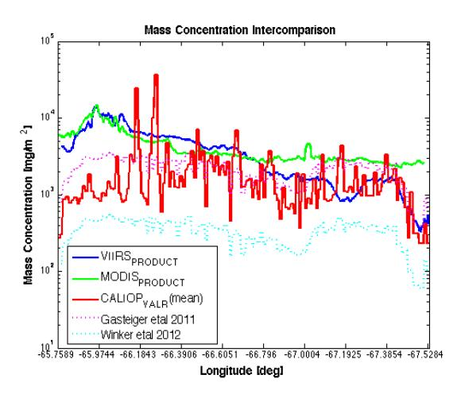

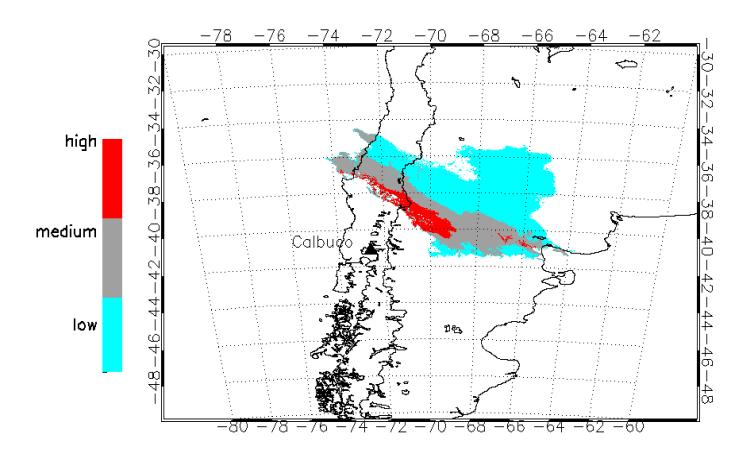

Fig. 10. (Left) Intercomparison of distal ash-cloud mass loading along the CALIOP track derived from the VALR lidar-based inversion technique (CALIOP\_VALR), lidar-based parametric estimators in (8) (see [18]) and (9) (see [19]), VIIRS, and MODIS retrieval algorithms. (Right) Ash cloud concentration classification compliant with the EASA definition of ash contaminated areas (low:  $0.2 \times 10^{-3}$ – $2 \times 10^{-3}$  g/m3, medium:  $2 \times 10^{-3}$ – $4 \times 10^{-3}$  g/m-3, and high:  $>4 \times 10^{-3}$  g/m3).

loading, we have used the effective radius derived from the VALR algorithm (about 7  $\mu$ m).

Another lidar-based parametric retrieval model similar to (8) is based on the characterization of the mass-extinction efficiency k. Ash concentration can be derived from [17], [19]

$$C_{aW} = \alpha_e/k \tag{9}$$

where the mass-extinction efficiency k varies with particle size distribution and composition [19]. As the first approximation, we can use for k a median value of 0.69 m2/g with 95% confidence interval from 0.43 to 1.15 m2/g, which were derived from Icelandic observations [17].

Mass loadings from CALIOP data can be estimated by multiplying the ash layer thickness with the retrieved concentration from VALR and parametric techniques in (8) and (9). Estimates of mass loadings (in mg/m²) are shown in Fig. 10 where ash mass loading from VALR is compared with estimation models (8) and (9), as well as with estimates from VIIRS and MODIS data. The dynamical range of these estimates is between 10² and 10⁴ mg/m². The large variability of VALR-deduced mass loading is mainly due to its higher sensitivity to different size class particles in the vertical section of the probed ash cloud. Retrievals from algorithm in (9) are expected to be lower than others in this case study, being biased toward Icelandic data.

MODIS-, VIIRS-, and CALIOP-based estimates of ash mass loading are in a better agreement in the second half of cross track which corresponds to the more aged and diluted part of the cloud with differences less than about 1 g/m2. Average CALIOP-derived mass concentration is about 0.8 g/m2 against 0.4 g/m2 from VIIRS and 1.4 g/m2 from MODIS within the low-to-medium optically thick ash cloud. Larger disagreements (more than 5 g/m2) are noted in the first half of cross track where ash particle extinction is fairly high, a condition that may impact the correction of CALIOP two-way extinction but also TIR-based retrieval algorithms.

Finally, the average cloud thickness derived from CALIOP data can be used to estimate the ash cloud concentration from

the TIR ash mass retrieval. The right panel of Fig. 10 shows the ash concentration classification compliant with the European Aviation Safety Agency (EASA) definition of ash contaminated areas (low:  $0.2 \times 10^{-3}$ – $2 \times 10^{-3}$  g/m³, medium:  $2 \times 10^{-3}$ – $4 \times 10^{-3}$  g/m³, and high:  $>4 \times 10^{-3}$  g/m³).

# V. CONCLUSION

Satellite MW and TIR radiometric imageries, acquired during the Calbuco eruption in April 2015, have been discussed to show how simultaneous ATMS MW and VIIRS TIR radiometric satellite observations are synergic for volcanic near-source plume and ash cloud monitoring. Moreover, the VIS CALIOP lidar and the MODIS–VIIRS TIR retrievals have been combined to assess the ash mass parameters of the distal ash cloud.

Using the 2015 Calbuco case study, available imageries from ATMS and VIIRS have clearly demonstrated that TIR BTs and associated BTD tend to saturate in the proximity of the volcanic vent of the sub-Plinian column due to high optical extinction of the near-source plume at those wavelengths. Results have confirmed that the use of MW and MMW observations with frequencies between 88 and 183 GHz can provide detection and quantitative retrieval of convective plume near-source parameters, even though at a relatively poor spatial resolution with respect to TIR imagers. This clearly demonstrates the complementarity of MW and TIR measurements. The MW radiometric data have also been used to retrieve near-source terms as TML and plume height. The results obtained indicate a maximum plume altitude of about 21-km asl and an ash mass of  $3.65 \times 10^{10}$  kg, in agreement with mass values obtained from established empirical formulas, but less than proximal-distal mass deposit with an average of  $1.86 \times 10^{11}$  kg. This discrepancy may be explained by extrapolating, under simplifying assumptions, ATMS-based estimates to whole eruption duration of 6 h, thus obtaining a total mass of about  $1.90 \times 10^{11}$  kg.

For the distal ash cloud, its vertical structure can be probed by the CALIOP dual-wavelength lidar. The estimates of ash 

{13}------------------------------------------------

concentration, plume altitude, and mass loading, retrieved by means of VALR algorithm, have provided a valuable comparison with TIR-based estimates. Results have shown that TIR-based retrievals from VIIRS and MODIS are in a relatively good agreement and their products can be combined and compared with CALIOP VALR estimates to retrieve the ash cloud concentration and provide ash contamination masks. The obtained retrievals from TIR sensors indicate that the emitted FA is about the 1% of the total ash emitted during the April 23 paroxysm.

Volcanic near-source parameters, such as concentration, particle mean diameter, and plume thickness are crucial for eruption dynamics modeling and accurate ash concentration forecast during a volcanic event. Combining ash estimations, derived from satellite VIS–IR, MW radiometers, and VIS–NIR lidars, we can start providing a detailed overview of the erupted plume and dispersed ash cloud in terms of ash particle size and content class at proximal and distal ranges. This paper, with the support of numerical modeling and other available satellite data, shall pave the way for a robust development of satellite MW retrievals of volcanic source parameters for aiding the quality of VTDM outputs by improving their near-source parameter initialization. Future work will aim at extending the capability to retrieve particle size spectra and to extend the analysis of case studies where multisatellite multisensor observations are available.

# ACKNOWLEDGMENT

The authors would like to thank the Futurevolc and Aphorism project teams for discussions about satellite data processing.

# REFERENCES

- [1] R. S. J. Sparks *et al.*, *Volcanic Plumes*. New York, NY, USA: Wiley, 1997.
- [2] W. I. Rose *et al.*, "Ice in the 1994 Rabaul eruption cloud: Implications for volcano hazard and atmospheric effects," *Nature*, vol. 375, pp. 477–479, Jun. 1995.
- [3] A. J. Prata, "Satellite detection of hazardous volcanic clouds and the risk to global air traffic," *Nature Hazards*, vol. 51, no. 2, pp. 303–324, Nov. 2009, doi: [10.1007/s11069-008-9273-z.](http://dx.doi.org/10.1007/s11069-008-9273-z)
- [4] S. Barsotti, A. Neri, and J. S. Scire, "The VOL-CALPUFF model for atmospheric ash dispersal: 1. Approach and physical formulation," *J. Geophys. Res.*, vol. 113, no. B3, pp. 1–12, Mar. 2008.
- [5] L. G. Mastin *et al.*, "A multidisciplinary effort to assign realistic source parameters to models of volcanic ash-cloud transport and dispersion during eruptions," *J. Volcanol. Geothermal Res.*, vol. 186, nos. 1–2, pp. 10–21, Sep. 2009.
- [6] A. J. Prata, "Infrared radiative transfer calculations for volcanic ash clouds," *Geophys. Res. Lett.*, vol. 16, no. 11, pp. 1293–1296, Nov. 1989.
- [7] S. Wen and W. I. Rose, "Retrieval of sizes and total masses of particles in volcanic clouds using AVHRR bands 4 and 5," *J. Geophys. Res.*, vol. 99, no. D3, pp. 5421–5431, Mar. 1994.
- [8] A. J. Prata and I. F. Grant, "Retrieval of microphysical and morphological properties of volcanic ash plumes from satellite data: Application to Mt Ruapehu, New Zealand," *Quart. J. Roy. Meteorol. Soc.*, vol. 127, no. 576, pp. 2153–2179, Jul. 2001.
- [9] S. Corradini, L. Merucci, and A. Folch, "Volcanic ash cloud properties: Comparison between MODIS satellite retrievals and FALL3D transport model," *IEEE Geosci. Remote Sens. Lett.*, vol. 8, no. 2, pp. 248–252, Mar. 2011.
- [10] D. J. Delene, W. I. Rose, and N. C. Grody, "Remote sensing of volcanic ash clouds using special sensor microwave imager data," *J. Geophys. Res.*, vol. 101, no. B5, pp. 11579–11588, May 1996.
- [11] F. S. Marzano, M. Lamantea, M. Montopoli, M. Herzog, H. Graf, and D. Cimini, "Microwave remote sensing of the 2011 Plinian eruption of the Grímsvötn Icelandic volcano," *Remote Sens. Environ.*, vol. 129, pp. 168–184, Feb. 2013.

- [12] M. Montopoli, D. Cimini, M. Lamantea, M. Herzog, H. F. Graf, and F. S. Marzano, "Microwave radiometric remote sensing of volcanic ash clouds from space: Model and data analysis," *IEEE Trans. Geosci. Remote Sens.*, vol. 51, no. 9, pp. 4678–4691, Sep. 2013.
- [13] S. Corradini *et al.*, "A multi-sensor approach for volcanic ash cloud retrieval and eruption characterization: The 23 November 2013 Etna lava fountain," *Remote Sens.*, vol. 8, no. 1, p. 58, 2016.
- [14] A. R. Van Eaton *et al.*, "Volcanic lightning and plume behavior reveal evolving hazards during the April 2015 eruption of Calbuco volcano, Chile," *Geophys. Res. Lett.*, vol. 43, no. 7, pp. 3563–3571, Apr. 2016, doi: [10.1002/2016GL068076.2016.](http://dx.doi.org/10.1002/2016GL068076.2016)
- [15] F. S. Marzano, S. Marchiotto, C. Textor, and D. J. Schneider, "Modelbased weather radar remote sensing of explosive volcanic ash eruption," *IEEE Trans. Geosci. Remote Sens.*, vol. 48, no. 10, pp. 3591–3607, Oct. 2010.
- [16] F. S. Marzano, L. Mereu, M. Montopoli, D. Cimini, and G. Martucci, "Volcanic ash cloud observation using ground-based Ka-band radar and near-infrared Lidar ceilometer during the Eyjafjallajökull eruption," *Ann. Geophys.*, vol. 57, no. 2, pp. 1–7, 2014, doi: [10.4401/ag-6634](http://dx.doi.org/10.4401/ag-6634).
- [17] D. M. Winker, Z. Liu, A. Omar, J. Tackett, and D. Fairlie, "CALIOP observations of the transport of ash from the Eyjafjallajökull volcano in April 2010," *J. Geophys. Res.*, vol. 117, no. D20, p. D00U15, Oct. 2012, doi: [10.1029/2011JD016499.](http://dx.doi.org/10.1029/2011JD016499)
- [18] J. Gasteiger, S. Groß, V. Freudenthaler, and M. Wiegner, "Volcanic ash from Iceland over Munich: Mass concentration retrieved from groundbased remote sensing measurements," *Atmos. Chem. Phys.*, vol. 11, pp. 2209–2223, Mar. 2011.
- [19] S. Kinne, "An AeroCom initial assessment—Optical properties in aerosol component modules of global models," *Atmos. Chem. Phys.*, vol. 6, pp. 1815–1834, May 2006. doi: [10.5194/acp-6-1815-2006](http://dx.doi.org/10.5194/acp-6-1815-2006).
- [20] J. B. Pollack, O. B. Toon, and B. N. Khare, "Optical properties of some terrestrial rocks and glasses," *Icarus*, vol. 19, no. 3, pp. 372–389, Jul. 1973, doi: [10.1016/0019-1035\(73\).90115-2](http://dx.doi.org/10.1016/0019-1035(73).90115-2).
- [21] X. Liang and A. Ignatov, "AVHRR, MODIS, and VIIRS radiometric stability and consistency in SST bands," *J. Geophys. Res., Atmos.*, vol. 118, no. 6, pp. 3161–3171, Jun. 2013, doi: [10.1002/jgrc.20205.](http://dx.doi.org/10.1002/jgrc.20205)
- [22] C. Cao, F. J. De Luccia, X. Xiong, R. Wolfe, and F. Weng, "Early on-orbit performance of the visible infrared imaging radiometer suite onboard the Suomi National Polar-Orbiting Partnership (S-NPP) satellite," *IEEE Trans. Geosci. Remote Sens.*, vol. 52, no. 2, pp. 1142–1156, Feb. 2014. doi: [10.1109/TGRS.2013.2247768.](http://dx.doi.org/10.1109/TGRS.2013.2247768)
- [23] B. Guenther, X. Xiong, V. V. Salomonson, W. L. Barnes, and J. Young, "On-orbit performance of the Earth observing system moderate resolution imaging spectroradiometer; first year of data," *Remote Sens. Environ.*, vol. 83, nos. 1–2, pp. 16–30, Nov. 2002.
- [24] D. M. Winker *et al.*, "Overview of the CALIPSO mission and CALIOP data processing algorithms," *J. Atmos. Ocean. Technol.*, vol. 26, pp. 2310–2323, Mar. 2009.
- [25] T. Yu, W. I. Rose, and A. J. Prata "Atmospheric correction for satellite-based volcanic ash mapping and retrievals using 'split window' IR data from GOES and AVHRR," *J. Geophys. Res.*, vol. 107, no. D16, pp. AAC10-1–AAC10-19, 2002, doi: [10.1029/2001JD000706](http://dx.doi.org/10.1029/2001JD000706).
- [26] S. Corradini *et al.*, "Mt. Etna tropospheric ash retrieval and sensitivity analysis using moderate resolution imaging spectroradiometer measurements," *J. Appl. Remote Sens.*, vol. 2, no. 1, p. 023550, Nov. 2008, doi: [10.1117/1.3046674.](http://dx.doi.org/10.1117/1.3046674)
- [27] S. Corradini *et al.*, "Volcanic ash and SO2 retrievals using synthetic MODIS TIR data: Comparison between inversion procedures and sensitivity analysis," *Ann. Geophys.*, vol. 57, no. 2, pp. 1–6, 2014, doi: [10.4401/ag-6616](http://dx.doi.org/10.4401/ag-6616).
- [28] A. Kylling, N. Kristiansen, A. Stohl, R. Buras-Schnell, C. Emde, and J. Gasteiger, "A model sensitivity study of the impact of clouds on satellite detection and retrieval of volcanic ash," *Atmos. Meas. Techn.*, vol. 8, pp. 1935–1949, May 2015, doi: [10.5194/amt-8-1935-2015.](http://dx.doi.org/10.5194/amt-8-1935-2015)
- [29] A. Kylling, M. Kahnert, H. Lindqvist, and T. Nousiainen, "Volcanic ash infrared signature: Porous non-spherical ash particle shapes compared to homogeneous spherical ash particles," *Atmos. Meas. Techn.*, vol. 7, pp. 919–929, Apr. 2014, doi: [10.5194/amt-7-919-2014.](http://dx.doi.org/10.5194/amt-7-919-2014)
- [30] F. Weng, X. Zou, X. Wang, S. Yang, and M. D. Goldberg, "Introduction to Suomi national polar-orbiting partnership advanced technology microwave sounder for numerical weather prediction and tropical cyclone applications," *J. Geophys. Res.*, vol. 117, no. D19, p. D19112, Oct. 2012, doi: [10.1029/2012JD018144.](http://dx.doi.org/10.1029/2012JD018144)
- [31] F. Weng and H. Yang, "Validation of ATMS calibration accuracy using Suomi NPP pitch maneuver observations," *Remote Sens.*, vol. 8, no. 4, p. 332, Apr. 2016, doi: [10.3390/rs8040332.](http://dx.doi.org/10.3390/rs8040332)

{14}------------------------------------------------

- [32] S. P. Burton *et al.*, "Aerosol classification using airborne High Spectral Resolution Lidar measurements—Methodology and examples," *Atmos. Meas. Techn.*, vol. 5, pp. 73–98, Jan. 2012, doi: [10.5194/.amt-5-73-2012.](http://dx.doi.org/10.5194/.amt-5-73-2012)
- [33] S. A. Young and M. A. Vaughan, "The retrieval of profiles of particulate extinction from Cloud-Aerosol Lidar Infrared Pathfinder Satellite Observations (CALIPSO) data: Algorithm description," *J. Atmos. Ocean. Technol.*, vol. 26, pp. 1105–1119, Jun. 2009.
- [34] M.-H. Kim S.-W. Kim, S.-C. Yoon, and A. H. Omar, "Comparison of aerosol optical depth between CALIOP and MODIS-Aqua for CALIOP aerosol subtypes over the ocean," *J. Geophys. Res. Atmos.*, vol. 118, no. 13, pp. 13,241–13,252, Dec. 2013, doi: [10.1002/.2013JD019527](http://dx.doi.org/10.1002/.2013JD019527).
- [35] Y. Shinozuka and J. Redemann, "Horizontal variability of aerosol optical depth observed during the ARCTAS airborne experiment," *Atmos. Chem. Phys.*, vol. 11, pp. 8489–8495, Aug. 2011, doi: [10.5194/acp-11-8489-](http://dx.doi.org/10.5194/acp-11-8489-2011) [2011](http://dx.doi.org/10.5194/acp-11-8489-2011).
- [36] J. Redemann *et al.*, "The comparison of MODIS-Aqua (C5) and CALIOP (V2 & V3) aerosol optical depth," *Atmos. Chem. Phys.*, vol. 12, no. 6, pp. 3025–3043, 2012, doi: [10.5194/acp-12-3025-2012.](http://dx.doi.org/10.5194/acp-12-3025-2012)
- [37] C. D. Rodgers, *Inverse methods for atmospheric sounding—Theory and practice* (Atmospheric, Oceanic and Planetary Physics), vol. 2. Singapore: World Scientific, 2000.
- [38] S. Corradini, L. Merucci, and A. J. Prata, "Retrieval of SO2 from thermal infrared satellite measurements: Correction procedures for the effects of volcanic ash," *Atmos. Meas. Techn.*, vol. 2, pp. 177–191, Feb. 2009.
- [39] L. J. Ventress, G. McGarragh, E. Carboni, A. J. Smith, and R. G. Grainger, "Retrieval of ash properties from IASI measurements," *Atmos. Meas. Techn.*, vol. 9, no. 11, pp. 5407–5422, 2016.
- [40] J. E. Romero *et al.*, "Eruption dynamics of the 22–23 April 2015 Calbuco Volcano (Southern Chile): Analyses of tephra fall deposits," *J. Volcanol. Geothermal Res.*, vol. 317, pp. 15–29, May 2016.
- [41] A. Segura *et al.*, "Fallout deposits of the 22-23 April 2015 eruption of Calbuco volcano, Southern Andes," in *Proc. 14th Congr. Geológico Chileno*, La Serena, Chile, 2015, pp. 1–4.
- [42] M. Cerminara, T. E. Ongaro, S. Valade, and A. J. L. Harris, "Volcanic plume vent conditions retrieved from infrared images: A forward and inverse modeling approach," *J. Volcanol. Geothermal Res.*, vol. 300, pp. 129–147, Jul. 2015.
- [43] Y. J. Suzuki and T. Koyaguchi, "A three-dimensional numerical simulation of spreading umbrella clouds," *J. Geophys. Res.*, vol. 114, no. B3, pp. 1–18, Mar. 2009.
- [44] L. Vidal *et al.*, "C-band dual-polarization radar observations of a massive volcanic eruption in South America," *IEEE J. Sel. Topics Appl. Earth Observ. Remote Sens.*, vol. 10, no. 3, pp. 960–974, Mar. 2017.

**Frank S. Marzano** (S'89–M'99–SM'03–F'15) received the Laurea degree (*cum laude*) in electrical engineering and the Ph.D. degree in applied electromagnetics from the Sapienza University of Rome, Rome, Italy, in 1988 and 1993, respectively.

In 1992, he was a Visiting Scientist at Florida State University, Tallahassee, FL, USA. In 1993, he collaborated with the Institute of Atmospheric Physics, National Council of Research (CNR), Rome. From 1994 to 1996, he was a Post-Doctoral Researcher with the Italian Space Agency, Rome. He was a

Lecturer at the University of Perugia, Perugia, Italy. In 1997, he joined the Department of Electrical Engineering, University of L'Aquila, L'Aquila, Italy, teaching courses on electromagnetic fields as an Assistant Professor. In 1999, he joined the Naval Research Laboratory, Monterey, CA, USA, as a Visiting Scientist. In 2002, he got the qualification to Associate Professorship and has co-founded the Center of Excellence on Telesensing and Model Prediction of Severe events (CETEMPS), L'Aquila. In 2005, he joined the Department of Information Engineering, Electronics and Telecommunications, Sapienza University of Rome, where he currently teaches courses on antennas, propagation and remote sensing. Since 2007, he has been the Vice-Director of CETEMPS, University of L'Aquila, where he became the Director in 2013. He has authored more than 140 papers on refereed international journals, more than 30 contributions to international book chapters, and more than 300 extended abstract on international and national congress proceedings. He was the Editor of two books. His research interests include passive and active remote sensing of the atmosphere from ground-based, airborne, and spaceborne platforms, and electromagnetic propagation studies.

Dr. Marzano is a fellow of the U.K. Royal Meteorological Society and a member of the MWI-ICI Science Advisory Group of EuMetSat and PMM Science Team of NASA. He has been an Associate Editor of the IEEE GRSL since 2004 and the IEEE TGRS since 2011. Since 2011, he has been an Associate Editor of the *Journal EGU Atmospheric Measurements Techniques*.

**Stefano Corradini** received the Laurea degree in physics from the University of Modena and Reggio Emilia, Modena, Italy, in 1999, and the Ph.D. degree in geophysics from the University of Genova, Genova, Italy, in 2004.

Since 2007, he has been a Researcher with the Italian National Institute of Geophysics and Volcanology, Rome, Italy. He is a specialist in physics of atmospheric remote sensing. His experience has been focused on developing and implementing algorithms on atmospheric aerosol, volcanic aerosols and

gases, surface temperature, and emissivity retrievals. He has more than ten years' experience in utilizing satellite-borne and ground-based instruments to probe the earth's atmosphere and surface. He has extensive knowledge of radiative transfer models. He was focused on the use of multispectral satellite measurements in the thermal infrared spectral range, from polar and geostationary platforms, for the volcanic ash and SO2 detection and retrievals. He participated, also with responsibility of work packages, in different European (EU-FP7, ESA) and Italian (ASI, DPC) projects. He was an Organizer and a Lecturer at the first and second International Training School on "Convective and Volcanic Clouds Detection, Monitoring and Modeling," held in Castiglione del Lago, Italy, in 2015, and in Tarquinia, Italy, in 2016. He has authored more than 40 papers in peer-reviewed journals and 90 between oral and poster presentations in international conferences.

**Luigi Mereu** received the B.Sc. and M.Sc. degrees in telecommunication engineering and the Ph.D. degree in remote sensing from the Sapienza University of Rome, Rome, Italy, in 2007, 2012, and 2016, respectively.

In 2012, he joined the Department of Information Engineering, Sapienza University of Rome, and the Centre of Excellence CETEMPS, L'Aquila, to cooperate on radar remote sensing of volcanic ash clouds within the Ph.D. program. He is involved within the FUTUREVOLC European Project started

in 2012 and in the Aphorism Project started in 2014.

Dr. Mereu received the IEEE GRS South Italy Award for the Best Master Thesis in remote sensing in 2012.

**Arve Kylling** received the Cand. Scient. degree in physics from the University of Oslo, Oslo, Norway, in 1985, and the Ph.D. degree in atmospheric science from the University of Alaska Fairbanks, Fairbanks, AK, USA, in 1992.

From 1993 to 2004, he was involved in atmospheric radiative transport problems as a Post-Doctoral Fellow with the University of Alaska Fairbanks, a Research Scientist with NORUT IT, Tromsø, Norway, and a Senior Research Scientist with the NILU-Norwegian Institute for Air Research, Kjeller, Norway. From 2004 to 2011, he was a Medical Physicist at the Cancer Department, Ålesund Hospital, Ålesund, Norway. In 2011, he returned to the NILU-Norwegian Institute for Air Research, as a Senior Research Scientist. He has authored 45 peer-reviewed journal articles (17 as a first author) and numerous conference presentations. He studies ultraviolet, visible, and infrared radiative transfer in the earth's atmosphere. Together with Prof. B. Mayer, he is one of the main developers behind the much used libRadtran radiative transfer package. The package is open source and has been under continuous development for more than 20 years. His research interests included the interpretation of surface and airborne UV measurements. This resulted in several publications which discussed various processes (surface albedo, clouds, aerosol, topography, and altitude) that affect UV radiation. He has contributed with libRadtran model results to numerous model–model and model–measurement comparisons. His research interests include comparisons between models and measurements, and especially closure experiments. This is to both improve models and to develop strategies for measurement of quantities that can be predicted by models. Recently, he has been focusing on infrared radiative transfer and specifically detection and retrieval of volcanic ash using various infrared sensors onboard geostationary and low earth orbiting satellites.

{15}------------------------------------------------

**Mario Montopoli** received the Laurea degree in electronic engineering from the University of L'Aquila, L'Aquila, Italy, in 2004, and the Ph.D. degree in radar meteorology under a joint program from the University of Basilicata, Potenza, Italy, and the Sapienza University of Rome, Rome, Italy, in 2008.

In 2005, he joined the Center of Excellence CETEMPS, as a Research Scientist of ground-based radar meteorology and microwave remote sensing. In 2006, he joined the Department of Electrical

Engineering and Information, University of L'Aquila, as a Research Assistant. From 2011 to 2013, he was a Researcher at the Department of Geography, University of Cambridge, Cambridge, U.K., under the Marie Curie FP7 European Program. From 2014 to 2015, he was with the Department of Information Engineering, Sapienza University of Rome, and an EuMetSat Visiting Scientist with the H-SAF Facility. He is currently with the Institute of Atmospheric Sciences and Climate, National Research Council of Italy (CNR), Rome, as a permanent position Researcher. He has authored 15 peer-reviewed on international journals as a first author out of a total of 71. His research interests include ground-based microwave radar meteorology, active and passive microwave observations of volcanic solid emissions, and radio propagations studies using radiative transfer routines.

Dr. Montopoli was a recipient of the Best Paper Award at the European Radar Conference, Sibiu, Romania, in 2010.

**Domenico Cimini** received the Laurea *(cum laude)* and Ph.D. degrees in physics from the University of L'Aquila, L'Aquila, Italy.

He has been a Researcher with National Research Council (CNR), IMAA, since 2010. Since 2002, he has been a Researcher at the Center of Excellence for Remote Sensing and Modeling of Severe Weather, CETEMPS, L'Aquila, a Research Assistant at the Cooperative Institute for Research in Environmental Sciences, University of Colorado, Boulder, CO, USA, and an Adjunct Professor at the Department

of Electrical and Computer Engineering, University of Colorado. He has more than 15-year experience with earth observation techniques, including groundand satellite-based microwave and infrared radiometry of the atmosphere. He has co-authored 55 peer-reviewed papers (15 as a first author), six book chapters, and more than 75 extended abstracts on international conference proceedings. He was the Lead Editor of the book "Integrated Ground-Based Observing Systems Applications for Climate, Meteorology, and Civil Protection" (Springer-Verlag, Berlin, 2010).

Dr. Cimini has been an Associate Editor of atmospheric measurement techniques edited by the European Geosciences Union since 2013.

**Luca Merucci** received the Laurea degree in physics from the University of Rome 'La Sapienza', Rome, Italy, in 1991, and the Ph.D. degree in earth system sciences from the University of Modena and Reggio Emilia, Modena, Italy, in 2015.

He has been a Researcher with the Italian National Institute of Geophysics and Volcanology (INGV), Rome, Italy, since 1999. He is and has been actively involved in international and national scientific projects (ongoing projects are EC funded H2020 EVER-EST and FP7-APhoRISM) as a

Leader or a Key Person in several work packages. In addition to the scientific and coordination activities, he is involved in the monitoring service for the volcanic and seismic surveillance of the Italian territory that INGV carries out on behalf of the Italian Civil Protection Department. He has co-authored more than 25 articles on international peer-reviewed journals and more than 80 presentations and proceedings at geophysics and volcanology international conferences. His research interests include remote sensing applied to volcanology, radiative transfer and estimation of atmospheric parameters, retrieval of SO2 and ash in volcanic clouds, surface temperature, and spectral emissivity from passive remote sensing data.

**Dario Stelitano** received the master's degree in physics from the University of Calabria, Rende, Italy, in 2011, with a thesis on decomposition of the infrared radiance field of satellite images, and the Ph.D. degree in methods and techniques for environmental monitoring from the University of Basilicata, Potenza, Italy, focusing on LIDAR atmosphere measurements, in 2015.

In 2012, he was involved in SOP1 field campaign of international HyMeX project and EUFAR framework. In 2013, he has participated in the

HD(CP)2 Observational Prototype Experiment, Germany. Since 2016, he has been a Research Fellow with the National Institute of Geophysics and Volcanology, Rome, Italy, focusing on volcanic ash cloud and SO2 satellite detection and retrievals in the sphere of the APhoRISM FP7 European project.