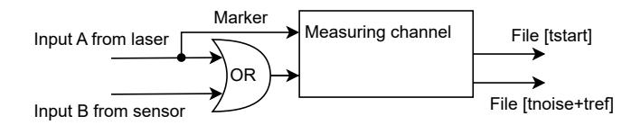
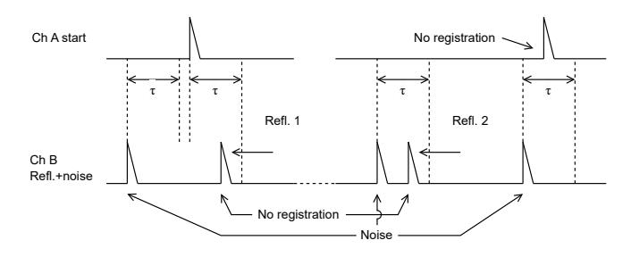
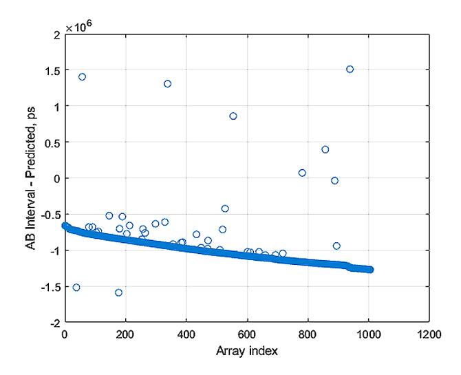
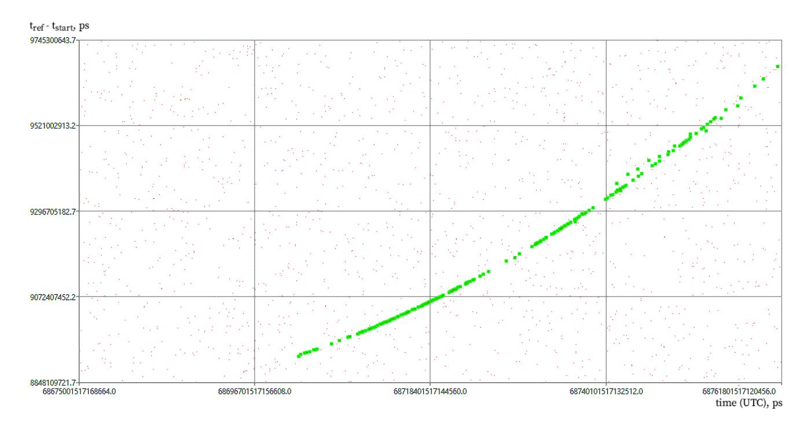
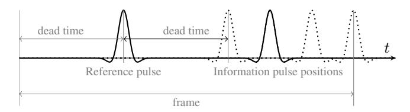

{0}------------------------------------------------

# CONTINUOUS EVENT RECORDING TECHNOLOGY FOR INTEGRATED SENSING AND COMMUNICATIONS IN SPACE

*Arturs Aboltins*

*Vladimir Bespal'ko*

*Viktors Kurtenoks*

Riga Technical University Institute of Photonics, Electronics and Telecommunications, Azenes 12, Riga, Latvia

Eventech LTD Pulka iela 3, Riga, Latvia

Eventech LTD Pulka iela 3, Riga, Latvia

#### ABSTRACT

Satellite laser ranging (SLR) systems require precise time tagging in the order of a few picoseconds to accurately measure the time interval between the emission of a laser pulse and the detection of its response. Traditional SLR systems face challenges such as high noise levels, atmospheric interference, and limitations in time tagger design, resulting in the necessity to use complex gate generators that provide measurement within a very short time window. This study introduces a breakthrough in time tagger technology, enabling continuous event detection. Beyond enhancing SLR capabilities, this innovation opens new prospects for other applications, such as lidar and integrated sensing and communications (ISAC) in space. The research outlines the opportunities presented by continuous event recording, addressing potential limitations and challenges. Additionally, it provides a comprehensive introduction to the concept and presents modeling and practical experiment results conducted at a functioning SLR station.

*Index Terms*— Measurement by laser beam, artificial satellites, satellite communication, space debris.

### 1. INTRODUCTION

Laser ranging of space objects is based on precise measurement of the total propagation time of the laser light pulse (start signal) to the object under study and the signal reflected from the object to the receiving sensor [1]. In the modern ranging experiment, high-frequency starting signals (up to tens of kilohertz) are used, which gives rise to the problem of the intersection of the streams of ranging (starting and reflected) signals. To solve the problem, the technology of timing (continuous time tagging) of events is used. The time tags of the ranging signals act as events and are recorded by a highprecision event time tagger relative to the Coordinated Universal Time (UTC) time scale. The result of the ranging is the propagation time of the ranging signal, defined as the difference between the time tags of the reflected and start signals.

In laser ranging systems, many signals are associated with noises of various origins. The intensity of noise signals varies from a few kilohertz at night to several megahertz during the day, which creates the problem of separating the reflected signals from the noise. This problem is usually solved by time selection hardware, which ensures that only those input events that fall within the resolving time windows are recorded. The time window is generated a ranging gate generator (RGG) in the real-time experiment according to the expected arrival times of the reflected signals. The expected moments of arrival of the reflected signals are calculated using the orbital parameters of the object under study, the coordinates of the satellite laser ranging (SLR) station and the moments of generation of the starting pulses.

The well-known RGGs [2, 3, 4], which are designed to generate hardware time windows, solves the problem of separating the signal from noise and allows for significant reduction of the traffic of the recorded measurement information. However, the need to set time windows with a sufficiently high (nanosecond) accuracy in the real-time of the experiment leads to the increased complexity and cost of these generators.

Hardware time selection does not allow the implementation of space debris search algorithms, conducting a ranging experiment with the spatial separation of the transmitter and receiver, combining the ranging and calibration modes of the station. Moreover, in hardware time selection, there is no noise data, which excludes the possibility of obtaining lidar information about the state of the atmosphere. There is an attempt to combine the functions of SLR and atmospheric lidar [5], but this implementation is associated with installing an additional telescope and electronics.

# 2. CONTINUOUS EVENT RECORDING IN SLR

The technology of continuous recording of events in SLR involves combining the recording of measurement information (time tags) of both ranging time (tstart, tref) and noise tnoise signals (Fig. 1).

The use of the technology provides a significant simplification and reduction in the cost of the ranging experiment due to the transfer of the release of temporary selection to

{1}------------------------------------------------

Fig. 1. Block diagram of a time tagger with one measurement channel in continuous recording (CR) mode.

the software level during the post-processing of the accumulated measurement information. The availability of continuous measurement information expands the capabilities of the ranging experiment, in particular, in the search for space debris [6], the organization of a multi-station experiment with the spatial separation of the transmitter and receiver, the combination of ranging and calibration modes. There is also a potential possibility of parallel ranging and lidar exploration of the atmosphere.

However, continuous recording (CR) mode has certain limitations. First, these limitations, associated with the need to accumulate and process large amounts of measurement information, can be easily mitigated using state-of-the-art computing technologies. More stringent limitations are related to the influence of the dead time τ of time-to-digital converter (TDC) in the time tagger. The impact is incredibly high if there is only one measuring channel in the time tagger, as shown in Fig. 1). In some situations, non-zero dead time of TDC causes loss of ranging signals (Fig. 2).

Fig. 2. Loss of ranging signals due to dead recording time.

The first loss occurs when the dead time during the recording of the start signal in channel A excludes the recording of the signal in the receiving channel B. The second situation occurs due to the dead time while registering the noise signal, which shortly precludes the valid reflected signal. Finally, the third situation occurs when the dead time during recording in channel B does not allow the recording of the start signal in channel A to be realized.

Simulation of the ranging process in CR mode shows that for the case of R · τ < 0.5 (R is the noise center frequency), the probability of signal loss is approximately equal to Ploss = R · τ . In general, the estimate of the level of loss of the valid signal at night (with noise intensity R = 10 ... 15 kHz and dead recording time τ = 40 ... 50 ns) will be less than 1%, which is quite acceptable. Losses increase with high noise levels during the daytime, so the increase in the efficiency of continuous ranging in SLR is associated with the need to reduce the dead time of the measuring channel.

The CR mode allows the use of a mechanism of software time selection of reflected signals to isolate the proper signal from a mixture of signal and noise (Fig. 3). This mechanism does not differ fundamentally from hardware time selection. However, rather than doing it in real-time of the experiment, it is performed offline during the post-processing of the accumulated measurement information.

Fig. 3. Result of software-based selection of reflected signals in a real experiment.

At the same time, it becomes possible to implement various algorithms for searching for space debris, to organize a multi-station experiment in case of spatial separation of the transmitter and receiver, and to combine the modes of ranging and calibration. The availability of noise information makes it possible to analyze the intensity distribution of noise signals and judge the atmosphere's state at different altitudes (lidar function).

The first experiments in the implementation of the CR mode were carried out at the RIGA1884 SLR station in Riga, Latvia, using a streaming event time tagger with low dead time ESTT704, developed by Eventech [7]. In a ranging experiment, operational monitoring of the course of the experiment plays an important role. For this purpose, the most convenient and simple algorithm is to extract the signal from the noise without involving data on the object's orbit under study. The algorithm is implemented at the software level in the operator's real-time (Fig. 4).

{2}------------------------------------------------

Fig. 4. The result of monitoring the ranging process without using data on the object's orbit under study.

# 3. INTEGRATION OF LASER RANGING AND OPTICAL COMMUNICATION

SLR station uses bursts of very short pulses having a duration of a few tens of picoseconds transmitted periodically with frequency up to several tens of kilohertz. Instead of the periodic transmission, the burst could consist of an informationcarrying sequence paving the way to novel integrated sensing and communications (ISAC) concepts [8] in space systems. Using this approach, along with laser ranging and lidar function, the system can transfer information from the ground to the satellite or receiving SLR station, which can be located in distant geographic locations. One of the first experiments of such kind was made in Graz SLR station [9].

The information in the burst can be encoded using pulse position modulation (PPM). Employment of transmitted reference pulse-position modulation (TR-PPM) [10, 11], which contains reference pulses transmitted periodically, maximizes compatibility with SLR function. The structure of TR-PPM signal having 4 positions is shown in Fig. 5. Information is transmitted in fixed-length frames having duration determined by minimum laser repetition rate and dead time of measuring TDC. The information is encoded in the time difference between the reference pulse and the information pulse, i.e., in the time position of the information pulse.

Following the theory, the pulse repetition rate has the largest impact on the achievable bitrate of PPM communication system and must be kept as high as possible. As mentioned previously, the dead time of the TDC in the receiver station has a decisive impact on the pulse repetition rate. It should be minimized to achieve higher data transmission rates. For example, if dead time of TDC τ = 40 ns, the frame duration of 128-position TR-PPM having position width 200 ps is 40+40+0.2\*128=105.6 ns. Considering log2(128) = 7 bit transmission, the achievable bitrate is approximately 66 Mbit/s.

If data transmission is carried out simultaneously with laser ranging or lidar function, some data pulses will be lost due to the nature of the ranging process. Various encoding techniques, such as interleaving, error-correcting code (ECC), symbol spreading [11] can be used to facilitate the information transfer.

Fig. 5. Structure of transmitted reference pulse-position modulation (TR-PPM) signal.

# 4. CONCLUSIONS

The continuous recording mode allows not only to transfer the implementation of the temporary selection of reflected signals to the software but also to combine the ranging mode with the 

{3}------------------------------------------------

simultaneous registration of noise signals. The presence of such information expands the functionality of the laser ranging. In particular, it allows you to implement the function of lidar (for debris tracking etc.) and photon counter at the same time.

Employment of time tagger in continuous recording mode allows sending data between SLR stations or between the ground station and satellite using PPM. Using advanced pulse encoding methods, such as TR-PPM, communication, ranging and sensing (lidar) can be performed simultaneously.

In continuous recording mode, some ranging signals are likely to be lost due to the effect of dead time of TDC employed in the receiver, especially when there is a single measurement channel. This effect can be neglected When the ranging is performed at night, and the noise level is low. However, during the daytime, when the noise level is high, it is necessary to reduce the dead recording time of the continuous-mode time tagger.

To improve the performance of the proposed ISAC concept for space, our team is developing novel multi-channel and versatile TDCs, which will allow significantly expanded capabilities of continuous laser ranging and simultaneous data transmission up to 1 Gbit/s.

### 5. REFERENCES

- [1] J. F. McGarry, E. D. Hoffman, J. J. Degnan, J. W. Cheek, C. B. Clarke, I. F. Diegel, H. L. Donovan, J. E. Horvath, M. Marzouk, A. R. Nelson, D. S. Patterson, R. L. Ricklefs, M. D. Shappirio, S. L. Wetzel, and T. W. Zagwodzki, "NASA's satellite laser ranging systems for the twenty-first century," *Journal of Geodesy*, vol. 93, no. 11, pp. 2249–2262, 2019.
- [2] Digos, "Range Gate Generator RG2." [Online]. Available: https://digos.eu/range-gate-generator-for-laserranging-systems/
- [3] S.-C. Bang, N.-H. Ka, and H.-C. Lim, "Ranage Gate Generator Development for 10kHz Laser Ranging," pp. 1–4. [Online]. Available: https://cddis.nasa.gov/lw18/docs/papers/Posters/13 po31-Seungcheol.pdf
- [4] F. Iqbal, "Investigations and Design Solutions of a High Repetition Rate Satellite Laser Ranging (SLR) System," pp. 1–86, 2011. [Online]. Available: https://diglib.tugraz.at/download.php?id=576a7e08bbff0
- [5] G. Kirchner, F. Koidl, D. Kucharski, W. Pachler, M. Seiss, and E. Leitgeb, "Graz kHz SLR LIDAR: first results," in *Photon Counting Applications, Quantum Optics, and Quantum Information Transfer and Processing II*, M. Dusek, I. Prochazka, and R. Sobolewski, Eds., vol. 7355, International Society for Optics and Photonics. SPIE, 2009, p. 73550U.

- [6] J. Silha, J. N. Pittet, M. Hamara, and T. Schildknecht, ˇ "Apparent rotation properties of space debris extracted from photometric measurements," *Advances in Space Research*, vol. 61, no. 3, pp. 844–861, 2018.
- [7] Eventech, *Key Products*. [Online]. Available: https://eventechsite.com/products/
- [8] A. Liu, Z. Huang, M. Li, Y. Wan, W. Li, T. X. Han, C. Liu, R. Du, D. K. P. Tan, J. Lu, Y. Shen, F. Colone, and K. Chetty, "A Survey on Fundamental Limits of Integrated Sensing and Communication," *IEEE Communications Surveys & Tutorials*, vol. 24, no. 2, pp. 994– 1034, 2022.
- [9] G. Kirchner, F. Koidl, D. Kucharski, W. Steinegger, and E. Leitgeb, "Using Pulse Position Modulation in SLR stations to transmit data to satellites," *Proceedings of the 11th International Conference on Telecommunications, ConTEL 2011*, pp. 447–450, 2011.
- [10] S. Spolitis, D. Prigunovs, S. Migla, D. Ortiz, O. Selis, P. E. Sics, A. Ostrovskis, T. Solovjova, J. Semenjako, and A. Aboltins, "Demonstration of 512-TR-PPM Fiber Optical Transmission Link," in *2023 Photonics and Electromagnetics Research Symposium, PIERS 2023 - Proceedings*. IEEE, jul 2023, pp. 1416–1422.
- [11] R. Munirathinam, A. Aboltins, D. Pikulins, and J. Grizans, "Chaotic Non-Coherent Pulse Position Modulation Based Ultra- Wideband Communication System," in *2021 IEEE Microwave Theory and Techniques in Wireless Communications (MTTW)*. IEEE, 2021, pp. 52–57.