{0}------------------------------------------------

# MPFusionNet: Transformer-Based Multi-Modal Perception Fusion for Predictive Beamforming in Low-Altitude UAV Communication Networks

Yanxi Xie, Yi Gong∗ , *Member, IEEE*, Yuyang Zhao, Meiping Zhou, Song Wang, *Member, IEEE*, Di Zhang, Yi Wang, and Jiaqin Wang, *Member, IEEE*

*Abstract*—With the rapid growth of the low-altitude economy, emerging applications such as urban air mobility and smart logistics demand reliable and low-latency beamforming for unmanned aerial vehicle-to-vehicle (UAV-to-UAV, U2U) communications in millimeter-wave (mmWave) bands under highly dynamic and non-line-of-sight (NLOS) conditions. Traditional beam alignment methods relying on exhaustive search or channel feedback incur heavy training overhead and degraded accuracy in rapidly varying environments. To address these challenges, we propose multi-modal perception-assisted fusion network (MPFusionNet), a multi-modal perception-enhanced Transformer framework for predictive beamforming. Our approach leverages heterogeneous onboard sensing data including global positioning system (GPS), red-green-blue (RGB) cameras, LiDAR, and radar altimeters, incorporates a dynamic time warping (DTW)-based alignment mechanism, and embeds geometry-aware priors within a perceiver input-output (PerceiverIO)-based fusion architecture to achieve robust spatiotemporal representation. Experiments on a simulated U2U dataset show that MPFusionNet attains a top-3 beam prediction accuracy of 97.59%, substantially surpassing conventional models. These results demonstrate the effectiveness of multi-modal learning in improving robustness and generalization of predictive beamforming for future autonomous aerial communication systems.

*Index Terms*—millimeter-wave (mmWave) beamforming, unmanned aerial vehicle-to-vehicle (UAV-to-UAV, U2U) communication, multi-modal fusion, transformer networks.

# I. INTRODUCTION

T HE rapid expansion of the low-altitude economy, driven by innovations in drone logistics, aerial inspection, and smart city services, is creating stringent new requirements

Yanxi Xie is with the School of Information and Communication Engineering, Bejing University of Posts and Telecommunications, Beijing 100876, China, (e-mail: 13671300662@163.com).

Yi Gong, Yuyang Zhao, and Jiaqin Wang are with School of Information and Communication Engineering, Beijing Information Science and Technology University, Beijing 100192, China, (e-mail: {gongyi, yuyang.zhao}@bistu.edu.cn, wangjiaqin@buaa.edu.cn). *(Corresponding author: Yi Gong.)*

Meiping Zhou is with the Aviation Industry Development Research Center of China, Beijing 100029, China, (e-mail: zhoump001@avic.com).

Song Wang is with the School of Modern Post (School of Automation), Beijing University of Posts and Telecommunications, Beijing 100876, China, (e-mail: wongsang@bupt.edu.cn).

Yi Wang is with the School of Electronics and Information, and also with the Henan Province Collaborative Innovation Center of Aeronautics and Astronautics Electronic Information Technology, Zhengzhou University of Aeronautics, Zhengzhou 450046, China, (email: yiwang@zua.edu.cn).

Di Zhang is with the School of Information and Communication Engineering, Beijing University of Posts and Telecommunications, Beijing 100876, China, (e-mail: amandazhang@bupt.edu.cn).

for aerial communication infrastructure [1]. In this context, unmanned aerial vehicle-to-vehicle (UAV-to-UAV, U2U) communication is emerging as a key enabler of cooperative sensing and autonomous coordination within low-altitude integrated networks [2] [3]. Recent studies have also emphasized systemlevel perspectives on low-altitude wireless networks, including networked ISAC-based UAV tracking and handover [4] and object-oriented ISAC channel modeling for three-dimensional low-altitude spaces [5]. These applications demand robust, high-data-rate, and low-latency links, especially in dynamic and uncertain airspace environments [6]. Millimeter-wave (mmWave) communications, leveraging abundant spectrum resources in high-frequency bands, offer the potential to deliver multi-gigabit-per-second data rates essential for these airborne applications [7] [8]. However, mmWave signals inherently suffer from severe path loss and highly directional propagation, necessitating the use of large-scale antenna arrays for narrow beam generation and sufficient link gain [9]. The beam alignment process, which depends heavily on the threedimensional (3D) geometric relationship between transmitting and receiving UAVs as well as dynamic flight topologies, introduces substantial training and search overhead [10] [11]. The challenge is further exacerbated in U2U scenarios due to complex 3D mobility, rapid changes in relative position, and time-varying orientation (pitch, roll, yaw) [12]. Additionally, non-line-of-sight (NLOS) propagation arising from terrain occlusion, atmospheric interference, or other airborne obstacles leads to severe signal degradation and multipath effects, posing a serious threat to communication robustness [13] [14]. As a result, achieving efficient and reliable mmWave beam management in highly dynamic aerial environments remains a significant challenge for U2U communication systems in lowaltitude integrated networks [15].

To tackle these challenges, researchers have proposed solutions across both the physical and perception layers. At the physical layer, advanced channel coding techniques such as LDPC-Hadamard-assisted OTFS had demonstrated enhanced robustness under high Doppler and mobility conditions [16]. Recent advances in AI-native communications further demonstrate the feasibility of integrating generative models into physical layer design. DiffCom, proposed by Wang et al., leverages diffusion posterior sampling conditioned on channel received signals to enhance the robustness of communication links [17]. Such approaches resonate with our motivation of employing advanced deep architectures to achieve reliable

{1}------------------------------------------------

beam prediction in dynamic UAV scenarios. At the perception layer, growing attention had been paid to multi-modal sensingaided beam prediction, which leveraged the rich spatialtemporal information from heterogeneous UAV-borne sensors [18] [19]. Meanwhile, the latest studies have investigated integrated sensing and communication (ISAC) techniques for enhancing low-altitude UAV networks. For example, Zhao et al. proposed a networked ISAC-based UAV tracking and handover framework toward the low-altitude economy [20], while Liu et al. developed an object-oriented ISAC channel modeling approach for three-dimensional low-altitude spaces [21]. Moreover, Chong et al. introduced a physical sensingaided routing framework using deep Q-network and long shortterm memory for low-altitude UAV networks [22], showing that perception-driven intelligence can significantly improve both forwarding stability and delay performance.

Studies and datasets such as DeepSense [23], and ViWi [24] highlighted the promise of integrating red-green-blue (RGB) cameras, LiDAR, radar, and global positioning system (GPS) modules to enhance mmWave communication in mobile scenarios. The "Synesthesia of Machines" initiative [25] further advanced this vision by promoting joint design of sensing and communication modules in intelligent autonomous platforms, including aerial vehicles [26]. Beyond algorithmic advances, hardware-efficient ISAC design is also attracting attention [27]. Gong et al. [28] discussed green RF chain design strategies to reduce power consumption in ISAC systems, which can be beneficial when implementing perception-assisted beamforming on energy-constrained UAV platforms.

In the trend of 6G integrated sensing and communications, the combination of edge intelligence and multi-modal perception has attracted growing attention. Cui et al. proposed a Transformer-based sensing-assisted beamforming approach for high-reliability communication [29], and further introduced the concept of edge perception to support intelligent wireless sensing at the network edge [30]. In addition, Cui et al. explored digital-twin-based ISAC mechanisms from a physical layer perspective [31], which provides valuable insights for the multi-modal beam prediction framework considered in this work. Moreover, recent works have also explored 6G-oriented system-level solutions. For example, CyTFS introduces a Cyber-Twin Fog System leveraging deep reinforcement learning for delay-efficient task offloading [32], providing insights into delay-aware resource allocation that complements our UAV communication scenario.

By integrating environmental geometry and relative positioning information from onboard aerial sensors—such as RGB cameras, LiDAR, radar altimeters, and GPS modules—the accuracy and responsiveness of mmWave beam selection in U2U communications have been significantly improved. Notably, Recent research by Tariq et al. [33] demonstrated the effectiveness of multi-modal fusion for narrow-beam alignment in dynamic mobility scenarios, where vision, radar, and GPS data were jointly leveraged within a quantum-enhanced Transformer network to improve beam prediction accuracy. Beyond beamforming, geographical and spatial information had also been successfully employed to enhance cooperative localization in aerial swarms through multi-source data integration [34]. This paradigm of sensor fusion leverages complementary spatial-temporal cues from heterogeneous aerial sensors to improve beam alignment robustness against rapid flight maneuvers and environmental uncertainty. Subsequent studies had explored learning from individual modalities in isolation. For example, [35]–[41] showed how GPS, vision, LiDAR, or radar can each contribute to mmWave beam prediction in mobile platforms. In parallel with our geometry-aware modeling approach, similar nonlinear multiple-input multiple-output (MIMO) feature learning strategies have been investigated in other dynamic communication domains, such as industrial internet of things (IoT) systems [42]. These efforts share a common goal of leveraging spatial priors to enhance robustness under timevarying and multipath channel conditions. This convergence highlights a broader trend in cyber–physical communication systems: the integration of structural domain knowledge with learning-based architectures to improve link reliability and generalization in complex environments.

With the increasing diversity of onboard aerial sensing modalities, multi-modal fusion has also become a research hotspot in UAV communication systems [43]. Jiang et al. proposed a LiDAR-assisted beam prediction framework in mmWave vehicle-to-infrastructure (V2I) scenarios. By exploiting geometric structure from point clouds, their method significantly reduced the measurement overhead of traditional beam training. Evaluations on the DeepSense 6G dataset demonstrated that their model achieved up to 95% top-1 accuracy even under NLOS conditions [44]. To enrich spatial understanding, Charan et al. introduced a vision-position multi-modal fusion model, integrating RGB images and GPS coordinates from both UAV and base station (BS). Their deep learning-based predictor achieved 86.3% top-1 and nearly 100% top-3 accuracy in real-world UAV-to-BS communication experiments, significantly reducing beam alignment latency [45]. Salehi et al. designed a deep learning architecture that combines LiDAR, camera, and GPS modalities for edge inference in vehicular networks. Deployed at the wireless edge, their system improved candidate beam selection by more than 20% in top-10 recommendation tasks, while maintaining high inference efficiency [46]. Collectively, these studies highlight the potential of multi-modal perception in enhancing predictive beamforming and lay a solid foundation for the development of intelligent UAV communication networks [47].

Despite these advancements, several core challenges remain unresolved. Most existing research focuses on isolated or pairwise modality modeling, lacking systematic methods for deep collaboration across heterogeneous sensors and physical priors [48]. Furthermore, many methods underutilize temporal dynamics, often ignoring cross-time and cross-modal temporal correlations [49]. In addition, dominant fusion architectures still rely on generic transformer designs that fail to consider the beam-domain characteristics of communication tasks [50] [51], leading to inefficient modeling of directional information, dimensional redundancy, and limited generalization in realworld aerial scenarios. To address the above limitations, this paper proposes a novel multi-modal perception-aided beam prediction framework tailored for U2U communication. The

{2}------------------------------------------------

key contributions are summarized as follows:

- 1) Based on the time-varying multi-path channel model introduced in Section II, we design a geometry-aware, sparse, multi-modal fusion framework for UAV communication. Physical priors such as the angle of arrival θl are embedded into the fusion process to enhance multipath structure modeling. Additionally, a path reachability subnetwork is constructed by integrating LiDAR-based NLOS reflection analysis and radar Doppler spectrum features, improving perception of beam-relevant paths under dynamic 3D occlusions. This design fills the gap in incorporating physical channel characteristics into aerial fusion models.
- 2) To mitigate phase distortion and feature misalignment arising from asynchronous sampling of aerial sensors, we propose a dynamic time warping (DTW)-based temporal alignment strategy. By integrating DTW with cubic spline interpolation, we construct a unified temporal cost matrix to align multi-rate sensing sequences, thus addressing motion blur and temporal inconsistency in high-speed UAV maneuvers. This dual-stage temporal alignment framework ensures coherent spatiotemporal features across modalities, directly addressing the critical issue of temporal misalignment in UAV systems.
- 3) To overcome redundancy and poor interaction efficiency of conventional Transformer-based fusion models, we develop multi-modal perception-assisted fusion network (MPFusionNet), a novel network that combines multiscale perceiver input-output (PerceiverIO) fusion with spatiotemporal Transformer encoding and a beamdomain projection module. By projecting fused features into the mmWave beam space and applying grouped sparse attention, the model reduces dimensional overhead while enhancing critical feature interactions. Evaluated on a simulated U2U dataset, MPFusionNet achieves a top-3 prediction accuracy of 97.59% over 64 candidate beams, outperforming the baseline by 13.7 percentage points. These results demonstrate the framework's ability to fully leverage spatial-temporal cues across modalities while adapting to beam-domain characteristics.

The remainder of this paper is organized as follows: Section II describes the U2U system model and associated mmWave channel formulation. Section III details the proposed MP-FusionNet architecture, including temporal alignment, fusion design, and beam classification. Section IV presents experimental settings and ablation studies based on a U2U simulation dataset. Section V concludes the paper.

# II. SYSTEM MODEL

This section employs the U2U communication system model depicted in Fig. 1. The receiving UAV is equipped with a 16-element uniform linear array (ULA) (mmWave array), a forward-facing RGB camera, a 3D LiDAR sensor, a mmWave radar altimeter, and a GPS module for real-time positioning and orientation estimation. The transmitting UAV is equipped with an omnidirectional mmWave antenna for signal transmission and a GPS module for location tracking. Specifically, the omnidirectional antenna is modeled as an ideal isotropic radiator, whose radiation pattern is assumed to be constant in the azimuth plane and follows a sin(ϕ) dependence in the elevation direction. The antenna gain pattern is expressed as

$$G(\theta, \phi) = \begin{cases} 1, & \theta \in [0, 2\pi), \\ \sin(\phi), & \phi \in [0, \pi], \end{cases}$$
 (1)

where G(θ, ϕ) denotes the antenna gain as a function of direction, θ is the azimuth angle in the horizontal plane measured counterclockwise from the x-axis, and ϕ is the elevation angle measured from the positive z-axis downward. In this formulation, the constant value 1 indicates uniform radiation across all azimuth directions, while the sin(ϕ) term characterizes the vertical dependence of the radiation pattern, implying zero gain along the zenith axis and maximum gain in the horizontal plane. This approximation is widely adopted in UAV mmWave communication studies as it provides horizontal omnidirectional coverage with elevation-dependent attenuation.

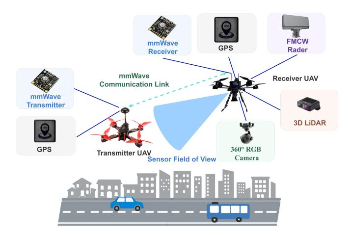

Fig. 1. System architecture of U2U mmWave communication empowered by multimodal perception.

In the U2U mmWave communication scenario, channel propagation exhibits strong dynamics and high spatial selectivity, often accompanied by NLOS blockages, Doppler spread caused by high-speed aerial movement, and significant multipath effects due to reflections from terrain, structures, or other airborne objects. To accurately capture these characteristics, we employ a geometry-based sparse multipath channel model to characterize the channel vector between the transmitting and receiving UAVs.

Assume that the receiver is equipped with an N-element ULA. In U2U mmWave communication, the wireless channel is affected by high mobility, 3D positional variation, and altitude changes, leading to strong non-stationarity and spatial selectivity. The channel vector at time t can be modeled as the superposition of multiple multipath components, each with independent gain, propagation delay, azimuth and elevation angles of arrival. The channel expression is given by

$$\mathbf{g}(t) = \sum_{l=1}^{L} \alpha_l(t) \mathbf{a}_r(\theta_l(t), \phi_l(t)) e^{-j2\pi f_c \tau_l(t)}, \qquad (2)$$

{3}------------------------------------------------

4

where L denotes the number of effective multipath components,  $\alpha_l(t)$  is the complex gain of the l-th path at time t,  $\tau_l(t)$  is the corresponding path delay, and  $(\theta_l(t),\phi_l(t))$  denote the azimuth and elevation angles of arrival. The term  $f_c$  represents the carrier frequency, j denotes the imaginary unit, and  $\mathbf{a}_r(\theta,\phi)$  is the steering vector of the UAV's receiving array corresponding to the angle pair  $(\theta,\phi)$ . The exponential term captures the phase shift induced by the path delay  $\tau_l(t)$ .

Given the six-degree-of-freedom (6-DoF) motion in UAV operations, both the path gains  $\alpha_l(t)$  and the angular parameters  $(\theta_l(t),\phi_l(t))$  typically vary with time. Under line-of-sight (LOS) conditions,  $\alpha_l(t)$  can be modeled as a Rician distribution, while in NLOS or reflection-dominant environments, a Rayleigh distribution is more appropriate. In addition, attitude variations due to yaw, pitch, and roll further affect these parameters. The time-varying channel characteristics are closely tied to the relative velocity vector  $\mathbf{v}_{\rm rel}$  and the angular rate vector  $\boldsymbol{\omega}_{\rm rel}$  between the transmitting and receiving UAVs.

Considering the directional nature of mmWave signals and 3D UAV mobility, precise modeling of the receiver array response is critical. The adopted expression for the 3D ULA response vector is

$$\mathbf{a}_{r}(\theta,\phi) = \frac{1}{\sqrt{N}} [1, e^{j\frac{2\pi d}{\lambda}\sin\phi\cos\theta}, \dots, e^{j\frac{2\pi d}{\lambda}(N-1)\sin\phi\cos\theta}]^{\top},$$
(3)

where d is the inter-element spacing of the array,  $\lambda$  is the wavelength corresponding to the carrier frequency, and N is the number of array elements. The angular terms  $\theta$  and  $\phi$  represent the azimuth and elevation angles of the incoming signal.

At time t, the received signal y(t) after beamforming is expressed as

$$y(t) = \mathbf{a}_k^H(t) \cdot \mathbf{g}(t) \cdot x(t) + z(t), \tag{4}$$

where  $\mathbf{g}(t) \in \mathbb{C}^{N \times 1}$  denotes the channel vector,  $\mathbf{a}_k(t) \in \mathbb{C}^{N \times 1}$  is the k-th beamforming vector selected from the receiver codebook, x(t) is the transmitted symbol, and  $z(t) \sim \mathcal{CN}(0,\sigma_z^2)$  represents complex Gaussian noise with zero mean and variance  $\sigma_z^2$ . The notation  $(\cdot)^H$  indicates the Hermitian transpose operation.

The receiver employs a beam codebook  $\mathcal{A} = \{\mathbf{a}_1, \dots, \mathbf{a}_{64}\}$  containing K = 64 candidate beamforming vectors. The corresponding achievable data rate is given by

$$R = \log_2 \left( 1 + \frac{P}{\sigma_z^2} |\mathbf{a}_k^H(t)\mathbf{g}(t)|^2 \right), \tag{5}$$

where P is the transmit power and  $\sigma_z^2$  is the noise power. The beam prediction task is formulated as a K=64-way classification problem. During simulation, the ground-truth beam label for each sample is obtained by exhaustively evaluating the receiver codebook and selecting the index that maximizes the instantaneous received power, defined as

$$k^* = \arg\max_{1 \le k \le 64} \frac{P}{\sigma_z^2} |\mathbf{a}_k^H(t)\mathbf{g}(t)|^2, \tag{6}$$

since P and  $\sigma_z^2$  are constant across beams, this criterion is equivalent to maximizing  $|\mathbf{a}_k^H(t)\mathbf{g}(t)|^2$  over the codebook.

However, directly computing  $k^*$  requires complete channel state information, which is impractical in fast-changing UAV environments. Moreover, exhaustive search over all 64 beam directions introduces significant latency and overhead. Therefore, we propose to infer  $k^*$  from perception data via a deep learning-based method to enable efficient and low-latency beam prediction.

To alleviate this burden, we propose to leverage the multimodal sensor data onboard the receiving UAV to assist beam prediction. The UAV can obtain synchronized sensor data: RGB images  $D^{\rm RGB}(t)$ , LiDAR point clouds  $D^{\rm LiDAR}(t)$ , radar returns  $D^{\rm Radar}(t)$ , and GPS information  $D^{\rm GPS}(t)$ . These modalities contain rich environmental geometry and relative positioning cues that can guide mmWave beam selection.

Specifically, a deep learning framework is used for multimodal semantic fusion [52]. Semantic segmentation is applied to RGB images to extract structural features, while LiDAR and radar provide geometric cues. GPS delivers absolute and relative position/orientation priors. All features are fused via a neural network to predict the optimal beam index.

Let  $D^{\rm I}(t),\ D^{\rm L}(t),\ D^{\rm R}(t),$  and  $D^{\rm P}(t)$  denote the RGB, LiDAR, radar, and GPS data at time t. Let  $\mathcal{G}_{\theta}(\cdot)$  be the feature extraction network and  $\mathcal{F}_{\omega}(\cdot)$  be the beam classifier. The prediction process is

$$\hat{k}(t) = \mathcal{F}_{\omega} \Big( \mathcal{G}_{\theta} \Big( D^{\mathbf{I}}(t), D^{\mathbf{L}}(t), D^{\mathbf{R}}(t), D^{\mathbf{P}}(t) \Big) \Big), \tag{7}$$

with  $\hat{k}(t) \in \{1, \dots, 64\}$  and ideally  $\hat{k}(t) \approx k^*$ . That is

$$\hat{k}(t) = \arg\max_{1 \le k \le 64} \Pr(\hat{k}(t) = k^*).$$
 (8)

Although equations (2)–(6) are evaluated per time step t, the beam prediction operates independently at each t, ensuring temporal modularity. The networks  $\mathcal{G}_{\theta}(\cdot)$  and  $\mathcal{F}_{\omega}(\cdot)$  together enable robust beam prediction for aerial mmWave links by integrating cross-modal information from onboard UAV sensors.

# III. MULTI-MODAL BEAMFORMING WITH PERCEIVERIO-TRANSFORMER

To address the challenges of temporal misalignment, insufficient spatial guidance, and ineffective cross-modal interactions in existing beam prediction methods, we propose a unified deep learning framework tailored for U2U mmWave communication. The proposed architecture takes GPS data, RGB images, LiDAR point clouds, and mmWave radar returns as inputs, and enhances beam prediction via three key mechanisms: temporal alignment, geometric prior integration, and cross-modal fusion.

Specifically, Section A presents a dynamic alignment strategy that combines DTW with cubic spline interpolation, enabling synchronous modeling of heterogeneous aerial sensor data streams. Section B details the design of the MPFusion-Net architecture, which integrates spatiotemporal features via PerceiverIO-based fusion and performs beam classification through a lightweight multilayer perceptron (MLP). This unified framework jointly models 3D spatial structure, temporal dynamics, and inter-modal relationships, providing a robust solution for perception-assisted beamforming in dynamic

{4}------------------------------------------------

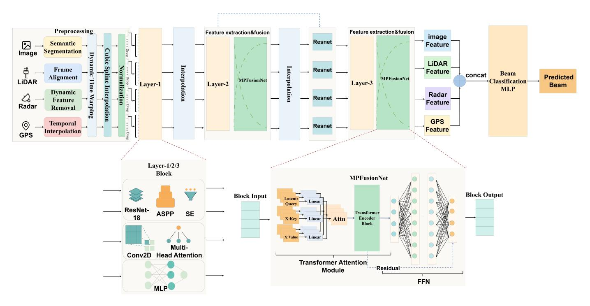

Fig. 2. Overall architecture of the proposed multimodal fusion network (MPFusionNet), including preprocessing, modality-specific encoders, dual-stage MPFusion modules, and final beam classification.

UAV environments. The complete architecture is illustrated in Fig. 2.

## A. Temporal Modeling and Synchronous Processing of UAV Multi-modal Sensory Data

This study proposes a geometric prior-enhanced multimodal temporal modeling approach that transforms onboard GPS positioning data into geometric priors for guiding beam prediction. Specifically, we calculate the relative position and azimuth angle between the host UAV and the target UAV through coordinate transformation. Let the global coordinates of the host and target UAVs be  $(x_{\text{main}}, y_{\text{main}})$  and  $(x_{\text{sub}}, y_{\text{sub}})$ , respectively. The relative coordinates are derived as  $(x_{\text{rel}}, y_{\text{rel}}) = (x_{\text{sub}} - x_{\text{main}}, y_{\text{sub}} - y_{\text{main}})$ . Subsequently, the inter-UAV distance d and bearing angle  $\varphi$  are computed as follows

$$d = \sqrt{x_{\rm rel}^2 + y_{\rm rel}^2},\tag{9}$$

$$\varphi = \arctan \frac{y_{\rm rel}}{x_{\rm rel}},\tag{10}$$

where  $\varphi$  is normalized to the range  $\left[-\pi,\pi\right]$  using quadrant-aware correction. The parameters  $\varphi$  and d serve as spatial geometric prior information, which are embedded into low-dimensional feature vectors for neural network utilization, thereby injecting positional priors into the perception network. This geometric prior provides coarse indications of the target UAV's approximate direction and distance, offering an initial estimate for subsequent beam selection while accelerating network convergence.

To address asynchronous multi-modal data sampling, this study proposes a synchronization framework combining DTW and cubic spline interpolation. Formally, let the time series of two modalities be represented as  $\{X_t\}_{t=1}^T$  and  $\{Y_k\}_{k=1}^K$ , where T and K denote the number of time steps for each modality respectively, and  $X_t$ ,  $Y_k$  represent the feature vectors at time step t and k. The DTW algorithm identifies an optimal warping path  $\delta$  that minimizes the cumulative alignment cost, which is defined as follows

$$\min_{\delta} \sum_{(t,k)\in\delta} \|X_t - Y_k\|^2, \tag{11}$$

where  $\delta$  denotes a monotonic mapping path that aligns sequences of different lengths. The constraints on the path  $\delta$  are

$$\delta(1) = (1,1), \quad \delta(N) = (T,K),$$
 (12)

$$\delta(n+1) - \delta(n) \in \{(1,0), (0,1), (1,1)\},\tag{13}$$

here, N is the total number of alignment steps in the path  $\delta$ , and each incremental step in the path can move along time in either sequence individually or both simultaneously, ensuring temporal continuity.

After establishing temporal correspondences through DTW, we apply cubic spline interpolation to resample all modalities onto a unified timeline. The interpolation function is given as

$$\hat{Y}_t = \sum_{i=0}^{3} a_i (t - t_k)^i, \tag{14}$$

where  $\hat{Y}_t$  denotes the interpolated signal value at time t,  $a_i$  are the interpolation coefficients, and  $t_k$  is the known timestamp preceding t. The interpolation is valid within the time interval

{5}------------------------------------------------

 $[t_k, t_{k+1})$ . The coefficients  $a_i$  are calculated such that the interpolated curve achieves  $C^2$  continuity—i.e., the function and its first and second derivatives are continuous across intervals. This dual-stage synchronization strategy effectively mitigates temporal misalignment while preserving signal fidelity. Subsequently, we apply this interpolation framework to non-uniformly sampled sensory data. For instance, the onboard camera of the host UAV captures images at approximately 10 Hz, while the mmWave radar operates at around 50 Hz. Using the DTW alignment, we identify matched frame pairs across these two modalities and resample the lower-frequency visual data using spline interpolation or temporal duplication, thus ensuring one-to-one frame alignment with radar inputs. This approach guarantees that multi-modal data at each timestep reflects the same environmental state, thereby maintaining temporal coherence in the feature fusion process.

To further enhance prediction robustness and reduce feature redundancy, we introduce a multi-scale feature fusion strategy. For each modality-aligned temporal sequence, multiple resolution-specific features  $\mathbf{F}^{(s)}$  are extracted in parallel, where s denotes the temporal scale. These features are subsequently fused through a learnable weighted summation as follows

$$\mathbf{F}_{\text{fuse}} = \sum_{s} \alpha_s \mathbf{F}^{(s)},\tag{15}$$

where  $\alpha_s$  represents the learned fusion weight for scale s, and  $\mathbf{F}_{\mathrm{fuse}}$  denotes the final fused temporal feature. This strategy ensures the preservation of both fine and coarse-grained temporal dynamics in the fused representation.

#### B. Perceptual Feature Fusion and Beam Decision Network Architecture Design

To holistically utilize the multi-modal sensing data (visual, mmWave radar, LiDAR, and GPS) collected in U2U communication scenarios, we present a MPFusion-based multi-modal fusion framework. Transformer-based architectures have demonstrated strong capabilities for cross-modal modeling, including perception-guided beam prediction and multimodal sensor fusion [29]. This section elaborates on the architectural design, feature extraction networks, fusion mechanisms, and beam prediction modules, along with their technical specifications and implementation rationale.

- 1) Multi-Modal Feature Extraction Network: To effectively extract discriminative features from heterogeneous sensor data, we first design dedicated encoder networks for visual imagery, LiDAR, mmWave radar, and GPS signals. Each encoder architecture is meticulously crafted to maximize modality-specific information extraction while enhancing task-oriented feature representation capabilities. The detailed implementations are as follows.
- a) Visual image encoder design: The image encoder leverages an enhanced convolutional neural network (CNN) architecture to extract representative features from the captured camera images [53]. Initially, a pre-trained 18-layer residual network (ResNet-18) model is employed as the backbone network to obtain preliminary visual representations. On top

of the feature maps generated by ResNet-18, an atrous spatial pyramid pooling (ASPP) module is integrated to enhance multi-scale feature extraction.

The ASPP module employs multiple parallel atrous (dilated) convolutions with different dilation rates to capture contextual information at various spatial scales. Formally, the output of the ASPP module for a given input feature map  $\mathbf{F} \in \mathbb{R}^{C \times H \times W}$  is computed as

$$\mathbf{F}_{\mathrm{ASPP}} = \mathrm{Concat} \left\{ \begin{array}{c} \mathrm{Conv}_{1\times1}(\mathbf{F}), \\ \mathrm{Conv}_{3\times3}^{r=6}(\mathbf{F}), \\ \mathrm{Conv}_{3\times3}^{r=12}(\mathbf{F}), \\ \mathrm{Conv}_{3\times3}^{r=18}(\mathbf{F}), \\ \mathrm{Upsample}(\mathrm{GlobalAvgPool}(\mathbf{F})) \end{array} \right\}, \ (16)$$

where  $\mathrm{Conv}_{1\times 1}(\cdot)$  denotes a  $1\times 1$  convolution operation,  $\mathrm{Conv}_{3\times 3}^r(\cdot)$  represents a  $3\times 3$  convolution with dilation rate r,  $\mathrm{GlobalAvgPool}(\cdot)$  performs global average pooling over spatial dimensions (H,W),  $\mathrm{Upsample}(\cdot)$  upsamples the pooled feature to match the original spatial size, and  $\mathrm{Concat}\{\cdot\}$  denotes channel-wise concatenation of the parallel branches.

The combined feature map  $\mathbf{F}_{\mathrm{ASPP}}$  is further passed through a  $1\times1$  convolution and batch normalization to yield a contextually enriched feature representation. This design enhances the encoder's capability to perceive objects with varying spatial extents and geometric complexities.

To further refine the channel-wise information, a squeezeand-excitation (SE) attention module is applied to adaptively recalibrate feature responses. The SE module first performs global average pooling across the spatial dimensions to generate a channel descriptor

$$\mathbf{z}_{c} = \frac{1}{H \times W} \sum_{i=1}^{H} \sum_{j=1}^{W} \mathbf{F}_{c,i,j}, \tag{17}$$

where  $\mathbf{F}_{c,i,j}$  is the value at channel c and spatial position (i,j) in  $\mathbf{F}_{\mathrm{ASPP}}$ , and  $\mathbf{z}_c$  denotes the aggregated statistic for channel c

Next, the descriptor vector  $\mathbf{z} \in \mathbb{R}^C$  is passed through two fully connected layers with a ReLU non-linearity and a sigmoid activation to produce the channel attention weights

$$\mathbf{s} = \kappa(\mathbf{W}_2 \cdot \text{ReLU}(\mathbf{W}_1 \cdot \mathbf{z})),\tag{18}$$

where  $\mathbf{W}_1 \in \mathbb{R}^{C/r \times C}$  and  $\mathbf{W}_2 \in \mathbb{R}^{C \times C/r}$  are the weights of the two fully connected layers (with reduction ratio r), and  $\kappa(\cdot)$  is the element-wise sigmoid function.

Finally, the recalibrated feature map  $\mathbf{F}_{\mathrm{SE}}$  is obtained by reweighting the original ASPP output using the learned attention weights

$$\mathbf{F}_{\mathrm{SE}} = \mathbf{F}_{\mathrm{ASPP}} \odot \mathbf{s},\tag{19}$$

where  $\odot$  denotes channel-wise multiplication (i.e., each channel of  $F_{\rm ASPP}$  is multiplied by the corresponding scalar in s). This mechanism allows the network to emphasize informative channels and suppress less relevant ones, enhancing the discriminative power of the encoder.

{6}------------------------------------------------

7

As a result, the final output of the image encoder is a high-dimensional feature map denoted by  $\mathbf{F}_{\mathrm{img}} \in \mathbb{R}^{C \times H \times W}$ , where C, H, and W represent the number of channels, height, and width of the feature map, respectively.

#### b) LiDAR encoder design:

The LiDAR point cloud is first projected into a bird's-eye view (BEV) representation, which is then fed into a CNN for feature encoding. In UAV scenarios, the BEV projection considers aerial perspectives, and filtering algorithms are applied to suppress static background noise such as terrain and building rooftops, focusing on navigable airspace regions and other dynamic airborne objects.

The preprocessed BEV images are passed through a CNN backbone, similar to the image encoder, augmented with an ASPP module to extract multi-scale spatial features. A SE attention module is subsequently applied to recalibrate channel-wise feature responses, emphasizing the reflections of dynamic targets. Notably, both the ASPP and SE modules employed here share the same structure and processing mechanisms as those used in the visual encoder, ensuring consistency in multi-scale representation and channel recalibration across modalities.

As a result, the LiDAR encoder produces a high-dimensional feature map denoted by  $\mathbf{F}_{\text{lidar}} \in \mathbb{R}^{C \times H \times W}$ , whose spatial structure is aligned with the image features for seamless multi-modal fusion.

#### c) mmWave Radar Encoder Design:

For the mmWave radar modality, we design an encoder that integrates two-dimensional convolutional layers with multihead attention. The 2D convolutions are employed to capture localized structures in the range–Doppler domain, where the spatial distribution of reflection intensity reveals physical properties such as relative distance and radial velocity of UAV motion. Subsequently, the multi-head attention module enables the network to model long-range dependencies across range-Doppler cells, which correspond to correlated motion dynamics and multipath propagation effects that cannot be fully represented by local convolutional kernels. In contrast to traditional radar signal processing methods, where an FFT is typically applied to obtain range–Doppler maps and constant false alarm rate detection is used for target identification, our learning-based encoder automatically learns hierarchical representations from radar data. This design provides improved robustness against noise, clutter, and dynamic trajectory variations in aerial environments. To align radar features with those extracted from other modalities, a trainable linear projection layer is introduced. This projection maps radar embeddings into a unified feature space with consistent dimensionality, thereby facilitating cross-modal fusion. The parameters of the projection are optimized jointly with the rest of the network through backpropagation, ensuring that the radar features are adaptively calibrated to complement visual, LiDAR, and GPS representations during training. As a result, the encoder not only preserves the physical interpretability of radar observations but also enhances their compatibility in multi-modal

Specifically, for each radar frame  $\mathbf{R}_t \in \mathbb{R}^{H \times W}$ , where  $t = 1, \dots, T$ , a two-dimensional convolution operation is applied

to extract spatial features

$$\mathbf{S}_t = \text{Conv2D}(\mathbf{R}_t),\tag{20}$$

where  $\mathbf{R}_t$  represents the t-th radar heatmap with height H and width W, and  $\mathbf{S}_t \in \mathbb{R}^C$  denotes the extracted feature vector for frame t with C channels.

These frame-wise features are then stacked along the temporal axis to form the radar sequence representation

$$\mathbf{S} = [\mathbf{S}_1; \mathbf{S}_2; \dots; \mathbf{S}_T] \in \mathbb{R}^{T \times C}, \tag{21}$$

where T is the total number of radar frames and  $\mathbf{S} \in \mathbb{R}^{T \times C}$  represents the entire sequence of radar features over time.

To model temporal dependencies across the radar frames, we adopt a multi-head attention mechanism. Let the feature sequence S be projected into the query, key, and value matrices  $\mathbb{Q}, \mathbb{K}, \mathbb{V} \in \mathbb{R}^{T \times d_k}$ , where  $d_k$  denotes the dimensionality of each attention head. The temporal attention-enhanced radar features are then computed as

$$\mathbf{F}_{\text{radar}} = \text{MultiHeadAttn}(\mathbb{Q}, \mathbb{K}, \mathbb{V}) \in \mathbb{R}^{T \times C'},$$
 (22)

where  $\mathbf{F}_{\mathrm{radar}}$  is the attention-refined radar feature sequence and C' represents the output feature dimension per time frame after multi-head attention aggregation.

Finally, the radar features are projected into a shared embedding space to align with other modality features using a linear transformation, defined as

$$\tilde{\mathbf{F}}_{\text{radar}} = \mathbf{W}_{\text{proj}} \cdot \mathbf{F}_{\text{radar}} + \mathbf{b}_{\text{proj}},$$
 (23)

where  $\mathbf{W}_{\text{proj}} \in \mathbb{R}^{C'' \times C'}$  and  $\mathbf{b}_{\text{proj}} \in \mathbb{R}^{C''}$  are learnable weight and bias parameters of the projection layer, respectively. The resulting radar embedding  $\tilde{\mathbf{F}}_{\text{radar}} \in \mathbb{R}^{T \times C''}$  is temporally aligned and dimensionally consistent for subsequent fusion with features from other modalities.

This projected feature is then aligned with other modality dimensions, facilitating subsequent multi-modal fusion.

#### d) GPS feature processing:

In U2U communication, the precise relative positioning between aerial platforms is crucial for rapid beam alignment. Both the ego and target UAVs are typically equipped with high-precision global navigation satellite system modules [54]. To effectively exploit the spatial geometric information between the two UAVs, the raw GPS latitude and longitude data  $(\gamma, \eta)$  are processed as follows.

First, the geodetic coordinates are converted into local Cartesian coordinates  $\mathbf{p} = [x,y]^{\top}$ . Assuming the Earth is approximated as a sphere with radius R, the transformation is given by

$$\mathbf{p} = R \begin{bmatrix} \cos(\gamma)\cos(\eta) \\ \cos(\gamma)\sin(\eta) \end{bmatrix}, \tag{24}$$

among these variables,  $\gamma$  and  $\eta$  denote the latitude and longitude in radians, respectively, and R represents the constant radius of the Earth.

{7}------------------------------------------------

8

Subsequently, the ego UAV computes the relative offset vector based on its own position  $\mathbf{p}_{main}$  and the target UAV's position  $\mathbf{p}_{sub}$ , as follows

$$\Delta \mathbf{p} = \mathbf{p}_{\text{sub}} - \mathbf{p}_{\text{main}}.\tag{25}$$

Considering the scale variation of relative motion across different sampling frames, we apply normalization to the relative offset vector  $\Delta \mathbf{p}$  to enhance training stability. This strategy is mathematically formulated as follows:

First, the relative offset vector is normalized using mean and standard deviation statistics

$$\tilde{\mathbf{p}} = \frac{\Delta \mathbf{p} - \boldsymbol{\mu}}{\tau},\tag{26}$$

where  $\tilde{\mathbf{p}} \in \mathbb{R}^2$  denotes the normalized position vector and  $\Delta \mathbf{p} = \mathbf{p}_{\mathrm{sub}} - \mathbf{p}_{\mathrm{main}}$  is the raw relative offset between the target vehicle and the ego vehicle in two-dimensional (2D) Cartesian coordinates. The term  $\boldsymbol{\mu} \in \mathbb{R}^2$  represents the empirical mean of  $\Delta \mathbf{p}$  computed over the training set

$$\boldsymbol{\mu} = \mathbb{E}[\Delta \mathbf{p}],\tag{27}$$

while  $\tau \in \mathbb{R}$  is the standard deviation, given by

$$\tau = \sqrt{\mathbb{E}[(\Delta \mathbf{p} - \boldsymbol{\mu})^2]}.$$
 (28)

In these equations,  $\mathbb{E}[\cdot]$  denotes the expectation operator computed over all training samples. Both  $\mu$  and  $\tau$  are precomputed offline to ensure stable and consistent normalization during training. This normalization step mitigates the effect of large dynamic range in relative positions, allowing the model to learn more robust geometric representations.

Finally, the normalized relative position vector  $\tilde{\mathbf{p}} \in \mathbb{R}^2$  is embedded as a feature vector and fed into a dedicated position encoding branch. To align it with the feature dimensions of other modalities, a MLP is employed to project it into a unified embedding space [55]. This position embedding is then incorporated into the multi-modal fusion network to provide spatial prior information for beam prediction.

2) Multi-Modal Fusion Mechanism: After features are independently extracted by each modality-specific encoder, the visual, LiDAR, radar, and GPS information must be effectively fused to fully exploit the advantages of multi-modal perception. To this end, we introduce a Transformer-based fusion module to model cross-modal correlations.

Specifically, the visual and LiDAR features are first flattened into sequences  $\mathbf{f}_{\text{img}}^i$  and  $\mathbf{f}_{\text{lidar}}^j$ , respectively. These are concatenated with the radar frame-wise feature sequence  $\mathbf{f}_{\text{radar}^k}$ , along with the GPS feature vector  $(\hat{\Delta x}, \hat{\Delta y})$ , to form the unified input sequence  $\mathbf{X}$ .

The self-attention mechanism of the Transformer allows for the computation of pairwise similarities across all elements in the sequence [56], thereby enabling adaptive fusion of multi-modal information at a global level. Denoting the query, key, and value matrices as Q,K,V, the single-head attention operation is formulated as

Attention(Q, K, V,) = softmax 
$$\left(\frac{QK^{\top}}{\sqrt{d_k}}\right)V$$
, (29)

in this context,  $d_k$  denotes the dimensionality of the key vectors, and softmax is used to normalize the attention weights. By employing multi-head attention, the network can simultaneously utilize multiple attention heads to extract modality-specific correlations from different subspaces, thereby further enhancing the representation capacity of cross-modal features.

In particular, the multi-head attention mechanism enables the model to attend to important correspondences across modalities from multiple perspectives, which significantly improves the expressiveness and robustness of the fusion process.

In the practical network design, we adopt the PerceiverIO architecture as the core of the fusion module. PerceiverIO incorporates a set of learnable latent vectors, which serve as queries to interact with the input features. In the cross-attention layer, the latent vectors act as the query matrix Q, while the input sequence X provides the keys and values K, V. This enables the model to construct a unified cross-modal representation through interactions between the latents and multi-modal inputs.

Through this cross-attention mechanism, multiple latent vectors simultaneously attend to different parts of the multimodal input, allowing the network to capture comprehensive joint representations across modalities. Following the cross-attention stage, the latent vectors are processed by several layers of Transformer encoders with self-attention to further refine the latent space and extract deeper feature correlations.

Finally, a linear projection maps the refined latent representations back to the original feature space, and a residual connection with the input sequence is applied to obtain the final fused output  $\mathbf{F}_{\text{fus}}$ . The overall fusion process can be formalized as

$$\mathbf{Z} = \operatorname{CrossAttn}(\mathbf{L}, \mathbf{X}), \tag{30}$$

$$L' = SelfAttn(\mathbf{Z}),$$
 (31)

$$\mathbf{F}_{\text{fus}} = \mathbf{X} + W_o \mathbf{L}',\tag{32}$$

these variables include L, which denotes the initial set of latent vectors; L', which represents the refined latent representation after self-attention; and  $W_o$ , the linear projection matrix. The residual connection ensures both the preservation of input information and the stability of the model during training.

The resulting fused feature  $\mathbf{F}_{\text{fus}}$  integrates essential information from all modalities and serves as the input to the subsequent beam prediction module.

3) Beam Prediction Module: After obtaining the fused features  $\mathbf{F}_{\mathrm{fus}}$ , we design a MLP as the beam prediction module. First, global pooling is applied to  $\mathbf{F}_{\mathrm{fus}}$  to obtain a compact feature vector  $\mathbf{f} \in \mathbb{R}^D$ . This vector is then passed through a series of fully connected layers. The output layer employs a softmax function to produce a probability distribution  $\mathbf{p} \in \mathbb{R}^K$  over the candidate beam directions.

Specifically, the predicted probability for each candidate beam direction is computed using a softmax classifier applied 

{8}------------------------------------------------

to the fused feature vector. The probability assigned to the i-th beam is given by

$$p_i = \frac{\exp(\mathbf{w}_i^{\mathsf{T}} \mathbf{f} + b_i)}{\sum_{j=1}^K \exp(\mathbf{w}_j^{\mathsf{T}} \mathbf{f} + b_j)},$$
 (33)

where  $\mathbf{f} \in \mathbb{R}^D$  denotes the fused multimodal feature vector obtained after global pooling, and K is the total number of predefined beam directions. The vector  $\mathbf{w}_i \in \mathbb{R}^D$  and scalar  $b_i \in \mathbb{R}$  represent the learnable weight and bias associated with the i-th beam class, respectively. The index i ranges from 1 to K.

This formulation yields a normalized probability distribution  $\mathbf{p} = [p_1, p_2, \dots, p_K]$  over all beam directions. Finally, the predicted beam index  $\hat{k}$  is selected as the one corresponding to the highest probability

$$\hat{k} = \underset{i \in \{1 \dots K\}}{\arg \max} p_i. \tag{34}$$

Eq.(33) and (34) define the softmax operation that produces a probability distribution over the candidate beams. Based on this distribution, the model parameters are optimized using the cross-entropy loss function, expressed as

$$\mathcal{L}_{CE} = -\sum_{k=1}^{K} y_k \log \hat{y}_k, \tag{35}$$

where  $y_k$  is the one-hot encoded ground-truth beam label and  $\hat{y}_k$  is the predicted probability for beam k. Because the dataset is generated with uniformly sampled UAV positions and orientations, the resulting beam labels are approximately balanced, and no additional reweighting of classes is necessary. Moreover, although adjacent beams may exhibit high similarity due to overlapping angular coverage, this issue is inherently alleviated by reporting top-k accuracy, which reflects the practical tolerance to near-beam misclassification in UAV communication systems.

This mechanism enables direct mapping from the fused feature representation to the beam index space, facilitating fast and accurate beam selection.

# IV. EXPERIMENTAL SETUP AND PERFORMANCE EVALUATION

#### A. Experimental Setup

Our experiments are conducted on the U2U dataset, which covers diverse UAV communication scenarios and provides GPS coordinates alongside multi-view image sequences. The model is trained for 20 epochs using the AdamW optimizer with an initial learning rate of  $1\times 10^{-3}$  and a batch size of 32 per epoch. To improve convergence stability, a cosine annealing learning rate schedule is adopted, along with the exponential moving average (EMA) technique (decay factor: 0.999) to smooth parameter updates. All experiments are implemented on an Ubuntu 20.04 platform equipped with 256 GB RAM and an NVIDIA RTX A6000 GPU.

During training, the model adopts the cross-entropy loss as the optimization objective. At each time step, the ground truth beam index is used as the supervision label, enabling the model to perform multi-class classification over the set of candidate beams. Specifically, the model outputs a probability vector of length 64, where each element represents the confidence score for a corresponding beam direction being optimal. The label corresponds to the index of the actual best beam. The crossentropy loss measures the discrepancy between the predicted probability distribution and the true distribution; a lower loss indicates a prediction that is closer to the ground truth.

For evaluation, we adopt top-k accuracy (top-1 / top-2 / top-3) as the primary performance metric. Top-k accuracy measures whether the ground truth optimal beam lies within the top-k beam indices predicted with the highest probabilities. For example, top-1 accuracy indicates whether the beam with the highest predicted probability is the correct one. Top-2 allows the correct beam to be ranked among the top two predictions, providing a certain level of tolerance. Top-3 follows the same principle.

In practical UAV communication scenarios, a higher top-k accuracy implies that the system can more quickly and reliably select a near-optimal beam direction, thereby significantly reducing beam search overhead and communication latency.

### B. Performance Evaluation

To investigate the impact of network depth on model performance, we conduct ablation studies by varying the number of layers in both the feature extraction and fusion modules. In the feature extraction stage, we experiment with 3D convolutional modules of depths 2, 3, and 4 layers. In the multimodal fusion stage, we adopt MPFusion modules with 1, 2, or 4 layers to evaluate the effect of fusion depth.

For clarity, we denote the convolutional configurations as "2-Layers," "3-Layers," and "4-Layers," and the fusion configurations as "1-MPFusion," "2-MPFusion," and "4-MPFusion," respectively. The corresponding terminology and configuration details are summarized in Table I.

TABLE I
DESCRIPTION OF TERMS IN COMPARISON EXPERIMENTS

| Terms                                  | Description                                                                                                                                  |  |
|----------------------------------------|----------------------------------------------------------------------------------------------------------------------------------------------|--|
| 4-Layers                               | Feature extraction 1 contains layer 1 and layer 2. Feature extraction 2 contains layer 3 and layer 4.                                        |  |
| 3-Layers                               | Feature extraction 1 contains layer 1 and layer 2. Feature extraction 2 contains layer 3.                                                    |  |
| 2-Layers                               | Feature extraction 1 contains layer 1. Feature extraction 2 contains layer 3.                                                                |  |
| 4-MPFusion 2-MPFusion 1-MPFusion | MPFusionNet is applied after all four layers. MPFusionNet is applied after layer 2 and layer 4. MPFusionNet is applied solely after layer 4. |  |

To comprehensively evaluate the robustness and generalization ability of the proposed model under varying environmental conditions, we select four representative scenarios from the U2U dataset, covering combinations of daytime/nighttime and diverse aerial mobility patterns. Detailed information on the number of samples and recording time periods for each scenario is provided in Table II.

Among them, Scenario 1 and Scenario 2 correspond to daytime conditions, where the quality of visual and radar

{9}------------------------------------------------

signals is relatively high, facilitating stable feature extraction. In contrast, Scenario 3 and Scenario 4 are nighttime scenarios, which involve stronger illumination interference and increased sensor noise, posing greater challenges to the model's perception capability.

By evaluating the model under these distinct flight conditions, we aim to verify its adaptability to complex UAV communication environments. The definition of related terms and scenario configurations is summarized in Table II.

TABLE II THE SCENARIO INFORMATION OF THE COLLECTED DATASET

| Scenario   | Number of samples | Description |
|------------|-------------------|-------------|
| Scenario 1 | 24800             | Day-time    |
| Scenario 2 | 36000             | Day-time    |
| Scenario 3 | 31000             | Night-time  |
| Scenario 4 | 20400             | Night-time  |

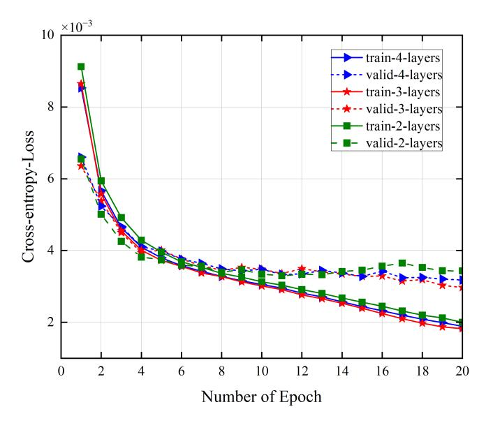

Fig. 3. Comparison of training and validation cross-entropy loss across different 3D convolutional layer configurations (2-layer, 3-layer, 4-layer).

To evaluate the impact of feature extraction depth on model convergence and learning dynamics, we analyze the training and validation cross-entropy loss curves of three models with 2-layer, 3-layer, and 4-layer 3D convolutional encoders, respectively. As illustrated in Fig. 3, all models exhibit a rapid decline in loss during the initial training phase, particularly within the first five epochs, followed by a slower convergence trend thereafter. Among the three configurations, the 3-layer model consistently achieves the lowest cross-entropy loss on both the training and validation sets throughout the training process. This indicates more stable optimization and better generalization capability compared to the others. The 4-layer model, while showing similarly smooth and stable training loss, presents slightly higher validation loss in the later epochs, suggesting a minor degree of overfitting. In contrast, the 2-layer configuration yields the highest losses across most epochs and displays noticeable fluctuations in validation performance, reflecting its limited feature representation capacity and reduced generalization.

These results suggest that increasing network depth beyond a certain point may not always yield better performance, and the 3-layer design offers a more favorable trade-off between learning effectiveness and robustness. Therefore, the 3-layer 3D convolutional structure, as depicted in Fig. 2, is adopted as the primary feature extraction module in the final model design.

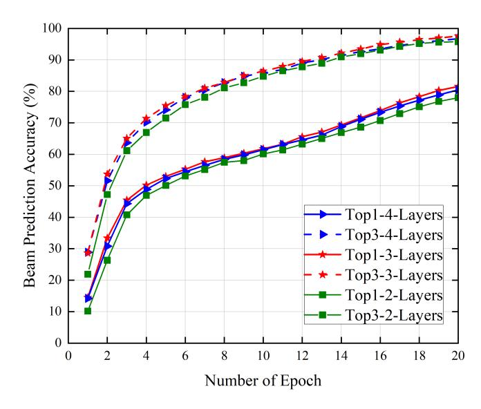

Fig. 4. Comparison of top-1 and top-3 beam prediction accuracy under different 3D convolutional layer configurations during training.

To further assess the effect of feature extraction depth on model accuracy, we evaluate the beam prediction performance in terms of top-1 and top-3 accuracy across three different 3D convolutional configurations. As shown in Fig. 4, all models exhibit a steep increase in prediction accuracy within the first five training epochs, followed by a gradual improvement as the training progresses.

The model employing a 3-layer convolutional structure achieves the highest accuracy in both top-1 and top-3 metrics throughout the entire training process. In particular, it consistently outperforms the 2-layer and 4-layer counterparts by a clear margin after epoch 5, indicating more effective feature extraction and superior generalization. The 4-layer model yields comparable results, especially in early training stages, but demonstrates slightly lower final accuracy compared to the 3-layer setup, suggesting that further increasing the number of convolutional layers may not necessarily lead to performance gains. The 2-layer model consistently lags behind in both top-1 and top-3 performance, reflecting limited feature representation capacity.

To evaluate the impact of MPFusion depth on beam prediction performance, we compare top-1 and top-3 accuracy curves under three different MPFusion configurations: 1-layer, 2-layer, and 3-layer. As shown in Fig. 5, increasing the number of MPFusion layers significantly improves accuracy from the 1-layer to the 2-layer setting. Specifically, the 2-layer MPFusion model achieves a top-1 accuracy of 81.55% and a

{10}------------------------------------------------

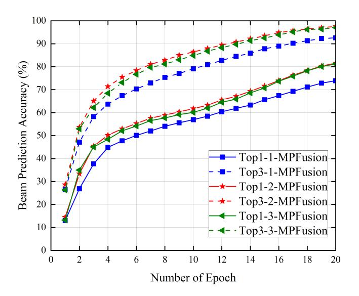

Fig. 5. Top-1 and top-3 beam prediction accuracy comparison under different MPFusion layer configurations.

top-3 accuracy of 97.59%, showing clear improvement over the 1-layer variant.

However, further increasing the MPFusion depth to three layers yields only marginal changes in performance, with top-1 and top-3 accuracy reaching 81.23% and 97.02%, respectively. The similarity of these results indicates that while multi-layer fusion contributes positively to performance, deeper stacking beyond two layers provides limited additional gains. This suggests that the 2-layer MPFusion configuration offers a more efficient balance between model complexity and predictive performance, and thus is adopted as the default design in our final architecture.

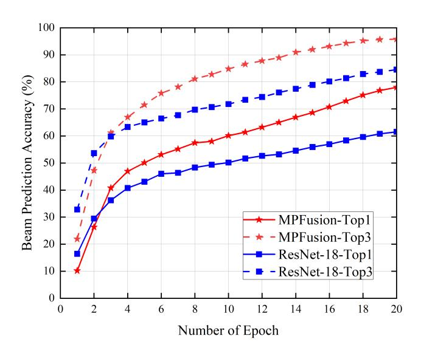

Fig. 6. Comparison of top-1 and top-3 beam prediction accuracy between MPFusion and ResNet-18 over training epochs.

In this experiment, we compare the performance of the proposed MPFusion model with a baseline ResNet-18 model in the beam prediction task. The baseline model utilizes ResNet-18 to extract perceptual features, which are directly concatenated and fed into a fully connected layer for classification, without any explicit multimodal fusion mechanism. In contrast, the MPFusion model introduces a Transformerbased module to capture deep interactions among multimodal features. As shown in Fig. 6, the top-1 and top-3 accuracy curves of the two models exhibit clear differences throughout training. Building upon the success of prior vision-aided, and mmWave sensing-communication fusion methods, the proposed MPFusion model further demonstrates consistent gains, consistently outperforming baseline approaches and achieving superior accuracy in beam direction prediction.

However, it is worth noting that during the early training stage (approximately the first 3 epochs), the MPFusion model temporarily underperforms compared to ResNet-18, with a crossover occurring around epoch 4. This phenomenon is primarily attributed to the fact that MPFusion requires more training to activate its full cross-modal fusion capacity. In contrast, the simpler baseline model converges more quickly in the initial phase due to its shallow structure. As training progresses, MPFusion gradually stabilizes and leverages the complementary information across modalities. Eventually, it significantly surpasses the baseline in both top-1 and top-3 accuracy metrics. These results highlight the clear advantage of incorporating the MPFusion structure for multimodal fusion, particularly in enhancing perceptual representation and decision-making capability once sufficient training has been achieved, compared to traditional feature concatenation approaches.

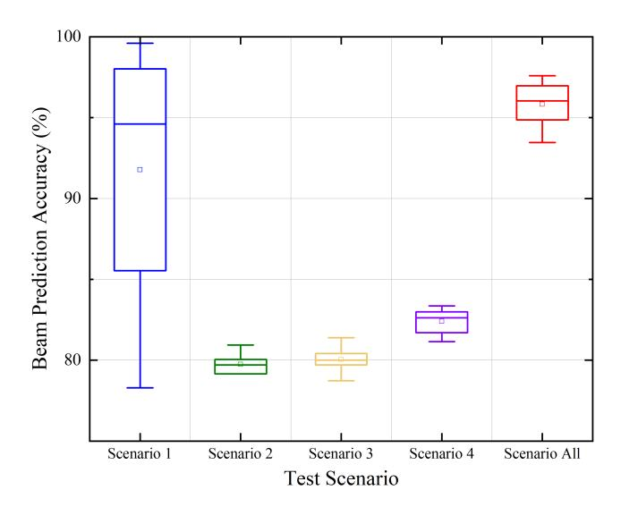

Fig. 7. Beam prediction accuracy distribution across different scenarios and overall case.

Fig. 7 illustrates the distribution of beam prediction accuracy under four individual scenarios and the overall scenario aggregation. Scenario 1 shows the widest variance, with accuracy values ranging from approximately 78% to 100%, reflecting its large sample size and high diversity. This is mainly because Scenario 1 corresponds to an open-sky daytime environment, where the UAVs experience stronger illumination variations, longer sensing ranges, and more pro

{11}------------------------------------------------

nounced multipath reflections from surrounding terrain and structures. These factors introduce higher variability in both visual and LiDAR sensing, which propagates into the multimodal fusion process and leads to greater uncertainty in beam prediction outcomes. In comparison, Scenarios 2 to 4 exhibit relatively narrow accuracy ranges centered around 79%–85%, indicating more stable but less varied conditions.

The combined "Scenario All" case demonstrates a compact distribution with a high median accuracy of approximately 95%, highlighting the model's robustness and strong generalization capability across heterogeneous environments.

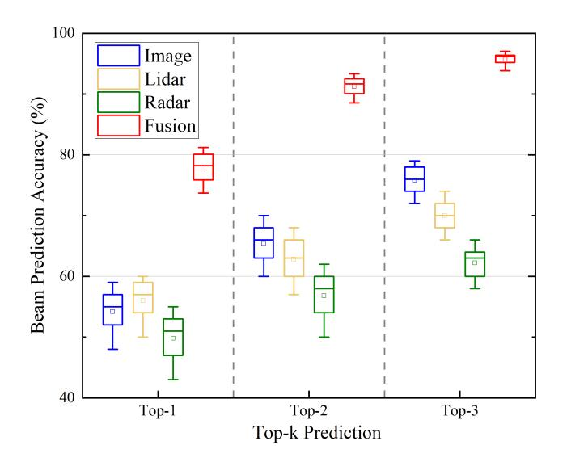

Fig. 8. Comparison of top-1 to top-3 beam prediction accuracy across singlemodal and multimodal fusion schemes.

Fig. 8 compares the beam prediction performance of singlemodal and multimodal schemes across top-1, top-2, and top-3 metrics. Among the single-modality methods, the vision-based model consistently achieves higher accuracy than the radarbased model, reflecting the superior perceptual resolution of visual inputs. In contrast, the radar-only model performs the worst across all metrics due to its coarse spatial features and limited environmental detail. Quantitatively, the average top-1 accuracies of image, LiDAR, and radar models are 54.2%, 55.2%, and 50.0%, respectively, while the multimodal fusion model achieves 77.44%, representing an absolute improvement of over 22.2% compared to the best-performing single modality. The advantage of fusion becomes more evident as the candidate beam range expands. Specifically, the fusion approach reaches 91.83% in top-2 and 94.62% in top-3 accuracy, outperforming all single-modality baselines by a significant margin.

As shown in Fig. 9, we further evaluated several twomodality fusion schemes. The results demonstrate that twomodality fusion generally outperforms single-modality inputs, highlighting the benefit of complementary information. However, these pairs still exhibit clear performance and stability gaps compared with three-modality and, most importantly, full four-modality fusion. For instance, RGB+LiDAR achieves a median accuracy of about 94.6%, which is higher than unimodal inputs but still falls short of the gain achieved by

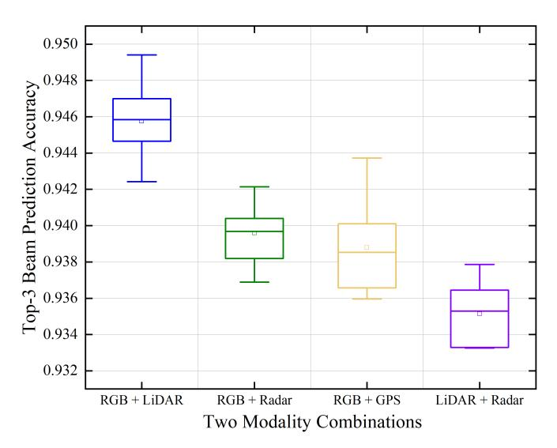

Fig. 9. Top-3 beam prediction accuracy of different two-modality fusion schemes.

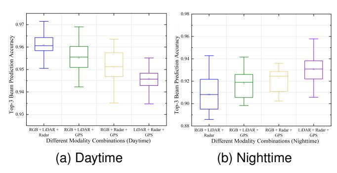

Fig. 10. Comparison of top-3 beam prediction accuracy distributions under daytime and nighttime conditions.

four-modality fusion; non-visual pairs such as LiDAR+radar are further limited, with performance around 93.3%. These findings confirm that while partial fusion provides incremental improvement, achieving robust and high-accuracy beam prediction across diverse scenarios ultimately requires leveraging the full four-modality complementarity.

Fig. 10(a) illustrates the distributions of top-3 beam prediction accuracy for four three-modality fusion schemes under daytime conditions. It can be observed that RGB+LiDAR+radar achieves the highest median top-3 accuracy and exhibits the smallest variance, while the other three combinations also maintain high but slightly lower accuracy. This indicates that in well-illuminated daytime environments, the RGB modality provides abundant texture cues which complement the geometric (LiDAR) and motion (radar) information, leading to more reliable top-3 beam prediction. Although the differences among the four combinations are relatively small, these results highlight the marginal contributions of individual modalities under specific conditions. Together with the nighttime analysis (Fig. 10(b)), we confirm that multi-modal fusion is essential: when visual cues degrade at night, LiDAR and radar dominate the top-3 gains, and GPS provides stable prior support. Hence, Fig. 

{12}------------------------------------------------

10 demonstrates that multi-modal fusion not only improves overall top-3 accuracy but also enables MPFusionNet to dynamically leverage modality-specific strengths across diverse scenarios, which justifies our design choice.

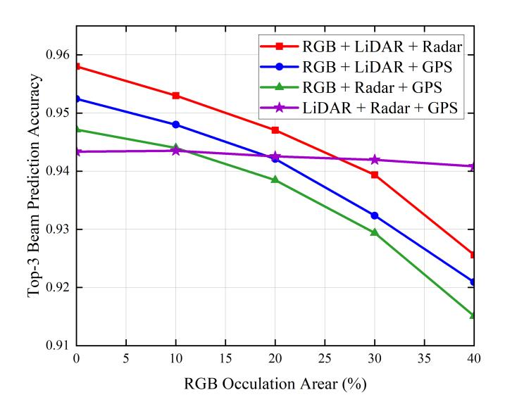

Fig. 11. Top-3 beam prediction accuracy under different RGB occlusion levels.

In Fig. 11, random rectangular patches are applied to the image modality during testing, with the occlusion area progressively increased from 0% to 10%, 20%, 30%, and 40%, while the LiDAR, radar, and GPS modalities remained unchanged. The results show that fusion schemes involving RGB inputs exhibit a monotonic decline in performance as the occlusion ratio increases, with top-3 accuracy dropping by about 2–3 percentage points at 40% occlusion compared to the no-occlusion case. In contrast, the LiDAR+radar+GPS combination, which does not rely on RGB, is barely affected and remains stable across all occlusion levels. These findings indicate that while the visual modality contributes significantly under normal conditions, its reliability degrades under severe occlusion, whereas non-visual modalities provide complementary robustness. Overall, multimodal fusion consistently outperforms any single-modality input, confirming the reliability and practicality of the fusion mechanism under visual degradation.

Our experimental results clearly demonstrate that integrating visual, LiDAR, radar, and positioning modalities significantly enhances the robustness and accuracy of beam and blockage prediction in UAV communication scenarios. By effectively fusing spatial and temporal cues from these heterogeneous sensors, the proposed model achieves improved beam discrimination capability and stable prediction performance under diverse flight conditions. These outcomes confirm the effectiveness of the multimodal perception framework in supporting reliable beamforming for U2U mmWave communication in dynamic 3D environments.

## *C. Computational Complexity and Deployment Feasibility*

Although hardware-in-the-loop tests were not performed, the complexity of MPFusionNet can be estimated from its backbone design. The overall model size is about 20–25M parameters with roughly 5–8 GFLOPs per 320240 frame, which is close to lightweight CNN backbones such as ResNet-34. This scale is far below the processing capability of embedded AI modules commonly adopted in UAVs, for example, NVIDIA Jetson Xavier NX or Orin NX, which provide 10–100 TOPS under a power budget of 10–30 W. Even at 8 GFLOPs per frame, real-time inference at 30 FPS requires only about 0.24 TOPS, less than one percent of the available compute. These estimates suggest that MPFusionNet is feasible for realtime UAV deployment. Moreover, the modular architecture enables dynamic modality selection: LiDAR or radar branches can be disabled in clear daytime, while RGB can be downweighted at night, reducing active computation by 20–40%. Future work will explore model compression techniques such as quantization, pruning, and knowledge distillation to further reduce power consumption and memory usage under strict UAV constraints.

# V. CONCLUSION

In this work, we proposed MPFusionNet, a novel Transformer-based beamforming framework tailored for U2U mmWave communication empowered by multimodal aerial perception. To address core challenges such as sensor asynchrony, geometric uncertainty, and inefficient cross-modal fusion, our design integrates a dynamic temporal alignment mechanism based on DTW and cubic spline interpolation, a geometry-aware prior embedding scheme derived from GPS, and a PerceiverIO-enhanced multimodal fusion network. The proposed architecture effectively captures heterogeneous spatial-temporal cues across aerial RGB imagery, LiDAR point clouds, radar sequences, and high-precision GPS signals, projecting them into the beam domain to enhance prediction accuracy in dynamic UAV flight scenarios. Extensive experiments on the U2U dataset demonstrate that our model achieves superior top-1 and top-3 beam prediction accuracy compared to baseline and ablation variants. Notably, the duallayer MPFusion modules consistently improve performance across diverse environments, validating the model's robust generalization capability. Compared to conventional UAV beam selection methods, MPFusionNet significantly reduces redundant computation, accelerates convergence, and enhances prediction robustness in both daytime and nighttime aerial scenarios. These results confirm the efficacy of multimodal perception in enabling high-reliability mmWave beamforming for airborne platforms. Future work will explore the integration of energy-efficient radio frequency chain architectures with perception-guided beamforming to promote sustainable ISAC systems in aerial communication networks.

#### ACKNOWLEDGMENTS

This work is supported by Natural Science Foundation of Beijing (4242003), Henan (252300421516), and the National Natural Science Foundation of China (62206027).

{13}------------------------------------------------

#### REFERENCES

- [1] H. Huang, J. Su, and F.-Y. Wang, "The potential of low-altitude airspace: The future of urban air transportation," *IEEE Trans. Intell. Veh.*, vol. 9, pp. 5250–5254, Oct. 2024.
- [2] L. Zeng, X. Liao, Z. Ma, H. Jiang, and Z. Chen, "UAV-to-UAV MIMO systems under multimodal nonisotropic scattering: Geometrical channel modeling and outage performance analysis," *IEEE Internet Things J.*, vol. 11, pp. 26266–26278, Apr. 2024.
- [3] J. Du, J. Wang, A. Sun, J. Qu, J. Zhang, C. Wu, and D. Niyato, "Joint optimization in blockchain- and MEC-enabled space–air–ground integrated networks," *IEEE Internet Things J.*, vol. 11, pp. 31862–31877, Oct. 2024.
- [4] Z. Jia, J. He, Y. Cui, Q. Zhu, L. Yuan, F. Zhou, Q. Wu, D. Niyato, and Z. Han, "Hierarchical Low-Altitude Wireless Network Empowered Air Traffic Management," *arXiv e-prints*, p. arXiv:2509.03386, Sep. 2025.
- [5] W. Yuan, Y. Cui, J. Wang, F. Liu, G. Sun, T. Xiang, J. Xu, S. Jin, D. Niyato, S. Coleri, S. Sun, S. Mao, A. Jamalipour, D. In Kim, M.-S. Alouini, and X. Shen, "From Ground to Sky: Architectures, Applications, and Challenges Shaping Low-Altitude Wireless Networks," *arXiv e-prints*, p. arXiv:2506.12308, Jun. 2025.
- [6] J. Teutsch and C. Petersen, "Dynamic airspace re-configuration for manned and unmanned operations in shared airspace," in *Proc. IEEE ICNS*, pp. 1–14, 2024.
- [7] S. Sobhi-Givi, M. Nouri, M. G. Shayesteh, H. Behroozi, H. H. Kwon, and M. J. Piran, "Efficient optimization in RIS-assisted UAV system using deep reinforcement learning for mmwave-noma 6G communications," *IEEE Internet Things J.*, pp. 1–16, Mar. 2025.
- [8] F. Zhang, M. M. Wang, R. Deng, and X. Zhao, "High-reliability and lowenergy sensor sharing in vehicle platoon based on multihop millimeterwave communication," *IEEE Internet Things J.*, vol. 9, pp. 18514– 18526, Mar. 2022.
- [9] H. Jiang, W. Shi, X. Chen, Q. Zhu, and Z. Chen, "High-efficient nearfield channel characteristics analysis for large-scale MIMO communication systems," *IEEE Internet Things J.*, vol. 12, pp. 7446–7458, Nov. 2024.
- [10] H. Shin, S. Baek, and Y. Song, "Multidimensional beam optimization in underwater optical wireless communication based on deep reinforcement learning," *IEEE Internet Things J.*, vol. 11, pp. 28623–28634, May 2024.
- [11] C. Yang, H. Zhang, Y. Wang, Y. Liu, and M. Peng, "Fast and efficient beam alignment for terahertz communication via sensing DoA of leaky waves from intermediate frequency ports," *IEEE Internet Things J.*, vol. 12, pp. 6196–6207, Dec. 2024.
- [12] J. Du, J. Xu, A. Sun, J. Kang, Y. Hu, F. Richard Yu, and V. C. M. Leung, "Profit maximization for multi-time-scale hierarchical DRL-based joint optimization in MEC-enabled air-ground integrated networks," *IEEE Trans. Commun.*, vol. 73, pp. 1591–1606, Mar. 2025.
- [13] Y. Zhang, T. A. Gulliver, H. Wu, J. Li, X. Mei, J. Xian, and K.-C. Li, "3-D RSSD localization under mixed gaussian noise and NLOS environments in UWSNs," *IEEE Internet Things J.*, pp. 1–13, May 2025.
- [14] Z. Wu, Y. Li, X. Zhang, X. Meng, X. Lv, and Y. Wu, "Multiple anchors and RIS-aided localization method in complex NLOS environments," *IEEE Internet Things J.*, vol. 11, pp. 36922–36932, Jul. 2024.
- [15] Y. Gong, B. Yu, L. Yang, F. Meng, L. Liu, X. Hu, and Z. Xu, "Toward next-generation networks: A blockchain-based approach for core network architecture and roaming identity verification," *Digit. Commun. Netw.*, Apr. 2024.
- [16] Y. Gong, Z. Li, L. Yang, L. Tian, J. Miao, D. Zhang, and Z. Xu, "LDPChadamard code-assisted OTFS in high-mobility scenarios," *IEEE Open J. Veh. Technol.*, pp. 1–12, May 2025.
- [17] S. Wang, J. Dai, K. Tan, X. Qin, K. Niu, and P. Zhang, "DiffCom: Channel received signal is a natural condition to guide diffusion posterior sampling," *IEEE J. Sel. Areas Commun.*, vol. 43, pp. 2651–2666, Jul. 2025.
- [18] Y. Yeo and J. Kim, "Multi-modal sensing-aided beam prediction using poolformer for UAV communications," in *Proc. IEEE Int. Conf. Ubiquitous Future Netw. (ICUFN 2024)*, pp. 202–204, 2024.
- [19] J. W. Y. W. T. C. J. Du, J. Gong and S. Li, "An active inference based deep reinforcement learning algorithm for edge low-altitude systems," *J. Xi'an Univ. of Posts & Telecommun.*, vol. 30, pp. 9–18, Mar. 2025.
- [20] C. Zhao, Y. Feng, H. Luo, F. Gao, F. Liu, and S. Jin, "Networked ISACbased UAV tracking and handover toward low-altitude economy," *IEEE Trans. Wirel. Commun.*, vol. 24, pp. 7670–7685, Sep. 2025.
- [21] T. Liu, K. Guan, D. He, M. Xu, P. Takis Mathiopoulos, K. Yu, J. Xu, and M. Rupp, "Object-oriented integrated sensing and communications (ISAC) channel modeling for low-altitude 3D spaces," *IEEE J. Sel. Areas Commun.*, pp. 1–1, Sep. 2025.

- [22] J. Chong, X. Jia, and Z. Yang, "Toward routing in low-altitude drone networks: A physical sensing-aided intelligent forwarding mechanism with deep learning," *IEEE Internet Things J.*, vol. 12, pp. 25442–25456, Jul. 2025.
- [23] A. Alkhateeb, G. Charan, T. Osman, A. Hredzak, J. Morais, U. Demirhan, and N. Srinivas, "Deepsense 6G: A large-scale real-world multi-modal sensing and communication dataset," *IEEE Commun. Mag.*, vol. 61, pp. 122–128, Jun. 2023.
- [24] M. Alrabeiah, A. Hredzak, Z. Liu, and A. Alkhateeb, "ViWi: A deep learning dataset framework for vision-aided wireless communications," in *Proc. IEEE Veh. Technol. Conf.*, pp. 1–5, 2020.
- [25] X. Cheng, H. Zhang, J. Zhang, S. Gao, S. Li, Z. Huang, L. Bai, Z. Yang, X. Zheng, and L. Yang, "Intelligent multi-modal sensingcommunication integration: Synesthesia of machines," *IEEE Commun. Surv. Tutor.*, vol. 26, pp. 258–301, Nov. 2023.
- [26] R. Bajpai, A. S. Shaikh, and N. Gupta, "Wireless powered NOMA assisted full-duplex cooperative U2U communications system with fluctuating two-ray channel," *IEEE Access*, vol. 13, pp. 54069–54079, Mar. 2025.
- [27] D. Zhang, Y. Cui, X. Cao, N. Su, Y. Gong, F. Liu, W. Yuan, X. Jing, J. A. Zhang, J. Xu, C. Masouros, D. Niyato, and M. Di Renzo, "Integrated Sensing and Communications Over the Years: An Evolution Perspective," *arXiv e-prints*, p. arXiv:2504.06830, Apr. 2025.
- [28] Y. Gong, X. Li, F. Meng, L. Liu, M. Guizani, and Z. Xu, "Toward green RF chain design for integrated sensing and communications: Technologies and future directions," *IEEE Commun. Mag.*, vol. 62, pp. 36–42, Sep. 2024.
- [29] Y. Cui, J. Nie, X. Cao, T. Yu, J. Zou, J. Mu, and X. Jing, "Sensingassisted high reliable communication: A transformer-based beamforming approach," *IEEE J. Sel. Top. Signal Process.*, vol. 18, pp. 782–795, May 2024.
- [30] Y. Cui, X. Cao, G. Zhu, J. Nie, and J. Xu, "Edge perception: Intelligent wireless sensing at network edge," *IEEE Commun. Mag.*, vol. 63, pp. 166–173, Mar. 2025.
- [31] Y. Cui, W. Yuan, Z. Zhang, J. Mu, and X. Li, "On the physical layer of digital twin: An integrated sensing and communications perspective," *IEEE J. Sel. Areas Commun.*, vol. 41, pp. 3474–3490, Nov. 2023.
- [32] S. Gopikrishnan, S. Chakkaravarthy Sethuraman, G. Srivastava, and S. Theerthagiri, "CyTFS: Cyber-twin fog system for delay-efficient task offloading in 6G mobile networks," *IEEE Internet Things J.*, vol. 11, pp. 24698–24714, Jul. 2024.
- [33] S. Tariq, B. E. Arfeto, U. Khalid, S. Kim, T. Q. Duong, and H. Shin, "Deep quantum-transformer networks for multimodal beam prediction in ISAC systems," *IEEE Internet Things J.*, vol. 11, pp. 29387–29401, Jun. 2024.
- [34] S. Zhang, H. Zhang, Y. Zhan, X. Wei, and Y. Liu, "Cluster networking and cooperative localization based on biogeography optimization and improved super-multidimensional scaling for multi-unmanned aerial vehicles," *Sensors*, vol. 25, p. 2887, May 2025.
- [35] J. Morais, A. Bchboodi, H. Pezeshki, and A. Alkhateeb, "Position-aided beam prediction in the real world: How useful gps locations actually are?," in *Proc. IEEE Int. Conf. Commun.*, pp. 1824–1829, IEEE, 2023.
- [36] T. Osman, G. Charan, and A. Alkhateeb, "Vehicle cameras guide mm wave beams: Approach and real-world V2V demonstration," in *Proc. IEEE Asilomar Conf. Signals Syst. Comput.*, pp. 225–232, IEEE, 2023.
- [37] H. Wang, D. Yang, and X. Xie, "A deep-reinforcement-learning-based beam prediction scheme for vision-aided mmwave wireless communications," *IEEE Internet Things J.*, vol. 12, pp. 17869–17879, Feb. 2025.
- [38] B. Salehi, D. Roy, T. Jian, C. Dick, S. Ioannidis, and K. Chowdhury, "Omni-CNN: A modality-agnostic neural network for mmwave beam selection," *IEEE Trans. Veh. Technol.*, vol. 73, pp. 8169–8183, Jan. 2024.
- [39] J. Zhang, W. Xu, H. Gao, M. Pan, Z. Han, and P. Zhang, "Codebookbased beam tracking for conformal array-enabled UAV mmwave networks," *IEEE Internet Things J.*, vol. 8, pp. 244–261, Jun. 2021.
- [40] Y. Bian, J. Yang, S. Xia, and S. Jin, "3-D LiDAR and GPS aided beam tracking in millimeter wave vehicular communications," *IEEE Wirel. Commun. Lett.*, Jun. 2024.
- [41] W. Miao, C. Luo, G. Min, Y. Mi, and Z. Yu, "Location-based robust beamforming design for cellular-enabled UAV communications," *IEEE Internet Things J.*, vol. 8, pp. 9934–9944, Oct. 2021.
- [42] Y. Gong, L. Zhang, R. Liu, K. Yu, and G. Srivastava, "Nonlinear MIMO for industrial internet of things in cyber–physical systems," *IEEE Trans. Ind. Inform.*, vol. 17, no. 8, pp. 5533–5541, 2020.
- [43] J. Wang, C. Xu, C. Zhao, L. Gao, J. Wu, Y. Yan, S. Feng, and N. Su, "Multimodal object detection of UAV remote sensing based on joint representation optimization and specific information enhancement,"

{14}------------------------------------------------

- *IEEE J. Sel. Top. Appl. Earth Obs. Remote Sens.*, vol. 17, pp. 12364– 12373, Mar. 2024.
- [44] S. Jiang, G. Charan, and A. Alkhateeb, "LiDAR aided future beam prediction in real-world millimeter wave V2I communications," *IEEE Wirel. Commun. Lett.*, vol. 12, pp. 212–216, Nov. 2022.
- [45] G. Charan, A. Hredzak, C. Stoddard, B. Berrey, M. Seth, H. Nunez, and A. Alkhateeb, "Towards real-world 6G drone communication: Position and camera aided beam prediction," in *Proc. IEEE Global Commun. Conf.*, pp. 2951–2956, Dec. 2022.
- [46] B. Salehi, G. Reus-Muns, D. Roy, Z. Wang, T. Jian, J. Dy, S. Ioannidis, and K. Chowdhury, "Deep learning on multimodal sensor data at the wireless edge for vehicular network," *IEEE Trans. Veh. Technol.*, vol. 71, pp. 7639–7655, Apr. 2022.
- [47] Z. Li, T. Shang, and P. Xu, "Multi-modal attention perception for intelligent vehicle navigation using deep reinforcement learning," *IEEE Trans. Intell. Transp. Syst.*, vol. 26, pp. 8657–8669, Feb. 2025.
- [48] Y. Pan, R. Wang, J. Cao, T. Yu, Y. Li, C. Zhang, and P. Zhao, "Kube-IPM: A kubernetes-native platform for industrial process monitoring with heterogeneous sensor data and delay-sensitive prediction," *IEEE Internet Things J.*, pp. 1–16, Jun. 2025.
- [49] H. Zhang, Y. Dong, J. Li, and D. Xu, "Dynamic time warping under product quantization, with applications to time-series data similarity search," *IEEE Internet Things J.*, vol. 9, pp. 11814–11826, Dec. 2022.
- [50] G. Zhao, K. Ying, Q. Wen, L. Zhao, J. Pang, P. Jia, M. Zhou, and L. Gui, "Analysis and behavioral modeling using augmented transformer for satellite communication power amplifiers," *IEEE Internet Things J.*, vol. 12, pp. 11994–12007, Dec. 2025.
- [51] K. Yang, S. Wang, J. Dai, X. Qin, K. Niu, and P. Zhang, "SwinJSCC: Taming swin transformer for deep joint source-channel coding," *IEEE Trans. Cogn. Commun. Netw.*, vol. 11, pp. 90–104, Feb. 2025.
- [52] P. Ni, X. Li, W. Xu, D. Kong, Y. Hu, and K. Wei, "Robust 3D semantic segmentation based on multi-phase multi-modal fusion for intelligent vehicles," *IEEE Trans. Intell. Veh.*, vol. 9, pp. 1602–1614, Sep. 2023.
- [53] L. Guo, Y. Wang, Y. Liu, Y. Lin, H. Zhao, and G. Gui, "Ultralight convolutional neural network for automatic modulation classification in internet of unmanned aerial vehicles," *IEEE Internet Things J.*, vol. 11, pp. 20831–20839, Mar. 2024.
- [54] T. Xie, F. Huang, F. Li, H. Yao, M. Ouyang, Z. Dai, X. Zhu, and Q. Lin, "A novel GNSS decentralized cooperative positioning algorithm for internet of vehicles," *IEEE Internet Things J.*, vol. 12, pp. 12792– 12802, Dec. 2025.
- [55] L. Yi, Y. Wu, A. Tolba, T. Li, S. Ren, and J. Ding, "SA-MLP-Mixer: A compact all-mlp deep neural net architecture for UAV navigation in indoor environments," *IEEE Internet Things J.*, vol. 11, pp. 21359– 21371, Jan. 2024.
- [56] Z. Ma, J. Xiong, H. Gong, and X. Wang, "Mission planning of UAVs and CAVs based on graph neural network transformer model," *IEEE Internet Things J.*, vol. 11, pp. 40532–40546, Aug. 2024.