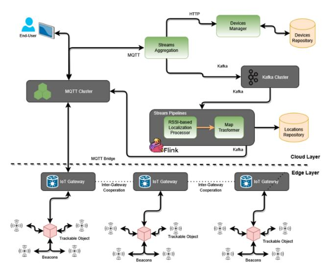
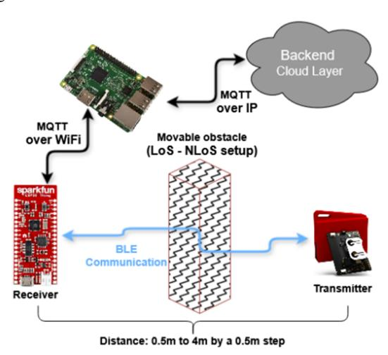
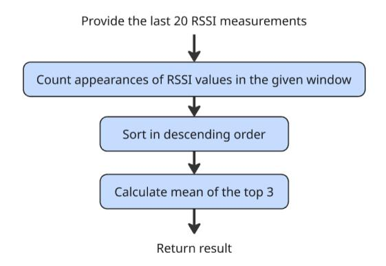
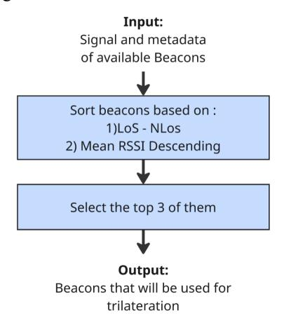
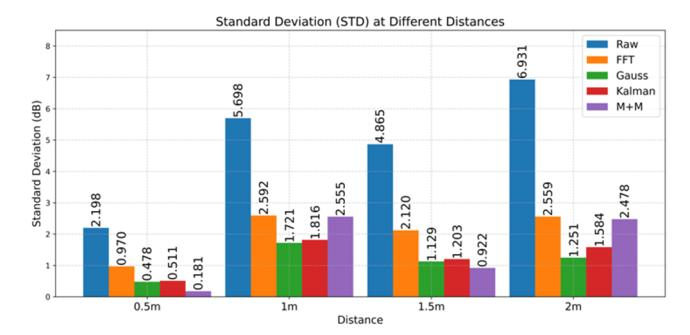
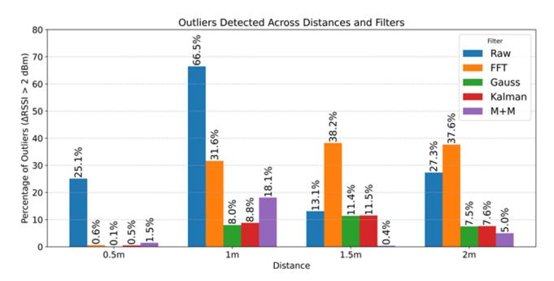
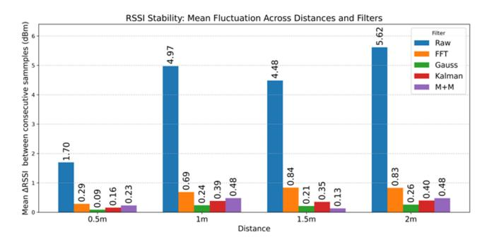
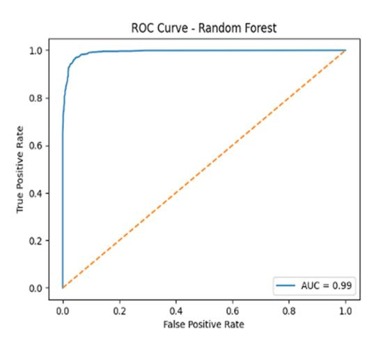

{0}------------------------------------------------

# Sensing Assisted Localization Services

# for Indoor Environments

Theodoros Skandamis ECE Dept University of Peloponnese Patras, Greece th.skandamis@esdalab.ece.uop.gr

Dr. Evanthia Faliagka ECE Dept University of Peloponnese Patras, Greece e.faliagka@esdalab.ece.uop.gr

Assoc. Prof. Christos P. Antonopoulos ECE Dept University of Peloponnese Patras, Greece ch.antonop@uop.gr

Georgios Alogdianakis ECE Dept University of Peloponnese Patras, Greece g.alogdianakis@esdalab.ece.uop.gr

> Dimitrios Karadimas R&D Dept PIKEI New Technologies Patras, Greece dimitris@pikei.io

Prof. Nikolaos Voros ECE Dept University of Peloponnese Patras, Greece voros@uop.gr

Konstantinos Antonopoulos ECE Dept University of Peloponnese Patras, Greece k.antonop@esdalab.ece.uop.gr

Prof. Christos Masouros Dept of Electronic & Electrical Eng University College London United Kingdom (Great Britain) chris.masouros@ieee.org

*Abstract***— Indoor localization is a critical component of various applications, including assisted living, personnel monitoring, and asset tracking. Traditional localization methods relying on specialized sensors such as LiDAR, ultrasound, and 3D cameras offer high precision but suffer from high costs and limited interoperability. To address these challenges, this paper explores the Integrated Sensing and Communication (ISAC) paradigm, leveraging signal-based modalities focusing on received signal strength indication (RSSI). These measurements, inherently embedded in wireless communication packets, enable cost-effective and vendoragnostic localization without the need for additional hardware. However, practical deployment remains challenging due to signal degradation from obstacles, multipath effects, and reflections. This paper presents an end-to-end localization framework utilizing COTS IoT devices and advanced RSSI processing techniques to enhance measurement reliability. By integrating filtering mechanisms and machine learning models, the proposed solution improves distance estimation, categorizes line-of-sight (LoS) and non-line-of-sight (NLoS) conditions, and enhances localization accuracy. Additionally, an open and extendable edge-to-cloud infrastructure supports scalability and real-time processing. Experimental evaluation demonstrate the effectiveness of this approach in various aspects such as increase of RSSI reliability (increase of up to 82% regarding standard deviation, drastic reduction of outliers' detection and fluctuation of more than 90% to distances up to 2m), accurate LoS-NLoS classification up to 99% and overall localization increased accuracy more than 83%.**

## *Keywords—Localization ISAC, RSSI processing, ML, IoT*

## I. INTRODUCTION

For many years, localization has been one of the most fundamental features of almost all indoor activities [1]. Whether as a standalone functionality or part of more complex and composite operations, the ability to accurately determine a position in space is critical across a wide range of application domains, including assisted living, personnel monitoring, asset tracking and management, industrial applications, and more [2-4].

With the advent of the Internet of Things (IoT) and advancements in sensor integration, embedded systems, and low-power wireless communication, the importance of localization capabilities has become even more pronounced. On one hand, this is due to the availability of a wide range of specialized sensors integrated into commercial off-the-shelf (COTS) embedded systems, such as LiDAR sensors, ultrasound sensors, 3D cameras, microphones, and wireless interfaces with angle-of-arrival (AoA) or time-difference-ofarrival (TDoA) features, which support localization. On the other hand, modern embedded systems provide the necessary processing resources to efficiently utilize these specialized modalities and process relative measurements [5]. However, relying on specialized sensors and commercial hardware introduces significant limitations. Specifically, such approaches may not always be available when and where they are needed, and they can also be costly. Additionally, hardware and sensors from different vendors often lack interoperability or are completely heterogeneous, ultimately reducing the practicality and usefulness of such solutions. Therefore, while many tools and solutions exist in theory, significant challenges arise when aiming for practical implementation [6].

To address these limitations effectively, the Integrated Sensing and Communication (ISAC) approach—particularly sensing-assisted services—introduces a new paradigm. This paradigm represents a critical key performance indicator (KPI) of 6G networks and offers substantial benefits across various technologies and application domains. In localization scenarios following the ISAC paradigm, the primary objective is to leverage sensing modalities and measurements provided by any wireless technology in a vendor-agnostic manner. Such modalities include received signal strength indication (RSSI), link quality indication (LQI), and others embedded in all communication packets. These indicators not only categorize communication link quality but also enable the correlation of signal quality with distance, which is essential for accurate localization [7]. This approach provides critical advantages, as any IoT-embedded system and all communications can be utilized to provide localization services without requiring additional specialized hardware. However, while combining 

{1}------------------------------------------------

the ISAC paradigm with localization offers significant benefits, practical implementation presents notable challenges. This is mainly because controlling and harnessing sensing modalities such as RSSI in real-life indoor scenarios—where obstacles, multipath effects, reflections, and other wireless signal propagation phenomena are present—is notoriously difficult. RSSI and related sensing measurements are particularly susceptible to these factors, making real-time measurements highly volatile and unpredictable [8].

To address these challenges, this paper proposes an endto-end localization service based on COTS devices, integrating various RSSI processing techniques to significantly enhance the reliability of measurements, leading to accurate distance estimation, line-of-sight (LoS) or nonline-of-sight (NLoS) categorization, and improved localization efficiency in real-world environments. To achieve this, the paper makes several key contributions, including:

- An end-to-end, open and extendible edge to cloud infrastructure architecture is proposed.
- Comprehensive filtering techniques to increase RSSI usefulness and reliability.
- Increase distance estimation and localization accuracy by leveraging Machine Learning frameworks.

The rest of the paper is structured as follows: While Section II provides a brief overview of the basic technologies that engage in this work, section III presents the end-to-end architecture developed to support this work but also a real deployment of the proposed services. Then sections IV and V present the methodological approach and algorithms involved in RSSI processing and ML classification put forward. The performance evaluation of this paper's proposals are presented in section VI while section VII offers the main conclusions of the work done.

## II. BACKGROUND

As already indicated, this effort is driven by the ISAC paradigm and especially by aiming to offer a practical and easy to use and be integrated approach, this paper focuses on Received Signal Strength Indicator (RSSI), which quantifies the power level of a received signal. However, RSSI measurements are highly susceptible to environmental factors, making them less reliable particularly when targeting indoor environments as this paper does. High number of studies have highlighted challenges stemming from typical signal propagation mechanisms, such as multipath propagation, shadowing, and signal attenuation due to obstacles like walls and furniture, presence of humans etc. [9,10]. These factors introduce inaccuracies in applications like localization and network optimization [11]. Furthermore, these factors drastically affect the LoS or NLoS status of communication links which in turn can deteriorate the link performance unpredictably. Additionally, RSSI-based measurements are affected by interference from co-channel signals, making it difficult to maintain precise and stable readings over long periods of time [12]. Specifically, efforts like [10] discuss the influence of signal propagation mechanisms, such as reflection, diffraction, and scattering, further degrading the precision of RSSI-based localization.

Despite these challenges, RSSI-based localization algorithms put forward critical advantages when focusing on real life deployments leveraging COTS platform due to their simplicity and low-cost implementation since respective measurements are by default reported by all standardized communication protocols. Specific techniques such as fingerprinting and trilateration have been employed by many respective studies to estimate the position of devices within a network [13,14]. While fingerprinting methods rely on precollected RSSI maps, enabling location estimation by comparing real-time measurements with stored data [15], trilateration techniques, aim to correlate RSSI measurements to distance measurements to estimate positions. Another approach to enhance RSSI-based localization that attract high interest is to apply machine learning algorithms and filtering techniques in order to train models that can compensate for RSSI unpredictability and volatile behavior in realistic scenarios [16, 17]. Furthermore, other methods are also proposed, such as those presented by [18], integrate RSSI with additional metrics, like time-of-flight or angle-of-arrival, to enhance positioning robustness which however they typically demand specialized hardware and vendor specific solutions. These contributions illustrate the ongoing advancements in utilizing RSSI measurements for localization despite inherent challenges in signal reliability.

### III. END-TO-END SERVICE ARCHITECTURE

 Aiming to propose a practical solution capable of supporting a wide range of indoor scenarios, a comprehensive end-to-end architecture has been developed. The goal is to present an efficient framework that integrates all necessary processing and communication components to meet the following key requirements. On one hand, the platform should remain agnostic to specific communication technologies or IoT device vendors. On the other hand, it should support the cloud-edge continuum, enabling the execution of demanding processing tasks across different system layers based on resource availability and application requirements. Furthermore, to ensure extensibility across various technologies, all data communication tasks utilize messagepassing protocols such as MQTT. A high-level representation of the developed platform is shown in Fig. 1.

 As indicated, the overall platform is divided into two layers: the Edge and the Cloud. The Edge layer contains all RSSI-transmitting beacons and trackable objects. In this study, we used Bluetooth Low Energy (BLE) devices from Texas Instruments; however, they could easily be replaced by devices from other vendors or by those using the IEEE 802.11 (WiFi) communication protocol without requiring any modifications. Following the ISAC paradigm for sensingassisted services, RSSI measurements not relaying on theoretical models are extracted from all communication packets and aggregated at the IoT gateway for processing and/or transfer to the Cloud layer. The IoT gateway serves as a critical component, both in terms of its communication and processing capabilities. From the communication perspective, the IoT gateway enables connectivity between edge and cloud services, primarily utilizing the MQTT protocol. Additionally, to support intra-gateway collaboration and communication over MQTT, each gateway exposes a prefix-based MQTT topic (*gateways/{id}/#*), allowing any system component to collaborate with the gateway or services running on it. Finally, regarding processing capabilities, each IoT gateway features a Docker-based processing layer executing various services.

{2}------------------------------------------------

Fig. 1. End-to-end architecture

 As indicated, the overall platform is divided into two layers: the Edge and the Cloud. The Edge layer contains all RSSI-transmitting beacons and trackable objects. In this study, we used Bluetooth Low Energy (BLE) devices from Texas Instruments; however, they could easily be replaced by devices from other vendors or by those using the IEEE 802.11 (WiFi) communication protocol without requiring any modifications. Following the ISAC paradigm for sensingassisted services, RSSI measurements are extracted from all communication packets and aggregated at the IoT gateway for processing and/or transfer to the Cloud layer. The IoT gateway serves as a critical component, both in terms of its communication and processing capabilities. From the communication perspective, the IoT gateway enables connectivity between edge and cloud services, primarily utilizing the MQTT protocol. Additionally, to support intragateway collaboration and communication over MQTT, each gateway exposes a prefix-based MQTT topic (*gateways/{id}/#*), allowing any system component to collaborate with the gateway or services running on it. Finally, regarding processing capabilities, each IoT gateway features a Docker-based processing layer, where various services run in Docker containers.

 In the Cloud layer, the entry point for location data is the Stream Aggregator. Its primary function is to aggregate data from the Edge layer, extract RSSI-related information, and forward it to the Stream Pipeline component, which houses all necessary processing modules for the localization system (e.g., filters, estimators, transformers). Notably, a componentbased architecture has been deliberately chosen, as it allows developers to execute processing tasks—such as RSSI-based localization, stream aggregation, and map transformation—at the IoT gateway, depending on application demands. This high degree of flexibility is enabled by the use of MQTTbased communication for all data exchanges, including connections between beacons and the local gateway, as well as between the gateway and the Cloud layer. As a result, the communication structure and respective APIs remain unchanged regardless of where processing occurs. A key role in this context held by the MQTT cluster which implements a "bridge on-demand" functionality. The MQTT nodes and IoT gateways are forming an edge-cloud MQTT-based cluster and collaborating with different components of the system to determine where to forward any relevant messages. This functionality enables various system services to operate on demand across different layers (edge or cloud) while simultaneously allowing the system to adjust its message forwarding rules. The primary processing tasks include:

- **RSSI Collection**: Capturing BLE signals from continuous beacons. This task implements the fundamental process for any RSSI-based localization system, where the trackable objects are collecting the messages from the beacons and calculating the RSSI values. In our proposed framework, the collected RSSI samples are directly forwarded to the subsequent tasks, as outlined below.
- **Data Enrichment**: Enhancing observed BLE beacon data with additional information stored in the cloud system. Implements a generic intermediate task targeting the interoperability and extendibility of the proposed framework and its subtasks.
- **RSSI Processing & Filtering**: Preprocessing RSSI signals using custom algorithms. This task is divided into two distinct subtasks. The RSSI pre-processing, which focuses on extracting a subset of the original RSSI sample, primarily promoting strong signals. On the other hand, the filtering subtask, is responsible for smoothing the selected RSSI subset.
- **Distance Estimation**: Instead of relying on signal attenuation models to estimate the distance between beacons and trackable objects, we employ machine learning (ML) techniques. We train and deploy ML algorithms using RSSI samples from multiple distances and different scenarios (a such scenario, is the collection of RSSI samples with obstacles between the transmitter and receiver).
- **Location Estimation**: Utilizing Least-Squares techniques to determine the position of trackable objects. We formulate the localization problem as a nonlinear least squares optimization and solve it using the Levenberg-Marquardt Optimizer.

Furthermore, at the Cloud layer, several auxiliary components are required, such as a Device Repository and a Location Repository for data storage. Additionally, visualization services play a crucial role in enabling the development of fully functional real-life applications.

## IV. RSSI SIGNAL ACQUISITION AND PROCESSING

## *A. Signal Acquisition*

Emphasis on practical indoor deployments, this work is based on Bluetooth Low Energy (BLE) communication technology. Specifically, concerning the transmitter a BLE enabled sensor from Texas Instrument (TI CC2650) is used, which periodically transmits beacon-type data packets. From the receiver side an open, highly programmable BLE platform is used (the ESP32 Thing device) to collect communication packets and extract and record RSSI measurements. Then, an in accordance to the end-to-end platform developed, all collected data is sent via the MQTT communication protocol to a broker, which is hosted on a Raspberry Pi device. The specific device (Raspberry Pi) effectively is the IoT Gateway and takes care of both receiving and storing the data, creating a system capable of handling large volumes of data reliably. For the specific experimentation we considered the following parameters: i) different distances between Tx/Rx devices ranging from 0.5m up to 4m with a step of 0.5m, ii) the 

{3}------------------------------------------------

existence or not of obstacle between them, corresponding to cases with LoS and Non-LoS connectivity, iii) the height of Tx/Rx devices at 1meter and iv) default Tx power at 0 dBm and Rx sensitivity at  $\sim$ -97dBm. A graphical representation of the layout of the devices used for data collection is illustrated in Fig. 2.

Fig. 2. Experimentation Setup

#### B. Filtering

In wireless localization systems, Received Signal Strength Indicator (RSSI) measurements are susceptible to noise from interference, sensor imperfections, environmental dynamics. These distortions localization accuracy by introducing high-frequency fluctuations and outliers that obscure true signal trends, directly affecting the estimated distance between the beacon and the target. Thus, filtering methods are essential to mitigate their effects and ensure a robust localization performance. This section details four filtering methods: Fourier Transform, Gaussian, Kalman, and MODE+MEAN.

#### **Fourier Transform Filter**

The Discrete Fourier Transform filter suppresses high-frequency noise in RSSI measurements, using a segment size of N=20 samples and preserving only the lowest M=2 frequency components. The filter transforms the signal from the time domain into the frequency domain using the Discrete Fourier Transform (DFT):

$$X[k] = \sum_{n=0}^{N-1} x[n] * e^{-j2\pi kn/N}$$
 (1)

Then all but the first two and two last values (because of M=2) of the array are zeroed out, hence keeping only the two lowest frequencies. Using this updated array the signal is reconstructed via the Inverse Discrete Fourier Transform (IDFT):

$$x[n] = \frac{1}{N} \sum_{k=0}^{N-1} X[k] * e^{j2\pi kn/N}$$
 (2)

This aggressive truncation ( $M \ll N/2$ ) prioritizes long-term signal trends over short-term fluctuations, effectively attenuating transient noise (e.g., multipath interference and sensor noise) while introducing minimal phase distortion. Similar selective Fourier Transform-based denoising has been validated in various applications, from electrocardiograms [19], to image processing [20].

#### Gaussian filter

The Gaussian filter reduces noise in RSSI measurements, using a sliding window of 20 samples. For each sample, the filter dynamically computes the local mean  $(\mu)$  and variance  $(\sigma^2)$  of the RSSI values within the window, then weights the current sample using a Gaussian distribution:

$$\hat{x}_i = \mu + \frac{1}{\sqrt{2\pi\sigma^2}} e^{-\frac{x_i^2}{2\sigma^2}} \tag{3}$$

This adapts to signal statistics, suppressing outliers while preserving gradual trends. The windowed approach (N=20) balances responsiveness and stability, resetting  $\sigma^2$ =1 to avoid division by zero. Similar adaptive Gaussian filters have been used in WiFi and RFID based Indoor Localization System [21] [22]

#### Kalman filter

The Kalman filter is a recursive Bayesian estimator that balances system dynamics with noisy measurements, by minimizing the mean squared error. In our RSSI localization system, we employ a one-dimensional Kalman filter with parameters A=1 (state transition), H=1 (observation model), Q=0.1 (process noise covariance), and R=8.55 (measurement noise covariance). The filter operates in two phases:

1. Prediction: Projects the prior state estimate forward using the system model while accounting for process noise (Q). The estimate of the new state is calculated as:

$$\hat{x} = A * x + w, \ w \sim N(0, Q) \tag{4}$$

Where  $\hat{x}_i$  the predicted state and w Gaussian process noise variance Q. The covariance is also predicted as:

$$\hat{P} = A * P * A^T + O \tag{5}$$

2. Update: Adjusts this prediction via the Kalman gain K, which weights new observations proportionally to their reliability (governed by R). The Kalman gain is calculated as:

$$K = \frac{\hat{P}*H}{H*\hat{P}+R} \tag{6}$$

Then the new state x is updated as:

$$x = \hat{x} + K * (s - H * \hat{x}) \tag{7}$$

Lastly, the covariance is updated as:

$$P = (1 - K * H) * \hat{P} \tag{8}$$

The selected parameters reflect key assumptions: A=1 assumes signal stability between steps, while R>Q indicates that measurements (RSSI values) are significantly noisier than the system's internal dynamics. This configuration is particularly effective for mitigating multipath-induced RSSI fluctuations, as the filter inherently suppresses high-frequency noise while preserving true proximity trends. The filter's performance has been numerously validated in similar applications [23].

#### **MODE+MEAN Filter**

The MODE+MEAN filter combines robust statistical measures to mitigate outliers in RSSI signals. Operating on a sliding window of the 20 last samples, it first identifies the top 3 most frequent values (mode) within the window, then computes their arithmetic mean. This two-stage approach leverages the mode's resilience to sporadic outliers while the

{4}------------------------------------------------

subsequent averaging smooths residual variability. By focusing on recurrent values, the filter inherently suppresses non-persistent noise—a property particularly useful in dynamic environments where RSSI distributions exhibit heavy tails. The flow of the algorithm is also shown in Fig. 3.

Fig. 3. MODE+MEAN Filter Flow

Hybrid filtering strategies have demonstrated superior performance over single-method algorithms in processing Received Signal Strength Indicator (RSSI) data [24].

## V. ML BASED CLASSIFICATION

## *A. NLoS – LoS characterization*

The distinction between line-of-sight (LoS) and non-lineof-sight (NLoS) is critical for the accuracy of indoor positioning services due to subsequent delays and distortions [25]. In this case the use of ML methods enables the accurate identification of the signal propagation state and measurements' adjustment to the identified propagation state leading to improved accuracy [26]. As part of the presented experimentation, several binary classification algorithms were evaluated, including Support Vector Machines, Regression Computation, Random Forest and Decision Trees. After inspection of each method's performance, the Random Forest algorithm was selected due to its classification accuracy and robustness in indoor data collection environments, in which noise heavily affects the received signal. In order to train the Random Forest algorithm to predict whether a beacon is in LoS with the target, a set of 20 RSSI samples per beacon is analyzed, in a sliding window form. This is used as the model's input, along with produced metadata, such as mean RSSI strength, standard deviation, maximum and minimum values.

## *B. Enhanced Localization approach*

Modern indoor localization systems can generate large amount of data, especially in setups similar to ours, in which each beacon produces 20 samples/second. However, not all measurements contribute meaningfully to a multilaterationbased positioning, as the signal is affected from multipath propagation, and environmental interference etc. A critical challenge arises from Non-Line-of-Sight (NLoS) conditions, as explained in our work, where obstructed beacon-target paths introduce significant ranging errors. NLoS signals exhibit attenuated and distorted RSSI patterns, and lead to overestimated distances that degrade positioning accuracy if not handled properly. Furthermore, proximity bias influences measurement reliability: beacons closer to the target typically provide stronger, more stable signals with lower multipath susceptibility compared to distant ones. This phenomenon at greater distances derives from the logarithmic reduction of signal strength and increased opportunity for environmental scattering.

Therefore, inclusion of all available beacon data—without quality discrimination—can exacerbate positioning errors rather than improve them. This creates the need of a method able to select the three most appropriate, unaffected and reliable of the available beacons. Our approach is consisted of a simple and deterministic algorithm that is fed with all available beacons as well as their produced metadata (such as the LoS/ NLoS prediction and the mean signal strength). The algorithm sorts all the beacons firstly based on their LoS condition, and secondly on their mean RSSI strength in descending order. The top 3 beacons of this sorted list are outputted and driven to trilateration. The algorithm is also shown in Fig. 4.

Fig. 4. Beacon Selection Algorithm

## VI. PERFORMANCE EVALUATION

### *A. RSSI Reliability Enhancement & Distance estimation*

This chapter evaluates the performance of the four signalprocessing filters in mitigating noise and enhancing RSSI stability across a static environment not relying on theoretical models. We quantify each filter's effectiveness through three metrics: standard deviation reduction, outlier suppression, and temporal stability (mean RSSI fluctuation). Following this analysis, we assess the refined RSSI signals' impact on distance estimation accuracy, linking filtered signal reliability to localization precision.

In order to select the most appropriate filter, four datasets (at 0.5m, 1m 1.5m, and 2m) at an empty space were created and all four filters were applied to them. By comparing raw and filtered RSSI data across this environment, we quantify the reduction in noise, outliers, and distance estimation errors. Below is a comparison of the Standard Deviation of the raw signal as well as the filtered in all 4 distances as depicted in Fig. 5. The standard deviation (STD) of RSSI measurements demonstrates significant noise reduction across all filtering techniques. Raw RSSI exhibited high instability, with STD ranging from 2.198 dBm at 0.5m to 6.931 dBm at 2m, indicating the affects of environmental noise. Gaussian filtering achieved the most consistent reduction, lowering raw STD by 78.3% at 0.5m (0.478 dBm) and 82.0% at 2m (1.251 dBm).

{5}------------------------------------------------

Fig. 5. Standard Deviation RSSI Filtering Measurements

The Kalman filter exhibited comparable performance, with a reduction of 75.8% (0.533 dBm) at 0.5m and 77.6% (1.552 dBm) at 2m. Notably, the Mode+Mean (M+M) hybrid filter performed better than all the other filters at 0.5m and 1.5m, however its effectiveness diminished at 1m (STD = 2.555 dBm), where Gaussian filtering outperformed it. FFTbased filtering provided moderate improvements (e.g., 54.5% STD reduction at 1m). The drastic STD reduction (e.g., 6.931 dBm → 1.251 dBm at 2m) though, underscores the necessity of a process that mitigates noise in distance estimation.

Fig. 6. RSSI Outliers Detection Filtering Measurements

One more method to determine the effectiveness of each filter is to detect the outliers, by calculating their distance from the median value presented in Fig. 6. The same strict threshold of 2dB was applied to all four distances, since all experiments were done on a static environment, hence filtered data should be as steady as possible. At 0.5m, raw RSSI exhibited severe instability (25.1% outliers) and the Gaussian filter achieved the best performance (0.1%), followed by FFT (0.6%) and Kalman (0.8%). The Mode+Mean hybrid showed slightly higher outliers (1.5%) at this distance. At 1m, raw data suffered extreme noise (66.5% outliers), with Gaussian filtering again surpassing others (8.0% outliers), followed by Kalman (11.3%), Mode+Mean (18.1%) and FFT (31.6%). Surprisingly, at 1.5m, M+M excelled (0.4% outliers), while FFT performed worst (38.2%)—even worse than raw data (13.1%). At 2m, Gaussian (7.5%) and Kalman (7.1%) maintained their steady performance, with M+M (5.0%) showing a slight improvement. Notably, FFT's outlier rate worsened with distance (37.6% at 2m), suggesting limited scalability.

The last metric used presented in Fig. 7, is the Mean RSSI fluctuation and quantifies the average absolute variation between consecutive signal strength measurements, reflecting temporal stability in wireless channels. The results demonstrate that raw RSSI displays severe instability, with fluctuations ranging from 1.70 dBm at 0.5m to 5.62 dBm at 2m.

Fig. 7. RSSI Fluctuation Filtering Measurements

The previously presented filtering methods significantly suppressed the heavily varying raw signals, with Gaussian filter achieving the lowest fluctuations (0.09–0.26 dB), reducing variability by 94.8% at 0.5m and 95.4% at 2m when compared to raw data. The performance of Kalman filter (0.15–0.40 dB) and M+M hybrid (0.13–0.48 dB) also indicates their suitability, with Mode+Mean peaking at 1.5m (0.13 dB, 97.0% fluctuation reduction). Although FFT filtering (0.29–0.84 dB) managed to outperform the raw RSSI signal, its reduced ability compared to Gaussian and M+M methods indicate limited applicability on the field. These findings empirically validate that the Gaussian and the Mode+Mean hybrid filter optimally mitigate temporal RSSI instability, and the Kalman filter provides a balanced alternative for systems in the domain.

The Gaussian filter emerges as the optimal choice for RSSI signal processing, demonstrating consistency across the three compared metrics: noise suppression, outlier mitigation, and temporal stability. Analysis of four datasets, sampled at LoS conditions and at various distances (0.5m–2m), designate that Gaussian filtering with a sliding window of 20 samples, reduces raw RSSI standard deviation by 78.3–82.0%, outperforming Kalman, Mode+Mean (M+M), and FFT filters, especially at greater distances (e.g., 6.931 dBm → 1.251 dBm at 2m), where the signal is heavily impacted. While the M+M hybrid exhibited occasional advantages (e.g., 0.4% outliers at 1.5m), its inconsistency at intermediate ranges (18.1% outliers at 1m) does not set it as a viable option for our application. In contrast, the Gaussian filter maintained exceptional outlier rejection (from 0.1 to 8.0%), especially in high-noise scenarios where raw signals suffered from severe instability (25.1–66.5% outliers). Furthermore, it topped even Kalman's balanced performance in terms of temporal stability, by reducing mean RSSI fluctuations by ~95% in comparison to raw data. The Gaussian filter's selection as the most dependable filtering technique is solidified by its robustness, computational efficiency, and uniform efficacy under all tested scenarios. The selected LoS signals are exploited to accurately calculate the distance between the transmitter (BLE beacon) and receiver (ESP32 Thing) using the path-loss model with logarithmic relationship. This model correlates the RSSI value with the distance based on the following relationship:

$$\hat{d} = 10 \frac{(RSSI_0 - RSSI)}{10n} \tag{9}$$

where the parameters RSSI0 (referring the RSSI measurements at a reference distance of 1m) and n (path loss 

{6}------------------------------------------------

exponent) are determined by an experimental procedure for the specific indoor environment. This method achieves a substantial improvement in the reliability of RSSI data and, consequently, the accuracy of positioning.

### *B. NLoS – LoS reliability*

The evaluation of the ML classification algorithms based on Gaussian based filtered RSSI measurements with the is based on respective metrics including, the prediction accuracy, the precision, the recall and the F1-score of each class (LoS and NLoS). Table 1 summarizes those metrics in an aggregate form.

TABLE I. MACHINE LEARNING METRICS

| Algorithm              | Accuracy | Precision NLoS | Recall NLoS | F1-score NLoS | Precision LoS | Recall LoS | F1-score LoS |
|------------------------|----------|-------------------|-------------|------------------|------------------|------------|--------------|
| Random Forest       | 0.96     | 0.96              | 0.96        | 0.96             | 0.96             | 0.96       | 0.96         |
| Logistic Regression | 0.57     | 0.58              | 0.45        | 0.51             | 0.56             | 0.68       | 0.62         |
| k-NN                   | 0.90     | 0.90              | 0.90        | 0.90             | 0.90             | 0.91       | 0.90         |
| Naive Bayes         | 0.7      | 0.73              | 0.64        | 0.68             | 0.69             | 0.77       | 0.72         |

Across the four algorithms, the Random Forest demonstrated the highest overall accuracy of 96%, as well as balanced precision, recall, and F1-score metrics for both LoS and NLoS scenarios. These results highlight it as the most robust and reliable algorithm for differentiating between LoS and NLoS conditions. The selection is further supported by the Receiver Operating Characteristic (ROC) curve, illustrated in Fig. 8. The curve that lands close to the top left corner, suggests a high True Positive Ratio, along with a low False Positive Ratio while the underlying area (AUC) is measured to a value of 0.99.

Fig. 8. Receiver Operating Characteristic (ROC)

## *C. Localization accuracy*

To estimate the positioning of the target, the triangulation method is used. Triangulation requires at least three distance measurements from different beacons with known coordinates. The distances used are those calculated from the RSSI data, as described previously. By choosing only LoS beacons, greater accuracy in position calculation is achieved, drastically reducing errors caused by NLoS signals.

The position of the target device is calculated by solving a system of nonlinear equations using the least squares method, which takes advantage of the measured distances and the known positions of the beacons:

$$(x - x_i)^2 + (y - y_i)^2 = d_i^2, i = 1, 2, ..., n$$
 (10)

where (x,y) are the unknown coordinates of the device position, while *(xi,yi)* and *di* are the known coordinates and the calculated distance from each beacon respectively.

To accurately evaluate the positioning performance enhancement, a high number of experiments were conducted by comparing the positions of the BLE based mobile node with known reference positions. The experimental setup was deployed in a 4 × 4 m indoor space, where static beacon nodes were placed at diagonally opposite positions of the area and the target node was placed in the center. Two evaluation approaches were followed: in the first, an estimation was performed using raw RSSI data and direct multilateration, without any filtering or selection. In the second one, the proposed method was utilized with the full pipeline consists of: RSSI filtering on sliding windows of 20 samples, LoS/NLoS classification and beacon selection, triangulation based on refined distance estimates. The results, presented in Table II, show a significant improvement in positioning accuracy when applying the proposed method. For all measurements we considered 8 beacons in total. Consequently, the scenario indicated as "8 LoS" means that all beacons had LoS connectivity with the target, whereas "5 LoS" implied that the connectivity of 3 out of 8 beacons was Non-LoS.

TABLE II. LOCALIZATION RESULTS

| Scenario | Unfiltered  |             |          |             |             |          |                    |
|----------|-------------|-------------|----------|-------------|-------------|----------|--------------------|
|          | Estimated x | Estimated y | Distance | Estimated x | Estimated y | Distance | Improvement (%) |
| 8 LoS    | -1.04       | 0.02        | 1.03     | 0.12        | 0.12        | 0.17     | 83.4               |
| 5 LoS    | -0.63       | -1.56       | 1.67     | -0.14       | 0.05        | 0.14     | 91.1               |
| 4 LoS    | 0.34        | -1.30       | 1.34     | -0.01       | 0.22        | 0.21     | 83.9               |
| 3 Los    | 0.45        | -1.39       | 1.46     | -0.13       | -0.11       | 0.16     | 88.8               |

 The experimental evaluation confirms that the proposed approach - which is based on RSSI filtering and LoS/NLoS classification - significantly improves the accuracy of indoor localization. In the scenario 8 LoS beacons, where the spatial coverage is dense and evenly distributed, the localization error decreased from 1.03 m to 0.17 m, resulting in an improvement of 83.4%. A similar increase in performance was observed in more confined conditions. Considering 5 and 4 LoS beacons (out of 8) available, localization error decreased by 91.1% and 83.9%, respectively. It is worth noting that even in the 

{7}------------------------------------------------

configuration with only three LoS beacons, the proposed method achieved a significant reduction in error corresponding 88.8%. These results highlight the robustness of the method and verify that the combination of statistical filtering and LoS-based selection effectively mitigates signal degradation effects, especially those related to NLoS propagation conditions.

## VII. CONCLUSIONS

Concluding, in this paper a framework is put forward leveraging the Integrated Sensing and Communication (ISAC) paradigm for indoor localization by leveraging received signal strength indication (RSSI) with commercial off-the-shelf (COTS) IoT devices. The proposed approaches improve RSSI stability by up to 82%, drastically reducing outliers and fluctuations by more than 90% for distances up to 2m. Additionally, it achieves accurate line-of-sight (LoS) and non-line-of-sight (NLoS) classification with up to 99% accuracy and improves overall localization accuracy by more than 83%. Furthermore, the integration of an open and extendable edge-to-cloud infrastructure ensures scalability and real-time processing, making this approach practical for applications such as assisted living, personnel monitoring, and asset tracking. As a future extension of this work, by combining sensing-based modalities (like RSSI) and ML modeling as done in LoS-NLoS differentiation, detection and event localization can be extended to passive objects in the indoor environments, for example persons in a room or even being able to count persons in a specific indoor environment.

### ACKNOWLEDGMENT

This research was co-financed by the European Union – NextGenerationEU and the Greek national funds through the Recovery and Resilience Facility (RRF), under the Greece 2.0 National Recovery and Resilience Plan, via the action 'SUB1.2 Invited Professors/Invited Researchers' (project code: ΥΠ2ΤΑ-0559757).

## REFERENCES

- [1] T. Aziz and I. Koo, "A comprehensive review of indoor localization techniques and applications in various sectors," Applied Sciences, vol. 15, no. 3, p. 1544, 2025, https://doi.org/10.3390/app15031544
- [2] F. Zafari, A. Gkelias and K. K. Leung, "A Survey of Indoor Localization Systems and Technologies," in IEEE Communications Surveys & Tutorials, vol. 21, no. 3, pp. 2568-2599, 2019, doi: 10.1109/COMST.2019.2911558
- [3] Spournias *et al*. (2021, June). Smart health monitoring using AI techniques in AAL environments. In 2021 10th Mediterranean Conference on Embedded Computing (MECO) (pp. 1-6). IEEE.
- [4] L. Landi, A. Buffi, M. Marracci, A. Stecconi, P. D. Leone, F. Bernardini, and L. Didonato, "Localization systems for safety applications in industrial scenarios," in Proc. 31st Eur. Safety and Reliability Conf. (ESREL), 2021, pp. 2413–2419.
- [5] H. Obeidat et al., "A review of indoor localization techniques and wireless technologies," Wireless Personal Communications, vol. 119, pp. 289–327, 2021, https://doi.org/10.1007/s11277-021-08209-5
- [6] IEEE Sensors Roundtable, *"Key challenges in IoT sensor deployments: Interoperability and cybersecurity,"* IEEE Standards Association, White Paper, 2023.
- [7] F. Liu et al., "Integrated Sensing and Communications: Toward Dual-Functional Wireless Networks for 6G and Beyond," in IEEE Journal on Selected Areas in Communications, vol. 40, no. 6, pp. 1728-1767, June 2022, doi: 10.1109/JSAC.2022.3156632.
- [8] S. Kianoush, A. Nordio, L. Dossi, R. Nebuloni and S. Savazzi, "Joint RIS-Assisted Localization and Communication: A Tradeoff Among

- Accuracy, Spectrum Efficiency, and Time Resource," in *IEEE Sensors Journal*, vol. 25, no. 3, pp. 5630-5643, 1 Feb.1, 2025, doi: 10.1109/JSEN.2024.3501404
- [9] N. Patwari and A. O. Hero, "Using proximity and quantized RSS for wireless localization in sensor networks," Proc. 2nd ACM Int. Conf. Wireless Sensor Networks and Applications, 2005.
- [10] P. Bahl and V. N. Padmanabhan, "RADAR: An in-building RF-based user location and tracking system," Proceedings IEEE INFOCOM 2000. Conference on Computer Communications. Tel Aviv, Israel, 2000, vol. 2, pp. 775-784. doi: 10.1109/INFCOM.2000.832252.
- [11] B. Ferris, D. Hähnel, and D. Fox, "Gaussian processes for signal strength-based location estimation," Proc. Robotics: Science and Systems, 2007.
- [12] A. Goldsmith, Wireless Communications. Cambridge, U.K.: Cambridge University Press, 2005.
- [13] H. Liu, H. Darabi, P. Banerjee, and J. Liu, "Survey of wireless indoor positioning techniques and systems," IEEE Transactions on Systems, Man, and Cybernetics, Part C: Applications and Reviews, vol. 37, no. 6, pp. 1067–1080, Nov. 2007.
- [14] K. Kaemarungsi and P. Krishnamurthy, "Modeling of indoor positioning systems based on location fingerprinting," in Proc. IEEE INFOCOM, 2004.
- [15] M. Youssef and A. Agrawala, "The Horus WLAN location determination system," in Proc. 3rd Int. Conf. Mobile Syst., Appl., and Services (MobiSys), 2005.
- [16] X. Wang, L. Gao, S. Mao, and S. Pandey, "CSI-based fingerprinting for indoor localization: A deep learning approach," IEEE Trans. Veh. Technol., vol. 66, no. 1, pp. 763-776, Jan. 2013.
- [17] M. Ibrahim and M. Youssef, "CellSense: An accurate energy-efficient GSM positioning system," IEEE Trans. Vehicular Technol., vol. 61, no. 1, pp. 286-296, 2012.
- [18] R. Stoleru, T. He, J. A. Stankovic, and D. Luebke, "A High-Accuracy, Low-Cost Localization System for Wireless Sensor Networks," in *Proceedings of SenSys 2005*, San Diego, USA, Nov. 2005.
- [19] M. F. Safdar, R. M. Nowak, and P. Pałka, "A Denoising and Fourier Transformation-Based Spectrograms in ECG Classification Using Convolutional Neural Network," *Sensors (Basel)*, vol. 22, no. 24, p. 9576, Dec. 2022, doi: 10.3390/s22249576.
- [20] J. Wang and D. C. Liu, "2-D FFT for Periodic Noise Removal on Strain Image & &," in *2010 4th International Conference on Bioinformatics and Biomedical Engineering*, Jun. 2010, pp. 1–4. doi: 10.1109/ICBBE.2010.5517762.
- [21] R. Jayathissa and M. Maduranga, "Study on Using Signal Filtering Techniques for Machine Learning-based Indoor Positioning Systems(IPS)," in *6th SLAAI-ICAI*, Dec. 2022, pp. 1–6. doi: 10.1109/SLAAI-ICAI56923.2022.10002655.
- [22] C. Wang, Z. Shi, and F. Wu, "Intelligent RFID Indoor Localization System Using a Gaussian Filtering Based Extreme Learning Machine," *Symmetry*, vol. 9, no. 3, Art. no. 3, Mar. 2017, doi: 10.3390/sym9030030.
- [23] "An Unscented Kalman Filter Approach for High-Precision Indoor Localization | SpringerLink." Accessed: Mar. 28, 2025. [Online]. Available: https://link.springer.com/chapter/10.1007/978-981-33- 4443-3\_42
- [24] S. Kar, "Novel RSSI evaluation models for accurate indoor localization with sensor networks," *2014 Twentieth National Conference on Communications (NCC)*, Jan. 2014, Accessed: Mar. 28, 2025. [Online]. Available: https://www.academia.edu/28318907/Novel\_RSSI\_evaluation\_model s\_for\_accurate\_indoor\_localization\_with\_sensor\_networks
- [25] Wang F, Tang H, Chen J. Survey on NLOS Identification and Error Mitigation for UWB Indoor Positioning. *Electronics*. 2023; 12(7):1678. https://doi.org/10.3390/electronics12071678
- [26] K. Wang and C. Yang, "Analysis of Machine Learning-Based NLOS Signal Identification Algorithm for UWB Indoor Localization Using CIR Waveform Features," *The International Archives of the Photogrammetry, Remote Sensing and Spatial Information Sciences*, vol. XLVIII-4–2024, pp. 705–710, Oct. 2024, doi: 10.5194/isprsarchives-XLVIII-4-2024-705-2024