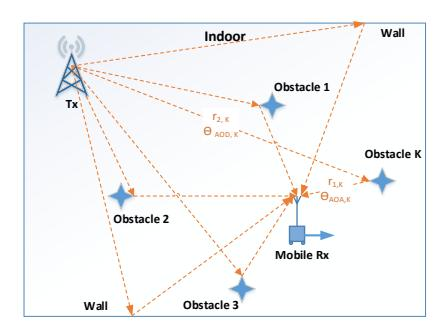
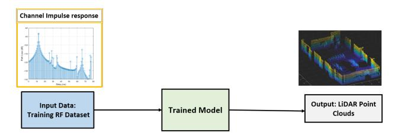
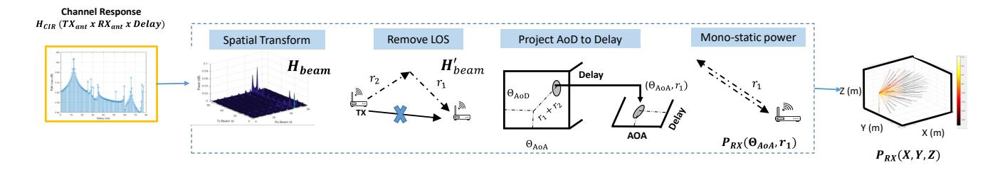
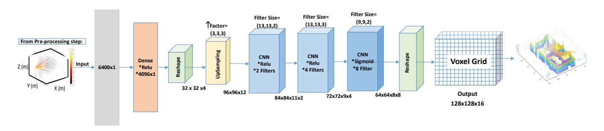
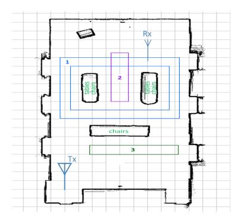
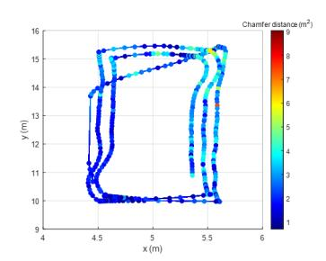
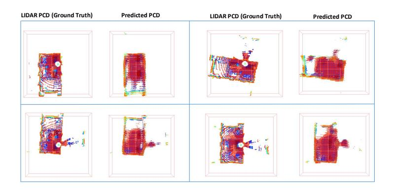
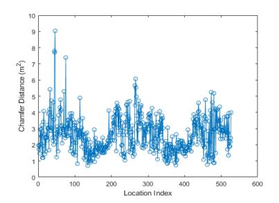
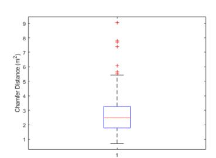

{0}------------------------------------------------

# RF2LiDAR: Enabling Digital Twin Using MIMO RF Signals

Shubham Khunteta†, Yeswanth Reddy Guddeti†, Ashok Kumar Reddy Chavva, *Senior Member, IEEE*, Avani Agrawal †: Authors have equal contribution.

Beyond-5G Team, Samsung R&D Institute-Bangalore, India Email: {sk.khunteta, guddeti.r, ashok.chavva, av.agrawal}@samsung.com

Abstract—Digital twin creates a digital representation of the physical world, which enables immersive technologies such as augmented reality (AR), virtual reality (VR), and holographic communication. In this paper, we take a significant step towards enabling digital twin at scale & low-cost by estimating depth map of the environment using existing communication infrastructure. Traditionally, camera or LiDAR (light detection and ranging) have been used for estimating the 3-D depth map. The proposed method RF2LiDAR is first of its kind algorithm that generates LiDAR-like high resolution representation of the environment from ambient communication signals. We first perform preprocessing on the multiple-input-multiple-output (MIMO) radiofrequency (RF) signal and then input the processed data to a deep learning model to target the LiDAR point cloud data. RF2LiDAR is able to generate LiDAR-like depth map of room of size  $19m \times 10m \times 2m$  with 0.25m granularity from MIMO data. Further, we show that the predicted point clouds have an average Chamfer distance of 1.5m $^2$  and they capture the change in perception across various testing locations without any prior information of location and orientation of the receiver.

Index Terms—AI, depth map, digital twin, DL, ISAC, sensors, millimeter-wave, ML, RADAR, RF, sensing, SLAM.

#### I. Introduction

Digital twin i.e digital representation of a physical product, system, or process form a core component of immersive technologies like AR, VR. Apart from applications in user experience enhancement, digital twin can be leveraged as a testing tool for various commercial use-cases. In telecommunications, with the increasing complexity in deployment and distribution of services through 5G/6G networks, the notion of digital twin [1] has gained relevance and is being considered as an emulator, a validation, and optimization tool across the layers. A real 5G network [2] can be mimicked by creating an integrated digital twin which emulates radio channels, base-stations, front-haul, core network, network slices, devices, traffic, impairments, and security threats.

A digital twin emulating physical layer of a communication channel needs an accurate and comprehensive 3-D model of the physical environment to visualize and predict how the signals propagate in the environment. This 3-D model or depth map is paramount to successful deployment of the next generation technologies because a digital twin, which is built on a 3-D model of the environment can accurately identify coverage areas and dead-zones in the deployment. Other applications include beam selection, testing cellular vehicle-to-

everything (C-V2X) connectivity virtually reducing the number of physical miles driven. Traditionally a combination of light detection and ranging (LiDAR), camera, RGB-D (Depth), IMU (Inertial measurement unit), and stereo sensors have been used in literature to estimate depth map of the environment. But within the scope of this work, we use the term 3D-depth map estimate interchangeably with LiDAR point cloud data (PCD).

To make digital twin technology common place, it is critical to realize it at scale and within the constraints posed by hardware i.e compute capability, power consumption, cost, form-factor etc. Given the ubiquitous deployment of wireless devices in smart environments and advances in mobile computing, there has been a renewed interest in utilizing traditional communication infrastructure for sensing the physical world. Integrated sensing and communication (ISAC) framework involves measuring distortions suffered by the communication signal in terms of time, frequency, and amplitude while it travels through the said environment.

Reusing wireless signals to estimate 3D depth map presents us with three challenges. *First*, creating a digital twin implies sensing a whole room with hundreds of objects. Therefore, we can no longer rely only on the handcrafted features for inferences as done in traditional wireless sensing applications. *Second*, the RF data has lesser resolution than the LiDAR data in terms of range and angle. This is because LiDAR is at higher frequency and guided by laser beam, while RF sensing is limited by sampling rate and number of antennas. *Third*, the input RF data has the transmission & reception at physically separate locations also known as bi static mode whereas LiDAR sends and receives laser signals from the same location also known as mono-static mode.

Some of recent works using wireless signals for 3D applications include Radarhd [3], Xu et al. [4], Shubham et al. [5], Deepsense [6]. Radarhd uses signals received from a dedicated radar chip to generate LiDAR point clouds. Deepsense on the other hand uses multi-modal data i.e RGB cameras, LiDAR, Radars, GPS etc., to enable sensing aided beam & blockage prediction. In [4], a convolutional neural network based learning method is used to project radar measurements into depth maps with LiDAR target data. In [5], an AI based hierarchical classifier is used to discriminate micro-Doppler signatures of 11 indoor activities.

{1}------------------------------------------------

Fig. 1. Indoor scenario with Tx and Rx operating at an mmWave frequency. mmWave rays are originated from the Tx at an angle of ΘAoD,K and hit the obstacle K after traveling a distance of r2,K. These rays travel a distance of r1,K from the obstacle and are received at Rx at an angle of ΘAoA,K.

Fig. 2. Estimation of LiDAR-like depth map at each receiver position using only mmWave MIMO CIR based on AI/ML model.

In this paper, we propose RF2LiDAR, a novel and first of its kind method which estimates depth map using RF signals from a 2-D multiple-input-multiple-output (MIMO) antenna array that are traditionally used for mmWave communication. Across 530 testing locations, we observe an average Chamfer distance of 2m2 . Qualitatively, we observe that RF2LiDAR captures the change in perception of the environment at different locations even in absence of information about location and orientation. The contribution of our work are as follows

- A pre-processing routine that transforms communication signals into similar format as targeted LiDAR data reducing the complexity of DL architecture.
- A DL architecture that generates LiDAR-like high resolution point clouds from ∼ 40 times lower dimensional communication signals
- A field study proving the feasibility of using ISAC framework for commercial applications involving digital twin by generating depth map of a 19x10x2 m conference room at 100's of unseen testing locations using communication signals,

The remainder of this paper is organized as follows: section II describes the system model and section III provides details of the proposed algorithm. Section IV evaluates performance of the algorithm, followed by the conclusion in section V.

# II. SYSTEM MODEL

As shown in Fig. 1, we have an indoor scenario where we have an mmWave transmitter (Tx) at a fixed location, which is transmitting 60GHz Wi-Fi signal (IEEE 802.11ay) and a receiver (Rx), which is moving very slowly and receiving the signal with sampling frequency of 1.76GHz. The Tx has a rectangular antenna array (2-D phased array) of total size NTx = 64(8 × 8). Similarly, the Rx has a rectangular antenna array of total size NRx = 64. The transmitted Wi-Fi signal reflects against various obstacles in the environment arriving at Rx with different delays. Let us assume, there is an obstacle K in the environment as shown in the Fig. 1. The Wi-Fi signal, which is transmitted from Tx at an angle ΘAoD,K, hit the obstacle K after traveling a distance r2,K and the reflected signal travel a distance r1,K and is received at Rx at an angle ΘAoA,K. Here, AoA represents the angle of arrival at Rx and the AoD represents the angle of departure from Tx.

In this paper, we use the MIMO channel impulse response (CIR) at the Rx (HNRx×NTx×Ndelay ) for estimating the depth map of the environment i.e. we use the CIR to obtain the information of the distance r1,K and the directions ΘAoA,K, where the obstacles are present. Here Ndelay is the number of delay taps. We obtain the power map of the surrounding with respect to various points representing distances and directions. Further, we use the power map as an input to the proposed DL model to obtain the depth map of the indoor environment.

In other words, we train a DL model that takes MIMO CIR as input and targets corresponding LiDAR point cloud as the output as shown in Fig. 2. Note that we only use the CIR as input and the location & orientation of the Tx and Rx are unknown. Observation of the room i.e. depth map at Rx changes with receiver location & orientation.

## III. RF2LIDAR: DEPTH MAP ESTIMATION ALGORITHM

## *A. Pre-processing of RF data*

We pre-process the data before sending it to the DL model targeting LiDAR PCD. The input RF data is in bistatic mode i.e. the Tx and the Rx are at physically separate locations whereas LiDAR sends and receives laser signals from the same location also known as mono-static mode. So at each Rx location, we transform the bi-static RF data into mono-static format and train the DL model by fitting it to similarly structured LiDAR ground truth. This makes DL model learning faster and explainable. The pre-processing step handles the deterministic aspects of transforming MIMO CIR which is in bi-static format to mono-static format. Pre-processing steps to transform the bi-static RF data into mono-static format, are shown in Fig. 3 and described as follows:

Spatial Transform: The available CIR at Rx (HNRx×NTx×Ndelay ) represents the channel w.r.t. delay observed by each Rx-Tx antenna pair. We perform spatial transform on the CIR w.r.t. each delay and convert the antenna pair dimension to the AoA-AoD pair. Input of the spatial transform function is 64 × 64 channel matrix (HNRx×NTx ) with each value corresponding to a Rx-Tx antenna pair and the output is 64 × 64 channel matrix (Hbeam) with each value mapped to an AoA – AoD beam pair as shown in (1) and in Fig. 3.

{2}------------------------------------------------

Fig. 3. Pre-processing of raw inputs i.e. transforming the bi-static CIR into mono-static format. Pre-processing steps are: 1. Spatial transform, 2. Remove LOS component, 3. Removing effect of Tx, and 4. Scaling the power.

As we are using 2D phased array, each beam angle  $\Theta$  has azimuth and elevation components ( $\theta$  and  $\phi$  respectively).

$$H_{\text{beam},i} = U_r' H_{N_{\text{Rx}} \times N_{\text{Tx}},i} U_t, \forall i \in \{1 \cdots N_{\text{delay}}\}, \quad (1)$$

where  $U_r = \text{kron}(u_{r,H}, u_{r,V})$  is a  $64 \times 64$  matrix with each row containing antenna weight vectors for each of the 64 AoA beams. Here,  $u_{r,H}$  and  $u_{r,V}$  are horizontal and vertical DFT vectors respectively for generating the beams in 2-D. Similarly,  $U_t$  is obtained for AoD beams.

Find Line of Sight (LOS): We have converted the antenna pair dimension of the channel into beam pair dimension in the previous step. We assume there is a LOS path present and we find this LOS path and remove its effect in the channel. We perform this step because the LOS path does not contain any information of the obstacles as this path was directly received at the Rx from the Tx without any reflections. Since the LOS path usually has the highest power, lower delay, and the tighter beamwidth, the index of highest peak in  $H_{\text{beam}}$  is treated as LOS path. We identify the LOS path channel tap (delay), Tx and Rx beam corresponding to the LOS path index. We modify the  $H_{\text{beam} \times N_{\text{delay}}}$  by making the component corresponding to the LOS path null as shown in Fig. 3.

Remove effect of TX: Next, we remove the effect of Tx in the  $H_{\mathrm{beam} \times N_{\mathrm{delay}}}$  to get power map from Rx perspective. The signal departs from Tx travels  $r_2$  distance hit an obstacle (as shown in Fig. 1) and then travels  $r_1$  distance before arriving at Rx. It travels distance  $r_1+r_2$  from Tx. The delay in the channel corresponds to  $r_1+r_2$ . In order to the estimate the mono-static perspective, we need to transform the  $H_{\mathrm{beam} \times N_{\mathrm{delay}}}$  into  $P_{\Theta_{\mathrm{AoA}} \times N_{\mathrm{delay}}}^{Rx}$ . The delay in the  $P_{\Theta_{\mathrm{AoA}} \times N_{\mathrm{delay}}}^{Rx}$  corresponds to the mono-static delay where signal is perceived to be traveled from Rx and received at Rx i.e. it has traveled a distance of  $2r_1$ . In order to transform the  $H_{\mathrm{beam} \times N_{\mathrm{delay}}}$  into  $P_{\Theta_{\mathrm{AoA}} \times N_{\mathrm{delay}}}^{Rx}$ , we calculate the ratio  $\frac{r_2}{r_2}$ .

We obtain  $r_2/r_1$  by applying sine theorem on the triangle formed by the reflecting path and the LOS path as shown in the Fig. 3, as follows:

$$\frac{r_{2}}{r_{1}} = \frac{\sin(\Theta_{\text{AoA}} - \Theta_{(\text{AoA,LOS})})}{\sin(\Theta_{\text{AoD}} - \Theta_{(\text{AoD,LOS})})}.$$

$$\cos(\Theta - \Theta') = \sin\theta \sin\theta' \cos(\phi - \phi') + \cos\theta \cos\theta'.$$
(2)

We obtain the power  $P_{\Theta_{AOA} \times N_{delay}}^{Rx}$  of the reflections from Rx perspective by projecting the entries of  $H_{\mathrm{beam} \times N_{\mathrm{delay}}}$  along AoD axis with the help of ratio  $\frac{r_2}{r_1}$  as shown in the Fig. 3. The obtained matrix  $P_{\Theta_{AOA} \times N_{\mathrm{delay}}}^{Rx}$  gives a mono-static view of reflections from Rx.

**Mono-static power (MSP):** At last step of pre-processing, we scale the power of reflections in  $P_{\Theta_{AoA} \times N_{delay}}^{Rx}$  by multiplying with the factor  $(r_1/r_2)^2$  to convert bi-static path (signal originated from Tx and reaching to Rx via obstacle K) power to mono-static path (signal originated from Rx and reaching to Rx via obstacle K) power.

## B. Proposed DL model

Input and output data: so far, we pre-processed the MIMO CIR and obtained the MSP of reflections at receiver from the  $N_{\rm Rx}=64$  AoA directions. Based on the analysis on the ground truth LiDAR dataset used for the experimental purpose, we observed that the Rx moves across the room (indoor surrounding) in such a way that the distance from the wall remains lower than the 16m. Sampling frequency 1.76GHz of the RF system results in the range resolution of 17cm, so we limit the delay dimension of  $P_{\Theta_{AoA} \times N_{delay}}^{Rx}$  to 100 points for each AoA direction. LiDAR provides PCD which contains the coordinates of the reflecting points or obstacles. We convert LiDAR PCD to a voxel grid. We assume a voxel grid with bounding box with minimum bound as [-16m, -16m, -2m] and maximum bound as [16m, 16m, 2m]. Here, length and width of the indoor scenario is assumed as 16m from center of the room and the height is considered as 2m and this assumption is influenced by the generated experimental dataset. We divide the surrounding environment into various voxels with voxel size 0.25m in each axis. With voxel size as 0.25m, the dimension of voxel grid, which is to be predicted by the DL model, comes out to be  $128 \times 128 \times 16$ , while the dimension of the input data  $P_{\Theta_{\text{AoA}} \times N_{\text{delay}}}^{Rx}$  is  $64 \times 100$ , where there are 100 delay points in each of the 64 AoA directions. Each voxel in the voxel grid represents the 3-D volume of (0.25m, 0.25m, 0.25m). In order to prepare the ground truth voxel grid from the LiDAR PCD, we mark the voxels in the voxel grid with value 1 which contain at-least one LiDAR point and rest of the voxels are marked as having value 0. For the DL model training, input

{3}------------------------------------------------

Fig. 4. DL model architecture for depth map estimation. Input is MSP, which is  $P_{\Theta_{AOA} \times N_{delay}}^{Rx}$ , where the number of directions are 64 and the number of delay taps are 100. So, the Input layer size is  $6400 \times 1$ . A dense layer of 4096 neurons is applied, followed by reshape layer, which converts the size to  $32 \times 32 \times 4$ , followed by Upsampling layer with a upsample factor (3,3,3). We apply 2 CNN layers with ReLu activation function as shown, followed by another CNN layer with sigmoid activation function which results in the output size of  $64 \times 64 \times 8 \times 8$ . We reshape this output to fit the voxel grid size which is  $128 \times 128 \times 16$ . And at last, we convert back the voxel grid into predicted PCD.

and output data is given for multiple locations across the room.

**DL Model:** as shown in the Fig. 4, MSP  $P_{\Theta_{AoA} \times N_{delay}}^{Rx}$  is fed to dense layer, followed by upsampling layer. We need upsampling layer because the pre-processed RF data (MSP) has lower resolution, limited by the system bandwidth & provide fewer reflections whereas LiDAR has both higher resolution & provide larger points of reflections. We then apply the CNN layers in order to predict the voxel grid and further, the PCD. Correlation in reflections only exists in close neighborhood, that is why we use CNN layers. For hidden layers, we use rectified linear unit (ReLu) as the activation function. For output layer, we use sigmoid as the activation function. Details regarding the DL model and the hidden layers are given in the Fig. 4.

#### IV. PERFORMANCE EVALUATION

## A. Measurement setup

As shown in Fig. 5, a Tx is fixed in the corner of the room, while the Rx moves very slowly along the three paths marked as 1, 2, and 3 with blue, purple, and green color respectively in a conference room. While in motion along the three paths, the receiver collects RF data (CIR) and LiDAR data. Thanks to the measurement setup from NIST [7], we have been provided with data from multiple locations along the three paths in the conference room. The measurement platform from NIST has switched array 60 GHz channel sounder [7] with TX mounted on a tripod and the untethered RX on a mobile robot. Rx features a circular array of 16 horn antennas providing omni-directional field of view (FoV), while Tx is replica of receiver with only 8 elements restricting it's field of view to 180°. The azimuth and elevation of the AoD and AoA were validated with a mean error of 2.1°. The channel measurements from  $8 \times 16$  MIMO array are used to track the multipath components [8]. These multi-path components (MPCs) are then transformed into channel impulse response of a  $64 \times 64$  MIMO system with  $8 \times 8$  2-D antenna array on both transmitter and receiver.

#### B. DL model Training

For training the DL model, we use the data collected along the path 1 and 3. For testing, we use the data collected along the path 2 in Fig. 5. We train the DL model with 3400 samples captured across path 1 and 3. Testing data consists of 529 samples corresponding to the different locations along the path 2 in Fig. 5. For each sample, the input to the DL model is preprocessed CIR i.e. MSP at receiver from the 64 AoA directions for 100 delay points in each directions and the output voxel grid is of the size  $128 \times 128 \times 16$  i.e. 2,62,144 voxels. Therefore output to DL model is  $\sim 40$  (2,62,144/6400) times larger than the input.

We train the model using adaptive moment optimizer (ADAM) with decaying learning rate at the rate of 0.9 every 10000 steps. The initial learning rate is kept as 0.0005.

As shown in Fig. 6, the proposed DL model returns LiDAR-like high resolution point clouds. The red bounding box depicts the room boundary corresponding to the voxel-grid. It is also observed that the change in perception across location and orientation is nicely captured in the predicted PCD even though the Tx and Rx locations are unknown.

#### C. Error analysis

For evaluating the RF2LiDAR, we have used Chamfer distance as a quantitative metric, which measures the distance between two point clouds and returns how close the two point cloud are. We measure the Chamfer distance between the predicted PCD and the ground truth LiDAR PCD. Chamfer distance formula is given as follows:

$$d_{CD}(S_1, S_2) = \frac{1}{|S_1|} \sum_{x \in S_1} \min_{y \in S_2} ||x - y||_2^2 + \dots$$

$$\dots \frac{1}{|S_2|} \sum_{y \in S_2} \min_{x \in S_1} ||x - y||_2^2,$$
(3)

where  $d_{CD}(S_1, S_2)$  denotes the Chamfer distance between two point clouds  $S_1$  and  $S_2$ .

As shown in Fig. 7, we observe that the Chamfer distance between the ground truth LiDAR PCD and the predicted PCD

{4}------------------------------------------------

Fig. 5. Experimental setup: A conference room with fixed Tx and Rx moving slowly and capturing data samples along the path 1, 2, and 3.

Fig. 7. Error analysis: Color plot of Chamfer distance between Lidar PCD and the predicted PCD along the testing data locations (The locations of the testing data (path 2) is shown in Fig. 5).

Fig. 6. Ground truth LiDAR PCD and the predicted PCD. The red bounding box depicts the room boundary. We here show the comparison for 4 samples.

Fig. 8. Chamfer distance between Lidar PCD and the predicted PCD Vs testing data location index (path 2 data samples).

Fig. 9. Box plot of the Chamfer distance between Ground truth Lidar PCD and the predicted PCD for the testing data (path 2 data samples).

remains low for almost all the testing locations (purple colored path or path-2 in Fig. 5). Distribution of the Chamfer distance across testing data locations (purple colored path or path-2 in Fig. 5) is shown in the Fig. 8 and the corresponding box plot is shown in Fig. 9. We observe that the average Chamfer distance is 2m2 across testing samples for the room size of 19m × 10m × 2m. We also observe that the average Chamfer distance is 1m2 for the samples which are near to the Tx.

## V. CONCLUSION

In this paper, we proposed a two-step method RF2LiDAR, which estimates the depth map using the MIMO RF channel. RF2LiDAR first performs pre-processing to convert the RF data into LiDAR like mono-static signal and then uses the pre-processed data as input to the DL model to target LiDAR PCD. We observed that RF2LiDAR is able to generate LiDARlike depth map of room of size 19m × 10m × 2m with 0.25m granularity from MIMO data. Also, change in perception of room across locations is nicely captured in the predictions. RF2LiDAR is the winner solution of the ITU AI/ML in 5G challenge, 2022 edition.

## VI. ACKNOWLEDGMENT

We thank the International Telecommunication Union (ITU) AI/ML in 5G challenge team and NIST, USA for providing the dataset. The problem statement was one of the open challenge of ITU AI/ML in 5G challenge, 2022. The proposed solution was ranked 1 st for this challenge.

# REFERENCES

- [1] A. Masaracchia, V. Sharma, B. Canberk, O. A. Dobre and T. Q. Duong, "Digital Twin for 6G: Taxonomy, Research Challenges, and the Road Ahead," *IEEE Open J. Commun. Soc*, vol. 3, pp. 2137-2150, 2022.
- [2] Spirent Communications, "Simplifying 5G with the Network Digital Twin," white paper, 2019.
- [3] A. Prabhakara et al., "Exploring mmWave Radar and Camera Fusion for High-Resolution and Long-Range Depth Imaging," 2022 IEEE/RSJ International Conference on Intelligent Robots and Systems (IROS), Kyoto, Japan, 2022, pp. 3995-4002, doi: 10.1109/IROS47612.2022.9982080.
- [4] R. Xu, W. Dong, A. Sharma and M. Kaess, "Learned Depth Estimation of 3D Imaging Radar for Indoor Mapping," 2022 IEEE/RSJ International Conference on Intelligent Robots and Systems (IROS), Kyoto, Japan, 2022, pp. 13260-13267, doi: 10.1109/IROS47612.2022.9981572.
- [5] S. Khunteta, P. Saikrishna, A. Agrawal, A. Kumar and A. K. R. Chavva, "RF-Sensing: A New Way to Observe Surroundings," in IEEE Access, vol. 10, pp. 129653-129665, 2022, doi: 10.1109/ACCESS.2022.3228639.
- [6] S. Jiang, G. Charan and A. Alkhateeb, "LiDAR Aided Future Beam Prediction in Real-World Millimeter Wave V2I Communications," in IEEE Wireless Communications Letters, vol. 12, no. 2, pp. 212-216, Feb. 2023, doi: 10.1109/LWC.2022.3219409.
- [7] C. Gentile et al., "Millimeter-Wave Channel Measurement and Modeling: A NIST Perspective," in IEEE Communications Magazine, vol. 56, no. 12, pp. 30-37, December 2018, doi: 10.1109/MCOM.2018.1800222.
- [8] C. Lai, R. Sun, C. Gentile, P. B. Papazian, J. Wang and J. Senic, "Methodology for Multipath-Component Tracking in Millimeter-Wave Channel Modeling," in IEEE Transactions on Antennas and Propagation, vol. 67, no. 3, pp. 1826-1836, March 2019, doi: 10.1109/TAP.2018.2888686.