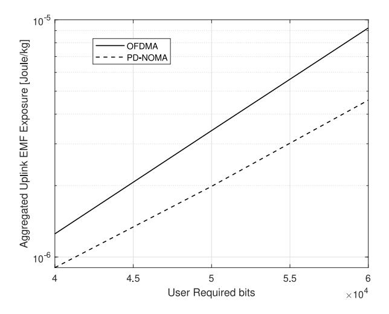
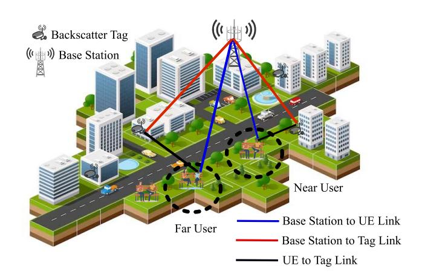
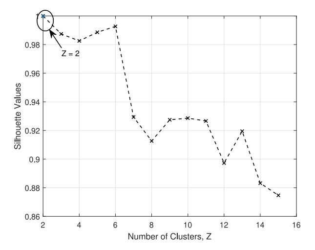
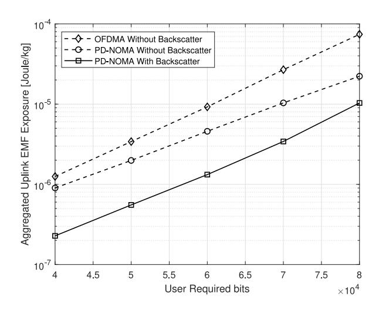
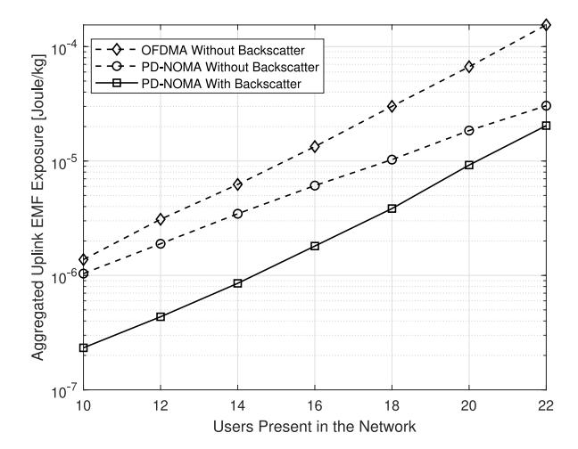
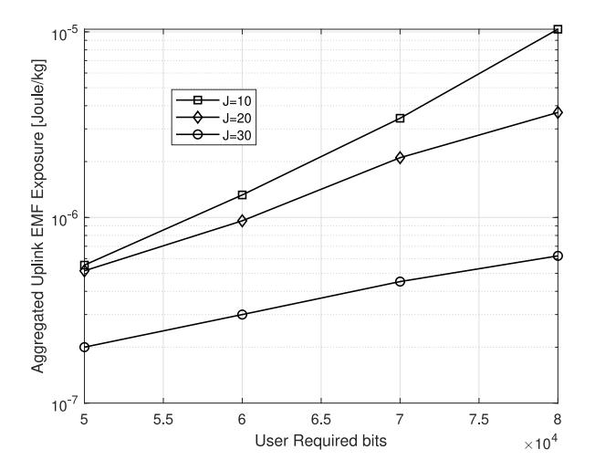
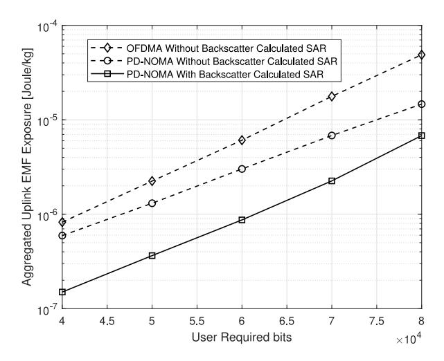

{0}------------------------------------------------

# Electromagnetic Field Exposure-Aware AI Framework for Integrated Sensing and Communications-Enabled Ambient Backscatter Wireless Networks

Muhammad Ali Jamshed<sup>®</sup>, *Senior Member, IEEE*, Yazdan Ahmad Qadri<sup>®</sup>, Ali Nauman<sup>®</sup>, and Haejoon Jung<sup>®</sup>, *Senior Member, IEEE* 

Abstract—An exponential increase in the volume of connected user proximity wireless devices (UPWDs) is spearheading a hyper-connected ecosystem, which may enable smart cities, industries, and connected healthcare. However, this increase in the number of connected UPWDs results in significant amplification in electromagnetic field (EMF) exposure among users and consequently may result in potential physiological effects. Integrated sensing and communication (ISAC)-enabled ambient backscatter communication (ABC) is a promising technology that can power low-energy sensors and facilitate communication between data sources and sinks by reusing the available resources. The power-domain nonorthogonal multiple access (PD-NOMA) has the potential to provide channel resources to an increasing number of users simultaneously while adhering to the Quality-of-Service (QoS) requirements. However, empowering PD-NOMA with machine learning (ML) can mitigate challenges in massive channel access. This work uses a k-medoid and Silhouette analysis for subcarrier allocation and optimizes power allocation to the users with optimization techniques using PD-NOMA in an ABCenabled cellular network. The proposed system demonstrates a significant capability to reduce the aggregated uplink EMF exposure using robust and low-complexity ML techniques. The simulations show a superior performance compared to the stateof-the-art methods.

Manuscript received 27 March 2024; accepted 15 April 2024. Date of publication 26 April 2024; date of current version 6 September 2024. This work was supported in part by the Korea Government (Ministry of Science and ICT); in part the Institute of Information & communications Technology Planning & Evaluation (IITP) under Grant RS-2024-00397480; and in part by the under the National Research Foundation of Korea under Grant RS-2023-00303757. This article was presented in part at the IEEE VTC 2022-Spring, Helsinki, Finland, in June 2022 [DOI: 10.1109/VTC2022-Spring54318.2022.9860409]. (Muhammad Ali Jamshed and Ali Nauman contributed equally to this work.) (Corresponding author: Haejoon Jung.)

Muhammad Ali Jamshed is with the College of Science and Engineering, University of Glasgow, G12 8QQ Glasgow, U.K. (e-mail: muhammadali.jamshed@glasgow.ac.uk).

Yazdan Ahmad Qadri and Ali Nauman are with the School of Computer Science and Engineering, Yeungnam University, Gyeongsan 38541, Republic of Korea (e-mail: yazdan@yu.ac.kr; anauman@ynu.ac.kr).

Haejoon Jung is with the Department of Electronics and Information Convergence Engineering, Kyung Hee University, Yongin 17104, Republic of Korea (e-mail: haejoonjung@khu.ac.kr).

Digital Object Identifier 10.1109/JIOT.2024.3394041

Index Terms—Ambient backscatter communication (ABC), electromagnetic field (EMF) exposure, integrated sensing and communication (ISAC), nonorthogonal multiple access (NOMA), sixth-generation cellular communication (6G), unsupervised learning.

### <span id="page-0-6"></span><span id="page-0-5"></span><span id="page-0-4"></span><span id="page-0-3"></span><span id="page-0-0"></span>I. INTRODUCTION

<span id="page-0-2"></span><span id="page-0-1"></span>HE RAPID adoption of Internet of Things (IoT) has transformed the interaction of the physical world with the digital dimension [1], [2]. As wireless communication technologies are evolving to support more devices per unit area, the volume of user proximity wireless devices (UPWDs) in consumer and industrial space has increased exponentially. The capability of the fifth-generation cellular communication (5G) cellular networks to support at least a million devices per square kilometer with 99% of packets delivered within 10 ms [3] has led to an estimated compound annual growth rate (CAGR) of 74.95% in its market value between 2021 and 2030 [4]. Massive machine-type communication (mMTC) devices contribute significantly to this estimate. Moreover, wireless fidelity (WiFi) devices are expected to reach 1.96 Billion units in the next five years [5]. Therefore, an inevitable increase in the electromagnetic field (EMF) exposure is likely to impact human health and the environment. The literature does not point to a concrete link between EMF exposure and short-term impacts on human health [6]. However, excessive exposure to EMF on human health and the environment in the long-term has been found to have some effects [7]. Moreover, the International Agency for Research on Cancer (IARC) and World Health Organization (WHO) have identified the EMF radiation from UPWDs as carcinogenic to humans [8]. Therefore, the UPWDs should comply with the regulations devised by the International Commission on Nonionizing Radiation Protection (ICNIRP) and Federal Communication Commission (FCC) [9]. The exposure to the EMF is defined by the specific absorption rate (SAR) (usually for frequencies less than 10 GHz) which is the rate at which the energy is absorbed by the body tissue when exposed to the EMF radiation in the radio frequency (RF) band. However, the FCC [10] states that the maximum SAR value should not exceed 1.6 W/kg for 1 g

<span id="page-0-8"></span><span id="page-0-7"></span>2327-4662 © 2024 IEEE. Personal use is permitted, but republication/redistribution requires IEEE permission. See https://www.ieee.org/publications/rights/index.html for more information.

{1}------------------------------------------------

<span id="page-1-0"></span>of human tissue [\[11\]](#page-7-4). For the international level, the maximum SAR is specified at 2 W/kg for 10 g of human tissue.

Nonorthogonal multiple access (NOMA) is a promising resource allocation methodology for ultradense networks in the beyond 5G (B5G) and sixth-generation cellular communication (6G) while complying with Quality-of-Service (QoS) requirements. In theory, NOMA can effectively provide a high spectral efficiency while supporting massive deployments in B5G and 6G networks. Its support for ultra reliable lowlatency communications (URLLCs) applications especially in the context of 6G is explored in [\[12\]](#page-7-5). NOMA can be summarily described as the polar opposite of orthogonal multiple access (OMA), which entails that the different users are not separated in time or spectral domain instead multiple users are allocated the same time and spectral resources. NOMA comes in two flavors code-domain NOMA (CD-NOMA) and power domain NOMA (PD-NOMA) [\[13\]](#page-7-6). This work considers the latter approach of using PD-NOMA in which the users or the UPWDs are allocated the same resource block, however, they are multiplexed based on the transmission power. The transmission power is determined by the channel conditions experienced by the individual UPWDs. The signals are superimposed at the transmitter and the receivers decode the received signal using successive interference cancellation (SIC) [\[14\]](#page-7-7). Designing an effective SIC is a major challenge in the general adoption of NOMA. Therefore, an optimum SIC can enable and fulfill the performance requirements in terms of transmission reliability within an upper limit on transmission delay for a large number of devices in a network.

<span id="page-1-3"></span>The enhanced mobile broadband (eMBB) ushered in the age of ultrahigh definition streaming and augmented/virtual reality (AR/VR) in 5G. The goals for 6G further increase the performance expectations in a wide domain of innovative applications. Integrated sensing and communication (ISAC) is leading a paradigm shift in enabling high throughput applications while enhancing spectral efficiency and minimizing hardware cost and complexity [\[15\]](#page-7-8), [\[16\]](#page-7-9). Though ISAC has been in use for decades, a renewed interest in ISAC research is supporting the development of new use cases in B5G and 6G. As millimeter and terahertz bands are incorporated into the latest wireless communication standards, sensing and communication functions can be deployed together realizing the above-mentioned aims. These applications increase the data rate requirements, which in turn increases the power consumption. Therefore, this surge in power directly triggers a significant increase in the EMF absorbed by UPWDs users. A simple and elegant solution for reducing the EMF exposure is found in the use of ambient backscatter communications (ABCs) [\[1\]](#page-6-0). ABC works by reflecting the RF signals which are modulated by the reflecting devices known as the backscatter tags. Therefore, effectively reusing the already existing wireless transmissions between the sender and the receiver. Backscatter tags can harvest the energy from the incoming RF signals and modulate the carriers, maximizing the energy efficiency of UPWDs [\[17\]](#page-7-10).

<span id="page-1-6"></span>An interplay between ISAC-enabled ABC and NOMA can significantly reduce the EMF exposure. Galappaththige et al. [\[16\]](#page-7-9) combined ABC and ISAC to enable low-power <span id="page-1-8"></span><span id="page-1-7"></span><span id="page-1-1"></span>IoT networks while improving spectral efficiency. Authors propose a cooperative system where the backscatter tags reflect the information between the users and base station (BS) while adding sensing information on the same waveforms. Massive multiple-input–multiple-output (MIMO) and reconfigurable intelligent surfaces (RISs) are being explored as a means to mitigate the impact of excessive exposure to EMF radiation [\[18\]](#page-7-11), [\[19\]](#page-7-12). The directionality of the signals in the MIMO and RIS can reduce the exposure for non-UPWD users in a network. However, a limited volume of published literature covers the solutions for reducing the EMF exposure during uplink transmissions. Jamshed et al. [\[1\]](#page-6-0) introduced a PD-NOMA-based resource allocation methodology which aims at reducing EMF exposure leveraging ABC. This work provides a deeper insight into the framework presented in [\[1\]](#page-6-0). To the best of the authors' knowledge, no prior work employs ABC and PD-NOMA to reduce user exposure in uplink transmissions. The proposed method demonstrates a reduction of the EMF exposure by a significant proportion compared to the comparable EMF techniques. Moreover, ABC is found to have potential advantages in improving the channel gain. The proposed framework introduces *k*-medoids to cluster the available UPWDs into groups with the optimum number of clusters found using Silhouette analysis. The contributions of this study are summarized as follows.

- <span id="page-1-2"></span>1) An optimization problem aimed at reducing the overall EMF exposure is formulated in a PD-NOMA-based cellular network compliant with the QoS requirements. The proposed system considers ABC differentiating this work from the state-of-the-art solutions.
- <span id="page-1-9"></span>2) *k*-medoids is utilized to cluster the UPWDs during resource allocation. *k*-medoids have low complexity, are highly robust, and require lower convergence time compared to *k*-means clustering [\[20\]](#page-7-13). The number of users per subcarrier is found using Silhouette analysis. The UPWDs in a cluster are allocated a subcarrier, while an EMF-aware power allocation strategy is adopted.
- <span id="page-1-5"></span><span id="page-1-4"></span>3) Monte Carlo simulations are performed to validate the performance of the proposed ABC-based PD-NOMA framework. The performance of the proposed method is compared to a non-ABC-based PD-NOMA EMF minimization framework and a non-ABC-based orthogonal frequency-division multiple access (OFDMA) EMF minimization framework. In comparison to the relevant non-ABC-based PD-NOMA scheme the proposed methodology, significantly reduces the EMF exposure by at least 75%.

The remainder of this article is organized as follows. Section [II](#page-2-0) provides a background on the problem statement. Section [III](#page-2-1) introduces the system model and presents the mathematical representation of key concepts and metrics followed by the problem formulation. An EMF-aware resource and power allocation framework is proposed in Section [IV.](#page-3-0) The analysis of the performance and its comparison with the state of the art is presented in Section [V.](#page-5-0) Finally, Section [VI](#page-6-6) concluded our discussion.

{2}------------------------------------------------



<span id="page-2-0"></span>Fig. 1. Comparison between aggregated uplink EMF exposure without ABC in using different multiple access techniques.

### <span id="page-2-2"></span>II. BACKGROUND AND RELATED WORK

ABC is a promising wireless communication technology for low-power telemetry especially for wireless sensor networks (WSNs) and healthcare applications. Though backscatter communication has been in use since World War II [21], ABC has gained rapid adoption in recent years. The key difference between the traditional backscatter and ABC lies in the source of carrier signals. Traditionally, the backscatter tag reflects the modulated carrier wave generated by the reader or receiver while in the ABC, the reader does not generate the carrier RF signal instead it reflects the RF carriers from ambient sources. ABC has found its application in novel applications like energy harvesting for low-power sensing devices that utilize absorbed energy from the RF radiation to power their operation.

<span id="page-2-5"></span>When it comes to reducing the uplink EMF exposure, UPWDs manufacturers mostly focus on the designing aspect and have introduced novel materials and design choices to reduce the SAR in consumer electronics enabled with wireless connectivity [9]. Shielding materials are also used in some biomedical equipment that emit EMF radiations [9]. Moreover, mutual coupling and phase offset between  $2\times2$ MIMO antenna elements have shown to effectively reduce the EMF exposure [22]. The use of multiplexing strategies, such as OMA and NOMA, are also shown to be very effective in reducing/optimizing the uplink EMF exposure. As opposed to the OMA, NOMA does not limit the number of users that are allocated a subcarrier for transmission. Theoretically, all the UPWDs can be served at a given instant. In comparison, the NOMA have shown to be much more effective than OMA in reducing the uplink EMF exposure. The comparison between OFDMA technique of [23] and PD-NOMA technique of [24] is presented in Fig. 1 in terms of aggregated uplink EMF exposure to the users. PD-NOMA displays a lower level of EMF exposure compared to the OFDMA owing to its greater spectral efficiency.

### <span id="page-2-6"></span>III. SYSTEM MODEL

<span id="page-2-1"></span>Assume a cellular network consisting of a single cell of a radius R containing N single-antenna UPWDs which



Fig. 2. Illustration of the system model.

<span id="page-2-4"></span><span id="page-2-3"></span>communicate with the BS. A PD-NOMA and ABC-based wireless communication scenario is assumed and is represented in Fig. 2, where b backscatter tags are assumed to enable the communication between the UPWDs and the BS (a single BS is assumed) within the cell. Assuming that S subcarriers of bandwidth W such that W = W/|S|, where W is the total system bandwidth that can be assigned to the UPWDs. As NOMA can allocate the same subcarrier to more than one UPWD,  $N_{s,j}$  users are assigned the subcarrier S at a given time slot S given that S is a packscatter tag S can receive an RF signal over a subcarrier S which it can modulate independently and reflect toward the BS. Let S is expressed as

$$y_{s,j} = \sum_{n=1}^{N_{s,j}} \left( \sqrt{p_{n,s,j}} g_{n,s,j} x_{n,s,j} + \sqrt{p_{n,s,j}} \xi_b g_{b,s,j}^n g_{n,s,j}^b z_{n,s,j} x_{n,s,j} \right) + \omega_{s,j}$$
(1)

where  $p_{n,s,j}$  denotes the transmit power of the *n*th UPWD,  $g_{n,s,j}$  denotes the channel gain between the BS and *n*th UPWD, and  $x_{n,s,j}$  is the information signal from the nth UPWD at time slot j on the subcarrier s. We also consider a reflected signal from a backscatter tag to carry information from the bth tag.  $\xi_b$  represents the reflection coefficient of backscatter tag b,  $g_{b,s,j}^n$  denotes the channel gain between nth UPWD and backscatter b over a subcarrier s at the jth time slot. The symbol  $g_{n,s,i}^b$  symbolizes the channel gain between the BS and the backscatter tag b during slot j. The received signal also consists of  $\omega_{s,j}$  which is a zero mean and variance  $\sigma^2$  additive white Gaussian noise (AWGN), at the *i*th time slot on subcarrier s. PD-NOMA multiplexes information from multiple users on a single subcarrier which inevitably leads to interference. For a given user multiplexed on a subcarrier, the total interference experienced is represented as

<span id="page-2-7"></span>
$$\bar{I}_{n,s,j} = \sum_{l=1,l\neq n}^{N_{s,j}} p_{l,s,j} \Big( g_{l,s,j} + \xi_b g_{b,s,j}^l g_{l,s,j}^b \Big). \tag{2}$$

{3}------------------------------------------------

The multiplexed information received from different users needs to be decoded. This is achieved by implementing a SIC on the received signal. At the receiver end for the uplink transmissions, the UPWDs that have the best channel gain are decoded first, followed by farther UPWDs or the users with the worst channel gain [25]. The SIC can decode the signal from a user n on subcarrier s successfully if the ratio of the received signal to residual interference of the user at time slot s satisfies the following condition:

<span id="page-3-5"></span>
$$p_{n,s,j} \left( g_{n,s,j} + \xi_b g_{b,s,j}^n g_{n,s,j}^b \right) / I_{n,s,j} \ge \zeta$$
 (3)

where the reference threshold  $\zeta > 1$ , and

<span id="page-3-3"></span>
$$I_{n,s,j} = \sum_{l=\pi^{-1}(n)+1}^{N_{s,j}} p_{\pi(l),s,j} \Big( g_{\pi(l),s,j} + \xi_b g_{b,s,j}^{\pi(l)} g_{\pi(l),s,j}^b \Big). \tag{4}$$

We can obtain the total number of transmitted bits by a user n for a duration  $\tau$  within the time slot j over subcarrier s using Shannon's formula as

<span id="page-3-2"></span>
$$c_{n,s,j(\boldsymbol{\alpha},\boldsymbol{p})} = w\tau\alpha_{n,s,j}\log_2\left(1 + \frac{p_{n,s,j}\left(g_{n,s,j} + \xi_b g_{b,s,j}^n g_{n,s,j}^b\right)}{\sigma^2 + I_{n,s,j}}\right)$$
(5

where w is the subcarrier bandwidth and  $\alpha_{n,s,j}$  denotes the subcarrier allocation index.

Using the definitions in [26], the EMF level during the uplink of a single user n can be expressed as

<span id="page-3-6"></span><span id="page-3-4"></span>
$$E_n(\boldsymbol{\alpha}, \boldsymbol{p}) = \frac{\text{SAR}_n}{J \times P^{\text{ref}}} \tau \times \left( \hat{p}_n(J) + \sum_{i=1}^J \sum_{s=1}^S \alpha_{n,s,j} p_{n,s,j} \right)$$
(6)

here,  $P^{\text{ref}}$  is reference incident power used to estimate SAR, J is the total number of time slots, and  $\hat{p}_n(J)$  is the signaling power. The SAR value is the function of tissue composition and strength of the EMF expressed as [9]

$$SAR = \frac{\sigma \times E^2}{m_d} (W/kg) \tag{7}$$

where  $\sigma$  denotes conductivity of the exposed tissues, E is the strength of the electrical field, and  $m_d$  represents mass density of the observed sample.

### A. Problem Formulation

This work is aimed at reducing the EMF during uplink transmission. We consider communication between UPWDs and BS assisted by ABC and PD-NOMA. We formulate an optimization problem to minimize the absorbed EMF. The objective function denoting the total EMF absorbed by the users is expressed as

<span id="page-3-1"></span>
$$\min_{\boldsymbol{p},\boldsymbol{\alpha}} E(\boldsymbol{\alpha},\boldsymbol{p}) = \sum_{n=1}^{N} E_n(\boldsymbol{\alpha},\boldsymbol{p})$$

constrained by the following conditions:

$$C^{1}: \sum_{i=1}^{J} \sum_{s=1}^{S} c_{n,s,j}(\boldsymbol{\alpha}, \boldsymbol{p}) = C_{n} \,\forall n$$

$$C^{2}: \sum_{s=1}^{S} \alpha_{n,s,j} p_{n,s,j} \leq P_{n}^{\max} \quad \forall n \, \forall j$$

$$C^{3}: \alpha_{n,s,j} \left( p_{n,s,j} (g_{n,s,j} + \xi_{b} g_{b,s,j}^{n} g_{n,s,j}^{b}) / I_{n,s,j} \right) \geq \zeta \quad \forall n \, \forall s \, \forall j$$

$$C^{4}: \sum_{n=1}^{N} \alpha_{n,s,j} \leq N_{s,j} \quad \forall s \, \forall j$$

$$C^{5}: 0 < \xi_{b} < 1 \quad \forall b$$

$$(8)$$

where  $E(\alpha, \mathbf{p})$  denotes total EMF absorbed by the *U* users during *J* time slots. Constraints  $C^1 - C^5$  represent the conditions to be met.

- 1) Constraint  $C^1$  relates to ensuring that each user meets the OoS requirements.
- 2) Constraint  $C^2$  ensures that each user complies with the maximum power limit  $P_n^{\text{max}}$ .
- 3) Constraint  $C^3$  denotes the condition for successful decoding at the receiver using SIC.
- 4) Constraint  $C^4$  limits the maximum number of users on a single subcarrier. Finally,
- <span id="page-3-7"></span>5) Constraint  $C^5$  sets a limit for the reflections from the backscatter tags.

<span id="page-3-8"></span>Constraint  $C^1$  is nonaffine and  $\alpha_{n,s,j}$  is binary rendering this problem nonconvex [27]. To solve this optimization problem efficiently, we need to convert this nonconvex problem to a convex problem. A standard relaxation procedure is employed to overcome the binary nature of the allocation index. The work in [28] adopts a sequential subcarrier and a power allocation approach that searches for an  $\alpha$  for a given power value p, and then looks for a p value at a given  $\alpha$ . This strategy is employed with a fixed  $\alpha$  value in the optimization function and the constraints, thereby overcoming the nonaffinity of the constraint  $C^1$ . Thus, the problem can be solved as a convex problem. Furthermore, it is assumed that the uplink pilot signals from the users over J time slots can be exploited to obtain the channel state information (CSI).

### IV. PROPOSED SOLUTION

<span id="page-3-0"></span>A two-step solution is proposed involving an intelligent subcarrier assignment procedure which is followed by a power allocation strategy. A subcarrier is assigned to an optimum number of users such that the interference between the users is minimized using a machine learning (ML) strategy. The power allocation over PD-NOMA ensures that the receiver can decode the information for the users efficiently while meeting the OoS requirements.

### A. Intelligent Subcarrier Allocation

PD-NOMA assigns the same subcarrier to different users differentiating them using their channel condition and allocates different power levels based on that channel information. The efficiency and accuracy of the decoding process at the receiver are based on its capability to differentiate between the different power levels and optimality of the subcarrier allocation. This work proposes ML-based subcarrier allocation methodology using a clustering approach which is found to outperform heuristic methods and have a lower complexity and convergence time [20].

{4}------------------------------------------------



<span id="page-4-0"></span>Fig. 3. Silhouette score for varying number of clusters, where the Silhouette score is equal to 1, indicating 2 as the optimal number of clusters.

<span id="page-4-4"></span>A k-medoids-based clustering approach is employed to group  $N_{s,i}$  users, allocated to a subcarrier s during time slot j. It is found that k-medoids are far more effective in clustering data points with lower time complexity and are more robust, compared to using k-means [29]. However, to determine the number of clusters efficiently, Silhouette analysis is used. Silhouette analysis indicates the distances between the clusters and can therefore assist in determining an optimal number of k-clusters without any training on a data set. Compared to the elbow method used in [24], the Silhouette method is more robust and accurate. Silhouette analysis computes Silhouette coefficients which indicate the distances of a sample from the different clusters. These coefficients range between [-1, 1], with 1 being far from other clusters and -1 pointing to the wrong grouping of a sample. Therefore, the number of optimal clusters can be found when the average Silhouette coefficient of samples in all the clusters known as the Silhouette score is near 1. This can be visualized in Fig. 3 which calculates the Silhouette values of the Silhouette score for varying Z values denoting the number of clusters. The scores are found for 100 users being multiplexed to a single subcarrier during a time slot. The trend shows the variation in the Silhouette scores for different Z values with the Silhouette score being equal to 1 at Z=2. Therefore, the number of optimum clusters is 2. A Rayleigh fading channel and path loss model defined in [30] is used in this evaluation.

### B. Power Allocation

A power assignment procedure follows a subcarrier allocation step, where the transmission power level is assigned to each user multiplexed over a subcarrier *s*, minimizing the EMF exposure for the users. The optimization problem defined in (8) is used to allocate power levels to the users allocated to a subcarrier within its constraints. As stated earlier, the nonconvex nature of the optimization problem creates a major challenge in solving the optimization problem. Therefore, this challenge is mitigated by modifying (5) as follows:

<span id="page-4-3"></span>
$$p_{n,s,j} = \frac{(2^{r_{n,s,j}} - 1)(\sigma^2 + I_{n,s,j})}{g_{n,s,j} + \xi_b g_{b,s,j}^n g_{n,s,j}^b}$$
(9)

thereby, the new optimization problem is as follows:

<span id="page-4-1"></span>
$$\min_{r} \frac{\tau}{J} \sum_{n=1}^{N} \left( \hat{p}_{n}(J) + \sum_{j=1}^{J} \sum_{s=1}^{S} \frac{\alpha_{n,s,j} (2^{r_{n,s,j}} - 1) (\sigma^{2} + I_{n,s,j})}{\left( g_{n,s,j} + \xi_{b} g_{b,s,j}^{n} g_{n,s,j}^{b} \right)} \right)$$

constrained by the following:

$$(C^{6}): w\tau \sum_{j=1}^{J} \sum_{s=1}^{S} \alpha_{n,s,j} r_{n,s,j} = C_{n}$$

$$(C^{7}): \sum_{s=1}^{S} \frac{\alpha_{n,s,j} (2^{r_{n,s,j}} - 1) (\sigma^{2} + I_{n,s,j})}{\left(g_{n,s,j} + \xi_{b} g_{b,s,j}^{n} g_{n,s,j}^{b}\right)} \leq P_{n}^{\max}$$

$$(C^{8}): \alpha_{n,s,j} \left( (2^{r_{n,s,j}} - 1) (\sigma^{2} + I_{n,s,j}) / I_{n,s,j} \right) \geq \zeta$$

$$(10)$$

where

$$r_{n,s,i} = c_{n,s,i}/(w\tau)$$

defines the spectral efficiency of a user n. Compared to  $C^1$  which considers the capacity of the network,  $C^6$  is an affine function of the spectral efficiency, which makes (10) a convex optimization problem. The Lagrangian of the updated convex problem is defined as follows:

<span id="page-4-2"></span>
$$\mathcal{L}(r_{n,j}, \lambda_{n}, \mu_{n,j}, \delta_{n,s,j}) = \frac{\tau}{J} \sum_{n=1}^{N} \left( \bar{p}_{n} + \sum_{j=1}^{J} \sum_{s=1}^{S} \frac{\alpha_{n,s,j} (2^{r_{n,s,j}} - 1) (\sigma^{2} + I_{n,s,j})}{g_{n,s,j} + \xi_{b} g_{b,s,j}^{n} g_{n,s,j}^{b}} \right) + \lambda_{u} \left( C_{n} - w\tau \sum_{j=1}^{J} \sum_{s=1}^{S} \alpha_{n,s,j} r_{n,s,j} \right) + \mu_{n,j} \left( P_{n}^{\max} \left( g_{n,s,j} + \xi_{b} g_{b,s,j}^{n} g_{n,s,j}^{b} \right) - \sum_{s=1}^{S} \alpha_{n,s,j} (2^{r_{n,s,j}} - 1) (\sigma^{2} + I_{n,s,j}) \right) + \delta_{n,s,j} \alpha_{n,s,j} \left( \zeta - (2^{r_{n,s,j}} - 1) (\sigma^{2} + I_{n,s,j}) / I_{n,s,j} \right) \tag{11}$$

where  $\lambda_n$ ,  $\mu_{n,j}$ , and  $\delta_{n,s,j}$  are the associated Lagrange multipliers of the constraints  $(C^6)$ – $(C^8)$ . Considering that the Karush–Kuhn–Tucker (KKT) conditions are satisfied, (11) is solved for  $\nabla \mathcal{L}(r_{n,j}, \lambda_n, \mu_{n,j}, \delta_{n,s,j}) = 0$  to obtain

<span id="page-4-5"></span>
$$r_{n,s,j} = \max\left(0, \log_2 \chi + \log_2 \left(\frac{w(g_{n,s,j} + \xi_b g_{b,s,j}^n g_{n,s,j}^b)}{\ln(2)(\sigma^2 + I_{n,s,j})}\right)\right)$$
(12)

where  $\chi$  is expressed as

$$\chi = \frac{\lambda_n^{\star}}{\left(1/J - (\mu_{n,j}^{\star} + \delta_{n,s,j}^{\star}(g_{n,s,j} + \xi_b g_{b,s,j}^n g_{n,s,j}^b)/I_{n,s,j})/\tau\right)}.$$
(13)

The power can be allocated to the different users using the water-filling algorithm, considering the channel gain and interference for the different users in a cluster. The proposed subcarrier and power allocation mechanism is outlined in Algorithm 1.

{5}------------------------------------------------

# **Algorithm 1:** ABC-Enhanced PD-NOMA-Based ML-Backed EMF Optimization Framework

```
1: INPUT: (N, J, S, g_{n,s,j}, g_{b,s,j}^n, g_{n,s,j}^b, \alpha, \zeta, SAR_n, P_n^{\max}, C_n,
    \tau, \hat{p}_n(J), \sigma^2, w, \xi_b, b)
 2: Step 1: ML-Based Clustering
 3: for Z = 2 : N - 1 do
        Utilize K-medoids to group users in Z groups
        \mathbf{g}_{s,i} = [g_{1,s,i}, ..., g_{N,s,i}];
 5:
        Use Silhouette analysis to compute N_{s,j} = Z;
 6: end for
 7: Step 2: Sub-carrier Allocation
 8: Use G_{n,s,j} = g_{n,s,j}/\hat{g}_n \ \forall n, s, j, where \hat{g}_n is the mean channel
 9: Obtain \max(G_{.,n,j}) within each cluster for each user.
10: Assign K^{th} K = \frac{S \times J}{N} subcarrier to a user.
11: Step 3: Power-Level Allocation
12: Set p_{n,s,j}=P_n^{\max}/K to determine initial value of interference;
14:
        for n = 1 : N do
15:
           Estimate r_{n,s,j} utilizing an iterative water-filling while
           complying with the SIC interference constraint;
16:
           Compute p_{n,s,j} using (9)
17:
           Re-evaluate I_{n,s,j} using (4);
18:
           Estimate E_n utilizing (6);
19:
        end for
20: until converges
21: Compute E value using optimization problem (8);
22: OUTPUT E;
```

<span id="page-5-1"></span>TABLE I
PARAMETERS USED IN THE SIMULATION FOR
PERFORMANCE EVALUATION

<span id="page-5-2"></span>

| Notation         | Parameter                                       | Value                  |
|------------------|-------------------------------------------------|------------------------|
| R                | Cell radius                                     | 500 meters             |
| $P_{max}$        | Maximum transmit power                          | 0.2W                   |
| $P^{\text{ref}}$ | Reference incident power                        | 1 W                    |
| τ                | Time-slot duration                              | 1 ms                   |
| J                | Total number of time slots                      | 10                     |
| W                | Total system bandwidth                          | 10 MHz                 |
| $\sigma^2$       | Noise variance                                  | -174 dBm/Hz            |
| $SAR_n$          | SAR level of a user n                           | 1 W/Kg                 |
| ξ                | Reflection coefficient                          | 1                      |
| ζ                | Signal to residual interference ratio threshold | 1                      |
| S                | Number of sub-carriers                          | 128                    |
| N                | Number of UPWDs                                 | 15                     |
| K                | Maximum allowable Sub-carriers                  | $\frac{S \times J}{N}$ |
| $SAR_c$          | Cheek position SAR                              | 0.658545 W/Kg          |

### V. PERFORMANCE EVALUATION

<span id="page-5-0"></span>The performance of the ABC-enhanced PD-NOMA-based EMF optimization framework is evaluated employing MATLAB simulations. Considering a radius of R=500 m for the coverage area of the BS in which N users are placed randomly. Rayleigh fading and the path loss model defined in [30] have been used to mimic the channel between each source and sink. Each cluster is assumed to have only one backscatter tag b to facilitate the wireless transmissions between BS and the users. The SAR $_n$  and  $p^{\text{ref}}$  values are assumed to be constants conforming to the FCC limits. All users are assumed to have an equal number of bits. The various simulation parameters are assigned the values as listed in Table I.



<span id="page-5-3"></span>Fig. 4. Aggregated uplink EMF exposure at a varying number of required bits (kb/s).



<span id="page-5-4"></span>Fig. 5. Aggregated uplink EMF exposure at a varying number of users.

In Fig. 4, a comparison between the proposed method with [23] and [24] when varying the required target number of bits while maintaining a constant number of subcarriers S = 128, the number of users is fixed to N = 15 and the number of time slots is fixed to J = 10. An increase in the aggregate EMF exposure is observed with an increase in the number of required transmitted bits. This trend is due to an increased power requirement for transmitting more information. In general, the PD-NOMA displays a lower level of EMF exposure compared to the OFDMA-based transmission presented in [23] owing to its greater spectral efficiency. However, when comparing the performance of OFDMA and ML-based PD-NOMA described in [24] to the proposed ABCenabled PD-NOMA, it is observed that there is a significant reduction in EMF exposure, especially at lower number of required bits. There is an 82% and 75% reduction in the aggregated uplink EMF exposure at C = 40 kb/s for J = 10time slots when using the proposed scheme compared to [23] and [24], respectively, as illustrated in Fig. 4.

The comparison between the proposed method with [23] and [24] when varying the number of users while maintaining a constant number of subcarriers S = 128 and  $C_n = 60$  kb/s for

{6}------------------------------------------------



<span id="page-6-7"></span>Fig. 6. Aggregated uplink EMF at different number of time slots in the proposed PD-NOMA and ABC-based ML-enabled framework.

*J* = 10 time slots is presented in Fig. [5.](#page-5-4) The aggregated EMF exposure increases with an increasing number of users. The growth in EMF exposure becomes evident with a higher user count, as each user demands increased transmit power to attain the same bit count. This occurs while maintaining fixed values for the allocated subcarriers and the size of the transmission window. However, there is a significant improvement in the performance of the proposed method compared to [\[23\]](#page-7-16) and [\[24\]](#page-7-17), which is achieved due to the addition of ABC-based tags that provide additional channels between the users and the BS by accurately reflecting the RF signals. Moreover, there is a significant reduction in PD-NOMA-based transmissions compared to the OFDMA-based scheme. However, between the PD-NOMA-based methods, the proposed scheme reduces the aggregated EMF exposure by at least 33% due to the inclusion of ABC.

To further validate the working of the proposed integrated PD-NOMA and ABC-based ML-enabled framework, in Fig. [6,](#page-6-7) we have studied the performance by increasing the required target number of bits for different fixed values of time slots, i.e., *J* = 10, 20, and 30, respectively. It is observed that there is a significant reduction in the EMF exposure when the transmission is spread over a longer time duration while maintaining a fixed *Cn* value. Therefore, the overall EMF exposure is reduced over time even when *Cn* increases.

Similar to [\[24\]](#page-7-17), in Fig. [7,](#page-6-8) we have studied the effect of varying the target number of bits on aggregated uplink EMF exposure for a fixed number of users and fixed number of time slots, by using the experimentally calculated SAR values. The value of SAR used in Fig. [7](#page-6-8) is SAR*<sup>c</sup>* = 0.658545 W/kg, which is equal to experimentally calculated SAR value for cheek position as in [\[24\]](#page-7-17) by using IEEE/IEC 62704-1 averaging method. Evidently, from Fig. [7,](#page-6-8) the aggregated EMF is lower with ABC compared to the non-ABC-enabled OFDMA and PD-NOMA. This validates the superiority of the methodology used in the proposed scheme.

# VI. CONCLUSION

<span id="page-6-6"></span>The impact of long-term exposure to EMF radiations is found to be detrimental to human health. Therefore, reducing



<span id="page-6-8"></span>Fig. 7. Aggregated uplink EMF exposure at a varying number of required bits (kb/s) for experimentally calculated SAR values.

exposure to these EMF radiations is a significant challenge when the number of connected devices is increasing significantly. This work proposes a two-step resource allocation scheme aimed at reducing the EMF exposure in ISAC-enabled ABC-assisted cellular networks. The proposed scheme uses *k*-medoids and Silhouette analysis to allocate subcarriers to clusters of UPWDs. The users in a cluster are assigned a transmission power to reduce the overall uplink EMF exposure while ensuring QoS compliance. The proposed framework can reduce the aggregated uplink EMF exposure by at least 75%, in comparison to non-ABC PD-NOMA and OFDMA counterparts. Therefore, the proposed system demonstrates a significant potential, especially for wirelessly connected lowpower IoT networks.

## REFERENCES

- <span id="page-6-0"></span>[\[1\]](#page-0-0) M. A. Jamshed, W. U. Khan, H. Pervaiz, M. A. Imran, and M. Ur-Rehman, "Emission-aware resource optimization framework for backscatter-enabled uplink NOMA networks," in *Proc. IEEE 95th Veh. Technol. Conf. (VTC-Spring)*, 2022, pp. 1–5.
- <span id="page-6-1"></span>[\[2\]](#page-0-0) M. A. Jamshed, K. Ali, Q. H. Abbasi, M. A. Imran, and M. Ur-Rehman, "Challenges, applications, and future of wireless sensors in Internet of Things: A review," *IEEE Sensors J.*, vol. 22, no. 6, pp. 5482–5494, Mar. 2022.
- <span id="page-6-2"></span>[\[3\]](#page-0-1) O. Liberg, M. Sundberg, Y.-P. E. Wang, J. Bergman, J. Sachs, and G. Wikström, "Chapter 16—Choice of IoT technology," in ¨ *Cellular Internet of Things*, 2nd ed., O. Liberg, M. Sundberg, Y. P. E. Wang, J. Bergman, J. Sachs, and G. Wikström, Eds. London, U.K.: Academic, ¨ 2020, pp. 687–707. [Online]. Available: https://www.sciencedirect.com/ science/article/pii/B9780081029022000169
- <span id="page-6-3"></span>[\[4\]](#page-0-2) "Devices Market: Information for Form Factor (Modules, CPE (Indoor/Outdoor), Smartphones, Hotspots, Laptops), Spectrum Support (Sub-6 GHz, mmWave), and Region—Forecast till 2030." 2021. [Online]. Available: https://straitsresearch.com/report/5g-devicesmarket/segmentation
- <span id="page-6-4"></span>[\[5\]](#page-0-3) "Public Wi-Fi Market Size & Share Analysis—Growth Trends & Forecasts (2024–2029)." Nov. 2023. [Online]. Available: https://www.mordorintelligence.com/industry-reports/public-wi-fimarket
- <span id="page-6-5"></span>[\[6\]](#page-0-4) Z. Vecsei, B. Knakker, P. Juhász, G. Thuróczy, A. Trunk, and I. Hernádi, "Short-term radiofrequency exposure from new generation mobile phones reduces EEG alpha power with no effects on cognitive performance," *Sci. Rep.*, vol. 8, no. 1, 2018, Art. no. 18010.

{7}------------------------------------------------

- <span id="page-7-0"></span>[\[7\]](#page-0-5) P. Ben Ishai, D. Davis, H. Taylor, and L. Birnbaum, "Problems in evaluating the health impacts of radio frequency radiation," *Environ. Res.*, vol. 243, Feb. 2024, Art. no. 115038. [Online]. Available: https://www.sciencedirect.com/science/article/pii/S0013935122023659
- <span id="page-7-1"></span>[\[8\]](#page-0-6) The International Agency for Research on Cancer, *IARC Classifies Radiofrequency Electromagnetic Fields as Possibly Carcinogenic to Humans*, Press Release no. 208, World Health Org., Geneva, Switzerland, 2011.
- <span id="page-7-2"></span>[\[9\]](#page-0-7) M. A. Jamshed, F. Hèliot, and T. W. C. Brown, "A survey on electromagnetic risk assessment and evaluation mechanism for future wireless communication systems," *IEEE J. Electromagn., RF Microw. Med. Biol.*, vol. 4, no. 1, pp. 24–36, Mar. 2020.
- <span id="page-7-3"></span>[\[10\]](#page-0-8) (Federal Commun. Comm., Washington, DC, USA). *Specific Absorption Rate (SAR) for Cell Phones: What It Means for You*. (2014). [Online]. Available: https://www.fcc.gov/consumers/guides/specific-absorptionrate-sar-cell-phones-what-it-means-you
- <span id="page-7-4"></span>[\[11\]](#page-1-0) "Evaluating compliance with FCC guidelines for human exposure to radio frequency electromagnetic fields," OET Bulletin 65, Edition 97-01, Federal Commun. Comm., Washington, DC, USA, pp. 1–53, 1997.
- <span id="page-7-5"></span>[\[12\]](#page-1-1) R. Kotaba, C. N. Manchón, T. Balercia, and P. Popovski, "How URLLC can benefit from NOMA-based retransmissions," *IEEE Trans. Wireless Commun.*, vol. 20, no. 3, pp. 1684–1699, Mar. 2021.
- <span id="page-7-6"></span>[\[13\]](#page-1-2) L. Dai, B. Wang, Z. Ding, Z. Wang, S. Chen, and L. Hanzo, "A survey of non-orthogonal multiple access for 5G," *IEEE Commun. Surveys Tuts.*, vol. 20, no. 3, pp. 2294–2323, 3rd Quart., 2018.
- <span id="page-7-7"></span>[\[14\]](#page-1-3) W. U. Khan, F. Jameel, M. A. Jamshed, H. Pervaiz, S. Khan, and J. Liu, "Efficient power allocation for NOMA-enabled IoT networks in 6G era," *Phys. Commun.*, vol. 39, Apr. 2020, Art. no. 101043.
- <span id="page-7-8"></span>[\[15\]](#page-1-4) J. Wang, N. Varshney, C. Gentile, S. Blandino, J. Chuang, and N. Golmie, "Integrated sensing and communication: Enabling techniques, applications, tools and data sets, standardization, and future directions," *IEEE Internet Things J.*, vol. 9, no. 23, pp. 23416–23440, Dec. 2022.
- <span id="page-7-9"></span>[\[16\]](#page-1-5) D. Galappaththige, C. Tellambura, and A. Maaref, "Integrated sensing and backscatter communication," *IEEE Wireless Commun. Lett.*, vol. 12, no. 12, pp. 2043–2047, Dec. 2023.
- <span id="page-7-10"></span>[\[17\]](#page-1-6) W. U. Khan, M. A. Jamshed, E. Lagunas, S. Chatzinotas, X. Li, and B. Ottersten, "Energy efficiency optimization for backscatter enhanced NOMA cooperative V2X communications under imperfect CSI," *IEEE Trans. Intell. Transp. Syst.*, vol. 24, no. 11, pp. 12961–12972, Nov. 2023.
- <span id="page-7-11"></span>[\[18\]](#page-1-7) A. Hirata et al., "Assessment of human exposure to electromagnetic fields: Review and future directions," *IEEE Trans. Electromagn. Compat.*, vol. 63, no. 5, pp. 1619–1630, Oct. 2021.
- <span id="page-7-12"></span>[\[19\]](#page-1-8) D.-T. Phan-Huy, Y. Bénédic, S. H. Gonzalez, and P. Ratajczak, "Creating and operating areas with reduced electromagnetic field exposure thanks to reconfigurable intelligent surfaces," in *Proc. IEEE 23rd Int. Workshop Signal Process. Adv. Wireless Commun. (SPAWC)*, 2022, pp. 1–5.
- <span id="page-7-13"></span>[\[20\]](#page-1-9) T. Velmurugan and T. Santhanam, "Computational complexity between K-means and K-medoids clustering algorithms for normal and uniform distributions of data points," *J. Comput. Sci.*, vol. 6, no. 3, p. 363, 2010.
- <span id="page-7-14"></span>[\[21\]](#page-2-4) G. Wang, F. Gao, R. Fan, and C. Tellambura, "Ambient backscatter communication systems: Detection and performance analysis," *IEEE Trans. Commun.*, vol. 64, no. 11, pp. 4836–4846, Nov. 2016.
- <span id="page-7-15"></span>[\[22\]](#page-2-5) M. A. Jamshed, T. W. C. Brown, and F. Héliot, "Dual antenna coupling manipulation for low SAR smartphone terminals in talk position," *IEEE Trans. Antennas Propag.*, vol. 70, no. 6, pp. 4299–4306, Jun. 2022.
- <span id="page-7-16"></span>[\[23\]](#page-2-6) Y. A. Sambo, M. Al-Imari, F. Héliot, and M. A. Imran, "Electromagnetic emission-aware schedulers for the uplink of OFDM wireless communication systems," *IEEE Trans. Veh. Technol.*, vol. 66, no. 2, pp. 1313–1323, Feb. 2017.
- <span id="page-7-17"></span>[\[24\]](#page-2-7) M. A. Jamshed, F. Heliot, and T. Brown, "Unsupervised learning based emission-aware uplink resource allocation scheme for non-orthogonal multiple access systems," *IEEE Trans. Veh. Technol.*, vol. 70, no. 8, pp. 7681–7691, Aug. 2021.
- <span id="page-7-18"></span>[\[25\]](#page-3-5) G. D. Golden, C. Foschini, R. A. Valenzuela, and P. W. Wolniansky, "Detection algorithm and initial laboratory results using V-BLAST space-time communication architecture," *Electron. Lett.*, vol. 35, no. 1, pp. 14–16, 1999.
- <span id="page-7-19"></span>[\[26\]](#page-3-6) E. Conil, "D2.4 Global wireless exposure metric definition V1," LexNet Project, 2013.
- <span id="page-7-20"></span>[\[27\]](#page-3-7) Z.-Q. Luo and W. Yu, "An introduction to convex optimization for communications and signal processing," *IEEE J. Sel. Areas Commun.*, vol. 24, no. 8, pp. 1426–1438, Aug. 2006.
- <span id="page-7-21"></span>[\[28\]](#page-3-8) M. Al-Imari, P. Xiao, M. A. Imran, and R. Tafazolli, "Low complexity subcarrier and power allocation algorithm for uplink OFDMA systems," *EURASIP J. Wireless Commun. Netw.*, vol. 98,

- no. 1, pp. 1–6, 2013.[Online]. Available: https://jwcn-eurasipjournals. springeropen.com/articles/10.1186/1687-1499-2013-98#citeas
- <span id="page-7-22"></span>[\[29\]](#page-4-4) P. Arora, D. Deepali, and S. Varshney, "Analysis of K-means and K-Medoids algorithm for big data," *Procedia Comput. Sci.*, vol. 78, pp. 507–512, Apr. 2016. [Online]. Available: https://www.sciencedirect.com/science/article/pii/S1877050916000971
- <span id="page-7-23"></span>[\[30\]](#page-4-5) J. Wu, S. Rangan, and H. Zhang, *Green Communications: Theoretical Fundamentals, Algorithms, and Applications*. Boca Raton, FL, USA: CRC Press, 2016.


**Muhammad Ali Jamshed** (Senior Member, IEEE) received the Ph.D. degree in electronics engineering from the 5G/6G Innovation Centre, University of Surrey, Guildford, U.K., in 2021.

He has been with the University of Glasgow, Glasgow, U.K., since 2021. He is a Visiting Research Fellow with the University of Sussex, Brighton, U.K.

Dr. Jamshed is endorsed by the Royal Academy of Engineering under the exceptional talent category and was nominated for Departmental Prize for

Excellence in Research in 2019 at the University of Surrey. He is a Fellow of the Royal Society of Arts and a Founding Member of the IEEE Workshop on Sustainable and Intelligent Green Internet of Things.


**Yazdan Ahmad Qadri** received the Ph.D. degree in information and communication from the Department of Information and Communication Engineering, Yeungnam University, Gyeongsan, Republic of Korea, in 2023.

He was a Postdoctoral Research Associate with Kyung Hee University, Seoul, Republic of Korea, from 2023 to 2024. He is currently an Assistant Professor with the Department of Computer Science, Yeungnam University. His research work involves enabling connected healthcare using wire-

less networks and artificial intelligence.


**Ali Nauman** received the M.Sc. degree in wireless communications from the Institute of Space Technology, Islamabad, Pakistan, in 2016, and the Ph.D. degree in information and communication engineering from Yeungnam University, Gyeongsan, Republic of Korea, in 2022.

He is currently working as an Assistant Professor with the Department of Computer Science, Yeungnam University. He has contributed to five patents and authored/coauthored five book chapters and more than 75 technical articles in leading

journals and peer-reviewed conferences.

Dr. Nauman has also edited two books and serves as an editor and a reviewer of highly reputed journals and conferences.


**Haejoon Jung** (Senior Member, IEEE) received the B.S. degree (Hons.) in electrical engineering from Yonsei University, Seoul, South Korea, in 2008, and the M.S. and Ph.D. degrees in electrical engineering from Georgia Institute of Technology (Georgia Tech), Atlanta, GA, USA, in 2010 and 2014, respectively.

From 2014 to 2016, he was a Wireless Systems Engineer with Apple, Cupertino, CA, USA. From 2016 to 2021, he was with Incheon National University, Incheon, South Korea. Since September

2021, he has been with the Department of Electronic Engineering, Kyung Hee University, Yongin, Republic of Korea, as an Associate Professor. His research interests include communication theory, wireless communications, wireless power transfer, and statistical signal processing.

Dr. Jung was a recipient of the Haedong Young Scholar Award from the Korean Institute of Communications and Information Sciences. He serves as an Associate Editor for IEEE TRANSACTIONS ON VEHICULAR TECHNOLOGY, IEEE TRANSACTIONS ON AEROSPACE AND ELECTRONIC SYSTEMS, IEEE COMMUNICATIONS LETTERS, IEEE WIRELESS COMMUNICATIONS LETTERS, and *ICT Express*.