{0}------------------------------------------------

# **Intelligent Surfaces Empowered Wireless Network: Recent Advances and the Road to 6G**

*This article offers a comprehensive review of intelligent surfaces (ISs) and their transformative potential in future wireless networks, particularly in the context of 6G.*

By QINGQING W[U](https://orcid.org/0000-0002-0043-3266) , *Senior Member IEEE*, BEIXI[ONG](https://orcid.org/0000-0002-7587-8876) ZHEN[G](https://orcid.org/0000-0002-2374-9263) , *Senior Member IEEE*, CHANGSHENG YO[U](https://orcid.org/0000-0003-3245-9361) , *Member IEEE*, LIPENG ZHU , *Member IEEE*, KAIMING SHEN [,](https://orcid.org/0000-0003-0680-7975) *Senior Member IEEE*, XIAODAN SHAO [,](https://orcid.org/0000-0003-3249-8045) *Member IEEE*, WEIDONG MEI [,](https://orcid.org/0000-0002-8113-4283) *[Me](https://orcid.org/0000-0001-5566-2392)mber IEEE*, BOYA D[I](https://orcid.org/0000-0003-3484-1361) , *Memb[er I](https://orcid.org/0000-0001-8644-8241)EEE*, HONGLIANG ZHAN[G](https://orcid.org/0000-0003-3393-8612) , *M[emb](https://orcid.org/0000-0003-0772-8793)er IEEE*, ERTUGRUL BASAR , *Fellow IEEE*, LINGYANG SONG , *Fellow IEEE*, MARCO DI RENZO , *Fellow IEEE*, ZHI-QUAN LUO [,](https://orcid.org/0000-0003-3995-914x) *Fellow IEEE*, AND RUI ZHAN[G](https://orcid.org/0000-0002-8729-8393) , *Fellow IEEE*

Manuscript received 2 January 2024; revised 20 March 2024; accepted 8 April 2024. Date of publication 11 June 2024; date of current version 30 October 2024. The work of Qingqing Wu was supported in part by the National Key Research and Development Program of China under Grant 2023YFB2905000 and in part by the National Science Foundation of China under Grant 62371289 and Grant 62331022. The work of Beixiong Zheng was supported in part by the National Natural Science Foundation of China under Grant 62201214 and Grant 62331022, in part by the Natural Science Foundation of Guangdong Province under Grant 2023A1515011753, and in part by the Fundamental Research Funds for the Central Universities under Grant 2023ZYGXZR106. The work of Boya Di, Hongliang Zhang, and Lingyang Song was supported in part by the National Science Foundation of China under Grant 62371011, Grant 62322101, Grant 62271012, and Grant 62227809; and in part by Beijing Natural Science Foundation under Grant L212027 and Grant 4222005. The work of Ertugrul Basar was supported by the Scientific and Technological Research Council of Turkey (TUBITAK) under Grant 120E401. The work of Marco Di Renzo was supported in part by the European Commission through the Horizon Europe Project titled COVER under Grant 101086228, the Horizon Europe Project titled UNITE under Grant 101129618, and the Horizon Europe Project titled INSTINCT under Grant 101139161; in part by the Agence Nationale de la Recherche (ANR) through the France 2030 Project titled ANR-PEPR Networks of the Future under Grant NF-PERSEUS 22-PEFT-004, Grant NF-YACARI 22-PEFT-0005, and Grant NF-SYSTERA 22-PEFT-0006; and in part by the CHIST-ERA Project titled PASSIONATE through ANR-23-CHR4-0003-01 under Grant CHIST-ERA-22-WAI-04. The work of Zhi-Quan Luo was supported in part by Guangdong Major Project of Basic and Applied Basic Research under Grant 2023B0303000001, in part by Guangdong Provincial Key Laboratory of Big Data Computing, and in part by the National Key Research and Development Project under Grant 2022YFA1003900. The work of Rui Zhang was supported in part by the Advanced Research and Technology Innovation Centre (ARTIC) of National University of Singapore under Grant R-261-518-005-720, in part by Guangdong Provincial Key Laboratory of Big Data Computing, in part by the National Natural Science Foundation of China under Grant 62331022, in part by Shenzhen Research Institute of Big Data under Grant J00120230006, in part by the 2022 Stable Research Program of Higher Education of China under Grant 20220817144726001, and in part by Guangdong Major Project of Basic and Applied Basic Research under Grant 2023B0303000001. (Corresponding author: Rui Zhang.)

Please see the Acknowledgment section of this paper for the author affiliations.

Digital Object Identifier 10.1109/JPROC.2024.3397910

**ABSTRACT** | Intelligent surfaces (ISs) have emerged as a key technology to empower a wide range of appealing applications for wireless networks, due to their low cost, high energy efficiency, flexibility of deployment, and capability of constructing favorable wireless channels/radio environments. Moreover, the recent advent of several new IS architectures further expanded their electromagnetic functionalities from passive reflection to active amplification, simultaneous reflection, and refraction, as well as holographic beamforming. However, the research on ISs is still in rapid progress and there have been recent technological advances in ISs and their emerging applications that are worthy of a timely review. Thus, in this article, we provide a comprehensive survey on the recent development and advances of ISs-aided wireless networks. Specifically, we start with an overview on the anticipated use cases of ISs in future wireless networks such as 6G, followed by a summary of the recent standardization activities related to ISs. Then, the main design issues of the commonly adopted reflectionbased IS and their state-of-the-art solutions are presented in detail, including reflection optimization, deployment, signal modulation, wireless sensing, and integrated sensing and communications. Finally, recent progress and new challenges in advanced IS architectures are discussed to inspire future research.

**KEYWORDS** | Active IS; deployment; holographic IS; integrated sensing and communication (ISAC); intelligent surfaces 

{1}------------------------------------------------

(ISs); modulation; omnidirectional IS; reflection optimization; sixth-generation (6G); wireless sensing.

#### **I. I N T R O D U C T I O N**

# **A. Overview of 6G**

The global mobile traffic in the next decade is envisaged to increase explosively and reach over 5000 exabytes per month in 2030 [\[1\]. Su](#page-30-0)ch a demand will pose a huge challenge to the current fifth-generation (5G) wireless network in terms of energy consumption, cost, complexity, etc. To address this challenge and foster new applications, worldwide academic and industrial communities, together with standardization organizations, have been devoting their efforts to embrace the next/sixth-generation (6G) wireless network in the future. Starting from the first global 6G research program named "6Genesis" in 2018 [\[2\], e](#page-30-1)xtensive preliminary projects, works, and standard proposals have been pursued to define/identity the 6G framework, usage scenarios, key technical requirements, and enabling technologies [\[3\]. A](#page-30-2) very recent significant progress is that in June 2023, a new and complete 6G vision has been proposed by the International Mobile Telecommunications for 2030 and beyond (IMT-2030) promotion group during the 44th meeting of the international telecommunication union radiocommunication sector working party 5D (ITU-R WP5D) [\[4\],](#page-30-3) [\[5\]. E](#page-30-4)volving from 5G, 6G is envisioned to provide global seamless coverage, expand the utilized spectrum resources beyond the millimeter-wave (mmWave) frequency bands, and establish the physicaldigital world mapping to support a wide range of new applications and services intelligently, which will drive the next wave of digital economic growth, as well as sustainable far-reaching societal changes and digital equality.

To specifically characterize 6G visions, six usage scenarios with required network capabilities are suggested by IMT-2030, as illustrated in Fig. [1](#page-1-0) [\[4\]. P](#page-30-3)articularly, the three 5G scenarios, i.e., enhanced mobile broadband (eMBB), massive machine-type communications (mMTC), and ultrareliable and low-latency communications (uRLLC), have evolved to immersive communication, massive communication, and hyper-reliable and low-latency communication in 6G, respectively. Specifically, immersive communication covers application scenarios offering an interactive and immersive experience for users, such as the extended reality (XR) and holographic communications, which generally require 10-Gb/s user-experienced data rate and 1-Tb/s peak data rate [\[4\],](#page-30-3) [\[6\]. M](#page-30-5)assive communication aims at supporting massive number of connections to facilitate Internet-of-Things (IoT) applications like smart cities, smart home, health, and environmental monitoring, which necessitates the requirement of 30–50-Mb/s/m2 area traffic capacity and 106 –108 devices/km2 connection density [\[4\]. H](#page-30-3)yperreliable and low-latency communication scenarios include smart factory, smart health, and smart transportation to support intelligent industrial control, remote precise

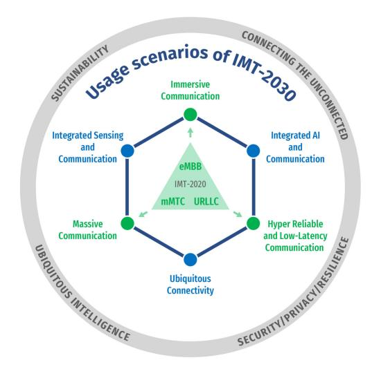

**Fig. 1. Illustration of 6G usage scenarios of IMT-2030 [\[4\].](#page-30-3)**

surgery, and fully autonomous driving, which may require 0.1-ms latency and 99.99999% reliability [\[1\],](#page-30-0) [\[6\].](#page-30-5)

Furthermore, three new usage scenarios are identified in 6G, namely, integrated sensing and communication (ISAC), integrated artificial intelligence (AI) and communication, and ubiquitous connectivity. Specifically, ISAC enables services requiring sensing capabilities such as highprecision localization and tracking, radio imaging and map generation, and activity pattern recognition, which rely on centimeter-level positioning accuracy and millimeterlevel sensing/imaging resolution. Integrated AI and communication will support numerous intelligent applications, including human–machine interaction, digital twin-based prediction and decision-making, and heavy computation tasks, which call for AI-oriented communication and computing support. Ubiquitous connectivity targets at filling in the blanks like scarcely covered areas (such as sea, desert, and forest) and complicated indoor environments by maintaining consistent user experience over them. In summary, 6G visions are expected to be fulfilled by the above six usage scenarios which call for unprecedentedly high network performance as compared to 5G.

## **B. Overview of ISs**

*1) Historical Development of ISs:* As shown in Fig. [2,](#page-2-0) intelligent surfaces (ISs) can be traced back to the early study on a special type of antenna array called reflectarray [\[7\]. R](#page-30-6)eflectarray operates with an active source radiating radio frequency (RF) signals toward a nearby reflective surface formed by arrays of passive antennas to achieve desired radiation patterns, which was aimed at reducing the hardware cost of conventional active antenna arrays. Subsequently, the research on investigating the more sophisticated interaction between electromagnetic (EM) waves and metamaterials was also pursued (see [\[8\]](#page-30-7) and [\[9\]\).](#page-30-8) In particular, the transition conditions for the

{2}------------------------------------------------

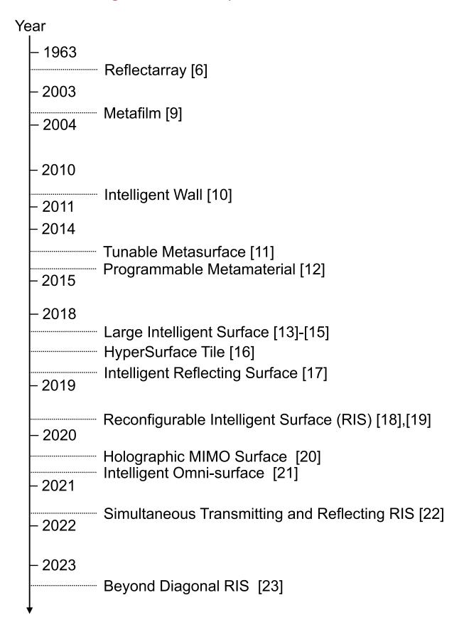

**Fig. 2. Historical development of ISs.**

average EM fields across a surface with a type of metamaterial called metafilm were studied in 2003, showing that the EM wave can be controlled by electrically changing the properties of a metafilm [\[10\].](#page-30-9) This result inspired the new idea of deploying metamaterial-made IS in the environment to alter wireless signal propagation, which opened up a new direction for IS beyond the traditional reflectarray. Subsequently, an intelligent wall equipped with a certain type of metamaterial called active frequency selective surface was proposed to manipulate the propagation environment inside a building [\[11\]. A](#page-30-10)fterward, the controllability of metamaterials over EM waves underwent further development. In 2014, tunable metasurfaces were developed to construct a spatial microwave binary phase modulator [\[12\]. M](#page-30-11)eanwhile, programmable metamaterials were proposed to manipulate EM waves by digitally coding the metamaterials with a field-programmable gate array (FPGA) [\[13\],](#page-30-12) which greatly extended the flexibility of controlling the EM wave.

The aforementioned development of programmable metamaterials/surfaces promoted the formation of the new IS concept and its applications in wireless communications. In 2018, the large intelligent surface (LIS) was proposed for enhancing wireless sensing and communication performance in [\[14\],](#page-30-13) [\[15\],](#page-30-14) and [\[16\].](#page-30-15) As an extension of the conventional massive multiple-input–multiple-output (MIMO) technology, LIS, like massive MIMO, is also based on the active array architecture, which incurs higher hardware cost and power consumption with increasingly more antenna elements employed. In the same year, a software-controlled programmable metamaterial architecture named HyperSurface Tile was proposed in [\[17\]](#page-30-16) for proactively controlling the radio propagation environment to enhance the wireless communication performance. In addition, a similar concept called intelligent reflecting surface (IRS) was proposed independently in [\[18\], w](#page-30-17)hich, for the first time, investigated the joint active and passive beamforming design problem in an IRS-aided wireless system for maximizing the communication spectral efficiency (SE). In particular, a quadratic power scaling law with the increasing number of IRS elements was revealed in [\[18\],](#page-30-17) which unveiled the more cost-effective performance gain of IRS passive beamforming as compared to the conventional active beamforming (via, e.g., massive MIMO and LIS) with only a linear power gain over the number of antenna elements. IS structures that are not limited to reflection, i.e., reconfigurable intelligent surface (RIS), were discussed in [\[19\]](#page-30-18) and [\[20\].](#page-30-19) Also, holographic MIMO surface [\[21\]](#page-30-20) was proposed to encompass relay-type and transmitter-type, as well as discrete and continuous implementations. To extend the signal coverage of reflectionbased IRS, the intelligent omni-surface (IOS) [\[22\]](#page-30-21) and the simultaneous transmitting and reflecting RIS (STAR-RIS) [\[23\]](#page-30-22) were subsequently proposed to enable both signal reflection and refraction of ISs. A more recent IS development was the general beyond diagonal RIS (BD-RIS) architecture [\[24\], w](#page-30-23)hich includes the abovementioned IS architectures as special cases by enabling more sophisticated signal processing across IS elements. Another architecture based on multilayer ISs is refereed to as stacked intelligent metasurface [\[25\]. I](#page-30-24)Ss have put forth the emerging concept of a smart radio environment that can provide uninterrupted wireless connectivity, in an energy-sustainable manner by recycling existing radio waves [\[26\],](#page-30-25) [\[27\],](#page-30-26) [\[28\].](#page-30-27)

- *2) Classifications of ISs:* As a collective term for programmable metasurfaces with various functionalities, ISs can be categorized from the following perspectives.[1](#page-2-1)
  - 1) *Continuous/discrete ISs:* Discrete ISs refer to ISs composed of discrete elements with certain spacing between adjacent elements, while continuous ISs are formed by a continuous-aperture surface.
- 2) *Reflection-/refraction-based ISs:* The signals impinging on an IS can be either reflected or refracted completely (i.e., IRS and intelligent refracting surface, respectively) or partially reflected and refracted at the same time to achieve a full-space signal coverage.
- 3) *Active/passive ISs:* The passive IS only reflects/refracts the incident signal with controllable phase shift and/or amplitude without amplification. In contrast,

1We will use IS/ISs consistently in the sequel of this article unless specified otherwise.

{3}------------------------------------------------

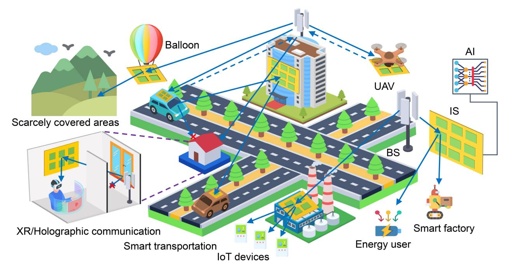

**Fig. 3. Illustration of IS applications in 6G.**

the active IS can amplify the impinging signal while manipulating its phase shift at the same time.[2](#page-3-0)

*3) Applications of ISs in 6G:* As shown in Fig. [3,](#page-3-1) ISs are envisioned to facilitate and enable a wide range of applications for future 6G usage scenarios. For example, to enable immersive communication applications, such as XR and ultrahigh definition (UHD) video services usually supported by high-frequency wideband signal transmission, ISs can help overcome severe path loss and bypass obstacles by providing high beamforming gains and additional propagation paths, respectively [\[29\].](#page-30-28) Additionally, to facilitate hyper-reliable and low-latency communication applications, such as industrial control, telemedicine, and emergency services, ISs can be utilized to improve the channel quality and transmission reliability by creating the dominant line-of-sight (LoS) path to mitigate the undesired multipath fading. Particularly, for services with stringent requirements on reliability and latency, especially in high-mobility scenarios such as fully autonomous driving, ISs can be either deployed at the roadside to enhance the signal strength for the vehicles (or passengers inside vehicles) on the road or mounted on the vehicles to mitigate the fast channel fading arising from their high mobility [\[30\].](#page-30-29) Moreover, to support massive communications in, e.g., smart cities, environmental monitoring, and other IoT applications, ISs can be used to improve the system throughput and fairness for densely deployed devices by jointly designing reflections/refractions and their nonorthogonal multiple access (NOMA) scheme [\[31\],](#page-30-30) [\[32\].](#page-30-31)

2 In the rest of this article, the term passive refers to ISs with no power amplification capabilities.

In addition to the aforementioned three scenarios, ISs can effectively facilitate applications in the newly introduced scenarios for 6G. Under the integrated AI and communication scenario, especially the edge AI scenario where edge servers aggregate data from mobile devices over wireless links to perform AI tasks such as federated learning, ISs can be utilized to provide a favorable wireless channel environment for real-time data aggregation and exchange, distributed computing, remote monitoring and controlling, etc., thereby improving AI performance and scalability [\[33\],](#page-30-32) [\[34\].](#page-30-33) On the other hand, AI algorithms can also be promisingly applied to solve nonconvex, highly nonlinear, and large-scale design and optimization problems in ISaided wireless networks, such as passive beamforming, channel estimation, optimal deployment, and resource allocation [\[35\]. I](#page-30-34)n addition, the use of massive and flexibly deployed ISs in proper locations is appealing to achieve the ubiquitous connectivity even in a complex propagation environment with rich scatterers/obstacles. In addition, ISs can be deployed on maritime or aerial mobile platforms (e.g., ships, unmanned aerial vehicles (UAVs), balloons, airships, and satellites) to provide wireless coverage for scarcely covered areas [\[36\],](#page-30-35) [\[37\],](#page-30-36) [\[38\].](#page-30-37) Furthermore, the flexibility of ISs to reflect or refract wireless signals enables coverage for dead zones in conventional terrestrial networks [\[39\].](#page-30-38)

Apart from communication applications, ISs can also be employed to improve both the sensing and communication performance in ISAC applications. For instance, to enable ISAC services such as navigation, high-precision positioning, user activity detection, and tracking, ISs can be flexibly deployed on the surface of walls, buildings, and vehicles as additional reference nodes to enhance the

{4}------------------------------------------------

**Table 1** List of Representative IS Prototypes/Field Trials

| Year | Description of IS prototypes/field trials                                                                                               |
|------|-----------------------------------------------------------------------------------------------------------------------------------------|
| 2018 | A meta-structure-based reflectarray facilitating 28GHz-band 5G systems was developed by NTT DOCOMO and Metawave [57].                   |
| 2019 | A programmable metasurface-based 8-phase shift-keying transmitter operating at the 4.25 GHz band was presented [58].                    |
| 2020 | A surface with over 3200 elements operating at the 2.4 GHz band was developed, improving signal strength [59].                          |
| 2020 | A 36-element array of inexpensive antennas operating at the 2.4 GHz band was developed, improving channel capacity [60].                |
| 2020 | A high-gain yet low-cost RIS was developed with 256 elements and 2-bit phase shifting operating at the 2.3 GHz or 28.5 GHz band [61].   |
| 2020 | A smart surface prototype was developed with measurements showing throughput improvement over commercial MIMO systems [62].             |
| 2021 | An RIS path loss model was verified by experimental measurements conducted at the 4.25 GHz and the 10.5 GHz band [63].                  |
| 2021 | An RIS prototype with 1100 elements working at the 5.8 GHz band was developed, achieving high performance in various scenarios [64].    |
| 2022 | An IRS prototype operating at the 2.6 GHz band was developed by Huawei and its collaborators, showing superiority to 5G systems [65].   |
| 2022 | A prototype of IOS-based wireless communications was developed with the functionality of IOS verified by experiments [66].              |
| 2022 | An RIS prototype with the ability to continuously control the phase shifts was developed with its properties characterized [67].        |
| 2022 | An RF-switch-based RIS prototype operating at the 5.3 GHz band was developed with dataset characterization [68].                        |
| 2022 | RIS prototypes covering sub-6 GHz to 28 GHz bands were developed with field tests conducted by ZTE [69].                                |
| 2023 | Field trials on RIS operating at the sub-6 GHz band were conducted, achieving 40 dB indoor received power improvement [70].             |
| 2023 | An electronically almost-360° steerable metamaterial surface that operates above the 24 GHz band was developed [71].                    |
| 2023 | A multi-RIS prototype was developed to facilitate Wi-Fi and commercial 5G networks operating at the 3.4 GHz and the 5.8 GHz band. [72]. |
| 2023 | A reconfigurable metasurface operating at the 0.34 THz band was developed, achieving 1° angular precision of beam scanning [73].        |
| 2023 | An RIS prototype operating at the 5G FR2 frequency band was developed by Greenerwave and verified by Rohde & Schwarz [74].              |
| 2023 | Field trials on throughput enhancement with RIS were conducted in a 5G mmWave commercial network at the frequency of 27 GHz [75].       |
| 2024 | Experiments on using RIS to enhance wireless coverage were conducted in a 5G commercial network operating at the 2.6 GHz band [76].     |

positioning accuracy of the future dual-functional radar and communication (DFRC) base station (BS) [\[40\],](#page-30-39) [\[41\],](#page-30-40) as well as mounted on targets like automobiles or UAVs to enlarge their radar cross section (RCS) for high-resolution detection and highly accurate real-time tracking [\[30\],](#page-30-29) [\[41\].](#page-30-40) In addition to the above, ISs can assist in many other applications, such as enhancing the physical-layer security [\[42\],](#page-30-41) [\[43\],](#page-30-42) [\[44\],](#page-30-43) [\[45\]](#page-30-44) and boosting both the communication rate and the energy transmission efficiency for simultaneous wireless information and power transfer (SWIPT) as well as wireless powered communications [\[46\],](#page-30-45) [\[47\],](#page-30-46) [\[48\],](#page-31-0) [\[49\],](#page-31-1) [\[50\],](#page-31-2) [\[51\],](#page-31-3) [\[52\].](#page-31-4)

*4) Prototypes/Field Trials of ISs:* The versatile promising applications of ISs in wireless networks have spurred extensive worldwide endeavors in experimentation, measurement, and prototyping. Some representative results are summarized in Table [1.](#page-4-0) The usefulness of ISs has been demonstrated in wireless systems operating at frequencies ranging from sub-6 GHz to mmWave, terahertz (THz), and even optical frequency bands [\[53\],](#page-31-5) [\[54\],](#page-31-6) [\[55\],](#page-31-7) [\[56\].](#page-31-8)

# **C. Standardization Activities**

As an innovative radio access technology, IS has already been included in the ITU-R IMT-2030 report on future technology trends, as a candidate technology for enhancing the radio interface of future telecommunication standards [\[77\],](#page-31-9) [\[78\].](#page-31-10) During the last two years, IS has been under evaluation for its inclusion in future telecommunication standards, and prestandardization and standardization bodies are currently working on it. In this section, we briefly overview the most relevant standardization activities on IS. Also, we put them in context with other standardization activities focusing on technologies that have strong ties with IS, notably THz communications and ISAC.

*1) Third-Generation Partnership Program (3GPP):* The mission of 3GPP is the creation of the mobile broadband standard, with an increasing emphasis toward connecting the IoT—whether the need is for uRLLC at one end of the scale or for energy efficiently low-cost, low-power devices at the other [\[79\].](#page-31-11) The 3GPP unites seven telecommunications standard development organizations (ARIB, ATIS, CCSA, European Telecommunication Standards Institute (ETSI), TSDSI, TTA, and TTC), known as "Organizational Partners" providing their members with a stable environment to produce the reports and specifications that define technologies. The 3GPP specifications cover cellular telecommunications technologies, including radio access, core network, and service capabilities, which provide a complete system description for mobile telecommunications. The 3GPP specifications also provide hooks for nonradio access to the core network, and for interworking with non-3GPP networks.

{5}------------------------------------------------

As far as IS is concerned, several proposals have been made during the 3GPP release 18 (Rel-18) radio access network (RAN), including the following:

- 1) new radio (NR) repeaters and IS from KDDI Corporation, Tokyo, Japan, (RWS-210300)—evaluation of the performance benefits of ISs assuming compatibility with legacy user equipments (Rel-15/16/17);
- 2) NR smart repeaters from China Mobile Communications Corporation (CMCC), Beijing, China, (RWS-210339)—study candidate side control information such as timing, beam, and bandwidth information for smart repeaters (RAN1 and RAN4); and specification of RF requirements considering side control information (RAN4);
- 3) support of IS for 5G-advanced from Zhongxing Telecommunication Equipment (ZTE) Corporation, Shenzhen, China, Sanechips (RWS-210465) technical enhancements and specification support for IS, including beam management, channel state information (CSI) enhancement, control interface between ISs and BSs, and interference coordination;
- 4) introducing IS for 5G-advanced from Sony Europe, Weybridge, U.K., (RWS-210306)—study phase in Rel-18 to investigate IS entrance impact on specifications including initial access, beam management, and channel models;
- 5) motivation of IS requirements in Rel-18 from China Unicom, Beijing, China, (RWS-210390)—study of ISs including deployment scenarios and channel modeling, the potential impact on beam management, and interference coordination;
- 6) NR smart repeaters for Rel-18 from Qualcomm, San Diego, CA, USA, (RWS-210019)—work in Rel-18 on smart repeaters, including the study of side control information (RAN1), protocol support (RAN2), and RF and EM compatibility requirements (RAN4);
- 7) smart repeaters enhancements from MediaTek Inc., Hsinchu, Taiwan, (RWS-210099)—smart repeater enhancements including support for beamforming (RAN1), interference management (RAN1), operation and integration (RAN2), and necessary backward compatibility with legacy user equipments;
- 8) IS from Rakuten Mobile Inc., Tokyo, Japan, (RWS-210247)—study item on ISs for Rel-18 considering channel modeling, use cases, and deployment scenarios.

As far as 3GPP is concerned, Rel-18 will include, on the other hand, a study item (RP-213700 [\[80\]](#page-31-12) and TR-38.867 [\[81\]\)](#page-31-13) on network-controlled repeaters (NCRs). These repeaters are intended to address the limitations of conventional RF repeaters as well as to provide enhanced low-cost coverage. Conventional amplify-andforward repeaters are considered, which operate with minimal processing and do not require signal decoding and reconstruction. Therefore, they operate at a lower complexity and latency than decode-and-forward repeaters. The price to pay for the reduction in complexity lies in a reduced link quality and increased network interference, which is due to the interference/noise amplification. When applied to high-frequency bands (above 24 GHz), amplify-and-forward repeaters provide limited coverage. In fact, static directional repeaters cannot adapt to the channel conditions and user mobility, which is necessary in communication systems where directional communications and high beamforming gains are necessary. NCRs will be designed to include an in-band control interface to configure and manage their behavior, with the objective of reducing the amplification of noise and supporting communications with a better spatial directivity. A detailed description of NCRs in the context of 3GPP standardization can be found in [\[82\]. N](#page-31-14)CRs are often considered a stepping stone for ISs since the control channel may be reused. Recent research works have also compared NCRs and ISs, as summarized in [\[82\].](#page-31-14)

*2) European Telecommunication Standards Institute:* ETSI is a leading organization for the development of standards on information and communication technologies, fulfilling European and global market needs [\[83\].](#page-31-15) ETSI has over 900 members from 64 countries over five continents. ETSI produces specifications, standards, reports, and guides, enabling technologies in a multivendor, multinetwork, multiservice environment. Standards are created in an open approach, thanks to the direct participation of members and contribution-driven consensus-based working procedures. The standardization work is carried out in different technical groups, which include industry specification groups (ISGs). ISGs are the perfect tool for developing "early" standardization activities, resulting from fundamental and applied research projects, targeting for the publication of deliverables where technological aspects are streamlined for consideration by standard organizations.

In September 2021, ETSI launched ISG-intelligent surface (ISG-IS), with the objective of reviewing and establishing global standardization activities for the IS technology, which focused on the following aspects:

- 1) definition of use cases, key performance indicators, and deployment and operational scenarios;
- 2) RF aspects, including surface models, channel characterization, radiation characterization, and radiation exposure limits;
- 3) IS-aided air-interface technologies, mechanics, and requirements;
- 4) system and network level control signaling aspects;
- 5) system and network architecture considerations;
- 6) baseline evaluation methodology and performance analysis (link-level and system-level);
- 7) IS microelectronics, enabling technologies, and proofof-concepts (prototyping);
- 8) IS verification and validation.

In the first phase from 2021 to 2023, the activities of ISG-IS were focused on three main work items (WIs) [\[84\],](#page-31-16) including the following.

1) *WI-1: use cases, deployment scenarios, and requirements*—WI-1 focused on identifying relevant use 

{6}------------------------------------------------

cases for IS, with the corresponding general key performance indicators, deployment scenarios, and operational requirements for each identified use case. This includes system/link performance, spectrum, coexistence, and security.

- 2) *WI-2: technological challenges and impact on architecture and standards*—WI-2 focused on technological challenges to deploy IS as a new network entity, the internal architecture, framework and required interfaces for IS, and the potential recommendations and specifications to standardization groups for supporting IS as a network entity.
- 3) *WI-3: communication models, channel models, and evaluation methodology*—WI-3 focused on communication models striking a suitable tradeoff between EM accuracy and simplicity for performance evaluation and optimization at different frequency bands; channel models (deterministic and statistical) that include path-loss and multipath propagation effects, as well as the impact of interference for application to different frequency bands; channel estimation, including reference scenarios, estimation methods, and system designs; and key performance indicators and the methodology for evaluating the performance of IS for application to wireless communications, including the coexistence between different network operators, and for fairly comparing different transmission techniques, communication protocols, and network deployments.

The second phase (initial specifications) of ISG-IS kicked off in September 2023. The group is currently working on the following three WIs [\[85\].](#page-31-17)

- 1) *WI-4: implementation and practical considerations* the scope of WI-4 is to investigate relevant implementation and practical considerations for IS in a wide range of frequency bands and deployment scenarios and provide possible solutions and prototyping results.
- 2) *WI-5: IS-aided air-interface technologies and mechanics*—the scope of WI-5 is to identify use cases, deployment scenarios, and transmission and reception schemes for diversity and multiplexing in IS-aided channels.
- 3) *WI-6: multifunctional IS—modeling, optimization, and operation*—the scope of WI-6 is to identify technological challenges and solutions for multifunctional IS, incorporating transmission, reflection, sensing, computation, and other potential functions, as well as corresponding appropriate deployment scenarios and resource allocation schemes.

The activities of ISG-IS during the second phase will be tailored to provide an initial specification framework for the technology. A major objective of ISG-IS is to establish collaborations with other relevant ISGs, which are focused on emerging technologies that have strong ties with IS. The most relevant and related ISGs are ISG-THz on THz communications [\[86\]](#page-31-18) and ISG-integrated sensing and communication (ISG-ISC) [\[87\]](#page-31-19) on ISAC. Specifically, ISG-THz concentrates on channel sounding and modeling for ISaided channels and ISG-ISC concentrates on how IS can be exploited for improving the performance of ISAC, as well as how ISAC can be exploited for improving the operation and deployment of IS. In summary, standardization activities for IS and its applications in THz communications and ISAC are under a vivid debate by standards organizations [\[86\],](#page-31-18) [\[87\],](#page-31-19) [\[88\].](#page-31-20)

#### **D. Aims and Organization**

In contrast to the existing overview, survey, and tutorial articles on ISs listed in Table [2](#page-7-0) and two recent books [\[112\]](#page-32-0), [\[113\]](#page-32-1), this article aims to provide a comprehensive overview of the latest development and advancement of ISs, with an emphasis on recent research results as well as new IS architectures and their design issues. Specifically, this article first provides an in-depth overview of the state-of-the-art results on the design of the commonly adopted reflection-based IS including its reflection optimization, deployment, signal modulation, wireless sensing, and ISAC. Next, we delve into the recent progress in advanced IS architectures and their associated new design issues and solutions. Moreover, we highlight the important problems that remain unsolved to motivate future research on ISs. We hope that this article will help unveil the immense potential of ISs for applications in future wireless networks such as 6G, and provide useful and up-to-date guidance for the future research and development for ISs.

As depicted in Fig. [4,](#page-8-0) the rest of this article is organized as follows. Section [II](#page-6-0) presents a detailed overview of state-of-the-art results on the reflection-based IS design. Section [III](#page-21-0) discusses the recent progress and new issues of advanced IS architectures. Finally, Section [IV](#page-29-0) concludes this article.

# **II. R E F L E C T I O N - B A S E D I S : D E S I G N I S S U E S A N D S TAT E - O F - T H E - A R T R E S U L T S**

In this section, we overview the main design issues and state-of-the-art results for reflection-based ISs, including reflection optimization, deployment, modulation, sensing, as well as ISAC.

#### **A. Reflection Design**

In order to fully exploit ISs' potential, it requires judicious design of the reflection coefficients of all IS elements, thus giving rise to passive reflection/beamforming optimization problem [\[114\]](#page-32-2), [\[115\]](#page-32-3), [\[116\],](#page-32-4) [\[117\],](#page-32-5) [\[118\],](#page-32-6) [\[119\]](#page-32-7). Most of the existing design methods for IS passive reflection/beamforming are based on a two-stage procedure, i.e., the cascaded BS-IS-user channel is first estimated via downlink (DL)/uplink (UL) pilots [\[120\],](#page-32-8) [\[121\],](#page-32-9) [\[122\]](#page-32-10) and the reflection coefficients are then optimized accordingly [\[92\],](#page-31-21) [\[95\],](#page-31-22) [\[123\]](#page-32-11), [\[124\]](#page-32-12), [\[125\].](#page-32-13) However,

{7}------------------------------------------------

**Table 2** List of Representative Overview/Survey/Tutorial Articles on ISs

| Conte                                                       | nts / Topics                            | Major Contributions                                                                                                                                                         | Ref.  | Publication Year |
|-------------------------------------------------------------|-----------------------------------------|-----------------------------------------------------------------------------------------------------------------------------------------------------------------------------|-------|---------------------|
| Channel Modeling & Characterization                         |                                         | Offer an overview of RIS-based channel measurements/experiments, large-scale path loss models and small-scale multipath fading models.                                      | [89]  | 2022                |
| Communication Models  Fundamentals of Metamaterial-based IS |                                         | Offer a comprehensive tutorial on electromagnetically consistent communication models for IS, including discrete-type and continuous-type IS.                               | [90]  | 2022                |
|                                                             |                                         | Offer a comprehensive tutorial on the theory behind metamaterial-based RIS, including near-field channel models.                                                            | [91]  | 2020                |
|                                                             |                                         | Discuss the up-to-date solutions and practical challenges of the IRS focusing on the channel estimation and the passive beamforming design.                                 | [92]  | 2022                |
| System                                                      | n Design &                              | Provide an overview of RIS and explore the theoretical performance limits of RIS-aided wireless communications                                                              | [93]  | 2019                |
|                                                             | allenges                                | Provide a comprehensive overview of signal processing techniques on RIS/IRS-aided wireless systems.                                                                         | [94]  | 2022                |
|                                                             |                                         | Give a tutorial for IRS-aided wireless communications, and elaborate on technical challenges and potential directions.                                                      | [95]  | 2021                |
| Systen                                                      | n Design &                              | Discuss the optimization frameworks and performance analysis methods for large intelligent surfaces.                                                                        | [96]  | 2020                |
| Performa                                                    | ance Analysis                           | Explain the fundamental principles of RISs based on electromagnetic waves, and provide a survey of RIS focusing on the performance and applications.                        | [97]  | 2021                |
| 6                                                           | D : 0                                   | Provide a technical study on the IRS, with emphasis on the performance enhancement of different scenarios induced by the reconfigurability of IRS.                          | [98]  | 2020                |
| •                                                           | n Design & olications                | Explore the up-to-date solutions and challenges of the RIS in view of CSI acquisition, passive information transfer and low-complexity robust system design.                | [99]  | 2021                |
|                                                             |                                         | Provide an overview on using IS for low-complexity data modulation.                                                                                                         | [100] | 2021                |
|                                                             |                                         | Present a comprehensive yet concise overview of the IRS technology and explores the main design challenges.                                                                 | [101] | 2020                |
|                                                             | ications & allenges                  | Elaborate on the concept of smart radio environments (SREs) empowered by reconfigurable AI meta-surfaces.                                                                   | [20]  | 2019                |
|                                                             |                                         | Discuss the concept, applications, challenges and future research directions of RIS/IRS.                                                                                    | [102] | 2021                |
|                                                             |                                         | Deliver a tutorial of multi-IRS-aided wireless networks, emphasizing on the aspects of IRS reflection design and channel acquisition.                                       | [103] | 2022                |
| Dep                                                         | oloyment                                | Envision the IRS-empowered 6G wireless networks from the perspective of its architecture, deployment strategy, and applications.                                            | [104] | 2022                |
|                                                             |                                         | Review the IRS deployment design in wireless networks including the BS/User-side deployment and the hybrid deployment strategies.                                           | [105] | 2022                |
| Architec-                                                   | Holographic Surfaces                 | Introduce the Holographic MIMO Surfaces in terms of the fundamental basics, applications and design challenges.                                                             | [21]  | 2020                |
| tures                                                       | Intelligent Omni Surfaces         | Present a survey of IOS with the emphasis on design principles, system model and design, hardware implementation and experiments, as well as potential research directions. |       | 2022                |
| На                                                          | ardware                                 | Overview the different implementations and channel models for RIS as well as the RIS-assisted optimization.                                                                 | [107] | 2020                |
| Imple                                                       | ementation                              | Elaborate on the mechanisms of RISs in the view of digital metasurfaces, and presents several hardware implementations and architectures.                                   | [108] | 2022                |
|                                                             | IRS-NOMA                                | Discuss the performance improvements induced by the IS, including the channel gains, fair power allocation, coverage range and energy efficiency.                           | [109] | 2020                |
| Applica-                                                    | Radio Localization and Mapping | Provide an overview of RIS-based radio localization and mapping, highlighting the challenges and open issues left behind.                                                   | [110] | 2020                |
| tions                                                       | Wireless Transceivers                | Explain two paradigms of IS as RF chain-free transmitter and space-down-conversion receiver.                                                                                | [111] | 2020                |
|                                                             | Wireless Energy Transfer          | Deliver a tutorial overview on IRS-aided WPT/WIPT systems, with a special focus on system designs and open issues.                                                          | [46]  | 2022                |

under the current cellular protocols, the pilots are dedicated to the use of direct channel estimation between the BS and users without IS reflection. Thus, the estimation of IS channels requires significant modifications of the current cellular protocols. Moreover, due to massive reflective elements (REs) of IS, a large number of additional pilots are needed to estimate the high-dimensional BS-IS, IS-user, or cascaded BS-IS-user channels [\[120\]](#page-32-8), [\[121\],](#page-32-9)

{8}------------------------------------------------

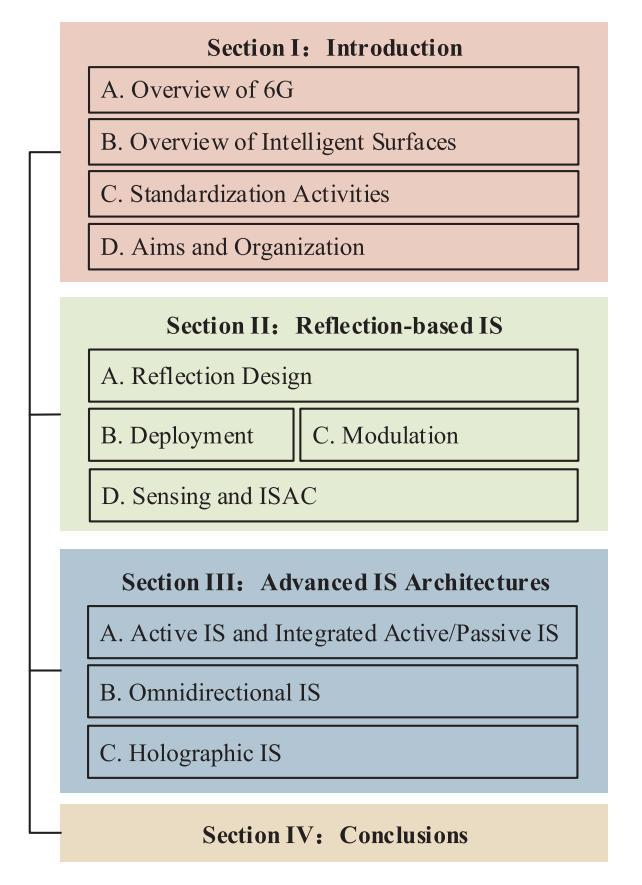

**Fig. 4. Organization of this article.**

[\[122\],](#page-32-10) [\[126\]](#page-32-14), which entail excessively high overhead for the existing wireless systems.

To enable the seamless application of ISs in current and future wireless communication systems, recent research efforts have been devoted to developing more practical approaches for IS passive reflection/beamforming design. Specifically, instead of relying on the baseband complexvalued pilots, the IS reflection coefficients can be optimized based on the *received signal power measurement* at the user terminals [\[59\],](#page-31-23) [\[127\],](#page-32-15) [\[128\],](#page-32-16) [\[129\],](#page-32-17) [\[130\]](#page-32-18), [\[131\]](#page-32-19), which are easily accessible in the existing cellular networks, e.g., from the reference signal received power (RSRP). Thus, the power measurement-based IS reflection/beamforming design does not require additional pilots and is fully compatible to the current cellular protocols. Currently, such designs can be mainly classified into three categories, i.e., blind reflection/beamforming, channel recovery-based reflection/beamforming, and beam training, as shown in Fig. [5.](#page-8-1)

Specifically, the blind reflection/beamforming approach optimizes the phase shift of each RE based on the user's power measurement without the need for any explicit CSI estimation [\[59\],](#page-31-23) [\[127\],](#page-32-15) [\[132\]](#page-32-20), [\[133\].](#page-32-21) In contrast, the channel recovery-based approach first estimates the cascaded BS-IS-user channel based on the user's power measurement and then optimizes the IS reflection/beamforming accordingly [\[128\]](#page-32-16), [\[129\].](#page-32-17) Note that the above two approaches are practically applicable to both sub-6-GHz bands with rich multipath channels and mmWave frequency bands with LoS-dominant channels. However, they are generally less efficient in mmWave frequency bands due to the channel/path sparsity and severe path loss.[3](#page-8-2) In particular, the received signal power may not be sufficient for CSI recovery if the IS reflection/beamforming vector is not aligned with the dominant channel path. Furthermore, the training overhead of these methods may be unnecessarily large because they do not fully exploit the inherent channel sparsity in mmWave frequency bands. To overcome the above issues, beam training serves as a more efficient approach for IS passive beamforming design in mmWave systems by selecting the best directional beam from a predefined beamforming codebook [\[130\],](#page-32-18) [\[131\]](#page-32-19). In the following, the above three power-measurement-based approaches for IS passive reflection/beamforming design are discussed in more detail.

*1) Blind Reflection/Beamforming:* The blind IS reflection/beamforming approach applies to the discrete phase shift of REs. Let us start with a naive algorithm called *random-max sampling (RMS)* for blind reflection/beamforming. Its idea is fairly simple: just try out a sequence of random samples of the phase shifts of IS and choose the one with the best performance thus far. The following toy example illustrates how RMS works. Assume that IS has four REs; denote by θn the phase shift of the nth RE, n = 1, 2, 3, 4; assume also that each phase shift θn takes on value from the binary set {0, π}. Suppose that a total of six random samples of the phase-shift array (θ1, θ2, θ3, θ4) have been tested, as shown in Table [3.](#page-9-0) The performance of each random sample is evaluated by the utility value, e.g., we can take the received signal-to-noise ratio (SNR) (which is in direct proportion to the RSRP)

3For each IS element, the channel condition (e.g., channel sparsity and number of multipaths) is generally determined by the signal propagation environment and carrier frequency only, which is not affected by the aperture size of the whole IS. Nonetheless, the end-to-end effective channel of the BS-IS-user link is highly dependent on the IS aperture and beamforming/reflection design for both the instantaneous channels and statistical channel distribution.

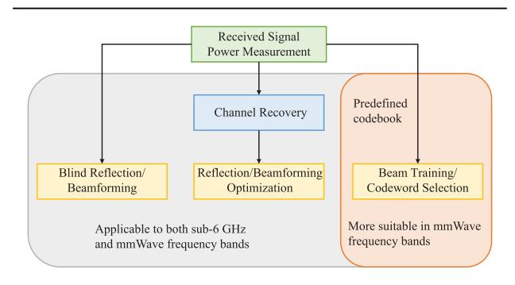

**Fig. 5. Three approaches for IS reflection/beamforming design based on received signal power measurement.**

{9}------------------------------------------------

| Sample Index                        | 1             | 2            | 3                 | 4                 | 5                 | 6               |
|-------------------------------------|---------------|--------------|-------------------|-------------------|-------------------|-----------------|
| $(	heta_1,	heta_2,	heta_3,	heta_4)$ | $(0,\pi,0,0)$ | (0,0,0,0)    | $(\pi,\pi,\pi,0)$ | $(\pi,0,\pi,\pi)$ | $(\pi,\pi,0,\pi)$ | $(0,0,\pi,\pi)$ |
| Utility Value                       | 2.8           | 1.0          | 1.5               | 3.3               | 0.3               | 0.4             |
| Is $\theta_1 = 0$ ?                 | $\checkmark$  | $\checkmark$ | X                 | X                 | X                 | $\checkmark$    |

**Table 3** Toy Example of Blind Beamforming When N = 4, K = 2, and T = 6

as the utility for the single-antenna transmission. Observe that RMS gives the solution (θ1, θ2, θ3, θ4) = (π, 0, π, π) in this example because the fourth random sample has the highest utility value. Clearly, RMS can attain the global optimum so long as all the possible combinations of {0, π} have been tested.

However, a real-world IS has far more than four REs as assumed in the above toy example, e.g., there are 256 REs integrated into the IS prototype in [\[127\]](#page-32-15), so it is already intractable to search through the solution space even if each phase shift has only two choices. Then, a natural idea is to partially explore the solution space. However, how much portion of the entire solution space should RMS explore in order to achieve "good" performance? To formalize the above question, we denote by N the number of REs, T the number of random samples, and K the number of choices for each phase shift. For ease of discussion, we focus on the single-antenna transmission and use the SNR as the utility. A fundamental problem is how fast the SNR scales with N if T is much smaller than the solution space size KN , which is termed as the *SNR boost*. [4](#page-9-1)

The above fundamental problem has been answered in [\[127\]](#page-32-15) for RMS. Roughly speaking, Ren et al. [\[127\]](#page-32-15) showed that the SNR boost behaves like SNR ∝ N log T by the RMS method. Moreover, it has been shown in [\[114\]](#page-32-2) that the scaling rate is at most quadratic in N, and this upper bound is tight in the ideal case where every reflected channel is perfectly aligned with the direct channel. Thus, in order to achieve a quadratic boost of SNR, we must set T to be exponentially large in N for the RMS method. However, T can only be polynomially large in N in practice. As a result, the actual performance of RMS is SNR ∝ N log N. One may then have a follow-up question: is it possible to strike a quadratic boost of SNR (which is the theoretical upper bound as revealed in [\[114\]\)](#page-32-2) by using a polynomial number of random samples, T?

Two recent works [\[59\],](#page-31-23) [\[127\]](#page-32-15) provide a positive answer to the above question by devising the so-called *conditional sample mean (CSM)* method; a more recent work [\[134\]](#page-32-22) further extends CSM to the joint configuration of multiple ISs. In a nutshell, CSM first calculates the mean utility conditioned on each possible phase-shift choice for a particular RE, and then chooses the phase shift with the highest conditional mean utility for this RE. We still use the toy

4Note that the SNR boost refers to the scaling order of the SNR with respect to N, which is identical for both discrete and continuous phases shifts of IS.

example in Table [3](#page-9-0) to illustrate CSM. Let us see how θ1 is decided. Recall that there are two possible choices, 0 and π, for the phase shift; we first average out all the random samples with θ1 = 0 so as to obtain the mean utility conditioned on θ1 = 0, i.e.,

$$\mathbb{E}\left[\text{utility}\middle|\theta_1=0\right] = \frac{2.8+1.0+0.4}{3} = 1.4$$

and similarly find the mean utility conditioned on θ1 = π as

$$\mathbb{E}\left[\text{utility}\middle|\theta_1 = \pi\right] = \frac{1.5 + 3.3 + 0.3}{3} = 1.7.$$

Comparing the above two conditional mean utility values, the CSM method chooses θ1 = π. Likewise, the other phase shifts are determined as θ2 = 0, θ3 = π, and θ4 = 0. Intuitively, CSM aims at the average goodness of setting θ1 to a particular possible choice while the rest phase shifts are still pending; with every phase shift optimized in this fashion independently, CSM enables an efficient configuration of IS.

More importantly, as shown in [\[127\]](#page-32-15), the CSM method yields SNR ∝ N 2 for polynomially large T. It can be observed from Fig. [6](#page-10-0) that CSM outperforms RMS significantly in terms of the scaling rate of SNR in N. In particular, according to the field tests at 2.6 GHz in the 5G network, the SNR of CSM can be approximately 8 dB higher than that of RMS when N = 256, K = 2, and T = 10N. The huge advantage of CSM over RMS can be perceived from two standpoints. First, RMS solely relies on the single "best" random sample with the highest utility value, whereas CSM makes full use of the whole random sampling data. Second, the solution of RMS is restricted to a small space of the solution space that has been explored by the random samples, whereas the solution of CSM can be beyond this space; as shown in the previous toy example, the solution (π, 0, π, 0) given by CSM does not appear in the six random samples tested.

*2) Channel Recovery-Based Reflection/Beamforming:* The blind reflection/beamforming design in general requires a large number of random samples (i.e., IS phase-shift realizations) as well as corresponding received signal power measurements to achieve the upper bound on the SNR boost in IS-aided communication systems. This is fundamentally because the explicit CSI between the BS, IS, and user is not exploited, which results in the underutilization

{10}------------------------------------------------

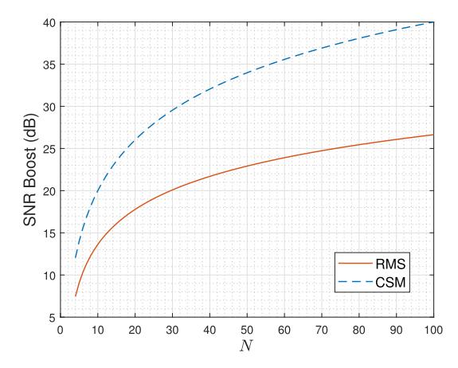

**Fig. 6. RMS versus CSM given a polynomial number of random samples.**

of power measurements as well as high training overhead. To overcome this limitation, a new channel recovery-based reflection/beamforming approach was proposed in [\[128\]](#page-32-16) and [\[129\]](#page-32-17) based on the received signal power measurement as well. Specifically, by collecting the received signal power under different IS reflections, the cascaded BS-ISuser channel (or its autocorrelation matrix) is first estimated. Then, based on the obtained CSI, the IS reflection/ beamforming coefficients are optimized more efficiently for improving the communication performance. Note that the channel recovery-based approach applies to both discrete and continuous phase shifts of REs.

As the phase information of the received signal is missing in its measured power, a fundamental question for the power measurement-based channel estimation is whether the complex-valued channel vector can be recovered by only exploiting the received signal powers which are positive real numbers. The results in [\[128\]](#page-32-16) revealed that if the number of power measurements is sufficiently large, the autocorrelation matrix of the cascaded BS-IS-user channel can be uniquely determined. As such, the cascaded BS-ISuser channel can be recovered with an unknown phase ambiguity that is common to all IS REs. A special case occurs if the REs have only two phase-shift choices, i.e., 0 and π. In this case, the channel autocorrelation matrix cannot be distinguished with its conjugate. Fortunately, since the passive beamforming vector of IS has real values only in this binary phase-shift case, such a phase ambiguity does not affect the SNR boost at the user's receiver [\[128\].](#page-32-16)

In general, the channel recovery can be formulated as an optimization problem which aims to find a channel vector satisfying the power measurement constraints under different IS reflections. Since the power measurement constraints are nonconvex, one viable approach is by lifting up the channel/beamforming vectors into matrices by calculating their autocorrelation matrices [\[128\].](#page-32-16) As a result, the power measurement constraints become linear in the channel autocorrelation matrix. Since the channel autocorrelation matrix has the rank of one, the optimal solution can be found by minimizing its rank, subject to the power measurement constraints. By applying proper relaxations, the rank-minimization problem can be solved by using the semidefinite programming (SDP)-based method [\[128\].](#page-32-16) On the other hand, to reduce the computational complexity as well as improve the robustness to noise, a neural network (NN)-based approach was proposed in [\[129\]](#page-32-17) to estimate the cascaded BS-IS-user channel vector. Specifically, it was revealed that the received signal power can be viewed as a single-layer NN, with its input and output corresponding to the real and imaginary parts of the IS reflection vector and the expected received signal power, respectively. The weights of the single-layer NN correspond to the cascaded channel, which can be estimated by training the NN via minimizing the loss function, i.e., the mean square error (MSE) between the NN's output and the measured signal power. For both SDP-based and NN-based channel recovery, the IS passive beamforming vector can be further optimized based on the estimated CSI. Various optimization techniques proposed in the literature can be utilized, such as semidefinite relaxation (SDR) [\[135\],](#page-32-23) block coordinate descent (BCD) [\[136\],](#page-32-24) successive convex approximation (SCA) [\[137\],](#page-32-25) the penalty-based method [\[138\],](#page-32-26) and the projected gradient ascent/descent method [\[139\]](#page-32-27).

In Fig. [7,](#page-10-1) we show the effective channel gains between the BS and a single user aided by an IS, employing the RMS, CSM, and SDP-based and NN-based IS reflection/beamforming designs. The size of IS is N = 64 and the phase of each IS element can only be selected from the binary set {0, π}. The details of the system setup, channel model, and parameter settings can be found in [\[129\].](#page-32-17) The computational complexities for the RMS, CSM, SDPbased, and NN-based methods are O(1), O(N), O(N 4.5), and O(N), respectively. As can be observed, the SDPbased method requires the least power measurements for approaching the upper bound on the effective channel gain assuming perfect CSI, while it requires the highest computational complexity for channel recovery and IS

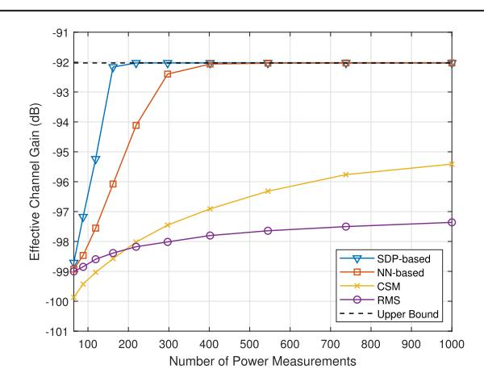

**Fig. 7. Effective channel gain between the BS and user aided by an IS under different IS reflection/beamforming approaches.**

{11}------------------------------------------------

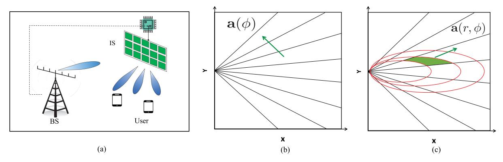

**Fig. 8. Illustration of IS beam training in far- and near-field channels. (a) IS beam training. (b) Far-field angular-domain (DFT) codebook. (c) Near-field polar-domain codebook.**

beamforming optimization. In contrast, the RMS method has the lowest computational complexity, while its gap to the performance upper bound is large if the number of power measurements is small. The CSM and NN-based methods achieve a tradeoff between communication performance and computational complexity.

*3) Beam Training:* Note that the above blind and channel recovery-based reflection/beamforming approaches can be applied in real-time for improving the instantaneous channels or offline for improving the channel statistical distribution in sub-6-GHz bands. For mmWave and higher frequency bands, high beamforming gain is required to compensate for the severe path loss. Due to the channel/path sparsity, codebook-based beam training with directional beams is a more efficient approach to design IS beamforming without the need of explicit CSI estimation, as illustrated in Fig. [8.](#page-11-0) In the following, we discuss efficient methods for IS beam training in the far- and nearfield channel scenarios, respectively, under the assumption of continuous RE phase shifts, while these methods can be readily extended to the case of discrete RE phase shifts.

*a) Far-field beam training:* First, consider the case where both the BS and users are located in the farfield region of the IS, as shown in Fig. [8\(b\).](#page-11-0) Instead of performing joint BS and IS beam training that incurs high training overhead, a more effective approach is conducting an offline BS beam training to establish a highgain BS-IS link by exploiting the fixed locations of the BS and IS. Then, only the IS beam training needs to be performed in the real-time phase for selecting the best IS beam in a predesigned codebook that yields the strongest signal power at the user's receiver. For narrowband systems, sequential *single-beam* training is a straightforward method that exhaustively searches over all possible beam directions (i.e., codewords) at the IS. As revealed in [\[140\]](#page-32-28) and [\[157\],](#page-32-29) there generally exists a fundamental tradeoff between maximizing the achievable throughput and minimizing the beam training overhead, i.e., a more accurate beam training leads to a higher passive beamforming gain, while at the cost of higher training overhead as well. To reduce the IS beam training overhead, one line of research has developed efficient IS beam codebooks to reduce the beam-search space. For example, Jamali et al. [\[140\]](#page-32-28) proposed a small-size IS codebook with wide beamwidth, which is achieved by a quadratic phase-shift design for enabling higher order variations at IS phase shifts. In addition, under the IS discrete phase-shift constraint, an SCAbased algorithm was proposed in [\[141\]](#page-32-30) to design the IS codebook with beamwidth-adjustable codewords, while at the expense of decreased beamforming gain. Alternatively, hierarchical IS codebook design and beam search is also an efficient way to reduce the beam training overhead without compromising much the beamforming gain [\[131\],](#page-32-19) [\[142\]](#page-32-31). Specifically, a hierarchical IS beam training method was proposed in [\[131\],](#page-32-19) which first identifies the best beam sector with wide IS beams and then refines the IS beam in the sector using narrow beams. However, the IS codewords may not be orthogonal in practice due to IS hardware imperfections, thus resulting in a reduced beam training success rate. In addition, another hierarchical IS beam search method was proposed in [\[142\]](#page-32-31), which uses two multimainlobe codewords in each layer for beam sweeping and exploits the beam discrimination in each layer to effectively increase the success rate. However, hierarchical beam training approaches generally require frequent user feedback to refine the beam selection, thus incurring high feedback/training overhead that scales with the number of users. To circumvent this issue, You et al. [\[130\]](#page-32-18) proposed a new *multibeam* training method, where IS REs are divided into multiple subarrays, which allows for simultaneous beam sweeping over different directions. Then, each user can determine its optimal IS beam direction by comparing the received signal power/SNR over time, thus greatly reducing the training overhead yet without the need for successive user feedback in IS-aided multiuser systems. Besides pilot-based beam training, other approaches for IS beam training in narrowband systems have also been recently proposed. For instance, Ouyang et al. [\[143\]](#page-32-32) proposed a new binocular camera-mounted IS architecture, 

{12}------------------------------------------------

where the visual information is collected to aid the IS in locating the BS/access point (AP) as well as dynamic beam tracking with the users, thus eliminating the need for dedicated training symbols and signal feedback. Chen et al. [\[144\]](#page-32-33) considered an ISAC system with IS and proposed a simultaneous beam training and target sensing scheme. Specifically, the BS simultaneously senses the targets and performs the beam training for both the users and IS, based on which the LoS IS-user channel is determined by exploiting their geometry relationship.

For wideband systems, IS beam training designs become more challenging due to the lack of *frequency selectivity* in IS phase shifts; thus, they remain the same over all frequencies. This results in the so-called *beam-squint* effect, where the beams at different frequencies are generally dispersed in different directions. To address this issue, Chen et al. [\[145\]](#page-32-34) proposed to first obtain the optimal IS phase shifts for each subcarrier and then determine the common phase shift by maximizing the upper bound of the sum achievable rate over all subcarriers in orthogonal frequency-division multiplexing (OFDM) systems. Alternatively, Sun et al. [\[146\]](#page-32-35) proposed to equip each IS subsurface with a time-delay unit to enable frequency-dependent phase shifts over the entire frequency band, thus offering a flexible tradeoff between wideband communication performance and hardware design complexity.

*b) Near-field beam training:* Next, we consider the case where an extremely large-scale IS (XL-IS) is equipped with a huge number of REs to compensate for the productdistance path loss. In this case, the BS and users are more likely to be located in the *near-field* region of the XL-IS, as shown in Fig. [8\(c\).](#page-11-0) We still assume that the BS-IS link has been aligned offline thanks to the fixed BS/IS locations, and thus focus on the IS beam training with users only. Note that directly applying the existing IS beam training methods for far-field scenarios will inevitably incur degraded beam training performance due to the channel mismatch. Thus, it is necessary to develop new near-field IS beam training methods accounting for (radiative) nearfield *spherical wave-fronts* [\[158\]](#page-32-36), [\[159\]](#page-32-37), [\[160\].](#page-32-38)

To this end, several new codebooks catering to nearfield beam training have been proposed, which can be applied to designing the near-field IS beam training. For example, a Cartesian-domain codebook was devised in [\[147\],](#page-32-39) which covers the entire 3-D space by performing uniform sampling in the Cartesian coordinate system. However, the dimension of the Cartesian-domain codebook is determined by the product of the numbers of sampled points at the x-/y-/z-axis, which is practically very large and thus incurs excessive beam training overhead. To address this issue, a more efficient polar-domain codebook design was proposed in [\[148\]](#page-32-40), where the near-field region is sampled with nonuniform angle-range grids by minimizing adjacent codeword correlation. Based on this polardomain codebook, one straightforward near-field IS beam training method is by exhaustively searching over all codewords, which, however, requires a large number of training symbols proportional to the product of the numbers of sampled angles and ranges. To tackle this challenge, one efficient approach is by applying the *two-phase* near-field beam training method proposed in [\[149\]](#page-32-41) for IS. Specifically, the XL-IS/array first estimates the user angle by performing conventional discrete Fourier transform (DFT) codebook-based beam sweeping and exploiting the "anglein-the-middle" effect in the received beam pattern. Then, given a set of estimated user angles, the XL-IS adopts the polar-domain beam training in the range domain to determine the user range. The numerical results showed that this two-phase method can significantly reduce the required near-field beam training overhead for XL-array/IS with negligible rate loss. This work was further extended in [\[150\]](#page-32-42) that directly utilizes the conventional DFT codebook to resolve the user angle and range by more effectively exploiting the received signal powers. Alternatively, Wang et al. [\[151\]](#page-32-43) proposed to first determine the user range via a designed omnidirectional IS codeword, and then perform the near-field beam sweeping in the angle domain to obtain user angle information.

It is worth mentioning that the training overhead of the two-phase XL-IS beam training scheme is still proportional to the number of IS REs, which is still very large for practical implementation. This, thus, motivates various lower overhead beam training designs customized for XL-IS-assisted communication systems [\[153\],](#page-32-44) [\[154\].](#page-32-45) For example, Alexandropoulos et al. [\[153\]](#page-32-44) proposed a beamwidth-variable IS reflection design for generating the multilayer near-field codebook in the Cartesian domain, which shares a similar idea with that for the far-field hierarchical beam training. In addition, a new hierarchical near-field beam training method was proposed [\[152\],](#page-32-46) which can be applied for XL-IS that first estimates a coarse user angle by activating partial IS elements and then refines the user angle-and-range pair by a dedicated near-field angle-and-range search. Moreover, Liu et al. [\[154\]](#page-32-45) proposed a deep-learning-based XL-IS beam training method, where the XL-IS applies the far-field codewords with wide beamwidth and the BS collects the received signals to feed in a deep residual network for determining the optimal polar-domain codeword. This can be achieved by exploiting the implicit relationship between the received signals of far-field codewords and the optimal near-field beamforming by deep-learning methods. To further reduce the training overhead, a partial near-field beam-based beam training was proposed in [\[154\],](#page-32-45) where the XL-IS adopts a small-size polar-domain codebook. The corresponding received signals at the BS are fed into a deep residual network for extracting the optimal polardomain codeword at the expense of lower beamforming gain.

For wideband XL-IS systems, the near-field beams generated at different frequencies with spherical wavefronts are generally dispersed at different locations (instead of directions in the far-field case) due to IS frequency nonselectivity. It is worth noting that the near-field beam-squint/split

{13}------------------------------------------------

**Table 4** IS Beam Training Design

|             | System                                                                                            | Proposed IS beam training design method                                                                                 |  |  |  |
|-------------|---------------------------------------------------------------------------------------------------|-------------------------------------------------------------------------------------------------------------------------|--|--|--|
|             |                                                                                                   | Propose a quadratic phase-shift-based codeword design with wide beamwidth [140]                                         |  |  |  |
|             |                                                                                                   | Propose a SCA-based codebook design with beamwidth-variable codewords accommodating IS discrete phase shift [141]       |  |  |  |
|             |                                                                                                   | Propose a ternary-tree hierarchical beam training method for IS-aided multi-user systems [131]                          |  |  |  |
|             | Narrow-band                                                                                       | Propose a binary hierarchical beam training with two multi-mainlobe codewords in each layer of the codebook [142]       |  |  |  |
| Far-field   |                                                                                                   | Propose a multi-beam training method for IS-aided multi-user systems with small training overhead [130]                 |  |  |  |
|             |                                                                                                   | Propose a computer vision-based approach to aid IS for dynamic beam tracking [143]                                      |  |  |  |
|             |                                                                                                   | Propose a simultaneous beam training and target sensing scheme at the BS for IS-aided multi-user systems [144]          |  |  |  |
|             | Wide-band                                                                                         | Mitigate the beam squint effect via sum-achievable rate maximization over all subcarriers [145]                         |  |  |  |
|             | wide-band                                                                                         | Mitigate the beam squint effect via mounting time-delay units for each sub-surface of IS [146]                          |  |  |  |
|             | Narrow-band                                                                                       | Propose a Cartesian-domain near-field codebook [147]                                                                    |  |  |  |
|             |                                                                                                   | Propose a polar-domain near-field codebook [148]                                                                        |  |  |  |
|             |                                                                                                   | Propose to first estimate the user angle via the DFT codebook then determine the optimal range [149]                    |  |  |  |
| Near-field  |                                                                                                   | Propose to estimate the user angle and range via the DFT codebook [150]                                                 |  |  |  |
| INCAI-IICIU |                                                                                                   | Propose to first estimate the user range via a omnidirectional codebook then determine the user angle [151]             |  |  |  |
|             |                                                                                                   | Propose to first estimates a coarse user angle and then refine the user angle-and-range pair [152]                      |  |  |  |
|             |                                                                                                   | Propose a beamwidth-variable IS reflection design to generate multi-layer codebook in the Cartesian domain [153]        |  |  |  |
|             |                                                                                                   | Propose 1) a deep residual network-based beam training scheme by using far-field codewords for near-field beam training |  |  |  |
|             | 2) a deep residual network-based beam training scheme by using partial near-field codewords [154] |                                                                                                                         |  |  |  |
|             | Wide-band                                                                                         | Employ the delay adjustable metasurface to compensate for the frequency dispersion for XL-IS-aided OFDM system [155]    |  |  |  |
|             | Wide band                                                                                         | Propose a two-phase beam training scheme by exploiting the beam split effect for XL-IS-aided OFDM systems [156]         |  |  |  |

effect is more severe than that in the far-field case since the near-field beam splits in both the angular and range domains. To tackle this challenge, Hao et al. [\[155\]](#page-32-47) proposed to employ the delay adjustable metasurface to compensate for the frequency dispersion, in which the IS reflection and time delay are jointly optimized to enforce the near-field beam focused on the desired location at all the subcarriers in OFDM systems. Alternatively, Cui et al. [\[156\]](#page-32-48) proposed to exploit the beam split effect for nearfield beam training, where a frequency-domain multibeam near-field focusing pattern at a fixed range is generated at each time for angle estimation and then the focused range of multibeam pattern is adjusted over time for resolving the user range.

In Table [4,](#page-13-0) we summarize the main approaches for the IS beam training designs under both the far-/near-field channel models. Despite these existing works, there are several practical challenges that need to be tackled in IS beam training. For example, it is practically important to analyze the impact of hardware constraints/imperfections (e.g., discrete phase shift and amplitude–phase-dependent IS reflection) on the IS beam training performance and develop robust beam training schemes. In addition, accurate synchronization between the BS and IS is also important to achieve joint beam training at the BS and IS. To fully exploit the potentials of IS in 6G systems, future research may also consider the joint optimization of IS deployment and beamforming, coordinated beamforming of multiple ISs, statistical channel-based IS reflection optimization for coverage enhancement, as well as machine learning-aided IS channel recovery and reflection optimization.

*Summary:* In this section, we have provided an overview of the state-of-the-art approaches for IS reflection/beamforming design based on received signal power measurements. For sub-6-GHz bands, the blind reflection/beamforming approach and channel recoverybased approach are both applicable. The blind reflection/beamforming approach does not require explicit CSI and has a low computational complexity. However, to achieve a satisfactory performance gain, this approach usually needs a sufficiently large number of power measurements for extracting the useful statistics in CSI, which inevitably incurs high training overhead. In contrast, the channel recovery-based approach requires less power measurements but higher computational complexity for channel estimation and IS reflection design. Both approaches can be applied to real-time IS reflection design for improving the instantaneous channels between the BS and users, under the condition of slow-fading channels. While for fast-fading channels, the two approaches are still feasible because they can exploit the statistical CSI or the deterministic part of time-varying wireless channels. As such, the corresponding IS reflection design can improve the spatial power distribution of channels between the BS and users over a long period. For high-frequency bands (e.g., mmWave), beam training is a more efficient approach for designing IS beamforming by effectively exploiting the channel paths sparsity in the spatial domain. Since this approach does not require the explicit CSI of IS-involved links and only selects the best directional beam from a designed codebook, its required training overhead and computational complexity are much lower than those of the blind reflection/beamforming approach and channel recovery-based approach. In addition to the pencil-like beamforming based on instantaneous channels, the wide beam of IS can also be designed based on the statistical channel knowledge/deterministic channel components to improve the long-term coverage performance over a target region.

{14}------------------------------------------------

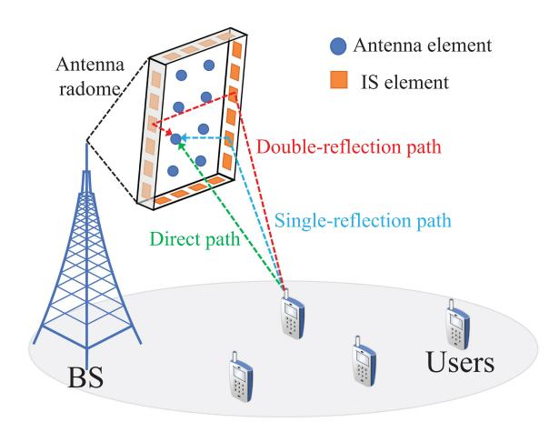

**Fig. 9. Illustration of IS-integrated BS, where the IS elements and BS antennas are integrated within the same antenna radome.**

# **B. Deployment**

The deployment of ISs has a significant impact on their reflected channels and the performance in IS-aided communication systems [\[92\],](#page-31-21) [\[95\],](#page-31-22) [\[104\],](#page-31-24) [\[105\].](#page-31-25) In this section, we present some practical approaches to deploy ISs and compare their performance advantages in different use cases.

*1) BS-Side IS:* The existing literature has mainly considered deploying ISs near user terminals to improve their performance. However, this approach may incur a high cost since ISs need to be densely deployed in the environment to cater to random user locations. Moreover, even with dense IS deployment, each user can only enjoy the passive beamforming gain brought by its nearby IS (as its signals reflected by other far-away ISs are generally much weaker due to more significant path loss). Zhang and Zhang [\[161\]](#page-32-49) have characterized the capacity regions achievable by two IS deployment strategies with the IS/ISs deployed near the BS and each of the distributed users, respectively, and showed the superiority of the former over the latter under the same total number of IS REs.

Motivated by this result, Huang et al. [\[162\]](#page-33-0) proposed a co-site-IS empowered BS architecture, where ISs are deployed in the vicinity of the BS to assist in its communications with distributed users regardless of their locations. To further reduce the product-distance path loss of cascaded BS-IS-user channels, a new *IS-integrated BS* architecture was proposed in [\[163\],](#page-33-1) where the IS REs are integrated into the internal surfaces of the antenna radome at the BS, as shown in Fig. [9.](#page-14-0) Due to the shorter distance between the IS REs and BS antennas, the IS reflection channels' path loss can be more significantly reduced as compared to that in [\[162\].](#page-33-0) Moreover, since the closely spaced IS REs have different orientations, multiple reflections among them may further improve the path diversity and the effective channel gain between the BS and user. Last but not least, with the IS being installed at the BS, this architecture can help reduce the signaling overhead and provide the power supply for IS as compared to the userside or co-site ISs which require dedicated wireless/wired signaling links and power supply.

However, the channel estimation for the IS-integrated BS is more challenging compared to the user-side and cosite IS systems because of the near-field channel response between the IS REs and BS antennas as well as more significant multireflection effects among IS REs. To circumvent this difficulty, Huang et al. [\[163\]](#page-33-1) proposed to employ the random phase algorithm (RPA) for IS reflection design without explicit CSI. Specifically, a large number of IS reflection patterns are generated with a random phase for each RE and their resulting communication performance is compared at the BS/user; and the one which achieves the best performance is then chosen as the IS reflection for data transmission. To further improve the performance of RPA, an iterative RPA (IRPA) method was proposed by alternately optimizing the reflection coefficients of each sub-IS [\[163\].](#page-33-1)

Since both the RPA and IRPA methods require a sufficiently large number of IS reflection patterns for performance measurement, the high training overhead may render them practically inefficient. To address this issue, a codebook-based passive reflection design for the ISintegrated BS was proposed in [\[164\].](#page-33-2) In particular, a small number of codewords are designed offline to enhance the coverage performance of multiple sectors in a cell. Then, the BS performs online training by testing all codewords sequentially and selecting the best one for data transmission. This solution significantly reduces the training overhead for IS reflection design and it is also robust to user mobility requiring IS slow adaptation to wireless channels in a long term.

Note that a BS-side IS is similar to a reflectarray as they both reflect signals from active antennas to attain the passive beamforming gain. Nonetheless, there are also differences between them. On the one hand, compared to the reflectarray, the deployment of ISs is more flexible, which can be placed in the vicinity of the BS or integrated into the antenna radome of the BS. In contrast, a conventional reflectarray is usually placed at the backside of the active antenna. On the other hand, reflectarrays are usually composed of a single planar surface mounted with reflecting elements. However, BS-side ISs can deploy multiple reflective surfaces with different positions and orientations around the BS [\[161\],](#page-32-49) [\[162\]](#page-33-0), which can exploit their single and double reflection gains to further improve communication performance. As such, the conventional reflectarray can be regarded as a special case of the BS-side IS by deploying a single reflective surface at the backside of the active antenna only.

*2) Multi-IS Deployment:* Despite the above appealing advantages of the BS-side IS, a blockage-free BS-user link via any BS-side IS may not be available in practice since the reflection paths by BS-side ISs only may fail to bypass

{15}------------------------------------------------

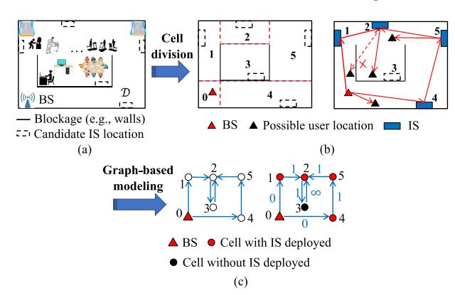

**Fig. 10. (a) Multi-IS-reflection-aided wireless network in a typical indoor environment. (b) Illustration of the cell division for the region and LoS paths created by ISs deployed at selected candidate locations. (c) Example of the graph-based model.**

the dense and scattered obstacles in complex environments [e.g., an indoor environment shown in Fig. [10\(a\)\]](#page-15-0). To overcome this limitation, recent works [\[103\],](#page-31-26) [\[126\],](#page-32-14) [\[165\],](#page-33-3) [\[166\],](#page-33-4) [\[167\],](#page-33-5) [\[168\]](#page-33-6), [\[169\],](#page-33-7) [\[170\]](#page-33-8) have proposed a multi-IS-reflection-aided wireless system, where multiple distributed ISs are deployed in the environment to create more available cascaded LoS paths between the BS and remote users, thereby significantly enhancing the wireless coverage, as shown in Fig. [10\(b\).](#page-15-0) To achieve this purpose, how to properly deploy multiple ISs to cater to the practical environment is a critical problem of high importance.

To address this issue, Mei and Zhang [\[171\]](#page-33-9) proposed a *graph-based* system modeling and optimization approach for multi-IS deployment. In particular, the network coverage area is first divided into multiple nonoverlapping cells containing a set of predetermined candidate locations for deploying ISs, as shown in Fig. [10\(b\).](#page-15-0) Then, based on the LoS path availability between any two candidate locations, a graph-based model was established to characterize the total deployment cost and communication performance of any IS deployment solution, as shown in Fig. [10\(c\),](#page-15-0) which also unveils an inherent tradeoff between deployment cost and communication performance. Finally, optimal and suboptimal multi-IS deployment designs were proposed in [\[171\]](#page-33-9) to reconcile this tradeoff.

However, the communication performance in [\[172\]](#page-33-10) was only evaluated in terms of the number of signal reflections per multi-IS link, which may not accurately indicate the actual performance of each user. To tackle this issue, Fu et al. proposed an enhanced graph-based system modeling approach which can characterize the SNR performance at any user location with a given multi-IS deployment solution. Moreover, to more effectively overcome the multiplicative path loss over the multireflection LoS links, the joint use of active and passive ISs was studied in [\[172\].](#page-33-10) The results in [\[172\]](#page-33-10) revealed that incorporating active ISs is beneficial to reduce the total deployment cost for achieving a given SNR target in the target region by dramatically reducing the number of passive ISs required.

*3) Relay-Side ISs:* When deployed in wireless networks, passive IS and active relay differ in many aspects such as energy/SE, hardware cost, processing complexity, and coverage range [\[174\],](#page-33-11) [\[175\]](#page-33-12). Specifically, passive IS can operate in full duplex and enhance the communication performance within its local coverage cost-effectively, while active relay typically operates in half duplex and can achieve broader coverage at the expense of more power consumption [\[114\],](#page-32-2) [\[176\],](#page-33-13) [\[177\]](#page-33-14). To harness their combined advantages, the relay-side IS deployment strategy has been proposed in some prior works. However, most of the existing works on relay-side IS simply add ISs to the relay system and deploy them separately [\[178\],](#page-33-15) [\[179\]](#page-33-16), [\[180\]](#page-33-17), [\[181\]](#page-33-18), [\[182\],](#page-33-19) which thus incurs additional deployment cost and signaling overhead. In contrast, an alternative relay-side IS deployment scheme was proposed in [\[173\]](#page-33-20) to integrate the active relay directly into the IS, by exploiting the new role of the IS controller as an active relay, as shown in Fig. [11.](#page-15-1) Specifically, IS-integrated relay significantly enhances coverage performance compared to conventional ISs (with passive signal reflection/refraction only), by enabling the IS controller to actively relay information without additional deployment or hardware cost. Moreover, similar to IS-integrated BS, IS-integrated relay also has a considerably shorter distance between IS REs and the active relay (see Fig. [11\)](#page-15-1), which yields several advantages such as reduced product-distance path loss (equivalently, increased effective channel gain), improved path diversity, expanded coverage range, and reduced signaling/information exchange overhead.

However, the channel estimation for the IS-integrated relay-aided communication system becomes more

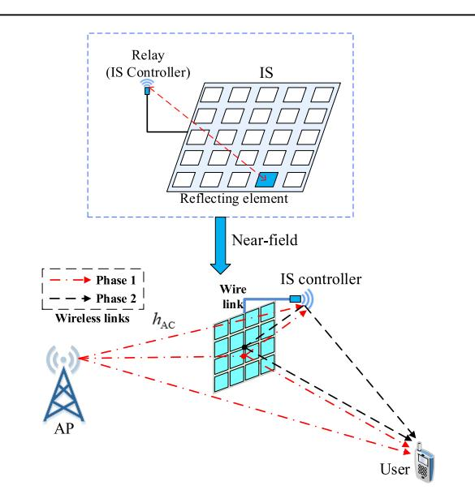

**Fig. 11. Relaying IS-assisted communication system [\[173\]](#page-33-20).**

{16}------------------------------------------------

challenging than that for the conventional IS-aided or relay-aided communication systems due to the increased number of channel coefficients and the near-field channel response between IS elements and relay antennas. To address this issue, a practical channel estimation scheme was proposed in [\[173\]](#page-33-20), where the cascaded/direct CSI of the BS-relay link and the relay-user link is estimated in parallel at the BS and user, respectively, based on the pilot signals sent from the relay. For practicality and to reduce training overhead, a codebook-based reflection design tailored for the IS-integrated relay may be considered, which needs to account for the mixed near- and far-field effect between relay/IS and BS/users (see Fig. [11\)](#page-15-1). On the other hand, half-duplex relay is considered in [\[173\]](#page-33-20) for ease of implementation, where two-phase relaying transmission is required and the IS can enhance both BSrelay and relay-user links by exploiting its time selectivity property over two phases. To boost transmission efficiency, the full-duplex relay could be considered for one-phase relaying transmission. However, this may introduce additional self-interference, necessitating sophisticated signal processing techniques to properly manage the interference, and the IS reflection would need to balance the transmission performance between BS-relay and relay-user links.

*4) Aerial ISs:* In addition to being deployed terrestrially, ISs can also be deployed or mounted on aerial platforms such as UAVs or balloons to achieve signal enhancement by providing additional LoS air-to-ground or air-to-air links, especially for postdisaster or scarcely covered areas [\[36\],](#page-30-35) [\[37\],](#page-30-36) [\[183\],](#page-33-21) [\[184\]](#page-33-22), [\[185\].](#page-33-23) To fulfill this application, the joint optimization of the aerial IS placement and the 3-D passive beamforming was considered in [\[186\]](#page-33-24) and [\[187\].](#page-33-25) Despite exploiting the additional design degree-offreedom (DoF) provided by the vertical dimension, the enhanced performance resulting from aerial ISs is mainly constrained by the limited onboard energy and computational capabilities. To overcome these challenges, practical energy-efficient resource allocation and placement/ trajectory optimization schemes have been proposed for designing aerial ISs [\[188\]](#page-33-26), where deep-learning-based algorithms exhibit potentials for solving nonconvex optimization problems with coupled variables more efficiently as compared to conventional optimization algorithms [\[189\].](#page-33-27) However, the signal transmitted on aerial links could suffer from high path loss, especially for highfrequency signals under long-distance transmission. To address this issue, aerial relaying architectures were studied in [\[190\]](#page-33-28) where UAV-mounted ISs relay the transmitted signals from aerial platforms at higher altitudes.

Furthermore, the application of IS to other types of airborne systems such as low Earth orbit (LEO) satellite communication is an emerging direction of high interest. Specifically, LEO satellite communication systems suffer from the large Doppler effect due to the high mobility of satellites, while its unfavorable effects on signal quality can be effectively mitigated by ISs [\[38\],](#page-30-37) [\[191\]](#page-33-29). In addition, the qualities of satellite-terrestrial and intersatellite links can be improved by utilizing ISs. For example, a new ISaided satellite communication system with two-sided cooperative ISs has been proposed, where the communications between the LEO satellite and various ground nodes are enhanced by distributed ISs deployed near them [\[192\].](#page-33-30) Zheng et al. [\[192\]](#page-33-30) also proposed an efficient cooperative beamforming design and a practical transmission protocol to achieve distributed channel estimation and beam tracking, and demonstrated the substantial performance gain and great potential of the IS-aided satellite communication. Nevertheless, to be more widely used in practice, the effects of aerial IS's mobility (e.g., trajectory drifts due to hardware imperfections) on system performance deserve further investigation.

*5) Roadside and Vehicle-Side ISs:* Existing research on IS has primarily focused on static or quasi-static wireless channels, which may not be applicable to high-mobility scenarios with fast time-varying channels, such as vehicular communications. In high-mobility communications, the transmitted signal often arrives at the receiver with rapidly time-varying phase shifts at different Doppler frequencies due to random scattering and high-speed motion, leading to superimposed multipath fast channel fading. Due to its real-time control of signal reflection/refraction, IS provides a new means of converting wireless channels from fast fading to slow fading in high-mobility scenarios, thus achieving more reliable communications. Initial works on IS-aided high-mobility communications have considered deploying multiple ISs at the roadside to enhance the communication performance between the BS and highmobility users moving on the road [\[193\],](#page-33-31) [\[194\]](#page-33-32), [\[195\],](#page-33-33) [\[196\]](#page-33-34). However, this approach requires a large number of roadside ISs (due to the limited coverage of passive reflection/refraction of each roadside IS) to guarantee seamless coverage for high-mobility users moving on the road, and frequent handovers between the user/BS and nearby serving ISs are required, which may require sophisticated ISs' coordination and beam alignment/tracking.

An alternative strategy is to install a vehicle-side IS at each vehicle to constantly improve communication performance between the remote BS and the IS-aided user [\[198\]](#page-33-35). Different from roadside IS deployment, vehicleside IS deployment only requires one IS per vehicle. In this case, the vehicle-side IS can easily associate with the onboard users constantly and much less frequent IS-BS handover is triggered. The comparisons between roadside and vehicle-side IS deployment are summarized in Table [5.](#page-17-0) Note that both roadside and vehicle-side ISs can be based on either signal reflection or refraction, depending on the deployment conditions. Moreover, to achieve high passive beamforming gain for both roadside and vehicle-side ISs, accurate CSI acquisition is essential yet practically challenging. This is due to the high-dimensional CSI associated with a large number of IS elements and the short channel

{17}------------------------------------------------

**Table 5** Comparison of Roadside IS and Vehicle-Side IS [\[197\]](#page-33-36)

| Deployment strategy | Channel characteristics |                 | Handover requirement |                  | Deployment cost            |
|---------------------|-------------------------|-----------------|----------------------|------------------|----------------------------|
| Deployment strategy | IS-BS channel           | User-IS channel | IS-BS handover       | User-IS handover | Beproyment cost            |
| Roadside IS         | Quasi-static            | Time-varying    | Frequent             | Frequent         | Scales with road length    |
| Vehicle-side IS     | Time-varying            | Quasi-static    | Less Frequent        | No Need          | Scales with vehicle number |

coherence time due to high mobility. As such, instead of full channel estimation/acquisition, it is practically appealing to perform beam alignment to efficiently track the fast time-varying cascaded user-IS-BS channel with low training overhead, which deserves further investigation.

*Summary:* In this section, we have reviewed the stateof-the-art IS deployment strategies, including BS-side ISs, multiple cooperative ISs, relay-side ISs, aerial ISs, roadside ISs, and vehicle-side ISs, which are important for practical use and adaption to various wireless environments and application scenarios. From the perspective of network architecture, BS-side ISs can save the high cost of densely deploying user-side ISs and also provide better overall system performance. Apart from deploying ISs near BSs, the IS-integrated BS architecture can further decrease the product-distance path loss by integrating IS REs into the BS's antenna radome, while the increased channel estimation complexity can be addressed by codebook-based IS reflection design. In complicated wireless environment with dense obstacles and scatterers, multiple ISs can be deployed to establish cascaded virtual LoS links by utilizing graph-based system modeling and optimization methods to improve the communication performance. For further performance enhancement, ISs can be deployed close to or integrated into active relays to combine the advantages of both. Considering the vertical dimension of wireless networks, aerial ISs can provide additional design DoFs for coverage enhancement. To cope with the fast timevarying channels in high-mobility scenarios, ISs can be deployed along roadside or on/in vehicles to mitigate the unfavorable effects of fast fading. For more practical use of these IS deployment strategies, however, various issues such as cross-band interference, hardware imperfections, and costly channel estimation should be further investigated.

#### **C. Modulation**

From a network functionality and information transmission perspective, we can classify ISs into two types depending on their roles in the network: relay-type IS and transmitter-type IS [\[199\].](#page-33-37) Specifically, an individual IS can function as either a relay or a transmitter, depending on its functionality and the specific use cases. Relay-type IS, as depicted in Fig. [12](#page-18-0) and discussed in Section [II-B,](#page-14-1) is strategically positioned between the source (e.g., BS) and the destination (e.g., users) to enhance communication performance between them, especially when the direct link is considerably weak or obstructed. On the other hand, transmitter-type IS is an integral part of the transmitter, participating in its signaling and modulation processes, as illustrated in Fig. [12.](#page-18-0) A key requirement is the capability for each IS element's phase/amplitude change at the symbol level, which poses a critical challenge in hardware design and implementation. However, with typical symbol periods of current wireless systems like 5G/Wi-Fi being in the order of microseconds, the switching speed of the IS element's phase/amplitude can match the symbol transmission rate [\[200\],](#page-33-38) [\[201\].](#page-33-39) A practical approach for realizing transmitter-type IS is by connecting IS with its aided transmitter via a reliable wired link, thus enabling real-time control of IS reflection on a per-symbol basis. In this section, we focus on the transmitter-type IS and provide an overview of two types of transmitter-type ISbased modulation: amplitude/phase modulation (APM) and index modulation (IM).

*1) IS for APM:* In a setup where the IS operates in transmitter mode, the incoming unmodulated carrier signal can be manipulated to encode information bits. In simpler terms, feeding the IS with an unmodulated carrier allows it to generate virtual signal constellations for transmitting information.

By adjusting IS reflection amplitudes and phases appropriately, one can generate virtual APM constellations. In this case, virtual phase-shift keying (PSK) constellations can be more easily created by altering outgoing signal phases.

The application of transmitter-type IS for APM offers two significant advantages. First, the hardware architecture of an IS-based transmitter can be simpler compared to traditional setups with upconverters and filters. Generating an unmodulated cosine carrier signal is straightforward, typically using an RF digital-to-analog converter with internal memory and a power amplifier. Second, the proximity of the IS to the signal source mitigates the multiplicative path loss effect. It is even feasible to position the IS in the transmitter's near field to further enhance received signal power, provided near-field effects are carefully considered. In the following, we briefly overview different APM schemes based on transmitter-type IS in the existing literature.

The early work of [\[202\]](#page-33-40) envisioned using the IS as an RF chain-free BS/AP by creating virtual PSK constellations over-the-air to perform data transmission. This study also provided a theoretical framework to analyze the bit error probability of the underlying system. Independently, Tang et al. [\[58\]](#page-31-27) developed an RF chain-free transmitter that employs metasurfaces to enable over-the-air eight-PSK modulation. This innovative design simplifies hardware, improves signal quality, and enhances the efficiency

{18}------------------------------------------------

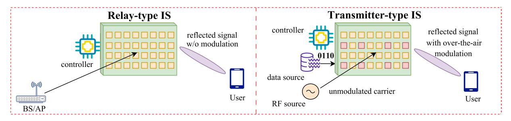

**Fig. 12. Comparison of transmitter-type and relay-type ISs.**

of wireless communication systems. In [\[203\],](#page-33-41) another strategy was considered to implement different modulation schemes, including quadrature amplitude modulation (QAM) and PSK, thanks to the use of harmonic frequencies. Specifically, IS has shown excellent capability to manipulate EM waves in different domains, such as space, time, and frequency, and this property is exploited for information modulation. Using this flexibility, the study of [\[204\]](#page-33-42) implemented an IS-based frequency-shift keying (FSK) scheme. Interested readers can refer to [\[205\]](#page-33-43) and references therein for a detailed description of information metasurface-enabled transmitter architectures.

Another distinctive attribute of transmitter-type IS is its ability to function as a virtual MIMO terminal. In this setup, an IS exposed to an unmodulated carrier signal can be configured to act as a virtual MIMO transmitter, completely devoid of RF chains. Specifically, in [\[206\],](#page-33-44) considering IS elements partitioning, two novel IS-based MIMO solutions were proposed. First, dividing the IS into two subsurfaces and using the PSK modulation over two time slots, an ISassisted Alamouti's scheme [\[207\]](#page-33-45) is realized with the IS acting as the transmitter. Second, an IS is used to enhance the performance of the nulling and canceling-based suboptimal detection procedure in a spatial multiplexing-based MIMO system and additional information bits are also transmitted by the phases of the IS REs to boost SE. Later, in [\[208\],](#page-33-46) a novel space–time code based on PSK modulation was designed for the single-antenna transmitter and IS, collectively acting as a virtual two-antenna transmitter to achieve transmit diversity without the need for any CSI. Moreover, it is demonstrated in [\[208\]](#page-33-46) that in addition to transmit diversity, IS can also achieve passive beamforming simultaneously, thus fulfilling both transmittertype and relay-type functions at the same time. In [\[209\],](#page-33-47) utilizing multiple digital-to-analog converters, an MIMO system that can transmit multiple streams was realized, and a 2 × 2 MIMO system was experimentally tested. It was shown that two independent 16-QAM data streams can be successfully received by a traditional receiver at a carrier frequency of 4.25 GHz. The above studies paved the way for designing more advanced IS-based transmitters subsequently. Specifically, in [\[210\]](#page-33-48), a dual-polarized IS architecture was created to transmit two data streams simultaneously at a transmission rate of 20 Mb/s.

On the other hand, the principle of transmitter-type IS is also similarly applied in backscatter communication, where a backscatter device (BD) transmits messages to a backscatter receiver (BR) by reflecting an incident signal from an external RF emitter. The adaptability of IS allows for its effective deployment in backscatter communication networks. Specifically, the fundamental principle of IS-aided backscatter communication was introduced in [\[211\],](#page-33-49) with various types of modulation considered. Basharat et al. [\[212\]](#page-33-50) further analyzed cooperative IS and backscatter communication performance with different APMs. The bit error rate (BER) performance of IS-aided backscatter communication networks was examined in [\[213\]](#page-33-51), demonstrating the effectiveness of ISs in improving the channel conditions of both source-reader and sourcetag links. The closed-form achievable rate expressions for IS-aided backscatter communication networks were provided in [\[214\]](#page-33-52). Further investigation was made in [\[215\]](#page-34-0), where the achievable rate of IS-aided backscatter communication networks adopting M-PSK was maximized by jointly optimizing the phase shifts of IS. Unlike the aforementioned literature where an IS is used solely for link enhancement, Basar [\[202\]](#page-33-40) explored the function of an IS as an AP with an unmodulated carrier, showing that ISs can also perform backscatter communication. Building on this result, Yang et al. [\[216\]](#page-34-1) proposed dividing an IS into two parts, one for transmitting the primary data signal and the other for transmitting the backscatter signal.

*2) IS for IM:* IM, which leverages the indices of available transmit entities to encode digital information [\[217\],](#page-34-2) has also motivated another new line of research on transmitter-type IS-based communication systems. In the early work of [\[218\],](#page-34-3) an IS illuminated by an unmodulated carrier was utilized to perform IM by directing the signal to a terminal's receive antennas. This study also introduced the concept of IS-based IM as a potential solution beyond MIMO by considering IM at different parts of the system. In the following studies of [\[219\]](#page-34-4) and [\[220\]](#page-34-5), the performance of a space-shift keying scheme was investigated in the presence of an IS.

The concept of IS-based IM was further advanced in [\[221\]](#page-34-6), where a promising IM scheme was proposed for transmitter-type IS. Depending on joint or independent 

{19}------------------------------------------------

data mapping of the transmitter and the IS to deliver information, IM is further divided into two categories: jointly mapped and separately mapped IM. To enhance transmission reliability, Guo et al. [\[221\]](#page-34-6) proposed a discrete optimization-based joint signal mapping, shaping, and reflecting design with a given transmit signal candidate set and a given reflecting pattern candidate set. By combining reflect beamforming and IM, a subset of the IS REs are activated to reflect a sharp beam toward the intended destination while exploiting the index combination of the ON-state IS elements to implicitly convey additional information [\[222\].](#page-34-7) Given the potentially large number of REs at the IS, this leads to significant computational and storage overhead for mapping information bits to ON-state elements. The authors, thus, adopted a grouping strategy to solve this issue by dividing the IS into subgroups for activation. To further enhance reflection power efficiency, Lin et al. [\[223\]](#page-34-8) proposed quadrature IM for transmittertype IS. In this approach, the IS elements are partitioned into two subsets to reflect incident signals toward two orthogonal spaces, thus achieving simultaneous passive beamforming and quadrature IM-based information transfer. Using a similar IS subgrouping strategy but considering a hybrid IS composed of both active (amplifying) and passive reflecting elements, hybrid IM was introduced in [\[224\]](#page-34-9). In this scheme, an over-the-air IS modulation scheme is considered by turning active and passive IS subgroups on and off to create a virtual amplitude-shift keying (ASK) constellation. The phase modulation concept has also been combined with space-shift keying, where the IS embeds its own information by adjusting its phase shifts [\[225\].](#page-34-10)

*Summary:* In this section, we have mainly reviewed the works on transmitter-type IRS, which serves a unique role in network functionality. A transmitter-type IS can simplify hardware architecture and enhance signal quality by participating in signaling and modulation processes, which are generally based on two types of modulation: APM and IM. Specifically, ISs can implement various modulation schemes (e.g., PSK, QAM, and FSK) and act as virtual MIMO terminals, thus enabling transmit diversity. Through IM techniques, ISs can selectively activate/deactivate reflecting elements to convey additional information. Despite these promising recent advances in IS-based modulation designs, critical challenges remain to be tackled for fully unlocking their potential for future wireless networks. As the changing speed of each IS element's phase/amplitude at the symbol level poses stringent requirements, the resulted low data rate of reflection modulation is another practical issue to address in future work.

# **D. Sensing and ISAC**

ISAC has been regarded as a promising technique for the 6G wireless network, where the sensing function and the communication function can be carried out simultaneously by sharing the same spectrum and hardware facilities [\[226\]](#page-34-11), [\[227\],](#page-34-12) [\[228\]](#page-34-13). However, ISAC systems still face practical challenges. For example, sensing coverage is significantly smaller than communication coverage due to severe path loss in the BS-IS-target-IS-BS cascaded echo link. Although the sensing coverage can be guaranteed by deploying more BSs, this method incurs high hardware cost and energy consumption. On the other hand, hardware sharing of communication and sensing transceivers increases the design and implementation complexity, while spectrum sharing of communication and sensing signals results in interference and performance tradeoff. Fortunately, the use of IS can achieve higher spectral/energy efficiency for wireless communication [\[229\],](#page-34-14) [\[230\]](#page-34-15), as well as higher accuracy for wireless sensing, thus promising to enable ISAC for 6G [\[231\],](#page-34-16) [\[232\]](#page-34-17), [\[233\].](#page-34-18) Specifically, the IS can establish LoS channels to enhance both sensing/communication coverage, provide flexible passive beamforming to balance their performance tradeoff, and reduce hardware cost and energy consumption compared to dense deployment of BSs [\[234\],](#page-34-19) [\[235\].](#page-34-20) Also, equipping ISs with sensing capabilities enables an easier deployment of the ISs [\[236\]](#page-34-21) and energy harvesting capabilities [\[237\].](#page-34-22)

*1) IS-Enhanced Wireless Sensing:* Promising new system architectures are essential to overcome the sensing range bottleneck for wireless sensing systems. IS passive sensing is shown in Fig. [13\(a\),](#page-20-0) where the sensing performance is improved by establishing a virtual LoS link from the BS to the IS and then to the target [\[238\],](#page-34-23) [\[239\].](#page-34-24) However, the practical performance of IS passive sensing is limited by the severe path loss of the cascaded echo link. To address this issue, IS semipassive sensing was proposed in [\[240\]](#page-34-25) [see Fig. [13\(b\)\]](#page-20-0), where dedicated low-cost active sensors are installed on the IS (i.e., semipassive IS), allowing it not only to reflect signals from the BS but also to directly receive echo signals from the target for sensing. As such, IS semipassive sensing incurs lower path loss compared with IS passive sensing. Nevertheless, if the BS is far from the IS, the sensing accuracy of IS semipassive sensing remains limited. To overcome this issue, a new type of IS-aided sensing architecture, called *IS active sensing*, has recently been proposed [\[241\]](#page-34-26) [see Fig. [13\(c\)\]](#page-20-0). Specifically, in IS active sensing, the IS controller, typically responsible for reflection control and information exchange only, also acts as a transmitter to send probing signals for sensing. This allows the IS to autonomously send (via the IS controller) and receive (via sensors) sensing signals for target localization, thus avoiding the dependence on BSs for sensing signal transmission/reception. Although IS active sensing incurs higher hardware and energy cost than IS passive/semipassive sensing, it achieves superior sensing performance due to the short signal propagation distance and also helps reduce the BS transmit power for sensing.

For conventional IS-aided wireless sensing systems, the IS is deployed in the environment as an anchor node, and its sensing performance relies crucially on the strength of the reflected echo signal from the target to the receiver

{20}------------------------------------------------

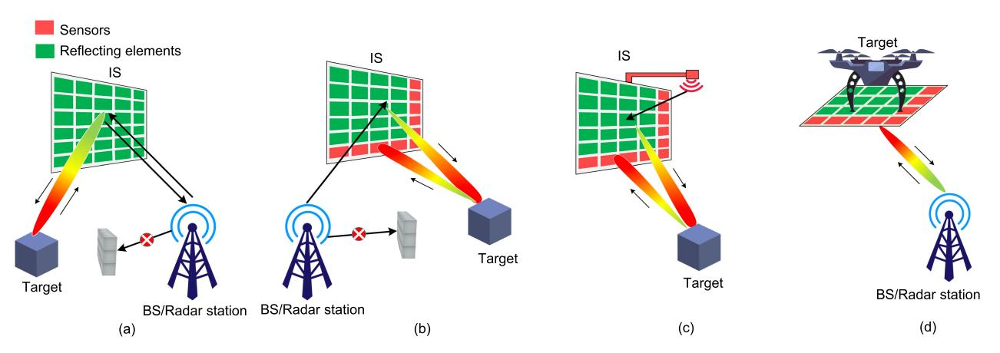

**Fig. 13. Schematics for four IS-aided wireless sensing architectures. (a) IS passive sensing. (b) IS semipassive sensing. (c) IS active sensing. (d) Target-mounted IS sensing.**

for detection/estimation. However, this approach may be practically inefficient in achieving reliable sensing when the RCS of the target is limited. Recently, an interesting new approach called *target-mounted IS* was proposed in [\[242\],](#page-34-27) [\[243\],](#page-34-28) [\[244\],](#page-34-29) and [\[245\],](#page-34-30) where IS is mounted on the target [see Fig. [13\(d\)\]](#page-20-0) to provide enhanced/secure sensing by leveraging IS's controllable signal reflection and high spatial resolution thanks to its large aperture. For example, Wang et al. [\[243\]](#page-34-28) considered mounting fully passive IS on the sensing target, thereby estimating the IS's location and orientation as that of the target via a tensor-based algorithm. Due to the improved target RCS and controllable signal reflection, this approach can significantly enhance the 6-D sensing performance of the target (i.e., 3-D position and 3-D orientation) even when the number of receivers/receiver antennas is small.

Besides enhancing sensing accuracy, target-mounted IS has also been proposed to improve wireless sensing security. Specifically, secure sensing aims to enhance the sensing performance of the legitimate radar station (LRS) while preventing the target detection by any unauthorized radar station (URS). To achieve this goal, Shao and Zhang [\[242\]](#page-34-27) proposed a general secure sensing protocol with target-mounted semipassive IS, where each radar coherent-processing interval is divided into two phases. In the first phase, the IS sensors estimate the LRS/URS channel and waveform parameters with all IS REs switched off. After that, in the second phase, based on the estimated parameters, IS reflection is designed to simultaneously boost the received signal at the LRS receiver and suppress that at the URS receiver. Benefiting from the flexible passive beamforming gain, such a new design with targetmounted IS can offer significant secure sensing performance gains as compared to the conventional sensing without target-mounted IS. Moreover, target-mounted IS also gives rise to a novel application in EM stealth technology for evading radar detection [\[246\],](#page-34-31) [\[247\]](#page-34-32), which offers a flexible and adaptable solution to overcome the limitations of traditional stealth materials. Zheng et al. [\[246\]](#page-34-31) and Xiong et al. [\[247\]](#page-34-32) proposed an optimization problem for designing the IRS's reflection at the target to minimize the sum of received signal power over all adversary radars to achieve EM stealth. Low-complexity closedform solutions based on reverse alignment/cancellation and minimum mean square error (MMSE) criteria were proposed in [\[246\]](#page-34-31) for the single-radar and multiradar cases, respectively. This new application of target-mounted IS opens up new research avenues in antiradar detection, providing a promising direction for future exploration in this field.

*2) IS-Aided ISAC:* How to design IS-assisted ISAC systems to achieve optimal sensing and communication performance without significantly changing existing protocols in cellular systems is a key challenge [\[248\],](#page-34-33) [\[249\]](#page-34-34), [\[250\].](#page-34-35) To overcome this challenge, Pang et al. [\[251\]](#page-34-36) proposed to exploit cooperative ISs' passive beam searching and the communication signal from the BS (e.g., pilot signal sent for channel estimation) for cellular UAV target sensing. The associated sensing protocol is shown in Fig. [14,](#page-20-1) where each channel coherence interval is divided into three phases. In the first phase, the background channel is estimated without IS reflection. After that, in the second phase, the

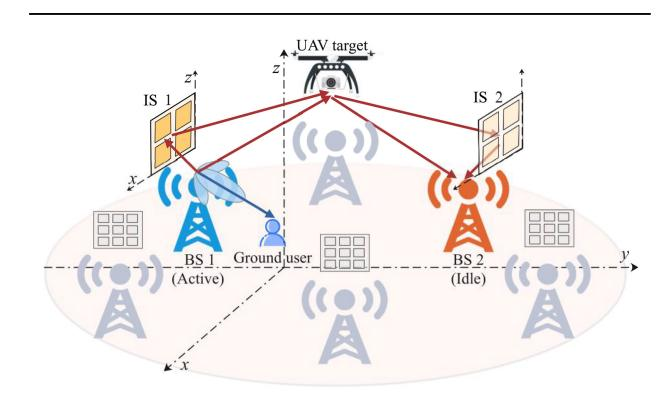

**Fig. 14. IS-aided ISAC for cellular-connected UAVs.**

{21}------------------------------------------------

angle parameters between IS 1 and UAV are estimated with IS 2 off. Finally, in the third phase, the angle parameters between IS 2 and UAV are estimated with IS 1's beam fixed as the best one obtained in the second phase. Note that by properly selecting the idle BS (i.e., without communicating with any user) and its sensing resource block, the communication interference from other active BSs (i.e., communicating with a user) to the sensing signal at idle BS can be ignored thanks to the intercell interference coordination (ICIC). The authors demonstrated that this cellular ISAC scheme not only requires no modifications to the existing BS beamforming design and transmission protocol, but also does not impact the communication performance of users in the existing network, thus achieving a superior performance tradeoff between sensing and communication.

The IS is also particularly advantageous in mmWave ISAC to compensate for the high path loss, thus greatly improving the sensing coverage and communications performance [\[252\],](#page-34-37) [\[253\].](#page-34-38) In mmWave communication, beam scanning/training is widely applied [\[254\]](#page-34-39) and can be exploited for simultaneous target sensing. Li et al. [\[255\]](#page-34-40) considered an mmWave ISAC system where a multipleantenna BS aims to communicate with a single-antenna user, and also to detect the angle of a sensing target from the semipassive IS. They proposed a two-phase simultaneous beam training and sensing (STAS) protocol to enhance local communication and sensing performance at the same time via IS passive beam scanning. Specifically, in the first phase, the ISAC system finds the best beam for communication user and concurrently detects the target based on its echo signal received by IS sensors. Next, in the second phase, data are sent to the communication user with the best IS beam found in the first phase. Due to the effective utilization of the DL beam training signal for simultaneous sensing, the STAS protocol outperforms the benchmark protocol with orthogonal beam training and sensing.

To show the fundamental tradeoff in the above IS-aided mmWave ISAC, Fig. [15](#page-21-1) shows the achievable rate for communication and root Cramér-Rao bound (RCRB) for sensing versus the IS beam training time with the STAS scheme [\[255\].](#page-34-40) The number of IS REs and sensors are set as 64 and 8, respectively, and the carrier frequency is 28 GHz. As IS beam training time increases, IS beamforming gain increases at the expense of reduced data transmission time, which results in an initial increase and subsequent decrease in the achievable rate for the communication user. In contrast, sensing RCRB monotonically decreases with beam training time. Thus, beam training time needs to be properly set to balance the communication-sensing performance tradeoff.

*Summary:* In this section, we have discussed IS-aided sensing schemes based on four approaches, namely, IS passive sensing, IS semipassive sensing, IS active sensing, and target-mounted IS sensing. We compared their pros and cons in terms of performance, hardware cost, and

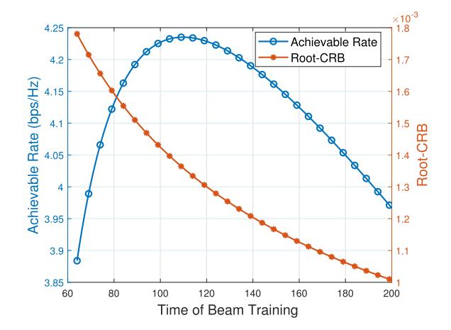

**Fig. 15. Achievable rate and RCRB versus beam training time.**

implementation complexity. In addition, we discussed ISaided ISAC for cellular-connected UAV and mmWave systems. In Table [6,](#page-22-0) we summarize the up-to-date research works on exploring IS-aided sensing and ISAC. To motivate future research on IS-aided ISAC, several important directions are briefly discussed as follows which still need in-depth investigation. First, it is necessary to explore the connection between the IS-aided sensing and communication channels to enhance ISAC performance. Furthermore, new IS architectures, such as target-mounted IS [\[244\],](#page-34-29) STAR-RIS [\[261\],](#page-34-41) and active IS [\[262\]](#page-34-42) (to be discussed in Section [III](#page-21-0) in detail), open new opportunities for ISAC performance improvement.

# **III. A D V A N C E D I S A R C H I T E C T U R E S : R E C E N T P R O G R E S S A N D N E W C H A L L E N G E S**

Besides the passive reflection-based ISs discussed in Section [II,](#page-6-0) several new IS architectures have been proposed to overcome their limitations and enable broader applications with improved performance, including active IS, omnidirectional IS, and holographic IS, elaborated as follows.

#### **A. Active IS and Integrated Active/Passive IS**

*1) Active IS:* The communication performance of passive-IS-assisted systems is practically constrained by the severe product-distance path loss in signal reflections, which can be compensated for by equipping ISs with a massive number of passive reflecting elements or reduced by deploying the passive ISs closer to the transceivers. However, these methods may not be applicable in practice, due to the high design complexity and practical site constraints. To address this issue, an efficient approach is by deploying a new type of IS for assisting wireless communication, called *active* IS, which enables the signal reflection with *power amplification* for effectively compensating for the product-distance path loss [\[49\],](#page-31-1) [\[263\],](#page-34-43) [\[264\]](#page-34-44). Generally speaking, active IS can be implemented

{22}------------------------------------------------

**Table 6** Summary of Representative Works on IS-Aided Sensing/ISAC Systems

| Reference            | Applications                                    | Link status                          | Type of IS         | Role of IS                                                     | Design objectives                                                                                                           | Algorithms                                                   |
|----------------------|-------------------------------------------------|--------------------------------------|--------------------|----------------------------------------------------------------|-----------------------------------------------------------------------------------------------------------------------------|--------------------------------------------------------------|
| Sensing [240], [241] | Target DoA esti- mation                      | Only LoS                             | Semi-passive IS | Sensing                                                        | Improve the MSE of sensing                                                                                                  | MUSIC                                                        |
| Sensing [242], [245] | Secure sensing                                  | Only LoS                             | Semi-passive IS | Sensing and sensing security                             | Maximize IS reflected sig- nal power to legitimate radar, while limiting it to unautho- rized radar                | PDD-based algo- rithm                                     |
| Sensing [246], [247] | Electromagnetic stealth                         | Only LoS                             | Semi-passive IS | Stealth and sensing security                                   | Optimize the IS's reflection at the target to minimize the re- ceived signal power of adver- sary radars           | Reverse cancel- lation/MMSE and Lagrange multiplier |
| Sensing [256]        | Far-field and near-field target detection | LoS and NLoS                         | Passive IS         | Sensing                                                        | Maximization of the probability of detection under a fixed probability of false alarm                                       | Forward-backward optimization via alternating maximization   |
| Sensing [257]        | 3D object detection                             | Only LoS                             | Passive IS         | Sensing                                                        | Minimizing cross-entropy loss of the beampattern                                                                            | Deep reinforcement learning                            |
| ISAC [233]        | DFRC with Rayleigh fading                    | Communication LoS, target LoS  | Passive IS         | Sensing and communication                                      | Maximize the radar output SINR while satisfying the communication QoS require- ment                                | ADMM and MM                                                  |
| ISAC [258]        | DFRC with Rician fading                         | Communication NLoS, target LoS | Semi-passive IS | Communication                                                  | Improve the MSE of sensing and communication channels                                                                       | Train with the Adam optimizer and MSE loss function |
| ISAC [259]        | Secure ISAC                                     | Communication NLoS, target LoS | Passive IS         | Sensing, communi- cation, and information security | Maximize the sensing beam- pattern gain while guarantee- ing communication and infor- mation security requirements | Lagrange duality and MM                                      |
| ISAC [260]        | Wideband DFRC                                   | Communication NLoS, target LoS | Passive IS         | Sensing and communication                                      | Maximize the average SINR of radar and the minimal communication SINR among all users                                       | Dinkelbach's method and ADMM                           |
| ISAC [255]        | Millimeter-Wave DFRC                         | Communication LoS, target LoS  | Semi-passive IS | Sensing and communication                                      | Use downlink beam scanning for simultaneous beam training and target sensing                                                | ISAC protocol design                                         |

by two types of hardware architectures, as illustrated in Fig. [16,](#page-22-1) namely: 1) the cascaded amplifying and phaseshifting (APS) circuits [see Fig. [16\(a\)\]](#page-22-1) [\[263\]](#page-34-43) and 2) load modulation circuits (e.g., tunnel diodes) [see Fig. [16\(b\)\]](#page-22-1) [\[264\].](#page-34-44) With the power amplification capability, active IS can be used for not only improving the communication performance, but also enhancing the performance of other wireless applications, such as wireless power transfer (WPT) and physical layer security [\[265\],](#page-34-45) [\[266\],](#page-34-46) [\[267\],](#page-35-0) [\[268\]](#page-35-1), [\[269\],](#page-35-2) [\[270\]](#page-35-3), [\[271\],](#page-35-4) [\[272\].](#page-35-5) In this section, we provide an overview of recent research results on active IS from the communication design perspective, including

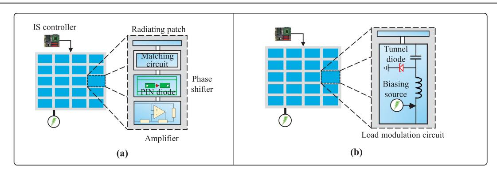

**Fig. 16. Two types of active IS hardware architectures. (a) Active IS, Type I. (b) Active IS, Type II.**

{23}------------------------------------------------

active-IS reflection optimization, channel estimation, and deployment.

First, the active-IS reflection design is more complex than the passive-IS case since it needs to jointly optimize the active-IS reflection amplitude and phase. Moreover, compared with passive IS, there is a new design tradeoff for active IS between maximizing the received signal power and minimizing the amplification noise and residual self-interference power. Although the above issues usually render nonconvex constraints over IS reflection coefficients and thus nonconvex optimization problems, various methods have been proposed in the literature to optimize the active-IS communication performance from different aspects. For example, Long et al. [\[264\]](#page-34-44) proposed an alternating optimization (AO)-based algorithm to maximize the SNR for an active-IS-aided single-input multipleoutput (SIMO) system. In addition, Zhi et al. [\[273\]](#page-35-6) investigated a multiuser multiple-input single-output (MISO) system, where a joint transmit beamforming and reflect precoding scheme was proposed to maximize the sum rate by using fractional programming techniques. Moreover, instead of the fully-connected active IS, a subconnected active-IS architecture was proposed in [\[274\]](#page-35-7) to reduce the power consumption of an active-IS-aided multiuser MISO system, where the active IS elements are grouped into multiple subsurfaces, each consisting of one power amplifier. This new architecture offers a flexible tradeoff between minimizing the power consumption and maximizing the communication rate for active IS. Furthermore, for wideband active-IS systems, Zhang et al. [\[275\]](#page-35-8) proposed a novel hardware architecture for OFDM active-IS systems to address its frequency nonselectivity issue. Specifically, each active-IS element/subsurface is equipped with multiple amplifying and phase-shift circuits operating at different frequencies. Then, the subcarriers are partitioned into several groups, each configured by one amplifying and phaseshift circuit.

Second, for active-IS channel estimation, the conventional methods designed for passive ISs cannot be directly applied since the active-IS reflection design generally requires the CSI of the separate transmitter-IS and ISreceiver links (instead of the cascaded CSI for passive IS) due to the new consideration of amplification noise. Moreover, the amplification factors need to be properly chosen in the active-IS channel estimation for satisfying the maximum amplification power constrain. To address the issue in estimating the BS-IS channel, Kang et al. [\[276\]](#page-35-9) proposed two practical channel estimation schemes with and without IS-mounted sensors, respectively. In addition, by assuming the BS-IS link CSI known a priori based on the fixed BS and IS locations, Chen et al. [\[277\]](#page-35-10) proposed a new training reflection pattern for active IS, by minimizing the estimation error variance of the IS-user channel in the presence of active-IS-induced noise.

Last, for the active-IS deployment design, several factors need to be considered, such as the physical environment, number of ISs and their REs, UL or DL communication, and amplification power budget. Specifically, for the singleactive-IS-aided communication system, it was shown in [\[262\]](#page-34-42) that the active-IS should be deployed closer to the receiver to compensate for the amplification noise in the DL/UL. It was revealed in [\[278\]](#page-35-11) that given the fixed perelement amplification power, the received SNR at the user increases asymptotically with the *square* of the number of REs, while the double-active-IS-aided wireless system only achieves a *linear* capacity scaling order with the number of active REs under the total amplification power constraint, due to the noise amplification over the double-reflection link [\[279\].](#page-35-12)

*2) Integrated Active/Passive IS:* Besides the use of active and passive ISs only, recent research has also been dedicated to studying efficient approaches to integrate both active or passive ISs in one system to harness their respective advantages. Specifically, one efficient approach is by deploying both active and passive elements in a single surface, as shown in Fig. [17\(a\),](#page-24-0) which is called *hybrid* (active/passive) IS [\[280\],](#page-35-13) [\[281\].](#page-35-14) For this architecture, Kang et al. [\[280\]](#page-35-13) proposed to optimize the hybrid-IS elements allocation based on the statistical CSI under the constraints on the total deployment budget and maximum amplification power. It was shown that with optimized elements allocation, the hybrid-IS can achieve better communication performance than the conventional IS with active or passive elements only. The same hybrid-IS architecture is further studied in [\[282\]](#page-35-15) to maximize the system's energy-efficiency. On the other hand, Sankar and Chepuri [\[283\]](#page-35-16) considered a different hybrid-IS architecture, where each element is integrated with an amplifier and can be switched between the active and passive modes. For this hybrid-IS architecture, it was demonstrated that the received SNR at the user can be further improved by optimizing the placement of active IS elements according to different channel gains at different elements' locations.

In contrast, another design of integrated active and passive ISs deploys both active and passive ISs in a distributed manner to improve the communication performance of the wireless network, as illustrated in Fig. [17\(b\)](#page-24-0) [\[170\],](#page-33-8) [\[172\],](#page-33-10) [\[284\]](#page-35-17). For example, instead of deploying multiple passive ISs only in the wireless system for passive beam routing, a more effective approach is by adding several active ISs in the network to enable *opportunistic* signal amplification over some multireflection signal paths, thus more effectively compensating for the product-distance path loss. For this new multiactive and multipassive (MAMP) IS-aided wireless system, Zhang et al. [\[170\]](#page-33-8) proposed a new hierarchical beam routing design to solve the intricate MAMP-IS beam routing problem based on graph theory. Besides the beam routing design, the communication performance of the MAMP-IS-aided wireless system can be further improved by optimizing the placement of active/passive ISs. Fu et al. [\[284\]](#page-35-17) considered a wireless information and power transfer system aided by a single active-IS and multiple passive-ISs via a multireflection path. It was shown

{24}------------------------------------------------

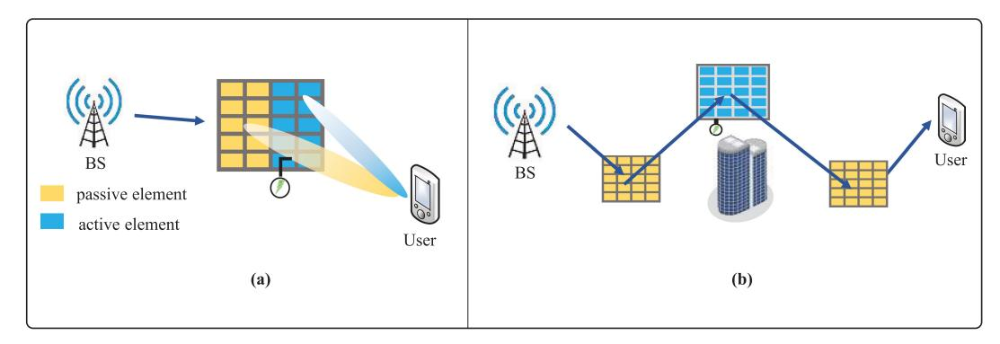

**Fig. 17. Illustration of integrated active and passive IS designs. (a) Hybrid active–passive IS. (b) Multiactive–multipassive (MAPA) IS.**

that given fixed passive-IS locations, the optimal active-IS placement is generally different for wireless information transfer (WIT) versus WPT due to different roles of active-IS-induced amplification noise. Furthermore, Fu et al. [\[172\]](#page-33-10) optimized the locations of all active/passive ISs in an MAMP-IS-aided wireless system in a given region. An optimization problem was formulated and efficiently solved to minimize the total deployment cost under the SNR constraints.

In future work, there are several key design issues worthy of investigation. For example, the existing works on active-IS have usually assumed ideal reflection coefficients with continuous and independent phase shift and amplitude control, which may not be implementable in practice and thus calls for efficient algorithms to handle their practical constraints. In addition, for MAMP-IS-aided systems, it is interesting to study how to optimize the density of active and passive ISs in a multicell network for maximizing the network throughput by using, e.g., the stochastic geometry theory [\[285\]](#page-35-18). Furthermore, a research direction is the design of globally passive ISs based on the optimization of surface waves since no power amplifiers are required but more advanced optimization schemes are needed [\[286\].](#page-35-19)

# **B. Omnidirectional IS**

Our discussions so far have mainly focused on reflectionbased ISs, passive, or active. However, reflection-based ISs have one fundamental limitation after they are deployed in practice: they can only *reflect* incident waves from a restricted angular range, i.e., only users and the BS that are located in the same reflection half-space of the IS can benefit from the signal reflection by the IS. To overcome this restriction, a new concept of omnidirectional IS has been proposed [\[106\].](#page-31-28) The omnidirectional IS can enable a dual function of signal reflection and refraction simultaneously, i.e., some power of the incident signal is reflected to serve users located in the same reflection half-space of the IS, and the rest of the power penetrates the IS to serve users located in the refraction half-space of the IS [\[287\]](#page-35-20), [\[288\].](#page-35-21) As a result, a doubled 360◦ service coverage is ensured compared to reflection-based IS. This type of surface is also referred to as STAR-RIS as aforementioned [\[289\].](#page-35-22) In this section, we first introduce the working principles of the omnidirectional IS and its new characteristics. Then, two hardware implementations of the omnidirectional IS are presented. Finally, emerging applications of the omnidirectional IS are discussed.

*1) Working Principles:* An omnidirectional IS is an engineered surface that comprises electrically controllable scattering elements. Each element comprises multiple metallic patches and N p-i-n diodes that are evenly distributed on a dielectric substrate, as shown in Fig. [18.](#page-24-1) The metallic patches are connected to the ground via the p-i-n diodes that can be switched between their ON- and OFF-state according to predetermined bias voltages. The ON/OFFstate of these p-i-n diodes determines the amplitude and phase responses applied by the omnidirectional IS to the incident signals. Each metallic patch can be configured in 2N different states, which results in P ≤ 2 N different amplitudes Γ and phases θ (usually equally distributed in [0, 2π]), depending on the implementation of the omnidirectional IS. As illustrated in Fig. [18,](#page-24-1) when a signal impinges, from either side of the surface, upon one element of the omnidirectional IS, for example, a fraction of the incident power is reflected and refracted toward the same side and the opposite side of the incident signal,

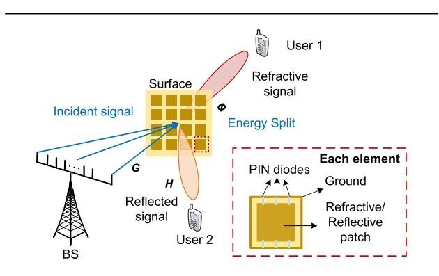

**Fig. 18. Illustration of the omnidirectional IS-based hybrid beamforming for two users.**

{25}------------------------------------------------

respectively [\[39\]. U](#page-30-38)nder the assumption of periodic boundary conditions, complex-valued reflection and refraction coefficients of a generic omnidirectional IS element can be defined. Mathematically, the received signals at each user can be expressed by

$$y = H\Phi Gx \tag{1}$$

where x is the signal vector at the BS, G is the channel matrix between the BS and the omnidirectional IS, and H is the channel matrix between the omnidirectional IS and the user. Φ is the phase-shift matrix of the omnidirectional IS, which is different for reflection and refraction in general. Φ is typically diagonal, and its diagonal elements correspond to the reflection/transmission coefficient of each omnidirectional IS element Γe −jθ, respectively.

In general, the reflection and refraction/transmission coefficients may depend on the direction of incidence. The amplitude of the reflection and transmission coefficients of a generic omnidirectional IS element is determined by the size and shape of each element. It is worth mentioning that the proposed omnidirectional IS is flexibly designed to ensure that the amplitude of the reflected and refracted signals can be different. The power ratio between them is, in particular, a constant determined by the hardware implementation of the omnidirectional IS elements. When the states of the p-i-n diodes are changed, the reflection and transmission coefficients are changed simultaneously. For instance, the phase shifts for reflection and refraction satisfy a linear model as suggested in [\[106\]](#page-31-28), i.e., a pair of reflection and refraction phase shifts satisfies θt(i)−θr(i) = c(i), where the subscript i refers to the ith omnidirectional IS element and c(i) is a constant. This indicates the coupling of refraction and reflection, which needs to be considered in the omnidirectional IS beamformer design.

- *2) New Characteristics:* Due to the coupling of refraction and reflection, the following key factors need to be revisited in order to achieve full-dimensional omnidirectional IS-aided communications.
  - 1) *Channel characteristics:* As the omnidirectional IS splits the energy of the incident signals, one may raise a question: does the UL and DL reciprocity hold for omnidirectional IS-aided wireless communications? According to the theoretical analysis and experimental results given in [\[290\],](#page-35-23) the authors showed that the channels are reciprocal while the beams are not. This indicates that we may not need separate channel estimations for UL and DL, but we may need different phase configurations for UL and DL communications, which is different for reflection-based ISs. Channel estimation is, however, a critical issue for omnidirectional IS-aided wireless communication systems because of the coupling effect of reflection and refraction. An initial attempt to tackle this issue can be found in [\[291\],](#page-35-24) where Wu et al. used the MMSE

- metric to estimate the CSI, by jointly designing the pilot sequences of the users, the energy splitting ratio, and the training pattern matrices under a coupled phase-shift model.
- 2) *Phase-shift optimization:* Due to the coupling between reflection and refraction, the phase optimization for an omnidirectional IS is different from that of reflection-based ISs, where only the users on one side of the surface are considered. Two cases were considered in the literature.
  - a) *CSI is known.* Zhang et al. [\[39\]](#page-30-38) proposed a hybrid beamforming framework for an omnidirectional ISaided wireless system, where an omnidirectional IS is deployed at the cell edge to extend the coverage. Here, assuming that the CSI is perfectly known at the BS, the authors jointly optimized the digital beamformer at the BS and the analog beamformer enabled by the omnidirectional IS with discrete phase shifts to maximize the sum rate. Their results showed that an omnidirectional IS enhances the data rate of users located on both sides of the surface, which asymptotically doubles the achievable sum rate and the service coverage.
  - b) *CSI is unknown.* In dynamic environments, it is costly to obtain real-time CSI. The work in [\[292\]](#page-35-25) developed a codebook-based scheme to bypass the channel estimation. In this work, a phaseshift configuration of the omnidirectional IS corresponds to a codebook, and the codebooks for the BS and the omnidirectional IS are predesigned jointly. Then, a multilayer beam training scheme was proposed to select a codeword with the maximum data rate. Zeng et al. [\[293\]](#page-35-26) further analyzed the optimal codebook size to achieve a tradeoff between the data rate and the training overhead for an omnidirectional IS-aided wireless system. The results showed that the optimal codebook size is influenced by the refraction–reflection ratio, which decreases as the ratio approaches one. Moreover, as the reflection and transmission coefficients depend on the incident angle, the orientation and position of the omnidirectional IS also need to be considered in the phase-shift optimization [\[293\].](#page-35-26)
- *3) Hardware Implementation:* Two implementation methods can be used to realize simultaneous reflection and refraction of omnidirectional IS, elaborated as follows.
- 1) *Power domain:* A straightforward idea is to split the incident signal into two parts: one for reflection and the other for refraction, as shown in Fig. [18.](#page-24-1) Such a function can be realized by a symmetric structure provided in [\[66\],](#page-31-29) for which the layout parameters can be optimized by modeling each element as a two-port network. With such a structure, the incident signals first induce currents on the patches and then radiate reflective and refractive signals on both sides of the omnidirectional IS. By changing the equiv-

{26}------------------------------------------------

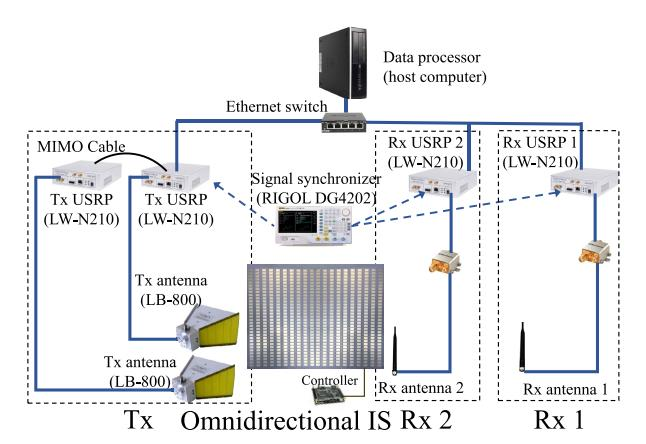

**Fig. 19. Omnidirectional IS-aided wireless communication prototype [\[294\]](#page-35-27).**

alent impedance of each element by switching the ON/OFF states of embedded p-i-n diodes, the phases and amplitudes of the refracted and reflected signals are changed accordingly, thus enabling beamforming. Following this element design, Zeng et al. [\[294\]](#page-35-27) implemented the omnidirectional IS and built an omnidirectional IS-aided wireless communication prototype, as shown in Fig. [19.](#page-26-0) Their experimental measurements verified the feasibility of full-dimensional communications provided by the omnidirectional IS. They also pointed out that the response of each omnidirectional IS element is a function of the angle of incidence, which should be considered in the beamformer optimization, as otherwise, beam misalignment can be resulted.

2) *Polarization domain:* Polarization is the property of an EM wave that determines the direction of the electric field oscillations. There could be different polarization states depending on the direction of these oscillations in the plane perpendicular to the propagation direction, such as linear (vertical and horizontal) and circular polarizations. Different polarizations can be utilized to control reflective and refractive waves simultaneously with a polarization-dependent characteristic provided by the omnidirectional IS. For example, an omnidirectional IS element can only reflect vertical-polarized waves while horizontal-polarized waves can only be refracted. Initial implementation for the omnidirectional IS in the polarization domain was reported in [\[295\]](#page-35-28), where two orthogonal polarized components are integrated into one omnidirectional IS element with a decoupling structure to guarantee their orthogonality. However, with such a design, the effective aperture for either reflection or refraction is reduced to only half of that of the surface. Therefore, how to fully utilize the whole surface with different polarizations is still a challenging unsolved problem.

It is worth noting that some existing designs utilize coupling among elements to realize simultaneous reflection and refraction [\[24\].](#page-30-23) In other words, the incident signals on an element will also be reflected or refracted from the neighboring elements. As a result, the phase-shift matrix Φ is not diagonal any more for either reflection or refraction, and this type of surface is also referred to as BD-RIS as mentioned in Section [I-B.](#page-1-1) Under the BD-RIS framework, the reflective and refractive patches for an element are grouped into a cell, and the cell is modeled as a twoport impedance network, which is similar to the equivalent circuit discussed in [\[294\].](#page-35-27) The BD-RIS considers a more general concept that the IS can be divided into several subsurfaces and each subsurface is modeled as an M-port impedance network, where M is the number of reflective/refractive patches within the subsurface. This implies that the incident signal on a subsurface can be reflected or refracted by any patch within each subsurface. This can be achieved by forming coupling currents among elements within the subsurface. Such a coupling can provide another dimension to optimize, i.e., the equivalent amplitude of the coefficient for each element can be adjusted, leading to additional performance improvement. However, the coupling poses an increasing complexity on the hardware design of the omnidirectional IS. Therefore, it is necessary to strike a tradeoff between the performance and complexity in such a framework.

*4) New Applications:* The new characteristic of simultaneous reflection and refraction has unlocked various new applications [\[106\].](#page-31-28) For example, the omnidirectional IS has been introduced for self-interference cancellation in full-duplex communication systems. In particular, the omnidirectional IS can be deployed between the Tx and the Rx, and we can configure the phase shifts of the omnidirectional IS to enhance the received signal strength by reflection and to null the self-interference to the Rx on the refraction side.

The integration of the omnidirectional IS with existing communication systems also faces its own challenges as the coupling of refraction and reflection further complicates the joint optimization, which requires further investigation.

#### **C. Holographic IS**

Wireless communications enabled by holographic ISs strive to overcome the limitations of massive MIMO systems [\[21\].](#page-30-20) Specifically, holographic ISs refer to spatially continuous EM apertures incorporating densely-packed large number of radiation elements [\[296\].](#page-35-29) By leveraging the holographic principle, as shown in Fig. [20,](#page-27-0) the radiation characteristics of the EM wave (which is also called reference wave) propagating on the surface can be changed by the holographic pattern to generate the desired object wave [\[297\]](#page-35-30). Hence, holographic ISs are capable of achieving amplitude and phase modulation to enable signal processing within the EM domain, while maintaining a low hardware cost and power consumption. In this section, we first introduce the theoretical aspects and transmission

{27}------------------------------------------------

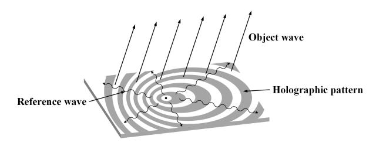

**Fig. 20. Illustration of a holographic IS.**

schemes of holographic IS. Then, we present the hardware implementation of holographic IS. Finally, we discuss its potential applications.

- *1) Theoretical Aspects:* The theoretical foundations of holographic IS such as channel model, DoFs, and system capacity require new and efficient approaches due to the dense packing of nearly infinite radiation elements and spatially continuous EM apertures. In particular, one of the most prominent design shifts is from the traditional digital domain to the EM domain [\[298\].](#page-35-31) This new domain provides a promising space to unveil the fundamental limitations of holographic IS-aided communications. In the following, we present the recent advances in theoretical aspects of holographic IS in terms of channel modeling, DoF, and system capacity.
  - 1) *Channel modeling:* Channel modeling of holographic IS systems differs from that of conventional MIMO systems due to the compact distribution of radiation elements in a holographic IS, where strong spatial correlations and mutual coupling effect need to be considered. To tackle this issue, a spatial correlationbased channel model was proposed [\[299\].](#page-35-32) Mathematically, the channel model can be denoted by h ∼ CN (0, R), where R = E(hhH) is given by

$$\mathbf{R} = \beta \int \int f \left( \phi + \delta_{\phi}, \theta + \delta_{\theta} \right) \mathbf{a} \left( \phi + \delta_{\phi}, \theta + \delta_{\theta} \right) \times \mathbf{a}^{H} \left( \phi + \delta_{\phi}, \theta + \delta_{\theta} \right) d\delta_{\phi} d\delta_{\theta}$$
(2)

where β is the average channel gain, ϕ and θ are the azimuth and elevation angles, respectively, δϕ and δθ are the angular deviations corresponding to ϕ and θ, f(ϕ, θ) is the normalized spatial scattering function, and a(ϕ, θ) is the array steering vector. Sun and Yan [\[300\]](#page-35-33) further developed a joint spatial–temporal correlation model characterized by a 4-D sinc function by considering both spatial and temporal correlations.

2) *DoF:* The DoF reveals the number of independent data streams that can be transmitted simultaneously. The DoF of holographic IS has been fully studied to explore the optimal communication performance. Specifically, the study in [\[301\]](#page-35-34) explored the DoF of a point-to-point holographic IS-aided system. An approximate closed-form expression of the DoF achieving performance limits was derived,

- which indicates that the DoF of the LoS channel is only determined by geometric factors normalized to the wavelength, and can be higher than one. More recently, Sicilia et al. [\[298\]](#page-35-31) have comprehensively analyzed the DoF and the optimal waveforms of holographic MIMO under general network deployments.
- 3) *System capacity:* As one of the most critical metrics for system performance, the capacity of holographic IS-aided communication has also been investigated. Deng et al. [\[302\]](#page-35-35) presented pioneer studies on the system capacity of holographic IS considering LoS channels. It is proved that the normalized capacity will converge to a constant value as the terminal density grows and the wavelength approaches zero. Such an asymptotic limit is expressed as (P/2N0), where P denotes the transmit power per volume unit and N0 is the noise spatial power spectral density. In addition, the capacity with non-LoS (NLoS) channels was studied in [\[303\].](#page-35-36) It is revealed that as the element spacing decreases, strong mutual coupling effects among elements will deteriorate the system capacity for a given number of radiation elements.
- *2) Transmission Scheme:* The differences in transmission schemes between holographic ISs and conventional MIMO mainly involve two aspects. On the one hand, due to the large aperture of holographic ISs, the communication distances fall within the near-field region. Hence, transmission schemes applicable to near-field communication need to be developed for performance enhancement. On the other hand, in addition to conventional phase-controlled beamforming, holographic ISs can also apply amplitude modulation for holographic beamforming. Therefore, novel transmission schemes tailored for amplitudecontrolled beamforming are also needed. In the following, we present the recent advances in transmission schemes in terms of near-field holographic IS and amplitudecontrolled holographic IS-aided communications.
  - 1) *Near-field transmission scheme:* In near-field communications, the phases and distances observed by the user with respect to the elements are different, and thus, the conventional uniform plane wave approximation in the far-field region cannot be applied anymore. Therefore, transmission scheme designs need to consider this characteristic for the system design. A mathematical model was presented to characterize the near-field channels and transmission patterns in [\[304\]](#page-35-37). Also, Cui and Dai [\[305\]](#page-35-38) developed an effective beam-focusing transmission scheme by exploiting the distance information and phase variants to achieve favorable performance gains in the near-field region. Moreover, considering the randomness of user distribution, near-far-field beamforming for holographic IS was proposed in for sum-rate maximization.
- 2) *Amplitude-controlled transmission scheme:* In the amplitude-controlled transmission, the amplitude

{28}------------------------------------------------

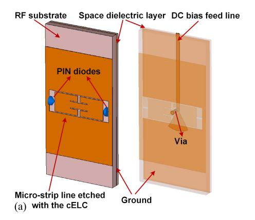

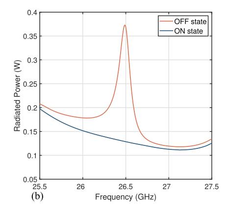

**Fig. 21. Hardware design of a radiation element: (a) cELC-based structure and (b) radiation power with different states of p-i-n diodes.**

of the EM wave at each radiation element is controlled by the holographic beamformer to generate desired directional beams [\[297\]](#page-35-30). Hence, the sum-rate maximization problem can be modeled as a complex-domain optimization problem subject to unconventional real-domain amplitude constraints. Deng et al. [\[306\]](#page-35-39) introduced a novel hybrid beamforming scheme for a general amplitude-controlled holographic IS system. Specifically, the signal processing at the baseband is conducted at the BS. The holographic IS utilizes an amplitude-controlled beamforming technique to generate desired directional beams and transmit the processed signals to each user.

- *3) Hardware Implementation:* The primary challenge in the hardware implementation of holographic ISs is to design tunable radiation elements that are capable of optimizing the current distribution on the surface. Specifically, the tunability of radiation elements enables the construction of any holographic pattern on the surface, such that dynamic beamforming can be achieved. In the following, we will list the state-of-the-art tuning mechanisms for the realization of holographic ISs, which rely on p-i-n diodes, liquid crystal, and photosensitive devices, respectively. A summary of these hardware implementations is listed in Table [7.](#page-29-1)
  - 1) *P-I-N diodes:* A radiation element capable of controlling the radiation amplitude of the EM wave can be achieved through the integration of a complementary electric-LC (cELC) resonator, which incorporates p-i-n diodes for modulation purposes [\[307\].](#page-35-40) The cELC resonator, as depicted in Fig. [21,](#page-28-0) is a microstrip line etched with a circle of annular slot to form a metal patch combined with a closed loop. The operational states of p-i-n diodes are actively controlled by the application of distinct bias voltages. Such control holds significant influence over the mutual inductance properties of the cELC resonator, consequently dictating the radiation power of the EM wave. Due to their cost-effectiveness

- and easy implementation, p-i-n diodes find extensive applications predominantly in sub-mmWave and mmWave frequency ranges.
- 2) *Liquid crystal:* Although p-i-n diodes are capable of achieving high beampattern gains, the nonlinearities of p-i-n diodes in high-frequency bands deteriorate the performance of holographic ISs. Thanks to the linear properties of liquid crystal in high-frequency bands, the above limitation of p-i-n diodes can be overcome. The liquid crystal-based holographic ISs were proposed in [\[308\],](#page-35-41) where the liquid crystal is filled in cavity boxes between slots and radiating patches. The permittivity of liquid crystal is changed with the applied bias voltages, such that the EM wave can be regulated to achieve beamforming. Liquid crystal-controlled holographic ISs offer numerous benefits, such as their versatility in integration into diverse structures due to their fluid nature and efficiency in power usage, attributing to the predominantly capacitive functions that involve minimal currents. Nonetheless, a significant limitation is the relatively slow response time, which constrains their utility to applications that do not demand rapid tunability.
- 3) *Photosensitive devices:* In addition to the above electrical control methods, the tunability of radiation elements can also be realized by optical control. Specifically, different EM responses of each radiation element are controlled by properly illuminating the corresponding photosensitive semiconductors. Such an optical control method is capable of achieving a rapid tuning speed, while also safeguarding signals against EM interference. Moreover, when integrated with optical fiber, it becomes feasible to deploy holographic ISs and signal processing units at separate locations for long-distance deployments. However, a critical challenge associated with these optical tuning systems is the necessity for high phase stability, that is, the preservation of a constant phase difference among parallel optical signals [\[309\].](#page-35-42) Since optical fibers are highly susceptible to environmental influences,

{29}------------------------------------------------

**Table 7** Comparison Between Different Hardware Implementations

| Tuning mechanism       | Tuning mechanism Working frequency |                                                                         | Limitation                                 | Typical Applications                                    |
|------------------------|------------------------------------|-------------------------------------------------------------------------|--------------------------------------------|---------------------------------------------------------|
| PIN diodes             | (Sub-) mmWave                      | Low cost, fast response time and easy implementation                    | Nonlinearities in high-frequency bands     | Mobile communication scenarios                          |
| Liquid crystal         | Liquid crystal (Sub-) mmWave       |                                                                         | Slow response time                         | (Quasi-) Static communication scenarios                 |
| Photosensitive devices | GHz-optical                        | Ultra-fast response time, protecting signals from EM interference | Difficult to maintain high phase stability | Long-distance deployments with optical fiber technology |

the above requirement is challenging to be met in practice.

- *4) Potential Applications:* As an ultrathin and lightweight antenna, the holographic IS has shown its potential in various wireless applications, including the following.
  - 1) *LEO satellite communications:* LEO satellite communications are one promising solution to deliver high-capacity backhaul or data relay services for terrestrial networks. Nonetheless, the high mobility of LEO satellites and the severe path loss pose challenges on antenna technologies in terms of precise beam steering and high antenna gain [\[310\].](#page-35-43) Traditional antennas integrated with user terminals such as dish antennas and phased arrays either require heavy mechanics or costly phase shifters, rendering their adoption in practical systems economically unviable. As a new paradigm to achieve beamforming with low hardware cost and low power consumption, holographic ISs can be adopted in integrated terrestrialsatellite networks to overcome the above limitations. In particular, Kymeta together with Microsoft has developed a commercial holographic IS for satellite communications in the event of natural disasters.
- 2) *Wireless simultaneous localization and mapping (SLAM):* Wireless SLAM, as a technique for user positioning and mapping in uncharted environments, holds promise for enhancing location-based services. This method utilizes antennas to estimate both the time of arrival and the angle of arrival by analyzing the amplitudes of received multipath components [\[311\].](#page-35-44) Consequently, the precision of the SLAM system is determined by the directive gain of the antennas. Given that holographic ISs consist of numerous elements, offering enhanced beam-steering capabilities and high directive gain, they present a viable option to be applied in wireless SLAM systems. It also shows great potential in radar detection [\[312\].](#page-35-45)
- 3) *ISAC:* In 6G, it is envisaged that the functions of sensing and communication are fully integrated into the same system by sharing resources, waveforms, and hardware. In ISAC systems, wideband waveforms are required to achieve a high data rate

for the communication function and high-resolution detection or estimation for the sensing function. However, wideband transmission with traditional phase-controlled schemes typically suffers from beam squint. Holographic ISs, with the linear additivity of holographic patterns, can be used to effectively alleviate the beam-squint issue [\[313\].](#page-35-46)

#### **IV. C O N C L U S I O N**

In this article, we provided a comprehensive overview of the state-of-the-art results on IS-aided wireless systems and networks by focusing on the main design issues of commonly adopted reflection-based ISs such as reflection optimization, deployment, modulation, sensing, and ISAC, as well as new and emerging IS architectures and their new design issues. Particularly, we pointed out several new trends in the research on ISs including the shifts from a single surface to multiple and cooperative-routing surfaces, from passive surfaces to active and integrated active/passive surfaces, from reflective surfaces to refractive and omnidirectional surfaces, from terrestrial surfaces to integrated air–ground surfaces, from static surfaces to mobile surfaces, etc. Since there are still many open issues in the design and implementation of ISs-empowered wireless networks, we hope that this article will serve as a timely and useful resource for future research on ISs to unleash their full potential for 6G and beyond.

# **A c k n o w l e d g m e n t**

**Qingqing Wu** is with the Department of Electronic Engineering, Shanghai Jiao Tong University, Shanghai 200240, China (e-mail: qingqingwu@sjtu.edu.cn).

**Beixiong Zheng** is with the School of Microelectronics, South China University of Technology, Guangzhou 511442, China (e-mail: bxzheng@scut.edu.cn).

**Changsheng You** is with the Department of Electronic and Electrical Engineering, Southern University of Science and Technology (SUSTech), Shenzhen 518055, China (e-mail: youcs@sustech.edu.cn).

**Lipeng Zhu** is with the Department of Electrical and Computer Engineering, National University of Singapore, Singapore 117583 (e-mail: zhulp@nus.edu.sg).

**Kaiming Shen** is with the School of Science and Engineering, The Chinese University of Hong Kong, Shenzhen 518172, China (e-mail: shenkaiming@cuhk.edu.cn).

**Xiaodan Shao** is with the Institute for Digital Communications (IDC), Friedrich-Alexander-University Erlangen–Nuremberg, 91058 Erlangen, Germany (e-mail: xiaodan.shao@fau.de).

**Weidong Mei** is with the National Key Laboratory of Wireless Communications, University of Electronic Science and Technology of China, Chengdu 611731, China (e-mail: wmei@uestc.edu.cn).

**Boya Di**, **Hongliang Zhang**, and **Lingyang Song** are with the State Key Laboratory of Advanced Optical Communication Systems and Networks, School of Electronics, Peking University, Beijing 100871, China (e-mail: boya.di@pku.edu.cn; hongliang.zhang@pku.edu.cn; lingyang.song@pku.edu.cn).

**Ertugrul Basar** is with the Communications Research and Innovation Laboratory (Core-Lab), Department of Electrical and Electronics Engineering, Koç University, Sariyer, Istanbul 34450, Turkey (e-mail: ebasar@ku.edu.tr).

{30}------------------------------------------------

**Marco Di Renzo** is with Université Paris-Saclay, CNRS, CentraleSupélec, Laboratoire des Signaux et Systèmes, 91192 Gif-sur-Yvette, France (e-mail: marco.di-renzo@universite-paris-saclay.fr).

**Zhi-Quan Luo** is with the School of Science and Engineering, The Chinese University of Hong Kong, Shenzhen 518172, China, with Shenzhen Research Institute of Big Data, Shenzhen 518172, China, and also with the Peng Cheng Laboratory, Shenzhen 518071, China (e-mail: luozq@cuhk.edu.cn).

**Rui Zhang** is with the School of Science and Engineering, Shenzhen Research Institute of Big Data, The Chinese University of Hong Kong, Shenzhen, Guangdong 518172, China, and also with the Department of Electrical and Computer Engineering, National University of Singapore, Singapore 117583 (e-mail: rzhang@cuhk.edu.cn; elezhang@nus.edu.sg).

#### **R E F E R E N C E S**

- [\[1\] W](#page-1-2). Jiang, B. Han, M. A. Habibi, and H. D. Schotten, "The road towards 6G: A comprehensive survey," *IEEE Open J. Commun. Soc.*, vol. 2, pp. 334–366, 2021.
- [\[2\] \(](#page-1-3)Sep. 2019). *6G Flagship, Key Drivers and Research Challenges for 6G Ubiquitous Wireless Intelligence, White Paper*. [Online]. Available: https://www. mobilewirelesstesting.com/wp-content/uploads/ 2019/10/5G-evolution-on-the-path-to-6G- \_wp\_en\_3608-3326-52\_v0100.pdf
- [\[3\] N](#page-1-4). Rajatheva et al., "White paper on broadband connectivity in 6G," 2020, *arXiv:2004.14247*.
- [\[4\] I](#page-1-5)TU-R WP5D. (2022). *Future Technology Trends of Terrestrial International Mobile Telecommunications Systems Towards 2030 and Beyond*. [Online]. Available: https://www.itu. int/pub/R-REP-M.2516
- [\[5\] R](#page-1-5). Liu, R. Yu-Ngok Li, M. Di Renzo, and L. Hanzo, "A vision and an evolutionary framework for 6G: Scenarios, capabilities and enablers," 2023, *arXiv:2305.13887*.
- [\[6\] C](#page-1-6).-X. Wang et al., "On the road to 6G: Visions, requirements, key technologies, and testbeds," *IEEE Commun. Surveys Tuts.*, vol. 25, no. 2, pp. 905–974, 2nd Quart. 2023.
- [\[7\] D](#page-1-7). Berry, R. Malech, and W. Kennedy, "The reflectarray antenna," *IEEE Trans. Antennas Propag.*, vol. AP-11, no. 6, pp. 645–651, Nov. 1963.
- [\[8\] V](#page-1-8). G. Veselago, "The electrodynamics of substances with simultaneously negative values of ϵ and µ," *Sov. Phys. Uspekhi*, vol. 10, no. 4, pp. 509–514, Apr. 1968.
- [\[9\] D](#page-1-9). R. Smith, W. J. Padilla, D. C. Vier, S. C. Nemat-Nasser, and S. Schultz, "Composite medium with simultaneously negative permeability and permittivity," *Phys. Rev. Lett.*, vol. 84, no. 18, pp. 4184–4187, May 2000.
- [\[10\]](#page-2-2) E. F. Kuester, M. A. Mohamed, M. Piket-May, and C. L. Holloway, "Averaged transition conditions for electromagnetic fields at a metafilm," *IEEE Trans. Antennas Propag.*, vol. 51, no. 10, pp. 2641–2651, Oct. 2003.
- [\[11\]](#page-2-3) L. Subrt, D. Grace, and P. Pechac, "Controlling the short-range propagation environment using active frequency selective surfaces," *Radioengineering*, vol. 19, no. 4, pp. 610–615, Dec. 2010.
- [\[12\]](#page-2-4) N. Kaina, M. Dupré, G. Lerosey, and M. Fink, "Shaping complex microwave fields in reverberating media with binary tunable metasurfaces," *Sci. Rep.*, vol. 4, no. 1, pp. 1–8, Oct. 2014.
- [\[13\]](#page-2-5) T. J. Cui, M. Q. Qi, X. Wan, J. Zhao, and Q. Cheng, "Coding metamaterials, digital metamaterials and programmable metamaterials," *Light, Sci. Appl.*, vol. 3, no. 10, p. e218, Oct. 2014.
- [\[14\]](#page-2-6) S. Hu, F. Rusek, and O. Edfors, "Beyond massive MIMO: The potential of positioning with large intelligent surfaces," *IEEE Trans. Signal Process.*, vol. 66, no. 7, pp. 1761–1774, Apr. 2018.
- [\[15\]](#page-2-6) S. Hu, F. Rusek, and O. Edfors, "Beyond massive MIMO: The potential of data transmission with large intelligent surfaces," *IEEE Trans. Signal Process.*, vol. 66, no. 10, pp. 2746–2758, May 2018.
- [\[16\]](#page-2-7) C. Huang, G. C. Alexandropoulos, A. Zappone, M. Debbah, and C. Yuen, "Energy efficient multi-user MISO communication using low resolution large intelligent surfaces," in *Proc. IEEE Globecom Workshops (GC Wkshps)*, Dec. 2018, pp. 1–6.
- [\[17\]](#page-2-8) C. Liaskos, S. Nie, A. Tsioliaridou, A. Pitsillides,

- S. Ioannidis, and I. Akyildiz, "A new wireless communication paradigm through software-controlled metasurfaces," *IEEE Commun. Mag.*, vol. 56, no. 9, pp. 162–169, Sep. 2018.
- [\[18\]](#page-2-9) Q. Wu and R. Zhang, "Intelligent reflecting surface enhanced wireless network: Joint active and passive beamforming design," in *Proc. IEEE Global Commun. Conf. (GLOBECOM)*, Dec. 2018, pp. 1–6.
- [\[19\]](#page-2-10) C. Huang, A. Zappone, G. C. Alexandropoulos, M. Debbah, and C. Yuen, "Reconfigurable intelligent surfaces for energy efficiency in wireless communication," *IEEE Trans. Wireless Commun.*, vol. 18, no. 8, pp. 4157–4170, Aug. 2019.
- [\[20\]](#page-2-11) M. D. Renzo et al., "Smart radio environments empowered by reconfigurable AI meta-surfaces: An idea whose time has come," *EURASIP J. Wireless Commun. Netw.*, vol. 2019, no. 1, pp. 1–20, May 2019.
- [\[21\]](#page-2-12) C. Huang et al., "Holographic MIMO surfaces for 6G wireless networks: Opportunities, challenges, and trends," *IEEE Wireless Commun.*, vol. 27, no. 5, pp. 118–125, Oct. 2020.
- [\[22\]](#page-2-13) S. Zhang, H. Zhang, B. Di, Y. Tan, Z. Han, and L. Song, "Beyond intelligent reflecting surfaces: Reflective-transmissive metasurface aided communications for full-dimensional coverage extension," *IEEE Trans. Veh. Technol.*, vol. 69, no. 11, pp. 13905–13909, Nov. 2020.
- [\[23\]](#page-2-14) J. Xu, Y. Liu, X. Mu, and O. A. Dobre, "STAR-RISs: Simultaneous transmitting and reflecting reconfigurable intelligent surfaces," *IEEE Commun. Lett.*, vol. 25, no. 9, pp. 3134–3138, Sep. 2021.
- [\[24\]](#page-2-15) S. Shen, B. Clerckx, and R. Murch, "Modeling and architecture design of reconfigurable intelligent surfaces using scattering parameter network analysis," *IEEE Trans. Wireless Commun.*, vol. 21, no. 2, pp. 1229–1243, Feb. 2022.
- [\[25\]](#page-2-16) J. An et al., "Stacked intelligent metasurface-aided MIMO transceiver design," *IEEE Wireless Commun.*, early access, Apr. 30, 2024, doi: [10.1109/MWC.013.2300259.](http://dx.doi.org/10.1109/MWC.013.2300259)
- [\[26\]](#page-2-17) A. Zappone, M. Di Renzo, and M. Debbah, "Wireless networks design in the era of deep learning: model-based, AI-based, or both?" *IEEE Trans. Commun.*, vol. 67, no. 10, pp. 7331–7376, Oct. 2019.
- [\[27\]](#page-2-17) M. Di Renzo and J. Song, "Reflection probability in wireless networks with metasurface-coated environmental objects: An approach based on random spatial processes," *EURASIP J. Wireless Commun. Netw.*, vol. 2019, no. 1, pp. 1–15, Apr. 2019.
- [\[28\]](#page-2-17) E. Basar et al., "Reconfigurable intelligent surfaces for 6G: Emerging hardware architectures, applications, and open challenges," 2023, *arXiv:2312.16874*.
- [\[29\]](#page-3-2) G. Chen et al., "Intelligent reflecting surface aided MIMO networks: Distributed or centralized architecture?" 2023, *arXiv:2310.01742*.
- [\[30\]](#page-3-3) Z. Huang, B. Zheng, and R. Zhang, "Transforming fading channel from fast to slow: Intelligent refracting surface aided high-mobility communication," *IEEE Trans. Wireless Commun.*, vol. 21, no. 7, pp. 4989–5003, Jul. 2022.
- [\[31\]](#page-3-4) G. Yang, X. Xu, Y.-C. Liang, and M. D. Renzo, "Reconfigurable intelligent surface-assisted non-orthogonal multiple access," *IEEE Trans. Wireless Commun.*, vol. 20, no. 5, pp. 3137–3151, May 2021.
- [\[32\]](#page-3-4) B. Zheng, Q. Wu, and R. Zhang, "Intelligent

- reflecting surface-assisted multiple access with user pairing: NOMA or OMA?" *IEEE Commun. Lett.*, vol. 24, no. 4, pp. 753–757, Apr. 2020.
- [\[33\]](#page-3-5) Y. Zhao, Q. Wu, W. Chen, C. Wu, and H. Vincent Poor, "Performance-oriented design for intelligent reflecting surface assisted federated learning," *IEEE Trans. Commun.*, vol. 71, no. 9, pp. 5228–5243, Sep. 2023.
- [\[34\]](#page-3-5) Y. Zhao et al., "Intelligent reflecting surface aided multi-tier hybrid computing," *IEEE J. Sel. Topics Signal Process.*, vol. 18, no. 1, pp. 83–97, Jan. 2023.
- [\[35\]](#page-3-6) S. Zhang, M. Li, M. Jian, Y. Zhao, and F. Gao, "AIRIS: Artificial intelligence enhanced signal processing in reconfigurable intelligent surface communications," *China Commun.*, vol. 18, no. 7, pp. 158–171, Jul. 2021.
- [\[36\]](#page-3-7) Q. Wu et al., "A comprehensive overview on 5G-and-beyond networks with UAVs: From communications to sensing and intelligence," *IEEE J. Sel. Areas Commun.*, vol. 39, no. 10, pp. 2912–2945, Oct. 2021.
- [\[37\]](#page-3-7) C. You et al., "Enabling smart reflection in integrated air-ground wireless network: IRS meets UAV," *IEEE Wireless Commun.*, vol. 28, no. 6, pp. 138–144, Dec. 2021.
- [\[38\]](#page-3-7) M. Toka et al., "RIS-empowered LEO satellite networks for 6G: Promising usage scenarios and future directions," 2024, *arXiv:2402.07381*.
- [\[39\]](#page-3-8) S. Zhang et al., "Intelligent omni-surfaces: Ubiquitous wireless transmission by reflective-refractive metasurfaces," *IEEE Trans. Wireless Commun.*, vol. 21, no. 1, pp. 219–233, Jan. 2022.
- [\[40\]](#page-4-1) RIS Tech Alliance. (Mar. 2023). *Reconfigurable Intelligent Surface Technology White Paper*. [Online]. Available: http://www.risalliance. com/RISTA-Reconfigurable%20Intelligent% 20Surface%20Technology%20White%20Paper% 282023%29.pdf
- [\[41\]](#page-4-1) K. Meng, Q. Wu, W. Chen, E. Paolini, and E. Matricardi, "Intelligent surface empowered sensing and communication: A novel mutual assistance design," *IEEE Commun. Lett.*, vol. 27, no. 8, pp. 2212–2216, Aug. 2023.
- [\[42\]](#page-4-2) X. Guan, Q. Wu, and R. Zhang, "Intelligent reflecting surface assisted secrecy communication: Is artificial noise helpful or not?" *IEEE Wireless Commun. Lett.*, vol. 9, no. 6, pp. 778–782, Jun. 2020.
- [\[43\]](#page-4-2) L. Lv, Q. Wu, Z. Li, Z. Ding, N. Al-Dhahir, and J. Chen, "Covert communication in intelligent reflecting surface-assisted NOMA systems: Design, analysis, and optimization," *IEEE Trans. Wireless Commun.*, vol. 21, no. 3, pp. 1735–1750, Mar. 2022.
- [\[44\]](#page-4-2) Z. Zhang, J. Chen, Q. Wu, Y. Liu, L. Lv, and X. Su, "Securing NOMA networks by exploiting intelligent reflecting surface," *IEEE Trans. Commun.*, vol. 70, no. 2, pp. 1096–1111, Feb. 2022.
- [\[45\]](#page-4-2) X. Zhou, S. Yan, Q. Wu, F. Shu, and D. W. K. Ng, "Intelligent reflecting surface (IRS)-aided covert wireless communications with delay constraint," *IEEE Trans. Wireless Commun.*, vol. 21, no. 1, pp. 532–547, Jan. 2022.
- [\[46\]](#page-4-3) Q. Wu, X. Guan, and R. Zhang, "Intelligent reflecting surface-aided wireless energy and information transmission: An overview," *Proc. IEEE*, vol. 110, no. 1, pp. 150–170, Jan. 2022.
- [\[47\]](#page-4-3) Z. Li, W. Chen, Q. Wu, K. Wang, and J. Li, "Joint

{31}------------------------------------------------

- beamforming design and power splitting optimization in IRS-assisted SWIPT NOMA networks," *IEEE Trans. Wireless Commun.*, vol. 21, no. 3, pp. 2019–2033, Mar. 2022.
- [\[48\]](#page-4-3) G. Chen, Q. Wu, R. Liu, J. Wu, and C. Fang, "IRS aided MEC systems with binary offloading: A unified framework for dynamic IRS beamforming," *IEEE J. Sel. Areas Commun.*, vol. 41, no. 2, pp. 349–365, Feb. 2023.
- [\[49\]](#page-4-3) G. Chen, Q. Wu, C. He, W. Chen, J. Tang, and S. Jin, "Active IRS aided multiple access for energy-constrained IoT systems," *IEEE Trans. Wireless Commun.*, vol. 22, no. 3, pp. 1677–1694, Mar. 2023.
- [\[50\]](#page-4-3) Y. Gao, Q. Wu, W. Chen, Y. Liu, M. Li, and D. B. Da Costa, "IRS-aided overloaded multi-antenna systems: Joint user grouping and resource allocation," *IEEE Trans. Wireless Commun.*, early access, Jan. 8, 2024, doi: [10.1109/TWC.2023.3348292.](http://dx.doi.org/10.1109/TWC.2023.3348292)
- [\[51\]](#page-4-3) Y. Gao, Q. Wu, G. Zhang, W. Chen, D. W. K. Ng, and M. D. Renzo, "Beamforming optimization for active intelligent reflecting surface-aided SWIPT," *IEEE Trans. Wireless Commun.*, vol. 22, no. 1, pp. 362–378, Jan. 2023.
- [\[52\]](#page-4-3) Q. Wu et al., "IRS-aided WPCNs: A new optimization framework for dynamic IRS beamforming," *IEEE Trans. Wireless Commun.*, vol. 21, no. 7, pp. 4725–4739, Jul. 2022.
- [\[53\]](#page-4-4) V. Jamali, H. Ajam, M. Najafi, B. Schmauss, R. Schober, and H. V. Poor, "Intelligent reflecting surface assisted free-space optical communications," *IEEE Commun. Mag.*, vol. 59, no. 10, pp. 57–63, Oct. 2021.
- [\[54\]](#page-4-4) H. Wang, Z. Zhang, B. Zhu, J. Dang, and L. Wu, "Optical reconfigurable intelligent surfaces aided optical wireless communications: Opportunities, challenges, and trends," *IEEE Wireless Commun.*, vol. 30, no. 5, pp. 28–35, Oct. 2023.
- [\[55\]](#page-4-4) W. Fang et al., "Reconfigurable intelligent surface assisted free space optical information and power transfer," 2023, *arXiv:2307.07138*.
- [\[56\]](#page-4-4) S. Sun, W. Mei, F. Yang, N. An, J. Song, and R. Zhang, "Optical intelligent reflecting surface assisted MIMO VLC: Channel modeling and capacity characterization," *IEEE Trans. Wireless Commun.*, vol. 23, no. 3, pp. 2125–2139, Mar. 2024.
- [\[57\]](#page-0-0) [Online]. Available: https://www.businesswire. com/news/home/20181204005253/en
- [\[58\]](#page-0-0) W. Tang et al., "Programmable metasurface-based RF chain-free 8PSK wireless transmitter," *Electron. Lett.*, vol. 55, no. 7, pp. 417–420, Apr. 2019.
- [\[59\]](#page-0-0) M. Uusitalo et al., "RFocus: Beamforming using thousands of passive antennas," in *Proc. 17th USENIX Symp. Networked Syst. Design Implement.*, Feb. 2020, pp. 1047–1061.
- [\[60\]](#page-0-0) Z. Li et al., "Programmable radio environments with large arrays of inexpensive antennas," *GetMobile, Mobile Comput. Commun.*, vol. 23, no. 3, pp. 23–27, Jan. 2020.
- [\[61\]](#page-0-0) L. Dai et al., "Reconfigurable intelligent surface-based wireless communications: Antenna design, prototyping, and experimental results," *IEEE Access*, vol. 8, pp. 45913–45923, 2020.
- [\[62\]](#page-0-0) M. Dunna, C. Zhang, D. Sievenpiper, and D. Bharadia, "ScatterMIMO: Enabling virtual MIMO with smart surfaces," in *Proc. 26th Annu. Int. Conf. Mobile Comput. Netw.*, Apr. 2020, pp. 1–14.
- [\[63\]](#page-0-0) W. Tang et al., "Wireless communications with reconfigurable intelligent surface: Path loss modeling and experimental measurement," *IEEE Trans. Wireless Commun.*, vol. 20, no. 1, pp. 421–439, Jan. 2021.
- [\[64\]](#page-0-0) X. Pei et al., "RIS-aided wireless communications: Prototyping, adaptive beamforming, and indoor/outdoor field trials," *IEEE Trans. Commun.*, vol. 69, no. 12, pp. 8627–8640, Dec. 2021.
- [\[65\]](#page-0-0) [Online]. Available: https://www.sribd.cn/article/450

- [\[66\]](#page-0-0) H. Zhang et al., "Intelligent omni-surfaces for full-dimensional wireless communications: Principles, technology, and implementation," *IEEE Commun. Mag.*, vol. 60, no. 2, pp. 39–45, Feb. 2022.
- [\[67\]](#page-0-0) R. Fara, P. Ratajczak, D.-T. Phan-Huy, A. Ourir, M. Di Renzo, and J. de Rosny, "A prototype of reconfigurable intelligent surface with continuous control of the reflection phase," *IEEE Wireless Commun.*, vol. 29, no. 1, pp. 70–77, Feb. 2022.
- [\[68\]](#page-0-0) M. Rossanese, P. Mursia, A. Garcia-Saavedra, V. Sciancalepore, A. Asadi, and X. Costa-Perez, "Designing, building, and characterizing RF switch-based reconfigurable intelligent surfaces," in *Proc. 28th Annu. Int. Conf. Mobile Comput. Netw.*, Oct. 2022, pp. 69–76.
- [\[69\]](#page-0-0) [Online]. Available: https://www.zte.com.cn/ content/dam/zte-site/www-zte-com-cn/ztemedia/solution-new/wireless-access/ ZTE\_RIS\_case\_study\_4\_0.pdf
- [\[70\]](#page-0-0) J. Rains et al., "High-resolution programmable scattering for wireless coverage enhancement: An indoor field trial campaign," *IEEE Trans. Antennas Propag.*, vol. 71, no. 1, pp. 518–530, Jan. 2023.
- [\[71\]](#page-0-0) K. W. Cho, M. H. Mazaheri, J. Gummeson, O. Abari, and K. Jamieson, "mmWall: A steerable, transflective metamaterial surface for NextG mmWave networks," in *Proc. USENIX Symp. Netw. Sys. Design Implement. (NSDI)*, Apr. 2023, pp. 1647–1665.
- [\[72\]](#page-0-0) R. Xiong et al., "Multi-RIS-aided wireless communications in real-world: Prototyping and field trials," 2023, *arXiv:2303.03287*.
- [\[73\]](#page-0-0) F. Lan et al., "Real-time programmable metasurface for terahertz multifunctional wave front engineering," *Light, Sci. Appl.*, vol. 12, no. 1, pp. 1–12, Aug. 2023.
- [\[74\]](#page-0-0) [Online]. Available: https://www.rohde-schwarz. com/fi/about/news-press/all-news/rohdeschwarz-and-greenerwave-collaborate-to-verifyris-modules-and-drive-6g-research-press-releasedetailpage\_229356-1404099.html
- [\[75\]](#page-0-0) H. Yang et al., "Beyond limitations of 5G with RIS: Field trial in a commercial network, recent advances, and future directions," *IEEE Commun. Mag.*, early access, Dec. 25, 2023, doi: [10.1109/MCOM.024.2300440.](http://dx.doi.org/10.1109/MCOM.024.2300440)
- [\[76\]](#page-0-0) J. Sang et al., "Coverage enhancement by deploying RIS in 5G commercial mobile networks: Field trials," *IEEE Wireless Commun.*, vol. 31, no. 1, pp. 172–180, Feb. 2024.
- [\[77\]](#page-4-5) [Online]. Available: https://www.itu.int/md/ R19-%20WP5D.AR-C/
- [\[78\]](#page-4-5) R. Q. Liu, Q. Q. Wu, M. Di Renzo, and Y. F. Yuan, "A path to smart radio environments: An industrial viewpoint on reconfigurable intelligent surfaces," *IEEE Wireless Commun.*, vol. 29, no. 1, pp. 202–208, Feb. 2022.
- [\[79\]](#page-4-6) [Online]. Available: https://www.3gpp.org/
- [\[80\]](#page-5-0) [Online]. Available: https://www.3gpp.org/ftp/ TSG\_RAN/TSG\_RAN/TSGR\_94e/Docs/RP-213700.zip
- [\[81\]](#page-5-1) [Online]. Available: https://portal.3gpp.org/ desktopmodules/Specifications/Specification Details.aspx?specificationId=3988
- [\[82\]](#page-5-2) *Understanding the 3GPP Standardization Aspects of Network-Controlled Repeaters*.
- [\[83\]](#page-5-3) [Online]. Available: https://www.etsi.org/
- [\[84\]](#page-5-4) [Online]. Available: https://www.etsi.org/ committee/1966-ris
- [\[85\]](#page-6-1) [Online]. Available: https://portal.etsi.org/ tb.aspx?tbid=900#lt-50611-work-programme
- [\[86\]](#page-6-2) [Online]. Available: https://portal.etsi.org/ tb.aspx?tbid=908&SubTB=908#/
- [\[87\]](#page-6-3) [Online]. Available: https://portal.etsi.org/ tb.aspx?tbid=912&SubTB=912#/
- [\[88\]](#page-6-4) [Online]. Available: https://portal.etsi.org/ tb.aspx?tbid=900#/
- [\[89\]](#page-0-0) J. Huang et al., "Reconfigurable intelligent surfaces: Channel characterization and modeling," *Proc. IEEE*, vol. 110, no. 9, pp. 1290–1311,

- Sep. 2022.
- [\[90\]](#page-0-0) M. Di Renzo, F. H. Danufane, and S. Tretyakov, "Communication models for reconfigurable intelligent surfaces: From surface electromagnetics to wireless networks optimization," *Proc. IEEE*, vol. 110, no. 9, pp. 1164–1209, Sep. 2022.
- [\[91\]](#page-0-0) M. Di Renzo et al., "Smart radio environments empowered by reconfigurable intelligent surfaces: How it works, state of research, and the road ahead," *IEEE J. Sel. Areas Commun.*, vol. 38, no. 11, pp. 2450–2525, Nov. 2020.
- [\[92\]](#page-0-0) B. Zheng, C. You, W. Mei, and R. Zhang, "A survey on channel estimation and practical passive beamforming design for intelligent reflecting surface aided wireless communications," *IEEE Commun. Surveys Tuts.*, vol. 24, no. 2, pp. 1035–1071, 2nd Quart., 2022.
- [\[93\]](#page-0-0) E. Basar et al., "Wireless communications through reconfigurable intelligent surfaces," *IEEE Access*, vol. 7, pp. 116753–116773, 2019.
- [\[94\]](#page-0-0) C. Pan et al., "An overview of signal processing techniques for RIS/IRS-aided wireless systems," *IEEE J. Sel. Topics Signal Process.*, vol. 16, no. 5, pp. 883–917, Aug. 2022.
- [\[95\]](#page-0-0) Q. Wu et al., "Intelligent reflecting surface-aided wireless communications: A tutorial," *IEEE Trans. Commun.*, vol. 69, no. 5, pp. 3313–3351, May 2021.
- [\[96\]](#page-0-0) R. Alghamdi et al., "Intelligent surfaces for 6G wireless networks: A survey of optimization and performance analysis techniques," *IEEE Access*, vol. 8, pp. 202795–202818, 2020.
- [\[97\]](#page-0-0) Y. Liu et al., "Reconfigurable intelligent surfaces: Principles and opportunities," *IEEE Commun. Surveys Tuts.*, vol. 23, no. 3, pp. 1546–1577, 3rd Quart., 2021.
- [\[98\]](#page-0-0) S. Gong et al., "Toward smart wireless communications via intelligent reflecting surfaces: A contemporary survey," *IEEE Commun. Surveys Tuts.*, vol. 22, no. 4, pp. 2283–2314, 4th Quart., 2020.
- [\[99\]](#page-0-0) X. Yuan, Y.-J. A. Zhang, Y. Shi, W. Yan, and H. Liu, "Reconfigurable-intelligent-surface empowered wireless communications: Challenges and opportunities," *IEEE Wireless Commun.*, vol. 28, no. 2, pp. 136–143, Apr. 2021.
- [\[100\]](#page-0-0) Q. Li, M. Wen, and M. D. Renzon, "Single-RF MIMO: From spatial modulation to metasurface-based modulation," *IEEE Wireless Commun.*, vol. 28, no. 4, pp. 88–95, Aug. 2021.
- [\[101\]](#page-0-0) Q. Wu and R. Zhang, "Towards smart and reconfigurable environment: Intelligent reflecting surface aided wireless network," *IEEE Commun. Mag.*, vol. 58, no. 1, pp. 106–112, Jan. 2020.
- [\[102\]](#page-0-0) C. Pan et al., "Reconfigurable intelligent surfaces for 6G systems: Principles, applications, and research directions," *IEEE Commun. Mag.*, vol. 59, no. 6, pp. 14–20, Jun. 2021.
- [\[103\]](#page-0-0) W. Mei et al., "Intelligent reflecting surface-aided wireless networks: From single-reflection to multireflection design and optimization," *Proc. IEEE*, vol. 110, no. 9, pp. 1380–1400, Sep. 2022.
- [\[104\]](#page-0-0) F. Naeem, G. Kaddoum, S. Khan, K. S. Khan, and N. Adam, "IRS-empowered 6G networks: Deployment strategies, performance optimization, and future research directions," *IEEE Access*, vol. 10, pp. 118676–118696, 2022.
- [\[105\]](#page-0-0) C. You, B. Zheng, W. Mei, and R. Zhang, "How to deploy intelligent reflecting surfaces in wireless network: BS-side, user-side, or both sides?" *J. Commun. Inf. Netw.*, vol. 7, no. 1, pp. 1–10, 2022.
- [\[106\]](#page-0-0) H. Zhang and B. Di, "Intelligent omni-surfaces: Simultaneous refraction and reflection for full-dimensional wireless communications," *IEEE Commun. Surveys Tuts.*, vol. 24, no. 4, pp. 1997–2028, 4th Quart., 2022.
- [\[107\]](#page-0-0) M. A. ElMossallamy et al., "Reconfigurable intelligent surfaces for wireless communications:

{32}------------------------------------------------

- Principles, challenges, and opportunities," *IEEE Trans. Cogn. Commun. Netw.*, vol. 6, no. 3, pp. 990–1002, Sep. 2020.
- [\[108\]](#page-0-0) Q. Cheng et al., "Reconfigurable intelligent surfaces: Simplified-architecture transmitters—From theory to implementations," *Proc. IEEE*, vol. 110, no. 9, pp. 1266–1289, Sep. 2022.
- [\[109\]](#page-0-0) A. S. d. Sena et al., "What role do intelligent reflecting surfaces play in multi-antenna non-orthogonal multiple access?" *IEEE Wireless Commun.*, vol. 27, no. 5, pp. 24–31, Oct. 2020.
- [\[110\]](#page-0-0) H. Wymeersch, J. He, B. Denis, A. Clemente, and M. Juntti, "Radio localization and mapping with reconfigurable intelligent surfaces: Challenges, opportunities, and research directions," *IEEE Veh. Technol. Mag.*, vol. 15, no. 4, pp. 52–61, Dec. 2020.
- [\[111\]](#page-0-0) W. Tang et al., "Wireless communications with programmable metasurface: New paradigms, opportunities, and challenges on transceiver design," *IEEE Wireless Commun.*, vol. 27, no. 2, pp. 180–187, Apr. 2020.
- [\[112\]](#page-6-5) Q. Wu, T. Q. Duong, D. W. K. Ng, R. Schober, and R. Zhang, *Intelligent Surfaces Empowered 6G Wireless Network*. Hoboken, NJ, USA: Wiley, 2023.
- [\[113\]](#page-6-5) Q. Wu, X. Guan, and M. Hua, "Intelligent reflecting surface for B5G/6G wireless networks information and power transmission," *Wireless Commun.*, vol. 5, p. 6, Jan. 2023.
- [\[114\]](#page-6-6) Q. Wu and R. Zhang, "Intelligent reflecting surface enhanced wireless network via joint active and passive beamforming," *IEEE Trans. Wireless Commun.*, vol. 18, no. 11, pp. 5394–5409, Nov. 2019.
- [\[115\]](#page-6-6) Q. Wu and R. Zhang, "Beamforming optimization for wireless network aided by intelligent reflecting surface with discrete phase shifts," *IEEE Trans. Commun.*, vol. 68, no. 3, pp. 1838–1851, Mar. 2020.
- [\[116\]](#page-6-6) G. Chen, Q. Wu, and W. Chen, "Two-timescale design for uplink systems: How many IRS beamforming patterns are needed?" *IEEE Trans. Veh. Technol.*, vol. 72, no. 4, pp. 5361–5366, Apr. 2023.
- [\[117\]](#page-6-6) G. Chen, Q. Wu, C. Wu, M. Jian, Y. Chen, and W. Chen, "Static IRS meets distributed MIMO: A new architecture for dynamic beamforming," *IEEE Wireless Commun. Lett.*, vol. 12, no. 11, pp. 1866–1870, Nov. 2023.
- [\[118\]](#page-6-6) G. Chen and Q. Wu, "Fundamental limits of intelligent reflecting surface aided multiuser broadcast channel," *IEEE Trans. Commun.*, vol. 71, no. 10, pp. 5904–5919, Oct. 2023.
- [\[119\]](#page-6-6) G. Hu et al., "Intelligent reflecting surface-aided wireless communication with movable elements," *IEEE Wireless Commun. Lett.*, vol. 13, no. 4, pp. 1173–1177, Apr. 2024.
- [\[120\]](#page-6-7) B. Zheng and R. Zhang, "Intelligent reflecting surface-enhanced OFDM: Channel estimation and reflection optimization," *IEEE Wireless Commun. Lett.*, vol. 9, no. 4, pp. 518–522, Apr. 2020.
- [\[121\]](#page-6-7) B. Zheng, C. You, and R. Zhang, "Intelligent reflecting surface assisted multi-user OFDMA: Channel estimation and training design," *IEEE Trans. Wireless Commun.*, vol. 19, no. 12, pp. 8315–8329, Dec. 2020.
- [\[122\]](#page-6-7) B. Zheng, C. You, and R. Zhang, "Fast channel estimation for IRS-assisted OFDM," *IEEE Wireless Commun. Lett.*, vol. 10, no. 3, pp. 580–584, Mar. 2021.
- [\[123\]](#page-6-8) A. L. Swindlehurst, G. Zhou, R. Liu, C. Pan, and M. Li, "Channel estimation with reconfigurable intelligent surfaces—A general framework," *Proc. IEEE*, vol. 110, no. 9, pp. 1312–1338, Sep. 2022.
- [\[124\]](#page-6-8) C. You, B. Zheng, and R. Zhang, "Channel estimation and passive beamforming for intelligent reflecting surface: Discrete phase shift and progressive refinement," *IEEE J. Sel. Areas Commun.*, vol. 38, no. 11, pp. 2604–2620,

- Nov. 2020.
- [\[125\]](#page-6-8) C. You et al., "Wireless communication via double IRS: Channel estimation and passive beamforming designs," *IEEE Wireless Commun. Lett.*, vol. 10, no. 2, pp. 431–435, Feb. 2021.
- [\[126\]](#page-8-3) B. Zheng, C. You, and R. Zhang, "Efficient channel estimation for double-IRS aided multi-user MIMO system," *IEEE Trans. Commun.*, vol. 69, no. 6, pp. 3818–3832, Jun. 2021.
- [\[127\]](#page-8-4) S. Ren, K. Shen, Y. Zhang, X. Li, X. Chen, and Z.-Q. Luo, "Configuring intelligent reflecting surface with performance guarantees: Blind beamforming," *IEEE Trans. Wireless Commun.*, vol. 22, no. 5, pp. 3355–3370, May 2023.
- [\[128\]](#page-8-4) G. Yan, L. Zhu, and R. Zhang, "Channel autocorrelation estimation for IRS-aided wireless communications based on power measurements," in *Proc. IEEE Globecom Workshops*, Dec. 2023, pp. 1–6.
- [\[129\]](#page-8-4) H. Sun, W. Mei, L. Zhu, and R. Zhang, "User power measurement based IRS channel estimation via single-layer neural network," in *Proc. IEEE Global Commun. Conf.*, Dec. 2023, pp. 1–6.
- [\[130\]](#page-8-4) C. You, B. Zheng, and R. Zhang, "Fast beam training for IRS-assisted multiuser communications," *IEEE Wireless Commun. Lett.*, vol. 9, no. 11, pp. 1845–1849, Nov. 2020.
- [\[131\]](#page-8-4) B. Ning, Z. Chen, W. Chen, Y. Du, and J. Fang, "Terahertz multi-user massive MIMO with intelligent reflecting surface: Beam training and hybrid beamforming," *IEEE Trans. Veh. Technol.*, vol. 70, no. 2, pp. 1376–1393, Feb. 2021.
- [\[132\]](#page-8-5) C. Psomas and I. Krikidis, "Low-complexity random rotation-based schemes for intelligent reflecting surfaces," *IEEE Trans. Wireless Commun.*, vol. 20, no. 8, pp. 5212–5225, Aug. 2021.
- [\[133\]](#page-8-5) Q.-U.-A. Nadeem, A. Zappone, and A. Chaaban, "Intelligent reflecting surface enabled random rotations scheme for the MISO broadcast channel," *IEEE Trans. Wireless Commun.*, vol. 20, no. 8, pp. 5226–5242, Aug. 2021.
- [\[134\]](#page-9-2) F. Xu et al., "Coordinating multiple intelligent reflecting surfaces without channel information," *IEEE Trans. Signal Process.*, vol. 72, pp. 31–46, 2024.
- [\[135\]](#page-10-2) W. Ma et al., "Passive beamforming for 3-D coverage in IRS-assisted communications," *IEEE Wireless Commun. Lett.*, vol. 11, no. 8, pp. 1763–1767, Aug. 2022.
- [\[136\]](#page-10-3) D. Xu, X. Yu, Y. Sun, D. W. K. Ng, and R. Schober, "Resource allocation for IRS-assisted full-duplex cognitive radio systems," *IEEE Trans. Commun.*, vol. 68, no. 12, pp. 7376–7394, Dec. 2020.
- [\[137\]](#page-10-4) X. Yu, D. Xu, Y. Sun, D. W. K. Ng, and R. Schober, "Robust and secure wireless communications via intelligent reflecting surfaces," *IEEE J. Sel. Areas Commun.*, vol. 38, no. 11, pp. 2637–2652, Nov. 2020.
- [\[138\]](#page-10-5) D. Xu, V. Jamali, X. Yu, D. Ng, and R. Schober, "Optimal resource allocation design for large IRS-assisted SWIPT systems: A scalable optimization framework," *IEEE Trans. Commun.*, vol. 70, no. 2, pp. 1423–1441, Feb. 2022.
- [\[139\]](#page-10-6) G. Yan et al., "Passive reflection optimization for IRS-aided multicast beamforming with discrete phase shifts," *IEEE Wireless Commun. Lett.*, vol. 12, no. 8, pp. 1424–1428, Aug. 2023.
- [\[140\]](#page-11-1) V. Jamali, M. Najafi, R. Schober, and H. V. Poor, "Power efficiency, overhead, and complexity tradeoff of IRS codebook design—Quadratic phase-shift profile," *IEEE Commun. Lett.*, vol. 25, no. 6, pp. 2048–2052, Jun. 2021.
- [\[141\]](#page-11-2) W. R. Ghanem, V. Jamali, M. Schellmann, H. Cao, J. Eichinger, and R. Schober, "Optimization-based phase-shift codebook design for large IRSs," *IEEE Commun. Lett.*, vol. 27, no. 2, pp. 635–639, Feb. 2023.
- [\[142\]](#page-11-3) J. Wang, W. Tang, S. Jin, C.-K. Wen, X. Li, and X. Hou, "Hierarchical codebook-based beam training for RIS-assisted mmWave communication systems," *IEEE Trans. Commun.*, vol. 71, no. 6, pp. 3650–3662, Jun. 2023.

- [\[143\]](#page-11-4) M. Ouyang, F. Gao, Y. Wang, S. Zhang, P. Li, and J. Ren, "Computer vision-aided reconfigurable intelligent surface-based beam tracking: Prototyping and experimental results," *IEEE Trans. Wireless Commun.*, vol. 22, no. 12, pp. 8681–8693, Dec. 2023.
- [\[144\]](#page-12-0) K. Chen, C. Qi, O. A. Dobre, and G. Y. Li, "Simultaneous beam training and target sensing in ISAC systems with RIS," *IEEE Trans. Wireless Commun.*, vol. 23, no. 4, pp. 2696–2710, Apr. 2024.
- [\[145\]](#page-0-0) Y. Chen, D. Chen, and T. Jiang, "Beam-squint mitigating in reconfigurable intelligent surface aided wideband mmWave communications," in *Proc. IEEE Wireless Commun. Netw. Conf. (WCNC)*, Mar. 2021, pp. 1–6.
- [\[146\]](#page-0-0) H. Sun, S. Zhang, J. Ma, and O. A. Dobre, "Time-delay unit based beam squint mitigation for RIS-aided communications," *IEEE Commun. Lett.*, vol. 26, no. 9, pp. 2220–2224, Sep. 2022.
- [\[147\]](#page-0-0) X. Wei, L. Dai, Y. Zhao, G. Yu, and X. Duan, "Codebook design and beam training for extremely large-scale RIS: far-field or near-field?" *China Commun.*, vol. 19, no. 6, pp. 193–204, Jun. 2022.
- [\[148\]](#page-0-0) M. Cui and L. Dai, "Channel estimation for extremely large-scale MIMO: Far-field or near-field?" *IEEE Trans. Commun.*, vol. 70, no. 4, pp. 2663–2677, Apr. 2022.
- [\[149\]](#page-0-0) Y. Zhang, X. Wu, and C. You, "Fast near-field beam training for extremely large-scale array," *IEEE Wireless Commun. Lett.*, vol. 11, no. 12, pp. 2625–2629, Dec. 2022.
- [\[150\]](#page-0-0) X. Wu, C. You, J. Li, and Y. Zhang, "Near-field beam training: Joint angle and range estimation with DFT codebook," 2023, *arXiv:2309.11872*.
- [\[151\]](#page-0-0) T. Wang, J. Lv, H. Tong, C. You, and C. Yin, "A novel two-layer codebook based near-field beam training for intelligent reflecting surface," 2023, *arXiv:2303.06962*.
- [\[152\]](#page-0-0) C. Wu, C. You, Y. Liu, L. Chen, and S. Shi, "Two-stage hierarchical beam training for near-field communications," *IEEE Trans. Veh. Technol.*, vol. 73, no. 2, pp. 2032–2044, Feb. 2024.
- [\[153\]](#page-0-0) G. C. Alexandropoulos, V. Jamali, R. Schober, and H. V. Poor, "Near-field hierarchical beam management for ris-enabled millimeter wave multi-antenna systems," in *Proc. 2022 IEEE 12th Sens. Array Multichannel Signal Process. Workshop (SAM)*, Jul. 2022, pp. 460–464.
- [\[154\]](#page-0-0) W. Liu, C. Pan, H. Ren, F. Shu, S. Jin, and J. Wang, "Low-overhead beam training scheme for extremely large-scale RIS in near field," *IEEE Trans. Commun.*, vol. 71, no. 8, pp. 4924–4940, Aug. 2023.
- [\[155\]](#page-0-0) W. Hao, X. You, F. Zhou, Z. Chu, G. Sun, and P. Xiao, "The far-/near-field beam squint and solutions for THz intelligent reflecting surface communications," *IEEE Trans. Veh. Technol.*, vol. 72, no. 8, pp. 10107–10118, Aug. 2023.
- [\[156\]](#page-0-0) M. Cui, L. Dai, Z. Wang, S. Zhou, and N. Ge, "Near-field rainbow: Wideband beam training for XL-MIMO," *IEEE Trans. Wireless Commun.*, vol. 22, no. 6, pp. 3899–3912, Jun. 2023.
- [\[157\]](#page-11-5) F. Laue, M. Garkisch, V. Jamali, and R. Schober, "Performance tradeoff of RIS beam training: Overhead vs.achievable SNR," in *Proc. 56th Asilomar Conf. Signals, Syst., Comput.*, Oct. 2022, pp. 408–412.
- [\[158\]](#page-12-1) C. You et al., "Near-field beam management for extremely large-scale array communications," 2023, *arXiv:2306.16206*.
- [\[159\]](#page-12-1) H. Lu et al., "A tutorial on near-field XL-MIMO communications towards 6G," 2023, *arXiv:2310.11044*.
- [\[160\]](#page-12-1) J. Cong et al., "Near-field integrated sensing and communication: Opportunities and challenges," 2023, *arXiv:2310.01342*.
- [\[161\]](#page-14-2) S. Zhang and R. Zhang, "Intelligent reflecting surface aided multi-user communication: Capacity region and deployment strategy," *IEEE*

{33}------------------------------------------------

- *Trans. Commun.*, vol. 69, no. 9, pp. 5790–5806, Sep. 2021.
- [\[162\]](#page-14-3) Y. Huang, W. Mei, and R. Zhang, "Empowering base stations with co-site intelligent reflecting surfaces: User association, channel estimation and reflection optimization," *IEEE Trans. Commun.*, vol. 70, no. 7, pp. 4940–4955, Jul. 2022.
- [\[163\]](#page-14-4) Y. Huang, L. Zhu, and R. Zhang, "Integrating intelligent reflecting surface into base station: Architecture, channel model, and passive reflection design," *IEEE Trans. Commun.*, vol. 71, no. 8, pp. 5005–5020, Jun. 2023.
- [\[164\]](#page-14-5) Y. Huang, L. Zhu, and R. Zhang, "Passive reflection codebook design for IRS-integrated access point," 2023, *arXiv:2309.12563*.
- [\[165\]](#page-15-2) B. Zheng, C. You, and R. Zhang, "Double-IRS assisted multi-user MIMO: Cooperative passive beamforming design," *IEEE Trans. Wireless Commun.*, vol. 20, no. 7, pp. 4513–4526, Jul. 2021.
- [\[166\]](#page-15-2) W. Mei and R. Zhang, "Cooperative beam routing for multi-IRS aided communication," *IEEE Wireless Commun. Lett.*, vol. 10, no. 2, pp. 426–430, Feb. 2021.
- [\[167\]](#page-15-2) W. Mei and R. Zhang, "Multi-beam multi-hop routing for intelligent reflecting surfaces aided massive MIMO," *IEEE Trans. Wireless Commun.*, vol. 21, no. 3, pp. 1897–1912, Mar. 2022.
- [\[168\]](#page-15-2) W. Mei and R. Zhang, "Distributed beam training for intelligent reflecting surface enabled multi-hop routing," *IEEE Wireless Commun. Lett.*, vol. 10, no. 11, pp. 2489–2493, Nov. 2021.
- [\[169\]](#page-15-2) W. Mei and R. Zhang, "Intelligent reflecting surface for multi-path beam routing with active/passive beam splitting and combining," *IEEE Commun. Lett.*, vol. 26, no. 5, pp. 1165–1169, May 2022.
- [\[170\]](#page-15-2) Y. Zhang, C. You, and B. Zheng, "Multi-active multi-passive (MAMP)-IRS aided wireless communication: A multi-hop beam routing design," *IEEE J. Sel. Areas Commun.*, vol. 41, no. 8, pp. 2497–2513, Aug. 2023.
- [\[171\]](#page-15-3) W. Mei and R. Zhang, "Joint base station and IRS deployment for enhancing network coverage: A graph-based modeling and optimization approach," *IEEE Trans. Wireless Commun.*, vol. 22, no. 11, pp. 8200–8213, Nov. 2023.
- [\[172\]](#page-15-4) M. Fu, W. Mei, and R. Zhang, "Multi-passive/active-IRS enhanced wireless coverage: Deployment optimization and cost-performance trade-off," 2023, *arXiv:2309.11918*.
- [\[173\]](#page-15-5) B. Zheng and R. Zhang, "IRS meets relaying: Joint resource allocation and passive beamforming optimization," *IEEE Wireless Commun. Lett.*, vol. 10, no. 9, pp. 2080–2084, Sep. 2021.
- [\[174\]](#page-15-6) I. Yildirim, F. Kilinc, E. Basar, and G. C. Alexandropoulos, "Hybrid RIS-empowered reflection and decode-and-forward relaying for coverage extension," *IEEE Commun. Lett.*, vol. 25, no. 5, pp. 1692–1696, May 2021.
- [\[175\]](#page-15-6) E. Basar and I. Yildirim, "Reconfigurable intelligent surfaces for future wireless networks: A channel modeling perspective," *IEEE Wireless Commun.*, vol. 28, no. 3, pp. 108–114, Jun. 2021.
- [\[176\]](#page-15-7) E. Björnson, Ö. Özdogan, and E. G. Larsson, "Intelligent reflecting surface versus decode-and-forward: How large surfaces are needed to beat relaying?" *IEEE Wireless Commun. Lett.*, vol. 9, no. 2, pp. 244–248, Feb. 2020.
- [\[177\]](#page-15-7) M. Di Renzo et al., "Reconfigurable intelligent surfaces vs. relaying: Differences, similarities, and performance comparison," *IEEE Open J. Commun. Soc.*, vol. 1, pp. 798–807, 2020.
- [\[178\]](#page-15-8) Z. Abdullah, G. Chen, S. Lambotharan, and J. A. Chambers, "A hybrid relay and intelligent reflecting surface network and its ergodic performance analysis," *IEEE Wireless Commun. Lett.*, vol. 9, no. 10, pp. 1653–1657, Oct. 2020.
- [\[179\]](#page-15-8) Z. Abdullah, G. Chen, S. Lambotharan, and

- J. A. Chambers, "Optimization of intelligent reflecting surface assisted full-duplex relay networks," *IEEE Wireless Commun. Lett.*, vol. 10, no. 2, pp. 363–367, Feb. 2021.
- [\[180\]](#page-15-8) Q. Bie, Y. Liu, Y. Wang, X. Zhao, and X. Y. Zhang, "Deployment optimization of reconfigurable intelligent surface for relay systems," *IEEE Trans. Green Commun. Netw.*, vol. 6, no. 1, pp. 221–233, Mar. 2022.
- [\[181\]](#page-15-8) K. Wang, Y. Zhou, Q. Wu, W. Chen, and Y. Yang, "Task offloading in hybrid intelligent reflecting surface and massive MIMO relay networks," *IEEE Trans. Wireless Commun.*, vol. 21, no. 6, pp. 3648–3663, Jun. 2022.
- [\[182\]](#page-15-8) M. Obeed and A. Chaaban, "Joint beamforming design for multiuser MISO downlink aided by a reconfigurable intelligent surface and a relay," *IEEE Trans. Wireless Commun.*, vol. 21, no. 10, pp. 8216–8229, Oct. 2022.
- [\[183\]](#page-16-0) N. T. Nguyen et al., "Fairness enhancement of UAV systems with hybrid active-passive RIS," *IEEE Trans. Wireless Commun.*, early access, Sep. 28, 2024, doi: [10.1109/TWC.2023.3317934.](http://dx.doi.org/10.1109/TWC.2023.3317934)
- [\[184\]](#page-16-0) Z. Ning et al., "Intelligent-reflecting-surface-assisted UAV communications for 6G networks," 2023, *arXiv:2310.20242*.
- [\[185\]](#page-16-0) S. Li, B. Duo, X. Yuan, Y.-C. Liang, and M. Di Renzo, "Reconfigurable intelligent surface assisted UAV communication: Joint trajectory design and passive beamforming," *IEEE Wireless Commun. Lett.*, vol. 9, no. 5, pp. 716–720, May 2020.
- [\[186\]](#page-16-1) H. Lu, Y. Zeng, S. Jin, and R. Zhang, "Aerial intelligent reflecting surface: Joint placement and passive beamforming design with 3D beam flattening," *IEEE Trans. Wireless Commun.*, vol. 20, no. 7, pp. 4128–4143, Jul. 2021.
- [\[187\]](#page-16-2) H. Lu, Y. Zeng, S. Jin, and R. Zhang, "Enabling panoramic full-angle reflection via aerial intelligent reflecting surface," in *Proc. IEEE Int. Conf. Commun. Workshops*, Jun. 2020, pp. 1–6.
- [\[188\]](#page-16-3) Z. Yao, W. Cheng, W. Zhang, and H. Zhang, "Resource allocation for 5G-UAV-based emergency wireless communications," *IEEE J. Sel. Areas Commun.*, vol. 39, no. 11, pp. 3395–3410, Nov. 2021.
- [\[189\]](#page-16-4) B. Duo, M. He, Q. Wu, and Z. Zhang, "Joint dual-UAV trajectory and RIS design for ARIS-assisted aerial computing in IoT," *IEEE Internet Things J.*, vol. 10, no. 22, pp. 19584–19594, Nov. 2023.
- [\[190\]](#page-16-5) T. V. Nguyen, H. D. Le, and A. T. Pham, "On the design of RIS–UAV relay-assisted hybrid FSO/RF satellite–aerial–ground integrated network," *IEEE Trans. Aerosp. Electron. Syst.*, vol. 59, no. 2, pp. 757–771, Apr. 2023.
- [\[191\]](#page-16-6) E. Basar, "Reconfigurable intelligent surfaces for Doppler effect and multipath fading mitigation," *Frontiers Comms. Net.*, vol. 2, pp. 1–12, Jul. 2021.
- [\[192\]](#page-16-7) B. Zheng, S. Lin, and R. Zhang, "Intelligent reflecting surface-aided LEO satellite communication: Cooperative passive beamforming and distributed channel estimation," *IEEE J. Sel. Areas Commun.*, vol. 40, no. 10, pp. 3057–3070, Oct. 2022.
- [\[193\]](#page-16-8) Z. Huang, B. Zheng, and R. Zhang, "Roadside IRS-aided vehicular communication: Efficient channel estimation and low-complexity beamforming design," *IEEE Trans. Wireless Commun.*, vol. 22, no. 9, pp. 5976–5989, Sep. 2023.
- [\[194\]](#page-16-8) S. Sun and H. Yan, "Channel estimation for reconfigurable intelligent surface-assisted wireless communications considering Doppler effect," *IEEE Wireless Commun. Lett.*, vol. 10, no. 4, pp. 790–794, Apr. 2021.
- [\[195\]](#page-16-8) A. S. Bora, K. T. Phan, and Y. Hong, "IRS-assisted high mobility communications using OTFS modulation," *IEEE Wireless Commun. Lett.*, vol. 12, no. 2, pp. 376–380, Feb. 2023.

- [\[196\]](#page-16-8) C. Xu et al., "Channel estimation for reconfigurable intelligent surface assisted high-mobility wireless systems," *IEEE Trans. Veh. Technol.*, vol. 72, no. 1, pp. 718–734, Jan. 2023.
- [\[197\]](#page-17-1) Z. Huang, L. Zhu, and R. Zhang, "Intelligent surfaces aided high-mobility communications: Opportunities and design issues," *IEEE Commun. Mag.*, early access, Nov. 13, 2024, doi: [10.1109/MCOM.003.2300213.](http://dx.doi.org/10.1109/MCOM.003.2300213)
- [\[198\]](#page-16-9) Z. Huang, B. Zheng, and R. Zhang, "Transforming fading channel from fast to slow: IRS-assisted high-mobility communication," in *Proc. IEEE Int. Conf. Commun.*, Jun. 2021, pp. 1–6.
- [\[199\]](#page-17-2) E. Basar and H. V. Poor, "Present and future of reconfigurable intelligent surface-empowered communications," *IEEE Signal Process. Mag.*, vol. 38, no. 6, pp. 146–152, Nov. 2021.
- [\[200\]](#page-17-3) L. Zhang et al., "Space-time-coding digital metasurfaces," *Nature Commun.*, vol. 9, no. 1, p. 4334, Oct. 2018.
- [\[201\]](#page-17-3) V. Tapio, H. Visa, M. Ibrahim, S. Alain, and J. Arman, "Survey on reconfigurable intelligent surfaces below 10 GHz," *EURASIP J. Wireless Commun. Netw.*, vol. 175, pp. 1–18, Dec. 2021.
- [\[202\]](#page-17-4) E. Basar, "Transmission through large intelligent surfaces: A new frontier in wireless communications," in *Proc. Eur. Conf. Netw. Commun. (EuCNC)*, Jun. 2019, pp. 112–117.
- [\[203\]](#page-18-1) J. Y. Dai et al., "Realization of multi-modulation schemes for wireless communication by time-domain digital coding metasurface," *IEEE Trans. Antennas Propag.*, vol. 68, no. 3, pp. 1618–1627, Mar. 2020.
- [\[204\]](#page-18-2) J. Zhao et al., "Programmable time-domain digital-coding metasurface for non-linear harmonic manipulation and new wireless communication systems," *Nat. Sci. Rev.*, vol. 6, no. 2, pp. 231–238, Mar. 2019.
- [\[205\]](#page-18-3) J. Y. Dai et al., "Wireless communication based on information metasurfaces," *IEEE Trans. Microw. Theory Techn.*, vol. 69, no. 3, pp. 1493–1510, Mar. 2021.
- [\[206\]](#page-18-4) A. Khaleel and E. Basar, "Reconfigurable intelligent surface-empowered MIMO systems," *IEEE Syst.J.*, vol. 15, no. 3, pp. 4358–4366, Sep. 2021.
- [\[207\]](#page-18-5) S. M. Alamouti, "A simple transmit diversity technique for wireless communications," *IEEE J. Sel. Areas Commun.*, vol. 16, no. 8, pp. 1451–1458, Oct. 1998.
- [\[208\]](#page-18-6) B. Zheng and R. Zhang, "Simultaneous transmit diversity and passive beamforming with large-scale intelligent reflecting surface," *IEEE Trans. Wireless Commun.*, vol. 22, no. 2, pp. 920–933, Feb. 2023.
- [\[209\]](#page-18-7) W. Tang et al., "MIMO transmission through reconfigurable intelligent surface: System design, analysis, and implementation," *IEEE J. Sel. Areas Commun.*, vol. 38, no. 11, pp. 2683–2699, Nov. 2020.
- [\[210\]](#page-18-8) X. Chen et al., "Design and implementation of MIMO transmission based on dual-polarized reconfigurable intelligent surface," *IEEE Wireless Commun. Lett.*, vol. 10, no. 10, pp. 2155–2159, Oct. 2021.
- [\[211\]](#page-18-9) Y.-C. Liang, Q. Zhang, J. Wang, R. Long, H. Zhou, and G. Yang, "Backscatter communication assisted by reconfigurable intelligent surfaces," *Proc. IEEE*, vol. 110, no. 9, pp. 1339–1357, Sep. 2022.
- [\[212\]](#page-18-10) S. Basharat, S. A. Hassan, A. Mahmood, Z. Ding, and M. Gidlund, "Reconfigurable intelligent surface-assisted backscatter communication: A new frontier for enabling 6G IoT networks," *IEEE Wireless Commun.*, vol. 29, no. 6, pp. 96–103, Dec. 2022.
- [\[213\]](#page-18-11) Y. Chen, "Performance of ambient backscatter systems using reconfigurable intelligent surface," *IEEE Commun. Lett.*, vol. 25, no. 8, pp. 2536–2539, Aug. 2021.
- [\[214\]](#page-18-12) Y. Khan, A. Afzal, and A. Dubey, "Capacity analysis of RIS-aided backscatter communication systems,"

{34}------------------------------------------------

- in *Proc. IEEE Veh. Technol. Conf. (VTC-Spring)*, Aug. 2023, pp. 1–5.
- [\[215\]](#page-18-13) D. Loku Galappaththige, F. Rezaei, C. Tellambura, and S. Herath, "RIS-empowered ambient backscatter communication systems," *IEEE Wireless Commun. Lett.*, vol. 12, no. 1, pp. 173–177, Jan. 2023.
- [\[216\]](#page-18-14) H. Yang, H. Ding, K. Cao, M. Elkashlan, H. Li, and K. Xin, "A RIS-segmented symbiotic ambient backscatter communication system," *IEEE Trans. Veh. Technol.*, vol. 73, no. 1, pp. 812–825, Jan. 2024.
- [\[217\]](#page-18-15) E. Basar, M. Wen, R. Mesleh, M. Di Renzo, Y. Xiao, and H. Haas, "Index modulation techniques for next-generation wireless networks," *IEEE Access*, vol. 5, pp. 16693–16746, 2017.
- [\[218\]](#page-18-16) E. Basar, "Reconfigurable intelligent surface-based index modulation: A new beyond MIMO paradigm for 6G," *IEEE Trans. Commun.*, vol. 68, no. 5, pp. 3187–3196, May 2020.
- [\[219\]](#page-18-17) A. E. Canbilen, E. Basar, and S. S. Ikki, "Reconfigurable intelligent surface-assisted space shift keying," *IEEE Wireless Commun. Lett.*, vol. 9, no. 9, pp. 1495–1499, Sep. 2020.
- [\[220\]](#page-18-18) A. E. Canbilen, E. Basar, and S. S. Ikki, "On the performance of RIS-assisted space shift keying: Ideal and non-ideal transceivers," *IEEE Trans. Commun.*, vol. 70, no. 9, pp. 5799–5810, Sep. 2022.
- [\[221\]](#page-18-19) S. Guo, S. Lv, H. Zhang, J. Ye, and P. Zhang, "Reflecting modulation," *IEEE J. Sel. Areas Commun.*, vol. 38, no. 11, pp. 2548–2561, Nov. 2020.
- [\[222\]](#page-19-0) S. Lin, B. Zheng, G. C. Alexandropoulos, M. Wen, M. D. Renzo, and F. Chen, "Reconfigurable intelligent surfaces with reflection pattern modulation: Beamforming design and performance analysis," *IEEE Trans. Wireless Commun.*, vol. 20, no. 2, pp. 741–754, Feb. 2021.
- [\[223\]](#page-19-1) S. Lin, F. Chen, M. Wen, Y. Feng, and M. Di Renzo, "Reconfigurable intelligent surface-aided quadrature reflection modulation for simultaneous passive beamforming and information transfer," *IEEE Trans. Wireless Commun.*, vol. 21, no. 3, pp. 1469–1481, Mar. 2022.
- [\[224\]](#page-19-2) Z. Yigit, E. Basar, M. Wen, and I. Altunbas, "Hybrid reflection modulation," *IEEE Trans. Wireless Commun.*, vol. 22, no. 6, pp. 4106–4116, Jun. 2023.
- [\[225\]](#page-19-3) U. Singh, M. R. Bhatnagar, and A. Bansal, "RIS-assisted SSK modulation: Reflection phase modulation and performance analysis," *IEEE Commun. Lett.*, vol. 26, no. 5, pp. 1012–1016, May 2022.
- [\[226\]](#page-19-4) C. De Lima et al., "Convergent communication, sensing and localization in 6G systems: An overview of technologies, opportunities and challenges," *IEEE Access*, vol. 9, pp. 26902–26925, 2021.
- [\[227\]](#page-19-4) F. Liu, Y.-F. Liu, A. Li, C. Masouros, and Y. C. Eldar, "Cramér–Rao bound optimization for joint radar-communication beamforming," *IEEE Trans. Signal Process.*, vol. 70, pp. 240–253, 2022.
- [\[228\]](#page-19-4) K. Meng et al., "Throughput maximization for UAV-enabled integrated periodic sensing and communication," *IEEE Trans. Wireless Commun.*, vol. 22, no. 1, pp. 671–687, Jan. 2023.
- [\[229\]](#page-19-5) X. Shao, L. Cheng, X. Chen, C. Huang, and D. W. K. Ng, "Reconfigurable intelligent surface-aided 6G massive access: Coupled tensor modeling and sparse Bayesian learning," *IEEE Trans. Wireless Commun.*, vol. 21, no. 12, pp. 10145–10161, Dec. 2022.
- [\[230\]](#page-19-5) X. Zhang, X. Shao, Y. Guo, Y. Lu, and L. Cheng, "Sparsity-structured tensor-aided channel estimation for RIS-assisted MIMO communications," *IEEE Commun. Lett.*, vol. 26, no. 10, pp. 2460–2464, Oct. 2022.
- [\[231\]](#page-19-6) J. Yao, Z. Zhang, X. Shao, C. Huang, C. Zhong, and X. Chen, "Concentrative intelligent reflecting surface aided computational imaging via fast

- block sparse Bayesian learning," in *Proc. IEEE 93rd Veh. Technol. Conf.*, Aug. 2021, pp. 1–6.
- [\[232\]](#page-19-6) K. Meng, Q. Wu, R. Schober, and W. Chen, "Intelligent reflecting surface enabled multi-target sensing," *IEEE Trans. Commun.*, vol. 70, no. 12, pp. 8313–8330, Dec. 2022.
- [\[233\]](#page-19-6) R. Liu, M. Li, Y. Liu, Q. Wu, and Q. Liu, "Joint transmit waveform and passive beamforming design for RIS-aided DFRC systems," *IEEE J. Sel. Topics Signal Process.*, vol. 16, no. 5, pp. 995–1010, Aug. 2022.
- [\[234\]](#page-19-7) K. Meng, Q. Wu, W. Chen, and D. Li, "Sensing-assisted communication in vehicular networks with intelligent surface," *IEEE Trans. Veh. Technol.*, vol. 73, no. 1, pp. 876–893, Jan. 2024.
- [\[235\]](#page-19-7) M. Hua, Q. Wu, W. Chen, Z. Fei, H. C. So, and C. Yuen, "Intelligent reflecting surface-assisted localization: Performance analysis and algorithm design," *IEEE Wireless Commun. Lett.*, vol. 13, no. 1, pp. 84–88, Jan. 2024.
- [\[236\]](#page-19-8) A. Albanese, F. Devoti, V. Sciancalepore, M. Di Renzo, and X. Costa-Pérez, "MARISA: A self-configuring metasurfaces absorption and reflection solution towards 6G," in *Proc. IEEE Conf. Comput. Commun.*, May 2022, pp. 250–259.
- [\[237\]](#page-19-9) A. Albanese, F. Devoti, V. Sciancalepore, M. Di Renzo, A. Banchs, and X. Costa-Pérez, "ARES: Autonomous RIS solution with energy harvesting and self-configuration towards 6G," 2023, *arXiv:2303.01161*.
- [\[238\]](#page-19-10) X. Song, J. Xu, F. Liu, T. X. Han, and Y. C. Eldar, "Intelligent reflecting surface enabled sensing: Cramér-rao lower bound optimization," in *Proc. IEEE Globecom Workshops*, Dec. 2022, pp. 413–418.
- [\[239\]](#page-19-10) Q. Peng, Q. Wu, W. Chen, S. Ma, M.-M. Zhao, and O. A. Dobre, "Semi-passive intelligent reflecting surface enabled sensing systems," 2024, *arXiv:2402.03042*.
- [\[240\]](#page-19-11) X. Shao, C. You, and R. Zhang, "Intelligent reflecting surface aided wireless sensing: Applications and design issues," *IEEE Wireless Commun.*, early access, Feb. 5, 2023, doi: [10.1109/MWC.004.2300058.](http://dx.doi.org/10.1109/MWC.004.2300058)
- [\[241\]](#page-19-12) X. Shao, C. You, W. Ma, X. Chen, and R. Zhang, "Target sensing with intelligent reflecting surface: Architecture and performance," *IEEE J. Sel. Areas Commun.*, vol. 40, no. 7, pp. 2070–2084, Jul. 2022.
- [\[242\]](#page-20-2) X. Shao and R. Zhang, "Target-mounted intelligent reflecting surface for secure wireless sensing," 2023, *arXiv:2308.02676*.
- [\[243\]](#page-20-2) P. Wang, W. Mei, J. Fang, and R. Zhang, "Target-mounted intelligent reflecting surface for joint location and orientation estimation," *IEEE J. Sel. Areas Commun.*, vol. 41, no. 12, pp. 3768–3782, Dec. 2023.
- [\[244\]](#page-20-2) X. Shao and R. Zhang, "Enhancing wireless sensing via a target-mounted intelligent reflecting surface," *Nat. Sci. Rev.*, vol. 10, no. 8, Jul. 2023, Art. no. nwad150.
- [\[245\]](#page-20-3) X. Shao and R. Zhang, "Controllable wireless sensing via target-mounted intelligent reflecting surface," in *Proc. IEEE Global Commun. Conf.*, Dec. 2023, pp. 1–6.
- [\[246\]](#page-20-4) B. Zheng, X. Xiong, J. Tang, and R. Zhang, "Intelligent reflecting surface-aided electromagnetic stealth against radar detection," 2023, *arXiv:2312.01940*.
- [\[247\]](#page-20-4) X. Xiong, B. Zheng, A. L. Swindlehurst, J. Tang, and W. Wu, "A new intelligent reflecting surface-aided electromagnetic stealth strategy," *IEEE Wireless Commun. Lett.*, early access, Mar. 18, 2024, doi: [10.1109/LWC.2024.3378455.](http://dx.doi.org/10.1109/LWC.2024.3378455)
- [\[248\]](#page-20-5) K. Meng, Q. Wu, C. Masouros, W. Chen, and D. Li, "Intelligent surface empowered integrated sensing and communication: From coexistence to reciprocity," 2023, *arXiv:2311.00418*.
- [\[249\]](#page-20-5) M. Hua, Q. Wu, C. He, S. Ma, and W. Chen, "Joint active and passive beamforming design for IRS-aided radar-communication," *IEEE*

- *Trans. Wireless Commun.*, vol. 22, no. 4, pp. 2278–2294, Apr. 2023.
- [\[250\]](#page-20-5) M. Hua, Q. Wu, W. Chen, O. A. Dobre, and A. L. Swindlehurst, "Secure intelligent reflecting surface-aided integrated sensing and communication," *IEEE Trans. Wireless Commun.*, vol. 23, no. 1, pp. 575–591, Jan. 2024.
- [\[251\]](#page-20-6) X. Pang, W. Mei, N. Zhao, and R. Zhang, "Cellular sensing via cooperative intelligent reflecting surfaces," *IEEE Trans. Veh. Technol.*, vol. 72, no. 11, pp. 15086–15091, Nov. 2023.
- [\[252\]](#page-21-2) Z. Chen, M.-M. Zhao, M. Li, F. Xu, Q. Wu, and M.-J. Zhao, "Joint location sensing and channel estimation for IRS-aided mmWave ISAC systems," 2023, *arXiv:2311.08201*.
- [\[253\]](#page-21-2) Z. Zhang, W. Chen, Q. Wu, Z. Li, X. Zhu, and J. Yuan, "Intelligent omni surfaces assisted integrated multi-target sensing and multi-user MIMO communications," *IEEE Trans. Commun.*, early access, Mar. 14, 2024, doi: [10.1109/TCOMM.2024.3374351.](http://dx.doi.org/10.1109/TCOMM.2024.3374351)
- [\[254\]](#page-21-3) Z. Gao et al., "Integrated sensing and communication with mmWave massive MIMO: A compressed sampling perspective," *IEEE Trans. Wireless Commun.*, vol. 22, no. 3, pp. 1745–1762, Mar. 2023.
- [\[255\]](#page-21-4) R. Li, X. Shao, S. Sun, M. Tao, and R. Zhang, "Beam scanning for integrated sensing and communication in IRS-aided mmWave systems," in *Proc. IEEE 24th Int. Workshop Signal Process. Adv. Wireless Commun. (SPAWC)*, Sep. 2023, pp. 1–5.
- [\[256\]](#page-0-0) S. Buzzi et al., "Foundations of MIMO radar detection aided by reconfigurable intelligent surfaces," *IEEE Trans. Signal Process.*, vol. 70, pp. 1749–1763, 2022.
- [\[257\]](#page-0-0) J. Hu, H. Zhang, K. Bian, M. D. Renzo, Z. Han, and L. Song, "MetaSensing: Intelligent metasurface assisted RF 3D sensing by deep reinforcement learning," *IEEE J. Sel. Areas Commun.*, vol. 39, no. 7, pp. 2182–2197, Jul. 2021.
- [\[258\]](#page-0-0) Y. Liu, I. Al-Nahhal, O. A. Dobre, and F. Wang, "Deep-learning-based channel estimation for IRS-assisted ISAC system," in *Proc. IEEE Global Commun. Conf. (GLOBECOM)*, Rio de Janeiro, Brazil, Dec. 2022, pp. 4220–4225.
- [\[259\]](#page-0-0) M. Hua, Q. Wu, W. Chen, O. A. Dobre, and A. L. Swindlehurst, "Secure intelligent reflecting surface aided integrated sensing and communication," *IEEE Trans. Wireless Commun.*, vol. 23, no. 575 - 591, pp. 575–591, Apr. 2023.
- [\[260\]](#page-0-0) T. Wei, L. Wu, K. V. Mishra, and M. R. B. Shankar, "Multiple IRS-assisted wideband dual-function radar-communication," in *Proc. 2nd IEEE Int. Symp. Joint Commun. Sens.*, Mar. 2022, pp. 1–5.
- [\[261\]](#page-21-5) J. Xu et al., "Simultaneously transmitting and reflecting intelligent omni-surfaces: Modeling and implementation," *IEEE Veh. Technol. Mag.*, vol. 17, no. 2, pp. 46–54, Jun. 2022.
- [\[262\]](#page-21-6) C. You and R. Zhang, "Wireless communication aided by intelligent reflecting surface: Active or passive?" *IEEE Wireless Commun. Lett.*, vol. 10, no. 12, pp. 2659–2663, Dec. 2021.
- [\[263\]](#page-21-7) Z. Zhang et al., "Active RIS vs. passive RIS: Which will prevail in 6G?" *IEEE Trans. Commun.*, vol. 71, no. 3, pp. 1707–1725, Mar. 2023.
- [\[264\]](#page-21-7) R. Long, Y.-C. Liang, Y. Pei, and E. G. Larsson, "Active reconfigurable intelligent surface aided wireless communications," *IEEE Trans. Wireless Commun.*, vol. 20, no. 8, pp. 4962–4975, Aug. 2021.
- [\[265\]](#page-22-2) W. Lv, J. Bai, Q. Yan, and H. M. Wang, "RIS-assisted green secure communications: Active RIS or passive RIS?" *IEEE Wireless Commun. Lett.*, vol. 12, no. 2, pp. 237–241, Feb. 2023.
- [\[266\]](#page-22-2) P. Zeng, D. Qiao, Q. Wu, and Y. Wu, "Throughput maximization for active intelligent reflecting surface-aided wireless powered communications," *IEEE Wireless Commun. Lett.*, vol. 11, no. 5, pp. 992–996, May 2022.

{35}------------------------------------------------

- [\[267\]](#page-22-2) Y. Ma, M. Li, Y. Liu, Q. Wu, and Q. Liu, "Active reconfigurable intelligent surface for energy efficiency in MU-MISO systems," *IEEE Trans. Veh. Technol.*, vol. 72, no. 3, pp. 4103–4107, Mar. 2023.
- [\[268\]](#page-22-2) S. Zargari, A. Hakimi, C. Tellambura, and S. Herath, "Multiuser MISO PS-SWIPT systems: Active or passive RIS?" *IEEE Wireless Commun. Lett.*, vol. 11, no. 9, pp. 1920–1924, Sep. 2022.
- [\[269\]](#page-22-2) Y. Guo et al., "Enhanced secure communication via novel double-faced active RIS," *IEEE Trans. Commun.*, vol. 71, no. 6, pp. 3497–3512, Jun. 2023.
- [\[270\]](#page-22-2) Y. Liu, Y. Ma, M. Li, Q. Wu, and Q. Shi, "Spectral efficiency maximization for double-faced active reconfigurable intelligent surface," *IEEE Trans. Signal Process.*, vol. 70, pp. 5397–5412, 2022.
- [\[271\]](#page-22-2) Y. Zhu, Y. Liu, M. Li, Q. Wu, and Q. Shi, "A flexible design for active reconfigurable intelligent surface—A sub-array architecture," *IEEE Trans. Veh. Technol.*, no. 10, pp. 12884–12899, Nov. 2023.
- [\[272\]](#page-22-2) Y. Zhou, Y. Liu, Q. Wu, Q. Shi, J. Zhao, and Y. Zhao, "Queueing aware power minimization for wireless communication aided by double-faced active RIS," *IEEE Trans. Commun.*, vol. 71, no. 10, pp. 5799–5813, Jul. 2023.
- [\[273\]](#page-23-0) K. Zhi, C. Pan, H. Ren, K. K. Chai, and M. Elkashlan, "Active RIS versus passive RIS: Which is superior with the same power budget?" *IEEE Commun. Lett.*, vol. 26, no. 5, pp. 1150–1154, May 2022.
- [\[274\]](#page-23-1) K. Liu, Z. Zhang, L. Dai, S. Xu, and F. Yang, "Active reconfigurable intelligent surface: Fully-connected or sub-connected?" *IEEE Commun. Lett.*, vol. 26, no. 1, pp. 167–171, Jan. 2022.
- [\[275\]](#page-23-2) J. Zhang, Z. Li, and Z. Zhang, "Wideband active RISs: Architecture, modeling, and beamforming design," *IEEE Commun. Lett.*, vol. 27, no. 7, pp. 1899–1903, Jul. 2023.
- [\[276\]](#page-23-3) Z. Kang, C. You, and R. Zhang, "Active-IRS-aided wireless communication: Fundamentals, designs and open issues," 2023, *arXiv:2301. 04311*.
- [\[277\]](#page-23-4) H. Chen, N. Li, R. Long, and Y.-C. Liang, "Channel estimation and training design for active RIS aided wireless communications," *IEEE Wireless Commun. Lett.*, vol. 12, no. 11, pp. 1876–1880, Nov. 2023.
- [\[278\]](#page-23-5) Z. Kang, C. You, and R. Zhang, "Double-Active-IRS aided wireless communication: Deployment optimization and capacity scaling," *IEEE Wireless Commun. Lett.*, vol. 12, no. 11, pp. 1821–1825, Nov. 2023.
- [\[279\]](#page-23-6) X. Li, C. You, Z. Kang, Y. Zhang, and B. Zheng, "Double-active-IRS aided wireless communication with total amplification power constraint," *IEEE Commun. Lett.*, vol. 27, no. 10, pp. 2817–2821, Oct. 2023.
- [\[280\]](#page-23-7) Z. Kang, C. You, and R. Zhang, "Active-passive IRS aided wireless communication: New hybrid architecture and elements allocation optimization," *IEEE Trans. Wireless Commun.*, vol. 23, no. 4, pp. 3450–3464, Apr. 2024.
- [\[281\]](#page-23-7) N. T. Nguyen, Q. Vu, K. Lee, and M. Juntti, "Hybrid relay-reflecting intelligent surface-assisted wireless communications," *IEEE Trans. Veh. Technol.*, vol. 71, no. 6, pp. 6228–6244, Jun. 2022.
- [\[282\]](#page-23-8) Q. Peng, Q. Wu, G. Chen, R. Liu, S. Ma, and W. Chen, "Hybrid active-passive IRS assisted energy-efficient wireless communication," *IEEE Commun. Lett.*, vol. 27, no. 8, pp. 2202–2206, Aug. 2023.

- [\[283\]](#page-23-9) R. S. P. Sankar and S. P. Chepuri, "Channel-aware placement of active and passive elements in hybrid RIS-assisted MISO systems," *IEEE Wireless Commun. Lett.*, vol. 12, no. 7, pp. 1229–1233, Jul. 2023.
- [\[284\]](#page-23-10) M. Fu, W. Mei, and R. Zhang, "Multi-active/passive-IRS enabled wireless information and power transfer: Active IRS deployment and performance analysis," *IEEE Commun. Lett.*, vol. 27, no. 8, pp. 2217–2221, Aug. 2023.
- [\[285\]](#page-24-2) J. Lyu and R. Zhang, "Hybrid active/passive wireless network aided by intelligent reflecting surface: System modeling and performance analysis," *IEEE Trans. Wireless Commun.*, vol. 20, no. 11, pp. 7196–7212, Nov. 2021.
- [\[286\]](#page-24-3) R. K. Fotock, A. Zappone, and M. D. Renzo, "Energy efficiency optimization in RIS-aided wireless networks: Active versus nearly-passive RIS with global reflection constraints," *IEEE Trans. Commun.*, vol. 72, no. 1, pp. 257–272, Jan. 2024.
- [\[287\]](#page-24-4) Y. Liu, B. Duo, Q. Wu, X. Yuan, and Y. Li, "Full-dimensional rate enhancement for UAV-enabled communications via intelligent omni-surface," *IEEE Wireless Commun. Lett.*, vol. 11, no. 9, pp. 1955–1959, Sep. 2022.
- [\[288\]](#page-24-4) H. Luo, L. Lv, Q. Wu, Z. Ding, N. Al-Dhahir, and J. Chen, "Beamforming design for active IOS aided NOMA networks," *IEEE Wireless Commun. Lett.*, vol. 12, no. 2, pp. 282–286, Feb. 2023.
- [\[289\]](#page-24-5) Y. Liu et al., "STAR: Simultaneous transmission and reflection for 360 coverage by intelligent surfaces," *IEEE Wireless Commun.*, vol. 28, no. 6, pp. 102–109, Dec. 2021.
- [\[290\]](#page-25-0) S. Yue, S. Zeng, H. Zhang, F. Lin, L. Liu, and B. Di, "Intelligent omni-surfaces aided wireless communications: Does the reciprocity hold?" *IEEE Trans. Veh. Technol.*, vol. 72, no. 6, pp. 8181–8185, Jun. 2023.
- [\[291\]](#page-25-1) C. Wu, C. You, Y. Liu, X. Gu, and Y. Cai, "Channel estimation for STAR-RIS-aided wireless communication," *IEEE Commun. Lett.*, vol. 26, no. 3, pp. 652–656, Mar. 2022.
- [\[292\]](#page-25-2) Y. Zhang, B. Di, H. Zhang, M. Dong, L. Yang, and L. Song, "Dual codebook design for intelligent omni-surface aided communications," *IEEE Trans. Commun.*, vol. 21, no. 11, pp. 9232–9245, Nov. 2022.
- [\[293\]](#page-25-3) S. Zeng, H. Zhang, B. Di, Z. Han, and L. Song, "Reconfigurable intelligent surface (RIS) assisted wireless coverage extension: RIS orientation and location optimization," *IEEE Commun. Lett.*, vol. 25, no. 1, pp. 269–273, Jan. 2021.
- [\[294\]](#page-26-1) S. Zeng et al., "Intelligent omni-surfaces: Reflection-refraction circuit model, full-dimensional beamforming, and system implementation," *IEEE Trans. Commun.*, vol. 70, no. 11, pp. 7711–7727, Nov. 2022.
- [\[295\]](#page-26-2) A. Palomares-Caballero et al., "Enabling intelligent omni-surfaces in the polarization domain: Principles, implementation and applications," *IEEE Commun. Mag.*, vol. 61, no. 11, pp. 144–150, Nov. 2023.
- [\[296\]](#page-26-3) J. An, C. Yuen, C. Huang, M. Debbah, H. Vincent Poor, and L. Hanzo, "A tutorial on holographic MIMO communications Part I: Channel modeling and channel estimation," *IEEE Commun. Lett.*, vol. 27, no. 7, pp. 1664–1668, Jul. 2023.
- [\[297\]](#page-26-4) R. Deng, Y. Zhang, H. Zhang, B. Di, H. Zhang, and L. Song, "Reconfigurable holographic surface: A new paradigm to implement holographic radio," *IEEE Veh. Technol. Mag.*, vol. 18, no. 1, pp. 20–28, Mar. 2023.
- [\[298\]](#page-27-1) J. C. Ruiz-Sicilia, M. Di Renzo, M. D. Migliore,

- M. Debbah, and H. V. Poor, "On the degrees of freedom and eigenfunctions of line-of-sight holographic MIMO communications," 2023, *arXiv:2308.08009*.
- [\[299\]](#page-27-2) Ö. T. Demir, E. Björnson, and L. Sanguinetti, "Channel modeling and channel estimation for holographic massive MIMO with planar arrays," *IEEE Wireless Commun. Lett.*, vol. 11, no. 5, pp. 997–1001, May 2022.
- [\[300\]](#page-27-3) S. Sun and H. Yan, "Small-scale spatial–temporal correlation and degrees of freedom for reconfigurable intelligent surfaces," *IEEE Wireless Commun. Lett.*, vol. 10, no. 12, pp. 2698–2702, Dec. 2021.
- [\[301\]](#page-27-4) D. Dardari, "Communicating with large intelligent surfaces: Fundamental limits and models," *IEEE J. Sel. Areas Commun.*, vol. 38, no. 11, pp. 2526–2537, Nov. 2020.
- [\[302\]](#page-27-5) R. Deng, B. Di, H. Zhang, and L. Song, "HDMA: Holographic-pattern division multiple access," *IEEE J. Sel. Areas Commun.*, vol. 40, no. 4, pp. 1317–1332, Apr. 2022.
- [\[303\]](#page-27-6) L. Wei et al., "Multi-user holographic MIMO surfaces: Channel modeling and spectral efficiency analysis," *IEEE J. Sel. Topics Signal Process.*, vol. 16, no. 5, pp. 1112–1124, Aug. 2022.
- [\[304\]](#page-27-7) H. Zhang et al., "Beam focusing for near-field multiuser MIMO communications," *IEEE Trans. Wireless Commun.*, vol. 21, no. 9, pp. 7476–7490, Sep. 2022.
- [\[305\]](#page-27-8) M. Cui and L. Dai, "Near-field wideband beamforming for extremely large antenna arrays," 2021, *arXiv:2109.10054*.
- [\[306\]](#page-28-1) R. Deng, B. Di, H. Zhang, Y. Tan, and L. Song, "Reconfigurable holographic surface enabled multi-user wireless communications: Amplitude-controlled holographic beamforming," *IEEE Trans. Wireless Commun.*, vol. 21, no. 8, pp. 6003–6017, Aug. 2022.
- [\[307\]](#page-28-2) R. Deng et al., "Reconfigurable holographic surfaces for ultra-massive MIMO in 6G: Practical design, optimization and implementation," *IEEE J. Sel. Areas Commun.*, vol. 41, no. 8, pp. 2367–2379, Aug. 2023.
- [\[308\]](#page-28-3) H. Kim and S. Nam, "Performance improvement of LC-based beam-steering leaky-wave holographic antenna using decoupling structure," *IEEE Trans. Antennas Propag.*, vol. 70, no. 4, pp. 2431–2438, Apr. 2022.
- [\[309\]](#page-28-4) T. Gong et al., "Holographic MIMO communications: Theoretical foundations, enabling technologies, and future directions," *IEEE Commun. Surveys Tuts.*, vol. 26, no. 1, pp. 196–257, 1st Quart., 2023.
- [\[310\]](#page-29-2) R. Deng, B. Di, H. Zhang, H. V. Poor, and L. Song, "Holographic MIMO for LEO satellite communications aided by reconfigurable holographic surfaces," *IEEE J. Sel. Areas Commun.*, vol. 40, no. 10, pp. 3071–3085, Oct. 2022.
- [\[311\]](#page-29-3) H. Zhang, Z. Yang, Y. Tian, H. Zhang, B. Di, and L. Song, "Reconfigurable holographic surface aided collaborative wireless SLAM using federated learning for autonomous driving," *IEEE Trans. Intell. Vehicles*, vol. 8, no. 8, pp. 4031–4046, Aug. 2023.
- [\[312\]](#page-29-4) X. Zhang, H. Zhang, H. Zhang, and B. Di, "Holographic radar: Target detection enabled by reconfigurable holographic surfaces," *IEEE Commun. Lett.*, vol. 27, no. 1, pp. 332–336, Jan. 2023.
- [\[313\]](#page-29-5) H. Zhang et al., "Holographic integrated sensing and communication," *IEEE J. Sel. Areas Commun.*, vol. 40, no. 7, pp. 2114–2130, Jul. 2022.

{36}------------------------------------------------

#### **A B O U T T H E A U T H O R S**

**Qingqing Wu** (Senior Member, IEEE) is currently an Associate Professor with Shanghai Jiao Tong University, Shanghai, China. He has coauthored more than 100 IEEE journal articles with 29 ESI highly cited articles and nine ESI hot articles, which have received more than 20 000 Google citations. His current research interests include intelligent reflecting surface (IRS), unmanned aerial

vehicle (UAV) communications, and multiple-input-multiple-output (MIMO) transceiver design.

Dr. Wu was listed as the Clarivate ESI Highly Cited Researcher in 2022 and 2021, the Most Influential Scholar Award in AI-2000 by Aminer in 2021, and World's Top 2% Scientist by Stanford University in 2020 and 2021. He was a recipient of the IEEE Communications Society Fred Ellersick Prize, IEEE Best Tutorial Paper Award in 2023, Asia–Pacific Best Young Researcher Award and Outstanding Paper Award in 2022, Young Author Best Paper Award in 2021, the Outstanding Ph.D. Thesis Award of China Institute of Communications in 2017, the IEEE ICCC Best Paper Award in 2021, and IEEE WCSP Best Paper Award in 2015. He was an Exemplary Editor of IEEE COMMUNICATIONS LETTERS in 2019 and an exemplary reviewer of several IEEE JOURNALS. He serves as an Associate Editor for IEEE TRANSACTIONS ON COMMUNICATIONS, IEEE COMMUNICATIONS LETTERS, and IEEE WIRELESS COMMUNICATIONS LETTERS. He is the Lead Guest Editor of IEEE JOURNAL ON SELECTED AREAS IN COMMUNICATIONS. He is the Workshop Co-Chair of IEEE ICC 2019–2023 and IEEE GLOBE-COM 2020. He serves as the Workshops and Symposia Officer for Reconfigurable Intelligent Surfaces Emerging Technology Initiative and a Research Blog Officer for Aerial Communications Emerging Technology Initiative. He is the IEEE Communications Society Young Professional Chair in Asia–Pacific Region.

**Beixiong Zheng** (Senior Member, IEEE) received the B.S. and Ph.D. degrees from the South China University of Technology, Guangzhou, China, in 2013 and 2018, respectively.

Dr. Zheng is currently serving as an Editor for IEEE COMMUNICATIONS LETTERS. He was a recipient of the IEEE Communications Society Heinrich Hertz Award for Best Communications Letter in 2022, the IEEE Communications Society Best Tutorial Paper Award in 2023, Guangdong Provincial Electronic Information Science and Technology Award (First Prize of Natural Science Award) in 2022, the Best Ph.D. Thesis Award from the China Education Society of Electronics in 2018, the Best Paper Award from the IEEE International Conference on Computing, Networking and Communications (ICNC) in 2016, and the Best Paper Award from the International Conference on Ubiquitous Communication (Ucom) in 2023. In addition, he was listed as the World's Top 2% Scientist by Stanford University and Mendeley Data from 2021 to 2023. He was also recognized as an Exemplary Reviewer of IEEE TRANSACTIONS ON COMMUNICATIONS and IEEE COMMUNICATIONS LETTERS, and an Outstanding Reviewer of the Physical Communication.

He was a Research Fellow with the National University of Singapore (NUS), Singapore. He is currently an Assistant

Dr. You is a Guest Editor of IEEE JOURNAL ON SELECTED AREAS IN COMMUNICATIONS (JSAC), and an Editor of IEEE TRANSACTIONS ON WIRELESS COMMUNICATIONS (TWC), IEEE COMMUNICATIONS LETTERS (CL), IEEE TRANSACTIONS ON GREEN COMMUNICATIONS AND NETWORKING (TGCN), and IEEE OPEN JOURNAL OF THE COMMUNICATIONS SOCIETY (OJ-COMS). He received the IEEE Communications Society Asia–Pacific Region Outstanding Paper Award in 2019, IEEE ComSoc Best Survey Paper Award in 2021, and IEEE ComSoc Best Tutorial Paper Award in 2023. He is listed as the Highly Cited Chinese Researcher, and an Exemplary Reviewer of IEEE TRANSACTIONS ON COMMUNICATIONS (TCOM) and IEEE TWC.

**Lipeng Zhu** (Member, IEEE) received the B.S. degree from the Department of Mathematics and System Sciences, Beihang University, Beijing, China, in 2017, and the Ph.D. degree from the Department of Electronic and Information Engineering, Beihang University, in 2021.

He is currently a Research Fellow with the Department of Electrical and Com-

puter Engineering, National University of Singapore, Singapore. His current research interests include movable antenna (MA) enabled wireless communications, intelligent reflecting surface (IRS), millimeter-wave communications, unmanned aerial vehicle (UAV) communications, and nonorthogonal multiple access (NOMA).

Dr. Zhu received the Best Ph.D. Thesis Award from China Education Society of Electronics in 2022, the Best Ph.D. Thesis Award from Beijing in 2022, and the First Prize of Natural Science from Chinese Institute of Electronics in 2021. He was an Exemplary Reviewer of IEEE TRANSACTIONS ON COMMUNICATIONS in 2023. He has been listed in the single-year ranking of World's Top 2% Scientists by Stanford University since 2021. He has served as a Guest Editor for China Communications on "LEO Satellite Access Network (LEO-SAN)" and a TPC member for many IEEE conferences. He serves as an Associate Editor for IEEE OPEN JOURNAL OF THE COMMUNICATIONS SOCIETY.

{37}------------------------------------------------

**Kaiming Shen** (Senior Member, IEEE) received the B.Eng. degree in information security and the B.Sc. degree in mathematics from Shanghai Jiao Tong University, Shanghai, China, in 2011, and the M.A.Sc. and Ph.D. degrees in electrical and computer engineering from the University of Toronto, Toronto, ON, Canada, in 2013 and 2020, respectively.

He worked with a tech start-up in Ottawa, ON, for one year. Since 2020, he has been a Tenure-Track Assistant Professor with the School of Science and Engineering, The Chinese University of Hong Kong, Shenzhen, China. His research interests include optimization, wireless communications, information theory, and machine learning.

Dr. Shen received the IEEE Signal Processing Society Young Author Best Paper Award in 2021. He is an Editor of IEEE TRANSACTIONS ON WIRELESS COMMUNICATIONS.

**Xiaodan Shao** (Member, IEEE) received the Ph.D. degree in information and communication engineering from Zhejiang University, Hangzhou, China, in 2022.

From June 2017 to June 2018, she was a Member of Technical Staff with China Resources Microelectronics Ltd., Hong Kong Island, Hong Kong, China. From 2021 to 2022, she was a Visiting Research Scholar

with the Department of Electrical and Computer Engineering, National University of Singapore, Singapore. She is currently a Humboldt Postdoctoral Research Fellow with the Institute for Digital Communications, Friedrich-Alexander-University Erlangen– Nuremberg (FAU), Erlangen, Germany. Her current research interests include six-dimensional movable antenna (6DMA), integrated sensing and communications, and massive access.

Dr. Shao was a recipient of the Best Ph.D. Thesis Award of China Institute of Communications in 2023 and the IEEE International Conference on Wireless Communications and Signal Processing (WCSP) Best Paper Award in 2020.

Dr. Mei was a recipient of the Outstanding Master's Thesis Award from the Chinese Institute of Electronics in 2017 and the Best Paper Award from the IEEE International Conference on Communications in 2021. He has been listed in World's Top 2% Scientists by Stanford University since 2021. He serves as a reviewer/TPC member for various IEEE JOURNALS/CONFERENCES. He was honored as an Exemplary Reviewer of IEEE TRANSACTIONS ON COMMUNICATIONS from 2019 to 2020, IEEE OPEN JOURNAL OF THE COMMUNICATIONS SOCIETY (OJ-COMS) in 2021, IEEE WIRELESS COMMUNICATIONS LETTERS in 2019, 2021, and 2022, and IEEE COMMUNICATIONS LETTERS from 2021 to 2022. He is currently an Associate Editor of IEEE OJ-COMS.

**Boya Di** (Member, IEEE) received the B.S. degree in electronic engineering from Peking University, Beijing, China, in 2014, and the Ph.D. degree from the Department of Electronics, Peking University, in 2019.

since 2021. She has authored over 30 journal articles on the topic of reconfigurable holographic surface-aided communications and sensing. Her current research interests include holographic radio, reconfigurable intelligent surfaces, artificial intelligence (AI)-enabled communications, and aerial access networks.

Dr. Di received the Best Doctoral Thesis Award from China Education Society of Electronics in 2019. She was a recipient of 2021 IEEE ComSoc Asia–Pacific Outstanding Paper Award, 2022 IEEE ComSoc Asia–Pacific Outstanding Young Researcher Award, and 2023 IEEE ComSoc TCCN Publication Award. She serves as an Associate Editor for IEEE TRANSACTIONS ON VEHICULAR TECHNOLOGY, IEEE COMMUNICATIONS SURVEYS AND TUTORIALS, IEEE INTERNET OF THINGS JOURNAL, and IEEE TRANSACTIONS ON MACHINE LEARNING IN COMMUNICATIONS AND NETWORKING.

**Weidong Mei** (Member, IEEE) received the B.Eng. degree in communication engineering and the M.Eng. degree in communication and information systems from the University of Electronic Science and Technology of China, Chengdu, China, in 2014 and 2017, respectively, and the Ph.D. degree from the NUS Graduate School, National University of Singapore, Singapore, in 2021, under the

Integrative Sciences and Engineering Programme (ISEP) Scholarship.

He was a Research Fellow with the Department of Electrical and Computer Engineering, National University of Singapore, from July 2021 to January 2023. He is currently a Professor with the National Key Laboratory of Wireless Communications, University of Electronic Science and Technology of China. His research interests include reconfigurable multiple-input-multiple-output (MIMO), intelligent reflecting surface, wireless drone communications, and convex optimization techniques.

**Hongliang Zhang** (Member, IEEE) received the B.S. and Ph.D. degrees from the School of Electrical Engineering and Computer Science, Peking University, Beijing, China, in 2014 and 2019, respectively.

intelligent surfaces, aerial access networks, the Internet of Things, optimization theory, and game theory.

Dr. Zhang received the Best Doctoral Thesis Award from Chinese Institute of Electronics in 2019. He was a recipient of 2023 IEEE ComSoc Asia–Pacific Outstanding Young Researcher Award, 2021 IEEE Comsoc Heinrich Hertz Award for Best Communications Letters, and 2021 IEEE ComSoc Asia–Pacific Outstanding Paper Award. He has served as a TPC member and a workshop cochair for many IEEE conferences. He is the winner of the Outstanding Leadership Award as the Publicity Chair for IEEE EUC in 2022. He is currently an Editor of IEEE INTERNET OF THINGS JOURNAL, IEEE TRANSACTIONS ON VEHICULAR TECHNOLOGY, IEEE COMMUNICATIONS LETTERS, and IET Communications. He was an Exemplary Editor of IEEE COMMUNICATIONS LETTERS in 2023.

{38}------------------------------------------------

**Ertugrul Basar** (Fellow, IEEE) received the Ph.D. degree from Istanbul Technical University, Istanbul, Turkey, in 2013.

He is currently an Associate Professor with the Department of Electrical and Electronics Engineering, Koc University, Istanbul, and also the Director of the Communications Research and Innovation Laboratory (Core-Lab). He had visiting positions at Ruhr Uni-

versity Bochum, Bochum, Germany, as a Mercator Fellow, in 2022, and Princeton University, Princeton, NJ, USA, as a Visiting Research Collaborator, from 2011 to 2012. His primary research interests include beyond 5G and 6G wireless networks, communication theory and systems, reconfigurable intelligent surfaces, index modulation, waveform design, and signal processing for communications.

Dr. Basar served as an Editor/Senior Editor for many journals, including IEEE COMMUNICATIONS LETTERS from 2016 to 2022, IEEE TRANSACTIONS ON COMMUNICATIONS from 2018 to 2022, Physical Communication from 2017 to 2020, and IEEE ACCESS from 2016 to 2018. He is currently an Editor of Frontiers in Communications and Networks. He was an Associate Member of the Turkish Academy of Sciences in 2023.

**Lingyang Song** (Fellow, IEEE) received the Ph.D. degree from the University of York, York, U.K., in 2007.

He worked as a Research Fellow with the University of Oslo, Oslo, Norway, until rejoining Philips Research, U.K., in March 2008. In May 2009, he joined the School of Electronics Engineering and Computer Science, Peking University, Beijing, China, and is cur-

rently a Boya Distinguished Professor. He has coauthored many awards, including IEEE Leonard G. Abraham Prize in 2016, IEEE ICC 2014, IEEE ICC 2015, IEEE Globecom 2014, and the Best Demo Award in the ACM Mobihoc 2015. His main research interests include wireless communications, mobile computing, and machine learning.

Dr. Song received National Science Fund for Distinguished Young Scholars in 2017 and First Prize in Nature Science Award of Ministry of Education of China in 2017. He has served as an IEEE ComSoc Distinguished Lecturer from 2015 to 2018, and has been serving as an Area Editor for IEEE TRANSACTIONS ON VEHICULAR TECHNOLOGY since 2019 and the Chair of IEEE Communications Society Asia– Pacific Board since 2024. He is a Clarivate Analytics Highly Cited Researcher.

**Marco Di Renzo** (Fellow, IEEE) received the Laurea (cum laude) and Ph.D. degrees in electrical engineering from the University of L'Aquila, L'Aquila, Italy, in 2003 and 2007, respectively, and the Habilitation á Diriger des Recherches (Doctor of Science) degree from University Paris-Sud (currently Paris-Saclay University), France, in 2013.

He was a Fulbright Fellow with the City University of New York, New York, NY, USA, a Nokia Foundation Visiting Professor with Aalto University, Espoo, Finland, and a Royal Academy of Engineering Distinguished Visiting Fellow with the Queen's University Belfast, Belfast, U.K. He is currently a CNRS Research Director (Professor) and the Head of the Intelligent Physical Communications Group, Laboratory of Signals and Systems (L2S), Paris-Saclay University—CNRS and CentraleSupélec. He is a member of the Admission and Evaluation Committee of the Ph.D. School on Information and Communication Technologies, Paris-Saclay University. He is a Founding Member and the Academic

Vice-Chair of the Industry Specification Group (ISG) on Reconfigurable Intelligent Surfaces (RIS) with the European Telecommunications Standards Institute (ETSI), Sophia Antipolis, France, where he served as the Rapporteur for the work item on communication models, channel models, and evaluation methodologies.

Dr. Renzo is also an Elected Member of the L2S Board Council and a member of the L2S Management Committee. He is a fellow of IET, EURASIP, and AAIA; an Academician of AIIA; an Ordinary Member of the European Academy of Sciences and Arts, and the Academia Europaea; an Ambassador of the European Association on Antennas and Propagation; and a Highly Cited Researcher. Also, he holds the 2023 France-Nokia Chair of Excellence in ICT with the University of Oulu, Oulu, Finland, and the Tan Chin Tuan Exchange Fellowship in Engineering at Nanyang Technological University, Singapore. His recent research awards include the 2021 EURASIP Best Paper Award, the 2022 IEEE COMSOC Outstanding Paper Award, the 2022 Michel Monpetit Prize conferred by the French Academy of Sciences, the 2023 EURASIP Best Paper Award, the 2023 IEEE ICC Best Paper Award, the 2023 IEEE COMSOC Fred W. Ellersick Prize, the 2023 IEEE COMSOC Heinrich Hertz Award, the 2023 IEEE VTS James Evans Avant Garde Award, the 2023 IEEE COMSOC Technical Recognition Award from the Signal Processing and Computing for Communications Technical Committee, the 2024 IEEE COMSOC Fred W. Ellersick Prize, the 2024 Best Tutorial Paper Award, and the 2024 IEEE COMSOC Marconi Prize Paper Award in Wireless Communications. He served as the Editor-in-Chief for IEEE COMMUNICATIONS LETTERS from 2019 to 2023, and he is currently serving on the Advisory Board. He is currently serving as a Voting Member on the Fellow Evaluation Standing Committee and as the Director of Journals of the IEEE Communications Society.

**Zhi-Quan (Tom) Luo** (Fellow, IEEE) received the B.S. degree in mathematics from Peking University, Beijing, China, in 1984, and the Ph.D. degree in operations research from MIT, Cambridge, MA, USA, in 1989.

been a Professor since 2014. He is concurrently the Director of Shenzhen Research Institute of Big Data, Shenzhen. His research interests lie in the area of optimization, big data, signal processing, and digital communication, ranging from theory and algorithms to design and implementation.

Prof. Luo is a fellow of the Society for Industrial and Applied Mathematics (SIAM). He received the 2010 Farkas Prize from the INFORMS Optimization Society and the 2018 Paul Y. Tseng Memorial Lectureship from the Mathematical Optimization Society. He also received three best paper awards in 2004, 2009, and 2011, and the Best Magazine Paper Award in 2015, all from the IEEE Signal Processing Society, and the 2011 Best Paper Award from EURASIP. In 2014, he was elected to the Royal Society of Canada. He was elected to the Chinese Academy of Engineering (as a foreign member) in 2021 and was awarded the Wang Xuan Applied Mathematics Prize in 2022 by the China Society of Industrial and Applied Mathematics. He served as the Chair for the IEEE Signal Processing Society Technical Committee on Signal Processing for Communications (SPCOM) and the Editor-in-Chief for IEEE TRANSACTIONS ON SIGNAL PROCESSING from 2012 to 2014, and was an associate editor of many internationally recognized journals.

{39}------------------------------------------------

**Rui Zhang** (Fellow, IEEE) received the B.Eng. (First-Class Hons.) and M.Eng. degrees from the National University of Singapore, Singapore, and the Ph.D. degree from Stanford University, Stanford, CA, USA, all in electrical engineering.

From 2007 to 2009, he worked as a Researcher with the Institute for Infocomm Research, ASTAR, Singapore. In 2010, he

radio mapping, and optimization methods.

Dr. Zhang was a recipient of the sixth IEEE Communications Society Asia–Pacific Region Best Young Researcher Award in 2011, the Young Researcher Award of National University of Singapore in 2015, the Wireless Communications Technical Committee Recognition Award in 2020, the IEEE Signal Processing and

Thomson Reuters/Clarivate Analytics since 2015. His current research interests include unmanned aerial vehicle (UAV)/satellite communications, wireless power transfer, intelligent reflecting surface, reconfigurable multiple-input-multiple-output (MIMO),

Computing for Communications (SPCC) Technical Recognition Award in 2021, and the IEEE Communications Society Technical Committee on Cognitive Networks (TCCN) Recognition Award in 2023. His coauthored articles received 18 IEEE best journal paper awards, including the IEEE Marconi Prize Paper Award in Wireless Communications in 2015 and 2020, the IEEE Signal Processing Society Best Paper Award in 2016, the IEEE Communications Society Heinrich Hertz Prize Paper Award in 2017, 2020, and 2022, and the IEEE Communications Society Stephen O. Rice Prize in 2021. He served for over 30 international conferences as the TPC Co-Chair or an Organizing Committee Member. He was an Elected Member of the IEEE Signal Processing Society SPCOM Technical Committee from 2012 to 2017 and SAM Technical Committee from 2013 to 2015, and served as the Vice-Chair for the IEEE Communications Society Asia–Pacific Board Technical Affairs Committee from 2014 to 2015. He was a Distinguished Lecturer of IEEE Signal Processing Society and IEEE Communications Society from 2019 to 2020. He served as an Editor for IEEE TRANSACTIONS ON WIRELESS COMMUNICATIONS from 2012 to 2016, IEEE JOURNAL ON SELECTED AREAS IN COMMUNICATIONS: Green Communications and Networking Series from 2015 to 2016, IEEE TRANSACTIONS ON SIGNAL PROCESSING from 2013 to 2017, IEEE TRANSACTIONS ON GREEN COMMUNICATIONS and NETWORKING from 2016 to 2020, and IEEE TRANSACTIONS ON COMMUNICATIONS from 2017 to 2022. He served as a member for the Steering Committee of IEEE WIRELESS COMMUNICATIONS LETTERS from 2018 to 2021. He is a fellow of the Academy of Engineering Singapore.