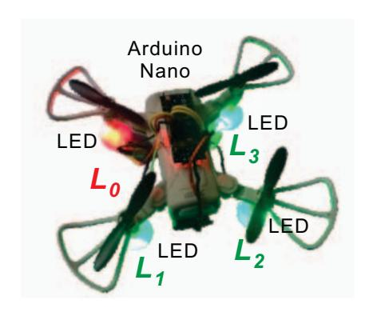
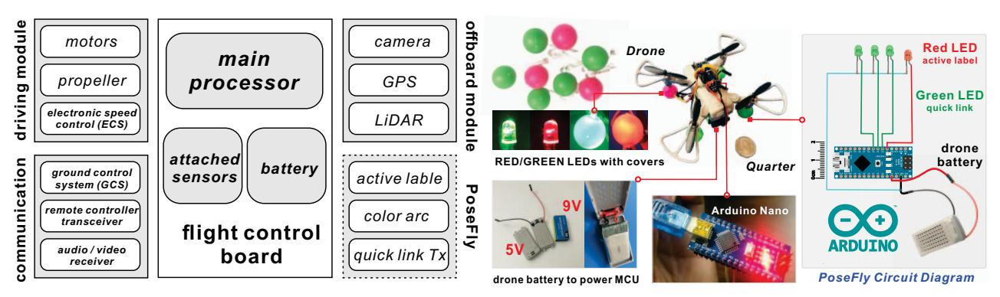
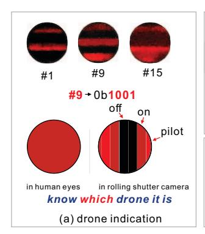
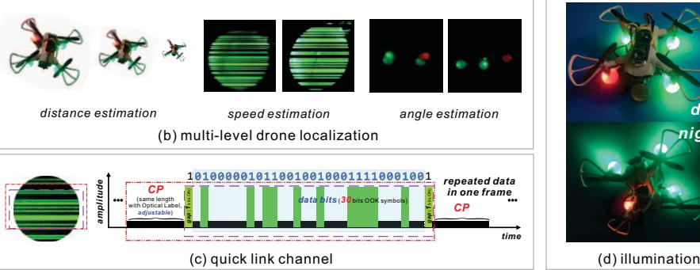
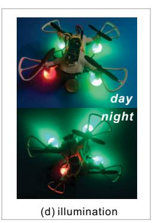

{0}------------------------------------------------

# Demo: Integrated On-site Localization and Optical Camera Communication for Drones

Xiao Zhang, Griffin Klevering, Kanishka Wijewardena, Li Xiao Department of Computer Science and Engineering Michigan State University, MI, East Lansing {zhan1387, kleveri2, wijewar2}@msu.edu, lxiao@cse.msu.edu

*Abstract*—Drones are gaining more interest thanks to their advantages and great potential for applications. However, present swarming drones' stand-alone centralized radio frequency control mode from a base station has non-trivial drawbacks such as severe interference, latency caused localization error, etc. Differently, optical camera communication (OCC) is promising as an alternative for integrated communication and sensing for swarming drones. We propose PoseFly, the first 4-in-1 OCC approach for swarming drones. With exploited rolling shutter effect and the already installed camera and LED nodes, PoseFly provides (1) massive drone indication and identification, (2) multilevel on-site localization, (3) quick-link channel among drones, and (4) basic lighting. The design methodology of PoseFly gives a valuable example for the low-cost integrated sensing and communication for swarming drones.

# I. INTRODUCTION

Drones, also as known as unmanned aerial vehicles (UAV) have numerous advantages (i.e., portable, cheap, easy operation, and promising applications [1]–[4]. Drones are now used in a wide range of applications, including aerial photography, plant protection, express delivery, transportation, animal monitoring, surveying and mapping, power inspection, disaster relief, news reporting, selfies, film and television production, and so on [5]. Drones are now largely controlled by a centralized base station (CBS), such as a drone pilot on the ground or an orbiting satellite, using the radio frequency (RF) spectrum [6], [7]. However, this centralized controlling restricts the performance of swarming drones. This is because that each drone communicates with the CBS about its sensed surroundings and itself via IMU (Inertial Measurement Unit) instead of direct drone-to-drone sensing and communication. Furthermore, this non-trivial back-and-forth in centralized communication latency, especially for high motion drones, will cause significant localization errors. Given an example, for two drones travelling at 20 m/s in opposite directions, the location computation and communication cost will take 0.25 seconds, resulting in a 10 m (0.25 × 20 × 2) localization error.

Although we could use the decentralized control method (i.e., drone-to-drone on-site communication) via the same RF spectrum, RF's Non-Line-of-Sight (NLoS) propagation allows for eavesdroppers to easily perform attacks with nontrivial multi-path effects and causes mutual interference [6]–[8]. Furthermore, as the number of drones in the cluster grows, the constrained capacity of the RF spectrum becomes signif-

Fig. 1: Hardware Prototype.

icantly more crowded, potentially resulting in bit errors with retransmissions and additional localization errors.

In contrast to RF signals, optical signals propagate in Lineof-Sight manner with broad spectrum bandwidth. Specifically, optical camera communication (OCC), has attracted more attention due to the population of commodity mobile devices with built-in cameras [5], [9]–[17]. To adapt OCC for swarming drones' on-site and distributed localization and communication, we need to address 3 technical challenges: C1: Drones, unlike geese, struggle to detect other drones with similar looks using visual recognition. Alternatively, we may use optical markers or labels to attach to drones. Static markers or existing bar/QR codes, on the other hand, are passive and can only operate within a certain recognition distance, such as 1 m. We should design the robust drone indication scheme for massive drones. C2: Geese can sense the posture of other geese via many vision features such as the head, wings and feet, etc. If we sense the drone posture with the same method, it will introduce non-trivial computation overhead. We should design lightweight but precise multi-level localization in aspects of distance, speed, and angle. C3: Rolling strips generated in each rolling spot are not synced for decoding considering the flying drones. We would achieve decoding correctly based on asynchronized rolling strips in rolling spots with random locations in a frame.

This demo will introduce the design concept and prototype of this 4-in-1 optical camera communication approach including (1) drone indication, (2) on-site localization, (3) quick-

{1}------------------------------------------------

Fig. 2: Original drone diagram with attached PoseFly.

Fig. 3: PoseFly circuit and diagram.

link channel, and (4) basic lighting functions. In particular, the rolling shutter effect and electrical hardware and software co-design are emphasized. The solution presented in this demo can be applied to other applications of integrated localization and communication such as vehicular network, underwater robots, human computer interactions, etc.

## II. IMPLEMENTATION

## A. Hardware

#### 1) Original Drone Flight Control:

A commercial drone consists of several key modules to achieve flight control, driving, communication, etc. The original drone diagram before upgrading with PoseFly is shown in Figure 2 [18]. The drone we used in our demo is the 4DV9 mini drone (14cm × 14cm, 125g, \$40), which consists of (1) driving modules (i.e., motors, electronic speed controller, propeller, etc.), (2) flight controller unit (i.e., main processor with attached sensors: gyroscope, accelerator, magnetometer, barometer, temperature sensor, etc.), (3) communication unit (i.e., ground control system, remote controller transceiver, Audio/Video receiver, etc.), (4) off-board modules (i.e., GPS, camera, telemetry, LiDAR, etc.), and (5) battery module.

## 2) Attached Arduino Circuit:

In addition to the basic modules above, we attach the additional Arduino Nano control board with 4 LED nodes (1 red and 3 green) in our implementation. The power for Arduino is provided by the original Li-ion battery. The 4 LEDs are installed at 4 corners of the drone with the same-size plastic sphere covers. They are powered and controlled with PWM (pulse-width modulation) based brightness configuration by Arduino's digital pins. The hardware of PoseFly with the original drone is shown in Figure 1. In the future, we can directly use the original drone control board instead of this additional Arduino board as the off-board modules during implementation to decrease the complexity and weight of Pose. The PoseFly circuit and diagram is shown in Figure 3.

# B. Software

## 1) LED Wave Generation Module:

**Drone Indication.** We indicate each drone with a specific active optical label. These optical labels are invisible to human

eyes due to their high On-Off freshing at KHz level [9], [15]. The optical label consists two components: (1) **CP** (**cyclic pilots**). CP begins with one symbol period with adjustable symbol period (rolling strip width). It is designed for identifying one entire optical label, and (2) **indication symbols.** They include 4 OOK (On-Off Keying) symbols.

**Quick Link.** We set 3 green spot (i.e.,  $L_1$ ,  $L_2$ , or  $L_3$ ) as the quick link optical front ends. We design CP (cyclic preamble) based cyclic OOK data sequences for the modulation in each green spot with only bright and dark amplitude levels for reliable quick link. The beginning and end symbols are set as On as gaps between CP and valid data symbols, and the symbol length of OOK data sequences is 32 bits.

## 2) CNN Recognition Module:

For different tasks: (1) drone ID identification (15 classes:#1-#15), (2) distance estimation (5 classes: 4m-20m with step of 4m), (3) speed estimation (4 classes: static, low, medium, and fast), (4) angle estimation (8 classes: 0°-360° with step of 45°). We adopt the ResNet 18 model and trained models with captured images for each task. Then we use the trained models to predict (1) drone's ID based on rolling strip patterns, (2) distance from the camera to the drone based on the captured drone's size, (3) drone's speed based on the shape variation of the captured sphere spot, and (4) drone's relative angle based on the captured drone's specific color arc pattern.

## 3) Data Parsing Module:

Each captured image frame can embed  $30\times3$  (the number of spots) = 90 valid OOK data symbol. Thus the current PoseFly prototype can achieve  $60\times90=5400$  bits per second (i.e., 5.4 Kbps) data rate when the camera frame rate is set as 60 FPS. We adopt OpenCV to decode the embedded bits.

## C. Configuration and Setting

To capture the clear rolling strips, the camera rolling shutter rate should be set similar to or slightly higher than the transmission frequency of LED waves. For transmission frequency, we set it via Arduino code manually as initialization. As for the rolling shutter rate configuration, we use the professional mode of the system camera in Android phone VIVO-Y71A and set its speed manually to match the transmission frequency.

{2}------------------------------------------------

Fig. 4: The demonstration examples.

## III. DEMONSTRATION

To demonstrate the functionality of PoseFly, we present a commercial smartphone and a drone equipped with 4 LED nodes controlled with an attached Arduino. The user will use the smartphone's camera (i.e., a simulated drone's camera) to capture the rolling patterns of the drone's attached LED nodes. We will show how to set the rolling shutter rate at camera side and the transmission frequency configuration of LED nodes at the transmitter side. We will also give the explanation about rolling shutter effect and the captured rolling pattern for drone indication and quick-link data. Besides this basic demo and illustration, we will also demonstrate 4 integrated functions:

- Drone Indication and Identification. We will show how to capture the drone's active optical ID in varied distance and give the explanation of the indication rule, as shown in Figure 4 (a).
- Multi-level Drone Localization. We will demo and show the principles of how PoseFly can achieve distance estimation and angle estimation via perspective principle and speed estimation via varied spot shapes, as shown in Figure 4 (b).
- Quick-Link Channel OCC. We will show and explain the modulation CP-OOK and how the PoseFly addresses the asynchronous optical data from 3 transmission units in an image frame, as shown in Figure 4 (c).
- Lighting for illumination. We will show that these 4 LED nodes can provide illumination functions as well, as shown in Figure 4 (d).

# REFERENCES

- [1] B. Li, Z. Fei, and Y. Zhang, "Uav communications for 5g and beyond: Recent advances and future trends," *IEEE Internet of Things Journal*, vol. 6, no. 2, pp. 2241–2263, 2018.
- [2] H. Ullah, N. G. Nair, A. Moore, C. Nugent, P. Muschamp, and M. Cuevas, "5g communication: an overview of vehicle-to-everything, drones, and healthcare use-cases," *IEEE Access*, vol. 7, pp. 37 251– 37 268, 2019.
- [3] A. Sharma, P. Vanjani, N. Paliwal, C. M. W. Basnayaka, D. N. K. Jayakody, H.-C. Wang, and P. Muthuchidambaranathan, "Communication and networking technologies for uavs: A survey," *Journal of Network and Computer Applications*, vol. 168, p. 102739, 2020.

- [4] P. Nguyen, H. Truong, M. Ravindranathan, A. Nguyen, R. Han, and T. Vu, "Matthan: Drone presence detection by identifying physical signatures in the drone's rf communication," in *Proceedings of the 15th annual international conference on mobile systems, applications, and services*, 2017, pp. 211–224.
- [5] X. Zhang, G. Klevering, and L. Xiao, "Posefly: On-site pose parsing of swarming drones via 4-in-1 optical camera communication," in *2023 IEEE 24th International Symposium on a World of Wireless, Mobile and Multimedia Networks (WoWMoM)*. IEEE, 2023, pp. 1–10.
- [6] L. Bertizzolo, S. D'Oro, L. Ferranti, L. Bonati, E. Demirors, Z. Guan, T. Melodia, and S. Pudlewski, "Swarmcontrol: An automated distributed control framework for self-optimizing drone networks," in *IEEE INFO-COM 2020 - IEEE Conference on Computer Communications*, 2020.
- [7] J. Hu, A. Bruno, D. Zagieboylo, M. Zhao, B. Ritchken, B. Jackson, J. Y. Chae, F. Mertil, M. Espinosa, and C. Delimitrou, "To centralize or not to centralize: A tale of swarm coordination," *arXiv preprint arXiv:1805.01786*, 2018.
- [8] X. Zhang, G. Klevering, X. Lei, Y. Hu, L. Xiao, and T. Guanhua, "The security in optical wireless communication: A survey," *ACM Computing Surveys (CSUR)*, 2023.
- [9] X. Zhang and L. Xiao, "Rainbowrow: Fast optical camera communication," in *2020 IEEE 28th International Conference on Network Protocols (ICNP)*. IEEE, 2020, pp. 1–6.
- [10] S. Sur, I. Pefkianakis, X. Zhang, and K.-H. Kim, "Towards scalable and ubiquitous millimeter-wave wireless networks," in *Proceedings of the 24th Annual International Conference on Mobile Computing and Networking*, 2018, pp. 257–271.
- [11] A. Galisteo, Q. Wang, A. Deshpande, M. Zuniga, and D. Giustiniano, "Follow that light: Leveraging leds for relative two-dimensional localization," in *Proceedings of the 13th International Conference on emerging Networking EXperiments and Technologies*, 2017, pp. 187–198.
- [12] S. Zhu, C. Zhang, and X. Zhang, "Automating visual privacy protection using a smart led," in *Proceedings of the 23rd Annual International Conference on Mobile Computing and Networking*, 2017, pp. 329–342.
- [13] X. Zhang, H. Guo, J. Mariani, and L. Xiao, "U-star: An underwater navigation system based on passive 3d optical identification tags," in *The 28th Annual International Conference on Mobile Computing and Networking*, 2022.
- [14] X. Zhang and L. Xiao, "Lighting extra data via owc dimming," in *Proceedings of the Student Workshop*, 2020, pp. 29–30.
- [15] X. Zhang, G. Klevering, and L. Xiao, "Exploring rolling shutter effect for motion tracking with objective identification," in *Proceedings of the Twentieth ACM Conference on Embedded Networked Sensor Systems*, 2022, pp. 816–817.
- [16] X. Zhang and L. Xiao, "Effective subcarrier pairing for hybrid delivery in relay networks," in *2020 IEEE 17th International Conference on Mobile Ad Hoc and Sensor Systems (MASS)*. IEEE, 2020, pp. 238–246.
- [17] X. Zhang, J. Mariani, L. Xiao, and M. W. Mutka, "Lifod: Lighting extra data via fine-grained owc dimming," in *2022 19th Annual IEEE International Conference on Sensing, Communication, and Networking (SECON)*. IEEE, 2022, pp. 73–81.
- [18] S.-G. Kim, E. Lee, I.-P. Hong, and J.-G. Yook, "Review of intentional electromagnetic interference on uav sensor modules and experimental study," *Sensors*, vol. 22, no. 6, p. 2384, 2022.