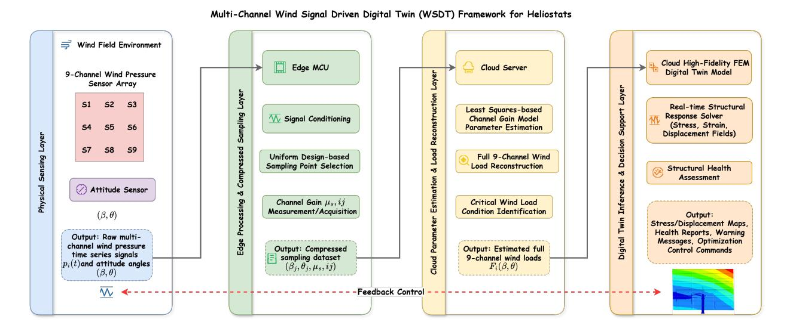
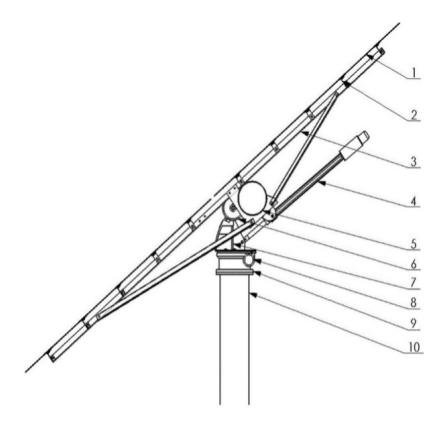
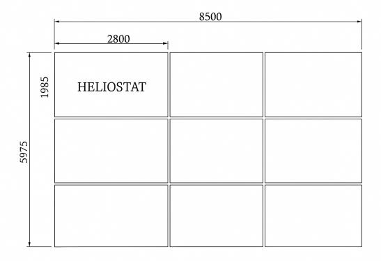
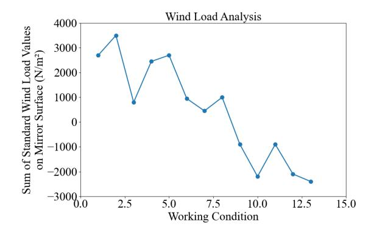
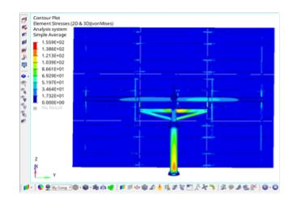
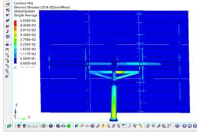
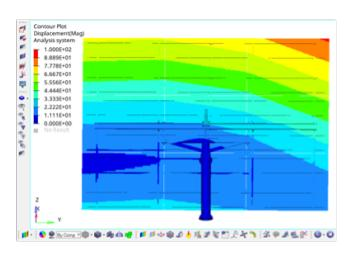
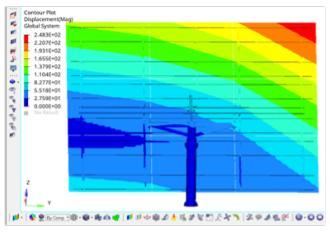

{0}------------------------------------------------

# Multichannel Wind-Signal Driven Digital Twin for a 50 m2 Heliostat: Compressed Sampling, Load Estimation and Edge–Cloud Hybrid Computing

*Chao Ma*1 *, Yang Xiang*1 *, Yiming Xue*1 *, Siyuan Zhang*1 *, Yun Wang*2 *, Danlei Chen*3 *, Rui Wang*4 *, Luoxiao Yang*5∗

> 1 Department of New Energy Project Powerchina Northwest Engineering Corporation Limited Xi'an, Shaanxi, 710100, China 2 Technion–Israel Institute of Technology Technion City, Haifa, 3200003, Israel 3 School of Electronic Information and Artificial Intelligence Shaanxi University of Science and Technology Xi'an, Shaanxi, 710021, China 4 Xi'an Mingde Institute of Technology Xi'an, Shaanxi, 710124, China 5 Department of Automation and Information Engineering Xi'an University of Technology Xi'an, Shaanxi, 710048, China \* Corresponding author

*Abstract*—Large-scale heliostat fields require real-time structural health awareness under stochastic wind excitation to ensure optical accuracy and operational safety. Existing studies often treat wind loads as static scalars, lacking an integrated sensingcommunication-computing perspective. This paper proposes a multichannel wind-signal driven digital twin (WSDT) framework for a 50 m2 heliostat. We map the nine sub-mirrors of the heliostat to nine wind pressure sensing channels. A twodimensional angular scanning grid (13 wind direction levels × 10 elevation levels) generates 130 load cases, which are treated as a nine-channel spatio-temporal signal set. A U13(138 ) uniform design matrix is employed for compressed sampling, reducing the sampling overhead by 90%, while a least-squares estimator is employed to reconstruct the full wind-signal field. The estimated equivalent wind load is streamed via a low-power wide-area network (e.g., NR-RedCap) to a cloud-based finite element solver (acting as the digital twin), returning stress field inferences within milliseconds. Analysis shows that the framework accurately detects the critical wind load case (wind direction β=15°, elevation θ=65°), and its inferred peak von Mises stress (155.9 MPa at 12 m/s wind speed, 502.8 MPa at 25 m/s) remains below the yield limit of Q345 steel. Compared to traditional offline analysis workflows, the WSDT framework reduces on-site data volume by 87% and enables online decision support for Integrated Sensing and Communication (ISAC) scenarios. The proposed WSDT can be generalized to large-scale heliostat fields, paving the way for large-scale, signal-aware structural monitoring in concentrated solar power plants.

*Index Terms*—Heliostat, Multichannel Signal Processing, Digital Twin, Concentrated Solar Power

# I. INTRODUCTION

The pursuit of global carbon neutrality has highlighted Concentrated Solar Power (CSP) as a key clean energy technology. Tower CSP systems rely on tens of thousands of heliostats to accurately direct solar radiation to a central receiver. The efficiency of this energy conversion and the overall safety of the plant are directly compromised by wind-induced instabilities and pointing inaccuracies of these heliostat structures [1]–[3]. Consequently, a robust capability to perceive, analyze, and predict heliostat responses within complex wind fields is paramount.

However, traditional heliostat design and analysis methods often focus on offline structural mechanics calculations, typically based on static or quasi-static wind pressure coefficients obtained from wind tunnel tests [1]. Such methods struggle to adapt to the dynamic changes of actual wind fields and the real-time monitoring needs of large-scale mirror fields. With the development of the Internet of Things (IoT), 5G/6G communication, edge computing, and artificial intelligence, it has become feasible to introduce intelligent sensing, signal processing, and digital twin capabilities to heliostat fields, enabling online and fine-grained management of the structural health status of the mirror array [4]–[6].

Integrated Sensing and Communication (ISAC) technology provides a new paradigm for the deep integration of the physical and digital worlds [7], [8]. Treating a heliostat as an intelligent sensing node in an ISAC network—collecting environmental and structural response signals (which can be affected by environmental and operational variability [9]) through multichannel sensors (e.g., wind pressure, strain sensors), using advanced signal processing algorithms for data compression, feature extraction, and state estimation, and

{1}------------------------------------------------

Fig. 1: WSDT Overall Framework Diagram. This high-level flowchart illustrates the four core modules: Physical Sensing Layer (heliostat, sensors), Edge Processing & Compressed Sampling Layer (signal conditioning, uniform design sampling), Cloud Parameter Estimation & Load Reconstruction Layer (LSE, critical load identification), and Digital Twin Inference & Decision Support Layer (FEM twin, health assessment, feedback). Arrows indicate data flow, with a wireless link between edge and cloud.

transmitting key information via wireless communication links to edge or cloud computing platforms for digital twin modeling and analysis—can significantly enhance the intelligent operational level of heliostat fields. The use of multichannel sensor arrays for understanding complex physical fields draws parallels from other domains such as acoustic array processing [10].

This paper focuses on a 50 m2 cantilevered boom-type heliostat and innovatively proposes a multichannel wind-signal driven digital twin (WSDT) framework. The core idea of this framework is to transform the wind-induced response problem of a heliostat into a complete information chain, from signal perception, compressed processing, and parameter estimation to digital twin inference, as illustrated in Fig. 1. Specifically, the physical heliostat perceives wind pressure signals through a multichannel sensor array; these signals are processed via compressed sampling and parameter estimation algorithms to extract key load characteristics; these characteristics are transmitted via a wireless communication network to the cloud, driving a digital twin model for realtime inference of structural responses and health assessment, ultimately enabling intelligent perception and decision support for the heliostat's operational status. The main contributions of this paper include:

- 1) Proposing the treatment of the heliostat wind pressure field as a multichannel signal and constructing a corresponding signal acquisition and processing model.
- 2) Introducing uniform design as a compressed sampling strategy, significantly reducing the experimental/sampling cost required to characterize the heliostat's wind-induced response.

- 3) Constructing a conceptual edge-cloud collaborative digital twin computing framework, enabling quasi-real-time structural response inference for the heliostat under various wind signal inputs.
- 4) Validating the effectiveness of this framework in critical wind load case identification and structural safety assessment, demonstrating its application potential in ISACenabled intelligent heliostat fields.

# II. SYSTEM OVERVIEW AND WIND-SIGNAL MODEL

This section aims to establish the physical basis and signallevel abstraction model for the WSDT framework. First, we conceptualize the heliostat hardware and its potential sensing and communication capabilities as an Integrated Sensing and Communication (ISAC) node [7], [8]. Second, we abstract the distributed wind pressure acting on the heliostat surface [1] into a set of discrete multichannel signals and define the key parameters of these signals. Finally, to systematically study these signal characteristics, we design a two-dimensional angular scanning sampling space covering the main operational postures of the heliostat.

#### *A. Heliostat Hardware and Conceptual ISAC Node*

The 50 m2 heliostat studied in this paper employs a unique triangular braced dual-beam structure, designed to minimize the diameter of the horizontal main axis and steel consumption. A schematic of this overall structure is presented in Fig. 2. The main beam of the heliostat utilizes a balanced suspension structure, with suspension devices on both sides of the auxiliary beam, ensuring that the center of rotation coincides with the center of gravity of the mirror surface during

{2}------------------------------------------------

Fig. 2: Schematic of the 50m2 heliostat overall structure. Showing the main components and coordinate system.

Fig. 3: 50m2 Heliostat 9-Channel Sensor Array Layout Diagram. Shows the overall dimensions (8500mm x 5975mm) and the 9 sub-mirrors (2800mm x 1985mm each) representing sensing channels.

rotation, effectively reducing the driving torque required for pitch adjustment.

The mirror surface of this heliostat is composed of 9 independent 5.558 m2 reflective glass panels, arranged as shown in Fig. 3. In our WSDT framework, each of these submirrors is considered a wind pressure signal sensing channel. The entire heliostat, or each channel, can be integrated with miniature wind pressure sensors, a data acquisition unit (DAU), an edge microcontroller (MCU), and a low-power wide-area network (LPWAN) communication module (e.g., NR-RedCap or LoRaWAN) [11]–[13], forming a sensing node in an ISAC network. The MCU is responsible for preliminary signal processing and data packaging, while the communication module handles uploading the processed data or raw data segments to the cloud.

# *B. Multichannel Wind Pressure Signal Definition*

The wind pressure experienced by a heliostat in a wind field is not uniformly distributed across its surface [1], [2]. We treat the equivalent average wind pressure acting on the i-th submirror (i = 1, ..., 9) as the output of a signal channel. This

TABLE I: Selected Two-Dimensional Angular Scanning Sampling Grid (β, θ) from Uniform Design

| Case No. | Wind Angle β (°) | Elevation Angle θ (°) |
|----------|------------------|-----------------------|
| 1        | 0                | 30                    |
| 2        | 15               | 65                    |
| 3        | 30               | 10                    |
| 4        | 45               | 45                    |
| 5        | 60               | 80                    |
| 6        | 75               | 25                    |
| 7        | 90               | 60                    |
| 8        | 105              | 0                     |
| 9        | 120              | 40                    |
| 10       | 135              | 70                    |
| 11       | 150              | 20                    |
| 12       | 165              | 50                    |
| 13       | 180              | 90                    |

signal, si(β, θ), is a function of the incoming wind direction angle β and the heliostat elevation angle θ. At a constant wind speed v, its equivalent standard wind load value ωk can be calculated by:

$$\omega_k = \beta_z \mu_s(\beta, \theta) \mu_z \omega_0 \tag{1}$$

where βz is the wind vibration coefficient, µz is the wind pressure height variation coefficient, and ω0 = 0.5ρv2 is the basic wind pressure (ρ is air density). The core parameter µs(β, θ) is the "wind signal shape coefficient" or "channel gain" for the i-th channel, directly reflecting the sensitivity of that channel to a specific (β, θ) input. Our goal is to accurately estimate and utilize these µs(β, θ) values from a limited number of samples.

# *C. Two-Dimensional Angular Scanning Sampling Grid*

To characterize the properties of µs(β, θ) across the entire operational space, we designed a two-dimensional angular scanning sampling grid. The wind direction angle β varies from 0° to 180° at 15° intervals (13 levels), and the elevation angle θ varies from 0° to 90° at 10° intervals (10 levels, 0° being horizontal mirror). Theoretically, this constitutes 13×10 = 130 independent (β, θ) case combinations. For each case, the µs values for all 9 channels need to be determined. This is equivalent to collecting a 9-dimensional signal vector at each of the 130 sampling points. The specific sampling grid, particularly the subset used for compressed sampling, is shown in Table I.

# III. COMPRESSED SAMPLING AND LOAD ESTIMATION

This section focuses on how to efficiently acquire and process multichannel wind signal data to achieve accurate estimation of heliostat wind loads. The core challenge lies in the prohibitive cost of full-factorial sampling. To address this, we first introduce uniform design as a compressed sampling strategy, aiming to capture key system information with a minimal number of sampling points. Subsequently, based on

{3}------------------------------------------------

TABLE II: Channel Gain Coefficients µs for Each Channel under Uniform Design Sampling Conditions

| Wind Angle β (°) | Elevation Angle θ (°) | Mirror 1 | Mirror 2 | Mirror 3 | Mirror 4 | Mirror 5 | Mirror 6 | Mirror 7 | Mirror 8 | Mirror 9 |
|------------------|-----------------------|----------|----------|----------|----------|----------|----------|----------|----------|----------|
| 0                | 30                    | 2.0615   | 1.934    | 1.5485   | 2.0975   | 1.8749   | 1.7056   | 2.0505   | 2.6577   | 1.9588   |
| 15               | 65                    | 2.8728   | 2.5906   | 1.9996   | 2.7589   | 2.7749   | 2.3372   | 3.015    | 3.0117   | 1.9502   |
| 30               | 10                    | 1.2898   | 0.8817   | 0.5984   | 0.8633   | 0.3039   | 0.2388   | 0.9446   | 0.2758   | 0.0946   |
| 45               | 45                    | 2.4893   | 1.9813   | 1.3534   | 2.4827   | 1.6191   | 1.2142   | 2.2358   | 1.8242   | 1.155    |
| 60               | 80                    | 2.8246   | 2.3178   | 1.5227   | 2.704    | 2.1436   | 1.5454   | 2.0156   | 1.8321   | 1.2732   |
| 75               | 25                    | 1.3935   | 0.8286   | 0.4679   | 1.2304   | 0.5582   | 0.3174   | 0.7511   | 0.3763   | 0.2047   |
| 90               | 60                    | 0.9049   | 0.4941   | 0.1271   | 0.2931   | 0.3372   | 0.1767   | 0.1673   | 0.1853   | 0.3164   |
| 105              | 0                     | 1.6016   | 0.9149   | 0.3316   | 0.8349   | 0.7464   | 0.4706   | 0.7507   | 0.5495   | 0.4768   |
| 120              | 40                    | -0.599   | -0.7505  | -0.9775  | -1.3785  | -0.6653  | -0.3993  | -0.8438  | -0.4381  | -0.0021  |
| 135              | 70                    | -1.0616  | -1.9761  | -1.8873  | -2.065   | -2.0375  | -1.5506  | -1.5661  | -1.6119  | -0.779   |
| 150              | 20                    | -0.5567  | -1.4838  | -1.6705  | -0.8993  | -0.554   | -0.6078  | -0.5501  | 0.0425   | 0.2586   |
| 165              | 50                    | -1.3041  | -2.0514  | -2.0275  | -1.8216  | -1.8217  | -1.5867  | -1.754   | -1.3446  | -0.5994  |
| 180              | 90                    | -0.8904  | -2.0289  | -2.2476  | -1.719   | -2.1901  | -2.1519  | -1.6106  | -2.0892  | -1.4142  |

this sparse sampling data, we employ parametric modeling and least-squares estimation methods to reconstruct the fullfield channel gain characteristics. Finally, we demonstrate how to use the estimated load information to intelligently detect critical wind load conditions that pose the greatest threat to the heliostat's structural safety.

# *A. Compressed Sampling Strategy based on Uniform Design*

Conducting wind tunnel tests or high-fidelity CFD simulations for all 130 cases is expensive. To reduce sampling costs, we introduce Uniform Design (UD) as a compressed sampling strategy [14]. UD enables test points to be uniformly scattered within the experimental domain even when the number of test points is much smaller than in a full-factorial experiment. For a scenario with two factors (β and θ), each with 13 levels, we selected a U13(132 ) uniform design table, which requires only 13 experimental runs (as shown in Table I). Compared to the 130 runs of a full-factorial experiment, this reduces the number of samples by approximately (130-13)/130 ≈ 90%. These 13 sets of experimental data, {(βj , θj , µs,ij )j=1..13,i=1..9}, will be used to reconstruct the entire µs(β, θ) surface.

# *B. Channel Gain Estimation and Full-Field Reconstruction via Least Squares*

After obtaining the 13 sets of sample data, we establish a regression model for the gain µs,i(β, θ) of each channel i. We assume that µs,i can be approximated by a polynomial function (or other suitable basis functions) of β and θ. For example, a simple quadratic polynomial model is:

$$\mu_{s,i}(\beta,\theta) \approx c_0 + c_1\beta + c_2\theta + c_3\beta^2 + c_4\theta^2 + c_5\beta\theta$$
 (2)

Using the data from the 13 sampling points, the coefficients ck can be estimated using the Least Squares Estimation (LSE) method. Once the model parameters are determined, the channel gain µs,i can be predicted for any given (β, θ) combination, thus enabling the reconstruction of the full-field wind signal load. Table II presents the gain coefficients µs for the 9 channels under the 13 sampled operating conditions, obtained through uniform design experiments and regression analysis.

Fig. 4: Total Wind Signal Energy under Different Uniform Design Sampling Conditions. The Y-axis represents the sum of standard wind load values (arbitrary units or sum of N/m2 ). The curve peaks at Case 2.

#### *C. Intelligent Detection of Critical Wind Load Conditions*

The total wind load experienced by the heliostat system is the vector sum of the loads on the 9 channels. By calculating the total wind load (or its energy) for all 130 theoretical cases (or more interpolated points), the critical condition that subjects the system to the maximum wind force can be identified. As shown in Fig. 4, which plots the sum of the standard wind load values for the 9 sub-mirrors (a measure of total wind signal energy) under the 13 uniform design sampling conditions, it can be seen that at Case 2 (wind angle 15°, elevation angle 65°), the total wind signal energy experienced by the system reaches its maximum. This identification capability is crucial for heliostat safety protection strategies (e.g., automatic adjustment to a stow position in severe weather) [15].

# IV. EDGE-CLOUD DIGITAL TWIN COMPUTING FRAMEWORK

This section elaborates on the edge-cloud collaborative computing architecture within the WSDT framework, designed for real-time inference of the heliostat's structural response. The 

{4}------------------------------------------------

core of this architecture is the deployment of a high-fidelity physics-based simulation model (Finite Element Model) as a digital twin in the cloud. Edge devices are responsible for realtime or quasi-real-time acquisition and preprocessing of (wind) signal data from the physical heliostat, and uploading key information. The cloud-based digital twin then uses these inputs to rapidly solve for and feedback the structural response status. We first introduce the construction of the cloud-based digital twin model, then describe the specific workflow of edge-cloud collaboration, and finally discuss how this framework can be utilized for online structural health inference.

## *A. Cloud-based Finite Element Digital Twin Model*

A high-fidelity Finite Element (FE) model was constructed specifically for the 50 m2 heliostat system under consideration. This computational model meticulously incorporates the heliostat's geometry, the material properties of its constituent parts (such as Q345 steel for structural elements and relevant parameters for the mirror panels, details of which are established foundational data for this model), and the precise connection methods between key components including the column, main beam, truss, and purlins. Deployed on a cloud server, this FE model functions as the digital twin of the physical heliostat. It is designed to receive real-time or quasireal-time wind load data—either in the form of the estimated µs channel gain values for the nine sub-mirrors or as direct wind pressure values—from the edge processing unit or a ground control system. Upon receiving these load inputs, the cloud-based digital twin can rapidly compute and provide the stress, strain, and displacement distributions experienced by the heliostat structure.

### *B. Edge-Cloud Collaborative Workflow*

The proposed edge-cloud collaborative workflow is described as follows:

- 1) Edge Sensing and Preprocessing: The wind pressure sensor array on the heliostat collects raw wind pressure signals. The edge MCU filters and calibrates the signals, and calculates the instantaneous wind load for each channel based on the current (β, θ) state (provided by attitude sensors or tracking algorithms) and a pre-stored µs model.
- 2) Data Compression and Transmission: If detailed information needs to be transmitted, the edge MCU can compress and package the calculated 9-channel load data [6] and send it to a cloud gateway via an LPWAN module [11]–[13], [16] in a low-power, low-rate manner. For scenarios requiring only specific analyses to be triggered, only critical event alarms or key parameters may be sent. The on-site data volume requiring uplink can be reduced by approximately 87%.
- 3) Cloud Digital Twin Inference: Upon receiving the data, the cloud platform loads it as boundary conditions into the FE digital twin model and performs structural static (or dynamic) analysis.

- (a) Wind speed 12 m/s (Max stress 155.9 MPa)
- (b) Wind speed 25 m/s (Max stress 502.8 MPa)

Fig. 5: Digital Twin Inferred Von Mises Equivalent Stress Distribution of the Heliostat under Critical Wind Load.

4) Result Feedback and Decision Support: The analysis results (e.g., maximum stress, deformation, safety margin) can be displayed visually on a monitoring interface or fed back as control commands to edge actuators (e.g., adjusting the heliostat's posture to a safe position).

#### V. SIMULATION RESULTS AND EVALUATION

# *A. Stress Field Inference under Different Wind Speeds*

Under the identified critical wind loading condition (wind azimuth angle 15°, elevation angle 65°), the cloud-based digital twin model is utilized to evaluate the stress distribution across the heliostat structure at two representative wind speeds: the operational wind speed (12 m/s) and the survival wind speed (25 m/s).

The stress distribution results are presented in Fig.5. At an operational wind speed of 12 m/s, Fig.5(a) indicates that the maximum von Mises equivalent stress experienced by the heliostat structure is approximately 155.9 MPa. In contrast, when the wind speed increases to the survival state of 25 m/s, the maximum equivalent stress significantly rises to about 502.8 MPa (as shown in Fig. 5(b)). For structural steel Q345, the allowable stress typically ranges between 235 MPa (factoring in standard safety factors) and its nominal yield strength of 345 MPa.

At the operational wind speed of 12 m/s, the maximum stress remains well below the yield limit, indicating safe and stable structural conditions. However, at the elevated survival wind speed of 25 m/s, stress values notably exceed the typical allowable stress threshold. If such conditions represent rare, short-duration extreme wind events, certain engineering standards and design codes may permit brief excursions near or slightly above the yield strength. Nevertheless, the observed stress value serves as a critical indicator, highlighting the potential risk of structural failure or irreversible deformation under prolonged exposure. Thus, the provided results emphasize the importance of monitoring and preventive measures, demonstrating the capability of the developed WSDT framework to offer precise quantitative stress assessments.

# *B. Displacement Field Inference under Different Wind Speeds*

Structural deformation of heliostats directly influences their optical accuracy. Therefore, deformation under critical wind

{5}------------------------------------------------

- (a) Wind speed 12 m/s (Max displacement 100 mm)
- (b) Wind speed 25 m/s (Max displacement 248.3 mm)

Fig. 6: Digital Twin Inferred Displacement Distribution of the Heliostat under Critical Wind Load.

loading conditions must be carefully evaluated. The displacement field simulation results under the same critical condition (wind azimuth angle 15°, elevation angle 65°) are illustrated in Fig. 6.

Fig.6(a) shows that at the operational wind speed (12 m/s), the maximum deformation of the heliostat structure is approximately 100 mm. As the wind speed escalates to the survival wind speed (25 m/s), the maximum deformation considerably increases to 248.3 mm, as depicted in Fig.6(b). Such deformation data—particularly the normal displacement and torsional deformation of the mirror surface—represent critical parameters for assessing optical performance degradation. By comparing the calculated deformation with allowable optical error limits, engineers can effectively evaluate whether the heliostat remains within acceptable operational criteria, thereby maintaining the desired optical efficiency and safety margins

# VI. CONCLUSION

This paper reframed the traditional static wind response analysis of a 50 m2 heliostat into a multichannel, windsignal-driven digital twin (WSDT) framework. By treating the heliostat surface as a 9-channel wind pressure signal acquisition array and employing uniform design as a compressed sampling strategy, we significantly reduced the data volume required to characterize its wind-induced response characteristics. The proposed edge-cloud collaborative digital twin computing framework demonstrated the capability to infer stress and strain distributions of the heliostat in quasi-realtime, while accurately identifying critical wind load conditions based on estimated wind load inputs.

Our results showed that the proposed WSDT framework not only reproduced key conclusions from mechanical analysis—such as structural safety margins under critical conditions—but more importantly provided an integrated solution spanning signal perception, processing, communication, and intelligent computation. This achievement established a solid foundation for implementing fine-grained intelligent health monitoring and predictive maintenance in future large-scale heliostat fields, fully demonstrating the potential of ISAC technology for intelligent upgrades in renewable energy infrastructure. Furthermore, the developed methodology created a robust framework for subsequent dynamic signal analysis, intelligent control, and operational optimization of heliostats in complex environments.

# ACKNOWLEDGMENT

This work was supported by National Natural Science Foundation of China (62402384).

# REFERENCES

- [1] M. Emes, A. Jafari, A. Pfahl, J. Coventry, and M. Arjomandi, "A review of static and dynamic heliostat wind loads," *Solar Energy*, vol. 225, pp. 60–82, 2021.
- [2] M. Marano, M. Emes, A. Jafari, and M. Arjomandi, "Variation of heliostat wind loads in a radial field array model," in *SolarPACES Conference Proceedings*, vol. 2, 2023.
- [3] K. M. Armijo, M. Muller, D. Tsvankin, and D. Madden, "Review and gap analysis of heliostat components and controls," *Journal of Solar Energy Engineering*, vol. 146, no. 6, p. 061010, 2024.
- [4] Z. Sun, S. Jayasinghe, A. Sidiq, F. Shahrivar, M. Mahmoodian, and S. Setunge, "Approach towards the development of digital twin for structural health monitoring of civil infrastructure: A comprehensive review," *Sensors*, vol. 25, no. 1, p. 59, 2024.
- [5] M.-S. Kang, D.-H. Lee, M. S. Bajestani, D. B. Kim, and S. D. Noh, "Edge computing-based digital twin framework based on iso 23247 for enhancing data processing capabilities," *Machines*, vol. 13, no. 1, p. 19, 2024.
- [6] H. Djelouat, A. Amira, and F. Bensaali, "Compressive sensing-based iot applications: A review," *Journal of Sensor and Actuator Networks*, vol. 7, no. 4, p. 45, 2018.
- [7] O. Günlü, M. R. Bloch, R. F. Schaefer, and A. Yener, "Secure integrated sensing and communication," *IEEE Journal on Selected Areas in Information Theory*, vol. 4, pp. 40–53, 2023.
- [8] D. Zhang, Y. Cui, X. Cao, N. Su, F. Liu, X. Jing, J. A. Zhang, J. Xu, C. Masouros, D. Niyato *et al.*, "Integrated sensing and communications over the years: An evolution perspective," *arXiv preprint arXiv:2504.06830*, 2025.
- [9] H. Sohn, "Effects of environmental and operational variability on structural health monitoring," *Philosophical Transactions of the Royal Society A: Mathematical, Physical and Engineering Sciences*, vol. 365, no. 1851, pp. 539–560, 2007.
- [10] P.-A. Grumiaux, S. Kitic, L. Girin, and A. Guérin, "A survey of sound ´ source localization with deep learning methods," *The Journal of the Acoustical Society of America*, vol. 152, no. 1, pp. 107–151, 2022.
- [11] V. Bonilla, B. Campoverde, and S. G. Yoo, "A systematic literature review of lorawan: Sensors and applications," *Sensors*, vol. 23, no. 20, p. 8440, 2023.
- [12] M. Danyal Khattak, "Testbed implementation and emulative study of redcap modulation performance for direct-to-satellite connectivity," Master's thesis, M. Danyal Khattak, 2024.
- [13] D. D. Olatinwo, A. Abu-Mahfouz, and G. Hancke, "A survey on lpwan technologies in wban for remote health-care monitoring," *Sensors*, vol. 19, no. 23, p. 5268, 2019.
- [14] K.-T. Fang, D. K. Lin, P. Winker, and Y. Zhang, "Uniform design: theory and application," *Technometrics*, vol. 42, no. 3, pp. 237–248, 2000.
- [15] K. Worden and J. M. Dulieu-Barton, "An overview of intelligent fault detection in systems and structures," *Structural Health Monitoring*, vol. 3, no. 1, pp. 85–98, 2004.
- [16] Z. Wang, S. Sun, Y. Li, Z. Yue, and Y. Ding, "Distributed compressive sensing for wireless signal transmission in structural health monitoring: An adaptive hierarchical bayesian model-based approach," *Sensors*, vol. 23, no. 12, p. 5661, 2023.