{0}------------------------------------------------

# Secrecy Energy Efficiency of Hybrid Wireless Body Area Networks

Simone Soder[i](https://orcid.org/0000-0002-1024-9470) , *Senior Member, IEEE,* and Alessio Zappon[e](https://orcid.org/0000-0003-2581-939X) , *Fellow, IEEE,*

**Abstract**—Hybrid Wireless Body Area Networks (HyWBANs) are revolutionizing healthcare by integrating joint sensing and communication capabilities. However, this advancement introduces critical security challenges, as attackers can exploit sensing channels to intercept sensitive medical data. This paper introduces Secrecy Energy Efficiency (SEE) as a new performance metric for hybrid radio-optical wireless networks, enabling a quantitative assessment of secure communication under power-constrained conditions. We formulate and solve optimization problems to maximize the optical secrecy rate and SEE. We extend this analysis to a joint allocation framework for Ultra Wideband (UWB) and Near-Infrared (NIR) channels. Our approach leverages Sequential Fractional Programming (SFP), which enables to tackle the non-convex SEE maximization problem by a sequence of convex problems, addressing secure transmissions' inherent non-convexity and fractional nature with intentional jamming. Based on lab-based in-body measurements through porcine tissue and on radio and optical average synthetic phantoms, numerical evaluations demonstrate that the NIR link can achieve approximately 3 bit/Hz/Joule in SEE. Further, we show that optimal power allocation significantly outperforms random allocation methods, highlighting the potential of this approach for mission-critical healthcare applications. These findings provide a robust foundation for designing nextgeneration, low-power medical communication systems that balance security requirements with stringent energy constraints.

✦

**Index Terms**—SEE, Jamming, Physical Layer Security, 6G, UWB, OWC.

## **1 INTRODUCTION**

Hybrid radio-optical wireless communications are emerging as a transformative solution for next-generation communication systems. By integrating Radio Frequency (RF) and Optical Wireless Communications (OWC) technologies, these hybrid systems address pressing challenges such as limited spectrum availability, interference, and energy inefficiency that traditional wireless networks face. This integration enhances network performance, security, and energy efficiency, positioning hybrid communication as a cornerstone of future networks, including 6G and beyond [\[1\]](#page-12-0), [\[2\]](#page-12-1), [\[3\]](#page-12-2).

The increasing demand for high data rates, reliability, and low latency in applications such as autonomous vehicles, smart cities, and the Internet of Things (IoT) has exposed the limitations of standalone RF networks. While mature, RF systems face spectrum congestion and interference, necessitating complementary solutions. OWC offers a high-bandwidth, interference-free alternative by leveraging unlicensed optical spectra and existing lighting infrastructure [\[4\]](#page-12-3). By dynamically balancing network load, hybrid RF-OWC systems enhance communication reliability and Energy Efficiency (EE). In this study, we focus on *in-body Wireless Body Area Networks (WBANs)*, arguably the most demanding hybrid use-case, where implant depth, tissue-dependent attenuation, and strict power-density limits pose unique challenges to secrecy and energy efficiency. In-body WBANs uniquely combine very different Ultra Wideband (UWB) and Near-Infrared (NIR)-path losses, intra-/extra-corporeal adversaries, power budgets, and security constraints that our Secrecy Energy Efficiency (SEE) model jointly embeds.

EE has emerged as a critical requirement for 6G, driven by reducing power consumption while maintaining high performance. Despite being a fundamental consideration in 5G networks, the expected gains in EE were not fully achieved, making this an even greater priority in future deployments [\[5\]](#page-12-4). Hybrid systems naturally improve EE by dynamically selecting the most energy-efficient transmission mode based on real-time conditions. For example, switching to OWC reduces power consumption in RF-restricted environments while maintaining communication reliability. This adaptability is particularly valuable in energy-constrained applications, such as biomedical devices, wearable sensors, and industrial automation.

Beyond energy efficiency, data security is another pivotal challenge in 6G networks [\[6\]](#page-12-5), [\[7\]](#page-12-6). Wireless transmissions are inherently susceptible to eavesdropping, making robust security measures essential. Physical Layer Security (PLS) has gained prominence as a viable solution, leveraging channel characteristics rather than cryptographic techniques to ensure secure communication [\[8\]](#page-12-7), [\[9\]](#page-12-8). Hybrid RF-OWC systems further strengthen security, as OWC's confined light propagation inherently limits interception risks. Emerging technologies such as Reflective Intelligent Surfaces (RISs) further enhance PLS by dynamically shaping the transmission environment to optimize secrecy capacity [\[10\]](#page-12-9).

Despite these advantages, hybrid RF-OWC networks present new challenges, particularly regarding security vul-

• *Simone Soderi is with Scuola IMT Alti Studi Lucca, Piazza San Francesco 19, 55100 Lucca, Italy and the Department of Mathematics, University of Padua, 35121 Padua, Italy. He is also with the University of Oulu, 90570 Oulu, Finland. E-mail:* simone.soderi@imtlucca.it*.*

• *Alessio Zappone is with the Department of Electrical and Information Engineering, University of Cassino and Southern Lazio, 03043 Cassino, Italy E-mail:* alessio.zappone@unicas.it.

{1}------------------------------------------------

nerabilities, privacy concerns, and energy trade-offs. The coexistence of multiple transmission mediums necessitates comprehensive threat modeling and efficient power management strategies. Addressing these challenges is crucial for realizing the full potential of hybrid communication systems in 6G and beyond.

## **1.1 Motivation**

Modern communication networks face a dual imperative: they must be secure against increasingly sophisticated threats while operating with maximum energy efficiency to support sustainable and battery-constrained environments. These challenges are amplified in hybrid communication systems that merge [RF](#page-0-0) and [OWC](#page-0-0) technologies, which, while promising significant advantages, must also overcome potential vulnerabilities and inefficiencies. Hybrid networks are particularly relevant for safety-critical applications such as medical [Industrial and Communications](#page-0-0) [Technology \(ICT\)](#page-0-0) systems, where data confidentiality and operational continuity are non-negotiable [\[11\]](#page-12-10). However, the question remains: *Can hybrid systems truly offer energyefficient and secure communication?* Given the growing dependence on sensor networks in areas like biomedical monitoring, this is an essential consideration where attackers might exploit communication vulnerabilities to eavesdrop or falsify data. Furthermore, energy constraints in such systems demand solutions that do not compromise performance or security. The next generation of wireless networks will include hybrid radio and optical wireless communications [\[12\]](#page-12-11). These sensor networks may be used in modern medical [ICT](#page-0-0) applications [\[13\]](#page-12-12) where an attacker can eavesdrop on communications and sensing by falsifying the results, making them no longer trustworthy.

This paper investigates whether hybrid networks, specifically those combining [RF](#page-0-0) and [OWC,](#page-0-0) are inherently energy-efficient and secure solutions *defining the analytical expression, calculating, and maximizing the [SEE](#page-0-0)* for hybrid radio-optical wireless networks for the first time in the literature. By exploring this under-examined intersection, we aim to provide foundational insights into the viability of hybrid systems for next-generation communication infrastructures.

## **1.2 Related Works**

Hybrid [RF-OWC](#page-0-0) systems have received significant research attention for their potential to shape next-generation networks. Recent studies have explored advancements in [PLS,](#page-0-0) resource allocation, and energy-efficient transmission schemes, highlighting their relevance for 6G.

[EE](#page-0-0) has been a focal point of wireless network design, particularly during the transition from 5G to 6G [\[14\]](#page-12-13), [\[5\]](#page-12-4). Key techniques to improve [EE](#page-0-0) include massive [Multiple](#page-0-0) [Input Multiple Output \(MIMO\),](#page-0-0) lean carrier design, and network sleep modes [\[5\]](#page-12-4). Additionally, [Visible Light Com](#page-0-0)[munication \(VLC\),](#page-0-0) a subset of [OWC,](#page-0-0) has emerged as a promising energy-efficient solution for IoT applications, offering low power consumption and reduced electromagnetic interference [\[15\]](#page-12-14). Hybrid [RF-OWC](#page-0-0) networks capitalize on these advancements by dynamically allocating resources between radio and optical channels, optimizing power usage based on operational requirements.

[RIS](#page-0-0) have recently been proposed as a key enabler for security and energy efficiency in wireless systems [\[16\]](#page-12-15), [\[17\]](#page-13-0). By modifying the wireless propagation environment, [RIS](#page-0-0) can minimize interference, optimize beamforming, and enhance secrecy performance. Several studies have demonstrated the effectiveness of [RIS](#page-0-0) in maximizing secrecy energy efficiency [\(SEE\)](#page-0-0), a metric that quantifies the tradeoff between security and power consumption [\[18\]](#page-13-1), [\[19\]](#page-13-2). In [MIMO](#page-0-0) and non-orthogonal multiple access (NOMA) systems, resource allocation strategies have been tailored to optimize both [EE](#page-0-0) and secrecy performance [\[20\]](#page-13-3).

Artificial noise (AN) injection and beamforming optimization have also been explored to enhance secure communication in energy-constrained systems [\[18\]](#page-13-1), [\[20\]](#page-13-3). AN-based techniques degrade the eavesdropper's reception while maintaining efficient power consumption for legitimate users. Meanwhile, machine learning approaches, such as Deep Reinforcement Learning (DRL), have been integrated into [RIS](#page-0-0) -assisted networks to optimize [SEE,](#page-0-0) demonstrating improvements in real-time security adaptation and dynamic power allocation [\[21\]](#page-13-4).

[PLS](#page-0-0) continues to be a key alternative to conventional cryptographic methods, particularly in hybrid [RF-OWC](#page-0-0) networks. Unlike traditional encryption-based security, [PLS](#page-0-0) capitalizes on channel characteristics such as fading and interference to ensure information-theoretic secrecy [\[20\]](#page-13-3). The integration of [RIS-](#page-0-0)assisted secure communication further enhances [PLS](#page-0-0) by creating controlled propagation environments that improve secrecy rates while minimizing power consumption [\[17\]](#page-13-0). Recent studies have formulated optimization problems involving [RIS](#page-0-0) beamforming and phase shift adaptation to maximize secrecy capacity while preserving energy efficiency [\[16\]](#page-12-15), [\[17\]](#page-13-0).

Hybrid [RF-OWC](#page-0-0) networks are also gaining traction in 6G research, particularly in [IoT](#page-0-0) and medical [ICT](#page-0-0) applications. NOMA-based hybrid networks incorporating [VLC](#page-0-0) have been proposed to improve spectral efficiency while minimizing power consumption [\[15\]](#page-12-14). Additionally, [RIS-](#page-0-0)assisted cell-free networks are being investigated as an alternative to power-intensive base stations, reducing network-wide energy consumption [\[16\]](#page-12-15). Various optimization frameworks, including fractional programming, convex optimization, and successive convex approximation (SCA), have been employed to balance security and [EE](#page-0-0) trade-offs [\[17\]](#page-13-0), [\[18\]](#page-13-1). DRL-based security and energy management techniques are also gaining traction, demonstrating the potential for adaptive and dynamic secure communication strategies in hybrid networks [\[21\]](#page-13-4).

In summary, significant research efforts have been devoted to optimizing security and [EE](#page-0-0) in hybrid [RF-OWC](#page-0-0) systems. However, several open challenges remain, including the *joint optimization* of energy efficiency and security and the development of adaptive security techniques that leverage AI-driven optimization. Addressing these gaps will be essential for fully realizing the potential of hybrid networks in 6G.

{2}------------------------------------------------

## **1.3 Contribution**

This paper studies for the first time the Secrecy Energy Efficiency [\(SEE\)](#page-0-0) in hybrid [RF-OWC](#page-0-0) systems, quantifying the trade-off between secure communication and energy consumption. In particular, our original contributions are as follows:

- **First-Time [SEE](#page-0-0) Definition and Computation for [Hybrid Wireless Body Area Network \(HyWBAN\):](#page-0-0)** We define and compute [SEE](#page-0-0) for hybrid radio-optical networks, providing a new metric to assess how many bits can be securely transmitted per unit of energy in the presence of jamming.
- **Power Control for Optical Channel:** We formulate and solve the optical secrecy rate maximization and the optical [SEE](#page-0-0) maximization problems via sequential fractional programming. This systematic approach addresses the non-convex and fractional nature of secure optical transmissions with jamming.
- **Hybrid RF-OWC Integration:** We extend the definition and maximization of the SEE to the case in which the RF and optical channels are used in parallel, but subject to a common power budget. In this scenario, we develop power control routines that include joint allocation of optical and radio resources, offering a unified framework that captures the combined secrecy rate and overall energy usage across both channels.
- **Validation with Real Measurements and Existing Semantic-Communication Workload:** We validate the SEE-based optimisation on lab-acquired UWB and NIR channels and, without any retraining, apply it to the semantic-communication encoder–decoder and biomedical dataset of [\[12\]](#page-12-11). This demonstrates that the proposed metric captures real-world conditions and is immediately usable with state-of-the-art traffic generators for low-power medical applications.

These contributions lay the foundation for designing and optimizing next-generation hybrid networks that balance robust security and stringent energy requirements, which are particularly vital for safety-critical domains such as medical [ICT.](#page-0-0)

### **1.4 Organization**

The remainder of the paper is organized as follows. Section [2](#page-2-0) briefly recalls the concepts useful for understanding the paper. Section [3](#page-3-0) describes security and energy considerations for hybrid networks. Section [4](#page-4-0) details the considered system model. Section [5](#page-5-0) defines the SEE metric for the optical channel, RF channel, and joint use of RF and optical channel. Section [6](#page-6-0) develops the proposed SEE maximization algorithm for the optical channel, while Section [7](#page-8-0) considers the SEE maximization in the more general case in which the optical and RF channels are jointly used with a common power budget. Section [8](#page-9-0) provides numerical results that support this research. Finally, Section [9](#page-12-16) concludes the paper by discussing our findings.

## **2 BACKGROUND**

Hybrid radio-optical wireless communication systems integrate the strengths of [RF](#page-0-0) and [OWC](#page-0-0) technologies, enabling robust and efficient communication across diverse applications such as healthcare and the [IoT.](#page-0-0)

[WBANs](#page-0-0) are a foundational technology in healthcare, designed to connect wearable or implanted sensors for monitoring physiological parameters [\[22\]](#page-13-5). These networks prioritize low power consumption, compact size, and lightweight design to ensure user comfort and practical usability. Typically, [WBANs](#page-0-0) consist of a central hub that aggregates data from multiple sensors and transmits it for processing. Current [WBAN](#page-0-0) technologies, such as [Bluetooth](#page-0-0) [Low Energy \(BLE\)](#page-0-0) and IEEE 802.15.6, primarily operate in the 2.4 GHz ISM band [\[23\]](#page-13-6). However, the crowded nature of this band often leads to interference, necessitating the exploration of alternative communication technologies such as [UWB](#page-0-0) and [OWC.](#page-0-0)

[OWC,](#page-0-0) mainly using [NIR](#page-0-0) signals, provides several advantages for [WBANs,](#page-0-0) including reduced electromagnetic interference, enhanced privacy, and confined signal propagation. These features make [OWC](#page-0-0) highly suitable for healthcare applications where secure and interferenceresistant communication is paramount. [HyWBANs](#page-0-0) combine [RF](#page-0-0) and [OWC](#page-0-0) technologies to address individual communication mediums' limitations. This integration leverages [RF'](#page-0-0)s broad coverage and reliability while benefiting from [OWC'](#page-0-0)s secure and interference-resistant properties [\[12\]](#page-12-11). The flexibility of switching between [RF](#page-0-0) and optical communication modes enables [HyWBANs](#page-0-0) to optimize energy efficiency and ensure reliable data transmission under varying conditions. This hybrid approach positions [HyW-](#page-0-0)[BANs](#page-0-0) as a key enabler of 6G-enabled healthcare services, supporting real-time monitoring, enhanced privacy, and efficient energy use.

Integrating [RF](#page-0-0) and [OWC](#page-0-0) technologies in hybrid systems is not limited to healthcare. While [RF](#page-0-0) excels in [Non-Line-Of-Sight \(NLOS\)](#page-0-0) communication and long-range connectivity, it is vulnerable to interference and spectrum congestion. Conversely, [OWC](#page-0-0) offers high-bandwidth communication with immunity to electromagnetic interference, making it ideal for localized and secure data transmission. These technologies enable hybrid systems to achieve broad coverage and high-capacity communication, making them suitable for energy-sensitive and security-critical applications [\[24\]](#page-13-7), [\[25\]](#page-13-8).

Security remains a primary concern in hybrid systems, particularly in sensitive data applications. [OWC,](#page-0-0) due to its confined light beams, inherently limits the risk of eavesdropping, making it a valuable complement to [RF](#page-0-0) communication. Hybrid systems dynamically combine these strengths, leveraging [OWC](#page-0-0) for secure data transmission and mitigating [RF'](#page-0-0)s vulnerabilities [\[26\]](#page-13-9), [\[12\]](#page-12-11). [PLS](#page-0-0) techniques further enhance this integration by exploiting the physical properties of communication channels to protect data without relying solely on cryptographic methods [\[27\]](#page-13-10), [\[28\]](#page-13-11).

Energy efficiency is another critical consideration in hybrid networks, especially for applications involving battery-constrained devices such as wearable and im

{3}------------------------------------------------

plantable medical technologies. NIR-based OWC systems are highly energy-efficient, requiring minimal power while maintaining high performance. Dynamic resource allocation allows hybrid systems to optimize energy use, ensuring sustainable operation even in resource-constrained environments [25]. These energy-efficient capabilities are significant for WBANs, where extended device operation is crucial for continuous health monitoring [12].

UWB technology is a key enabler for short-range, high-speed communication in hybrid networks. Its broad bandwidth and low power requirements make it ideal for precise localization and high-throughput applications, particularly in in-body-to-body communication scenarios [29]. Similarly, NIR communication, with its ability to transmit data securely and efficiently through biological tissues, complements UWB and RF technologies, further enhancing the capabilities of hybrid systems in healthcare and IoT applications [2], [12].

Finally, Semantic Communication (SC) introduces a paradigm shift in hybrid networks by focusing on the meaning and purpose of transmitted data rather than merely its accuracy. This approach reduces energy consumption and latency by prioritizing the transmission of relevant information, aligning well with energy-sensitive applications such as medical ICT requirements. By incorporating semantic principles, hybrid networks achieve greater efficiency and effectiveness, particularly in scenarios demanding timely and accurate interpretation of data [30], [31]. Hybrid radio-optical wireless communication systems provide a comprehensive framework for addressing the challenges of next-generation networks. By integrating RF and OWC technologies and leveraging advancements in security, energy efficiency, and SC, these systems are balanced to transform critical applications such as healthcare, IoT, and beyond.

## 3 SECURITY AND ENERGY CONSIDERATIONS IN HYWBAN

HyWBANs extend the traditional tiered communication model of WBANs by incorporating radio-optical hybrid links [32]. This tiered model facilitates efficient communication across different layers of the network. Tier 1 focuses on communication between on-body and in-body devices (On-In) or on-body to on-body devices (On-On), enabling localized data exchange among sensors and actuators. Tier 2 involves on-body to off-body (On-Off) communication, which supports data aggregation and transmission to external systems such as servers or cloud platforms for further analysis. HyWBANs typically operate up to Tier 2, leveraging hybrid communication channels to address the limitations of traditional WBANs. This paper investigates this model's security and energy implications, mainly focusing on On-In hybrid communication links, as depicted in Figure 1.

The integration of optical and radio technologies in HyWBANs introduces a number of opportunities and challenges to achieve secure and energy-efficient communications. As a case study in the remainder of the paper, we will focus on biomedical applications and how the hybrid nature of

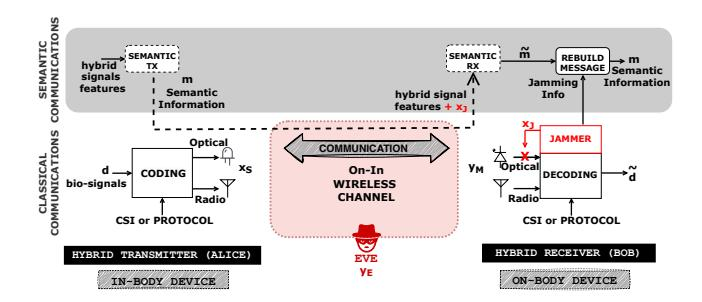

Fig. 1: On-In hybrid wireless communication with AI-based semantic communication and optical jamming receiver as the use case for evaluating the SEE in this paper.

these networks allows us to model the link between security and energy consumption in healthcare applications.

The security considerations in HyWBANs are shaped by the diverse threats faced in healthcare environments, including eavesdropping, unauthorized access, and data tampering. With its spatially confined signal propagation, optical communication offers significant advantages in securing sensitive patient data. Unlike radio waves, which can traverse walls and other barriers, optical signals remain localized, reducing the risk of interception. This property is particularly beneficial in environments where privacy is critical, such as hospital wards and operating rooms. Leveraging optical communication channels for data transmission enhances the confidentiality of sensitive information, ensuring that patient data remains secure against external threats [12]. In addition to leveraging the intrinsic security properties of optical communication, HyWBANs utilize their hybrid architecture to enhance security further. Data can be split and transmitted simultaneously through optical and radio channels, requiring both components for successful decryption. This dual-layered approach strengthens security by adding redundancy and complexity for potential attackers. Switching between communication modes dynamically allows HyWBANs to respond effectively to real-time security challenges, adapting to evolving threat landscapes without compromising performance. Moreover, this mechanism increases the reliability of communication.

The energy efficiency of HyWBANs is another critical factor, particularly given the power constraints of wearable and implantable medical devices [33]. These devices must maintain long operational lifespans while providing reliable performance. By integrating optical communication, which requires lower power for transmission than radio communication, HyWBANs achieve significant energy savings. For example, in medical ICT, optical communication is particularly advantageous in scenarios where radio frequency exposure is restricted, such as in radiology units, allowing the network to operate efficiently while minimizing interference. HyWBANs also employ advanced energy management strategies to enhance their sustainability further. Dynamic resource allocation enables the network to optimize power usage by prioritizing energy-efficient transmission paths. Techniques such as low-power listening and time-division multiple access (TDMA) ensure network nodes remain in low-power states when not actively transmitting data. These strategies extend the operational

{4}------------------------------------------------

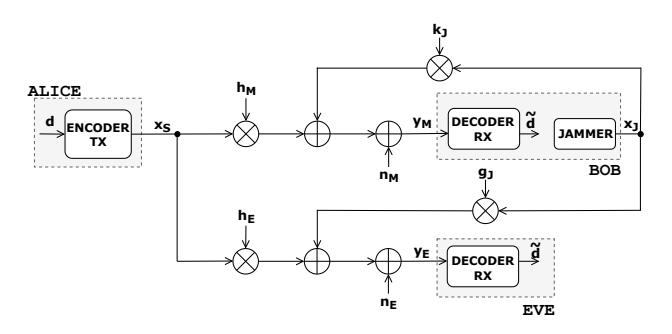

Fig. 2: System model: non-degraded wiretap channel model modified with jamming receiver.

lifespan of devices and contribute to the overall sustainability of healthcare infrastructure, reducing the environmental impact of medical technologies [34].

By leveraging the complementary strengths of optical and radio technologies, HyWBANs deliver secure and energy-efficient communication solutions that enhance patient care and operational effectiveness. Integrating advanced security measures and energy management techniques positions HyWBANs as a cornerstone technology in developing 6G-enabled healthcare systems.

### 4 System Model and Use Case

As a concrete application to evaluate SEE for hybrid networks, this section discusses a modified version of the non-degraded wiretap channel model [35] already applied in [12], where the authors combined *semantic communication* with a *jamming receiver* in HyWBAN for healthcare applications. The neural encoder–decoder and biomedical dataset follow the implementation in [12] and are reused here without retraining to supply a realistic workload with other measurements on phantoms in [36], whereas the SEE formulation and optimisation constitute the new contribution

It is essential to clarify that in this article, we want to use this communication architecture that uses semantic communications and a receiver that produces intentional interference to increase security as a reference for calculating the SEE. When the receiver produces jamming, it changes the channel parameters and thus the classification of the semantic concept. The legitimate receiver can only clear the interference and correctly understand the SC. Jamming consumes energy, so our work wants to use the SEE to measure the impact of this intentional interference on security.

We use the system model presented in Fig. 2 to support the later discussion to compute and evaluate specific metrics. In this scenario and regarding the threat model depicted in Figure 1, Alice sends a hybrid RF-OWC components signal  $\boldsymbol{x}_S = \begin{pmatrix} x_S^r \\ x_S^o \end{pmatrix}$  to the legitimate receiver, Bob. At the same time, a malicious eavesdropper, Eve, attempts to intercept the signal over the wireless channel. Bob also uses a jammer that emits both RF and optical jamming signals to degrade the quality of the channels for both the main communication and the eavesdropper. Bob receives Alice's signal while controlling the jamming

 $m{x}_J = \begin{pmatrix} x_J^{\rm r} \\ x_J^{\rm o} \end{pmatrix}$ . Their RF and optical components represent the channels between Alice and Bob  $m{h}_M = \begin{pmatrix} h_M^{\rm r} & h_M^{\rm o} \end{pmatrix}$ . and Alice and Eve  $m{h}_E = \begin{pmatrix} h_E^{\rm r} & h_E^{\rm o} \end{pmatrix}$ . Similarly, we can express the jamming channels as  $m{k}_J = \begin{pmatrix} k_J^{\rm r} & k_J^{\rm o} \end{pmatrix}$  and  $m{g}_J = \begin{pmatrix} g_J^{\rm r} & g_J^{\rm o} \end{pmatrix}$ . Gaussian noise affects the main and eavesdropper channels  $m{n}_M \in \mathbb{R}^{1 \times 2}$  and  $m{n}_E \in \mathbb{R}^{1 \times 2}$ .

$$y_M = h_M x_S + k_J x_J + n_M, \qquad (1)$$

$$\mathbf{y}_E = \mathbf{h}_E \mathbf{x}_S + \mathbf{g}_J \mathbf{x}_J + \mathbf{n}_E, \tag{2}$$

where  $h_M$ ,  $k_J$ ,  $h_E$ ,  $g_J$  are the channel's gains.  $x_S$  is the data signal,  $x_J$  is the jamming signal,  $n_M$  and  $n_E$  are the complex zero-mean Gaussian noise with variance  $\sigma^2$ . Without loss of generality in the rest of the paper, we assume that  $\mathbb{E}[|x_S|^2] = 1$  and  $\mathbb{E}[|x_J|^2] = 1$ .

In our simulation, the friendly jammer is optical only. A narrow-beam NIR LED transmits an intentional interference sequence that obscures the channel for any external eavesdropper. At the same time, the same photodiode keeps receiving Alice's hybrid stream in full-duplex. Because Bob generates the jamming pattern locally, he can subtract it from the received photocurrent before demodulation, thereby cancelling self-interference independently of how the payload (conventional or semantic) is encoded. The arrangement is purely conceptual and quantifies the impact of intentional optical jamming on SEE; no hardware prototype is assumed in this paper.

SC is an emerging concept in 6G network security [30], and in their paper, Soderi et. al. [12], focus on generating semantic representations related to biomedical applications as part of security mitigation; the complementary part is the jamming receiver. SCs uses a Deep Learning (DL) model trained on a dataset that includes measured, augmented, and synthetic biological signals. Signals like Heart Rate (HR), body Temperature (TMP), and Accelerometer data (ACC) are combined with UWB Signal-to-Interferenceplus-Noise Ratio (SNR) and NIR received power (LPW). Semantic communications use all these parameters to classify and define labels associated with each type of communication in a supervised manner (see Table 1). These labels are the semantic concepts that represent a compressed version of the data the device measures and then exchanges through the wireless channels.

Even though transmitting semantic concepts over wireless channels may be vulnerable to interception, the system is *protected by a jamming receiver*1 [12]. As illustrated in Figure 1, this receiver (Bob) introduces intentional interference in the light channel, disrupting the signal sent by the in-body device. As a result, any adversary (Eve)

1. The jamming receiver is modelled analytically as an optical-only, full-duplex device; no physical prototype is presented in this work.

TABLE 1: Classification labels for semantic communications in HyW-BAN In-On and On-In links [12].

| Label (Semantic concepts) | Condition                           |
|---------------------------|-------------------------------------|
| Full Communications       | HIGH_SNR and HIGH_LPW               |
| Wide Communications       | HIGH_SNR and LOW_LPW                |
| Communications in Motion  | (HIGH_SNR or HIGH_LPW) and HIGH_ACC |
| Critical Communications   | (HIGH_HR or HIGH_TMP) and LOW_LPW   |
| Unstable Communications   | LOW_SNR or LOW_LPW                  |
| Reduced Communications    | All other cases                     |

{5}------------------------------------------------

trying to intercept the data will encounter degraded signal characteristics, such as lower SNR for RF signals or reduced input power for NIR signals, leading to incorrect interpretation of the semantic concepts. However, the legitimate receiver, Bob, knows the jamming pattern and can reverse the distortion to decode the transmitted semantic concepts accurately. On the other hand, an adversary, Eve, who needs this information, can not decode the data correctly. This dual-layer defense mechanism, combining SC with controlled jamming, strengthens the security of HyWBAN against advanced cyber threats.

Example implementation scenario – hospital room. consider an implant (Alice) that sends data to its on-body coordinator (Bob) in a therapy room [37]. A passive eavesdropper would have to stand somewhere in the room and is likely to be visible, so Bob can often estimate that person's channel. Because the wiretap gain is then bounded by the measured UWB path loss and directivity of NIR, the SEE controller maintains physical-layer secrecy by re-optimising the UWB/NIR power split and activating the optical jamming whenever its fast SNR probe shows the margin is shrinking. Such sub-millisecond SNR updates and optimiser runs can be feasible on our RP2040-based hybrid board [37], indicating practical deployability; validating this in hardware is future work.

#### 5 SECRECY ENERGY EFFICIENCY

In line with the energy-efficient metrics typically used in systems without confidentiality constraints, this work adopts a metric measured in *bit-per-joule*, which reflects the trade-off between secure, reliable communication and minimal energy consumption. The metric used in this study is the system *secrecy energy efficiency (SEE)*, which is the ratio of the system's secrecy capacity (or achievable rate) to the total consumed power [20]

$$SEE = \frac{R_s}{\mu P + P_c}$$
 [bit/Hz/Joule] (3)

where  $R_s$  is the normalized secrecy rate, P is the transmitted power of the confidential message,  $\mu$  is the inverse of amplifier efficiency2, and  $P_c$  is the overall power consumed in Alice's and Bob's hardware other than the transmit amplifier. Without loss of generality, we assume  $\mu=1$ .

SEE comprehensively assesses the system's efficiency in maintaining secure communication while optimizing energy use. By focusing on this metric, we aim to evaluate the performance of hybrid communication systems in terms of their ability to securely transmit data while conserving energy, as motivated and discussed in the introduction.

In general, for both RF and OWC channels, the secrecy rate  $(R_s)$  of the legitimate link for non-degraded Gaussian wiretap channels [35] is defined as

$$R_s = \max\{C_M - C_E, 0\} = \begin{cases} \log_2 \frac{1 + \gamma_M}{1 + \gamma_E}, & \text{if } \gamma_M > \gamma_E, \\ 0, & \text{if } \gamma_M \le \gamma_E, \end{cases}$$
(4)

2. We recall that amplifier power efficiency  $(\eta)$  is <1 and  $\eta=1/\mu=P_R/P_{in}$ , where the  $P_R$  is the power at the output of the amplifier, while  $P_{in}$  is the total power consumed by the amplifier, including input signal and hardware power.

where  $C_M=\log_2(1+\gamma_M)$  is the channel capacity from Alice to Bob, i.e., the main channel, and  $C_E=\log_2(1+\gamma_E)$  is the channel capacity from Alice to Eve, i.e., the wiretap channel exploited by the passive eavesdropper. Moreover,  $\gamma_M$  and  $\gamma_E$  are the SINR of the main and the eavesdropper's channels. The secrecy rate  $R_s$  is computed at the physical layer; it depends solely on the main and wiretap channel capacities and not on how the source information is encoded. A semantic encoder's output bit-rate replaces the conventional payload rate in  $R_s$ , leaving the SEE expression (4) structurally unchanged.

In the case of UWB, given the received signals in (1) and (2), we can define the Signal-to-Noise Ratio (SNR) at Bob's side as

$$\gamma_M^{\rm r} = \frac{|h_M^{\rm r}|^2 P_t^{\rm r}}{(\sigma_M^{\rm r})^2 + |k_J^{\rm r}|^2 P_i^{\rm r}}$$
(5)

where  $P_t^{\rm r}$  is the transmitted optical power,  $P_j^{\rm r}$  is the jamming optical power, and  $(\sigma_M^{\rm r})^2$  is the background noise spectral density.

The SNR at Eve's side is given by

$$\gamma_E^{\rm r} = \frac{|h_E^{\rm r}|^2 P_t^{\rm r}}{(\sigma_E^{\rm r})^2 + |g_J^{\rm r}|^2 P_i^{\rm r}}.$$
 (6)

Similarly, for the OWC, the SNR at Bob's side is given by

$$\gamma_M^{\text{o}} = \frac{|h_M^{\text{o}}|^2 (P_t^{\text{o}})^2}{(\sigma_M^{\text{o}})^2 + |k_j^{\text{o}}|^2 (P_j^{\text{o}})^2};_0} \tag{7}$$

where  $P_t^{\rm o}$  is the transmitted optical power,  $P_j^{\rm o}$  is the jamming optical power, and  $(\sigma_M^{\rm o})^2$  is the background noise spectral density.

The SNR at Eve's side is given by

$$\gamma_E^{\text{o}} = \frac{|h_E^{\text{o}}|^2 (P_t^{\text{o}})^2}{(\sigma_E^{\text{o}})^2 + |g_J^{\text{o}}|^2 (P_i^{\text{o}})^2}.$$
 (8)

As explained in Section 4, it is essential to remark that the legitimate receiver (Bob) generates the jamming on the radio and the optical channels and is the only one who knows which bits have been destroyed. For this reason, we can *remove the interference component* of equations (5) and (7) and similarly to what is commonly done in the literature in successive interference cancellation. This makes the mitigation effective at *contrasting the attacker's sensing activity*.

Plugging equations from (5) to (8) in (3), we achieve the SEE for HyWBAN as follows, for the UWB it is given by

$$SEE^{r} = \frac{\log_2\left(\frac{1+\gamma_M^r}{1+\gamma_E^r}\right)}{\mu(P_t^r + P_i^r) + P_c^r}.$$
 (9)

In the case of NIR the SEE is given by

$$SEE^{o} = \frac{\log_{2}\left(\frac{1+\gamma_{M}^{o}}{1+\gamma_{E}^{o}}\right)}{\mu[P_{t}^{o} + P_{i}^{o}] + P_{c}^{o}}.$$
 (10)

Equations (9) and (10) follow the usual interpretation of the SEE as a benefit-cost ratio, in which the benefit is the system secrecy rate, while the cost is the system total power expenditure, highlighting how we must consider intentional jamming on both channels in calculating the energy expended to mitigate the attacker's sensing.

{6}------------------------------------------------

In a scenario in which the legitimate system has two power budgets, one which provides the RF powers  $P_t^{\rm r}$  and  $P_{j}^{\mathrm{r}}$ , and one which provides the optical powers  $P_{t}^{\mathrm{o}}$  and  $P_i^{o}$ , the optimization of SEE° and SEE° can be decoupled, optimizing  $P_t^{o}$  and  $P_j^{o}$  separately from  $P_t^{r}$  and  $P_j^{r}$ . In this case, the optimization of SEEr can be performed as in previous works on SEE that focus only on RF systems, e.g., [20]. Instead, the optimization of SEE° is more challenging because the optical powers at the denominator of SEE° are not squared, as instead happens in the expression of  $\gamma_M^{\rm o}$  and  $\gamma_E^{\rm o}$  in the numerator of SEE°. Indeed, while the optical powers that are transmitted are simply  $P_t^{o}$  and  $P_i^{o}$ , the corresponding received optical powers are proportional to  $(P_t^0)^2$  and  $(P_i^0)^2$ . This leads to a more difficult mathematical expression that is dealt with in Section 6, which develops the algorithm for maximizing the optical SEE.

Instead, if the legitimate system has a single power budget for all the transmit and jamming powers, then the available power must be shared among the optical and RF channels. Therefore, the optimization of the optical part of the network can not be decoupled from the optimization of the radio-frequency part of the network. This requires a new definition of SEE, which jointly considers the system's RF and optical parts. Following the interpretation of SEE as a benefit-cost ratio, we can define the SEE of the whole hybrid network as the ratio between the total secrecy rate of the system, comprising both optical and radio frequency channels, and the total power consumption, namely

SEE = 
$$\frac{\log_2(\frac{1+\gamma_M^o}{1+\gamma_E^o}) + \log_2(\frac{1+\gamma_M^r}{1+\gamma_E^r})}{\mu(P_t^o + P_i^o + P_t^r + P_i^o) + P_c},$$
 (11)

with  $P_c = P_c^{\rm o} + P_c^{\rm r}$ . It should be noted that the definition in (11) is not equivalent to simply summing SEE° and SEE°. The definition in (11) has the physical interpretation of the benefit-cost ratio of the whole network, with the benefit being the total secrecy rate and the cost being the total power consumption. Instead, summing SEE° and SEE° would yield a performance metric that can not be interpreted as a benefit-cost ratio. The maximization of (11) is tackled in Section 7.

#### 6 POWER CONTROL OVER THE OPTICAL CHANNEL

#### 6.1 Optical Secrecy rate maximization

We consider the problem of maximizing the secrecy rate of the optical channel, with respect to the transmit and jamming optical power.

$$\max_{P_t^o, P_j^o} \log_2 \left( 1 + a_M^o (P_t^o)^2 \right) - \log_2 \left( 1 + \frac{a_E^o (P_t^o)^2}{1 + b_E^o (P_j^o)^2} \right) \quad (12a)$$

s.t. 
$$P_t^{o} + P_i^{o} \le P_{max}^{o}$$
 (12b)

$$P_t^{\rm o} \ge 0 \; , \; P_i^{\rm o} \ge 0$$
 (12c)

where we have defined  $a_M^{\rm o}=|h_M^{\rm o}|^2/(\sigma_M^{\rm o})^2$ ,  $a_E^{\rm o}=|h_E^{\rm o}|^2/(\sigma_E^{\rm o})^2$ ,  $b_E^{\rm o}=|g_j^{\rm o}|^2/(\sigma_E^{\rm o})^2$ .

We observe that the objective in (12a) is increasing in  $x_i$ . Consequently, there is no loss of optimality in turning

the constraint in (12b) into an equality constraint. Thus, the problem reduces to

$$\begin{aligned} \max_{P_t^{\text{o}}} & \log_2 \left( 1 + a_M^{\text{o}} (P_t^{\text{o}})^2 \right) \\ & - \log_2 \left( 1 + \frac{a_E^{\text{o}} (P_t^{\text{o}})^2}{1 + b_E^{\text{o}} (P_{max} - P_t^{\text{o}})^2} \right) \\ & \text{s.t. } P_t^{\text{o}} \in [0, P_{max}^{\text{o}}]. \end{aligned} \tag{13a}$$

Thus, the solution of (13) is either a stationary point of (13a), which can be found by standard gradient-based methods or a point on the boundary of the feasible set. We observe that if the solution is  $P_t^{\rm o}=0$ , then the secrecy rate is zero. In this case, the channel configuration is such that physical layer security is impossible. On the other hand, if the solution is the point  $P_t^{\rm o}=P_{max}$ , a positive secrecy rate is obtained without the need to use any jamming power, i.e.  $P_j^{\rm o}=0$ . A positive secrecy rate is also obtained when the problem's solution is a stationary point of (13a), which can be found by standard gradient search techniques.

#### 6.2 Optical SEE maximization

Adopting the same notation as for the secrecy rate maximization, the maximization of the SEE of the optical channel can be stated as

$$\max_{P_t^{\text{o}}, P_j^{\text{o}}} \frac{\log_2\left(1 + a_M^{\text{o}}(P_t^{\text{o}})^2\right) - \log_2\left(1 + \frac{a_E^{\text{o}}(P_t^{\text{o}})^2}{1 + b_E^{\text{o}}(P_j^{\text{o}})^2}\right)}{\mu(P_t^{\text{o}} + P_j^{\text{o}}) + P_c} \tag{14a}$$

$$s.t. P_t^o + P_i^o \le P_{max}^o \tag{14b}$$

$$P_t^{\rm o} \ge 0 \; , \; P_i^{\rm o} \ge 0$$
 (14c)

The SEE maximization problem is more challenging than secrecy rate maximization for the following reasons:

- Problem (14) is a fractional program that can not be tackled directly by convex optimization theory, since the objective is not concave in the optimization variables.
- Fractional programming [38] is the state-of-the-art framework for fractional problems but requires the numerator and denominator of the fraction to maximize to be concave and convex, respectively. Instead, the numerator of (14a) is not jointly concave in Pto and Pjo.
- It is not possible to transform the power inequality constraint (14b) into an equality constraint since the objective is not monotonically increasing with the optimization variables.
- Even applying a variable change to remove the quadratic terms at the numerator of (14a) would not simplify the problem, since the denominator of (14a) is instead linear in  $P_t^{\rm o}$  and  $P_j^{\rm o}$ . Indeed, applying, for example, the variable change  $x_t^{\rm o}=(P_t^{\rm o})^2$  would yield a term  $\sqrt{x_t^{\rm o}}$  at the denominator of (14a), which would therefore be non-convex, thus preventing again the direct use of fractional programming methods.

To tackle Problem (14) without resorting to an exhaustive search in the feasible set, we will resort to the framework of sequential fractional programming.

{7}------------------------------------------------

## 6.2.1 Sequential programming

This section introduces the main result of sequential programming. Let  ${\mathcal P}$  be the optimization problem

$$\mathcal{P}: \max_{\mathbf{x} \in \mathcal{X}} g(\mathbf{x}) . \tag{15a}$$

In order to tackle (15), the sequential programming framework requires finding a succession of functions  $\{g_i(\mathbf{x}|\mathbf{x}_i)\}_i$ , with  $\mathbf{x}_i \in \mathcal{X}$ , such that

$$g_i(\mathbf{x}|\mathbf{x}_i) \le g(\mathbf{x}) , \ \forall \mathbf{x} \in \mathcal{X}$$
 (16)

$$g_i(\mathbf{x}_i|\mathbf{x}_i) = g(\mathbf{x}_i) \tag{17}$$

$$\nabla_{\mathbf{x}} g_i(\mathbf{x}_i | \mathbf{x}_i) = \nabla_{\mathbf{x}} g(\mathbf{x}_i) \tag{18}$$

Then, the following result holds [39].

Proposition 1. Consider the sequence of problems  $\mathcal{P}_i$  defined as

$$\mathcal{P}_i : \max_{\mathbf{x} \in \mathcal{X}} g_i(\mathbf{x}|\mathbf{x}_i) .$$
 (19a)

and denote by  $\mathbf{x}_i^{\star}$  its solution. Then, if, for all i,  $\mathbf{x}_{i+1} = \mathbf{x}_i^{\star}$ , then the sequence  $\{g(\mathbf{x}_i^{\star})\}_i$  increases monotonically and converges. Moreover, the sequence  $\{\mathbf{x}_i^{\star}\}_i$  converges to a point that satisfies the KKT conditions of Problem  $\mathcal{P}$ .

Sequential fractional programming applies sequential programming to fractional problems by finding a lower-bound of the fractional objective with a concave numerator and convex denominator to maximize it by standard fractional programming algorithms, such as Dinkelbach's algorithm. For the case at hand, the denominator of (14a) is linear, so it is already convex. Instead, the numerator is not concave. Thus, we look for a concave lower bound of the numerator of (14a) that fulfills the assumptions of Proposition 1.

#### 6.2.2 Sequential fractional programming for Problem (14)

Based on the discussion above, and equipped with the sequential fractional programming framework, the approach to overcome the challenges posed by Problem (14) will be to develop a concave lower-bound of (14a), so that standard fractional programming techniques can be employed.

To begin with, let us rewrite the numerator of (14a) as

$$R_s^{o} = \log_2 \left( 1 + a_M^{o}(P_t^{o})^2 \right) + \log_2 \left( 1 + b_E^{o}(P_j^{o})^2 \right) - \log_2 \left( 1 + a_E^{o}(P_t^{o})^2 + b_E^{o}(P_j^{o})^2 \right).$$
 (20)

To proceed, we will leverage the following inequality, which holds for any3  $z \ge 0$ ,  $z_0 \ge 0$ 

$$\log_2(1+z) \ge \alpha \log_2(z) + \beta , \qquad (21)$$

wherein

$$\alpha = \frac{z_0}{1 + z_0} \tag{22}$$

$$\beta = \log_2(1 + z_0) - \alpha \log_2(z_0) , \qquad (23)$$

Applying (21) with  $z = a_M^{\rm o}(P_t^{\rm o})^2$  yields

$$\log_2(1 + a_M^{\text{o}}(P_t^{\text{o}})^2) \ge R_a(P_t^{\text{o}}) \tag{24}$$

where

$$R_a(P_t^{\text{o}}) = \alpha_a \log_2(a_M^{\text{o}}) + 2\alpha_a \log_2(P_t^{\text{o}}) + \beta_a,$$

and  $\alpha_a$ ,  $\beta_a$  are given by (22) and (23), respectively, with  $z_0 = a_M^{\rm o}(P_{t,0}^{\rm o})^2$  and  $P_{t,0}$  any feasible point.

Similarly, applying (21) with  $z = b_E^{o}(P_i^{o})^2$  yields

$$\log_2(1 + b_E^{\text{o}}(P_j^{\text{o}})^2) \ge R_b(P_j^{\text{o}}) \tag{25}$$

where

$$R_b(P_j^{\text{o}}) = \alpha_b \log_2(b_E^{\text{o}}) + 2\alpha_b \log_2(P_j^{\text{o}}) + \beta_b,$$

and  $\alpha_b$ ,  $\beta_b$  are given by (22) and (23), respectively, with  $z_0=b_E^{\rm o}(P_{j,0}^{\rm o})^2$  and  $P_{j,0}$  any feasible point.

Next, since the logarithm is a concave function, it is upper-bounded by its first-order Taylor expansion around any point in its domain, namely

$$\log_2(1+x) \le \frac{1}{\ln(2)} \frac{x - x_0}{1 + x_0} + \log_2(1+x_0) , \quad (26)$$

which, defining  $x=a_E^{\rm o}(P_t^{\rm o})^2+b_E^{\rm o}(P_j^{\rm o})^2$  and  $x_0=a_E^{\rm o}(P_{t,0}^{\rm o})^2+b_E^{\rm o}(P_{j,0}^{\rm o})^2$ , yields the bound

$$\log_2 \left( 1 + a_E^{\text{o}}(P_t^{\text{o}})^2 + b_E^{\text{o}}(P_j^{\text{o}})^2 \right) \le R_c(P_t^{\text{o}}, P_j^{\text{o}}) \tag{27}$$

$$\begin{split} R_c(P_t^{\rm o},P_j^{\rm o}) &= \frac{a_E^{\rm o}((P_t^{\rm o})^2 - (P_{t,0}^{\rm o})^2) + b_E^{\rm o}((P_j^{\rm o})^2 - (P_{j,0}^{\rm o})^2)}{\ln(2)(1 + a_E^{\rm o}(P_{t,0}^{\rm o})^2 + b_E^{\rm o}(P_{j,0}^{\rm o})^2)} \\ &\quad + \log_2\left(1 + a_E^{\rm o}(P_{t,0}^{\rm o})^2 + b_E^{\rm o}(P_{j,0}^{\rm o})^2\right) \;. \end{split}$$

Therefore, (14a) can be lower-bounded as follows

$$SEE^{o} \ge \frac{R_{a}(P_{t}^{o}) + R_{b}(P_{j}^{o}) - R_{c}(P_{t}^{o}, P_{j}^{o})}{\mu(P_{t}^{o} + P_{j}^{o}) + P_{c}} = \widetilde{SEE}^{o}, \quad (28)$$

and the fractional problem to be solved in each iteration of the sequential fractional programming method is stated as

$$\max_{P_t^o, P_j^o} \widetilde{\text{SEE}}^o(P_t^o, P_j^o) \tag{29a}$$

s.t. 
$$P_t^{o} + P_j^{o} \le P_{max}^{o}$$
 (29b)

$$P_t^{\rm o} \ge 0 \; , \; P_j^{\rm o} \ge 0 \; .$$
 (29c)

Since  $R_a(P_t^{\rm o})$  is concave in  $P_t^{\rm o}$ ,  $R_b(P_j^{\rm o})$  is concave in  $P_j^{\rm o}$ , and  $R_c(P_t^{\rm o},P_j^{\rm o})$  is convex in  $(P_t^{\rm o},P_j^{\rm o})$ , it follows that the numerator of  $\widetilde{\rm SEE}^{\rm o}$  is concave. Then, Problem (29) can be solved by standard fractional programming theory with polynomial complexity [38]. The Sequential Fractional Programming (SFP) algorithm can be stated in Algorithm 1.

## Algorithm 1 SFP algorithm for Problem (14)

Set 
$$P_{t,0}^{\text{o}}, P_{j,0}^{\text{o}}$$
 to feasible values;  $\epsilon > 0$ ; repeat Solve (29) and let  $(P_t^{\text{o}}, P_j^{\text{o}})$  be the solution; 
$$\operatorname{Err} = \left| \widetilde{\operatorname{SEE}}^{\text{o}}(P_t^{\text{o}}, P_j^{\text{o}}) - \widetilde{\operatorname{SEE}}^{\text{o}}(P_{t,0}^{\text{o}}, P_{j,0}^{\text{o}}) \right|$$
  $P_{t,0}^{\text{o}} = P_t^{\text{o}};$   $P_{j,0}^{\text{o}} = P_j^{\text{o}};$  until  $\operatorname{Err} \leq \epsilon$ 

3. We use the convention that  $log_2(0) = -\infty$  and  $0 log_2(0) = 0$ 

{8}------------------------------------------------

(30a)

## **Algorithm 2** Dinkelbach's algorithm for Problem (29)

Set  $P_{t,0}^{o}, P_{i,0}^{o}$  to feasible values;  $\epsilon > 0$ ;  $\lambda_{old} = 0$ ;  $\lambda_{new} = 0$ ; repeat  $\lambda_{old}=\lambda_{new};$  Let  $(ar{P}_i^0,ar{P}_i^0)$  be the solution of the problem: 
$$\begin{split} &-\lambda_{new}(\mu(P_t^{\text{o}}+P_j^{\text{o}})+P_c)\\ \text{s.t. } P_t^{\text{o}}+P_j^{\text{o}} &\leq P_{max}^{\text{o}}\\ &P_t^{\text{o}} \geq 0 \;,\; P_j^{\text{o}} \geq 0 \;. \end{split}$$

$$s.t. P_t^o + P_j^o \le P_{max}^o \tag{30b}$$

$$P_t^{\rm o} \ge 0 \;,\; P_i^{\rm o} \ge 0 \;.$$
 (30c)

Compute

$$\lambda_{new} = \frac{R_a(\bar{P}_t^{\text{o}}) + R_b(\bar{P}_j^{\text{o}}) - R_c(\bar{P}_t^{\text{o}}, \bar{P}_j^{\text{o}})}{\mu(\bar{P}_t^{\text{o}} + \bar{P}_j^{\text{o}}) + P_c}$$
(31)

until  $|\lambda_{new} - \lambda_{old}| \le \epsilon$ 

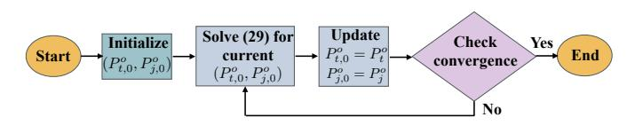

Fig. 3: Flow chart of the execution of Algorithm 1.

## 6.3 Implementation, convergence, and computational complexity

A flow chart of Algorithm 1 is depicted in Fig. 3. As described, Algorithm 1 works by tackling the non-convex fractional problem (14), by solving, in each iteration, Problem (29), given the values of  $P_{t,0}^{o}$ ,  $P_{j,0}^{o}$  in that iteration. Unlike Problem (14), directly solving Problem (29) is feasible by fractional programming techniques like the Dinkelbach's method in Algorithm 2, because the numerator and denominator of (29a) are concave and convex, respectively. Then, the values of  $P_{t,0}^{o}$ ,  $P_{j,0}^{o}$  are updated as the solution of Problem (29), and the process is iterated until convergence. Based on Proposition 1, Algorithm 1 is provably convergent to a point that fulfils the KKT optimality conditions of the original Problem (14).

Let us now analyse the computational complexity of Algorithm 1. The complexity is evaluated observing that Algorithm 1 requires the solution of  $I_1$  fractional problems of the form of (29), with  $I_1$  the number of iterations for Algorithm 1 to converge. In turn, Problem (29) requires solving Problem (30), which is convex since the numerator and denominator of SEE are concave and convex, respectively. Thus, Problem (30) can be solved by the interiorpoint method [40], which has a polynomial complexity in the number of optimization variables. In turn, this shows that the complexity of solving Problem (29) is polynomial in the two variables  $P_t^o$  and  $P_j^o$ . As a result, the overall complexity of Algorithm 1 is evaluated as

$$\mathcal{O}(2^{\alpha_1}I_1) \ . \tag{32}$$

The exact exponent  $\alpha_1$  and the number of iterations  $I_1$  are not available in closed-form. However, it is known that, in general,  $\alpha \in [1,4]$  [41], while, as for  $I_1$ , typically, a handful of iterations are required for convergence.

## POWER CONTROL OVER THE OPTICAL AND RA-**DIO FREQUENCY CHANNELS**

This section focuses on the scenario in which the available maximum transmit power has to be shared between the optical and radio frequency channels. Thus, the metric to be optimized is given by 11, and the problem to be solved can be cast as the fractional program

$$\max_{P_t^o, P_t^o, P_t^r, P_j^r} SEE(P_t^o, P_j^o, P_t^r, P_j^r)$$
 (33a)

s.t. 
$$P_t^{o} + P_j^{o} + P_t^{r} + P_j^{r} \le P_{max}$$
 (33b)

$$P_t^{o} \ge 0$$
,  $P_i^{o} \ge 0$ ,  $P_t^{r} \ge 0$ ,  $P_i^{o} \ge 0$  (33c)

Problem (33) can be dealt with by resorting again to the sequential optimization framework. To this end, let us observe that the numerator of (33a) can be written as

$$R_{s} = \underbrace{\log_{2} \left( 1 + a_{M}^{o}(P_{t}^{o})^{2} \right) - \log_{2} \left( 1 + \frac{a_{E}^{o}(P_{t}^{o})^{2}}{1 + b_{E}^{o}(P_{j}^{o})^{2}} \right)}_{R_{s}^{o}} + \underbrace{\log_{2} \left( 1 + a_{M}^{r}P_{t}^{r} \right) + \log_{2} \left( 1 + b_{E}^{r}P_{j}^{r} \right)}_{R_{+}^{r}} - \underbrace{\log_{2} \left( 1 + a_{E}^{r}P_{t}^{r} + b_{E}^{r}P_{j}^{r} \right)}_{R_{r}^{r}}.$$
(34)

In order to obtain a concave lower-bound of (34), we observe that  $R_s^o(P_t^o, P_i^o) \ge R_a(P_t^o) + R_b(P_i^o) - R_c(P_t^o, P_i^o)$ , which is concave, as shown in Section 6. Moreover,  $R_{+}^{r}(P_{t}^{r}, P_{i}^{r})$  is already concave, while  $-R_{-}^{r}(P_{t}^{r}, P_{i}^{r})$  is convex and thus can be lower-bounded by its first-order Taylor expansion around any feasible point  $(P_{t,0}, P_{i,0})$ , which yields

$$R_{-}^{r}(P_{t}^{r}, P_{j}^{r}) \leq \frac{a_{E}^{r}(P_{t}^{r} - P_{t,0}^{r}) + b_{E}^{r}(P_{j}^{r} - P_{j,0}^{r})}{\ln(2)(1 + a_{E}^{r}P_{t,0}^{r} + b_{E}^{r}P_{j,0}^{r})} + R_{-}^{r}(P_{t,0}^{r}, P_{j,0}^{r}) = \widetilde{R}_{-}^{r}(P_{t}^{r}, P_{j}^{r})$$
(35)

Then, a lower bound of the SEE in (11) is given by

$$\widetilde{\text{SEE}} = \frac{R_a(P_t^o) + R_b(P_j^o) - R_c(P_t^o, P_j^o) + R_+^r(P_t^r, P_j^r) - \widetilde{R}_-^r(P_t^r, P_j^r)}{\mu(P_t^o + P_j^o + P_t^r + P_j^o) + P_c}$$
(36)

and the problem to be solved in each iteration of the sequential method can be stated as

$$\max_{P_t^{\text{o}}, P_j^{\text{o}}, P_t^{\text{r}}, P_j^{\text{r}}} \widetilde{\text{SEE}}(P_t^{\text{o}}, P_j^{\text{o}}, P_t^{\text{r}}, P_j^{\text{r}})$$
 (37a)

s.t. 
$$P_t^{o} + P_i^{o} + P_t^{r} + P_i^{r} \le P_{max}$$
 (37b)

$$P_t^{o} \ge 0$$
,  $P_i^{o} \ge 0$ ,  $P_t^{r} \ge 0$ ,  $P_i^{o} \ge 0$ , (37c)

which can be solved by Dinkelbach's algorithm. Thus a sequential fractional procedure to tackle (33) can be stated as in Algorithm 3.

It should be observed that Algorithm 3 can be readily specialized to maximize the secrecy rate instead of the SEE. Indeed, being the numerator of the SEE, the secrecy rate is obtained from the SEE by simply setting  $\mu = 0$  and  $P_c = 1$ . In this case, (37) becomes a convex problem that can be solved by resorting to standard convex optimization theory, without the need to apply Dinkelbach's algorithm.

{9}------------------------------------------------

#### Algorithm 3 SFP algorithm for Problem (33)

$$\begin{array}{l} \text{Set } P_{t,0}^{\text{o}}, P_{j,0}^{\text{o}}, P_{t,0}^{\text{r}}, P_{j,0}^{\text{r}} \text{ to feasible values;} \\ \epsilon > 0; \\ \textbf{repeat} \\ \text{Solve (37) and let } (P_t^{\text{o}}, P_j^{\text{o}}, P_t^{\text{r}}, P_j^{\text{r}}) \text{ be the solution;} \\ \text{Err} = \left| \widetilde{\text{SEE}}(P_t^{\text{o}}, P_j^{\text{o}}, P_t^{\text{r}}, P_j^{\text{r}}) - \widetilde{\text{SEE}}(P_{t,0}^{\text{o}}, P_{j,0}^{\text{o}}, P_{t,0}^{\text{r}}, P_{j,0}^{\text{r}}) \right| \\ P_{t,0}^{\text{o}} = P_t^{\text{o}}; \\ P_{j,0}^{\text{o}} = P_j^{\text{o}}; \\ P_{t,0}^{\text{o}} = P_t^{\text{r}}; \\ P_{j,0}^{\text{o}} = P_j^{\text{r}}; \\ \text{until } \text{Err} \leq \epsilon \end{array}$$

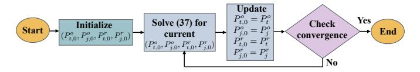

Fig. 4: Flow chart of the execution of Algorithm 3.

## 7.1 Implementation, convergence, and computational complexity

A flow chart of Algorithm 3 is depicted in Fig. 4 As described, Algorithm 3 works by tackling the non-convex fractional problem (33), by solving, in each iteration, Problem (37), given the values of  $P_{t,0}^{\rm o}, P_{j,0}^{\rm o}, P_{t,0}^{\rm r}, P_{j,0}^{\rm r}$  in that iteration. Unlike Problem (33), directly solving Problem (37) is feasible by fractional programming techniques like the Dinkelbach's method, because the numerator and denominator of (37a) are concave and convex, respectively. Then, the values of  $P_{t,0}^{\rm o}, P_{j,0}^{\rm o}, P_{t,0}^{\rm r}, P_{j,0}^{\rm r}$  are updated as the solution of Problem (37), and the process is iterated until convergence. Based on Proposition 1, Algorithm 3 is provably convergent to a point that fulfils the KKT optimality conditions of the original Problem (33).

The complexity of Algorithm 3 is evaluated following a similar argument as for Algorithm 1, with the difference that, in this case, we have four optimization variables instead of two. Then, denoting by  $I_3$  the number of iterations for Algorithm 3 to converge, and observing that Problem (37) is a fractional problem with four optimization variables, and whose objective in (37a) has a concave numerator and a convex denominator, the complexity of Algorithm 3 can be evaluated as

$$\mathcal{O}(4^{\alpha_3}I_3) \ . \tag{38}$$

Also in this case, the exact value of  $\alpha_3$  and the number of iterations  $I_3$  are not available in closed-form. However, it is known that, in general,  $\alpha_3 \in [1,4]$  [41], while, as for  $I_3$ , typically, a handful of iterations are required for convergence.

### 8 NUMERICAL RESULTS

This section presents numerical simulations to evaluate the SEE metric. The objective is to gain insight into the energy costs of mitigating passive eavesdropper attacks in hybrid radio-optical wireless networks.

TABLE 2: Simulation parameters defined based on measurements made in the laboratory.

| Parameter                                                           | Value                                                    |
|---------------------------------------------------------------------|----------------------------------------------------------|
| $P_t^{\mathrm{r}}$                                                  | $-13.5~\mathrm{dBm}^{-1}$                                |
| $(P_t^{\rm o})^2$                                                   | $(74.2 \div 303)$ mW $^2$                                |
| $P_j^{\rm r}$                                                       | $-10~\mathrm{dBm}$                                       |
| $(P_i^0)^2$                                                         | 342 mW                                                   |
| $P_c^{\rm r}$                                                       | $4.2~\mathrm{W}^{~1}$                                    |
| $P_c^{\rm o}$                                                       | $3\ W^3$                                                 |
| $a_M^{\mathrm{r}}= h_M^{\mathrm{r}} ^2/\!(\sigma_M^{\mathrm{r}})^2$ | $(1.28 \cdot 10^6 \div 2.47 \cdot 10^7) \mathrm{W}^{-1}$ |
| $a_M^{\rm o}= {\scriptstyle h_M^{\rm o}} ^2/\!(\sigma_M^{\rm o})^2$ | $(1.03 \cdot 10^4 \div 4.45 \cdot 10^4) \text{ W}^{-1}$  |
| $\mu$                                                               | 1                                                        |

&lt;sup>1 Time Domain P410 PulsON transceiver.

2 Transmitted power dataset measured using Thorlabs NIR Light Emitting Diodes (LED) M810L3 (810 nm) [42].

#### 8.1 Experimental Setup

The experimental datasets employed in this work were obtained from previously validated testbeds, as detailed in [12], [36]. Two complementary measurement campaigns were conducted: (i) UWB channel: path loss and SNR data were collected using Time Domain PulsON 410 transceivers with Broadspec antennas through ex-vivo porcine tissues and calibrated gelatin phantoms emulating 2–5 GHz dielectric properties. (ii) NIR channel: received optical power was measured for three NIR LEDs (810 nm, 850 nm, broadband) driven by a DC2200/Bias-T stage and detected via a PDA36A-EC photodetector on porcine tissue and PolyVinyl Chloride Plastisol (PVCP) phantoms replicating the 400–1100 nm attenuation spectrum.

These datasets provide a reliable experimental basis for the SEE analysis presented in this paper.

## 8.2 Experimental Channel Measurements with Biological Tissue and Phantom Models

Without loss of generality, to evaluate the performance of this system, we used numerical values derived from measurements of hybrid signals made in the laboratory. The use case we selected as a reference application for this article is an On-In HyWBAN link through biological tissue described in [12], [36]. To conduct realistic numerical simulations we used the  $\gamma_M^{\rm r}$  and  $\gamma_M^{\rm o}$  measurements through porcine meat at  $37^{\circ}$ C, and a thickness of about 40 - 50mm obtained during a prior laboratory measurement campaign [12] and similar measurements through synthetic phantoms with thickness of about 15 - 53 mm obtained in a second measurement campaign [36]. Measurements in the laboratory employed several samples, each numbered according to its thickness. As for the measurements with UWB, two different on-body antennas were used. Without loss of generality, for this paper, we used the measurements on porcine meat samples #6 and #7, radio phantoms samples #11 and #12, and optical phantoms #13, #14, #15. The remaining parameters used for the simulations are summarized in Table 2. There, also fixed values

&lt;sup>3 The power consumption values were obtained from the datasheets of the Thorlabs NIR LED transmitter (M810L3) and the photodetector receiver (PDA 36A-EC).

{10}------------------------------------------------

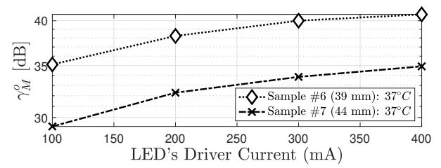

(a) NIR SNR: biological tissue samples varying the LED's current

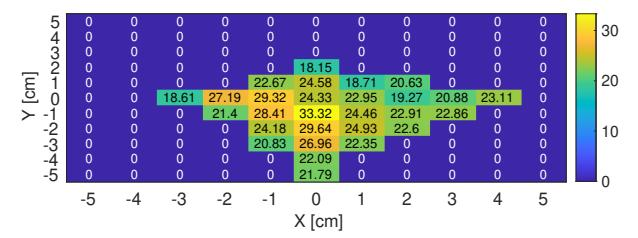

(b) UWB SNR: biological tissue sample #7 with on-body antenna #2

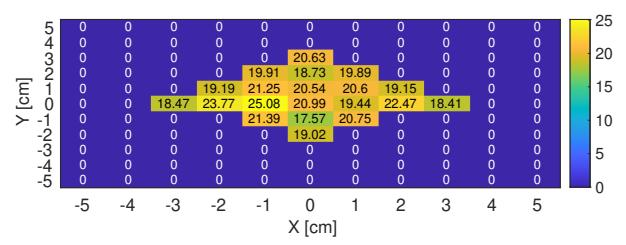

(c) UWB SNR: biological tissue sample #6 with on-body antenna #1

Fig. 5: UWB and NIR SNR measurements through biological tissue samples. The experiment setups are elaborated in [12].

of  $P_t^o, P_t^r, P_j^o, P_j^r$  are reported. These values refer only to Figures 5(a) and 5(b), which do not consider the performance of the proposed optimization Algorithms 1 and 3. The hardware specifications determined the power levels for these figures, ensuring realistic interference conditions for the system evaluation. As for Figures 5(a), 5(b), and 5(c), referring to the procine meat use case, fixed values of  $P_t^o, P_t^r, P_j^o, P_j^r$  have been considered since these figures do not refer to any optimization routine. Similarly, Figures 6(a), 6(b), and 6(c) referring to average phantoms use case. Instead, the performance of the proposed Algorithms 1 and 3 are discussed in Figures 8, 9, 10, 11, and for these figures the values of  $P_t^o, P_t^r, P_j^o, P_j^r$  have been obtained as the result of the optimization Algorithms 1 and 3.

Specifically, Figures 5(a) and 6(a) illustrate  $\gamma_M^{\rm o}$  for the NIR wireless link as a function of varying driver currents when the signal travels a biological tissue sample (Sample #6 or Sample #7) and an optical phantom (Phantom #13, #14, an #15). Only the Line-Of-Sight (LOS) configuration was considered for the NIR link, as NLOS links could not be established. In contrast, Figures 5(b) and 5(c) presents the  $\gamma_M^{\rm r}$  values measured with Sample #7 and Sample #6. Similarly, for Figures 6(b) and 6(c). In this scenario, the in-body device was fixed at the origin ((X,Y)=(0,0) coordinates), while the on-body device was moved around it, including positions with NLOS configurations. The UWB link demonstrated robustness even in NLOS conditions,

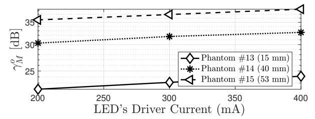

(a) NIR SNR: phantoms samples varying the LED's current.

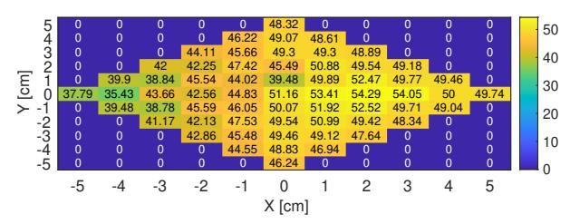

(b) UWB SNR: phantoms sample #11 (35 mm) with on-body antenna #2.

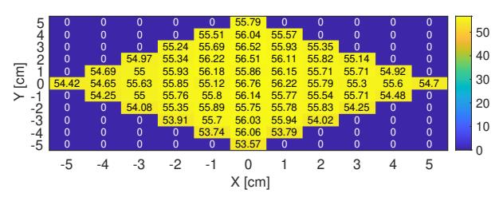

(c) UWB SNR: phantom sample #12 (10 mm) with on-body antenna #1.

Fig. 6: UWB and NIR SNR measurements through phantom samples. The experiment setups are elaborated in [36].

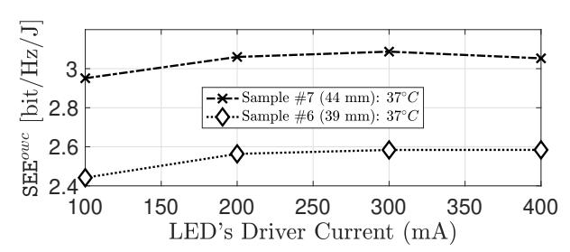

(a) SEEo of biological tissue samples #6 and #7.

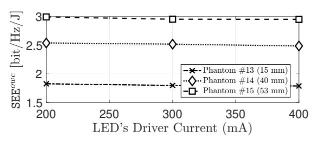

(b) SEEo of synthetic phantom #13, #14 and #15.

Fig. 7: SEE° by varying the driver current and, consequently, the transmitted power. The transmitter and receiver are in LOS. The experiment setups are elaborated in [36].

supporting the HyWBAN. With all this data, we have simulated SEE values (equations (9) and (10)) for the two communication channels that form our hybrid system.

Figures 7(a) and 7(b) show that the SEE peak for NIR

{11}------------------------------------------------

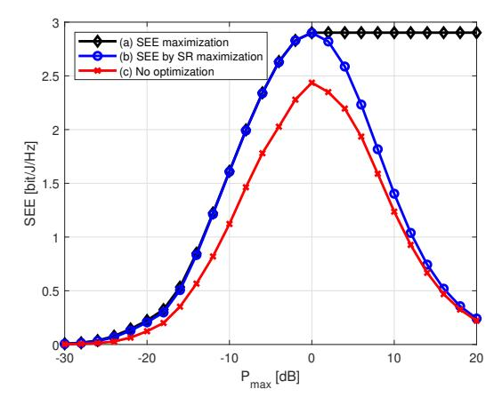

Fig. 8: Achieved SEE° by: (a) SEE° maximization; (b) SR° maximization; (c) Random power allocation

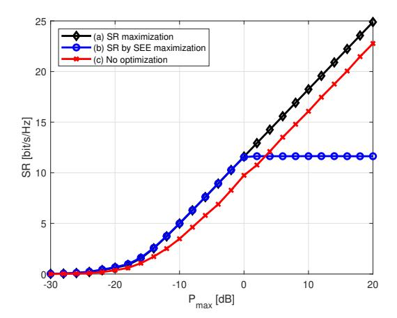

Fig. 9: Achieved SR $^{\rm o}$  for: (a) SR $^{\rm o}$  maximization; (b) SEE $^{\rm o}$  maximization; (c) Random power allocation

is approximately 3 bit/Hz/Joule as the current controlling the LED varies. These values of SEE indicate that the hybrid system operates within the moderate efficiency range. This suggests that our system achieves a balanced trade-off between security and energy consumption, which is crucial for medical and IoT applications where both factors are critical.

#### 8.3 Optimization Algorithm Performance

Next, Figures 8, 9, 10, 11 show the performance of the proposed optimization Algorithms 1 and 3. In particular, Figure 8 refers to the optimization of the optical SEE, reporting SEE $^{o}$  versus  $P_{max}^{o}$  for the following scenarios:

- (a) SEEo achieved by Algorithm 1;
- (b) SEE $^{o}$  obtained for the powers  $P_{t}^{o}$  and  $P_{j}^{o}$  that maximize the secrecy rate as shown in Section 6.1;
- (c) SEE $^{o}$  obtained without any optimization, i.e.  $P_{t}^{o}$  and  $P_{j}^{o}$  are randomly selected, but with the constraint that  $P_{t}^{o} + P_{j}^{o} = P_{max}^{o}$ . Thus, this allocation is such that all available power is always used.

The results indicate that Algorithm 1 provides higher SEE levels than other schemes, especially for increasing values of  $P_{max}$ . This is explained by observing that the SEE is an

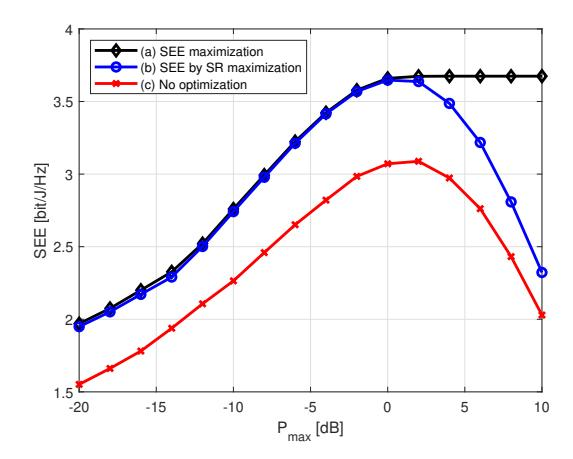

Fig. 10: Achieved SEE for: (a) SEE maximization; (b) SR maximization; (c) Random power allocation

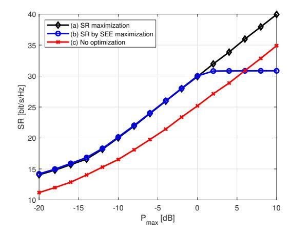

Fig. 11: Achieved SR for: (a) SR maximization; (b) SEE maximization; (c) Random power allocation

unimodal function, and thus, once the maximum available power  $P_{max}$  is large enough to make the SEE maximizer feasible, further increasing the transmit power only leads to a reduction of the SEE. For this reason, the SEE level remains constant with  $P_{max}$  after reaching its peak, since the optimal values of  $P_t^o$  and  $P_j^o$  do not increase anymore. Instead, the other two schemes always lead to using all the available power  $P_{max}$ , which eventually causes the SEE to degrade.

Figure 9 considers a similar scenario as Figure 8, but reports the secrecy rate in place of the SEE, versus  $P_{max}$ . Specifically, Figure 9 shows:

- (a)  $R_s^o$  achieved by maximizing the secrecy rate as shown in Section 6.1;
- (b)  $R_s^o$  obtained for the powers  $P_t^o$  and  $P_j^o$  that maximize SEE° according to Algorithm 1;
- (c)  $R_s^o$  obtained without any optimization, i.e.  $P_t^o$  and  $P_j^o$  are randomly selected, but with the constraint that  $P_t^o + P_j^o = P_{max}^o$ . Thus, this allocation is such that all available power is always used.

Similar considerations as for Figure 8 can be made. In particular, as discussed, the power allocation that maximizes the SEE remains constant once the peak of the SEE has been

{12}------------------------------------------------

achieved. As a result, the secrecy rate provided by Scheme (b) eventually saturates and remains constant. Instead, the other two schemes always use all the available power, thus providing a monotonically increasing secrecy rate.

Next, Figures 10 and 11 are the counterparts of Figures 8 and 9, but with reference to the hybrid scenario of Section 7 in which the global SEE in (11), and the corresponding secrecy rate in (34) are optimized by Algorithm4 3. In addition, for comparison purposes, the performance achieved by randomly selecting  $P_t^o$ ,  $P_j^o$ ,  $P_t^r$ , and  $P_j^r$  with the constraint that  $P_t^o + P_j^o + P_t^r + P_j^r = P_{max}$ , is shown, too. Similar trends as in the purely optical scenario can be observed, with the only significant difference being that, in the hybrid scenario, the random power allocation scheme shows a larger gap between the optimal SEE and SR. This is due to the increased number of optimization variables in the hybrid scenario, which makes power optimization more significant than in the purely optical scenario in which only two powers were to be optimized.

#### 9 CONCLUSION

This paper has presented a new framework for quantifying and optimizing secure transmission in hybrid RF-OWC networks through the lens of SEE. By formulating the optical secrecy rate and SEE maximization problems — and further extending the analysis to a joint power allocation across both UWB and NIR channels — we have demonstrated how intentional jamming, when combined with principled optimization, can achieve robust security under strict energy constraints. The numerical results, derived from realistic in-body measurements of porcine tissue and average radio-optical synthetic phantoms, underscore that meticulous resource allocation provides a notable performance advantage over naive approaches, particularly in mission-critical healthcare contexts.

Beyond confirming that the optimized NIR SEE can sustain achieved 3 bit/Hz/Joule and approximately 3.5 bit/Hz/Joule in hybrid mode, the proposed sequential fractional programming strategies show how each technology's unique strengths can be harnessed or combined to adapt to varying service needs. This adaptability makes the hybrid approach especially relevant for low-power medical applications where data protection and operational continuity are crucial. In future work, we intend to investigate multi-user settings, explore advanced machine learning algorithms for improving semantic communications, and examine more sophisticated jamming strategies tailored to dynamic interference patterns. By bridging theoretical optimization with practical in-body measurements (with biological tissue samples and synthetic tissue phantoms ), this study offers a solid foundation for next-generation secure and energy-efficient communication systems in healthcare and beyond.

Although the present paper focuses on numerical optimisation, practical real-time deployment is within reach of existing hybrid transceiver boards. In particular, the RP2040-based platform presented in [37] combines a microcontroller, optical driver, and RF interface with sufficient

4. Recall that Algorithm 3 can be specialized to optimize the secrecy rate by simply setting  $\mu=0$  in the definition of the SEE.

headroom to run the proposed SEE algorithm and apply its settings within a few milliseconds. Porting the routine to that firmware stack is a logical next step toward in-field validation.

#### **REFERENCES**

- [1] M. Z. Chowdhury, M. K. Hasan, M. Shahjalal, M. T. Hossan, and Y. M. Jang, "Optical wireless hybrid networks: Trends, opportunities, challenges, and research directions," *IEEE Communications Surveys & Tutorials*, vol. 22, no. 2, pp. 930–966, 2020.
- [2] M. Z. Chowdhury, M. K. Hasan, M. Shahjalal, M. T. Hossan, and Y. Min Jang, "Optical Wireless Hybrid Networks for 5G and Beyond Communications," in 2018 International Conference on Information and Communication Technology Convergence (ICTC), 2018, pp. 709–712.
- [3] L. Bravo Alvarez, S. Montejo-Sánchez, L. Rodríguez-López, C. Azurdia-Meza, and G. Saavedra, "A Review of Hybrid VLC/RF Networks: Features, Applications, and Future Directions," Sensors, vol. 23, no. 17, 2023.
- [4] I. W. G. da Silva, E. Eduardo Benitez Olivo, M. Katz, and D. Pamela Moya Osorio, "Analysis and simulation of precoding and user association for securing hybrid rf/vlc systems," *IEEE Sensors Journal*, vol. 24, no. 20, pp. 33 467–33 480, 2024.
- [5] D. López-Pérez, A. De Domenico, N. Piovesan, G. Xinli, H. Bao, S. Qitao, and M. Debbah, "A Survey on 5G Radio Access Network Energy Efficiency: Massive MIMO, Lean Carrier Design, Sleep Modes, and Machine Learning," *IEEE Communications Surveys & Tutorials*, vol. 24, no. 1, pp. 653–697, 2022.
- [6] V. Ziegler, P. Schneider, H. Viswanathan, M. Montag, S. Kanugovi, and A. Rezaki, "Security and trust in the 6g era," *IEEE Access*, vol. 9, pp. 142 314–142 327, 2021.
- [7] K. Norrman, B. Sahlin, B. Smeets, E. Thormarker, and E. Fogelström, "6G security – drivers and needs," May 2024. [Online]. Available: https://www.ericsson.com/49c1cd/assets/local/reports-papers/white-papers/2024/6g-security-drivers-and-needs.pdf
- [8] A. B. Kihero, H. M. Furqan, M. M. Sahin, and H. Arslan, "6G and Beyond Wireless Channel Characteristics for Physical Layer Security: Opportunities and Challenges," *IEEE Wireless Commu*nications, vol. 31, no. 3, pp. 295–301, 2024.
- [9] A. Chorti, A. N. Barreto, S. Köpsell, M. Zoli, M. Chafii, P. Sehier, G. Fettweis, and H. V. Poor, "Context-Aware Security for 6G Wireless: The Role of Physical Layer Security," *IEEE Communications Standards Magazine*, vol. 6, no. 1, pp. 102–108, 2022.
- [10] M. H. Khoshafa, O. Maraqa, J. M. Moualeu, S. Aboagye, T. M. N. Ngatched, M. H. Ahmed, Y. Gadallah, and M. D. Renzo, "Risassisted physical layer security in emerging rf and optical wireless communication systems: A comprehensive survey," *IEEE Communications Surveys & Tutorials*, pp. 1–1, 2024.
- Communications Surveys & Tutorials, pp. 1–1, 2024.

  [11] I. W. Gomes da Silva, D. P. Moya Osorio, E. E. Benitez Olivo, I. Ahmed, and M. Katz, "Secure hybrid rf/vlc under statistical queuing constraints," in 2021 17th International Symposium on Wireless Communication Systems (ISWCS), 2021, pp. 1–6.
- [12] S. Soderi, M. Särestöniemi, S. Fuada, M. Hämäläinen, M. Katz, and J. Iinatti, "Securing Hybrid Wireless Body Area Networks (HyWBAN): Advancements in Semantic Communications and Jamming Techniques," in *Digital Health and Wireless Solutions*. Springer, 2024, pp. 369–387.
- [13] H. Kurunathan, R. Indhumathi, M. G. Gaitán, C. Taramasco, and E. Tovar, "VLC-enabled monitoring in a healthcare setting: Overview and Challenges," in 2023 South American Conference On Visible Light Communications (SACVLC), 2023, pp. 135–140.
- [14] S. Buzzi, C.-L. I, T. E. Klein, H. V. Poor, C. Yang, and A. Zappone, "A survey of energy-efficient techniques for 5g networks and challenges ahead," *IEEE Journal on Selected Areas in Communica*tions, vol. 34, no. 4, pp. 697–709, 2016.
- [15] R. Raj and A. Dixit, "An energy-efficient power allocation scheme for noma-based iot sensor networks in 6g," *IEEE Sensors Journal*, vol. 22, no. 7, pp. 7371–7384, 2022.
- [16] W. Hao, J. Li, G. Sun, C. Huang, M. Zeng, O. A. Dobre, and C. Yuen, "Max-Min Security Energy Efficiency Optimization For RIS-Aided Cell-Free Networks," in ICC 2023 - IEEE International Conference on Communications, 2023, pp. 5358–5363.

{13}------------------------------------------------

- [17] Y. Lu, "Secrecy energy efficiency in ris-assisted networks," *IEEE Transactions on Vehicular Technology*, vol. 72, no. 9, pp. 12 419– 12 424, 2023.
- [18] A. Zappone, P.-H. Lin, and E. Jorswieck, "Optimal energyefficient design of confidential multiple-antenna systems," *IEEE Transactions on Information Forensics and Security*, vol. 13, no. 1, pp. 237–252, 2018.
- [19] A. Zappone, P.-H. Lin, and E. A. Jorswieck, "Secrecy and energy efficiency in mimo-me systems," in *2015 IEEE 16th International Workshop on Signal Processing Advances in Wireless Communications (SPAWC)*, 2015, pp. 380–384.
- [20] A. Zappone, P.-H. Lin, and E. Jorswieck, "Energy efficiency of confidential multi-antenna systems with artificial noise and statistical csi," *IEEE Journal of Selected Topics in Signal Processing*, vol. 10, no. 8, pp. 1462–1477, 2016.
- [21] Y. Zhang, Y. Lu, R. Zhang, B. Ai, and D. Niyato, "Deep Reinforcement Learning for Secrecy Energy Efficiency Maximization in RIS-Assisted Networks," *IEEE Transactions on Vehicular Technology*, vol. 72, no. 9, pp. 12 413–12 418, 2023.
- [22] M. Ham¨ al¨ ainen, L. Mucchi, M. Girod-Genet, T. Paso, J. Farserotu, ¨ H. Tanaka, D. Anzai, L. Pierucci, R. Khan, M. M. Alam, and P. Dallemagne, "ETSI SmartBAN Architecture: the Global Vision for Smart Body Area Networks," *IEEE Access*, vol. 8, pp. 150 611– 150 625, 2020.
- [23] IEEE Computer Society, "IEEE standard for local and metropolitan area networks - part 15.6: Wireless body area networks," *IEEE standard*, 2012.
- [24] A. Al-Kinani, C.-X. Wang, L. Zhou, and W. Zhang, "Optical wireless communication channel measurements and models," *IEEE Communications Surveys & Tutorials*, vol. 20, no. 3, pp. 1939– 1962, 2018.
- [25] L. Yang, W. Zhang, Y. Zhang, and J. Zhang, "Hybrid Optical Wireless Network Based on Visible Light Communications (VLC)- WiFi Heterogeneous Interconnection," in *2019 2nd International Conference on Communication Engineering and Technology (ICCET)*, 2019, pp. 35–38.
- [26] S. Cho, G. Chen, and J. P. Coon, "Secrecy analysis in visible light communication systems with randomly located eavesdroppers," in *2017 IEEE International Conference on Communications Workshops (ICC Workshops)*, 2017, pp. 475–480.
- [27] S. Soderi and R. De Nicola, "6g networks physical layer security using rgb visible light communications," *IEEE Access*, vol. 10, pp. 5482–5496, 2022.
- [28] S. Soderi, A. Brighente, S. Xu, and M. Conti, "Multi-ris aided vlc physical layer security for 6g wireless networks," *IEEE Transactions on Mobile Computing*, vol. 23, no. 12, pp. 15 182–15 195, 2024.
- [29] L. Liu, J. Shi, F. Han, X. Tang, and J. Wang, "In-body to on-body channel characterization and modeling based on heterogeneous human models at hbc-uwb band," *IEEE Sensors Journal*, vol. 22, no. 20, pp. 19 772–19 785, 2022.
- [30] E. Calvanese Strinati and S. Barbarossa, "6G networks: Beyond Shannon towards semantic and goal-oriented communications," *Computer Networks*, vol. 190, p. 107930, 2021. [Online]. Available: [https://www.sciencedirect.com/science/article/pii/](https://www.sciencedirect.com/science/article/pii/S1389128621000773) [S1389128621000773](https://www.sciencedirect.com/science/article/pii/S1389128621000773)
- [31] E. Batista, P. Lopez-Aguilar, and A. Solanas, "Smart Health in the ´ 6G Era: Bringing Security to Future Smart Health Services," *IEEE Communications Magazine*, vol. 62, no. 6, pp. 74–80, 2024.
- [32] C. Otto, A. Milenkovic, C. Sanders, and E. Jovanov, "System ar- ´ chitecture of a wireless body area sensor network for ubiquitous health monitoring," *J. Mob. Multimed.*, vol. 1, no. 4, p. 307–326, jan 2005.
- [33] S. Fuada, M. A. Nilantha Perera, M. Sarestoniemi, S. Soderi, and M. Katz, "A feasibility study of optical wireless-based data and power transfer for in-body medical devices," in *2024 14th International Symposium on Communication Systems, Networks and Digital Signal Processing (CSNDSP)*, 2024, pp. 205–210.
- [34] Y. Wang, J. Du, R. Chen, J. Tian, G. Zhang, X. Hong, and C. Fei, "An Acoustic/Optic Hybrid MAC Protocol Based on TDMA for Underwater Optical Wireless Networks," in *2021 Asia Communications and Photonics Conference (ACP)*, 2021, pp. 1–3.
- [35] I. Csiszar and J. Korner, "Broadcast channels with confidential messages," *IEEE Transactions on Information Theory*, vol. 24, no. 3, pp. 339–348, May 1978.

- [36] S. Soderi, M. Sarest ¨ oniemi, S. Fuada, M. H ¨ am¨ al¨ ainen, M. Katz, ¨ and J. Iinatti, "Hybrid wireless body area networks (hywbans): A framework for in-body communications," *IEEE Sensors Journal*, vol. 25, no. 14, pp. 27 596–27 610, 2025.
- [37] N. Maggioni, S. Soderi, and E. Damiani, "Multi-factor authentication with a hybrid wireless platform: the medical ict use case," in *2025 19th International Symposium on Medical Information and Communication Technology (ISMICT)*, 2025, pp. 1–6.
- [38] A. Zappone and E. A. Jorswieck, "Energy efficiency in wireless networks via fractional programming theory," *Found. and Trends® in Commun. and Inf. Theory*, vol. 11, no. 3-4, pp. 185–396, 2015.
- [39] B. R. Marks and G. P. Wright, "A general inner approximation algorithm for non-convex mathematical programs," *Operations Research*, vol. 26, no. 4, pp. 681–683, 1978.
- [40] S. P. Boyd and L. Vandenberghe, *Convex optimization*. Cambridge Univ Press, 2004.
- [41] Y. Nesterov, *Lectures on Convex Optimization, 2nd Edition*. Springer, 2018.
- [42] S. Fuada, M. Sarest ¨ oniemi, and M. Katz, "Test-bed dataset for ¨ optical-based in-body communications research," Feb. 2024.

**Simone Soderi** (SMIEEE) received his M.Sc. degree in 2002 from the University of Florence, and his Dr.Sc. degree in 2016 from the University of Oulu, Finland. He is currently an Assistant Professor at the IMT School for Advanced Studies Lucca, Italy, and an Adjunct Professor at the University of Padua, Italy, where he teaches in the master's degree program in cybersecurity. Additionally, he is an Adjunct Professor (Docent) at the University of Oulu, Finland. Dr. Soderi's expertise spans cybersecurity

(attack and defense strategies), wireless communications, embedded systems, and industrial systems engineering. His research focuses on cybersecurity for critical infrastructure systems, such as space and railway systems, and emerging topics, such as 6G, covert channels, network security, physical layer security, hybrid communications security, OWC, and UWB. He is an Associate Editor for IEEE Transactions on Information Forensics and Security, and he has been a TPC member of several conferences and a reviewer of many IEEE Transactions. He is the scientific leader of an industrial project investigating network security. Since 2024, Dr. Soderi has been a member of the working group for COST Action CA22168 - Physical Layer Security for Trustworthy and Resilient 6G Systems (6G-PHYSEC). Dr. Soderi has published widely in journals and conferences and authored chapters in a book. He also holds five patents in wireless communications and positioning technology.

**Alessio Zappone** (FIEEE) received his PhD degree from the University of Cassino and Southern Lazio. After that he has been a research associate at the TU Dresden, Germany, from 2012 to 2016 and a Postdoctoral Marie Curie Fellow at Centralesupelec, France, from 2017 to 2019. He is now a tenured professor at the University of Cassino and Southern Lazio. His research interests lie in the area of communication theory and signal processing, with main focus on optimization techniques for re-

source allocation and energy efficiency maximization. For his research, Alessio received the IEEE Marconi Prize Paper Award in Wireless Communications in 2021, the IEEE Communications Society Fred W. Ellersick Prize in 2023, the IEEE Communications Society Best Tutorial Paper Award in 2024, and the EURASIP JWCN Best Paper Award in 2021. Alessio serves as editor of the IEEE TRANSACTIONS ON WIRELESS COMMUNICATIONS, area editor of the IEEE COMMUNICA-TIONS LETTERS, and has served as senior editor of the IEEE SIGNAL PROCESSING LETTERS and guest editor of two IEEE JOURNAL ON SELECTED AREAS IN COMMUNICATIONS special issues.