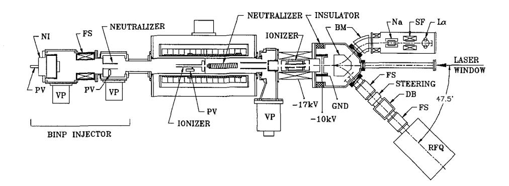
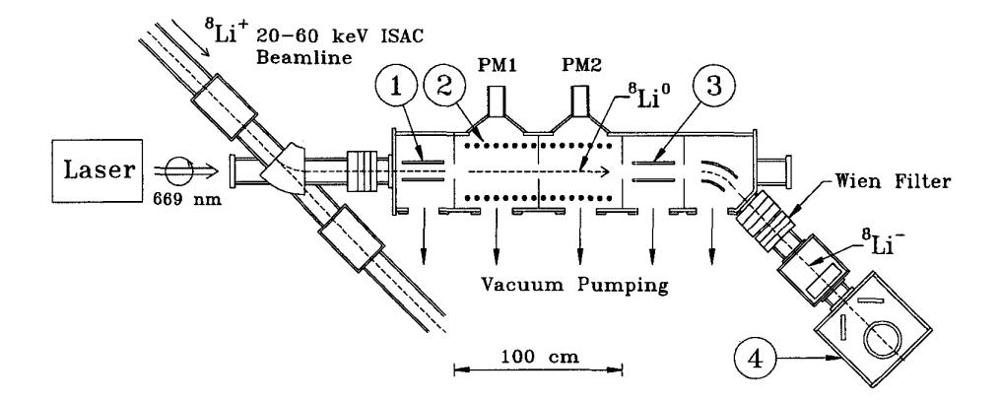

{0}------------------------------------------------

# **OPPIS DEVELOPMENT All? TRIUMF**

A.N.Zelenski, INR Moscow/ TRIUMF, Vancouver, B.C., Canada C.D.P.Levy, P.W.Schmor, W.T.H.van Oers, G.W.Wight and G.Dutto , TlUUMF, 4004 Wesbrook Mall, Vancouver, B.C., Canada V6T 2A3

The TRIUMF OPPIS (Optically Pumped Polarized Ion Source) provides the precision quality beam for the experiment on parity-nonconservation in proton- proton scattering at 230 MeV beam energy. The results of recent developments and studies for the minimization of contributions to the experiment systematic error due to the beam energy and position modulations correlated with spin- reversal are presented.

Studies of high current production have also been done in collaboration with INR, Moscow and BINP, Novosibirsk. The feasibility of a 10 mA polarized H- ion current was demonstrated. The pulsed OPPIS application for the future RHIC and HERA polarization facilities are discussed. The polarization technique of the radioactive nuclide beam is proposed for beta-NMR condensed matter studies with a new ISAC facility at TRIUMF.

#### **1 INTRODUCTION**

Collider experiments with polarized proton beams, approved at RHIC *I11* and under consideration at HERA 121, will provide fundamental tests of QCD and the electroweak interaction. Polarized beams should allow better identification of new objects produced in proton-proton collisions and expand the limits of searches for possible manifestations of New Physics beyond the Standard Model. Such experiments will require the maximum available luminosity, and therefore polarization must be obtained as an extra beam quality without sacrificing intensity. Typical currents for unpolarized **H-** ion injectors are in the 20-50 mA range. With a lower current polarized source the use of multiturn charge- exchange injection into a booster ring will partially compensate the loss, but only a 20-30 mA source will completely solve the problem. A 1.64 mA dc polarized H- ion current was obtained at the TRIUMF OPPIS, with a promise of further increases to the 2-3 mA range 131. The ECRtype primary proton source used at the TRIUMF OPPIS has a comparatively low emission current density and high beam divergence, which limits further current increase and gives rise to inefficient use of the cw laser power for optical pumping. In pulsed operation, suitable for high energy accelerators, the ECR source shortcomings have been avoided by using an INR-type OPPIS with a high-brightness proton source situated outside the magnetic field 141. Studies performed in collaboration with INR, Moscow and BINP, Novosibirsk have demonstrated the feasibility of producing 10 **mA** polarized H- ion currents using this scheme. Proposals on pulsed OPPIS developments for future polarization facilies at RHIC and HERA are considered below.

*Abstract* The TRIUMF OPPIS provides a precision quality beam -- for studies of parity- nonconservation in proton-proton scattering at 230 MeV *151.* It operates very reliably and delivers beam for about 40% of the cyclotron operational time.

> Beta-NMR studies of surfaces with polarized radioactive nuclide beams are proposed for the new ISAC (Isotope Separator and Accelerator) facilities at TRIUMF 161. The application of the optical pumping polarization technique for radioactive nuclides is described for lithium-8 and neon-23 beams.

### **2 POLARIZED BEAM FOR PAIRITY-NONCONSERVATION STUDIES**

At present the TRIUMF OPPIS is heavily used for the E497 "parity" experiment. The goal of this experiment is the measuremeint of the parity- violating analyzing power A, for the scattering of a longitudinally polarized 230 MeV proton beam in a hydrogen target to an accuracy of flops. This imposes very severe constraints on the polarized beam quality. From the very beginning, OPPIS development at TRIUMF has been pushed by this very demanding experiment. The initial expectation that spin-reversal-correlated modulations of the beam parameters should be smaller in the OPPIS than in the ABS have been demonstrated experimentally, although it took some time to understand its origins, develop the apparatus and find the optimal set of source parameters. At present, the helicity-correlated current modulations are below the **lW5** level and energy modulation can be reduced below 0.010 eV *171.* The correlated beam position modulations are less than 20 nm. The optimum beam current required at the target for the parity experiment is 0.20 uA, but to achieve very small helicity correlated modulations, most of the beam intensity must be sacrificed for beam quality. Therefore, high brightness source performance is required, and the ongoing high current OPPIS development at TRIUMF is of benefit to the parity experiment. At present, polarized beam quality meets the experimental requirements. The extension of the parity experiment to 450 MeV has been proposed *181.* 

## **3 PROPOSAL FOR A POLARIZED 800 GEV PROTON BEAM AT THE HERA COLLIDER**

Studies of the hadron spin-structure functions in collisions of polarized electrons with polarized helium-3 , hydrogen and deuterium internal targets are in progress at DESY **(HERMES** experiment). The proposal to significantly expand the kinematic range of these studies and measure the gluon contribution to the proton spin in collisions of an 800

{1}------------------------------------------------

Figure 1: Pulsed Polarized H- Ion Injector Layout. BM - Bending Magnet; DB - Diagnostics Box; FS - Focussing Solenoid; La - Lyman-Alpha Detector; Na - Sodium Cell; NI - Neutral Injector Plasmatron; PV - Pulsed Valve; RFQ - Radio Frequency Quadrupole; SF - Spin Filter; VP - Vacuum Pump.

GeV polarized proton beam with a 30 GeV polarized electron beam was recently examined /2/. TRIUMF is a part of the SPIN Collaboration, which is working on a proposal for polarized proton acceleration in HERA to 800 GeV and experiments with the polarized beams.

The TRIUMF task is development of the high intensity polarized H- ion source. A polarized H- ion current of 10-20 mA is required to provide sufficient luminosity of the polarized beam for the above experiments. At present, the design luminosity has not yet been obtained, even with an unpolarized 50 mA injector.

The feasibility of 10 mA polarized H- ion current production in the INR- type pulsed OPPIS was demonstrated in experiments with the atomic H injector at BINP, Novosibirsk and experiments at TRIWMF on optical pumping of high density Rb vapor in the presence of a high-intensity proton beam /9/. The 20-30 mA current may be feasible in the "combined" polarization scheme, where space-charge compensation is easier to achieve /lo/. The development of a pulsed OPPIS is in progress at TRIUMF. The atomic H injector is being constructed and tested on a test bench. A 16 mA pulsed H- ion current of a 6 keV beam energy was obtained at the test-bench for the geometry which closely reproduce the pulsed OPPIS layout. After optimization it will be installed at the TRIUMF OPPIS setup , as shown in Fig. 1. The optical pumping of the high-density, large diameter Rb vapor cell will be produced by a pulsed Tisapphire laser. Nearly 100% Rb polarization has already been obtained in an experiment with a pulsed laser under development. The **H-** nuclear polarization will **be** measured and optimized using the powerful OPPIS diagnostic tools.

The high-current low energy polarized H- ion beam must be accelerated immediately after the ionizer to 20- 50 keV to prevent increase of the beam divergence due to space-charge effects. This can be done by biasing of the whole source to a potential of 20-50 kV. After acceleration in a two gap system, which will also provide the required focusing, the beam will be deflected by a bending magnet

through 46.7 degrees to preserve longitudinal polarization. Alternatively, a 15 degree bend plus a solenoidal rotator can be used to align spin vertically. The beam will then be injected into an RFQ accelerator.

# **4 OPPIS INJECTOR FOR RHIC**

The polarization facilities at RHIC will provide 70% polarized proton- proton collisions at the energy up to sqrt(S) = 500 GeV and luminosity of 2~10~~/cm~s /I/. The polarized injector must produce in excess of 0.5 mA H- ion current during the 300 us pulse, within a normalized emittance of less than 2 pi mm mrad. This is an ideal application for the TRIUMF-type OPPIS, where the 1.64 mA current was obtained in the dc mode. The required pulsed operation will greatly simplify and reduce the cost of the laser system, while providing the best source performance due to a surfeit of optical pumping laser power. The possibility of the KEK OPPIS upgrade for RHIC in a collaboration between BNL, KEK and TRIUMF is under consideration.

# **5 POLARIZED RADIOACTIVE BEAMS FOR MATERIAL STUDIES AT ISAC**

Implantation of several beta-radioactive beams in a material surface (high-temperature superconductors, and semiconductors are of the greatest interest) and observation of the spin-precession due to the local magnetic field can be a useful tool for surface studies, similar to the MuSR technique for bulk materials /ll/. The polarization precession can be detected by measuring the asymmetry of beta-decay. For example, a 8Li+ ion beam intensity in excess of 108/s will be available from the TRIUMF ISAC facility for a 10 uA proton beam at the target. The polarization will be produced by direct optical pumping of 'Li atoms in the setup shown in Fig.2. The 20 keV Lit beam will be neutralized in a sodium vapor cell and then optically pumped by a collinear 669 nm wavelength dye laser beam (2s 4 to 2P3 transition). The optical pumping region must be shielded

{2}------------------------------------------------

Figure 2: 8Li Polarization Layout. (1) Alkali Vapour Neutralizer Cell; (2) Optical Pumping Region; PM - Photomultipliers; (3) Gaseous Ionizer Cell; (4) Analyzing Chamber.

from external magnetic fields and a homogeneous longitudinal field of 10-20 G will be provided. The laser power density required for pumping both F=3/2, 5/2 states is about 0.5 W/cm2 for a multimode laser with a bandwidth of about 500 MHz, the latter determined by hyperfine splitting of 382 MHz in the  $2S_{\frac{1}{2}}$  state and 44 MHz in the  $2P_{\frac{1}{2}}$  state. After polarization, the Li beam is ionized to Li in a second alkali cell with an efficiency of about 10%, or to Li+ in a gaseous argon cell with about 30% efficiency. The ion beam is bent and transported to the sample. The bending prevents direct deposition of sodium vapor on the sample surface and provides a convenient entrance for the laser beam. The ion beam can be easily transported a few meters, thus simplifying the obtaining of an UHV in the analyzing chamber. It is estimated that about 10% of the primary beam can be optically pumped to 70-80% polarization. Another choice of probe is a Ne-17 beam, which can be polarized by selective excitation of hyperfine substates in the metastable Ne\* (3P2) state. In the sodium neutralization cell about 10-20% of the initial 20 keV Ne+ beam is produced in this metastable state, which is easy for optical pumping using 3P2 — 3D3 transition and 640 nm laser. Selective ionization of the metastable atoms in a second charge-exchange cell will produce a high of about 50% nuclear polarization of the Ne+ ion beam for implantation.

#### 6 CONCLUSIONS

The powerful techniques of optical pumping and polarization transfer collisions are very successfully implemented in the high current OPPIS, which meets the demands of the new generation of high-energy accelerators and colliders. The OPPIS also provides the high quality beam for precision experiments at TRIUMF. We believe that development of new polarization facilities at RHIC and HERA will benefit from OPPIS technology and will, in turn, boost the further development of polarized sources.

#### 7 ACKNOWLEDGEMENTS

We would like to thank J.Alessi, D.Barber, V.Davydenko, R.Kiefl, A.Krisch, Y.Mori, S.Page, T.Roser and T.Sakae for useful discussions. We acknowledge SPIN Collaboration and INR-Moscow support of this work.

#### 8 REFERENCES

- [1] G.Bunce et al., Particle world, v.3, (1992), 1-12.
- [2] "Prospects of the spin physics at HERA", DESY-Zeuten, DESY Report 95-200, (1995).
- [3] A.N.Zelenski et al., Proc. of the 1995 IEEE PAC, Dallas, (1995), 864.
- [4] A.N.Zelenski et al., Nucl. Instr. Meth., A245, (1986), 223-229.
- [5] J.Birchall et al., AIP Conf. Proc. 339, (1995), 136.
- [6] "A proposal for an intense radioactive beam facility", TRI-UMF, TRI-95-1, (1995).
- [7] A.N.Zelenski et al., to be published in the Proc. of 12th Int. Symposium on High Energy Spin Physics, Amsterdam, (1996).
- [8] TRIUMF-research proposal E-761, spokesperson J.Birchall.
- [9] A.N.Zelenski et al., Rev. Sci. Instr. v.67, (1996), 1359.
- [10] A.N.Zelenski et al., Proc. 1995 Int Workshop on polarized beams and targets, Cologne 1995, World Scientific, ed. H.Paetz gen.Schieck,(1996),111.
- [11] A.N.Zelenski et al., to be published in the Proc. of 12th Int. Symposium on High Energy Spin Physics, Amsterdam, (1996).
- [12] R.Kiefl, TRIUMF letter of intent.