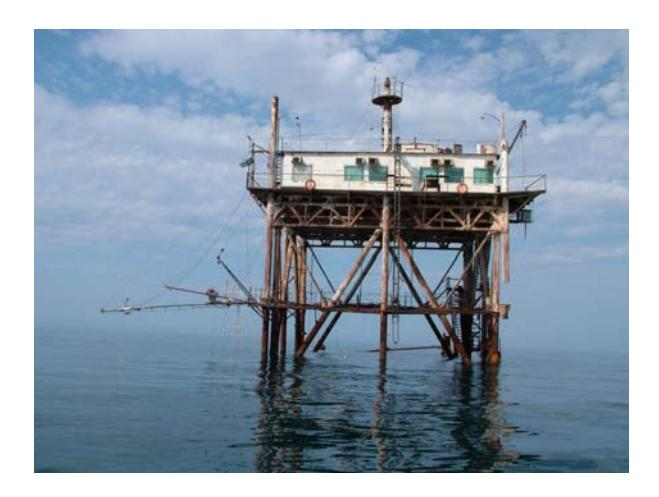
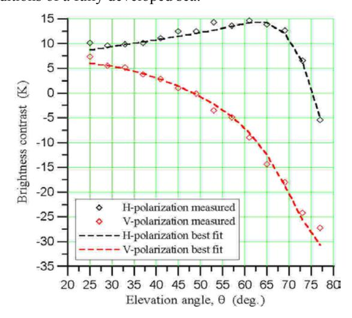
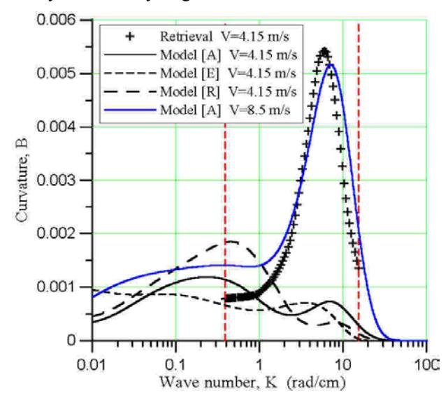
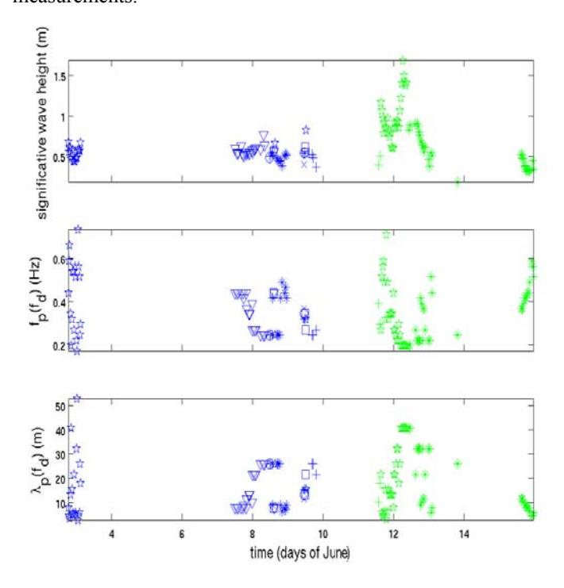
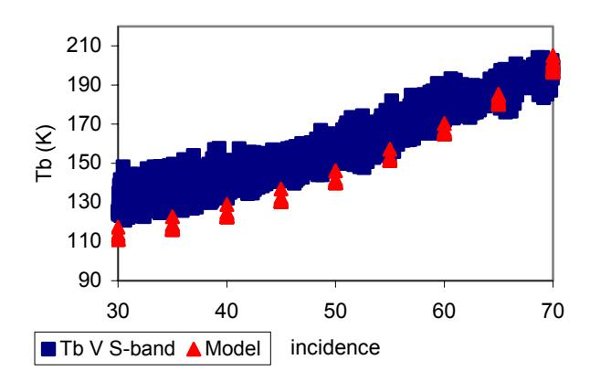
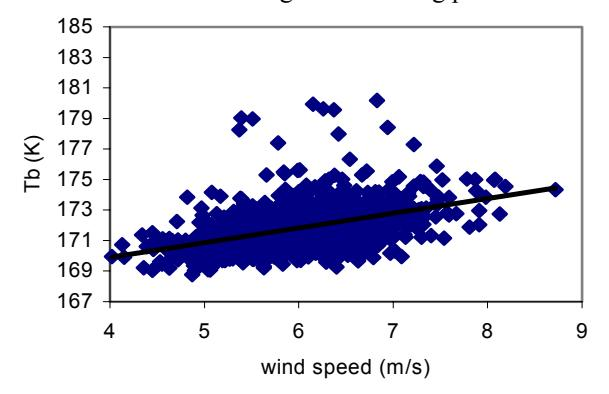
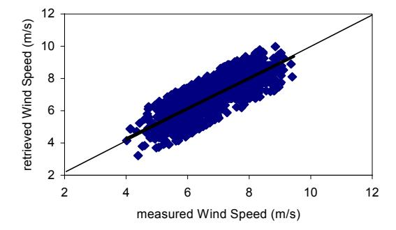
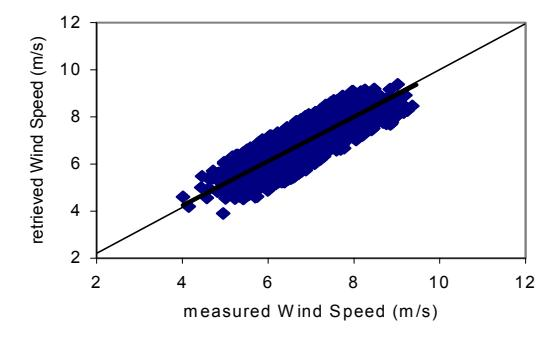

{0}------------------------------------------------

# Remote Sensing of Waved Sea Surface: Combined Passive and Active Microwave Measurements During the CAPMOS'05 Experiment

E.Santi, P. Pampaloni IFAC - CNR Florence, Italy M. Pospelov, A Kuzmin IKI - Moscow, Russia

S. Zecchetto, F. De Biasio ISAC - CNR, Padova, Italy

N. Skou, S. Søbjærg Ørsted•DTU Technical University of Denmark

Abstract— This paper describes the experimental activities carried out during the international experiment CAPMOS'05, which was carried out on an off-shore platform in Katsiveli, Ukraine, in May-June 2005. During the experiment, the sea surface was continuously observed by synchronous active and passive microwave instruments, combined with contact and optical observations, in order to retrieve the wave parameters and to characterize the spectral properties of the waved surface. An additional airborne campaign was carried out on the North Sea to investigate the Radio Frequency Interferences (RFI) effects which seriously may hamper the L-band measurements. Predictions of a two scale emissivity model of waved sea surface resulted in agreement with the radiometric data at S and Ka bands. A method for retrieving the wave spectrum parameters from angular radiometric measurements was developed, and compared with three different spectrum models. An inversion algorithm for retrieving the horizontal wind speed component from radiometric data at S and Ka band was implemented and validated with the experimental acquisitions.

Keywords- microwave radiometry and scatterometry, sea wave spectrum, Artificial Neural Network.

# I. INTRODUCTION

Ocean salinity, sea temperature and wind over sea are essential parameters in determining ocean circulation and in understanding the water cycle. These parameters can affect energy exchanges with the atmosphere and influence the climate dynamics. The possibility offered by the recent spatial missions, such as SMOS, to derive extended and recursive monitoring by using microwave radiometers, is therefore extremely attractive. However, measurements of sea surface salinity in the open ocean are still a challenge, because the dynamic range of salinity variations in the open ocean is relatively small, and the requirements for a scientifically useful measurement put a severe constraint on the sensor performances. Moreover, the variations of the sea-surface roughness due to wind strongly affect the sea surface emissivity and may therefore hamper the salinity retrieval accuracy.

The Combined Active / Passive Microwave Measurements of Wind Waves for Global Ocean Salinity Monitoring

This research was supported by the INTAS 03-51-4789 and partially by the RFBR 05-05-64451 projects

(CAPMOS) is a project granted by INTAS. The major goal of the experiment was to compare the results of synchronous active and passive microwave measurements of waved sea surface, focusing on the ocean wave spectrum and wind speed retrieval. The task of wave parameters retrieval is closely associated with remote measurements of sea surface salinity, since microwave brightness temperature depends on both dielectric properties (i.e. salinity) and geometry of the surface.

All the measurements pointed out the sensitivity of microwave emission and scattering to surface wind speed. Radiometric data at S- and Ka- bands were compared with a "two scale" model, which describes thermal microwave emission from a rough water surface, modelled as a combination of short gravity-capillary ripples and long gravity wave slopes. Simulation showed a good agreement between model and measurements. The retrieval of wind speed was performed by an algorithm based on supervised Artificial Neural Network (ANN).

# II. THE EXPERIMENT

The experiment took place on board of an off-shore research platform located at 600 meters off shore and managed by the Marine Hydrophysical Institute in late spring 2005 (Fig.1). The experiment involved several scientists from Ukraine (Marine Hydrophysical Institute - MHI, Sevastopol, Crimea), Russia (Space Research Institute - IKI, Moscow, Obukhov Institute for Atmospheric Physics - IFA, Moscow, Institute of Radioengineering and Electronics - IRE, Fryazino, Moscow) and Italy (Istituto di Fisica Applicata, IFAC, Firenze) and Istituto Scienze dell'Atmosfera e del Clima - ISAC, Unit of Padova).

The microwave instruments used for the measurements were: Ku-band scatterometer (VV polarization), L-band radiometer (V- or H-polarization); S-band radiometer (V-pol.); K-band polarimeter (3 Stokes parameters); Ka-band polarimeter (3 Stokes parameters); W-band radiometer (V- and H-pol.).

Microwave measurements were accompanied by synchronous measurements of a wide scope meteorological and oceanographic parameters. List of research instruments and equipment used in the experiment included: current meters, water temperature and turbulence sensors, wave gauges, sonic 

{1}------------------------------------------------

anemometer, air temperature, pressure and humidity sensors, water vapor and carbon dioxide sensors, a radio-interferometer for precise measurements of water surface and an IR-radiometer (8-12 µm).

Figure 1. The off-shore platform the Marine Hydrophysical Institute

Radiometric and scatterometric measurements were carried out continuously 24h/day from June 1 to June 20, 2006. Radar measurements were obtained at  $\theta$ =46° and 65° incidence angle pointing up- and down-wind, while the radiometers were rotating both in elevation (from 20° to 160°, including sky observations for calibration purposes) and azimuth (from 55° to 245°). The weather conditions during the experiment were favourable for the measurements. The mean wind speed ranged from 0 to 13 m/s; two episodes of high wind speeds were observed, with gusts well above 20 m/s. The wave height was always moderate, (from 0 to 1.5 m) due both to the short wind fetch and the limited duration of high winds.

#### III. EXPERIMENTAL RESULTS

# A. Radiometric mesurements

Data processing and spectrum parameters retrieval was performed according to the following sequence. First, the experimental brightness temperatures were averaged over several successive scans, to reduce fluctuations. Then the brightness temperature  $T_{\rm Sm}$  of the smooth water surface at the same temperature and salinity was computed and a brightness contrast produced by the waves was computed by subtracting  $T_{\rm Sm}$  from the experimental data. Further, the parameters of the spectrum (slope variance of long waves and piecewise-linear approximation for gravity-capillary waves curvature) was randomly defined and a direct problem for these set of parameters was solved until the best fit between computed and measured contrast was achieved (Fig. 2).

An example of the curvature spectrum retrieval is shown in the Fig.3. In the same figure three different models of spectrum are plotted for a comparison [1-3]. It is evident that no one of the model spectrum corresponds to the retrieved one. Reasonable agreement is achieved only with the spectrum by Apel, computed for the wind speed twice as much as it was

really observed. A probable reason for such disagreement may be that the model spectra are obtained by synthesizing various empirical data, which are in general related to the ideal conditions of a fully developed sea.

Figure 2. Brightness contrast as a function of the elevation angle

This condition was not the case in our experiment. Furthermore, different models differ each from other, and nowadays no one may be given an absolute credence to.

Figure 3. Example of the curvature spectrum retrieval and comparison with three differnt spectrum models: A from [1], E from [2] and R from [3].

#### B. Scatterometric measurements

Since the radar is a coherent device, it has been possible to derive simultaneous values of Normalized Radar Cross Section (NRCS) and radar Doppler frequency ( $f_d$ ). The simplest way to derive them is through the spectral analysis of the complex radar output Vt [4]. This method produces time series at relatively low sampling rate ( $\approx$  5Hz). The time series of NRCS and  $f_d$  have been also obtained at higher sampling rate (10 Hz), permitting to follow more closely the modifications of the sea surface roughness.

{2}------------------------------------------------

Standard techniques, as spectral analysis, have been used to extract information on the frequency content of both the waves and on the atmospheric boundary layer (from the NRCS and  $f_d$  time series), and to estimate the wind speed and the significant wave height [5].

The analysis of radar data pointed out, among others, the lag existing between the roughness ignition and the wind speed, the former lagging the latter by 20 seconds, and the high variability of the radar backscatter-wind speed linear correlation, even at the same incidence angle.

Figure 4 (middle and bottom panels) reports the frequency and wavelength of the spectral peak of the waves, while the top panel represents the wave height. The sea wave wavelengths resulted below 60 m (frequency 0.17 Hz), which seems reasonable according to our visual estimates during the measurements.

Figure 4. Wave conditions obtained from radar measurements, grouped by incidence angle. Top panel: significant wave height; middle panel: peak frequency; bottom panel: peak wavelength. Green symbols refer to downwind measurements

#### C. Comparison of radiometric data with two-scale model

Microwave radiometric measurements at S and Ka bands have been compared with the outputs of a two-scale emissivity model, which depicts the sea surface as overlapping effects of long waves and small ripples [6,7]. The model is based on the assumption that microwave radiation is scattered from slightly rough patches which are created by wind on the ocean surface. These patches are geometrically tilted by the underlying gravity waves, which represent the large scale roughness: both, small and large scale roughness are statistically described through the surface heights spectrum and the slope probability density function.

Fig. 5 shows an example of S-band V-pol measurements and corresponding model simulations as a function of the incidence angle. It can be observed that the two trends are well in agreement for higher incidence angles, while some discrepancy at the lower ones can be attributed to some reflection effects of the platform structure in the radiometer side-lobes. Analogous results have been obtained at Ka band.

Figure 5. Comparison between S-band measurements and model simulations as a function of the incidence angle

#### IV. EMIRAD-2 AIRBORNE CAMPAIGN

One of the major problems encountered during the experiment was due to the Radio Frequency Interferences (RFI), which strongly hampered the L-band acquisitions. In order to set up a method for detecting RFI, an airborne campaign was carried out in 2006 on the North Sea by using the EMIRAD-2 sensor. EMIRAD-2 is a fully polarimetric radiometer operating in the 1400 - 1427 MHz protected band. Data analysis indicated that, if interferences are of pulsed nature, RFI detection can be done directly in time domain provided an adequate sampling of the signal. Continuous signal can be instead revealed by a frequency analysis of the received signal and lastly a statistical approach for detecting RFI is possible too, assuming that desired radiometric signals are noise-like with a Gaussian probability distribution function (PDF), while RFI is man-made having a non-Gaussian PDF.

# V. RETRIEVAL OF WIND SPEED

An example of comparison between radiometric acquisitions at Ka band and direct measurements of wind speed (horizontal component) is shown in fig 6. The high dispersion of the data (R2=0.14) hampered the wind speed retrieval by means of direct inversion methods. An algorithm based on supervised ANN was therefore developed. The ANN was a multi layer perceptrons (MLP's) with the training phase based on the back-propagation (BP) learning rule to minimize the mean square error (mse) between the desired target vectors and the actual output vectors. Several combinations of inputs were tested, including incidence angle, sea surface temperature, wind direction and brightness temperature at S- and Ka bands. The output was the wind speed. A subset of data was extracted

{3}------------------------------------------------

from the available dataset for training the ANN, while the retrieval was carried out using the remaining part of dataset.

Figure 6. Example of measured brigtness temperature at Ka band, 30° of incidence, plotted as a function of the wind speed (R²=0.14)

Figure 7 a) and b) show the comparison between measured and retrieved wind speeds from S and Ka band data. An attempt to improve the retrieval accuracy by combining both the frequencies failed due to the strong correlation between the two datasets. This fact implies that, the addition of frequency channels should not significantly improve the retrieval accuracy. The obtained results confirmed the sensitivity of both S and Ka-band to the wind speed, and demonstrated that wind speed estimation is possible at both frequencies with comparable results.

Figure 7. Wind speed retrieval by using the ANN algorithm a) at S band  $R^2$ =0.64, b) at Ka band ( $R^2$ =0.73)

#### VI. CONCLUSIONS

The retrieving the wave spectrum parameters, which was a main goal of CAPMOS experiment, was only partially reached, since appreciably disagreements between retrieved and simulated spectrum parameters were found. However it should be noted that direct measurements of short gravity-capillary waves in an open sea are still a challenge: that is the reason of disagreement of various spectral models at big values of wave numbers. Therefore remote radiometric measurements are able to fill the gap and provide important information about short gravity-capillary wave parameters.

On the other hand, significant wave heights and gravity wave spectrum can be retrieved from radar measurements, moreover the sensitivity of microwave measurements to the wind speed was clearly demonstrated and an algorithm based on ANN for wind speed retrieval was successfully tested.

A characterization of the RFI that affected the radiometric measurements at L band during the experiment was performed by using data from an additional airborne campaign carried out on the North Sea.

#### REFERENCES:

- Apel, J.R., An improved model of the ocean surface wave vector spectrum and its effects on radar backscatter, J. Geophys. Res., 99, 16269-16291, 1994.
- [2] Elfouhaily, T., B. Chapron, K. Katsaros, and D. Vandemark, A unified directional spectrum for long and short wind-driven waves, Journal of Geophysical Research, 102, 15781-15796, 1997.
- [3] Romeiser, R., W. Alpers, and V. Wismann, An improved composite surface model for the radar backscattering cross section of the ocean surface 1. Theory of the model and optimization/validation by scatterometer data, Journal of Geophysical Research, 102, No. C11, 25237-25250, 1997.
- [4] Zecchetto, S. and P. Trivero, Experimental ocean active microwave remote sensing, in Satellite remote sensing of the Oceanic Environment (Jones, Sugimori and Stewart Eds.), Seibutsu Kenkyusha, Tokyo, 115-122, 1993
- [5] Zecchetto, S., Effects of modulation of sigma naugth with implications for physical scatterometer modelling, in The air-sea interface. Radio and Acoustic Sensing, Turbulence and Wave Dynamics (Donelan, Hui and Plant Eds.), The Rosenstiel School of Marine and Atmospheric Science, University of Miami, USA, 729-733, 1996
- [6] Coppo P., J.T.Johnson, L. Guerriero, J.A. Kong, G.Macelloni, F.Marzano, P.Pampaloni, N.Pierdicca, D.Solimini, C.Susini, C.Tofani, Y. Zhang, "Polarimetriy for Passive Remote Sensing", final report ESA contract n. 1146/95/NL/NB., December 1996
- [7] Durden, S.L., and J.F. Vesecky, A physical radar cross section model for a wind-driven sea with swell, IEEE Journal of Oceanic Engineering, 10, No. 4, 445-451, 1985.