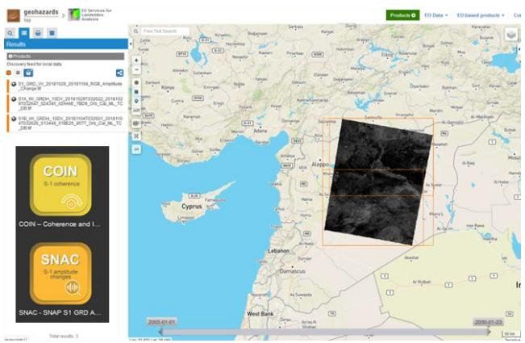
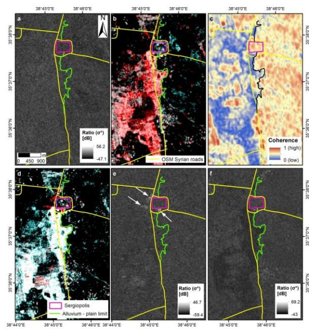
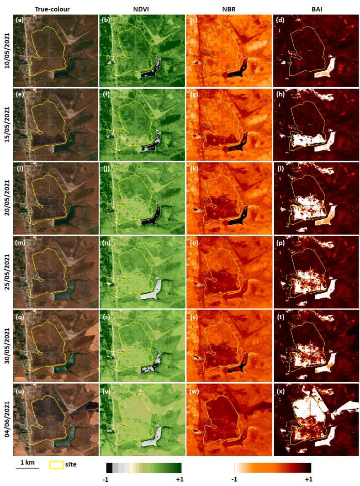

{0}------------------------------------------------

# **DOCUMENTATION OF FLOODS AND FIRES IN MIDDLE EAST CULTURAL HERITAGE SITES THROUGH MULTI-SENSOR SATELLITE DATA AND EARTH OBSERVATION PLATFORMS**

*Deodato Tapete (1), Francesca Cigna (2)*

(1) Italian Space Agency (ASI), Via del Politecnico s.n.c., 00133 Rome, Italy (2) Institute of Atmospheric Sciences and Climate (ISAC), National Research Council (CNR), Via del Fosso del Cavaliere 100, 00133 Rome, Italy

#### **ABSTRACT**

Copernicus Sentinel-1 SAR and Sentinel-2 optical data time series were combined to document floods and fires affecting cultural heritage in remote or inaccessible locations in the Middle East. Change detection analysis using SAR amplitude and interferometric coherence, and the computation of spectral indexes using optical imagery (e.g. NDVI, NBR, BAI), were undertaken within EO data exploitation platforms equipped with validated and reliable image processing routines. The scientific experiments in the archaeological sites of Sergiopolis and Apamea in Syria proved the multi-sensor approach effective to temporally constrain the events and accurately map the affected areas.

*Index Terms—* Copernicus, flood, fire, cultural heritage

## **1. INTRODUCTION**

The European Commission's Copernicus Programme and its fleet of Earth Observation (EO) satellites currently allow archaeologists to access a wide variety of observation solutions for purposes of archaeological prospection [1], condition assessment [2] and disaster risk reduction [3]. To increase user uptake of these satellite technologies, EO platforms equipped with processing routines are being developed and launched, and there is evidence that they are gradually attracting the interest of archaeologists (e.g. [4]).

This paper aims to showcase how Copernicus multisensor data can be used to document floods and fires affecting cultural heritage sites, with a focus on the Middle East. This geographic choice reflects the fact that natural hazards have been recently given less attention compared to anthropogenic threats (e.g. war-related destruction and looting). In absence of dedicated observatories, a number of flooding events may be not inventoried, thus their impact on local heritage may remain unknown. At the same time, while the whole region is experiencing extreme weather (e.g. heavy precipitation followed by drought) making the local vegetation an ideal fuel for fire during the dry season, most fires are of anthropogenic origin [5] and unfortunately are distinctive features of conflict zones, where they are used offensively or occur as a collateral environmental damage [6-7].

#### **2. MATERIALS AND METHODS**

### **2.1. Case studies**

## *2.1.1. Sergiopolis, Resafa (Syria)*

Located 40 km south-west of modern Raqqa (35°37′44ʺ N; 38°45′29ʺ E), Sergiopolis was formerly a fortified settlement of the Eastern Roman Empire Limes, and lately became the pilgrimage site of Saint Sergius. Satellite imagery revealed evidence of looting, mostly prior to the recent Syrian conflict [8]. In ancient times, the downstream location within the river basin was exploited to collect rain and flood-water through cisterns and a floodwater-harvesting system, respectively [9]. These topographic and environmental characteristics that once created the condition for livability, now represent a possible threat for conservation in absence of periodic maintenance.

#### *2.1.2. Apamea (Syria)*

Founded during the Hellenistic period at the top of a high relief overlooking the Ghab plain (35°25′11″ N; 36°24′05″ E), Apamea was once among the most visited archaeological sites in Syria. The site was severely looted during the civil war and the following years, as well documented from satellite imagery [2,8]. However, another source of potential concern for conservation – that has not been specifically covered yet by published studies – comes from fires, either to clear fields for crops, or conflict-related.

#### **2.2. Multi-sensor satellite data**

The whole Copernicus Sentinel-1 Synthetic Aperture Radar (SAR) and cloud-free Sentinel-2 multispectral imagery collections were analyzed, and the following subsets were used: Sentinel-1 Interferometric Wide swath (IW) mode 

{1}------------------------------------------------

data, with 20 m (azimuth) by 5 m (range) spatial resolution, covering Sergiopolis in 16/10/2018–04/11/2018 (Figure 1); and Sentinel-2 images collected over Apamea in 15/04/2021–04/06/2021.

#### **2.3. Image processing**

SAR and optical data were analyzed using predefined processing services accessible through EO data exploitation platforms. The scope was also to test what, even non-expert users, could achieve with such systems, owing to the opportunity to be relieved from coding and parameters setting and be only required to select images of their interest to process.

#### *2.3.1. SAR processing*

Sentinel-1 Level-1 Ground Range Detected (GRD) products (i.e. focused SAR data that were detected, multi-looked and projected to the ground range using an Earth ellipsoid model), were processed using the SNAC−SNAP S-1 GRD Amplitude Change processing service [10] developed by the European Space Agency (ESA) and available in ESA's Geohazards Exploitation Platform (GEP) [11] (Figure 1). In addition, coherence maps were generated by means of GEP's COIN−Coherence and Intensity change for Sentinel-1 service, starting from Single Look Complex (SLC) Sentinel-1 data. Full details are available in [9].

#### *2.3.2. Spectral indexes*

The 13 spectral bands of Sentinel-2 Level-2A (bottom of atmosphere) data were used to generate: 10 m spatial resolution true-color composites (bands 4, 3, 2); Normalized Difference Vegetation Index (NDVI); Normalized Burn Ratio (NBR); and Burnt Area Index (BAI), using custom scripts [12] that were run in the Sentinel Hub EO Browser [13].

Figure 1. Sentinel-1 IW SAR data selection over Syria in the GEP, to process with COIN coherence and SNAC amplitude change detection services. Contains Copernicus Sentinel-1 data 2018.

#### **3. FLOOD EVENT AT SERGIOPOLIS**

Through an initial regional screening of Sentinel-2 archives, an unknown flood event affecting Sergiopolis in October 2018 was detected. However, based on the sole pair of cloud-free images available, we could only infer that the event happened within the period between 5 and 30 October. No information could be retrieved on the timings of the drying process and recovery.

Benefitting of the renown all-weather condition SAR imaging capability, it was possible to fully constrain temporally the evolution of the flood event and its impact on the archaeological assets. The ascending mode Sentinel-1 image collected on 28 October allowed us to pre-date the start of the flooding of at least 2 days and confirm that waters flooded the landscape south and in the nearby of Sergiopolis (see red and blue patterns in Figure 2b and 2c, respectively). On 3 November the situation was more or less unaltered across the basin, except for signs of increased radar backscatter nearby the fortification walls (see red pattern and white arrows in Figure 2d and 2e, respectively). Full recovery from the flooding was observed in December. A deeper discussion about the estimated change of radar backscatter is reported in [9].

Figure 2. Multi-temporal analysis of the October-November flood event in Sergiopolis using VV-polarized Sentinel-1 imagery [9]: (a) pre-event SAR amplitude ratio, 16 vs. 22/10/2018; (b) crossevent RGB color composite, R: 28/10/2018, G and B: 16/10/2018; (c) matching interferometric coherence; (d) cross-event RGB color composite, R: 03/11/2018, G and B: 28/10/2018; (e) matching ratio. White arrows indicate patterns of increased radar backscatter in the nearby of Sergiopolis fortification walls and water basins. (f) Post-event ratio map, 04/11/2018 vs. 29/10/2018. Contains modified Copernicus Sentinel-1 data 2018.

{2}------------------------------------------------

#### **4. FIRE EVENTS AT APAMEA**

Multi-temporal screening of Google Earth very high resolution imagery highlights that, at least in the last three years, fires have repeatedly taken place within the archaeological site boundaries of Apamea. While these fires mostly occurred in the unexcavated croplands during the months following the vegetation growth season and thus were presumably linked to a local agricultural practice, Apamea is located in the wider region of Hama, Al-Ghab plain and Idlib, where crop fires seem to have most likely been the result of deliberate tactics [14]. Therefore, multitemporal monitoring is crucial to document the possible threats for heritage conservation, given that fire temperatures may affect not only standing ruins, but also buried remains.

Focusing on 2021, as per the trend observed since 2012, the time series of pre-fire Sentinel-2 images showed that the peak of vegetation growth occurred in April. In the first ten days of May, the site appeared to gradually become dry and bare (Figure 3a-d). On 15 May, the true-color composite and all the spectral indexes showed that most of the site south of the Decumanus Maximus was burnt (Figure 3e-h; NBR approaching +1, and BAI of around −1), alongside an area outside the site boundaries within dam B (see white pattern, north of the site). Five days after, the burnt areas had already expanded up to nearly half of the site (Figure 3i-l). However, no further burning happened in the following ten days (Figure 3m-t). Until 30 May, the NDVI and NBR did not show any significant change (Figure 3r-s), while some variations were observed in the BAI map (Figure 3t; increasing BAI south of the Decumanus Maximus), as expected in relation to the incipient recovery of the burn scars due to the fire event that occurred a few days before.

Figure 3. Multi-temporal monitoring of fires occurred in May – June 2021 in Apamea using: (a-d) pre-fire and (e-x) post-fire 10-m Sentinel-2 L2A scenes, displayed as true-color images (R: Band 4–red; G: Band 3–green; B: Band 2–blue) and via the computation of the respective: Normalized Difference Vegetation Index (NDVI); Normalized Burn Ratio (NBR); and Burn Area Index (BAI). Contains modified Copernicus Sentinel-2 data 2021/Sentinel Hub.

{3}------------------------------------------------

On 4 June, Sentinel-2 data indicate that new fires occurred across the whole northern sector of the archaeological site that had not previously been burnt (Figure 3u-x). At the same time, fires extended outside the walls, south-west and south-east of dam B. The distinctive white pattern in the BAI map (i.e. ~−1 values in Figure 3x) marks the newly burnt area versus the southern part of the site where the recovery from the previous event was already ongoing. In the following weeks, no new events occurred within the archaeological site, while extensive fires severely affected the agricultural fields across the Al-Ghab valley. By the end of June, the wider region surrounding Apamea was covered by burnt areas.

### **5. CONCLUSIONS**

The use of validated processing routines in the GEP allowed us to fully exploit the Sentinel-1 archive collection to reconstruct accurately the temporal evolution of an unknown flood in a remote location, that could not have been exhaustively documented with Sentinel-2 imagery only, due to cloud coverage. The experiment in Sergiopolis suggests that a combination of Sentinel-2 based regional screening and ad hoc change detection analysis of selected Sentinel-1 scenes may help to unveil other flooding events posing risk to heritage assets, that otherwise may remain unnoticed.

In clear sky conditions, the short revisit time of Sentinel-2 offers an adequate observation frequency to capture multiple and subsequent fire events at a given location, as well as in the wider geographic context. At Apamea, this capability alongside the integration of different spectral indexes was effective in highlighting the temporal sequence of the fires and the increasing surface extent of the affected areas. The use of Sentinel Hub EO Browser to run the custom scripts for spectral indexes computation and map generation prevented heavy data transfer to local computers, and allowed a significant reduction of image processing times. As such, this platform offers a sustainable and reliable resource with analysis tools for a wide spectrum of users, even non-expert in image processing. With basic knowledge of remote sensing, they can generate satellite-based products without the need to seek support from specialist analysts.

## **6. ACKNOWLEDGEMENTS**

Copernicus Sentinel-1 SAR data were processed in ESA's Geohazards Thematic Exploitation Platform (Geohazards TEP, or GEP), in the framework of the GEP Early Adopters Programme and the Geohazards Lab initiative, the latter developed under the CEOS Working Group on Disasters.

## **7. REFERENCES**

[1] H.A. Orengo, F.C. Conesa, A. Garcia-Molsosa, A. Lobo, A.S. Green, M. Madella, and C.A. Petrie, "Automated detection of

- archaeological mounds using machine-learning classification of multisensor and multitemporal satellite data," *Proc. Natl. Acad. Sci.*, USA, 117, pp. 18240–18250, 2020.
- [2] D. Tapete, and F. Cigna, "Appraisal of Opportunities and Perspectives for the Systematic Condition Assessment of Heritage Sites with Copernicus Sentinel-2 High-Resolution Multispectral Imagery," *Remote Sens.*, MDPI, Basel, 10, 561, 2018.
- [3] A. Agapiou, V. Lysandrou, and D.G. Hadjimitsis, "Earth Observation Contribution to Cultural Heritage Disaster Risk Management: Case Study of Eastern Mediterranean Open Air Archaeological Monuments and Sites," *Remote Sens.*, MDPI, Basel, 12, 1330, 2020.
- [4] A. Agapiou, "Multi-Temporal Change Detection Analysis of Vertical Sprawl over Limassol City Centre and Amathus Archaeological Site in Cyprus during 2015–2020 Using the Sentinel-1 Sensor and the Google Earth Engine Platform," *Sensors*, MDPI, Basel, 21, 1884, 2021.
- [5] N. Levin, "Human factors explain the majority of MODISderived trends in vegetation cover in Israel: A densely populated country in the eastern Mediterranean," *Reg. Environ. Chang.*, Springer, 16, pp. 1197–1211, 2016.
- [6] L. Eklund, A.M. Abdi, A. Shahpurwala, and P. Dinc, "On the Geopolitics of Fire, Conflict and Land in the Kurdistan Region of Iraq," *Remote Sens.*, MDPI, Basel, 13, 1575, 2021
- [7] W. Zwijnenburg, D. Hochhauser, O. Dewachi, R. Sullivan, and V.-K. Nguyen, "Solving the jigsaw of conflict-related environmental damage: Utilizing open-source analysis to improve research into environmental health risks," *Journal of Public Health*, Oxford, 42, 3, pp. e352–e360, 2020.
- [8] D. Tapete, and F. Cigna, "Detection of Archaeological Looting from Space: Methods, Achievements and Challenges," *Remote Sens.*, MDPI, Basel, 11, 2389, 2019.
- [9] D. Tapete, and F. Cigna, "Poorly known 2018 floods in Bosra UNESCO site and Sergiopolis in Syria unveiled from space using Sentinel-1/2 and COSMO-SkyMed," *Sci. Rep.*, Springer, 10, 12307, 2020.
- [10] Terradue. SNAC—SNAP S-1 GRD amplitude change geohazards thematic exploitation platform 2.1 documentation. Available at: https://terradue.github.io/doc-tepgeohazards/tutorials/rss\_snap\_s1\_snac.html
- [11] M. Foumelis, et al. Monitoring Geohazards using on-demand and systematic services on ESA's Geohazards exploitation platform. in International Geoscience and Remote Sensing Symposium (IGARSS), IEEE, pp. 5457–5460, 2019.
- [12] Custom Scripts Repository, https://custom-scripts.sentinelhub.com/custom-scripts/
- [13] EO Browser, https://apps.sentinel-hub.com/eo-browser/, Sinergise Ltd.
- [14] Front Lines Aflame: Crop Fires Ravage Syria's Jazirah Region, Scorching Fields and Destroying Harvests, 24 August 2020, https://stj-sy.org/en/front-lines-aflame-crop-fires-ravagesyrias-jazirah-region-scorching-fields-and-destroying-harvests/