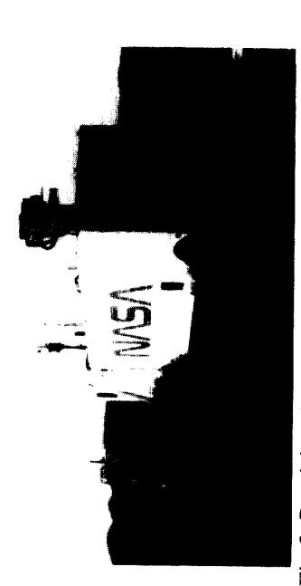
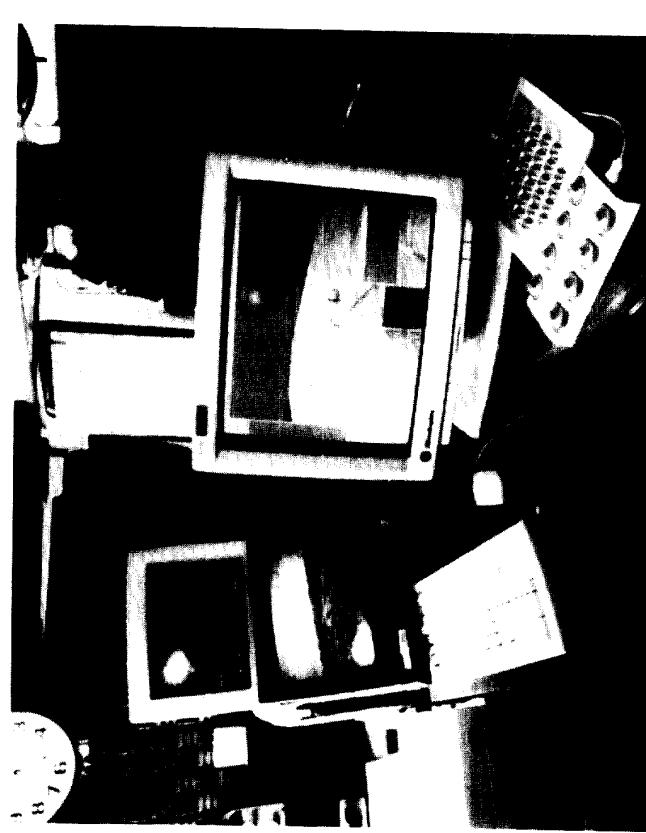
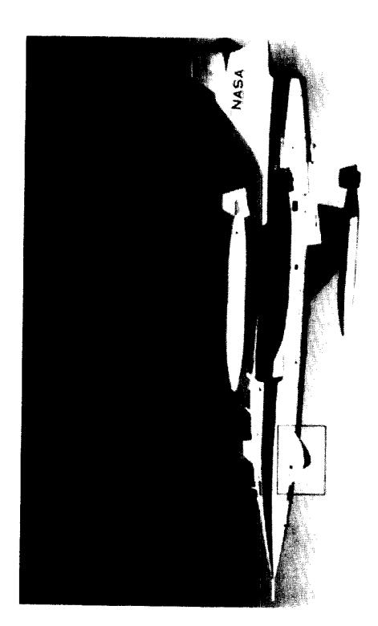
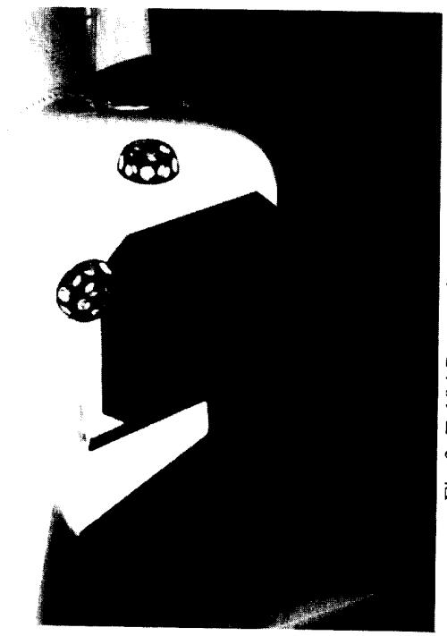
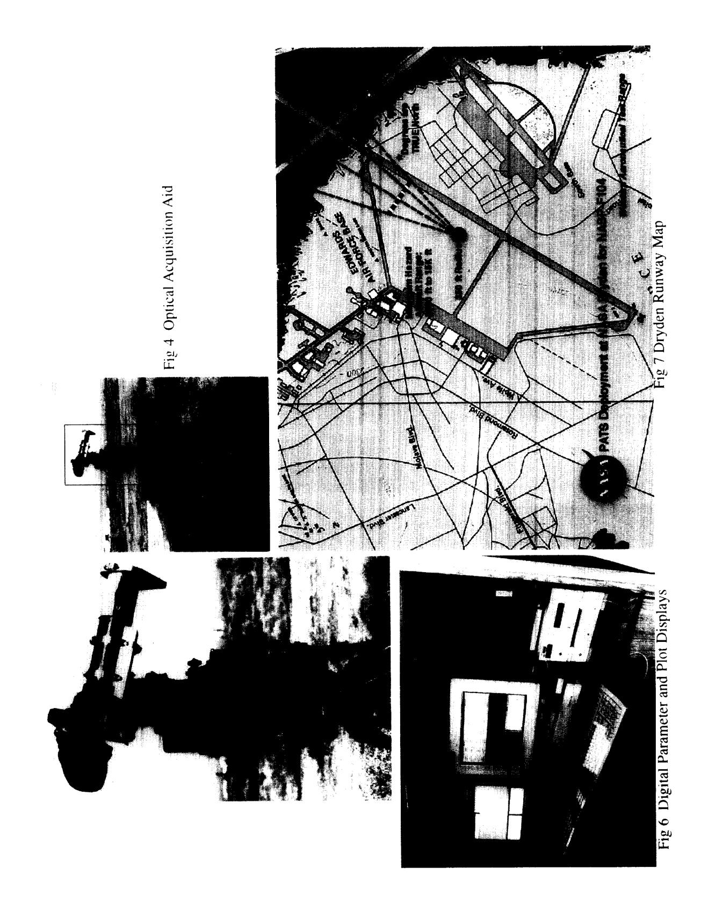

{0}------------------------------------------------

## MOBILE FLIGHT TEST SUPPORT

Fred H. Shigemoto
Range System Branch
National Aeronautics and Space Administration
Ames Research Center
Moffett Field, California 94035-1000

The NASA Dryden Flight Test Center (DFRC) evaluated an optical device used as a visual aide in landing hypervelocity aircraft. Pilot performance in landing an F-104 instrumented with the Research External Vision Device (REVD) at Edwards Air Force Base was characterized by means of precision laser tracking and telemetry of the aircraft state. A self-contained mobile laser tracking system and telemetry acquisition system was designed and configured to provide the required position tracking and telemetry acquisition. Wireless air links providing internet connectivity to the DRFC computer network and automation of initial target acquisition for laser track operation were key factors in the development of a low cost, mobile position tracking and telemetry capability operable by a single person. Mission data support capabilities include real-time laser tracking and correlation with telemetry data; real-time displays; and internet access to all acquired flight test data.

A remote mobile tracking and telemetry data acquisition system was assembled to support a NASA Dryden program at Edwards Air Force Base. The objective in building up the facility was to provide space position of the aircraft merged with telemetry data in real-time. It was also desired to maintain operation with a minimum of technical personnel in the field and provide operators with technical support from the home site in an instantaneous manner. The equipment was placed on site as a self powered system with wireless links to provide network connection, communications and radar data acquisition. The program was supported in late 1993 and early 1994. The National Aero-Space Plane (NASP) Research External Vision Device (REVD) F-104 project evaluated a restricted field of view optical periscope on approach and landing. High speed aircraft on landing, pitch up and the nose of the aircraft obscures the pilots field of view. On the Concorde supersonic aircraft the nose of the aircraft is pivoted to move down to provide the pilot a clear view of the runway. The optical periscope installed in the back seat of the F-104 was to be evaluated to determine if the restricted field of view impaired the pilots ability to land the aircraft (figure 1). This paper will discuss the elements to support the program and not on the results of the project.

A mobile Precision Automated Tracking System (PATS) built by GTE Sylvania® (figure 2) was used with a telemetry acquisition and processing system to provide merged data real-time including strip chart recorders and video graphic displays. The PATS tracker is housed in a towable trailer with a tracking mount that can be isolated from the trailer to eliminate personnel movement to the mount. The transmitter operates at a wavelength of 1.064 microns with a peak pulse power of 1 megawatt at a rate of 100 PPS. The system works similar to a monopluse radar and requires a retroreflector array on the aircraft to track. A quadrant photodetector is used to derive azimuth and elevation servo drive signals. The difference in return signal distributed between the upper half and lower half of the detector is proportional to the elevation drive signal and similarly the difference between the left and right half is proportional to the azimuth drive signal. The sum received power is the video to derive range data and serves as the automatic 

{1}------------------------------------------------

gain control. The return optical image is set to be slightly out of focus to form a circular image which provides a limited linear range drive signal. 18 bit shaft angle encoders provide angular position of the mount.

A video camera is collimated to the Laser transmitter/receiver to provide the operator a view of the direction that the tracker is pointed. The 15 degree wide angle field of view of this boresight video camera is insufficient to acquire the aircraft. Experience has shown that an aircraft is very difficult to acquire even given audio cues as to its location. Additional information for track acquisition had to be implemented to be successful. Several techniques were implemented to assure acquisition. Similarly two telemetry antennas were mounted as alternatives for signal reception.

To enable tracking the aircraft on a turn in to approach and landing from either end of the runway, three retroreflector arrays were mounted on the periscope flaring (figure 3). The retroreflector array is a passive optical device that returns energy back in the direction that it came. Over 90% of the energy incident is returned. One on each side of the periscope flaring with the third one facing forward was installed. This configuration allowed tracking throughout the aircraft trajectory from 10 miles out. Each reflector array is made up of 15 one inch reflectors mounted to form a hemispheric shape. The steep approach angle of 25 degrees required careful attention to the location of the forward looking reflector array.

The laser used in the tracking system is a Class IV as specified by The American National Standard for safe use of lasers ANSI Z136.1-1993 and requires special precautions when in operation. The PATS system has several built in safety features that makes its operation less hazardous. The transmitter power output level changes according to return signal strength. There are three 20 db attenuators that trip in to reduce the hazard range from a maximum of 3500 ft. down to 3.5 ft. The annunciated eye hazard ranges are 3500, 350, and 35 ft. To maintain a proportional attenuation to the

receiver an attenuation wheel is placed in front of the quadrant detector that has a 0 to 20 db range. Whenever an attenuator is inserted or retracted in the transmitter path the receiver attenuator wheel moves to either 0 or 20 db dependent on which way the target is moving. With the retroreflector array used for the F-104 the attenuation transition from 3500 ft. to 350 ft. eye hazard range occurred at approximately 15000 ft. and the 350 to 35 ft. transition occurred at 5000 ft. Eye hazard ranges are based on exposure to the unaided eye; magnifying optics increase the hazard.

A safety plan was presented to the Edwards Air Force Safety board, NASA Dryden Project Team, and NASA Dryden Flight Operations. From these meetings a restricted area of laser transmission evolved. Tracking was restricted to the approach end of runway 22 (a 15000 ft. long runway) within a 30 degree cone where laser output could be a maximum for acquisition. To further protect the personnel that could be in the hills looking at the field in the direction of the laser with high power optics the laser tracking system was to be inhibited if the elevation track axis went above 2 degrees. This mountain top area was above the typical F-104 glide path and was passed at an elevation track angle below 2 degrees. The track was allowed to continue if the 350 ft. eye hazard attenuation was inserted. Laser tracking was to be discontinued at touchdown. Most laser tracker inhibits or restricted power outputs were managed by computer software control of the laser firing trigger. Tracking was allowed in any direction if the elevation angle was above 10 degrees. The tracking system has built in circuitry that inhibits tracking if the target distance equals the hazard range. Although not necessary pilots wore safety visors that attenuated the laser energy by 1000. Operation of this same type of Laser tracker at the NASA Ames Research Center, Flight Test Facility at Crows Landing has been in operation since 1979 supporting many flight test programs sponsored by industry and various federal agencies without incident and without pilots

{2}------------------------------------------------

wearing safety goggles.

A manually operated optical acquisition system (figure 4) consisting of a portable elevation over azimuth mount was fitted with 10 bit synchro to digital readout and a seven power optical telescope. The telescope with cross hairs was selected to allow visual manual track. The digital signals were transmitted to a computer that computed the difference between the PATS and the Optical acquisition aid pointing vector and transmitted that data to the PATS system. Discrete validation signals were developed to indicate when signals were valid to use. The operator of the manual mount activated a trigger switch when the aircraft was in sight. This signal was monitored by the software program to determine its validity. The proximity of the optical tracker was close enough to the tracking van to function without parallax correction. The device needed only to bring the Laser tracking mount pointing vector close enough to the target so that the boresight camera could see it. With the signal valid and the operator selecting remote signal source the tracker would be slaved to the optical device. Once in the field of view of the boresight video the laser operator could easily capture and track the aircraft manually with a joystick control. The operator would then fire the laser and the transition to autotrack would occur automatically.

A video tracker was installed to allow autotrack when the aircraft was within the field of view of the boresight video. The video tracker was interfaced to the tracking system with 10 bits in each axis with a status bit signifying whether it had locked onto a target. The video tracker has the capability of tracking the target with an operator inserted offset. This feature was important to correct for slight collimation error between boresight camera and laser track line of sight. Changes in contrast of the aircraft from white on black to black on white would cause loss of track and consequently the use of this technique was not entirely satisfactory. It did however point out several features desirable in a video tracker specifically these are to track a changing contrast target, autothresholding, autoacquisition and autotrack gate sizing.

Data from the NASA Dryden C-Band radar was translated to the Laser site coordinates and transmitted via a wireless modem link. This function required the design and fabrication of an interface circuit to accept radar data and input to the RF modem transmitter. On the receiver end an interface circuit was designed and built to take the receiver output and input to the data acquisition system. The radar was about 5 miles away but was in a direct line of sight. Because of this line of sight all wireless links were directed to this facility.

Because of the multiple sources of signals to acquire the target a priority system was set to determine which signal source was to drive the tracker servos. Laser tracker lock up on target was the highest priority, video tracker second, optical acquisition aid third and radar acquisition last. Only if the acquisition signal was valid would it be considered. The priority system was designed into the hardware and software. The computer made the choice between the radar and optical acquisition systems and then the hardware circuit was designed for selecting laser, video, and computer signal in that order. Additionally the operator could bypass the priority system manually.

A directional antenna mounted to the laser tracking mount was to provide a back up source of telemetry reception. The primary antenna was an omnidirectional type which proved to be satisfactory. The antenna fed the telemetry receiver. The output PCM data stream was recorded on a 14 track magnetic tape and inputted to a Loral® Model 550 data acquisition system. A second stream from the tracking system was also recorded and sent to the Loral Model 550. The Loral system processed the data and provided a merged data to a processing computer with shared memory. From the shared memory graphic displays were generated that could display a three dimensional pictorial of the aircraft and its orientation relative to the runway using a Silicon Graphics®

{3}------------------------------------------------

system (figure 5). This program required a computer model of the F-104, the airstrip and surrounding terrain. A Sun@ work station was used to generate digital display of telemetry and processed tracking data (figure 6). Additionally on the same monitor x-y and x-z plots were displayed in real time. Post flight processing was done to provide the experimenter with merged data on a IBMB compatible floppy disk.

Wireless RF links provided network connection with software developers at Moffett and monitoring capability. These systems used a spread spectrum transceiver. Telephone and fax connections were also via wireless links. This capability maintained the system's operation and development with minimum travel requirements.

Operation at the remote site required rapid survey and establishment of a coordinate system relative to the runway centerline. GPS receivers were used to establish calibration targets and track site coordinates. A rectilinear coordinate system was established with the origin at the approach end of the runway with the **x** axis along the runway centerline. The laser site was approximately **2000** ft. south of the coordinate origin and 1000 ft. offset to the west (figure 7). Transformation matrices were determined to take care of earth curvature in calculating the x,y,z coordinates from the polar coordinates of the laser measurement and to transform radar data to laser site coordinates for acquisition. Survey was performed by the Defense Mapping Agency (DMA ).

Calibration of the Laser track system used two calibration targets to determine the zero bias on encoder readouts in Azimuth and Elevation. The 18 bit encoders are absolute reading whose offset or zero position needed to be resolved by calibration. Runway heading was the azimuth zero and local bubble level was the elevation zero. The range scale factor and offset were also determined. All position parameters used a single order linear equation. To calibrate the optical acquisition system required both systems to monitor a distant

stationary target. A far off target was chosen tu calibrate to minimize the effects of parallax. When both were on target the track data error was set to zero there after the track mount would be slaved to the optical system. The computation set the zero bias on the optical acquisition data so that its reading was identical to the laser mount when both pointed at the same object.

The mobility and remote networking capability to support flight test activity has added to the NASA Ames Research Center's aircraft flight test support versatility. This enhancement has enabled these systems to provide smaller linear displacement errors at critical points in flight. For example in the development of guidance systems derived from Global Positioning System (GPS) the decision altitude for Category **I1** and **I11** landing are necessary to be measured with precision. The laser tracker's narrow beam and use of retroreflector arrays has enabled tracking aircraft on approach, landing and taxi automatically without multipath effects. This capability has also enabled it to provide guidance to aircraft to fly specific trajectories for acoustic measurements. The wireless modem cannection has proven to be a key link in achieving system operation approaching a virtual range. This characteristic provides access to the remote system for software development, data manipulation, system control, and retrieval of data files.

{4}------------------------------------------------

{5}------------------------------------------------

