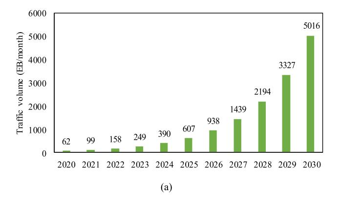
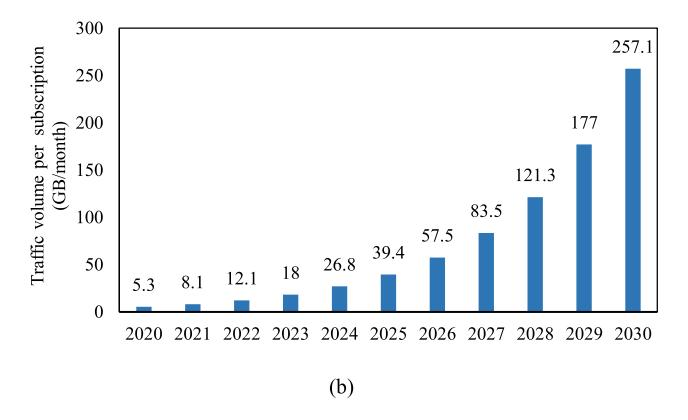
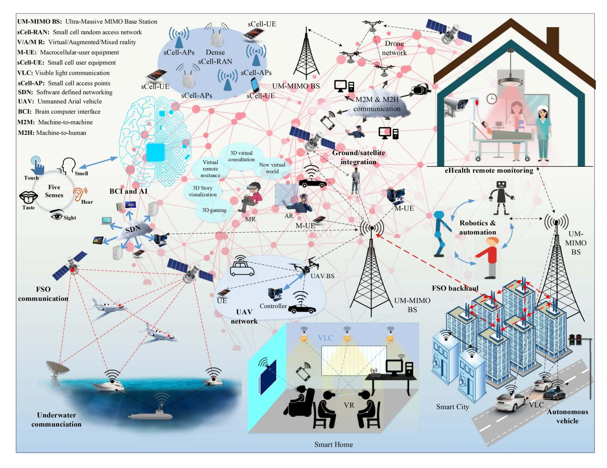

{0}------------------------------------------------

Received 15 June 2020; revised 10 July 2020; accepted 11 July 2020. Date of publication 20 July 2020; date of current version 4 August 2020.

Digital Object Identifier 10.1109/OJCOMS.2020.3010270

# 6G Wireless Communication Systems: Applications, Requirements, Technologies, Challenges, and Research Directions

MOSTAFA ZAMAN CHOWDHURY® 1 (Senior Member, IEEE), MD. SHAHJALAL® 2 (Student Member, IEEE), SHAKIL AHMED® 3 (Graduate Student Member, IEEE), AND YEONG MIN JANG® 2 (Member, IEEE)

1Department of Electrical and Electronic Engineering, Khulna University of Engineering & Technology, Khulna 9203, Bangladesh

2Department of Electronics Engineering, Kookmin University, Seoul 02707, South Korea

3Department of Electrical and Computer Engineering, University of Arizona, Tucson, AZ 85721, USA

CORRESPONDING AUTHOR: Y. M. JANG (e-mail: yjang@kookmin.ac.kr)

This work was supported in part by the Ministry of Trade, Industry and Energy (MOTIE) and Korea Institute for Advancement of Technology (KIAT) through the International Cooperative Research and Development Program under Project P0011880; in part by the Institute for Information and Communications

Technology Promotion (IITP) Grant through the Korea Government (MSIT) under Grant 2017-0-00824; and in part by the

Development of Intelligent and Hybrid OCC-LiFi Systems for Next Generation Optical Wireless Communications.

**ABSTRACT** The demand for wireless connectivity has grown exponentially over the last few decades. Fifth-generation (5G) communications, with far more features than fourth-generation communications, will soon be deployed worldwide. A new paradigm of wireless communication, the sixth-generation (6G) system, with the full support of artificial intelligence, is expected to be implemented between 2027 and 2030. Beyond 5G, some fundamental issues that need to be addressed are higher system capacity, higher data rate, lower latency, higher security, and improved quality of service (QoS) compared to the 5G system. This paper presents the vision of future 6G wireless communication and its network architecture. This article describes emerging technologies such as artificial intelligence, terahertz communications, wireless optical technology, free-space optical network, blockchain, three-dimensional networking, quantum communications, unmanned aerial vehicles, cell-free communications, integration of wireless information and energy transfer, integrated sensing and communication, integrated access-backhaul networks, dynamic network slicing, holographic beamforming, backscatter communication, intelligent reflecting surface, proactive caching, and big data analytics that can assist the 6G architecture development in guaranteeing the OoS. Besides, expected applications with 6G communication requirements and possible technologies are presented. We also describe potential challenges and research directions for achieving this goal.

**INDEX TERMS** 5G, 6G, artificial intelligence, automation, beyond 5G, data rate, massive connectivity, virtual reality, terahertz.

### I. INTRODUCTION

THE RAPID development of various emerging applications, such as artificial intelligence (AI), virtual reality (VR), three-dimensional (3D) media, and the Internet of Everything (IoE), has led to a massive volume of traffic [1]. The global mobile traffic volume was 7.462 EB/month in 2010, and this traffic is predicted to be 5016 EB/month in 2030 [2]. This statistic shows the importance of improving

communication systems. We are heading toward a society of fully automated remote management systems. Autonomous systems are becoming popular in all areas of society, including industry, health, roads, oceans, and space. In this regard, millions of sensors are integrated into cities, vehicles, homes, industries, food, toys, and other environments to provide a smart life and automated systems. Hence, a high-data-rate with reliable connectivity will be

{1}------------------------------------------------

required to support these applications. In certain parts of the world, fifth-generation (5G) wireless networks have already been deployed. By 2020, 5G is expected to be fully used worldwide.

5G networks will not have the capacity to deliver a completely automated and intelligent network that provides everything as a service and a completely immersive experience [\[3\]](#page-15-2). Although the 5G communication systems will offer significant improvements over the existing systems, they will not be able to fulfill the demands of future emerging intelligent and automation systems after ten years [\[4\]](#page-15-3). The 5G network will provide new features and provide a better quality of service (QoS) compared to fourth-generation (4G) communications [\[5\]](#page-15-4)–[\[8\]](#page-15-5). 5G technology includes several new additional techniques, such as new frequency bands (e.g., millimeter-wave (mmWave) and optical spectra), advanced spectrum usage and management, and the integration of licensed and unlicensed bands [\[4\]](#page-15-3). Nevertheless, the fast growth of data-centric and automated systems may exceed the capabilities of 5G wireless networks. 5G communication considerably overlooked the convergence of communication, intelligence, sensing, control, and computing functionalities. However, future IoE applications will necessitate this convergence. Specific devices, such as VR devices, need to go beyond 5G (B5G) because they require a minimum of 10 Gbps data rates [\[1\]](#page-15-0). Hence, with 5G reaching its limits in 2030, the design goals for its next step are already being explored in literature.

New items that may require sixth-generation (6G) system include (i) massive man-machine interfaces, (ii) ubiquitous computing among local devices and the cloud, (iii) multisensory data fusion to create multi-verse maps and different mixed-reality experiences, and (iv) precision in sensing and actuation to control the physical world [\[9\]](#page-15-6). To reach the goal of 6G and to overcome the constraints of 5G for supporting new challenges, B5G wireless systems will need to be developed with new attractive features. The 6G communication networks will fulfill the laggings of 5G system by introducing new synthesis of future services such as ambient sensing intelligence and new human-human and humanmachine interaction, a pervasive introduction of AI and the incorporation of new technologies such as terahertz (THz), 3-dimensional (3D) networking, quantum communications, holographic beamforming, backscatter communication, intelligent reflecting surface (IRS), and proactive caching [\[10\]](#page-15-7). The key drivers of 6G will be the convergence of all the past features, such as network densification, high throughput, high reliability, low energy consumption, and massive connectivity. The 6G system would also continue the trends of the previous generations, which included new services with the addition of new technologies. The new services include AI, smart wearables, implants, autonomous vehicles, computing reality devices, sensing, and 3D mapping [\[11\]](#page-15-8). The most critical requirement for 6G wireless networks is the capability of handling massive volumes of data and very high-data-rate connectivity per device [\[1\]](#page-15-0).

The 5G paradigm will be further developed and expanded in 6G. However, the 6G system will increase performance and maximize user QoS several folds more than 5G, along with some exciting features. It can protect the system, secure user data, and provide comfortable services [\[12\]](#page-16-0). The 6G communication system is expected to be a global communication facility. It is envisioned that the per-user bit rate in 6G will be approximately 1 Tbps in many cases [\[1\]](#page-15-0), [\[13\]](#page-16-1). The 6G system is expected to provide simultaneous wireless connectivity that is 1000 times higher than 5G.

Moreover, ultra-long-range communication with less than 1 ms latency is also expected [\[14\]](#page-16-2). The most exciting feature of 6G is the inclusion of fully supported AI for driving autonomous systems. Video-type traffic is likely to be dominant among various data traffic systems in 6G communications. The most important technologies that will be the driving force for 6G are the THz band, AI, optical wireless communication (OWC), 3D networking, unmanned aerial vehicles (UAV), IRS, and wireless power transfer. This paper tried to provide a complete overview of the future 6G communication system considering current trends and efforts by researchers around the world. Some other articles also addressed related issues discretely. However, we provide an overview of technologies, use cases, requirements, and challenging issues within this article. Although it is quite impossible to identify every detail of 6G during the current time frame, we believe that this paper will give a right direction for future researchers. The contributions of this paper can be summarized as follows:

- The trends of increasing wireless connectivity and mobile data are briefly discussed.
- Possible ways to reach the 6G communication system are addressed.
- Expected service requirements for 6G communication are discussed.
- The expected 6G communication system is briefly compared with 4G and 5G systems.
- Emerging 6G technologies are presented.
- The roles of different technologies in 5G and 6G, respectively, are discussed.
- Expected 6G applications with the requirements are presented.
- Related existing ongoing works on 6G are discussed.
- Possible challenges and research directions to reach the 6G goal are described.

The rest of the paper is organized as follows. Section II presents the growing trends in the use of mobile communications. The expected service requirements and the network characteristics in 6G communication systems are presented in Section III. The possible network architecture with the applications of future 6G communication systems is presented in Section IV. The potential critical technologies for the development of the 6G system are briefly discussed in Section V. In Section VI, we discuss various research activities on 6G. Section VII sets out the main challenges and research

{2}------------------------------------------------

**TABLE 1. List of acronyms.**

| an.    | TEL D: 1                                         |
|--------|--------------------------------------------------|
| 3D     | Three-Dimensional                                |
| 4G     | Fourth-Generation                                |
| 5G     | Fifth-Generation                                 |
| 5GB    | 5G and Beyond                                    |
| 6G     | Sixth-Generation                                 |
| AI     | Artificial Intelligence                          |
| B5G    | Beyond 5G                                        |
| BCI    | Brain-Computer Interface                         |
| BS     | Base Station                                     |
| BCI    | Brain-Computer Interface                         |
| E2E    | End-to-End                                       |
| eMBB   | Enhanced Mobile Broadband                        |
| FSO    | Free Space Optical                               |
| GPS    | Global Positioning System                        |
| HBF    | Holographic Beamforming                          |
| IoE    | Internet of Everything                           |
| ІоТ    | Internet of Things                               |
| IR     | Infrared                                         |
| IRS    | Intelligent Reflective Surface                   |
| ITU    | International Telecommunication Union            |
| LED    | Light-Emitting-Diode                             |
| LiDAR  | Light Detection and Ranging                      |
| LPWAN  | Low-Power Wide Area Networks                     |
| M2M    | Machine-to-Machine                               |
| MEEC   | Mobility-Enhanced Edge Computing                 |
| MIMO   | Multiple-Input Multiple-Output                   |
| mmWave | Millimeter Wave                                  |
| MR     | Mixed Reality                                    |
| OAM    | Orbital Angular Momentum                         |
| OWC    | Optical Wireless Communication                   |
| QoS    | Quality of Service                               |
| RF     | Radio Frequency                                  |
| RSA    | Rivest–Shamir–Adleman                            |
| THZ    | Terahertz                                        |
| UAV    | Unmanned Aerial Vehicles                         |
| uHDD   | Ultra-High Data Density                          |
| uHSLLC | Ultra-High-Speed with Low-Latency Communications |
| uMUB   | Ubiquitous Mobile Ultra-Broadband                |
| URLLC  | Ultra-Reliable Low-Latency Communications        |
| VR     | Virtual Reality                                  |
| VLC    | Visible Light Communication                      |
| WIET   | Wireless Information and Energy Transfer         |
| XR     | Extended Reality                                 |

directions for achieving 6G goals. Finally, we draw our conclusions in Section VIII. For easy referencing, Table [1](#page-2-0) summarizes the various abbreviations used in this paper.

# **II. TRENDS IN MOBILE COMMUNICATIONS**

Since the beginning of the first analog communication system in the 1980s, a new generation of communication systems has been introduced almost every ten years. The transfer from one generation to another improves the QoS metrics, includes new services, and provides new features. The goal of B5G and 6G is to increase in the respective

**FIGURE 1. The predicted growth of global mobile connectivity during 2020-2030 [\[33\]](#page-16-3). (a) total global traffic volume, (b) traffic volume per subscription.**

capability by a factor of 10–100 compared to the previous mobile generation upgrades. During the last ten years, mobile data traffic has grown tremendously because of the introduction of smart devices and machine-to-machine (M2M) communications. Fig. [1](#page-2-1) shows the exponential growth of mobile connectivity. It is expected that the global mobile traffic volume will increase 670 times in 2030 compared to mobile traffic in 2010 [\[2\]](#page-15-1). By the end of 2030, the International Telecommunication Union (ITU) predicts overall mobile data traffic will exceed 5 ZB per month. The number of mobile subscriptions will reach 17.1 billion as compared with 5.32 billion in 2010.

Moreover, the use of M2M connectivity will also increase exponentially. The traffic volume for each of the mobile devices will also increase. The traffic volume of a mobile device in 2010 was 5.3 GB per month. However, this volume will grow 50 times in 2030. The number of M2M subscriptions will increase 33 times in 2020 and 455 times in 2030, as compared with 2010. Table [2](#page-3-0) presents a few comparisons of the use of mobile connectivity in 2010, 2020, and 2030.

Recently, research interests have shifted to data-driven adaptive and intelligent methods. The 5G wireless networks will build a foundation of intelligent networks that provide AI operations [\[3\]](#page-15-2). It is estimated that by 2030, the capacity of 5G will reach its limit [\[14\]](#page-16-2). Then, fully intelligent network adaptation and management for providing advanced services will only be realized using 6G networks. Hence,

{3}------------------------------------------------

**TABLE 2. Global trends of wireless connectivity.**

| Issue                    | 2010  | 2020 (Predicted) | 2030 (Predicted) | Unit     |  |
|--------------------------|-------|---------------------|---------------------|----------|--|
| Mobile subscriptions     | 5.32  | 10.7                | 17.1                | Billion  |  |
| Smartphone subscriptions | 0.645 | 1.3                 | 5.0                 | Billion  |  |
| M2M subscriptions     | 0.213 | 7.0                 | 97                  | Billion  |  |
| Traffic volume           | 7.462 | 62                  | 5016                | EB/month |  |
| M2M traffic volume       | 0.256 | 5                   | 622                 | EB/month |  |
| Traffic per subscriber   | 1.35  | 10.3                | 257.1               | GB/month |  |

6G wireless communication is the result of the user needs growing beyond what the 5G network can offer. Researchers worldwide are already studying what 6G communications would be like in 2030; they are also looking at the possible drivers for successful 6G wireless communications. A few of the critical motivating trends behind the evolution of 6G communication systems are as follows: high bit rate, high reliability, low latency, high energy efficiency, high spectral efficiency, new spectra, green communication, intelligent networks, network availability, communications convergence, localization, computing, control, and sensing. Therefore, 6G will be a world of fully digital connectivity.

### **III. SPECIFICATIONS AND REQUIREMENTS**

5G technologies are associated with trade-offs of several issues, such as throughput, delay, energy efficiency, deployment costs, reliability, and hardware complexity. Likely, 5G will not be able to meet the market demands after 2030. Then, 6G will fill the gap between 5G and market demand. Based on the previous trends and predictions of future needs, the main objectives for the 6G systems are (i) extremely high data rates per device, (ii) a very large number of connected devices, (iii) global connectivity, (iv) very low latency, (v) lowering the energy consumption with battery-free Internet of Things (IoT) devices, (vi) ultra-high reliable connectivity, and (vii) connected intelligence with machine learning capability. Table [3](#page-3-1) shows a comparison of 6G with the 4G and 5G communication systems. It is anticipated that 6G will require a new key performance indicator (KPI) drivers besides the KPIs of 5G communication systems. Many KPIs of the 5G system will be also valid for 6G. However, the 5G KPIs must be reviewed and new KPIs must be considered for 6G. There are several KPI classes that are currently difficult to define for 6G and expected to be finalized by future investigations. 5GB communication systems target in most of the technology domains once again to increase in the respective capability by a factor of 10–100 compared to the previous

**TABLE 3. Comparison of 6G with 4G and 5G communication systems.**

| Issue                        | 4G                 | 5G              | 6G                     |
|------------------------------|--------------------|-----------------|------------------------|
| Per device peak data rate | 1 Gbps             | 10 Gbps         | 1 Tbps                 |
| End-to-end (E2E) latency  | 100 ms             | 10 ms           | 1 ms                   |
| Maximum spectral efficiency  | 15 bps/Hz          | 30 bps/Hz       | 100 bps/Hz             |
| Mobility support             | Up to 350 km/hr | Up to 500 km/hr | Up to 1000 km/hr    |
| Satellite integration        | No                 | No              | Fully                  |
| AI                           | No                 | Partial         | Fully                  |
| Autonomous vehicle           | No                 | Partial         | Fully                  |
| XR                           | No                 | Partial         | Fully                  |
| Haptic Communication      | No                 | Partial         | Fully                  |
| THz communication            | No                 | Very limited    | Widely                 |
| Service level                | Video              | VR, AR          | Tactile                |
| Architecture                 | MIMO               | Massive MIMO    | Intelligent surface |
| Maximum frequency         | 6 GHz              | 90 GHz          | 10 THz                 |

generation of communication systems. Some researchers from academia and industry target the KPIs for 6G communication as follows: peak data rate of 1 Tbps, radio latency of 0.1 ms, the battery lifetime of 20 years, device connectivity of 100/m3, traffic increase of 10,00 times, the energy efficiency of 10 times, maximum outage of 1 out of 1 million, and 10 cm indoor and 1 m outdoor precision in positioning [\[15\]](#page-16-4). The initial 6G KPIs can be broadly classified into two categories [\[15\]](#page-16-4) namely, (i) technology and productivity-driven KPIs and (ii) sustainability and societal driven KPIs. The first category includes KPIs for several parameters such as jitter, link budget, extended range/coverage, 3D-mapping, mobile broadband, positioning accuracy, cost, and energy-saving. The second category includes KPIs for several facts such as standardization, privacy/security/trust, open-source everything, ethics, intelligence, and global use case. The KPIs related to capacity, spectrum efficiency, energy efficiency, data rate, latency, and connectivity are the basic requirements of all the traditional communication systems. However, the KPIs regarding security and intelligence are newly designed for 6G. All the potential KPIs toward 6G systems will be achieved along with the evolution of 5G systems.

### *A. SERVICE REQUIREMENTS*

The 6G communication systems are expected to be featured by the following types of KPI associated services [\[16\]](#page-16-5):

- Ubiquitous mobile ultra-broadband (uMUB)
- Ultra-high-speed with low-latency communications (uHSLLC)
- Massive machine-type communication (mMTC)
- Ultra-high data density (uHDD)

{4}------------------------------------------------

The following key factors will characterize the 6G communication system:

- AI integrated communication
- Tactile Internet
- High energy efficiency
- Low backhaul and access network congestion
- Enhanced data security

It is estimated that the 6G system will have 1000 times higher simultaneous wireless connectivity than the 5G system. Compared to the enhanced mobile broadband (eMBB) in 5G, it is expected that 6G will include ubiquitous services, i.e., uMUB. Ultra-reliable low-latency communications, which is a key 5G feature, will be an essential driver again in 6G communication providing uHSLLC by adding features such as E2E delay of less than 1 ms [\[14\]](#page-16-2), more than 99.99999% reliability [\[17\]](#page-16-6), and 1 Tbps peak data rate.Massively connected devices (up to 10 million/km2) will be provided in the 6G communication system [\[17\]](#page-16-6). It is expected that 6G aims to provide Gbps coverage everywhere with the coverage of new environments such as sky (10,000 km) and sea (20 nautical miles) [\[17\]](#page-16-6). Volume spectral efficiency, as opposed to the often-used area spectral efficiency, will be much better in 6G [\[14\]](#page-16-2). The 6G system will provide ultra-long battery life and advanced battery technology for energy harvesting. In 6G systems, mobile devices will not need to be separately charged.

# *B. NEW NETWORK CHARACTERISTICS*

*Satellite Integrated Network:* Satellite communication is a must to provide ubiquitous connectivity. It is almost unconstrained geographical circumstances. It can support a seamless global coverage of various geographic locations such as land, sea, air, and sky to serve the user's ubiquitous connectivity. Hence, to provide always-on broadband global mobile collectivity, it is expected to integrate terrestrial and satellite systems to achieve the goal of 6G. Integrating terrestrial, satellite, and airborne networks into a single wireless system will be crucial for 6G. Only this integration can achieve the demand of uMUB services.

*Connected Intelligence:* In contrast to the earlier generation of wireless communication systems, 6G will be transformative, and will update the wireless advancement from "connected things" to "connected intelligence" [\[18\]](#page-16-7). AI will be introduced in each step of the communication process as well as radio resource management. The pervasive introduction of AI will produce a new paradigm of communication systems. Compared to 5G, a complete AI system must be needed for ultra-dense complex network scenarios of 6G, allowing intelligent communication devices to acquire and perform the resource allocation process [\[19\]](#page-16-8).

*Seamless Integration of Wireless Information and Energy Transfer:* The 6G wireless networks will also transfer power to charge battery devices, such as smartphones and sensors. Hence, wireless information and energy transfer (WIET) will be integrated.

*Ubiquitous Super 3D Connectivity:* Accessing the network and core network functionalities on drones and very low earth orbit satellites will make the super-3D connectivity in 6G universal.

# *C. FEW GENERAL REQUIREMENTS IN NETWORK CHARACTERISTICS*

*Small Cell Networks:* The small cell networks idea has been introduced to improve the received signal quality as a consequence of throughput, energy efficiency, and spectral efficiency enhancement in cellular systems [\[20\]](#page-16-9)–[\[22\]](#page-16-10). As a result, small cell networks are an essential characteristic for the 5G and beyond (5GB) communication systems. Therefore, 6G communication systems also adopt this network characteristic.

*Ultra-Dense Heterogeneous Networks:* Ultra-dense heterogeneous networks [\[23\]](#page-16-11), [\[24\]](#page-16-12) will be another critical characteristic of 6G communication systems. Multi-tier networks consisting of heterogeneous networks will improve the overall QoS and reduce the cost.

*High-Capacity Backhaul:* The backhaul connectivity must be characterized by high-capacity backhaul networks to support a considerable volume of 6G data traffic. Highspeed optical fiber and free-space optical (FSO) systems are possible solutions for this problem.

*Radar Technology Integrated With Mobile Technologies:* High-accuracy localization with communication is also one of the features of the 6G wireless communication system. Hence, radar systems will be integrated with 6G networks.

*Softwarization and Virtualization:* Softwarization and virtualization are two critical features that are the basis of the design process in 5GB networks to ensure flexibility, reconfigurability, and programmability. In addition, they will allow billions of devices to be shared on a shared physical infrastructure.

# **IV. PROSPECTS AND APPLICATIONS**

Fully-AI will be integrated into the 6G communication systems. All the network instrumentation, management, physical-layer signal processing, resource management, service-based communications, and so on will be incorporated by using AI [\[14\]](#page-16-2). It will foster the Industry 4.0 revolution, which is the digital transformation of industrial manufacturing [\[25\]](#page-16-13). Fig. [2](#page-5-0) shows the communication architecture scenario toward envisioning the 6G communication systems. The 6G applications can be characterized under uMUB, uHLSLLC, mMTC, and uHDD services. Some key prospects and applications of 6G wireless communication are briefly described below.

*Super-Smart Society:* The superior features of 6G will accelerate the building of smart societies leading to life quality improvements, environmental monitoring, and automation using AI-based M2M communication and energy harvesting [\[25\]](#page-16-13). This application can be characterized under all uMUB, uHLSLLC, mMTC, and uHDD services. The 6G wireless connectivity will make our society super-smart through the use of smart mobile devices, autonomous vehicles, and so on. Besides, many cities in the world will deploy

{5}------------------------------------------------

**FIGURE 2. Possible 6G communication architecture scenario.**

flying taxis based on 6G wireless technology. Smart homes become a reality because any device in a remote location can be controlled by using a command given from a smart device.

*Extended Reality:* Extended reality (hereinafter referred to as XR) services, including augmented reality (AR), mixed reality (MR), and VR are essential features of 6G communication systems. All these features use 3D objects and AI as their critical driving elements. Besides providing perceptual requirements of computing, cognition, storage, human senses, and physiology, 6G will provide a truly immersive AR/MR/VR experience by joint design integration and highquality 6G wireless connectivity [\[11\]](#page-15-8). Advanced features of wearable devices such as XR devices, high-definition images and holograms, and the five senses of communications accelerate the opportunity for performing the human-to-human and things communications. Innovative entertainment and enterprise services such as gaming, watching, and sports are provided without time and place restrictions [\[17\]](#page-16-6). VR is a computer-simulated 3D experience in which computer technologies use reality headsets to generate realistic sensations and replicate a real environment or create an imaginary world. An actual VR environment engages all five senses. AR is a live view of a real physical world whose elements are augmented by various computer-generated sensor inputs, such as audio, video, visuals, and global positioning system (GPS) data. It uses the existing reality and adds to it by using a device of some sort. MR merges the real and the virtual worlds to create new atmospheres and visualizations to interact in real-time. It is also sometimes named as hybrid reality. One critical characteristic of MR is that artificial and real-world content can respond to one another in real-time. XR refers to all combined real and virtual environments and human-machine interactions generated by computer technology and wearables. It includes all its descriptive forms, such as AR, VR, and MR. It brings together AR, VR, and MR under one term. The high-data-rate, low latency, and highly reliable wireless connectivity provided in the 6G system are very important for a genuine XR (i.e., AR, VR, and MR) experience. The 6G service, uHLSLLC, will make it possible to deploy the XR applications in the future successfully.

{6}------------------------------------------------

*Connected Robotics and Autonomous Systems:* Currently, several automotive technology researchers are investigating automated and connected vehicles. The evolution of data-centric automation systems is currently surpassing the proficiencies of 5G. In some application domains, it is demanding even more than 10 Gbps transmission rates, such as XR devices. The 6G systems will help in the deployment of connected robots and autonomous systems. The dronedelivery UAV system is an example of such a system. The automated vehicle based on 6G wireless communication can dramatically change our daily lifestyles. The 6G system promotes the real deployment of self-driving cars (autonomous cars or driverless cars). A self-driving vehicle perceives its surroundings by combining a variety of sensors, such as light detection and ranging (LiDAR), radar, GPS, sonar, odometry, and inertial measurement units. The mMUB, and uHLSLLC services in the 6G system will confirm reliable vehicle-toeverything (V2X) and vehicle-to-server connectivity. A UAV is a type of unmanned aircraft. 6G networks will support the ground-based controller and the system communications between the UAV and the ground. UAVs help in many fields such as military, commerce, science, agriculture, recreation, law and order, product delivery, surveillance, aerial photography, disaster management, and drone racing. Moreover, the UAV will be used to support wireless broadcast and high rate transmissions when the cellular base station (BS) is absent or not working [\[16\]](#page-16-5).

*Wireless Brain-Computer Interactions:* The braincomputer interface (BCI) is an approach to control the appliances that are used daily in smart societies, especially home appliances and medical apparatus [\[26\]](#page-16-14), [\[27\]](#page-16-15). It is a direct communication path between the brain and external devices. BCI acquires the brain signals that transmit to a digital device and analyzes and interprets the signals into further commands or actions. BCI services necessitate higher performance metrics compared to what 5G delivers [\[11\]](#page-15-8). Wireless BCI requires guaranteed high-data-rates, ultra-low-latency, and ultra-high-reliability. For example, both downlink (next-generation XR) and uplink (multi-brain-controlled cinema) brain-to-thing communication require very high throughput (*>*10 Gbps) and ultra-reliable connectivity. The features of uHLSLLC and uMTC in 6G wireless communication will support the actual implementation of BCI systems for a smart life.

*Haptic Communication:* Haptic communication is a branch of nonverbal communication that uses the sense of touch. The proposed 6G wireless communication will support haptic communication; remote users will be able to enjoy haptic experiences through real-time interactive systems [\[28\]](#page-16-16). This type of communication is widely used in several fields such as AI and robotics sensors, physically challenged people to learn through touch, the medical haptic methods in surgery, and gaming. The implementation of haptic systems and applications can be facilitated by uHLSLLC, mMTC, and uHDD features of 6G communication networks.

*Smart Healthcare and Biomedical Communication:* Medical health systems will also be benefited by the 6G wireless networks because of innovations, such as AR/VR, holographic telepresence, mobile edge computing, and AI, will help to build smart healthcare systems [\[25\]](#page-16-13). The 6G network will facilitate a reliable remote monitoring system for healthcare systems. Even remote surgery will be made possible by using 6G communication. High-datarate, low latency, ultra-reliable (zero-error) 6G network will help transfer large volumes of medical data quickly and reliably, improving access to care, and the quality of care. On the other hand, THz, one of the critical driving technologies of 6G, has growing potential uses in healthcare services, such as terahertz pulse imaging in dermatology, oral healthcare, pharmaceutical industry, and medical imaging. Also, biomedical communication is an essential prospect of the 6G wireless communication system. The in-body sensors with the provisioning of battery-less communication technologies are predominantly desirable for reliable and long-term monitoring [\[29\]](#page-16-17), [\[30\]](#page-16-18). Body sensors can afford reliable and continuous monitoring of human physiological signals for applications in clinical diagnostics, athletics, and human-machine interfaces [\[29\]](#page-16-17). A near-field compatible battery-free body sensor interconnection system was introduced in Lin *et al.* [\[29\]](#page-16-17), with the ability to establish wireless power and data connections between may remote points around the body. The uMUB and uHLSLLC services of 6G can characterize these applications.

*Automation and Manufacturing:* 6G will provide full automation based on AI. The term "automation" refers to the automatic control of processes, devices, and systems. Industry 4.0 revolution started with 5G, which is the cyber-physical system-based manufacturing processes using automation and data exchange. 6G will fully characterize the automation system with its disruptive set of technologies. The 6G automation systems will provide highly reliable, scalable, and secure communications using high-data-rate and low latency provisioning, i.e., uHLSLLC, mMTC, and uHDD services. The 6G system will also provide network integrity because it ensures error-free data transfer without any data loss between transmission and reception.

*Five Senses Information Transfer:* To experience the world around them, humans use their five senses of hearing, sight, taste, smell, and touch. The 6G communication systems will remotely transfer data obtained from the five senses. This technology uses the neurological process through sensory integration. It detects the sensations from the human body and the environment and uses the body effectively within the environment and local circumstances. BCI technology effectively boosts this application.

*Internet of Everything:* IoE is the seamless integration and autonomous coordination among a large number of computing elements and sensors, objects or devices, people, processes, and data using the Internet infrastructure [\[31\]](#page-16-19). 5G has the revolutionary aims for IoE by transforming traditional mobile communication layout. However, 5G is considered as

{7}------------------------------------------------

the beginning of IoE and addresses many challenges from standardization to commercialization. The 6G system will provide full IoE support. It is basically a kind of IoT, an umbrella term that integrates the four properties, such as data, people, processes, and physical devices, in one frame [\[32\]](#page-16-20). IoT is generally about the physical devices or objects and communicating with one another, but IoE introduces network intelligence to bind all people, data, processes, and physical objects into one system. IoE is used for smart societies, such as smart cars, smart health, and smart industries. The use of energy-efficient sensor nodes is considered as one of the critical constraints supporting massive IoE connectivity in 6G. Low-power extensive area networks (LPWAN) have that potential to support broad area coverage (up to 20 km) networking with long battery life (*>*10 years) and low deployment costs. Hence, LPWAN participates commercially in most IoE use cases. This application can be supported by the features of uMUB, uHLSLLC, and uHDD of 6G communication.

## **V. FUNDAMENTAL ENABLING TECHNOLOGIES OF 6G**

Based on the past evolution of mobile networks, initially, 6G networks are mostly based on the 5G architecture, inheriting the benefits achieved in 5G [\[33\]](#page-16-3). Some new technologies will be added, and some 5G technologies will be improved in 6G. Hence, the 6G system will be driven by many technologies. A few expected vital technologies for 6G are discussed below.

*Artificial Intelligence:* Intelligence is the fundamental characteristic of 6G autonomous networks. Hence, the most critical and newly introduced technology for 6G communication systems is AI [\[34\]](#page-16-21)–[\[38\]](#page-16-22). There was no involvement of AI for 4G communication systems. The upcoming 5G communication systems will support partial or very limited AI. However, 6G will be fully supported by AI for automatization. AI-empowered 6G will provide the full potential of radio signals and enable the transformation from cognitive radio to intelligent radio [\[18\]](#page-16-7). Advancements in machine learning create more intelligent networks for real-time communications in 6G. The introduction of AI in communication will simplify and improve the transport of real-time data.

Using numerous analytics, AI can determine the way a complex target job is performed. AI increases efficiency and reduces the processing delay of the communication steps. AI can be used to perform time-consuming tasks such as handover and network selection quickly. AI will also play a vital role in M2M, machine-to-human, and human-tomachine communications. It also prompts communication in the BCI. AI-based communication systems will be supported by metamaterials, intelligent structures, intelligent networks, intelligent devices, intelligent cognitive radio, self-sustaining wireless networks, and machine learning. Hence, AI technology will help to reach the goals of uMUB, uHSLLC, mMTC, and uHDD services in 6G communication. Recent progress makes it possible to apply machine learning to RF signal processing, spectrum mining, and spectrum mapping. Combining photonic technologies with machine learning will boost the evolution of AI in 6G to build a photonics-based cognitive radio system. The physical layer adopts AI-based encoder-decoder, deep learning for channel state estimation, and automatic modulation classification. For the data link layer and transport layer, deep learning-based resource allocation, and intelligent traffic prediction and control have been extensively studied to fulfill the 6G requirements. Latency will be significantly reduced through the application of machine learning and big data to determine the best way to transmit information between end-users by providing predictive analysis.

*Terahertz Communications:* Spectral efficiency can be increased by increasing the bandwidth. It can be done by widening the bandwidths and by applying advanced massive multiple-input multiple-output (MIMO) technologies. 5G introduces mmWave frequencies for higher data rates and enables new applications. However, 6G aims to push the boundaries of the frequency band to THz to meet even higher demand. The RF band has been almost exhausted, and now it is insufficient to meet the high demands of 6G. The THz band will play an important role in 6G communication [\[39\]](#page-16-23), [\[40\]](#page-16-24). The THz band is intended to be the next frontier of high-data-rate communications.

THz waves, also known as submillimeter radiation, usually refer to the frequency band between 0.1 THz and 10 THz with the corresponding wavelengths in the 0.03 mm–3 mm range [\[41\]](#page-16-25). According to the recommendations of ITU-R (ITU Radiocommunication Sector), the 275 GHz–3 THz band range is the main part of the THz band for cellular communications [\[34\]](#page-16-21). The capacity of 6G cellular communications will be increased by adding the THz band (275 GHz–3THz) to the mmWave band (30–300 GHz). The band within the range of 275 GHz–3 THz has not yet been allocated for any purpose worldwide; therefore, this band has the potential to accomplish the desired high data rates [\[40\]](#page-16-24). When this THz band is added to the existing mmWave band, the total band capacity increases a minimum of 11.11 times. Of the defined THz bands, 275 GHz–3 THz, and 275 GHz–300 GHz lie on the mmWave, and 300 GHz–3 THz lie on the far-infrared (IR) frequency band. Even though the 300 GHz–3 THz band is part of the optical band, it is at the boundary of the optical band and immediately after the RF band. Hence, this 300 GHz–3 THz band shows quite similar characteristics with the RF. THz heightens the potentials and challenges of high-frequency communications [\[4\]](#page-15-3). Table [4](#page-8-0) lists the THz and optical sub-bands for possible wireless 6G communications. The critical properties of THz interfaces include (i) widely available bandwidth to support very high data rates (ii) high path loss arising from the high frequency (highly directional antennas will most probably be indispensable) [\[1\]](#page-15-0). The narrow beamwidths generated by the highly directional antennas reduces the interference. THz communication technologies will accelerate the provision of uMUB, uHSLLC, and uHDD services in 6G

{8}------------------------------------------------

**TABLE 4. mmWave, THz, and optical sub-bands for possible wireless communications in 6G [\[42\]](#page-16-26).**

|      | mmWave part-1        |                    | 30 - 275 GHz      | 10 – 1.1 mm      | mmWave        |         |
|------|----------------------|--------------------|-------------------|------------------|---------------|---------|
| THz  | mmWave part-2        |                    | 275 - 300 GHz     | 1.1 - 1 mm       | 111111 VV     | ave     |
| 1112 | Far IR part-1        |                    | 0.3 - 3 THz       | 1-0.1 mm         |               |         |
|      | Far IR part-2        |                    | 3 - 20 THz        | 0.1-0.015 mm     |               |         |
|      | Thermal IR           | Long-wavelength IR | 20 - 37.5 THz     | 0.015-0.008 mm   |               |         |
|      | Thermal iic          | Mid-wavelength IR  | 37 - 100 THz      | 0.008-0.003 mm   | Infrared      |         |
|      | Short-wavelen        | gth IR             | 100 – 214.3 THz   | 3000000– 1400 nm |               |         |
|      | Near IR              |                    | 214.3 - 394.7 THz | 1400-760 nm      |               |         |
|      | Red                  |                    | 394.7 - 491.8 THz | 760 - 610 nm     |               |         |
|      | Orange               |                    | 491.8 - 507.6 THz | 610 - 591 nm     |               |         |
|      | Yellow               |                    | 507.6 - 526.3 THz | 591 - 570 nm     | Visible light |         |
|      | Green                |                    | 526.3 - 600 THz   | 570 - 500 nm     |               |         |
|      | Blue                 |                    | 600 - 666.7 THz   | 500 - 450 nm     |               | Optical |
|      | Violet               |                    | 666.7 - 833.3 THz | 450 - 360 nm     |               |         |
|      | UVA                  |                    | 750 - 952.4 THz   | 400 - 315 nm     |               |         |
|      | UVB                  |                    | 952.4 - 1071 THz  | 315 - 280 nm     |               |         |
|      | UVC                  |                    | 1.071 - 3 PHz     | 280 - 100 nm     |               |         |
|      | NUV                  |                    | 0.750 - 1 PHz     | 400 - 300 nm     |               |         |
|      | Middle UV            |                    | 1 - 1.5 PHz       | 300 - 200 nm     | Ultraviolet   |         |
|      | Far UV               |                    | 1.5 - 2.459 PHz   | 200 - 122 nm     |               |         |
|      | Hydrogen Lyman-alpha |                    | 2.459 - 2.479 PHz | 122 - 121 nm     |               |         |
|      | Extreme UV           |                    | 2.479 - 30 PHz    | 121 - 10 nm      |               |         |
|      | Vacuum UV            |                    | 1.5 - 30 PHz      | 200 - 10 nm      |               |         |

communication. THz communication will enhance the 6G potentials by supporting wireless cognition, sensing, imaging, communication, and positioning. Due to the shorter wavelength, the THz frequency band in 6G is beneficial for incorporating a vast number of antennas to offer hundreds of beams compared to that of the mmWave band. Spectral efficiency can be improved using orbital angular momentum (OAM) multiplexing. This can be achieved by superimposing multiple electromagnetic waves having diverse OAM modes [\[10\]](#page-15-7). It is possible to reduce the aggregated co-channel interference and severe propagation loss for the mmWave and THz bands by forming super-narrow beams. To overcome very high atmospheric attenuation at THz band communication, highly directional pencil beam antennas will be used. Moreover, the squared frequency of a fixed aperture size antenna [\[43\]](#page-16-27) improves gain and directivity that is also an advantage for THz communication.

*Optical Wireless Technology:* OWC technologies are envisioned for 6G communications in addition to RF-based communications for all possible device-to-access networks; these networks also access network-to-backhaul/fronthaul network connectivity. OWC technologies have been used since 4G communication systems. However, it is intended to be used more widely to meet the demands of 6G communication systems. OWC technologies, such as light fidelity, visible light communication (VLC), optical camera communication, and FSO communication based on the optical band, are already well-known technologies [\[42\]](#page-16-26), [\[44\]](#page-16-28)–[\[46\]](#page-16-29). These communication technologies will be extensively used in several applications such as V2X communication, indoor mobile robot positioning, VR [\[46\]](#page-16-29), and underwater OWC. Researchers have been working on enhancing the performance and overcoming the challenges of these technologies. Communications based on wireless optical technologies can provide very high data rates, low latencies, and secure communications. LiDAR, which is also based on the optical band, is a promising technology for veryhigh-resolution 3D mapping in 6G communications. OWC confidently will enhance the support of uMUB, uHSLLC, mMTC, and uHDD services in 6G communication systems. Advances in light-emitting-diode (LED) technology and multiplexing techniques are the two critical drivers for the OWC in 6G. It is expected that both microLED technologies and spatial multiplexing techniques will be mature and costeffective in 2026. White light based on different wavelengths will beneficial to accelerate the throughput performance via wavelength division multiplexing, leading to potentially 100+ Gbps for ultra-high-data-rate VLC access points [\[10\]](#page-15-7). The addition of massive parallelization of microLED arrays will enhance the further data rate to the target Tbps of 6G communication.

*FSO Fronthaul/Backhaul Network:* It is not always possible to have optical fiber connectivity as a backhaul network because of remote geographical locations and complexities. Moreover, installing optical fiber links for small cell networks may not be a cost-effective solution. The FSO fronthaul/backhaul network is up-and-coming for 5GB communication systems [\[47\]](#page-16-30)–[\[50\]](#page-16-31). The transmitter and receiver characteristics of the FSO system are similar to those of optical fiber networks. Therefore, the data transfer in the FSO

{9}------------------------------------------------

system is comparable with the optical fiber system. Hence, along with the optical fiber networks, FSO is an excellent technology for providing fronthaul/backhaul connectivity in 6G. Using FSO, it is possible to have very long-range communications even at a distance of more than 10,000 km. FSO supports high-capacity fronthaul/backhaul connectivity for remote and non-remote areas, such as the sea, outer space, underwater, isolated islands; FSO also supports cellular BS connectivity. FSO fronthaul/backhaul is a common issue both in 5G and 6G networks. However, FSO is more critical in 6G because (i) it requires higher capacity fronthaul/backhaul connectivity and (ii) it will need more number of remote connectivity compared to 5G. FSO communication can support both of the features and became an essential issue for the 6G communication system to boost the uMUB and uHSLLC services. The LD transmitter produces narrow beams of focused light. These beams are used to establish point-to-point high-data-rate communication links between a transmitter and a receiver. FSO systems use laser technology for signal transmission. Long-distance communication is possible because of optical beamforming in FSO systems. The FSO/RF hybrid system will be one of the critical characteristics of FSO based fronthaul/backhaul connectivity in 6G to overcome the limitations of atmospheric effects [\[45\]](#page-16-32).

*Massive MIMO and Intelligent Reflecting Surfaces:* The massive MIMO technology will be crucial in the 6G system to support uHSLLC, mMTC, and uHDD services. One fundamental way to improve spectral efficiency is the application of the MIMO technique [\[51\]](#page-16-33), [\[52\]](#page-16-34). When the MIMO technique is developed, the spectral efficiency is also developed. Therefore, the massive MIMO will be integral to both 5G and 6G systems due to the need for better spectral and energy efficiency, higher data rates, and higher frequencies [\[11\]](#page-15-8). Compared to 5G, we expect to shift from traditional massive MIMO toward IRS in 6G wireless systems to offer large surfaces for wireless communications and heterogeneous devices. IRS is a recent hardware technology that has an immense potential toward energy-efficient green communication. It is also known as meta-surface, consists of many reflecting diode units that can reflect any incident electromagnetic signals with an adjustable phase shift. Reconfigurable intelligent surfaces are envisaged as the massive MIMO 2.0 in 6G. These materials can integrate index modulation to increase the spectral efficiency in 6G networks [\[53\]](#page-16-35). Gradient descent and fractional programming significantly optimize the intelligent surface phase shifts and transmit power, respectively. With that adjustable reflected phase-shifted signal and the transmitted signal, we can improve the energy efficiency of the system as well. This technology will be considered as a great solution to maximize the data rate and to minimize the transmit power in upcoming 6G networks.

*Blockchain:* Blockchain is an essential technology to manage massive data in future communication systems [\[54\]](#page-16-36)–[\[58\]](#page-16-37)*.* Blockchains are just one form of the distributed ledger technology. A distributed ledger is a database that is distributed across numerous nodes or computing devices. Each node replicates and saves an identical copy of the ledger. Peer-to-peer networks manage the blockchains. It can exist without being controlled by a centralized authority or a server. The data on a blockchain is gathered together and structured in blocks. The blocks are connected and secured using cryptography. The blockchain is essentially a perfect complement to the massive IoT with improved security, privacy, interoperability, reliability, and scalability [\[59\]](#page-16-38). Therefore, the blockchain technology will provide several facilities, such as interoperability across devices, traceability of massive data, autonomic interactions of different IoT systems, and reliability for the massive connectivity of 6G communication systems to reach the goal of uHSLLC service. Blockchain builds trust between networked applications, voiding the necessity of trusted intermediaries [\[58\]](#page-16-37). The integral features of blockchain, such as decentralized tamper-resistance and secrecy, create the opportunity to make it ideal for numerous applications in 6G communication. It creates a secure and verifiable approach for spectrum management by establishing transparency, verified transactions, and the prevention of unauthorized access. Blockchain combines a distributed network structure, consensus mechanism, and advanced cryptography to represent promising features that are not available in the existing structures. The distributed nature eliminates the single point of failure problem and enhances security. The main challenge of blockchain networking in 5G is the throughputs (10∼1000 transactions per second). Another challenge is the demand for local and international standardization and regulation of the massive adoption of blockchain in 5G. Still, 5G considers the issue of smooth interoperability between different blockchain platforms. These several limitations can be mitigated in 6G by using consensus algorithms, applying novel blockchain architecture and sharing techniques, and increasing the block size of the network.

*3D Networking:* The 6G system will integrate the ground and airborne networks to support communications for users in the vertical extension. The 3D BSs are provided through low orbit satellites and UAVs [\[60\]](#page-17-0), [\[61\]](#page-17-1). The addition of new dimensions in terms of altitude and related degrees of freedom makes 3D connectivity considerably different from the conventional 2D networks. The 6G heterogeneous networks will provide 3D coverage. The decentralized 6G networks with the integration of terrestrial networks, UAV networks, and satellite systems genuinely realize the global coverage and stringent seamless access, even for ocean and mountain areas.

*Quantum Communications:* Unsupervised reinforcement learning in networks is promising in the context of 6G networks. Supervised learning approaches will not be feasible for labeling large volumes of data generated in 6G. Unsupervised learning does not need labeling. Hence, this technique can be used for autonomously building the representations of complex networks. By combining reinforcement learning and unsupervised learning, it is possible to

{10}------------------------------------------------

operate the network in a genuinely autonomous fashion [\[3\]](#page-15-2). Advanced quantum computing and quantum communication technologies will be deployed to provide rigorous security against various cyber-attacks in 6G [\[62\]](#page-17-2). The emerging paradigm of quantum computing, quantum machine learning, and their synergies with communication networks is considered as a core 6G enabler. The escalation of quantum computing and engineering is needed to solve complex tasks. The quantum communications offer strong security by applying a quantum key based on the quantum no-cloning theorem and uncertainty principle. The information is encoded in the quantum state using photons or quantum particles and cannot be accessed or cloned without tampering it due to quantum principles [\[63\]](#page-17-3). Furthermore, quantum communications improve throughput due to the superposition nature of qubits.

*Unmanned Aerial Vehicles:* UAVs or drones are an essential element in 6G wireless communications. In many cases, high-data-rate wireless connectivity is provided using UAV technology. The BS entities are installed in UAVs to provide cellular connectivity. A UAV has certain features that are not found in fixed BS infrastructures, such as easy deployment, strong line-of-sight links, and degrees of freedom with controlled mobility [\[14\]](#page-16-2). During emergencies, such as natural disasters, the implementation of terrestrial communication infrastructures is not economically feasible, and sometimes it is not possible to provide any service in volatile environments. UAVs can easily handle these situations. A UAV will be the new paradigm in the field of wireless communication. This technology can facilitate fundamental requirements of wireless networks that are uMUB, uHSLLC, mMTC, and uHDD [\[16\]](#page-16-5). UAVs can also be used for several purposes, such as strengthening network connectivity, fire detection, emergency services in the event of disasters, security and surveillance, pollution monitoring, parking monitoring, accident monitoring, and more. Therefore, UAV technology is recognized as one of the essential technologies for 6G communication. In Zeng *et al.* [\[64\]](#page-17-4), UAV-enabled backscatter communication has been discussed that can assist in several communication tasks (e.g., supplying ambient power and creating favorable channel conditions to remote sensors). A combination of non-coherent detection schemes and UAV applications can create an air-interfaces suitable for 6G wireless networks. Moreover, the deep reinforcement learning-based robust resource allocation can be a great choice to realize UAV for 6G intelligence.

*Cell-Free Communications:* The tight integration of multiple frequencies and different communication technologies will be crucial in 6G systems. As a result, the user will move seamlessly from one network to another network without the need for making any manual configurations in the device [\[4\]](#page-15-3). In 6G, the concept of conventional cellular and orthogonal communications will be shifted to cell-free and non-orthogonal communications, respectively. The best network is automatically selected from the available communication technology. This will break the limits of the concept of cells in wireless communications. Currently, the user's movement from one cell to another cell causes too many handovers in dense networks. Also, it causes handover failures, handover delays, data losses, and the ping-pong effect. The 6G cell-free communications will overcome all these and provide better QoS. Cell-free communication will be achieved through multi-connectivity and multi-tier hybrid techniques and by different and heterogeneous radios in the devices [\[4\]](#page-15-3).

*Integration of Wireless Information and Energy Transfer:* WIET in communication will be one of the most innovative technologies in 6G. WIET uses the same fields and waves as wireless communication systems. Sensors and smartphones are charged by using wireless power transfer during communication. WIET is a promising technology for lengthening the lifetime of the battery-charging wireless systems [\[65\]](#page-17-5). Hence, devices without batteries will be supported in 6G connections. Moreover, near-field-enabled clothing creates the opportunity for continuous physiological monitoring with battery-free sensors in the medical sector [\[29\]](#page-16-17).

*Integration of Sensing and Communication:* A key driver for autonomous wireless networks is the capability to continuously sense the dynamically changing states of the environment and exchange information among different nodes [\[66\]](#page-17-6). In 6G, the sensing will be tightly integrated with communication to support autonomous systems. A massive number of sensing objects, complicated communications resources, multilevel computing resources, and multilevel cache resources are the real challenging factors to achieve this integration.

*Integration of Access-Backhaul Networks:* The density of the access networks in 6G will be huge. Each access network relates to backhaul connectivity, such as optical fibers and FSO networks. Access and backhaul networks are tightly integrated to handle most access networks.

*Dynamic Network Slicing:* Dynamic network slicing permits a network operator to allow dedicated virtual networks to support the optimized delivery of any service toward a wide range of users, vehicles, machines, and industries. It is one of the essential elements for management when many users are connected to a large number of heterogeneous networks in 5GB communication systems. Software-defined networking and network function virtualization are the fundamental enabling techniques for implementing dynamic network slicing. These influence the cloud computing paradigm in network management, such that the network has a centralized controller to dynamically steer and manage traffic flow and orchestrate network resource allocation for performance optimization [\[67\]](#page-17-7).

*Holographic Beamforming:* Beamforming is a signal processing procedure by which an array of antennas can be steered to transmit radio signals in a specific direction. It is a subset of smart antennas or advanced antenna systems. The beamforming technique has several advantages, such as a high signal-to-noise ratio, interference prevention, and rejection, and high network efficiency. Holographic beamforming (HBF) is a new method for beamforming that is

{11}------------------------------------------------

considerably different from the MIMO systems because it uses software-defined antennas. HBF is an advantageous approach in 6G for the efficient and flexible transmission and reception of signals in multi-antenna communication devices. In the field of physical-layer security, wireless power transfer, increased network coverage, and positioning HBF can perform substantial roles.

*Big Data Analytics:* Big data analytics is a complex process for analyzing a variety of large data sets or big data. This process uncovers information, such as hidden patterns, unknown correlations, and customer inclinations, to ensure comprehensive data management. Big data is collected from a wide variety of sources, such as videos, social networks, images, and sensors. This technology is widely used for handling a large amount of data in 6G systems. The prospects of leveraging an enormous amount of data, big data analytics, and deep learning tools are anticipated to advance 6G networks through automation and self-optimization. One example of the application of big data analytics is the E2E delay reduction. The combination of machine learning and big data will determine the best path for the user data through predictive analytics to reduce the E2E delay in 6G systems.

*Backscatter Communication:* Ambient backscatter wireless communication enables interaction between two batteryless devices by using existing RF signals such as ambient television and cellular transmissions [\[68\]](#page-17-8). A reasonable data rate can be achieved within a short communication range. Small monitoring signals can be transmitted using sensors that will not consume any power. The battery-less nodes in the backscatter communication systems make it a potential candidate for massive connectivity in the future 6G networks. However, there is a critical requirement of acquiring the exact phase and channel state at the network nodes in such systems. Non-coherent communication can be considered as a promising enabler to meet up these requirements. Moreover, non-coherent backscatter communication can provide optimized resource utilization and service enhancement in network devices [\[69\]](#page-17-9).

*Proactive Caching:* Massive deployment of small cell networks for 6G is one of the critical concerns to enhance the network capacity, coverage, and mobility management significantly. This will cause colossal downlink traffic overload at the BSs. Proactive caching has become an essential solution to reduce access delay and traffic offloading, enhancing the user quality-of-experience [\[70\]](#page-17-10). However, extensive research on the joint optimization of proactive content caching, interference management, intelligent coding scheme, and scheduling techniques are essential for 6G communication.

*Mobile Edge Computing:* Due to the distributed massive cloud applications, mobility-enhanced edge computing (MEEC) becomes a crucial part of 6G technologies. Implementation of AI-based MEEC will leverage the computation on big data analytics and system control to the edge. Edge intelligence is an emerging paradigm meeting the stimulating requirements of forthcoming ubiquitous service scenarios of heterogeneous computation,

**TABLE 5. Characterization of emerging technologies under different 6G services.**

| Technology                                              | uMUB     | uHSLLC   | mMTC     | uHDD     |
|---------------------------------------------------------|----------|----------|----------|----------|
| Artificial Intelligence                                 | √        | <b>V</b> | √        | √        |
| Terahertz communications                                | √        | √        |          |          |
| OWC                                                     | √        | √        | √        | V        |
| FSO fronthaul/backhaul                                  | √        | <b>V</b> |          |          |
| Massive MIMO                                            |          | √        | √        | √        |
| Blockchain                                              |          | V        |          |          |
| 3D networking                                           | √        | <b>V</b> |          | √        |
| Quantum communications                                  |          | <b>V</b> | √        |          |
| Unmanned aerial vehicles                                | √        | √        | √        | √        |
| Cell-free communications                                | √        | <b>V</b> | √        | √        |
| Integration of wireless information and energy transfer | <b>√</b> |          |          | <b>V</b> |
| Integration of sensing and communication                | <b>√</b> |          |          | <b>V</b> |
| Integration of access- backhaul networks             | √        | √        |          |          |
| Dynamic network slicing                                 | √        | <b>V</b> |          |          |
| Holographic beamforming                                 |          | <b>V</b> |          |          |
| Big data analytics                                      |          | √        | √        | √        |
| Backscatter communication                               |          |          | <b>V</b> |          |
| Intelligent reflective surface                          |          | <b>V</b> | √        | √        |
| Proactive caching                                       |          | √        | √        | √        |
| Mobile edge computing                                   | <b>V</b> |          |          |          |

communication, and high-dimensional intelligent configurations.

Different 6G service types can characterize the above presented emerging technologies. Table [5](#page-11-0) shows the 6G technologies described under uMUB, uHSLLC, mMTC, and uHDD services. Each technique can boost one or more services.

# **VI. STANDARDIZATION AND RESEARCH ACTIVITIES**

The 5G specifications have already been prepared and are already available in some parts of the world, but all 5G phases will be deployed in 2020. Research activities on 6G are in their initial stages. From 2020, several studies will be performed worldwide on the standardization of 6G; 6G communication is still in its infancy. Many researchers have defined 6G as B5G or 5G+. Preliminary research activities have already started in the United States of America. The U.S. president has requested the implementation of 6G in the country. China has begun the concept study for the development and standardization of 6G communications in 2019. The Chinese are planning for active research works on 6G in 2020. Most European countries, Japan, and Korea are planning several 6G projects. The research activities on 6G are expected to start in 2020. In this section, we present a few research activities and standardization efforts.

{12}------------------------------------------------

**TABLE 6. Summary of current studies on 6G.**

| Ref.                                            | Year       | Contribution and Research Direction                                                                                                                                                                                                                                                                    | Area of Main Focus                       |
|-------------------------------------------------|------------|--------------------------------------------------------------------------------------------------------------------------------------------------------------------------------------------------------------------------------------------------------------------------------------------------------|------------------------------------------|
| S. J. Nawaz et al. [3]                          | 2019       | A comprehensive review of machine learning, quantum computing, and quantum machine learning and their potential benefits, issues, and use cases for their applications in the B5G networks is presented. A quantum computing assisted framework for 6G communication networks is also proposed.        | Machine learning and quantum computing   |
| M. Giordani <i>et al</i> . [4]            | 2020       | Few 6G use cases were presented. It also tries to estimate 6G requirements.                                                                                                                                                                                                                            | 6G use cases                             |
| H. Viswanathan et al. [9]                 | 2020       | The technology transformations for 6G, such as cognitive spectrum sharing methods and new spectrum bands; the integration of localization and sensing capabilities; extreme performance requirements on latency and reliability; network architecture; and security and privacy schemes are discussed. | Technology transformations            |
| E. C. Strinati et al. [10]                      | 2019       | A gap analysis between the 5G and predicting a new synthesis of near-future services is made.                                                                                                                                                                                                          | 6G roadmap and key enabler               |
| W. Saad <i>et al.</i> [11]                   | 2019       | The primary drivers of 6G applications and accompanying technological trends are discussed. In addition, a set of service classes and their target 6G performance requirements are proposed.                                                                                                           | Performance requirements                 |
| F. Tariq <i>et al</i> . [14]                 | Preprinted | An extended vision of 5G from the viewpoint of the required changes for enabling 6G is presented.                                                                                                                                                                                                      | 6G use cases                             |
| B. Li <i>et al</i> . [16]                    | 2019       | A comprehensive survey on UAV communications toward 5G/B5G wireless networks is presented.                                                                                                                                                                                                             | UAV networks                             |
| K. B. Letaief et al. [18]                       | 2019       | Possible technologies to enable mobile AI applications for 6G and AI-enabled approaches for 6G network design and optimization are discussed.                                                                                                                                                          | AI                                       |
| P. Yang <i>et al.</i> [33]                      | 2019       | The potential 6G techniques and an overview of the latest research on the promising techniques evolving for 6G are discussed.                                                                                                                                                                          | 6G techniques                            |
| R. A. Stoica <i>et al.</i> [34]                 | Preprinted | AI revolution for 6G wireless networks is discussed.                                                                                                                                                                                                                                                   | AI                                       |
| L. Loven <i>et al</i> . [35]                    | 2019       | The role of Edge AI in future 6G communication is discussed.                                                                                                                                                                                                                                           | AI                                       |
| F. Clazzer et al. [36]                          | Preprinted | The use of modern random access for IoT applications in 6G is proposed. In addition, a short overview of the recent advances in uncoordinated medium access is provided.                                                                                                                               | IoT applications                         |
| N. H. Mahmood <i>et</i> <i>al</i> . [37]  | 2020       | A vision for machine-type communication in 6G is discussed. Some relevant performance indicators and a few technologies are also presented.                                                                                                                                                            | Machine-type communication               |
| J. Zhao [38]                                    | Preprinted | A survey of intelligent reflecting surfaces for 6G wireless communications is presented.                                                                                                                                                                                                               | Intelligent reflecting surfaces and MIMO |
| T. S. Rappaport <i>et</i> <i>al.</i> [43] | 2019       | Some technical challenges and opportunities for wireless communication and sensing applications above 100 GHz is presented. Moreover, a number of discoveries, approaches, and recent results that will help in the development and implementation of 6G wireless networks is also discussed.          | Communication using above 100 GHz        |
| E. Basar <i>et al</i> . [53]                    | 2019       | The theoretical performance limits of reconfigurable intelligent surface-assisted communication systems on the potential use cases of intelligent surfaces in 6G wireless networks is presented.                                                                                                       | Reconfigurable intelligent surface       |
| S. Dang <i>et al</i> . [62]                     | 2020       | A vision for 6G is provided. The issues beyond communication technologies that could hamper research and deployment of 6G are also explored.                                                                                                                                                           | Security, secrecy, and privacy           |
| T. Huang <i>et al</i> . [63]                    | 2020       | A survey on wireless evolution towards 6G networks is presented. The architectural changes associated with 6G, ubiquitous 3D coverage, introduction of pervasive AI, and enhanced network protocol stack are focused.                                                                                  | wireless evolution                       |
| M. Salehi <i>et al</i> . [71]                   | 2019       | The consequence of temporal correlation for joint success probability and the distribution of the number of interferers for UAV networks is analyzed.                                                                                                                                                  | UAV networks                             |
| Q. Xia <i>et al.</i> [72]                    | 2019       | A time-efficient neighbor discovery protocol for the THz band communication networks is proposed.                                                                                                                                                                                                      | THz band communication                   |
| Y. Al-Eryani et al. [73]                     | 2019       | A new multiple-access method and delta-orthogonal multiple access for massive access in 6G cellular networks is proposed                                                                                                                                                                               | Orthogonal multiple access               |
| Z. E. Ankarali et al. [74]                   | 2017       | The potential directions to achieve further flexibility in radio access technologies B5G is discussed. In addition, a framework for developing flexible waveform, numerology, and frame design strategies is also proposed.                                                                            | Radio access technologies             |

Tables [6](#page-12-0) and [7](#page-13-0) show the summary of a few studies on 6G communication. The following is a summary of industry efforts to use 6G:

*Samsung Electronics:* Samsung Electronics has opened an R&D center for the development of essential technologies for 6G mobile networks. To accelerate the growth of solutions

{13}------------------------------------------------

**TABLE 7. Summary of current studies on 6G (continue).**

| Ref.                                    | Year | Contribution and Research Direction                                                                                                                                                                                                                                                                                                        | Area of Main Focus                                                                                                                       |
|-----------------------------------------|------|--------------------------------------------------------------------------------------------------------------------------------------------------------------------------------------------------------------------------------------------------------------------------------------------------------------------------------------------|------------------------------------------------------------------------------------------------------------------------------------------|
| X. Huang <i>et al.</i> [75]             | 2019 | A pair of bottlenecks that severely limit integrated space and terrestrial network (ISTN) capacity are discussed. The family of wireless communication technologies suitable for supporting such backbone links are reviewed. An ISTN architecture that uses civil airliner networks to form a low-cost airborne network is also proposed. | Integration of satellite and terrestrial networks                                                                                        |
| M. Katz <i>et al.</i> [76]           | 2018 | A list of technical topics considering B5G is presented.                                                                                                                                                                                                                                                                                   | 6G technologies                                                                                                                          |
| D. Elliott <i>et al</i> . [77]          | 2019 | Dedicated short range communications and the future 5G cellular technologies are presented.                                                                                                                                                                                                                                                | Connected and automated vehicle                                                                                                          |
| S. Zhang <i>et al</i> . [78]            | 2020 | The current candidate technologies are categorized and AI-assisted intelligent communications is selected as an example to elaborate the drive-force behind.                                                                                                                                                                               | AI                                                                                                                                       |
| G. Gui <i>et al</i> . [79]           | 2020 | Five 6G core services are identified with the aim of achieving various 6G requirements. Moreover, two centricities and eight KPIs are detailed to describe these services, then enabling technologies to fulfill the KPIs are discussed.                                                                                                   | 6G use cases                                                                                                                             |
| L. Zhang <i>et al</i> . [80]            | 2019 | Three major aspects, namely, mobile ultra-broadband, super IoT, and AI are discussed envisioning for 6G. Moreover, few technologies are reviewed to realize each of the aspects                                                                                                                                                            | 6G aspects                                                                                                                               |
| I. Tomkos <i>et</i> <i>al</i> . [81] | 2020 | The transformation and convergence of the 5G and the IoT technologies, toward the 6G networks are discussed.                                                                                                                                                                                                                               | Edge computing                                                                                                                           |
| E. Yaacoub <i>et al</i> . [82]          | 2020 | Technologies for providing connectivity to rural areas are surveyed. Moreover, access/fronthaul and backhaul techniques are discussed. In addition, energy requirements and cost-efficiency of the studied technologies are analyzed                                                                                                       | Access and fronthaul/ backhaul networks                                                                                               |
| B. Mao <i>et al</i> . [83]              | 2020 | An AI based adaptive security specification method is proposed for 6G IoT networks where the IoT devices are connected to cellular networks via different frequency bands including Terahertz and mmWave.                                                                                                                                  | AI and security                                                                                                                          |
| R. Shafin <i>et al</i> . [84]           | 2020 | Future research directions, challenges, and possible roadmap to realize the vision of AI-enabled cellular networks for beyond-5G and 6G networks are presented.                                                                                                                                                                            | AI                                                                                                                                       |
| M. S. Sim <i>et al.</i> [85]            | 2020 | A deep learning-based beam selection, which is compatible with the 5G standard is proposed.                                                                                                                                                                                                                                                | Deep learning                                                                                                                            |
| F. Tang <i>et al.</i> [86]           | 2020 | Various machine learning techniques applied to communication, networking, and security parts in 6G vehicular network, including the evolution of intelligent radio, network intelligentization, and self-learning with proactive exploration are surveyed.                                                                                 | Machine learning and vehicular network                                                                                                   |
| Y. Zhang <i>et al</i> . [87]         | 2020 | A heterogeneous multi-layer mobile edge computing is proposed. A reinforcement learning-based framework is also presented to support a low-latency service                                                                                                                                                                                 | Mobile edge computing                                                                                                                    |
| This paper                              |      | Expected 6G emerging technologies with challenging issues are presented. Moreover, the expected applications with the requirements and the possible technologies are discussed.                                                                                                                                                            | 6G emerging technologies, service requirements, network requirements, use cases, architecture, challenges, and future research direction |

and for the standardization of 6G, Samsung is conducting extensive research on cellular technologies. They have upgraded their next-generation telecommunication research team to a center.

*Finnish 6G Flagship Program:* The University of Oulu began the 6G research activities under the Finland's flagship program. Research on 6G Flagship has been divided into four unified planned research parts: wireless connectivity, distributed computing, services, and applications. Scientific innovations are developed for important technology components of 6G systems.

*International Telecommunication Union:* Standardization activities on 5G of the ITU radio communication sector ITU-R were based on IMT-2020. Consequently, ITU-R probably releases IMT-2030, which summarizes the possible requirements of mobile communications in 2030 (i.e., 6G).

*6G Wireless Summit:* A successful first 6G wireless summit was held in Lapland, Finland, in March 2019. Extensive hands-on discussions took place among scholars, industry stakeholders, and vendors from around the world. Pioneering wireless communication researchers were present at the summit. Moreover, the world's leading telecom companies also attended the summit. The 6G summit initiated discussions on critical issues, such as motivations behind 6G, the way to move from 5G to 6G, the current industry trends for 6G, and the enabling technologies.

Several research papers introduced 6G research directions. The first 6G wireless summit launched the process of identifying the key drivers, research requirements, challenges, and essential research questions related to 6G. Based on the vision statement from the first 6G wireless summit: ubiquitous wireless intelligence, a white paper was released [\[15\]](#page-16-4). This white paper is the first version for the annually revised series of 6G research visions. Every year, this white paper will be updated based on the annual 6G wireless summit. The goal for this first edition white paper is to identify the

{14}------------------------------------------------

key drivers, research requirements, challenges, and essential research questions related to 6G. Moreover, this white paper briefly addresses the societal and business drivers for 6G, 6G use cases and new device forms, 6G spectrum, radio hardware progress and challenges, physical layer and wireless system, 6G networking, and new service enablers. Another white paper [\[17\]](#page-16-6) "5G Evolution and 6G" was released by NTT DOCOMO INC., Japan. This white paper describes NTT DOCOMO's current technical prospects for 5G evolution and 6G. It briefly discusses the direction of 5G evolution and 6G, 6G requirements and use cases, and technological study areas. This white paper envisions a collaborative industry-academia-government approach to foster discussions and update contents across industries.

# **VII. CHALLENGES AND FUTURE RESEARCH DIRECTIONS**

Several technical problems need to be solved to deploy 6G communication systems successfully. A few possible concerns are briefly discussed below.

*High Propagation and Atmospheric Absorption of THz:* The high THz frequencies provide high data rates. However, the THz bands need to overcome a significant challenge for data transfer over relatively long distances because of the high propagation loss and atmospheric absorption characteristics [\[1\]](#page-15-0). We require a new design for the transceiver architecture for the THz communication systems. The transceiver must be able to operate at high frequencies, and we need to ensure the full use of very widely available bandwidths. A minimal gain and an effective area of the distinct THz band antennas is another challenge of THz communication. Health and safety concerns related to THz band communications also need to be addressed.

*Complexity in Resource Management for 3D Networking:* The 3D networking extended in the vertical direction. Hence, a new dimension was added. Moreover, multiple adversaries may intercept legitimate information, which may significantly degrade overall system performance. Therefore, new techniques for resource management and optimization for mobility support, routing protocol, and multiple access are essential. Scheduling needs a new network design.

*Heterogeneous Hardware Constraints:* In 6G, a huge number of heterogeneous types of communication systems, such as frequency bands, communication topologies, service delivery, and so on, will be involved. Moreover, the access points and mobile terminals will be significantly different in the hardware settings. The massive MIMO technique will be further upgraded from 5G to 6G, and this might require a more complex architecture. It will also complicate the communication protocol and algorithm design. However, machine learning and AI will be included in the communication.

Moreover, the hardware design for different communication systems is different. Unsupervised and reinforcement learning may create complexities in hardware implementation as well. Consequently, it will be challenging to integrate all the communication systems into a single platform.

*Autonomous Wireless Systems:* The 6G network will provide full support to automation systems such as an autonomous vehicle, UAVs, and Industry 4.0 based on AI. To make autonomous wireless systems, we need to have the convergence of many heterogeneous sub-systems, such as autonomous computing, interoperable processes, system of systems, machine learning, autonomous cloud, machines of systems, and heterogeneous wireless systems [\[62\]](#page-17-2). Thus, the overall system development becomes complex and challenging. For example, developing a fully autonomous system for the driverless vehicle will be much more challenging because 6G researchers need to design fully automated self-driving vehicles that perform better than the human-controlled vehicles.

*Modeling of Sub-mmWave (THz) Frequencies:* The propagation characteristics of the mmWave and submmWave (THz) is subject to atmospheric conditions; therefore, absorptive and dispersive effects are seen [\[88\]](#page-17-11). Climatic conditions change frequently and are, therefore, highly unpredictable. Thus, the channel modeling of this band is relatively complex, and this band does not have any perfect channel model.

*Device Capability:* The 6G system will provide several new features. Devices, such as smartphones, should have the ability to cope with the new features. In particular, it is challenging to support Tbps throughput, AI, XR, and integrated sensing with communication features using individual devices. The 5G devices may not support a few of the 6G features, and the capability improvement in 6G devices may increase the cost as well. The number of devices for 5G is expected to be billions. When communication infrastructure moves from 5G to 6G, the compatibility of those 5G devices to 6G is a critical issue. This compatibility makes it easier for end-users to use and saves a lot of money. Therefore, 6G needs to prioritize integrated communications-computing devices, computing performance improvement, and so on based on technological compatibility with 5G.

*High-Capacity Backhaul Connectivity:* The access networks in 6G will have a very high density. Moreover, these access networks are diverse and widespread within a geographical location. Each of these access networks will support very high-data-rate connectivity for different types of users. The backhaul networks in 6G must handle the enormous volumes of data for connecting between the access networks and the core network to support high-datarate services at the user level; otherwise, a bottleneck will be created. The optical fiber and FSO networks are possible solutions for high-capacity backhaul connectivity; therefore, any improvement in the capacity of these networks is challenging for the exponentially growing data demands of 6G.

*Spectrum and Interference Management:* Due to the scarcity of the spectrum resources and interference issues, it is essential to efficiently manage the 6G spectra, including the spectrum-sharing strategies and innovative spectrum management techniques. Efficient spectrum management is

{15}------------------------------------------------

necessary for achieving the maximum resource utilization with QoS maximization. At 6G, researchers need to address concerns such as how to share spectrum and how to manage spectrum mechanisms in heterogeneous networks that synchronize transmissions on the same frequency. Researchers also need to investigate how the interference can be cancelled using the standard interference cancellation methods, such as parallel interference cancellation, and successive interference cancellation.

*Beam Management in THz Communications:* Beamforming through large MIMO systems is a promising technology for supporting high-data-rate communications. However, beam management in sub-mmWave, that is, the THz band is challenging because of the propagation characteristics of the sub-mmWave. Hence, efficient beam management against unfavorable propagation characteristics will be challenging for massive MIMO systems [\[39\]](#page-16-23). Moreover, for seamless handover, it is also important to choose the optimal beam efficiently in high-speed vehicular systems.

*Physical-Layer Security:* 6G networks are human-centric because human-centric communications are the most important among many 6G applications [\[86\]](#page-17-12). Consequently, security, secrecy, and privacy should be the key features of 6G networks. 5G systems persist several security challenges in terms of decentralization, transparency, data interoperability, and network privacy vulnerabilities. In 6G, the current methods of regulation and process of privacy and security are not enough to maintain the physical safety of the network. Traditional encryption algorithms based on the Rivest– Shamir–Adleman (RSA) public-key cryptosystems provide transmission security and secrecy in 5G networks [\[86\]](#page-17-12). However, the RSA cryptosystems became insecure under the pressure of Big Data and AI technologies.

As a consequence, a new physical-layer privacy technique needs to be developed for Big Data and AI-based future 6G communication. Physical-layer security design and secure interactions with the upper layers are compulsory in 6G. Physical security technologies and quantum key distribution via VLC are vital solutions to provide security in 6G. It is expected that large-scale quantum computing is increased due to the massive development of edge and cloud infrastructures, asymmetric cryptography can increase its research interest in this area. Utilization of machine learning in automated security in the field of network virtualization and softwarization will help to detect and prevent attacks in an optimal way.

*Planning of Economic Prospect:* Economic prospect is also important for the deployment of 6G communication. A new implementation of 6G will cause a considerable network infrastructure cost. However, the transformation of the 5G system into a 6G system and proper planning can reduce the cost. Hence, the potential for infrastructure, data, and spectrum sharing must be appropriately investigated to make the 6G network cost-effective. The interaction between the expected 6G enabling technologies, applications, spectrum regulation, and business models, as well as the smooth transformation from the 5G to 6G, is very crucial for the development of cost-effective 6G systems. Patwary *et al.* [\[89\]](#page-17-13) studied the potential long and short term transformative and disruptive impacts. Their proposed solutions for reducing the deployment cost and developing long-term sustainable business models for network infrastructure sharing, public infrastructure sharing, radio spectrum sharing, and data sharing can be very much useful for the expected 6G communication systems. Their proposed method can provide an overall reduction of 40–60% in the deployment cost compared to the anticipated cost. Therefore, the possible solution to shrink the deployment costs can be designated as the sharing of infrastructure, neutral hosting, and location-based spectrum licensing.

### **VIII. CONCLUSION**

Each generation of communication system brings new and exciting features. The 5G communication system, which will be officially launched worldwide in 2020, has impressive features. However, 5G will not be able to support the growing demand for wireless communication in 2030 entirely. Therefore, 6G needs to be rolled out. Research on 6G is still in its infancy and the study phase. This paper envisions the prospects and ways to reach the goal of 6G communication. In this paper, we presented the possible applications and the technologies to be deployed for 6G communication. We also described the possible challenges and research directions to reach the goals for 6G. Besides clarifying the vision and goal of 6G communications, we have stated the various technologies that can be used for 6G communication.

### **REFERENCES**

- [1] S. Mumtaz *et al.*, "Terahertz communication for vehicular networks," *IEEE Trans. Veh. Technol.*, vol. 66, no. 7, pp. 5617–5625, Jul. 2017.
- [2] "IMT traffic estimates for the years 2020 to 2030," Int. Telecommun. Union, ITU-Recommedation M.2370-0, Jul. 2015.
- [3] S. J. Nawaz, S. K. Sharma, S. Wyne, M. N. Patwary, and M. Asaduzzaman, "Quantum machine learning for 6G communication networks: State-of-the-art and vision for the future," *IEEE Access*, vol. 7, pp. 46317–46350, 2019.
- [4] M. Giordani, M. Polese, M. Mezzavilla, S. Rangan, and M. Zorzi, "Toward 6G networks: Use cases and technologies," *IEEE Commun. Mag.*, vol. 58, no. 3, pp. 55–61, Mar. 2020.
- [5] M. Shafi *et al.*, "5G: A tutorial overview of standards, trials, challenges, deployment, and practice," *IEEE J. Sel. Areas Commun.*, vol. 35, no. 6, pp. 1201–1221, Jun. 2017.
- [6] D. Zhang, Z. Zhou, S. Mumtaz, J. Rodriguez, and T. Sato, "One integrated energy efficiency proposal for 5G IoT communications," *IEEE Internet Things J.*, vol. 3, no. 6, pp. 1346–1354, Dec. 2016.
- [7] M. Jaber, M. A. Imran, R. Tafazolli, and A. Tukmanov, "5G backhaul challenges and emerging research directions: A survey," *IEEE Access*, vol. 4, pp. 1743–1766, 2016.
- [8] J. G. Andrews *et al.*, "What will 5G be?" *IEEE J. Sel. Areas Commun.*, vol. 32, no. 6, pp. 1065–1082, Jun. 2014.
- [9] H. Viswanathan and P. E. Mogensen, "Communications in the 6G era," *IEEE Access*, vol. 8, pp. 57063–57074, 2020.
- [10] E. C. Strinati *et al.*, "6G: The next frontier: From holographic messaging to artificial intelligence using subterahertz and visible light communication," *IEEE Veh. Technol. Mag.*, vol. 14, no. 3, pp. 42–50, Sep. 2019.
- [11] W. Saad, M. Bennis, and M. Chen, "A vision of 6G wireless systems: Applications, trends, technologies, and open research problems," *IEEE Netw.*, vol. 34, no. 3, pp. 134–142, May/Jun. 2020.

{16}------------------------------------------------

- [12] *6G Mobile Technology*, 123 Seminars Only, Meloor, India, 2019. [Online]. Available: http://www.123seminarsonly.com/CS/6G-Mobile-Technology.html
- [13] K. David and H. Berndt, "6G vision and requirements: Is there any need for beyond 5G?" *IEEE Veh. Technol. Mag.*, vol. 13, no. 3, pp. 72–80, Sep. 2018.
- [14] F. Tariq, M. Khandaker, K.-K. Wong, M. Imran, M. Bennis, and M. Debbah, "A speculative study on 6G," 2019. [Online]. Available: arXiv:1902.06700.
- [15] "Key drivers and research challenges for 6G ubiquitous wireless intelligence," 6G Flagship, Oulu, Finland, White Paper, Sep. 2019.
- [16] B. Li, Z. Fei, and Y. Zhang, "UAV communications for 5G and beyond: Recent advances and future trends," *IEEE Internet Things J.*, vol. 6, no. 2, pp. 2241–2263, Apr. 2019.
- [17] "5G evolution and 6G," NTT DOCOMO, INC., Chiyoda City, Japan, White Paper, Jan. 2020.
- [18] K. B. Letaief, W. Chen, Y. Shi, J. Zhang, and Y. A. Zhang, "The roadmap to 6G: AI empowered wireless networks," *IEEE Commun. Mag.*, vol. 57, no. 8, pp. 84–90, Aug. 2019.
- [19] H. Zhang, M. Feng, K. Long, G. K. Karagiannidis, and A. Nallanathan, "Artificial intelligence-based resource allocation in ultradense networks: Applying event-triggered *Q*-learning algorithms," *IEEE Veh. Technol. Mag.*, vol. 14, no. 4, pp. 56–63, Dec. 2019.
- [20] M. Z. Chowdhury, M. T. Hossan, and Y. M. Jang, "Interference management based on RT/nRT traffic classification for FFR-aided small cell/macrocell heterogeneous networks," *IEEE Access*, vol. 6, pp. 31340–31358, 2018.
- [21] A. S. M. Zadid Shifat, M. Z. Chowdhury, and Y. M. Jang, "Gamebased approach for QoS provisioning and interference management in heterogeneous networks," *IEEE Access*, vol. 6, pp. 10208–10220, 2017.
- [22] A. J. Mahbas, H. Zhu, and J. Wang, "Impact of small cells overlapping on mobility management," *IEEE Trans. Wireless Commun.*, vol. 18, no. 2, pp. 1054–1068, Feb. 2019.
- [23] T. Zhou, N. Jiang, Z. Liu, and C. Li, "Joint cell activation and selection for green communications in ultra-dense heterogeneous networks," *IEEE Access*, vol. 6, pp. 1894–1904, 2017.
- [24] S. Andreev, V. Petrov, M. Dohler, and H. Yanikomeroglu, "Future of ultra-dense networks beyond 5G: Harnessing heterogeneous moving cells," *IEEE Commun. Mag.*, vol. 57, no. 6, pp. 86–92, Jun. 2019.
- [25] (2019). *6G*. [Online]. Available: http://mmwave.dei.unipd.it/ research/6g/
- [26] A. K. Tripathy, S. Chinara, and M. Sarkar, "An application of wireless brain–computer interface for drowsiness detection," *Biocybern. Biomed. Eng.*, vol. 36, no. 1, pp. 276–284, 2016.
- [27] S. R. A. Jafri *et al.*, "Wireless brain computer interface for smart home and medical system," *Wireless Pers. Commun.*, vol. 106, no. 4, pp. 2163–2177, Jun. 2019.
- [28] *5G and the Haptic Internet: Emerging Technologies, Solutions and Market Opportunities*, PR Newswire, New York, NY, USA, 2019. [Online]. Available: https://www.prnewswire.com/news-releases/5gand-the-haptic-internet-emerging-technologies-solutions-and-marketopportunities-300184874.html
- [29] R. Lin *et al.*, "Wireless battery-free body sensor networks using nearfield-enabled clothing," *Nat. Commun.*, vol. 11, pp. 1–10, Jan. 2020.
- [30] R. Gravinaa, P. Aliniab, H. Ghasemzadehb, and G. Fortinoa, "Multisensor fusion in body sensor networks: State-of-the-art and research challenges," *Inf. Fusion*, vol. 35, pp. 68–80, May 2017.
- [31] *Internet of Everything (IoE)*, Internet Everything, London, U.K., 2019. [Online]. Available: https://ioe.org/
- [32] *The Internet of Everything*, CISCO, San Jose, CA, USA, 2019. [Online]. Available: https://www.cisco.com/c/dam/en\_us/about/busine ss-insights/docs/ioe-value-at-stake-public-sector-analysis-faq.pdf
- [33] P. Yang, Y. Xiao, M. Xiao, and S. Li, "6G wireless communications: Vision and potential techniques," *IEEE Netw.*, vol. 33, no. 4, pp. 70–75, Jul./Aug. 2019.
- [34] R. A. Stoica and G. T. F. Abreu, "6G: The wireless communications network for collaborative and AI applications," 2019. [Online]. Available: arXiv:1904.03413.
- [35] L. Loven, E. Peltonen, T. Leppänen, and J. Partala, "Edge AI: A vision for distributed, edge-native artificial intelligence in future 6G networks," in *Proc. 6G Wireless Summit*, Levi, Finland, Mar. 2019, pp. 1–2.

- [36] F. Clazzer, A. Munari, G. Liva, F. Lazaro, C. Stefanovic, and P. Popovski, "From 5G to 6G: Has the time for modern random access come?" 2019. [Online]. Available: arXiv:1903.03063.
- [37] N. H. Mahmood, H. Alves, O. A. López, M. Shehab, D. P. M. Osorio, and M. Latva-Aho, "Six key enablers for machine type communication in 6G," 2019. [Online]. Available: arXiv:1903.05406.
- [38] J. Zhao, "A survey of intelligent reflecting surfaces (IRSs): Towards 6G wireless communication networks," Jul. 2019. [Online]. Available: arXiv:1907.04789.
- [39] I. F. Akyildiz, J. M. Jornet, and C. Han, "Terahertz band: Next frontier for wireless communications," *Phys. Commun.*, vol. 12, pp. 16–32, Sep. 2014.
- [40] K. Tekbıyık, A. R. Ekti, G. K. Kurt, and A. Görçinad, "Terahertz band communication systems: Challenges, novelties and standardization efforts," *Phys. Commun.*, vol. 35, Aug. 2019, Art. no. 100700.
- [41] "Technology trends of active services in the frequency range 275-3 000 GHz," Int. Telecommun. Union, ITU-Recommendation SM.2352-0, Jun. 2015.
- [42] M. Z. Chowdhury, M. T. Hossan, A. Islam, and Y. Min Jang, "A comparative survey of optical wireless technologies: Architectures and applications," *IEEE Access*, vol. 6, pp. 9819–10220, 2018.
- [43] T. S. Rappaport *et al.*, "Wireless communications and applications above 100 GHz: Opportunities and challenges for 6G and beyond," *IEEE Access*, vol. 7, pp. 78729–78757, 2019.
- [44] M. Z. Chowdhury, M. T. Hossan, M. K. Hasan, and Y. M. Jang, "Integrated RF/optical wireless networks for improving QoS in indoor and transportation applications," *Wireless Pers. Commun.*, vol. 107, no. 3, pp. 1401–1430, Aug. 2019.
- [45] M. Z. Chowdhury, M. K. Hasan, M. Shahjalal, M. T. Hossan and Y. M. Jang, "Optical wireless hybrid networks: Trends, opportunities, challenges, and research directions," *IEEE Commun. Surveys Tuts.*, vol. 22, no. 2, pp. 930–966, 2nd Quart., 2020.
- [46] M. T. Hossan, M. Z. Chowdhury, M. Shahjalal, and Y. M. Jang, "Human bond communication with head-mounted displays: Scope, challenges, solutions, and applications," *IEEE Commun. Mag.*, vol. 57, no. 2, pp. 26–32, Feb. 2019.
- [47] Z. Gu, J. Zhang, Y. Ji, L. Bai, and X. Sun, "Network topology reconfiguration for FSO-based fronthaul/backhaul in 5G+ wireless networks," *IEEE Access*, vol. 6, pp. 69426–69437, 2018.
- [48] A. Douik, H. Dahrouj, T. Y. Al-Naffouri, and M. Alouini, "Hybrid radio/free-space optical design for next generation backhaul systems," *IEEE Trans. Commun.*, vol. 64, no. 6, pp. 2563–2577, Jun. 2016.
- [49] B. Bag, A. Das, I. S. Ansari, A. Prokeš, C. Bose, and A. Chandra, "Performance analysis of hybrid FSO systems using FSO/RF-FSO link adaptation," *IEEE Photon. J.*, vol. 10, no. 3, pp. 1–17, Jun. 2018.
- [50] H. Zhang, Y. Dong, J. Cheng, M. J. Hossain, and V. C. M. Leung, "Fronthauling for 5G LTE-U ultra dense cloud small cell networks," *IEEE Wireless Commun.*, vol. 23, no. 6, pp. 48–53, Dec. 2016.
- [51] H. Gao, Y. Su, S. Zhang, and M. Diao, "Antenna selection and power allocation design for 5G massive MIMO uplink networks," *China Commun.*, vol. 16, no. 4, pp. 1–15, Apr. 2019.
- [52] M. Attarifar, A. Abbasfar, and A. Lozano, "Modified conjugate beamforming for cell-free massive MIMO," *IEEE Wireless Commun. Lett.*, vol. 8, no. 2, pp. 616–619, Apr. 2019.
- [53] E. Basar, M. Di Renzo, J. de Rosny, M. Debbah, M. Alouini, and R. Zhang, "Wireless communications through reconfigurable intelligent surfaces," *IEEE Access*, vol. 7, pp. 116753–116773, 2019.
- [54] R. Henry, A. Herzberg, and A. Kate, "Blockchain access privacy: Challenges and directions," *IEEE Security Privacy*, vol. 16, no. 4, pp. 38–45, Jul./Aug. 2018.
- [55] T. Aste, P. Tasca, and T. Di Matteo, "Blockchain technologies: The foreseeable impact on society and industry," *Computer*, vol. 50, no. 9, pp. 18–28, 2017.
- [56] D. Miller, "Blockchain and the Internet of Things in the industrial sector," *IT Prof.*, vol. 20, no. 3, pp. 15–18, May/Jun. 2018.
- [57] D. C. Nguyen, P. N. Pathirana, M. Ding, and A. Seneviratne, "Blockchain for 5G and beyond networks: A state of the art survey," *J. Netw. Comput. Appl.*, vol. 166, Sep. 2020, Art. no. 102693.
- [58] T. Nguyen, N. Tran, L. Loven, J. Partala, M. Kechadi, and S. Pirttikangas, "Privacy-aware blockchain innovation for 6G: Challenges and opportunities," in *Proc. 2nd 6G Wireless Summit*, Levi, Finland, Mar. 2020, pp. 1–5.
- [59] H.-N. Dai, Z. Zheng, and Y. Zhang, "Blockchain for Internet of Things: A survey," Jun. 2019. [Online]. Available: arXiv:1906.00245.

{17}------------------------------------------------

- [60] C. Pan, J. Yi, C. Yin, J. Yu, and X. Li, "Joint 3D UAV placement and resource allocation in software-defined cellular networks with wireless backhaul," *IEEE Access*, vol. 7, pp. 104279–104293, 2019.
- [61] M. Mozaffari, A. T. Z. Kasgari, W. Saad, M. Bennis, and M. Debbah, "Beyond 5G with UAVs: Foundations of a 3D wireless cellular network," *IEEE Trans. Wireless Commun.*, vol. 18, no. 1, pp. 357–372, Jan. 2019.
- [62] S. Dang, O. Amin, B. Shihada, and M.-S. Alouini, "What should 6G be?" *Nat. Electron.*, vol. 3, pp. 20–29, Jan. 2020.
- [63] T. Huang, W. Yang, J. Wu, J. Ma, X. Zhang, and D. Zhang, "A survey on green 6G network: Architecture and technologies," *IEEE Access*, vol. 7, pp. 175758–175768, 2019.
- [64] Y. Zeng, R. Zhang, and T. J. Lim, "Wireless communications with unmanned aerial vehicles: Opportunities and challenges," *IEEE Commun. Mag.*, vol. 54, no. 5, pp. 36–42, May 2016.
- [65] H. Wang, W. Wang, X. Chen, and Z. Zhang, "Wireless information and energy transfer in interference aware massive MIMO systems," in *Proc. IEEE Global Commun. Conf.*, Austin, TX, USA, 2014, pp. 2556–2561.
- [66] M. Kobayashi, G. Caire, and G. Kramer, "Joint state sensing and communication: Optimal tradeoff for a memoryless case," May 2018. [Online]. Available: arXiv:1805.05713.
- [67] X. Shen *et al.*, "AI-assisted network-slicing based next-generation wireless networks," *IEEE Open J. Veh. Technol.*, vol. 1, pp. 45–66, Jan. 2020.
- [68] V. Liu, A. Parks, V. Talla, S. Gollakota, D. Wetherall, and J. R. Smith, "Ambient backscatter: Wireless communication out of thin air," in *Proc. ACM SIGCOMM Conf.*, Aug. 2013, pp. 39–50.
- [69] S. J. Nawaz, S. K. Sharma, B. Mansoor, M. N. Patwary, and N. M. Khan, "Non-coherent and backscatter communications: Enabling ultra-massive connectivity in the era beyond 5G," May 2020. [Online]. Available: arXiv:2005.10937.
- [70] C. Yi, S. Huang, and J. Cai, "An incentive mechanism integrating joint power, channel and link management for social-aware D2D content sharing and proactive caching," *IEEE Trans. Mobile Comput.*, vol. 17, no. 4, pp. 789–802, Apr. 2018.
- [71] M. Salehi and E. Hossain, "On the effect of temporal correlation on joint success probability and distribution of number of interferers in mobile UAV networks," *IEEE Wireless Commun. Lett.*, vol. 8, no. 6, pp. 1621–1625, Dec. 2019.
- [72] Q. Xia and J. M. Jornet, "Expedited neighbor discovery in directional terahertz communication networks enhanced by antenna sidelobe information," *IEEE Trans. Veh. Technol.*, vol. 68, no. 8, pp. 7804–7814, Aug. 2019.
- [73] Y. Al-Eryani and E. Hossain, "The D-OMA method for massive multiple access in 6G: Performance, security, and challenges," *IEEE Veh. Technol. Mag.*, vol. 14, no. 3, pp. 92–99, Sep. 2019.
- [74] Z. E. Ankarali, B. Peköz, and H. Arslan, "Flexible radio access beyond 5G: A future projection on waveform, numerology, and frame design principles," *IEEE Access*, vol. 5, pp. 18295–18309, 2017.
- [75] X. Huang, J. A. Zhang, R. P. Liu, Y. J. Guo, and L. Hanzo, "Airplaneaided integrated networking for 6G wireless: Will it work?" *IEEE Veh. Technol. Mag.*, vol. 14, no. 3, pp. 84–91, Sep. 2019.
- [76] M. Katz, M. Matinmikko-Blue, and M. Latva-Aho, "6Genesis flagship program: Building the bridges towards 6G-enabled wireless smart society and ecosystem," in *Proc. 10th Latin Amer. Conf. Commun. (LATINCOM)*, Guadalajara, Mexico, 2018, pp. 1–9.
- [77] D. Elliott, W. Keen, and L. Miao, "Recent advances in connected and automated vehicles," *J. Traffic Transp. Eng.*, vol. 6, no. 2, pp. 109–131, Apr. 2019.
- [78] S. Zhang, C. Xiang, and S. Xu, "6G: Connecting everything by 1000 times price reduction," *IEEE Open J. Veh. Technol.*, vol. 1, pp. 107–115, Mar. 2020.
- [79] G. Gui, M. Liu, F. Tang, N. Kato, and F. Adachi, "6G: Opening new horizons for integration of comfort, security and intelligence," *IEEE Wireless Commun.*, early access, Mar. 03, 2020, doi: [10.1109/MWC.001.1900516.](http://dx.doi.org/10.1109/MWC.001.1900516)
- [80] L. Zhang, Y. Liang, and D. Niyato, "6G visions: Mobile ultrabroadband, super Internet-of-Things, and artificial intelligence," *China Commun.*, vol. 16, no. 8, pp. 1–14, Aug. 2019.
- [81] I. Tomkos, D. Klonidis, E. Pikasis, and S. Theodoridis, "Toward the 6G network era: Opportunities and challenges," *IT Prof.*, vol. 22, no. 1, pp. 34–38, Jan./Feb. 2020.

- [82] E. Yaacoub and M. Alouini, "A key 6G challenge and opportunity— Connecting the base of the pyramid: A survey on rural connectivity," *Proc. IEEE*, vol. 108, no. 4, pp. 533–582, Apr. 2020.
- [83] B. Mao, Y. Kawamoto, and N. Kato, "AI-based joint optimization of QoS and security for 6G energy harvesting Internet of Things," *IEEE Internet Things J.*, early access, Mar. 23, 2020, doi: [10.1109/JIOT.2020.2982417.](http://dx.doi.org/10.1109/JIOT.2020.2982417)
- [84] R. Shafin, L. Liu, V. Chandrasekhar, H. Chen, J. Reed, and J. C. Zhang, "Artificial intelligence-enabled cellular networks: A critical path to beyond-5G and 6G," *IEEE Wireless Commun.*, vol. 27, no. 2, pp. 212–217, Apr. 2020.
- [85] M. S. Sim, Y. Lim, S. H. Park, L. Dai, and C. Chae, "Deep learning-based mmWave beam selection for 5G NR/6G with sub-6 GHz channel information: Algorithms and prototype validation," *IEEE Access*, vol. 8, pp. 51634–51646, 2020.
- [86] F. Tang, Y. Kawamoto, N. Kato, and J. Liu, "Future intelligent and secure vehicular network toward 6G: Machine-learning approaches," *Proc. IEEE*, vol. 108, no. 2, pp. 292–307, Feb. 2020.
- [87] Y. Zhang, B. Di, P. Wang, J. Lin, and L. Song, "HetMEC: Heterogeneous multi-layer mobile edge computing in the 6G era," *IEEE Trans. Veh. Technol.*, vol. 69, no. 4, pp. 4388–4400, Apr. 2020.
- [88] Y. Golovachev, A. Etinger, G. A. Pinhasi, and Y. Pinhasi, "Propagation properties of sub-millimeter waves in foggy conditions," *J. Appl. Phys.*, vol. 125, Apr. 2019, Art. no. 151612.
- [89] M. N. Patwary, S. Junaid Nawaz, M. A. Rahman, S. K. Sharma, M. M. Rashid, and S. J. Barnes, "The potential short- and long-term disruptions and transformative impacts of 5G and beyond wireless networks: Lessons learnt from the development of a 5G testbed environment," *IEEE Access*, vol. 8, pp. 11352–11379, 2020.

**MOSTAFA ZAMAN CHOWDHURY** (Senior Member, IEEE) received the B.Sc. degree in electrical and electronic engineering from the Khulna University of Engineering & Technology (KUET), Bangladesh, in 2002, and the M.Sc. and Ph.D. degrees in electronics engineering from Kookmin University, South Korea, in 2008 and 2012, respectively. In 2003, he joined the Electrical and Electronic Engineering Department, KUET as a Lecturer, where he is currently working as a Professor. He was

a Postdoctoral Researcher with Kookmin University from 2017 to 2019. He has published around 130 research papers in national and international conferences and journals. In 2008, he received the Excellent Student Award from Kookmin University. His three papers received the Best Paper Award at several international conferences around the world. He was involved in many Korean government projects. His research interests include convergence networks, QoS provisioning, small-cell networks, Internet of Things, eHealth, 5G and beyond communications, and optical wireless communication. He received the Best Reviewer Award 2018 by *ICT Express* journal. Moreover, he received the Education and Research Award 2018 given by Bangladesh Community in South Korea. He was a TPC Chair of the International Workshop on 5G/6G Mobile Communications in 2017 and 2018. He was the Publicity Chair of the International Conference on Artificial Intelligence in Information and Communication, 2019 and 2020. He served as a Reviewer for many international journals (including IEEE, Elsevier, Springer, ScienceDirect, and Hindawi published journals) and IEEE conferences. He has been working as an Editor for *ICT Express*, an Associate Editor of IEEE ACCESS, a Lead Guest Editor for *Wireless Communications and Mobile Computing*, and a Guest Editor for *Applied Sciences*. He has served as a TPC member for several IEEE conferences.

**MD. SHAHJALAL** (Student Member, IEEE) received the B.Sc. degree in electrical and electronic engineering from the Khulna University of Engineering & Technology, Bangladesh, in May 2017, and the M.Sc. degree in electronics engineering from Kookmin University, South Korea, in August 2019, where he is currently pursuing the Ph.D. degree in electronics engineering. His research interests include optical wireless communications, wireless security, non-orthogonal multiple access, Internet of

Things, low-power wide-area network, and 6G mobile communications. He received the Excellent Student Award from Kookmin University.

{18}------------------------------------------------

**SHAKIL AHMED** (Graduate Student Member, IEEE) received the B.S. degree in electrical and electronic engineering from the Khulna University of Engineering & Technology (KUET), Bangladesh, in 2014, and the M.S. degree in electrical engineering from Utah State University, Logan, UT, USA, in 2019. He is currently pursuing the Ph.D. degree in electrical engineering with the University of Arizona, Tucson, AZ, USA. He has published multiple research papers in international conferences and journals. His

current research interests include next-generation wireless communications, wireless network design and optimization, unmanned aerial vehicle, physical layer security, and covert/low probability detection (LDP). He received the prestigious Presidential Doctoral Research Fellowship by the School of Graduate Studies, Utah State University. One of his papers received the Best Paper Award at the international conference. He served as a Reviewer for international journals, such as IEEE ACCESS, *Wireless Communications*, and *Mobile Computing*.

**YEONG MIN JANG** (Member, IEEE) received the B.E. and M.E. degrees in electronics engineering from Kyungpook National University, South Korea, in 1985 and 1987, respectively, and the Doctoral degree in computer science from the University of Massachusetts, USA, in 1999. He was with the Electronics and Telecommunications Research Institute from 1987 to 2000. Since 2002, he has been with the School of Electrical Engineering, Kookmin University, Seoul, South Korea, where he has been the Director of the

Ubiquitous IT Convergence Center in 2005 and 2010, the Director of the LED Convergence Research Center since 2010, and the Director of the Internet of Energy Research Center since 2018. He is currently a Life Member of the Korean Institute of Communications and Information Sciences (KICS). His research interests include 5G/6G mobile communications, Internet of energy, IoT platform, AI platform, eHealth, smart factory, optical wireless communications, optical camera communication, and the Internet of Things. He has organized several conferences and workshops, such as the International Conference on Ubiquitous and Future Networks from 2009 to 2017, the International Conference on ICT Convergence from 2010 to 2016, the International Conference on AI in Information and Communication from 2019 to 2021, the International Conference on Information Networking in 2015, and the International Workshop on Optical Wireless LED Communication Networks from 2013 to 2016. He received the Young Science Award from the Korean Government from 2003 to 2006. He had served as the Founding Chair of the KICS Technical Committee on Communication Networks in 2007 and 2008. He had served as the Executive Director of KICS from 2006 to 2014, the Vice President of KICS from 2014 to 2016, and an Executive Vice President of KICS in 2018. He was the President of KICS in 2019. He serves as the Co-Editor-in-Chief of *ICT Express* (Elsevier). He had been the Steering Chair of the Multi-Screen Service Forum from 2011 to 2019 and the Society Safety System Forum since 2015. He served as the Chairman of the IEEE 802.15 Optical Camera Communications Study Group in 2014 and the IEEE 802.15.7m Optical Wireless Communications TG. So he successfully published IEEE 802.15.7-2018 standard. He is the Chairman of IEEE 802.15 VAT IG.