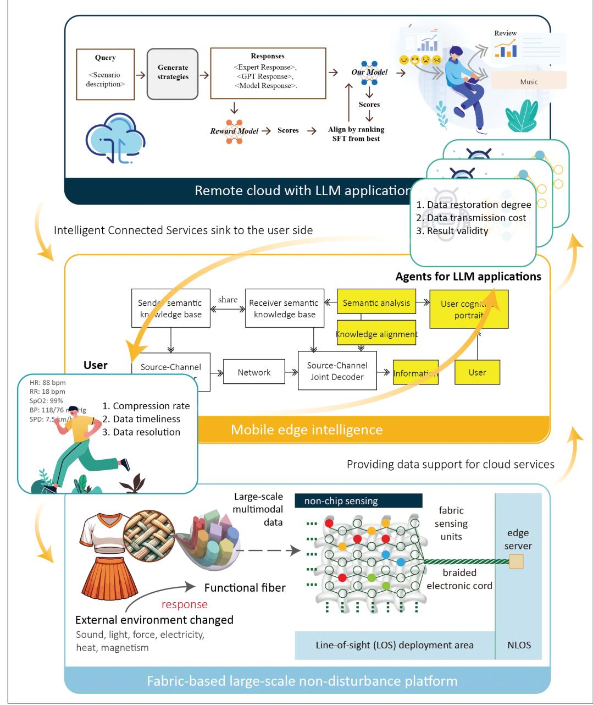
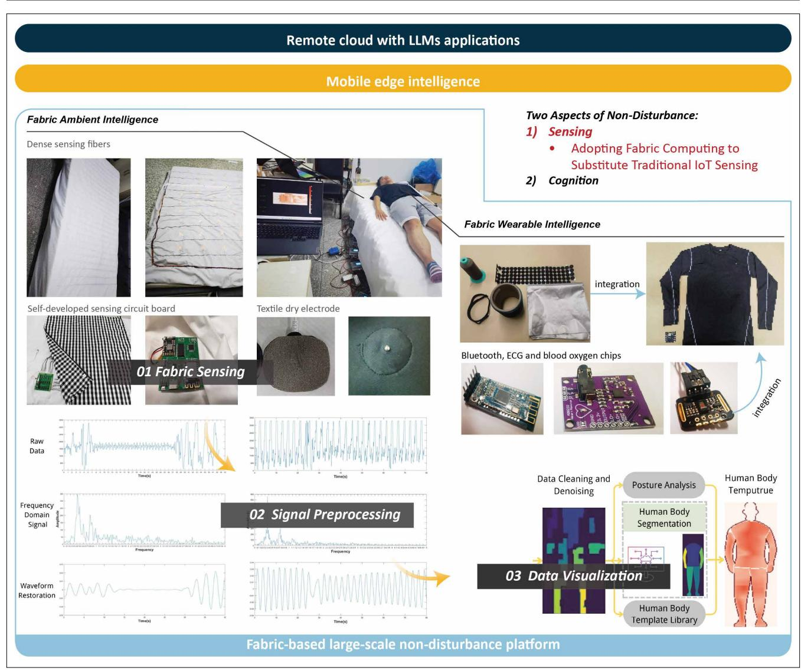
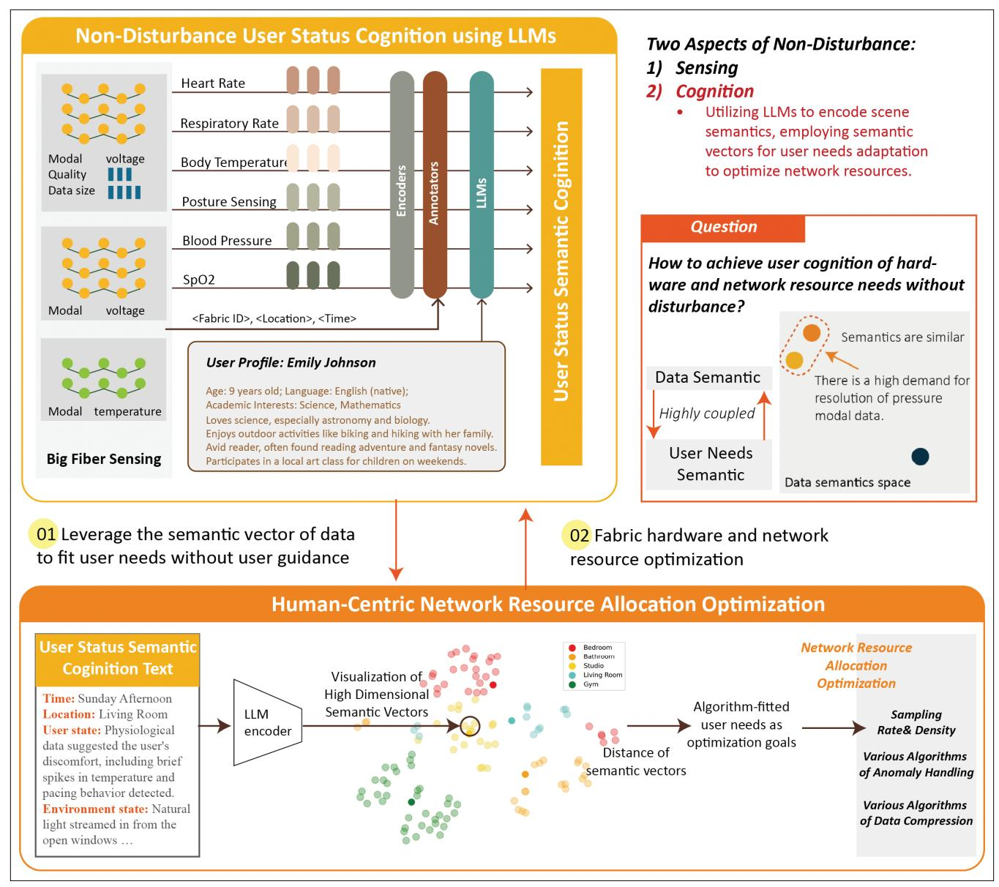
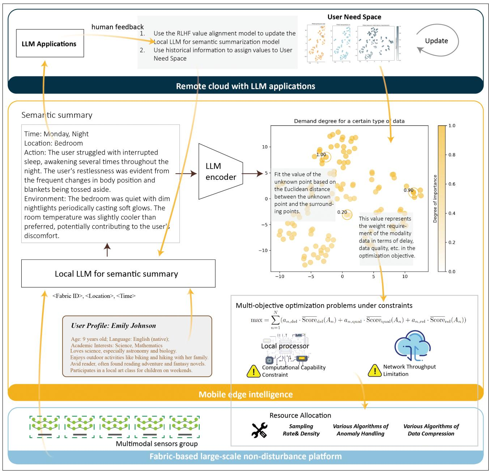
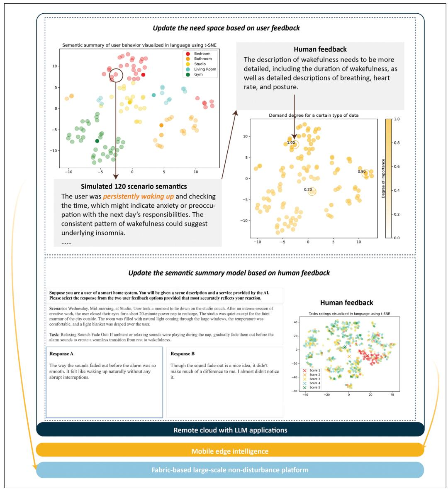
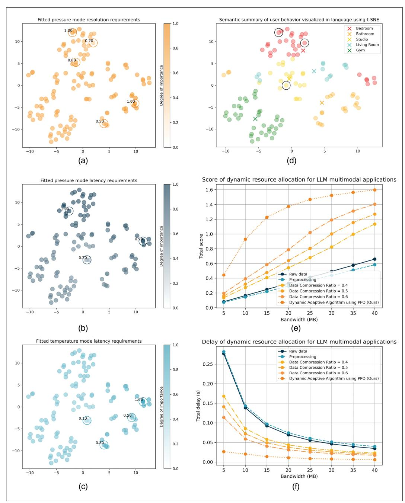

{0}------------------------------------------------

# BigFiberNet: LLMs and Fabric Computing Empowered Large-Scale Non-Disturbance Mobile Sensing Networks

Jia Liu 📵, Yixue Hao 📵, Zhicai He 📵, Min Chen 📵, Long Hu 📵, and Gang Wei 📵

#### **ABSTRACT**

Benefiting from 5G advancements, the integrated sensing and communication capability nowadays is further enhanced by the emerging intelligence of large language models (LLMs), which are reshaping various mobile applications. In parallel, fabric computing technology demonstrates unique potential for measuring physical parameters, complementing 5 G and LLM capabilities in communication and data analytics. Its inherent user-friendliness and seamless integration into daily life enable non-disturbance sensing. However, the limited computing capacity and network bandwidth of edge fabric devices restrict the functionality of LLMs. Ultra-dense multimodal sensory data will guickly reach the system storage limit and block data transmission. When fabric computing meets with 5G and LLMs, this article proposes "BigFiberNet", a novel architecture for large-scale mobile networks that enables non-disturbance sensing and cognition. Given the flexibility and diversity of LLM tasks, user demands for multimodal data vary depending on the contextual scenario. BigFiberNet dynamically extracts semantics from raw data, tailoring it to meet diverse user requirements based on semantic relevance. This allows the LLMs to derive insights from human activities and physiological health metrics efficiently. We implement the BigFiberNet platform, demonstrating its scalability and adaptability through experiments and case studies.

#### **INTRODUCTION**

The advent of large language models (LLMs) opens a new era in artificial intelligence (AI), characterized by their scale and exceptional performance. However, the future application of LLMs in the multimodal domains faces several challenges, particularly in supporting diverse data sources. Without a continuous influx of new data, the scope for optimization becomes constrained [1], [2]. While LLMs are built upon vast repositories of human knowledge and historical data, their ability to generate new insights diminishes once existing datasets are fully exploited [3]. Therefore, a steady supply of sensory data is crucial

for the continued evolution of LLMs. Identifying and integrating novel data sources will be key to advancing machine intelligence.

As a result, there is an increasing demand for a large-scale sensing platform capable of capturing multimodal data. This platform must address two primary requirements: (1) continuous acquisition and efficient transmission of large-scale multimodal data in mobile networks; and (2) support for non-disturbance, multi-user applications at both the sensing and cognition levels.

To enable non-disturbance, large-scale data collection at the sensing level, conventional IoT approaches face notable limitations in adaptability, cost, and usability, particularly in indoor environments. In contrast, fabric-based solutions seamlessly integrate into daily life, offering both sensing and interaction capabilities [4]. As devices become more inconspicuously embedded in our routines, the physical world is increasingly mirrored in the digital realm, enabling knowledgeable-driven services. Multifunctional fibers and smart textiles enhance these platforms by providing flexibility, wearability, and adaptability to diverse conditions [5], [6].

Due to the intrinsic feature of its compatibility between human living with imperceptible sensing, the long-term human body signals and behavioral data collections are realized at fabric intelligent space in a non-disturbance fashion. Then, the accumulative data becomes "big" to model personalized human twins.

Moreover, the exceptional semantic understanding capabilities of LLMs make it possible to achieve non-disturbance, user-driven cognition [7], [8]. By leveraging high-dimensional semantic vector representations, which reveal correlations within data, LLMs can predict application requirements, such as data compression rates, timeliness, and bandwidth management, without explicit user input. This enables seamless optimization of hardware and network resources in dynamic environments, supporting the evolving needs of multiple users.

In this study, we proposed a large-scale sensing platform built on fabric computing technology, which creates a comprehensive, human-centric

Digital Object Identifier: 10.1109/MNET.2024.3519187 Date of Current Version: 15 July 2025 Date of Publication: 17 December 2024 Jia Liu, Yixue Hao (corresponding author), and Long Hu (corresponding author) are with the School of Computer Science and Technology, Huazhong University of Science and Technology, Wuhan 430074, China; Zhicai He is with the School of Materials Science and Engineering, South China University of Technology, Guangzhou 510640, China; Min Chen (corresponding author) is with the School of Computer Science and Engineering, South China University of Technology, Guangzhou 510640, China, and the Pazhou Laboratory, Guangzhou 510640, China; Gang Wei is with the School of Electronic and Information Engineering, South China University of Technology, Guangzhou 510640, China:

{1}------------------------------------------------

sensing environment by integrating data from users' daily experiences. The system employs an LLMsbased encoder to pre-encode collected multimodal data, constructing a detailed semantic space of user needs. The platform dynamically adjusts and accurately predicts user requirements by analyzing historical interaction preferences and the semantic similarity of data from newly connected applications. Finally, by optimizing resource allocation, we improve hardware utilization and task processing efficiency while reducing system latency.

The contributions of this paper are as follows:

- 1. This paper introduces "BigFiberNet", a novel architecture for large-scale, non-disturbance mobile sensing networks, leveraging the synergy of fabric computing, 5G technology, and LLMs. The platform can achieve non-disturbance data sensing and cognition, enabling efficient data transmission.
- 2. To enhance the system's response speed and processing efficiency, this paper proposes a data precoding and resource optimization strategy leveraging a large language model. By encoding data into semantic vectors, a precise semantic space of user needs is constructed, and dynamically adjusted through historical interaction preferences and semantic similarity of newly connected applications. Additionally, resource allocation is optimized to significantly enhance hardware utilization, improve task efficiency, and minimize system latency.
- 3. We demonstrate the scalability and adaptability of the platform through experiments and real-world case studies, showcasing its potential for widespread deployment in areas such as healthcare, human-computer interaction, smart homes, and personal fitness.

The remainder of this paper is organized as follows. We first discuss the key design issues of the proposed platform. Next, we detail the algorithmic optimization problem and its transformation. Subsequently, we introduce the large-scale non-disturbance fabric sensing testbed, including experimental setup and evaluation. Finally, we conclude with insights and directions for future work.

# Design Issues

Developing a large-scale sensing platform supported by fabric computing technology requires integrating advancements in sensing, visualization, AI embedding, and functional fibers. Leveraging these cutting-edge technologies, the platform delivers a robust, scalable, and user-friendly solution for diverse applications, including sports and healthcare. The subsequent sections outline the critical design aspects of this platform. Future research could explore deeper integration and optimization of these components, pushing the boundaries of human activity monitoring technologies.

### Non-Disturbance Sensing Platform Design

Creating an advanced large-scale sensing platform for human activity monitoring necessitates addressing challenges in implementation, user comfort, and data management. This entails designing a non-disturbance system that captures detailed motion while efficiently managing the increasing data traffic generated by a growing number of connected devices. The platform The system employs an LLMs-based encoder to pre-encode collected multimodal data, constructing a detailed semantic space of user needs.

focuses on two key challenges in achieving non-disturbance sensing and cognition:

- Non-Disturbance Sensing: This involves continuously capturing and transmitting multimodal data without disrupting users' natural behavior or daily activities. To achieve this, the sensing components must be highly adaptable, unobtrusive, and capable of maintaining accuracy in diverse and dynamic environments. The design must ensure efficient data handling, scalability, and minimal user burden while preserving high data fidelity.
- Non-Disturbance Cognition: This challenge focuses on achieving precise, context-aware understanding of user needs without requiring explicit input. The system must dynamically interpret and predict user intentions based on historical data and real-time contexts. This demands sophisticated algorithms capable of adapting to changing user behaviors, maintaining responsiveness, and optimize system resources to meet user needs seamlessly. Additionally, the platform must ensure unobtrusiveness and robust privacy protection.

### Functional Fiber-EnhancedUser Status Cognition

Functional fibers are pivotal in advancing user status cognition, significantly enhancing intelligent fabrics across various applications. In healthcare, these fabrics enable continuous monitoring of critical physiological parameters, such as cardiac signals, essential for detecting arrhythmias and other abnormalities. This innovation supports remote patient care, facilitating real-time health management (Smith et al. [\[9\]](#page-10-8)). By bridging the gap between traditional health monitoring and modern wearable technology, functional fibers offer greater flexibility, comfort, and accessibility.

Beyond healthcare, functional fibers are widely used in fields such as fitness, human-computer interaction, safety monitoring, and environmental sensing. In human-computer interaction, they enable gesture-based device control, enhancing intuitive and seamless user interfaces (Kim et al. [\[10\]\)](#page-10-9). For elderly care, these fabrics monitor daily activities, including movement and fall detection, thereby improving safety and quality of life for older adults (Lee et al. [\[11\]\)](#page-10-10). In fitness, functional fibers help track biomechanical parameters to optimize training routines and minimize injury risks. Additionally, these fibers are employed in environmental sensing to monitor factors such as temperature and humidity, providing insights that enhance user comfort and adapt to changing ambient conditions.

These diverse applications underscore the transformative potential of functional fibers in enabling intelligent systems to better understand and respond to user needs, marking significant advancements in large-scale user status cognition.

### Dynamic Strategies forNetwork Resource Allocation

LLMs' flexibility and diversity of tasks result in constantly changing user requirements for multimodal data across different scenarios. This variability introduces significant challenges in network 

{2}------------------------------------------------

LLMs' flexibility and diversity of tasks result in constantly changing user requirements for multimodal data across different scenarios.

> resource management and data transmission efficiency. Failure to adapt effectively to dynamic user needs can lead to wasted network resources, data transmission bottlenecks, and degraded system performance.

> In response to these challenges, recent research has proposed several strategies for optimizing network resource allocation. For instance, Zhang et al. [\[12\]](#page-10-11) introduced a diversity-driven proactive caching strategy designed to improve mobile network efficiency. This approach leverages a convolutional perspective to improve the Quality of Service (QoS) of content services, with a specific focus on content diversity. Similarly, Thantharate and Beard [\[13\]](#page-10-12) developed an adaptive resource management framework for network slicing in 5G and future 6G systems, leveraging transfer learning techniques to enhance resource allocation and network load prediction. Furthermore, Hao et al. [\[14\]](#page-10-13) proposed a DT-assisted robust task offloading scheme that optimizes latency and energy consumption by addressing the uncertainties between digital twin estimates and physical entity values, demonstrating enhanced performance in dynamic mobile edge networks.

# BigFiberNet Architecture

Considering the increasing demand for continuous, large-scale multimodal data acquisition to enhance the capabilities of large language models, we introduce the BigFiberNet architecture. This platform addresses the challenges of non-disturbance, multi-user applications by seamlessly integrating fabric-based sensing technology with edge intelligence and cloud computing.

As depicted in Fig. [1,](#page-3-0) the BigFiberNet consists of three main components: the fabric-based large-scale non-disturbance platform, mobile edge intelligence, and remote cloud. The fabric-based platform, illustrated in Fig. [2,](#page-4-0) is responsible for detecting multimodal physical signals, which are transmitted to edge servers for processing and ultimately integrated in the cloud to deliver a wide range of services.

Fabric-based terminal devices, using functional fibers, detect environmental changes such as sound, light, or force. These changes alter the fiber's shape or optical properties, affecting the propagation characteristics of light within the fiber, such as loss, refractive index, and phase. By tailoring the fibers' design and materials, the system achieves highly sensitive detection of diverse physical quantities.

Data from the fabric layer support semantic summarization through a local LLM within the edge layer, as depicted in Fig. [4.](#page-6-0) Task characteristics determine the offloading of user demand space, maintained in the cloud, to the edge for reasoning. Within the edge intelligence layer, semantic summaries are encoded into high-dimensional vectors. User demand is inferred by calculating the distances between these vectors. To optimize resource allocation under network constraints, multi-objective optimization is applied, ensuring efficient resource distribution while meeting network requirements.

The edge intelligence layer performs preliminary data processing, reducing latency by handling computationally intensive tasks closer to the data source (Fig. [5](#page-7-0)). This enables real-time analytics and rapid responses, crucial for applications like healthcare monitoring and industrial automation. Once processed at the edge, the data undergo further refinement in the cloud, where more sophisticated models and algorithms extract valuable insights. The cloud layer leverages its vast computational power to handle large-scale data analytics, synthesizing information from multiple edge nodes to develop a comprehensive understanding of user demands and environmental contexts. Additionally, the cloud layer continuously adapts and refines models based on new data, enhancing the accuracy and relevance of insights provided to end users.

# Algorithm Details of Optimization Problem

In the fields of big data and artificial intelligence, LLMs are being increasingly adopted. However, their flexibility and the diversity of their processing tasks present new challenges for system design. This is particularly evident in multimodal data processing, where the complexity and dynamic nature of user needs demand real-time adjustments and optimization of resource allocation to adapt to changing scenarios. This study focuses on developing a strategy to dynamically allocate network resources and efficiently perform semantic compression, ensuring that users' latent needs are met and data are transmitted effectively across various application contexts, as illustrated in Fig. [3](#page-5-0).

### Problem Description

We observe that users' habits and preferences are often reflected in the semantic similarity between their behavior and the data content. For instance, when users require high semantic fidelity in a specific context, they often exhibit similar preferences, such as low latency and high bandwidth. Therefore, accurately understanding and predicting users' data needs across different modalities is key to improving system efficiency and user satisfaction.

To address these challenges, this study adopts the following strategies:

- 1. Pre-Coding of Semantic Information: The collected multimodal data are pre-coded using the encoding function of the LLMs. This step constructs a semantic space that represents user needs, forming a foundation for subsequent data processing and resource allocation.
- 2. Analysis of Historical Interaction Preferences: By analyzing users' historical interaction data, the system assigns values to the pre-coded semantic space. This analysis enhances the system's understanding of user behavior and improves the accuracy of future demand predictions.
- 3. Demand Fitting Based on Semantic Similarity: For newly connected applications, the system matches data with the semantic similarity of users' existing needs, allowing for precise adjustments in the processing strategy for multimodal data.

{3}------------------------------------------------

FIGURE 1. BigFiberNet Architecture. A novel framework for large-scale non-disturbance mobile sensing networks. It comprises three primary layers: the fabric-based non-disturbance sensing layer, the mobile edge intelligence layer, and the remote cloud layer.

4. Resource Optimization Algorithm: Under conditions of limited resources and dynamic demand, the Proximal Policy Optimization (PPO) algorithm is used to optimize resource allocation. This approach enhances hardware utilization, boosts task processing efficiency, and significantly reduces response time and system latency through parallel optimization techniques.

These integrated strategies address the dual challenges of efficient data transmission and optimized service quality across varying user needs and application scenarios. The methodology presented in this study offers both theoretical and practical insights for designing future multimodal data processing systems, particularly in resource-constrained environments with dynamically changing requirements.

## Problem Transformation

We define the problem along two main dimensions: 1) Facilitating the extraction of semantic data to identify latent user needs. 2) Minimizing latency while maximizing data quality to meet the diverse requirements of various applications.

1. *Semantic-Driven User Demand Fitting:* Semantic information originates from the multimodal physical quantities sensed by smart fabric sensors. Assuming that fabric nodes can sense various types of physical quantities such as pressure, temperature, and inertia, these can be represented as s1, s2, …, sm, …,

{4}------------------------------------------------

**FIGURE 2.** Fabric-based large-scale non-disturbance sensing platform. The hardware platform integrates advanced chips and provides both raw data and preprocessing results. It supports two types of intelligence: ambient intelligence and wearable intelligence. For ambient intelligence, a multimodal sensing mattress is deployed, capable of detecting pressure, posture, temperature, breathing, and heart rate. For wearable intelligence, intelligent clothing monitors physiological indicators such as heart rate, blood oxygen levels, ECG, and blood pressure. All hardware connections in the smart fabrics use flexible conductive fibers, with metal electrodes replaced by flexible textile dry electrodes for improved comfort and usability.

sM, where *M* denotes the number of sensor types. Combining the sensor's deployment location and current time with other auxiliary information, we can use an LLM to generate descriptions of the current state of users or the environment. Subsequently, we utilize the encoder of the large language model to obtain a high-dimensional space representation of the semantic information directly from these inputs. The process of generating the semantic description and its encoding into a high-dimensional vector is formally represented as:

Semantic information is derived from the multimodal physical quantities sensed by smart fabric sensors, as shown in Fig. [4](#page-6-0). These sensors capture data such as pressure, temperature, and inertia, which can be represented as s1, s2, …, sm, …, sM, where *M* denotes the number of sensor types. By incorporating additional contextual information, such as the sensor's deployment location and the current time, an LLM can generate descriptive summaries of the user's or environment's current state. The LLM's encoder then transforms these descriptive inputs into high-dimensional vector representations of the semantic information. Formally, this process is represented as:

$$v = \text{Encoder}_{\text{LLM}}(\text{LLM}(s_1, s_2, \dots, s_m, \dots, s_M, \text{loc, time}))$$
(1)

By deeply analyzing users' historical interaction data, we can further refine the assignment of values within this pre-encoded semantic space, improving both response quality and system accuracy. For instance, user feedback such as "The description of wakefulness needs more detail, including duration, breathing, heart rate, and posture" reflects a specific demand for high-quality, detailed multimodal data.

{5}------------------------------------------------

**FIGURE 3. LLMs-based non-disturbance cognition platform.** To address the variability in user demand for multimodal perception data under network and hardware constraints, the platform leverages data semantic relevance to adapt to changing user needs. The PPO algorithm is employed for dynamic allocation of hardware and network resources.

To ensure seamless integration of newly accessed applications, precise matching is performed based on the semantic similarity between the incoming data and existing user demands, as shown in Fig. 5. This is achieved by calculating the distance between vectors in the high-dimensional semantic space, ensuring that new applications align with specific user needs. The demand value V for these modal data is formally represented as:

$$V = \frac{\sum_{\mathbf{u} \in \text{History}} \left( \frac{\mathbf{v} \cdot \mathbf{u}}{\|\mathbf{v}\| \|\mathbf{u}\|} \times \text{Value}(\mathbf{u}) \right)}{\sum_{\mathbf{u} \in \text{History}} \frac{\mathbf{v} \cdot \mathbf{u}}{\|\mathbf{v}\| \|\mathbf{u}\|}}$$
(2)

where  $\mathbf{v}$  is the demand value vector for the newly accessed application,  $\mathbf{u}$  represents vectors from historical data, each corresponding to a data point

in the historical records, and History is the collection of all historical data vectors.

2. Dynamic Network Resource Allocation: In this system, we encounter significant challenges in allocating virtual sensors and bandwidth resources to meet the diverse demands of various applications. The objective is to develop optimal resource allocation strategies that consider the specific demands for latency, accuracy, and reliability, thereby maximizing performance metrics. At the fabric network layer, multiple applications denoted as An (where n ranges from 1 to N), are managed. Each application has unique requirements for latency, accuracy, and reliability.

The processing of raw data involves several steps:

 Extraction: Raw data are collected directly from specific locations within sensor blocks.

{6}------------------------------------------------

**FIGURE 4.** Illustration of LLM-empowered Mobile Edge Intelligence for Resource Optimization with User Need Alignment. This figure shows the data flow within the three-layer structure. The fabric layer collects data to support the local LLM in the edge layer for semantic summarization. The user demand space, maintained in the cloud, is offloaded to the edge for reasoning based on task characteristics. In the edge intelligence layer, semantic summaries are encoded into high-dimensional vectors and user demands are inferred through vector distance calculations. Finally, multi-objective optimization is performed based on user demand, considering network constraints to efficiently allocate resources.

- 2. Preprocessing: To ensure data integrity, this step involves pre-processing tasks such as missing value imputation and outlier handling. Additionally, we consider data compression methods like Huffman Encoding and Lempel-Ziv-Welch.
- 3. Data Fusion: This step consists of integrating location information from sensor blocks.

To meet demands for latency, accuracy, and reliability, we address computational load, data size, and accuracy. Each sensor block is equipped with a microprocessor that handles computations, with the computational bandwidth for each application constrained by the microprocessor's

capacity. Additionally, the limited network bandwidth necessitates careful allocation of transmission bandwidth across applications.

Processing delays are calculated as the sum of data processing times across all sensors and blocks, normalized by the assigned computational bandwidth. Similarly, transmission delay is determined by aggregating transmission times and adjusting for the allocated network bandwidth.

Data quality is assessed through a quality metric aggregated across sensors and blocks, reflecting how well data processing and transmission meet the specific accuracy and reliability requirements of each application.

{7}------------------------------------------------

FIGURE 5. Experimental Example of LLM Application in the Remote Cloud Layer of the Proposed BigFiber-Net. The cloud layer mainly updates and maintains two models: the user demand space model and the data semantic summary model. First, the user's specific evaluation of data semantics is used to assign values within the multimodal demand space. Additionally, user feedback on the semantic summaries, combined with a value alignment model, is employed to refine and update the semantic summary model.

To evaluate the overall performance of the network system, we consider processing delay, transmission delay, and data accuracy as key performance metrics. The optimization objective is to calculate a composite score that captures the efficiency and effectiveness of resource allocation tailored to the unique requirements of each application. This composite score, denoted as  $Score_{all}$ , is a weighted sum of individual scores assigned to each application,  $Score(A_n)$ , where the weights  $V_n$  reflect the importance and demand profile of each application as determined from prior assessments.

The equation for the composite score is given by:

$$\max Score_{\text{all}} = \sum_{n=1}^{N} Score(A_n)V_n$$
 (3)

Where each application  $A_n$  contributes to the overall score based on its individual performance score  $Score(A_n)$  and its corresponding weight  $V_n$ . These weights are derived from a method that assesses each application's specific needs for latency, accuracy, and reliability, thus guiding the resource allocation process to optimize overall system performance.

Referring to the problem design and solution method described in the paper [15], we employ the PPO algorithm to solve this optimization problem.

## Large-Scale Non-Disturbance Fabric Sensing Testbed

In this study, we conducted simulations using semantic summary data of daily activities from a sample of 120 users to investigate optimal

{8}------------------------------------------------

**FIGURE 6.** Performance Evaluation on the BigFiberNet Testbed. This figure presents the simulation results of semantic summary data from 120 users' daily activities, focusing on optimal resource allocation under unknown user needs with three concurrent applications. a) Simulation based on 5 historical user interaction records, highlighting the importance of pressure modal data resolution in relation to semantic similarity. b) Users' delay sensitivity requirements for pressure modal data, derived from 3 historical interaction records. c) Users' delay sensitivity requirements for temperature modal data, based on 4 historical interaction records. d) Semantic representations of multimodal data requirements for three concurrent LLM applications, represented as the circled points. e) Total score of various resource allocation strategies as total network bandwidth changes. f) Total delay under different resource allocation strategies as the total network bandwidth varies.

resource allocation strategies under concurrent usage across three distinct applications. This goal was to efficiently allocate resources in response to dynamic, non-predetermined user demands. By analyzing semantic data, we developed a predictive model to optimize resource distribution, thereby enhancing system performance in realtime applications.

We implemented a Large Scale Fabric Sensing Testbed for the research and development of smart sensing fabrics, as illustrated in Fig. [2](#page-4-0). The seamless detection capabilities of smart fabrics significantly expand the dimensionality of data collection, surpassing common data types such as images, audio, text, and depth. Leveraging the non-intrusive sensing technologies 

{9}------------------------------------------------

of metamaterials, additional physical information, such as pressure and temperature, can be extracted from the surrounding environment. Additionally, various sensor array layouts provide multiple reference points for spatial data analysis, further enriching the dimensionality of the data.

### Experimental Platform

We constructed a 2×1 m high-density sensor array in fabric form to demonstrate the reliability of multi-dimensional data, as shown in Fig. [2](#page-4-0). The sensing fabric unit integrates miniaturized flexible sensors and composite conductive fibers woven into pure cotton fabric. These bendable and stretchable sensors convert temperature changes and mechanical deformations into electrical signals, measuring parameters such as pressure, tension, strain, temperature, and vibration, thereby enhancing the fabric's functionality.

The deep sleep monitoring system comprises hardware and a cloud-based data analysis platform. The hardware includes the sensing fabric unit, which employs point and strip thinfilm resistive pressure sensors and negative temperature coefficient (NTC) thermistors. The miniaturized thin-film resistive pressure sensors offer high sensitivity and accuracy in detecting external stress changes and allow for high-density deployment. The NTC thermistors exhibit exponential resistance changes with temperature variations, providing high sensitivity and rapid response.

The algorithmic unit features a custom-designed sensor signal acquisition system capable of highspeed data collection at up to 500 Hz per sensor. A micro-computing unit preprocesses and integrates the data, eliminating interference. Data is transmitted via wired communication to a terminal, where time-domain and frequency-domain analyses extract basic pressure and temperature signals, as well as indicators like heart rate, respiratory rate, temperature array, and pressure array. Real-time monitoring enables timely detection of sleep apnea syndrome. Processed data is uploaded to the cloud for long-term storage and advanced analysis. Leveraging cloud computing, pressure and temperature array data are integrated for vital sign detection. The system evaluates movements, postures, and trajectories, assigns sleep quality scores according to medical standards, and delivers sleep monitoring reports to the user. Additionally, three-dimensional modeling of individuals is achieved using posture trajectory data.

## Experimental Parameter Settings

The fabric space incorporates three types of sensing fiber: Temperature Sensing Fiber, Conventional Pressure Sensing Fiber, and Micro-motion Pressure Sensing Fiber. A universal data acquisition module, serving as an edge processor, connects 16 multifunctional fiber channels to a collection device. The system calculates physical quantities based on voltage variations, using an ATMEGA328PAU microprocessor with a 20 MHz clock cycle. The sampling system operates on the Arduino platform, storing 8 Bytes per sample at a 32 Hz sampling rate, resulting in a total data volume of 4 kB per second for all 16 channels. Data are transmitted via an ESP-12F In this paper, we have introduced "BigFiberNet", a novel architecture that integrates fabric computing, 5G technology, and LLMs to enable large-scale, non-disturbance mobile sensing networks.

WiFi 4 (802.11n) module using the UDP protocol, with each data packet capped at 1 kB . In the virtualization layer, three types of virtual sensors are employed: Virtual Sensor 0 acquires raw data with adjustable sampling rates up to 32 Hz , Virtual Sensor 1 handles anomalies using sliding filtering and mean filling, requiring at least 11 clock cycles per sample, and Virtual Sensor 2 compresses data using a lossless entropy algorithm, which achieves a compression rate of approximately 70% and requires approximately 12 instructions per bit saved.

We assume the availability of historical data to infer user preferences. Historical data points reflecting user preferences are circled in Fig. [6\(a\)–](#page-8-0)(c). The values of the remaining test data are derived by fitting the similarity of their semantic vectors.

### Performance Evaluation

We simulated semantic summary data for 120 scenarios, encoding them using the GPT-4 encoder. The numerical values from the final hidden layer were extracted and mapped onto a two-dimensional plane using the t-SNE algorithm, as shown in Fig. [6\(d\)](#page-8-0).

Fig. [6\(d\)](#page-8-0) displays selected data from three concurrent LLM applications among the 120 semantic data points. We hypothesize that the semantic representations of the multimodal data required by these correspond to the circled points in the figure. Using the cosine distance between these points and known points, we fitted the importance weights of user demands for this modality, as shown in formula 2. The resulting optimization problem is then formulated in formula 3.

To solve this optimization problem, we employ the PPO algorithm. Fig. [6\(e\)](#page-8-0) and (f), demonstrate the overall performance scores of various resource allocation strategies under fluctuating network bandwidth conditions, as well as the total latency experienced by each category.

The results show that our algorithm consistently achieves higher scores compared to strategies relying on raw data retrieval, unified outlier processing, or fixed data compression rates. As the total bandwidth constraint is gradually relaxed, the overall performance score increases and stabilizes, while total latency decreases and stabilizes. These findings confirm the efficiency of the PPO algorithm in solving such problems.

# Conclusion

In this paper, we have introduced "BigFiber-Net", a novel architecture that integrates fabric computing, 5G technology, and LLMs to enable large-scale, non-disturbance mobile sensing networks. Addressing the diverse and evolving user demands for multimodal data, the system dynamically extracts semantic relevance from various data sources, including audio, video, and physiological signals, enabling efficient processing of complex sensor inputs.

To enhance system performance, we implemented a data precoding and resource optimization 

{10}------------------------------------------------

strategy that combines semantic analysis with user interaction preferences. This approach significantly improved system responsiveness and reduced latency through efficient resource allocation.

Our experiments and case studies demonstrated the scalability and adaptability of "BigFiberNet" across various domains, including healthcare, human-computer interaction, smart homes, and personal fitness. Although challenges remain regarding the computational power of edge devices and network bandwidth, the integration of advanced algorithms and resource management strategies mitigates these limitations. Looking ahead, future work will focus on overcoming these challenges and further expanding the practical applications of "BigFiberNet" in real-world scenarios.

### Acknowledgment

This work was supported in part by the National Natural Science Foundation of China (NSFC) under Grant 62176101 and Grant 62276109, in part by the Guangdong Basic and Applied Basic Research Foundation under Grant 2024 A 1515030017 and Grant 2024 A 1515011153, and in part by the Guangdong International Science and Technology Cooperation Foundation under Grant 2020A0505100002.

#### References

- [\[1\]](#page-0-0) A. Chowdhery et al., "PaLM: Scaling language modeling with pathways," *J. Mach. Learn. Res.*, vol. 24, no. 240, pp. 1–113, 2023.
- [\[2\]](#page-0-1) Y. Tang et al., "MiniGPT-3D: Efficiently aligning 3D point clouds with large language models using 2D priors," in *Proc. 32nd ACM Int. Conf. Multimedia*, Oct. 2024, pp. 6617– 6626.
- [\[3](#page-0-2)] P. Villalobos et al., "Position: Will we run out of data? Limits of LLM scaling based on human-generated data," in *Proc. 41st Int. Conf. Mach. Learn.*
- [\[4](#page-0-3)] Y. Liu et al., "A large-scale fabric-based stretch sensing system for crowd activity capturing," *Sensors*, vol. 18, no. 10, p. 3429, 2018.
- [\[5\]](#page-0-4) C. Martinez, E. White, and R. Nelson, "Wearable textile-based sensors for optimizing athletic training routines," *J. Sports Eng. Technol.*, vol. 236, no. 3, pp. 189–201, 2022.
- [\[6](#page-0-5)] J. Johnson, S. Miller, and T. Brown, "Smart textile sensors for real-time gait analysis in post-stroke rehabilitation," *J. Rehabil. Assistive Technol.*, vol. 8, no. 1, p. 4255, 2021.
- [\[7](#page-0-6)] B. Zheng et al., "Adapting large language models by integrating collaborative semantics for recommendation," in *Proc. IEEE 40th Int. Conf. Data Eng. (ICDE)*, May 2024, pp. 1435–1448.
- [\[8](#page-0-7)] L. Yu et al., "SPAE: Semantic pyramid autoencoder for multimodal generation with frozen LLMs," in *Proc. Adv. Neural Inf. Process. Syst.*, vol. 36, 2024.
- [\[9](#page-1-0)] J. Smith, J. Doe, and A. Turing, "Wearable textile-based sensing system for continuous cardiac monitoring," *J. Med. Eng. Technol.*, vol. 46, no. 2, pp. 128–139, 2022.
- [\[10\]](#page-1-1) M. Kim, L. Johnson, and D. Clarke, "Smart textile-based gesture recognition system for human–computer interaction," *J. Interact. Technol. Syst.*, vol. 15, no. 4, pp. 220–234, 2021.
- [\[11\]](#page-1-2) J. Lee, T. Green, and S. Wilson, "A smart textile-based wearable system for elderly motion monitoring and fall detection," *J. Geriatric Care Technol.*, vol. 7, no. 1, p. 1227, 2022.
- [\[12\]](#page-2-0) Y. Zhang et al., "Diversity-driven proactive caching for mobile networks," *IEEE Trans. Mobile Comput.*, vol. 23, no. 7, pp. 7878–7894, Jul. 2024.

- [[13\]](#page-2-1) A. Thantharate and C. Beard, "ADAPTIVE6G: Adaptive resource management for network slicing architectures in current 5G and future 6G systems," *J. Netw. Syst. Manage.*, vol. 31, no. 1, p. 9, Jan. 2023.
- [[14](#page-2-2)] Y. Hao et al., "Digital twin-assisted URLLC-enabled task offloading in mobile edge network via robust combinatorial optimization," *IEEE J. Sel. Areas Commun.*, vol. 41, no. 10, pp. 3022–3033, Oct. 2023.
- [[15\]](#page-7-1) Y. Hao, L. Hu, and M. Chen, "Joint sensing adaptation and model placement in 6G fabric computing," *IEEE J. Sel. Areas Commun.*, vol. 41, no. 7, pp. 2013–2024, Jul. 2023.

#### Biographies

Jia Liu [\(liujia0330@hust.edu.cn](mailto:liujia0330@hust.edu.cn)) received the bachelor's degree in computer science and technology from the University of Electronic Science and Technology of China (UESTC), China, in 2020. She is currently pursuing the Ph.D. degree with the Embedded and Pervasive Computing (EPIC) Laboratory, School of Computer Science and Technology, Huazhong University of Science and Technology (HUST), China. Her research interests include the Internet of Things and fabric computing.

Yixue Hao [\(yixuehao@hust.edu.cn\)](mailto:yixuehao@hust.edu.cn) received the Ph.D. degree in computer science from the Huazhong University of Science and Technology (HUST), Wuhan, China, in 2017. He is currently an Associate Professor with the School of Computer Science and Technology, HUST. His Google Scholar Citations reached more than 7,523 with an H-index of 33 and i10-index of 53. He was named in Clarivate Analytics Highly Cited Researchers List in 2020. His current research interests include cognitive computing, edge computing, and multi-agent reinforcement learning.

Zhicai He ([zhicaihe@scut.edu.cn\)](mailto:zhicaihe@scut.edu.cn) received the Ph.D. degree in materials physics and chemistry from the South China University of Technology (SCUT) in 2013. He is currently a Professor with the School of Materials Science and Engineering, SCUT. He received more than 9,000 citations and authored six ESI highly cited papers. He was a recipient of the National Natural Science Award (Second Prize) and the Ministry of Education Natural Science Award (Second Prize) for his contributions to high-efficiency organic solar cells. Additionally, he was awarded the 2015 China Optical Society Important Achievement Award.

Min Chen (Fellow, IEEE) ([minchen@ieee.org](mailto:minchen@ieee.org)) is currently a Full Professor with the School of Computer Science and Engineering, South China University of Technology. He is also the Director of the Embedded and Pervasive Computing (EPIC) Laboratory, Huazhong University of Science and Technology (HUST). His Google Scholar Citations reached more than 48,500 with an H-index of 101. His top article was cited more than 5,000 times. He was a recipient of the IEEE Communications Society Fred W. Ellersick Prize in 2017, the IEEE Jack Neubauer Memorial Award in 2019, and the IEEE ComSoc APB Oustanding Paper Award in 2022. He is the Founding Chair of the IEEE Computer Society Special Technical Communities on Big Data. He was selected as a Highly Cited Researcher from 2018 to 2024.

Long Hu ([hulong@hust.edu.cn\)](mailto:hulong@hust.edu.cn) was a Visiting Student with the Department of Electrical and Computer Engineering, The University of British Columbia, from August 2015 to April 2017. He is currently an Associate Professor with the School of Computer Science and Technology, Huazhong University of Science and Technology (HUST), China. His current research interests include the Internet of Things, artificial intelligence and mobile cloud computing.

Gang Wei [\(ecgwei@scut.edu.cn](mailto:ecgwei@scut.edu.cn)) was born in January 1963. He received the B.Sc. degree from Tsinghua University in 1984 and the M.Sc. and Ph.D. degrees from the South China University of Technology in 1987 and 1990, respectively. He is currently a Professor with the Department of Electronic Engineering, South China University of Technology. His research interests include AI applications.