{0}------------------------------------------------

> REPLACE THIS LINE WITH YOUR MANUSCRIPT ID NUMBER (DOUBLE-CLICK HERE TO EDIT) <

# Photonics-assisted System for Joint Radar Ranging, Wireless Communications and Spectrum Sensing

Xianshuai Meng, Jilin Zheng, Jin Li, Tao Pu, Hua Zhou, Shuya Liu and Xiaolong Zhao

*Abstract***—A photonics-assisted system for joint radar ranging, wireless communications and spectrum sensing is proposed and experimentally demonstrated. The carrier-suppressed singlesideband (CS-SSB) modulation and polarization multiplexing enable multi-function signal generation on the X-polarization state, concurrently enabling radar ranging and spectrum sensing on the Y-polarization state. Communication signals and radar signals are merged optically using a shared system architecture and hardware to achieve signal level sharing, with de-chirping and spectrum sensing also performed in the optical domain, utilizing the same hardware platform. A filtering structure is employed to differentiate between de-chirping and spectral sensing on the Ypolarization state. The joint system achieves radar ranging with a measurement error of ±3.2 cm, wireless communications at 1 Gbit/s over 1.8 m free space transmission, and precise spectrum sensing with a measurement error within ±3.2 MHz, simultaneously. This study provides a viable technical approach for future integrated sensing and communication scenarios.** 

*Index Terms***—Microwave photonics, wireless communications, microwave frequency measurement, radar detection.** 

## I. INTRODUCTION

HE joint radar, wireless communications, and spectrum sensing system (JRCSS), which is an integrated platform that can unify radar detection, wireless communications and spectrum sensing functionalities rather than independent systems, has already been extensively investigated in the electrical domain [1][2]. However, conventional electronic approaches have faced persistent limitations in overcoming bandwidth-constrained highfrequency complex waveform generation, for their inherent restrictions in system tunability and reconfigurability, proving inadequate for emerging applications requiring ultra-high data rates and precision resolution. Microwave photonics (MWP) provides a new approach to solve these problems, because of its advantages including high frequency, large bandwidth, lowloss transmission, and resistance to electromagnetic interference [3]. T

The ongoing progression in MWP is propelling innovations across multiple domains, driving significant advances in radar architectures and spectrum sensing methodologies. Many advanced photonics-assisted radar, wireless communications, spectrum sensing and dual/multi-function architectures have been studied over the past few decades[4][5][6][7][8]. The first all-optical MWP radar is demonstrated using a mode-lockedlaser (MLL) as an optical frequency comb source (OFC) to generate the transmit signal by photonic heterodyning, and to sample the radar echo with a photonic analog-to-digital converter (ADC) [9]. A photonics-assisted omnidirectional 3D positioning radar array for noncooperative multi-targets is proposed, supplying an alternative for the detection of low, small and slow targets [10]. An optical fiber-wireless integrated system based on optical injection-locked directly modulated lasers demonstrates 40 Gbit/s 16-QAM-OFDM wireless transmission [11]. A hybrid THz photonic-wireless transmission based on a THz orthogonal polarization dualantenna is proposed to demonstrate a potential total system throughput of 612.65 Gbit/s [12]. To obtain the information of the signal under test (SUT), there have been a number of photonics-based microwave frequency measurement approaches, i.e., frequency-to-power mapping (FTPM) and frequency-to-time mapping (FTTM) [13] [14][15]. FTPM can be implemented by using an optical filter or a dispersive element, while the SUT information is estimated from the power ratio[16]. As to FTTM, the unknown frequency information is generally obtained by calculating the electrical time delay of the output photocurrent [17]. A microwave frequency identification system based on FTTM using linear frequency modulation (LFM) signal is proposed, demonstrating single and multiple frequency identification from 2 to14 GHz with the measured frequency errors less than *±*3 MHz [18]. A proof-of-concept experimenst based on optical injection is carried out, achieving measurement range from 3 to 40 GHz with the measured frequency errors below *±*30 MHz [19]. Furthermore, some photonics-enabled dual-function systems,

1

This This work was supported by the National Natural Science Foundation of China under Grant 62201615 and Grant 62371470.

Xianshuai Meng is with the Army Engineering University of PLA, Nanjing, China (e-mail: oceanmeng@foxmail.com).

Corresponding author: Tao Pu is with the Army Engineering University of PLA, Nanjing, China (e-mail: nj\_putao@163.com).

Corresponding author: Jin Li is with the Army Engineering University of PLA, Nanjing, China (e-mail: jinli@aeu.edu.cn).

{1}------------------------------------------------

### > REPLACE THIS LINE WITH YOUR MANUSCRIPT ID NUMBER (DOUBLE-CLICK HERE TO EDIT) <

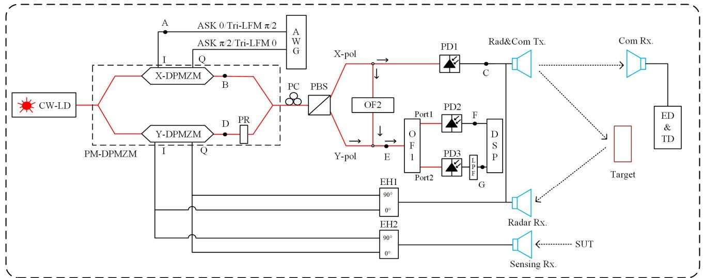

**Fig. 1.** Schematic configuration of the proposed system. CW-LD, continuous-wave laser-diode; PM-DPMZM, polarizationmultiplexed dual-parallel Mach-Zehnder modulator; DPMZM, dual-parallel Mach-Zehnder modulator; PR, polarization rotator; AWG, arbitrary waveform generator; PC, polarization controller; PBS, polarization beam splitter; OF, optical filter; PD, photodetector; LPF, low pass filter; EH, electrical hybrid; DSP, digital signal processing; ED, envelope detection; TD, threshold decision; SUT, signal under test.

such as a simultaneous radar detection and frequency measurement system [15][20], and a joint communications and radar (JCR) architecture based on times-division multiplexing [21], etc., are experimentally investigated. In these dualfunction systems, complex waveform design is necessary , such as orthogonal frequency division multiplexing (OFDM)-LFM [21], QPSK[22], OFDM [23] and quadrature phase shift keying (QPSK)-LFM [24]. Time division multiplexing (TDM) [23] and frequency division multiplexing (FDM) [25] also can be multiplexed in JCR systems. These methods increase the complexity of the coding and decoding architectures.

However, the concurrent integration of radar, wireless communications, and spectrum measurement within a unified platform is exceedingly uncommon. The novel scheme proposed in this work enables the rare, concurrent integration of all three functionalities within a unified system, while requiring no complex waveform design.

In the experiment, the photonics-assisted JRCSS is investigated using CS-SSB modulation and polarization multiplexing. Following electro-optic conversion of the intermediate frequency (IF) ASK and the triangular linear frequency modulation (Tri-LFM) signals, spectrum sensing exploits the optical Tri-LFM part. Concurrently, the modulated optical IF ASK part and the Tri-LFM part are fused after photodetector (PD) for integrated radar-communications functionality, achieving simultaneous high-speed information transfer and radar ranging. The proposed JRCSS supporting radar ranging with a measurement error below 3.2 cm, wireless communications with a data rate of 1Gbit/s and spectrum sensing with a frequency measurement error within 3.2 MHz.

#### II. PRINCIPLES

1

#### *A. Signal Generation*

The diagram of the proposed scheme is presented in Fig.1, and Fig. 2 shows the schematic diagrams of the signals at locations A–G in the system. The continuous-wave (CW) optical wave from the laser goes into a polarization-multiplexed dual-parallel Mach-Zehnder modulator (PM-DPMZM) through a polarization maintaining fiber (PMF). The PM-DPMZM is composed of two DPMZMs and a polarization rotator (PR). The light injected into PM-DPMZM is split into two paths of equal power, with one path entering the X-DPMZM and the other entering the Y-DPMZM. And the X-DPMZM and the Y-DPMZM can load electrical signals independently. When the optical signal output from the Y-DPMZM passes through the PR, its polarization state becomes orthogonal to that of the optical signal output from the X-DPMZM.

For the X-DPMZM, an intermediate frequency (IF) ASK signal and a Tri-LFM signal are loaded on it. The IF ASK signal and Tri-LFM signal have two different phase relationships with one being 0 and /2 and the other being /2 and 0. By applying two signals with distinct phases to I- and Q-arms, the IF ASK and the Tri-LFM signals can both achieve CS-SSB modulation but at opposite sides of the optical carrier. As show in Fig.2(b), the IF ASK signal resides in the lower sideband while the Tri-LFM signal occupies the upper sideband relative to the carrier frequency. Following polarization splitting via the polarization beam splitter (PBS), the signal operated on the X-pol is directed to a photodetector (PD1). The Tri-LFM-ASK can be then generated and sent to transmission antenna for radiation.

## *B. Wireless Communications*

For communications, the Tri-LFM-ASK signal radiated from

{2}------------------------------------------------

transmission antenna can be received by communicationreceiving antenna after free space transmission. The envelope of the ASK signal can be detected, so that the original communication data can be obtained through envelope detection (ED) and threshold decision (TD). In this work, ED and TD are implemented via the digital signal processing (DSP) techniques.

#### C. Radar Ranging

For radar ranging, the echo signal from the radar-receiving antenna is coupled with detection signal through an electrical coupler (EC). These two signals are orthogonally modulated onto the Y-DPMZM. Specifically, the coupled two signals are separated into two orthogonal components by the 90° electrical hybrid (EH1): its 0° output is applied to the I-arm, and its 90° output is applied to the O-arm. Consequently, the CS-SSB modulation for optical de-chirping is achieved on the lower sideband relative to the carrier on the Y-pol, as shown in Fig.2(d). After going through the PBS and a 1×2 optical filter (OF1), the optical de-chirping signal outputs from port1 and the de-chirped IF signal can be detected by PD2, as shown in Fig.2(f). It is noteworthy that the OF1 plays a critical role in this system. Leveraging its unique filtering characteristics, it demultiplexes the optical de-chirping and spectrum sensing processes, directing them to port1 and port2 respectively. The dashed lines in Fig.2(e) illustrates the filtering characteristics of the OF1.

#### D. Spectrum Measurement

The FTTM, whose measurement range is determined by the bandwidth of the LFM signal, is utilized to measure the frequency of the SUT in this work. Specifically, the Tri-LFM signal is employed as the probe signal, whose time-frequency relationship is shown (black line) in Fig.3. The probe signal can be written as

$$f_{P} = \begin{cases} f_{\min} + kt & 0 \le t \le \frac{\tau}{2} \\ f_{\max} - k(t - \frac{\tau}{2}) & \frac{\tau}{2} \le t \le \tau \end{cases}$$

$$k = \frac{2(f_{\max} - f_{\min})}{\tau}$$

$$(1)$$

where  $f_{min}$  and  $f_{max}$  denote the minimum and maximum frequency of the Tri-LFM signal, respectively. k and  $\tau$ represent the chirp rates and the time durations of one sweep period. An electrical low-pass filter (LPF) is utilized to filter the beating signal between the SUT and the Tri-LFM signal (yellow area). For an intercepted single frequency component (red line), a pair of microwave pulses can be generated in one period when the beating frequency  $f_R$  (blue line) between the SUT and probe signal is lower than the stopband of the employed LPF. A temporally varying electrical pulses after the LPF can be generated, which is the mapping of the microwave spectrum. The frequency of SUT can be expressed as

$$f_S = f_{min} + k \left( \frac{\tau - \Delta \tau}{2} \right) \tag{2}$$
 According to (2), a mapping between the SUT frequency  $f_S$  and

pulses interval  $\Delta \tau$  is established.

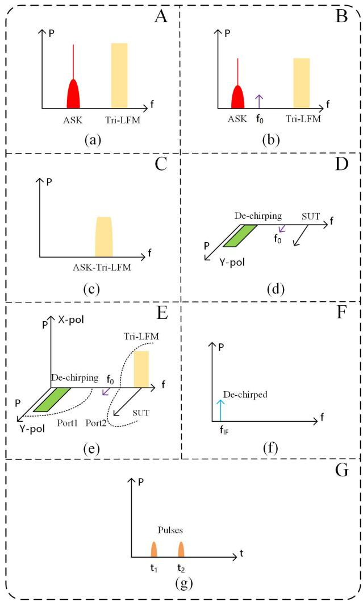

Fig. 2. Spectra and waveforms at different locations (A-G) in proposed scheme.

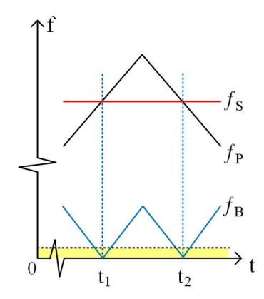

Fig. 3. The principle of the FTTM construction.

{3}------------------------------------------------

In the experiment, the SUT is orthogonally modulated onto the Y-DPMZM via the EH2 and two equal-length cables. But for EH2, its 0° output is applied to the Q-arm and its 90° output is applied to the I-arm. So that the SUT SSB occupies the upper sideband relative to the carrier on the Y-pol, as shown in Fig.2(d). Simultaneously, one part of the optical signal before PD1 is split off via the -3dB optical power splitter and then sent to the OF2. The Tri-LFM sideband passes through the OF2, while other signals are filtered out. The Tri-LFM sideband and the SUT sideband are both located in the upper sideband but with orthogonal polarizations, as shown in Fig.2(e). They are coupled by an optical coupler, fed into the OF1, and then output from port2. Considering PD3 is polarization-insensitive, both the Tri-LFM sideband and the SUT sideband can be detected by the PD3 with equal effectiveness. That is to say, spectrum sensing is performed in this system using the optical Tri-LFM sideband generated from the X-DPMZM. After lowpass filtering, pulse signals exhibiting time intervals dependent on the frequency of the SUT can be detected, enabling the measurement of frequency, as illustrated in Fig.2(g).

# III. EXPERIMENT RESULTS

A wavelength selective switch (WSS) is applied to replace the OF1 and OF2. Specifically, the path In1-to-Port3 displaces the OF2, and the path In2-to-Port1 and Port2 take the place of the OF1. The electrical spectrum of the de-chirped IF signal is analyzed using an electrical spectrum analyzer (ESA, KSW-VSA01). As for spectrum sensing, the oscilloscope (OSC, Teledyne LeCory 820Zi-B) samples the waveform after PD3, after which the DSP performs filtering and analysis on it. Consequently, the system structure following the PBS can be illustrated as Fig.4.

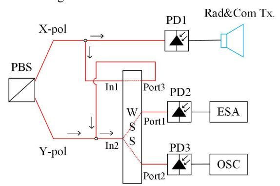

**Fig. 4.** The schematic structure following the PBS when the WSS is deployed. ESA, electrical spectrum analyzer; OSC, oscilloscope.

## *A. Signal Generation*

The CW light with a center frequency of 193.50 THz is injected into the PM-DPMZM. The electrical signal is generated by an arbitrary waveform generator (AWG, Tektronix AWG 70002A) and output from the channel-1, whose electrical spectra is shown in Fig.5(a). The IF ASK signal, whose initial phase is 0, has 2 GHz carrier frequency and 1GBaud symbol rate. The Tri-LFM signal, whose initial phase is /2, has a frequency sweep range of 6.6~7.6 GHz and sweep period of 2 s. The other electrical signal, also consisting of IF ASK signal and Tri-LFM signal but with different phase relationship, is also generated by the AWG but output from the channel-2, simultaneously. Electrical signals from two channels, both with a peak-to-peak voltage of 350 mV, are loaded onto the I- and Q-arms of the X-DPMZM via equal-length cables, respectively. The optical spectrum output from the X-DPMZM is analyzed by an optical spectrum analyzer (OSA, Finisar Wave Analyzer 1500s), as demonstrated in Fig.6. As can be seen, the lower SSB of the IF ASK signal and the upper SSB of the Tri-LFM signal are distributed on either side of the carrier frequency. And the carrier frequency is well suppressed with a suppression ratio of 21 dB. The beating signal of these two sidebands can be then used for radar ranging, wireless communications and spectrum sensing. The signal is amplified by two electrical amplifiers (EAs, Mini-circuits ZVA-403gx+ & Mini-circuits ZX60-24-S+) after PD1. An electrical band pass filter (BPF, passband 8.5~13.5 GHz) is utilized to filter out the undesired frequencies. The antennas work at the frequency from 8 to 12 GHz and the PD exhibits an upper bandwidth limit of 10 GHz. Fig.5(b) shows the electrical spectra of the generated Tri-LFM-ASK signal with a center frequency of 9.1 GHz and sweep range of 8.6~9.6 GHz.

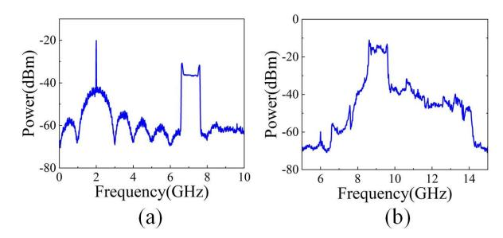

**Fig. 5.** Electrical spectra of the signal from (a) AWG and (b) PD1.

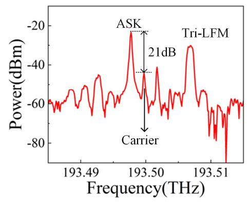

**Fig. 6.** Optical spectra of the signal output from X-DPMZM

# *B. Wireless Communications*

The signal radiated from transmission antenna can be received by communication-receiving antenna after 1.8 m free space transmission. After applying ED and TD through the DSP, 

{4}------------------------------------------------

the original data can be then recovered. Fig.7 compares the waveforms of the transmitted signal (yellow curve) and the received signal (red curve), with the original bits recovered from the received signal marked (black curve). As can be seen, the original bit information can be well recovered, which indicates that the high-speed wireless communications at the date rate of 1Gbit/s is achieved.

It should be noted that the phase of the Tri-LFM signal must remain unencoded. The phase of the random encoding causes random dithering in the amplitude of the de-chirped IF signal in the next ranging stage.

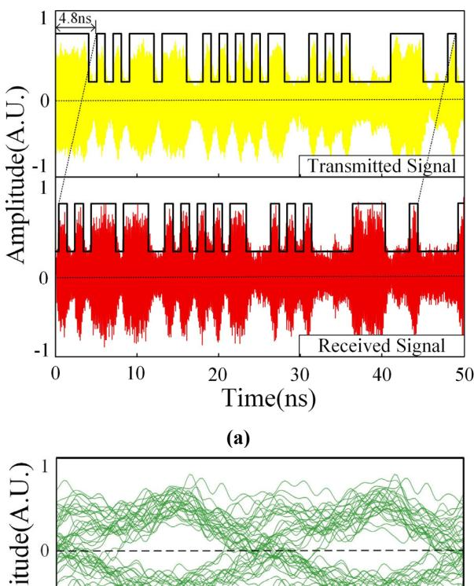

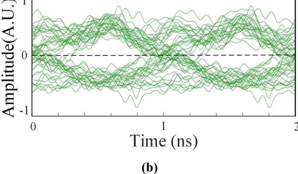

**Fig. 7.** (1) Comparison between the transmitted signal and the received signal (yellow curve: transmitted signal, red curve: received signal, black curve: recovered original bits after ED and TD), (b) eye diagrams of received signal.

#### *C. Radar Ranging*

The multi-function signal is then used for ranging. The Tri-LFM-ASK signal, by exhibiting superior LFM characteristics in the frequency domain, lays a solid foundation for radar ranging, as shown in Fig.8(a). A 30 cm 30 cm flat plate reflector is employed as a target for radar ranging. The echo signal captured by the radar-receiving antenna is amplified by an EA (SHF-L810A-48822), and then coupled with radiated electrical signal via an EC. The coupled signals are orthogonally modulated on the Y-DPMZM via the EH1. The de-chirping can be then realized in optical domain on the Y-pol. After filtering by the WSS, the de-chirped IF signal can be detected and analyzed. By means of zero-spacing coupling between the antenna pair, the zero-spacing starting frequency is determined to be 11.5MHz. Further sample points with different distances are measured, and the corresponding results are shown in Fig.8(b) and Fig.9. As can be seen, the system illustrates the ranging capability with an error below 3.2 cm.

4

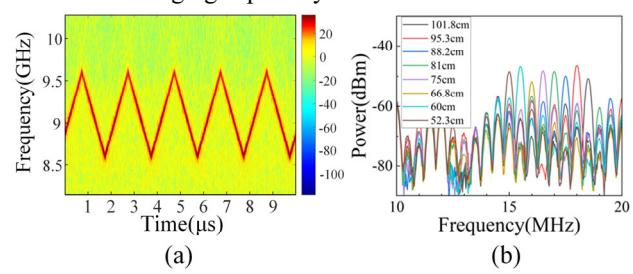

**Fig. 8.** (a) Instantaneous frequency-time diagram of the transmitted signal; (b) frequency spectrum of the de-chirped IF signal.

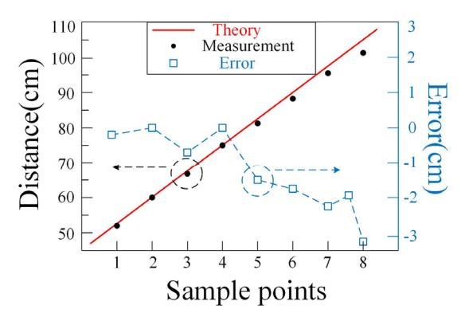

**Fig. 9.** The target ranging results.

#### *D. Spectrum Sensing*

The spectrum sensing function is conducted using the same optical SSB of the Tri-LFM signal on the X-pol. The SUT with a frequency of 7 GHz at -20 dBm generated by the analog signal generator (ASG, Agilent N5183A) is modulated on the Y-DPMZM via the EH2. The waveforms and the instantaneous frequency-time diagram of the signal from PD3 are shown in Fig.10 (a) and (b). Using an adaptive short-time Fourier transform (STFT) algorithm, the DSP processes the signal and then represents frequency components below 5 MHz as discrete pulses. As a consequence, the pulse signals corresponding to the frequency of the SUT are generated, and the pulses in one sweep period are shown in Fig.10(c). Thanks to the high sample rates of the OSC, the time resolution at sub-nanosecond is attainable. Substituting ൌ1.2064 into (2), we have ௌ ൌ6.9968 GHz and a frequency measurement error of -3.2 MHz. As Fig.11 shown, further experimental measurements demonstrate that the error remains within 3.2MHz. According to (2), when *k* and are fixed, the measurement accuracy only depends on , so the measurement error originates from the determination of pulse center time and its resolution. Due to the blurring of pulse edges after the DSP, it is difficult to

{5}------------------------------------------------

**TABLE. 1.** Comparison of different methods for multi-function

| Ref.         | Method for multi function                     | Wireless communications |                       | Radar ranging      |                           | Spectrum Sensing           |                            |
|--------------|--------------------------------------------------|-------------------------|-----------------------|--------------------|---------------------------|----------------------------|----------------------------|
|              |                                                  | Frequency (GHz)      | Data rate (Gbit/s) | Frequency (GHz) | Measurement error (cm) | Measurement range (GHz) | Measurement error (MHz) |
| [15]         | Waveform share (LFM)                          | /                       | /                     | 12-18              | 1.25                      | 0.05-39.95                 | 50                         |
| [20]         | Waveform share (LFM)                          | /                       | /                     | 18-26              | 2.06                      | 28-36                      | 16                         |
| [21]         | Time-division Multiplexing (OFDM-LFM)      | 335-345                 | 38.1                  | 335-345            | 1.5                       |                            |                            |
| [22]         | Waveform share (QPSK)                         | 23-25                   | 0.3356                | 23-25              | 7.5                       | /                          | /                          |
| [23]         | Waveform share (OFDM)                         | 25-27                   | 6.4                   | 25-27              | 7.5                       | /                          | /                          |
| [24]         | Waveform share (QPSK-LFM)                     | 8.5-9.5                 | 0.21052               | 8.5-9.5            | 4                         |                            | /                          |
| [25]         | Frequency-division multiplexing (OFDM-LFM) | 55-60                   | 18                    | 54-55 & 60-61   | 2.14                      | /                          |                            |
| [26]         | Waveform share (ASK-LFM)                      | 18-26                   | 0.1                   | 18-26              | 1.875                     | /                          | /                          |
| This work | Waveform share (ASK-LFM)                      | 8.6-9.6                 | 1                     | 8.6-9.6            | 3.2                       | 8.6-9.6                    | 3.2                        |

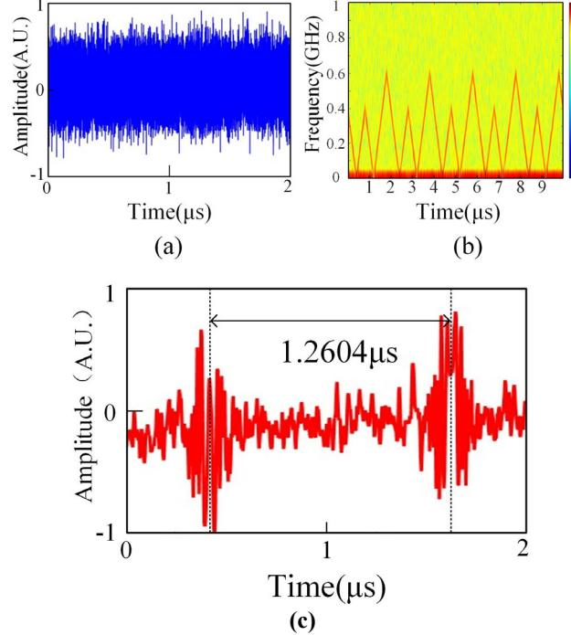

**Fig.10.** (a) Waveforms and (b) instantaneous frequency-time diagram of the signal from PD3; (c) pulses corresponding to the SUT in one sweep period

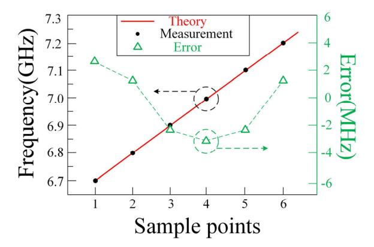

**Fig.11.** The spectrum measurement results.

# IV. DISCUSSION AND CONCLUSION

Table. 1 compares this work with previously reported photonics-assisted dual-function systems. The proposed system distinguishes itself from existing alternatives through several key features: (1) This work presents the unique joint system integrating all three functionalities: radar ranging, wireless communications, and spectrum sensing. (2) Unlike other methods, it requires no complex waveform design. The ASK modulation not only supports high-speed transmission but also enables low-complexity modulator and demodulator architectures. (3) The operation may be configured to utilize any single or a pair of two functions, based on application requirements. For example, radar ranging and spectrum sensing can be simultaneously achieved when the IF ASK signal is replaced by a fixed-frequency microwave signal, or spectrum 

{6}------------------------------------------------

sensing can be performed independently when the IF ASK signal is canceled.

For communications, uneven signal amplitude may occur in received waveforms under harsh transmission conditions. Some methods should be implemented to perform compensation. For ranging and sensing, the Tri-LFM signal with larger sweep bandwidth significantly enhances ranging accuracy and expand spectral measurement range [19]. Considering that 3.2MHz is a rather satisfactory resolution for spectrum sensing compared with other previous work [15][20], we do not proceed with additional experiments. And the introduction of deep neural network can reduce average errors in spectrum measurement [27].

In conclusion, the proposed approach uses a single photonics-generated signal to simultaneously enable radar ranging, wireless communications, and spectrum sensing. All three functionalities are realized using a single PM-DPMZM: optical conversion of IF ASK and Tri-LFM signals enables spectral sensing via the Tri-LFM component while fusing photodetected Tri-LFM-ASK outputs for integrated radarcommunications functionality. The joint system demonstrates radar ranging with a measurement error of ±3.2 cm, high-speed wireless communications at 1 Gbit/s and spectrum sensing with a measurement error below ±3.2 MHz, simultaneously. This work provides a promising approach in future 6G communications.

# REFERENCES

- [1] B. Tang and P. Stoica, "MIMO multifunction RF systems: detection performance and waveform design," *IEEE Trans. Signal Process*, Aug. 2022, vol. 70, pp. 4381-4394, doi: 10.1109/TSP.2022.3202315
- [2] P.W. Moo and D.J. DiFilippo, "Multifunction RF Systems for Naval Platforms," *Sensors*. Jun. 2018, vol. 18, no. 7, pp: 2076. doi: 10.3390/s18072076
- [3] J. Yao and J. Capmany, "Microwave photonics," *Sci. China Inf. Sci*, Aug. 2022, vol. 65, Art. no. 221401, doi: 10.1007/s11432-021-3524-0
- [4] S. Pan and Y. Zhang, "Microwave Photonic Radars," *J. Lightwave Technol.*, Oct. 2020, vol. 38, no. 19, pp. 5450-5484, doi: 10.1109/JLT.2020.2993166
- [5] Z. Xue, *et al.*, "OFDM Radar and Communication Joint System Using Opto-Electronic Oscillator with Phase Noise Degradation Analysis and Mitigation," *J. Lightwave Technol.*, Jul. 2022, vol. 40, no. 13, pp. 4101- 4109, doi: 10.1109/JLT.2022.3156573
- [6] Y. Wang, *et al.*, "Joint communication and radar sensing functions system based on photonics at the W-band," *Opt. Express*, Apr. 2022, vol. 30, no. 8, pp:13404-13415, doi: 10.1364/OE.449153
- [7] W. Li, *et al*., "Photonic Terahertz Wireless Communication: Towards the Goal of High-Speed Kilometer-Level Transmission," *J. Lightwave Technol.*, Feb. 2024, vol. 42, no. 3, pp. 1159-1172, doi: 10.1109/JLT.2023.3329351
- [8] M. Lei, *et al*., "An Integrated Wireless Communication and Sensing System at U-band Based on Heterodyne Detection," in *2021 Asia Communications and Photonics Conference (ACP)*, Shanghai, China, 2021, pp. 1-3.
- [9] P. Ghelfi, *et al.*, "A fully photonics-based coherent radar system," *Nature*, Mar. 2014, vol. 507, no. 7492, pp:341–345, doi: 10.1038/nature13078
- [10]Y. Wang, *et al.*, "Photonics-assisted omnidirectional 3D positioning radar for noncooperative multi-targets by using a cross-shaped antenna array," *Opt. Laser Technol.*, Mar. 2024, vol. 170, doi: 10.1016/j.optlastec.2023.110150
- [11]H. Lu, *et al.*, "5 G new radio fiber-wireless converged systems by injection locking multi-optical carrier into directly-modulated lasers," *Commun. Eng.*, Oct. 2024, vol. 3, Art. no. 144, doi: 10.1038/s44172-024-00295-0
- [12]S. Jia, *et al.*, "2 × 300 Gbit/s Line Rate PS-64QAM-OFDM THz Photonic-Wireless Transmission," *J. Lightwave Technol.*, Sep. 2020, vol. 38, no. 17, pp:4715-4721, doi: 10.1109/JLT.2020.2995702

[13] J. Wen, *et al.*, "Precise identification of wideband multiple microwave frequency based on self-heterodyne low-coherence interferometry," *J. Lightwave Technol.*, May 2021, vol. 39, no. 10, pp. 3169–3176, doi: 10.1109/JLT.2021.3064866

2

- [14] H. Jiang, *et al*., "Wide-range high-precision multiple microwave frequency measurement using a chip-based photonic Brillouin filter," *Optica*, Jan. 2016, vol.3, no. 1, pp: 30–34, doi: 10.1364/OPTICA.3.000030
- [15] Z. Tang, P. Zhou, J. Zhu, N. Li and S. Pan, "An Integrated Radar Detection and Microwave Frequency Measurement System Based on an Optically Injected Semiconductor Laser," in *2023 Optical Fiber Communications Conference and Exhibition (OFC)*, San Diego, CA, USA, 2023, pp. 1-3, doi: 10.1364/OFC.2023.W4J.3
- [16] T. Lin, *et al.*, "Differentiator-based photonic instantaneous frequency measurement for radar warning receiver,". *J. Lightwave Technol.*, Aug. 2020, vol. 38, no. 15, pp: 3942-3949, doi: 10.1109/JLT.2020.2985751
- [17] H. Yang, M. Brunel, M. Vallet, H. Zhang and C. Zhao. "Optical frequency-to time mapping using a phase-modulated frequency-shifting loop," *Opt. Lett.*, May 2021, vol. 46, no. 10, pp.2336-2339, doi: 10.1364/OL.425460
- [18] X. Chen, *et al*., "Precise Multiple Frequency Identification Based on Frequency-to-Time Mapping and Cross-Correlation," *J. Lightwave Technol.*, Sep. 2023, vol. 41, no. 18, pp. 5895-5901, doi: 10.1109/JLT.2023.3272675
- [19] B. Zhang, *et al.*, "Microwave Frequency Measurement Based on an Optically Injected Semiconductor Laser," *IEEE Photon. Technol. Lett.*, Dec. 2020, vol. 32, no. 23, pp. 1485-1488, doi: 10.1109/LPT.2020.3035694
- [20] J. Shi, F. Zhang, D. Ben and S. Pan, "Simultaneous Radar Detection and Frequency Measurement by Broadband Microwave Photonic Processing," *J. Lightwave Technol.*, Apr. 2020, vol. 38, no. 8, pp. 2171-2179, doi: 10.1109/JLT.2020.2965113
- [21] Y. Wang, *et al*., "Integrated High-Resolution Radar and Long-Distance Communication Based-on Photonic in Terahertz Band," *J. Lightwave Technol.*, May 2022, vol. 40, no. 9, pp. 2731-2738, doi: 10.1109/JLT.2022.3143849
- [22] Z. Xue, *et al.*, "Photonics-assisted joint radar and communication system based on an optoelectronic oscillator," *Opt. Express*, Jul. 2021, vol. 29, no. 14, pp: 22442-22454, doi: 10.1364/OE.430910
- [23] Z. Xue, *et al.*, "OFDM Radar and Communication Joint System Using Opto-Electronic Oscillator with Phase Noise Degradation Analysis and Mitigation," *J. Lightwave Technol.*, Jul. 2022, vol. 40, no. 13, pp. 4101- 4109, doi: 10.1109/JLT.2022.3156573
- [24] S. Wang, D. Liang, and Y. Chen, "Photonics-assisted joint communication-radar system based on a QPSK-sliced linearly frequencymodulated signal," *Appl. Opt*., Jun. 2022, vol. 61, no. 16, pp: 4752-4760, doi: 10.1364/AO.456287
- [25] N. Zhong, *et al.*, "Spectral-Efficient Frequency-Division Photonic Millimeter-Wave Integrated Sensing and Communication System Using Improved Sparse LFM Sub-Bands Fusion," *J. Lightwave Technol.*, Dec. 2023, vol. 41, no. 23, pp. 7105-7114, doi: 10.1109/JLT.2023.3265799
- [26] H. Nie, F. Zhang, Y. Yang and S. Pan, "Photonics-based integrated communication and radar system," in *2019 International Topical Meeting on Microwave Photonics (MWP)*, Ottawa, ON, Canada, 2019, pp. 1-4, doi: 10.1109/MWP.2019.8892218
- [27] Y. Zhou, *et al.*, "Deep neural network-assisted high-accuracy microwave instantaneous frequency measurement with a photonic scanning receiver," Jun. 2020, *Opt. Lett.*, vol. 45, no. 11, pp: 3038-3041, doi: 10.1364/OL.391883

**Xianshuai Meng** received the B.S. degree in communication engineering from the School of Computer and Communication Engineering, China University of Petroleum, Qingdao, China in 2014, and the M.S. degree in electronic and communication technology with the College of Communications Engineering, Army Engineering University of PLA, Nanjing, China in 2020. He is currently working toward the Ph.D. degree in electronic science and technology with the Army Engineering University of PLA, Nanjing. His current research interests focus on microwave photonics.

{7}------------------------------------------------

#### > REPLACE THIS LINE WITH YOUR MANUSCRIPT ID NUMBER (DOUBLE-CLICK HERE TO EDIT) <

**Jilin Zheng** received the B.S. and Ph.D. degrees in electromagnetic field and microwave technology from the PLA University of Science and Technology, Nanjing, China, in 2005 and 2010, respectively. His research interests include microwave-photonics, DFB semiconductor lasers, fiber communication, and photonic integrated circuits. He is currently majoring in advanced DFB lasers and their applications.

**Tao Pu** received the B.S. degree in communication engineering, and the M.S. and Ph.D. degrees in communications engineering and information systems from the PLA College of Communications Engineering, Nanjing, China, in 1996, 1999, and 2003, respectively. He is currently a Full Professor with the College of Communications Engineering, PLA Army Engineering University Nanjing, China. His research interests include optical communication technology, microwave photonics, signal processing, anti-interception communication, and fiber-optic sensing technology.

**Jin Li** received the B.S. degree in electronic information engineering from Beijing Jiaotong University, Beijing, China, and the M.S. and Ph.D. degrees in microwave photonic technology from the Army Engineering University of PLA, Nanjing, China, in 2016, 2018, and 2021, respectively. His current research interests include semiconductor lasers, laser nonlinearity, and microwave generation.

**Hua Zhou** received the B.S. degree in communication engineering, and the M.S. degrees in electromagnetic field and microwave technology and Ph.D. degrees in electronic science and technology from the PLA University of Science and Technology, Nanjing, China, in 2001, 2004, and 2017, respectively. His research interests include optical communication technology, microwave photonics.

**Shuya Liu** received the B.S. degree in network engineering from the Army Engineering University of PLA, Nanjing, China, in 2023. She is currently working toward the Ph.D. degree in electronic science and technology with the Army Engineering University of PLA, Nanjing, China. Her current research interests focus on microwave photonics.

**Xiaolong Zhao** received the B.S. degree in network engineering from the Army Engineering University of PLA, Nanjing, China, in 2023. He is currently working toward the Ph.D. degree in electronic science and technology with the Army Engineering University of PLA, Nanjing, China. He current research interests focus on microwave photonics.

3