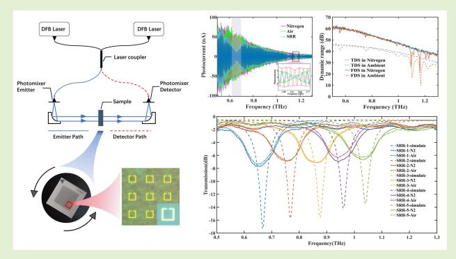
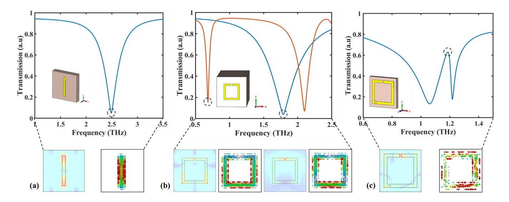
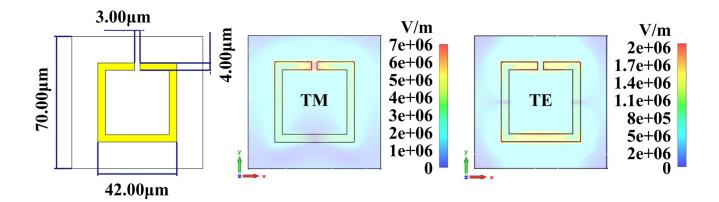
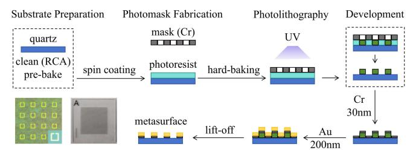
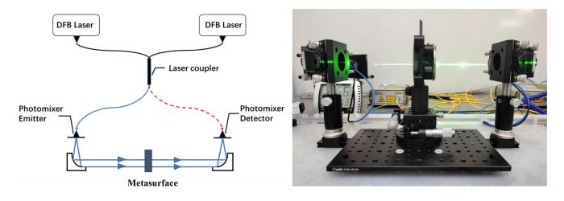
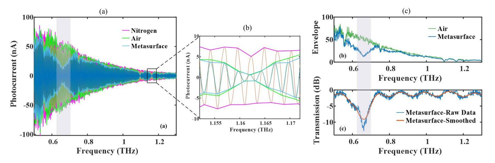
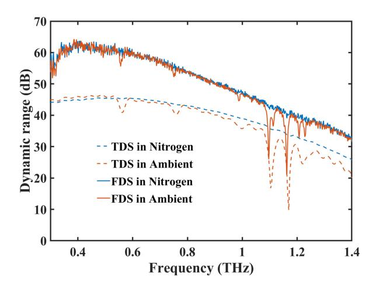
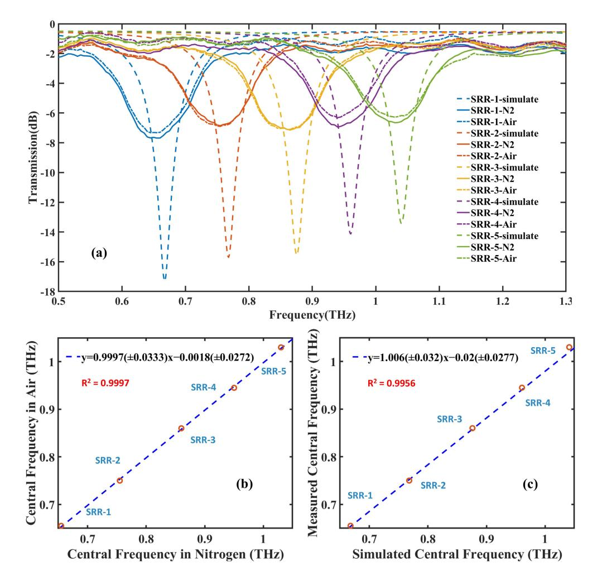
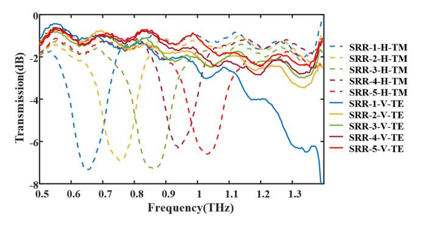
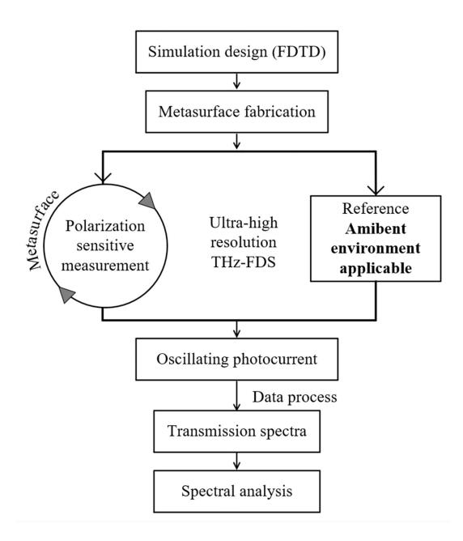

{0}------------------------------------------------

# Robust Characterization of Terahertz Metasurface Sensor With Ultrahigh Frequency Selectivity and Polarization Sensitivity

Yuan Yuan, Tianyao Zhang [,](https://orcid.org/0000-0002-5043-1349) Zhaohui Zhang [,](https://orcid.org/0000-0003-0127-054X) Xiaoyan Zhao, Xianhao Wu [,](https://orcid.org/0000-0002-8904-4266) Shaowen Zheng, Liang Liang, and Can Cao

*Abstract***—By enhancing light–matter interaction, terahertz (THz) metasurface can significantly improve the performance of THz spectroscopic sensing. Despite their theoretical promise, a robust and practical characterization method for THz metasurface remains urgently needed. This article presents a novel characterization approach for THz metasurface that is resilient to environmental water vapor, enabling ultrahigh frequency selectivity and polarization sensitivity. The performance of the proposed method is demonstrated using a series of lithography-fabricated split-ring metasurface, theoretically designed to be evenly separated over the 0.6–1.0 THz range. A continuous wave THz frequency-domain spectroscopy system was employed for experimental characterization. Following sophisticated raw**

**photocurrent data processing, ultrahigh frequency resolution (0.05 GHz) spectral characterization was achieved within the frequency range of 0.05 to 1.4 THz. The measured data exhibit linear correlation with the theoretical simulation results, and deviations of the resonance frequencies are less than 0.02 THz. By presenting the characterization results with and without water vapor exhibited in the THz pathway, we demonstrate the robustness of the proposed method in the ambient environment. Furthermore, we incorporated a sample rotating frame into the THz optical path to achieve polarization-sensitive measurements. As the era of 6G integrated sensing and communication approaches, our research significantly advances the practicality of metasurface enhanced THz sensing.**

*Index Terms***— Analytical spectroscopy, biochemical sensing, continuous wave terahertz frequency domain spectroscopy (THz-FDS), metasurface, polarization.**

## I. INTRODUCTION

R APID development in compactness, reliability, operating frequency, and output power of terahertz (THz) sources and receivers has vastly boosted the applications

Received 28 August 2024; accepted 26 September 2024. Date of publication 7 October 2024; date of current version 14 November 2024. This work was supported in part by the National Key Research and Development Program of China under Grant 2021YFA0718901 and in part by the National Natural Science Foundation of China under Grant 62005014 and Grant 62205348. The associate editor coordinating the review of this article and approving it for publication was Dr. Mohamad Atef. *(Corresponding author: Tianyao Zhang.)*

Yuan Yuan, Tianyao Zhang, Zhaohui Zhang, Xiaoyan Zhao, Xianhao Wu, and Shaowen Zheng are with the School of Automation and Electrical Engineering, University of Science and Technology Beijing, Beijing 100083, China, and also with Beijing Engineering Research Center of Industrial Spectrum Imaging, Beijing 100083, China (e-mail: zhangtianyao@ustb.edu.cn).

Liang Liang is with China Ship Research and Development Academy, Beijing 100192, China (e-mail: 13811226477@163.com).

Can Cao is with the Laser Engineering Center, Aerospace Information Research Institute, Chinese Academy of Sciences, Beijing 100094, China (e-mail: 18810699648@163.com).

Digital Object Identifier 10.1109/JSEN.2024.3470995

of THz technology [\[1\]. T](#page-6-0)Hz waves of nonionizing radiation are regarded as an ideal choice for biochemical sensing due to their photon energies close to that of intermolecular interactions [\[2\]. H](#page-6-1)owever, most natural materials exhibit weak electromagnetic responses within the THz spectrum [\[3\].](#page-6-2) To obtain valuable spectra, it is necessary to evenly disperse an appropriate amount of the substance in a polymer matrix and fabricate samples with specific thicknesses through external pressure. This complex preparation process ensures effective interaction between THz waves and the sample, thereby avoiding issues of signal oversaturation from excessive absorption. Nevertheless, in the impending era of integrated communication and sensing with 6G technology, such intricate preparation methods may become impracticable for THz sensing applications.

The highly confined electromagnetic fields on the metamaterials enable superior detection of the dielectric variation, so as to realize enhanced sensing of trace amount substances [\[4\].](#page-6-3) Metamaterials are artificial substances whose electromagnetic properties are determined by their subwavelength periodic structures [\[5\]. N](#page-6-4)otably, metasurface operating at

1558-1748 © 2024 IEEE. Personal use is permitted, but republication/redistribution requires IEEE permission. See https://www.ieee.org/publications/rights/index.html for more information.

{1}------------------------------------------------

Fig. 1. Three types of metasurface structural units. (a) Cut wire resonator, (b) split ring resonator, and (c) asymmetric ring resonator, and their transmission, electric field, and surface current distributions.

infrared [\[6\]](#page-6-5) and microwave [\[7\]](#page-6-6) frequencies exhibit similar electromagnetic behaviors to those at THz frequencies. Therefore, structures with verified performance over infrared or microwave bands are highly likely to be applicable to the THz band after scaling up-or-down their physical dimensions [\[8\]. N](#page-6-7)umerous studies on the absorption [\[9\],](#page-7-0) reflectance [\[10\], a](#page-7-1)nd transmission [\[11\]](#page-7-2) spectra associated with metasurface have been conducted. Plasmon-based metasurface in THz frequency regime with great transmission spectra has extensive applications in the fields such as biochemical sensing [\[12\],](#page-7-3) [\[13\], f](#page-7-4)ood production monitoring [\[14\],](#page-7-5) [\[15\], a](#page-7-6)nd communications [\[16\]. I](#page-7-7)n particular, target sensing based on the fingerprint absorption spectrum [\[17\]](#page-7-8) sparks great interest. For substances with characteristic absorption in the THz band, by matching the resonance dip with the their narrowband absorption peak, absorption-induced transparency (AIT) effect can be excited [\[18\]](#page-7-9) to realize enhanced spectral sensing. However, previous studies predominantly focus on the theoretical performance of metasurface while neglecting the importance of experimental validation, which may limit the practicality of metasurface-enhanced THz sensing [\[19\].](#page-7-10) Typically, the refractive index and absorption coefficient can be extracted from the amplitude and the phase of the broadband THz wave by using commercial THz time domain spectroscopy (THz-TDS) system [\[20\],](#page-7-11) [\[21\]. N](#page-7-12)evertheless, most metasurface characterization using THz-TDS is generally accomplished in well-controlled environments purged with nitrogen to exclude water vapor [\[22\], l](#page-7-13)eading to low resolution and large volume. Actual application environments cannot provide such ideal conditions.

THz frequency domain spectroscopy (THz-FDS) based on photonmixing is increasingly favored for THz metasurface characterization due to its high frequency resolution, robustness, and micro-Watt signal strength [\[23\].](#page-7-14) Similar to the development of THz-TDS, data processing algorithms for THz-FDS were initially the focus of research, with methods such as extrema point analysis [\[24\], H](#page-7-15)ilbert transform [\[25\],](#page-7-16) and amplitude normalization [\[26\]](#page-7-17) techniques being reported in recent years. Meanwhile, because of its strong spectral selection performance [\[27\],](#page-7-18) THz-FDS is widely applied in frequency shift [\[28\]](#page-7-19) and AIT detection [\[29\]. E](#page-7-20)ven so, most of these studies have used traditional extrema point methods, which can lead to reduced spectral resolution and, to some extent, diminish the advantages of THz-FDS in characterizing high-quality factor metamaterials. Moreover, some THz metasurfaces and target materials exhibit anisotropy, hence the polarization detection capability of THz-FDS systems also needs to be developed [\[30\]. O](#page-7-21)verall, previous studies using THz-FDS to characterize metasurface have primarily focused on sensing performance while lacking critical analysis of the characterization process and system performance. This oversight can lead to impacts on the sensing effect through system performance aspects such as dynamic range (DR), frequency accuracy, and polarization sensitivity. Hence, comprehensive research demonstrating the practical transition from theoretical design to practical characterization of metamaterials is urgently needed by the THz sensing community. Therefore, this study presents a novel THz metasurface characterization method that achieves robustness to environmental water vapor for direct measurement, while also demonstrating ultrahigh frequency selectivity and polarization sensitivity, facilitating the application of metasurface for biochemical sensing in the THz domain.

This article begins with a brief overview of recent advances in THz metasurface, followed by a detailed exposition on metasurface design and fabrication, then proceeds to describe the spectral characterization using THz-FDS. After sophisticated photocurrent data processing, Section [IV](#page-3-0) elaborates extensively on the ultrahigh frequency selectivity, robustness, and polarization characterization of this method, with necessary limitations specified.

## II. METASURFACE DESIGN AND FABRICATION *A. Theoretical Design of Metasurface*

Several basic structural units of metasurface are shown in Fig. [1.](#page-1-0) The metallic cut wire is a typical electric resonant structure [\[31\]](#page-7-22) as in Fig. [1\(a\).](#page-1-0) When the THz wave is incident perpendicularly onto the metasurface, with its electric field

{2}------------------------------------------------

Fig. 2. Schematic of the SRR unit cell and simulated electric field distribution at the resonant frequency.

TABLE I STRUCTURAL PARAMETERS AND RESONANT FREQUENCIES

| Sample | Side Length/L  | Gap/G             | Line Width/W    | Resonant Frequency(THz) |
|--------|-------------------|-------------------|--------------------|----------------------------|
| SRR-1  | $42\mu\mathrm{m}$ | $3\mu \mathrm{m}$ | $4\mu\mathrm{m}$   | 0.67                       |
| SRR-2  | $37\mu\mathrm{m}$ | $3\mu\mathrm{m}$  | $4 \mu \mathrm{m}$ | 0.77                       |
| SRR-3  | $34\mu\mathrm{m}$ | $5\mu \mathrm{m}$ | $4\mu\mathrm{m}$   | 0.88                       |
| SRR-4  | $31\mu\mathrm{m}$ | $4\mu\mathrm{m}$  | $4\mu\mathrm{m}$   | 0.96                       |
| SRR-5  | $29\mu\mathrm{m}$ | $4\mu\mathrm{m}$  | $4\mu\mathrm{m}$   | 1.04                       |

parallel to the metallic wire, the free electrons within the metal move along the wire, resulting in electric dipole resonance. Weis et al. [\[32\]](#page-7-23) reported another typical structure, the metal split ring resonator (SRR), and its vibration coupling with α-lactose monohydrate. As shown in Fig. [1\(b\),](#page-1-0) the SRR can be excited in two ways. When the electric field is parallel to the metal arm containing the split, it induces a circulating current, which drives electrons to accumulate at the gap, creating an electric field and similarly forms an *LC* resonance driven by a perpendicular alternating magnetic field, thus we call it the magnetic response. In addition, when the electric field is perpendicular to the metal arm containing the split, it generates electric dipole resonance similar to that in the metallic cut wire. By adjusting the side length of SRR, Xie et al. [\[33\]](#page-7-24) matched the resonant frequency with the weak intrinsic oscillation of L-tartaric acid at 1.035 THz. Furthermore, when a second split is added, the SRR will transform into two metal lines, as depicted in Fig. [1\(c\),](#page-1-0) whose resonant frequencies are very close, leading to strong coupling and the appearance of Fano resonance in the transmission spectrum [\[34\]. W](#page-7-25)ith the increasing demand for applications and the pursuit of high *Q*-factors, more complex structures have been developed [\[35\].](#page-7-26)

In order to ensure the reliability of the theoretical simulation, we choose the mature SRR structure as shown in Fig. [2.](#page-2-0) A square ring of gold with a thickness of 200 nm is added to a 500-µm thick quartz substrate to establish a periodic structure with a period of 70 µm. The square side length is *L*, the split gap is *G*, and the linewidth is *W*. The structural parameters were optimized to achieve five different resonant frequencies at intervals of 0.1 THz, as listed in Table [I.](#page-2-1) We perform theoretical simulation by the finite difference time domain (FDTD) method.

In the context of THz wave interaction with SRRs, both transverse magnetic (TM) and transverse electric (TE) modes play crucial roles in influencing the behavior of the SRR structure. We oriented the polarization of the THz wave along and perpendicular to the gap of the SRR, and calculated the electric field distribution, respectively. It can be seen in Fig. [2](#page-2-0) that the electric field local enhancement corresponding to the magnetic response is concentrated at the gap of the SRR, while the Mie resonance corresponding to the electric response is

Fig. 3. Fabrication of frequency-selective metasurface.

mainly concentrated around the metal edge perpendicular to the electric field direction. More importantly, the electric field distribution is up to 7 × 106 V/m excited by the magnetic response around the gap at 0.668 THz, much stronger than that of the electric response resonance at 1.61 THz. The local field enhancement effect in the magnetic response mode is more obvious, which also provides an important basis for metasurface structures design and sensing.

## *B. Fabrication of Designed Metasurface*

Initiating the fabrication process, the quartz substrate is cleaned thoroughly to remove any contaminants or residues that could affect subsequent processing steps. After cleaning, the substrate is prebaked in an oven at 100 ◦C for 10 min to remove any remaining moisture. Subsequently, photoresist is spin-coated onto the substrate at a speed of 3000 r/min, followed by a 2-min bake at 120 ◦C, ensuring film stability and adhesion. In the subsequent photolithographic step, a mask with the desired SRR structural patterns is prepared through laser etching of the Cr layer. This mask is then precisely aligned, and the substrate is selectively exposed to ultraviolet (UV) radiation according to the pattern on the mask. After UV exposure, the unexposed and uncured photoresist is meticulously rinsed away using a developer solution, and the remaining photoresist film is further strengthened through a second bake at 120 ◦C. Advancing to the deposition phase, a vacuum-assisted technique is employed to deposit a 30 nm layer of Cr onto the substrate. The choice of Cr is strategic, as it possesses exceptional adhesive properties and serves as an effective barrier layer, facilitating the subsequent deposition of a 200 nm Au layer. Finally, the entire assembly is immersed in acetone solution for over 2 h, allowing for the lift-off of the undesired layers via a stripping machine, culminating in a thoroughly cleaned substrate ready for further analysis or processing.

In the aforementioned micro-nano fabrication process, a step profiler was used to measure the thickness of the coating layer on the substrate, ensuring the uniformity and consistency of the deposited films. The fabrication was conducted at Henan Micro Nano Semiconductor Technology Company Ltd., Fig. [3](#page-2-2) provides an overview of the fabrication of metasurface, and presents a physical and an optical microscopy images. In the physical image, on a 16 × 16 mm quartz substrate, the dark area measures 10.5 × 10.5 mm and contains 22 500 subwavelength SRR structures. The letter "A" is used as the sample number and the vertical line indicates orientation. The optical microscopy images were captured using an Olympus BX51M metallurgical microscope to examine the morphological characteristics of the metasurface patterns.

{3}------------------------------------------------

Fig. 4. Schematic and actual setup of the continuous wave THz-FDS system.

## III. SPECTRAL CHARACTERIZATION OF METASURFACE A. Instrumentation

The continuous wave THz frequency-domain spectroscopy system applied in this study consists of DLC smart electronics, two distributed-feedback diode (DFB) lasers, a pair of fibercoupled photomixers, and two 90° off-axis parabolic mirrors, as shown in Fig. 4 The DFB lasers are utilized as the nearinfrared (NIR) light source. Two NIR lasers are coupled to create an optical beat signal in the fiber coupler. Subsequently, the beat signal is evenly split into two laser beams to pump and probe continuous THz waves coherently. The laser pathway described above is highly integrated via optical fibers, leading to enhanced system stability and reduced equipment footprint. THz pulses generated at the transmitter are precisely aligned onto the sample through a pair of off-axis parabolic mirrors. The transmitted pulses are further focused by another pair of off-axis parabolic mirrors and reach the detector concurrently with the detection pulse. The incident THz wave is vertical polarized, and we placed a sample rotating frame in the path of the THz beam to adjust the orientation of the metasurface. The angular resolution of the frame is 20 min of arc, assisted by laser cross-line for positioning. By rotating the metasurface, spectra in the horizontal and vertical directions can be achieved. This method avoids the construction of complex polarization spectrum system.

#### B. Spectral Collection and Processing

The generation of photocurrent should be clarified for data acquisition. The optical beat signal is initially split into two beams called pump beam and probe beam. The pump beam irradiates the photoconductive antenna located at the transmitter end, thereby creating charge carriers. When a bias voltage is applied, a continuous THz wave is generated, with exact the frequency of the pump beam envelop. THz waves propagate through the metasurface and meet the probe beam at the detector. The THz electric field serves as the bias voltage for the photoconductive antenna, while the probe beam modulates the antenna's conductivity. The photocurrent generated by the detector is proportional to the amplitude of the THz electric field, which is then amplified through a lock-in amplifier. The frequency-dependent photocurrent I(f) arises from the voltage generated by the THz wave and the conductivity modulated by the probe beam, and can be described as

$$I(f) = \alpha E_{\text{THz}}(f) \cos \left[ \Phi(f) \right] \tag{1}$$

where f is the frequency,  $\alpha$  is the conversion coefficient,  $E_{\text{THz}}$  is the amplitude of the detected THz wave, and  $\Phi$  is the phase term.

As previously discussed, photocurrent from the detector carries valuable information about the metasurface. Extracting its envelope allows us to determine the amplitude of the THz waves. Initially, a five-point third-order smoothing filter was applied to the photocurrent signal, as detailed in Fig. 5(a). Despite filtering, the signal remains oscillatory, posing challenges in distinguishing between the reference signals of nitrogen and air, as well as the THz signal from the metasurface. The inset provides detailed oscillating photocurrent at one of the absorption peaks of water vapor. The photocurrent amplitude gradually decreases with increasing frequency, featuring two zero-crossing points per oscillation cycle. The extrema of the valleys are inverted and mixed with those of the peaks, and frequency is filled through linear interpolation, thereby fully utilizing the data without compromising system resolution. Fig. 5(b) illustrates the envelopes of the photocurrent signals for air and the metasurface, demonstrating the excellent observation of absorption peaks at resonance frequencies. Green and blue traces denote the THz signal amplitudes in the ambient conditions, respectively, taking SRR-1 as an example. The resonant peak of the metasurface is emphasized by the shaded region in the graph.

The signals directly extracted in air and nitrogen are used as references instead of the signal through quartz substrate, because the simulation structure contains a quartz substrate, which is studied as part of the sensor [36]. We analyzed the ratio of the frequency-dependent amplitude of the metasurface with different resonance frequencies  $E_{\rm Meta}(f)$  to the amplitude of the reference signals  $E_{\rm Ref}(f)$  as the transmission spectra

$$T(f) = 20 \log_{10} \frac{E_{\text{Meta}}(f)}{E_{\text{Ref}}(f)}$$
 (2)

in which an obvious resonance peak can be detected, as indicated by the blue dashed line in Fig. 5(c). Then, locally weighted scatterplot smoothing is applied to the original transmission data to minimize the influence of random noise when extracting extreme points, as shown by the red solid line. Furthermore, we can observe an absorption peak of water vapor at 557 GHz on the envelope curve, which is effectively removed during the ratio calculation of transmission. The robustness of this method to atmospheric water vapor will be elaborated in detail in Section IV.

#### IV. RESULTS AND DISCUSSION

#### A. Frequency-Selective Measurement

In our study, THz-FDS (TeraScan 1550, TOPTICA Photonics, Germany) based on photomixing was used for spectral acquisition. DFB lasers generate NIR lights with center wavelengths of 1533 and 1538 nm, respectively. The frequency difference between the two lasers can be adjusted from 0.05 to 1.41 THz. The spectral extraction was first carried out in an ambient environment (monitored by Testo 608-H2) where the relative humidity and the temperature were stabilized by an air-conditioner around  $14.0\% \pm 2.0\%$  and  $25.3~{\rm ^{\circ}C} \pm 0.5~{\rm ^{\circ}C}$ . Then, the humidity and temperature were changed to  $4.6\% \pm 2.0\%$  and  $25.9~{\rm ^{\circ}C} \pm 0.5~{\rm ^{\circ}C}$  by nitrogen purging in the optical path as a contrast. The spectrum is obtained in fast scan mode to reduce the scan time, with an integration time of 3 ms.

Before applying FDS to metasurface characterization, we evaluated its spectral quality and compared it with the

{4}------------------------------------------------

Fig. 5. (a) Original photocurrents collected with THz-FDS, (b) extracted envelope spectra as magnitude of THz radiation, and (c) transmission spectra of metasurface before and after smoothing.

Fig. 6. DRs of FDS and TDS in the ambient and nitrogen environments.

commercial TDS (TERAVIL T-spec, four mirror transmission configuration). The THz signals without samples are measured in air and nitrogen environments, respectively, and normalized to the noise floor in the frequency domain. This normalized spectrum calculated as 20 log10 *Is*( *f* )/*In*( *f* ) serves as an assessment of the DR, as plotted in Fig. [6.](#page-4-1) *Is*( *f* ) represents the signal amplitude derived from interpolating the peak envelope, and *In*( *f* ) is the noise floor. The solid line represents DR of FDS, while the dashed line represents that of TDS. The red line denotes measurement data in air, and the blue line represents measurement data in the nitrogen environment. It is widely recognized that the spectrum shows a gradual decline at higher frequencies, eventually reaching the level of the experimental noise floor [\[37\].](#page-7-28) When the absorption of the sample exceeds this noise floor, the THz signal will be submerged by noise. We blocked the THz beam path to obtain frequency-independent background noise floor *IN* ( *f* ) ≈ 0.06 nA of our setup.

From the DR, we can observe that the signal intensity of the FDS used in this article is much higher than that of the TDS. Besides low-cost and high integration, THz-FDS also has a higher SNR. Most importantly, absorption features of water vapor [\[38\]](#page-7-29) centered at 557, 747, 996, and 1157 GHz can be seen from the curve in the ambient environment, which indicates a higher spectral resolution. And for the frequency selective measurement of metasurface, it is of practical significance to improve the spectral resolution of THz spectral system.

## *B. Robust Characterization of Metasurface*

Based on the spectral extraction method described in this article, transmissions in the ambient environment and nitrogen environment are shown in Fig. [7\(a\).](#page-5-0) Both the sample and reference signals were collected three times, respectively, to reduce the random error. We calculated the transmission spectrum after averaging the photocurrent data. The curves of the same color represent the simulated S parameter and experimental data of the same metasurface. Amplitudes of the measured transmissions are lower than that of the simulation, while their resonance frequencies are close. We can locate dips at 0.66, 0.75, 0.86, 0.95, and 1.03 THz in the transmission spectrum of ambient environment, which is consistent with that in the nitrogen environment. The linear fit parameters of the experimental data are shown in Fig. [7\(b\),](#page-5-0) and the coefficient of determination *R* 2 = 0.9997. Fitting results show that our method is robust to water vapor in the air. In addition, we analyze the relationship between the measured central frequencies and the simulated data. They also show a clear linear relationship, as shown in Fig. [7\(c\)](#page-5-0) with *R* 2 = 0.9956, which confirms the reliability of our method.

The center frequency *f*0 and the full width at half maximum (FWHM) of the transmission is calculated to determine the quality factor (*Q*) of each metasurface, defined as *Q* = *f*0/FWHM. Detailed data can be found in Table [II.](#page-5-1) It can be seen that the *Q* value of the measured data are lower than simulation, because the FDTD simulation is carried out in an ideal state and does not consider the loss of the materials to the THz wave. However, even in this case, the deviations of the resonance frequencies are less than 0.02 THz. The experimental result shows that, our method of using THz-FDS to extract the transmission can effectively realize the characterization of the metasurface in the ambient environment, which makes the integration of THz metamaterial communication and sensing possible.

{5}------------------------------------------------

Fig. 7. (a) Transmissions extracted from simulation and experiment data. (b) Resonance frequencies in the ambient and nitrogen environment. (c) Linear relationship between simulated and experimental resonance frequencies.

TABLE II RESONANT FREQUENCIES AND QUALITY FACTORS OF SIMULATION AND MEASUREMENT DATA

| Resonant Frequency | Simulation (THz) | Q factor | Nitrogen (THz) | Q factor | Ambient (THz) | Q factor |
|--------------------|------------------|----------|----------------|----------|---------------|----------|
| SRR-1              | 0.67             | 19.76    | 0.66           | 5.20     | 0.66          | 5.70     |
| SRR-2              | 0.77             | 22.72    | 0.76           | 6.21     | 0.75          | 6.21     |
| SRR-3              | 0.88             | 23.24    | 0.86           | 7.48     | 0.86          | 7.77     |
| SRR-4              | 0.96             | 25.48    | 0.95           | 7.92     | 0.95          | 8.26     |
| SRR-5              | 1.04             | 26.69    | 1.03           | 8.54     | 1.03          | 8.16     |

## *C. Polarization Sensitive Measurement*

For polarization characterization, five metasurface are placed in the THz optical path. Their orientations are adjusted by the incorporated sample rotating frame to achieve parallel and perpendicular alignments of the SRR gaps relative to the polarization direction of the incident THz wave, as shown in Fig. [8.](#page-6-8) The dashed lines in the figure indicate horizontal placement, while the solid lines indicate vertical placement. Curves of the same color represent the same sample. We can see obvious absorption peaks in the THz spectrum obtained by horizontal orientation, while there is no phenomenon in the vertical direction. Corresponding to the electric field simulation of TM and TE modes, polarization-sensitive electric field local enhancement can be achieved in this method.

There is a special case where SRR-1 represented by the blue curve exhibits a resonance peak in the TE mode. However, due to the power limitation of the spectroscopic system, the intensity of the THz signal in the high-frequency band tends to decrease. However, because of the limited frequency range of the FDS used, we are unable to observe the complete resonance peak in the vertical orientation. The spectral range can be expanded by an additional laser, which can generate spectral components that are distinct from those of the original FDS. These novel spectral components allows for the observation of frequency ranges previously inaccessible to the original system, thereby achieving an extension of the spectral range.

Fig. [9](#page-6-9) illustrates the procedure of the characterization method for frequency-selective metasurface. First, frequencyselective metasurface structures is designed through finite

{6}------------------------------------------------

Fig. 8. Polarization sensitive characterization of metasurface, with dashed lines representing transmission under TM mode and solid lines representing transmission under TE mode.

Fig. 9. Flowchart of the robust characterization method for THz metasurface with frequency selectivity and polarization sensitivity.

element simulation. Subsequently, photolithography technology is employed to precisely manufacture gold-coated quartz wafers. These wafers, serving as metasurface, are then positioned within a THz-FDS optical path for measurement, with the orientation of the metasurface varied to achieve polarization-sensitive measurements. Photocurrents from both the sample and air reference are captured. We extract the envelope of the system's output photocurrent signal to obtain amplitude information. The ratio of the THz wave amplitude of the sample to that of the air reference gives the transmission spectrum and the experimentally measured resonance frequency of the metasurface. The acquisition of the transmission spectrum lays a foundation for the qualitative and quantitative analysis of chemical substances. Moreover, leveraging the AIT effect, enhanced sensing for substances with distinct absorption features can be realized.

Furthermore, the method proposed in this article has some limitations. First of all, due to the systematic error during the metasurface fabrication, the measured resonance frequencies of the metasurface processed in the same batch have an overall offset. Second, in order to improve the extraction accuracy of the transmission extreme points, one strategy is to reduce oscillation period of the photocurrent by extending the travel distance of THz waves through free space. But, a longer optical path will reduce the SNR, consequently decreasing the *Q* value of the measurement transmission. This poses a trade-off problem that must be taken into account in practical applications. Moreover, although we can analyze the error of metamaterial devices caused by micro-nano processing through highresolution THz-FDS, the resonance frequency still undergoes additional shifts due to the nondispersive component (real dielectric constant) of the analyte, when the metasurface is covered with the analyte to be measured. The combination of analytes and metasurface deserves further study.

### V. CONCLUSION

In summary, this article demonstrates a robust characterization of THz metasurface sensor with ultrahigh frequency selectivity and polarization sensitivity. The methodology involves FDTD simulation for frequency-selective metasurface design, followed by the fabrication utilizing lithography techniques, and subsequently subjecting them to polarizationsensitive spectral characterization via THz-FDS. Metasurface with various resonant frequencies are tested in the ambient and nitrogen environment, respectively. We conducted the sophisticated raw photocurrent data processing and calculated their transmissions. The simulation and measured resonance frequencies show a significant linear correlation, as well as the data from both the air and nitrogen environments exhibit similar trends.

Furthermore, the high spectral resolution of FDS up to 0.05 GHz facilitates the characterization of frequencyselective metasurface. Robustness to water vapor in the air enables directly characterization in the ambient environment. Meanwhile, the sample rotating frame incorporated into the THz optical path enables polarization-sensitive measurements of metasurface, achieving an angular resolution of up to 20 arcminutes. Numerical and experimental results affirm that the spectral measurement method outlined in this article can accurately realize the comprehensive characterization of frequency-selective metasurface over THz frequencies, thus providing a basis for biochemical sensing and spectral analysis in the THz domain.

## REFERENCES

- [\[1\] S](#page-0-0). Makhlouf et al., "Terahertz sources and receivers: From the past to the future," *IEEE J. Microw.*, vol. 3, no. 3, pp. 894–912, Jul. 2023.
- [\[2\] B](#page-0-1). Cao and M. Fan, "Research on optical activity of amino acids with terahertz time-domain spectroscopy," in *Proc. Symp. Photon. Optoelectronics*, Jun. 2010, pp. 1–3.
- [\[3\] S](#page-0-2). Shen et al., "Recent advances in the development of materials for terahertz metamaterial sensing," *Adv. Opt. Mater.*, vol. 10, no. 1, Jan. 2022, Art. no. 2101008.
- [\[4\] H](#page-0-3). Zhou et al., "Terahertz biosensing based on bi-layer metamaterial absorbers toward ultra-high sensitivity and simple fabrication," *Appl. Phys. Lett.*, vol. 115, no. 14, Sep. 2019, Art. no. 143507.
- [\[5\] W](#page-0-4). Withayachumnankul and D. Abbott, "Metamaterials in the terahertz regime," *IEEE Photon. J.*, vol. 1, no. 2, pp. 99–118, Aug. 2009.
- [\[6\] S](#page-1-1). Ghafari, M. R. Forouzeshfard, and Z. Vafapour, "Thermo optical switching and sensing applications of an infrared metamaterial," *IEEE Sensors J.*, vol. 20, no. 6, pp. 3235–3241, Mar. 2020.
- [\[7\] H](#page-1-2).-X. Xu et al., "Tunable microwave metasurfaces for high-performance operations: Dispersion compensation and dynamical switch," *Sci. Rep.*, vol. 6, no. 1, p. 38255, Nov. 2016.
- [\[8\] M](#page-1-3). Beruete and I. Jáuregui-López, "Terahertz sensing based on metasurfaces," *Adv. Opt. Mater.*, vol. 8, no. 3, Feb. 2020, Art. no. 1900721.

{7}------------------------------------------------

- [\[9\] Q](#page-1-4). Zhou et al., "Metasurface terahertz perfect absorber with strong multifrequency selectivity," *ACS Omega*, vol. 7, no. 41, pp. 36712–36727, Oct. 2022.
- [\[10\]](#page-1-5) Z. Vafapour, M. Dutta, and M. A. Stroscio, "Sensing, switching and modulating applications of a superconducting THz metamaterial," *IEEE Sensors J.*, vol. 21, no. 13, pp. 15187–15195, Jul. 2021.
- [\[11\]](#page-1-6) Z. Vafapour, "Slowing down light using terahertz semiconductor metamaterial for dual-band thermally tunable modulator applications," *Appl. Opt.*, vol. 57, no. 4, p. 722, 2018.
- [\[12\]](#page-1-7) H. Ryu, J.-H. Kang, and S.-H. Lee, "Terahertz metamaterials for biomolecule sensing based on symmetry-broken unit resonators," *Results Phys.*, vol. 54, Nov. 2023, Art. no. 107049.
- [\[13\]](#page-1-7) J. Lyu, S. Shen, L. Chen, Y. Zhu, and S. Zhuang, "Frequency selective fingerprint sensor: The terahertz unity platform for broadband chiral enantiomers multiplexed signals and narrowband molecular AIT enhancement," *PhotoniX*, vol. 4, no. 1, p. 28, Sep. 2023.
- [\[14\]](#page-1-8) Q. Li, T. Lei, and D.-W. Sun, "Analysis and detection using novel terahertz spectroscopy technique in dietary carbohydrate-related research: Principles and application advances," *Crit. Rev. Food Sci. Nutrition*, vol. 63, no. 13, pp. 1793–1805, May 2023.
- [\[15\]](#page-1-8) M. R. Forouzeshfard, S. Ghafari, and Z. Vafapour, "Solute concentration sensing in two aqueous solution using an optical metamaterial sensor," *J. Lumin.*, vol. 230, Feb. 2021, Art. no. 117734.
- [\[16\]](#page-1-9) J. C. Balzer et al., "THz systems exploiting photonics and communications technologies," *IEEE J. Microw.*, vol. 3, no. 1, pp. 268–288, Jan. 2023.
- [\[17\]](#page-1-10) L. Huang et al., "Terahertz reconfigurable metasensor for specific recognition multiple and mixed chemical substances based on AIT fingerprint enhancement," *Talanta*, vol. 269, Mar. 2024, Art. no. 125481.
- [\[18\]](#page-1-11) Z. Zhang et al., "Advanced terahertz refractive sensing and fingerprint recognition through metasurface-excited surface waves," *Adv. Mater.*, vol. 36, no. 14, Apr. 2024, Art. no. 2308453.
- [\[19\]](#page-1-12) X.-Y. Li et al., "A tunable graphene-based phase-jump inversion plasmonic sensor for ultra-sensitive refractive index sensing over THz frequency," *Sens. Actuators A, Phys.*, vol. 365, Jan. 2024, Art. no. 114921.
- [\[20\]](#page-1-13) P. Tang et al., "Tunable broadband terahertz graphene metasurface for complex-amplitude vortex beam generator and hologram," *Opt. Laser Technol.*, vol. 175, Aug. 2024, Art. no. 110874.
- [\[21\]](#page-1-13) Y.-S. Chen et al., "Terahertz refractive index sensor based on tunable patterned graphene absorber," *Diamond Rel. Mater.*, vol. 131, Jan. 2023, Art. no. 109537.
- [\[22\]](#page-1-14) Y. Peng et al., "Three-step one-way model in terahertz biomedical detection," *PhotoniX*, vol. 2, no. 1, pp. 1–18, Jul. 2021.
- [\[23\]](#page-1-15) R. Safian, G. Ghazi, and N. Mohammadian, "Review of photomixing continuous-wave terahertz systems and current application trends in terahertz domain," *Opt. Eng.*, vol. 58, no. 11, p. 1, Nov. 2019.
- [\[24\]](#page-1-16) Z. Yang, F. Zhang, Y. Han, H. Bi, R. You, and M. Tong, "Design and application of skin disease biosensor based on terahertz metasurface," *Proc. SPIE*, vol. 12776, pp. 68–78, May 2023.
- [\[25\]](#page-1-17) D. W. Vogt, M. Erkintalo, and R. Leonhardt, "Coherent continuous wave terahertz spectroscopy using Hilbert transform," *J. Infr., Millim., Terahertz Waves*, vol. 40, no. 5, pp. 524–534, May 2019.
- [\[26\]](#page-1-18) T. Zhang et al., "Precise measurement of refractive index in the ambient environment using continuous-wave terahertz frequency-domain spectroscopy (THz-FDS)," *Appl. Phys. Exp.*, vol. 16, no. 9, Sep. 2023, Art. no. 096502.
- [\[27\]](#page-1-19) S. Zhou et al., "Prototyping of terahertz metasurface by one-step lithographically defined templating," *IEEE Photon. Technol. Lett.*, vol. 30, no. 10, pp. 971–974, May 2018.
- [\[28\]](#page-1-20) Q. Wang et al., "Label-free distinguish proliferative and apoptotic responses of glioma cells with terahertz metamaterials," *Sens. Actuators B, Chem.*, vol. 389, Aug. 2023, Art. no. 133887.
- [\[29\]](#page-1-21) B. Han, Z. Han, J. Qin, Y. Wang, and Z. Zhao, "A sensitive and selective terahertz sensor for the fingerprint detection of lactose," *Talanta*, vol. 192, pp. 1–5, Jan. 2019.
- [\[30\]](#page-1-22) Y. Yuan et al., "non-contact characterization method of birefringence crystal based on terahertz time-domain spectroscopy," *SPECTROSCOPY AND SPECTRAL ANALYSIS*, vol. 44, no. 8, pp. 2334–2339, 2024.
- [\[31\]](#page-1-23) H. Wakatsuchi, S. Greedy, C. Christopoulos, and J. Paul, "Customised broadband metamaterial absorbers for arbitrary polarisation," *Opt. Exp.*, vol. 18, no. 21, pp. 22187–22198, 2010.
- [\[32\]](#page-2-3) P. Weis, J. L. Garcia-Pomar, R. Beigang, and M. Rahm, "Hybridization induced transparency in composites of metamaterials and atomic media," *Opt. Exp.*, vol. 19, no. 23, p. 23573, 2011.

- [\[33\]](#page-2-4) J. Xie, X. Zhu, X. Zang, Q. Cheng, L. Chen, and Y. Zhu, "Metamaterialenhanced terahertz vibrational spectroscopy for thin film detection," *Opt. Mater. Exp.*, vol. 8, no. 1, pp. 128–135, 2018.
- [\[34\]](#page-2-5) W. Cao, R. Singh, I. A. I. Al-Naib, M. He, A. J. Taylor, and W. Zhang, "Low-loss ultra-high-Q dark mode plasmonic Fano metamaterials," *Opt. Lett.*, vol. 37, no. 16, p. 3366, 2012.
- [\[35\]](#page-2-6) K. Chen, L. Wen, T. Zhang, X. Wu, A. K. Fahad, and C. Ruan, "The covert transmittance enhancement effect of terahertz metamaterials coupling with vapor," *Sens. Actuators A, Phys.*, vol. 351, Mar. 2023, Art. no. 114147.
- [\[36\]](#page-3-2) Y. Yuan et al., "Characterization of metamaterials in the ambient environment using continuous wave terahertz frequency-domain spectroscopy," in *Proc. Cross Strait Radio Sci. Wireless Technol. Conf. (CSRSWTC)*, vol. 43, Nov. 2023, pp. 1–3.
- [\[37\]](#page-4-2) P. U. Jepsen and B. M. Fischer, "Dynamic range in terahertz timedomain transmission and reflection spectroscopy," *Opt. Lett.*, vol. 30, no. 1, pp. 29–31, 2005.
- [\[38\]](#page-4-3) C. Ruan, D. Kong, J. Dai, K. Chen, S. Guo, and X. Wu, "Highresolution frequency-domain spectroscopy for water vapor with coherent and continuous terahertz wave," *Chin. Opt. Lett.*, vol. 17, no. 7, 2019, Art. no. 073001.

**Yuan Yuan** received the B.S. degree from the University of Science and Technology Beijing, Beijing, China, in 2020, where she is currently pursuing the Ph.D. degree with the School of Automation and Electrical Engineering, under the supervision of Prof. Zhaohui Zhang.

Her main research interests include Terahertz wave detection technique and metasurface enhanced terahertz (THz) spectroscopy.

**Tianyao Zhang** received the B.S. degree in applied physics from China University of Mining and Technology, Xuzhou, China, in 2011, and the Ph.D. degree in control science and engineering from the University of Science and Technology Beijing, Beijing, China, in 2019.

From 2015 to 2017, he was a Visiting Scholar at the Department of Chemistry, University of Iowa, Iowa City, IA, USA. From 2019 to 2023, he was a Lecturer at the University of Science and Technology Beijing, where he is currently

an Associate Professor. His research interests include terahertz (THz) characterization for organic crystals and metasurface enhanced THz spectroscopy.

**Zhaohui Zhang** received the B.S. degree from China University of Petroleum, Beijing, China, in 1985, the M.S. degree from Chongqing University, Chongqing, China, in 1988, and the Ph.D. degree from Southeast University, Nanjing, China, 1999.

He is currently a Professor at the School of Automation and Electrical Engineering, University of Science and Technology Beijing, Beijing. His major research interests include Terahertz wave detection technique, intelligent perception,

quantum technology, and sensors.

**Xiaoyan Zhao**, photograph and biography not available at the time of publication.

**Xianhao Wu**, photograph and biography not available at the time of publication.

**Shaowen Zheng**, photograph and biography not available at the time of publication.

**Liang Liang**, photograph and biography not available at the time of publication.

**Can Cao**, photograph and biography not available at the time of publication.