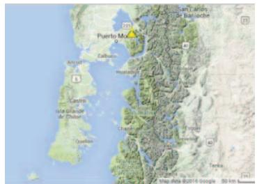
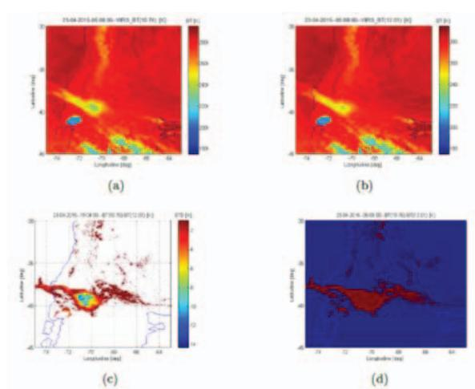
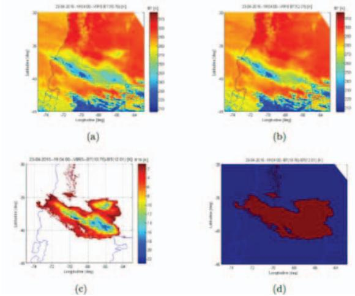
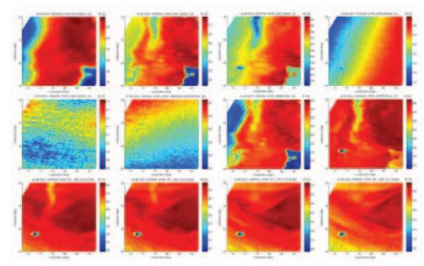
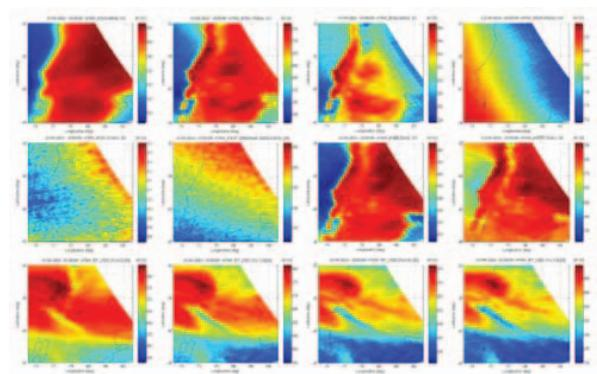
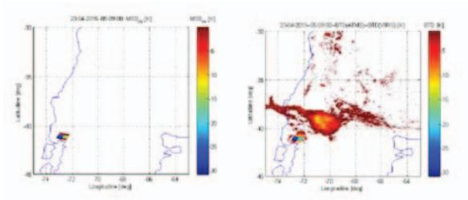
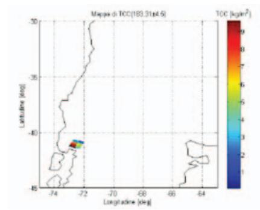
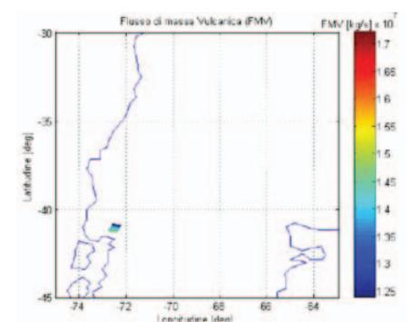

{0}------------------------------------------------

# **SPACEBORNE MICROWAVE AND INFRARED RADIOMETRIC OBSERVATIONS DURING THE SUBPLINIAN ERUPTION OF CALBUCO VOLCANO IN 2015**

*Frank S. Marzano1 , Mario Montopoli2 , Domenico Cimini3 , Arve Kylling4*

1 Sapienza University of Rome, Italy, 2 CNR-ISAC, Italy, 3 CNR-IMAA, Italy, 4 NILU, Norway

### **ABSTRACT**

Satellite microwave and infrared radiometric imagery, acquired during the recent Calbuco eruption in April 2015, are discussed to demonstrate the complementarity of microwave (MW) and thermal infrared (TIR) spaceborne observations for volcanic plume and ash cloud monitoring. TIR brightness temperatures clearly saturate in the proximity of the volcanic vent of the sub-Plinian column due to high optical extinction of the plume at those wavelengths. The use of microwave sounding can retrieve information below the volcanic plume top height, even though satellite MW radiometers still suffer of a relatively poor spatial resolution (tens of kilometers) with respect to TIR imagers (few kilometers). Preliminary estimates of tephra mass loading and plume height from MW data are also discussed.

*Index Terms—* Spaceborne radiometry, Microwave and infrared remote sensing, Volcanic plumes, Ash clouds.

## **1. INTRODUCTION**

Volcanic ejections divide into gas and solid emissions. The latter are made by mineral fragments with size from micrometers to several centimeters, generally referred as tephra . Both emissions represent one of the most impacting sources of natural pollution as well as a natural hazard for nearby communities. In this context the prediction of timespace dispersion of volcanic emissions is crucial for better defining the solar-Earth energy budget as well as ensuring enhanced safety standard for commercial flights [1]. However, there is still a lack of knowledge in the initialization of the volcanic transport and dispersion models (VTDM) Geophysical parameters characterizing the volcanic emission at the source (called source parameters), are of predominant interest for the initialization of VTDM [2], [3]. Source parameters of main interest would be the top altitude of the volcanic plume, strictly related to the flux of the mass ejected at the emission source and the distribution of volcanic mass concentration along the vertical column.

The recent Calbuco volcanic eruption in Chile is here considered as a case study. On the morning of April 23, 2015 the Calbuco started to erupt and its tephra column rose to heights more than 10 km. As a consequence the local authorities evacuated about 4000 people living nearby and some flight cancellations took place. The Calbuco plume was observed by the cross-track scanning Visible Infrared Imaging Radiometer (VIIRS) and the Advanced Technology Microwave Sounder (ATMS), both of them embarked on the LEO Suomi National Polar-orbiting Partnership (NPP) platform. This allowed acquiring unprecedented coincident images of the Calbuco eruption in the infrared (0.746 – 12.013 Pm) and microwave (23.8 – 183.31 GHz) spectrum with a nadir footprint of 750 m and from 15.8 km to 74.8 km, respectively.

Indeed, thermal infrared (TIR) brightness temperatures (BTs) are the most used to detect tephra particles (e.g., [4], [5]). This is due to the fact that the fine tephra absorbs more radiation than water and ice at 10.8Pm, while the reverse is true at 11.9Pm [6]. Thus the rightness temperature difference (BTD) between 10.8Pm and 11.9Pm brightness temperatures is taken as a proxy of the presence of ash when BTD, whereas its negative strength depends from the cloud optical thickness and particle mean size. However, when the absorption is particularly high, as near the volcano vent during eruption, both TIR channels tend to saturate and thus the difference becomes insensitive BTDain the proximity of the volcano vent [4]. In this respect microwave radiometric observations can play a synergic role [7].

In this work VIIRS and ATMS images during the recent Calbuco eruption are discussed to demonstrate experimentally the complementarity of microwave and TIR satellite observations for volcanic ash monitoring. This work, with the support of numerical modelling and other available satellite data, shall pave the way for a robust development of satellite microwave retrievals of volcanic source parameters for aiding the quality of VTDM outputs by improving their near-source parameter initialization.

### **2. CALBUCO AND SPACEBORNE DATA**

Calbuco is an active stratovolcano with a summit at 2003 m in Southern Chile and Argentina, South America located at - 41.33° S, -72.61° W (see Fig. 1). The first eruption that unexpectedly started at 21:08 UTC on April 22, 2015 followed 2 hours of strong seismic activity. Over 4000 people were evacuated or fled from an area within 20 km radius of the volcano during the first hours. Significant ash fall occurred in areas to the east and northeast of the volcano. The airport of Puerto Montt was closed. The first pulse only lasted

{1}------------------------------------------------

about 2 hours and was followed by a lava flow that was active by around 22:30 UTC. A large ash plume moved northeast and reached Villa Angostura and Bariloche in Argentina. In nearby areas, such as the Región de Los Lagos, up to 40 cm of ash were reported.

A second huge explosion occurred at 04:00 UTC on April 23, stronger than the first one. VAAC Buenos Aires reported ash from 12 km altitude up to 15-20 km. Pyroclastic flows occurred during the second eruption on the southeast flank, caused by partial collapse of the eruption column. Erupting jets of incandescent tephra (ash and bombs) during the eruption were accompanied by frequent lightning. Ballistic bombs were ejected to distances of up to 5 km. Strong seismic activity with a medium of 150 volcanictectonic earthquakes of magnitudes up to 3.6 were recorded during the paroxysmal phase of the eruption. Significant tephra fall of up to 50-60 cm occurred in nearby downwind areas, while in the more distant areas of Los Ríos and Araucaní some millimeters of ash fell. A third smaller explosion started at 02:30 UTC on April 24, 2015, producing more or less continuous small to moderate ash emissions. The latter have been reaching up to 2 km height and drifted mainly northeast and continuing till the midnight of April 25.

The goal of this work is to show how LEO-based satellite microwave (MW) radiometric measurements in the 50-183 GHz spectral range can complement satellite thermalinfrared (TIR) measurements at 10.8 micron and 11.9 micron in the detection of volcanic solid emissions in the area close to the volcanic fissure. Unfortunately, weather radar data could not be used to reinforce our arguments and verify or compare the retrievals from ground [8], [9].

Fig. 1. Calbuco volcano geographic location (in yellow).

### **2.1. TIR radiometric imaging**

The Calbuco eruption has been observed by VIIRS radiometer aboard the NPP satellite in two subsequent overpasses on April 23 at 05:08 and 19:08 UTC. Its imagery is shown in Figs. 2 and 3 where BTD is also computed. From negative BTD it is possible to derive the dispersal ash cloud mask in both images, but in Fig. 2 it is noted a region closer to the Calbuco vent where BTD is almost zero, but BTs clearly shows a depression due to tephra plume characterized by larger particles. This suggests that BTD cannot be used for plume discrimination near the source, but only for dispersal and distant ash cloud tracking (if no meteorological clouds are mixed or superimposed).

Fig. 2. VIIRS data on April 23, 2015 at 05:08 UTC. (a) BT at 10.8 micron (b) BT at 12.0 mm. (c) TIR BTD. (d) Ash cloud mask.

Fig. 3. The same of Fig. 2, but at 19:04 UTC.

### **2.2. MW radiometric imaging**

The Calbuco eruption has been observed by ATMS crossscanning MW radiometer in the same VIIRS overpasses on April 23 (see Figs. 4 and 5). Fig. 4 can be directly compared with Fig. 2 as well as Fig. 5 with Fig. 3. It emerges that a MW signature is detectable between 89 and 183 GHz at 05:09 UTC for the near-source plume, but not at 19:09 UTC for the dispersal ash cloud.

These MW signatures and their differences can be physically explained. Microwave radiometric observations hardly saturate due to optical extinction much lower than TIR so that they show a clear differential signature corresponding to volcanic tephra close to the volcano [10], [11]. On the other 

{2}------------------------------------------------

hand, the low resolution of MW observations, their poor sensitivity to finest tephra particles and their dependence to background emissions (e.g., surface, water vapor), makes MW observations much less sensitive to distal diluted ash cloud than TIR [10].

Fig. 4. NPP-ATMS brightness temperatures at 23.8, 51.76, 52.8, 54.94, 57.29r0.217, 57.29r0.322, 88.2, 165.0, 183.3r4.5, and 183.3r3.0 GHz, acquired at 05:09 UTC on April 23, 2015, over the Calbuco volcanic area.

Fig. 5. The same as in Fig, 1, but at 19:09 UTC on April 23, 2015.

#### **3. TEPHRA MW DETECTION AND RETRIEVAL**

The NPP satellite has the quite unique feature to carry a visible-infrared radiometer VIIRS and a ATMS microwave radiometer up to 183 GHz. We can exploit MW data to detect the tephra plume and combine with TIR data to track the dispersal ash cloud. A data fusion of the 2 TIR and MW images can be carried out by resampling and remapping ATMS MW image at lower resolution within the VIIRS TIR map grid.

### **3.1. MW detection of tephra plume**

Tephra plume can be detected by adapting to ATMS the microwave spectra difference in the window region (MSDW) defined as (in K) [10]:

$$MSD_W = BT_{QH}(165.0 \ GHz) - BT_{QV}(88.2 \ GHz)$$
 (1)

where QH and QV stands for quasi-horizontal and quasivertical polarization, respectively (due to the cross-scanning ATMS has a polarization which varies with the pointing angle). Tephra plume is detected when *MSDW*<*MSDWth* where *MSDWth* can be set to preliminarily to 0.

A map of negative *MSDW* at 05:09 UTC is shown in Fig. 6 where it is also combined with TIR BTD mask. The combination clearly show how MW and TIR signatures are complementary even though with a quite different spatial resolution (15 km at MW against 1 km at TIR).

Fig. 6. NPP image at 05:09 UTC (Left panel) MSDW mask positive values at microwaves. (Right panel) BTD mask values at TIR combined with resampled MSDW at MW.

#### **3.2. MW estimation of tephra plume**

Once detected, the near-source tephra plume can be characterized in terms of geometrical and physical properties.

In particular, we can use a parametric retrieval algorithm, developed on the basis of plume-radiation numerical model simulations [11], to retrieve the tephra columnar content or mass loading (in kg/m2 ) by:

$$L_t = a_t + b_t BT_{QH} (183.3 \pm 4.5 GHz)$$
 (2)

where the coefficients are *at*=112.23 and *bt*= -0.43. Results of tephra mass loading are shown in Fig. 7 where values up to 9 kg/m2 probably due to lapilli and bombs closer to the volcano vent (where TIR BTD is unable to detect ash).

Fig. 7. ATMS estimate map of mass loading from MW BT using the linear predictor in (2).

{3}------------------------------------------------

Indeed, MW BT can allow the estimate of the tephra plume top height  $H_t$ . From the same numerical simulations in [11], we have derived the following parametric polynomial estimator to estimate  $H_t$  above the vent (in km):

$$H_t = \sum_{n=0}^{5} c_n \left[ BT_{QH} (183.3 \pm 1.0 \ GHz) \right]^n$$
 (3)

where  $c_n$  are the regression coefficients ( $c_0$ =7066.80,  $c_1$ =171.97,  $c_2$ =1.67,  $c_3$ =-0.01,  $c_4$ =1.9510-5,  $c_5$ =-1.83 10-8). Results of estimated tephra top height show maximum values of about 18.7 km above the sea level. This estimate is higher than that retrieved far from the volcanic vent for the dispersal ash cloud, but it might be reasonable considering the strong mass eruption rate from the Calbuco eruption fissure.

Using a standard relationship linking the top plume height  $H_t$  to the mass flow rate  $F_R$  (MFR, in kg/s), i.e. [3]:

$$F_R = a_f H_t^{\ b_f} \tag{4}$$

where  $a_f$ = 140 and  $b_f$ = 4.15 are semi-empirical coefficients, we can transform each top height per pixel into a MFR map close to volcano vent. Results are shown in Fig. 8 where MFR up 1.7 107 kg/s can be noted, typical of intense sub-Plinian eruptions such as that of Calbuco volcano in 2015.

Fig. 8. ATMS estimate map of mass flow rate from MW BT using predictors (3) and (4).

#### 4. CONCLUSION

Satellite microwave and infrared radiometric imagery, acquired during the recent Calbuco eruption in April 2015, have been discussed to show how MW and TIR spaceborne radiometric observations are synergic for volcanic plume and ash cloud monitoring. Available imagery clearly show that TIR brightness temperatures saturate in the proximity of the volcanic vent of the sub-Plinian column due to high optical extinction of the plume at those wavelengths.

Results have shown that the use of ATMS microwave soundings with frequencies between 88 and 183 GHz can retrieve information below the volcanic plume top height, even though satellite MW radiometers exhibit a relatively poor spatial resolution with respect to TIR imagers.

Preliminary estimates of tephra mass loading and plume height (and mass flow rate) from MW data have been briefly discussed showing values which are reasonable from a volcanological point of view and are in agreement with qualitative ground observations.

Aknowledgment. This work has been partially funded by the EU-FP7 project FUTUREVOLC (Grant n. 308377) and from the EU-FP7 project APhoRISM (Grant n. 606738).

#### 5. REFERENCES

- Sparks, R.S.J., Bursik, M.I., Carey, S.N., Gilbert, J.S., Glaze, L., Sigurðsson, H., and Woods, A.W., Volcanic plumes. New York: John Wiley and Sons Ltd, 1997.
- [2] Barsotti S., A. Neri, J. S. Scire, "The VOL-CALPUFF model for atmospheric ash dispersal: 1. Approach and physical formulation", Journal of Geophysical Research, vol. 113, issue B3, pp. 1-12, 2008.
- [3] Mastin, L.G., Guffanti, M., Servranckx, R., Webley, P., Barsotti, S., Dean, K., Durant, A., Ewert, J.W., Neri, A., Rose, W.I., Schneider, D., Siebert, L., Stunder, B., Swanson, G., Tupper, A., Volentik, A., Waythomas, C.F, "A multidisciplinary effort to assign realistic source parameters to models of volcanic ash-cloud transport and dispersion during eruptions". J Volcanol. Geoth. Res. vol. 186, pp. 10-21, 2009.
- [4] Wen S., W. I. Rose, "Retrieval of sizes and total masses of particles in volcanic clouds using AVHRR bands 4 and 5", Journal of Geophysical Research, vol. 99, issue D3, pp. 5421-5431, 1994.
- [5] Kylling, A., M. Kahnert, H. Lindqvist and T. Nousiainen, "Volcanic ash infrared signature: porous non-spherical ash particle shapes compared to homogeneous spherical ash particles", Atmos. Meas. Tech., vol. 7, pp. 919-929, 2014.
- [6] Prata, A.J., "Infrared radiative transfer calculations for volcanic ash clouds", Geophys. Res. Lett., 16, 1293-1296, 1989
- [7] Delene D. J., W. I. Rose, N. C. Grody, "Remote sensing of volcanic clouds using special sensor microwave imager data", Journal of Geophysical Research, vol. 101, issue B5, pp. 11579-11588, 1996.
- [8] Marzano F.S., S. Marchiotto, C. Textor and D. Schneider, "Model-based Weather Radar Remote Sensing of Explosive Volcanic Ash Eruption", IEEE Trans. Geosci. Rem. Sensing, vol. 48, pp. 3591-3607, 2010.
- [9] Montopoli M., G. Vulpiani, D. Cimini, E. Picciotti, and F.S. Marzano, "Interpretation of observed microwave signatures from ground dual polarization radar and space multi frequency radiometer for the 2011 Grímsvötn volcanic eruption", Atmos. Meas. Tech.., ISSN: 1867-1381, vol. 7, pp. 7, 537–552, 2014.
- [10] Marzano, F.S., M. Lamantea, M. Montopoli, M. Herzog, H. Graf, and D. Cimini, "Microwave remote sensing of the 2011 Plinian eruption of the Grímsvötn Icelandic volcano", Remote Sens. Environ., vol. 129, pp. 168–184, 2013.
- [11] Montopoli M., D. Cimini, M. Lamantea, M. Herzog, H. Graf and F.S. Marzano, "Microwave radiometric remote sensing of volcanic ash clouds from space: model and data analysis", IEEE Trans. Geosci. Remote Sens., ISSN: 0196-2892, vol. 51, n. 9, pp. 4678-4691, 2013.