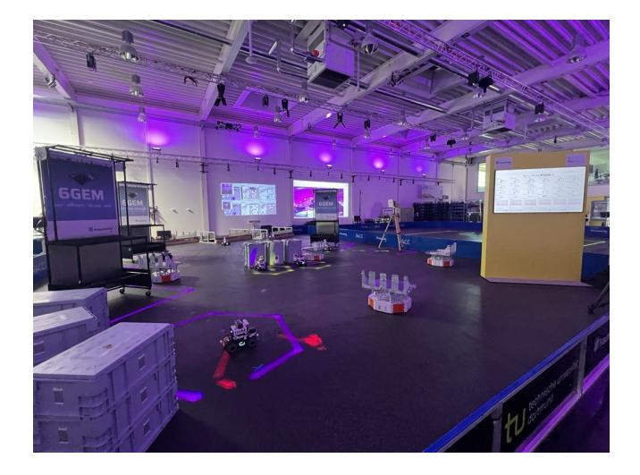
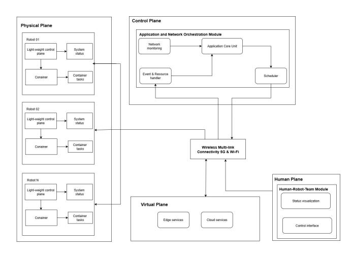
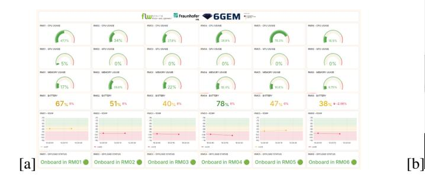
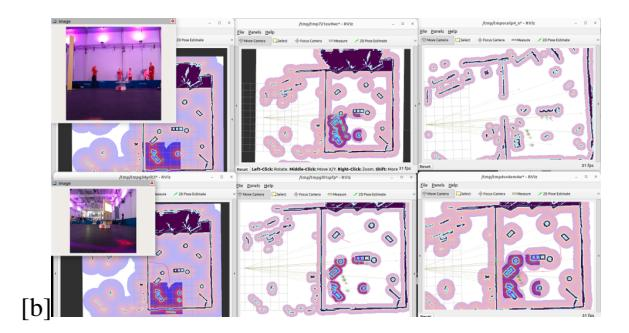

{0}------------------------------------------------

# Demo: Towards 6G-Enabled Multi-Robot Process Orchestration in Complex Logistics Environments

Julia Freytag *IoT and Embedded Systems Fraunhofer-Institute for Material Flow and Logistics* Dortmund, Germany julia.freytag@iml.fraunhofer.de

Irfan Fachrudin Priyanta *Chair of Materials Handling and Warehousing Technical University of Dortmund* Dortmund, Germany irfanfachrudin.priyanta@tu-dortmund.de

Rico Ahlbaumer ¨ *IoT and Embedded Systems Fraunhofer-Institute for Material Flow and Logistics* Dortmund, Germany rico.ahlbaeumer@iml.fraunhofer.de

Sonke Kauffmann ¨ *IoT and Embedded Systems Fraunhofer-Institute for Material Flow and Logistics* Dortmund, Germany soenke.kauffmann@iml.fraunhofer.de

Jan Emmerich *IoT and Embedded Systems Fraunhofer-Institute for Material Flow and Logistics* Dortmund, Germany jan.emmerich@iml.fraunhofer.de

*Abstract*—Autonomous mobile robots increasingly rely on sensor-rich perception and compute-intensive processing, posing challenges for energy efficiency and latency in dynamic environments. In this work, we present a Kubernetes-based implementation of the Human-Enhanced Robot Orchestration (HERO) framework, enabling context-aware, real-time robot process orchestration across cloud-edge nodes. Computation-intensive processes such as visual and LiDAR Simultaneous Localization and Mapping (SLAM), radar-based collision avoidance with 6Gdriven Joint-Communication and Sensing (JCAS) functionalities, and environment segmentation, are deployed dynamically based on environmental information, resource availability, network quality, and battery status of the robot systems. The framework is based on a microservice architecture that offers dynamic and adaptive workload placement and live migration of robotic containers across a 5G campus network. In this work, we demonstrate and evaluate the framework by comparing it to other process orchestration strategies. Our evaluation shows that the implemented framework offers longer process times without interruptions while maintaining efficiency in network usage and energy consumption. This is a first step towards enabling seamless dynamic and adaptive multi-robot process orchestration, exemplifying the future of cloud-native, AI-driven mobile networks and underlining its potential for intelligent fleet coordination and energy-efficient robot process execution.

*Index Terms*—Robotic Process Orchestration, Context-Aware Offloading, Kubernetes, ROS, Multi-Robot Systems.

## I. INTRODUCTION

A UTONOMOUS robotic systems are increasingly used in industrial and logistics environments, but their high reliance on high-resolution sensors and data-intensive processes often overwhelms local compute capabilities [2]. Traditional centralized approaches as well as static edge-cloud pipelines introduce latency and performance bottlenecks, which become critical under constrained battery or network conditions [1],

Fig. 1. In the logistics scenario, mobile robots transport goods while simultaneously running compute-intensive perception processes such as SLAM and segmentation. When local resources like battery or CPU become limited, these processes are dynamically offloaded to nearby idle robots, edge servers, or the cloud—based on real-time evaluations of network quality, energy status, and system load.

[7]. This limits uptime and scalability and leads to resource waste and operational delays [1], [4].

To address this, we present an implementation of the Human-Enhanced Robot Orchestration (HERO) framework [3], which supports adaptive and dynamic offloading, container-based process orchestration, and context-aware workload placement for robotic applications. The framework enables adaptive scheduling, offloading of robotic processes to idle robots, 5G-edge servers, or cloud nodes—depending on current context (e.g., environmental factors, battery, CPU, 

{1}------------------------------------------------

network quality). It is therefore implemented as a Kubernetesnative orchestration setup utilizing Robot Operating System (ROS) and is designed around cloud-native microservices.

The demonstration of the implemented framework, as presented in Figure 1, showcases a real-world application of context-aware and dynamic process orchestration, as well as containerized robotic workloads that operate resiliently in mobile, multi-robot environments. We further evaluate the framework by comparing three different robot process orchestration strategies:

- (1) no offloading and with static orchestration (constantly running all robotic processes),
- (2) constant offloading with static orchestration, and
- (3) dynamic, adaptive orchestration and offloading using our framework.

Our evaluation demonstrates that the framework significantly improves robot runtime, energy efficiency, and network usage. Compared to static orchestration strategies, it extends process runtime up to 4×, reduces energy consumption by 57.5%, and lowers average bandwidth usage by 26%. These improvements highlight the framework's potential for scalable, intelligent multi-robot orchestration in mobile 5G/6G environments.

#### II. STATE OF THE ART

Existing research has identified significant performance and energy trade-offs in robotic computation offloading. Djordjevic et al. [2] show how offloading over WiFi impacts energy and latency, while Mach and Becvar [7] review the architectural challenges of mobile edge computing. Studies by Caiazza et al. [1] and Gala et al. [4] emphasize how static edge–cloud pipelines introduce bottlenecks and energy inefficiencies under real-time constraints. To overcome such limitations, frameworks like FogROS2 [6] support ROS-based offloading, but often lack adaptive orchestration. Recent approaches based on deep reinforcement learning (DRL) dynamically offload workloads based on network and battery context [8], [10], [11], though most are limited to simulation. Kubernetes-based strategies such as FAOFE [9] enable function-aware container scheduling but lack real-time robot-specific decision logic. Closer to practice, OROS [5] couples robotic orchestration with 5G to optimize energy use and latency. In contrast, our implementation of the HERO framework by Freytag et al. [3] combines dynamic orchestration, context-aware process activation, and adaptive offloading, enabling resilient and efficient multi-robot execution in real-world 5G environments.

# III. SYSTEM OVERVIEW

## *A. Framework Implementation*

The implementation of the orchestration framework, as shown in Figure 2, is built on containerization and orchestration with Kubernetes, following microservices architecture principles. Robotic workloads, such as visual Simultaenous Localization and Mapping (SLAM), LiDAR SLAM, 6G-driven

Fig. 2. Overview of implemented components from HERO framework by Freytag et al. [3].

radar collision-avoidance with Joint-Communication and Sensing (JCAS), and semantic segmentation, are containerized and deployed dynamically across a cloud-edge continuum.

The implemented core modules from the HERO framework are:

- Application and Network Orchestration (ANO): Monitors compute status, network bandwidth, and battery levels. It makes real-time decisions to start processes depending on event-triggers or offload to appropriate nodes. The network operation functionalities have not been implemented in this work.
- Human-Robot-Team (HRT): Provides visual interfaces (dashboard, laser-based indicators, 3D point clouds) for situational awareness and optional manual override.
- The third core module, Emergency Handling (EH), from the HERO framework has not been implemented in this work.

The core modules are embedded within different functional planes: (1) control plane, (2) human plane, (3) virtual plane, and (4) physical plane. To ensure fault tolerance and scalability, all modules operate using a semi-decentralized control plane, allowing centralized logic and local autonomy. Robots can act as mobile compute nodes, supporting on-demand orchestration and load redistribution without central dependency. The entire framework is designed to leverage multi-link connectivity (e.g., 5G, Wi-Fi), and integration possibilites with network-aware scheduling enables selective offloading only in zones with high Quality of Service (QoS), making it directly compatible with predictive 6G concepts like network slicing and AI-native orchestration.

To enable efficient offloading e.g., for navigation processes, we leverage ROS 2 lifecycle nodes, which support starting, pausing, and stopping components on demand. Navigation and radar-based collision avoidance processes with existing maps is CPU-intensive but utilizes low-bandwidth (<1 MB/s), making it ideal for offloading to edge nodes. We deploy navigation stacks on both, robot and edge. The orchestrator

{2}------------------------------------------------

Fig. 3. Figure 2a shows the dashboard which provides a real-time overview of robotic process deployments, system status, and offloading decisions based on battery levels, compute load, and network conditions. Figure 2b shows the point clouds with real-time 3D environment data generated by the robots through visual SLAM, LiDAR, and radar-based collision avoidance, including mapped surroundings, obstacles, and semantically segmented objects relevant to the logistics process.

manages transitions via lifecycle service calls, pausing local nodes and activating remote ones without full system restarts. Visual and LiDAR SLAM processes demand higher bandwidth and are sensitive to frame drops. They further require consistent streaming update rate to maintain loop closure. This is handled over 5G Ultra-Reliable Low Latency Communication (URLLC) links to ensure low-latency and reliable data flow. Finally, people segmentation runs as a custom lifecycle node deployed across robots and a GPU-enabled edge server.

#### *B. Heuristic-Based Offloading Strategy*

Offloading decisions are based on real-time system metrics: CPU, GPU, memory usage, signal quality, battery level, and robot location. The system consists of multiple mobile robots and shared cloud as well as edge nodes. Robots with free capacity e.g., when charging, may act as temporary edge devices. The heuristic evaluates whether offloading is needed triggered by low battery or high resource usage. It initially assesses network conditions to ensure reliable and stable task offloading. Offloading is avoided in zones with poor network coverage, ensuring minimal downtime and process interruptions. Since all processes in this scenario are timecritical, offloading is prioritized to nearby available robots if they have sufficient capacity. If none are available, the edge server is selected. If both are unavailable, the process runs locally. The heuristic assigns higher offloading priority to more resource-demanding processes. The decision logic outputs a selected execution location and triggers the corresponding orchestration event.

# IV. DEMONSTRATION SETUP AND EVALUATION

#### *A. Description of Demonstration Scenario*

The demonstration scenario consists of an autonomous robot fleet in a logistics setup, as shown in Figure 1. It represents a dynamic warehouse environment where mobile robots transport goods while also executing compute-intensive processes (navigation with collision avoidance, SLAM, segmentation). The aim is to maintain uninterrupted material flow, extend robot uptime, and reduce overall local robot energy consumption. This scenario embodies adaptive robotic process orchestration in a real-world setting, using containerized microservices deployed via Kubernetes to respond to real-time conditions.

Key features of the demonstrated implementation include:

- Real-time workload migration: SLAM and segmentation processes will move between robots, edge, and cloud in response to real-time metrics.
- Context-aware decision making: Offloading is triggered by a combination of battery state, CPU/GPU/memory load, and current network conditions.
- Event-based deployment of robotic processes such as segmentation e.g. when being close to humans.
- Resilience in poor connectivity: No robot process migration occurs in low-bandwidth zones; robots maintain autonomous fallback locally.
- Visual analytics and control: A dashboard displays metrics, process placement, and system status, as presented in 3a. Further, SLAM point clouds and environment segmentation are presented live, as shown in 3b.
- Laser metaphors: Visual feedback is provided via laser pointers showing node status, active data paths, and offloading events.
- Idle robot utilization: Demonstrates the conversion of nearby unused robots into on-demand edge compute nodes to offload and execute processes.

In summary, Figure 3 illustrates the dashboard and point cloud views with real-time insight into process orchestration, showing how workloads shift with robot roles and offloading decisions. This enhances transparency, supports situational awareness, and lays the groundwork for future interactive control via the HRT module.

#### *B. Evaluation and Metrics*

We evaluate the framework by comparing three orchestration strategies: (1) no offloading and with static orchestration (constantly running all robotic processes), (2) constant offloading with static orchestration, and (3) dynamic, adaptive orchestration and offloading using our framework. Key metrics include bandwidth usage, number of offloading events, robot uptime without charging, and process continuity (the logistics process is considered interrupted when charging is required 

{3}------------------------------------------------

or offloading is not possible for robots reaching computation limits). We consider a 60-minute time window for the logistics scenario and repeat it multiple times to obtain consistent average values.

#### *C. Results*

We evaluate three orchestration strategies over 60 minutes for six robots, each running four compute-intensive processes. Strategy 1 runs all workloads locally, leading to early saturation and short runtime (avg. 15 min). Strategy 2 attempts full offloading, but due to edge and robot capacity limits, only three robots succeed. No bandwidth limits are reached due to our 5G URLLC-configured network setting, which can handle up to 9 concurrently offloading robots. This results in an average runtime of 37.5 min. Strategy 3 uses our dynamic and adaptive orchestration framework, offloading only when necessary ( 37% of time) and conditionally activating processes, reducing bandwidth and energy usage significantly. With this strategy all robots run uninterrupted.

TABLE I EVALUATION OF ORCHESTRATION STRATEGIES

| Metric            | Strat. 1    | Strat. 2  | Strat. 3 |
|-------------------|-------------|-----------|----------|
|                   | Local       | Offload   | Adaptive |
| Offload Rate      | 0%          | 100%      | ∼37%     |
| BW Usage (MB/min) | 0           | 132       | ∼97.7    |
| Energy Use        | 100%        | 85%       | 42.5%    |
| Avg. Runtime      | 15 min      | 37.5 min  | 60 min   |
| Logistics PTime   | 15 min      | 37.5 min  | 60 min   |
| Continuity        | Interrupted | Partial   | Full     |
| Edge Saturation   | X           | Saturated | X        |
| Net. Exceeded     | X           | X         | X        |

# V. CONCLUSION

The evaluation demonstrates that the implemented HERO framework extends uninterrupted robot runtime by 4× (from 15 to 60 minutes), improves network usage efficiency by 26%, and reduces energy and compute resource consumption by 57.5% compared to static orchestration strategies. These results validate the framework's effectiveness in enabling adaptive, context-aware robotic process orchestration in dynamic environments. By leveraging idle robots and cloud-edge resources intelligently, the orchestration framework increases operational efficiency and supports longer mission durations. Key takeaways are: (1) Runtime extended through dynamic offloading to edge nodes and idle robots, (2) Energy usage reduced via selective execution and adaptive scheduling, (3) Network efficiency improved by minimizing unnecessary offloading, and (4) Real-world orchestration demonstrated using Kubernetes-native DevOps tooling.

This work lays the foundation for scalable, cloud-native robotic systems in 5G/6G networks. Future enhancements will focus on learning-based and predictive task as well as 6Gdriven network scheduling for adaptive, low-latency orchestration, optimized task prioritization, and evaluations in complex scenarios.

#### ACKNOWLEDGMENT

This research is funded by the German Federal Ministry of Research, Technology, and Space (BMFTR) under the 6GEM Research Hubs initiative (grant numbers 16KISK041/16KISK038).

### REFERENCES

- [1] C. Caiazza, S. Giordano, V. Luconi, and A. Vecchio, "Edge computing vs centralized cloud: Impact of communication latency on the energy consumption of LTE terminal nodes," *Computer Communications*, vol. 194, pp. 213–225, Oct. 2022.
- [2] M. Dordevic, M. Albonico, G. A. Lewis, I. Malavolta, and P. Lago, "Computation offloading for ground robotic systems communicating over WiFi – an empirical exploration on performance and energy tradeoffs," *Empirical Software Engineering*, vol. 28, no. 6, p. 140, 2023.
- [3] J. Freytag, N. Ogorelysheva, I. F. Priyanta, S. Bocker, J. Jost, I. Kruijff- ¨ Korbayova, R. Grafe, C. Wietfeld, and A. Kirchheim, "HERO: A Cross- ´ Domain Human-Enhanced Robot Orchestration Framework for Seamless Multi-Robot Emergency Handling," in *Proc. IEEE Int. Symp. Safety, Security, and Rescue Robotics (SSRR)*, pp. 84–91, 2024.
- [4] G. Gala, T. Unte, L. Maia, J. Kuhbacher, I. Kadusale, I. Alkoudsi, ¨ G. Fohler, and S. Altmeyer, "Safety-Critical Edge Robotics Architecture with Bounded End-to-End Latency,", *arXiv preprint arXiv:2402.16420*, 2024.
- [5] M. Groshev, L. Zanzi, C. Delgado, X. Li, A. de la Oliva, and X. Costa-Perez, "Energy-aware Joint Orchestration of 5G and Robots: Experimen- ´ tal Testbed and Field Validation," *Journal of Cloud Computing*, 2025.
- [6] J. Ichnowski, K. Chen, K. Dharmarajan, S. Adebola, M. Danielczuk, V. Mayoral-Vilches, N. Jha, H. Zhan, E. Llontop, D. Xu, C. Buscaron, J. Kubiatowicz, I. Stoica, J. Gonzalez, and K. Goldberg, "FogROS2: An Adaptive Platform for Cloud and Fog Robotics Using ROS 2," *arXiv preprint arXiv:2205.09778*, 2023.
- [7] P. Mach and Z. Becvar, "Mobile Edge Computing: A Survey on Architecture and Computation Offloading," *IEEE Communications Surveys & Tutorials*, vol. 19, no. 3, pp. 1628–1656, 2017.
- [8] G. Nieto, I. de la Iglesia, U. Lopez-Novoa, and C. Perfecto, "Deep Reinforcement Learning techniques for dynamic task offloading in the 5G edge-cloud continuum," *Journal of Cloud Computing*, 2024.
- [9] L. Nkenyereye and B. G. Lee, "Functionality-aware offloading technique for scheduling containerized edge applications in IoT edge computing," *Journal of Cloud Computing*, 2025.
- [10] G. Qu, H. Wu, R. Li, and P. Jiao, "DMRO: A Deep Meta Reinforcement Learning-Based Task Offloading Framework for Edge-Cloud Computing," *IEEE Transactions on Network and Service Management*, vol. 18, no. 3, pp. 3448–3459, Sept. 2021.
- [11] X. Yuan, Z. Zhang, C. Feng, Y. Cui, S. Garg, G. Kaddoum, and K. Yu, "A DQN-Based Frame Aggregation and Task Offloading Approach for Edge-Enabled IoMT," *IEEE Transactions on Network Science and Engineering*, vol. 9, no. 2, pp. 875–887, 2022.