{0}------------------------------------------------

# Physical Layer Security for Authentication, Confidentiality, and Malicious Node Detection: A Paradigm Shift in Securing IoT Networks

Elmehdi Ill[i](https://orcid.org/0000-0002-7169-3698) , *Member, IEEE*, Marwa Qaraqe [,](https://orcid.org/0000-0003-0767-2478) *Senior [Mem](https://orcid.org/0000-0001-6082-2215)ber, IEEE*, Saud Althunibat [,](https://orcid.org/0000-0002-5017-5007) *Senior Member, IEEE*, Abdullah Alhasanat , *Member, IEEE*, Moath Alsafasfeh [,](https://orcid.org/0000-0002-3370-2928) Marcus de [Re](https://orcid.org/0000-0001-9829-0955)[e](https://orcid.org/0000-0002-7453-4019) , *Member, IEEE*, Georgios Manta[s](https://orcid.org/0000-0002-8074-0417) , *Member, IEEE*, Jonathan Rodriguez , *Seni[or](https://orcid.org/0000-0002-4402-7710) [M](https://orcid.org/0000-0002-4402-7710)ember, IEEE*, Waqas Ama[n](https://orcid.org/0000-0002-2443-1302) , and Saif Al-Kuwari , *Senior Member, IEEE*

*Abstract***—The pervasiveness of commercial Internet of Things (IoT) around the globe is expected to reach significant levels with the upcoming sixth generation of mobile networks (6G). Throughout the past years, wireless standardization units worldwide have been prominently active in the deployment and performance optimization of such IoT networks and fusing them with current and futuristic cellular networks. Nonetheless, the openness of wireless transmissions and the forecasted overwhelm in connected devices will provoke unprecedented security leakages and vulnerabilities. In addition to the key targets of the 6G and IoT, it has been of paramount importance to cater to decent and lightweight security mechanisms in ultra-massively connected heterogeneous networks. Recently, significant efforts have been made to pave the way for the integration of physical layer security (PLS) in contemporary and futuristic networks. The primary motivation behind its deployment resides in its low complexity and ability to provide information-theoretic secure transmissions, which alleviates the complexity burden caused by implementing complex cryptographic schemes. This survey overviews the recent advancement in PLS techniques with a particular interest in its application to the Internet of Things (IoT). We review essentially recent PLS techniques aiming at ensuring**

Manuscript received 16 February 2023; revised 10 July 2023 and 14 September 2023; accepted 18 October 2023. Date of publication 25 October 2023; date of current version 27 February 2024. This research was sponsored in part by the NATO Science for Peace and Security Programme under grant SPS G5797. *(Corresponding author: Elmehdi Illi.)*

Elmehdi Illi, Marwa Qaraqe, Waqas Aman, and Saif Al-Kuwari are with the College of Science and Engineering, Hamad Bin Khalifa University, Qatar Foundation, Doha, Qatar (e-mail: elmehdi.illi@ieee.org; mqaraqe@hbku.edu.qa; waman@hbku.edu.qa; smalkuwari@hbku.edu.qa).

Saud Althunibat is with the Department of Communications Engineering, College of Engineering, Al-Hussein Bin Talal University, Ma'an 00962, Jordan (e-mail: saud.althunibat@ahu.edu.jo).

Abdullah Alhasanat and Moath Alsafasfeh are with the Department of Computer Engineering, College of Engineering, Al-Hussein Bin Talal University, Ma'an 00962, Jordan (e-mail: abad@ahu.edu.jo; moath.alsafasfeh@ahu.edu.jo).

Marcus de Ree is with the Instituto de Telecomunicações-Aveiro, Campus Universitário de Santiago, 3810-193 Aveiro, Portugal (e-mail: mderee@av.it.pt).

Georgios Mantas is with the Instituto de Telecomunicações-Aveiro, Campus Universitário de Santiago, 3810-193 Aveiro, Portugal, and also with the Faculty of Engineering and Science, University of Greenwich, ME4 4TB Chatham Maritime, U.K. (e-mail: gimantas@av.it.pt).

Jonathan Rodriguez is with the Instituto de Telecomunicações-Aveiro, Campus Universitário de Santiago, 3810-193 Aveiro, Portugal, and also with the Faculty of Computing, Engineering and Science, University of South Wales, CF37 1DL Pontypridd, U.K. (e-mail: jonathan@av.it.pt).

Digital Object Identifier 10.1109/COMST.2023.3327327

**message confidentiality along with node/message authentication and malicious nodes' detection, where their corresponding application scenarios and underlying pros and cons are discussed. On top of that, we explore recent findings in the incorporation of cutting-edge technologies at the physical layer, such as nonorthogonal multiple-access, reconfigurable intelligent surfaces, joint communication and sensing, and optical wireless/Terahertz communications in boosting confidentiality and authentication at the physical layer. Lastly, promising extensions and future directions are discussed based on the quantified pros and cons of each PLS category, opening up ways for timely research directions within the topic and current/future challenges faced by PLS.**

*Index Terms***—Eavesdropping, Internet of Things, intrusion, malicious nodes detection, physical layer authentication, physical layer key establishment, physical layer security, radio-frequency fingerprinting.**

# NOMENCLATURE

| 5G   | Fifth Generation of Cellular Networks            |  |  |  |  |  |  |
|------|--------------------------------------------------|--|--|--|--|--|--|
| 5GB  | Fifth Generation of Cellular Networks and Beyond |  |  |  |  |  |  |
| 6G   | Sixth Generation of Cellular Networks            |  |  |  |  |  |  |
| ACK  | Acknowledgment                                   |  |  |  |  |  |  |
| AES  | Advanced Encryption Standard                     |  |  |  |  |  |  |
| AN   | Artificial Noise                                 |  |  |  |  |  |  |
| AP   | Authentication Probability                       |  |  |  |  |  |  |
| BCH  | Bose, Chaudhuri, and Hocquenghem                 |  |  |  |  |  |  |
| BGR  | Bit Generation Rate                              |  |  |  |  |  |  |
| BMR  | Bit Mismatch Rate                                |  |  |  |  |  |  |
| BS   | Backscattering                                   |  |  |  |  |  |  |
| BSD  | Backscattering Device                            |  |  |  |  |  |  |
| CFO  | Carrier Frequency Offset                         |  |  |  |  |  |  |
| CFR  | Channel Frequency Response                       |  |  |  |  |  |  |
| CIR  | Channel Impulse Response                         |  |  |  |  |  |  |
| CNN  | Convolutional Neural Network                     |  |  |  |  |  |  |
| COTS | Commercial Off-the-Shelf                         |  |  |  |  |  |  |
| CRP  | Channel-Response Pair                            |  |  |  |  |  |  |
| CSI  | Channel State Information                        |  |  |  |  |  |  |
| CSMA | Carrier Sense Multiple Access                    |  |  |  |  |  |  |
| DCTF | Differential Constellation Trace Figure          |  |  |  |  |  |  |
|      |                                                  |  |  |  |  |  |  |

DFT Discrete Fourier Tranform

DL Deep Learning

1553-877X c 2023 IEEE. Personal use is permitted, but republication/redistribution requires IEEE permission. See https://www.ieee.org/publications/rights/index.html for more information.

{1}------------------------------------------------

| DMN         | Dependent Malicious Nodes     |
|-------------|-------------------------------|
| <b>DMRS</b> | Demodulation Reference Signal |
| D. 3. T     | To 22 22 1                    |

DN Destination node
DNN Deep Neural Network
DP Detection Probability

DRL Deep Reinforcement Learning
DSSS Direct Sequence Spread Spectrum

ECC Error Correcting Code FAP False Alarm Probability FFT Fast Fourier Transform FSO Free-Space Optics

GAN Generative Adversarial Network
GLRT Generalized Likelohood Ratio Test

HT Hypothesis Testing

IIoT Industrial Internet of Things

IM Index ModulationIoT Internet of ThingsIQ In-Phase/Quadrature

IQI In-Phase/Quadrature ImbalanceITS Intelligent Transportation SystemsJCAS Joint Communication and Sensing

KNN K-Nearest Neighbors
LDPC Low-Density Parity-Check
LFM Linear Frequency Modulation

LoRa Long Range LoS Line of Sight

LPC Logarithmic Power Cosine
LSTM Long Short-Term Memory
MAC Message Authentication Code
MIMO Multiple-Input Multiple-Output
MISO Multiple-Input Single-Output

ML Machine Learning
MLi Maximum Likelihood
MLP Multilayer perceptron

MMSE Minimum Mean Squared Error

MTD Moving Target Defense NE Nash Equilibrium

NFC Near-Field Communication

NIST National Institute of Standards and Technology

NOMA Non-Orthogonal Multiple Access

OFDM Orthogonal Frequency Division Multiplexing

OWC Optical Wireless Communications

PA Power Amplifier

PAM Pulse Amplitude Modulation PCA Principal Component Analysis

PHY Physical

PLA Physical Layer Authentication
PLDC Physical Layer Data Confidentiality
PLKE Physical Layer Key Establishment

PLL Phased Locked Loop PLS Physical Layer Security PSD Power Spectral Density

PUF Physically Unclonable Function

QoS Quality of Service RF Radio-Frequency

RFF Radio-Frequency Fingerprinting
RFID Radio-Frequency Identification
RIS Reconfigurable Intelligent Surfaces

RNN Recurrent Neural Network
RSMA Rate-Splitting Multiple-Access
RSS Received Signal Strength
SCMA Sparse-Code Multiple-Access
SDR Software-Defined Radio
SER Symbol Error Rate

SIC Successive Interference Cancellation

SIMO Single-Input Multiple-Output SISO Single-Input Single-Output

SN Source Node

SOP Secrecy Outage Probability STFT Short-Time Fourier Transform SVM Support Vector Machine

THz TerahertzTS Test Statistic

TSOP Transmit Secrecy Outage Probability

UAV Unmanned Aerial Vehicle

UE User Equipment

USRP Universal Software Radio Peripheral

UWB Ultra Wideband
V2X Vehicle-to-Everything
VLC Visible Light Communication
VMD Variational Mode Decomposition
WFRFT Weighted Fractional Fourier Transform

WSN Wireless Sensors Network WVD Wigner-Ville Distribution

#### I. INTRODUCTION

THE INDISPENSABLE presence of wireless communications in our daily lives has been witnessing a paradigm shift throughout the past few years. Although the fifth generation (5G) has cemented its spot as a worldwide cellular technology, prospective visions for the sixth generation (6G) have already been a great research and innovation stimulus towards novel wireless systems [1]. 6G drives ambitious visions into pushing the data rates towards 1 Tbps of peak data rates with a latency of hundreds of microseconds [2]. Furthermore, Broad coverage and massive connectivity are expected to be attained by harnessing the involvement of cutting-edge technologies such as Terahertz (THz) and optical spectrum, i.e., free space optics (FSO) and visible light communications (VLC).

So far, the Internet of Things (IoT) has been a key protagonist in the design of 5G releases and futuristic 6G visions. With the continuous exponential increase in the amount of interconnected IoT devices over the globe, there has been a driving force to shift from rate-centric use-cases (i.e., 5G's enhanced mobile broadband class) towards ultra-reliable low-latency communications (URLLC) [3]. IoT use-cases have been ranging from smart home, smart factory, e-health, transportation, and surveillance, to cite a few [4], whereby the myriad of human-type and machine-type communications will create a heterogeneous network [5]. Such networks consist of low-power gadgets and sensors contributing to an ecosystem, whereby connected devices are typically powered by small and long-lasting batteries, e.g., Long Range (LoRa) devices powered by AAA batteries [6]. Therefore, such a prototype

{2}------------------------------------------------

of small-size and low-power gadgets paves the way to realize limited computational and storage resources onboard. IoT networks are so far deployed in a multi-standard fashion whereby sensors and lightweight devices are incorporated with various prototypes and specifications. A handful of wireless standards have been proposed and implemented for commercial IoT deployments; e.g., LoRa, ZigBee, and 5G for IoT [\[1\]](#page-35-0). Thus, countless efforts have been furnished to guarantee a decent performance of such heterogeneous lowpower IoT networks.

Futuristic wireless networks will not only bring a considerable boost in network performance but also consists of a paradigm shift in the provided applications and classes of services. However, numerous works from academia and industry made earlier predictions on the significant vulnerabilities such networks can exhibit. In fact, the overwhelming amount of connected IoT devices implies putting a great proportion of it at risk of being attacked or even compromised [\[7\]](#page-35-6). Due to the amalgamation of such evolutionary networks with vital applications; e.g., smart agriculture and e-health; compromising such networks may lead to not only accessing illegally confidential data but causing fatal consequences. For instance, IoT-aided agriculture might be subject to facility damage attacks, sensor failures, and control system intrusions [\[8\]](#page-35-7). Similarly, compromising smart gadgets implanted, such as blood pressure monitoring devices, can report false data about the patient's state to the central entity.

As a matter of practicality, cryptographic-assisted security has been a *panacea* for security concerns throughout the digital wireless networks journey over the past decades. The pioneering work of Shannon in 1949 [\[9\]](#page-35-8) provided an information-theoretic quantification of the secrecy amount in a cryptosystem defined by a given encryption and decryption functions pair and a key and message spaces. Essentially, Shannon's main findings consisted of the fact that perfect secrecy is achieved when the produced ciphertext and the message are independent. This implies that there exists a unique key connecting them. Nonetheless, a key assumption behind Shannon's perfect secrecy theorem is the one-time use of the key. This constraint imposes an overwhelming burden on low-power devices whereby the process of key exchange and distribution becomes quite complex in largescale heterogeneous networks [\[10\]](#page-35-9). Furthermore, the concept of perfect secrecy requires a key length of at least the data length, which adds another layer of complexity.

Modern cryptography provides *computational security* rather than *information-theoretic security*. It relies on complex mathematical one-way functions, rendering it nearly impossible to reverse the encryption operation (i.e., cryptanalysis) based uniquely on the captured ciphertext. Intuitively, the cornerstone of the whole approach depends on reliably distributing a secret key among communicating node pairs in the network. For instance, the Diffie-Hellman key exchange protocol, introduced in [\[11\]](#page-35-10), proposed a mathematical framework to securely distribute a key between a pair of nodes by utilizing the discrete logarithm problem (DLP). As such, data confidentiality can be achieved through encryption algorithms relying on the shared secret key, where they can be either asymmetric (public) key encryption; i.e., the two entities possess different public-private key pairs, or symmetric (private) key encryption, in which the two entities possess a single secret key for both encryption and decryption operations. The Rivest– Shamir–Adleman (RSA) and Advanced Encryption Standard (AES) cryptographic schemes are among the most widely used protocols for asymmetric and symmetric encryption, respectively. On the other hand, authentication and integrity are crucial processes in wireless communications security by which the purpose is to verify the source and the legitimacy of the message, respectively. Message authentication codes (MAC) and digital signatures are among well-known algorithms for generating a data or user-dependent fingerprint through irreversible hash functions, which can be used at the receiver's side to verify the source and the legitimacy of the received data [\[12\]](#page-35-11), [\[13\]](#page-35-12).

# *A. Motivation*

Despite being a custom for previous and current generations of cellular networks, the adoption of key-based encryption and authentication techniques seems not well-tailored to cope with the forecasted massive connectivity and high network heterogeneity. This latter raises a concern about dynamic key management and distribution in such dense networks [\[14\]](#page-35-13). Additionally, next-generation networks are expected to exhibit an intelligence aspect due to the inclusion of machine learning (ML) and artificial intelligence (AI) algorithms which expose an additional surface for predatory attackers to benefit from. Furthermore, the power limitation of IoT networks, longer key lengths due to the data size, high network heterogeneity, and the emergence of numerous delay-sensitive applications renders the use of Shannon-inspired key-based security mechanisms a serious Dilemma while transiting to the next generation networks. Consequently, there has been a worldwide consensus on the great potential offered by *physical layer security* (PLS)[.1](#page-2-0) The motives behind such enthusiasm date back to Wyner's pioneering work in 1975 [\[15\]](#page-35-14), in which, differently to Shannon's key-based perfect secrecy theorem, proposed benefitting from the enhanced channel capacity of the legitimate link compared to its eavesdropping counterpart to secure transmissions over a binary symmetric channel. This leads to defining the so-called secrecy capacity metric, referring to the maximum achievable link guaranteeing (i) decoding reliability at the legitimate receiver and (ii) a target equivocation rate at the eavesdropper. Therefore, transmission can be secured without relying on keys by designing secrecy capacity-achieving channel codes. Such an initial work was later extended to Gaussian channels [\[16\]](#page-35-15). Since then, there has been a belief that lightweight and secure transmissions can be designed with low overhead in a keyless fashion leveraging the PLS framework [\[17\]](#page-35-16). This essentially stimulated significant research culminating in a plethora of work, mainly during the past three decades.

1Throughout the literature, the concept of PLS broadly refers to the use of physical (PHY) layer attributes/parameters to secure the transmission. This includes achieving either confidentiality through physical layer key establishment or Wyner-inspired secrecy capacity-based PLS or authentication through PHY features/fingerprints.

{3}------------------------------------------------

In spite of that, the impressive benefits driven from the pretty PLS potential could not drive it further for standardization with cellular and IoT networks and hence, left its incorporation therein as a mirage. Particularly, this is due to the following main assumptions:

- Secrecy capacity-based PLS is founded assuming that the legitimate channel is always greater than the illegitimate (wiretap) one, which induces numerous implementation limitations,
- The process requires complex channel codes design where its validity is constrained upon the infinite blocklength assumption (i.e., very long codewords), which is quite challenging to achieve in IoT networks due to delay, power, and quality of service (QoS) constraints [\[18\]](#page-35-17).

On the other hand, confidentiality through PLS can be achieved by leveraging either the secrecy capacity-inspired work from Wyner's model, detailed in the previous two paragraphs, or also by extracting secret key bits from the channel. This is achieved by leveraging the inherent randomness manifested by wireless propagation in rich-scattering environments. Such a paradigm, considered as a subcategory of PLS, is often termed as physical layer key establishment (PLKE), whereby its philosophy is based on the fact that two legitimate protagonists observe the same, or practically in low mobility channels, very correlated channel observations, which can serve as a shared secret to derive a secret key [\[6\]](#page-35-5). As a matter of applicability, the efficiency of the whole PLKE framework, which generally follows a four-step procedure, is quantified by the amount of entropy the channel brings which is manifested in the distilled key sequence. On another front, malign users in a network are not often passive or attempting to solely eavesdrop/overhear the legitimate message, but rather they could be attempting to launch active attacks such as intrusion, spoofing, or Sybil attacks [\[12\]](#page-35-11). A typical security measure in such an instance is key-based authentication, where its applicability in power- and computing-constrained devices is still debatable. Promisingly, the received signals are rich in node-specific information that serve as a fingerprint to identify legitimate users from intruders/attackers. Generally, these device-related information, also known as (a.k.a) features, are either channel-based or device-based. While the former depends upon the node's position and benefits from channel rapid decorrelation property over short distances to discriminate between nodes, the latter is due to imperfections in the manufacturing process on the different radio-frequency chain components, which are so hard, if not impossible, to control. In addition to this, authentication can be ensured at the PHY layer relying on embedded tag signals along with the data one whereby the receiver is tasked to verify, using estimation and equalization techniques, the tag presence or absence. Such a framework, a.k.a physical layer authentication (PLA), has been gaining notable momentum through the past years [\[12\]](#page-35-11).

# *B. Related Work*

There have been an interesting amount of survey papers in the literature reviewing the security of IoT and futuristic wireless networks (e.g., 5G and beyond and 6G) from either confidentiality-based or authentication-based PLS (i.e., PLA) perspectives. A holistic view of related surveys on PLS in chronological order is mentioned in Table [I,](#page-4-0) highlighting the main contributions and covered topics by each work, along with the current one. For instance, Hamamreh et al. in [\[10\]](#page-35-9) reviewed broadly confidentiality-achieving PLS techniques, whereby a taxonomy framework was elaborated to adequately categorize the various PLS techniques for confidentiality, dealing essentially with PLKE and secrecy-capacity-inspired PLS. The authors of [\[6\]](#page-35-5) provided a thorough survey on PLKE techniques whereby the different elaborated experimental and theoretical related works were detailed. In addition to this, the aforementioned work provided insightful directions on the applicability of channel-assisted PLKE in various IoT standards. The work of Xie et al. [\[12\]](#page-35-11), being the first of its kind, reviewed the various work elaborated in PLA. Importantly, the authors performed a categorization of PLA techniques into active ones (i.e., tag-based) and passive ones (channel and device-based). Furthermore, a detailed review of PLS techniques in 5G and beyond (5GB) was elaborated by the authors in [\[14\]](#page-35-13) in which recent 5GB technologies were explored in terms of PLS gains and potential to achieve secure keyless transmissions and mitigate various types of attacks. This survey explored the perspective of using controllable radio environments; such as reconfigurable intelligent surfaces (RIS) and VLC; to achieve secure transmissions. Moreover, Nguyen et al. explored in their review work security techniques for 6G technologies [\[2\]](#page-35-1). Notably, this review inspected the work done on wireless security across the various network layers with a focus on AI and ML as tools for enhancing security, along with discussing their vulnerabilities. Besides that, several short surveys as in [\[17\]](#page-35-16), [\[19\]](#page-35-18) provided interesting insights into PLS based on their reviews along with promising capability to use PLS for enhancing the security level of next-generation and IoT networks. In addition to this, other survey papers on PLS, such as [\[2\]](#page-35-1), [\[14\]](#page-35-13), [\[20\]](#page-35-19) reviewed the full security stack, including the confidentiality-achieving PLS and PLA techniques.

# *C. Contributions*

The emergence of cutting-edge technologies as future candidates to form part of the 6G stimulated an interesting amount of work in the past few years, such as RIS, optical wireless communications (OWC); i.e., VLC, FSO; THz communications, non-orthogonal multiple access (NOMA), and backscattering (BS) communications. Furthermore, it is expected that the pervasiveness of the joint communication and sensing (JCAS) paradigm will grow over the next few years, whereby JCAS is expected to represent a crucial component in 5GB and 6G [\[14\]](#page-35-13). Compared with the abovediscussed surveys and tutorials, the current survey discusses the recent progress on PLS under its three main categories, namely PLA, PLKE and Wyner-inspired PLS (representing confidentiality-achieving PLS), and malicious node detection using PHY layer parameters. In particular, we propose a new categorization of PLS techniques, whereby we first

{4}------------------------------------------------

TABLE I COMPARISON OF RELATED SURVEYS ON PLS

| Work                         | Year | Survey/ Tutorial  | Confident. | Authent. | Malicious Nodes' Detection | Math. Background | ІоТ      | NOMA     | RIS      | BSC      | JCAS     |
|------------------------------|------|----------------------|------------|----------|----------------------------------|---------------------|----------|----------|----------|----------|----------|
| Trappe [17]                  | 2015 | Tutorial             | <b>√</b>   | ✓        | _                                | ✓                   | -        | _        | _        | _        |          |
| Xu et al. [21]               | 2016 | Survey & Tutorial | =          | <b>√</b> | _                                | _                   | _        | _        | _        | _        | ı        |
| Wang et al. [19]             | 2016 | Tutorial             | _          | ✓        | _                                | _                   | _        | _        | _        | _        | I        |
| Liu <i>et al</i> . [20]      | 2017 | Survey & tutorial    | <b>√</b>   | <b>✓</b> | _                                | ✓                   | _        | _        | _        | _        | -        |
| Wu et al. [22]               | 2018 | Survey               | <b>✓</b>   | _        | _                                | _                   | _        | ✓        | _        | _        | _        |
| Hamamreh et al. [10]         | 2019 | Survey & tutorial    | ✓          | _        | _                                | ✓                   | <b>√</b> | <b>✓</b> | _        | _        | _        |
| Zhang et al. [6]             | 2020 | Survey & tutorial    | <b>√</b>   | _        | _                                | ✓                   | <b>√</b> | _        | -        | -        | _        |
| Soltanieh <i>et al.</i> [23] | 2020 | Survey & tutorial    | _          | <b>√</b> | _                                | ✓                   | -        | _        | -        | _        | =        |
| Xie et al. [12]              | 2021 | Survey & tutorial    | _          | <b>✓</b> | _                                | _                   | <b>√</b> | _        | -        | -        | _        |
| Solaija <i>et al</i> . [14]  | 2021 | Survey               | <b>✓</b>   | ✓        | _                                | _                   | <b>√</b> | ✓        | <b>√</b> | <b>✓</b> | <b>√</b> |
| Nguyen et al. [2]            | 2022 | Short Survey      | <b>√</b>   | <b>✓</b> | _                                | _                   | <b>√</b> | <b>√</b> | <b>√</b> | -        | _        |
| Current work                 | 2023 | Survey & tutorial    | <b>√</b>   | <b>√</b> | <b>√</b>                         | <b>√</b>            | <b>√</b> | <b>√</b> | <b>√</b> | <b>√</b> | ✓        |

revisit the related recent work elaborated on confidentiality, authentication, and malicious nodes' detection at the PHY layer. In addition to that, recent work on PLS with cuttingedge technologies such as RIS, NOMA, THz communications, OWC, JCAS, and BS communications are discussed with further insightful conclusions on their potential to land in current and next generations networks such as 5GB, 6G, and IoT. A comprehensive quantification of the pros and cons of each explored technique is presented. In addition to this, we provide the reader and generalist in wireless communications with a mathematical background for analyzing and evaluating the performance of PLS schemes. Such an analytical toolbox, based on statistics and information theory, can assist the reader in grasping the PLS-related analytical background to design enhanced PLS schemes for futuristic wireless networks. To the best of our knowledge, this is the first survey/tutorial that (i) provides a detailed analytical framework for readers interested in understanding PLS concepts and (ii) considers a holistic view of PLS techniques achieving confidentiality, authentication, and malicious nodes' detection targets along with the exploitation of the aforementioned cutting-edge technologies in achieving quantum-secure transmissions.

## *D. Organization*

As shown in Fig. [1,](#page-5-0) the paper is organized considering the following outline: Section [II](#page-5-1) presents several preliminaries on security and PLS in particular, along with a notable mathematical background part detailing the informationtheory analytical framework used to assess PLS schemes' performance. Section [III](#page-8-0) introduces and reviews PLKE, representing a key enabler in reaching either PLA or confidentiality through PLS. Then, Section [IV](#page-12-0) reviews related work on PLA, considering channel- and device-based techniques along with key-based PLA ones. We devote Section [V](#page-24-0) to confidentialityachieving PLS techniques in the literature, mainly secrecy capacity-inspired (i.e., keyless) and key-based ones, while Section [VI](#page-31-0) presents a review of malicious node detection schemes leveraging PHY parameters. In Section [VII,](#page-32-0) insightful discussions are provided leveraging the driven lessons and conclusions from the various PLS categories, whereby several interesting research roads are unveiled. This section also discussed the current and future challenges impeding PLS implementation and technologies representing potential wayouts. Section [VIII](#page-34-0) concludes the work.

{5}------------------------------------------------

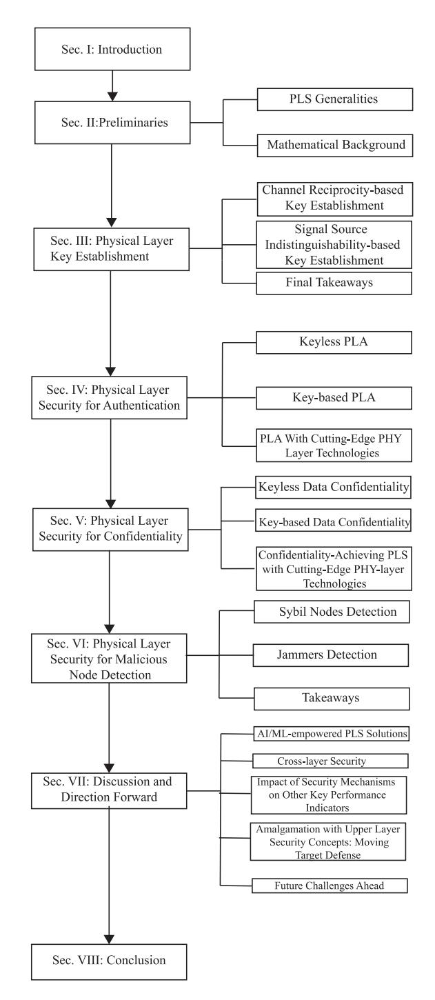

Fig. 1. Paper organization.

# II. PHYSICAL LAYER SECURITY PRELIMINARIES

## *A. PLS Generalities*

The notion of information security can be viewed from multiple dimensions, such as:

- *Privacy:* dealing with the preservation of the sender's identity or location from all other surrounding network nodes,
- *Confidentiality:* targeting the protection of data from being accessed/overheard by unauthorized third parties.
- *Authenticity:* Proving the genuineness and identity of the data sender.

• *Integrity:* Ensures that the message/data is not tampered with by the malicious attacker(s).

PLS aims at securing wireless transmissions and guaranteeing the four above-mentioned security pillars by leveraging physical layer parameters. The modern information security history dates back from Shannon's work in 1949 [\[9\]](#page-35-8), which provided a conceptual view of information security by introducing the concept of perfect secrecy in a cryptosystem, illustrated through the so-called one-time pad. The outcome of this pioneering work was that the feasibility of perfect secrecy through the one-time pad requires independence between the ciphertext and the plaintext message, implying the necessity of a secret key of which the ciphertext sequence and the key sequence are of equal length. This problem is also known as the key distribution problem and prevents the one-time pad from being implemented in practice. Nevertheless, this pioneering research led to the development of physical layer key establishment (PLKE) schemes [\[6\]](#page-35-5), a way to generate a pairwise key between two nodes by leveraging characteristics of the wireless channel. These established keys can be subsequently be utilized to perform an encryption operation at the physical layer (referred to in this survey as Physical-Layer Encryption) or in a conventional manner at the upper application layer.

From another front, Wyner's work [\[15\]](#page-35-14) inspected the notion of the wiretap channel, where information can be securely transmitted (without the need for a secret key) whenever the legitimate channel enjoys better channel conditions compared to its wiretap counterpart. Namely, the transmitter can exploit this advantage in the channel quality to encode the binary data with a channel code (i.e., a forward error-correcting code) in such a manner that the error-correcting capabilities allow the legitimate receiver to decode and retrieve the confidential data, whereas the channel-induced errors would be too many for the eavesdropper to correctly decode the data. Thus, it impedes such a malign user from retrieving the confidential data. This approach can ensure data confidentiality based on the so-called secrecy capacity (SC) metric.

On the other hand, though the aforementioned schemes can help in building a naturally intrinsic barrier by leveraging the PHY layer parameters, they can achieve only data confidentiality. Indeed, message or node authentication is a vital pillar of information security where its purpose targets guaranteeing the genuineness of the sender and its message and not being impersonated, spoofed, or tampered [\[12\]](#page-35-11), [\[17\]](#page-35-16). The uniqueness of the wireless channel in rich scattering environments as well as hardware impairments has been extensively reported as an efficient means to discriminate between nodes in a wireless network or to detect the presence of malicious nodes' behavior.

As conducted in previous surveys, the authors proposed various similar taxonomies to classify the variety of PLS techniques, such as the work in [\[14\]](#page-35-13), where a conceptual framework contains under the "Observable Plane" all channeland hardware-based features that can be measured, while "Modification Plane" contained several PLS techniques relying on the use of controllable channel, e.g., RIS, incorporating an authentication tag, or enhancing the signal-to-noise ratio (SNR) of the legitimate channel (i.e., secrecy capacity

{6}------------------------------------------------

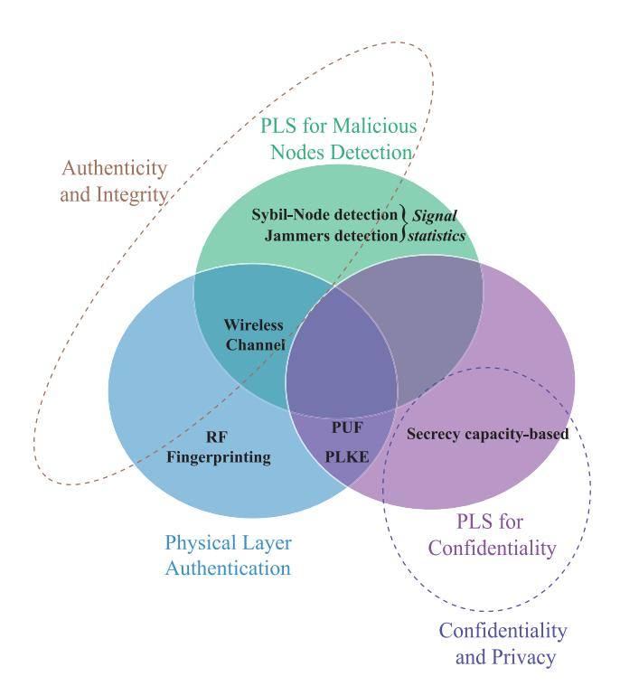

Fig. 2. Illustration of the three considered PLS categories and their fulfillment of information security pillars.

enhancement). Nonetheless, one can note that such two framework's planes cover both **authentication/integrity** and **confidentiality/privacy** *at once* and fail to provide a distinction between the two aforementioned security categories and the respective PLS techniques fulfilling each of them. On the other hand, though the work in [\[20\]](#page-35-19) distinguishes PLS techniques achieving **authentication/integrity** and **confidentiality/privacy** apart, it does not provide a comprehensive classification for each, particularly on the PLA techniques, whose proposed channel- and hardware-based subcategories can be further decomposed more thoroughly and comprehensively. In addition to this, the above works do not cover recent trends in wireless communications such as Terahertz, RIS, and non-orthogonal multiple access (NOMA). Other comprehensive PLS surveys (e.g., [\[6\]](#page-35-5), [\[10\]](#page-35-9), [\[12\]](#page-35-11), [\[22\]](#page-35-20)) propose taxonomies of PLS techniques achieving either **authentication** or **confidentiality**. Fig. [2](#page-6-0) presents a schematic view of the proposed taxonomy of PLS schemes in response to effectively fulfilling the main wireless information security pillars, namely *authenticity*, *integrity*, *privacy*, and *confidentiality*.

In the sequel, we will explore PLS mathematical framework, which is a crucial theoretical tool in assessing the performance of PLS schemes.

#### *B. Mathematical Background*

*1) Key-Based Confidentiality-Achieving PLS:* There are two main approaches that exploit the wireless channel in slightly different ways. One approach exploits the fact that the conditions of a wireless link connecting any two nodes at any particular moment in time are reciprocal. These channel conditions, the source of common randomness to the two nodes, can exploit this principle to establish a shared secret key. The main evaluation metrics of this channel reciprocitybased key establishment approach ensure the reliability and efficiency of the establishment of a shared secret key are as follows:

- *Key Entropy* is an indicator of a key's inherent randomness. The aim is to achieve maximum entropy in the eyes of the adversary such that its searchable key space (the set of all possible keys) follows a uniform probability distribution. The test suite by NIST [\[24\]](#page-35-21) is often utilized in experimental studies to verify the randomness of an established key.
- • *Bit Generation Rate (BGR)* is defined as the number of secret bits that are generated per unit of time. This metric is bounded by the channel coherence time since it is undesirable to generate key bits that are correlated. The channel coherence time, in turn, depends on movement within the environment of the legitimate nodes (i.e., spatial decorrelation) and based on movement from the legitimate nodes themselves (i.e., temporal variation). The BGR is, therefore, intricately linked to the dynamicity of the deployment scenario.
- • *Bit Mismatch Rate (BMR)*, also known as the bit disagreement rate, is defined as the ratio of mismatching bits with respect to the total number of generated bits [\[25\]](#page-35-22). These mismatches are based on deviations in a user's estimates of the channel characteristics. These deviations can be caused by the quality of the device's hardware or the implementation in time-division duplexing (TDD) systems [\[26\]](#page-35-23), [\[27\]](#page-35-24) (i.e., channel estimation signals are exchanged non-simultaneously). Full-duplex radio systems could limit the BMR, although IoT devices generally do not have these capabilities.

The other approach exploits the inherent challenge of mapping an anonymous transmission to the actual transmitter. The main idea behind this approach is that the two nodes exchanging anonymous signals are aware of their role (i.e., transmitter or receiver) and exploit this knowledge to establish a secret bit [\[28\]](#page-35-25). The main evaluation metrics of this signal source indistinguishability-based approach relate to guaranteeing temporal and spatial indistinguishability and robustness against active adversaries that inject their own anonymous transmissions.

- • *Temporal indistinguishability* means that the eavesdropper Eve is unable to determine the source of a transmitted data packet based on the transmit time (i.e., timing analysis). This can be achieved in carrier sense multiple access (CSMA)-based systems (e.g., 802.11 or 802.15.4) since it allows Alice and Bob to transmit at random times [\[29\]](#page-35-26), [\[30\]](#page-35-27), [\[31\]](#page-35-28), [\[32\]](#page-35-29) or through simultaneous transmission [\[33\]](#page-35-30).
- • *Spatial indistinguishability* means that Eve is unable to determine the source of a transmitted data packet based on signal propagation characteristics. Eve can exploit the received signal strength (RSS) for distance estimations (i.e., power analysis), the time delay between antennas in an antenna array for angle-of-arrival estimations (i.e., timing analysis), or signal frequency and

{7}------------------------------------------------

constellation symbol offsets caused by hardware imperfections for device fingerprinting (i.e., RF analysis) to identify the source of a data packet. Resiliency against power analysis can be achieved by allowing Alice and Bob to transmit with a random transmit power [30], [32], and resiliency against RF analysis can be achieved by measuring hardware-induced offsets in terms of amplitude, frequency, and phase and then tune the RF signals accordingly [31], [34].

- Robustness against key poisoning relates to the ability
  of an active adversary to inject its own anonymous data
  packets, which could be interpreted by Alice and Bob
  as a data packet transmitted by the other [29]. This
  key poisoning attack could prevent Alice and Bob from
  establishing a shared secret key since such an injection
  would cause Alice and Bob to append their key with a
  mismatching bit.
- 2) Keyless Confidentiality-Achieving PLS:
- a) Channel capacity: The channel capacity  $C_C$  defines as the maximum data rate  $R_C$  (i.e., the ratio between data and redundancy bits over a channel use) such that the transmitter and its intended receiver achieve reliability. Reliability indicates that the probability of having the noisy observation of the intended receiver decoded in error is arbitrarily small, i.e.,

$$\lim_{n \to \infty} \underbrace{P_e}_{\Pr\left[M \neq \hat{M}\right]} = 0, \tag{1}$$

where n is the codeword length corresponding to the adopted channel coding,  $P_e$  is the codeword error probability, M is the source message, and  $\hat{M}$  is the decoded one.

b) Secrecy capacity (SC): In order to define the SC, we consider a channel-coded communication between Alice and Bob (two legitimate parties) in the presence of an eavesdropper (Eve). Notably, the transmit rate depends essentially on the information message M and the codeword's length n as

$$R = \frac{\mathbb{H}(M)}{n} \tag{2}$$

where  $\mathbb{H}(.)$  is the entropy operator. On the other hand, assuming the eavesdropper is aware of the used channel code, we define the equivocation at the eavesdropper as

$$\Delta = \frac{\mathbb{H}(M|Z)}{\mathbb{H}(M)} \tag{3}$$

where Z is the observed codeword at Eve.

The secrecy capacity  $C_S$  is defined as the maximum data rate fulfilling a reliable transmission between Alice and Bob while conserving, at least, a target equivocation rate d, such that  $\Delta \geq d - \epsilon$  for small  $\epsilon$ , as [35]

$$C_S = \sup_R(R, d) \tag{4}$$

Reliability indicates that the probability of having the noisy observation of the intended receiver decoded in error is arbitrarily small, as detailed in (1). Secrecy indicates a certain positive equivocation rate at the eavesdropper, whereby this latter learns nothing about the data based on its noisy observation (i.e., the uncertainty about the message is unchanged after the eavesdropper receives its noisy observation). Per Wyner's

weak secrecy model, it was shown that there exists a strictly positive secrecy capacity, allowing information-theoretically secure communication exclusively through channel coding when the quality of the main channel is better than that of the eavesdropper channel [15], [36]. The secrecy capacity was shown to be the difference between the capacity of the main channel and the capacity of the eavesdropper channel, considering discrete memoryless channels [15] and Gaussian channels subject to fading impairments [16]:

$$C_S = \max\{C_C^{\text{(main)}} - C_C^{\text{(eve)}}, 0\}$$
 (5)

where for Gaussian channels, we have

$$C_C^{(x)} = \log_2(1 + \gamma^{(x)})$$
 (6)

where  $x \in \{\text{main}, \text{eve}\}\$ , and  $\gamma^{(x)}$  is the SNR at Bob/Eve. Thus, an achievable secrecy rate is a data rate  $R_S$  that is upper-bounded by the secrecy capacity as

$$R_S \in [0, C_S]. \tag{7}$$

c) Secrecy outage probability: The secrecy outage probability (SOP) is an extension of the secrecy capacity metric. It is defined as the probability that the secrecy capacity  $C_S$  falls below a target secrecy rate  $R_S$  for a given communication link in fading channels [37], [38]:

$$SOP = \Pr[C_S < R_S] \tag{8}$$

- 3) Authentication-Achieving-PLS (PLA): When dealing with PLA, the core interest is to leverage the intrinsic PHY Layer properties values at the authenticator, i.e., Bob (B), to authenticate communicating devices in the wireless network. At a given time instant t, Bob receives an authentication request signal from an unknown device  $X \in \{A, E\}$ , from which an attribute observation is estimated, i.e.,  $\hat{R}_t^{(X)}$ . To identify the legitimacy of the sender, B relies on a previously-stored reference value for the PHY Layer attribute from the previous communication round  $(\hat{R}_{t-1}^{(A)})$ , which is supposed to be retrieved from a legitimate transmission. To this end, there are two possible hypotheses built at B when guessing the sender's identity:
  - $\mathcal{H}_0$ : The sender is Alice (legitimate message), i.e.,

$$\hat{R}_{t}^{(X)} = R_{t}^{(A)} + n_{t}, \tag{9}$$

with  $n_t$  denoting the receiver's estimation noise,

•  $\mathcal{H}_1$ : The sender is Eve (forged message), i.e.,

$$\hat{R}_t^{(X)} = R_t^{(E)} + n_t, \tag{10}$$

To this end, B can use the likelihood ratio test (LRT), also known as the Neyman-Pearson lemma, to build his test statistic (TS) as [39]

$$\Lambda = \log \frac{f_{\hat{R}|\mathcal{H}_1} \left(\hat{R}_t^{(X)} | \mathcal{H}_1\right)}{f_{\hat{R}|\mathcal{H}_0} \left(\hat{R}_t^{(X)} | \mathcal{H}_0\right)}$$
(11)

where  $f_{\hat{R}|\mathcal{H}_1}$ ,  $(\hat{R}_t^{(X)}|\mathcal{H}_i)$ , i=0,1 is the probability density function (PDF) of the estimated feature  $R_t^{(X)}$  under either  $\mathcal{H}_0$  (mean equals  $\mu_0$ ) or  $\mathcal{H}_1$  (mean equals  $\mu_1$ ). Finally, B's task

{8}------------------------------------------------

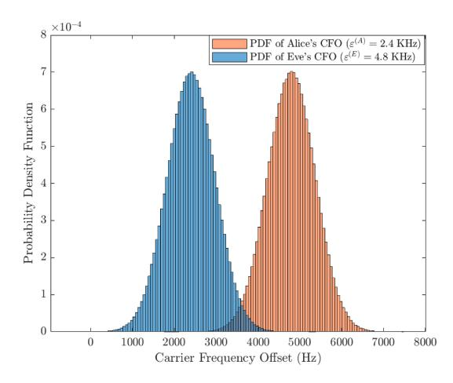

Fig. 3. PDF of two observed carrier frequency offset values from two nodes (e.g., Alice and Bob).

is to perform a simple comparison with a predefined threshold  $(\alpha)$ , known as hypothesis testing (HT), to infer which of the two hypotheses (i.e., sender's identity) took place in reality as

$$\Lambda \underset{\mathcal{H}_{1}}{\lessapprox} \alpha \tag{12}$$

Example 1: Carrier frequency offset (CFO) is among the well-known hardware features used for device identification. As an example to understand the above analytical LRT framework, let us consider a legitimate noisy CFO observation at the first phase, referred by time instant t-1 (i.e., training phase), modeled as a Gaussian random variable, i.e.,  $\hat{\varepsilon}_{t-1}^{(A)} \sim \mathcal{N}(\mu_0,\sigma^2)$ . It has been shown in [40] that an unbiased CFO estimator has a mean value of the true CFO, i.e.,  $\mu_0 = \varepsilon^{(A)}$ , as illustrated with the PDF plot of A and E's CFO, given by Fig. 3. In the subsequent time instant (i.e., Phase II), B receives a signal from an unknown user and aims to unveil whether it is a malign or benign one relying on the estimated CFO value  $\hat{\varepsilon}_t^{(X)}$ . Thus, there are two potential scenarios in hand:

• 
$$\mathcal{H}_0$$
:  $\hat{R}_t^{(X)} \sim \mathcal{N}\left(\underbrace{\mu_0}_{\varepsilon^{(A)}}, \sigma^2\right)$ 
•  $\mathcal{H}_1$ :  $\hat{R}_t^{(X)} \sim \mathcal{N}\left(\underbrace{\mu_1}_{\varepsilon^{(E)}}, \sigma^2\right)$ 
hus, by incorporating the Gaussian PDF into (11),  $E$ 

Thus, by incorporating the Gaussian PDF into (11), B computes the LRT as follows

$$\Lambda \propto \left(2\hat{R}_t^{(X)} - \mu_1 - \mu_0\right)(\mu_1 - \mu_0)$$
 (13)

- a) Performance evaluation: The presence of noise in the imperfect PHY layer attribute's estimate leads definitely to several discrepancies in the observation, which cause two standards types of errors as:
  - 1) False Alarm Probability (FAP): Also known as Type I Error, such a probability measures the rate at which the null hypothesis  $\mathcal{H}_0$  is falsely rejected after conducting the HT in (12). In other words, it corresponds to the rate

of wrongly rejecting Alice's message, taking place with probability

$$P_{\text{fa}} = \Pr[\Lambda \ge \alpha | \mathcal{H}_0] \tag{14}$$

The complementary of the FAP is known as the authentication probability (AP), which defines the ratio of times a legitimate message is successfully authenticated;

$$P_{\text{auth}} = 1 - P_{\text{fa}} \tag{15}$$

2) Mis-detection Probability (MDP): This probability defines the rate at which  $\mathcal{H}_0$  is falsely claimed given that  $\mathcal{H}_1$  took place in reality, i.e., incorrectly authenticating Eve's message, defined as

$$P_{\rm md} = \Pr[\Lambda < \alpha | \mathcal{H}_1] \tag{16}$$

In a similar way to the AP and FAP, we define the detection probability (DP) as the complementary of the MDP, showing the probability of correctly rejecting a malign user's message

$$P_{\rm d} = 1 - P_{\rm md} \tag{17}$$

b) Generalized likelihood ratio test (GLRT): So far, we have explored the LRT as a standard tool for PLA's HT and to identify a malicious node's transmission from the estimated PHY Layer properties from the received signals. Nonetheless, it can be obviously seen from (13) that the LRT computation requires the knowledge of the true legitimate attribute's mean value  $(\mu_0)$  and the illegitimate's one  $(\mu_1)$ . In practice, only a noisy observation is available from the training phase  $(\hat{R}_{t-1}^{(A)})$ . In such a scenario, the GLRT can be used for HT, where  $\mu_0$  in (13) is substituted by its maximum likelihood (MLi) estimate  $(\hat{\mu}_0 = R_{t-1}^{(A)})$ , corresponding to Phase I's observation (reference authentic one). On the other hand, as the illegitimate feature's value  $(\mu_1)$  is unknown, its corresponding MLi estimate is used as  $\hat{\mu}_1 = \hat{R}_t^{(X)}$ , which corresponds to the current feature observation in Phase II. Thus, it produces the following TS

$$\Lambda \propto \left(\hat{R}_t^{(X)} - \hat{R}_{t-1}^{(A)}\right)^2 \tag{18}$$

The same HT (12) is used with the GLRT's TS above in (18).

#### III. PHYSICAL LAYER KEY ESTABLISHMENT

This section covers the concept of PLKE, an approach where one or more users exploit characteristics of the wireless channel to establish a secret key that will only be known to a select number of users [41]. This definition of key establishment encompasses key generation, key agreement, and key distribution. PLKE is an enabler of key-based authentication schemes (i.e., the utilization of a secret key to generate certain data/signals which prove to the receiver that the source has knowledge of said key and therefore authenticates the source) and key-based confidentiality schemes (i.e., the utilization of the secret key, and only this key, would reveal the information of received obfuscated data) and can therefore be considered as an independent PLS primitive. Two approaches for PLKE are covered, the channel reciprocity-based approach and the

{9}------------------------------------------------

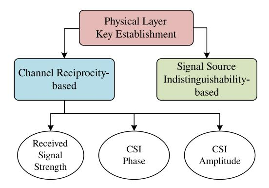

Fig. 4. The main categorization for physical layer key establishment.

signal source indistinguishability-based approach, as shown in Fig. [4.](#page-9-0)

The scope of the PLKE approaches is based on the inability of the users to choose the sequence of bits that they wish to securely transmit. If so, the approach only allows the users to exchange a random sequence of bits which can only be utilized for key establishment. Otherwise, the approach allows the users to directly transmit selected messages in a confidential manner and thus does not require key establishment (i.e., approaches directly applicable to physical layer-based data confidentiality).

## *A. Channel Reciprocity-Based Key Establishment*

The channel reciprocity-based key establishment approach takes advantage of the reciprocity of channel characteristics as the common source of randomness to the users that share said channel. Three main principles are involved: the channel reciprocity principle, the temporal variation principle, and the spatial decorrelation principle. Channel reciprocity implies that the wireless channel and its characteristics (e.g., channel gain, phase shift, CIR) between two users is reciprocal since simultaneously exchanged signals would propagate along the same (multi-)path(s) to reach the other user. Temporal variation implies that the channel characteristics shared between two users change with time due to changes within the environment that affect the reflection, refraction, and scattering of the signal propagation path(s). Finally, spatial decorrelation implies that the channel characteristics between two users are decorrelated in space, typically specified as one half-wavelength. It is worth mentioning that the spatial decorrelation within one halfwavelength is based on Jakes' theoretical model and assumes a rich multipath environment with uniform scattering and without a line-of-sight (LoS) connection [\[42\]](#page-35-39). The combination of these principles allows any pair of users to extract bits from the shared randomness of their wireless channel (due to channel reciprocity) in an iterative manner (due to temporal variation), which are secret with respect to other nearby users (due to spatial decorrelation).

Channel reciprocity-based key establishment schemes generally follow a four-step process, as shown in Fig. [5.](#page-9-1) These steps include channel probing, quantization, information reconciliation, and privacy amplification.

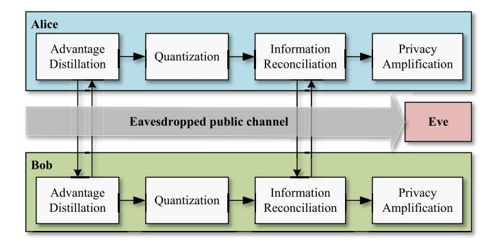

Fig. 5. The general 4-step model of the channel reciprocity-based key establishment approach.

- 1) *Channel Probing:* In this step, Alice and Bob exchange pre-determined pilot signals with the aim of estimating certain characteristics of their shared channel. To ensure correlation between channel estimates, Alice and Bob should transmit their pilot signals within their channel's coherence time (a measure for the minimum amount of time required for the channel characteristics to become uncorrelated from their previous state). Population channel characteristics include the receiver signal strength (RSS) [\[43\]](#page-35-40) and channel state information (CSI) [\[20\]](#page-35-19).
- 2) *Quantization:* In this step, Alice and Bob take their channel estimates and convert these into binary sequences. The aim of a quantization scheme is to maximize the bit generation rate (BGR) while keeping the bit mismatch rate (BMR), a contrasting metric, below a certain threshold [\[44\]](#page-35-41). Methods for increasing the BGR include the quantization of multiple channel characteristics or through increasing the number of quantization intervals of a channel characteristic [\[26\]](#page-35-23). Methods for reducing the BMR include the rejection of channel estimates that fall within a close range of a quantization threshold and minimizing the time delay between channel probing exchanges [\[26\]](#page-35-23), [\[27\]](#page-35-24).
- 3) *Information Reconciliation:* In this step, Alice and Bob determine which of the bits in their bit sequences disagree by exchanging information related to their bit sequences. This exchange of information is accessible to an eavesdropper that will be able to learn some amount of information about their bit sequence [\[27\]](#page-35-24), [\[44\]](#page-35-41). Information reconciliation methods include error correcting codes (e.g., BCH codes [\[45\]](#page-36-0), [\[46\]](#page-36-1), Reed-Solomon codes[\[47\]](#page-36-2), Golay codes[\[48\]](#page-36-3), [\[49\]](#page-36-4), LDPC codes [\[50\]](#page-36-5), [\[51\]](#page-36-6), [\[52\]](#page-36-7), [\[53\]](#page-36-8), or Turbo codes [\[54\]](#page-36-9)) and fuzzy techniques (e.g., CASCADE [\[25\]](#page-35-22), [\[55\]](#page-36-10), [\[56\]](#page-36-11), [\[57\]](#page-36-12)).
- 4) *Privacy Amplification:* In this step, Alice and Bob negate the information leakage that occurred during the information reconciliation step by using their error-free bit sequence as the input for an extractor [\[58\]](#page-36-13), [\[59\]](#page-36-14) or universal hash function [\[60\]](#page-36-15), [\[61\]](#page-36-16). The output is a secret key known only to Alice and Bob, occasionally confirmed through a final secret exchange [\[62\]](#page-36-17). This shared secret key can subsequently be used to achieve authentication or confidentiality.

{10}------------------------------------------------

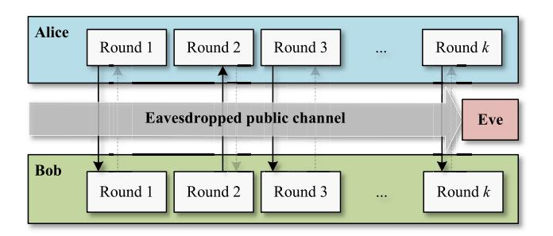

Fig. 6. The general model of the signal source indistinguishability-based key establishment approach. The diagram shows the exchange of anonymous signals where faded arrows indicate a potential secondary transmission per round.

The channel reciprocity principle has been verified for indoor environments in [\[63\]](#page-36-18), [\[64\]](#page-36-19), [\[65\]](#page-36-20) and the temporal variation principle has been verified for both indoor and outdoor environments in [\[25\]](#page-35-22), [\[48\]](#page-36-3). The spatial decorrelation principle was confirmed by [\[63\]](#page-36-18), [\[64\]](#page-36-19), [\[65\]](#page-36-20), [\[66\]](#page-36-21) although found not to hold by [\[67\]](#page-36-22), [\[68\]](#page-36-23), [\[69\]](#page-36-24). These conflicting results may be due to its reliance on a rich multipath environment. To counteract leaking information to an eavesdropper when the spatial decorrelation principle does not hold, it was suggested in [\[70\]](#page-36-25) to generate longer bit sequences to achieve an arbitrary security gap from which subsequently secret keys can be generated. On the other hand, PLKE process also manifests some vulnerabilities against jamming attacks by a malicious node attempting to break the channel reciprocity by broadcasting to both legitimate parties jamming signals to degrade their CSI estimates. For instance, the authors in [\[71\]](#page-36-26) introduced and analyzed jamming attacks in PLKE in the presence of a multi-antenna malign node broadcasting jamming signals to both Alice and Bob with the aim of mounting a man-in-themiddle attack. The authors proposed a pilot randomization and a game-theoretic optimal power allocation approach to counter such jamming attacks.

A summary of notable works on channel reciprocity-based PLKE is summarized in Table [II.](#page-11-0) Furthermore, for more information on channel reciprocity-based key establishment, we refer the reader to the surveys [\[26\]](#page-35-23), [\[44\]](#page-35-41), [\[72\]](#page-36-27), [\[73\]](#page-36-28), [\[74\]](#page-36-29).

# *B. Signal Source Indistinguishability-Based Key Establishment*

The signal source indistinguishability-based key establishment approach takes advantage of the intrinsic challenge of mapping an anonymous transmission (i.e., no local identifiers were used in the data transmission) to the actual transmitter. The main idea behind this approach is that Alice and Bob, participating in the protocol, are aware of their role (i.e., transmitter or receiver) in an anonymous transmission and utilize this knowledge to establish a secret bit [\[28\]](#page-35-25). Repetition of this process allows Alice and Bob to generate a secret key. The general model for this approach is shown in Fig. [6.](#page-10-0)

Alice and Bob can broadcast anonymous data packets where Alice's packets contain the complement of the intended bit value and Bob's packets contain the intended bit value for their shared key. Since an eavesdropper Eve is unable to determine the source of these data packets, it is unable to determine the bit values of Alice and Bob's shared key. This method for key establishment was proposed by [\[30\]](#page-35-27), [\[32\]](#page-35-29) although other variants exist. In [\[29\]](#page-35-26), Alice and Bob would broadcast empty data packets but fill the source field with their own name (the destination field contains the other) when they wish to convey the 1-bit for their shared key and the other's name (destination field contains their own) when they wish to convey the 0-bit for their shared key. In each of these schemes, the order of exchanging data packets is determined by a random process. In [\[31\]](#page-35-28), Alice and Bob both exchange anonymous data packet at a random time during each round and determine the secret bit based on the transmission order. If more than 2 anonymous signals are received per round (i.e., indicating malicious behavior), they discard that round of exchanges. In [\[33\]](#page-35-30), Alice and Bob utilize a full duplex transducer to transmit on a frequency *f*0 and listen on another frequency *f*1. During each round of exchanges, they either experience a collision (i.e., both transmit on the same frequency and listen to the other) or a successful exchange. In the case of a successful exchange, they append their secret key with the 0-bit when Alice and Bob transmit at *f*0 and *f*1, respectively, and append their secret key with the 1-bit when Alice and Bob transmit at *f*1 and *f*0, respectively. Unfortunately, IoT devices generally do not support full duplex, which limits the merits of this scheme. In Table [IV,](#page-13-0) we summarize some notable works elaborated in the context of signal source indistinguishabilitybased PLKE.

#### *C. Final Takeaways*

- The channel reciprocity-based approach relies quite heavily on the existence of a rich multipath environment to randomize the channel characteristics such that they are indeterminable by an eavesdropper. However, Alice and Bob will always have an advantage in terms of the cross-correlation between their measurements of channel characteristics with respect to that of Eve, which is a security gap that can be exploited independent of the deployment scenario, channel characteristic, and eavesdropper's capabilities. This approach is, therefore, highly attractive for IoT networks.
- • The performance of any channel reciprocity-based scheme highly depends on the chosen channel characteristic (i.e., RSS or CSI). Namely, the coarse-grained nature of RSS measurements compared to the finegrained nature of CSI measurements allows CSI-based schemes to achieve a higher BGR and a lower BMR for established keys achieving similar levels of entropy [\[50\]](#page-36-5). Unfortunately, the majority of COTS network interface cards (NICs) do not make CSI measurements available outside of the hardware, which complicates experimental validation and performance evaluation of such schemes for IoT devices [\[6\]](#page-35-5).
- The novel communication technologies of RIS and mmWave could be exploited to further reduce the ability of an eavesdropper to observe cross-correlated channel

{11}------------------------------------------------

TABLE II SUMMARY OF NOTABLE WORKS IN CHANNEL RECIPROCITY-BASED PLKE APPLICABLE FOR IOT NETWORKS

| Param. | Notable work                | Year | Contribution                                                                                                                                                                                                                                                                                                                                                                                                                                                                                                         | Pros                                                   | Cons                                           |
|--------|-----------------------------|------|----------------------------------------------------------------------------------------------------------------------------------------------------------------------------------------------------------------------------------------------------------------------------------------------------------------------------------------------------------------------------------------------------------------------------------------------------------------------------------------------------------------------|--------------------------------------------------------|------------------------------------------------|
|        | Patwari <i>et al</i> . [75] | 2010 | This work is proposed for dynamic environments and thus benefits from the rapid decorrelation of channel characteristics. It is envisioned for 802.11 and 802.15.4 systems and was implemented on 802.15.4-compliant TelosB motes. It utilizes interpolation on channel estimates and a multi-bit quantization scheme to achieve a BGR of up to 22 bits/sec and a BMR of 2.2%.                                                                                                                                       |                                                        |                                                |
|        | Wilhelm et al. [62]         | 2013 | The randomness within frequency-selective channels of 802.15.4 is exploited. An implementation on MicaZ motes shows that a static channel allows the generation of a 50-bit key from the 16 channels of the 2.4GHz band with a key agreement rate of 97%.                                                                                                                                                                                                                                                            |                                                        |                                                |
|        | Premnath et al. [56]        | 2014 | This work extends [75] with information reconciliation and privacy amplification. Also, the scheme achieves spatial diversity through the cooperation of groups of single-antenna devices. An implementation on 802.15.4-compliant TelosB motes achieves a BGR of 47 bits/sec with a BMR of 5.5%.                                                                                                                                                                                                                    | Built-in indicator                                     | Coarse-grained feature ⇒ Low BGR and key |
| RSS    | Liu <i>et al</i> . [48]     | 2014 | This work enables secret group key establishment without requiring individual links to be secured a priori. An implementation on 802.15.4-compliant MicaZ motes achieves a BMR between 1% to 7% depending on the number of quantized bits per sample in dynamic environments.                                                                                                                                                                                                                                        | in all commercial -off-the-shelf (COTS) devices  | Different interpretations                      |
|        | Ali <i>et al.</i> [76]      | 2014 | This work is tailored for IoMT devices. It utilizes the fast component of RSS measurements to deduce whether the environment is sufficiently dynamic for key extraction and, if so, utilizes the slow component (determined by the Savitzky-Golay filter) for bit quantization. An implementation on MicaZ motes shows that a 128-bit secret key can be generated with a key agreement rate above 99% without the need for information reconciliation although requiring 10-30 minutes depending on the environment. |                                                        | per each manufacturer                       |
|        | Zhu et al. [57]             | 2017 | This work is designed for vehicular networks. It utilizes a weighted sliding window to smooth out RSS measurements (although an initialization period of circa 10 sec is necessary to determine these weights) and utilizes a Markov chain to model independence between the quantized bits. An implementation using laptops and 802.11-compliant antennas show that the scheme achieves a BGR of 5 bits/sec after reconciliation.                                                                                   |                                                        |                                                |
|        | Xu et al. [77]              | 2019 | This work presented a key generation scheme for LoRa networks. The authors took real-world measurements under various deployment scenarios and validated the impact of design choices such as signal processing (interpolation), and reconciliation. An implementation on a MultiTech mDoT show that the scheme can achieve a BGR of 18 bits/sec and 31 bits/sec in a stationary and mobile setting, respectively.                                                                                                   |                                                        |                                                |
|        | da Cruz <i>et al.</i> [78]  | 2021 | This work was also proposed for LoRa networks with extensive experimentation to confirm its abilities to establish a shared secret key.                                                                                                                                                                                                                                                                                                                                                                              |                                                        |                                                |
|        | Ye et al. [51]              | 2010 | This work examines the theoretical aspects of CSI-based secret key generation from reciprocal channel impulse response (CIR) measurements and demonstrates its practical abilities in real-time over real channels (rather than simulation models). An implementation on an 802.11-compliant platform shows an achievable BGR of 13 bits/sec and 9 bits/sec in a dynamic and static environment, respectively.                                                                                                       |                                                        |                                                |
| CSI    | Mathur et al. [49]          | 2011 | This work presents a trade-off between energy-efficiency and convenience. Namely, the authors proposed that Alice and Bob establish a common secret key by quantizing the amplitude and/or phase of one or more public radio signals (eliminating the need to exchange probing signals) although requires them to be within close proximity (within a one-half wavelength). Experimental results show an achievable BGR of 4 bits/sec up to 39 bits/sec.                                                             |                                                        |                                                |
|        | Marino et al. [66]          | 2014 | This work experimentally studies the abilities of ultra-wideband (UWB) channels for secret key establishment in an indoor dynamic environment. Alice and Bob achieve a BMR of 10-20% while Eve suffers from a near-optimal BMR (45-50%) when located 1 meter from Bob.                                                                                                                                                                                                                                               | channel attribute Available in a limited num           |                                                |
|        | Xu <i>et al</i> . [79]      | 2016 | This work extends earlier works for peer-to-peer key establishment with a secret group key establishment method from CSI measurements in various settings (e.g., ring and mesh networks).                                                                                                                                                                                                                                                                                                                            | oc cionea                                              |                                                |
|        | Lu <i>et al.</i> [80]       | 2021 | This work exploits reflective intelligent surfaces (RIS) to increase the BGR for CSI-based secret key establishment. They analytically show that the reflection factor of a RIS system can reduce the mutual information between the CSI measurements obtained by Alice and Bob with respect to those of Eve.                                                                                                                                                                                                        |                                                        |                                                |
|        | Staat <i>et al.</i> [81]    | 2021 | This work presents a practical implementation of a RIS-assisted key establishment scheme in a static environment where the RIS induces randomness in the CSI measurements. Experimental results in an OFDM-system show an achievable BGR of 97 bits/sec with a BMR of 6.5%.                                                                                                                                                                                                                                          |                                                        |                                                |
| Hybr.  | Usman <i>et al</i> . [82]   | 2022 | This work takes both RSS and CSI samples during channel probing to maximize the BGR and can be applied to both static and dynamic environments. Simulation results show that the scheme can achieve a BGR of 14 bits/probe and a key agreement rate of 100%, given a 32 dB SNR.                                                                                                                                                                                                                                      | Enhanced BGR CSI compensates for RSS' low BGR | CSI availability in few IoT devices      |
| Cust.  | Aldaghri et al. [83]        | 2020 | A solution to the usual low BGR in static environments is provided. The authors propose the exchange of random binary sequences in an OFDM system (either directly or through an honest-but-curious relay) in which the received signals are subsequently combined with their own random sequences, quantized, reconciled, and hashed to form a shared secret key. Results show that the BGR can reach 64 bits/packet with a BMR of 10% at 21 dB SNR.                                                                | Efficient in low channel randomness              | Sensitive to noise in low SNR regime     |

measurements in the channel reciprocity-based key establishment approach. Namely, RIS can enhance multipath fading, whereas mmWave reduces the wavelength and the distance at which any eavesdroppers can observe

correlated measurements from the spatial decorrelation principle.

• The signal source indistinguishability-based approach has received little attention compared to that of the

{12}------------------------------------------------

| TABLE III                                                                 |
|---------------------------------------------------------------------------|
| SUMMARY OF NOTABLE WORKS IN SIGNAL SOURCE INDISTINGUISHABILITY-BASED PLKE |

| Notable work              | Year | Contribution                                                                                                                                                                                                                                                                                                                                                                                                                                                                                           |
|---------------------------|------|--------------------------------------------------------------------------------------------------------------------------------------------------------------------------------------------------------------------------------------------------------------------------------------------------------------------------------------------------------------------------------------------------------------------------------------------------------------------------------------------------------|
| Castelluccia et al. [29]  | 2005 | This work presented the first signal source indistinguishability-based scheme for a wireless scenario. It relies on CSMA-based systems for temporal indistinguishability and proposed a user-assisted method (i.e., shake the device near each other during protocol execution) to provide robustness against power analysis and timing analysis to achieve spatial indistinguishability. The authors proposed an alternative, although insecure, protocol attempting to resist key poisoning attacks. |
| di Pietro et al. [30]     | 2013 | This work improves the practicality of [29] by replacing the user-assisted method with having devices exchange packets with a random transmission power to provide robustness against power analysis. Furthermore, they considered the case of packet loss and proposed the utilization of Reed-Solomon (RS) error correction, which could simultaneously provide some robustness against key poisoning attacks as well.                                                                               |
| Zhang et al. [31]         | 2018 | This work improves the security of [29] by having both users exchange a data packet per round and incorporating device-induced randomness to the amplitude, phase, and angular frequency of the exchange signals. These provide robustness against key poisoning attacks and against RF analysis, respectively.                                                                                                                                                                                        |
| Sciancalepore et al. [32] | 2019 | This work validates the performance of [30] by implementing it on an OpenMote-CC2538, representing a resource-constrained IoT device. It shows that a 128-bit key can be established within 10 seconds under various adversarial assumptions.                                                                                                                                                                                                                                                          |
| Usman et al. [33]         | 2021 | This work does not rely on CSMA-based systems, contrary to the earlier works [29]–[32], by having users transmit simultaneously on one of two frequencies. In the case of a successful exchange, their frequency allocation allows them to establish a secret bit.                                                                                                                                                                                                                                     |

channel reciprocity-based approach. The reason is not entirely clear, although it may be due to the fact that its reliance on anonymous transmissions stands orthogonal to the objectives of PLA and may, therefore, generally be regarded as unachievable. Namely, achieving spatial indistinguishability against power and timing analysis only seem possible in NFC-type communication, whereas the measurement and incorporation of hardware-induced offsets[\[31\]](#page-35-28), [\[34\]](#page-35-31) to achieve robustness against RF analysis may not be possible by generic IoT devices.

# IV. PHYSICAL LAYER SECURITY FOR AUTHENTICATION

The authentication process is tasked with verifying both user and data identity to prevent malicious users (e.g., intruders) from accessing the network or being granted access to confidential information. PLA has been widely advocated as a viable means of ensuring node and message authentication in wireless networks with a significantly-reduced overhead. From a general perspective, PLA schemes can be categorized into two categories, namely (i) keyless and (ii) key-based PLA. The former category leverages channel-based attributes and inherent hardware imperfections (a.k.a radio-frequency fingerprinting (RFF)) to discriminate between malign and benign users. In particular, channel-based attributes decorrelate naturally over space at smaller distances (i.e., typically at few wavelengths), while RFF features differ from each device to another due to uncontrollable hardware manufacturing imperfections. Henceforth, independent feature realizations can be observed across numerous devices, whereby the authenticator's task is to design a suitable threshold value to discriminate between legitimate and illegitimate users' channel- and devicebased attributes values. Furthermore, key-based PLA employs a preshared secret key to generate and embed a tag signal along with the information one, whereby the authenticator needs to verify through signal detection and equalization techniques the presence or absence of such a tag signal. It is worth emphasizing that malign nodes are considered generally as intruders, attempting to gain illegitimate access to the network/data. However, such a malign node can as well perform (i) jamming

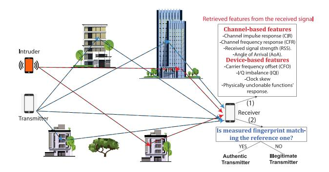

Fig. 7. Illustration of the PLA mechanism.

attacks, aiming to disrupt the authenticator from accurately estimating legitimate PHY layer features values (e.g., CSI, CFO, tag), (ii) replay attacks (reception of a legitimate packet from Alice and re sending it to Bob in next communication slot), or (iii) tampering, where the malicious node aims at creating a novel message, based on his PHY layer tag estimate from previous slots, to build a valid tagged message.

# *A. Keyless PLA*

Keyless-based PLA techniques rely essentially on continuously-monitored wireless channel parameters or estimated hardware imperfections. Channel-based attributes are the RSS, CIR, and CFR. Both channel amplitude and phase characteristics can be extracted from the last twomentioned attributes. The RSS constitutes a coarse-grained channel indicator referring to the received signal power impacted by small-scale fading fluctuations alongside largescale shadowing and free-space path-loss effects. On the other hand, device-based features include either transient features such as transient signal's spectrogram and time-domain higherorder statistics or steady-state modulation-dependent features such as the CFO, in-Phase/Quadrature imbalance (IQI), and physically unclonable functions (PUF)'s response, to cite a few. Fig. [8](#page-13-1) depicts a taxonomy for the different PLA techniques, grouped into the two main categories mentioned above.

{13}------------------------------------------------

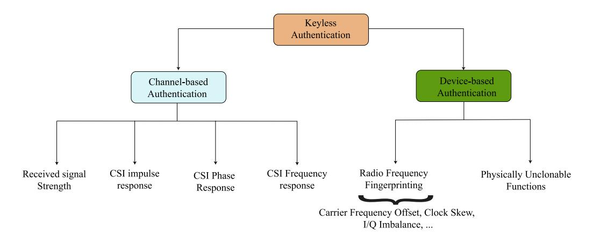

Fig. 8. Categorization of PLA techniques.

TABLE IV CONTRIBUTIONS SUMMARY OF SOME RELATED WORK ON CHANNEL-BASED PLA

| Metric/Feature | Work                    | Year | Contributions                                                                                                                                                                                                                                                                 |
|----------------|-------------------------|------|-------------------------------------------------------------------------------------------------------------------------------------------------------------------------------------------------------------------------------------------------------------------------------|
|                | Xiao et al. [84]        | 2007 | A proposed analytical model for CFR-assisted PLA where the CFR observations are subject to estimation noise. The channel is considered time-invariant with stationary nodes.                                                                                                  |
|                | Xiao et al. [85]        | 2008 | The extension of the work in [84] by considering mobile nodes (i.e., time-variant channel).                                                                                                                                                                                   |
| CFR            | Xiao <i>et al.</i> [86] | 2008 | Time-varying CFR was used to authenticate a transmitter for both inter- and intra-burst transmissions.                                                                                                                                                                        |
|                | Tomasin et al. [87]     | 2018 | The work evaluated the performance of channel-based keyless PLA along with a PLKE-based authentication technique.                                                                                                                                                             |
|                | Zhang et al. [88]       | 2019 | The work analyzes the authentication performance of a CSI-based PLA scheme over a dual-hop network.                                                                                                                                                                           |
| CIR            | Liu [89]                | 2016 | This work dealt with a two-dimensional PLA scheme by exploiting the taps' complex gains along with the corresponding per-tap delay.                                                                                                                                           |
|                | Althunibat et al. [90]  | 2017 | A phase-based adaptive modulation scheme where the transceivers agree each time on a modulation type depending on the reciprocal channel phase to confuse the eavesdropper.                                                                                                   |
| CSI phase      | Cheng et al. [91]       | 2017 | A phase-assisted generated key between Alice and Bob is used for a challenge-response authentication. A random phase-modulated signal is generated by Alice, whereby its phase is obfuscated with the secret reciprocal key by Bob and resent back to Alice for verification. |
|                | Lu et al. [92]          | 2022 | An extension of the work in [91] by proposing an enhanced TS.                                                                                                                                                                                                                 |
|                | Zeng et al. [93]        | 2010 | Two RSS-based PLA schemes were implemented in a three-device Wi-Fi network relying on multiple RSS observations.                                                                                                                                                              |
|                | Wang et al. [94]        | 2017 | This work relies on the channel reciprocity principle to detect a spoofer in a Zigbee network.                                                                                                                                                                                |
| RSS            | Wang et al. [95]        | 2020 | An enhanced RSS-aided PLA scheme in a V2X network subject to nodes' high mobility leveraging Kalman filter.                                                                                                                                                                   |
|                | Illi et al. [96]        | 2022 | An RSS-based PLA scheme was experimentally implemented an tested in a Wi-Fi 802.11ac IoT network by leveraging on statistical HT.                                                                                                                                             |

*1) Channel-Based Authentication:* As summarized in Table [IV,](#page-13-0) we detailed some of the related works on channelbased PLA, where a broad view of such a category is detailed in the sequel.

*a) Using RSS:* In [\[93\]](#page-37-0), two RSS-assisted authentication schemes for mobile nodes are proposed. In the first one, a node can verify if two signals are from the same transmitter or not based on RSS similarity. A TS is built 

{14}------------------------------------------------

using the current and previous authentic RSS values as follows

$$R_m = |RSS_{XB}^{(m)} - RSS_{AB}^{(m-1)}|, (19)$$

where  $RSS_{XB}^{(m)}$  is the received RSS at the legitimate receiver (Bob), denoted B, from a transmitter  $X \in \{A, E\}$  at discrete time index m, where A and E denote Alice and Eve as legitimate and illegitimate transmitters, respectively. Then, a simple HT is performed: if the TS falls below a threshold Q, B claims the transmitter is legitimate; i.e., hypothesis  $\mathcal{H}_0$ . Otherwise, an impersonation scenario is claimed (hypothesis  $\mathcal{H}_1$ ), which can be formulated as

$$R_m \underset{\mathcal{H}_0}{\overset{\mathcal{H}_1}{\geq}} Q. \tag{20}$$

However, this authentication method has several limitations. First, RSS is a measurement that is distance dependent and has a coarse-grained nature due to the receiver's quantization resolution and manufacturing interpretation of the RSS metric [6]. Therefore, it is very likely that an attacker (Eve) can attain almost the same RSS at the receiver/authenticator (Bob) if it is close to the legitimate transmitter (Alice), even by a few meters, or has almost the same distance from the receiver as the Alice. Second, if somehow the attacker is able to get one of the messages authenticated, then subsequent messages from the attacker will be very likely authenticated. As a way to alleviate this limitation, the authors proposed another temporal RSS variation-based authentication scheme. In this scheme, the transmitter sends a set of RSS values that have been recorded from previous packet exchanges with the same receiver, whereby the packetacknowledgment (ACK) time interval is maintained as short as possible to fulfill channel reciprocity. Consequently, the receiver will compare this set with the measured equivalent set, and accordingly, the transmitter will be authenticated if both sets are similar. Indeed, the main assumption considered is that the previous packet-ACK exchange is secured by an upper-layer authentication scheme. Wang in [94] extended the previous work by relying on the channel reciprocity principle to detect a single spoofer in a ZigBee network. The measured RSS values by Alice from a packet-ACK exchange with Bob are scaled by a scalar nonce, shared between both legitimate parties during the packet-ACK exchange, and sent to Bob. Then, a correlation-based HT is employed at this latter by making use of the shared nonce value. Such a scheme has shown a good performance under pedestrian mobility case for ZigBee devices, while results predict a better performance for higher mobility using Wi-Fi devices. Nonetheless, the two above-mentioned work drawback is their bandwidth inefficiency, as long RSS sequences are needed to reach acceptable performance.

An experimental study for the authentication performance of the RSS-based PLA in wireless mesh networks was performed in [96]. The authors evaluated experimentally the authentication and detection rates in a three-node mesh setup built through Raspberry Pi devices equipped with 5-GHz Wi-Fi dongles. Experimental results show that a larger distance between Alice and Eve or creating different mobility patterns of the legitimate and wiretap links (e.g., opposite moving directions, different speeds) could enhance the scheme's performance under the constraint of pedestrian mobility speed. Importantly, due to the coarse granularity of the RSS feature, it fails to provide decent authentication performance when the two transmitters are closer by less than five meters.

A game theory approach introduced in [97] presents another RSS-based authentication scheme to detect spoofing attacks in wireless networks in both static and dynamic environments. In this scheme, the interactions between a legitimate receiver and spoofers are formulated as a zero-sum authentication game. The proposed game implies that if one player gains information, it will be the reason for the loss of the other player. According to the game model, Bob determines the test threshold in the authentication, while each Eve chooses its attack frequency to maximize its utility. The Nash equilibrium (NE) in static networks was derived where the optimal test threshold and the optimal spoofing frequency have been defined. It was shown through extensive simulations that spoofing detection at the NE is robust against radio environmental variations.

The authors in [95] developed an enhanced PLA scheme for a vehicle-to-everything (V2X) network subject to nodes' high mobility. In particular, an iterative model leveraging the Kalman filter was designed by making use of the system dynamics for predicting the a priori and a-posteriori PHY layer features' estimates. Afterward, a TS is conducted between the currently-observed feature value and the predicted one. Essentially, the RSS, nodes separating distance, and relative speed were used as features for authentication. A game theorybased PLA scheme relying on the RSS was designed for an unmanned aerial vehicle (UAV)-based network in [98] by which a zero-sum PLA game between Bob and Eve is formulated. NE is derived by leveraging an optimal threshold at Bob and attack probability at Eve.

b) Using CSI's phase: The authors in [90] present a phase-based adaptive modulation scheme for PLA. The authors divide the whole constellation complex plane into four different parts, wherein each part represents a unique modulation scheme. Depending on the phase of the received signal, a modulation scheme is selected. In order to pick the same modulation scheme at both legitimate parties, the measurements must be performed within channel coherence time. In particular, based on the channel phase, a unique modulation type is selected. Although the proposed schemes provide sufficient robustness against channel estimation errors, their performance is unclear in static environments. Though the exchange of information does not require a shared secret key between two users, the proposed techniques can also be used for phase-based PLKE between two legitimate entities.

The inherent uniqueness of the channel phase has been effectively exploited in establishing lightweight authentication schemes. Precisely, the work in [91] proposed to use the channel phase to obfuscate a shared key between Alice and Bob. Although the proposed scheme is similar to the one proposed in [99], it proposes the use of a CIR phase-based key establishment to generate a key at both legitimate ends as an initial phase. Upon receiving an authentication request from Alice, Bob sends a random phase-modulated sequence and

{15}------------------------------------------------

receives back from Alice a response signal whereby a phase shift is incorporated corresponding to the shared key symbol. Armed by the perfect channel reciprocity assumption and the known shared key symbols, Bob, acting as an authenticator, builds an absolute-value TS from the received signal to check the legitimacy of the authentication request. Nonetheless, it has been shown that such a TS is very likely to exceed the set threshold, which exhibits a secrecy flaw. To this end, the authors in [\[92\]](#page-37-8) developed an improved TS relying on the real part of the processed received signal.

*c) Using channel impulse response:* In [\[100\]](#page-37-9), the authors propose a new authentication scheme for wireless communication leveraging the CIR in a time-varying multipath environment. The key idea behind this scheme is to allow a receiver to monitor the variation between two consecutive CIRs from a transmitter of interest and therefore distinguish its identity. Specifically, an SNR-dependent threshold is derived to mitigate noise in the estimated CIRs prior to determining the variation of the consecutive CIRs. Then, a new TS is developed at the receiver based on the calculated difference between the noise-mitigated CIRs. The authors evaluate the performance of their proposed scheme in terms of FAP and DP using theoretical analysis and simulation.

The authors of [\[101\]](#page-37-10) propose a signal relation-based authentication scheme. This scheme is based on making use of the detected data symbols in the HT phase instead of the pilotassisted channel estimates. As CSI is not required for the HT stage, it is expected to work well even when the number of pilot symbols is reduced. To this end, two distinct schemes have been proposed in the aforementioned work based on training and HT. In the training stage of the first scheme, the channel is estimated, and the received symbols are detected by using minimum-mean square error (MMSE). In the testing stage, an HT takes place, relying on the detected symbols and the test symbols to decide node legitimacy. The second scheme, based on a long short-term memory (LSTM) model, differs in the training stage from the MMSE scheme, where the input and output to the LSTM training model are the transmitted and the received symbols, respectively. Then, a similar HT is performed as in the first scheme. Results reveal that the proposed schemes work well when the number of the training pilot symbols is small. For a large number of pilot symbols, the LSTM scheme outperforms the MMSE.

The author of [\[87\]](#page-36-31) analyzed channel-based keyless PLA along with a PLKE-based authentication technique. Findings showed that channel-based authentication is asymptotically secure for a higher number of samples within a single channel observation. In addition, a novel unifying secrecy metric was introduced, e.g., secure authentication rate, which describes the rate (in bits per channel use) at which a successful attack probability tends to zero for infinite block length.

The work in [\[89\]](#page-36-32) dealt with a two-dimensional PLA scheme by exploiting the taps' complex gains along with the corresponding per-tap delay. A one-bit quantization is utilized by comparing the difference between two consecutive values of complex gains and delays over multiple taps with respect to fixed corresponding thresholds. Such a scheme differs from the author's proposed one in [\[102\]](#page-37-11), whereby the per-tap amplitudes and delay are processed by a multilevel quantizer. Obviously, the latter is sensitive to non-negligible quantization errors caused by rapid channel characteristics changes. Furthermore, the authors in [\[103\]](#page-37-12) proposed the exploitation of several CIRs leveraging multiple antennas onboard Alice as well as Eve. In light of this, two enhanced HT schemes were proposed to improve the performance of the one-bit quantized HT used in [\[89\]](#page-36-32). In particular, the first proposed scheme uses a soft GLRT where the underlying TS is the squared norm of two consecutive CIR vectors' difference, as was performed in [\[104\]](#page-37-13). On the other hand, the second is based on exploiting an estimate of the correlation coefficient in a tweaked GLRT. Notably, this latter has shown a significant authentication performance gain essentially over weak channel correlation (i.e., higher node speed).

In [\[88\]](#page-36-33), the authors analyze the authentication performance of CSI-based PLA in a dual-hop network. The Alice-Bob transmission is assisted through an untrusted relay node. In order to prevent an active attacker from passing the authentication successfully, a per-frame varying jamming signal is injected from Bob to the relay, along with Alice's authentication request sent to the relay simultaneously. The estimated cascaded channel from the received amplified signal at Bob from the relay is put under an HT after removing the already-known jamming signal. This latter degrades Eve's channel estimation accuracy, preventing her from emulating legitimate channel behavior and mounting impersonation attacks. Furthermore, the varying jamming sequence per frame prevents successful replay attacks. Furthermore, Xie et al. inspected in [\[105\]](#page-37-14) a CSI-based PLA scheme implemented in a wireless-powered communication network, where several legitimate users harvest energy from the access point and use it to transmit their signals. An HT is done to infer the legitimacy of the transmitting node, relying on the initially estimated CSI. The scheme is analyzed against impersonation and jamming attacks, where the cost-performance ratio metric is evaluated to quantify the jamming attack's significance. The authors finally suggested mitigating such an attack by (i) finding the user with the highest probability of suffering a jamming attack and (ii) employing enhanced reception techniques, e.g., channel coding, diversity, etc.

*d) Using channel frequency response:* The PLA scheme proposed in [\[84\]](#page-36-34) adopts the CFR of the wireless channel to determine if two consecutive signals are transmitted from the same node or not. Specifically, HT is applied on two consecutive authentication requests, whereby several CFR samples are retrieved from each received signal over the various carriers for robust authentication. The proposed scheme's performance was evaluated by a simulation framework in the presence of channel estimation errors. It is worth noting that the authors assumed stationary nodes (i.e., static channels), which do not reflect practical use cases.

The authors in [\[85\]](#page-36-35) extended the proposed scheme in [\[84\]](#page-36-34) to consider the time-varying nature of the wireless channel. In detail, the considered channel model includes two terms, one is fixed and stems from the average large-scale propagation effects, while the other is a random variable to emulate the fluctuations of the channel. A generalized version of the 

{16}------------------------------------------------

schemes presented in the above-mentioned two works is found in [\[86\]](#page-36-36). In the generalized version, data are assumed to be transmitted in bursts, where PLA is employed through interburst and intra-burst styles. The former is used to verify that the sender of the current burst is the same sender of the previous burst, while the latter is used to verify if two consecutive frames (within a burst) are from the same sender or not. It is assumed that a burst includes multiple frames, where intra-burst authentication is accomplished in the same manner as in [\[84\]](#page-36-34), [\[85\]](#page-36-35). On the other hand, inter-burst authentication is performed using the first frame at each burst as follows: First, it is assumed that both communicating nodes store at least one channel response in each data burst to be used as the key in the authentication process for the next successive burst. At the beginning of the first frame at each data burst, the transmitter will convey the stored channel response from the previous burst to the receiver, which in turn, compares it to its own version. If they are identical, the transmitter is authenticated. It is worth highlighting that the aforementioned approach was similarly implemented in [\[93\]](#page-37-0), [\[94\]](#page-37-1) leveraging coarse-grained RSS observations.

- *e) Takeaways:* The performance of channel-based PLA is strongly conditioned on the type of attribute used and its granularity. Generally, the CIR and CFR manifest fine-grained rich channel information that exhibits a better authentication performance. Nonetheless, it is important to mention that limited IoT device manufacturers provide a CSI capturing/accessing possibility. On the other hand, the RSS is a naturally-incorporated attribute in almost-all IoT and commercial-off-the-shelf low-power devices. However, its evaluation onboard and quantization resolution differs from each manufacturer, making it, in most scenarios, a coarsegrained feature. Therefore, it exhibits acceptable performance in limited scenarios with enough node separation.
- *2) Radio-Frequency Fingerprinting:* RFF is a PLA variant that aims at identifying the legitimacy of transmitting devices by virtue of imperfections in hardware components of the transmitter generated during the manufacturing phase. Ideally, such device-based impairments are unique and can hardly be replicated by a malicious node. RFF-based PLA can rely either on extracting features from transient signals or on steadystate attributes from the modulated in-Phase/Quadrature (IQ) samples [\[23\]](#page-35-42). To this end, a remarkable amount of work has been devoted to the authentication performance analysis of RFF techniques throughout the literature.
- *a) Transient signals:* Transient signals are unique devicedependent signals reflecting the transmitter's hardware change of status. The main challenge in transient signals-based RFF is the accuracy in detecting their actual starting point in the presence of ambient noise.

The authors of [\[107\]](#page-37-15) analyzed the SNR impact on transient-based device classification in a Wi-Fi 802.11a network. The classification relied on variance trajectory for amplitude- and phase-based transient detection. Then, a cross-correlation-based classification leveraging the power spectral density (PSD) samples is performed, whereby 80% of accuracy is reached at an SNR of 6 dB. In [\[106\]](#page-37-16), Bluetooth

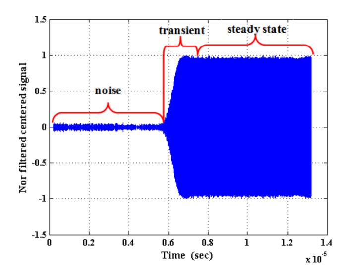

Fig. 9. A typical Bluetooth signal captured by experiment (high SNR) [\[106\]](#page-37-16).

signals' transients were used to identify various cellular phones. An oscilloscope was used for this purpose to detect transient signals' start and end, relying on threshold-assisted energy envelope detection. Afterward, the Hilbert-Huang transform and a smoothing median filter were used to extract 13 transient features, which were classified using linear support vector machine (SVM) classifier. Smoothing was proven to yield a 99% classification rate at high SNR. A similar setup of various smartphones emitting Bluetooth signals was assessed in [\[108\]](#page-37-17) for which a transient signal-based RFF scheme was proposed and analyzed experimentally by leveraging on the dual-tree complex wavelet transform for transient signal features extraction. In [\[109\]](#page-37-18), the variational mode decomposition (VMD) technique was employed to decompose Bluetooth short-duration transient signals to several modes and then reconstruct the overall transient signal. Subsequently, higher-order statistics are derived from the amplitude, phase, and frequency of the reconstructed transient signals to use for discriminating numerous Bluetooth nodes with the same manufacturer and model. Likewise, the authors in [\[110\]](#page-37-19) extended the use of VMD for both single- and dual-hop networks. Notably, using the *K*-nearest neighbors (KNN) classifier, spectral features obtained from the constructed modes, such as spectral brightness and flatness, have manifested a better classification probability performance compared to their temporal features and high-order moments counterparts. Also, Ureten et al. in [\[111\]](#page-37-20) inspected the identification performance of various WiFi 802.11b devices. Precisely, the Bayesian ramp change detector, principal component analysis (PCA), and probabilistic neural network were used for detecting transient signal start feature vector dimensionality reduction, and classification, respectively.

RFID tag identification through RFF was assessed in [\[112\]](#page-37-21). The feature vector of benign RFID tags was built relying on the dynamic wavelet fingerprinting, wavelet packet decomposition, and higher order statistics of the IQ samples for better classification accuracy. Supervised pattern classification 

{17}------------------------------------------------

on the processed signal is performed using the linear and quadratic discriminant classifiers, KNN, and SVM. This latter shows a high classification accuracy performance in high SNR experiments with an area under curve close to one.

An interesting extension for the transient signal-based RFF in a dual-hop network was the subject of the work in [\[113\]](#page-37-22), whereby multiple cooperative relays were incorporated to improve the classification performance. The authors relied on features extracted from the bispectrum of received signals to discriminate signals from 12 universal software radio peripheral (USRP). Semi-supervised generative adversarial network (GAN) was trained by a mixture of labeled and unlabeled inputs. Results indicate that the increase in the number of involved relays has a negative impact on the classification accuracy, whereby the hardware impairments of the relay are combined with the transmitters' ones.

Spectrograms are utilized for classifying several nodes operating at the license-free 2.4-GHz band [\[114\]](#page-37-23). In particular, the authors investigate the impact of interference on authentication performance. Results show that spectrogram-based RFF provides higher identification accuracy than IQ samplesbased RFF mechanisms. In a similar fashion, a transient signals' energy spectrogram-based identification scheme was proposed in [\[115\]](#page-37-24). Spectral features of the Wi-Fi nodes' transient signals are retrieved through a sliding window-based transient duration estimation. Results indicate the classification accuracy performance gain of the considered spectral features compared to the transient amplitude-based analysis, and PCA obtained through feature dimension reduction. An interesting application of transient signals-based authentication in a linear frequency modulation (LFM)-enabled radar system was analyzed in [\[116\]](#page-37-25) whereby a curve fitting-based denoising algorithm was implemented to minimize noise distortions on the RFF features. Precisely, an operation mode among the four considered ones exhibits 100% identification rate at low SNR. It is worth mentioning that the previous work's scheme is easily extended to LFM-based IoT technologies such as chirp spread spectrum (CSS)-LoRa. The work in [\[117\]](#page-37-26) focused on UAV controllers identification by a passive RF surveillance device in the presence of Bluetooth and Wi-Fi interferers. Leveraging the transients histograms and normalized energy trajectory, both time- and frequency-domain statistical features were utilized for neighborhood component analysis-based classification. Due to the emergence of lightweight nano drones as an enabler in UAV-based IoT networks, it is understood the last work's RFF scheme can be extended to UAV authentication such IoT-UAV networks.

*b) Steady-state attributes:* In comparison with transient signal features, steady-state ones are generally stable attributes that can be estimated from the modulated signals. Such features include CFO, IQI, clock skew, and PUF, to name a few.

The authors in [\[118\]](#page-37-27) relied on the CFO as a devicebased fingerprint to authenticate static nodes. Importantly, the authors extended in [\[40\]](#page-35-37) their last-mentioned work by adopting time-varying CFO as a unique fingerprint for the purpose of detecting a spoofing attack. The setup was analyzed experimentally through USRP nodes acting as Alice, Bob, and Eve. The time-varying CFO has unique characteristics due to the presence of randomly varying Doppler shifts and, thus, can be used in the authentication process. In this optic, a Kalman filter was implemented at the receiver to predict the CFO variations and maximize the authentication performance. The proposed framework procedure is initiated by the estimation of the variable CFO characteristics of the received signal, followed by a comparison between the Kalman filter-predicted CFO value from the previous estimate and the current estimated value to confirm the identity of the transmitting device. The authors in [\[119\]](#page-37-28) aimed at using the CFO as a device fingerprint to discriminate long range (LoRa) devices through a USRP (i.e., authenticator) as well as to compensate for the received signals' frequency drift. Leveraging the received LoRa IQ samples, FFT, and spectrogram, results show that the CFO estimation and compensation are efficient in reducing device misclassification rate, whereby a hybrid deep learning (DL) classifier is used by compensating the inherent CFO of each transmitter. The previous work was extended in [\[120\]](#page-37-29) where long-term CFO measurements were considered, i.e., over several months. Also, multilayer perceptron (MLP) and long short-term memory (LSTM) network classifiers were implemented and evaluated in addition to the previously-considered convolutional neural networks (CNN). Specifically, 98% of classification accuracy can be reached through the proposed hybrid classifier. In addition, Miller et al. analyzed in [\[121\]](#page-37-30) the vulnerabilities in a typical MIMO system against several jamming attacks launched by Eve to harm the quality/accuracy of channel estimate at the legitimate receiver (i.e., Bob). In this optic, a CFO-assisted authentication was proposed by sending authentication messages with tones on particular frequency offsets to infer about the legitimacy of the transmitted pilot signals and prevent jamming attacks.

Hao et al. dealt with IQI as another steady-state fingerprint for device authentication in [\[122\]](#page-37-31), [\[123\]](#page-37-32), where they provided analytical closed-form expressions for the FAP and DP.

Power amplifier (PAs) nonlinearity and imperfections have also been considered as a steady-state RF feature. The authors in [\[124\]](#page-37-33) employed the generalized and classical likelihood ratio tests to analyze the authentication performance of power amplifier impairments-based authentication. Volterra series were used to represent amplifiers' nonlinearities, whereby acceptable classification error levels were attained at low and mid-SNR values. Another RFF-based authentication scheme is found in [\[125\]](#page-37-34). The authors of this paper utilized the imperfection of the transmitted signal caused by noises during communication. The main work's motivation was that small differences between RF oscillators in the phased locked loop (PLL) at transmitters are neither dependent on any modulation method nor the power of the transmitter and, therefore, can be an exclusive and stable parameter for PLA. More specifically, the phase noise (PN) feature was employed to spot the illegal nodes by comparing their PN features with stored reference legal nodes ones. A simple multi-kernel learning (MKL) experiment is done to corroborate the robustness of the RFF scheme. Results showed that the proposed PLA scheme prevents an attacker (e.g., spoofer) from modifying or altering legitimate packets. Moreover, Xie et al. provided in [\[126\]](#page-37-35) an 

{18}------------------------------------------------

analytical framework on the authentication performance of a MIMO network by leveraging on various PN observations.

The work in [\[127\]](#page-37-36) analyzes the PSD of the entire signal as a feature for identifying the authorized IoT devices and community detection algorithms, such as random walk algorithms, for clustering. This work showed that device identification via PSD is promising as it improves detection efficiency. Moreover, it was observed that multipath delay has a significant effect on detection performance. Classifying 60 LoRa devices was tackled in [\[128\]](#page-37-37) by using CNN for RFF feature extraction, while supervised KNN was employed for node authentication and to spot malign users. The authors in this work relied on the LoRa signal's spectrogram, preprocessed to mitigate the wireless channel impairments.

The aforementioned studies trained ML models considering constant SNR levels. To provide robustness against the random behavior of communication channels, the work in [\[129\]](#page-37-38) has performed the data collection over a broad range of SNR levels. Three different deep learning models, including deep neural network (DNN), CNN, and recurrent neural network (RNN), were utilized to discriminate IoT devices from the same brand. Dubendorfer et al. in [\[130\]](#page-37-39) used statistical features such as the skewness, kurtosis, and variance obtained from time-domain samples amplitude, phase, and frequency. Several ZigBee devices in a testbed were classified with a legitimacy classification accuracy exceeding 90% at an SNR of 10 dB. A similar setup of ZigBee devices was experimentally analyzed in [\[131\]](#page-37-40) leveraging the same statistical features obtained from the amplitude and phase observations. The proposed method shows that there is potential for device brand identification using the proposed feature set. Nonetheless, instances occur when correlated statistical features are observed in devices from different manufacturers. Interestingly, the work in [\[132\]](#page-37-41) provides a new perspective for device authentication. Instead of utilizing conventional time and frequency dimension features, changes in constellation diagrams are tracked for detecting authorized devices.

The authors in [\[133\]](#page-37-42) evaluate and compare the performance of four different feature extraction methods based on the time domain, wavelet domain, STFT, and Wigner-Ville Distribution (WVD). Robust PCA and SVM are used for dimensionality reduction and classification, respectively, where they showed promising fingerprinting performance.

The authors in [\[134\]](#page-37-43) proposed to segment the received signal into several portions to facilitate extracting the feature set. The obtained feature set is then mapped to different RFF feature sets stored at the receiver to compute its score. If this latter is less than a threshold, transmission illegitimacy is claimed. Otherwise (i.e., if the score exceeds the threshold), the message will be authenticated, and the identity of the transmitter node is decided based on the nearest feature set among the stored sets in the receiver.

The demodulation reference signal (DMRS) of the uplink physical channel was considered in [\[135\]](#page-37-44) as a fingerprint of the user equipment (UE) to prevent man-in-the-middle and reply attacks. In this context, a channel fingerprint map is generated by collecting channel parameters during an offline training stage. As a result, a diagram of two zones is designed, where

one zone (i.e., zone A) is considered safe while the other one (zone B) is considered unsafe, as it may have possible attacks. Then, the DMRS of the UE is analyzed in the online stage to achieve the regression analysis. If this analysis is in zone A, the authentication can proceed via the open-air interface. Otherwise, the authentication of the UE will be rejected.

The authors in [\[136\]](#page-38-0) perform authentication of IoT devices by utilizing the entire signal rather than only the preamble part. The carrier frequency is utilized as the discriminating feature, and three different learning techniques, including MLP, CNN, and SVM-based models, are used for the classification task. It was shown that MLP and CNN provide high identification performance for devices belonging to the same brand.

Due to the difficulty of obtaining labeled datasets, unsupervised node classification through RFF was inspected. The authors of [\[137\]](#page-38-1) proposed an unsupervised RFF-based PLA scheme leveraging the GAN. This latter is structured as a deep learning network incorporating the a priori statistics of the wireless channel to generate data along with the feature vector extracted from a constructed gray histogram to increase the GAN's discriminability. In addition to this, the work in [\[138\]](#page-38-2) presents an unsupervised ML algorithm for RFF utilizing the raw IQ samples subject to noise and channel impairments. The scheme is implemented using curriculum learning which decomposes the learning process by dealing with high-SNR IQ samples to provide pseudo-labels for each device using the *k*-means clustering algorithm. Then the estimated labels through the pre-training phase are used to enhance the classification performance of low-SNR samples. Results indicate comparable performance with classical supervised ML-based RFF schemes.

Multi-features-empowered PLA projects a notable performance improvement in terms of legitimate devices authentication and spoofers detection, where two or more features can expand the distinguishability between nodes and make the authenticator's discrimination task easier. For instance, the authors jointly exploited in [\[139\]](#page-38-3) the CFO and IQI to classify several IoT devices leveraging a statistical threshold-based HT. Similarly, Sankhe et al. proposed in [\[140\]](#page-38-4) a DL-CNN classifier to classify several nodes based on IQI and direct current (DC) offset. In addition, a multi-attribute device-based PLA scheme was designed in [\[141\]](#page-38-5) by plugging the IQI, modulation offset, CFO, and modulation offset into an unsupervised ML *k*-means classifier to authenticate several ZigBee devices. The differential constellation trace figure (DCTF) technique was used for feature extraction. Another RFF scheme was proposed for a direct sequence spread spectrum (DSSS) wireless network by leveraging on I/Q phase mismatch, I/Q DC offset, and I/Q gain imbalance as RF features. DCTF was employed for feature extraction, while a minimum-distance classifier was implemented for the classification task. Results show the resilience of such schemes to noisy signals (i.e., low SNR) by combining different spreading sequences of the same polarity to reduce the noise effect.

PUF is based on the fact that no pair of chips, even from the same manufacturer, share the same physical characteristics due to inevitable manufacturing variation during the fabrication 

{19}------------------------------------------------

process. Therefore, when subject to the same challenge, a pair of devices/chips should ideally produce two distinct responses [\[142\]](#page-38-6). Furthermore, the PUF should provide distinct responses for every pair of challenges [\[12\]](#page-35-11). It is important to note that PUFs are generally categorized as (i) strong PUFs, possessing a large set of challenge-response pairs (CRPs) and high unpredictability, which can be used effectively for device authentication, and (ii) weak PUFs with limited CRPs, that can serve for key establishment. One can obviously infer that an adversary can monitor the whole set of challenge-response pairs to aim at modeling the PUF mathematical model. Thus, a crucial assumption is the no-reuse of a CRP.

Interestingly, the authors in [\[143\]](#page-38-7) provided an analysis on PUF's feasibility over flash memory devices, whereby notable gains in terms of PUF's unpredictability and unclonability were manifested. Furthermore, the work in [\[144\]](#page-38-8) quantified the performance of a PUF-aided multi-device network relying on arbiter PUF implemented on FPGAs. Key performance indicators, namely the PUFs randomness, steadiness, correctness, diffuseness, and uniqueness, were evaluated over 45 devices. Gao et al. in [\[145\]](#page-38-9) proposed an obfuscation scheme to impede an adversarial node from modeling the PUF through a machine learning model.

- *c) Takeaways:* RFF can be divided into two subcategories: (i) transient signals-based RFF and (ii) steady-state features. While the former is vulnerable to the noise presence in the captured transient signals, it can provide generally acceptable security levels as the transient fingerprints are hard to be captured by Eve due to the short transient duration. Nonetheless, estimating accurately the transient start and end point is a challenging task, particularly at lower SNR levels. On the other hand, steady-state attributes represent reliable metrics in terms of estimation accuracy. Nonetheless, they generally exhibit less distinguishability across the different devices and, consequently, reduced security level compared to their transient signals counterparts.
- *3) Hybrid Channel-RFF-Based PLA:* The authors in [\[146\]](#page-38-10) exploited both time and frequency-domain hardware imperfections along with the wireless channel uniqueness for the device authentication. In particular, frequency offset, phase offset, time offset, and multipath delay are extracted as the model features, whereby LSTM, MLP and SVM are used for the classification task. It is shown that LSTM outperforms MLP and SVM-based techniques in terms of classification accuracy. Also, an almost-perfect classification accuracy is attained for short-distance line-of-sight (LOS) links, while it drops by the distance increase. Notably, the classification is further reduced in non-LOS (NLOS) scenarios with rich scattering due to the intersymbol interference effect caused by multipath. Hence, this latter affects the features' quality in spite of being an additional fingerprint. Fang et al. incorporated the RSS, CSI, and CFO features to design an improved hybrid PLA scheme in [\[147\]](#page-38-11), in which the linearly-combined and normalized features' values are plugged into a designed Gaussian Kernel function. Such an ML-based PLA scheme reduces the N-dimensional feature space to a single-dimension one. Additionally, the authors of [\[148\]](#page-38-12) utilized both the CSI along with the phase noise in a MIMO wireless network. A

node is declared legitimate based on the number of antennas claiming the transmitter's legitimacy through the HT. Lastly, we proposed in [\[149\]](#page-38-13) a dual CSI-CFO hybrid PLA scheme encompassing both aforesaid features. The scheme was applied to discriminate a set of malign and benign users by which the AP and DP metrics were evaluated in terms of the system parameters, namely the average SNR, relative nodes speed, and actual CFO mean. ROC curve results indicated a notable enhancement brought by the dual CSI-CFO scheme compared to its single-attribute counterparts (i.e., CSI- and CFO-based ones.

*a) Takeaways:* Compared to single-attribute PLA, hybrid and multi-attribute PLA schemes exhibit an improved performance metric by compensating for the low authentication performance of channel- and hardware-based features. Of note, dynamic networks generally require the incorporation of more than three features to acquire acceptable performance. The attributes fusion could be done either in ML-based classification or leveraging a composed HT, whereby suitable thresholds should be selected per each feature.

#### *B. Key-Based PLA*

*1) Joint Channel-Key Authentication:* The authors in [\[150\]](#page-38-14) proposed a joint channel and key-based PLA scheme leveraging a secret shared key and the CFR's inverse between the two legitimate end nodes. Precisely, random-amplitude-modulated subcarriers are sent from Bob carrying an authentication challenge to Alice, to which she responds by using the received challenge along with the amplitude-modulated key symbol. Assuming perfect reciprocity, the scheme harnesses the unique feature of the channel to obfuscate the shared secret key and allow only the legitimate parties to verify the authenticity. Random amplitude modulation prevents Eve from accurately estimating the CSI in the initial phase.

The authors in [\[151\]](#page-38-15) proposed a key-channel randomization PLA scheme relying on a preshared secret key between Alice and Bob along with the CFR's inverse estimated at both ends. The scheme is based on designing a multiplexing function that combines a randomly-picked message from a set of messages and makes use of a shared secret key to design an authentication message through a set of subcarriers with the worst channel gains. Definitely, such an approach relies essentially on the channel reciprocity level. Moreover, channel coding is proposed not only to enhance the communication reliability and correct bit errors but also to substitute the conventional TS by allowing Bob to perform a simple channel decoding to figure out the legitimacy of the transmission. Nonetheless, such a scheme exhibits a security weakness for a higher half minimal distance of the code, where Eve can succeed in an attack with a random codeword.

*2) Tag-Embedding-Based Authentication:* Tag-embeddingbased PLA's principle lies in joining a tag signal together with the information one. The tag signal is produced by hashing the information message using a shared secret key, assumed to be unknown to Eve. Henceforth, differently from the upperlayer classical tag authentication (e.g., Hashed MAC), the authenticator's tasks herein is to initially verify, through PHY 

{20}------------------------------------------------

layer techniques, whether the authentication tag is embedded in the received signal or not.

In [\[152\]](#page-38-16), a message authentication scheme based on tag embedding is proposed. In this scheme, both data and tag signals are superimposed in one signal by dividing the power partially between the two, whereby power allocation should be carefully tuned to ensure (i) sufficient authentication rate (i.e., tag decodability) and (ii) information signal decoding correctness. Subsequently, the information message is decoded first to generate a tag at the receiver. Then, the information message is subtracted from the equalized received signal through the channel estimate. The residual signal is matchfiltered with the constructed tag to infer the existence of the tag in the received signal. A message is declared authentic if the tag exists, relying on an HT. Such a scheme is spectrally-efficient as it conveys both information and tag signals superposed in the power domain. Additionally, low tag power enhances its security as it can be obfuscated from eavesdroppers. Nonetheless, the interference generated at the receiver due to the tag power still impacts the message detection reliability.

The authors of [\[153\]](#page-38-17) proposed a novel PLA where an optimal power allocation scheme of both message and tag is achieved. Since increasing tag power could expand the error rate of the message, the authors proposed finding an optimal 1-bit tag embedding scheme when the message constellation is considered. A message constellation is obtained by a nonnegative pulse amplitude modulation (PAM) which is used to elaborate the tag embedding scheme and the detection rule. A non-coherent maximum likelihood (MLi) detector is fixed at the receiver side. Afterward, an optimal power allocation for both the message and tag signal is obtained to achieve a balanced trade-off between the symbol error rate (SER) of both tag and message. The proposed scheme is designed for noncoherent massive single-input multiple-output (SIMO) to meet the low-latency requirements of Industrial Internet of Things (IIoT) communication systems.

In [\[154\]](#page-38-18), low power is allocated to the tag signal to prevent attackers from recovering the entire message. The proposed framework is demonstrated using a Software-Defined Radio (SDR) for both SISO and MIMO systems. As a result, the intended receiver exhibits the ability to authenticate a very low-power authentication fingerprint with a small effect on the data bit error rate. We analyzed in [\[155\]](#page-38-19) the authentication performance of tag-embedding PLA scheme where the legitimate information signal is superimposed together with the tag one. In particular, analytical expressions of the authentication fail probability for joint and successive detection techniques are provided. Interestingly, we proposed in [\[156\]](#page-38-20) a novel tag embedding scheme, as highlighted in Fig. [10,](#page-20-0) whereby the tag symbol is punctured by a random number of bits that depends on the reciprocal channel phase estimated at both legitimate users.

The work of An et al. in [\[157\]](#page-38-21) proposed an enhanced tag-based PLA scheme dealing with the shared secret key assumption. Pointedly, tags are generated employing the probed reciprocal channel between Alice and Bob and modulated data symbols. The proposed scheme was tested

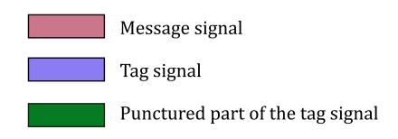

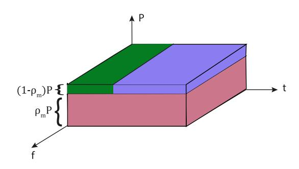

Fig. 10. Illustration of the proposed tag-embedding PLA scheme of [\[156\]](#page-38-20).

against various attacks, namely message tampering, jamming, and impersonation. Furthermore, the authors in [\[158\]](#page-38-22) proposed the use of weighted fractional Fourier transform (WFRFT) to build a Gaussian-like tag. This latter holds interesting properties as it can not be decoded by unaware receivers without the knowledge of the WFRFT parameters. The generated WFRFT Gaussian tag was superimposed with the information signal, whereby the receiver relies on estimating the WFRFT parameters to detect the tag. A message is declared authentic if the constructed tag from the initially detected data symbol matches the estimated one. Interestingly, Maeng et al. applied tag superimposition in a massive MIMO UAV network. Precisely, the precoding matrix, artificial noise (AN), information signal, and tag power portions are optimized iteratively to ensure the broadcasting of the superposed information signal and message tag to Bob and disrupt Eve's observation of this latter through the AN.

*a) Takeaways:* Tag-based PLA provides a lightweight method to detect the presence of a tag in the received signal. Its main advantage relies on performance independence from channel dynamics, which yields a good potential in highly dynamic networks (e.g., UAV networks). Tag-based PLA, relying on the superposition of both information and tag signals, results in better spectral efficiency. However, the accurate decoding of the information signal is depending on the level of interference caused by the superimposed tag signal. On the other hand, allocating higher power levels to the tag exposes its interception to malign nodes. Therefore, optimizing power allocation among the message and tag is crucial to balance such a robustness-secrecy trade-off.

In Table [V,](#page-21-0) we summarize the various categories of PLA techniques, the main works elaborated per each category, and their advantages and shortcomings.

# *C. PLA With Cutting-Edge PHY Layer Technologies*

The demerits of PLA under conventional wireless communication systems has been a driving force to explore its improvements through promising PHY layer technologies

{21}------------------------------------------------

TABLE V COMPARATIVE OVERVIEW OF DIFFERENT PLA TECHNIQUES

| Category                    | PHY Layer fea- ture        | Notable Works                                                                                                                                                | Pros                                                                                                                                                                                      | Cons                                                                                                                                                                                                                     |
|-----------------------------|-------------------------------|--------------------------------------------------------------------------------------------------------------------------------------------------------------|-------------------------------------------------------------------------------------------------------------------------------------------------------------------------------------------|--------------------------------------------------------------------------------------------------------------------------------------------------------------------------------------------------------------------------|
|                             | CSI's (CIR/CFR/phase)      | • CSI phase: [90]–[92], [99] • CIR: [87]–[89], [100]–[104] • CFR: [84]–[86]                                                                                  | <ul> <li>Fine-grained channel observation over several frequencies ⇒ better distinguishability between nodes' signals</li> <li>Spatial decorrelation over very short distances</li> </ul> | Complex measurement in real time     Available in few commercial off-the-shelf (COTS) IoT devices     Unreliable in static environment/limited number of scatterers ⇒ static/predictable CIR/phase/CFR by Eve            |
| Channel-based               | RSS                           | [93]–[98]                                                                                                                                                    | Available feature in all COTS IoT devices                                                                                                                                                 | Low precision due to poor granularity (limited-resolution quantization)     → Poor authentication performance     Sufficient spatial separation (a couple of meters) to achieve indistinguishability of RSS measurements |
|                             | Embedded tag                  | [152]–[158]                                                                                                                                                  | Superposition of tag with information signal is power- and resource-efficient (time slot, frequency,)     Low-complexity and ease of implementation                                       | Undesired interference caused by the tag on the information signal     High tag powers expose it to malign users.                                                                                                        |
| Joint Key/ Channel-based | Joint Key-Channel PLA      | [150], [151]                                                                                                                                                 | reliable way to obfuscate a secret key via channel phase/amplitude     efficient challenge-response in low channel dynamics                                                         | Inefficient in a very dynamic channel (low channel reciprocity),     insecure in a static channel (predictable CSI)     requires a pre-shared key                                                                        |
| RFF                         | Steady-state RFF              | CFO: [40], [118]–[120]     PN: [125], [126]     IQI: [122], [123]     Multifeatures: IQI-DC offset [140], IQI-CFO [139], IQI-Modulation offset-CFO [141], IQ | Stable attributes - vary over large periods                                                                                                                                               | Does not offer enough distinguishability between devices     Requires expensive devices (e.g., USRP, spectrum analyzers) for estimating it                                                                               |
|                             | Transient signals/features | [108]–[113], [116], [117]                                                                                                                                 | <ul> <li>Difficulty to capture transient signals by malign nodes</li> <li>Good distinguishability among nodes</li> </ul>                                                              | <ul> <li>Noise-sensitive</li> <li>Difficulty to estimate the transient signal start at low SNR</li> <li>Requires expensive devices</li> </ul>                                                                            |

advocated for the 5GB and 6G, such as OWC and THz communications, NOMA, BS communications, and RIS. In addition to that, upcoming wireless networks' generations and releases already foresee the incorporation of intelligence and awareness aspects. The joint communication and sensing (JCAS) paradigm has been emerging due to the expected massive involvement of autonomous vehicles and UAVs in industrial and military environments. Such critical applications, forecasted to represent a pillar in 6G, require dual radar (i.e., sensing) and communication functionalities. Moreover, the fulfillment of 6G's key performance indicators in terms of data rates requires the shift towards higher bandwidth, namely mmWave, sub-THz, THz, and optical bands (e.g., FSO, VLC). It is expected that RIS and metasurfaces will play a vital role 

{22}------------------------------------------------

in such a development due to their inherent capabilities in enhancing reliability and secrecy performance [\[159\]](#page-38-23).

*1) PLA With JCAS:* JCAS is one of the key visions of the next generation of mobile communications [\[160\]](#page-38-24). Due to the broadcast nature of wireless signals, such reflected waves can disclose vital information about the sensed objects/targets, posing notable security and privacy concerns [\[14\]](#page-35-13). For instance, intelligent transportation systems (ITS) represent a remarkable extension of V2X, where the different sensors onboard autonomous vehicles will allow them to sense the surrounding environment through channel estimation/sensing and communicate with each other and with road-side units to ensure optimal and efficient driving [\[161\]](#page-38-25).

Spoofing attacks take place when a malicious entity targets the manipulation of radar signals to fake the presence of an obstacle or wrongly report the position/presence of an object/target. To this end, the authors in [\[162\]](#page-38-26) inspected several spoofing attacks in JCAS radar system. Precisely, the malicious node can conduct an obstacle spoofing by either replaying the transmitted waveform by the transmitter or spoofing it with a well-designed phase shift and delay. Such an attack can cause the sensing device (i.e., autonomous vehicle) to have a wrong perception of an obstacle's position or presence. As a way to remedy this issue, the authors proposed the use of a PHY layer challenge-response by using randomized sensing chirp parameters, which confuses the spoofer by failing to register any meaningful information about the captured sensing waveform. Another scheme to combat spoofing was proposed by the authors using waveform fingerprinting, where the radar waveform's statistics are used, such as standard deviation, kurtosis, and skewness of the magnitude and phase of the received signal. Such statistics are helpful to spot spoofing attacks where the spoofer's waveform directly influences such statistics. Another PHY layer challenge-response scheme was proposed in [\[163\]](#page-38-27) for a JCAS system, whereby a random modulation signal is embedded into the sensing waveform to force the resulting signal to return to zero at a particular delay. Thus, upon receiving back the reflected waveform, the sensor can easily spot the presence of a spoofing signal as the spoofer may, naturally, send continuously over the whole interval and not suspend his communication to match the induced return-to-zero period. Randomization of the abovementioned discontinuity delay helps in combatting efficiently spoofing attempts. Kappor et al. proposed in [\[164\]](#page-38-28) a spatiotemporal spoofing detection mechanism based on MIMO beamforming. In such a scheme, the sensing transmitter broadcasts several narrow beams in different random directions and observes their corresponding reflections. Thus, the presence of a reflected signal from an unprobed direction/target indicates the presence of a spoofing signal.

*2) PLA With NOMA:* NOMA represents a viable multipleaccess solution to increase the spectral efficiency of the network. Numerous works inspected the secrecy level of NOMA schemes under different setups. Some works proposed either key-based or keyless PLA schemes with uplink NOMA. In [\[165\]](#page-38-29), a three-stage group-authentication scheme was proposed for a multiuser NOMA network. The work relied on perfect channel reciprocity between Bob and the various Alices, where these latter obfuscate their shared secret key with authentication through the CFR and discrete Fourier transform (DFT) operation. Thus, the authenticator performs a TS between the received signal after processing, containing the hidden key through the channel, and his similarly constructed DFT-based channel-key combination. The proposed approach has shown an acceptable time efficiency in detecting spoofing attacks. Differently, the authors in [\[166\]](#page-38-30) proposed different tag-based PLA schemes for a two-user downlink NOMA network. Particularly, the schemes consist of allocating a shared tag (i.e., PLA-SAT) or two superposed tags in the power domain (i.e., PLA-SIT) or time domain (PLA-TDM). Results show a remarkable boost in the authentication probability (AP) per user versus the received SNR. Also, PLA-SAT provides the best performance in the absence of an untrusted user. On the other hand, PLA-SIT and PLA-TDM provide a better overall performance in the presence of an untrusted node. Wang et al. proposed in [\[167\]](#page-38-31) the use of channel sparsity in a MIMO mmWave NOMA network to detect the presence of pilot contamination attacks. Initially, for static environments, an HT was performed by comparing the level of channel sparsity (i.e., non-zero elements in the filtered estimated channel matrix) with a preset threshold. However, to enhance the performance in time-varying channels (e.g., varying number of multipath components), a learning-assisted algorithm was built leveraging several time-domain features. A perfect DP is achieved with 0.3% of false alarm probability (FAP) for the static scenario, while the DP drops to 95% for the dynamic one.

*3) PLA With THz and OWC:* FSO and VLC (i.e., OWC), along with THz, have been advocated to play a notable role in the deployment of futuristic IoT networks, particularly as a solution for both fronthaul and backhaul links, aiming at high data rates and low latency [\[168\]](#page-38-32), [\[169\]](#page-38-33), [\[170\]](#page-38-34). The work in [\[171\]](#page-38-35) inspected the PLA performance of an indoor VLC system. A feature extraction phase takes place initially through a multilayer deep residual network to retrieve transmitter- and channel-dependent features, followed by a label predictor step for dimensionality reduction. Several laser diode (LD) VLC transmitters are then classified by a designed classifier, which has shown significant classification gains compared to the baseline CNN one. Likewise, the authors of [\[172\]](#page-38-36) adopted the CNN classifier to authenticate various light-emitting diode (LEDs). The authors of [\[173\]](#page-38-37) analyzed the authentication performance of a THz-enabled wireless system leveraging the channel-dependent path-loss. Results indicated the feasible regions in terms of Alice-Bob and Alice-Eve distances in terms of a target DP value.

*4) PLA With BS Communications:* In [\[174\]](#page-38-38), the authors exploited the RSS and the angle of arrival (AoA) from the backscattered signals to authentication BS devices (BSDs). Precisely, a two-stage authentication process is performed, whereby the access point verifies the BSD's legitimacy by comparing the estimated location, computed from the RSS and AoA, with the stored reference one. Then, after repeating the above-mentioned authentication process *N* times, the recorded estimated position coordinates are uploaded to a server along with the BSD's data, whereby a learning-based clustering

{23}------------------------------------------------

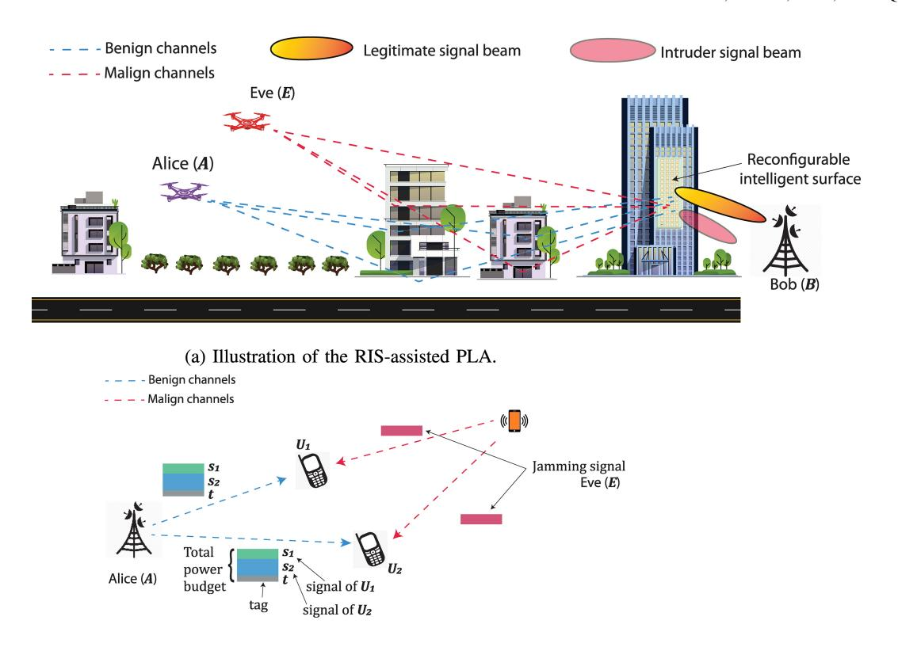

(b) Illustration of the NOMA-assisted PLA.

Fig. 11. PLA with cutting-edge technologies.

authentication is performed to spot illegitimate transmissions. Furthermore, the authors of [175] leveraged the CSI ratio to authenticate several BS tags. The ratio of CFR amplitude at both readers' receive antennas is compared with its corresponding time average value to infer the legitimacy of the transmit tag. Additionally, Park et al. proposed in [176] a lightweight PLA scheme for a reader-tag BS communication. Precisely, the reader induces a randomly-selected phase in the modulated transmit signal's phase to check the legitimacy of the tag upon receiving the backscattered response signal from this latter.

5) PLA With RIS: The natural abilities of RIS in manipulating the propagation channel have brought notable interest in exploiting it in favor of boosting the system's security. In particular, the authenticator can manipulate the RIS phase shifts to force uncorrelated/dissimilar channel behaviors between the legitimate sender and the spoofer/impersonator. To this end, Tomasin et al. studied in [177] the DP performance of a RIS-aided wireless cellular network. RIS elements' phase shifts are selected in a random fashion from a preselected interval, whereby Alice and Bob share the RIS configuration. Results show interesting intuitions on the RIS's potential for PLA performance enhancement, whereby MDP on the order of  $10^{-4}$  can be maintained with a  $2 \times 10^{-3}$  of FAP at 3 bits/s/Hz of spectral efficiency with 100 reflective elements. Interestingly, the larger the phase selection interval, the more secure is the scheme. The work in [178] aimed at using a designed reflecting metasurface placed in the vicinity of the transmitter. The work's idea is to inject predesigned RF fingerprints to increase node discriminability compared to traditional

RFF schemes. Additionally, the authors of [179] analyzed the impact of incorporating a RIS into the authentication performance of a tag-embedding PLA scheme. The obtained results provide a significant enhancement in FAP and DP when the RIS elements are configured properly.

- 6) Takeaways: NOMA technique is among the advocated solutions to boost spectral efficiency and connectivity. The implementation of PLA schemes on NOMA networks relies essentially on:
  - The perfect successive interference cancellation (SIC) at the authenticator to cancel out other users' signals from the observed signal to authenticate the desired user. Indeed, reaching a perfect SIC requires a perfect channel estimation of all users, which is far from being practical.
  - Perfect channel reciprocity: In a challenge-response PLA scheme, node mobility in a NOMA network results in a gap between the received response signal from Alice and the constructed one at Bob due to channel decorrelation.
  - Wise allocation of the different users' data and tag signals powers, which can be a non-trivial task at a large-scale NOMA network.

Channel-based PLA suffers from either the coarse granularity of the RSS or the low entropy in the CSI response in channels with few scatterers and strong LOS links. Therefore, RIS projects a remarkable potential to overcome the stable channel response by inducing a controlled propagation environment which therefore serves to discriminate between the malign and benign users' channel responses. Furthermore, phase-based PLA can be suitable for identifying BSDs whereby the reader

{24}------------------------------------------------

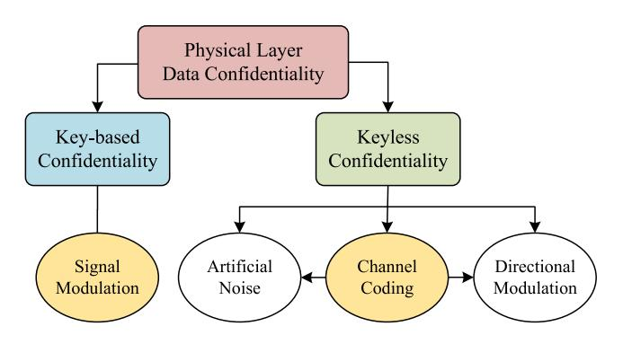

Fig. 12. The main categorization of approaches proposed to achieve physical layer-based data confidentiality.

can induce a random phase shift in his transmit signal and detect it with the backscattered received one.

## V. PHYSICAL LAYER SECURITY FOR CONFIDENTIALITY

PLS presents energy-efficient methods for providing data confidentiality by making alterations to the conventional processes within the modular communication technologies that are employed at the physical layer. We separate the approaches for achieving data confidentiality through PLS into two categories, a keyless approach and a key-based approach, as shown in Fig. [12.](#page-24-1)

Providing data confidentiality via PLS has become more and more popular, especially for securing IoT network scenarios, although still requiring significant research efforts prior to its adoption [\[10\]](#page-35-9). It is worth mentioning that not all available PLS solutions comply with IoT systems. Namely, modern communication systems are often equipped with full-duplex capabilities and multiple antennas, whereas IoT devices are generally limited to half-duplex communication with a single antenna.

## *A. Keyless Data Confidentiality*

This section focuses on PLS schemes that can provide data confidentiality without the need for a shared key. In this survey paper, we denote such schemes as secrecy schemes which utilize a (temporary) advantage in the main channel (i.e., the channel between Alice and Bob) versus the eavesdropper channel (i.e., the channel between Alice and Eve) to securely transmit data to the intended receiver Bob [\[180\]](#page-39-0). This advantage is exploited by Alice by cleverly encoding the information with a so-called secrecy code. A secrecy code is a channel code that does not only achieve reliability but also secrecy by ensuring that the encoding scheme falls within the error-correcting capabilities of Bob but falls beyond the error-correcting capabilities necessary by Eve. Unfortunately, a (temporary) advantage in the main channel can not always be guaranteed. Artificial noise and directional modulation are extensions that attempt to guarantee (or further improve) an advantage in the main channel. These approaches are evaluated in terms of information-theoretic (i.e., unconditional) security.

How the keyless approach fits into the general communication architecture is shown in Fig. [13.](#page-25-0) The first subsection covers IoT-relevant secrecy schemes, while the second subsection covers the extensions that support secrecy schemes in achieving data confidentially.

*1) Theoretical Results:* The authors of [\[181\]](#page-39-1) consider multitier ultra-dense heterogeneous networks (UDHNs) as a practical scenario for IoT networks and investigate the PLS. The locations of the serving base station (BS) are modeled using Poisson Cluster Process (PCP), while locations of the IoT nodes and eavesdroppers are drawn according to Poisson Point Processes (PPP). The secrecy coverage probability, which is defined as the randomly selected IoT node that can be served by at least one BS with a secrecy rate above the threshold, is investigated. Moreover, the impact of the associated parameters, such as node density and secrecy rate threshold, has been investigated as well.

Authors in [\[182\]](#page-39-2) studied the impact of cellular interference on the security of an IoT network that shares the spectrum resources with a cellular network. In this study, Mean Square Error (MSE) at both the legitimate receiver and the eavesdropper, as an analysis metric, is used to analyze the secrecy performance of the considered IoT system. Moreover, precoding matrices used by cellular users and IoT nodes are optimized to minimize MSE at legitimate nodes and maximize MSE at eavesdroppers.

A two-hop cooperative transmission system is considered in [\[183\]](#page-39-3), where it consists of a source node (SN), a destination node (DN), and a set of relays. The secrecy performance has been investigated for two opportunistic relay selection schemes, namely, Single Relay Selection (SRS) and Multiple Relay Selection (MRS). In SRS, a single relay is selected among the relays to forward the source message to the DN, while in MRS, all relays that have successfully decoded the message are allowed to forward the message. In the presence of an eavesdropper, the intercept probability (IP) is analyzed for both relaying systems. Results showed that MRS is able to attain better IP than SRS, and hence, it has been recommended.

Authors in [\[184\]](#page-39-4) studied the secrecy performance of a multiuser downlink IoT system in the presence of co-channel interference (CCI) and multiple eavesdroppers. The considered downlink system is operating using transmit antenna selection and threshold-based selection diversity to serve the IoT nodes. Two types of eavesdroppers are considered, namely, colluding and non-colluding eavesdroppers. Colluding eavesdroppers cooperate to enhance the data intercepting performance, while non-colluding eavesdroppers are those eavesdroppers work individually. The secrecy outage probability (SOP) has been derived in a closed form mathematical form, and an optimization problem of the power allocation is formulated and solved to minimize the SOP.

Based on the importance of relays in securing IoT networks, the study in [\[185\]](#page-39-5) endeavored to investigate the incentivization of relay nodes to serve as relays and hence, enhance security performance. To this end, game theory has been employed to design a Stackelberg game model that emulates the relation between the SN and the amplify and forward (AF) relay. Specifically, the relay has been modeled as a seller and the SN as a buyer to incentivize relay nodes to help with data

{25}------------------------------------------------

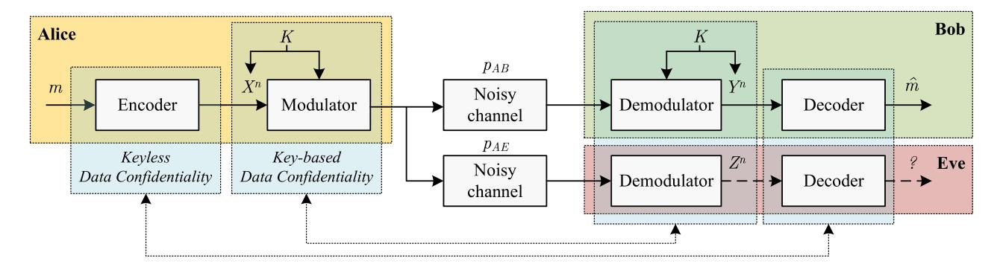

Fig. 13. The extended general model and architecture for physical layer-based data confidentiality with the main approaches localized. Alice encodes a message m into an n-bit codeword,  $X^n$ , achieving reliability against channel-induced errors (and encoded to also achieve secrecy when employing the keyless approach). The codeword  $X^n$  is subsequently modulated onto a wireless carrier signal (which will be in an encrypted form when employing the key-based approach). These traverse the noisy channel with the cross-over probabilities  $p_{AB}$  and  $p_{AE}$  when these signals are demodulated back into bits. Finally, the observations  $Y^n$  and  $Z^n$  are decoded.

forwarding. The game model has been elaborated based on two different assumptions, namely, with and without CSI. The included experimental and theoretical results showed that the secrecy capacity have been improved as compared to conventional relaying scenarios.

Secrecy performance and secrecy-reliability relationship in mobile IoT nodes have been investigated in [186]. Two different mobility models have been considered, namely, Random WayPoint (RWP) and Random Direction (RD), to model the mobility of the IoT nodes. In addition to the SOP, authors have investigated the transmit SOP (TSOP) and derived closed-form mathematical formulas for both probabilities. TSOP is defined as the SOP given that the link's SNR is above a preset threshold to ensure transmission reliability. As such, TSOP combines both secrecy and reliability in a single metric to assess the overall performance. Moreover, aiming to maximize secrecy throughput (ST), a scheme is proposed that implies that the transmitter will transmit a signal only if the SNR is above the predefined threshold. To this end, the receiver should feed the instantaneous SNR back to the transmitter through a feedback channel.

In [187], another multi-user scenario is considered, which includes a multi-antenna BS, a set of single-antenna IoT nodes, and one multi-antenna eavesdropper. The ST has been analyzed and mathematical formulas have been derived. Results showed that increasing the transmit antennas at the BS can significantly enhance the ST.

The main purpose of the work presented in [188] is to propose a general framework to improve the PLS in IoT. The framework is based on channel feedback (CF) that can increase the achievable secrecy rate of the ideal model rather than using AN. Authors have considered the compound wiretap channel with feedback in the downlink transmission, where an achievable secrecy rate is provided for this model. Moreover, a more practical model is considered where the feedback is delayed. For this model, an achievable secrecy rate is obtained according to a modified feedback scheme. Authors have shown that the achievable secrecy rate of the new model is larger than that of the same model without channel output feedback. This means that the proposed feedback scheme was able to enhance PLS in the down-link transmission for IoT systems.

2) Practical Schemes Based on Channel Codes: Due to its complexity, no practical wiretap codes have been designed up to this point. Therefore, PHY layer security experts have proposed the use of existing channel codes to put the theoretical results into practice. The proposed schemes, mainly based on low-density parity check (LDPC) codes and polar codes are, therefore, practical solutions to achieve keyless data confidentiality.

a) LDPC code-based schemes: The authors of [189] investigated the fundamental limits and coding methods of the wiretap channel from an information-theoretic perspective. The authors presented a way of exploiting the capacity-achieving codes to achieve secrecy capacity. This is achieved using the codes capable of achieving Eve's capacity. In particular, the authors verified the feasibility of designing linear time decodable secrecy codes exploiting LDPC codes. In this work, the main channel is assumed to be noiseless, while the eavesdropper channel is assumed to be a binary erasure channel (BEC). This work was extended in [190], which proposed a secure coding scheme for a type II eavesdropper channel, where the main channel is noiseless and the eavesdropper channel is a memoryless binary-input outputsymmetric (MBIOS) channel. The proposal is based on nested secure coding wherein the nesting is based on either (i) cosets of a good code sequence or (ii) cosets of the dual of a good code sequence. The proposed scheme improves upon the results presented in [189], covering a type II binary symmetric wiretap channel.

Another interesting work is presented in [191], wherein the authors investigated the performance of punctured LDPC codes under the assumption of maximum likelihood (ML) decoding. The authors verify the feasibility of capacity-achieving codes for any MBIOS channel by adding a puncture to the LDPC code. In summary, their scheme works as follows: a desired secrecy rate  $R_S$  is selected close to the secrecy capacity  $C_R$ , then a code is constructed for a rate lower than the desired rate. Finally, the code is punctured to achieve the desired rate. The proposed scheme can be potentially deployed in rate-compatible coding scenarios to achieve capacity-achieving punctured LDPC codes for MBIOS channels.

{26}------------------------------------------------

The work presented in [\[192\]](#page-39-12) proposes an LDPC codebased coding scheme for the Gaussian wiretap channel. The proposed scheme is said to have certain practical features. For instance, (i) the scheme is applicable to finite block length, (ii) encodable in linear time, and (iii) the scheme can be combined with the existing cryptographic protocols to minimize the security gap. The authors define the security gap as a measure of separation between thresholds of reliability and security of error-correcting codes. The authors presented the security gap as low as a few dB, which seems to be an improvement over the conventional error-correcting codes.

*b) Polar code-based schemes:* Polar codes [\[193\]](#page-39-13) are known as capacity-achieving codes that are secrecy capacityachieving as well. The authors in [\[194\]](#page-39-14) proposed a polar codes-based coding scheme that works for a wide range of secrecy capacity achieving channels, provided that both the main and eavesdropper channels are symmetric and binary input and assuming that the eavesdropper channel is degraded relative to the main channel. In addition, the authors provide a modified version of the proposal to provide stronger security and achieve secrecy capacity. However, in order to ensure the reliability of their proposal, the main channel should always be noiseless. This work was extended in [\[195\]](#page-39-15), which proposed a multi-block polar coding scheme to analyze the ability of simultaneously achieve strong security and reliability using polar codes. The main challenge in simultaneously ensuring strong security and reliability is the existence of a small number of bit channels that are both unreliable and insecure. In order to potentially solve this problem, the authors considered multi-block polar codes that guarantee strong reliability and security under the assumption of a symmetric and degraded eavesdropper channel.

Working on similar lines, Koyluoglu et al. [\[196\]](#page-39-16) proposed low encoding-decoding complexity polar codes, which can achieve a non-zero perfect secrecy rate for a binary input degraded wiretap channel. It is further shown that for the case of symmetric main and wiretap channels, their proposal achieves secrecy capacity. The authors then transform their proposal into a practical key agreement protocol by exploiting the secure polar coding for a single block. This gives legitimate nodes an advantage over the eavesdropper. Finally, this secure coding is turned into a common private key between legitimate nodes using privacy amplification.

Contrary to the previous works that consider symmetric and degraded channels, the work in [\[197\]](#page-39-17) focuses on memoryless broadcast channels. In particular, a low complexity polar coding scheme is presented for memoryless wiretap channels wherein an optimal rate of uniform randomness is considered in the stochastic encoder avoiding the assumption of symmetric degraded wiretap channels. However, this extension comes with the price of adding an encoder and decoder to share a secret seed and increasing the block length through chaining.

# *3) Extensions:*

*a) Artificial noise-based extensions:* Artificial noise (AN)-based schemes provide a solution in case of an insignificant secrecy capacity (i.e., the eavesdropper channel is either better or nearly equal to the main channel) by degrading the eavesdropper channel. The AN would be added

in the null space of the intended receiver to prevent the main channel from degrading [\[198\]](#page-39-18). This approach is also known as cooperative jamming and can be generated either by the transmitter [\[199\]](#page-39-19) or a third cooperative party [\[200\]](#page-39-20), [\[201\]](#page-39-21).

In [\[202\]](#page-39-22), the SOP is investigated for a two-hop IoT network in the presence of passive eavesdroppers. Two types of eavesdroppers are considered, namely, colluding and non-colluding. It was shown that collusion can significantly increase the SOP, while cooperative jamming can enhance the confidentiality of the transmitted data.

Authors in [\[203\]](#page-39-23) considered the SOP minimization problem between two IoT nodes in the presence of a cooperative jammer and an eavesdropper. The cooperative jammer is placed to secure the transmission link by confusing the eavesdropper with jamming signals. The SOP is minimized by optimizing the power allocation and secrecy rate thresholds. The scheme is limited in the sense that it considers multiple antennas at the transmitter, which limits its applicability to downlink-only communication and CSI from the eavesdropper is assumed to be available.

Aiming at enhancing the PLS in dual-hop IoT systems, non-activated relays are exploited as jammers to degrade the performance at an eavesdropper in [\[204\]](#page-39-24). Specifically, a single relay (among a set of relays) is allowed to relay the SNs signal to the DN, while the rest of relays generate AN that degrades the interception quality at the eavesdropper. Authors have compared their proposal to the SRS scheme, and results showed that IP has been significantly enhanced.

In [\[205\]](#page-39-25), secrecy performance in an uplink non-orthogonal multiple access (NOMA) transmission in the cellular IoT has been addressed. Theoretical analysis of coverage probability and SOP have been conducted. In addition, two other metrics have been analyzed, namely, network-wide secrecy throughput (NST) and network-wide secrecy energy efficiency (NSEE). NST is defined as the average data rate of message reliably and securely transmitted by a node per unit bandwidth and per unit area measured in bps/m2/Hz, while NSEE is defined as the ratio of NST to the power consumed by nodes and BSs per unit bandwidth per unit area and measured by (bps/m2/Hz/W). Furthermore, to improve the network PLS performance, a fullduplex BS jamming scheme is proposed, which implies that the BS emits jamming signals while receiving transmissions from the nodes at the same time with the aim of confusing the eavesdroppers.

The simultaneous data transmission with artificial noise was proposed in [\[206\]](#page-39-26) to secure data in a multi-hop IoT network. This work assumed that a node is aware of the location of any eavesdropper. As such, it can avoid transmitting data towards the fusion center directly and instead forwards the data to a trusted neighbor node. A directional antenna is used to maximize the SNR at the intended receiver, while interference is added to degrade the eavesdropper channel.

In contrast to the previous works, [\[207\]](#page-39-27) investigated the secrecy performance of a downlink IoT system where IoT nodes support simultaneous wireless information and power transfer (SWIPT). Unlike other cooperative jamming techniques, this work assumes that each node supports full-duplex 

{27}------------------------------------------------

communication, and hence, it uses the harvested energy to emit a jamming signal to confuse eavesdroppers. Two multiple access schemes have been considered, Orthogonal Frequency Division Multiple Access (OFDMA) and Time Division Multiple Access (TDMA), and the problem of resource allocation has been formulated to maximize the sum secrecy rate. Suboptimal mathematical solutions have been presented for with/without CSI at the transmitter. The main finding of this work is represented by the superior performance of OFDMA as compared to TDMA in terms of the sum secrecy rate.

In [\[208\]](#page-39-28), an IoT network with a single-antenna transmitter and two legitimate nodes, each equipped with two antennae, is considered. During transmission, the receiving node will use one of its antennas to capture the signal, while the other antenna is utilized to harvest energy. The other node helps to improve the secrecy performance by generating jamming signals aiming at confusing any present eavesdroppers. The SOP and secrecy throughput (ST) are derived considering Rayleigh fading channels.

The main drawbacks of the artificial noise-based approach are threefold: (i) the generation of artificial noise induces additional energy consumption, (ii) certain schemes require knowledge of the location of the eavesdropper that is generally not available, and (iii) directional artificial noise towards the eavesdropper while keeping the intended target unaffected requires MIMO (i.e., multiple) antennas [\[209\]](#page-39-29). Finally, the artificial noise could also disrupt communication between nearby legitimate devices, especially when this is an adopted technique where multiple devices within each other's transmission range start causing significant levels of additional interference.

*b) Directional modulation-based extensions:* Direction Modulation (DM) is a beamforming technique that aims at keeping a known modulation scheme in a desired direction (towards the legitimate nodes) while scrambling the pattern in other directions (towards potential eavesdroppers). Thus, DM-based extensions focus on improving the main channel. However, the utilization of DM requires an antenna array at the transmitter, which limits its applicability to IoT systems that consist of single-antenna sensors and actuators. DM can still be applied to IoT systems, although limited to downlink communication.

In [\[210\]](#page-39-30), authors focused on enhancing the performance of DM as a means of attaining PLS in IoT networks. The contribution of this paper is making system design more flexible where magnitudes of the weight coefficients of the several antennas can be set in advance based on the system requirement. The paper does not include any security analysis, which makes it difficult to comment on its performance against eavesdroppers.

In [\[211\]](#page-39-31), DM-based Retrodirective Frequency Diversity Array (RFDA) in a time-modulated way to improve the security features in IoT systems. Using RFDA allows the transmitter to better construct the secure transmitted signal by adjusting both angle and range of the transmission of each antenna. The authors designed an ON/OFF switching of the RFDA antenna elements to improve the secrecy performance. In addition, the proposed scheme has an automatic receiver tracking in the range–angle direction(s), which avoids the need for CSI or to know such receiver location. According to the Secrecy Sum Rate (SSR) and SEE results, it has been shown that the proposed scheme is a very efficient solution for PLS in IoT systems. A drawback of the proposed scheme is that both sides of the communication link are assumed to have an RFDA, limiting its applicability to IoT systems.

*c) Jamming attacks mitigation-based extensions:* The presence of jammers within the network can significantly degrade communication confidentiality. Jammers inject artificial noise signals aiming at decreasing the legitimate links' signal-to-interference-plus-noise ratio (SINR). Typical solutions to counter such types of attacks are the wellknown FHSS and DSSS techniques, as was shown in [\[209\]](#page-39-29), [\[212\]](#page-39-32), [\[213\]](#page-39-33), [\[214\]](#page-39-34), [\[215\]](#page-39-35). Nonetheless, such techniques manifest limitations when applied to secure UAV air-toair or air-to-ground communications in the presence of a ground jammer targeting the flying UAV due to the high probability of LoS links presence. As a remedy to this shortcoming, three-dimensional (3D)-beamforming has been proposed in [\[216\]](#page-39-36) at both the transmitter and receiver, by leveraging the multi-antenna arrays at both transmission ends. The potential of 3D-beamforming stems from the refined beam resolution, which can help to cancel the undesired jamming interference. The authors in [\[217\]](#page-39-37) proposed a DRL framework to optimize the beamforming weights in a twotier multi-user multiple-input single-output (MISO) network under the threat of a jammer within each femtocell, with the aim to optimize the achievable communication rate. Maleki Sadr et al. developed in [\[218\]](#page-39-38) a closed-form solution for optimal beamforming weights to mitigate jamming attacks in a dual-hop multilink network. The network consists of multiple peer-to-peer relay-assisted transmissions with the presence of multiple single-antenna relays. Thus, collaborative beamforming between relay nodes is implemented and adopted to counter jamming attacks by leveraging the derived optimal beamforming weights.

## *B. Key-Based Data Confidentiality*

The key-based approach is based on the exploitation of shared knowledge in the form of a shared secret key, known only by legitimate nodes. The encryption and decryption procedures can be executed on the channel-coded binary data or on a transformation of the channel-coded binary data during the signal modulation process. Either way, only the legitimate receiver would be able to retrieve the channel-coded binary data, including the channel-induced bit errors.

This section focuses on PLS schemes that can provide data confidentiality through the utilization of a key (i.e., secret bit sequence) that is shared between Alice and Bob (and potentially more in the case of a group key). In this survey paper, we denote such schemes as physical layer encryption (PLE) schemes. The various PLE schemes incorporate an encryption and decryption procedure on the channel-coded binary data or a transformation of this data during signal modulation and demodulation. The utilization of a sufficiently 

{28}------------------------------------------------

large secret key (128 bits or larger) will ensure that only Alice and Bob can retrieve the correct channel-coded binary data, which can subsequently be decoded to obtain the confidential data. In contrast, Eve would be unable to retrieve the correct channel-coded binary data and be prevented from obtaining the confidential data. These approaches are generally evaluated in terms of computational security. How the key-based approach fits into the general communication architecture was shown previously in Fig. [13.](#page-25-0) A comparative overview of the different PLE techniques is shown in Table [VI.](#page-29-0)

*1) Generic PLE:* Generic PLE schemes provide data confidentiality by encrypting the channel-coded binary data prior to any signal modulation process. The main difference with ordinary encryption schemes is that the encryption procedure takes place after rather than before channel coding. This means that any receiver that demodulates the wireless signal obtains a ciphertext that includes channel-induced errors. The encryption scheme must therefore be carefully chosen since the decryption algorithm should not propagate the channelinduced errors further when attempting to decrypt such a ciphertext. To prevent errors from propagating, symmetric synchronous stream ciphers appear to be the only viable option [\[219\]](#page-39-39). Historically, GSM incorporated the A5 stream cipher to function as a generic PLE scheme in the 2G GSM network [\[233\]](#page-40-0). The discovery of security flaws in the A5 stream cipher meant the removal of PLE since the A5 stream cipher was replaced with a block cipher (known as KASUMI) and moved to the logical link control (LLC) layer instead [\[35\]](#page-35-32). Recently, a generic PLE scheme [\[220\]](#page-39-40) proposed that the encryption and decryption procedures of the latest Grain-128 AEAD stream cipher are used to provide data confidentiality. They considered this stream cipher as a suitable option since it has gone through rigorous security evaluation since its conception in 2005 and as the only stream cipher that was announced as a finalist in NIST's recently completed Lightweight Cryptography competition [\[234\]](#page-40-1).

*2) OFDM-Based PLE:* There are a number of works that propose PLE for Orthogonal Frequency Division Multiplexing (OFDM) systems used in 802.11 WiFi communication [\[235\]](#page-40-2). These schemes rely on an underlying key establishment or distribution scheme such that any two users can establish a shared secret key which is subsequently fed into a linear feedback shift register (LFSR) to produce a pseudo-random sequence of 2*k* bits for a *k*-bit key [\[235\]](#page-40-2). These keys can also be the input of a chaotic map to produce a pseudo-random sequence. The pseudo-random bit sequence is subsequently used to encrypt the plaintext data through a signal modulation technique (e.g., secret phase rotation, dummy subcarrier locations, subcarrier scrambling/interleaving permutation) [\[235\]](#page-40-2). In scenarios where keys can be rapidly generated or where only small amounts of data are exchanged, the generated keys can directly be used to encrypt the plaintext data rather than using the key as a seed for the LFSR [\[235\]](#page-40-2).

The PHY layer modulation stages of OFDM systems include symbol mapping, interleaving, and the inverse fast Fourier transform (IFFT) operation. Each of these stages can be utilized to perform an encryption procedure, such as XOR encryption [\[221\]](#page-39-41), phase encryption (PSK or QAM) [\[221\]](#page-39-41), [\[222\]](#page-39-42), and OFDM subcarrier encryption [\[223\]](#page-40-3), [\[224\]](#page-40-4), [\[225\]](#page-40-5), [\[226\]](#page-40-6), [\[227\]](#page-40-7), [\[228\]](#page-40-8). A detailed comparison in terms of search space to the brute force attack, key rate, and complexity of these PLE schemes is presented in [\[228\]](#page-40-8).

The proposed scheme in [\[229\]](#page-40-9) exploits ODFM systems encryption features and the chaotic sequence characteristics, including pseudo randomness, ergodicity, and high sensitivity to the initial values, to encrypt the data over the PHY layer. Specifically, in the proposed scheme, a pseudo-random binary sequence is converted into a parallel stream at the transmitter using Serial-to-Parallel (S/P) conversion before being encoded using Quadrature Amplitude Modulation (QAM) mapping and sent to the chaotic encryption process. At the chaotic encryption, modifying a Discrete Fourier Transform (DFT) matrix using row and columns permutation is first applied, followed by phase rotation of the OFDM symbols with a random integer sequence.

*3) FHSS-Based PLE:* Frequency Hopping Spread Spectrum (FHSS), used in Bluetooth Low Energy (BLE) [\[209\]](#page-39-29), has been proposed in [\[212\]](#page-39-32), [\[213\]](#page-39-33) to enhance data confidentiality between IoT devices. In the proposed schemes, the IoT devices exchange a series of pilot signals from which they estimate their CSI. This is subsequently quantized to determine a key that defines a frequency hopping pattern. It was shown effective in [\[213\]](#page-39-33) even in the presence of active jammers.

In the work presented in [\[214\]](#page-39-34), the secrecy performance of multiple frequency hopping schemes has been analyzed considering the presence of jamming attack. The investigated schemes include FHSS, Uncoordinated Frequency Hopping (UFH) and Message Driven Frequency Hopping (MDFH). However, due to the limitations on power, computational resources, and size in IoT nodes, the authors claimed that they are not applicable to IoT networks. To this end, a new frequency hopping scheme is proposed that is based on non-orthogonal frequency look-up tables shared among the communicating nodes. Initially, each transmitting node shares a secret key and chain length with the receiving device using the UHF scheme, which is used to determine the frequency sequence according to the lookup table. According to their results, the proposed scheme provides an affordable security solution to IoT devices at BER that are close to the MDFH.

The authors of [\[215\]](#page-39-35) proposed PLS scheme to mitigate hostile jamming attacks by a malicious entity in the network, by leveraging the FHSS technique to counter random jamming attacks on the communication frequency subchannels. The authors proposed a secret key generation protocol between the two legitimate parties, whereby the generated key indicates the frequency hopping sequence to follow.

*4) CSS-Based PLE:* Chirp Spread Spectrum (CSS), used in Long Range Wide Area Networks (LoRaWAN) [\[209\]](#page-39-29), can also be exploited to enhance data confidentiality between IoT devices. Namely, CSS modulation encodes bit strings of 7 to 12 bits into a sinusoidal wave called a chirp. This sinusoidal wave starts at a frequency *fs* (defined by the actual bit string), increases over time to the maximum frequency *fmax* , drops to the minimum frequency *fmin*, and increases again until it reaches the starting frequency *fs* . The receiver decodes

{29}------------------------------------------------

| Physical-layer modulation technique                         | Notable works | IoT network applicability                            |
|-------------------------------------------------------------|---------------|------------------------------------------------------|
| Generic PLE                                                 | [219], [220]  | These works can be applied to 802.15.4, 802.11, BLE, |
|                                                             |               | and LoRa networks.                                   |
| Orthogonal Frequency Division Multiplexing (OFDM)-based PLE | [221]–[229]   | These works can be applied to 802.11 networks.       |
| Frequency Hopping Spread Spectrum (FHSS)-based PLE          | [212]–[215]   | These works can be applied to BLE networks.          |
| Chirp Spread Spectrum (CSS)-based PLE                       | [230]         | These works can be applied to LoRaWAN networks.      |
| Phase Shift Keying (PSK)-based PLE                          | [231], [232]  | These works can be applied to 802.15.4 and 802.11ah  |
|                                                             |               | networks                                             |

TABLE VI COMPARATIVE OVERVIEW OF DIFFERENT PLE TECHNIQUES

each received chirp by estimating its starting frequency *fs* to determine the corresponding bit sequence. The scheme [\[230\]](#page-40-10) proposed that a shared secret key is utilized to induce a secret shift in the starting frequency of each chirp. This secret frequency shift could even provide perfect secrecy, meaning that it prevents an eavesdropper from learning anything about the exchanged data.

*5) Phase Shift Keying-Based PLE:* Phase shift keying (PSK) can also be exploited to enhance data confidentiality between IoT devices. Authors in [\[231\]](#page-40-11) proposed a protocol that alters the bit-to-symbol mapping used at the transmitter based on the magnitude of the channel with the legitimate receiver. The scheme considers Binary Phase Shift Keying (BPSK) and a threshold on the estimated channel magnitude would determine whether the original mapping or an inverse mapping is used by the transmitter. The estimated channel magnitude can, therefore, be considered as a key that determines the bitto-symbol mapping. Assuming that the channel gains of the main channel and the eavesdropper channel are independent, it was demonstrated that the bit error rate (BER) can attain 0.5 at the eavesdropper without it impacting the legitimate receiver. In the case of correlated channel gains (e.g., due to Eve's close proximity), the authors proposed an optimal transmission strategy. This strategy includes optimizing the switching threshold but requires knowledge of Eve's channel statistics. This proposal had been extended in [\[232\]](#page-40-12) by considering higher modulation orders [i.e., *M*-ary Phase Shift Keying (MPSK)] and a revisited switching mechanism based on *log*2(*M* ) consecutive channel realizations where *M* is the modulation order. Similar to [\[231\]](#page-40-11), it has been shown that the symbol error rate approaches (*M* − 1)/*M* at Eve when the assumption of independent channel links holds.

# *C. Confidentiality-Achieving PLS With Cutting-Edge PHY-Layer Technologies*

As discussed in Section [VI,](#page-31-0) the emergence of notable PHY layer technologies and paradigms, e.g., NOMA, RIS, JCAS, and OWC, opens up interesting directions for their inclusion with PLS, particularly for confidentiality. In the sequel, we review the amalgamation of confidentiality-achieving PLS with the aforementioned cutting-edge PHY layer technologies and their potential for achieving secure transmissions in futuristic wireless networks.

*1) PLS for Joint Communication and Sensing (JCAS):* Authors in [\[236\]](#page-40-13) analyze a JCAS wireless communication system over a discrete memoryless state-dependent broadcast channel, where they quantify a tradeoff between security and sensing performance in the presence of a passive eavesdropper, considered as a sensed target between the transmitter and receiver. The transmitter's aim in such a scheme is to communicate with the legitimate receiver reliably, hide a part of the message from the eavesdropper/target, and estimate the channel state (i.e., sensing the target) simultaneously. Inner and outer bounds for the secrecy-distortion region are quantified for either partial (i.e., only a message needs to be secured out of the two) or full secrecy (i.e., keeping both messages secret) regimes. Such a scheme was extended in [\[236\]](#page-40-13) by assuming additive white Gaussian noise distortions at the receiver, modulation type, and wireless channel distortions. From JCAS point of view, a malicious node can not only aim to launch eavesdropping attacks on the information signal but also on benefitting from reflected sensing waveforms from the objects to construct information about the surrounding environment. Such an attack is known as exploratory attacks [\[161\]](#page-38-25). The authors of the aforementioned work suggested as potential solutions the use of randomized frequency hopping and spread spectrum techniques to hide the legitimate information/signal below the noise floor and decrease the probability of intercept by Eve [\[237\]](#page-40-14).

*2) PLS for Millimeter-Wave (mmWave) Networks:* The authors in [\[238\]](#page-40-15), [\[239\]](#page-40-16) aimed at exploiting the randomness of the wireless medium of mmWave communication system to protect the private information from being wiretapped by unintended receivers. Also, [\[240\]](#page-40-17) expands the secrecy analysis of the aforementioned mmWave networks to a UAVassisted dual-hop scheme, considering multiple eavesdroppers and MIMO beamforming. Lastly, the secrecy of a two-way mmWave dual-hop network is investigated in [\[241\]](#page-40-18), whereby the authors proposed novel MIMO iterative beamforming schemes to enhance the system's secrecy in the presence of an eavesdropper.

*3) PLS for Futuristic Multiple Access Techniques:* The authors of [\[242\]](#page-40-19) performed secrecy analysis of NOMA in large-scale networks using random geometry. In [\[243\]](#page-40-20), the authors inspect the secrecy performance of a unicast-multicast NOMA system, whereby the BS delivers superposed common and private messages to all nodes. An optimization problem was formulated and solved by retrieving the optimal power allocation and beamforming design to maximize the unicast message's secrecy. Furthermore, Zhou et al. introduced in [\[244\]](#page-40-21) a suitable security scheme for IoT relying on cooperative jamming. In a MISO cognitive radio network, NOMA is employed to grant multiple access to different clusters 

{30}------------------------------------------------

of primary and secondary users in the presence of SWIPTenabled energy harvesting nodes, acting as eavesdroppers. The optimization of the beamforming matrix was treated to minimize the required transmit power to reach a target secrecy rate. In addition to NOMA as an attractive multiple access technique for futuristic wireless networks, other candidate techniques have been getting increasing interest in the past few years. For instance, sparse-code multiple-access (SCMA) is among the advocated techniques to overcome the spectrum scarcity issue, by providing a non-orthogonal access. It is based on encoding the information message of each user to a spreading sequence taken from a given codebook, using the same resources (frequency and time slot). Differently from the well-known code-division multiple-access, each user has a different sparse codebook from the others. The use of SCMA for IoT networks has been motivated in various works, such as [\[245\]](#page-40-22). From a PLS point of view, we highlight the presence of few works in SCMA-based systems. The authors in [\[246\]](#page-40-23) relied on the reciprocal channel phase to build an interleaver to scramble the SCMA codewords order. Such a measure can prevent a malicious eavesdropper from decoding the legitimate codeword. In a similar way, another PLS scheme applied to an SCMA-based system in [\[247\]](#page-40-24) whereby the constellation is rotated by a random shared angle at both end, obtained from the reciprocal CSI.

Rate-splitting multiple-access (RSMA) is another emerging multiple-access technique, relying on dividing the information message into common and private parts, whereby each receiver decodes the common part, while the private part is intended for the user of interest in the network [\[248\]](#page-40-25). The authors in [\[249\]](#page-40-26) analyzed the secrecy performance of an RSMA-based multiuser MISO network, whereby the secrecy rate of the private part was analyzed. In particular, the authors solved an optimization problem of maximal sum rate, using heuristicbased algorithms, ensuring a target minimal secrecy rate of the private part, whereby the optimal power allocation between the private and common parts was evaluated. In [\[250\]](#page-40-27), a similar setup was analyzed, in which the optimal beamformers for both the private and common parts were solved iteratively to maximize the secrecy-energy efficiency (i.e., secrecy rate by the transmit power). A similar setup to the last-mentioned work was analyzed in [\[251\]](#page-40-28) in which a RIS was incorporated into a multiuser MISO RSMA-assisted network. The RIS phase shifts were added to the variables to optimize in the secrecy rate maximization problem.

*4) PLS With FSO-VLC Networks:* In terms of confidentiality, OWC signals have inherent higher immunity than RF due to their LOS characteristics. However, the OWC blocking sensitivity in NLOS environments mandates the incorporation of several hops (relays) between the two optical transceivers or using a hybrid RF-FSO scheme, raising the risk of link compromising. In addition, OWC is still susceptible to optical eavesdropping when there is an intercepting beamsplitter placed along the way (or near) the transmitter and receiver [\[252\]](#page-40-29), [\[253\]](#page-40-30), [\[254\]](#page-40-31), [\[255\]](#page-40-32). Lopez-Martinez et al. analyzed the secrecy of an FSO link in [\[252\]](#page-40-29) under two different eavesdropper's locations, namely near the transmitter or the receiver. In [\[253\]](#page-40-30), aggregate secrecy capacities for beam propagation were analyzed for various orders of Laguerre-Gaussian orbital angular momentum (OAM) under atmospheric turbulence. Results show that the use of OAM and telescope expansion increases eavesdropping attack cost at Eve. The authors of [\[254\]](#page-40-31) extend the work in [\[253\]](#page-40-30) and improved the secrecy capacity of FSO channels using various orders of Bessel-Gaussian OAM beams. An interesting extension was explored by the authors of [\[255\]](#page-40-32) where the secrecy performance of an FSO system was assessed considering the generalizing Málaga-M turbulence model and the case when the eavesdropper is positioned in the middle between the optical transceivers.

*5) RIS for PLS:* From a confidentiality point of view, the optimal RIS phase shifts can be designed on the side of the legal node (i.e., maximizing the legitimate SNR) while broadcasting to the eavesdropper with a lower signal power. To this end, Lv et al. tackled the secrecy of a two-way multiuser RIS-assisted network where they proposed a user scheduling scheme [\[256\]](#page-40-33). In [\[257\]](#page-40-34), we inspected the secrecy performance of a RIS-aided network subject to phase quantization errors. The scheme incorporates a friendly jammer to boost further the system's secrecy. In [\[258\]](#page-40-35), the authors investigated analytically the security of a RIS-based twouser NOMA network. Similarly, the work in [\[259\]](#page-40-36) inspected the security performance of a RIS-aided network with an uncertain eavesdropper location. Moreover, several works dealt with the secrecy maximization problem by optimizing the RIS and system parameters. For instance, the authors in [\[260\]](#page-40-37) formulated a secrecy rate-maximization problem under the RIS-assisted system constraints and proposed an efficient algorithm for solving the optimization problem.

In addition to its appealing properties in effectively beamsteering the legitimate information signal to the intended user through optimally phase shifting it, RIS manifested a pleasant feature as well to counter jamming attacks. In such an instance, the optimal phase shifts are solved to minimize/nullify the amount of jamming power received and the legitimate endnode from a malicious jammer. An encouraging amount of work has been noticed in this area throughout the past few years. For instance, the authors in [\[261\]](#page-40-38) proposed an iterative RIS optimization algorithm to nullify jamming signals coming from a multi-antenna jammer. Sun et al. extended the analysis in [\[262\]](#page-40-39) to a RIS-assisted multiuser MISO network with the aim to use the RIS to counter both eavesdropping and jamming attacks. The alternative optimization algorithm was used for optimizing MISO precoding and RIS phase shifts. Due to the limitation of iterative and heuristic-based algorithms to solve the aforementioned problem in a dynamic system (e.g., smart jammer, mobility of nodes), DRL has shown notable merits herein for RIS phase shifts optimization. Several works such as [\[263\]](#page-40-40), [\[264\]](#page-40-41), [\[265\]](#page-40-42) proposed DRL frameworks with different architectures and network designs.

#### *D. Takeaways*

• The main drawback of the keyless data confidentiality approach is its reliance on the assumption that the eavesdropper channel is a degraded (i.e., noisier) version with respect to the main channel. Furthermore, the earlier proposed schemes rely on the CSI of both the main 

{31}------------------------------------------------

channel as well as the eavesdropper channel to estimate the secrecy capacity. Unfortunately, eavesdroppers are generally passive, which prevents the transmitter from estimating their channel quality [\[37\]](#page-35-34). However, in scenarios where physical access of an eavesdropper can be assumed (e.g., industrial IoT applications), then it is possible to make assumptions on the channel quality of an eavesdropper. For other scenarios, extensions such as artificial noise and directional modulation can be exploited to degrade the eavesdropper channel and/or improve the main channel such that keyless data confidentiality can be achieved. However, the use of channel degradation in all directions other than the main channel can have severe effects in scenarios where multiple pairs of users can cause significant levels of interference when attempting to communicate simultaneously.

- We can compare the privacy-preserving capabilities of the keyless and the key-based data confidentiality approaches. Namely, the keyless approach allows any receiver to demodulate incoming signals and therefore extract more header information with respect to the key-based approach, where an eavesdropper would not even be able to correctly demodulate the signals. When the physical layer header is transmitted in plaintext, which allows an eavesdropper to synchronize the wireless transmissions, the transmitted frames can be more easily recovered (i.e., sniffed) and decrypted offline [\[228\]](#page-40-8).
- PLE has great potential to provide data confidentiality. In applications where the information rate succeeds the key generation rate, it is even possible to achieve data confidentiality with perfect secrecy. However, perfect secrecy does come with a significant increase in energy consumption which seems unnecessary based on the fact that computational security does not require perfect secrecy to achieve data confidentiality either. Ultimately, the security of any PLE scheme is upper-bounded by the randomness and secrecy of the established key. The application scenario should ultimately determine which key establishment approach should be used.
- As far as futuristic wireless technologies are concerned, it is worth emphasizing that mmWave and OWC exhibit generally inherent secure transmissions due to their high beam directivity, impeding eavesdroppers from intercepting the communication. Nonetheless, their main shortcoming resides in their sensitivity to obstacles' blockage. On the other hand, though NOMA can provide a substantial spectral efficiency boost, its main limitation resides in the imperfect SIC and, consequently, propagated decoding errors, which jeopardizes the achievable system's secrecy rate. Lastly, the potential of RIS in enhancing the system's SC is conditioned on the corresponding phase shifts' configuration. From PLS point of view, optimizing the RIS phase shifts for SC maximization is an optimization problem that requires advanced solving tools (e.g., AI/ML-aided algorithms). Furthermore, this becomes more complex in the presence of imperfect/outdated CSI, considered as a realistic case, and complicates, even more, the

secrecy maximization task. RIS can be used as well as an effective tool, in addition to MISO/MIMO beamforming, to counter jamming attacks. In this scenario, the objective function to minimize becomes the received jamming power, for which RIS phase shifts are designed properly through either iterative, heuristic-based, or DRL-based algorithms.

# VI. PHYSICAL LAYER SECURITY FOR MALICIOUS NODE DETECTION

Detecting malicious nodes is of paramount importance to alleviate their impact on the overall performance of IoT networks. As far as the detection of various malicious node types is concerned, detection schemes in literature can rely either on the wireless channel or signal statistics. Importantly, hybrid schemes can be designed by looking at multiple features at once to enhance detection accuracy. Generally, malicious nodes can be in the form of various attacker types. We focus in this section on Sybil nodes and jammers. While the latter injects undesired noise signals to disrupt/harm the legitimate transmission's SNR, the former attack is launched by a single malign node, aiming at impersonating the identity of multiple legitimate users simultaneously. In what follows, detection approaches for spotting such attack types will be discussed in detail.

# *A. Sybil Nodes Detection*

*1) Using a Single Attribute:* Sybil attacks have been extensively considered in literature [\[266\]](#page-40-43), [\[267\]](#page-40-44). In these attacks, the existing IoT nodes send their messages to an observer node, which stores their identity (ID) numbers and RSS values. Nodes are declared as Sybil nodes if they have the same RSS values with different IDs. However, a decision based solely on a single observer is not considered a secure method as RSS is sensitive to environmental factors, such as shadowing. Therefore, in [\[266\]](#page-40-43), the authors consider multiple observer nodes that store the RSS for each node. The ratio of the stored RSS values by multiple observer nodes for a given node is calculated over two consecutive time instants, i.e., *t*1 and *t*2, to decide whether a particular communication is a Sybil attack or not. If the difference between the ratios obtained at *t*1 and *t*2 is close to zero, corresponding nodes are identified as Sybil nodes. It is shown that RSS-based approaches can be considered as promising if multiple observer nodes exist in the network. Moreover, the work in [\[268\]](#page-41-0) identifies smart malicious nodes that perform data transmission at different power levels considering a higher number of observer nodes compared to [\[266\]](#page-40-43).

Channel characteristics like impulse response, frequency response, coding, and others are also utilized in literature for detecting malicious attacks. In [\[269\]](#page-41-1), authors utilize the PHY layer network coding for the identification of Sybil nodes. Two nodes in the network, i.e., *A* and *B* are selected as senders and both transmit a message to the other two IoT nodes, i.e., *C* and *D*. The transmitted signals by *A* and *B* collide at *C* and *D*. The starting point of collision is different for the legitimate nodes C and D, and this difference depends on the 

{32}------------------------------------------------

physical distance between them. If C and D are Sybil nodes, the difference equals zero since they are at the same location. In this study, the selection of the optimum senders plays a key role in the system's performance. In [\[270\]](#page-41-2), ultra-wideband (UWB) ranging-based mechanism is utilized in the literature for Sybil attack detection in large-scale WSNs. In [\[271\]](#page-41-3), a sentinel-based malicious relay detection scheme is proposed for relay-empowered wireless IoT networks.

Furthermore, in [\[272\]](#page-41-4), the CIR is used as an identifying feature for spoofing and Sybil attack detection in narrowband and wideband systems. Specifically, signals coming from Sybil nodes experience similar channel characteristics since they belong to the same terminal. The proposed CIR-based detection provides an increase in correct detection probability of Sybil nodes compared to the RSS-based approaches, as the radio channel over which communication occurs is unique for each transmitter and receiver.

In [\[273\]](#page-41-5), [\[274\]](#page-41-6), we proposed a novel Sybil-attacking nodes detection scheme in wireless mobile networks by leveraging the Doppler shift. Precisely, the presence of a malicious node is declared if the measured Doppler shift from signals manifesting the same media access control address is very close.

*2) Using Two or Multiple Attributes:* Other Sybil detection methods focus on multi-parameter detection schemes to reduce both miss detection and false alarm rates during Sybil attack detection. By leveraging the functionalities of multi-parameters, hybrid schemes enhance the detection performance at the expense of an additional computational complexity compared with single-parameter schemes. In [\[275\]](#page-41-7), the joint use of RSS and location information is proposed to detect the illegitimate node attempting to operate its Sybil attacks within multiple clusters of WSNs. In [\[276\]](#page-41-8), authors consider the relative locations and distances of all nodes within the network as the deciding factor in Sybil node detection. In [\[277\]](#page-41-9), authors determine the type of nodes based on the power gain and the delay spread of their channel measurements. In [\[278\]](#page-41-10), both RSS and CIR are utilized for the Sybil attack detection. In [\[279\]](#page-41-11), authors assume two nodes with high energy in the network and propose their collaboration to guide the base station (BS) in identifying the Sybil nodes in the network. With the assistance of these two nodes, the BS detects the Sybil nodes prior to clustering in WSNs and thus hinders their participation in CH selection. The proposed scheme ensures that only the legitimate nodes can be CHs. Similarly, in [\[280\]](#page-41-12), authors use the neighboring node information of each node for Sybil attack detection. For the correct detection of Sybil attack, the proposed work in [\[280\]](#page-41-12) needs sufficient node density within the network, while the work in [\[279\]](#page-41-11) assumes the presence of IoT nodes with a higher energy level compared to other nodes in the network.

# *B. Jammers Detection*

One of the most common attacks that causes Denial-of-Service (DoS) is the jamming attack. These attacks can be also effectively detected via different PLS measures. For example, in [\[281\]](#page-41-13), two jamming attack detection schemes were proposed. The first scheme, referred to as Jamming-Attack Detection (JAD), relies on how the noise variance of exchanged signals between two devices differs from the noise variance between them at the handshaking stage. The second scheme, which is known as Composite Jamming-Attack Detection (CJAD) scheme, relies on the instantaneous difference of noise variances between two devices. RSS was used in [\[282\]](#page-41-14) as a physical layer parameter to detect jamming attacks. Specifically, RSS measurements are applied to a recurrent neural network (RNN) model, where LSTM is adapted for jamming attack detection. Another PHY layer jamming detection scheme based on DSSS is proposed in [\[283\]](#page-41-15). The proposed technique showed high detection rates against smart jammers.

# *C. Takeaways*

PHY layer features along with signal statistics can represent rich information for spotting malicious nodes attempting to launch hostile types of attacks, such as Sybil attacks or Jamming, whereby one or multiple PHY layer attributes can be used. To this end, we should highlight the following:

- RSS as a channel indicator is the most commonly used metric for Sybil node detection due to the fact that it is a naturally built-in channel indicator in IoT COTS devices. Furthermore, it offers a desirable approach for resourceconstrained IoT nodes.
- In addition to this, as seen in PLA, CSI/CIR and UWB can provide a better detection performance compared to its RSS counterpart.
- • It is worth mentioning that instantaneous Sybil attack detection in mobile networks, where the signals are exposed to a time-varying channel, has not been thoroughly studied. For instance, Doppler shift can be used as a fine-grained attribute along with other PHY layer parameters (e.g., AoA) to detect anomalies in the network and spot attackers. This is of particular importance for many IoT applications characterized by a mobility aspect. In specific, military and security applications such as border monitoring, vehicular communications, and UAVaided transmissions, are some of such particular use cases.

On the other hand, the use of signal statistics can be efficient in detecting jamming attacks by cross-correlating the received signal with a reference one. Furthermore, ML techniques, relying on certain PHY layer attributes (e.g., RSS), can be more efficient in jammer detection, particularly in scenarios of varying jamming patterns by the attackers, Nonetheless, it should be pointed out that the analysis of channel variations into jamming detections has been often overlooked, where it is expected that such variations will affect the detection performance.

# VII. DISCUSSION AND DIRECTION FORWARD

So far, PLS to date has been studied from various perspectives, i.e., authentication, confidentiality (i.e., secrecy capacity-based and PLKE), and malicious node detection. The strength of features and properties of the PHY layer are 

{33}------------------------------------------------

well studied for different security purposes. Furthermore, we have shown and concluded the potential and limitations for various PLS techniques in each of the aforementioned PLS categories along with the inherent advantages of some cuttingedge technologies such as the RIS. However, there are yet some open directions and challenges in this area which we discuss in detail below.

#### *A. AI/ML-Empowered PLS Solutions*

The inclusion of AI/ML solutions has been gaining momentum in PHY layer performance optimization and particularly in security. Precisely, ML algorithms have been heavily incorporated in PLA in which binary classification is performed with the help of features' sets. Nonetheless, it is clear that a significant effort is required to fill the literature sparsity in confidentiality-achieving AI/ML-based solutions. In particular, jamming attack mitigation for mmWave and THz-band communications through AI/ML techniques is a promising area of research [\[284\]](#page-41-16). Furthermore, the analytical framework for secrecy capacity analysis and optimization may not provide usefulness in complex network architectures and complex channel models (e.g., mmWave and THz). Therefore, this frees room for contribution to the AI/ML tools for secrecy capacity analysis and optimization.

# *B. Cross-Layer Security*

The layered wireless communication system stack involves several layers in addition to the PHY layer which opens various attack surfaces (e.g., media access control/Internet protocol address spoofing, malware). As a natural measure to further enhance the security and privacy of a communication network, cross-layer security approaches are of utmost importance where security is provided at different protocol stack layers [\[285\]](#page-41-17). Definitely, the design of PLS techniques requires parallel development of a unified analytical framework that can assess the joint/overall security of the system.

# *C. Impact of Security Mechanisms on Other Key Performance Indicators*

It is worth noting that guaranteeing the security of a system from the PHY layer perspective will introduce an unavoidable overhead and implications. Since the overall performance of any system is a tangled mix of various system parameters, it is important to study the impact of security on relevant performance metrics, such as energy efficiency, throughput, and reliability. In particular, the current literature lacks a comprehensive analysis of the trade-off of PLS techniques along with the aforementioned key performance indicators. For instance, it has been widely agreed that the increase in the number of RFF and channel-based features enhances significantly the AP and DP of hybrid and multi-attribute PLA and malicious-nodes-detection schemes. Nonetheless, the literature is surprisingly sparse in realistic overhead and energy consumption evaluation induced by the increase in the number of features and parameters. Furthermore, the enhancement of the secrecy capacity always sacrifices a complex channel coding process and boosts the received power by using multiple antennas and RIS elements for instance. Nonetheless, a realistic energy efficiency quantification of the above process is widely overlooked. This drives significant research interests to showcase the limits of lightweight and power-constrained IoT networks in affording such multi-attribute and hybrid PLA schemes.

# *D. Amalgamation With Upper Layer Security Concepts: Moving Target Defense*

Moving target defense (MTD) has been emerging as an advocated lightweight defense strategy implemented at upper layers to confuse the attackers and enhance intrusion detection [\[286\]](#page-41-18). It acts as an intrusion prevention mechanism by rearranging the system configuration by changing the attack surface (e.g., IP address mutation, virtual machine migration, port changing). Though its implementation has not been covering the PHY layer parameters as a potential attack surface yet, we understand that twinning PLS and MTD can bring an interesting boost in security and help in the integration of PLS in next-generation and IoT networks.

# *E. Future Challenges Ahead*

*1) PLS: A Cost-Effective Solution ?:* The adoption of PLS techniques requires the manipulation of PHY layer parameters in order to process the transmit and receive signals with the aim of achieving secure communications. In practice, fine-grained channel indicators, mainly the CSI, are required. Having said that, it is worth noting that the vast majority of COTS low-power IoT devices do not provide the ability to capture CSI and other channel attributes or hardwaredependent features. In the past years, few COTS Wi-Fi modules and chips provided the ability to capture the CSI in both the active and passive modes, such as the ESP32 [\[287\]](#page-41-19). The general setup when implementing PLS testbeds requires expensive SDR/USRP units and potentially spectrum analyzers to retrieve useful features from received signals (e.g., transient signals' and steady-state features for PLA schemes). This fact has been putting a barrier between the theoretical design of PLS techniques and their landing in current and future cellular and IoT networks with a decentralized architecture (e.g., decentralized IoT mesh network).

*2) Wyner Model's Practicality:* 6G mobile networks exhibit a new class of service in response to time-sensitive traffic, known as massive URLLC (mURLLC) or massive machine type communications (mMTC). Such a service class requires massive short-packet data communications to fulfill time-sensitive 6G wireless multimedia services with minimal access latency and high resource efficiency [\[288\]](#page-41-20). To this end, the conventional Shannon's theorem for the achievable channel capacity with infinite blocklength is no longer valid in this regime. As a consequence, finite blocklength coding has been advocated to ensure both latency and reliability constraints when communicating with short packets [\[18\]](#page-35-17). Thus, the developed mathematical framework of most of PLS schemes, based on the secrecy capacity considering the infinite blocklength regime, needs to be reperformed by finding adequate secrecy rate bounds corresponding to the 

{34}------------------------------------------------

finite blocklength regime, representing a practical case of futuristic wireless networks.

*3) Wireless Channel Indicators: A Shared Secret?:* As we have seen so far, the resilience of PLKE and PLA schemes against leakage stems from the natural decorrelation of the wireless channel over small distances, i.e., in a rich scattering environment, Jakes has proven that the channel decorrelates at 50% at half the wavelength [\[42\]](#page-35-39). This would make, for instance, for Wi-Fi communication at a carrier frequency of 2.4 GHz, the coherence distance to be 6.25 cm. Thus, a pair of identical transceivers apart by more than the aforementioned distance are expected to experience independent channel observations and, consequently, independent generated keys and distinguishable CSI for PLA. Such a coherence distance shrinks to half at the 5-GHz Wi-Fi band, allowing for better distinguishability in CSI observations. Nonetheless, it is worth recalling that the crucial assumption in such a philosophy is based on the Jakes' model spatial correlation property, which states that even short distances (a few cms-beyond half the wavelength) represent a safe distance, whereby the adversary can not infer from his channel observations about the legitimate link's one, due to statistical independence. Nonetheless, Jakes's model leverages on assuming an omnidirectional azimuthal propagation model, whereby multipath waves reach the receiver with equal power through any possible angle from the horizon. This yields from the presence of a dense scatterers concentration in the environment, producing such a propagation behavior. However, such a model is far from being a realistic one [\[289\]](#page-41-21). Indeed, under a reduced angular spread (i.e., poor/limited scatterers, presence of strong LoS link), analytical models, such as the Durgin-Rappaport [\[289\]](#page-41-21) and the one-ring one [\[67\]](#page-36-22) show that the channel remains correlated even at higher distances (up to 6 wavelengths). Such a result was validated by experimental testbeds in [\[67\]](#page-36-22). Consequently, this poses serious vulnerabilities when using channel-based attributes for either PLKE of PLA under the aforementioned well-known independence assumption.

*4) Wireless Adversaries: Underestimated Predators?:* When tackling the problem of wireless security using traditional cryptographic security mechanisms, the analysis of such schemes' resilience is often assessed with respect to well-defined worst-case attack models by adversarial nodes. From PLS' point of view, it is noted that there is no consensus on a pessimistic attack case or, in the best case, a reasonable/practical model. This often brings a sensation of underestimating the malign nodes' capabilities. For instance, a smart malicious node is a node that can assess the situation for launching multiple attacks and can switch between passive and active modes on the fly [\[290\]](#page-41-22), [\[291\]](#page-41-23), e.g., switching from eavesdropping, impersonation, and jamming. In addition to that, one of the widely-adopted misconceptions is the inability of the attacker to control the wireless channel. In fact, the recent advances in metasurfaces and RIS opens up a broader area to tailor sophisticated attacks where malicious nodes can control the propagation environment by tweaking RIS's phase shifts and amplitudes to force a certain CSI pattern. This can lead either to causing an authentication failure in channel-based PLA or generating a key with low entropy and predictable bits. Consequently, it is understood that forthcoming proposed PLS schemes should go beyond the limit of conventional attack models and assess the potential of RIS-aided attacks. This can give further guidance to design more robust and resilient PLS schemes.

*5) Controllable Channels by RIS: A Potential Way Out:* Adopting RIS/metasurfaces to ensure confidentiality and authentication brings a hot topic into the wireless communications arena, whereby several works have shown its potential to boost data confidentiality by either (i) increasing the secrecy capacity or (ii) assisting faster key generation in static environments through creating an artificial fading pattern. On the other hand, few works from the literature started exploring RIS's potential in achieving improved PLS schemes, such as [\[177\]](#page-38-41). Indeed, the manipulation of RIS to create a dissimilarity between legitimate and illegitimate CSI patterns is a promising research direction for which, so far, no closed-form solutions have been provided for proper RIS configuration for PLA performance enhancement. In this regard, AI-ML tools, such as deep reinforcement learning (DRL), can contribute to optimizing the metasurface/RIS parameters with the aim of maximizing the authentication performance.

*6) Security of Resources: An Overlooked Security Layer:* So far, the developed theoretical PLS frameworks aim to fulfill either confidentiality, authentication, or malicious node detection by leveraging the different PHY layer parameters and attributes. However, the security of communication resources, e.g., transmit power, frequency resource blocks, or spreading code, is often overlooked in the analysis of PLS schemes. In such scenarios, the eavesdropper can have control over the communication resources and manipulate them freely. For instance, control over the legitimate power source by Eve can prevent the legitimate transmitter from sending its information signal with enough power, which can lead to successful spoofing or jamming attacks. These latter can, for example, decrease the legitimate link's SINR, which, consequently, jeopardizes the secrecy capacity and degrades the link's confidentiality. Powerful jamming attacks can also disrupt the authentication process due to the low SINR levels, causing unreliable PHY layer features' estimates. Thus, the event of resource compromise should be considered in the secrecy analysis of novel PLS schemes.

# VIII. CONCLUSION

In this survey, we have provided a holistic overview of PLS techniques for achieving confidentiality, authentication, and malicious node detection. Precisely, the proposed aforementioned taxonomy for PLS techniques further subcategorizes each of the three aforementioned PLS categories. We explored the recent work elaborated on channel-based, device-based (i.e., RFF), and tag-based PLA, while we dedicated a part to freshly-elaborated work on PLA's integration with PHY layer's cutting-edge technologies such as RIS, NOMA, JCAS, BS communications, VLC, and THz communications. Furthermore, we detailed keyless and key-based PLS (i.e., PLKE) are two main categories for confidentialityachieving PLS categories, whereby the different incorporated 

{35}------------------------------------------------

techniques, such as secrecy-capacity achieving channel codes and AN-aided secrecy enhancement are detailed with related works. Additionally, related work on the detection of malicious nodes was detailed, whereby we categorized such techniques into either jamming detection- or Sybil attack detection-based ones, using either single-parameter approaches or hybrid approaches incorporating several parameters at once. Furthermore, we provided an analytical framework summarizing the theoretical tools used for assessing different PLS schemes' performance. We believe that such a framework is of paramount importance to readers working on the field of wireless communication, and particularly on PLS.

#### REFERENCES

- [\[1\]](#page-1-0) M. Koziol. "Ham radio jamming, wireless industry battlegrounds, and IoT in space." Nov. 2022. [Online]. Available: https://spectrum. ieee.org/top-telecom-posts-2021
- [\[2\]](#page-1-1) V.-L. Nguyen, P.-C. Lin, B.-C. Cheng, R.-H. Hwang, and Y.-D. Lin, "Security and privacy for 6G: A survey on prospective technologies and challenges," *IEEE Commun. Surveys Tuts.*, vol. 23, no. 4, pp. 2384–2428, 4th Quart., 2021.
- [\[3\]](#page-1-2) W. Saad, M. Bennis, and M. Chen, "A vision of 6G wireless systems: Applications, trends, technologies, and open research problems," *IEEE Netw.*, vol. 34, no. 3, pp. 134–142, May/Jun. 2020.
- [\[4\]](#page-1-3) S. Chandrasekaran and R. Subramaniam. "Why IoT sensors need standards." Jan. 2022. [Online]. Available: https://spectrum.ieee.org/why-iot-sensors-need-standards
- [\[5\]](#page-1-4) L. Bariah et al., "A prospective look: Key enabling technologies, applications and open research topics in 6G networks," *IEEE Access*, vol. 8, pp. 174792–174820, 2020.
- [\[6\]](#page-1-5) J. Zhang, G. Li, A. Marshall, A. Hu, and L. Hanzo, "A new frontier for IoT security emerging from three decades of key generation relying on wireless channels," *IEEE Access*, vol. 8, pp. 138406–138446, 2020.
- [\[7\]](#page-2-1) S. Ray, A. Basak, and S. Bhunia, "Patching the Internet of Things," *IEEE Spectr.*, vol. 54, no. 11, pp. 30–35, Nov. 2017.
- [\[8\]](#page-2-2) P. Dhar. "Cybersecurity report: 'Smart farms' are hackable farms." Mar. 2021. [Online]. Available: https://spectrum.ieee.org/cybersecurityreport-how-smart-farming-can-be-hacked
- [\[9\]](#page-2-3) C. E. Shannon, "Communication theory of secrecy systems," *Bell Syst. Tech. J.*, vol. 28, no. 4, pp. 656–715, Oct. 1949.
- [\[10\]](#page-2-4) J. M. Hamamreh, H. M. Furqan, and H. Arslan, "Classifications and applications of physical layer security techniques for confidentiality: A comprehensive survey," *IEEE Commun. Surveys Tuts.*, vol. 21, no. 2, pp. 1773–1828, 2nd Quart., 2019.
- [\[11\]](#page-2-5) W. Diffie and M. Hellman, "New directions in cryptography," *IEEE Trans. Inf. Theory*, vol. 22, no. 6, pp. 644–654, Nov. 1976.
- [\[12\]](#page-2-6) N. Xie, Z. Li, and H. Tan, "A survey of physical-layer authentication in wireless communications," *IEEE Commun. Surveys Tuts.*, vol. 23, no. 1, pp. 282–310, 1st Quart., 2021.
- [\[13\]](#page-2-6) D. R. Stinson and M. B. Paterson, *Cryptography: Theory and Practice*, 4th ed. Boca Raton, FL, USA: CRC Press, 2019.
- [\[14\]](#page-2-7) M. S. J. Solaija, H. Salman, and H. Arslan, "Towards a unified framework for physical layer security in 5G and beyond networks," *IEEE Open J. Veh. Technol.*, vol. 3, pp. 321–343, 2022.
- [\[15\]](#page-2-8) A. D. Wyner, "The wire-tap channel," *Bell Syst. Tech. J.*, vol. 54, no. 8, pp. 1355–1387, Oct. 1975.
- [\[16\]](#page-2-9) S. K. Leung-Yan-Cheong and M. E. Hellman, "The Gaussian wiretap channel," *IEEE Trans. Inf. Theory*, vol. 24, no. 4, pp. 451–456, Jul. 1978.
- [\[17\]](#page-2-10) W. Trappe, "The challenges facing physical layer security," *IEEE Commun. Mag.*, vol. 53, no. 6, pp. 16–20, Jun. 2015.
- [\[18\]](#page-3-0) H. V. Poor, "Information and inference in the wireless physical layer," *IEEE Wireless Commun.*, vol. 19, no. 1, pp. 40–47, Feb. 2012.
- [\[19\]](#page-3-1) X. Wang, P. Hao, and L. Hanzo, "Physical-layer authentication for wireless security enhancement: Current challenges and future developments," *IEEE Commun. Mag.*, vol. 54, no. 6, pp. 152–158, Jun. 2016.
- [\[20\]](#page-3-2) Y. Liu, H.-H. Chen, and L. Wang, "Physical layer security for next generation wireless networks: Theories, technologies, and challenges," *IEEE Commun. Surveys Tuts.*, vol. 19, no. 1, pp. 347–376, 1st Quart., 2017.

- [21] Q. Xu, R. Zheng, W. Saad, and Z. Han, "Device fingerprinting in wireless networks: Challenges and opportunities," *IEEE Commun. Surveys Tuts.*, vol. 18, no. 1, pp. 94–104, 1st Quart., 2016.
- [\[22\]](#page-6-1) Y. Wu, A. Khisti, C. Xiao, G. Caire, K.-K. Wong, and X. Gao, "A survey of physical layer security techniques for 5G wireless networks and challenges ahead," *IEEE J. Sel. Areas Commun.*, vol. 36, no. 4, pp. 679–695, Apr. 2018.
- [\[23\]](#page-16-0) N. Soltanieh, Y. Norouzi, Y. Yang, and N. C. Karmakar, "A review of radio frequency fingerprinting techniques," *IEEE J. Radio Freq. Identif.*, vol. 4, no. 3, pp. 222–233, Sep. 2020.
- [24] L. E. Bassham et al., "A statistical test suite for random and pseudorandom number generators for cryptographic applications," Nat. Inst. Stand. Technol., Gaithersburg, MD, USA, Rep. SP800-200, Rev 1a, 2010.
- [\[25\]](#page-6-2) S. Jana, S. N. Premnath, M. Clark, S. K. Kasera, N. Patwari, and S. V. Krishnamurthy, "On the effectiveness of secret key extraction from wireless signal strength in real environments," in *Proc. Int. Conf. Mobile Comput. Netw. (MobiCom)*, Beijing, China, Sep. 2009, pp. 321–332.
- [\[26\]](#page-6-3) J. Zhang, T. Q. Duong, A. Marshall, and R. Woods, "Key generation from wireless channels: A review," *IEEE Access*, vol. 4, pp. 614–626, 2016.
- [\[27\]](#page-6-4) K. Zeng, "Physical layer key generation in wireless networks: Challenges and opportunities," *IEEE Commun. Mag.*, vol. 53, no. 6, pp. 33–39, Jun. 2015.
- [\[28\]](#page-6-4) B. Alpern and F. B. Schneider, "Key exchange using 'keyless cryptography,"' *Inf. Process. Lett.*, vol. 16, no. 2, pp. 79–81, 1983.
- [\[29\]](#page-6-5) C. Castelluccia and P. Mutaf, "Shake them up! A movement-based pairing protocol for CPU-constrained devices," in *Proc. Int. Conf. Mobile Syst., Appl., Services (MobiSys)*, Seattle, WA, USA, Jun. 2005, pp. 51–64.
- [\[30\]](#page-6-6) R. Di Pietro and G. Oligeri, "COKE: Crypto-less over-the-air key establishment," *IEEE Trans. Inf. Forensics Security*, vol. 8, pp. 163–173, 2013.
- [\[31\]](#page-6-6) Y. Zhang, Y. Xiang, T. Wang, W. Wu, and J. Shen, "An over-the-air key establishment protocol using keyless cryptography," *Future Gener. Comput. Syst.*, vol. 79, no. 1, pp. 284–294, 2018.
- [\[32\]](#page-6-6) S. Sciancalepore, G. Oligeri, G. Piro, G. Boggia, and R. Di Pietro, "EXCHANge: Securing IoT via channel anonymity," *Comput. Commun.*, vol. 134, pp. 14–29, Jan. 2019.
- [\[33\]](#page-6-6) M. Usman, S. Raponi, M. Qaraqe, and G. Oligeri, "KaFHCa: Keyestablishment via frequency hopping collisions," in *Proc. Int. Conf. Commun. (ICC)*, Montreal, QC, Canada, Jun. 2021, pp. 1–6.
- [\[34\]](#page-6-7) B. Danev, H. Luecken, S. Capkun, and K. M. El Defrawy, "Attacks on physical-layer identification," in *Proc. Conf. Wireless Netw. Security (WiSec)*, Hoboken, NJ, USA, Mar. 2010, pp. 89–98.
- [\[35\]](#page-7-2) M. Bloch and J. Barros, *Physical-Layer Security: From Information Theory to Security Engineering*. Cambridge, U.K.: Cambridge Univ. Press, 2011.
- [\[36\]](#page-7-3) I. Csiszár and J. Körner, "Broadcast channels with confidential messages," *IEEE Trans. Inf. Theory*, vol. 24, no. 3, pp. 339–348, May 1978.
- [\[37\]](#page-7-4) J. D. Vega Sánchez, L. Urquiza-Aguiar, M. C. P. Paredes, and D. P. M. Osorio, "Survey on physical layer security for 5G wireless networks," *Ann. Telecommun.*, vol. 76, pp. 155–174, Apr. 2021.
- [\[38\]](#page-7-5) A. Mukherjee, "Physical-layer security in the Internet of Things: Sensing and communication confidentiality under resource constraints," *Proc. IEEE*, vol. 103, no. 10, pp. 1747–1761, Oct. 2015.
- [\[39\]](#page-7-5) S. Kay, *Fundamentals of Statistical Signal Processing: Detection Theory*. Englewood Cliffs, NJ, USA: Cambridge Univ. Press, 1993.
- [\[40\]](#page-7-6) W. Hou, X. Wang, J.-Y. Chouinard, and A. Refaey, "Physical layer authentication for mobile systems with time-varying carrier frequency offsets," *IEEE Trans. Commun.*, vol. 62, no. 5, pp. 1658–1667, May 2014.
- [\[41\]](#page-8-5) S. Capkun, "Physical layer & telecommunications security knowledge area," Cyber Security Body Knowledge (CyBOK), Seoul, South Korea, Rep. Issue 1.0, 2021.
- [\[42\]](#page-8-6) W. C. Jakes Jr., *Microwave Mobile Communications*. New York, NY, USA: Wiley, 1974.
- [\[43\]](#page-9-2) M. Usman, S. Althunibat, and M. Qaraqe, "A channel magnitude based key generation scheme for static and dynamic environments," in *Proc. Int. Workshop Comput. Aided Model. Design Commun. Links Netw. (CAMAD)*, Oct. 2021, pp. 1–5.
- [\[44\]](#page-9-3) M. Bottarelli, G. Epiphaniou, D. K. Ben Ismael, P. Karadimas, and H. Al-Khateeb, "Physical characteristics of wireless communication channels for secret key establishment: A survey of the research," *Comput. Security*, vol. 78, pp. 454–476, Sep. 2018.

{36}------------------------------------------------

- [\[45\]](#page-9-4) C. Saiki and A. Chorti, "A novel physical layer authenticated encryption protocol exploiting shared randomness," in *Proc. Conf. Commun. Netw. Security (CNS)*, Florence, Italy, Sep. 2015, pp. 113–118.
- [\[46\]](#page-9-5) D. Chen, Z. Qin, X. Mao, P. Yang, Z. Qin, and R. Wang, "SmokeGrenade: An efficient key generation protocol with artificial interference," *IEEE Trans. Inf. Forensics Security*, vol. 8, pp. 1731–1745, 2013.
- [\[47\]](#page-9-5) J. Zhang, S. K. Kasera, and N. Patwari, "Mobility assisted secret key generation using wireless link signatures," in *Proc. Conf. Comput. Commun. (INFOCOM)*, San Diego, CA, USA, Mar. 2010, pp. 1–5.
- [\[48\]](#page-9-6) H. Liu, J. Yang, Y. Wang, Y. Chen, and C. E. Koksal, "Group secret key generation via received signal strength: Protocols, achievable rates, and implementation," *IEEE Trans. Mobile Comput.*, vol. 13, no. 12, pp. 2820–2835, Dec. 2014.
- [\[49\]](#page-9-7) S. Mathur, R. Miller, A. Varshavsky, W. Trappe, and N. Mandayam, "ProxiMate: Proximity-based secure pairing using ambient wireless signals," in *Proc. Int. Conf. Mobile Syst., Appl., Services (MobiSys)*, Bethesda, MD, USA, Jun. 2011, pp. 211–224.
- [\[50\]](#page-9-7) Y. Liu, S. C. Draper, and A. M. Sayeed, "Exploiting channel diversity in secret key generation from multipath fading randomness," *IEEE Trans. Inf. Forensics Security*, vol. 7, pp. 1484–1497, 2012.
- [\[51\]](#page-9-8) C. Ye, S. Mathur, A. Reznik, Y. Shah, W. Trappe, and N. B. Mandayam, "Information-theoretically secret key generation for fading wireless channels," *IEEE Trans. Inf. Forensics Security*, vol. 5, pp. 240–254, 2010.
- [\[52\]](#page-9-8) C. Ye, A. Reznik, and Y. Shah, "Extracting secrecy from jointly Gaussian random variables," in *Proc. Int. Symp. Inf. Theory (ISIT)*, Seattle, WA, USA, Jul. 2006, pp. 2593–2597.
- [\[53\]](#page-9-8) M. Bloch, J. Barros, M. R. D. Rodriguez, and M. W. Steven, "Wireless information-theoretic security," *IEEE Trans. Inf. Theory*, vol. 54, no. 6, pp. 2515–2534, Jun. 2008.
- [\[54\]](#page-9-8) A. Ambekar and H. D. Schotten, "Enhancing channel reciprocity for effective key management in wireless ad-hoc networks," in *Proc. Veh. Technol. Conf. (VTC Spring)*, May 2014, pp. 1–5.
- [\[55\]](#page-9-9) G. Brassard and L. Salvail, "Secret-key reconciliation by public discussion," in *Advances in Cryptology*, T. Helleseth, Ed. Heidelberg, Germany: Springer, May 1993, pp. 410–423.
- [\[56\]](#page-9-10) S. N. Premnath, J. Croft, N. Patwari, and S. K. Kasera, "Efficient high-rate secret key extraction in wireless sensor networks using collaboration," *ACM Trans. Sens. Netw.*, vol. 11, no. 1, pp. 1–32, 2014.
- [\[57\]](#page-9-10) X. Zhu, F. Xu, E. Novak, C. C. Tan, Q. Li, and G. Chen, "Using wireless link dynamics to extract a secret key in vehicular scenarios," *IEEE Trans. Mobile Comput.*, vol. 16, no. 7, pp. 2065–2078, Jul. 2017.
- [\[58\]](#page-9-10) Y. Dodis, R. Ostrovsky, L. Reyzin, and A. Smith, "Fuzzy extractors: How to generate strong keys from biometrics and other noisy data," *SIAM J. Comput.*, vol. 38, no. 1, pp. 97–139, 2008.
- [\[59\]](#page-9-11) Q. Wang, H. Su, K. Ren, and K. Kim, "Fast and scalable secret key generation exploiting channel phase randomness in wireless networks," in *Proc. Conf. Comput. Commun. (INFOCOM)*, Shanghai, China, Apr. 2011, pp. 1422–1430.
- [\[60\]](#page-9-11) C. H. Bennett, G. Brassard, C. Crépeau, and U. M. Maurer, "Generalized privacy amplifications," *IEEE Trans. Inf. Theory*, vol. 41, no. 6, pp. 1915–1923, Nov. 1995.
- [\[61\]](#page-9-12) U. Maurer and S. Wolf, "Secret-key agreement over unauthenticated public channels. II. Privacy amplification," *IEEE Trans. Inf. Theory*, vol. 49, no. 4, pp. 839–851, Apr. 2003.
- [\[62\]](#page-9-12) M. Wilhelm, I. Martinovic, and J. B. Schmidt, "Secure key generation in sensor networks based on frequency-selective channels," *IEEE J. Sel. Areas Commun.*, vol. 31, no. 9, pp. 1779–1790, Sep. 2013.
- [\[63\]](#page-9-13) S. T.-B. Hamida, J.-B. Pierrot, and C. Castelluccia, "Empirical analysis of UWB channel characteristics for secret key generation in indoor environments," in *Proc. IEEE Int. Symp. Pers., Indoor Mobile Radio Commun. (PIMRC)*, Sep. 2010, pp. 1984–1989.
- [\[64\]](#page-10-1) M. G. Madiseh, S. He, M. L. McGuire, S. W. Neville, and X. Dong, "Verification of secret key generation from UWB channel observations," in *Proc. Int. Conf. Commun. (ICC)*, Dresden, Germany, Jun. 2009, pp. 1–5.
- [\[65\]](#page-10-1) C. T. Zenger, J. Zimmer, and C. Paar, "Security analysis of quantization schemes for channel-based key extraction," in *Proc. Int. Conf. Mobile Ubiquitous Syst. (MobiQuitous)*, Jul. 2015, pp. 267–272.
- [\[66\]](#page-10-1) F. Marino, E. Paolini, and M. Chiani, "Secret key extraction from a UWB channel: Analysis in a real environment," in *Proc. Int. Conf. Ultra-WideBand (ICUWB)*, Paris, France, Sep. 2014, pp. 80–85.
- [\[67\]](#page-10-2) X. He, H. Dai, W. Shen, and P. Ning, "Is link signature dependable for wireless security?" in *Proc. Conf. Comput. Commun. (INFOCOM)*, Turin, Italy, Apr. 2013, pp. 200–204.

- [\[68\]](#page-10-3) M. Edman, A. Kiayias, and B. Yener, "On passive inference attacks against physical-layer key extraction," in *Proc. Eur. Workshop Syst. Security (EUROSEC)*, Apr. 2011, pp. 1–6.
- [\[69\]](#page-10-3) R. Guillaume, F. Winzer, A. Czylwik, and C. T. Zenger, "Bringing PHY-based key generation into the field: An evaluation for practical scenarios," in *Proc. Veh. Technol. Conf. (VTC Fall)*, Boston, MA, USA, Sep. 2015, pp. 1–5.
- [\[70\]](#page-10-3) M. de Ree, G. Mantas, and J. Rodriguez, "Bit security estimation from leakage-prone key establishment schemes," *IEEE Commun. Lett.*, vol. 27, no. 7, pp. 1694–1698, Jul. 2023.
- [\[71\]](#page-10-4) M. Mitev, A. Chorti, E. V. Belmega, and H. V. Poor, "Protecting physical layer secret key generation from active attacks," *Entropy*, vol. 23, no. 8, p. 960, 2021.
- [\[72\]](#page-10-5) C. Huth, R. Guillaume, T. Strohm, P. Duplys, I. A. Samuel, and T. Güneysu, "Information reconciliation schemes in physical-layer security: A survey," *Comput. Netw.*, vol. 109, no. 1, pp. 84–104, 2016.
- [\[73\]](#page-10-6) T. Wang, Y. Liu, and A. V. Vasilakos, "Survey on channel reciprocity based key establishment techniques for wireless systems," *Wireless Netw.*, vol. 21, pp. 1835–1846, Aug. 2015.
- [\[74\]](#page-10-6) W. Xu, J. Zhang, S. Huang, C. Luo, and W. Li, "Key generation for Internet of Things: A contemporary survey," *ACM Comput. Surveys*, vol. 54, no. 1, pp. 1–37, 2022.
- [\[75\]](#page-10-6) N. Patwari, J. Croft, S. Jana, and S. K. Kasera, "High-rate uncorrelated bit extraction for shared secret key generation from channel measurements," *IEEE Trans. Mobile Comput.*, vol. 9, no. 1, pp. 17–30, Jan. 2010.
- [76] S. T. Ali, V. Sivaraman, and D. Ostry, "Eliminating reconciliation cost in secret key generation for body-worn health monitoring devices," *IEEE Trans. Mobile Comput.*, vol. 13, no. 12, pp. 2763–2776, Dec. 2014.
- [77] W. Xu, S. Jha, and W. Hu, "LoRa-key: Secure key generation system for LoRa-based network," *IEEE Internet Things J.*, vol. 6, no. 4, pp. 6404–6416, Aug. 2019.
- [78] P. I. da Cruz, R. Suyama, and M. B. Loiola, "Increasing key randomness in physical layer key generation based on RSSI in LoRaWAN devices," *Phys. Commun.*, vol. 49, Dec. 2021, Art. no. 101480.
- [79] P. Xu, K. Cumanan, Z. Ding, X. Dai, and K. K. Leung, "Group secret key generation in wireless networks: Algorithms and rate optimization," *IEEE Trans. Inf. Forensics Security*, vol. 11, pp. 1831–1846, 2016.
- [80] X. Lu, J. Lei, Y. Shi, and W. Li, "Intelligent reflecting surface assisted secret key generation," *IEEE Signal Process. Lett.*, vol. 28, pp. 1036–1040, 2021.
- [81] P. Staat, H. Elders-Boll, M. Heinrichs, R. Kronberger, C. Zenger, and C. Paar, "Intelligent reflective surface-assisted wireless key generation for low-entropy environments," in *Proc. IEEE Int. Symp. Pers., Indoor Mobile Radio Commun. (PIMRC)*, Helsinki, Finland, Sep. 2021, pp. 745–751.
- [82] M. Usman, S. Althunibat, and M. Qaraqe, "A channel state informationbased key generation scheme for Internet of Things," *Security Commun. Netw.*, vol. 2022, May 2022, Art. no. 7976319.
- [83] N. Aldaghri and H. Mahdavifar, "Physical layer secret key generation in static environments," *IEEE Trans. Inf. Forensics Security*, vol. 15, pp. 2692–2705, 2020.
- [84] L. Xiao, L. Greenstein, N. Mandayam, and W. Trappe, "Fingerprints in the ether: Using the physical layer for wireless authentication," in *Proc. IEEE Int. Conf. Commun.*, 2007, pp. 4646–4651.
- [85] L. Xiao, L. J. Greenstein, N. B. Mandayam, and W. Trappe, "Using the physical layer for wireless authentication in time-variant channels," *IEEE Trans. Wireless Commun.*, vol. 7, no. 7, pp. 2571–2579, Jul. 2008.
- [\[86\]](#page-15-0) L. Xiao, L. Greenstein, N. Mandayam, and W. Trappe, "A physicallayer technique to enhance authentication for mobile terminals," in *Proc. IEEE Int. Conf. Commun.*, 2008, pp. 1520–1524.
- [\[87\]](#page-15-1) S. Tomasin, "Analysis of channel-based user authentication by key-less and key-based approaches," *IEEE Trans. Wireless Commun.*, vol. 17, no. 9, pp. 5700–5712, Sep. 2018.
- [\[88\]](#page-16-1) P. Zhang, J. Zhu, Y. Chen, and X. Jiang, "End-to-end physical layer authentication for dual-hop wireless networks," *IEEE Access*, vol. 7, pp. 38322–38336, 2019.
- [\[89\]](#page-15-2) J. Liu and X. Wang, "Physical layer authentication enhancement using two-dimensional channel Quantization," *IEEE Trans. Wireless Commun.*, vol. 15, no. 6, pp. 4171–4182, Jun. 2016.
- [\[90\]](#page-15-3) S. Althunibat, V. Sucasas, and J. Rodriguez, "A physical-layer security scheme by phase-based adaptive modulation," *IEEE Trans. Veh. Technol.*, vol. 66, no. 11, pp. 9931–9942, Nov. 2017.

{37}------------------------------------------------

- [\[91\]](#page-15-4) L. Cheng, L. Zhou, B.-C. Seet, W. Li, D. Ma, and J. Wei, "Efficient physical-layer secret key generation and authentication schemes based on wireless channel-phase," *Mobile Inf. Sys.*, vol. 2017, pp. 1–13, Jul. 2017.
- [\[92\]](#page-14-0) X. Lu, J. Lei, Y. Shi, and W. Li, "Improved physical layer authentication scheme based on wireless channel phase," *IEEE Commun. Lett.*, vol. 11, no. 1, pp. 198–202, Jan. 2022.
- [\[93\]](#page-14-1) K. Zeng, K. Govindan, and P. Mohapatra, "Non-cryptographic authentication and identification in wireless networks [security and privacy in emerging wireless networks]," *IEEE Wireless Commun.*, vol. 17, no. 5, pp. 56–62, Oct. 2010.
- [\[94\]](#page-15-5) Q. Wang, "A novel physical layer assisted authentication scheme for mobile wireless sensor networks," *Sensors J.*, vol. 17, no. 2, pp. 1–16, 2017.
- [\[95\]](#page-13-2) J. Wang, Y. Shao, Y. Wang, Y. Ge, and R. Yu, "Physical layer authentication based on nonlinear Kalman filter for V2X communication," *IEEE Access*, vol. 8, pp. 163746–163757, 2020.
- [\[96\]](#page-14-2) E. Illi, A. Pandey, L. Bariah, G. Singh, J.-P. Giacalone, and S. Muhaidat, "Physical layer continuous authentication for wireless mesh networks: An experimental study," in *Proc. IEEE Int. Mediterr. Conf. Commun. Netw. (MeditCom)*, 2022, pp. 136–141.
- [\[97\]](#page-14-3) L. Xiao, Y. Li, G. Han, G. Liu, and W. Zhuang, "PHY-layer spoofing detection with reinforcement learning in wireless networks," *IEEE Trans. Veh. Technol.*, vol. 65, no. 12, pp. 10037–10047, Dec. 2016.
- [\[98\]](#page-14-4) Y. Zhou, P. L. Yeoh, K. J. Kim, Z. Ma, Y. Li, and B. Vucetic, "Game theoretic physical layer authentication for spoofing detection in UAV communications," *IEEE Trans. Veh. Technol.*, vol. 71, no. 6, pp. 6750–6755, Jun. 2022.
- [\[99\]](#page-14-5) X. Wu and Z. Yang, "Physical-layer authentication for multi-carrier transmission," *IEEE Commun. Lett.*, vol. 19, no. 1, pp. 74–77, Jan. 2015.
- [\[100\]](#page-14-6) F. J. Liu, X. Wang, and H. Tang, "Robust physical layer authentication using inherent properties of channel impulse response," in *Proc. Mil. Commun. Conf.*, 2011, pp. 538–542.
- [\[101\]](#page-14-7) M. A. Aygül, S. Büyükçorak, D. B. D. Costa, H. F. Ate¸s, and H. Arslan, "Signal relation-based physical layer authentication," in *Proc. IEEE Int. Conf. Commun. (ICC)*, 2020, pp. 1–6.
- [\[102\]](#page-15-6) F. J. Liu, X. Wang, and S. L. Primak, "A two dimensional quantization algorithm for CIR-based physical layer authentication," in *Proc. IEEE Int. Conf. Commun. (ICC)*, 2013, pp. 4724–4728.
- [\[103\]](#page-15-7) N. Xie, J. Chen, and L. Huang, "Physical-layer authentication using multiple channel-based features," *IEEE Trans. Inf. Forensics Security*, vol. 16, pp. 2356–2366, 2021.
- [\[104\]](#page-15-8) P. Baracca, N. Laurenti, and S. Tomasin, "Physical layer authentication over MIMO fading wiretap channels," *IEEE Trans. Wireless Commun.*, vol. 11, no. 7, pp. 2564–2573, Jul. 2012.
- [\[105\]](#page-15-9) N. Xie, H. Tan, L. Huang, and A. X. Liu, "Physical-layer authentication in wirelessly powered communication networks," *IEEE/ACM Trans. Netw.*, vol. 29, no. 4, pp. 1827–1840, Aug. 2021.
- [\[106\]](#page-15-10) A. M. Ali, E. Uzundurukan, and A. Kara, "Assessment of features and classifiers for Bluetooth RF fingerprinting," *IEEE Access*, vol. 7, pp. 50524–50535, 2019.
- [\[107\]](#page-15-11) W. C. Suski II, M. A. Temple, M. J. Mendenhall, and R. F. Mills, "Using spectral fingerprints to improve wireless network security," in *Proc. IEEE Global Telecommun. Conf.*, 2008, pp. 1–5.
- [108] H. Almashaqbeh, Y. Dalveren, and A. Kara, "A study on the performance evaluation of wavelet decomposition in transient-based radio frequency fingerprinting of Bluetooth devices," *Microw. Opt. Technol. Lett.*, vol. 64, no. 4, pp. 643–649, Jan. 2022.
- [\[109\]](#page-16-2) A. Aghnaiya, A. M. Ali, and A. Kara, "Variational mode decomposition-based radio frequency fingerprinting of Bluetooth devices," *IEEE Access*, vol. 7, pp. 144054–144058, 2019.
- [\[110\]](#page-16-3) U. Satija, N. Trivedi, G. Biswal, and B. Ramkumar, "Specific emitter identification based on variational mode decomposition and spectral features in single hop and relaying scenarios," *IEEE Trans. Inf. Forensics Security*, vol. 14, pp. 581–591, 2019.
- [\[111\]](#page-16-4) O. Ureten and N. Serinken, "Wireless security through RF fingerprinting," *Can. J. Electr. Comput. Eng.*, vol. 32, no. 1, pp. 27–33, 2007.
- [\[112\]](#page-16-5) C. Bertoncini, K. Rudd, B. Nousain, and M. Hinders, "Wavelet fingerprinting of radio-frequency identification (RFID) tags," *IEEE Trans. Ind. Electron.*, vol. 59, no. 12, pp. 4843–4850, Dec. 2012.
- [\[113\]](#page-16-6) K. Tan, W. Yan, L. Zhang, Q. Ling, and C. Xu, "Semi-supervised specific emitter identification based on bispectrum feature extraction CGAN in multiple communication scenarios," *IEEE Trans. Aerosp. Electron. Syst.*, vol. 59, no. 1, pp. 292–310, Feb. 2023.

- [\[114\]](#page-16-7) G. Baldini and R. Giuliani, "An assessment of the impact of wireless interferences on IoT emitter identification using time frequency representations and CNN," in *Proc. Global IoT Summit (GIoTS)*, 2019, pp. 1–6.
- [\[115\]](#page-17-0) M. Köse, S. Ta¸scioglu, and Z. Telatar, "RF fingerprinting of IoT ˘ devices based on transient energy spectrum," *IEEE Access*, vol. 7, pp. 18715–18726, 2019.
- [\[116\]](#page-17-1) Y. Xing, A. Hu, J. Zhang, J. Yu, G. Li, and T. Wang, "Design of a robust radio-frequency fingerprint identification scheme for multimode LFM radar," *IEEE Internet Things J.*, vol. 7, no. 10, pp. 10581–10593, Oct. 2020.
- [\[117\]](#page-17-2) M. Ezuma, F. Erden, C. K. Anjinappa, O. Ozdemir, and I. Guvenc, "Detection and classification of UAVs using RF fingerprints in the presence of Wi-Fi and Bluetooth interference," *IEEE Open J. Commun. Soc.*, vol. 1, pp. 60–76, 2020.
- [\[118\]](#page-17-3) W. Hou, X. Wang, and J.-Y. Chouinard, "Physical layer authentication in OFDM systems based on hypothesis testing of CFO estimates," in *Proc. IEEE Intern. Conf. Commun. (ICC)*, 2012, pp. 3559–3563.
- [\[119\]](#page-17-4) G. Shen, J. Zhang, A. Marshall, L. Peng, and X. Wang, "Radio frequency fingerprint identification for LoRa using spectrogram and CNN," in *Proc. IEEE Conf. Comp. Commun.*, 2021, pp. 1–10.
- [\[120\]](#page-17-5) G. Shen, J. Zhang, A. Marshall, L. Peng, and X. Wang, "Radio frequency fingerprint identification for LoRa using deep learning," *IEEE J. Sel. Areas Commun.*, vol. 39, no. 8, pp. 2604–2616, Aug. 2021.
- [\[121\]](#page-17-6) R. Miller and W. Trappe, "On the vulnerabilities of CSI in MIMO wireless communication systems," *IEEE Trans. Mobile Comput.*, vol. 11, no. 8, pp. 1386–1398, Aug. 2012.
- [\[122\]](#page-17-7) P. Hao, X. Wang, and A. Behnad, "Relay authentication by exploiting I/Q imbalance in amplify-and-forward system," in *Proc. IEEE Global Commun. Conf.*, 2014, pp. 613–618.
- [\[123\]](#page-17-8) H. Li, X. Wang, and Y. Zou, "exploiting transmitter I/Q imbalance for estimating the number of active users," in *Proc. IEEE Global Commun. Conf. (GLOBECOM)*, 2013, pp. 3318–3322.
- [\[124\]](#page-17-9) S. Dolatshahi, A. Polak, and D. L. Goeckel, "Identification of wireless users via power amplifier imperfections," in *Proc. Conf. Rec. 44th Asilomar Conf. Signals, Syst. Comput.*, 2010, pp. 1553–1557.
- [\[125\]](#page-17-9) C. Zhao, M. Huang, L. Huang, X. Du, and M. Guizani, "A robust authentication scheme based on physical-layer phase noise fingerprint for emerging wireless networks," *Comput. Netw.*, vol. 128, pp. 164–171, Dec. 2017.
- [\[126\]](#page-17-10) N. Xie, W. Xiong, J. Chen, P. Zhang, L. Huang, and J. Su, "Multiple phase noises physical-layer authentication," *IEEE Trans. Commun.*, vol. 70, no. 9, pp. 6196–6211, Sep. 2022.
- [\[127\]](#page-17-11) F. Galtier, R. Cayre, G. Auriol, M. Kâaniche, and V. Nicomette, "A PSD-based fingerprinting approach to detect IoT device spoofing," in *Proc. IEEE 25th Pacific Rim Int. Symp. Dependable Comput. (PRDC)*, 2020, pp. 40–49.
- [\[128\]](#page-17-12) G. Shen, J. Zhang, A. Marshall, and J. R. Cavallaro, "Towards scalable and channel-robust radio frequency fingerprint identification for LoRa," *IEEE Trans. Inf. Forensics Security*, vol. 17, pp. 774–787, 2022.
- [\[129\]](#page-18-0) H. Jafari, O. Omotere, D. Adesina, H.-H. Wu, and L. Qian, "IoT devices fingerprinting using deep learning," in *Proc. IEEE Mil. Commun. Conf. (MILCOM)*, 2018, pp. 1–9.
- [\[130\]](#page-18-1) C. K. Dubendorfer, B. W. Ramsey, and M. A. Temple, "An RF-DNA verification process for ZigBee networks," in *Proc. IEEE Mil. Commun. Conf.*, 2012, pp. 1–6.
- [\[131\]](#page-18-2) A. Mason, M. Reece, G. Claude, W. Thompson, and K. Kornegay, "Analysis of wireless signature feature sets for commercial IoT devices: Invited presentation," in *Proc. 53rd Annu. Conf. Inf. Sci. Syst. (CISS)*, 2019, pp. 1–4.
- [\[132\]](#page-18-3) Y. Jiang, L. Peng, A. Hu, S. Wang, Y. Huang, and L. Zhang, "Physical layer identification of LoRa devices using constellation trace figure," *J. Wireless Commun. Netw.*, vol. 2019, Sep. 2019, Art. no. 293.
- [\[133\]](#page-18-4) Y. Tu, Z. Zhang, Y. Li, C. Wang, and Y. Xiao, "Research on the Internet of Things device recognition based on RF-fingerprinting," *IEEE Access*, vol. 7, pp. 37426–37431, 2019.
- [\[134\]](#page-18-5) J. Zhang, S. Rajendran, Z. Sun, R. Woods, and L. Hanzo, "Physical layer security for the Internet of Things: Authentication and key generation," *IEEE Wireless Commun.*, vol. 26, no. 5, pp. 92–98, Oct. 2019.
- [\[135\]](#page-18-6) Z. Zhao, Y. Hou, X. Tang, and X. Tao, "Demo abstract: Crosslayer authentication based on physical channel information using OpenAirInterface," in *Proc. IEEE Conf. Comput. Commun. Workshops (INFOCOM WKSHPS)*, 2020, pp. 1334–1335.

{38}------------------------------------------------

- [\[136\]](#page-18-7) P. Robyns, E. Marin, W. Lamotte, P. Quax, D. Singelée, and B. Preneel, "Physical-layer fingerprinting of LoRa devices using supervised and zero-shot learning," in *Proc. 10th ACM Conf. Security Privacy Wireless Mobile Netw.*, 2017, pp. 58–63.
- [\[137\]](#page-18-8) J. Gong, X. Xu, and Y. Lei, "Unsupervised specific emitter identification method using radio-frequency fingerprint embedded InfoGAN," *IEEE Trans. Inf. Forensics Security*, vol. 15, pp. 2898–2913, 2020.
- [\[138\]](#page-18-9) X. Zha, T. Li, and P. Gong, "Unsupervised radio frequency fingerprint identification based on curriculum learning," *IEEE Commun. Lett.*, vol. 27, no. 4, pp. 1170–1174, Apr. 2023.
- [\[139\]](#page-18-10) P. Hao, X. Wang, and W. Shen, "A collaborative PHY-aided technique for end-to-end IoT device authentication," *IEEE Access*, vol. 6, pp. 42279–42293, 2018.
- [\[140\]](#page-18-11) K. Sankhe et al., "No radio left behind: Radio fingerprinting through deep learning of physical-layer hardware impairments," *IEEE Trans. Cogn. Commun. Netw.*, vol. 6, no. 1, pp. 165–178, Mar. 2020.
- [\[141\]](#page-18-12) L. Peng, A. Hu, J. Zhang, Y. Jiang, J. Yu, and Y. Yan, "Design of a hybrid RF fingerprint extraction and device classification scheme," *IEEE Internet Things J.*, vol. 6, no. 1, pp. 349–360, Feb. 2019.
- [\[142\]](#page-18-13) R. Pappu, B. Recht, J. Taylor, and N. Gershenfeld, "Physical one-way functions," *Science*, vol. 297, no. 5589, pp. 2026–2030, 2002.
- [\[143\]](#page-18-14) M.-S. Kim, D.-I. Moon, S.-K. Yoo, S.-H. Lee, and Y.-K. Choi, "Investigation of physically unclonable functions using flash memory for integrated circuit authentication," *IEEE Trans. Nanotechnol.*, vol. 14, no. 2, pp. 384–389, Mar. 2015.
- [\[144\]](#page-19-0) Y. Hori, T. Yoshida, T. Katashita, and A. Satoh, "Quantitative and statistical performance evaluation of arbiter physical unclonable functions on FPGAs," in *Proc. Int. Conf. Reconfigurable Comput. FPGAs*, 2010, pp. 298–303.
- [\[145\]](#page-19-1) Y. Gao et al., "Obfuscated challenge-response: A secure lightweight authentication mechanism for PUF-based pervasive devices," in *Proc. IEEE Int. Conf. Perv. Comp. Commun. Wkshps (PerCom Workshops)*, 2016, pp. 1–6.
- [\[146\]](#page-19-2) R. Das, A. Gadre, S. Zhang, S. Kumar, and J. M. F. Moura, "A deep learning approach to IoT authentication," in *Proc. IEEE Int. Conf. Commun. (ICC)*, 2018, pp. 1–6.
- [\[147\]](#page-19-3) H. Fang, X. Wang, and L. Hanzo, "Learning-aided physical layer authentication as an intelligent process," *IEEE Trans. Commun.*, vol. 67, no. 3, pp. 2260–2273, Mar. 2019.
- [\[148\]](#page-19-4) P. Zhang, Y. Shen, X. Jiang, and B. Wu, "Physical layer authentication jointly utilizing channel and phase noise in MIMO systems," *IEEE Trans. Commun.*, vol. 68, no. 4, pp. 2446–2458, Apr. 2020.
- [\[149\]](#page-19-5) E. Illi, M. Qaraqe, and F. El Bouanani, "A novel hybrid physical layer authentication scheme for multiuser wireless communication systems," *IEEE Internet Things J.*, early access, Aug. 11, 2023, doi: [10.1109/JIOT.2023.3304519.](http://dx.doi.org/10.1109/JIOT.2023.3304519)
- [\[150\]](#page-19-6) D. Shan, K. Zeng, W. Xiang, P. Richardson, and Y. Dong, "PHY-CRAM: Physical layer challenge-response authentication mechanism for wireless networks," *IEEE J. Sel. Areas Commun.*, vol. 31, no. 9, pp. 1817–1827, Sep. 2013.
- [\[151\]](#page-19-7) J. Choi, "A coding approach with key-channel randomization for physical-layer authentication," *IEEE Trans. Inf. Forensics Security*, vol. 14, pp. 175–185, 2019.
- [\[152\]](#page-19-8) P. L. Yu, G. Verma, and B. M. Sadler, "Wireless physical layer authentication via fingerprint embedding," *IEEE Commun. Mag.*, vol. 53, no. 6, pp. 48–53, Jun. 2015.
- [\[153\]](#page-19-9) Z. Gu, H. Chen, P. Xu, Y. Li, and B. Vucetic, "Physical layer authentication for non-coherent massive SIMO-enabled industrial IoT communications," *IEEE Trans. Inf. Forensics Security*, vol. 15, pp. 3722–3733, 2020.
- [\[154\]](#page-20-1) G. Verma, P. Yu, and B. M. Sadler, "Physical layer authentication via fingerprint embedding using software-defined radios," *IEEE Access*, vol. 3, pp. 81–88, 2015.
- [\[155\]](#page-20-2) M. Qaisi, S. Althunibat, and M. Qaraqe, "Performance analysis of tag embedded based message authentication scheme," in *Proc. IEEE Global Commun. Conf. (GLOBECOM)*, 2021, pp. 01–06.
- [\[156\]](#page-20-3) M. Qaisi, S. Althunibat, and M. Qaraqe, "Phase-assisted dynamic tagembedding message authentication for IoT networks," *IEEE Internet Things J.*, vol. 9, no. 20, pp. 20620–20629, Oct. 2022.
- [\[157\]](#page-20-4) Y. An, S. Zhang, and Z. Ji, "A tag-based PHY-layer authentication scheme without key distribution," *IEEE Access*, vol. 9, pp. 85947–85955, 2021.

- [\[158\]](#page-20-5) N. Zhang et al., "Physical-layer authentication for Internet of Things via WFRFT-based Gaussian tag embedding," *IEEE Internet Things J.*, vol. 7, no. 9, pp. 9001–9010, Sep. 2020.
- [\[159\]](#page-20-6) M. Chafii, L. Bariah, S. Muhaidat, and M. Debbah, "Twelve scientific challenges for 6G: Rethinking the foundations of communications theory," *IEEE Commun. Surveys Tuts.*, vol. 25, no. 2, pp. 868–904, 2nd Quart., 2023.
- [\[160\]](#page-20-7) H. Wymeersch et al., "Integration of communication and sensing in 6G: A joint industrial and academic perspective," in *Proc. IEEE 32nd Annu. Int. Symp. Pers., Indoor Mobile Radio Commun. (PIMRC)*, 2021, pp. 1–7.
- [\[161\]](#page-22-0) H. M. Furqan, M. S. J. Solaija, H. Türkmen, and H. Arslan, "Wireless communication, sensing, and REM: A security perspective," *IEEE Open J. Commun. Soc.*, vol. 2, pp. 287–321, 2021.
- [\[162\]](#page-22-1) Z. Sun, S. Balakrishnan, L. Su, A. Bhuyan, P. Wang, and C. Qiao, "Who is in control? Practical physical layer attack and defense for mmWave based sensing in autonomous vehicles," 2020, *arXiv:2011.10947*.
- [\[163\]](#page-22-2) Y. Shoukry, P. Martin, Y. Yona, S. Diggavi, and M. Srivastava, "PyCRA: Physical challenge-response authentication for active sensors under spoofing attacks," in *Proc. 22nd ACM SIGSAC Conf. Comput. Commun. Security*, 2015, pp. 1004–1015. [Online]. Available: https://doi.org/10.1145/2810103.2813679
- [\[164\]](#page-22-3) P. Kapoor, A. Vora, and K.-D. Kang, "Detecting and mitigating spoofing attack against an automotive radar," in *Proc. IEEE 88th Veh. Technol. Conf. (VTC-Fall)*, 2018, pp. 1–6.
- [\[165\]](#page-22-4) Y. Zhang, H. Wu, Z. Wei, Q. Gao, N. Zhang, and X. Tao, "Physical layer group authentication in mMTC networks with NOMA," in *Proc. IEEE Wireless Commun. Netw. Conf. (WCNC)*, 2021, pp. 1–6.
- [\[166\]](#page-22-5) N. Xie, S. Zhang, and A. X. Liu, "Physical-layer authentication in nonorthogonal multiple access systems," *IEEE/ACM Trans. Netw.*, vol. 28, no. 3, pp. 1144–1157, Jun. 2020.
- [\[167\]](#page-22-6) N. Wang, L. Jiao, A. Alipour-Fanid, M. Dabaghchian, and K. Zeng, "Pilot contamination attack detection for NOMA in 5G mm-Wave massive MIMO networks," *IEEE Trans. Inf. Forensics Security*, vol. 15, pp. 1363–1378, 2020.
- [\[168\]](#page-22-7) N. Ansari, Q. Fan, X. Sun, and L. Zhang, "SoarNet," *IEEE Wireless Commun.*, vol. 26, no. 6, pp. 37–43, Dec. 2019.
- [\[169\]](#page-22-8) E. Yaacoub and M.-S. Alouini, "Efficient fronthaul and backhaul connectivity for IoT traffic in rural areas," *IEEE Internet Things Mag.*, vol. 4, no. 1, pp. 60–66, Mar. 2021.
- [\[170\]](#page-22-9) B. G. Guzman, M. S. Mir, D. F. Fonseca, A. Galisteo, Q. Wang, and D. Giustiniano, "Prototyping visible light communication for the Internet of Things using OpenVLC," *IEEE Commun. Mag.*, vol. 61, no. 5, pp. 122–128, May 2023.
- [\[171\]](#page-22-9) W. Liu, X. Li, Z. Huang, and X. Wang, "Transmitter fingerprinting for VLC systems via deep feature separation network," *IEEE Photon. J.*, vol. 13, no. 6, pp. 1–7, Dec. 2021.
- [\[172\]](#page-22-9) Z. Liu, D. Shi, S. Oukemeni, and X. Zhang, "AlexNet-based visible light communication devices fingerprint extraction and authentication in broadcast systems," in *Proc. IEEE Int. Symp. Broadband Multimedia Syst. Broadcast. (BMSB)*, 2022, pp. 1–5.
- [\[173\]](#page-22-10) M. M. U. Rahman, Q. H. Abbasi, N. Chopra, K. Qaraqe, and A. Alomainy, "Physical layer authentication in nano networks at terahertz frequencies for biomedical applications," *IEEE Access*, vol. 5, pp. 7808–7815, 2017.
- [\[174\]](#page-22-11) P. Wang, Z. Yan, and K. Zeng, "BCAuth: Physical layer enhanced authentication and attack tracing for backscatter communications," *IEEE Trans. Inf. Forensics Security*, vol. 17, pp. 2818–2834, 2022.
- [\[175\]](#page-22-12) S. Lv, X. Lu, Z. Lu, X. Wang, N. Wang, and L. Sun, "Zero reconciliation secret key extraction in MIMO backscatter wireless systems," in *Proc. IEEE Int. Conf. Commun. (ICC)*, 2016, pp. 1–6.
- [\[176\]](#page-22-13) H. Park, H. Roh, and W. Lee, "Tagora: A collision-exploitative RFID authentication protocol based on cross-layer approach," *IEEE Internet Things J.*, vol. 7, no. 4, pp. 3571–3585, Apr. 2020.
- [\[177\]](#page-23-0) S. Tomasin, H. Zhang, A. Chorti, and H. V. Poor, "Challengeresponse physical layer authentication over partially controllable channels," *IEEE Commun. Mag.*, vol. 60, no. 12, pp. 138–144, Dec. 2022.
- [\[178\]](#page-23-1) S. Rajendran, Z. Sun, F. Lin, and K. Ren, "Injecting reliable radio frequency fingerprints using metasurface for the Internet of Things," *IEEE Trans. Inf. Forensics Security*, vol. 16, pp. 1896–1911, 2021.
- [\[179\]](#page-23-2) P. Zhang, Y. Teng, Y. Shen, X. Jiang, and F. Xiao, "Tag-based PHYlayer authentication for RIS-assisted communication systems," *IEEE Trans. Dependable Secure Comput.*, early access, Jan. 4, 2023, doi: [10.1109/TDSC.2022.3233862.](http://dx.doi.org/10.1109/TDSC.2022.3233862)

{39}------------------------------------------------

- [\[180\]](#page-23-3) A. Chorti, C. Hollanti, J.-C. Belfiore, and H. V. Poor, "Physical layer security: A paradigm shift in data confidentiality," in *Physical and Data-Link Security Techniques for Future Communication Systems*, M. Baldi and S. Tomasin, Eds. Cham, Switzerland: Springer, 2016, pp. 1–15.
- [\[181\]](#page-23-4) Z. Zhong, J. Peng, K. Huang, and Z. Zhong, "Analysis on physicallayer security for Internet of Things in ultra dense heterogeneous networks," in *Proc. Int. Conf. Internet Things (iThings), Green Comput. Commun. (GreenCom), Cyber, Phys. Social Comput. (CPSCom), Smart Data (SmartData)*, Chengdu, China, Dec. 2016, pp. 39–43.
- [\[182\]](#page-24-2) S. N. Islam, M. A. Mahmud, and A. M. T. Oo, "Secured communication among IoT devices in the presence of cellular interference," in *Proc. Veh. Technol. Conf. (VTC Spring)*, Jun. 2017, pp. 1–6.
- [\[183\]](#page-24-3) G. Zhang, Y. Gao, H. Luo, N. Sha, and S. Wang, "Opportunistic relay selection for physical layer security enhancement in Internet of Things," in *Proc. Int. Conf. Commun. Technol. (ICCT)*, Chongqing, China, Oct. 2018, pp. 6–10.
- [\[184\]](#page-24-4) T. Ssettumba, A. H. Abd El-Malek, M. Elsabrouty, and M. Abo-Zahhad, "Physical layer security enhancement for Internet of Things in the presence of co-channel interference and multiple eavesdroppers," *IEEE Internet Things J.*, vol. 6, no. 4, pp. 6441–6452, Aug. 2019.
- [\[185\]](#page-24-5) X. Zhang, P. Huang, L. Guo, and M. Sha, "Incentivizing relay participation for securing IoT communication," in *Proc. Conf. Comput. Commun. (INFOCOM)*, Paris, France, Apr. 2019, pp. 1504–1512.
- [\[186\]](#page-24-6) J. Tang, H. Wen, H. Song, T. Zhang, and K. Qin, "On the securityreliability and secrecy throughput of random mobile user in Internet of Things," *IEEE Internet Things J.*, vol. 7, no. 10, pp. 10635–10649, Oct. 2020.
- [\[187\]](#page-24-7) T. Yu, X. Sun, and Y. Cai, "Secure short-packet transmission in uplink massive MU-MIMO IoT networks," in *Proc. Int. Conf. Wireless Commun. Signal Process. (WCSP)*, Nanjing, China, Oct. 2020, pp. 50–55.
- [\[188\]](#page-25-1) B. Dai, Z. Ma, Y. Luo, X. Liu, Z. Zhuang, and M. Xiao, "Enhancing physical layer security in Internet of Things via feedback: A general framework," *IEEE Internet Things J.*, vol. 7, no. 1, pp. 99–115, Jan. 2020.
- [\[189\]](#page-25-2) A. Thangaraj, S. Dihidar, A. R. Calderbank, S. W. McLaughlin, and J.-M. Merolla, "Applications of LDPC codes to the wiretap channel," *IEEE Trans. Inf. Theory*, vol. 53, no. 8, pp. 2933–2945, Aug. 2007.
- [\[190\]](#page-25-3) R. Liu, Y. Liang, H. V. Poor, and P. Spasojevic, "Secure nested codes for type II wiretap channels," in *Proc. Inf. Theory Workshop (ITW)*, Tahoe City, CA, USA, Sep. 2007, pp. 337–342.
- [\[191\]](#page-25-4) C.-H. Hsu and A. Anastasopoulos, "Capacity achieving LDPC codes through puncturing," *IEEE Trans. Inf. Theory*, vol. 54, no. 10, pp. 4698–4706, Oct. 2008.
- [\[192\]](#page-25-5) D. Klinc, J. Ha, S. W. McLaughlin, J. Barros, and B.-J. Kwak, "LDPC codes for the Guassian wiretap channel," *IEEE Trans. Inf. Forensics Security*, vol. 6, pp. 532–540, 2011.
- [\[193\]](#page-25-6) E. Arikan, "Channel polarization: A method for constructing capacity-achieving codes for symmetric binary-input memoryless channels," *IEEE Trans. Inf. Theory*, vol. 55, no. 7, pp. 3051–3073, Jul. 2009.
- [\[194\]](#page-26-0) H. Mahdavifar and A. Vardy, "Achieving the secrecy capacity of wiretap channels using polar codes," *IEEE Trans. Inf. Theory*, vol. 57, no. 10, pp. 6428–6443, Oct. 2011.
- [\[195\]](#page-26-1) E. Sasoglu and A. Vardy, "A new polar coding scheme for strong security on wiretap channels," in *Proc. Int. Symp. Inf. Theory (ISIT)*, Istanbul, Turkey, Jul. 2013, pp. 1117–1121.
- [\[196\]](#page-26-2) O. O. Koyluoglu and H. El Gamal, "Polar coding for secure transmission and key agreement," *IEEE Trans. Inf. Forensics Security*, vol. 7, pp. 1472–1483, 2012.
- [\[197\]](#page-26-3) R. A. Chou and M. R. Bloch, "Polar coding for the broadcast channel with confidential messages: A random binning analogy," *IEEE Trans. Inf. Theory*, vol. 62, no. 5, pp. 2410–2429, May 2016.
- [\[198\]](#page-26-4) K. Cumanan et al., "Physical layer security jamming: Theoretical limits and practical designs in wireless networks," *IEEE Access*, vol. 5, pp. 3603–3611, 2017.
- [\[199\]](#page-26-5) X. He and A. Yener, "Secure degrees of freedom for Gaussian channels with interference: Structured codes outperform Gaussian signaling," in *Proc. Global Telecommun. Conf. (GLOBECOM)*. Honolulu, HI, USA, Nov. 2009, pp. 1–6.
- [\[200\]](#page-26-6) E. Tekin and A. Yener, "The Gaussian multiple access wire-tap channel: Wireless secrecy and cooperative jamming," in *Proc. Inf. Theory Appl. Workshop (ITA)*, La Jolla, CA, USA, Jan. 2007, pp. 404–413.

- [\[201\]](#page-26-7) L. Lai and H. El Gamal, "The relay–eavesdropper channel: Cooperation for secrecy," *IEEE Trans. Inf. Theory*, vol. 54, no. 9, pp. 4005–4019, Sep. 2008.
- [\[202\]](#page-26-8) Y. Zhang, Y. Shen, H. Wang, J. Yong, and X. Jiang, "On secure wireless communications for IoT under eavesdropper collusion," *IEEE Trans. Autom. Sci. Eng.*, vol. 13, no. 3, pp. 1281–1293, Jul. 2016.
- [\[203\]](#page-26-8) L. Hu et al., "Cooperative jamming for physical layer security enhancement in Internet of Things," *IEEE Internet Things J.*, vol. 5, no. 1, pp. 219–228, Feb. 2018.
- [\[204\]](#page-26-9) G. Zhang, Y. Gao, Y. Li, H. Luo, N. Sha, and G. Zhang, "Joint single relay and jammer selection for physical layer security enhancement in Internet of Things," in *Proc. Int. Conf. Commun., Circuits Syst. (ICCCAS)*, Chengdu, China, Dec. 2018, pp. 212–216.
- [\[205\]](#page-26-10) S. Zhang, X. Xu, H. Wang, J. Peng, D. Zhang, and K. Huang, "Enhancing the physical layer security of uplink non-orthogonal multiple access in cellular Internet of Things," *IEEE Access*, vol. 6, pp. 58405–58417, 2018.
- [\[206\]](#page-26-11) A. Alsadi and S. Mohan, "Improving the physical layer security of the Internet of Things (IoT)," in *Proc. Int. Smart Cities Conf. (ISC2)*, Kansas City, MO, USA, Sep. 2018, pp. 1–8.
- [\[207\]](#page-26-12) D. Xu and H. Zhu, "Secure transmission for SWIPT IoT systems with full-duplex IoT devices," *IEEE Internet Things J.*, vol. 6, no. 6, pp. 10915–10933, Dec. 2019.
- [\[208\]](#page-26-13) P. Lubega, T. Ssettumba, H. Nabuuma, and J. Serugunda, "A secure energy efficient multi-user selection scheme for SWIPT wireless IoT networks in the presence of cooperative jamming," in *Proc. 27th Telecommun. Forum (TELFOR)*, Belgrade, Serbia, Nov. 2019, pp. 1–4.
- [\[209\]](#page-26-14) P. Rojas, S. Alahmadi, and M. Bayoumi, "Physical layer security for IoT communications—A survey," in *Proc. World Forum Internet Things (WF-IoT)*, New Orleans, LA, USA, Jun. 2021, pp. 95–100.
- [\[210\]](#page-27-0) B. Zhang et al., "Directional modulation design under a given symbolindependent magnitude constraint for secure IoT networks," *IEEE Internet Things J.*, vol. 8, no. 20, pp. 15140–15147, Oct. 2021.
- [\[211\]](#page-27-1) S. Y. Nusenu, S. Huaizong, Y. Pan, and A. Basit, "Directional modulation with precise legitimate location using time-modulation retrodirective frequency diversity array for secure IoT communications," *IEEE Syst. J.*, vol. 15, no. 1, pp. 1109–1119, Mar. 2021.
- [\[212\]](#page-27-2) M. Letafati, A. Kuhestani, D. W. K. Ng, and H. Behroozi, "A new frequency hopping-aided secure communication in the presence of an adversary jammer and an untrusted relay," in *Proc. Int. Conf. Commun. Workshops (ICC Workshops)*, Dublin, Ireland, Jun. 2020, pp. 1–7.
- [\[213\]](#page-27-3) M. Letafati, A. Kuhestani, H. Behroozi, and D. W. K. Ng, "Jamming-resilient frequency hopping-aided secure communication for Internet-of-Things in the presence of an untrusted relay," *IEEE Trans. Wireless Commun.*, vol. 19, no. 10, pp. 6771–6785, Oct. 2020.
- [\[214\]](#page-27-4) A. Alsadi and S. Mohan, "A new frequency hopping scheme to secure the physical layer in the Internet of Things (IoT)," in *Proc. Wireless Telecommun. Symp. (WTS)*, Apr. 2020, pp. 1–8.
- [\[215\]](#page-27-4) M. Letafati, A. Kuhestani, K.-K. Wong, and M. J. Piran, "A lightweight secure and resilient transmission scheme for the Internet of Things in the presence of a hostile jammer," *IEEE Internet Things J.*, vol. 8, no. 6, pp. 4373–4388, Mar. 2021.
- [\[216\]](#page-27-4) Q. Wu, W. Mei, and R. Zhang, "Safeguarding wireless network with UAVs: A physical layer security perspective," *IEEE Wireless Commun.*, vol. 26, no. 5, pp. 12–18, Oct. 2019.
- [\[217\]](#page-27-4) H. Sharma, N. Kumar, and R. Tekchandani, "Mitigating jamming attack in 5G heterogeneous networks: A federated deep reinforcement learning approach," *IEEE Trans. Veh. Technol.*, vol. 72, no. 2, pp. 2439–2452, Feb. 2023.
- [\[218\]](#page-27-5) M. A. M. Sadr, M. Ahmadian-Attari, R. Amiri, and V. V. Sabegh, "Worst-case jamming attack and optimum defense strategy in cooperative relay networks," *IEEE Control Syst. Lett.*, vol. 3, no. 1, pp. 7–12, Jan. 2019.
- [\[219\]](#page-27-6) A. Zúquete and J. Barros, "Physical-layer encryption with stream ciphers," in *Proc. IEEE Int. Symp. Inf. Theory (ISIT)*, Toronto, ON, Canada, Jul. 2008, pp. 106–110.
- [\[220\]](#page-27-7) M. de Ree, G. Mantas, and J. Rodriguez, "A generic physical-layer encryption scheme for IoT networks," unpublished.
- [\[221\]](#page-28-0) F. Huo and G. Gong, "XOR encryption versus phase encryption, an in-depth analysis," *IEEE Trans. Electromagn. Compat.*, vol. 57, no. 4, pp. 903–911, Aug. 2015.
- [\[222\]](#page-28-1) G. S. Reilly and D. Kanter, "Noise-enhanced encryption for physical layer security in an OFDM radio," in *Proc. Radio Wireless Symp. (RWS)*, San Diego, CA, USA, Jan. 2009, pp. 344–347.

{40}------------------------------------------------

- [\[223\]](#page-28-2) M. A. Khan, M. Asim, V. Jeoti, and R. S. Manzoor, "On secure OFDM system: Chaos based constellation scrambling," in *Proc. Int. Conf. Intell. Adv. Syst. (ICIAS)*, Kuala Lumpur, Malaysia, Nov. 2007, pp. 484–488.
- [\[224\]](#page-28-3) D. C. Tseng and J. H. Chiu, "An OFDM speech scrambler without residual intelligibility," in *Proc. Region 10 Conf. (TENCON)*, Taipei, Taiwan, Oct. 2007, pp. 1–4.
- [\[225\]](#page-28-4) H. Li, X. Wang, and W. Hou, "Secure transmission in OFDM systems by using time domain scrambling," in *Proc. Veh. Technol. Conf. (VTC Spring)*, Dresden, Germany, Jun. 2013, pp. 1–5.
- [\[226\]](#page-28-4) H. Li, X. Wang, and Y. Zou, "Dynamic subcarrier coordinate interleaving for eavesdropping prevention in OFDM systems," *IEEE Commun. Lett.*, vol. 18, no. 6, pp. 1059–1062, Jun. 2014.
- [\[227\]](#page-28-4) H. Li, X. Wang, and J.-Y. Chouinard, "Eavesdropping-resilient OFDM system using sorted subcarrier interleaving," *IEEE Trans. Wireless Commun.*, vol. 14, no. 2, pp. 1155–1165, Feb. 2015.
- [\[228\]](#page-28-4) J. Zhang, A. Marshall, R. Woods, and T. Q. Duong, "Design of an OFDM physical layer encryption scheme," *IEEE Trans. Veh. Technol.*, vol. 66, no. 3, pp. 2114–2127, Mar. 2017.
- [\[229\]](#page-28-4) J. Liu, A. Ren, R. Sun, X. Du, and M. Guizani, "A novel chaos-based physical layer security transmission scheme for Internet of Things," in *Proc. Global Commun. Conf. (GLOBECOM)*, Waikoloa, HI, USA, Dec. 2019, pp. 1–6.
- [\[230\]](#page-28-4) F. A. Taha and S. Althunibat, "Improving data confidentiality in chirp spread spectrum modulation," in *Proc. Int. Workshop Comput.-Aided Model. Design Commun. Links Netw. (CAMAD)*, Oct. 2021, pp. 1–6.
- [\[231\]](#page-28-5) S. V. Pechetti, A. Jindal, and R. Bose, "Channel-based mapping diversity for enhancing the physical layer security in the Internet of Things," in *Proc. Int. Symp. Pers., Indoor, Mobile Radio Commun. (PIMRC)*, Montreal, QC, Canada, Oct. 2017, pp. 1–6.
- [\[232\]](#page-29-1) S. V. Pechetti, A. Jindal, and R. Bose, "Exploiting mapping diversity for enhancing security at physical layer in the Internet of Things," *IEEE Internet Things J.*, vol. 6, no. 1, pp. 532–544, Feb. 2019.
- [\[233\]](#page-29-2) O. D. Jensen and K. A. Andersen. "A5 encryption in GSM." 2017. [Online]. Available: http://koclab.cs.ucsb.edu/teaching/cren/ project/2017/jensen+andersen.pdf
- [\[234\]](#page-29-3) M. Hell, T. Johansson, A. Maximov, W. Meier, J. Sönnerup, and H. Yoshida, "A lightweight AEAD stream cipher," Nat. Inst. Stand. Technol. (NIST), Gaithersburg, MD, USA, Rep. Grain-128AEADv2, 2021.
- [\[235\]](#page-28-6) J. Zhang, T. Q. Duong, R. Woods, and A. Marshall, "Securing wireless communications of the Internet of Things from the physical layer, an overview," *Entropy*, vol. 19, no. 420, pp. 1–16, 2017.
- [\[236\]](#page-28-7) O. Günlü, M. Bloch, R. F. Schaefer, and A. Yener, "Secure integrated sensing and communication for binary input additive white Gaussian noise channels," in *Proc. IEEE 3rd Int. Symp. Joint Commun. Sens. (JCS)*, 2023, pp. 1–6.
- [\[237\]](#page-28-8) D. Lynch, *Introduction to RF Stealth*. Raleigh, NC, USA: Scitech Publ., Inc., 2004.
- [\[238\]](#page-29-4) M. Ragheb, S. M. S. Hemami, A. Kuhestani, D. W. K. Ng, and L. Hanzo, "On the physical layer security of untrusted millimeter wave relaying networks: A stochastic geometry approach," *IEEE Trans. Inf. Forensics Security*, vol. 17, pp. 53–68, 2022.
- [\[239\]](#page-29-5) D. Diao, B. Wang, K. Cao, R. Dong, and T. Cheng" "Secure transmission of mmWave NOMA UAV-assisted relay system against randomly located eavesdroppers," *Security Commun. Netw.*, vol. 2022, Art. no. 7452014, Oct. 2022.
- [\[240\]](#page-29-6) X. Pang, M. Liu, N. Zhao, Y. Chen, Y. Li, and F. R. Yu, "Secrecy analysis of UAV-based mmWave relaying networks," *IEEE Trans. Wireless Commun.*, vol. 20, no. 8, pp. 4990–5002, Aug. 2021.
- [\[241\]](#page-29-6) S. Gong, C. Xing, Z. Fei, and S. Ma, "Millimeter-wave secrecy beamforming designs for two-way amplify-and-forward MIMO relaying networks," *IEEE Trans. Veh. Technol.*, vol. 66, no. 3, pp. 2059–2071, Mar. 2017.
- [\[242\]](#page-29-7) Y. Liu, Z. Qin, M. Elkashlan, Y. Gao, and L. Hanzo, "Enhancing the physical layer security of non-orthogonal multiple access in largescale networks," *IEEE Trans. Wireless Commun.*, vol. 16, no. 3, pp. 1656–1672, Mar. 2017.
- [\[243\]](#page-29-8) Z. Ding, Z. Zhao, M. Peng, and H. V. Poor, "On the spectral efficiency and security enhancements of NOMA assisted multicast-unicast streaming," *IEEE Trans. Commun.*, vol. 65, no. 7, pp. 3151–3163, Jul. 2017.
- [\[244\]](#page-29-9) F. Zhou, Z. Chu, H. Sun, R. Q. Hu, and L. Hanzo, "Artificial noise aided secure cognitive beamforming for cooperative MISO-NOMA using SWIPT," *IEEE J. Sel. Areas Commun.*, vol. 36, no. 4, pp. 918–931, Apr. 2018.

- [\[245\]](#page-29-10) S. Moon, H.-S. Lee, and J.-W. Lee, "SARA: Sparse code multiple access-applied random access for IoT devices," *IEEE Internet Things J.*, vol. 5, no. 4, pp. 3160–3174, Aug. 2018.
- [\[246\]](#page-29-11) K. Lai, L. Wen, J. Lei, G. Chen, P. Xiao, and A. Maaref, "Secure transmission with interleaver for uplink sparse code multiple access system," *IEEE Wireless Commun. Lett.*, vol. 8, no. 2, pp. 336–339, Apr. 2019.
- [\[247\]](#page-30-0) K. Lai, J. Lei, L. Wen, G. Chen, W. Li, and P. Xiao, "Secure transmission with randomized constellation rotation for downlink sparse code multiple access system," *IEEE Access*, vol. 6, pp. 5049–5063, 2018.
- [\[248\]](#page-30-1) B. Clerckx et al., "A primer on rate-splitting multiple access: Tutorial, myths, and frequently asked questions," *IEEE J. Sel. Areas Commun.*, vol. 41, no. 5, pp. 1265–1308, May 2023.
- [\[249\]](#page-30-2) A. Salem, C. Masouros, and B. Clerckx, "Secure rate splitting multiple access: How much of the split signal to reveal?" *IEEE Trans. Wireless Commun.*, vol. 22, no. 6, pp. 4173–4187, Jun. 2023.
- [\[250\]](#page-30-3) Z. Lin, M. Lin, B. Champagne, W.-P. Zhu, and N. Al-Dhahir, "Secure and energy efficient transmission for RSMA-based cognitive satelliteterrestrial networks," *IEEE Wireless Commun. Lett.*, vol. 10, no. 2, pp. 251–255, Feb. 2021.
- [\[251\]](#page-30-4) Y. Gao, Q. Wu, W. Chen, and D. W. K. Ng, "Rate-splitting multiple access for intelligent reflecting surface-aided secure transmission," *IEEE Commun. Lett.*, vol. 27, no. 2, pp. 482–486, Feb. 2023.
- [\[252\]](#page-30-5) F. J. Lopez-Martinez, G. Gomez, and J. M. Garrido-Balsells, "Physicallayer security in free-space optical communications," *IEEE Photon. J.*, vol. 7, no. 2, pp. 1–14, Apr. 2015.
- [\[253\]](#page-30-6) X. Sun and I. B. Djordjevic, "Physical-layer security in orbital angular momentum multiplexing free-space optical communications," *IEEE Photon. J.*, vol. 8, no. 1, pp. 1–10, Feb. 2016.
- [\[254\]](#page-30-7) T.-L. Wang and I. B. Djordjevic, "Physical-layer security in free-space optical communications using bessel-Gaussian beams," in *Proc. IEEE Photon. Conf. (IPC)*, 2018, pp. 1–2.
- [\[255\]](#page-30-7) Y. Ai, A. Mathur, G. D. Verma, L. Kong, and M. Cheffena, "Comprehensive physical layer security analysis of FSO communications over Málaga channels," *IEEE Photon. J.*, vol. 12, no. 6, pp. 1–17, Dec. 2020.
- [\[256\]](#page-30-7) L. Lv, Q. Wu, Z. Li, N. Al-Dhahir, and J. Chen, "Secure two-way communications via intelligent reflecting surfaces," *IEEE Commun. Lett.*, vol. 25, no. 3, pp. 744–748, Mar. 2021.
- [\[257\]](#page-30-7) E. Illi, M. K. Qaraqe, F. El Bouanani, and S. M. Al-Kuwari, "On the secrecy analysis of a RIS-aided wireless communication system subject to phase quantization errors," in *Proc. Int. Balkan Conf. Commun. Netw. (BalkanCom)*, 2022, pp. 152–156.
- [\[258\]](#page-30-8) Z. Tang, T. Hou, Y. Liu, J. Zhang, and L. Hanzo, "Physical layer security of intelligent reflective surface aided NOMA networks," *IEEE Trans. Veh. Technol.*, vol. 71, no. 7, pp. 7821–7834, Jul. 2022.
- [\[259\]](#page-30-9) X. Gu, W. Duan, G. Zhang, Q. Sun, M. Wen, and P.-H. Ho, "Physical layer security for RIS-aided wireless communications with uncertain eavesdropper distributions," *IEEE Syst. J.*, vol. 17, no. 1, pp. 848–859, Mar. 2023.
- [\[260\]](#page-30-10) S. Fang, G. Chen, Z. Abdullah, and Y. Li, "Intelligent omni surface-assisted secure MIMO communication networks with artificial noise," *IEEE Commun. Lett.*, vol. 26, no. 6, pp. 1231–1235, Jun. 2022.
- [\[261\]](#page-30-11) W. Jiang, Z. Ren, K. Huang, J. Yang, Y. Chen, and X. Sun, "A joint space-frequency anti-jamming scheme based on reconfigurable intelligent surface," in *Proc. IEEE Global Commun. Conf.*, 2022, pp. 6408–6414.
- [\[262\]](#page-30-12) Y. Sun et al., "RIS-assisted robust hybrid beamforming against simultaneous jamming and eavesdropping attacks," *IEEE Trans. Wireless Commun.*, vol. 21, no. 11, pp. 9212–9231, Nov. 2022.
- [\[263\]](#page-30-13) X. Tang, D. Wang, R. Zhang, Z. Chu, and Z. Han, "Jamming mitigation via aerial reconfigurable intelligent surface: Passive beamforming and deployment optimization," *IEEE Trans. Veh. Technol.*, vol. 70, no. 6, pp. 6232–6237, Jun. 2021.
- [\[264\]](#page-30-14) H. Dong, C. Hua, L. Liu, W. Xu, and S. Guo, "Optimization-driven DRL based joint beamformer design for IRS-aided ITSN against smart jamming attacks," *IEEE Trans. Wireless Commun.*, early access, Jun. 6, 2023, doi: [10.1109/TWC.2023.3281452.](http://dx.doi.org/10.1109/TWC.2023.3281452)
- [\[265\]](#page-30-15) H. Yang et al., "Intelligent reflecting surface assisted anti-jamming communications: A fast reinforcement learning approach," *IEEE Trans. Wireless Commun.*, vol. 20, no. 3, pp. 1963–1974, Mar. 2021.
- [\[266\]](#page-30-15) M. Demirbas and Y. Song, "An RSSI-based scheme for sybil attack detection in wireless sensor networks," in *Proc. Int. Symp. World Wireless, Mobile Multimedia Netw. (WoWMoM)*, 2006, pp. 564–570.
- [\[267\]](#page-30-15) Y. Yao et al., "Multi-channel based sybil attack detection in vehicular ad hoc networks using RSSI," *IEEE Trans. Mobile Comput.*, vol. 18, no. 2, pp. 362–375, Feb. 2019.

{41}------------------------------------------------

- [\[268\]](#page-31-1) S. Misra and S. Myneni, "On identifying power control performing sybil nodes in wireless sensor networks using RSSI," in *Proc. IEEE Global Telecommun. Conf. GLOBECOM*, 2010, pp. 1–5.
- [\[269\]](#page-31-1) W. Wang, D. Pu, and A. Wyglinski, "Detecting sybil nodes in wireless networks with physical layer network coding," in *Proc. IEEE/IFIP Int. Conf. Dependable Syst. Netw. (DSN)*, 2010, pp. 21–30.
- [\[270\]](#page-31-2) P. Sarigiannidis, E. Karapistoli, and A. A. Economides, "Detecting sybil attacks in wireless sensor networks using UWB ranging-based information," *Expert Syst. Appl.*, vol. 42, no. 21, pp. 7560–7572, 2015.
- [\[271\]](#page-31-3) A. Tandon, T. J. Lim, and U. Tefek, "Sentinel based malicious relay detection scheme for wireless IoT networks," in *Proc. IEEE Globecom Workshops (GC Wkshps)*, 2018, pp. 1–6.
- [\[272\]](#page-32-1) L. Xiao, L. J. Greenstein, N. B. Mandayam, and W. Trappe, "Channelbased detection of sybil attacks in wireless networks," *IEEE Trans. Inf. Forensics Security*, vol. 4, pp. 492–503, 2009.
- [\[273\]](#page-32-2) S. Dogan-Tusha, S. Althunibat, and M. Qaraqe, "A novel sybil attack detection mechanism for mobile IoT networks," in *Proc. IEEE Global Commun. Conf.*, 2022, pp. 1838–1843.
- [\[274\]](#page-32-3) S. Dogan-Tusha, S. Althunibat, and M. Qaraqe, "Doppler shift based sybil attack detection for mobile IoT networks," *IEEE Internet Things J.*, early access, Jun. 20, 2023, doi: [10.1109/JIOT.2023.3288040.](http://dx.doi.org/10.1109/JIOT.2023.3288040)
- [\[275\]](#page-32-4) M. Jamshidi, E. Zangeneh, M. Esnaashari, A. M. Darwesh, and M. R. Meybodi, "A novel model of sybil attack in cluster-based wireless sensor networks and propose a distributed algorithm to defend it," *Wireless Pers. Commun.*, vol. 105, no. 1, pp. 145–173, 2019.
- [\[276\]](#page-32-4) J. Wang, G. Yang, Y. Sun, and S. Chen, "Sybil attack detection based on RSSI for wireless sensor network," in *Proc. Int. Conf. Wireless Commun., Netw. Mobile Comput.*, 2007, pp. 2684–2687.
- [\[277\]](#page-32-5) Q. Li, K. Zhang, M. Cheffena, and X. S. Shen, "Exploiting dispersive power gain and delay spread for sybil detection in industrial WSNs," in *Proc. IEEE/CIC Int. Conf. Commun. China (ICCC)*, 2016, pp. 1–6.
- [\[278\]](#page-32-6) C. Wang et al., "Channel state information-based detection of sybil attacks in wireless networks," *J. Internet Services Inf. Security*, vol. 8, no. 1, pp. 2–17, 2018.
- [\[279\]](#page-32-7) M. A. Jan, P. Nanda, X. He, and R. P. Liu, "A sybil attack detection scheme for a centralized clustering-based hierarchical network," in *Proc. IEEE Trustcom/BigDataSE/ISPA*, vol. 1, 2015, pp. 318–325.

- [\[280\]](#page-32-8) K.-F. Ssu, W.-T. Wang, and W.-C. Chang, "Detecting sybil attacks in wireless sensor networks using neighboring information," *Comput. Netw.*, vol. 53, no. 18, pp. 3042–3056, 2009.
- [\[281\]](#page-32-9) H. Tan, Z. Li, N. Xie, J. Lu, and D. Niyato, "Detection of jamming attacks for the physical-layer authentication," *IEEE Trans. Wireless Commun.*, early access, May 8, 2023, doi: [10.1109/TWC.2023.3272337.](http://dx.doi.org/10.1109/TWC.2023.3272337)
- [\[282\]](#page-32-10) Y. El Jakani, A. Boulouz, and S. El Hachemy, "Physical layer parameters for jamming attack detection in VANETs: A long short term memory approach," in *Advances in Machine Intelligence and Computer Science Applications*. Cham, Switzerland: Springer Nat., 2023, pp. 306–314.
- [\[283\]](#page-32-11) A. Yousaf, A. Loan, R. F. Babiceanu, and O. Yousaf, "Physical-layer intrusion detection system for smart jamming attacks," *Trans. Emerg. Telecommun. Technol.*, vol. 28, no. 11, p. e3189, 2017.
- [\[284\]](#page-32-12) H. Pirayesh and H. Zeng, "Jamming attacks and anti-jamming strategies in wireless networks: A comprehensive survey," *IEEE Commun. Surveys Tuts.*, vol. 24, no. 2, pp. 767–809, 2nd Quart., 2022.
- [\[285\]](#page-32-13) J. Wurm et al., "Introduction to cyber-physical system security: A cross-layer perspective," *IEEE Trans. Multi-Scale Comput. Syst.*, vol. 3, no. 3, pp. 215–227, Jul.–Sep. 2017.
- [\[286\]](#page-33-0) J.-H. Cho et al., "Toward proactive, adaptive defense: A survey on moving target defense," *IEEE Commun. Surveys Tuts.*, vol. 22, no. 1, pp. 709–745, 1st Quart., 2020.
- [\[287\]](#page-33-1) "ESP32." Accessed: Feb. 12, 2023. [Online]. Available: https://www. espressif.com/en/products/socs/esp32
- [\[288\]](#page-33-2) X. Zhang, J. Wang, and H. V. Poor, "Statistical delay and errorrate bounded QoS provisioning for mURLLC over 6G CF M-MIMO mobile networks in the finite blocklength regime," *IEEE J. Sel. Areas Commun.*, vol. 39, no. 3, pp. 652–667, Mar. 2021.
- [\[289\]](#page-33-3) G.D. Durgin and T. S. Rappaport, "Theory of multipath shape factors for small-scale fading wireless channels," *IEEE Trans. Antennas Propag.*, vol. 48, no. 5, pp. 682–693, May 2000.
- [\[290\]](#page-33-4) M. Wang, H. Wei, D. Wang, and X. Hou, "Hybrid eavesdropping approach against energy-ratio-based detection," in *Proc. 9th Int. Conf. Wireless Commun. Signal Process. (WCSP)*, 2017, pp. 1–6.
- [\[291\]](#page-34-1) D. Xu, P. Ren, and H. Lin, "Combat hybrid eavesdropping in power-domain NOMA: Joint design of timing channel and symbol transformation," *IEEE Trans. Veh. Technol.*, vol. 67, no. 6, pp. 4998–5012, Jun. 2018.