{0}------------------------------------------------

Received 16 December 2024; revised 23 January 2025; accepted 20 February 2025. Date of publication 26 February 2025; date of current version 18 April 2025.

Digital Object Identifier 10.1109/OJCOMS.2025.3545896

# Photonics-Aided THz Integrated Sensing and Communication System Based on a Subcarrier-Chirp Inter-Embedded Waveform

JUNHAO ZHANG10 1,2,3, MINGZHENG LEI10 2, MIN ZHU10 1,2 (Member, IEEE), QINGZHI ZHOU1, BINGCHANG HUA10 2 (Member, IEEE), YUANCHENG CAI10 2 (Member, IEEE), HAO LI1, JIAO ZHANG10 1,2 (Member, IEEE), ZHENGYI LIANG1, YANG LI10 1, XINGYU CHEN10 2, JUNJIE DING10 2 (Member, IEEE), QING ZHONG1, SHA ZHU10 5, AND JIANJUN YU10 4 (Fellow, IEEE)

(Special Issue on Emerging Technologies Enhanced Cooperative Integrated Sensing and Communication in 6G Era)

1National Mobile Communications Research Laboratory, Southeast University, Nanjing 210096, China 2Pervasive Communication Research Center, Purple Mountain Laboratories, Nanjing 211111, China 3Department of Broadband Communication, Peng Cheng Laboratory, Shenzhen 518066, China 4Key Laboratory for Information Science of Electromagnetic Waves, Fudan University, Shanghai 200433, China 5Institute of Intelligent Photonics, Nankai University, Tianjin 300071, China

CORRESPONDING AUTHORS: M. LEI AND M. ZHU (e-mail: mingzhenglei@bupt.cn; minzhu@seu.edu.cn)

This work was supported in part by the National Key Research and Development Program under Grant 2023YFB2905605; in part by the National Natural Science Foundation of China under Grant 62201393, Grant 62435003, and Grant 62201397; and in part by the Natural Science Foundation of Jiangsu Province under Grant BK20220210, Grant BE2023001, and Grant BK202221194.

ABSTRACT The advancement of integrated sensing and communications (ISAC) technology into millimeter-wave and even terahertz (THz) bands will be crucial for the upcoming sixth-generation wireless access networks. Here, we propose and experimentally demonstrate a photonics-assisted THz ISAC system based on a time-frequency efficient dual-function waveform. The key to designing the ISAC waveform is embedding the subcarrier communication signals in the idle time-frequency dimension of a linear frequency-modulated continuous wave (LFMCW). This subcarrier-chirp inter-embedded (SCIE) method makes full use of the idle time-frequency resources of the LFMCW without compromising its large time-bandwidth product, thereby significantly enhancing the time-frequency efficiency of the LFMCW. The experimental findings demonstrate that owing to the novel and simple communication embedding, wireless transmission of an 88-Gbps data rate over a distance of 10.2 m in the 150-GHz band is successfully realized. Simultaneously, multi-user detection with an 8-mm ranging resolution is also realized. By fully utilizing the idle time-frequency resources of the LFMCW, a density of information-resolution quotient of up to  $46.2 \times 10^{-2} bit \cdot s/m^2$  has been achieved. Furthermore, the proposed ISAC system exhibits good frequency tunability and flexible communication modulation formats.

**INDEX TERMS** D-band, THz, integrated sensing and communication (ISAC), LFMCW, photonics-assisted.

# I. INTRODUCTION

THE TRANSFORMATION of communication paradigms is catalyzing the emergence of neural centers that bridge the physical and digital worlds in the upcoming sixthgeneration (6G) era [1], [2]. The interconnection of the

physical and digital worlds relies on high-capacity communication and high-precision sensing as the backbone of its network infrastructure, ensuring efficient data transmission and accurate real-time monitoring [3], [4]. However, independent communication results in delayed data transmission,

{1}------------------------------------------------

while independent sensing struggles to intelligently monitor the physical world [\[5\]](#page-9-4).The integrated sensing and communication (ISAC) framework emerge as a pivotal solution to enhance the capabilities of the Internet of Everything [\[6\]](#page-9-5), [\[7\]](#page-9-6). Besides, ISAC also attracts widespread attention for its ability to reduce hardware resource consumption and improve system efficiency [\[7\]](#page-9-6), [\[8\]](#page-9-7). As advocated by the International Telecommunications Union (ITU), ISAC will play a key role in the seamless convergence of the physical and digital realms.

The existing sub-6GHz frequency bands struggle to meet the demands of 6G infrastructure for high-speed communication and high-precision sensing. The millimeter-wave (mmW) and terahertz (THz) frequency bands, with their abundant available bandwidth, can address these urgent needs. As a result, mmW and THz ISAC have become increasingly feasible in recent years through well-established electronic technologies and increasingly mature photonic technologies. However, due to the well-known electronic bottlenecks, the challenge of implementing high-frequency and wide-band ISAC systems using conventional electronic methods remains unresolved [\[9\]](#page-9-8), [\[10\]](#page-9-9). Compared with conventional all-solid-state electronic systems, photonics-based approaches can naturally provide ultra-wide bandwidth and are easy to integrate seamlessly with the existing passive optical networks [\[11\]](#page-9-10), [\[12\]](#page-9-11), [\[13\]](#page-9-12), [\[14\]](#page-9-13).

Currently, the reported photonics-based ISAC systems can be mainly classified into time-division multiplexing (TDM) [\[14\]](#page-9-13), [\[15\]](#page-9-14), [\[16\]](#page-9-15) frequency-division multiplexing (FDM) [\[16\]](#page-9-15), [\[17\]](#page-9-16), [\[18\]](#page-10-0) and co-time and co-frequency (CTCF) modes [\[19\]](#page-10-1), [\[20\]](#page-10-2), [\[21\]](#page-10-3), [\[22\]](#page-10-4), [\[23\]](#page-10-5), [\[24\]](#page-10-6). Table I summarizes the typical existing joint radar and communication (JRC) links in terms of the waveform mode, operation frequency band, communication capacity, radial resolution, information-resolution quotient (IRQ), and density of the information-resolution quotient (DIRQ). Here, the IRQ and the DIRQ are defined as the ratio of information content to resolution and the ratio of IRQ to the time-bandwidth product (TBP) of the JRC signal, respectively. The IRQ and DIRQ are introduced to characterize the time-frequency efficiency of the JRC links, assuming that the duration of the JRC signals in TDM, FDM, and CTCF systems is equal to unit time (1 μ*s*). The detailed analysis will be presented in Section [II-C.](#page-4-0)

The TDM schemes, wherein radar and communication functions are allocated to different time slots, are recognized for their straightforward architecture. A simple photonicsbased JRC system with a data rate of 68.6 Gbps and a sensing resolution better than 1.95 cm in W band was presented by using the TDM technology [\[14\]](#page-9-13). To achieve higher operating frequency bands, a photonic THz JRC system that integrates high-resolution radar and long-distance communication by the combination of orthogonal frequency-division multiplexing (OFDM) signals and linear frequency-modulated continuous waves (LFMCWs) in the time domain was experimentally demonstrated [\[15\]](#page-9-14). The FDM schemes, wherein two functions are allocated to distinct frequency bands, offer greater flexibility. In [\[17\]](#page-9-16), by using the FDM mechanism, a novel photonics-based JRC system was proposed. Although the multi-band fusion algorithms were used to achieve a 3-mm radial resolution, the effective communication rate was only 40 Gbps, resulting in a DIRQ of 41.9 × 10-2*bit*·*s*/*m*2. To improve spectrum efficiency, a photonic FDM mmW JRC system based on sparse sub-bands fusion was proposed and experimentally demonstrated in [\[18\]](#page-10-0). However, a sophisticated particle swarm optimization algorithm was applied to enhance the spectral efficiency of the sensing function. Moreover, to enable flexible switching between high-resolution sensing and high-speed communication, time-frequency-division multiplexing (TFDM) waveforms were designed, resulting in a DIRQ of 6.35×10-2*bit*·*s*/*m*2 [\[16\]](#page-9-15). The CTCF mechanisms, generally have better utilization of time-frequency resources than the TDM and FDM mechanisms, making it promising to meet the high-performance requirements of sensing and communication functions. In [\[19\]](#page-10-1), [\[21\]](#page-10-3), [\[22\]](#page-10-4), [\[24\]](#page-10-6), CTCF ISAC systems were experimentally demonstrated through amplitude modulation or angle modulation. However, the amplitude modulation of an LFMCW faces the challenge of envelope change and low data rate [\[21\]](#page-10-3). The angle modulation of an LFMCW also faces spectrum broadening, resulting in limited spectral efficiency [\[24\]](#page-10-6). To increase DIRQ, a photonics-aided W-band ISAC system was proposed and experimentally verified by using the dual-function OFDM signals [\[20\]](#page-10-2), [\[23\]](#page-10-5). In [\[23\]](#page-10-5), although high time-frequency efficiency was realized with a DIRQ of 18.17×10-2*bit*·*s*/*m*2, the high peak-to-average power ratio (PAPR) of OFDM signals may impact the sensing resolution and communication transmission quality. From Table [1,](#page-2-0) most literature finds it challenging for system performance to achieve both high IRQ and high DIRQ simultaneously. Therefore, it is essential to improve the time-frequency efficiency of ISAC waveforms alongside ISAC system performance.

In this paper, we design a time-frequency efficient ISAC waveform based on embedding subcarrier (SC) communication waveforms on an LFMCW. This subcarrier-chirp inter-embedded (SCIE) method can fully utilize the idle time-frequency dimensions of the LFMCW while preserving its large TBP, thereby enabling simultaneous ultra-high communication and high-performance sensing. Based on the designed SCIE waveform, a photonics-assisted THz ISAC system is set up by using a coherent optical frequency comb (OFC) for up-conversion. We successfully achieve simultaneous 88-Gbps data rate and 8-mm radial resolution over a 10.2-m wireless transmission, resulting in an IRQ up to 1.18 × 104*bit*·*s*/*m*2. Additionally, due to the high timefrequency efficiency of the proposed ISAC waveform, the DIRQ can reach up to 46.2×10-2*bit*·*s*/*m*2, an improvement of over 10%.

# **II. PRINCIPLE**

Fig. [1](#page-2-1) shows the schematic diagram of the proposed photonics-aided THz ISAC architecture, which mainly

{2}------------------------------------------------

| Waveform                  | Frequency   | Communication | Radial          | IRQ                 | DIRQ                               |
|---------------------------|-------------|---------------|-----------------|---------------------|------------------------------------|
| mode                      | Band        | Rate (Gbps)   | Resolution (cm) | $(bit \cdot s/m^2)$ | $(\times 10^{-2} bit \cdot s/m^2)$ |
| TDM 14         | 89-104      | 68.6          | 1.95            | 2190                | 7.30                               |
| TDM 15         | 335-345     | 50.8          | 10.0            | 2878                | 14.39                              |
| FDM 17         | 240-310     | 40.0          | 0.3             | 29330               | 41.90                              |
| FDM 18         | 54-61       | 18.0          | 0.94            | 280                 | 4.00                               |
| TFDM 16        | 90.5-102.5  | 40.0          | 1.59            | 762                 | 6.35                               |
| CTCF 19        | 8.5-9.5     | 0.21          | 15              | 0.08                | 0.008                              |
| CTCF 20        | 50.1-54.1   | 16.0          | 4.8             | 148                 | 3.71                               |
| CTCF 21        | 55.5-64.5   | 1.0           | 1.8             | 24                  | 0.27                               |
| CTCF 22        | 55-65       | 8.0           | 1.5             | 213                 | 2.13                               |
| CTCF 23        | 81-93       | 64.0          | 8.0             | 2907                | 18.17                              |
| CTCF 24        | 324-336     | 6.0           | 1.5             | 2112                | 17.60                              |
| CTCF This work | 137.2-162.8 | 88.0          | 0.8             | 11827               | 46.20                              |

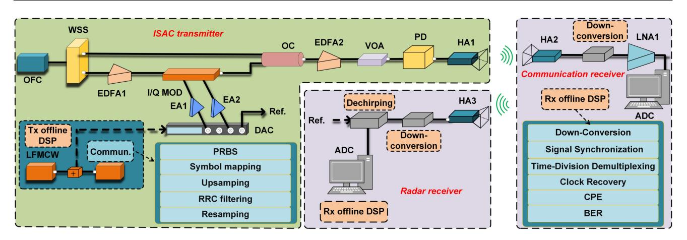

FIGURE 1. Schematic diagram of the proposed photonics-aided ISAC architecture; OFC, optical frequency comb; WSS, wavelength selective switch; EDFA, erbium doped fiber amplifier; I/Q MOD, I/Q modulator; DAC, digital-to-analog converter; ADC, analog-to-digital converter; Ref., reference signal; OC, optical coupler; VOA, variable optical attenuator; PD, photodetector; HA, horn antenna; LNA, low noise amplifier; CPE, carrier phase estimation; BER, bit error ratio.

includes three parts: ISAC transmitter (Tx), communication receiver, and radar receiver.

#### A. ISAC TRANSMITTER

In the ISAC Tx, three functions are deployed, namely the baseband ISAC waveform design, the electro-optic modulation, and the photonic up-conversion.

First, the baseband ISAC signals are designed through Tx offline digital signal processing (DSP). The Tx DSP process involves two steps: generating the baseband LFMCW and the baseband SC communication sequences and then embedding the SC communication sequences into the idle time and frequency dimensions of the baseband LFMCW. The proposed SCIE method takes advantage of the fact that the frequency of the LFMCW increases linearly with its duration. For simplicity, the LFMCW is first directly divided into four equal bands, and then the four SCs are sequentially embedded at the frequency center of each corresponding subband, as shown in Fig. 2. We assume that the total time frame size, the guard interval between the adjacent SCs, and the guard time between the adjacent frame sizes are 4T, 0 GHz,

and 0 s, respectively. In each sub-band, the 1/4-time slot is assigned to the LFMCW, and the rest idle time slots are allocated to the SC communication signal. Mathematically, the baseband LFMCW, baseband multi-SC communication signal, and synthetic digital ISAC signal can be respectively expressed by

$$S_{LFM}(t) = A_S e^{j2\pi \left(-f_s t + 0.5kt^2\right)}, 0 < t \le 4T,$$

$$S_{QAM}(t) = A_C \sum_{n=1}^{4} SC_n(t) \cdot e^{j2\pi \left(-f_s + (n-1)kT\right)t},$$

$$0 < t < (n-1)T \cup nT < t < 4T.$$
(2)

$$S_{ISAC}(t) = S_{LFM}(t) + S_{QAM}(t), \tag{3}$$

where  $A_S$ ,  $f_S$ , and k are the amplitude, initial frequency, and chirp rate of the LFMCW, respectively. n = 1, 2, 3, 4 represents the SC number.  $A_C$ ,  $SC_n(t)$ , and  $\cup$  represent the amplitude of the communication signal, the embedded SC signal of each sub-band, and the union set, respectively. The designed SCIE method can significantly enhance the time-frequency efficiency of the LFMCW without compromising its large TBP. Moreover, the sub-LFMCW in each band can

{3}------------------------------------------------

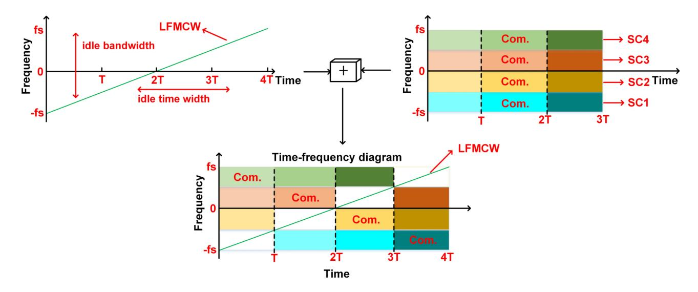

FIGURE 2. Time-frequency diagram of the designed ISAC waveform.

also be used for accurate user data synchronization. It should be pointed out that we can also embed the chirp waveform into the SC signals. That is why we call it SCIE.

After the Tx DSP, the digital-to-analog converter (DAC) converts the digital ISAC signal into two mutually orthogonal analog ISAC signals, which drive the two sub-modulators of the in-phase and quadrature modulator (IQ-MOD). To generate stable-frequency THz signals, a coherent OFC is used as the light source. The use of OFC to generate stablefrequency THz ISAC signals can eliminate the impact of frequency offset at the transmitter, thereby enhancing communication capacity and sensing accuracy. Stable-frequency THz signals also can reduce the signal processing complexity and power consumption at the receiver, particularly the power consumption of battery-powered devices. The generated OFC enters a wavelength selective switch (WSS) for extracting two tones with a THz frequency interval. One of the optical tones serves as the optical carrier, while the other one serves as the optical local oscillation (OLO). Afterward, the optical carrier is amplified by an Erbium-doped fiber amplifier (EDFA1) and then injected into an optical IQ-MOD for joint sensing and communication modulations. Next, the modulated optical carrier is combined with the OLO. The coupled signals can be written as

$$E \propto S_{ISAC}(t)e^{j2\pi f_C t} + \beta e^{j2\pi f_{LO} t}, \tag{4}$$

where  $f_c$  and  $f_{LO}$  are the frequencies of the optical carrier and OLO tones, respectively, and  $\beta$  represents the carrier-to-signal amplitude ratio. The coupled signal is finally converted into a THz ISAC signal in a photodetector (PD) after power optimization using a variable optical attenuator (VOA). Then the generated THz ISAC signal is radiated into free space via a horn antenna (HA1). Considering the band-pass frequency of the radio frequency (RF) devices, the generated THz ISAC signal can be expressed as

$$i(t) \propto \beta A_S \cos \left\{ 2\pi \left[ (f_c - f_{LO} - f_S)t + 0.5kt^2 \right] \right\}$$

$$+ \beta A_C \sum_{n=1}^{4} SC_n(t) \cdot \cos \left\{ 2\pi \left[ f_c - f_{LO} - f_s + (n-1)kT \right] t \right\}.$$
 (5)

It can be seen that an ISAC signal with a frequency equal to the frequency separation of two selected coherent tones is successfully obtained. Moreover, the THz ISAC signal has an ultra-stable frequency due to using the coherent OFC. In free space, a portion of the THz ISAC signal is reflected back to the Tx for radar sensing, while another portion is downlinked to the user for wireless communication.

#### B. COMMUNICATION AND RADAR RECEIVER

At the communication receiver, the downlink THz ISAC signal is first collected by the HA2. The down-conversion module down-converts the received THz ISAC signal to an intermediate frequency (IF), after which it is digitized by the analog-to-digital converter (ADC) and further decoded in the communication DSP module. In the DSP module, the IF ISAC signal is first down-converted to the baseband. Next, the SC communication sequence synchronization is performed using a backup LFMCW with the same chirp rate and duration as the original LFMCW in the Tx. Then, the time-division demultiplexing module separates the communication signals embedded in different time slots of each obtained sub-band signal. Finally, the separated communication signals are sent to a conventional communication DSP module (such as clock recovery and carrier phase estimation modules) to decode the embedded communication information. Additionally, the frequency offset estimation is not required due to the stable frequency provided by coherent OFC, thereby reducing the complexity and power consumption of the DSP.

At the radar receiver, the reflected THz ISAC signal is received by HA3, then down-converted to IF by the down-conversion module, and finally digitized by the ADC for further processing in the de-chirping module. The de-chirped

{4}------------------------------------------------

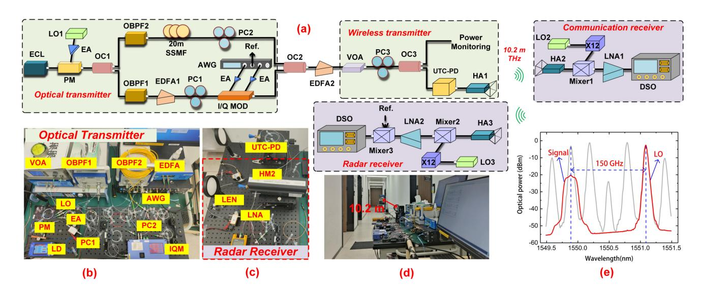

FIGURE 3. (a) Experimental setup of photonics-aided D-band ISAC system. (b), (c) and (d) Photos of the experimental setup. (e) Optical spectra of the OFC and the output of the OC2.

signal is further processed to obtain target information by using the inverse synthetic aperture radar (ISAR) image methods.

## C. DENSITY OF CAPACITY-RESOLUTION QUOTIENT

For the communication function, given the signal-to-ratio (SNR), the channel capacity  $(C_{com})$  and the information content  $(I_{com})$  can be expressed by

$$C_{com} = B_{com} \cdot log_2(1 + SNR) \cdot log_2(M), \tag{6}$$

$$I_{com} = C_{com} T_{com}, (7)$$

where  $B_{com}$ , M, and  $T_{com}$  represent the communication bandwidth, modulation order, and the communication duration, respectively. The above two equations illustrate that the communication signal requires a large TBP to enable the transmission of high information content.

For the sensing function, the range resolution  $(\delta_{sen})$  is inversely proportional to sensing bandwidth  $(B_{sen})$ , while the velocity resolution  $(v_{sen})$  is inversely proportional to sensing duration  $(T_{sen})$ , expressed as

$$\delta_{sen} \propto \frac{c}{2B_{sen}},$$
 (8)

$$v_{sen} \propto \frac{\lambda}{2T_{sen}},$$
 (9)

where c is the speed of light, and  $\lambda$  is the wavelength of the radar signal. The radar signal also requires a large TBP to simultaneously achieve high range resolution and high velocity resolution.

In our previous work, the capacity-resolution quotient (CRQ) [1], [25] was introduced to characterize the bandwidth competition between communication capacity and range resolution in JCR systems. For a more comprehensive description of JCR performance, the time-resource competition between communication and sensing is also considered here. Therefore, we modified the CRQ to the IRQ, expressed by

$$IRQ = \frac{I_{com}}{\delta_{sen} \cdot v_{sen}} = \frac{C_{com} T_{com}}{\delta_{sen} v_{sen}}$$

$$= \frac{4log_2(1 + SNR)log_2(M)}{c \cdot \lambda} \cdot B_{com} T_{com} \cdot B_{sen} T_{sen}. (10)$$

The above formulas generally illustrate the time-frequency competition between sensing and communication functions. To further characterize the time-frequency efficiency of JRC waveforms, we introduce the DIRQ, expressed as

$$DIRQ = \frac{IRQ}{TBP_{JRC}}$$

$$= \frac{4log_2(1 + SNR)log_2(M)}{c \cdot \lambda} \cdot \frac{B_{com}T_{com} \cdot B_{sen}T_{sen}}{B_{JRC}T_{JRC}}.$$
(11)

It is clear from equation (11) that, given the constraints of total bandwidth and duration, maximizing the TBP of both sensing and communication functions is essential for designing the JCR waveforms. However, it is challenging to simultaneously achieve high TBP in TDM and FDM JCR systems due to the competition for time-frequency resources between sensing and communication functions. Our proposed SCIE waveform embeds the SC communication signals in the idle time-frequency dimension of an LFMCW, therefore all idle time-frequency resources of the LFMCW can be used for communication without compromising its large TBP. Consequently, sensing and communication functions can achieve a high TBP simultaneously, significantly improving IRQ and enhancing the time-frequency efficiency of the ISAC systems. In addition, the SCIE method makes the designed waveform compatible with existing sensing and communication algorithms.

# **III. EXPERIMENTAL SETUP AND RESULTS**

#### A. D-BAND ISAC EXPERIMENTAL SETUP

Fig. 3(a) illustrates the experimental setup of the proposed photonics-aided THz ISAC system based on the designed SCIE waveform. At the optical transmitter module, an ECL1

{5}------------------------------------------------

with a narrow linewidth (< 100 kHz) generates a seed light with a wavelength of 1550.032 nm. The seed light is launched into an optical phase modulator (PM, PM-5v5-40-PFA-PFA-UV) with a 40-GHz bandwidth and a 3-V half-wave voltage. Meanwhile, the LO1 (standard 10 MHz reference clock with 1 ppm), with an output power of -7.5 dBm, is injected into the PM after being amplified by electrical amplifiers (EA) with a gain of 28 dB, generating the coherent OFC with a repetition frequency of 37.5 GHz, as shown by the grey line in Fig. 3(e). The generated OFC is split into two branches by an optical coupler (OC1), entering the optical band-pass filter (OBPF1, XTM-50) and OBPF2, respectively, for extracting the  $-2^{nd}$ -order and  $+2^{\text{nd}}$ -order optical tones. The optical tone filtered by the OBPF1 serves as the optical carrier, while the tone filtered by the OBPF2 serves as the OLO. In the lower path, the selected optical carrier is amplified by the Erbium-Doped Fiber Amplifier (EDFA1) and then injected into an optical IQ-MOD for SCIE waveform modulation. Here, four different sets of sequences are mapped to four SCs with either the 4QAM or 16QAM modulation format. Next, the four SCs are embedded in the idle time and frequency of an LFMCW, forming a time-frequency efficient ISAC signal according to the design principle in Section II-A. The offline digital SCIE signal is converted into a pair of mutually orthogonal analog signals by an arbitrary waveform generator (AWG) with a sampling rate of 64GSa/s for driving the IQ-MOD. In the upper path, the selected OLO is roughly delayed to match the optical modulation signal using a 20-m standard singlemode fiber (SSMF). The delayed OLO is coupled with the optical modulation signal using the OC2. The partial photos of the experimental optical path are shown in Fig. 3(b). The frequency interval between the optical modulation signal and the delayed OLO in the coupled spectrum is 150 GHz, as shown by the red line in Fig. 3(e). The amplified coupled signal is power-regulated by a VOA and then split into two branches using the OC3. One branch is injected into the unitraveling-carrier photodetector (UTC-PD, IOD-PMD-14001) to generate THz ISAC signals, while the other one is used for power monitoring. The responsivity of the UTC-PD is 0.35 A/W. Notably, the carrier frequency of the generated THz ISAC signals is equal to the frequency interval between the optical modulation signal and the delayed OLO, which is 150 GHz (D band). In addition, three polarization controllers (PCs) are applied to tune the polarization state of the optical signals. Finally, the generated THz ISAC signals are transmitted into the free space via the HA1 (25 dBi).

At the communication receiver, the THz ISAC signals received by the HA2 (25 dBi) are down-converted to IFs by the THz mixer (Mixer1, 12 dB conversion loss) actuated by a  $\times 12$  electrical LO (ELO, standard 10 MHz reference clock with 10 ppm). The ELO is working at 13.96 GHz, resulting in the down-converted IF signals centered at 17.52 GHz (13.96  $GHz \times 12 - 150$  GHz = 17.52 GHz). The obtained IFs are enhanced by a low noise amplifier (LNA1) and then captured by an 80-GSa/s digital storage oscilloscope

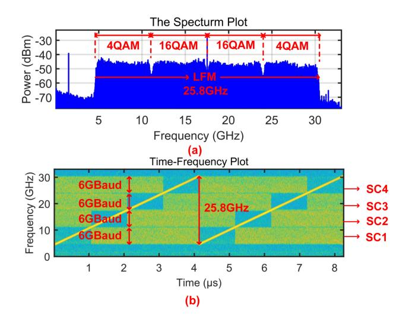

FIGURE 4. (a) Electrical spectrum and (b) time-frequency diagram of the "6GBd-[4, 16, 16, 4] QAM" signal.

(DSO) for further offline communication decoding. At the same time, a part of the transmitted THz ISAC signals is reflected back to the radar receiver. The echoes from the HA3 (25 dBi) are also down-converted to IFs by another THz mixer (Mixer2, 12 dB conversion loss), amplified by the LNA2, and captured by an 80-GSa/s DSO. For further imaging, the echoes are mixed with their references from the AWG via an RF mixer (Mixer3) for de-chirping. Finally, the de-chirped signals are captured by a 4-GSa/s (DSO) for offline localization. Notably, lenses are placed in front of both the transmitting and the receiving HAs to focus the THz ISAC signals to minimize the free-space loss as shown in Fig. 3(c). The wireless radial distance of sensing and communication is 10.2 m, as shown in Fig. 3(d).

# B. D-BAND WIRELESS COMMUNICATION PERFORMANCE

First, we measure the communication performance of the proposed photonic D-band ISAC system. Initially, the bandwidth of the LFMCW is set to 25.8 GHz. The baud rates of all four SCs are set to 6 GBaud, and the rolloff factors of all four SCs are set to 0.05, resulting in a guard interval of 0.15 GHz between the adjacent SCs. Due to the higher electro-optical modulation efficiency and flat transmission response of the two central SCs (SC2 and SC3), the two central SCs outperform the two side SCs (SC1 and SC4). Therefore, the SC2 and SC3 are set to 16QAM, while the SC1 and SC4 are set to 4QAM. Here, the designed ISAC signal is represented as "6GBd-[4, 16, 16, 4] QAM". Figs. 4(a) and (b) show the electrical spectrum and the time-frequency diagram of the received "6GBd-[4, 16, 16, 4] QAM" signal, respectively. As shown in Fig. 4(a), the four SCs are embedded exactly at the frequency center of each corresponding sub-band. In Fig. 4(b), the four SCs can be perfectly embedded in the idle time and frequency of the LFMCW, enabling both

{6}------------------------------------------------

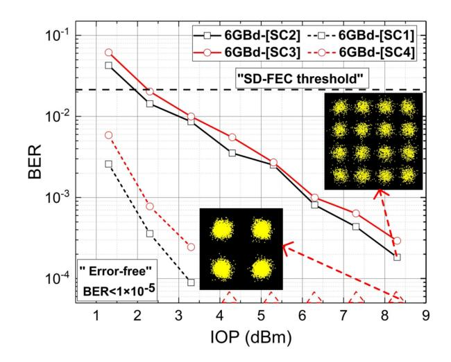

FIGURE 5. BER performance of the ISAC waveforms with different SC modulation formats.

the sensing and communication functions to achieve a high TBP simultaneously. The communication performance is measured by calculating the bit error ratio (BER) under different input optical power (IOP) of the UTC-PD. The IOP is controlled by adjusting the VOA in a 1-dB step. The calculated BER is plotted in Fig. 5. The "6GBd-[SC1]", "6GBd-[SC4]", "6GBd-[SC2]", and "6GBd-[SC3]" represent the BER of the two side 4-QAM SCs and the two central 16-QAM SCs, respectively. The BER performance of both modulation formats improves significantly with the increase of IOP. Both the 4QAM and 16QAM signals exhibit good anti-noise performance, as shown in the constellation diagrams inserted in Fig. 5. Moreover, the 16QAM signal can reach the forward error correction (FEC) threshold of  $2.2 \times 10^{-2}$  assuming soft-decision (SD-) FEC with 20% overhead [26] at an IOP of 3 dBm. Especially, when the IOP exceeds 4 dBm, the 4QAM signals can achieve error-free  $(< 1e^{-4})$  wireless transmission.

It is worth noting that the use of an OFC, combined with the minimal frequency offset of the LOs, eliminated the need for implementing the FOE algorithm in the DSP at the communication receiver. To evaluate the impact of the FOE algorithm on communication performance, we implement the FOE algorithm prior to the CPE algorithm in the DSP at the communication receiver, and the results are shown in Fig. 6. The "6GBd-[SC1, SC4]" and "6GBd-[SC2, SC3]" represent the average BER of the two side 4-QAM SCs and the two central 16-QAM SCs, respectively. As shown in Fig. 6, the BER performance of the two situations (with FOE algorithm and without FOE algorithm) is similar, indicating that the FOE algorithm has almost no impact on communication performance. Therefore, all subsequent tests are conducted under conditions without FOE algorithm.

To give full play to the flexibility of the SC modulation, and further improve the channel capacity, all four SCs are configured in 16QAM format. However, the two central SCs (SC2 and SC3) with better SNR are set to 6 GBaud, while

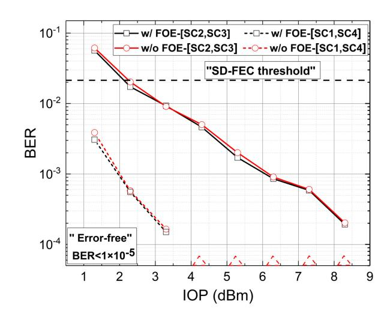

FIGURE 6. BER performance of the ISAC waveforms with or without FOE algorithm.

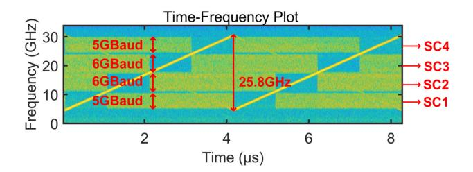

FIGURE 7. Time-frequency diagram of the "[5, 6, 6, 5] GBd-16QAM" signal.

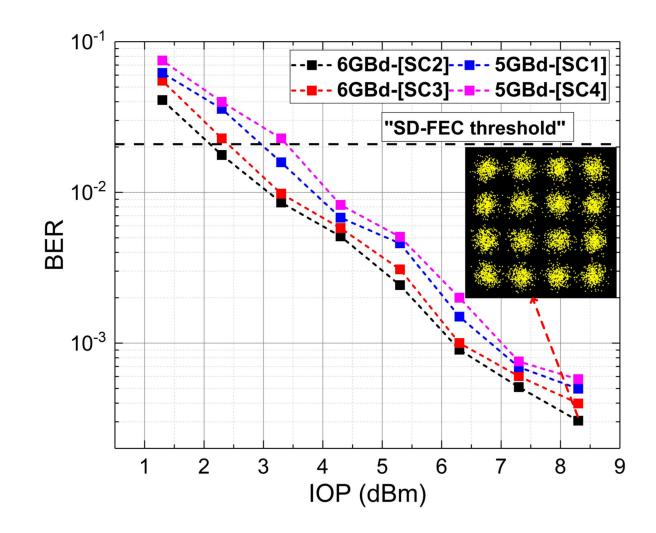

FIGURE 8. BER performance of the ISAC waveforms with all 16QAM modulation formats.

the two sides with lower SNR are set to 5 GBaud. The bandwidth of the LFMCW is still 25.8 GHz ( $(6 \ GHz \times 1.05+0.15) \times 4 = 25.8 \ GHz$ ). The designed ISAC waveform is represented as "[5, 6, 6, 5] GBd-16QAM". Fig. 7 shows the time-frequency diagram of the received "[5, 6, 6, 5] GBd-16QAM" signal. The four SCs are also perfectly embedded in the LFMCW, preserving the large TBP of the LFMCW. Fig. 8 shows the BER performance of the four SCs. From the BER curves, the communication performance is continuously

{7}------------------------------------------------

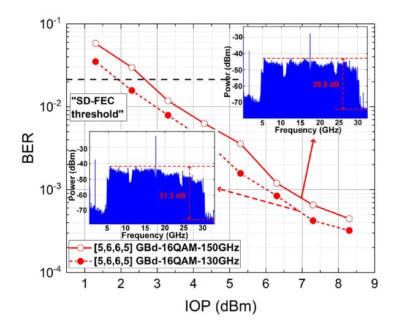

**FIGURE 9. BER performance of the ISAC waveforms at 150 GHz and 130 GHz.**

improved as the IOP increases. It is observed that the BER performance of the two side 5-GBaud SCs is even worse than that of the two central 6-GBaud SCs due to the higher electro-optical modulation efficiency of the two central SCs. As shown in the inserted constellation diagram, the constellation points exhibit clear clustering at the optimal IOP. By fully utilizing the idle time-frequency resources, we achieve an 88-Gbps communication rate and an information content up to 8.8 × 104 bit (1 μ*s*).

Next, to measure the impact of different carrier frequencies on ISAC performance, we maintain the modulation format of the "[5, 6, 6, 5] GBd-16QAM" signal and adjust the OLO frequency to shift the operating frequency to 130 GHz. As shown in Fig. [9,](#page-7-0) the BER curves reveal that the BER performance at 130 GHz (dotted line) is a little better than that at 150 GHz (solid line). As illustrated in the inserted electrical spectrum diagram, the peak-to-noise ratio (PNR) of the 130 GHz signal exceeds that of the 150 GHz signal by 1.8 dB. The overall BER performance at 130 GHz outperforms that at 150 GHz, which can be primarily attributed to the enhanced performance of the D-band receiver and lower transmission losses at 130 GHz. In summary, by employing the SCIE method, we can achieve a communication rate of 88 Gbps at both frequency points.

#### *C. D-BAND SENSING PERFORMANCE*

For radar detection, three static metal targets are placed on a fixed platform. The radial spacing between the middle target and the front target is 10 cm, while the distance between the middle target and back target is 1 cm, as shown in Fig. [10\(](#page-7-1)a). We evaluate the sensing performance of the proposed ISAC system using both the cross-correlation and the ISAR imaging methods. The cross-correlation method is characterized by its simple link structure and high SNR, making it suitable for accurate distance estimation in straightforward environments. Firstly, a cross-correlation between the radar echo before de-chirping and its corresponding pure

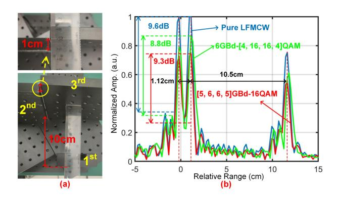

**FIGURE 10. (a) Photos of the radar targets for 10 mm. (b) Normalized cross-correlation results using three different echoes.**

reference LFMCW is performed. The radar echo at the output of the Mixer3 is captured by an 80-GSa/s DSO. The "6GBd- [4, 16, 16, 4] QAM" and "[5, 6, 6, 5] GBd-16QAM" signal in Section [III-B](#page-5-1) are used to measure the impact of SC modulation formats on sensing resolution. The red line and the green line in Fig. [10\(](#page-7-1)b) illustrate the normalized crosscorrelation results of the "[5, 6, 6, 5] GBd-16QAM" and "6GBd-[4, 16, 16, 4] QAM" signal echoes with their pure LFMCW (bandwidth is 25.8 GHz), respectively. The distinct peaks are all clearly visible, with separations of 1.12 cm and 10.5 cm. Apparently, the detection results agree perfectly with the actual values, indicating a 1-cm ranging resolution. As can be seen, the SC modulation formats have almost no impact on sensing performance. Then, to further analyze the embedded SC sequences interference on LFMCW, we use the pure LFMCW to measure the normalized cross-correlation as shown the blue line in Fig. [10\(](#page-7-1)b). By comparing the three lines in Fig. [10\(](#page-7-1)b), it can be observed that the crosscorrelation peaks of the SCIE waveforms have decreased. However, the peak side-lobe ratios (PSLR) of the three cross-correlation results remain nearly unchanged, measuring 9.6 dB, 9.3 dB and 8.8 dB, respectively, indicating that the embedded SCs only reduce the power of the cross-correlation results, but do not introduce distinct sidelobes.

Secondly, the ISAR imaging is constructed based on two-Dimensional Fourier Transformation (2DFT). The 2D imaging is achieved by first mixing the received radar echo with its electrical reference for de-chirping (as shown in Fig. [3\(](#page-4-2)a)), followed by offline processing using the classical Range-Doppler (RD) algorithm [\[27\]](#page-10-9). The de-chirp processing in the analog domain can reduce the signal processing bandwidth and delay, enabling rapid simultaneous evaluation of both range and azimuth. In our experiment, the ISAR imaging method required only a 4-GSa/s DSO for data acquisition and analysis, whereas the cross-correlation method necessitated an expensive 80-GSa/s DSO. Here, three targets are placed similarly to the previous arrangement. The "6GBd-[4, 16, 16, 4] QAM" and "[5, 6, 6, 5] GBd-16QAM" signals are also used to measure system sensing performance. As shown in Figs. [11\(](#page-8-0)a) and (b), the horizontal axis represents the radial distance to the targets, while the

{8}------------------------------------------------

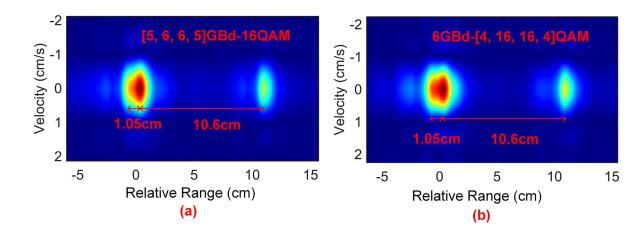

**FIGURE 11. 2D imaging results of two different ISAC waveforms.**

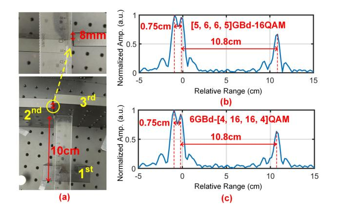

**FIGURE 12. (a) Photos of the radar targets for 8 mm. (b) and (c) Normalized cross-correlation results using two different echoes.**

vertical axis represents the velocity of the targets. Three targets with high energy can be clearly distinguished, with the radial spacing of 1.05 cm and 10.6 cm which agree well with the actual value. By comparing the ISAR imaging of the "6GBd-[4, 16, 16, 4] QAM" and "[5, 6, 6, 5] GBd-16QAM" signals, we can also observe that the modulation formats of the communication signal have almost no effect on the imaging results.

Finally, to ascertain the ultimate detection distance of the designed ISAC waveform, we further reduce the radial spacing between the intermediate and the back targets to 8 mm, as shown in Fig. [12\(](#page-8-1)a). Similarly, the above two waveforms are also used to measure the sensing resolution. The normalized cross-correlation results in Figs. [12\(](#page-8-1)b) and (c) demonstrate similar performance, indicating that sensing resolution is independent of the communication modulation format of the waveform. The intervals between the three peaks are 7.5 mm and 10.8 cm, corresponding to an 8-mm ranging resolution. Obviously, the cross-correlation results are in close agreement with the actual values and also closely approximate the theoretical minimum range resolution of 5.81 mm. Therefore, with the SCIE method, we can achieve 8-mm sensing resolution and 88-Gbps data rate, resulting in an IRQ up to 1.18 × 104*bit*·*s*/*m*2. By fully utilizing the idle time-frequency resources of the LFMCW, a remarkable DIRQ up to 46.2 × 10-2*bit*·*s*/*m*2 is realized.

# *D. DISCUSSION*

As mentioned in Section [II-A,](#page-2-2) the single LFMCW with a large TBP is directly generated by a high-speed DAC. The method to directly generate the ultra-wideband LFMCW

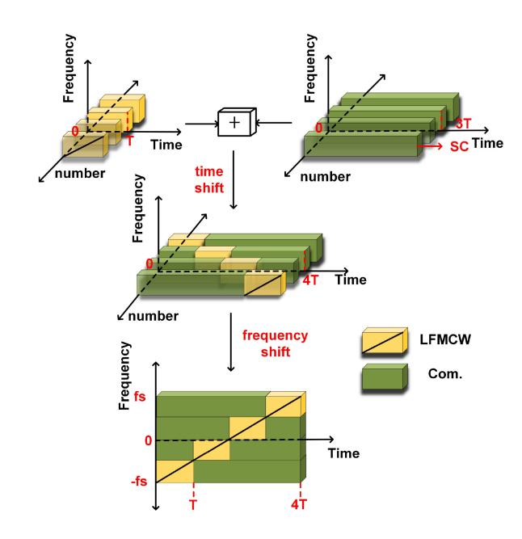

**FIGURE 13. The synthesizing approach of the ISAC waveform using the "M-LFMCW".**

according to the principle in Section [II-A](#page-2-2) is denoted as "S-LFMCW". Based on Fig. [2,](#page-3-0) the LFMCW with large TBP can be decomposed into four identical sub-LFM signals, each having the same TBP but differing in their starting frequencies and starting times. Consequently, we can utilize parallel baseband ADC to generate four sub-LFM signals with identical TBP, followed by appropriate time and frequency shifts to derive the LFMCW with large TBP. The parallel method of generating the LFMCW is represented as "Multiple-LFMCW", abbreviated as "M-LFMCW". As illustrated in Fig. [13,](#page-8-2) the four sub-LFM signals with identical TBP are combined with four SCs through appropriate time shifts to generate four sub-ISAC signals at the baseband, respectively. Then, these baseband sub-ISAC signals are synthesized into an ultra-wideband ISAC signal through appropriate frequency shifts.

Here, we explore the impact of the ISAC signal generation methods on the performance of both communication and radar. The formats of the designed ISAC waveforms using two methods are both set to "6GBd-[4, 16, 16, 4] QAM". The calculated BER in Fig. [14](#page-9-17) is the average BER of the 16QAM signals (SC2 and SC3) and 4QAM signals (SC1 and SC4), respectively. We can observe that the BER performance of the "S-LFMCW" is better than that of the "M-LFMCW" under the same IOP. This is because the amplitude response of the "M-LFMCW" is affected by the transition regions between adjacent sub-LFMCW, which can also cause the PAPR of the "M-LFMCW" to be higher than that of the "S-LFMCW". Furthermore, we also explore the generation methods of the ISAC waveform on the radar performance. The formats of the designed ISAC waveforms using two methods are both set to "6GBd-[4, 16, 16, 4] QAM", and the three targets are placed similarly to those

{9}------------------------------------------------

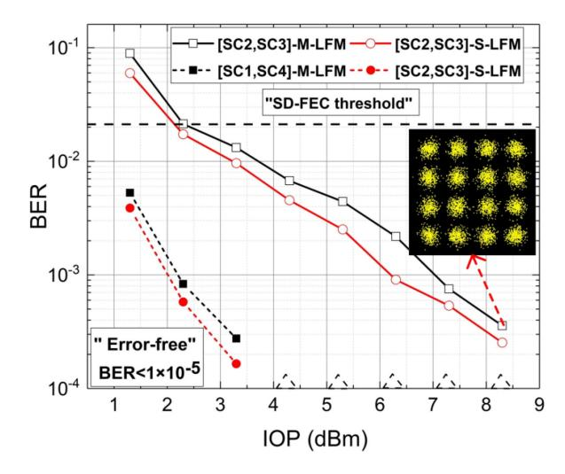

FIGURE 14. BER performance of the ISAC waveforms using two different generation methods.

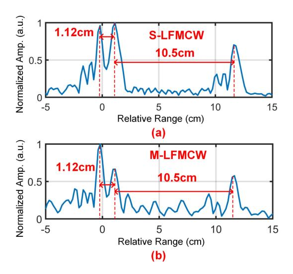

FIGURE 15. (a) and (b) Normalized cross-correlation results using two different generation methods.

in Fig. 9(a). In Figs. 15(a) and (b), we can observe that the detection distance intervals of the ISAC waveform using two different LFMCW generation methods are both 1.12 cm and 10.5 cm, respectively, indicating that the sensing resolution is independent of the generation methods.

#### IV. CONCLUSION

In summary, we design a time-frequency efficient ISAC waveform based on embedding SC communication waveforms on an LFMCW. A D-band photonic ISAC system based on the designed ISAC waveform is experimentally demonstrated. Validated by experimental results, simultaneous 88-Gbps data rate and 8-mm radial resolution are successfully achieved over a 10.2-m wireless distance, leading to an IRQ up to  $1.18 \times 10^4 bit \cdot s/m^2$ . Meanwhile, the proposed SCIE method fully utilizes the idle time-frequency of the LFMCW, thereby significantly enhancing the time-frequency efficiency of the LFMCW without affecting its

large TBP, resulting in a remarkable DIRQ up to  $46.2 \times 10^{-2} bit \cdot s/m^2$ . In the future, we will investigate the communication embedding methods based on OFDM to further enhance time-frequency efficiency.

#### **REFERENCES**

- M. Lei et al., "Integration of sensing and communication in a W-band fiber-wireless link enabled by electromagnetic polarization multiplexing," J. Lightw. Technol., vol. 41, no. 23, pp. 7128–7138, Dec. 1, 2023.
- [2] S. Jia et al., "A unified system with integrated generation of high-speed communication and high-resolution sensing signals based on THz photonics," *J. Lightw. Technol.*, vol. 36, no. 19, pp. 4549–4556, Oct. 1, 2018.
- [3] M. Z. Chowdhury, M. Shahjalal, S. Ahmed, and Y. M. Jang, "6G wireless communication systems: Applications, requirements, technologies, challenges, and research directions," *IEEE Open J. Commun. Soc.*, vol. 1, pp. 957–975, 2020.
- [4] N. A. Khan and S. Schmid, "AI-RAN in 6G networks: State-of-the-art and challenges," *IEEE Open J. Commun. Soc.*, vol. 5, pp. 294–311, 2024.
- [5] X. Gao et al., "Towards converged millimeter-wave/terahertz wireless communication and radar sensing," ZTE Commun., vol. 18, no. 1, pp. 73–82, 2020.
- [6] L. Li et al., "THz-over-fiber system with orthogonal chirp division multiplexing for integrated sensing and communication," *J. Lightw. Technol.*, vol. 42, no. 1, pp. 176–183, Sep. 4, 2023.
- [7] Y. Wang et al., "Photonics-assisted joint high-speed communication and high-resolution radar detection system," *Opt. Lett.*, vol. 46, no. 24, pp. 6103–6106, 2021.
- [8] L. G. de Oliveira, B. Nuss, M. B. Alabd, A. Diewald, M. Pauli, and T. Zwick, "Joint radar-communication systems: Modulation schemes and system design," *IEEE Trans. Microw. Theory Tech.*, vol. 70, no. 3, pp. 1521–1551, Mar. 2022.
- [9] H. Wang et al., "Photonics-assisted broadband frequency-hopping system for W-band MMW secure communications," in Proc. Asia Commun. Photon. Conf. Int. Photon. Optoelectron. Meetings (ACP/POEM), 2023, pp. 1–4.
- [10] M. Lei et al., "Photonics-aided integrated sensing and communications in mmW bands based on a DC-offset QPSK-encoded LFMCW," Opt. Exp., vol. 30, no. 24, pp. 43088–43103, 2022.
- [11] Y. Wang et al., "Integrated radar jamming signal generation and secure wireless communication based on photonics at ka-band," *IEEE Trans. Microw. Theory Tech.*, vol. 72, no. 10, pp. 6010–6019, Oct. 2024.
- [12] Y. Wang et al., "Photonics-based integrated radar jamming and secure communication system at ka-band," *J. Lightw. Technol.*, vol. 42, no. 10, pp. 3621–3630, May 15, 2024.
- [13] D. Du et al., "Photonics-assisted joint radar jamming and secure communication in the millimeter-wave band based on CE-LFM-OFDM," Chin. Opt. Lett., vol. 22, no. 6, 2024, Art. no. 63902.
- [14] J. Jia, B. Dong, L. Tao, J. Shi, N. Chi, and J. Zhang, "Demonstration of radar-aided flexible communication in a photonics-based W-band distributed integrated sensing and communication system for 6G," *Chin. Opt. Lett.*, vol. 22, no. 4, 2024, Art. no. 43901.
- [15] Y. Wang et al., "Integrated high-resolution radar and long-distance communication based-on photonic in terahertz band," *J. Lightw. Technol.*, vol. 40, no. 9, pp. 2731–2738, May 1, 2022.
- [16] B. Dong et al., "Photonic-based W-band integrated sensing and communication system with flexible time- frequency division multiplexed waveforms for fiber-wireless network," J. Lightw. Technol., vol. 42, no. 4, pp. 1281–1295, Feb. 15, 2024.
- [17] Z. Lyu et al., "Photonic THz-ISAC demonstration with simultaneous 120Gbit/s communication and 2.5 mm sensing resolution," in *Proc. 49th Eur. Conf. Opt. Commun. (ECOC)*, 2023, pp. 1650–1653.

{10}------------------------------------------------

- [\[18\]](#page-1-6) N. Zhong, P. Li, W. Bai, W. Pan, L. Yan, and X. Zou, "Spectral-efficient frequency-division photonic millimeter-wave integrated sensing and communication system using improved sparse LFM sub-bands fusion," *J. Lightw. Technol.*, vol. 41, no. 23, pp. 7105–7114, Dec. 1, 2023.
- [\[19\]](#page-1-7) S. Wang, D. Liang, and Y. Chen, "Photonics-assisted joint communication-radar system based on a QPSK-sliced linearly frequency-modulated signal," *Appl. Opt.*, vol. 61, no. 16, pp. 4752–4760, 2022.
- [\[20\]](#page-1-7) F. Liu et al., "Millimeter-wave over fiber integrated sensing and communication system using self-coherent OFDM," *Opt. Express*, vol. 32, no. 9, pp. 15493–15506, 2024.
- [\[21\]](#page-1-7) W. Bai, X. Zou, P. Li, W. Pan, L. Yan, and B. Luo, "60-GHz photonic millimeter-wave joint radar-communication system," in *Proc. Int. Conf. Microw. Millim. Wave Technol. (ICMMT)*, 2021, pp. 1–3.
- [\[22\]](#page-1-7) W. Bai et al., "Millimeter-wave joint radar and communication system based on photonic frequency-multiplying constant envelope LFM-OFDM," *Opt. Express*, vol. 30, no. 15, pp. 26407–26425, 2022.

- [\[23\]](#page-1-7) J. Liu et al., "W-band photonics-aided ISAC wireless system sharing OFDM signal as communication and sensing," in *Proc. Opt. Fiber Commun. Conf.*, 2024, pp. 1–3.
- [\[24\]](#page-1-7) Z. Lyu et al., "Radar-centric photonic terahertz integrated sensing and communication system based on LFM-PSK waveform," *IEEE Trans. Microw. Theory Tech.*, vol. 71, no. 11, pp. 5019–5027, Apr. 2023.
- [\[25\]](#page-4-3) J. Zhang et al., "A photonics-assisted D-band ISAC system based on a time-frequency efficient waveform," in *Proc. Asia Commun. Photon. Conf. Int. Conf. Inf. Photon. Opt. Commun. (ACP/IPOC)*, 2024, pp. 1–4.
- [\[26\]](#page-6-4) C. Castro et al., "32 GBD 16QAM wireless transmission in the 300 GHz band using a pin diode for THz upconversion," in *Proc. Opt. Fiber Commun. Conf.*, 2019, pp. 4–5.
- [\[27\]](#page-7-2) S. Li et al., "Chip-based microwave-photonic radar for highresolution imaging," *Laser & Photonics Rev.*, vol. 14, no. 10, 2020, Art. no. 1900239.