Received 17 February 2024; revised 22 March 2024; accepted 31 March 2024. Date of publication 9 April 2024; date of current version 25 April 2024. The review of this article was arranged by Associate Editor Song Guo.

*Digital Object Identifier 10.1109/OJCS.2024.3386733*

# **An Intelligent Path Loss Prediction Approach Based on Integrated Sensing and Communications for Future Vehicular Networks**

**ZIXIANG WEI [1](https://orcid.org/0009-0001-7600-9277),2,3, BOMIN MAO [1](https://orcid.org/0000-0001-7780-5972),2,3 (Member, IEEE), HONGZHI GUO [1](https://orcid.org/0000-0002-2503-2784),2,3 (Member, IEEE), YIJIE XUN [1](https://orcid.org/0000-0002-5540-2651),2,3 (Member, IEEE), JIAJIA LIU [1](https://orcid.org/0000-0003-4273-8866) (Senior Member, IEEE), AND NEI KATO [4](https://orcid.org/0000-0001-8769-302X) (Fellow, IEEE)**

1National Engineering Laboratory for Integrated Aero-Space-Ground-Ocean Big Data Application Technology, School of Cybersecurity, Northwestern Polytechnical University, Xi'an 710072, China

2Yangtze River Delta Research Institute of Northwestern Polytechnical University, Taicang 215400, China 3Shenzhen Research Institute, Northwestern Polytechnical University, Shenzhen 518057, China 4Graduate School of Information Sciences, Tohoku University, Sendai 980-8579, Japan

CORRESPONDING AUTHOR: BOMIN MAO (e-mail: [maobomin@nwpu.edu.cn\)](mailto:maobomin@nwpu.edu.cn).

**ABSTRACT** The developments of communication technologies, Internet of Things (IoT), and Artificial Intelligence (AI) have significantly accelerated the advancement of Intelligent Transportation Systems (ITS) and Autonomous Driving (AD) in recent years. The exchange of sensed information by widely deployed radars, cameras, and other sensors on vehicles and roadside infrastructure can improve the traffic awareness of drivers and pedestrians. However, wireless data transmission in vehicular networks is challenged by highly dynamic path loss due to utilized frequency bands, weather conditions, traffic overheads, and geographical conditions. In this paper, we propose an Integrated Sensing and Communication System (ISAC) based path loss prediction approach to improve the knowledge of wireless data transmissions in vehicular networks, which utilizes multi-modal data collected by millimeter-wave (mmWave) radars, laser radars, and cameras to forecast the end-to-end path loss distribution. By leveraging a generative adversarial network for parameter initialization coupled with fine-tuning through supervised learning, the model's accuracy can be significantly improved. To increase the model's scalability, the effects of weather conditions, geographical conditions, traffic overheads, and frequency bands are all analyzed. According to the simulation results, our model achieves excellent accuracy with Mean Squared Error (MSE) of the predicted path loss distribution below 3*e*−<sup>3</sup> across five different scenarios.

**INDEX TERMS** Artificial general intelligence (AGI), autonomous driving (AD), integrated sensing and communications (ISAC), vehicle-to-everything (V2X).

# **I. INTRODUCTION**

Autonomous driving (AD) has been recognized as an important paradigm in the 5G and 6G era [\[1\].](#page-8-0) To promote this technology, various kinds of sensors have been deployed in the current intelligent vehicles, including laser radars, millimeterwave (mmWave) radars, cameras, and position estimators. Vehicle-to-Everything (V2X) communication enables the traffic information exchange among the vehicles and roadside units (RSUs), promoting AD to Vehicle-Infrastructure Cooperated Autonomous Driving (VICAD), which further enhances road safety, alleviates traffic congestion, and improves user convenience [\[2\],](#page-8-0) [\[3\],](#page-9-0) [\[4\].](#page-9-0) On the other hand, the technology of VICAD has proposed extremely critical requirements for the Quality of Service (QoS) for V2X communications, such as ultra-low latency, large bandwidth, and low packet drop rate [\[5\].](#page-9-0) To meet these requirements, 5G New Radio has been considered for V2X communications [\[6\]](#page-9-0) in the 5G era, while the much higher frequency band including Terahertz (THz) is also a potential choice in the future 6G era.

<span id="page-1-0"></span>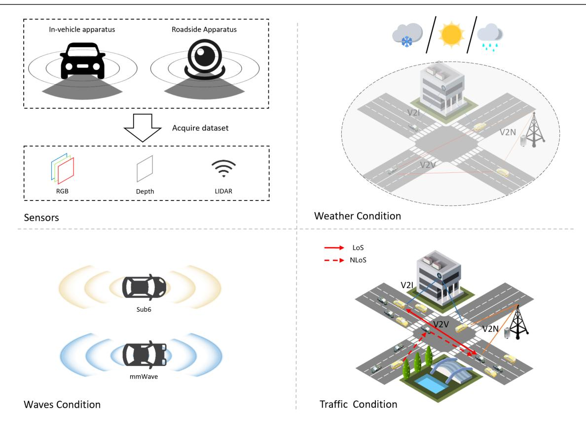

**FIGURE 1. Factors considered for path loss prediction in the V2X scenario.**

On the one hand, the application of new frequency bands can improve the V2X communication quality [\[7\].](#page-9-0) On the other hand, the transmission of high-frequency-band signals is challenged by the severe path loss due to the reduced penetration capability, increased propagation attenuation, and ubiquitous blockage in the modern city [\[8\],](#page-9-0) [\[9\].](#page-9-0) Even though the effects of path loss can be alleviated by adjusting the transmission power, bandwidth, and many other configurations [\[10\],](#page-9-0) [\[11\],](#page-9-0) the key issue is to construct a precise and efficient path loss prediction model due to the stringent QoS requirements of V2X communications. Existing path loss prediction methods can be classified into two categories: *deterministic models* and *statistical models* [\[11\],](#page-9-0) [\[12\].](#page-9-0) However, the accuracy of *deterministic models* depends on the comprehensive knowledge of the environmental factors, while *statistical models* require manual intervention to learn the relevant parameters, which limits the scalability and generality for the various V2X communication scenarios.

To address the above issues, combining the technologies of Integrated Sensing and Communications (ISAC) and Artificial Intelligence (AI) can be a promising and competitive solution. As an important 6G paradigm, ISAC achieves a dual functionality of intelligent environmental perception and information transmission by seamlessly integrating sensing devices and communication systems [\[13\].](#page-9-0) With the wide deployment of various sensors in future vehicles and roadside infrastructure, it is necessary and meaningful to explore the application of the perceptual data provided by ISAC to guide V2X communications. In V2V networks, the rich sensory data comprehensively reflect the channel propagation characteristics of the communication system [\[14\]](#page-9-0) as shown in Fig. 1, making the integration of ISAC with V2V both necessary and organic. To address the multi-modal data provided by different kinds of sensors as shown in Fig. 1 is beyond traditional mathematical modeling methods, while the advantages of AI in analyzing high-dimensional data and establishing relationships among various parameters [\[15\],](#page-9-0) [\[16\]](#page-9-0) have been widely illustrated in recent years. Moreover, with the advent of large language models led by ChatGPT, the pre-training plus finetuning technique is gradually emerging as the mainstream for achieving Artificial General Intelligence (AGI) [\[17\],](#page-9-0) [\[18\],](#page-9-0) of which the commendable generalization and scalability have been demonstrated by extensive research [\[19\],](#page-9-0) [\[20\],](#page-9-0) [\[21\].](#page-9-0)

In this manuscript, we focus on path loss prediction in future vehicular networks and propose an intelligent approach based on ISAC and AGI techniques. Specifically, the target is to analyze the probability distribution of path loss between any two nodes in the V2X scenarios considering the weather conditions and frequency bands. We utilize the multi-modal data acquired through different kinds of sensors and adopt deep neural networks to extract the inherent features which can be further integrated to guide the path loss prediction model by employing our designed feature fusion multihead attention architecture. To increase the generality and

scalability of the path loss prediction model, we initiate the parameters through a generative adversarial approach, followed by fine-tuning the model through supervised learning. Therefore, the contributions can be summarized as below:

- We leverage the ISAC technique and adopt the multimodal sensory data to predict the probability distributions of path loss between two communication nodes in future V2X communication scenarios.
- The deep learning technique is utilized to extract and integrate the inherent features in the multi-modal data to accurately predict the path loss distribution.
- Considering the diversity in V2X communication scenarios, the AGI technique is considered to improve the generality and scalability of the proposed path loss prediction model.

#### **II. RELATED WORK**

In this section, we introduce the related work on conventional path loss prediction methods and AI-based prediction models.

## A. CONVENTIONAL PATH LOSS PREDICTION

Conventional methods for predicting path loss can be categorized into two groups: *deterministic models* and *statistical models*. Deterministic models typically make accurate predictions using formulas and highly precise environmental terrain information, while statistical models typically originate from extensive real-world measurements and derive empirical formulas according to the collected practical data.

Refs. [22], [23] both stand as representatives of deterministic models. The former straightforwardly makes corrections on the free-space loss for the earth propagation environment, while the latter proposes a propagation model suitable for suburban areas by employing a flexible path loss exponent model with  $\alpha=4$  and considering factors including antenna height and potential penetration loss. Ref. [24] studies the 60 GHz transmission path loss for inter-vehicle communication through predictive formulas and conducts the tests under both Line of Sight (LoS) LoS and Non LoS (NLoS) conditions with smooth asphalt surfaces and LoS scenarios serving as benchmarks. The study successfully formulates a prediction model for moving vehicles.

Statistical models usually employ linear logarithmic distance path loss and shadowing models based on the measurements and statistical characteristics. The statistical model proposed by [25] is derived from experimental data measurements in a typical suburban environment, establishing a path loss model for communications from cellular base stations to drones. Additionally, [26] presents an empirical propagation model for outdoor environments, which is also derived from statistical measurement data.

The essence of traditional path loss prediction methods lies in the manual extraction of feature information. The characteristics of these models depend on the comprehensive consideration of all related factors and highly accurate measurements. However, due to the complex transmission characteristics of high-frequency band signals as well as the infinite number of different communication scenarios, it is impossible to rely on manual measurement and analysis to get the path loss with traditional prediction methods [27].

## B. AI-BASED METHOD FOR PREDICTING PATH LOSS

To address the above limitations of traditional path loss prediction models, AI-based approaches have been proposed by researchers to study the complex relationship among multiple factors with machine learning.

Ref. [15] initially clusters the path loss data into different categories according to their distribution and establishes regression models for each category. However, this approach is confined to predefined scenes and cannot be applied in new scenarios. Since it is difficult to manually identify the critical factors of path loss, [28] explores a non-parametric learning approach and applies random forests with the practical dataset of fleet vehicle communication. Experimental results demonstrate that this method outperforms parameterized logarithmic distance path loss models. Authors of [2] employ environmental perception as input data to generate corresponding path loss. However, the manually specified input data may lack generality which can lead to overlooked factors and potential prediction inefficiencies. A similar concern has already been validated in research on Large Language Models (LLMs) [17], [18].

Ref. [29] introduces a path loss modeling method termed Enhanced Local Area Multi-Scanning Strategy (E-LAMS) which utilizes the Convolutional Neural Networks (CNNs) to extract the path loss-related features from environment images between Transmitter (Tx) and Receiver (Rx) provided by Google Street View. Similarly, [6] utilizes a three-dimensional (3D) CNN and introduces the 3D-LAMS algorithm which samples 3D spatial information from the Digital Elevation Model (DEM) to create a simplified 3D image of building shapes as input of the 3D CNN. Both studies attempt to predict path loss using general data such as images and Light Detection And Ranging (LiDAR) as input. However, the scalability of these methods is limited while the node mobility in V2X scenarios is neglected.

#### III. METHODOLOGY

In this article, we consider the vehicle-equipped sensors and communication conditions as shown in Fig. 1. We consider both the roadside infrastructure and vehicles. Each node in the considered network is equipped with RGB image sensors, depth image sensors, and LiDAR sensors. The communication between any two points can be categorized into LoS and NLoS links. It is commonly known that LoS links typically exhibit lower propagation loss and higher signal quality, while NLoS links tend to have relatively poorer signal quality. Moreover, five scenes with different combinations of weather, utilized frequency bands, and traffic load are considered and denoted as \( \sunny, mmWave, moderate \rangle, \sunny, mmWave, moderate \rangle, \sunny, mmWave, moderate \rangle, \quad \sunny, mmWave, moderate \rangle, \quad \sunny, mmWave, moderate \rangle, \quad \sunny, mmWave, moderate \rangle, \quad \sunny, mmWave, moderate \rangle, \quad \sunny, mmWave, moderate \rangle, \quad \sunny, mmWave, moderate \rangle, \quad \sunny, mmWave, moderate \rangle, \quad \sunny, mmWave, moderate \rangle, \quad \sunny, mmWave, moderate \rangle, \quad \sunny, mmWave, moderate \rangle, \quad \sunny, mmWave, moderate \rangle, \quad \sunny, mmWave, moderate \rangle, \quad \sunny, mmWave, moderate \rangle, \quad \sunny, mmWave, moderate \rangle, \quad \sunny, mmWave, moderate \rangle, \quad \sunny, mmWave, moderate \rangle, \quad \sunny, mmWave, moderate \rangle, \quad \sunny, mmWave, moderate \rangle, \quad \quad \text{onderate} \rangle.

<span id="page-3-0"></span>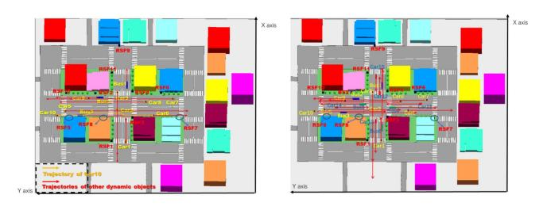

| Roadside equipment | х          | Y          | Z        |
|--------------------|------------|------------|----------|
| BS1                | 143.775835 | 253.279537 | 5.000000 |
| BS2                | 196.578962 | 270.846861 | 5.000000 |
| BS3                | 169.680793 | 231.147452 | 5.000000 |
| BS4                | 198.708655 | 231.264362 | 5.000000 |
| BS5                | 166.652456 | 298.832963 | 5.000000 |
| BS6                | 197.494930 | 200.807723 | 5.000000 |
| BS7                | 168.744859 | 180.552460 | 5.000000 |
| BS8                | 168.229762 | 263.423654 | 5.000000 |
| BS9                | 249.430645 | 245.660057 | 5.000000 |
| BS10               | 196.502470 | 301.953621 | 5.000000 |
| BS11               | 219.056784 | 253.337080 | 5.000000 |

**FIGURE 2. The considered scenarios.**

**TABLE 1. Considered Infrastructure and Vehicles**

| Scene 1 | Scene 2 | Scene 3 | Scene 4 | Scene 5 |
|---------|---------|---------|---------|---------|
| RSF8    | RSF8    | RSF7    | RSF7    | RSF8    |
| RSF5    | RSF5    | RSF6    | RSF3    | RSF5    |
| Car9    | Car9    | Car8    | Car9    | Car9    |
| Car7    | Car7    | Car7    | Car8    | Car7    |
| Car5    | Car5    | Car6    | Car7    | Car5    |
| Car10   | Car10   | Car5    | Car5    | Car10   |
| Bus3    | Bus3    | Car10   | Bus3    | Bus3    |

# *A. DATASET ANALYSIS*

The utilized mixed multi-modal dataset originates from two projects [\[30\],](#page-9-0) [\[31\],](#page-9-0) which leverages the Wireless InSite simulation software to collect wireless communication channel data. The communication frequency bands include the mmWave spectrum (28 GHz) and sub-6 GHz band (5.9 GHz). The simulation and data acquisition are conducted using the 3D game engine Unreal Engine and the AirSim simulation software. The dataset scene diagram and the associated infrastructure are shown in Fig. 2.

Since there are infinite point pairs in Fig. 2, it is reasonable to only analyze the path loss between parts of the infrastructure in five different scenarios. Fig. 2 and Table 1 show the vehicular network scenario including roadside infrastructure and vehicles. And Table 1 lists the considered roadside infrastructure and vehicles in five scenes which will be analyzed in the following sections.

In the dataset, both roadside and vehicular units are equipped with multi-modal perception devices, including RGB cameras, depth cameras, and LiDAR sensors. The wireless communication channel data and multi-modal perception data in the dataset are collected by multiple vehicles and roadside units. The dataset covers three weather conditions,

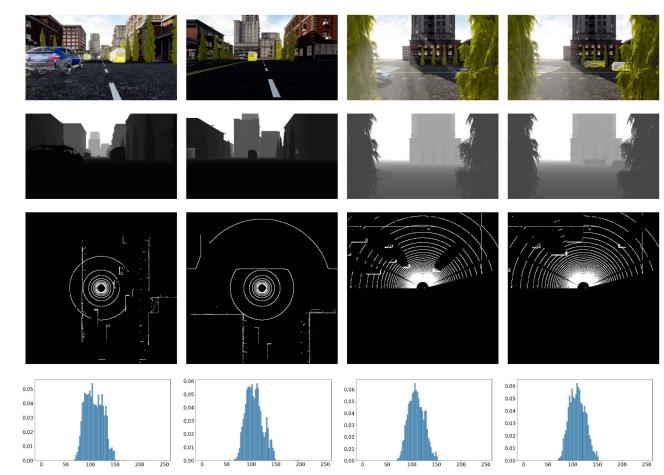

**FIGURE 3. Multi-modal sensor data visualization.**

namely, clear, rainy, and snowy weather, and spans different traffic densities. As depicted in Fig. 3, the four rows of images from top to bottom sequentially display different types of data: RGB images, depth images, radar point clouds (processed into a top-down view), and path loss distribution (subjected to statistical processing). The raw LiDAR data consists of a collection of 3D point coordinates, with a set size of around 92,000. The original path loss data comprises a set of path loss values with a quantity of around 3,200.

To realize end-to-end feature extraction from multi-modal data, state-of-the-art AI models require substantial computational resources [\[32\].](#page-9-0) However, for specific downstream application domains, it is often possible to leverage certain general pre-trained models and perform fine-tuning for the specific domain [\[20\].](#page-9-0) This approach has been obviously validated in recent years in the fields of computer vision and natural language processing [\[19\],](#page-9-0) [\[21\].](#page-9-0) Hence, to apply pretraining techniques to path loss prediction, we flatten the LiDAR data into a two-dimensional representation to obtain its top-down view. In order to explore the model's handling capability of general image data, different from works [\[6\],](#page-9-0) [\[29\],](#page-9-0) we do not apply any additional processing to the transformed LiDAR data image. For the path loss data in the dataset, we transform the path loss information into a probability distribution, which involves predicting the distribution of path loss values ranging from 0 *dB* to 250 *dB* with 2.5 *dB* intervals for specific scene conditions, moments, and devices.

# *B. ARCHITECTURE*

The task involves predicting the corresponding path loss distribution according to the input multi-modal data information at the current moment, which is fundamentally a generative task. The comprehensive architectural diagram of the model is shown in Fig. [4.](#page-4-0)

We employ Generative Adversarial Networks (GAN) [\[33\],](#page-9-0) which will be discussed in the next section. This section primarily introduces two crucial components of GAN: the discriminator and the generator.

<span id="page-4-0"></span>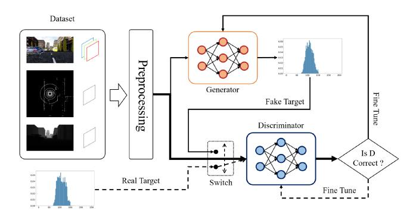

**FIGURE 4. Generative adversarial architecture.**

The fundamental concept of the generator network architecture involves three computer vision networks, namely Vision Transformer (ViT) [\[34\],](#page-9-0) FasterNet-T2, and FasterNet-T1 [\[35\],](#page-9-0) to capture information from RGB images, depth images, and LiDAR images, respectively. Subsequently, the acquired information undergoes multi-head self-attention feature extraction for intricate feature amalgamation, culminating in the prediction of the path loss distribution through a final layer of Fully Connected (FC) output. In particular, the parameter counts for the three image feature extraction networks are ViT (86.9 million), FasterNet-T2 (14.36 million), and FasterNet-T1 (6.97 million). The selection of the appropriate visual network is primarily guided by a comprehensive consideration of the inherent features of the corresponding dataset and the intrinsic characteristics of the networks themselves.

Upon analyzing the dataset, we can find that RGB image data contains the most information since each image includes information from three distinct channels. LiDAR data increases situational awareness around nodes, capturing terrain and surroundings within a defined range through waveform acquisition, thereby possessing crucial informational significance. On the other hand, depth images primarily comprise distance information, constituting the minimum volume of information.

We denote the image features extracted by ViT, FasterNet-T2, and FasterNet-T1 as V, Q, and K, respectively. We have designed a multi-head self-attention feature extraction method to seamlessly fuse the features of the three networks [\[36\].](#page-9-0) Specifically, by transforming the information extracted by the three networks into three feature matrices, Q, K, and V, attention feature values are calculated according to specified formulas. These values guide scaled dot-product attention computations primarily over the main features extracted from RGB images by ViT. The scaled dot-product attention calculation formula is as indicated in (1).

$$Attention(Q, K, V) = softmax\left(\frac{Q \times K^{T}}{\sqrt{dim}}V\right).$$
 (1)

This architectural framework consolidates characteristics from different extractors, executes multi-head highdimensional mappings, harmonizes features utilizing assigned

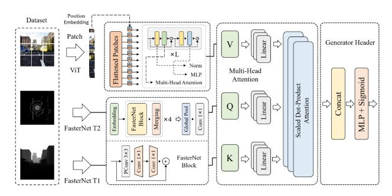

**FIGURE 5. Generator architecture.**

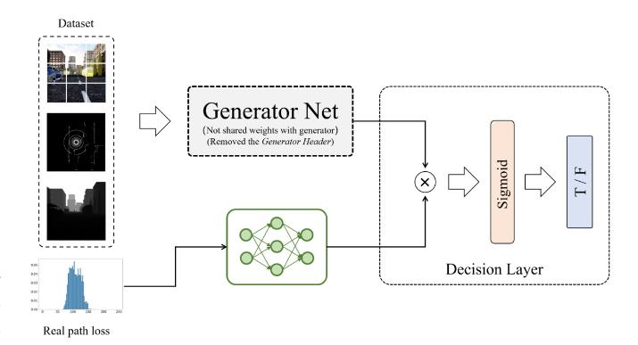

**FIGURE 6. Discriminator architecture.**

attention weights, and generates the output of the feature stream. After acquiring pertinent information, the data shall undergo a two-tier Multi-Layer Perception (MLP) for final predictions. The schematic representation of the generator is provided in Fig. 5.

The discriminator network and the generator network share an identical network architecture, but they do not share parameter weights. The generator structure in the discriminator is formed by removing the *Generator Header* from the generator network shown in Fig. 5. The point of divergence lies in the fact that the discriminator also requires path loss data as input. Its objective is to assess the reliability of the provided path loss data based on the given information (RGB, Depth, LiDAR). If the data are reliable, the output result should fall between 0.5 and 1, if not, between 0 and 0.5.

Built upon this conceptual framework, we multiply the output of the feature extraction and fusion part of the discriminator with the path loss data transformed through a two-layer MLP. Subsequently, a discernment is made through an FC layer. The implication is to assess, based on features extracted from the left side, whether the path loss aligns with certain extracted features. If yes, the result should tend towards infinity after multiplication, otherwise, the output after multiplication tends toward zero. This design aims to effectively evaluate the feature information extracted by the discriminator, enabling it to distinguish the reliability of the input path loss data. The schematic diagram of the discriminator is depicted as shown in Fig. 6.

As we can observe from Figs. 5 and 6, both networks require the extraction of relevant feature information from the data. This deviates from traditional GANs, as our generator needs to synthesize corresponding data based on specific environmental information rather than rely on a random vector input. Consequently, we design the input vectors for both networks to be the same three multi-modal data sources comprising RGB images, LiDAR data, and depth maps. Furthermore, since the discriminator needs to assess the reliability of path loss data, it requires the input of path loss information as a basis for the discriminator.

#### C. ALGORITHM

Based on the aforementioned two networks, we construct a GAN for data generation. The fundamental principle is to train the generator and discriminator networks through an adversarial process for data generation. The goal of the generator network is to generate data as real as possible, while the discriminator network's task is to distinguish between generated and real data [37], [38]. Simplified steps are as follows:

- 1) Generator generates  $target_{fake}$  based on the input data (without gradient information).
  - Discriminator takes target<sub>train</sub> and data as input and expects an output of all ones vector (where 1 signifies real).
  - ii) Discriminator takes  $target_{fake}$  and data as input and expects an output of all zeros vector (where 0 signifies fake).
- 2) Discriminator backpropagates and updates gradients.
- 3) Generator generates  $target_{fake}$  based on the input data (with gradient information).
- Discriminator assesses whether this information is real, computes the loss against an all-ones vector, and provides feedback to the generator.
- 5) Generator backpropagates and updates gradients.

The comprehensive pseudocode for the algorithm is delineated in Algorithm 1. Lines 1–7 denote the data processing segment, wherein the LiDAR point data are initially transformed into a 2D top-down view, and the sampled data of path loss are converted into a probability distribution density. Lines 8-28 elaborate on our training function.  $data_{train}$  and  $target_{train}$  represent the training data and label values, respectively.  $real_{loss}$  denotes the loss incurred by the discriminator in discerning real data, while  $fake_{loss}$  signifies the loss in discerning fake data generated by the generator.  $g_{loss}$  represents the loss incurred in the data generation of the generator.

To enhance the convergence control of the GAN, we define  $D\_LOSS\_LIMIT$  during the training process as the threshold at which the discriminator's loss is optimized. Simultaneously, the parameter  $G\_MORE\_EPOCH$  limits the number of additional training iterations for the generator in each training round. Additionally, throughout the training process, we employ several tricks to accelerate the convergence, such as cosine annealing learning rate warm restarts, early stopping, and L2 norm regularization.

## **Algorithm 1:** Generative Adversarial Algorithm.

- 1: Data preparing:
- Transform LiDAR point cloud into a 2D overhead view.
- 3: Compute the probability distribution of path loss for each frame.
- 4: Divide the dataset into training, validation, and test sets.
- 5:  $data_{train}$ ,  $target_{train}$ : (img, depth, lidar) and path loss.
- 6:  $data_{test}$ ,  $target_{test}$ : (img, depth, lidar) and path loss.
- 7: Dataset normalization.
- 8: **procedure** Training( $data_{train}$ ,  $target_{train}$ )
- 9: Generator takes  $data_{train}$  and generates  $target_{fake}$ .

```
10: Discriminator assesses data_{train} and target_{train}.

11: real_{loss} =
```

12:  $\frac{1}{m} \sum [\log D(data_{train}, target_{train})].$ 13: Discriminator assesses  $data_{train}$  and  $target_{fake}.$ 14:  $fake_{loss} =$ 

15:  $\frac{1}{m} \sum [\log D(data_{train}, target_{fake})].$ 16: **if**  $real_{loss} + fake_{loss} > D\_LOSS\_LIMIT$  **then**17: Update the Discriminator's gradients.

18:  $\nabla_{\theta_d}(real_{loss} + fake_{loss})$ .

19: **end if**20: **while**  $count < G\_MORE\_EPOCH$  **do** 

21: count + = 122: Generator assesses  $data_{train}$ . 23:  $g_{loss} =$ 

24:  $\frac{1}{m} \sum \log(1 - D(data_{train}, G(data_{train})))$ 25: Update the Generator's gradients.

26:  $\nabla_{\theta_d}(g_{loss})$ . 27: **end while** 28: **end procedure** 

29: output: Generator and Discriminator.

#### IV. SIMULATIONS AND RESULTS

In this section, we evaluate the performance of our proposed model through various simulations. We utilize the dataset provided by [30] and [31], which includes one thousand five hundred frames of RGB images, depth images, LiDAR data, and path loss data acquired by ISAC sensors. A preliminary analysis of the dataset has already been conducted in Section III-A. We separate the data into an 80% training set and a 20% testing set.

As the original resolution of both RGB and depth images stands at  $1920 \times 1440$  and the prevailing image resolution in computer vision is typically  $224 \times 224$ , without sacrificing generality, we employ techniques such as random cropping and horizontal flipping to resize an image to dimensions of  $224 \times 224$  [39]. Furthermore, we conduct normalization on the image data with mean and standard deviation values of (0.485, 0.456, 0.406) and (0.229, 0.224, 0.225) in three channels (red, green, blue). The selection of these specific mean

<span id="page-6-0"></span>**TABLE 2. The Considered Five Scenes**

| Scene ID | Weather | Frequency Band | Traffic Volume |
|----------|---------|----------------|----------------|
| Scene 1  | Sunny   | mmWave         | Medium         |
| Scene 2  | Sunny   | mmWave         | High           |
| Scene 3  | Rainy   | mmWave         | Medium         |
| Scene 4  | Snowy   | mmWave         | Medium         |
| Scene 5  | Sunny   | Sub-6          | Medium         |

and standard deviation values is derived from an analysis of the ImageNet image dataset [\[40\].](#page-9-0)

Our simulation assesses the performance of our proposed model from four perspectives. The utilized data are clustered into five groups according to the scenes shown in Table 2. Initially, utilizing all the data from all five scenes, we train a unified model and measure its performance. Subsequently, we independently train a model for each scene and evaluate its generalization capability when applied in other scenes. Thirdly, we compare the performance of our model training algorithm employing *supervised* learning and *GAN + supervised* learning. Finally, an analysis is conducted through a comparative simulation designed for our adopted pre-trained fine-tuning and multi-head self-attention feature extraction method.

# *A. DIVERGENT ENVIRONMENTS*

For the training of the entire dataset, we employ GAN adversarial learning features, complemented by the refinement technique of supervised learning. Specifically, we initiate the process by loading pre-trained features from computer vision, followed by the freezing of the preceding feature extraction layers. Subsequently, we exclusively train the final multihead attention feature fusion and MLP generation network. Consequently, the numbers of the discriminator and generator network parameters required to be trained decrease from 113.45 M and 110.88 M to 9.28 M and 6.70 M, respectively.

Due to the highly unstable nature of GAN training caused by the adversarial optimization objectives of the generator and discriminator, potential issues such as pattern collapse and oscillation during the training process may happen. Consequently, to mitigate problems such as model overfitting and loss oscillation, we adopt a series of techniques including cosine annealing for learning rate decay, learning rate warm restarts, early stopping, weight initialization, L1/L2 regularization, and image scaling with random cropping [\[41\],](#page-9-0) [\[42\],](#page-9-0) [\[43\].](#page-9-0) The parameters for the generative adversarial training are shown in Table 3.

The discriminator threshold defines the fixed upper bound of the discriminator's loss for the backpropagation process, otherwise, gradients are reset to zero. We utilize AdamW and Mean Squared Error (MSE) as the optimizer and loss function, respectively. Once stability is achieved in a certain iteration of GAN training, the generator is isolated and fine-tuned using supervised learning. The key parameter values of the finetuning process are shown in Table 4. The batch size and total

**TABLE 3. Stimulation Parameters for GAN**

| Parameter                                     | Value |
|-----------------------------------------------|-------|
| Batch Size                                    | 32    |
| Load N Batch                                  | 24    |
| Total Epoch                                   |       |
| Generator Learning Rate                       |       |
| Discriminator Learning Rate                   |       |
| Discriminator Loss Threshold                  |       |
| Number of Iterations for Generator Training   |       |
| Cosine Annealing Learning Rate Decay Period   |       |
| Minimum Learning Rate during Cosine Annealing |       |

**TABLE 4. Stimulation Parameters for Supervisor**

| Parameter                                     | Value     |
|-----------------------------------------------|-----------|
| Total Epoch                                   | 100       |
| Generator Learning Rate                       | $1e^{-4}$ |
| Cosine Annealing Learning Rate Decay Period   | 10        |
| Minimum Learning Rate during Cosine Annealing | $4e^{-7}$ |

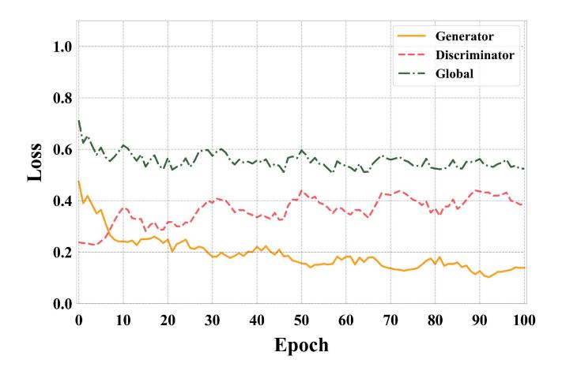

**FIGURE 7. The convergence process of generative adversarial learning loss.**

epochs for all subsequent simulations remain unchanged due to the possibility of convergence as early as the 50*th* epoch which is attributed to the adoption of the early stopping trick in deep learning.

Fig. 7 shows our GAN training process. It can be found that the training of our model approaches the converging state around the 5*th* epoch. Subsequently, the model's loss undergoes minor fluctuations which can be ascribed to the previously mentioned cosine annealing learning rate decay trick and warm restart trick. The former trick utilizes a higher learning rate in the beginning to explore the solution space and gradually reduces the learning rate to refine the solution space, while the latter periodically oscillates the learning rate, both of which enable the model to reach its optimal solution.

Fig. [8](#page-7-0) provides the loss of the generator, which is initialized with GAN parameters and further refined using supervised learning. Similar to Fig. 7, the fluctuations of the loss are due to the adopted cosine annealing and warm restart tricks during

<span id="page-7-0"></span>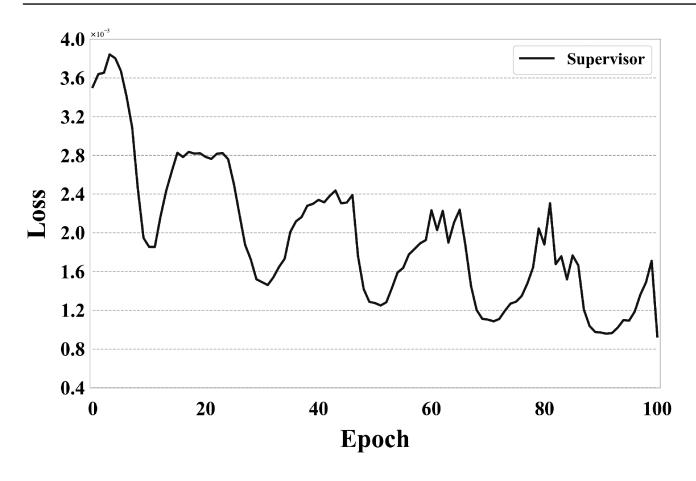

FIGURE 8. The convergence process of supervised learning loss.

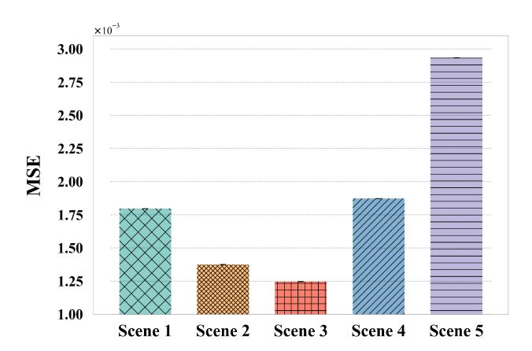

FIGURE 9. MSE in five different scenes.

training. After the  $50^{th}$  epoch, the changes in loss become insignificant, meaning that the model has entered the fine-tuning phase. At the  $80^{th}$  epoch, the model's loss curve approaches an optimal value, indicating that the model parameters have been adjusted to the optimal state.

Fig. 9 illustrates the simulation results. It is evident that the MSE values for all five scenarios are below  $3e^{-4}$ . It is obvious that the prediction accuracy is highest for the mmWave channels on rainy days with moderate traffic. Conversely, the maximum prediction error occurs on clear days, Sub-6, with moderate traffic, reaching  $2.93e^{-3}$ . The substantial MSE values on snowy days may be attributed to the formed large solid snow blockages and leading to imprecise predictions. The highest MSE values of Sub-6 could be attributed to its broader coverage, which requires more information to train the model

## **B. MODEL GENERALIZATION**

To further investigate the effects of different scenes on training performance, we cluster the data according to the five scenarios and train the model separately. Then, we assess the models' MSE in the scenarios which are shown in Fig. 10. The vertical axis of the matrix denotes the dataset used for model training, while the horizontal axis represents that used

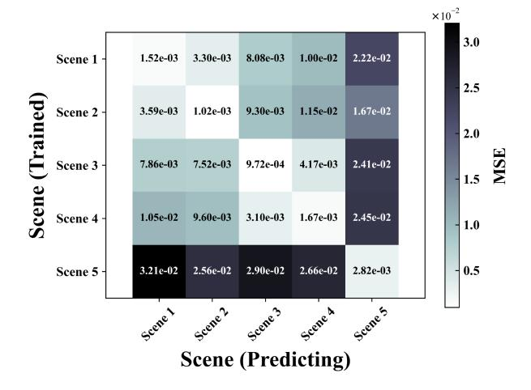

FIGURE 10. Generalization performance of the model across different scenarios.

for model predictions. The values in the matrix denote the corresponding MSE performance. It is evident that the MSE values along the diagonal of the matrix are minimal for the reason that the training dataset and prediction dataset are from the same scenes.

Furthermore, we can find that models trained on the datasets of Scene 1  $\langle Sunny, mmWave, Medium \rangle$  and Scene 2  $\langle Sunny, mmWave, High \rangle$  have relatively stable performance in both scenarios, which could be attributed to the similarity between the two scenarios except for traffic volume. The shared features extracted by the model contribute to its robust generalization across these two scenarios. Subsequently, models trained with the datasets Scene 3  $\langle Rainy, mmWave, Medium \rangle$  and Scene 4  $\langle Snowy, mmWave, Medium \rangle$  also show commendable generalization across each other. Despite the different weather conditions, both scenes involve similar obstructions in the line of sight, which increases the model's robust generalization. Furthermore, Scene 5  $\langle Sunny, Sub-6, Medium \rangle$  has severe effects on the accuracy rate of the models due to the utilized Sub-6 frequency bands.

## C. ALGORITHMIC ANALYSIS

Our model construction involves two steps. The first step employs a GAN for adversarial training on the dataset. This process ensures a continual adversarial balance between the generator and discriminator, ultimately yielding a well-balanced generator with initialized weights. The second step is to fine-tune the generator trained by GAN through supervised learning. The path loss from the dataset serves as labels, and the model is fine-tuned with input data. Simulation 3 compares the performance of our proposed models using only supervised learning and using the combination of GAN and supervised learning. For fairness, the training parameters for the third simulation remain consistent with those of the first simulation, as provided in Tables 3 and 4. The supervised learning process iterates using the generator as the model. The

<span id="page-8-0"></span>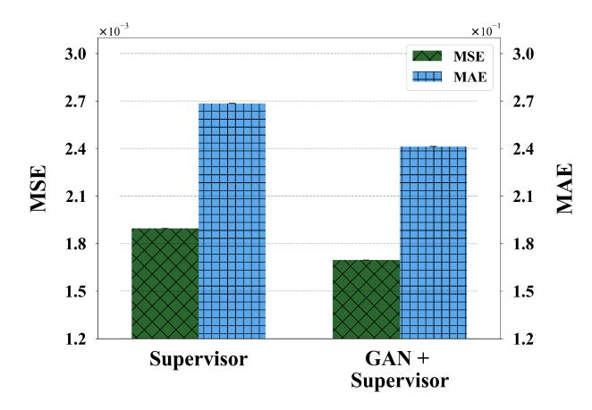

**FIGURE 11. Comparison of model performance with different training algorithms.**

dataset includes all data from the five scenarios, with 80% for training and 20% for testing.

Fig. 11 shows the results of Simulation 3, where both MSE and MAE metrics are evaluated. It is evident that the GAN + supervised learning approach marginally improves performance compared to using only supervised learning. The MSE and MAE values of the model trained with GAN + supervised learning reach 1.69*e*−<sup>3</sup> and 0.24, respectively, while those with only supervised learning are 1.89*e*−<sup>3</sup> and 0.26, respectively, which demonstrates the significant effects of the GAN initialization on model performance. In the deep learning field, many approaches in meta-learning focus on finding the optimal initialization parameters for models [\[44\].](#page-9-0) The role of GAN here is to utilize adversarial learning to realize the appropriate parameter initialization for the model.

# *D. PERFORMANCE ANALYSIS OF MODEL STRUCTURE*

In addition to the aforementioned simulations exploring the performance of our model and algorithm on the dataset, Simulation 4 primarily involves comparing the performance of our proposed model architecture with other commonly used models. Specifically, our model heavily employs pre-training, fine-tuning techniques, multi-head self-attention mechanisms, and GAN + Supervised learning for model parameter initialization and training. In contrast, we consider two alternative structures for comparison: a combination of CNN + MLP (Structure 1) and a pre-trained, fine-tuned visual network + MLP (Structure 2). The combination of CNN + MLP involves a simple CNN visual network paired with a three-layer MLP serving as the feature blending decision layer for output results. This model does not utilize pre-training techniques, indicating that it undergoes training from scratch on the dataset. On the other hand, the combination of a pre-trained, fine-tuned visual network + MLP uses the same image feature extractors as in our model (ViT, FasterNetT1, and Faster-NetT2). The parameters of these extractors are frozen, and the feature blending decision layer employs only a three-layer MLP, omitting the multi-head self-attention structure present in our model.

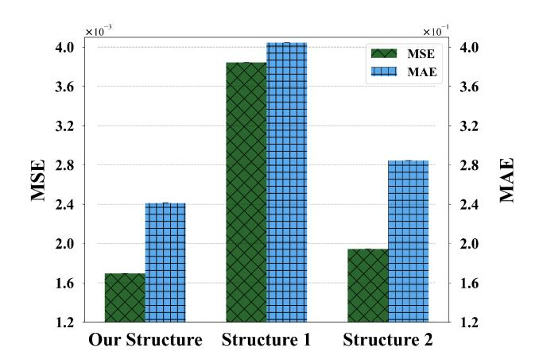

**FIGURE 12. Comparison of performance of different models.**

The results of Simulation 4 are shown in Fig. 12. Our model surpasses the conventional combination of CNN + MLP in terms of MSE and MAE values. Specifically, the two metrics of our model are 1.69*e*−<sup>3</sup> and 0.24, respectively, while those of the latter are 3.85*e*−<sup>3</sup> and 0.40, respectively, which can be ascribed to the robust feature extraction capabilities inherent in pre-trained models. By immobilizing the parameters of the feature extraction layer and exclusively training the final decision layer based on the specific downstream application, remarkable performance can be achieved. Moreover, The model solely utilizing MLP yields MSE and MAE values of 1.95*e*−<sup>3</sup> and 0.28, which is worse than our approach, meaning that the proposed multi-head self-attention structure can improve the accuracy rate. Specifically, the multi-head selfattention structure is effective in amalgamating and assigning attention weights to data with disparate features, ultimately extracting the most pertinent dimensions of the data and optimizing the utilization of its features.

# **V. CONCLUSION**

In this paper, we introduce a path loss prediction model based on ISAC and AI techniques for V2X communications. This framework predicts the probability distribution of path loss with the multi-modal data (RGB images, depth images, Li-DAR data). We evaluate our proposed algorithm using the dataset provided by [\[30\],](#page-9-0) [\[31\]](#page-9-0) work and compare it with two other path loss prediction algorithms. The results indicate that the model significantly improves the accuracy of path loss prediction. In the future, our objective is to enhance the model's processing of LiDAR data and contemplate its expansion into a 3D framework.

# **REFERENCES**

- [1] Y. Zhu, B. Mao, Y. Kawamoto, and N. Kato, "Intelligent reflecting surface-aided vehicular networks toward 6G: Vision, proposal, and future directions," *IEEE Veh. Technol. Mag.*, vol. 16, no. 4, pp. 48–56, Dec. 2021.
- [2] S. Sung, W. Choi, H. Kim, and J.-i. Jung, "Deep learning-based path loss prediction for fifth-generation new radio vehicle communications," *IEEE Access*, vol. 11, pp. 75295–75310, 2023.

- <span id="page-9-0"></span>[3] J. Qiu, B. Mao, and J. Liu, "Joint optimization of energy and delay in task offloading process of electric connected vehicles," in *Proc. -IEEE Int. Conf. Commun.*, 2023, pp. 979–984.
- [4] B. Mao, J. Qiu, and N. Kato, "On an intelligent task offloading model to jointly optimize latency and energy for electric connected vehicles," *IEEE Trans. Veh. Technol.*, early access, Nov. 15, 2023, doi: [10.1109/TVT.2023.3333241.](https://dx.doi.org/10.1109/TVT.2023.3333241)
- [5] Y. Zhu, B. Mao, and N. Kato, "Intelligent reflecting surface in 6G vehicular communications: A survey," *IEEE Open J. Veh. Technol.*, vol. 3, pp. 266–277, 2022.
- [6] H. Kim, W. Jin, and H. Lee, "mmWave path loss modeling for urban scenarios based on 3D-convolutional neural networks," in *Proc. Int. Conf. Inf. Netw.*, 2022, pp. 441–445.
- [7] S.-Y. Lien, S.-L. Shieh, Y. Huang, B. Su, Y.-L. Hsu, and H.-Y. Wei, "5G new radio: Waveform, frame structure, multiple access, and initial access," *IEEE Commun. Mag.*, vol. 55, no. 6, pp. 64–71, Jun. 2017.
- [8] Z. Sheng, A. Pressas, V. Ocheri, F. Ali, R. Rudd, and M. Nekovee, "Intelligent 5G vehicular networks: An integration of DSRC and mmWave communications," in *Proc. Int. Conf. Inf. Commun. Technol. Convergence*, 2018, pp. 571–576.
- [9] Y. Zhu, B. Mao, and N. Kato, "IRS-aided high-accuracy positioning for autonomous driving toward 6G: A tutorial," *IEEE Veh. Technol. Mag.*, vol. 19, no. 1, pp. 85–92, Mar. 2024.
- [10] F. D. Rango, F. Veltri, and S. Marano, "Channel modeling approach based on the concept of degradation level discrete-time Markov chain: UWB system case study," *IEEE Trans. Wireless Commun.*, vol. 10, no. 4, pp. 1098–1107, Apr. 2011.
- [11] C. Phillips, D. Sicker, and D. Grunwald, "A survey of wireless path loss prediction and coverage mapping methods," *IEEE Commun. Surv. Tut.*, vol. 15, no. 1, pp. 255–270, First Quarter 2013.
- [12] S. A. Siddiqui, N. Fatima, and A. Ahmad, "Comparative analysis of propagation path loss models in Lte networks," in *Proc. Int. Conf. Power Electron., Control Automat.*, 2019, pp. 1–3.
- [13] K. Kim, J. Kim, and J. Joung, "A survey on system configurations of integrated sensing and communication (ISAC) systems," in *Proc. 13th Int. Conf. Inf. Commun. Technol. Convergence*, 2022, pp. 1176–1178.
- [14] X. Cheng, D. Duan, S. Gao, and L. Yang, "Integrated sensing and communications (ISAC) for vehicular communication networks (VCN)," *IEEE Internet Things J.*, vol. 9, no. 23, pp. 23441–23451, Dec. 2022.
- [15] S. K. Hinga, O. T. Ajayi, and T. Ogunfunmi, "Deep learning-based path loss prediction model for 5G mmWave," in *Proc. IEEE Glob. Humanitarian Technol. Conf.*, 2022, pp. 114–120.
- [16] A. B. Zineb and M. Ayadi, "A multi-wall and multi-frequency indoor path loss prediction model using artificial neural networks," *Arabian J. Sci. Eng.*, vol. 41, no. 3, pp. 987–996, 2016.
- [17] Y. Shen, K. Song, X. Tan, D. Li, W. Lu, and Y. Zhuang, "HuggingGPT: Solving AI tasks with ChatGPT and its friends in huggingface," 2023. [Online]. Available:<https://huggingface.co/papers/2303.17580>
- [18] J. Achiam et al., "GPT-4 Technical Report," 2023, *arXiv:2303.08774*.
- [19] K. He, X. Chen, S. Xie, Y. Li, P. Dollár, and R. Girshick, "Masked autoencoders are scalable vision learners," in *Proc. IEEE/CVF Conf. Comput. Vis. Pattern Recognit.*, 2022, pp. 15979–15988.
- [20] A. Radford et al., "Improving language understanding by generative pre-training," *OpenAI*, San Francisco, USA, 2018. Accessed: Jan. 16, 2024. [Online]. Available: [https://cdn.openai.com/research-covers/](https://cdn.openai.com/research-covers/language-unsupervised/language_understanding_paper.pdf) [language-unsupervised/language\\_understanding\\_paper.pdf](https://cdn.openai.com/research-covers/language-unsupervised/language_understanding_paper.pdf)
- [21] J. Devlin, M.-W. Chang, K. Lee, and K. Toutanova, "BERT: Pre-training of deep bidirectional transformers for language understanding," in *Proc. Conf. North Amer. Chapter Assoc. Comput. Linguistics: Human Lang. Technol.*, vol. 1, J. Burstein, C. Do-ran, and T. Solorio, Eds., Minneapolis, Minnesota, Jun. 2019, pp. 4171–4186.
- [22] A. Blomquist and L. Ladell, "Prediction and calculation of transmission loss in different types of terrain," AGARD Electromagnetic Wave Propagation Involving Irregular Surfaces and Inhomogeneous Media 17, Tech. Rep. N75-22045 13-70, 1975.
- [23] W. Daniel and H. Wong, "Propagation in suburban areas at distances less than ten miles," FCC/OET, Tech. Rep. TM-91, 1991.
- [24] A. Yamamoto, K. Ogawa, T. Horimatsu, A. Kato, and M. Fujise, "Pathloss prediction models for intervehicle communication at 60GHz," *IEEE Trans. Veh. Technol.*, vol. 57, no. 1, pp. 65–78, Jan. 2008.
- [25] A. Al-Hourani and K. Gomez, "Modeling cellular-to-UAV path-loss for suburban environments," *IEEE Wireless Commun. Lett.*, vol. 7, no. 1, pp. 82–85, Feb. 2018.

- [26] M. Hata, "Empirical formula for propagation loss in land mobile radio services," *IEEE Trans. Veh. Technol.*, vol. 29, no. 3, pp. 317–325, Aug. 1980.
- [27] M. Brata and I. Zakia, "Path loss estimation of 5G millimeter wave propagation channel–literature survey," in *Proc. 7th Int. Conf. Wireless Telematics*, 2021, pp. 1–4.
- [28] P. M. Ramya, M. Boban, C. Zhou, and S. Stanczak, "Using learning ´ methods for V2V path loss prediction," in *Proc. IEEE Wireless Commun. Netw. Conf.*, 2019, pp. 1–6.
- [29] H. Cheng, S. Ma, and H. Lee, "CNN-based mmWave path loss modeling for fixed wireless access in suburban scenarios," *IEEE Antennas Wireless Propag. Lett.*, vol. 19, no. 10, pp. 1694–1698, Oct. 2020.
- [30] X. Cheng et al., "M3SC: A generic dataset for mixed multi-modal (MMM) sensing and communication integration," *China Commun.*, vol. 20, no. 11, pp. 13–29, Nov. 2023.
- [31] X. Cheng et al., "Intelligent multi-modal sensing-communication integration: Synesthesia of machines," *IEEE Commun. Surv. Tut.*, vol. 26, no. 1, pp. 258–301, Firstquarter 2024.
- [32] A. Radford et al., "Learning transferable visual models from natural language supervision," in *Proc. Int. Conf. Mach. Learn.*, 2021, pp. 8748–8763.
- [33] I. Goodfellow et al., "Generative adversarial networks," *Commun. ACM*, vol. 63, no. 11, pp. 139–144, 2020.
- [34] A. Dosovitskiy et al., "An image is worth 16x16 words: Transformers for image recognition at scale," presented at the Int. Conf. Learn. Representations, Oct. 2020. Accessed: Apr. 16, 2024. [Online]. Available: [https://openreview.net/forum?id=YicbFdNTTy](https://openreview.net/forum{?}id$=$YicbFdNTTy)
- [35] J. Chen et al., "Run, don't walk: Chasing higher FLOPS for faster neural networks," in *Proc. IEEE/CVF Conf. Comput. Vis. Pattern Recognit.*, 2023, pp. 12021–12031.
- [36] A. Vaswani et al., "Attention is all you need," in *Proc. 31st Int. Conf. Neural Inf. Process. Syst.*, 2017, pp. 6000–6010.
- [37] M. Xu et al., "Dissecting arbitrary-scale super-resolution capability from pre-trained diffusion generative models," 2024, *arXiv:2401. 06386*.
- [38] R. Li et al., "Dissecting arbitrary-scale super-resolution capability from pre-trained diffusion generative models," 2023, *arXiv:2306.00714*.
- [39] S. Yun, D. Han, S. J. Oh, S. Chun, J. Choe, and Y. Yoo, "CutMix: Regularization strategy to train strong classifiers with localizable features," in *Proc. IEEE/CVF Int. Conf. Comput. Vis.*, 2019, pp. 6022–6031.
- [40] A. Krizhevsky, I. Sutskever, and G. E. Hinton, "ImageNet classification with deep convolutional neural networks," *Commun. ACM*, vol. 60, no. 6, pp. 84–90, 2017.
- [41] T. He, Z. Zhang, H. Zhang, Z. Zhang, J. Xie, and M. Li, "Bag of tricks for image classification with convolutional neural networks," in *Proc. IEEE/CVF Conf. Comput. Vis. Pattern Recognit.*, 2019, pp. 558–567.
- [42] A. G. Baydin, B. A. Pearlmutter, and J. M. Siskind, "Tricks from deep learning," 2016, *arXiv:1611.03777*.
- [43] R. Sun, "Optimization for deep learning: Theory and algorithms," 2019, *arXiv:1912.08957*.
- [44] A. Antoniou, H. Edwards, and A. Storkey, "How to train your MAML," presented at the Int. Conf. Learn. Representations, Sep. 2018. Accessed: Apr. 16, 2024. [Online]. Available: [https://openreview.net/forum?id=](https://openreview.net/forum{?}id$=$HJGven05Y7) [HJGven05Y7](https://openreview.net/forum{?}id$=$HJGven05Y7)


**ZIXIANG WEI** is currently working toward the undergraduate degree with the School of Cybersecurity, Northwestern Polytechnical University, Xi'an, China. His research interests include vehicleto-vehicle, space-air-ground integrated networks, edge computing, and artificial general intelligence.


**BOMIN MAO** (Member, IEEE) is currently a Professor with the School of Cybersecurity, Northwestern Polytechnical University, Xi'an, China. His research interests include involving satellite networks, Internet of Things, vehicular networks, and edge computing. He was the recipient several Best Paper awards from international conferences, namely IEEE GLOBECOM'17, GLOBECOM'18, IC-NIDC'18, ICC'23, and WOCC'23, prestigious IEEE COMSOC Asia Pacific Outstanding Paper Award (2020), Niwa Yasujiro Outstanding Paper

Award (2019), and IEEE Computer Society Tokyo/Japan Joint Local Chapters Young Author Award (2020).

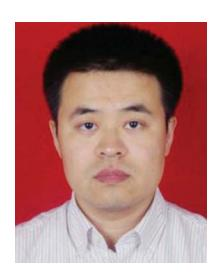

**HONGZHI GUO** (Member, IEEE) received the B.S., M.S., and Ph.D. degrees in computer science and technology from the Harbin Institute of Technology, Harbin, China, in 2004, 2006, and 2011, respectively. He is currently an Associate Professor with the School of Cybersecurity, Northwestern Polytechnical University, Xi'an, China. He was the recipient of WiMob Best Paper Award in 2019, IEEE ICCT Best Paper Award in 2023, and IEEE TVT Top Reviewer Award in 2019. He has authored coauthored more than 40 peer-reviewed

papers in many prestigious IEEE journals and conferences. His research interests include edge computing, SAGSIN, IoT security, AI security, and 5G security. He has been actively joining the society activities, such as, he has been an Associate Editor for IEEE TRANSACTIONS ON VEHICULAR TECHNOLOGY and *Frontiers in Communications and Network* since January 2021, and the Editor for *International Journal of Multimedia Intelligence and Security* since March 2019.


**JIAJIA LIU** (Senior Member, IEEE) was a Full Professor (Vice Dean) with the School of Cybersecurity, Northwestern Polytechnical University, Xi'an, China. He has authored or coauthored more than 220 peer-reviewed papers in many high quality publications, including prestigious IEEE journals and conferences. His research interests include intelligent and connected vehicles, mobile/edge/cloud computing and storage, IoT security, wireless and mobile ad hoc networks, and SAGIN. He was the recipient of the IEEE ComSoc

Best YP in Academia Award in 2020, IEEE VTS Early Career Award in 2019, IEEE ComSoc Asia-Pacific Outstanding Young Researcher Award in 2017, and IEEE ComSoc Asia-Pacific Outstanding Paper Award in 2019. He has been actively joining the society activities, including as an Associate Editor for IEEE TRANSACTIONS ON WIRELESS COMMUNICATIONS since 2018, IEEE TRANSACTIONS ON COMPUTERS from 2015 to 2017, and IEEE TRANSACTIONS ON VEHICULAR TECHNOLOGY from 2016 to 2020, and the Editor for IEEE NETWORK since 2015, and IEEE TRANSACTIONS ON COGNITIVE COMMUNI-CATIONS AND NETWORKING in 2019. He is the Chair of IEEE IoT, Ad Hoc and Sensor Networks Technical Committee and a Distinguished Lecturer of the IEEE Communications Society and Vehicular Technology Society.


**NEI KATO** (Fellow, IEEE) is currently a Full Professor and the Dean with Graduate School of Information Sciences, Tohoku University, Sendai, Japan. His research interests include computer networking, wireless mobile communications, satellite communications, ad hoc & sensor & mesh networks, UAV networks, smart grid, AI, IoT, Big Data, and pattern recognition. He is the Editor-in-Chief of IEEE INTERNET OF THINGS JOURNAL. He has authored or coauthored more than 500 papers in prestigious peer-reviewed journals and confer-

ences. From 2018 to 2021, he was the Vice-President (Member & Global Activities) of IEEE Communications Society, and the Editor-in-Chief of IEEE TRANSACTIONS ON VEHICULAR TECHNOLOGY from 2017 to 2021. He is the Fellow of The Engineering Academy of Japan and a Fellow of IEICE.


**YIJIE XUN** (Member, IEEE) received the B.S. degree in software engineering from Shanxi University, Taiyuan, China, in 2016, and the Ph.D. degree in cybersecurity from Xidian University, Xi'an, China, in 2021. He is currently an Associate Professor with the School of Cybersecurity, Northwestern Polytechnical University, Xi'an. His research interests include vehicular network security and machine learning.