Received 5 August 2025; revised 7 September 2025; accepted 7 September 2025. Date of publication 18 September 2025; date of current version 30 October 2025.

Digital Object Identifier 10.1109/JSTEAP.2025.3610564

# Integrated Sensing and Communication (ISAC) Transceiver: Hardware Architectures, Enabling Technologies, and Emerging Trends

KE WU (FELLOW, IEEE), YASSER BIGDELI (GRADUATE STUDENT MEMBER, IEEE), SEYED ALI KEIVAAN (MEMBER, IEEE), JIE DENG (MEMBER, IEEE), AND PASCAL BURASA (MEMBER, IEEE)

PolyGrames Research Center, Electrical Engineering Department, Polytechnique Montreal, Montreal, QC H3T 1J4, Canada CORRESPONDING AUTHOR: Ke Wu (e-mail: ke.wu@polymtl.ca).

This work was supported in part by the National Science and Engineering Research Council (NSERC) of Canada and Fonds de Recherches du Quebec-Nature et Technologies (FRQNT).

(Invited Article)

ABSTRACT Integrated sensing and communication (ISAC)—also known as radar-communication (RadCom), joint radar-communication (JRC), and other related variants—has rapidly emerged as a transformative paradigm for future wireless systems. By unifying sensing and communication functions within a shared transceiver framework, ISAC addresses the growing demands for spectral efficiency, multifunctional interplay, situational awareness, and hardware reuse. This convergence is poised to enable emerging and future wireless intelligence-driven applications ranging from intelligent transportation and autonomous factories to beyond-5G and 6G smart self-adaptive networks. This article presents a comprehensive, hardware-centric review of ISAC transceiver technologies. We trace the historical evolution of ISAC systems, survey current transceiver architectures, and analyze key enabling components across diverse frequency bands and application scenarios. Specific focus is given to transceiver design strategies, radio frequency (RF) front-end architectures, antenna arrays, and integration techniques. Emerging technologies—such as multifunctional arrays, photonic integration, and reconfigurable intelligent surfaces—are also examined for their role in enhancing ISAC performance and scalability. By synthesizing the current state-of-the-art and highlighting open challenges, this review aims to serve as a valuable reference for researchers and engineers working toward the development of next-generation ISAC hardware platforms.

**INDEX TERMS** 5G and 6G, antenna sharing, cognitive sensing, hardware codesign, integrated sensing and communication (ISAC), joint radar-communication (JRC), millimeter-wave (mmW), multifunction transceiver, phased-array transceiver, radar and communication (RadCom), reconfigurable hardware, radio frequency (RF) front-end, spectrum sharing, terahertz (THz), virtual receiver matrix (VRM).

#### **INTRODUCTION**

Integrated sensing and communication (ISAC), a rapidly emerging research frontier in the 6G era, represents a paradigm shift in the design and exploitation of future wireless systems by unifying data communication and environmental sensing within a single platform. Among the key innovations distinguishing 6G from 5G, ISAC stands out for truly enabling the development of multifunctional wireless systems, fundamentally departing from

the traditional monofunctional communication model. Historically, radar and communication systems have evolved independently, each with distinct requirements in spectrum usage, signal processing, and hardware architecture.

However, growing demands for more efficient spectrum utilization, reduced hardware complexity, improved energy efficiency, and enhanced system multifunctionality have sparked a strong push to converge these once-separate technologies.

This fusion of sensing and communication opens the door to a new horizon of "wireless intelligence": communications become more context-aware through integrated sensing, while sensing systems benefit from increased adaptability and connectivity through embedded communication links. The synergistic interplay between these functions is rapidly gaining traction across academia and industry alike, with wide-ranging implications for next-generation applications and services [\[1\]](#page-23-0), [\[2\]](#page-23-0), [\[3\]](#page-23-0), [\[4\]](#page-23-0), [\[5\]](#page-23-0), [\[6\]](#page-23-0), [\[7\]](#page-23-0).

On the other hand, the development of ISAC is propelled by several converging trends and technological drivers. First, spectrum scarcity has become a critical constraint for countless next-generation wireless services, particularly as 6G moves toward wider deployment. In fact, the much-anticipated 6G systems are expected to operate across a broad frequency spectrum—from hundreds of megahertz to hundreds of gigahertz—although the allocated bands will generally be fragmented rather than continuous. This challenge is evident in the growing overlap between radar and communication systems operating in congested frequency bands—especially in the millimeter-wave (mmW) and terahertz (THz) ranges [\[8\]](#page-23-0), [\[9\]](#page-23-0). Second, the explosive growth of connected devices and intelligent systems demands hardware platforms that can deliver both high-speed connectivity and real-time situational awareness. This is particularly vital in dynamic and fastmoving environments—such as vehicular networks, dronebased systems, and industrial automation—where rapid adaptation and wireless reconfigurability are essential for reliable performance. Dual sensing-communication capabilities are thus foundational to enabling ambient intelligence in applications such as autonomous transportation, smart manufacturing, and infrastructure monitoring [\[10\]](#page-23-0), [\[11\].](#page-23-0) Third, recent advancements in integrated circuit (IC) technologies, antenna design, radio frequency (RF) front-end architectures, and system-level integration have made multifunctional hardware platforms and hardware-software codesign approaches increasingly viable [\[12\]](#page-23-0), [\[13\]](#page-23-0). While the long-standing vision of the Internet of Things (IoT)—dating back to the 1990s—has pushed for the interplay between communication and sensing, it has not necessarily required their full integration.

As illustrated conceptually in Fig. 1, today's evolution toward multifunctionality extends beyond ISAC, with ongoing efforts aimed at the holistic integration of the three fundamental wireless functions: data communication, parametric sensing, and power transfer [\[14\]](#page-23-0), [\[15\]](#page-23-0), [\[16\]](#page-23-0), [\[17\].](#page-23-0) Nevertheless, the scope of this article is limited to the dual integration of sensing and communication, which remains the cornerstone of current ISAC research and development.

The academic community has responded enthusiastically to the multifaceted trends described above, producing a rapidly growing body of research on joint radar-communication (JRC) systems—an area that has since evolved into the broader and more integrated framework of ISAC. Early work in JRC focused primarily on spectrum sharing strategies and waveform codesign to mitigate mutual interference and resolve incompatibilities between radar and communication operations [\[18\],](#page-23-0) [\[19\]](#page-23-0),

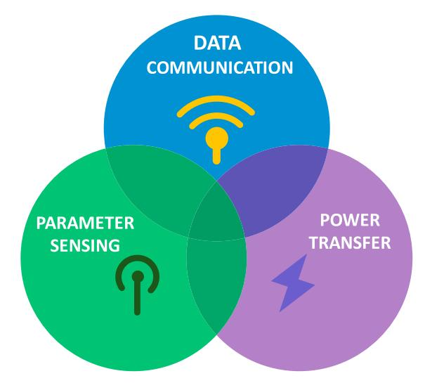

FIG. 1. Fusion and convergence of fundamental wireless functions for future intelligence.

[\[20\],](#page-23-0) [\[21\]](#page-23-0), [\[22\]](#page-23-0), [\[23\].](#page-23-0) Indeed, both radar and communication systems demand extensive waveform engineering—from analog design to digital signal processing (DSP)—even though their modes of operation differ significantly. More recently, research has shifted toward hardware- and system-centric approaches that emphasize shared transceiver architectures and common building blocks, enabling deeper integration and more efficient use of spectral, energy, and hardware resources [\[24\],](#page-23-0) [\[25\]](#page-23-0), [\[26\]](#page-23-0), [\[27\],](#page-23-0) [\[28\],](#page-23-0) [\[29\]](#page-23-0), [\[30\]](#page-23-0), [\[31\]](#page-23-0), [\[32\]](#page-23-0), [\[33\],](#page-23-0) [\[34\].](#page-24-0) This shift is particularly important for reducing system costs, minimizing energy consumption, and shrinking hardware footprint.

Despite these advancements, a significant portion of ISAC research remains concentrated on system modeling and signal processing from a theoretical perspective, often overlooking the underlying transceiver technologies and integration challenges. However, these hardware aspects are critical to the practical realization and large-scale deployment of ISAC systems.

At the same time, industry interest in ISAC has intensified, as demonstrated by emerging standardization efforts and the development of commercial prototypes that mark the transition from theoretical exploration to real-world implementation [\[35\]](#page-24-0), [\[36\]](#page-24-0). As illustrated in Fig. [2,](#page-2-0) ISAC is expected to enable a wide range of transformative applications—particularly within the context of emerging 6G networks. These applications highlight the potential of ISAC to support IoT-driven hyperconnectivity and usher in a new era of intelligent wireless systems powered by seamless sensing-communication integration.

This article provides a comprehensive review of ISAC transceiver technologies, with a primary emphasis on hardware architectures and physical-layer integration. Unlike previous surveys that largely focus on theoretical developments—such as signal processing techniques and algorithmic frameworks—this work centers on the practical aspects of transceiver design and implementation. Key components examined include RF front-ends, antenna arrays, baseband processing units, and dynamic reconfigurability mechanisms. The review spans a broad frequency

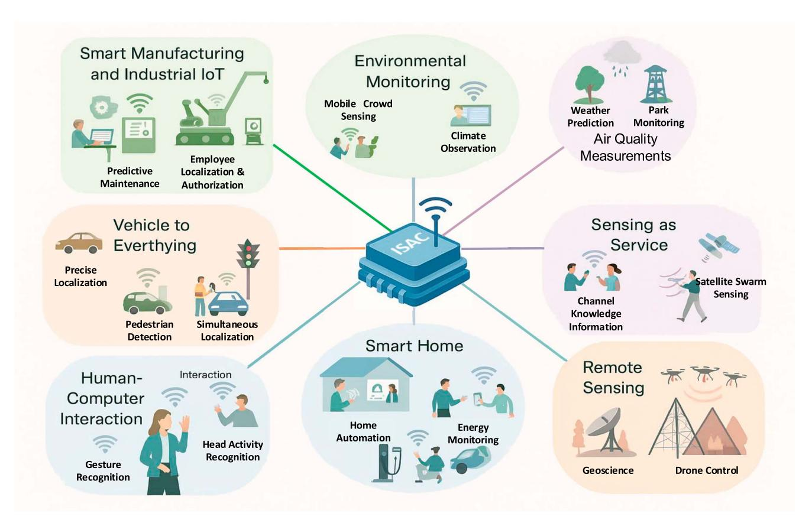

FIG. 2. Conceptual illustration of the ISAC paradigm and applications.

spectrum, from sub-6 GHz to mmW and THz bands, and covers a diverse range of emerging applications, including automotive radar, autonomous aerial vehicles (AAVs), indoor localization, and next-generation 6G wireless systems.

To illustrate recent advances in ISAC research and development, several key contributions from the authors are highlighted for their potential to significantly impact and accelerate the evolution of ISAC hardware. For example, [28] presents a compact waveguide-based receiver array that enables joint communication, sensing, and wireless power transfer (WPT), while incorporating polarization diversity and integrated rectifiers within a unified structure. In [32], a multifunctional transceiver is introduced that seamlessly switches between radar sensing and data transmission modes without requiring separate RF front-end chains. Furthermore, innovative hardware architectures—such as the virtual receiver matrix (VRM) and virtual transceiver matrix (VTM)—have been proposed to demonstrate hardware reuse, enhance system scalability, improve energy efficiency, and unify transceiver functionalities across diverse operational modes [26], [33].

The structure of this article follows a logical progression that reflects the evolution and current landscape of ISAC hardware research and development. "Historical Evolution of ISAC" section provides a historical overview of radar and communication systems, setting the stage for the emergence of ISAC. "Fundamentals and Definitions" section defines ISAC and introduces key performance metrics relevant to its

evaluation. "Classification of ISAC Hardware" section presents a classification of ISAC hardware based on integration levels, RF design strategies, and application domains. "Evolution of ISAC Hardware Architectures" section reviews state-of-the-art ISAC transceiver architectures, while "Key Technologies" section explores the key enabling technologies that support their implementation. "Software and Signal Processing Touchpoints" section briefly addresses signal processing and software-related considerations in connection with front-end developments. "Applications and Demonstrators" section highlights representative application-specific demonstrators. "Challenges and Future Research Directions" section discusses current challenges and outlines future research directions. Finally, "Conclusions and Reflections" section concludes the article with reflections on the trajectory and long-term potential of ISAC technologies.

# HISTORICAL EVOLUTION OF ISAC

While the rise of 6G has sparked a surge in ISAC-oriented research and global project initiatives, the origins of ISAC can be traced back to earlier developments in hardware and system-level applications—well before 6G became a formal research theme around 2016. In fact, the foundation of ISAC lies in the parallel yet historically separate evolution of radar and wireless communication technologies. Throughout much of the 20th century, these two domains progressed independently, shaped by distinct operational goals and technological constraints. Radar systems were primarily developed for

military and defense applications, emphasizing target detection and tracking through high-power, directional transmissions. In contrast, communication systems focused on reliable data exchange across diverse and often unpredictable channels, driven by both civilian and industrial needs.

For decades, radar front-ends and communication transceivers remained physically and functionally separate, despite occasional exploration of joint operations—typically through baseband signal fusion or parallel channels within the same system. It was not until the 2010s that efforts toward hardware-level integration began to gain traction. The long-standing divergence between the two domains was well recognized in early foundational studies, such as a 1948 report by the Marconi Company, which examined the capabilities and limitations of integrated radio and radar equipment within their respective domains [37].

In the decades following World War II, radar and communication systems advanced rapidly, but largely along separate technological paths [38]. As mentioned earlier, radar development was driven primarily by defense and military needs, progressing toward higher operating frequencies, enhanced range resolution, and the adoption of phased-array architectures. In parallel, wireless communication systems evolved with a focus on improving spectral efficiency, adopting cellular network architectures, and increasingly sophisticated modulation and coding schemes. Other wireless systems, such as short-range Wi-Fi communications and the global positioning system (GPS), have also become ubiquitous and continue to flourish.

By the 1970s, growing operational overlap in frequency usage raised serious concerns about electromagnetic spectrum management, as both radar and communication systems began to compete for access to shared spectral resources [39]. One of the earliest examples of joint radar-radio functionality is the identification friend or foe (IFF) system [40]—a battlefield technology designed to distinguish friendly units from adversaries. Originally developed during World War II to reduce the risk of friendly fire in radar-equipped environments, the IFF concept marked a practical intersection of radar sensing and radio signaling, which was generally based on a radar-centric architecture, typically through low-rated data coded in the radar waveform. Since then, IFF systems have undergone substantial evolution and are now critical to both military operations and civilian air traffic control.

Despite such early examples, the continued development of radar and communication technologies faced increasing challenges due to overlapping spectrum allocations and competing operational requirements. A 1978 review of radar and communication subsystems [39] emphasized the growing difficulties of spectrum coexistence, foreshadowing the eventual need for more integrated and cooperative solutions—an idea that would later mature into the modern ISAC paradigm.

A pivotal shift occurred during the 1990s and early 2000s as concerns over spectrum congestion escalated. The rapid expansion of commercial wireless services into higher frequency bands intensified competition for increasingly scarce spectral resources, prompting regulatory bodies and researchers to confront the mounting conflicts between radar and communication

systems. This era marked the advent of formal investigations into spectrum-sharing frameworks, laying the foundational concepts of coexistence and coordination between these traditionally separate domains.

The formal convergence of radar and communication technologies began with the emergence of JRC systems. Early research in this field concentrated on spectral coexistence, investigating waveform codesign and cognitive radio techniques to enable efficient spectrum sharing. These approaches aimed to mitigate mutual interference while preserving the essential performance requirements of both radar and communication functions [41], [42], [43]. Foundational studies during this period introduced the concept of shared waveforms—most notably orthogonal frequency-division multiplexing (OFDM) to support simultaneous sensing and data transmission. These advances not only established the functional feasibility of joint operation but also paved the way for deeper integration at the hardware level. Notably, the authors' early work in the late 2000s and early 2010s demonstrated a pioneering vehicular application of complete time-division multiplexing (TDM) transceiver hardware operating at 5.9 and 24 GHz [18], [19]. This work laid the groundwork for subsequent integrated ISAC transceiver systems and applications featuring software-defined reconfigurability tailored for multitarget scenarios.

Over the past decade, research on JRC has evolved into the broader and more ambitious paradigm of ISAC, reflecting growing interest across the communications community. Whereas earlier efforts primarily focused on spectral coexistence—such as the U.S. DARPA spectrum-sharing initiative [44]—ISAC emphasizes deep integration through shared hardware and optimized resource utilization. This transition has been driven by significant advances in IC fabrication, antenna design, and reconfigurable RF front-end technologies, making multifunctional hardware increasingly feasible. Illustrative examples include transceivers with dynamic mode switching, VRM architectures, and integrated dual-polarization antenna arrays—each exemplifying the move toward tighter coupling and synergy between sensing and communication at the physical layer [26], [28], [32].

Several key milestones have shaped the evolution of ISAC hardware, marking the shift from theoretical coexistence concepts to practical, fully integrated implementations. Recent notable achievements include the demonstration of mmW multifunction transceivers featuring shared antenna and RF frontend architectures [30]; the development of integrated waveguide receiver arrays that support both joint WPT and communication functionalities [28]; and the realization of concurrent beamforming arrays capable of simultaneous radar sensing and data transmission via independently steerable beams. Fig. 3 presents an approximate timeline that highlights the evolution of ISAC technologies, from early coexistence frameworks to cutting-edge integrated transceiver prototypes.

Recent demonstrations of integrated receiver systems operating in the THz band [34], dual-polarized waveguide receiver arrays [28], and CMOS-based multifunction chips for joint sensing and communication [25] underscore the advancing

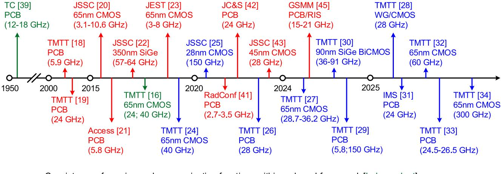

—— Coexistence of sensing and communication functions within a shared framework [Independent]

Convergence of sensing and communication functions into a unified framework [Spectrum sharing, Waveform co-design, and Cognitive radio approaches]

Hardware integration and resource sharing [ISAC concept---Components reusability]

FIG. 3. Timeline of ISAC hardware evolution.

maturity of ISAC hardware. These achievements come despite significant challenges related to hardware compatibility, particularly in front-end design and baseband signal processing. Collectively, they reflect a clear transition from earlier coexistence strategies centered mainly on signal processing toward deeper physical-layer integration, where shared hardware components are engineered to simultaneously support both communication and sensing functionalities.

Now, we can see that the historical evolution of ISAC can be characterized by three key phases. The first phase saw the independent development of radar and communication systems, each shaped by distinct technological goals and application requirements. This was followed by a transitional period focused on achieving spectral coexistence through JRC frameworks, emphasizing waveform design and efficient spectrum sharing. The current phase marks a decisive shift toward deep hardware integration, characterized by shared transceiver components, innovative waveform engineering, and advanced multifunctional architectures that define the ISAC paradigm. This progression has been driven by breakthroughs in enabling technologies, evolving regulatory policies, and increasing application demands across military, automotive, industrial, and emerging 6G wireless sectors.

# **FUNDAMENTALS AND DEFINITIONS**

ISAC is formally defined as a system architecture that employs a shared hardware platform and unified signal processing chain to simultaneously perform environmental parametric sensing and wireless data communication. This distinguishes ISAC from earlier approaches such as JRC, which primarily focused on waveform coexistence or dynamic spectrum access rather than true hardware-level integration. While this definition may be subject to debate—given that some JRC implementations involve partial or even full hardware integration—ISAC

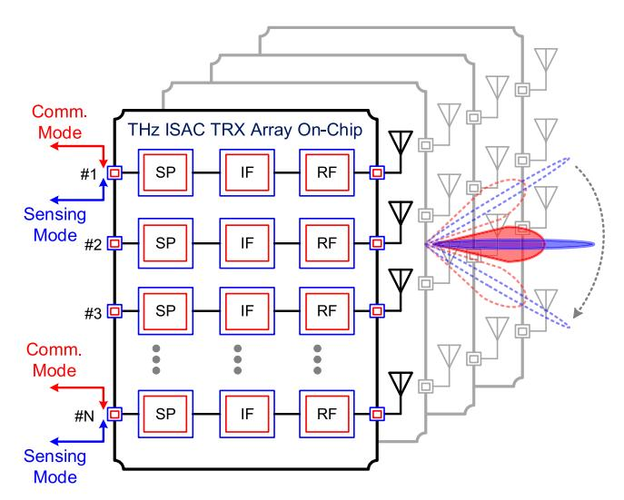

FIG. 4. Illustration of ISAC concept, which envisions future integration at the physical layer to enable both environmental sensing and wireless data communication. The integration spans antenna arrays, RF front-ends, IF, and the signal processing (SP) chain, resulting in a fully shared transceiver platform that maximizes component reusability and supports simultaneous operation.

emphasizes extensive resource reuse across hardware, spectral, and computational domains. This approach enables multifunctionality while minimizing redundancy in physical components.

A fundamental conceptual distinction between ISAC and earlier approaches such as JRC and radar-communication (RadCom) lies in the depth of integration and cooptimization. While JRC and RadCom systems often enable spectrum sharing or employ cognitive interference mitigation techniques, they typically rely on separate transceiver chains or only partially shared components. In contrast, as illustrated in Fig. 4, true ISAC systems are designed around a unified architecture that cooptimizes transceiver design, RF front-ends, antenna

arrays, and baseband processing to simultaneously support both sensing and communication functions. This deeper integration—demonstrated in [18] and [19]—yields greater hardware efficiency, reduced cost, enhanced functional synergy, and improved overall system performance. This shift in design philosophy has been a key driver behind recent research transitioning from spectrum-sharing paradigms toward fully shared hardware implementations. Nonetheless, spectrum-sharing considerations remain integral to ISAC platforms, as they underpin high spectral efficiency, dual-technology coexistence, and effective frequency reuse.

Evaluating the performance of ISAC systems requires metrics that capture the inherent trade-offs between sensing and communication functions. From the sensing perspective, key performance indicators include range accuracy, velocity accuracy, detection probability, angular resolution, and others—parameters primarily determined by waveform bandwidth, antenna aperture, and signal-to-noise ratio (SNR). On the communication side, performance is commonly assessed through data throughput, system latency, error vector magnitude (EVM), bit error rate (BER), and spectral efficiency. The integration of these functions on a shared hardware platform calls for joint performance metrics that effectively balance sensing accuracy with communication efficiency, while also considering physical and computational resource limitations.

Designing ISAC transceivers that optimize performance for both sensing and communication operations is highly challenging—often approaching impossibility—due to inherently conflicting requirements. Numerous architectural and electrical parameter choices involve trade-offs that must be carefully balanced during development. Hardware-specific considerations add further complexity to the optimization landscape. For example, the RF and signal processing demands for the two functions often differ significantly: baseband processing for high-speed data communication typically operates in the MHz-to-GHz range, whereas Doppler radar may require much narrower bandwidths, often in the Hz-to-kHz range, with fundamentally different processing techniques.

Additionally, certain hardware components face conflicting design constraints. The linearity of power amplifiers (PAs) impacts both the dynamic range necessary for precise radar detection and the signal integrity critical to high-quality communications. Similarly, antenna sidelobe levels are crucial for radar clutter suppression but may conflict with the requirements for minimizing communication interference. In ISAC architectures where components such as antennas, PAs, lownoise amplifiers (LNAs), and mixers are shared between sensing and communication, these elements must meet potentially incompatible performance demands from both domains. Table I summarizes key hardware parameters and their dual-domain implications.

Addressing these challenges calls for advanced multiobjective optimization frameworks capable of balancing such trade-offs—particularly in high-frequency regimes such as mmW and THz bands, where hardware limitations are even more pronounced.

TABLE I. Key hardware parameters and their dual-domain implications

| Parameter           | Communication Mode           | Sensing Mode                          |  |  |  |
|---------------------|------------------------------|---------------------------------------|--|--|--|
| Bandwidth           | Moderate                     | High                                  |  |  |  |
| Linearity           | Moderate to High             | High (to avoid LNA and PA saturation) |  |  |  |
| Gain                | High (to overcome path loss) | High (for range detection)            |  |  |  |
| Noise Figure        | Low (sensitivity)            | Moderate                              |  |  |  |
| Resolution/Accuracy | N/A                          | High (high freq. bands)               |  |  |  |
| Data Rate           | High (M-QAM)                 | N/A (focus on detection)              |  |  |  |
| Dynamic Range       | High                         | Moderate                              |  |  |  |

Another essential aspect of ISAC system design is reconfigurability—the capability to dynamically adapt operational modes based on evolving environmental conditions or specific application needs. This adaptability may include switching between high-resolution and/or high-accuracy sensing and high-throughput communication modes or dynamically reallocating spectral and beamforming resources to optimize performance across both functionalities [45], [46]. Note that resolution and accuracy are generally distinct parameters that characterize sensing performance. Such flexibility can be achieved through various multiplexing strategies, including time, frequency, polarization, and code division, among others.

To enable this level of adaptability, hardware architectures featuring tunable filters, reconfigurable antenna arrays, and software-defined radios (SDRs) have been proposed [47]. These reconfigurable components are critical for supporting real-time mode switching and efficient resource sharing, especially in dynamic or heterogeneous deployment scenarios. Ultimately, reconfigurability enhances system agility, resilience, and performance, making it a cornerstone of advanced ISAC design.

Broadly speaking, ISAC embodies the convergence of definitions, performance metrics, and design philosophies from the traditionally distinct domains of sensing and communication into a unified framework centered on shared hardware resources [48]. By integrating these functionalities, ISAC seeks to achieve enhanced efficiency, minimized hardware redundancy, improved energy utilization, and greater system versatility. The ultimate objective is to enable a new level of intelligence in jointly executing communication and sensing tasks.

The following sections explore how these foundational principles are being realized through diverse hardware architectures and integration strategies, tailored to a wide range of emerging application domains.

#### **CLASSIFICATION OF ISAC HARDWARE**

ISAC hardware development has progressively matured into a versatile and adaptive field, encompassing a broad spectrum of transceiver architectures, design methodologies, and application scenarios. Building on recent advancements, this section categorizes ISAC hardware along three primary axes: the degree of integration between sensing and communication

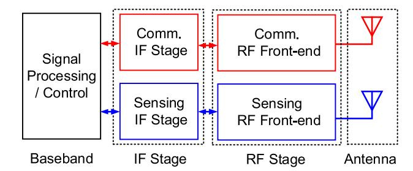

FIG. 5. Integration scenarios in ISAC front-end.

subsystems, the underlying operational principles, and the nature of the transceiver core.

# Classification by the Degree of Integration

ISAC hardware can be categorized according to the extent to which sensing and communication functions share physical components. A representative block diagram of a dual-functional transceiver front-end is shown in Fig. 5. At one end of the integration spectrum lie colocated but separate systems, where sensing and communication functionalities operate concurrently from the same physical platform but rely on entirely distinct hardware chains. This approach is common in automotive applications, where radar and communication modules are housed within the same enclosure but utilize separate antennas, RF front-ends, and signal paths. In some cases, however, their baseband signals may be jointly processed to exploit synergies between concurrent operations.

In partially shared hardware architectures, certain components—such as antennas, RF front-ends, and intermediate frequency (IF) stages—are reused across both sensing and communication modes, while other subsystems remain functionally independent. This design strategy reduces processing redundancy and offers a practical tradeoff between integration and architectural flexibility, allowing for targeted performance tuning of each function. However, the added complexity in hardware coordination and increased system footprint can present challenges in compact or cost-sensitive applications.

The third category encompasses fully shared hardware architectures, where the same antenna, RF front-end, and IF stages are jointly used for both sensing and communication operations. This approach maximizes hardware reuse, offering significant benefits in terms of system compactness, power efficiency, and cost—particularly well suited for large-scale antenna arrays and low-power applications. Among the most promising candidates for achieving such deep integration is the in-band full-duplex (IBFD) transceiver, which inherently aligns with ISAC principles by enabling simultaneous transmission and reception over the same frequency band [18], [21], [124]. IBFD-based ISAC architectures offer potential advantages in capacity, latency, and spectral efficiency. Nevertheless, full hardware integration also imposes stringent demands on selfinterference cancellation (SIC), component linearity, dynamic range, antenna isolation, and frequency planning. As a result, careful design trade-offs are essential to ensure robust performance across both functional domains.

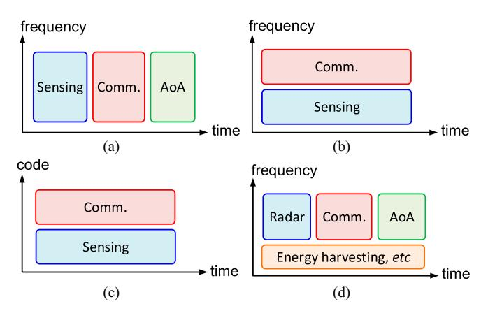

FIG. 6. Illustration of the principles of operation: (a) TDM, (b) frequency division multiplexing (FDM), (c) code division multiplexing (CDM), and (d) hybrid system with operation versatility.

The optimal level of integration in ISAC hardware is largely determined by application-specific requirements and resource constraints. Generally, higher levels of integration offer better hardware efficiency and functional synergy but come at the cost of increased design complexity and computational burden. Conversely, lower levels of integration simplify design and allow greater flexibility but result in a larger hardware footprint and reduced coordination between sensing and communication functions. For instance, employing separate IF chains for data communication and FMCW sensing generally allows independent optimization of key components such as synthesizers and analog-to-digital converters (ADCs), each tailored to the distinct bandwidth, dynamic range, and sampling requirements of their respective domains.

## Classification Based on Principle of Operation

ISAC systems can also be classified based on how shared operational resources are functionally allocated between sensing and communication tasks. Fig. 6 illustrates the most widely adopted strategies for achieving such functional integration [15]. A foundational overview of RadCom and JRC approaches was previously provided by the lead author and his collaborator in [48], which is likely the first review of JRC and ISAC research and developments in the open literature. That work focused on the early developed transceiver architectures for JRC and ISAC, with particular attention to three key multiplexing strategies: TDM, frequency-division multiplexing (FDM), and codedivision multiplexing (CDM). Their respective technical merits and limitations were thoroughly analyzed and compared. The review also highlighted representative hardware implementations, emphasizing joint functionality and associated design trade-offs. As these foundational aspects have been extensively covered in [48], they will not be revisited here; interested readers are encouraged to consult this reference for further technical details.

TDM facilitates hardware sharing by allocating distinct time slots for sensing and communication operations in a half-duplex manner [Fig. 6(a)]. For example, a single transceiver may alternate between transmitting radar chirps and communication

signals during successive time intervals. This technique is straightforward and cost-effective, requiring minimal additional circuitry while inherently avoiding in-band interference. However, TDM does not support simultaneous (full-duplex) operation, which may limit system responsiveness in time-sensitive applications. Furthermore, switching delays and restricted time allocation for each function can degrade performance in highly dynamic environments. It is worth noting that explicit switching hardware may not be necessary, as time allocation can be managed via software-defined waveform generation using direct digital synthesizers (DDSs) or other programmable techniques [\[14\],](#page-23-0) [\[15\],](#page-23-0) [\[48\]](#page-24-0), [\[49\],](#page-24-0) [\[50\]](#page-24-0), [\[51\]](#page-24-0), [\[52\].](#page-24-0)

FDM, depicted in Fig. [6](#page-6-0)(b), allows radar and communication functions to operate simultaneously on separate frequency bands using shared front-end hardware. This approach supports real-time dual functionality and improves resource utilization, making it well suited for applications that demand continuous sensing alongside high-data-rate communication. However, FDM increases hardware complexity due to the requirement for broadband or multiband RF components and constrains the level of integration, especially at the IF and baseband stages. Moreover, dividing the available spectrum between the two functions can limit the bandwidth allocated to each, potentially impacting overall system performance.

CDM enables simultaneous transmission of sensing and communication signals over the same time and frequency resources [Fig. [6\(](#page-6-0)c)], distinguishing each signal by a unique orthogonal code [\[25\],](#page-23-0) [\[52\].](#page-24-0) At the receiver, correlation-based techniques separate the overlapping signals, allowing for efficient spectral reuse and true resource overlap. This approach offers high spectral efficiency and strong resilience against narrowband interference, making it particularly suitable for cooperative or densely deployed ISAC scenarios. However, CDM requires highly orthogonal codes and precise synchronization, resulting in significant processing complexity. These demands pose scalability challenges for array-based ISAC systems and limit practical implementation primarily to advanced digital platforms such as SDRs and MIMO architectures. As a result, CDM is currently less mature and less widely adopted in Rad-Com codesign compared to TDM and FDM.

Hybrid ISAC systems, illustrated in Fig. [6\(](#page-6-0)d), are designed to support multiple operational modes and additional functions, such as energy harvesting and angle-of-arrival (AoA) detection, within a single reconfigurable hardware platform [\[90\]](#page-25-0), [\[96\]](#page-25-0). These systems enable adaptive functionality tailored to dynamic scenario requirements. By integrating TDM, FDM, and CDM techniques, hybrid architectures can switch between or simultaneously employ different multiplexing strategies, providing the flexibility to accommodate varying latency, bandwidth, and interference conditions. Energy harvesting can also be incorporated, either during idle periods or within dedicated frequency slots, to power low-energy nodes, enabling simultaneous communication, sensing, and WPT. This capability is especially critical for applications demanding high mobility and energy autonomy.

Key advantages of hybrid ISAC systems include enhanced spectral efficiency, real-time adaptability, multifunctionality, and reduced hardware redundancy. However, these benefits come with considerable challenges, such as increased RF front-end complexity, the requirement for wideband and highly linear components, sophisticated control logic, and heightened processing demands to manage synchronization and mitigate interference across multiple operational modes.

Among the reported approaches, TDM has emerged as the most prevalent, owing to its simplicity and robustness. Power consumption continues to be a critical factor in determining the suitability of different techniques. In this context, FMCW radars, which have been extensively developed and refined, stand out by offering both low-power and high-performance variants over a wide range of operating frequencies, making them the preferred choice for ISAC integration. Nevertheless, at the chip level, the realization of large arrays remains highly constrained—even in single-function systems—due to fabrication complexity and cost. Major challenges include antenna integration, power consumption, thermal management, and processing overhead.

It is worth mentioning that the newly proposed VRM/VTM architecture [\[26\],](#page-23-0) [\[33\]](#page-23-0) naturally embodies the principles of space division multiplexing (SDM) by exploiting spatially distributed transceiver cells to create multiple parallel communication and sensing channels. Each VTM port operates as an independent spatial path, enabling the simultaneous transmission, reception, and demodulation of multiple signals over the same frequency band without requiring additional spectral or temporal resources. This inherent spatial separation provides an SDM-based multiplexing gain, as the overall system capacity and functionality scale with the number of active VTM cells. Furthermore, by supporting multistream data processing, QAM/OFDM demodulation, multitarget AoA estimation, and ISAC within a compact front-end, the VTM scheme offers a hardware-efficient realization of SDM. These properties make it particularly well suited for next-generation mmW and THz architectures, where abundant spatial resources can be leveraged to achieve high capacity, enhanced spectral efficiency, and seamless multifunctionality.

# Classification Based on Transceiver Realization Approaches

The development of ISAC front-ends can be broadly categorized into linear (multiport interferometric) and nonlinear (mixer-based) transceiver architectures, each presenting unique advantages and trade-offs. Conventional heterodyne-based ISAC systems, which fall under the nonlinear category, are well established and offer wide dynamic range, high selectivity, and excellent sensitivity—making them suitable for applications ranging from radar sensing to high-data-rate communications. However, these systems generally incur higher power consumption and increased circuit complexity due to the reliance on highefficiency nonlinear operations. These challenges become particularly acute as emerging ISAC designs adopt largescale antenna arrays to compensate for reduced efficiency and greater propagation losses at mmW and THz frequencies, while also addressing escalating performance requirements.

By contrast, multiport interferometric techniques offer several compelling advantages, including substantially lower local oscillator (LO) power requirements, inherently broadband operation, and simplified passive additive mixing [68]. These features contribute to reduced overall power consumption and system complexity, making them particularly attractive for mmW and THz or broadband applications [28]. Their inherent efficiency positions linear interferometric approaches as ideal candidates for implementing large active arrays within practical power budgets, thereby enabling higher levels of integration in ISAC front-end designs.

Nonetheless, interferometric architectures face significant challenges, chief among them being their limited dynamic range, which constrains operational distance and sensitivity. However, recent advancements have shown promise in overcoming this limitation. For example, dynamic range extension techniques for square-law mixers have been proposed and experimentally validated, narrowing the performance gap with conventional heterodyne systems. One notable method involves introducing a nonlinear driving stage to expand the square-law region of the detector diode, as detailed in [53]. This method yields an improvement of more than 10 dB in the compression point.

Additionally, specialized detectors fabricated from AlGaN and InP TB-RTD materials have been developed for microwave (MW) and THz applications, respectively [54], [55]. Although linear interferometric architectures may necessitate a larger physical footprint, they remain attractive due to their low cost and compatibility with CMOS technology, making them well suited for compact, cost-sensitive ISAC system realizations.

# **EVOLUTION OF ISAC HARDWARE ARCHITECTURES**

This section delves into key milestones in the evolution of ISAC hardware, particularly focusing on RF front-end design, transceiver architectures, baseband signal processing, and adaptive reconfigurability techniques. It presents various hardware implementation approaches for ISAC systems, detailing integration strategies and operational principles as introduced in "Classification of ISAC Hardware" section. The techniques differ fundamentally in their signal processing methodologies. Nonetheless, all are widely employed in ISAC implementations, each presenting unique advantages and trade-offs that shape system architecture and overall performance.

Heterodyne systems inherently introduce nonlinearity by mixing the incoming RF signal with a LO signal, generating both sum and difference frequency components as well as intermodulation components. For example, Fig. 7(a) illustrates the general operating principle of a nonlinear circuit block, using a double-balanced mixer as a representative case. This mixer leverages a quad-diode ring to perform nonlinear frequency translation. The RF signal—after being filtered and amplified by the LNA—is combined with a high-power LO signal at the mixer core. Due to the nonlinear current–voltage

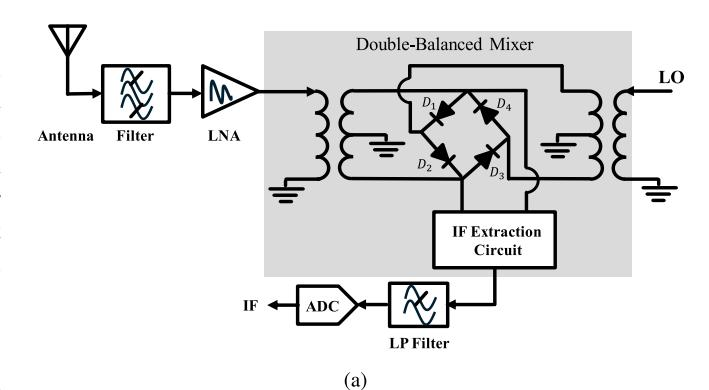

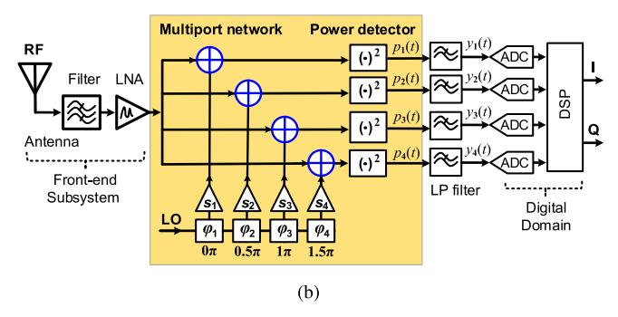

FIG. 7. Simplified block diagram illustrating the operating principles of nonlinear and linear interference: (a) double-balanced mixer, and (b) multiport interferometric receiver.

(I–V) characteristics of the diodes, the instantaneous output current can be expressed as

$$i(t) = i_{12}(t) - i_{34}(t)$$

$$= 4\alpha i_s V_{RF} I_1(\alpha V_{LO}) \cos((\omega_{LO} - \omega_{RF})t)$$

$$+ 4\alpha i_s V_{RF} I_1(\alpha V_{LO}) \cos((\omega_{LO} + \omega_{RF})t)$$

$$+ 4\alpha i_s V_{RF} I_3(\alpha V_{LO}) \cos((3\omega_{LO} + \omega_{RF})t) + \cdots$$
 (1)

This expression highlights that the mixer output contains multiple frequency components at  $mf_{LO}\pm f_{RF}$  ( $m \neq 0$ ), with the dominant IF component typically selected at  $|\omega_{LO}-\omega_{RF}|$ . After the IF extraction circuit, an LP filter removes higher order harmonics and spurious products before the signal is digitized by the ADC for further baseband processing.

In contrast, interferometric transceivers operate based on the principle of linear interference, as illustrated in Fig. 7(b). This architecture typically comprises a passive network incorporating quadrature hybrid couplers, power dividers or phase shifters, and power detectors. Within this setup, modulated RF and LO signals are combined in different (commonly four) output paths under varying relative phase conditions—commonly at  $0\pi$ ,  $0.5\pi$ ,  $1\pi$ , and  $1.5\pi$ . The modulated RF and LO signals under these phase shifts can be mathematically expressed as

$$a_{\rm RF} = |a_{\rm RF}||I(t) + jQ(t)|e^{j\omega_{\rm RF}t}$$
 (2)

and

$$a_{\rm LO} = |a_{\rm LO}|e^{j(\omega_{\rm LO}t + \theta_{\rm LO})} \tag{3}$$

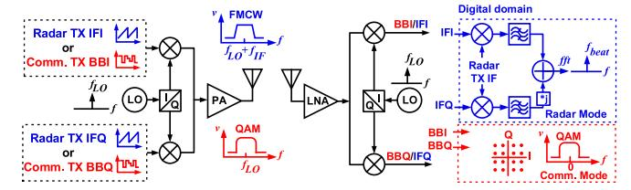

FIG. 8. Graphical representation of the application of a conventional digital transmitter and receiver for ISAC application.

where  $|a_{\rm RF}|$  and  $|a_{\rm LO}|$  represent the signal amplitudes, and  $\theta_{\rm RF}$  and  $\theta_{\rm LO}$  denote the signal phases. The modulation symbols are indicated by I and Q. The power detectors operate within their square-law linear region to perform signal mixing (linear interference), leading to frequency conversion. The detected power  $p_i$  at different outputs of power detectors can be expressed as

$$\begin{aligned} p_{i} &= |S_{\text{LO}i} a_{\text{LO}} + S_{\text{RF}i} a_{\text{RF}}|^{2} \\ &= |S_{\text{LO}i}|^{2} |a_{\text{LO}}|^{2} + |S_{\text{RF}i}|^{2} |a_{\text{RF}}|^{2} \\ &+ |S_{\text{LO}i}||S_{\text{RF}i}||a_{\text{LO}}||a_{\text{RF}}|e^{i[(\omega_{\text{RF}}(t) - \omega_{\text{LO}}(t)) + \theta_{\text{LO}} + (\theta_{\text{RF}i} - \theta_{\text{LO}i})]} \end{aligned}$$

$$(4)$$

where i = 1, 2, 3, 4. The power difference between the outputs of the two detector pairs, after low-pass filtering, can be expressed as

$$y_{i} - y_{j} = -2KI \sin\left(\frac{\sigma + 2(\omega_{RF} - \omega_{LO})}{2}\right) \sin\left(\frac{\delta}{2}\right) + 2KQ \cos\left(\frac{\sigma + 2(\omega_{RF} - \omega_{LO})}{2}\right) \sin\left(\frac{\delta}{2}\right)$$
(5)

where  $\delta = \theta_{\text{RF}i} - \theta_{\text{LO}i} - \theta_{\text{RF}j} + \theta_{\text{LO}j}$ ,  $\sigma = \theta_{\text{RF}i} - \theta_{\text{LO}i} + \theta_{\text{RF}j} - \theta_{\text{LO}i} + 2\theta_{\text{LO}}$ , and  $K = |S_{\text{LO}i}||S_{\text{RF}i}||a_{\text{LO}}||a_{\text{RF}}|$ . From (5), the in-phase I and quadrature Q signals can be extracted. In the case of  $\omega_{\text{LO}} = \omega_{\text{RF}}$ , the outputs are  $y_1 - y_3 = -2KI$  and  $y_2 - y_4 = -2KQ$ . Otherwise, when  $\omega_{\text{LO}} \neq \omega_{\text{RF}}$ , the output signals require additional processing to accurately recover the transmitted data stream. To further enhance receiver performance, an appropriate calibration algorithm can be employed to compensate for system imperfections.

# **Nonlinear Interference Topologies**

This section explores ISAC system implementations that utilize nonlinear transceiver topologies. Specifically, it examines three core hardware integration techniques—TDM, FDM, and CDM—as well as hybrid approaches that combine two or more of these methods to optimize performance and resource utilization.

Conventional digital transceivers—commonly used in SDR and MIMO architectures—can support ISAC applications without requiring dedicated hardware modifications, as shown in Fig. 8. In these implementations, the system alternates between communication and radar functionalities, with the necessary adaptations managed entirely within the DSP domain. However, this generic transceiver architecture inherently limits ISAC

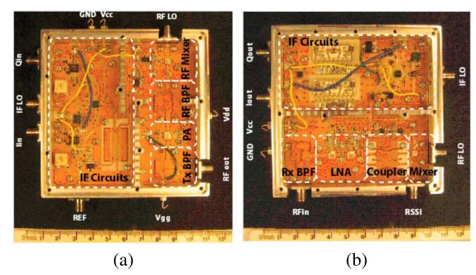

FIG. 9. Fabricated prototypes. (a) Transmitter. (b) Receiver [19].

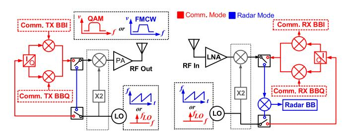

FIG. 10. Time division ISAC transceiver block diagram based on a signal path switch for radar and communication operation.

operation to TDM mode, necessitates over-engineered IF and mixed-signal stages, and imposes substantial processing over-head. As a result, such systems are most suitable for research platforms, proof-of-concept demonstrations, or advanced base stations where power efficiency is not a primary constraint.

In this regard, modified nonlinear transceiver architectures have been proposed to enhance performance while reducing power consumption. Diagrams in Figs. 8–10 illustrate the key enabling components, while a critical evaluation highlights the performance characteristics, advantages, and limitations of each approach.

TDM-based ISAC systems are widely favored for their implementation simplicity and reduced interference challenges [18], [21], [22], [25], [32], [56], [57], [58], [59], [60]. A common TDM approach involves integrating chirp modulation capabilities within the LO synthesizer for FMCW radar operation, combined with a direct conversion topology for communication functions. The 24 GHz transceiver prototype shown in Fig. 9 was one of the earliest implementations in TDM-based multifunctional systems [19]. As illustrated in Fig. 10, an ISAC transceiver, as presented in [25], operates in communication mode using a conventional heterodyne architecture. In radar mode, however, the quadrature mixers in both the transmitter (TX) and receiver (RX) are bypassed through the mode multiplexers. Instead, the LO signal is reconfigured into an FMCW chirp for radar sensing. On the TX side, the frequency doubler combined with the mixer functions as a frequency tripler to generate the LO chirp, while on the RX side, a single-path down-conversion performs dechirping to produce the beat signal.

FIG. 11. Time division ISAC transceiver block diagram with bifunctional mixer.

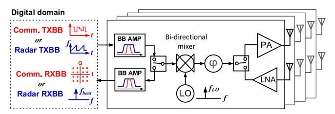

FIG. 12. Time division ISAC transceiver block diagram with bidirectional mixer, and concurrent operation enabled by multibeam configuration.

This architecture facilitates partial hardware integration across both transmitter and receiver operating modes. The incorporation of a frequency multiplier is beneficial for sub-THz operation but can be omitted at lower frequencies to improve overall efficiency. Comparable switch- or waveform-based TDM topologies have been proposed in [21], [37], and [61].

The illustrated signal-path switching approach in Fig. 10 is often used to achieve multifunctionality but at the expense of reduced integration. Alternatively, reconfigurable RF chain components can significantly enhance hardware efficiency. For instance, a dual-mode Gilbert cell architecture was proposed in a 60 GHz ISAC transceiver design [32] and shown in Fig. 11. In communication mode, the dual-mode Gilbert cell functions as a conventional up-conversion mixer, supporting a direct-conversion transceiver architecture. In radar mode, the LO generates a chirp signal, and the Gilbert cell is reconfigured to act as an amplifier, directly driving the chirped LO signal to the antenna for radar transmission. On the receiver side, rather than employing an IF chirp modulation scheme—which typically requires digital dechirping—this design utilizes direct RF dechirping. This approach substantially reduces the ADC sampling rate and alleviates the computational load associated with radar signal processing.

To reduce reliance on redundant mode multiplexers and maximize RF module reuse, a configurable transmit intermediate-frequency (TX-IF) scheme has been proposed for ISAC implementations [27], [62], [63]. This ISAC transceiver, as illustrated in Fig. 12, employs a conventional direct-conversion architecture. In communication mode, baseband data are provided by an IF signal generator, which can also produce quadrature IF chirps for radar operation. By reusing more circuit blocks, this architecture significantly reduces chip area and enhances integration. The topology incorporates a bidirectional mixer at its core and supports direct up- and down-conversion via I/Q mixers, maintaining compatibility with commonly used quadrature modulation schemes in communication systems. Each transceiver unit

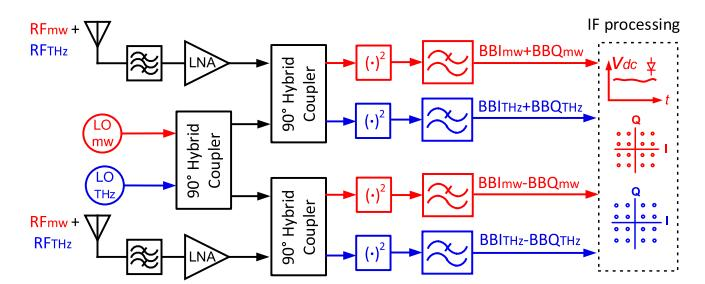

FIG. 13. Dual-band waveguide interferometric receiver for concurrent MW and THz bands operation.

features a pulsed chirping scheme, enabling TDM of uplink and downlink communication alongside FMCW radar sensing—fully integrated within a single ISAC transceiver design.

The studies referenced in [18], [22], [25], [56], [57], [58], [59], [60], and [64] demonstrate similar TDM-based ISAC implementations. However, these architectures often face limitations in achievable chirp bandwidth due to the constrained bandwidth of external IF components, which consequently leads to relatively low range resolution in radar mode. Additionally, extracting the beat signal at the receiver typically requires digital dechirping, adding substantial hardware complexity compared to architectures that employ direct RF dechirping.

In communication-first ISAC systems—particularly those emphasizing high data rates, such as MIMO-based implementations—a digital transceiver front-end similar to that depicted in Fig. 12 is commonly employed. These systems often achieve concurrency and integration through code orthogonality, allowing simultaneous operation without compromising communication performance.

## **Linear Interference Topologies**

Interferometric systems have been extensively investigated in ISAC development due to their inherently linear signal processing, high sensitivity, low power consumption, relaxed filtering requirements, and broad bandwidth capabilities. The integration of advanced research on these passive elements with ISAC technologies has resulted in uniquely advantageous hardware designs that enable efficient, integrated, and multifunctional operation. Recent innovative solutions have been presented to extend its capabilities to multiband, multipolarization, and multifunctional operations.

A novel hybrid coupler network design, presented in [29], enables simultaneous signal routing across distinct frequency bands for dual-band operation in an FDM ISAC system, as illustrated in Fig. 13. Specifically, THz signals are routed via substrate-integrated waveguide (SIW) paths, while MW signals are guided through equivalent coplanar waveguide (CPW) structures. This effective separation ensures coexistence without interference, allowing for a unified receiver architecture, and reducing hardware complexity. The system successfully demonstrates concurrent demodulation of various QAM signals at 5.8 and 150 GHz. This seamless integration of widely separated frequency bands underscores promising opportunities for future 6G technologies that seek to combine sensing,

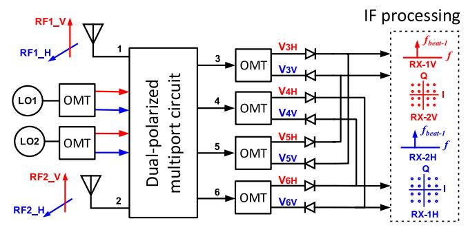

FIG. 14. Dual-polarized, dual-band waveguide interferometric receiver for concurrent operation.

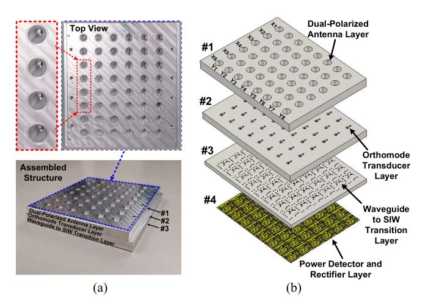

FIG. 15. Photograph of the fabricated waveguide receiver array. (a) Front view, (b) exploded view of the proposed waveguide receiver array [28].

communication, and potentially wireless energy harvesting within a single platform.

A highly innovative receiver architecture presented in [65] enables simultaneous reception and demodulation of multiple channels across two orthogonal polarizations within a single, compact hardware module. At its core is an eight-port linear interferometric design that passively combines incoming RF signals with known LO signals using waveguide-based components. The receiver employs a square waveguide that naturally supports two orthogonal modes—TE10 and TE01—allowing concurrent processing of vertically and horizontally polarized signals. Each polarization path accommodates two distinct frequency channels, enabling dual-polarization and dual-band multichannel reception. As shown in Fig. 14, the architecture integrates key components such as custom dual-polarized cruciform couplers, orthomode transducers (OMTs), and precision phase shifters, all designed to maintain polarization isolation and phase coherence. Experimental validation demonstrated the system's capability to demodulate M-QAM signals at high data rates, up to 1.2 Gb/s, without requiring postprocessing or calibration. The concept is extended into an array format, as shown in Fig. 15, to integrate multifunctionality through collaboration and multiple interferometric RX units.

With growing interest in migrating to the THz frequency band, one of the key challenges—especially for array

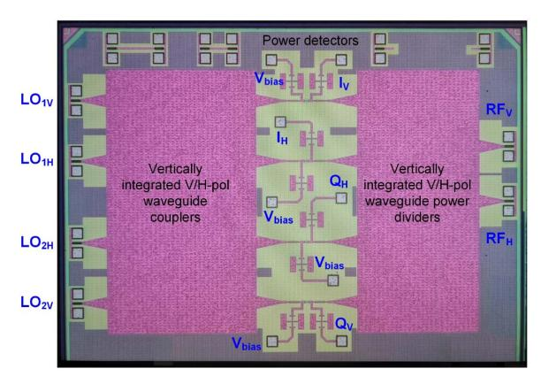

FIG. 16. Microphotograph of the THz waveguide receiver prototype [34].

implementations—is managing high power consumption. Interferometric receivers have emerged as a promising solution to this challenge, as demonstrated in [34]. In this work, signals with both vertical and horizontal polarizations are simultaneously received via a dual-polarized antenna and processed within a vertically stacked, multilayer CMOS waveguide architecture operating at 300 GHz, as illustrated in Fig. 16. The design incorporates SIW-based power dividers and 3-dB couplers arranged vertically, enabling efficient routing of both RF and LO signals. This vertical integration reduces the overall footprint by nearly half, resulting in a compact and powerefficient solution ideal for future THz ISAC systems. A distinctive aspect of this CMOS waveguide integration is its departure from traditional voltage/current-based IC architectures—common in conventional CMOS designs—toward full electromagnetic non-TEM mode operation. This paradigm shift breaks the constraints of voltage- and current-defined circuits, paving the way for THz ISAC transceivers with significantly reduced packaging complexity and improved thermal management.

Transmitter functionality has been developed and integrated into the interferometric concept in [33] to complement receivers and complete the full communication link. In this approach, the LO signal is modulated with an IF signal using power detectors that serve as amplitude control elements. By dynamically adjusting the reflection coefficients within each interferometric cell, the combined output produces either the in-phase (I) or quadrature (Q) baseband component. This configuration enables an interferometric cell to function as a half-duplex transceiver, supporting both transmission and reception in a compact, power-efficient solution.

## Self-Oscillating Mixer (SOM) Topologies

SOMs offer a compelling low-power alternative to interferometric techniques, offering several distinct advantages. Unlike conventional receivers that rely on an external LO source, SOMs integrate LO generation and signal mixing into a single, standalone stage, significantly reducing power consumption and system complexity.

Early research in this area focused primarily on low-power sensing applications, where minimizing energy usage was

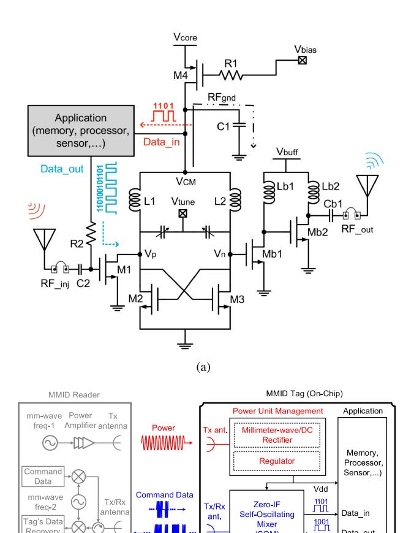

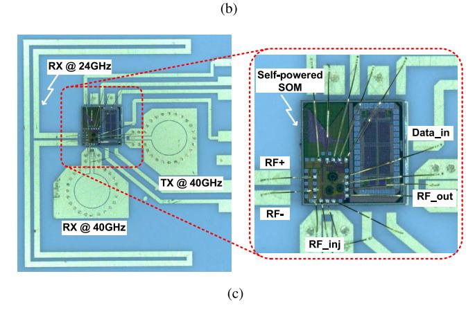

(SOM)

CMOS die

FIG. 17. (a) Circuit schematic of a zero-IF SOM, (b) block diagram of the proposed MMID system with a battery-less active tag on single chip, (c) microphotograph of the fabricated prototype chip [16].

paramount [24]. However, recent advances in [66] and [67] have expanded SOM capabilities, demonstrating their suitability for more complex functions, including quadrature modulation reception.

The SOM-based solution presented in [16] and [24], illustrated in Fig. 17, demonstrates a battery-free sensor system by integrating energy harvesting with a SOM-based transceiver on a single chip. This architecture combines an LC cross-coupled voltage-controlled oscillator (VCO) with an injection-locked configuration, enabling direct zero-IF baseband conversion. During reader-to-tag communication, the tag receives an amplitude-modulated (AM) signal at a frequency matching the natural oscillation frequency of the SOM. This incoming signal injection-locks the oscillator, synchronizing its phase and frequency with the carrier. At the same time, the injected signal powers the oscillator, enhances phase noise performance, and facilitates self-mixing for baseband demodulation. For tag-toreader communication, the SOM is repurposed to upconvert baseband data by modulating the bias point of the oscillator's transistors with the baseband signal, generating amplitude shift keying (ASK) on the transmitted waveform. This dualfunctionality reduces hardware complexity and enables highly energy-efficient operation, making it ideal for ultralow-power or batteryless ISAC applications.

## **ISAC Arrays**

While MIMO-based solutions are widely proposed for ISAC applications within the communications community, they typically rely on intensive signal processing across multiple data streams to achieve interference cancellation and orthogonality. From an implementation standpoint, however, these architectures impose significant demands on RF and mixed-signal front-ends, which must support wide bandwidths while meeting stringent linearity and noise performance requirements. As a more hardware-efficient alternative, many state-of-the-art ISAC systems leverage the collective operation of capable transceiver units arranged in arrays. These array-based systems enable concurrent functionalities across frequency, beamforming, and polarization domains [26], [68], [69]. This approach facilitates simplified, scalable ISAC front-end designs with more manageable power consumption, making it a practical solution for real-world deployment.

In [70], a multibeam ISAC transceiver is proposed to enable simultaneous radar and communication operations. This architecture generates beamforming waveforms composed of two or more independently controlled streams, each configurable for sensing or communication functions. These streams can operate in time-division or frequency-division modes, providing flexible dual-functionality. The system supports various configurations, including two independent radar streams, two independent communication streams, and one radar stream paired with one communication stream. This versatility facilitates dynamic resource allocation, making the transceiver adaptable to diverse application scenarios and system requirements.

A novel approach to ISAC in array-based systems is illustrated in Fig. 18, built around the concepts of the VRM and combinatory analog operations (CAOs), initially introduced in [26] and [71], and later extended into a comprehensive transceiver framework in [68]. The array consists of simplified interferometric transceiver units with the ability to be selectively activated or deactivated. This design offers a highly flexible and reconfigurable analog front-end, enabling dynamic allocation of array elements to different signal processing paths without requiring physical hardware modifications.

The VRM enables virtual mapping of receiver channels, allowing sensing and communication tasks to be performed

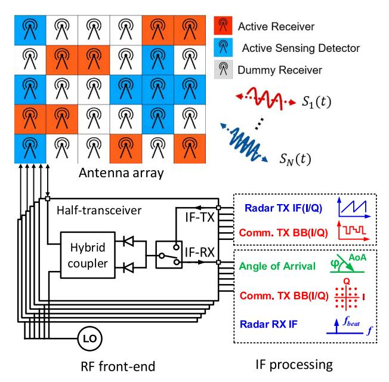

FIG. 18. Conceptual representation of virtual transceiver array.

simultaneously through the same antenna aperture. Complementing this, the CAO architecture executes critical spatialdomain operations, such as beamforming, null steering, and spatial filtering, directly in the analog domain before analogto-digital conversion. This approach substantially reduces digital processing demands and enables low-latency system responses. Together, the VRM-CAO framework supports a broad range of functions, including communication, radar sensing, and 2-D AoA detection, while maintaining scalability for future enhancements. This strategy effectively minimizes hardware complexity and power consumption, providing realtime adaptability to dynamic operational needs such as waveform diversity, directional resource allocation, and flexible network configurations. Fig. 19 illustrates the VRM proof-ofconcept prototype, which is composed of interferometric half-RX units and integrated distributed LO generation. The interferometric receivers' passive detection mechanism, coupled with their considerably lower LO requirement ( $\sim$ 20 dB), enables the practical realization of large VRM arrays.

Building upon earlier developments of individual interferometric receiver units [25], [29], [33], [34], [65], the work presented in [28] introduces a waveguide-based receiver array that seamlessly integrates communication, sensing, and WPT within a unified ISAC framework. This architecture exploits spatial selectivity and mode diversity to enable concurrent multifunctional operation—without relying on frequency- or TDM. The system employs a uniform waveguide array capable of supporting multiple propagating modes, each mapped to a distinct function. By carefully engineering orthogonal mode patterns, the design achieves spatial-mode multiplexing, enabling simultaneous execution of communication, sensing, and energy-harvesting operations through a shared physical aperture. Each receiver module incorporates hybrid couplers and power combiners to perform mode-selective demultiplexing, efficiently

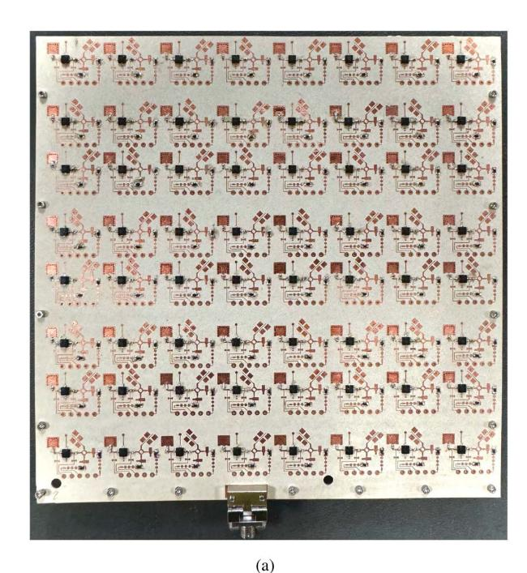

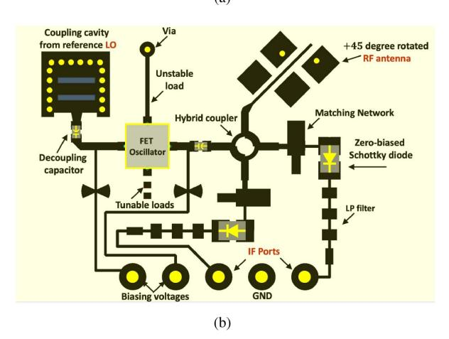

FIG. 19. (a) Fabricated prototype of the proposed sensing and communication VTM front-end, (b) designed VTM unit cell comprising  $\pm 45^{\circ}$  rotated antenna [33].

routing different modal components to their respective signal processing paths. This approach not only maximizes integration density and functional efficiency but also reduces system complexity and power loss, offering a compact and power-efficient solution for next-generation ISAC platforms.

It is important to emphasize that, while both the VRM-based architecture and conventional MIMO-based ISAC systems employ arrays of antenna elements, the design objectives and implementation philosophies differ fundamentally. Classical MIMO solutions are primarily optimized for spatial multiplexing and maximizing data throughput, which necessitates a dedicated RF chain and high-speed ADC/DAC per antenna element. This requirement imposes substantial power, cost, and calibration burdens, particularly at mmW and sub-THz frequencies where scalable integration becomes challenging. In contrast, the VRM/CAO-based arrays are conceived from the

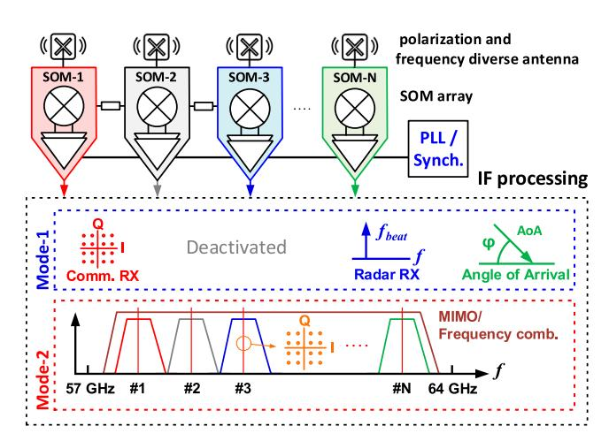

FIG. 20. Conceptual representation of low power receiver array solution based on SOM for: mode-1: synchronous multifunction ISAC operation scenario, mode-2: isolated independent operation for MIMO and frequency comb operation.

outset for hardware-efficient multifunctionality rather than maximizing spatial degrees of freedom. Through virtual mapping of receiver channels and CAO, these architectures enable joint radar sensing, communication, and even energy harvesting within a shared physical aperture, while relying on significantly fewer RF chains.

Moreover, unlike hybrid analog–digital beamforming used in conventional mmW MIMO systems—which still requires complex calibration of phase shifters and static partitioning of RF paths—the VRM/CAO framework offers dynamic reconfigurability at the front-end. Array elements can be selectively activated, deactivated, or reassigned in real time between sensing and communication tasks without modifying the underlying hardware topology. As a result, the proposed arrays represent a distinct paradigm focused on energy efficiency, scalability, and seamless integration of diverse ISAC functionalities, which differentiates them from traditional MIMObased solutions despite the shared use of antenna arrays.

SOMs offer unique advantages, such as local LO power generation and intrinsic harmonic mixing, that are particularly beneficial in the mmW and sub-THz frequency regimes, making them strong candidates for scalable ISAC array architectures [\[53\],](#page-24-0) [\[66\]](#page-24-0), [\[67\],](#page-24-0) [\[68\],](#page-24-0) [\[69\]](#page-24-0), [\[72\].](#page-24-0) As conceptually illustrated in Fig. 20, a promising architectural paradigm employs SOMs to unify the front-end design, enabling seamless support for both passive and active modes of operation. In the passive mode, a sourceless receiver configuration harnesses ambient signals and employs square-law detection to facilitate ultralow-power sensing and opportunistic communication. This eliminates the need for an external LO, making the approach highly appealing for power-constrained, densely integrated array systems. In the active mode, the same SOMs are driven into self-oscillation, enabling synchronous reception with improved phase coherence across array elements. This dual-mode capability positions SOMs as a versatile and energy-efficient solution for nextgeneration ISAC transceivers.

The selective activation and deactivation of quadrature harmonic self-oscillating mixers (QHSOMs) enables the realization of VTM topologies, supporting seamless multifunctionality within a unified hardware platform [\[66\].](#page-24-0) This dual-mode architecture allows for advanced spatial signal processing techniques—such as beamforming and AoA estimation while optimizing hardware reuse and minimizing overall system complexity and power consumption. These combined capabilities position SOM-based arrays as a highly flexible and scalable solution for dynamic ISAC applications, where real-time adaptability, functional diversity, and energy-efficient operation are paramount.

# Power Transfer in ISAC Platform

Current technologies enable the integration of ISAC with wireless power harvesting, which aims to further reduce power consumption while enabling fully autonomous IoT nodes to perform energy harvesting, data reception, processing, storage, and communication seamlessly.

Several energy harvesting approaches, including the use of multiple antennas [\[73\]](#page-25-0), time-switching [\[74\]](#page-25-0), power splitting [\[75\],](#page-25-0) and integrated rectifier techniques [\[76\],](#page-25-0) can be adopted within the ISAC platform. However, these approaches are typically hindered by large footprints, high costs, low system efficiency, and complex integration. To address these limitations, a novel interferometric receiver architecture that integrates energy harvesting has been proposed in [\[77\].](#page-25-0) This architecture utilizes diplexers to capture out-of-band interferers and recycle harmonics generated by the multiport system, supporting the use of digital modulation techniques essential for IoT applications. Additionally, a self-powered interferometric radar, proposed in [\[78\],](#page-25-0) enables simultaneous radar sensing and solar energy harvesting. This solar energy harvesting system includes a fractional open-circuit voltage maximum power point tracking circuit, a boost charger controller, two solar panels, and both main and backup batteries. Solar-based harvesters provide a more potent energy source, particularly for systems with higher power demands. Furthermore, in [\[79\],](#page-25-0) a self-embedded powerrecycling technique for MIMO systems was proposed. This technique harnesses the direct current (dc) signal rectified by mixing elements during frequency translation. Measurement results show that approximately 30% of the driving signal power is directly converted into a dc signal at the power-recycling port under maximum conversion efficiency conditions.

Table [II](#page-15-0) provides a comprehensive summary of the current state-of-the-art hardware implementations for ISAC systems, highlighting the latest advancements and key technical features.

# KEY TECHNOLOGIES

The successful implementation of ISAC systems relies on a comprehensive set of enabling technologies designed to meet the demands of multifunctional operation within shared hardware architectures. This section reviews key advancements in antenna and array design, high-frequency component development, and emerging materials and integration techniques—

TABLE II ISAC hardware realizations

| Ref.          | Paper                              | Cat. | Fabrication Process | Freq. (GHz) | Data Rate (Gb/s) | Mod. Mode       | Com. BW (GHz) | TX Pout (dBm) | Ang. Res. | Ran. Res. | Max Ran. (m) | RX NF (dB) |
|---------------|------------------------------------|------|------------------------|----------------|---------------------|-----------------|------------------|---------------|-----------|-----------|-----------------|------------|
| [19] 2012  | 24 GHz Time Agile ISAC          | MB*  | РСВ                    | 24             | 0.050               | BPSK/ QPSK      | _                |               | _         | 1.65      | 70              | _          |
| [99] 2016  | 60 GHz 6-Ch AiP TRX             | MB   | $0.13~\mu$ m SiGe      | 57–64          | 0.4                 | ООК             | 7                | ≈ 4           | _         | 0.02      | 10              | < 10       |
| [24] 2019  | 40 GHz Sourceless RX            | MB   | 65 nm CMOS             | 40             | 0.004               | QPSK/16- QAM | 7                | _             | _         | _         | _               | _          |
| [100] 2021 | Reconfigurable 35 GHz RX        | MB   | 90 nm CMOS             | 35             | _                   | _               | 3.4              | 16.9          | _         | -         | 200             | 7.6        |
| [88] 2021  | THz Comb Radiator & RX Imaging  | MB   | 90 nm SiGe BiCMOS   | 1140           | 10                  | 64-QAM          | _                | - 11          | _         | -         | 0.35            | 44         |
| [101] 2022 | IQ TRX for D-band JRC              | MB   | 130 nm BiCMOS       | 110–170        |                     | BPSK            | _                | 13            | _         | -         |                 |            |
| [25] 2023  | D-Band JRC CMOS TRX             | MB   | 28 nm CMOS             | 122–168        | 10                  | 16-QAM          | 20               | 13            | _         | 0.0125    | 25              | 10         |
| [102] 2023 | mmW FreqMod. Tx Array for JCS   | MB   | 45 nm CMOS             | 28-31          | 3                   | 64-QAM          | 0.5              | 18            | 4         | -         |                 | 24.5–36    |
| [103] 2023 | 60 GHz Phase-Time Array TX      | MB   | 45 nm CMOS             | 25.5–32.5      | 36                  | 64-QAM          | _                | 17.5          | < 5       | -         | -               | -          |
| [29] 2024  | Joint MW/THz Interferometric RX | MPI* | РСВ                    | 5.8 & 150      | _                   | M-QAM           | N/R              | -             | _         | -         | _               | _          |
| [27] 2024  | Ka-Band 4T/4R TRX               | MB   | 65 nm CMOS             | 26–34          | 0.8                 | 64-QAM          | 5                | > 10          | _         | -         | -               | ≈ 5        |
| [104] 2024 | Over-the-Air 26 GHz RX          | MB   | 22 nm FDSOI            | 26             |                     | _               | 0.8              | -             | _         | -         |                 |            |
| [61] 2025  | 6–11 GHz Digital- Intensive SoC | MB   | 28 nm CMOS             | 6–11           | 0.027               | BPSK & ToF      | 2.4              | 14            | 4         | 0.1       | 10              | 17         |
| [32] 2025  | 60 GHz Dual-Mode Gilbert TRX    | MB   | 65 nm CMOS             | 55–65          | 7                   | 16-QAM          | _                | 16            | _         | 0.0375    | 4               | 5.8        |
| [28] 2025  | Waveguide Receiver Array        | MPI  | Waveguide + 65 nm CMOS | 26–30          | _                   | M-QAM           | 4                | _             | _         | _         | _               | _          |
| [33] 2025  | VTM AoA & Polarization TRX      | MPI  | РСВ                    | 25.4           | 0.25                | 64/128-QAM      | _                |               | 0.9       | _         | _               | _          |
| [31] 2025  | Joint 4-D Radar & Comm.            | MPI  | PCB                    | 24             | _                   | 64-QAM          | _                | _             | < 1       | < 1.5     | _               | _          |

Note:  $MB^* = Mixer\ Based$ ,  $MPI^* = Multiport\ Interferometric$ .

each playing a critical role in supporting ISAC hardware across a wide range of frequency bands.

# **Antenna and Array Systems**

Antenna and array design lie at the heart of ISAC hardware, as these components must seamlessly accommodate both communication and sensing functions without degrading the performance of either. To meet this challenge, multifunctional antenna arrays have been developed that support beam steering, polarization diversity, and multiband operation within a shared physical aperture. For example, [28] demonstrated a dual-polarized waveguide antenna integrated with an OMT, enabling independent horizontal and vertical polarization channels. This configuration allows simultaneous communication and sensing, effectively doubling system capacity without increasing array size.

Another key requirement for ISAC antenna systems is beam steering capability, which enables dynamic reconfiguration of radiation patterns to accommodate varying sensing angles and communication link directions. Phased-array architectures have been widely adopted to achieve this, with implementations spanning sub-6 GHz, mmW, and THz frequency bands [27], [30]. To balance hardware complexity with beamforming flexibility, hybrid techniques that combine analog and digital control have been employed—particularly in mmW ISAC arrays—offering an efficient tradeoff between performance and scalability [9].

Recent advancements have also investigated the use of dualpurpose beam patterns, where a single beam is engineered to concurrently support both sensing and communication functions [85]. Achieving such multifunctionality requires precise synthesis of radiation characteristics to ensure sufficient gain, controlled sidelobe levels, and appropriate beam width for both tasks. Phased-array architectures are able to generate communication beams that embed sensing information by modulating the amplitude and phase distribution across the aperture.

## mmW and THz Technologies

The shift toward higher frequency bands has unlocked new possibilities and challenges for ISAC hardware. mmW and

THz frequencies offer vast bandwidth and high spatial resolution for sensing, making them particularly attractive for integrated ISAC platforms. However, hardware implementations at these frequencies are hindered by increased propagation loss, stringent fabrication tolerances, integration complexity, and high linearity requirements for components.

Recent advancements have demonstrated mmW ISAC transceivers implemented using silicon-based CMOS and SiGe BiCMOS technologies. These systems integrate phased-array front-ends and frequency synthesizers within compact chip footprints to support both radar and communication functionalities [\[86\]](#page-25-0), [\[87\]](#page-25-0). A notable example is a multifunctional mmW transceiver capable of dynamically switching between radar and communication modes using a shared phased-array antenna and frequency-agile RF front-end [\[27\].](#page-23-0)

At THz frequencies, innovative receiver architectures are being explored to support ISAC operation. For instance, [\[29\]](#page-23-0) introduced a joint multiband linear interferometric receiver capable of simultaneously receiving and demodulating MW and THz signals within a unified hardware platform. This design employs multiport interference and separate MW/THz power detectors to extract baseband signals concurrently, achieving efficient dual-band functionality with low power consumption and a compact form factor. Similarly, [\[88\]](#page-25-0) reported a silicon-integrated THz transmitter-receiver system based on a frequency comb architecture. This system utilizes the reverse recovery effect of p-i-n diodes for broadband pulse generation and Schottky barrier diodes for heterodyne detection. It enables highly sensitive detection over the 220–500 GHz range, offering low phase noise and high frequency resolution—key requirements for THz ISAC applications.

Together, these developments mark substantial progress in compact, wideband, and multifunctional transceiver design at mmW and THz frequencies, leveraging advanced analog techniques alongside modern silicon integration.

## Integration With Photonics and Metamaterials

Photonics and metamaterials have emerged as promising technologies for advancing ISAC hardware, particularly at mmW and THz frequencies. Photonic front-ends employ optical components—such as photonic mixers, modulators, and delay lines—to enable broadband signal processing with low insertion loss, high linearity, and strong immunity to electromagnetic interference. These features make photonic systems especially suitable for high-frequency ISAC applications where conventional electronic approaches face scalability and performance limitations. Recent studies have demonstrated photonic-assisted ISAC receivers capable of performing simultaneous radar imaging and high-speed optical communication. These systems utilize shared photonic circuitry to jointly process RF and optical signals, thereby achieving multifunctionality with minimal hardware redundancy [\[64\]](#page-24-0), [\[89\].](#page-25-0)

Metamaterials and reconfigurable intelligent surfaces (RISs) represent a promising approach for ISAC integration, offering programmable control over electromagnetic wave behavior at the surface level. Drawing conceptual inspiration from traditional RF relay techniques, RIS can dynamically manipulate reflection, refraction, and absorption characteristics to enable beam steering, interference mitigation, and adaptive sensing coverage—all without the need for active phase shifters or RF amplifiers. Recent experimental RIS prototypes have demonstrated the ability to perform both environmental sensing and communication beamforming within a unified metasurface framework [\[90\]](#page-25-0), [\[91\]](#page-25-0).

In addition, metamaterial-based components—such as frequency-selective surfaces (FSS), tunable meta-structures, and miniaturized antennas—have been incorporated into ISAC hardware to broaden operational bandwidths, reduce system footprint, and enable dynamic electromagnetic responses. Notably, FSS technologies, which predate the emergence of metamaterials and metasurfaces, offer well-established capabilities for spatial signal filtering and directional control, and now serve as foundational elements in advanced ISAC designs.

Together, these material- and structure-level innovations complement conventional circuit design approaches by introducing new degrees of freedom in performance optimization. More broadly, the suite of enabling technologies for ISAC hardware—including advanced antenna arrays, high-frequency integration techniques, and novel material platforms—is essential to realizing multifunctional, reconfigurable, and compact systems. Their continued development will be critical in meeting the stringent technical requirements of emerging ISAC applications in automotive sensing, AAV networks, and future 6G wireless systems.

# IBFD Antennas

IBFD antennas play a pivotal role in ISAC systems by enabling simultaneous transmission and reception on the same frequency band, thereby doubling spectrum efficiency while supporting real-time sensing. In ISAC applications, where communication and sensing coexist, IBFD antennas improve spectral utilization and reduce latency but face a significant challenge from self-interference (SI) caused by strong transmit signals coupling into the sensitive receiver chain. To overcome this, emerging IBFD designs incorporate advanced SIC techniques at the antenna, analog, and digital domains. Sharedaperture architectures using 645 dual-polarized antennas achieve inherent cross-polarization isolation exceeding 39 dB across wide bandwidths, while innovations such as commonmode suppression Baluns (CMSBs) and defected ground structures (DGS) push passive isolation beyond 60 dB, reducing the reliance on downstream SIC stages [\[80\],](#page-25-0) [\[81\]](#page-25-0). On the other hand, a simple yet effective dual orthogonal mode antenna approach was proposed and adopted for a complete IBFD system [\[124\]](#page-26-0), which has achieved the overall world-record SIC over an appreciable bandwidth.

For ISAC scenarios involving large antenna arrays and high-density environments, joint (TX/RX) beamforming is increasingly integrated into IBFD antennas to dynamically control SI while preserving high array gain. Recent studies have demonstrated that optimizing TX beam patterns and RX weights simultaneously can achieve over 80 dB of effective isolation, even when TX/RX elements are closely spaced [\[82\]](#page-25-0).

These advancements make IBFD antennas highly suitable for next-generation ISAC applications such as vehicular RadCom systems, environmental sensing, and 6G networks, where high-throughput communication and precise situational awareness must coexist within limited spectrum resources [\[83\]](#page-25-0).

# SOFTWARE AND SIGNAL PROCESSING TOUCHPOINTS

While this review focuses primarily on ISAC hardware integration, software and signal processing are essential enablers that facilitate the coexistence and seamless cooperation of sensing and communication functions within shared platforms. This section highlights key signal processing techniques that interface with ISAC hardware to enhance multifunctional performance, including advanced waveform design, dynamic resource management, and joint optimization algorithms.

# Signal Waveform Design

Waveform design, or waveform engineering, is a cornerstone of ISAC systems, as it directly influences both sensing resolution/accuracy and communication data rates within a shared spectral and temporal framework. Early research in JRC systems focused on adapting communication waveforms—most notably OFDM—to incorporate radar sensing capabilities without compromising data throughput [\[92\]](#page-25-0), [\[93\]](#page-25-0), [\[94\].](#page-25-0) These waveforms leverage the subcarrier structure to enable simultaneous estimation of target range, Doppler, and angle, all while transmitting communication payloads.

FMCW waveforms, traditionally employed in radar systems, have been successfully adapted for communication in ISAC transceivers. For example, [\[21\]](#page-23-0) demonstrated an ISAC transceiver utilizing trapezoidal FMCW signaling to simultaneously support vehicular radar detection and high-speed data communication over a shared RF front-end. Other waveform techniques include phase-modulated continuous wave (PMCW), stepped-frequency waveforms, and hybrid schemes designed to optimize the ambiguity function for dual-function operation [\[95\]](#page-25-0). The choice of waveform significantly influences hardware demands, such as PA linearity, ADC resolution, and baseband processing complexity. Recent research has introduced adaptive waveform selection strategies, enabling ISAC hardware to dynamically switch between radar-optimized and communication-optimized waveforms based on environmental conditions or application requirements [\[64\].](#page-24-0)

# Resource Management

Resource management is a crucial bridge between ISAC hardware and software, ensuring the efficient allocation of spectral, spatial, and temporal resources across sensing and communication functions. Shared hardware platforms—such as common antenna arrays or RF front-ends—must carefully coordinate beamforming patterns, frequency bands, and time slots to minimize SI and prevent performance degradation.

Dynamic spectrum allocation algorithms have been developed to balance sensing resolution/accuracy and communication throughput, particularly in congested frequency bands. These algorithms utilize channel state information (CSI), interference metrics, and sensing priorities to adapt spectrum usage in real time. Similarly, beam management strategies optimize the allocation of beams or subarrays between sensing and communication functions, often leveraging hybrid analog/digital beamforming architectures to enhance flexibility and performance [\[20\],](#page-23-0) [\[96\].](#page-25-0)

Emerging ISAC hardware platforms increasingly adopt resource-aware architectures that support dynamic allocation of receiving and transmitting functions. Notably, frameworks such as the VRM and VTM enable selective assignment of unit cells to sensing, communication, or energy harvesting tasks based on real-time system requirements [\[26\]](#page-23-0), [\[28\]](#page-23-0), [\[33\],](#page-23-0) [\[71\]](#page-24-0). Instead of relying on fixed RF chains, these architectures employ CAO and spatial-domain synthesis to create virtual channels, allowing simultaneous processing of multiple cofrequency signals over a sparse physical array [\[26\]](#page-23-0), [\[71\].](#page-24-0) This fine-grained, hardwarelevel resource management—achieved without active switches or amplifiers—marks a significant evolution in ISAC design, seamlessly integrating physical-layer adaptability with intelligent system control to enable multifunctional operation across communication, sensing, and power domains.

# Joint Optimization Algorithms

To maximize the multifunctional capabilities of ISAC hardware, joint optimization algorithms are increasingly employed to codesign parameters spanning both sensing and communication domains. These algorithms navigate inherent trade-offs such as radar detection range versus communication data rate, and sensing accuracy versus spectral efficiency—while respecting the constraints imposed by shared hardware resources [\[97\]](#page-25-0). Fig. [21](#page-18-0) provides a system-level overview of this joint design process, highlighting the critical interplay between the physical layer and the software layer, both of which are essential to enabling concurrent, adaptive, and efficient ISAC operation.

The Physical Layer encompasses key hardware components, including the antenna, RF front-end, IF stage, and baseband analog signal conditioning. These modules manage the transmission, reception, and preprocessing of electromagnetic signals, generating critical outputs such as baseband signals, CSI, and beamforming weights. These outputs serve as inputs to the software-defined processing pipeline. The software layer functions primarily in two modes: communication mode (modulation and demodulation) and sensing mode (detection and estimation). Both modes include calibration and beamforming processes that produce data fed into higher level modules such as DSP and localization algorithms. Central to the Software Layer is a Machine Learning and AI module, which facilitates dynamic, concurrent operation by processing real-time feedback from environmental and hardware parameters—such as AoA, Doppler shift, mobility patterns, and RF impairments.

It is worth noting that in ISAC systems, CSI plays a pivotal role in ensuring both reliable communication and accurate sensing. The characterization of CSI depends strongly on whether the system operates in the far-field or near-field regime, depending on operating frequency and space. In far-

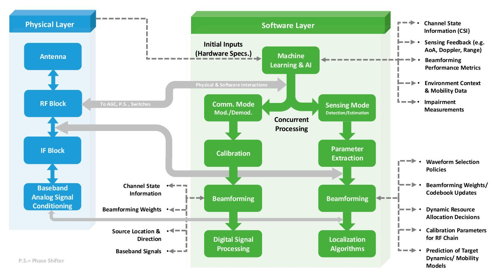

FIG. 21. Illustration of system-level architecture ISAC hardware and software codesign.

field scenarios, the impinging wavefronts can be approximated as planar, which simplifies the channel modeling into angulardomain formulations. Here, the communication channel is typically represented as a superposition of a line-of-sight (LoS) component and multiple non-line-of-sight (NLoS) paths, each defined by fading coefficients, steering vectors, and angles of arrival and departure. Conversely, the radar sensing channel in the far-field accounts for the target's radar cross section (RCS) along with scattering effects from environmental objects, enabling target detection and range estimation. In contrast, near-field scenarios require spherical wave modeling due to the larger antenna apertures and shorter propagation distances enabled by technologies such as mmW and THz communications. The near-field CSI inherently depends on both the target's distance and angular parameters, offering finer spatial resolution but demanding more complex estimation techniques. Therefore, accurately acquiring CSI under both regimes is critical for designing efficient waveform strategies, optimizing beamforming, and achieving seamless joint communicationsensing performance in advanced ISAC systems [84].

Obviously, this AI-driven architecture facilitates real-time optimization tasks, including waveform selection, codebook refinement, beamforming weight adaptation, and calibration parameter tuning. Such intelligent processing is especially vital for large-scale MIMO ISAC systems, where the high dimensionality of the design space demands scalable, learning-based solutions [91], [98]. Both supervised and reinforcement learning algorithms have been successfully employed to optimize beamforming, mitigate interference, and dynamically allocate resources under changing channel conditions.

A notable example of hardware-aware codesign is the neural network–based digital predistortion (DPD) framework presented in [59], which effectively mitigates nonlinearities in mmW GaN PAs used across communication, sensing, and power transfer modes. The model dynamically adapts to diverse waveform types, including FMCW and OFDM, compensating for both short- and long-term signal distortions. This approach exemplifies the power of integrating physical-layer impairment modeling with higher layer intelligence to maintain signal fidelity and enhance system versatility across multifunctional operations.

Once again, the convergence of reconfigurable hardware and software-defined intelligence—embodied in the layered ISAC architecture—enables robust, scalable, and high-performance transceivers. By jointly optimizing hardware and algorithmic components, sensing and communication functions can be adaptively coprocessed to support diverse application scenarios and dynamic operating environments. This holistic design paradigm is pivotal in driving the evolution of next-generation ISAC systems.

## **APPLICATIONS AND DEMONSTRATORS**

ISAC systems have attracted growing interest across a wide range of applications, owing to their capacity to consolidate hardware resources while simultaneously enabling environmental sensing and data communication [105], [106], [107]. This section reviews representative ISAC hardware applications, emphasizing key demonstrators and their implementation features within automotive, aerial, indoor, and industrial environments. Table III summarizes the applications and key performance requirements of ISAC.

#### **Automotive ISAC**

Automotive systems stand among the most mature and commercially viable applications of ISAC hardware. Contemporary

TABLE III. ISAC application cases and key performance requirements

| Applications                                   | Trends                         | Use Cases                                                                                                                                                                                                                                                                                                | Requirements                                                                                                                                                                                                                                                                                                                                                                                                                                                                                                   |  |  |  |
|------------------------------------------------|--------------------------------|----------------------------------------------------------------------------------------------------------------------------------------------------------------------------------------------------------------------------------------------------------------------------------------------------------|----------------------------------------------------------------------------------------------------------------------------------------------------------------------------------------------------------------------------------------------------------------------------------------------------------------------------------------------------------------------------------------------------------------------------------------------------------------------------------------------------------------|--|--|--|
| Smart Home and In-Cabin Sensing             | Frequency Bands:  * mmW  * THz | * Human Presence Detection  * Human Proximity Detection  * Sleep Monitoring  * Passenger Monitoring  * Intruder Detection  * Fall Detection  * Location-Aware Control  * Driver Attention Monitoring  * Breathing/Heart Rate Estimation  * Sensing Aided Wireless Charging  * Daily Activity Recognition | Security and Privacy     Real-time Data Processing and Decision Making     User Experience     Low-latency     Fault-tolerant systems     Enhanced automation     Multimodal Sensing     Edge Computing Capabilities     Environmental Sensing and Control     Connectivity and Communication     Cloud integration     AI and Machine Learning     Seamless Integration with Communication Networks     Comprehensive Sensor Coverage                                                                         |  |  |  |
| Remote Sensing and Geoscience               | Frequency Bands:  * mmW  * THz | * Drone Swarm SAR Imaging * Satellite Imaging and Broadcasting                                                                                                                                                                                                                                        | High-Resolution and Multimodal Sensing     Geospatial Data Processing and Analytics     Sensor Calibration and Accuracy     Energy Efficiency and Sustainability                                                                                                                                                                                                                                                                                                                                               |  |  |  |
| Vehicle to     Everything                      | Frequency Bands:  * mmW  * THz | * Extended Sensor  * Vehicle Platooning  * Secure Hand-Free Access  * Simultaneous Localization and Mapping  * Raw Data Exchange and High Precision Location                                                                                                                                             | <ul> <li>Low Latency</li> <li>High Reliability</li> <li>High Data Rates</li> <li>Security and Privacy</li> <li>Support for Autonomous Driving</li> <li>Integration with Intelligent Transportation Systems</li> <li>Real-Time Sensing and Feedback Loop</li> <li>Support for Mixed-Mode Communication</li> </ul>                                                                                                                                                                                               |  |  |  |
| • Sensing as a Service                         | Frequency Bands:  * mmW  * THz | * Area Imaging * Human Counting * Mobile Crowd Sensing * Passive Sensing Network * Drone Monitoring and Management * Channel Knowledge Map Construction * Human Authorization and Identification * Localization and Tracking in Cellular Network                                                         | <ul> <li>Data Collection and Integration</li> <li>Low Latency and Real-Time Data Access</li> <li>High Data Throughput</li> <li>Data Storage and Management</li> <li>Security and Privacy</li> <li>Scalability and Flexibility</li> <li>Data Quality and Accuracy</li> <li>Service Level Agreements and Quality of Service</li> <li>Edge Computing and Distributed Processing</li> <li>Intelligent Data Processing</li> <li>Multitenancy and Access Control</li> <li>Integration with Other Services</li> </ul> |  |  |  |
| Smart     Manufacturing     and Industrial IoT | Frequency Bands:  * mmW  * THz | * Predictive Maintenance  * Manufacture Defect Analysis  * Automatic Guided Vehicles  * Employee Localization and Authorization                                                                                                                                                                          | Autonomous Decision Making     Low Latency and High Reliability     Collaborative Human–Robot Interaction     Robotic Process Automation     Security and Privacy     Collaborative Human–Robot Interaction                                                                                                                                                                                                                                                                                                    |  |  |  |
| Environmental Monitoring                    | Frequency Bands:  * mmW  * THz | * Rain Monitoring  * Pollution Monitoring  * Weather Prediction  * Insect Monitoring                                                                                                                                                                                                                     | <ul> <li>Resilience to Environmental Factors</li> <li>Data Fusion and Integration</li> <li>Long-term Sustainability</li> <li>Real-time Data Acquisition</li> <li>Wide-area Coverage</li> </ul>                                                                                                                                                                                                                                                                                                                 |  |  |  |
| Human Computer Interaction                  | Frequency Bands:  * mmW  * THz | * Gesture Recognition  * Head Activity Recognition  * Keystroke Recognition  * Arm Activity Recognition                                                                                                                                                                                                  | Security and Privacy     Adaptive Interaction Techniques     Collaborative and Multiuser Support     Intelligent Assistants and Automation     Real-time Feedback and Responsiveness     Low Latency and High Reliability                                                                                                                                                                                                                                                                                      |  |  |  |

vehicles incorporate radar sensors for functions such as adaptive cruise control, collision avoidance, and blind-spot detection, alongside communication modules that facilitate vehicle-to-everything (V2X) connectivity [108]. ISAC platforms aim to integrate these functionalities into a unified hardware solution, thereby reducing costs, weight, and electromagnetic interference in the increasingly congested vehicular environment [4].

In [18], a multifunctional transceiver is introduced that seamlessly integrates radar sensing and radio communication modes, enabling simultaneous object detection and data transmission without sacrificing sensing accuracy/resolution or communication throughput. Such demonstrators exemplify the industry's growing momentum toward multifunctional vehicular platforms, aligning closely with the advancing objectives of intelligent transportation systems and enhanced connectivity.

Additionally, [21] introduces a reconfigurable transceiver that integrates vehicular radar sensing and radio communication into a unified TDM platform. This system can dynamically switch between radar and communication modes, enabling seamless data fusion. It enhances positioning accuracy for both moving and stationary targets by improving range resolution, while simultaneously supporting higher data communication capacity.

## **AAV** and Drone Sensing

AAVs and drones greatly benefit from ISAC hardware by reducing payload weight and power consumption—key constraints for aerial platforms [109], [110], [111]. ISAC systems empower AAVs to perform terrain mapping, object detection, and communication relay tasks using a single, integrated transceiver, enhancing operational efficiency and mission versatility.

Compact phased-array transceivers have been proposed for AAV ISAC applications [112], delivering electronically steerable beams that support both radar scanning and directional communication links. The VRM architecture exemplifies a sparse array approach well suited for AAV platforms, reducing antenna count while preserving multifunctional capabilities through analog combinatorial processing [26], [33].

Additionally, a reconfigurable phase-time array transmitter has been developed that employs prismlike spectral-to-spatial mapping of wideband signals [103]. This architecture supports secure wireless communication while enabling rapid multireceiver localization, facilitating low-latency joint sensing and communication within a unified wireless frontend. Multiple receiver nodes can estimate their angular positions relative to the transmitter array by analyzing the received signals, allowing fast and accurate multireceiver localization. The system offers adaptable levels of communication security and localization performance, making it well suited for diverse application scenarios.

## **Indoor Sensing and 6G Systems**

Indoor localization and emerging 6G wireless networks offer compelling opportunities for ISAC hardware integration [113]. In such environments, ISAC transceivers are challenged to deliver high-throughput communication while simultaneously enabling precise positioning and detailed environmental sensing.

Silicon-based ISAC chips have been developed for health-care and smart home applications, integrating on-chip antennas and RF front-ends to enable simultaneous occupancy detection and wireless communication [114]. This unified radio platform promises to significantly advance sustainable and responsive healthcare solutions. In [61], a digitally intensive transceiver is proposed for indoor multisensor data fusion, leveraging the environmental detection and awareness capabilities of FMCW radar to overcome the limitations of ultrawideband (UWB) systems in indoor positioning. Furthermore, the system incorporates a RadCom-location data fusion algorithm that reconstructs detailed 2-D scene information, substantially improving overall system practicality and accuracy.

Emerging ISAC prototypes for 6G leverage THz-band transceivers to achieve subcentimeter sensing resolution along-side multigigabit data rates. By employing large-scale antenna arrays and photonic-assisted front-ends to mitigate propagation challenges, these designs demonstrate the potential of ISAC hardware as a cornerstone for pervasive indoor connectivity and high-precision sensing infrastructures [115].

## **Industrial and Smart Infrastructure**

ISAC hardware is increasingly applied in industrial environments and smart infrastructure systems, where multifunctional sensing and communication platforms facilitate process monitoring, equipment tracking, and enhanced environmental awareness.

In [116], a highly integrated transceiver is proposed for radar and communication systems, delivering high-resolution range measurements alongside high-data-rate wireless transmission. Additionally, Choi et al. [117] introduced a MIMO transmitter array with a four-element joint static/dynamic beamformer capable of simultaneously generating 20 beams at distinct carrier frequencies and spatial angles. This innovative transmitter architecture holds significant promise for applications in advanced manufacturing and industrial robotics.

Within smart infrastructure, ISAC platforms enable concurrent structural health monitoring and wireless communication via multifunctional sensors embedded directly into building materials, thereby eliminating the need for separate monitoring and connectivity systems [118]. These examples highlight the wide-ranging applicability of ISAC hardware across sectors that demand integrated data acquisition and communication capabilities.

# **CHALLENGES AND FUTURE RESEARCH DIRECTIONS**

Despite substantial progress, ISAC hardware still faces critical technical challenges that must be overcome to achieve widespread deployment and commercialization. This section highlights the key research challenges and future directions in ISAC hardware development, emphasizing miniaturization, conflicting design requirements, interference mitigation, system scalability, energy efficiency, and the emergence of cognitive hardware paradigms, as illustrated in Fig. 22.

## **Hardware Miniaturization and Cost**

A persistent challenge in ISAC hardware lies in achieving compact, cost-effective designs that simultaneously satisfy the often-conflicting demands of sensing and communication [119]. Integrating multiple functions within a shared platform requires careful trade-offs involving antenna aperture size, front-end linearity, and analog circuit complexity. These challenges are further intensified in high-frequency ISAC implementations at mmW and THz bands, where strict fabrication tolerances, power constraints, and material limitations impose additional design complexities.

Scaling ISAC systems for mass production while balancing performance and cost remain a formidable challenge. Progress

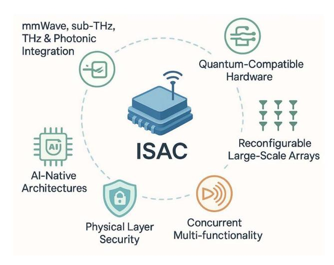

FIG. 22. Future research perspective for hardware ISAC developments.

in advanced packaging techniques, heterogeneous integration, and cost-effective phased-array fabrication is essential to drive widespread adoption of ISAC hardware across consumer and industrial sectors. Coupled with the emergence of edge computing and edge AI technologies, integrated wideband RF transceivers are poised to deliver chip-scale, intuitive radar sensing alongside seamless data communication. These next-generation ISAC platforms are expected to offer superior performance, lower costs, and ultracompact form factors [120].

As mentioned earlier, developing ISAC hardware requires careful component selection to reconcile the frequently conflicting demands of sensing and communication functions. This issue arises across all multiplexing schemes—time-division, frequency-division, and code-division—although TDM is generally somewhat easier to manage.

A clear example is the antenna design: radar applications often demand phased-array scanning or narrow-beam illumination, whereas communication typically requires broader or multisector beams—requirements that are difficult to satisfy simultaneously with a single antenna design. Similarly, the PA linearity requirements in the transmitter differ substantially between radar sensing and data communication operations.

Beyond these challenges, filtering requirements demand careful attention across the entire ISAC system. Effective filtering is critical to suppress interference between adjacent channels, especially in spectrally constrained environments. Filters must be seamlessly integrated into both the transmit and receive paths to preserve signal integrity for sensing while minimizing distortion and cross-interference with communication signals. Given the compactness and cost sensitivity of ISAC hardware, these filtering solutions often require innovative topologies, advanced materials, and novel integration techniques to satisfy stringent size and performance constraints.

#### **Interference Management**

The coexistence of sensing and communication within shared hardware introduces unique interference challenges, including SI between transmitted and received signals, mutual coupling in antenna arrays, and cross-talk across functional domains [121]. These interference sources degrade both radar detection accuracy and communication link quality, necessitating robust isolation and cancellation strategies.

Attractive IBFD-based ISAC systems face particularly stringent interference constraints, as they transmit and receive simultaneously on the same frequency. Achieving the required analog SIC—typically exceeding 55 dB—is extremely challenging [124]. Leakage and interference arise from the differing operational modes of the transmitter and receiver, resulting in distinct SIC requirements for communication and radar functions [122].

Recent efforts have integrated both active and passive SIC circuits into ISAC RF front-ends to mitigate leakage; however, attaining sufficient isolation at mmW and THz frequencies remains an open challenge [123]. A promising approach is set to combine antenna polarization diversity with controlled non-reciprocal signal propagation through dual-mode techniques, as demonstrated in [124]. Ultimately, balanced codevelopment of hardware and software solutions is essential for full-duplex ISAC systems. Advanced interference cancellation techniques and algorithms thus represent a vital pathway for effective interference management in ISAC hardware and software systems.

#### Scalability to Mass Markets

Transitioning ISAC hardware from research prototypes to scalable, commercially viable solutions requires overcoming challenges related to manufacturability, reliability, and standardization. Many existing ISAC implementations depend on customized components, specialized fabrication processes, or experimental integration techniques that are not easily compatible with high-volume production.

Although efforts to standardize ISAC operating modes, waveform formats, and testing methodologies are ongoing, the lack of industry-wide consensus remains a significant barrier to interoperability and certification across sectors [125]. Research into modular and reconfigurable ISAC hardware—capable of adapting to diverse regulatory and application requirements—holds promise for enhancing scalability by providing platform-level flexibility [126].

Moreover, ensuring reliability under environmental stressors such as temperature fluctuations, mechanical vibrations, and electromagnetic interference is critical for automotive, industrial, and aerospace ISAC deployments. To meet these stringent demands, accelerated lifetime testing and ruggedized packaging solutions will be essential, all while maintaining uncompromised system performance.

#### **Energy Efficiency**

Energy consumption is a critical constraint for ISAC hardware, especially in battery-powered or energy-harvesting applications such as AAVs, wearables, and sensor networks. Whenever possible, the deployment of low-power ISAC system architectures—such as the aforementioned linear interference

transceiver techniques—should be considered. While integrating sensing and communication functions into a shared platform can reduce redundant hardware and thus save energy, the demands of multifunctional operation often increase processing and transmission power requirements.

Recent developments—such as multifunctional receiver arrays that integrate WPT—demonstrate the potential for combining energy harvesting with sensing and communication within a unified hardware platform, advancing energy autonomy through ambient power harvesting [28]. Future research should focus on ultralow-power circuit design, energy-aware resource allocation, and hardware-level power gating techniques to further minimize ISAC energy consumption [123].

Additionally, emerging materials like 2-D semiconductors and novel device architectures such as tunnel field-effect transistors hold promise for enhancing energy efficiency in ISAC front-ends and baseband processors [126]. Exploring these innovations in the context of multifunctional ISAC operation represents a vital direction for future research.

# **Toward Cognitive ISAC Hardware**

Looking ahead, a transformative research frontier lies in the development of cognitive ISAC hardware—systems capable of autonomously adapting their operation in response to dynamic environmental conditions, application requirements, and spectral constraints. These intelligent platforms would seamlessly integrate reconfigurable front-ends, software-defined control planes, and AI-driven decision engines to dynamically allocate resources, switch operational modes, and jointly optimize sensing and communication performance in real time.

Initial progress toward cognitive ISAC has been demonstrated through adaptive beamforming, waveform selection, and hardware reconfiguration under software-defined control [127], [128], [129], [130]. However, extending such adaptability deeper into hardware layers—including tunable RF components, metamaterial-enabled apertures, and dynamically reconfigurable analog front-ends—remains a significant challenge. Achieving smooth, real-time coordination among hardware, firmware, and AI algorithms will require comprehensive codesign approaches spanning device, circuit, and system levels.

In summary, advancing ISAC hardware toward commercial viability and large-scale deployment necessitates interdisciplinary innovation addressing miniaturization, interference management, scalability, energy efficiency, and cognitive adaptability. Sustained progress across materials science, circuit design, system integration, and AI-driven control will be essential to unlock the full potential of ISAC as a foundational technology for next-generation wireless systems.

# **CONCLUSION AND REFLECTIONS**

ISAC represents a profound paradigm shift in wireless system design, heralding the emergence of multifunctional platforms that seamlessly integrate sensing operation and data communication within a unified hardware framework. This evolution has fundamentally transformed the landscape of communication

technologies, moving from traditionally separate radar and communication systems to JRC architectures, and now toward deeply integrated ISAC solutions. This progression has been driven by converging technological advances, regulatory demands, and the growing need for intelligent, versatile wireless applications.

This article provides a comprehensive review of ISAC transceiver technologies, tracing their historical development, defining core concepts, presenting classification frameworks, and surveying state-of-the-art architectures and enabling technologies. Emphasizing a hardware-centric viewpoint alongside software-hardware codesign, the review highlights innovations in antenna arrays, RF front-ends, transceiver architectures, and reconfigurable control mechanisms that enable multifunctional operation across sub-6 GHz, mmW, and THz frequency bands.

Key insights underscore hardware reuse and functional integration as pivotal factors shaping ISAC systems. Delivering high-performance sensing and communication on a shared platform demands meticulous codesign across antennas, circuits, and signal processing, balancing often conflicting requirements such as linearity, dynamic range, interference cancellation, isolation, beamforming, and energy efficiency. Recent prototypes—including antenna sharing schemes, virtual receiver matrices, multifunctional phased arrays, and integrated photonic-RF front-ends—demonstrate viable paths toward deeper hardware integration and tight hardware—software synergy.

Despite these advances, significant challenges remain, notably in interference management, power consumption reduction, miniaturization, and scalability for mass-market deployment. Addressing these issues calls for interdisciplinary collaboration spanning materials science, circuit and packaging design, and system-level cooptimization. A promising avenue for future research lies in cognitive ISAC hardware—leveraging software-defined control and AI-driven optimization to achieve autonomous adaptation and enhanced performance in dynamic environments. In particular, IBFD architectures readily offer a natural, low-latency, high-capacity ISAC solution by enabling simultaneous sensing and communication within the same frequency band, adaptable to diverse scenarios and applications.

As wireless technologies advance toward 6G and beyond, ISAC is poised to play a transformative role in enabling ubiquitous connectivity and enhanced situational awareness across automotive, aerial, industrial, and smart infrastructure domains. With multiband operation and spectrum agility, ISAC not only improves spectral and hardware efficiency but also lays the foundation for intelligent, context-aware wireless networks capable of dynamic environmental adaptation. Furthermore, emerging non-TEM mode waveguide ICs promise to transcend the fundamental limitations of traditional voltage—current-based IC architectures, delivering improved performance and reduced costs.

In conclusion, ISAC fundamentally blurs the traditional boundaries between sensing and communication, enabling multifunctional, adaptable, and highly efficient platforms for next-generation wireless technologies. Realizing its full potential demands sustained, cross-disciplinary research efforts to

transition from promising laboratory prototypes to scalable, robust, and transformative solutions deployed in real-world environments.

## **ACKNOWLEDGMENT**

The authors gratefully acknowledge the support of the Poly-Grames Research Center at Polytechnique Montréal for providing an exceptional research environment and the essential resources that made this work possible.

## **REFERENCES**

- [1] R. Du et al., "An overview on IEEE 802.11bf: WLAN sensing," IEEE Commun. Surveys Tuts., vol. 27, no. 1, pp. 184–217, Feb. 2025, doi: 10.1109/COMST.2024.3408899.
- [2] F. Liu, C. Masouros, A. P. Petropulu, H. Griffiths, and L. Hanzo, "Joint radar and communication design: Applications, state-of-the-art, and the road ahead," *IEEE Trans. Commun.*, vol. 68, no. 6, pp. 3834– 3862, Jun. 2020, doi: 10.1109/TCOMM.2020.2973976.
- [3] V. Shatov et al., "Joint radar and communications: Architectures, use cases, aspects of radio access, signal processing, and hardware," *IEEE Access*, vol. 12, pp. 47888–47914, 2024, doi: 10.1109/ACCESS.2024. 3383771
- [4] L. Zheng, M. Lops, Y. C. Eldar, and X. Wang, "Radar and communication coexistence: An overview—A review of recent methods," *IEEE Signal Process. Mag.*, vol. 36, no. 5, pp. 85–99, Sep. 2019, doi: 10.1109/MSP.2019.2907329.
- [5] S. Mazahir, S. Ahmed, and M.-S. Alouini, "A survey on joint communication-radar systems," *Front. Commun. Netw.*, vol. 1, Feb. 2021, Art. no. 619483, doi: 10.3389/frcmn.2020.619483.
- [6] R. Liu, M. Li, H. Luo, Q. Liu, and A. L. Swindlehurst, "Integrated sensing and communication with reconfigurable intelligent surfaces: Opportunities, applications, and future directions," *IEEE Wireless Commun.*, vol. 30, no. 1, pp. 50–57, Feb. 2023, doi: 10.1109/MWC. 002.2200206.
- [7] W. Jiang et al., "Terahertz communications and sensing for 6G and beyond: A comprehensive review," *IEEE Commun. Surveys Tuts.*, vol. 26, no. 4, pp. 2326–2381, 4th Quart. 2024, doi: 10.1109/COMST. 2024.3385908.
- [8] J. A. Zhang et al., "Enabling joint communication and radar sensing in mobile networks—A survey," *IEEE Commun. Surveys Tuts.*, vol. 24, no. 1, pp. 306–345, 1st Quart. 2022, doi: 10.1109/COMST.2021. 3122519.
- [9] F. Liu et al., "Integrated sensing and communications: Toward dualfunctional wireless networks for 6G and beyond," *IEEE J. Sel. Areas Commun.*, vol. 40, no. 6, pp. 1728–1767, Jun. 2022, doi: 10.1109/ JSAC.2022.3156632.
- [10] K. Meng et al., "UAV-enabled integrated sensing and communication: Opportunities and challenges," *IEEE Wireless Commun.*, vol. 31, no. 2, pp. 97–104, Apr. 2024, doi: 10.1109/MWC.131.2200442.
- [11] Z. Liu et al., "Integrated sensing and edge AI: Realizing intelligent perception in 6G," *IEEE Commun. Surveys Tuts.*, early access, Jul. 2025, doi: 10.1109/COMST.2025.3592989.
- [12] S. N. Nallandhigal, P. Burasa, and K. Wu, "Deep integration and topological cohabitation of active circuits and antennas for power amplification and radiation in standard CMOS," *IEEE Trans. Microw. Theory Techn.*, vol. 68, no. 10, pp. 4405–4423, Oct. 2020, doi: 10.1109/TMTT.2020.2997049.
- [13] P. Burasa, T. Djerafi, N. G. Constantin, and K. Wu, "On-chip dual-band rectangular slot antenna for single-chip millimeter-wave identification tag in standard CMOS technology," *IEEE Trans. Antennas Propag.*, vol. 65, no. 8, pp. 3858–3868, Aug. 2017, doi: 10.1109/TAP. 2017.2710215.
- [14] K. Wu, "MHz-through-THz (MTT) challenges and opportunities [President's column]," *IEEE Microw. Mag.*, vol. 17, no. 2, pp. 8–10, Feb. 2016, doi: 10.1109/MMM.2015.2501159.
- [15] T. Micallef, I. Hussain, and K. Wu, "Multifunction transceiver for data communication, radar sensing and power transfer," *Electromagn. Sci.*, vol. 3, no. 2, 2025, Art. no. 0100491, doi: 10.23919/emsci.0024.0049.

- [16] P. Burasa, T. Djerafi, N. G. Constantin, and K. Wu, "High-data-rate single-chip battery-free active millimeter-wave identification tag in 65-nm CMOS technology," *IEEE Trans. Microw. Theory Techn.*, vol. 64, no. 7, pp. 2294–2303, Jul. 2016, doi: 10.1109/TMTT.2016. 2575826.
- [17] P. Burasa, N. G. Constantin, and K. Wu, "High-efficiency wideband rectifier for single-chip batteryless active millimeter-wave identification (MMID) tag in 65-nm bulk CMOS technology," *IEEE Trans. Microw. Theory Techn.*, vol. 62, no. 4, pp. 1005–1011, Apr. 2014, doi: 10.1109/ TMTT.2014.2305136.
- [18] L. Han and K. Wu, "Multifunctional transceiver for future intelligent transportation systems," *IEEE Trans. Microw. Theory Techn.*, vol. 59, no. 7, pp. 1879–1892, Jul. 2011, doi: 10.1109/TMTT.2011.2138156.
- [19] L. Han and K. Wu, "24-GHz integrated radio and radar system capable of time-agile wireless communication and sensing," *IEEE Trans. Microw. Theory Techn.*, vol. 60, no. 3, pp. 619–631, Mar. 2012, doi: 10.1109/TMTT.2011.2179552.
- [20] N.-S. Kim and J. M. Rabaey, "A high data-rate energy-efficient triple-channel UWB-based cognitive radio," *IEEE J. Solid-State Circuits*, vol. 51, no. 4, pp. 809–820, Apr. 2016, doi: 10.1109/JSSC.2015.2512934.
- [21] J. Moghaddasi and K. Wu, "Multifunctional transceiver for future radar sensing and radio communicating data-fusion platform," *IEEE Access*, vol. 4, pp. 818–838, 2016, doi: 10.1109/ACCESS.2016.2530979.
- [22] A. Hanif, S. Ahmed, M.-S. Alouini, and T. Y. Al-Naffouri, "Exploring the synergy: A review of dual-functional radar communication systems," *IEEE Aerosp. Electron. Syst. Mag.*, early access, Mar. 2025, doi: 10.1109/MAES.2025.3551690.
- [23] Z. Zhang, Y. Li, K. Mouthaan, and Y. Lian, "A miniature mode reconfigurable inductorless IR-UWB transmitter–receiver for wireless short-range communication and vital-sign sensing," *IEEE J. Emerg. Sel. Topics Circuits Syst.*, vol. 8, no. 2, pp. 294–305, Jun. 2018, doi: 10.1109/JETCAS.2018.2799930.
- [24] P. Burasa, B. Mnasri, and K. Wu, "Millimeter-wave CMOS sourceless receiver architecture for 5G-served ultra-low-power sensing and communication systems," *IEEE Trans. Microw. Theory Techn.*, vol. 67, no. 5, pp. 1688–1696, May 2019, doi: 10.1109/TMTT.2019.2903051.
- [25] W. Deng et al., "A D-band joint radar-communication CMOS transceiver," *IEEE J. Solid-State Circuits*, vol. 58, no. 2, pp. 411– 426, Feb. 2023.
- [26] S. A. Keivaan, P. Burasa, and K. Wu, "Virtual receiver matrix and combinatory analog operations for future multifunction reconfigurable sensing and communication wireless systems," *IEEE Trans. Microw. Theory Techn.*, vol. 71, no. 1, pp. 424–433, Jan. 2023, doi: 10.1109/ TMTT 2022 3228947
- [27] F. Zhao et al., "A Ka-band 4TX/4RX dual-stream joint radar-communication phased-array CMOS transceiver," *IEEE Trans. Microw. Theory Techn.*, vol. 72, no. 3, pp. 1993–2008, Mar. 2024.
- [28] J. Deng, P. Burasa, S. A. Keivaan, and K. Wu, "Waveguide receiver array for joint communication, sensing, and power transfer systems," *IEEE Trans. Microw. Theory Techn.*, vol. 73, no. 7, pp. 4204–4217, Jul. 2025, doi: 10.1109/TMTT.2024.3505842.
- [29] J. Deng, P. Burasa, and K. Wu, "Joint multiband linear interferometric receiver for integrated microwave and terahertz sensing and communication systems," *IEEE Trans. Microw. Theory Techn.*, vol. 72, no. 9, pp. 5550–5562, Sep. 2024, doi: 10.1109/TMTT.2024.3363173.
- [30] Z. Liu, E. A. Karahan, and K. Sengupta, "A 36–91 GHz broadband beamforming transmitter architecture with phase error between 1.2°–2.8° for joint communication and sensing," *IEEE Trans. Microw. Theory Techn.*, vol. 72, no. 1, pp. 589–605, Jan. 2024.
- [31] S. A. Keivaan, P. Burasa, and K. Wu, "Joint 4D radar and communication system enabled by virtual transceiver matrix architecture for advanced automotive sensing and connectivity," in *Proc. IEEE/MTT-S Int. Microw. Symp. (IMS)*, San Francisco, CA, USA, 2025, pp. 97–100.
- [32] L. Lu et al., "Design of a 60-GHz joint radar–communication transceiver with a highly reused architecture utilizing reconfigurable dual-mode Gilbert cells," *IEEE Trans. Microw. Theory Techn.*, vol. 73, no. 1, pp. 245–257, Jan. 2025.
- [33] S. A. Keivaan, P. Burasa, J. Deng, and K. Wu, "Concurrent detection of 2-D angle-of-arrival and polarization enabled by virtual transceiver matrix architecture," *IEEE Trans. Microw. Theory Techn.*, vol. 73, no. 9, pp. 6863–6878, Sep. 2025, doi: 10.1109/TMTT.2025.3550089.

- [34] P. Burasa, J. Deng, and K. Wu, "A 300-GHz dual-polarized CMOS waveguide receiver for high-density terahertz integrated multichannel wireless systems-on-chip," IEEE Trans. Microw. Theory Techn., vol. 73, no. 5, pp. 3044–3058, May 2025, doi: [10.1109/TMTT.2024.](http://dx.doi.org/10.1109/TMTT.2024.3487519) [3487519.](http://dx.doi.org/10.1109/TMTT.2024.3487519)
- [35] T. Wild et al., "6G integrated sensing and communication: From vision to realization," in Proc. Eur. Radar Conf. (EuRAD), Berlin, Germany, 2023, pp. 355–358, doi: [10.23919/EuRAD58043.2023.](http://dx.doi.org/10.23919/EuRAD58043.2023.10289474) [10289474.](http://dx.doi.org/10.23919/EuRAD58043.2023.10289474)
- [36] A. Kaushik et al., "Towards integrated sensing and communications for 6G: A standardization perspective," 2023, arXiv:2308.01227.
- [37] Marconi Company, "A study of the U.K. ground radar air defence system and associated radio systems," conducted under the chairmanship of Dr. E. Eastwood for the U.K. Air Ministry, Apr. 1948.
- [38] U.K. Air Ministry, Radar Volume III: Radio Aids to Navigation and the Landing of Aircraft, AP1093C, London, U.K., 1948.
- [39] R. Cager, D. LaFlame, and L. Parode, "Orbiter Ku-band integrated radar and communications subsystem," IEEE Trans. Commun., vol. 26, no. 11, pp. 1604–1619, Nov. 1978, doi: [10.1109/TCOM.1978.](http://dx.doi.org/10.1109/TCOM.1978.1094004) [1094004.](http://dx.doi.org/10.1109/TCOM.1978.1094004)
- [40] B. V. Bowden, "The story of IFF (identification friend or foe)," IEE Proc. A, vol. 132, no. 7, pp. 435–447, Oct. 1985, doi: [10.1049/ip-a-1.](http://dx.doi.org/10.1049/ip-a-1.1985.0079) [1985.0079.](http://dx.doi.org/10.1049/ip-a-1.1985.0079)
- [41] K. E. Kolodziej et al., "Phased array architecture enabling scalable integrated sensing and communication," in Proc. IEEE Radar Conf. (RadarConf), San Antonio, TX, USA, May 2023, pp. 1–6.
- [42] C. D. Ozkaptan, H. Zhu, E. Ekici, and O. Altintas, "Software-defined MIMO OFDM joint radar-communication platform with fully digital mmWave architecture," in Proc. IEEE Int. Symp. Joint Commun. Sens. (JC&S), Mar. 2023, pp. 1–6.
- [43] H. Wang, H. Tao, L. Shi, and W. Li, "Integrated radar-communication waveform design for multitransmit in clutter," IEEE Trans. Aerosp. Electron. Syst., vol. 61, no. 3, pp. 6252–6264, Jun. 2025, doi: [10.](http://dx.doi.org/10.1109/TAES.2024.3525450) [1109/TAES.2024.3525450](http://dx.doi.org/10.1109/TAES.2024.3525450).
- [44] DARPA, "Shared spectrum access for radar and communications (SSPARC)," U.S. Defense Adv. ResProjects Agency, 2014. Accessed: Jun. 28, 2025. [Online]. Available: [https://www.darpa.mil/](https://www.darpa.mil/research/programs/shared-spectrum-access-for-radar-and-communications) [research/programs/shared-spectrum-access-for-radar-and-communications](https://www.darpa.mil/research/programs/shared-spectrum-access-for-radar-and-communications)
- [45] B. Liu, J. Wu, Q. Zhang, and H. Wong, "An integrated sensing and communication architecture using reconfigurable intelligent surfaces for 6G wireless networks," in 15th Global Symp. Millimeter-Waves Terahertz (GSMM), Hong Kong, 2024, pp. 42–44, doi: [10.1109/](http://dx.doi.org/10.1109/GSMM61775.2024.10553124) [GSMM61775.2024.10553124](http://dx.doi.org/10.1109/GSMM61775.2024.10553124).
- [46] R. S. P. Sankar, S. P. Chepuri, and Y. C. Eldar, "Beamforming in integrated sensing and communication systems with reconfigurable intelligent surfaces," IEEE Trans. Wireless Commun., vol. 23, no. 5, pp. 4017–4031, May 2024, doi: [10.1109/TWC.2023.3313938.](http://dx.doi.org/10.1109/TWC.2023.3313938)
- [47] T. Xu, F. Liu, C. Masouros, and I. Darwazeh, "An experimental proof of concept for integrated sensing and communications waveform design," IEEE Open J. Commun. Soc., vol. 3, pp. 1643–1655, 2022, doi: [10.1109/OJCOMS.2022.3209641](http://dx.doi.org/10.1109/OJCOMS.2022.3209641).
- [48] L. Han and K. Wu, "Joint wireless communication and radar sensing systems—State of the art and future prospects," IET Microw., Antennas Propag., vol. 7, no. 11, pp. 876–885, 2013.
- [49] M. P. Fitz, T. R. Halford, T. Hossain, and S. W. Enserink, "Towards simultaneous radar and spectral sensing," in Proc. IEEE Int. Symp. Dynamic Spectr. Access Netw. (DySPAN), SSPARC Workshop, 2014, pp. 15–19.
- [50] L. Han and K. Wu, "Emerging advances in transceiver technology fusion of wireless communication and radar sensing systems," in Proc. Asia–Pacific Microw. Conf. (APMC), Melbourne, VIC, Australia, Dec. 2011, pp. 951–954.
- [51] L. Han and K. Wu, "Radar and radio data fusion platform for future intelligent transportation system," in Proc. Eur. Microw. Conf. (EuMC) Proc. Eur. Radar Conf. (EuRAD), Paris, France, Sep./Oct. 2010, pp. 65–68.
- [52] Y. L. Sit, C. Sturm, L. Reichardt, T. Zwick, and W. Wiesbeck, "The OFDM joint radar-communication system: An overview," in Proc. Int. Conf. Adv. Satell. Space Commun., 2011, pp. 69–74.
- [53] Y. Bigdeli, P. Burasa, and K. Wu, "Extending the dynamic range of square-law power detectors for large-scale receiver arrays," IEEE Microw. Wireless Technol. Lett., vol. 35, no. 8, pp. 1226–1229, Aug. 2025.

- [54] Q. Zhou, K.-Y. Wong, W. Chen, and K. J. Chen, "Wide-dynamicrange zero-bias microwave detector using AlGaN/GaN heterojunction field-effect diode," IEEE Microw. Wireless Compon. Lett., vol. 20, no. 5, pp. 277–279, May 2010.
- [55] S. Clochiatti et al., "Low-noise resonant tunneling diode terahertz detector," IEEE Trans. THz Sci. Technol., vol. 15, no. 1, pp. 107–119, Jan. 2025.
- [56] K. Kim et al., "A 50-Gb/s compact RadCom E-band transmitter with phase-controlled push–push quadrupler and stacked-FET power amplifier," IEEE Solid-State Circuits Lett., vol. 4, pp. 150–153, 2021.
- [57] J. Bott, F. Vogelsang, and N. Pohl, "A D-band phased-array chain based on a tunable branchline coupler and a digitally controlled vector modulator," IEEE J. Microw., vol. 4, no. 1, pp. 101–110, Jan. 2024.
- [58] I. Hussain and K. Wu, "Cooperative interferometric receiver with time-agile radar sensing and radio communication capability," IEEE Sens. J., vol. 22, no. 24, pp. 23896–23905, Dec. 2022.
- [59] Y. Yu, L. Yu, R. Liu, X.-W. Zhu, P. Chen, and C. Yu, "Digital predistortion of millimeter-wave GaN power amplifiers for 6G integrated communication, sensing, and power transfer scenarios," IEEE Trans. Microw. Theory Techn., vol. 73, no. 1, pp. 26–37, Jan. 2025.
- [60] I. Cnaan-On, S. J. Thomas, J. L. Krolik, and M. S. Reynolds, "Multichannel backscatter communication and ranging for distributed sensing with an FMCW radar," IEEE Trans. Microw. Theory Techn., vol. 63, no. 7, pp. 2375–2383, Jul. 2015.
- [61] B. Zhu et al., "A digital-intensive 1TX/2RX IEEE 802.15.4/4zcompliant joint-radar-communication-location transceiver SoC," IEEE J. Solid-State Circuits, vol. 60, no. 3, pp. 1014–1029, Mar. 2025.
- [62] F. Zhao et al., "A 29-to-36 GHz 4TX/4RX dual-stream phased-array joint radar-communication CMOS transceiver supporting centimeterlevel 2D imaging and 64-QAM OTA wireless link," in Proc. IEEE Radio Freq. Integr. Circuits Symp. (RFIC), Denver, CO, USA, Jun. 2022, pp. 131–134.
- [63] S. Lee et al., "An E-band CMOS direct conversion IQ transmitter for radar and communication applications," in Proc. IEEE Radio Freq. Integr. Circuits Symp. (RFIC), Denver, CO, USA, Jun. 2022, pp. 111–114.
- [64] Z. Lyu et al., "Radar-centric photonic terahertz integrated sensing and communication system based on LFM-PSK waveform," IEEE Trans. Microw. Theory Techn., vol. 71, no. 11, pp. 5019–5027, Nov. 2023.
- [65] J. Deng, P. Burasa, and K. Wu, "All-in-one dual-polarization waveguide receiver for multichannel wireless systems," IEEE Trans. Microw. Theory Techn., vol. 72, no. 8, pp. 4998–5013, Aug. 2024.
- [66] Y. Bigdeli, P. Burasa, and K. Wu, "Quadrature harmonic selfoscillating mixer: Toward large array multifunction receiver systems," IEEE Trans. Microw. Theory Techn., vol. 72, no. 12, pp. 7061–7070, Dec. 2024.
- [67] Y. Bigdeli, P. Burasa, and K. Wu, "Quadrature harmonic selfoscillating mixer for multifunction wireless communication and sensing systems," in Proc. IEEE/MTT-S Int. Microw. Symp. (IMS), Denver, CO, USA, 2022, pp. 402–405.
- [68] Y. Bigdeli, S. A. Keivaan, P. Burasa, and K. Wu, "Towards the development of large-scale multifunction array transceiver systems," in Proc. Asia–Pacific Microw. Conf. (APMC), Taipei, Taiwan, 2023, pp. 890–892.
- [69] Y. Bigdeli, P. Burasa, and K. Wu, "Compact harmonic transmitter and receiver architectures for multifunction wireless systems," in Proc. Eur. Microw. Conf. (EuMC), Milan, Italy, 2022, pp. 796–799.
- [70] J. Qian, F. Tian, Y. Zhang, and A. Jiang, "Joint design for cooperative radar and communication systems in multi-target optimization," IEEE Trans. Circuits Syst. II, Exp. Briefs, vol. 69, no. 2, pp. 614–618, Feb. 2022.
- [71] S. A. Keivaan, P. Burasa, and K. Wu, "Virtual receiver matrix for multifunction communication and sensing wireless systems using simultaneous incident waves at the same carrier frequency," in Proc. IEEE/MTT-S Int. Microw. Symp. (IMS), San Diego, CA, USA, 2023, pp. 1176–1179.
- [72] P. Burasa, B. Mnasri, and K. Wu, "A sourceless low-power mmW receiver architecture using self-oscillating mixer array in 65-nm CMOS," in Proc. IEEE Wireless Power Transfer Conf. (WPTC), Montreal, QC, Canada, 2018, pp. 1–3.

- [73] M. R. A. Khandaker, K. K. Wong, Y. Y. Zhang, and Z. Zheng, "Probabilistically robust SWIPT for secrecy MISOME systems," *IEEE Trans. Inf. Forensics Secur.*, vol. 12, no. 1, pp. 211–226, Jan. 2017.
- [74] T. M. Hoang, L. T. T. Huyen, X. N. Tran, and P. T. Hiep, "Outage probability of aerial base station NOMA MIMO wireless communication with RF energy harvesting," *IEEE Internet Things J.*, vol. 9, no. 22, pp. 22874–22886, Nov. 2022.
- [75] B. Li, M. Y. Zhang, H. Y. Cao, Y. Rong, and Z. Han, "Transceiver design for AF MIMO relay systems with a power splitting based energy harvesting relay node," *IEEE Trans. Veh. Technol.*, vol. 69, no. 3, pp. 2376–2388, Mar. 2020.
- [76] Y. Z. Zhao, Y. L. Wu, J. Hu, and K. Yang, "Time-index modulation for integrated data and energy transfer: A remedy for time switching," *IEEE Wireless Commun. Lett.*, vol. 11, no. 9, pp. 1815–1819, Sep. 2022.
- [77] I. Hussain and K. Wu, "Low-power receiver architecture for 5G and IoT-oriented wireless information and power transfer applications," in *Proc. IEEE/MTT-S Int. Microw. Symp. (IMS)*, Boston, MA, USA, 2019, pp. 1148–1151.
- [78] D. Rodriguez, A. Flores, and C. Z. Li, "Self-powered 24-GHz Doppler radar for building entrance monitoring using cross correlation and envelope detection," in *Proc. IEEE Topical Conf. Wireless Sensors Sensor Netw. (WiSNet)*, Orlando, FL, USA, 2019, pp. 1–4.
- [79] I. Hussain and K. Wu, "Power-recycling microwave mixer with wide linear instantaneous bandwidth," *IEEE Microw. Wireless Compon. Lett.*, vol. 30, no. 4, pp. 425–428, Apr. 2020.
- [80] Y.-N. Chen, C. Ding, H. Zhu, and Y. Liu, "A ±45°-polarized antenna system with four isolated channels for in-band full-duplex (IBFD)," *IEEE Trans. Antennas Propag.*, vol. 71, no. 4, pp. 3000– 3010, Apr. 2023. doi: 10.1109/TAP.2023.3241339.
- [81] H. Fan et al., "A wideband, high isolation, shared-aperture MIMO IBFD front end with CMS balun and fewer multitap cancellers," *IEEE Trans. Microw. Theory Techn.*, vol. 73, no. 9, pp. 6918–6930, Sep. 2025.
- [82] M. Ayebe, R. Maaskant, S. E. Gunnarson, J. Malmström, M. Ivashina, and H. Holter, "Joint Tx-Rx beamforming for optimal gain and self-interference mitigation in in-band full-duplex arrays: Theory, figures of merit, and validation," *IEEE Antennas Wireless Propag. Lett.*, vol. 24, no. 6, pp. 1317–1321, Jun. 2025.
- [83] K. E. Kolodziej, B. T. Perry, and J. S. Herd, "In-band full-duplex technology: Techniques and systems survey," *IEEE Trans. Microw. Theory Techn.*, vol. 67, no. 7, pp. 3025–3041, Jul. 2019.
- [84] C. Du et al., "A full-duplex based integrated sensing and communication survey: Principles, key techniques, and receiver design," *IEEE Commun. Surveys Tuts.*, early access, Jun. 2025, doi: 10.1109/COMST.2025.3582948.
- [85] S. Aldirmaz-Colak et al., "A comprehensive review on ISAC for 6G: Enabling technologies, security, and AI/ML perspectives," *IEEE Access*, vol. 13, pp. 97152–97193, 2025, doi: 10.1109/ACCESS. 2025.3573371.
- [86] D. Kissinger, G. Kahmen, and R. Weigel, "Millimeter-wave and terahertz transceivers in SiGe BiCMOS technologies," *IEEE Trans. Microw. Theory Techn.*, vol. 69, no. 10, pp. 4541–4560, Oct. 2021.
- [87] R. Nikandish, "GaN system-on-chip: Pushing the limits of integration and functionality," *IEEE J. Microw.*, vol. 4, no. 4, pp. 594–604, Oct. 2024.
- [88] S. Razavian and A. Babakhani, "Silicon integrated THz comb radiator and receiver for broadband sensing and imaging applications," *IEEE Trans. Microw. Theory Techn.*, vol. 69, no. 11, pp. 4937–4950, Nov. 2021.
- [89] S. Jia et al., "A unified system with integrated generation of high-speed communication and high-resolution sensing signals based on THz photonics," *J. Lightw. Technol.*, vol. 36, no. 19, pp. 4549–4556, Oct. 2018.
- [90] H. Zhang, H. Zhang, B. Di, and L. Song, "Holographic integrated sensing and communications: Principles, technology, and implementation," *IEEE Commun. Mag.*, vol. 61, no. 5, pp. 83–89, May 2023.
- [91] H. Tataria, M. Shafi, A. F. Molisch, M. Dohler, H. Sjöland, and F. Tufvesson, "Seven defining features of terahertz (THz) wireless systems: A fellowship of communication and sensing," *IEEE Commun. Surveys Tuts.*, vol. 24, no. 2, pp. 970–1018, 2nd Quart. 2022.
- [92] M. Braun, C. Sturm, A. Niethammer, and F. K. Jondral, "Parametrization of joint OFDM-based radar and communication

- systems for vehicular applications," in *Proc. IEEE Int. Symp. Pers., Indoor Mobile Radio Commun. (PIMRC)*, Tokyo, Japan, 2009, pp. 3020–3024.
- [93] C. Sturm, E. Pancera, T. Zwick, and W. Wiesbeck, "A novel approach to OFDM radar processing," in *Proc. IEEE Radar Conf.*, Pasadena, CA, USA, 2009, pp. 1–4.
- [94] F. Zhang, Z. Zhang, W. Yu, and T.-K. Truong, "Joint range and velocity estimation with intrapulse and intersubcarrier Doppler effects for OFDM-based RadCom systems," *IEEE Trans. Signal Process.*, vol. 68, pp. 662–675, 2020.
- [95] F. Probst, A. Engelmann, P. Hetterle, V. Issakov, R. Weigel, and M. Dietz, "A 15-Gb/s PMCW radar PRBS-generator for MIMO and joint radar-communication systems," in *Proc. Asia–Pacific Microw. Conf. (APMC)*, Dec. 2022, pp. 288–290.
- [96] T.-Y. Huang, B. Lin, N. S. Mannem, B. Abdelaziz, and H. Wang, "A time-modulated concurrent steerable multibeam MIMO receiver array with spectral-spatial mapping using one beamformer and single wire interface," *IEEE J. Solid-State Circuits*, vol. 58, no. 5, pp. 1228– 1240, May 2023.
- [97] J. Qian, M. Lops, L. Zheng, X. Wang, and Z. He, "Joint transceiver design for radar-communication spectral sharing systems by minimizing effective interference power," *IEEE Trans. Signal Process.*, vol. 66, no. 13, pp. 3504–3519, Jul. 2018.
- [98] B. Lin, T.-Y. Huang, A. Ahmed, M.-Y. Huang, and H. Wang, "A 23–37-GHz autonomous 2-D MIMO receiver array with rapid full-FoV spatial filtering for unknown interference suppression," *IEEE Trans. Microw. Theory Techn.*, vol. 71, no. 11, pp. 4841–4854, Nov. 2023.
- [99] I. Nasr et al., "A highly integrated 60-GHz 6-channel transceiver with antenna-in-package for smart sensing and short-range communications," *IEEE J. Solid-State Circuits*, vol. 51, no. 9, pp. 2066–2076, Sep. 2016.
- [100] C.-H. Li, K.-D. Huang, and T.-Y. Chiu, "A highly-integrated reconfigurable Ka-band receiver supporting active and passive detections in a 90-nm CMOS technology," *IEEE Access*, vol. 9, pp. 38342–38351, 2021.
- [101] W. A. Ahmad, M. Kucharski, H. J. Ng, and D. Kissinger, "BiCMOS IQ transceiver with array-on-chip for D-band joint radar-communication applications," in *Proc. IEEE Top. Meeting Silicon Monolithic Integr. RF Syst. (SiRF)*, Las Vegas, NV, USA, Jan. 2022, pp. 78–80.
- [102] N. S. Mannem, E. Erfani, T.-Y. Huang, and H. Wang, "A mm-wave frequency-modulated transmitter array for superior resolution in angular localization supporting low-latency joint communication and sensing," *IEEE J. Solid-State Circuits*, vol. 58, no. 6, pp. 1572–1585, Jun. 2023.
- [103] N. S. Mannem, J. Park, E. Erfani, E. Liu, J. Lee, and H. Wang, "A reconfigurable phase-time array transmitter achieving key-less secured transmission and multi-receiver localization for low-latency joint communication and sensing," *IEEE J. Solid-State Circuits*, vol. 58, no. 7, pp. 1898–1912, Jul. 2023.
- [104] S. George et al., "Over-the-air 26 GHz receiver hardware-software evaluation towards joint communication and radar sensing," in *Proc. Eur. Microw. Conf. (EuMC)*, Paris, France, Sep. 2024, pp. 509–512.
- [105] D. Wen, Y. Zhou, X. Li, Y. Shi, K. Huang, and K. B. Letaief, "A survey on integrated sensing, communication, and computation," *IEEE Commun. Surveys Tuts.*, early access, Dec. 2024, doi: 10.1109/ COMST.2024.3521498.
- [106] S. Lu et al., "Integrated sensing and communications: Recent advances and ten open challenges," *IEEE Internet Things J.*, vol. 11, no. 11, pp. 19094–19120, Jun. 2024.
- [107] N. González-Prelcic et al., "The integrated sensing and communication revolution for 6G: Vision, techniques, and applications," *Proc. IEEE*, vol. 112, no. 7, pp. 676–723, Jul. 2024.
- [108] X. Cheng, D. Duan, S. Gao, and L. Yang, "Integrated sensing and communications (ISAC) for vehicular communication networks (VCN)," *IEEE Internet Things J.*, vol. 9, no. 23, pp. 23441–23451, Dec. 2022.
- [109] J. Mu, R. Zhang, Y. Cui, N. Gao, and X. Jing, "UAV meets integrated sensing and communication: Challenges and future directions," *IEEE Commun. Mag.*, vol. 61, no. 5, pp. 62–67, May 2023.
- [110] Z. Lyu, G. Zhu, and J. Xu, "Joint maneuver and beamforming design for UAV-enabled integrated sensing and communication," *IEEE Trans. Wireless Commun.*, vol. 22, no. 4, pp. 2424–2440, Apr. 2022.

- [111] X. Jing, F. Liu, C. Masouros, and Y. Zeng, "ISAC from the sky: UAV trajectory design for joint communication and target localization," 2022, arXiv:2207.02904.
- [112] W. Zhou, R. Zhang, G. Chen, and W. Wu, "Integrated sensing and communication waveform design: A survey," *IEEE Open J. Commun. Soc.*, vol. 3, pp. 1930–1949, 2022, doi: 10.1109/OJCOMS.2022.3215683.
- [113] N. González-Prelcic, D. Tagliaferri, M. F. Keskin, H. Wymeersch, and L. Song, "Six integration avenues for ISAC in 6G and beyond: A forward-looking vision," *IEEE Veh. Technol. Mag.*, vol. 20, no. 1, pp. 18–39, Mar. 2025.
  [114] Z. Fang et al., "A silicon-based radio platform for integrated edge
- [114] Z. Fang et al., "A silicon-based radio platform for integrated edge sensing and communication toward sustainable healthcare," *IEEE Trans. Microw. Theory Techn.*, vol. 71, no. 3, pp. 1296–1311, Mar. 2023.
- [115] X. Gao et al., "Towards converged millimeter-wave/terahertz wireless communication and radar sensing," ZTE Commun., vol. 18, no. 1, pp. 73–82, 2020.
- [116] J. Wang, X.-D. Liang, L.-Y. Chen, L.-N. Wang, and K. Li, "First demonstration of joint wireless communication and high-resolution SAR imaging using airborne MIMO radar system," *IEEE Trans. Geosci. Remote Sens.*, vol. 57, no. 9, pp. 6619–6632, Sep. 2019, doi: 10.1109/TGRS.2019.2907561.
- [117] K.-S. Choi, B. A. Abdelmagid, Y. Liu, and H. Wang, "A D-band concurrent 20-beam MIMO transmitter array with a four-element joint static/dynamic beam-multiplication beamformer," *IEEE J. Solid-State Circuits*, vol. 60, no. 6, pp. 1906–1920, Jun. 2025, doi: 10.1109/JSSC. 2024.3487619.
- [118] H. Wymeersch et al., "Integration of communication and sensing in 6G: A joint industrial and academic perspective," in *Proc. IEEE Int. Symp. Pers., Indoor Mobile Radio Commun. (PIMRC)*, Sep. 2021, pp. 1–7.
- [119] Z. Feng, Z. Fang, Z. Wei, X. Chen, Z. Quan, and D. Ji, "Joint radar and communication: A survey," *China Commun.*, vol. 17, no. 1, pp. 1–27. Jan. 2020.
- [120] Z. Fang et al., "Integrated wideband chip-scale RF transceivers for radar sensing and UWB communications: A survey," *IEEE Circuits Syst. Mag.*, vol. 22, no. 1, pp. 40–76, 1st Quart. 2022.
- [121] M. Chafii, L. Bariah, S. Muhaidat, and M. Debbah, "Twelve scientific challenges for 6G: Rethinking the foundations of communications theory," *IEEE Commun. Surveys Tuts.*, vol. 25, no. 2, pp. 868–904, 2nd Quart. 2023.
- [122] M. Banafaa et al., "6G mobile communication technology: Requirements, targets, applications, challenges, advantages, and opportunities," *Alexandria Eng. J.*, vol. 64, pp. 245–274, Feb. 2023.
- [123] P. Sen, A. Harutyunyan, M. Umar, and S. Kamal, "Joint communication and radar sensing: RF hardware opportunities and challenges—A circuits and systems perspective," *Sensors*, vol. 23, no. 18, 2023, Art. no. 7673.
- [124] A. Afshani and K. Wu, "Combining polarization-division multiplexing and ferromagnetic nonreciprocity to achieve in-band ultra-high isolation for full-duplex wireless systems," *Engineering*, vol. 40, pp. 179–187, Sep. 2024.
- [125] J. Wang, N. Varshney, C. Gentile, S. Blandino, J. Chuang, and N. Golmie, "Integrated sensing and communication: Enabling techniques, applications, tools and data sets, standardization, and future directions," *IEEE Internet Things J.*, vol. 9, no. 23, pp. 23416–23440, Dec. 2022.
- [126] X. Zhu et al., "Enabling intelligent connectivity: A survey of secure ISAC in 6G networks," *IEEE Commun. Surveys Tuts.*, vol. 27, no. 2, pp. 748–781, Apr. 2025.
- [127] P. Sen, F. Bozorgi, A. Harutyunyan, A. Noll Barreto, A. Nimr, and G. Fettweis, "RF front-ends for ISAC—design challenges and potential solutions," in *Integrated Sensing and Communications*. Berlin, Germany: Springer, 2023, pp. 507–535.
- [128] A. Aubry, A. De Maio, M. Piezzo, M. Naghsh, M. Soltananian, and S. Petre, "Cognitive radar waveform design for spectral coexistence in signal-dependent interference," in *Proc. IEEE Radar Conf.*, 2014, pp. 474–478.
- [129] M. Piezzo, A. De Maio, A. Aubry, and A. Farina, "Cognitive radar waveform design for spectral coexistence," in *Proc. IEEE Radar Conf.*, 2013, pp. 1–4, doi: 10.1109/RADAR.2013.6586024.
- [130] Y. Noam and A. J. Goldsmith, "Blind null-space learning for MIMO underlay cognitive radio with primary user interference adaptation," *IEEE Trans. Wireless Commun.*, vol. 12, no. 4, pp. 1722–1734, Apr. 2013

**Ke Wu** (Fellow, IEEE) received the B.Sc.(Hons.) degree in radio engineering from Nanjing Institute of Technology (now Southeast University), Nanjing, China, in 1982, and the D.E.A.(Hons.) and Ph.D.(Hons.) degrees in optics, optoelectronics, and MW engineering from the Institut National Polytechnique de Grenoble (INPG) and the University of Grenoble, Grenoble, France, in 1984 and 1987, respectively.

He is currently a Professor of Electrical Engineering and the Industrial Research Chair of Future

Wireless Technologies with the Polytechnique Montréal, University of Montreal, Montreal, QC, Canada, where he was the Director of the Poly-Grames Research Center from 1998 to 2024. He was the Founding Director of the Center for Radio Frequency Electronics Research of Quebec (Regroupement strategique of FRQNT) and the Canada Research Chair of RF and millimeter-wave engineering. He has (co)authored over 1500 referred articles and numerous books/book chapters and filed over 90 patents. His research interests include substrate integration technologies, antenna arrays, field theory and joint field/circuit modeling, ultrafast guided-wave electronics, wireless power transfer and harvesting, MW photonics, and MHz-through-THz technologies and transceivers, including RFICs/MMICs for joint radar/communication architectures, innovative multifunction wireless systems, and biomedical applications.

Dr. Wu is a fellow of the Canadian Academy of Engineering, the Academy of Science of the Royal Society of Canada, and the German National Academy of Science and Engineering (acatech). He is a member of the Electromagnetics Academy, URSI, and IEEE-Eta Kappa Nu (IEEE-HKN). He was a recipient of many awards and prizes including the inaugural IEEE MTT-S Outstanding Young Engineer Award, the 2004 Fessenden Medal of the IEEE Canada, the 2009 Thomas W. Eadie Medal of the Royal Society of Canada, the Queen Elizabeth II Diamond Jubilee Medal in 2013, the 2013 FCCP Education Foundation Award of Merit, the 2014 IEEE MTT-S Microwave Application Award, the 2014 Marie-Victorin Prize (Prix du Quebec), the 2015 Prix d'Excellence en Recherche et Innovation of Polytechnique Montréal, the 2015 IEEE Montreal Section Gold Medal of Achievement, the 2019 IEEE MTT-S Microwave Prize, the 2021 EIC Julian C. Smith Medal, the 2022 IEEE MTT-S Outstanding Educator Award, the 2022 IEEE AP-S John Kraus Antenna Award, and the 2025 IEEE MTT-S Pioneer Award. He has held key positions and served on various panels and international committees, including the Chair of technical program committees, international steering committees, and international conferences/symposia. In particular, he was the General Chair of the 2012 IEEE Microwave Theory and Techniques (IEEE MTT-S) International Microwave Symposium (IMS) and a General Co-Chair of the 2025 IEEE International Symposium on Antennas and Propagation (APS). He has served on the editorial/review boards for many technical journals, transactions, proceedings, and letters as well as scientific encyclopedia, including editor, track editor, and guest editor. He was the Chair of the joint IEEE Montreal chapters of MTT-S/AP-S/LEOS and then the restructured IEEE MTT-S Montreal Chapter, Canada. He has served the IEEE MTT-S Administrative Committee (AdCom) as the Chair for the IEEE MTT-S Transnational Committee, the Member and Geographic Activities (MGA) Committee, the Technical Coordinating Committee (TCC), and the 2016 IEEE MTT-S President, among many other AdCom functions. He is currently the Chair of the IEEE MTT-S Inter-Society Committee. He was a Distinguished Microwave Lecturer of the IEEE MTT-S from 2009 to 2011. He served the European Microwave Association (EuMA) as the Inaugural Representative of North America in its General Assembly.

Yasser Bigdeli (Graduate Student Member, IEEE) received the B.Sc. degree from Babol University of Technology, Babol, Iran, in 2015, and the M.Sc. degree from the University of Tehran, Tehran, Iran, in 2018, both in electrical engineering. He is currently working toward the Ph.D. degree in electrical engineering with the Polytechnique Montréal, University of Montreal, Montreal, OC, Canada.

In 2020, he joined as a Research Assistant at the Poly-Grames Research Center, Polytechnique Montréal. He has authored several peer-reviewed

journal articles and conference papers, and he holds several patents. His research interests include circuits and systems for multifunction wireless systems, large array transceiver architectures, and wireless sensing.

Seyed Ali Keivaan (Member, IEEE) received the B.Sc. degree from Shahed University, Tehran, Iran, in 2015, and the M.Sc. degree from Iran University of Science and Technology (IUST), Tehran, in 2018, both in electrical engineering. He is currently working toward the Ph.D. degree in electrical engineering with the Ecole Polytechnique de Montreal, University of Montreal, Montreal, QC, Canada.

From 2015 to 2019, he was a Research Assistant with the Electromagnetic Engineering Research

Laboratory, IUST. In 2020, he joined as a Research Assistant at the Poly-Grames Research Center, Ecole Polytechnique de Montr eal, University of Montreal. He has authored several peer-reviewed articles and holds three patents. His research interests include multiport interferometric structures, millimeter-wave and terahertz multifunction wireless systems, and reconfigurable front-end architectures.

Mr. Keivaan has received several international awards, including the Initiative Award at the IEEE MTT-S International Microwave Symposium (IMS 2022), Denver, CO, USA, and the Student Grant from the European Microwave Week, Milan, Italy, in 2022. He was also awarded the IEEE Microwave Theory and Techniques Society (MTT-S) Graduate Fellowship in 2025.

Jie Deng (Member, IEEE) was born in Sichuan, China. He is currently working toward the Ph.D. degree in electrical engineering with the Department of Electrical Engineering, Polytechnique Montreal, University of Montreal, Montreal, QC, Canada.

In 2020, he joined as a Research Assistant at the Poly-Grames Research Center, Polytechnique Montreal. He has authored or co-authored several peer-reviewed journal articles and conference papers and filed more than three patents. His research inter-

ests include terahertz multiport interferometric transceivers, terahertz sensors, terahertz waveguide components, multifunction wireless systems, reconfigurable radio frequency (RF) front-end architectures, terahertz imaging, and wireless sensing.

Mr. Deng was a recipient of the IEEE Microwave Theory and Techniques Society (MTT-S) Graduate Fellowship Award in 2024 and a recipient of some international awards, including the Best Conference Paper Award from the 2024 IEEE Wireless and Microwave Technology Conference and the 2022 Flash Competition Best Paper Award.

Pascal Burasa (Member, IEEE) received the B.Eng., M.A.Sc., and Ph.D.(Hons.) degrees in electrical engineering from the Polytechnique Montreal, University of Montreal, Montreal, QC, Canada, in 2006, 2008, and 2017, respectively.

He is currently a Researcher with the Poly-Grames Research Center, Polytechnique Montreal. From 2008 to 2010, he was with the Microelectronic Research Group, Polytechnique Montreal, where he developed CMOS color image sensors free of optical filters. He has authored or co-authored several peer-

reviewed journal articles and conference papers and filed over 12 patents. His research interests include microelectronic circuits and systems operating at millimeter-wave and terahertz frequencies for wireless sensing, radar, imaging, and ultrahigh-speed wireless communication applications, including millimeterwave/terahertz reconfigurable transceiver architectures and components for multifunction wireless systems.

Dr. Burasa has served as a Reviewer for IEEE TRANSACTIONS ON MICROWAVE THEORY AND TECHNIQUES, IEEE TRANSACTIONS ON TERA-HERTZ SCIENCE AND TECHNOLOGY, IEEE TRANSACTIONS ON ANTENNAS AND PROPAGATION, IEEE TRANSACTIONS ON CIRCUITS AND SYSTEMS—I: REGULAR PAPERS, and IEEE MICROWAVE AND WIRELESS COMPONENTS LETTERS.