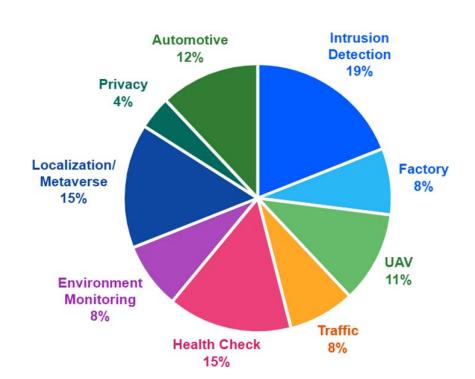
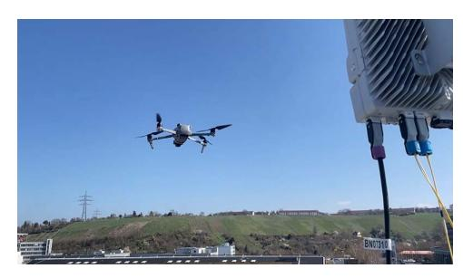
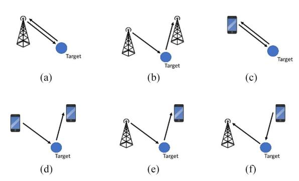
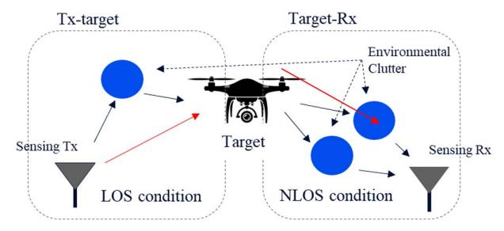
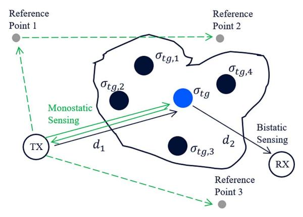
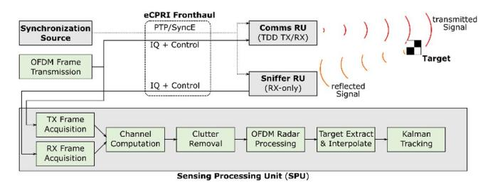
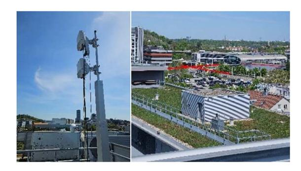
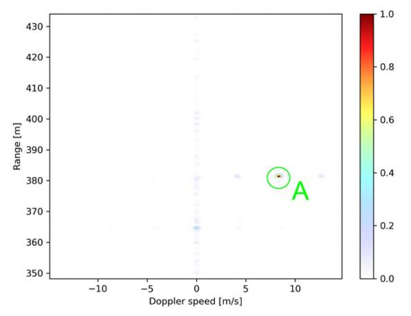

Received 1 May 2025; revised 24 June 2025; accepted 20 August 2025. Date of publication 29 August 2025; date of current version 30 October 2025.

Digital Object Identifier 10.1109/JSTEAP.2025.3603540

# A Unified Future: Integrated Sensing and Communication (ISAC) in 6G

AMITAVA GHOSH 101 (LIFE FELLOW, IEEE), THORSTEN WILD 102 (SENIOR MEMBER, IEEE), JINFENG DU 103 (SENIOR MEMBER, IEEE), JUN TAN1, ARTJOM GRUDNITSKY2 (MEMBER, IEEE), DMITRY CHIZHIK 103 (FELLOW, IEEE), SILVIO MANDELLI 102 (MEMBER, IEEE), YUNCHOU XING 101 (MEMBER, IEEE), FRANK SCHAICH2 (MEMBER, IEEE), AND HARISH VISWANATHAN 103 (FELLOW, IEEE)

1Nokia Standards, Naperville, IL 60563 USA 2Nokia Bell Labs Stuttgart, 70469 Stuttgart, Germany 3Nokia Bell Labs Murray Hill, Murray Hill, NJ 07974 USA

CORRESPONDING AUTHOR: Amitava Ghosh (e-mail: amitava.ghosh@nokia.com).

(Invited Article)

ABSTRACT Integrated sensing and communication (ISAC) is among the early feature areas being explored for 6G in third generation partnership project (3GPP) standards. It involves the seamless integration of communication and sensing functions within a unified system architecture, where a single base station (also known as gNB), is inherently capable of supporting both roles. This article reviews recent developments in ISAC within 3GPP, focusing on key use cases and relevant channel models, including target and background environment channels. It provides an overview of different sensing topologies and outlines ISAC requirements across various deployment contexts. The discussion then extends to link budget analysis, waveform design, beamforming strategies, and associated hardware considerations. Last, the article highlights several proof-of-concept (PoC) systems that showcase practical implementations of ISAC concepts.

**INDEX TERMS** 5G new radio (NR), 6G, integrated sensing and communication (ISAC), ISAC channel model, link budgets (LBs), proof-of-concept (PoC), radar cross section (RCS), sensing architectures.

#### **NOMENCLATURE**

AGV Automated guided vehicle. ASA Azimuth angular spread of arrival. ASD Azimuth angular spread of departure. **CTF** Channel transfer function. DS Delay spread. DH Distributed unit. eCPRI Evolved common public radio interface. FDM Frequency-division multiplexing. gNB 5G NR base station. **GPU** Graphics processing unit. ISAC Integrated sensing and communication. ISD Inter-site distance.

3rd generation partnership project.

NR 5G new radio.
OFDM Orthogonal frequency-division multiplexing.

PoC Proof-of-concept.
RAN Radio access network.
RCS Radar cross section.
RU Radio unit.

RX Receiver.

SPU Sensing processing unit.
SyncE Synchronous ethernet.
TDD Time-division duplexing.

TX Transmitter.

UAV Unmanned aerial vehicle.

UE User equipment.

ZSA Zenith angular spread of arrival.
ZSD Zenith angular spread of departure.

#### **INTRODUCTION**

ISAC has emerged as a core enabler in 6G networks and is recognized as one of the six key usage scenarios by both the international telecommunication union (ITU) [1] and 3GPP [2]. ISAC entails the joint design and deployment of communication and sensing capabilities within a unified system architecture, wherein a single base station (also known as gNB) is inherently equipped to perform both functions. This integration can utilize either

© 2025 The Authors. This work is licensed under a Creative Commons Attribution 4.0 License. For more information, see https://creativecommons.org/licenses/by/4.0/

shared or distinct waveform resources for communication and sensing. In this context, network sensing refers to the capability of detecting the presence, shape, size, location, and/or velocity of objects by leveraging radio signals transmitted and received by the network infrastructure. Sensor fusion, which aggregates network sensing data from a diverse range of sources—including environmental sensors (e.g., humidity and rainfall sensors), location tags, and device-embedded sensors such as cameras, light detection and ranging (LiDAR), and inertial measurement units—will play a critical role in enabling comprehensive sensing solutions in the 6G era [\[3\].](#page-8-0) With 6G standardization efforts commencing in 2025, ISAC has significantly advanced since the publication of several foundational papers[\[4\]](#page-8-0), [\[5\]](#page-8-0), [\[6\]](#page-8-0), [\[7\]](#page-8-0), [\[8\],](#page-8-0) [\[9\].](#page-8-0)

The main purpose of this article is to report on the recent advances in ISAC technology toward commercial realization, focusing on both standardization and implementation aspects. The 3GPP has been highly successful in specifying mobile networks standards. We describe the ongoing efforts toward standardization of ISAC across multiple working groups in 3GPP. We identify the most promising use cases for outdoor and indoor deployments and analyze the feasibility of meeting their performance requirements in the new 7 GHz spectrum band slated for 6G from deployments using the existing 5G site grid. Our analysis shows that adequate performance is achievable with a properly designed ISAC system.

The 3GPP has commenced standardization efforts for ISAC, with the "service and system aspects" (SAs) group publishing a technical report [\[2\]](#page-8-0) and a specification [\[4\]](#page-8-0) outlining 32 potential use cases and requirements as part of Release 19. "ISAC Use Cases" section highlights the three most critical use cases selected for inclusion in the initial phase of 6G development and outlines how these can be applied across various vertical industries. "Sensing Topologies and Capabilities" section briefly discusses the various deployment scenarios and sensing topologies.

In "ISAC Channel Models" section, we examine the ISAC channel models, which represent the primary work item in 3GPP Release 19. The current 3GPP model, as specified in TR 38.901 [\[10\],](#page-8-0) does not account for sensing targets or backscatter effects. To address this gap, we develop sensing and backscatter channel models based on measured data, enabling the simulation of target signal detection and characterization in cluttered environments. We also discuss the framework for RCS models for various sensing targets.

"Link Budget (LB), Waveform Design, Beamforming Aspects, and Hardware Issues for ISAC" section provides a detailed analysis of sensing LBs for two key deployment scenarios: urban microcell (UMi) and indoor factory (InF). The study focuses on two representative sensing targets—AGVs and drones—offering in-depth LB evaluations that capture the distinct propagation conditions and performance requirements of each scenario. The section concludes with a brief discussion on relevant aspects such as sensing waveforms, beamforming, hardware constraints, and spectrum-related considerations.

"PoC Systems" section explores various PoC systems, demonstrating practical implementations of the proposed ideas,

FIG. 1. Identified ISAC use cases by 3GPP SA1 group [\[2\].](#page-8-0)

FIG. 2. UAV flight trajectory tracking, collision avoidance, and intrusion detection.

while "Conclusion" section concludes the article with key takeaways and future directions.

### ISAC USE CASES

In March 2022, the 3GPP SA Technical Specification Groups (TSGs) initiated a Release 19 study on ISAC, resulting in the publication of a technical report [\[2\]](#page-8-0). The identified sensing use cases span several domains, including but not limited to smart homes, transportation, environmental monitoring, public safety and defense, healthcare and well being, and smart manufacturing [\[11\]](#page-8-0), [\[12\]](#page-8-0), [\[13\].](#page-8-0) The ISAC use cases are categorized and summarized in Fig. 1, presented as a percentage of the total identified use cases by 3GPP SA1 group [\[2\]](#page-8-0). Many of these use cases are anticipated to be realized in the 6G era, including advancements such as centimeter-level positioning and fully autonomous vehicles.

Several high-priority use cases are currently gaining significant attention in the ongoing development of 3GPP standards. These include the detection and tracking of AGVs within factory and warehouse environments, the real-time tracking of human movement in both indoor and outdoor settings, and the tracing of UAV flight trajectories as illustrated in Fig. 2. These applications highlight the growing demand for precise, lowlatency positioning and tracking capabilities in next-generation communication networks [\[14\]](#page-8-0), [\[15\].](#page-8-0)

Next, we discuss three categories of prioritized use cases. In the Smart Factories category, use cases encompass factory hall monitoring and predictive maintenance [\[16\],](#page-8-0) [\[17\]](#page-8-0), [\[18\]](#page-8-0). The sensing environment typically includes industrial production

spaces and machinery, utilizing equipment such as cameras and industrial sensors. The primary targets are production workflows and the condition of machinery. Key performance indicators (KPIs) for these scenarios include detection accuracy, response time, reliability, and data granularity. These use cases are designed to enhance operational efficiency, improve workplace safety, and minimize downtime through real-time monitoring and predictive analytics.

Environmental monitoring use cases cover applications such as flood detection in smart cities and air quality monitoring. The sensing environment includes urban areas susceptible to flooding and regions where air quality needs regular assessment [19], [20]. Key equipment comprises water level sensors, cameras, and air quality sensors. The primary targets are water level fluctuations and air pollution indicators. Critical KPIs include detection accuracy, response time, data granularity, and coverage area. These use cases support urban management systems in responding swiftly to environmental changes and reducing associated risks.

In the Public Safety category, use cases focus on disaster detection (e.g., earthquakes, floods, and wildfires) and monitoring of critical infrastructure such as bridges and buildings. The sensing environment comprises disaster-prone regions and key structural assets. Equipment includes environmental sensors and sensors for assessing structural integrity and UAVs. The primary targets are natural hazard events and infrastructure health. KPIs include detection accuracy, response time, reliability, and coverage area. These use cases play a vital role in safeguarding public safety and supporting effective emergency response coordination.

Examples of other envisioned use cases include intruder detection in homes and on highways, traffic monitoring, automotive navigation and maneuvering, rainfall and flood monitoring, health surveillance, and battlefield monitoring and target tracking. Subsequent sections of the article focus on a detailed examination of these scenarios.

#### **SENSING TOPOLOGIES AND CAPABILITIES**

In 3GPP, various sensing architectures can be supported using the existing network infrastructure and UE deployments, as illustrated in Fig. 3. Although the choice of sensing architecture depends on specific use cases, enabling flexible support for all relevant architectures is essential to fully realize ISAC.

Sensing-related capabilities refer to the functionalities enabled by the radio interface that support operations such as range and velocity estimation, object detection, localization, imaging, and mapping. The effectiveness of these capabilities can be assessed using the following performance metrics, which help evaluate the radio access technology's ability to support sensing under different deployment scenarios:

- 1) Detectability (Detection/False Alarm Probability):
  - a) *Probability of detection (PD)*: The likelihood of correctly detecting the presence of an object when it is indeed present.
  - b) *Probability of false alarm (PFA)*: The probability of detecting an object when none is present.

FIG. 3. Sensing architectures in 3GPP. (a) Monostatic network based: single gNB acts as sounder and sensor. (b) Bi/multistatic network based: one gNB acts as sounder and other gNB(s) act as sensor. (c) Monostatic UE based: single UE acts as sounder and sensor. (d) Bi/multistatic UE based: one UE acts as sounder and other UE(s) act as sensor. (e) DL-based collaborative: one gNB acts as sounder and UE(s) act as sensor. (f) UL-based collaborative: one UE acts as sounder and gNB(s) act as sensor.

TABLE I. Example: sensing tasks and related requirements in InF for AGV detection and tracking

| Requirement        |              | Basic Sensing Tasks |                  |              |  |
|--------------------|--------------|---------------------|------------------|--------------|--|
|                    |              | Detection           | Characterization | Localization |  |
| Detectability      | PFalse Alarm | 3%                  | 3%               | TBD          |  |
|                    | PDetection   | 99%                 | 99%              | TBD          |  |
| Location           | Horizontal   | -                   | -                | 0.5 m        |  |
| accuracy           | Vertical     | 1                   | -                | 0.5 m        |  |
| Velocity accuracy  |              | -                   | 1 m/s            | -            |  |
| Sensing Resolution |              | TBD                 |                  |              |  |

#### 2) Localization Accuracy:

- a) This metric reflects how closely the estimated position of a target object matches its actual location. It is typically quantified as the difference between the estimated and true positions.
- 3) Velocity Accuracy:
  - a) The difference between the estimated velocity and the actual velocity of the target object.
- 4) *Sensing Resolution*:
  - a) Defined as the minimum discernible difference between measured values (e.g., range and location) of two distinct objects required to distinguish them.

Table I shows an example of sensing tasks and related requirements in InF for AGV detection and tracking.

#### **ISAC CHANNEL MODELS**

3GPP is actively advancing ISAC in RAN1 Release 19 by exploring new channel modeling approaches and deployment scenarios to support future wireless systems with ISAC capabilities. Under the 3GPP scope, the ISAC sensing targets are UAVs, indoor/outdoor humans, automotive vehicles, automated guided vehicles (AGVs), and objects creating hazards on roads/railways.

To facilitate efficient simulation and evaluation of detection and characterization of target signals in the presence of clutter, there is a broad consensus on extending the geometry-based

FIG. 4. ISAC channels illustration.

stochastic channel model from TR 38.901 to incorporate sensing features, while ensuring compatibility with existing communication models [10], [38].

The current 3GPP channel model defined in TR 38.901 (prior to Release 19) lacks several key components necessary for accurate sensing and backscatter modeling, outlined as follows.

- No distinction between single-bounce and multibounce propagation.
- Absence of modeling for monostatic or base station– base station (BS-BS) and BS-UE bistatic sensing channels.
- Lack of probabilistic modeling for line-of-sight (LOS) and non-line-of-sight (NLOS) conditions between sensing devices and targets.
- 4) Large-scale parameters such as DS, angular spread (AS), shadow fading (SF), path loss (PL), and Ricean K factor (K) can be different from those of the communication channel.
- RCSs considerations for different targets/scenarios are not included.
- Missing spatial/temporal consistency, particularly in scenarios where multiple devices collaborate to sense a single target.
- Cross-polarization ratio for monostatic sensing is not addressed.

The ISAC channel  $H_{\rm ISAC}$  can be modeled as a summation of two parts

$$H_{\rm ISAC} = H_{\rm background} + H_{\rm target} \tag{1}$$

where  $H_{\mathrm{backgroud}}$  is the background environment channel including all multipath components not impacted by the sensing target, and  $H_{\mathrm{target}}$  is the target channel including all multipath components impacted by the sensing target.

The target channel H\_target can be divided into two parts, Tx-target and Target-Rx, and each part includes the LOS direct path (TX or RX directly to the target) and the NLOS paths (TX or RX to environment clutter), as illustrated in Fig. 4.

The scattered power is determined using the radar equation, with the target RCS described statistically based on parameters extracted from measurements of different targets such as human, vehicles, drones, and AGV. The report from NextG Alliance (NGA) [38] has summarized the ISAC measurements conducted by various companies and universities for both monostatic and bistatic cases. In the current 3GPP Rel-19

TABLE II. Example RCS values for different targets in monostatic case

| Target         | RCS      |         |         |  |  |  |
|----------------|----------|---------|---------|--|--|--|
|                | A (dBsm) | B1 (dB) | B2 (dB) |  |  |  |
| Small Size UAV | -12.81   | 0       | 3.74    |  |  |  |
| Large Size UAV | [-9.60]  | [0]     | [5.32]  |  |  |  |
| AGV            | [3.00]   | [0]     | TBD     |  |  |  |
| Human          | -1.37    | 0       | 3.94    |  |  |  |

FIG. 5. Single-point target and multiple-point target models. Dashed lines represent the background channel, and the solid lines represent the target channel.

ISAC channel modeling framework, the RCS is modeled as

$$\sigma_{\text{Target}} = A \times B = A \times B_1 \times B_2 \tag{2}$$

where A is the mean RCS value in  $m^2$ ,  $B_1$  is a deterministic component which may have angle (bistiatic) dependency, and  $B_2$  is a stochastic component (log normal distribution) which models the small-scale behavior by capturing the rapid fluctuations caused by the interference patterns among multiple scatterers. From examples, A = -12.81 dBsm for monostatic UAV of small size, and A = -1.37 dBsm for monostatic human targets, based on 3GPP RAN1 study.

Table II summarizes the 3GPP agreed values for RCS modeling, and the values enclosed in square brackets represent measured values that have been reported but have not yet received official agreement.

Additional parameters, such as target delay and angle spreads, were also derived from measurements to facilitate high-resolution simulations necessary for characterizing target behavior, such as human gesture recognition and UAV flight trajectory tracking [38]. Depending on the sensing use cases, target models of varying complexities—ranging from single-ray and single-point multiple-ray to multiple-point models—can be employed, as shown in Fig. 5. The coupling loss between the transmitter, target, and receiver (TX-Target-RX) can be calculated using the following equation:

$$L_{TX-SPST-RX} = PL_{dB}(d_1) + PL_{dB}(d_2) + 10lg\left(\frac{c^2}{4\pi f^2}\right) - 10lg(\sigma_{RCS,A}) + SF_{dB,1} + SF_{dB,2}$$
(3)

where  $PL_{dB}(d_1)$  and  $PL_{dB}(d_2)$  represent the PL of TX-Target and Target-RX links, which can be calculated using 3GPP PL equations with the SF terms  $SF_{dB,1}$  and  $SF_{dB,2}$ . The A value  $\sigma_{RCS,A}$  is used as the mean RCS value to determine the scattering power from the target.

In the 3GPP Rel-19 ISAC channel modeling, the background channel  $H_{\text{background}}$  can be generated based on the channel generated as in the existing TR 38.901 [10] between a sensing TX and a sensing RX (bistatic case) or reference point (RP, monostatic case). Reference points are artificially defined virtual points used to represent key positions (virtual grid points or expected reflection or scattering points) in the environment for modeling and simplifying the sensing process, see Fig. 5. While the bistatic background channel modeling follows TR 38.901, the monostatic background channel modeling is agreed in 3GPP Rel-19 following these steps [39].

- 1)  $N_{rp} = 3$  reference points are dropped for one Tx, based on the Gamma distribution for distance and height of a reference point.
- 2) The LOS AOD between Tx and the first reference point, which is denoted as AOD1, is generated based on uniform distribution unif $(-\pi, \pi]$ .
  - a) The LOS AOD between Tx and the second reference point is AOD1 +  $(2/N_{rp})\pi$ .
  - b) The LOS AOD between Tx and the third reference point is AOD1 +  $(4/N_{rp})\pi$ .
- 3) The background channel is generated based on the channel generated as in the existing TR between the real Tx and the reference point, assuming NLOS condition.
- 4) The antenna field pattern and array orientation of reference point are set to the same as Tx.
- 5) Arrival angles for both azimuth and elevation  $\varphi_{n,m,AOA}$  and  $\theta_{n,m,ZOA}$  are set equal to departure angles.
- 6) The monostatic background channel for the Tx would be the sum of channels of the links between the Tx and all related reference points.

For both monostatic and bistatic background channel, there is additional modeling component procedure via following steps.

- 1) *Step 1*: Generate a set of clusters/rays according to TR 38.901 (or other related TRs).
- Step 2: Generate a set of NLOS clusters/rays according to TR 38.901 (or other related TRs), where the power of the second set of clusters/rays should be scaled down such that

$$P_n^{(S2)} = \frac{P_n^{(S2)}}{\sum_n P_n^{(S2)}} P_{\text{drop}} = \frac{P_n^{(S2)}}{\sum_n P_n^{(S2)}} P_1^{(S1)} 10^{\frac{G}{10}}$$
(4)

where  $P_1^{(S1)}$  is the power of the NLOS cluster with the strongest power from the first set.  $P_n^{(S2)}$  is the power of the *n*th cluster from the second set.

3) N is the number of clusters, M is the number of rays within each cluster, value of G relates to power, where N=360, M=1, G=-25 dB, and the same DS, ASA, ASD, ZSA, ZSD,  $C_{\theta}$ , and  $C_{\phi}$  are used for the first step.

In [40], a statistical monostatic background channel model based on measurements is developed for assessing indoor RF sensing performance. A narrowband continuous wave (CW) 28 GHz sounder used a quasi-monostatic radar arrangement with an omnidirectional transmit antenna illuminating an indoor scene and a spinning horn receive antenna collecting backscattered power as a function of azimuth. Median average backscatter power of 251 locations from 27 rooms was found to vary over a 12 dB range, with average power generally decreasing with increasing room size. A deterministic model of average backscattered power dependent on distance to nearest wall with an exponent of 2 and clutter reflection coefficient reproduces observations with 3.5 dB root mean square (rms) error. Distribution of power variation in azimuth around this average is reproduced within 1 dB by a random azimuth spectrum with a lognormal amplitude distribution with rms of 7 dB and uniformly random phase. The model is extended to provide power distribution over both azimuth and delay (conveying range to scatterer) by combining azimuthal distribution with published results on power delay profiles in reverberant environments. The statistical model does not require a detailed room layout description, aiming to reproduce backscatter clutter statistics (as opposed to a deterministic response). These statistics are essential for large-scale system-level evaluation of RF sensing performance.

## LB, WAVEFORM DESIGN, BEAMFORMING ASPECTS, AND HARDWARE ISSUES FOR ISAC

LB

The sensing task of ISAC presents the same challenges studied by the legacy radar literature. The major KPIs of interest here are defined as: 1) accuracy and capability of detecting an isolated object; and 2) resolution of the system. The latter is defined as the capability of *resolving* two close objects without misclassifying them as a single one, or worse, not detecting anything at all. The two classes of KPIs depend on distinct system parameters and are thoroughly discussed in realistic future deployments in [3]. In what follows, we summarize the most sensitive quantities that determine the abovementioned KPIs, focusing on the most prominent ISAC use case of drone detection.

Regarding 1) accuracy and capability of detecting an isolated object, we recall that in the case of peak detection in spectral tasks—such as a radar target sensing task—to get reliable detection, one needs the radar SNR to be at least 15–20 dB [3]. Assuming free space PL and LOS conditions in a monostatic setup, the received power after transmission, outward PL, reflection from the drone, return pathloss, and reception is as follows:

$$P_{R}(r) = \frac{P_{T}G_{T}}{4\pi r^{2}} \sigma \frac{1}{4\pi r^{2}} \frac{G_{R}\lambda^{2}}{4\pi} = P_{T}G_{T}G_{R} \cdot \sigma \cdot \frac{c_{0}^{2}}{(4\pi)^{3} r^{4} f_{c}^{2}}$$
(5)

where  $P_T$  is the transmit power before antenna,  $G_T$  and  $G_R$  are the TX and RX antenna gains,  $\sigma$  is the mean RCS, r is the

TABLE III. Base station antenna settings for ISAC at 7 GHz

| Transmitter Array Information (per polarization)       | Units | UMi-AV | InF-AGV |
|--------------------------------------------------------|-------|--------|---------|
| # elements in X per subarray                           |       | 1      | 1       |
| # elements in Y per subarray                           |       | 1      | 1       |
| # subarrays in X                                       |       | 32     | 8       |
| # subarrays in Y                                       |       | 32     | 8       |
| # elements in X                                        |       | 32     | 8       |
| # elements in Y                                        |       | 32     | 8       |
| Number of antenna elements                             |       | 1024   | 64      |
| Element directivity                                    | dBi   | 3.0    | 3.0     |
| Array factor (pointed on mechanical boresight)         | dB    | 30.1   | 18.1    |
| Antenna array directive gain (on mech boresight)       | dB    | 33.1   | 21.1    |
| Antenna coupling efficiency                            |       | 71%    | 71%     |
| Antenna coupling efficiency                            | dB    | -1.5   | -1.5    |
| Tx Arrayed Antenna Gain                                | dB    | 31.6   | 19.6    |
| PA OP1dB                                               | dBm   | 12     | 12      |
| Backoff, i.e., modulated signal PAPR                   | dB    | 2.1    | 2.1     |
| RMS power output per PA                                | dBm   | 9.9    | 9.9     |
| Power into each antenna element                        | dBm   | 9.9    | 9.9     |
| Number of Tx subarray PAs or antenna elements          |       | 1024   | 64      |
| Multielement or subarray power gain                    | dB    | 30.1   | 18.1    |
| Total Transmitter Power Out (prearray, i.e., not EIRP) | dBm   | 40.0   | 28.0    |

distance from the ISAC system to the sensing target, and  $f_c$  is the sensing carrier frequency.

To determine the system capabilities, one has to compute the radar SNR as the ratio between the received power as function of the range r, versus the noise sources. All accuracy performances start to become extremely reliable and precise after the above-mentioned 15–20 dB threshold and are better discussed in [3]. Note that the inverse quartic scaling with respect to the range as well as the quadratic scaling with respect to the carrier frequency, as we have to account for two-ways PL for radar tasks, as opposed to the one-way communications.

On the other hand, 2) resolution is determined by the *system* aperture in the corresponding spectral dual domains. This means that the range resolution, i.e., the capability of resolving two targets that are at the same angle and speed, but at different ranges, depends on the system bandwidth. The larger the bandwidth, the better the range resolution, thus the capability of resolving two targets at closer range. The same can be said for angle and speed resolutions with antenna aperture and time burst length, respectively. For more details, we refer the reader to [3].

Consider two cases for LBs at a 7 GHz carrier frequency: one for an outdoor UMi scenario and the other for an InF scenario, as summarized in Table III.

For the outdoor base station, a  $32 \times 32$  antenna array is assumed, resulting in 1024 antenna elements per polarization. With each antenna element having a directivity of 3.0 dBi and a coupling loss of 1.5 dB, the total antenna gain is approximately 31.6 dB (or 34.6 dB for dual-polarization).

TABLE IV. Sensing coverage analysis at 7 GHz for UMi-AV and InF-AGV scenarios

| Coverage Analysis                           | Units | UMi-AV High SNR | UMi-AV Low SNR | InF-DH High SNR | InF-DH Low SNR |
|---------------------------------------------|-------|-----------------------|-------------------|-----------------------|-------------------|
| Channel model                               |       | UMi LOS               | UMi LOS           | InF-DH                | InF-DH            |
| Size or ISD                                 | m     | 200                   | 200               | 120 X 60              | 120 X 60          |
| Radar cross section (RCS $\sigma$ )         | dBsm  | -12.8                 | -12.8             | 3.0                   | 3.0               |
| Smallest detectable received power          | dBm   | -115.9                | -139.9            | -115.9                | -139.9            |
| γ: r̂4 in dB                                | dB    | 130.0                 | 154.0             | 109.7                 | 133.7             |
| Estimated sensing distance (with Margin)    | m     | 1779                  | 7083              | 553                   | 2201              |
| Estimated sensing distance (without Margin) | m     | 2954                  | 11761             | 1389                  | 5530              |

For the InF base station/access point, an  $8 \times 8$  antenna array is considered, providing 64 antenna elements per polarization. Using the same antenna element directivity (3.0 dBi) and coupling loss (1.5 dB), the total antenna gain for the InF scenario is about 19.6 dB (or 22.6 dB for dual-polarization).

Assuming a power amplifier (PA) with an OP 1 dB of 12 dBm connected to each antenna element, and applying a 2.1 dB backoff, the total transmit power before accounting for antenna gain would be 40 dBm for the UMi-AV scenario and 28 dBm for the InF-AGV scenario.

Assuming, 400 MHz bandwidth at a carrier frequency of 7 GHz (e.g.,  $\Delta f = 60\,$  kHz), with a RX NF of 8 dB, then the corresponding noise floor is approximately  $-80\,$  dBm, as illustrated in Table IV. We can consider two use cases, as follows.

- 1) *High SNR Scenario*: With an SNR of 17 dB, this scenario ensures reliable performance in terms of both false alarms and missed detections.
- 2) Low SNR Scenario: This scenario enables basic sensing functionality but does not ensure the reliable performance obtained in the high SNR scenario.

For fast fading margin, we consider two times  $\sigma_{SF}$  (e.g., SF in dB scale, 4 dB for both UMi, and InF-DH LOS scenarios) for the high SNR use case and one  $\sigma_{SF}$  for the low SNR use case. Table IV provides an analysis of sensing coverage based on LB calculations for a small-sized UAV and an AGV, using the 3GPP agreed RCS values listed in Table II. In high SNR scenarios with an 8 dB margin, the estimated sensing distances are 1779 m for the UMi-AV scenario and 553 m for the InF-DH scenario, both of which significantly exceed the ISDs of these scenarios. This implies that the sensing coverage is adequate and does not pose a challenge for ISAC systems.

#### **Waveform Design and Baseband Complexity**

In [3], a qualitative analysis of waveforms for joint communication and sensing was presented, concluding that the optimal waveform choice depends on the specific use case. The article also discussed key system design considerations for effective integration of sensing and communication. Additionally, it

TABLE V Qualitative comparison of ISAC waveforms

| KPI                               | FMCW | OFDM            | Single  | FMCW   | FMCW |  |
|-----------------------------------|------|-----------------|---------|--------|------|--|
|                                   |      |                 | Carrier | + OFDM | + SC |  |
| PAPR                              | ++   | _               | +       | ++/-   | ++/+ |  |
| Full duplex effort                | +    | -               | -       | +      | +    |  |
| Cost BB                           | +    | -               | -       | -      | -    |  |
| Carry data                        | _    | ++              | ++      | +      | +    |  |
| Commu.proc. Flexibility        | -    | ++              | +       | +      | +    |  |
| User MUX                          | -    | ++              | +       | ++     | +    |  |
| Radar proc. Accuracy           | +    | +               | -       | +      | +    |  |
| Full CSI available for sensing | -    | ++              | +       | -      | -    |  |
|                                   | ++   | Most favorable  |         |        |      |  |
| N.                                | +    | Favorable       |         |        |      |  |
| Note:                             | -    | Less favorable  |         |        |      |  |
|                                   | _    | Least favorable |         |        |      |  |

Note: Reproduced with permission from [3].

introduced several innovative approaches for sharing time, frequency, and space resources to minimize sensing overhead while meeting range and velocity estimation requirements. What was not addressed in [3] are pulse-radar (and pulse-Doppler) waveforms, which also can be time multiplexed with OFDM, like frequency modulated continuous wave FMCW. Like FCMW we expect downsides in the ability to carry data and the communication suitability, but they circumvent the full duplex problem if one is willing to accept a "blind zone" near the RX. Furthermore, it is discussed that they might offer a longer sensing range. However, the PAPR issue remains to be addressed, as it is unclear how to have synergies with communication power amplifiers.

Table V, reproduced from [3], provides a qualitative comparison of various waveform candidates. In this table, the second FMCW, third (OFDM), and fourth single carrier (SC) columns represent scenarios where a single waveform is used for the integrated system, while the last two columns consider time-division multiplexing of distinct waveforms—FMCW for sensing and either OFDM or SC for communication [21], [22], [23], [24], [25], [26], [27].

The additional baseband cost when using an OFDM communication signal for ISAC depends on several factors, including signal processing requirements, hardware capabilities, and system design. Here, the following are the key considerations.

- Baseband Processing Complexity: ISAC requires additional signal processing for sensing tasks such as target detection, localization, and velocity estimation. This can increase computational demands, potentially requiring more powerful DSPs or FPGAs.
- 2) Waveform Optimization: While OFDM is naturally suitable for both communication and sensing, modifications such as cyclic prefix adjustments, subcarrier allocation, and joint processing algorithms may introduce extra processing overhead.

- Channel Estimation and Echo Processing: Sensing involves analyzing reflected signals, requiring additional channel estimation, echo cancellation, and Doppler processing, which may demand more baseband resources.
- 4) Interference Management: When using the same OFDM signal for both communication and sensing, additional baseband algorithms may be needed to mitigate interference between the two functions, increasing processing requirements.
- 5) *Hardware Adaptation*: If the existing baseband hardware lacks support for real-time sensing processing, an upgrade or dedicated coprocessor might be required, leading to additional costs.

In summary, while reusing OFDM signals for ISAC can be efficient, it may introduce extra baseband costs due to increased processing complexity, additional filtering, and resource allocation adjustments [28]. The actual cost impact depends on the system architecture and the level of integration required.

#### **Beamforming**

To simplify the previous section's analysis, we condensed the antenna arrays' operations in the two gain terms, without diving into the beamforming operations that need to be considered and their implications. However, to scan an area by using an ISAC (or radar) system, we need to account for the angular operations needed, as well as the capabilities that the antenna arrays offer.

In communications, beamforming is used as a tool to create as many parallel channels as possible with good SNR for spatial multiplexing to maximize throughput. With sensing, one uses beamforming to determine which areas are scanned and to optimize the shape of the point spread function (PSF), which is the response to a perfect isotropic target at a given angle. Unfortunately, due to the limited aperture of antenna arrays, an impulsive target scatters back a nonimpulsive shape that with typical beamforming operations—exhibits a main lobe and some sidelobes close to it. The tradeoff between main lobe width and sidelobes' amplitude has been addressed by decades of signal processing literature [29]. One can decide to just optimize the resolution by minimizing the main lobe width using constant amplitude weights across antenna elements of the array, accepting strong sidelobes. If one wants to keep sidelobes under check, more advanced tapering/windowing coefficients can be applied to the antenna array, trading off main lobe aperture and resolution with, e.g., Chebyshev and Hann windows.

As the objective of sensing is to probe the environment seen from TX to RX, the system performance can be optimized if it were possible to control beamforming operations by TX and RX jointly. In the case of monostatic setups, a milestone concept in the literature was given in [30], where the TX and RX colocated arrays are substituted by a unique *virtual* coarray structure, which determines the angular beamforming capabilities of the system. The impacts for ISAC hardware design can lead to important cost savings from the additional hardware

FIG. 6. ISAC PoC architecture.

deployment to enable ISAC monostatic sensing. For instance, one can operate a base station with a normal communications array as TX with elements at half-wavelength spacing and just deploy a RX with elements at multiples of wavelength, without any impact on sensing performance, but with less elements needed to be installed. More details on the coarray implications for monostatic ISAC can be found in [31].

Finally, once monostatic and bistatic array characteristics are determined, the remaining challenge to be solved is to determine the set of TX and RX angle pairs to be sampled to fully scan an area and how to interpolate the response between the points chosen. Some recent work shows that a slightly modified DFT codebook requires the minimal number of samples (thus overhead for communications) for both monostatic [32] and bistatic setups [33] and allows lossless interpolation among the scanned points with affordable complexity.

#### **POC SYSTEMS**

Evaluation of real-world ISAC performance strongly relies on practical implementation of an ISAC system based on cellular hardware for understanding shortcomings and limitations, also as simulation methodology and channel modeling are not yet as mature as for pure communication systems.

Nokia Bell Labs has already implemented and demonstrated an ISAC PoC based on cellular 5G hardware [33]. The PoC architecture is depicted in Fig. 6. To circumvent the full duplex problem (which for ISAC is mainly an issue when the selfinterference would saturate the RX level), two RUs are used for physically separating sensing TX and RX. We denote the receive-only RU for sensing as "sniffer." In a quasi-monostatic mode, the sniffer is typically a few tens of centimeters away from the Tx RU (labeled in the figure as "Comms RU"). The use of separate RUs also allows deployment of the PoC in bistatic mode. The split-processing architecture used for communication is also well suited for sensing. We use the eCPRI fronthaul to connect the RUs to a synchronization source with PTP/SyncE (jitter  $\approx 40$  ps). To have full control over the transmitted downlink signal, we use pregenerated OFDM frames, which are then transmitted to the Tx RU. In a product that implements both full communication and sensing functionality, OFDM downlink would be sent from L1 High to the Tx RU and forwarded to sensing processing. Sensing functionality is implemented in the real-time SPU, which runs on an off-theshelf GPU server. After acquiring radio-frames of the Tx and reflected signal from the fronthaul, it carries out the estimation

of the frequency domain CTF of the sensing channel by equalizing the received OFDM resource elements by the known transmit symbols. From the CTF, a clutter-free CTF is generated based on clutter removal algorithms [34]. After the clutter removal, OFDM radar algorithms [25] carry out the necessary Fourier transforms to represent the signal in delay Doppler domain. Based on this periodogram, we can carry out RADAR thresholding algorithms to extract the targets and interpolate them. Alternatively, or in addition, AI/ML postprocessing can be used, e.g., for object classification. Further object tracking is possible, e.g., based on Kalman filters.

Our current PoC variant operates in millimeter wave bands around 27 GHz with up to 400 MHz bandwidth using 5G TDD with 120 kHz subcarrier spacing. We use a DL:UL ratio of 4:1 and sense during the DL symbols. The sensing operation takes up to a full frame duration of 10 ms. Analog beam sweeping with an adjustable beam set of up to 128 configurable beams is used. Half-power beamwidth of the radios used in the PoC is 14° horizontal and 7° vertical. The PoC achieves a range resolution of 0.39m at 400 MHz bandwidth, and a speed resolution of 0.55m/s. Processing latency for generating a periodogram is below 10 ms.

An installation on the roof of the Nokia Stuttgart building allows outdoor measurements for traffic monitoring, weather sensing, and drone detection. A further indoor deployment in the research factory Arena 2036 [35] allows detection and localization of humans, pedestrians, and factory equipment. This environment was also used for NLOS sensing experiments [36], which allow for the detection of the presence of moving persons behind obstacles (which completely block the camera view).

An example measurement using our rooftop deployment is shown in Fig. 7. The POC is used to observe an intersection located about 400 m from the deployment. Before the measurement, the system has been calibrated to suppress/attenuate clutter (buildings, tram rails, traffic lights, etc.), which may otherwise be stronger than the actual targets that the POC is meant to detect. Certain effects can degrade the performance of clutter removal over time, as seen in Fig. 7 at 0 m/s, which is a combination of static targets and not fully suppressed clutter. While requiring further investigation, some possible causes are: temperature-induced effects on the analogue frontends of the RUs which are not fully compensated or minor changes in the channel due to wind-load on the antenna pole. The clutter removal approach proposed in [41] (which extends the approach from [34] that is implemented in the POC) may be suitable to address these issues. In the measurement, the detected target A is a vehicle (car or truck) at a range of 380 m from the RUs and approaching at 8.5 m/s Doppler speed. To determine the true speed of the vehicle requires knowledge of which of the two roads of the intersection, it moves on and the angle of the roads relative to the beam direction used for the measurement. The periodogram in the figure shows normalized power, and the absolute power can be used for rough classification of targets (e.g., the larger RCS of trucks compared to sedan cars corresponds to the power of the respective target peaks in the periodograms).

FIG. 7. Traffic observation using the ISAC POC. Top: RUs mounted on roof-top (left), view of intersection (highlighted by red lines) from the RUs (right). Bottom: Range-Doppler periodogram computed by the POC, with the strongest target (approaching car) highlighted.

#### CONCLUSION

ISAC has been explored in several foundational studies. This article builds on that work by presenting recent advancements, including key use cases and channel models tailored to different targets and background environments. The three important use cases currently being addressed are as follows: 1) detection and tracking of AGVs within factory and warehouse environments; 2) real-time tracking of human movement in both indoor and outdoor settings; and 3) tracing of UAVs. ISAC channel models are discussed in detail and provide RCS values for representative targets such as drones, AGVs, and humans. The article also offers a brief overview of waveform design, LB considerations for various targets, and beamforming techniques. The LB calculation implies that the sensing coverage is adequate and does not pose a challenge for ISAC systems, as the estimated sensing distances exceed the required ISDs in both UMi-AV and InF-DH scenarios. Lastly, it highlights a PoC implementation of ISAC using commercial 5G cellular hardware.

#### **REFERENCES**

- ITU-R Internal Document, "Framework and overall objectives of the future development of IMT for 2030 and beyond," ITU-R M.2160-0, Jun. 30, 2023.
- [2] 3GPP TR 22.837 V19.0.0, "Feasibility study on integrated sensing and communication," Jun. 2023.

- [3] T. Wild, V. Braun, and H. Viswanathan, "Joint design of communication and sensing for beyond 5G and 6G systems," *IEEE Access*, vol. 9, pp. 30845–30857, 2021.
- [4] 3GPP TS 22.137, "Service requirements for integrated sensing and communication," Stage 1 (Release 19), V19.1.0, Mar. 2024.
- [5] A. Behravan et al., "Positioning and sensing in 6G: Gaps, challenges, and opportunities," *IEEE Veh. Technol. Mag.*, vol. 18, no. 1, pp. 40–48, Mar. 2023, doi: 10.1109/MVT.2022.3219999.
- [6] A. Behravan, et al., "Introducing sensing into future wireless communication systems," in *Proc. 2nd IEEE Int. Symp. Joint Commun. Sens. (JC&S)*, 2022, pp. 1–5.
- [7] A. Liu et al., "A survey on fundamental limits of integrated sensing and communication," *IEEE Commun. Surveys Tut.*, vol. 24, no. 2, pp. 994–1034, Secondquart. 2022.
- [8] F. Liu et al., "Integrated sensing and communications: Towards dual-functional wireless networks for 6G and beyond," *IEEE J. Sel. Areas Commun.*, vol. 40, no. 6, pp. 1728–1767, Jun. 2022, doi: 10.1109/JSAC.2022.3156632.
- [9] Y. Geng, V. Yajnanarayana, A. Behravan, E. Dahlman, and D. Shrestha, "Study of reflection-loss-based material identification from common building surfaces," in *Proc. Joint Eur. Conf. Netw. Commun.* 6G Summit (EuCNC), 2021, pp. 526–531.
- [10] 3GPP TR 38.901 V18.0.0, "Study on channel model for frequencies from 0.5 to 100 GHz," Apr. 2024.
- [11] Next G Alliance, "Next G Alliance Report: 6G technologies." Accessed: Jul., 2022. [Online]. Available: https://www.nextgalliance.org/ white papers/6g-technologies/
- [12] N. G. Alliance, "6G applications and use cases." Accessed: May, 2022. [Online]. Available: https://www.nextgalliance.org/white\_papers/6g-applications-and-use-cases/
- [13] S. P. Chepuri, N. Shlezinger, F. Liu, G. C. Alexandropoulos, S. Buzzi, and Y. C. Eldar, "Integrated sensing and communications with reconfigurable intelligent surfaces," 2022, arXiv:2211.01003.
- [14] H. Chae, "Integrated communication and sensing for B5G/6G—Part 1: Key drivers and applications," *Ofinno whitepaper*, Nov. 2021.
  [15] A. Bazzi and M. Chafii, "Secure full duplex integrated sensing
- [15] A. Bazzi and M. Chafii, "Secure full duplex integrated sensing and communications," *IEEE Trans. Inf. Forensics Secur.*, vol. 19, pp. 2082–2097, 2024, doi: 10.1109/TIFS.2023.3346696.
- [16] V. Kumar, M. Chafii, A. L. Swindlehurst, L.-N. Tran, and M. F. Flanagan, "SCA-based beamforming optimization for IRS-enabled secure integrated sensing and communication," in *Proc. IEEE Global Commun. Conf., GLOBECOM*, Kuala Lumpur, Malaysia, 2023, pp. 5992–5997, doi: 10.1109/GLOBECOM54140.2023.10437283.
- [17] V. Kumar and M. Chafii, "Beamforming design for secure RIS-enabled ISAC: Passive RIS vs. active RIS," 2025, arXiv:2501.19157.
- [18] A. Bazzi, R. Bomfin, M. Mezzavilla, S. Rangan, T. Rappaport, and M. Chafii, "Upper mid-band spectrum for 6G: Vision, opportunity and challenges," 2025, arXiv:2502.17914.
- [19] M. Chafii, L. Bariah, S. Muhaidat, and M. Debbah, "Twelve scientific challenges for 6G: Rethinking the foundations of communications theory," *IEEE Commun. Surveys Tut.*, vol. 25, no. 2, pp. 868–904, Secondquart. 2023, doi: 10.1109/COMST.2023.3243918.
- [20] A. Bazzi and M. Chafii, "Low dynamic range for RIS-aided bistatic integrated sensing and communication," *IEEE J. Sel. Areas Commun.*, vol. 43, no. 3, pp. 912–927, Mar. 2025, doi: 10.1109/JSAC.2025. 3531533.
- [21] A. Bazzi and M. Chafii, "On integrated sensing and communication waveforms with tunable PAPR," *IEEE Trans. Wireless Commun.*, vol. 22, no. 11, pp. 7345–7360, Nov. 2023, doi: 10.1109/TWC.2023.3250263.
- [22] A. Bazzi and M. Chafii, "On outage-based beamforming design for dual-functional radar-communication 6G systems," *IEEE Trans. Wireless Commun.*, vol. 22, no. 8, pp. 5598–5612, Aug. 2023, doi: 10.1109/TWC. 2023.3235617.
- [23] R. Bomfin and M. Chafii, "On the performance analysis of zero-padding OFDM for monostatic ISAC systems," *IEEE Trans. Commun.*, vol. 73, no. 3, pp. 2103–2117, Mar. 2025, doi: 10.1109/TCOMM.2024.3462673.
- [24] C. Chaccour, M. N. Soorki, W. Saad, M. Bennis, P. Popovski, and M. Debbah, "Seven defining features of terahertz (THz) wireless systems: A fellowship of communication and sensing," *IEEE Commun. Surveys Tut.*, vol. 24, no. 2, pp. 967–993, Secondquart. 2022.
- [25] M. Braun, "OFDM radar algorithms in mobile communication networks," PhD diss., Institut fur für Nachrichtentechnik (CEL), Karlsruher Institut furfür Technologie, (KIT), 2014.

- [26] J. Fink and F. K. Jondral, "A numerical comparison of chirp sequence versus OFDM radar waveforms," in Proc. IEEE 82nd Veh. Technol. Conf. (VTC2015-Fall), Boston, MA, USA, 2015, pp. 1–2, doi: [10.](http://dx.doi.org/10.1109/VTCFall.2015.7390809) [1109/VTCFall.2015.7390809.](http://dx.doi.org/10.1109/VTCFall.2015.7390809)
- [27] J. Fink and F. K. Jondral, "Comparison of OFDM radar and chirp sequence radar," in Proc. 16th Int. Radar Symp., Dresden, Germany, 2015, pp. 315–320.
- [28] S. Mandelli, M. Henninger, M. Bauhofer, and T. Wild, "Survey on integrated sensing and communication performance modeling and use cases feasibility," in Proc. 2nd Int. Conf. 6G Netw. (6GNet), Piscataway, NJ, USA: IEEE, Oct. 2023, pp. 1–8.
- [29] B. A. Johnson, Y. I. Abramovich, and X. Mestre, "MUSIC, G-MUSIC, and maximum-likelihood performance breakdown," IEEE Trans. Signal Process., vol. 56, no. 8, pp. 3944–3958, Aug. 2008.
- [30] R. T. Hoctor and S. A. Kassam, "The unifying role of the coarray in aperture synthesis for coherent and incoherent imaging," Proc. IEEE, vol. 78, no. 4, pp. 735–752, Apr. 1990.
- [31] A. Felix, S. Mandelli, M. Henninger, and S. Ten Brink, "Antenna array design for monostatic ISAC," in Proc. IEEE 25th Int. Workshop Signal Process. Adv. Wireless Commun. (SPAWC), Piscataway, NJ, USA: IEEE, 2024, pp. 721–725.
- [32] S. Mandelli, M. Henninger, and J. Du, "Sampling and reconstructing angular domains with uniform arrays," IEEE Trans. Wireless Commun., vol. 22, no. 6, pp. 3628–3642, Jun. 2023.
- [33] T. Wild, A. Grudnitsky, S. Mandelli, M. Henninger, J. Guan, and F. Schaich, "6G integrated sensing and communication: From vision to realization," in Proc. 20th Eur. Radar Conf. (EuRAD), Berlin, Germany, 2023, pp. 355–358, doi: [10.23919/EuRAD58043.2023.10289474.](http://dx.doi.org/10.23919/EuRAD58043.2023.10289474)

- [34] M. Henninger, S. Mandelli, A. Grudnitsky, T. Wild, and S. ten Brink, "CRAP: Clutter removal with acquisitions under phase noise," in Proc. 2nd Int. Conf. 6G Netw. (6GNet), Paris, France, 2023, pp. 1–8, doi: [10.1109/6GNet58894.2023.10317664.](http://dx.doi.org/10.1109/6GNet58894.2023.10317664)
- [35] ARENA2036, "Active Research Environment for the Nextgeneration of Automobiles," Fall, 2012. [Online]. Available: [https://arena2036.](https://arena2036.de/en) [de/en](https://arena2036.de/en)
- [36] P. Tosi, M. Henninger, L. G. de Oliveira, and S. Mandelli, "Feasibility of non-line-of-sight integrated sensing and communication at mmWave," in Proc. IEEE 25th Int. Workshop Signal Process. Adv. Wireless Commun. (SPAWC), Lucca, Italy, 2024, pp. 331–335, doi: [10.1109/](http://dx.doi.org/10.1109/SPAWC60668.2024.10694426) [SPAWC60668.2024.10694426.](http://dx.doi.org/10.1109/SPAWC60668.2024.10694426)
- [37] A. Felix, S. Mandelli, M. Henninger, and S. t. Brink, "Optimal azimuth sampling and interpolation for bistatic ISAC setups," Apr. 2025. [Online]. Available:<https://arxiv.org/abs/2504.19238>
- [38] N. G. Alliance Whitepaper, "Channel measurements and modeling for joint/integrated communication and sensing, as well as 7-24 GHz communication," Jul. 2024. [Online]. Available: [https://nextgalliance.org/](https://nextgalliance.org/white_papers/channel-measurements-and-modeling-for-joint-integrated-communication-and-sensing-as-well-as-7-24-ghz-communication/) [white\\_papers/channel-measurements-and-modeling-for-joint-integrated](https://nextgalliance.org/white_papers/channel-measurements-and-modeling-for-joint-integrated-communication-and-sensing-as-well-as-7-24-ghz-communication/)[communication-and-sensing-as-well-as-7-24-ghz-communication/](https://nextgalliance.org/white_papers/channel-measurements-and-modeling-for-joint-integrated-communication-and-sensing-as-well-as-7-24-ghz-communication/)
- [39] 3GPP R1-2503257, "Draft CR for TR 38.901 to introduce channel model for ISAC," Apr. 7, 2025.
- [40] D. Chizhik, et al., "Backscatter measurements and models for RF sensing applications in cluttered environments," 2024, arXiv:2401.15206.
- [41] M. Henninger, S. Mandelli, A. Grudnitsky, and S. ten Brink, "CRAP part II: Clutter removal with continuous acquisitions under phase noise," in Proc. Joint Eur. Conf. Netw. Commun. 6G Summit (EuCNC/6G Summit), Antwerp, Belgium, 2024, pp. 416–421.