# The Emergence of Multi-Functional and Hybrid Reconfigurable Intelligent Surfaces for Integrated Sensing and Communications - A Survey

Anton Tishchenko, *Student Member, IEEE*, Mohsen Khalily®, *Senior Member, IEEE*, Arman Shojaeifard®, *Senior Member, IEEE*, Fraser Burton®, *Senior Member, IEEE*, Emil Björnson®, *Fellow, IEEE*, Marco Di Renzo®, *Fellow, IEEE*, and Rahim Tafazolli®

Abstract—Reconfigurable intelligent surfaces (RIS) are positioned as one of the key enabling technologies for 6G networks as they can provide ubiquitous coverage for areas with blocked line-of-sight (LOS) links. However, to be successfully integrated into functional networks such structures will require the addition of sensors and other radio network elements, thereby resulting in a multi-functional RIS (MF-RIS). These structures are expected to be deployed for integrated sensing and communications (ISAC) and radar and communication coexistence (RCC) in 6G, which will enhance the performance of radio communication and enable a smart wireless environment (SWE) that is programmable and self-reconfigurable. This survey provides an up-to-date summary of the state of the art. It considers applications for MF-RISs and the challenges associated with their deployment.

Index Terms—B5G, 6G, RIS, metasurfaces, radio frequency (RF), wireless communications, integrated sensing and communication (ISAC), energy harvesting (EH), hybrid active RIS, multi-functional RIS (MF-RIS), smart wireless environment (SWE), holographic MIMO, centimeter-Wave (cmWave), millimeter-Wave (mmWave), terahertz (THz), sensor data fusion, radar and communication coexistence (RCC), nonorthogonal multiple access (NOMA), simultaneous transmit and receive (STAR).

Received 20 August 2023; revised 14 March 2024, 18 August 2024, and 19 November 2024; accepted 11 December 2024. Date of publication 8 January 2025; date of current version 20 October 2025. The work of Marco Di Renzo was supported in part by the European Commission through the Horizon Europe Project COVER under Grant 101086228, through the Horizon Europe Project UNITE under Grant 101129618, and through the Horizon Europe Project INSTINCT under Grant 101139161; in part by the Agence Nationale de la Recherche (ANR) through the France 2030 Project ANR-PEPR Networks of the Future under Grant NF-YACARI 22-PEFT-0005; and in part by the CHIST-ERA Project PASSIONATE under Grant CHIST-ERA-22-WAI-04 and Grant ANR-23-CHR4-0003-01. The work of Anton Tishchenko was supported by the UK Research & Innovation (UKRI) Engineering & Physical Sciences Research Council (EPSRC) Studentship Project under Grant 2655612. (Corresponding author: Mohsen Khalily.)

Anton Tishchenko, Mohsen Khalily, and Rahim Tafazolli are with the 5G & 6G Innovation Center, Institute for Communication Systems, University of Surrey, GU2 7XH Guildford, U.K. (e-mail: a.tishchenko@surrey.ac.uk; m.khalily@surrey.ac.uk; r.tafazolli@surrey.ac.uk).

Arman Shojaeifard is with the Department of Research & Innovation, InterDigital, EC2A 3QR London, U.K. (e-mail: arman.shojaeifard@interdigital.com).

Fraser Burton is with the Applied Research, British Telecom, EC1A 7AJ London, U.K. (e-mail: fraser.burton@bt.com).

Emil Björnson is with the Department of Computer Science, KTH Royal Institute of Technology, 100 44 Stockholm, Sweden (e-mail: emilbjo@kth.se).

Marco Di Renzo is with the Université Paris-Saclay, CNRS, CentraleSupélec, Laboratoire des Signaux et Systèmes, 91192 Gif-sur-Yvette, France (e-mail: marco.di-renzo@universite-paris-saclay.fr).

Digital Object Identifier 10.1109/COMST.2024.3519785

#### I. INTRODUCTION

TIRELESS communications have evolved rapidly throughout the 21st century. Many new and fascinating communication technologies have emerged in recent years, which has been exciting for the signal processing and communication communities. Refined waveforms, massive multiple-input multiple-output (mMIMO) signaling, non-orthogonal multiple access (NOMA), sparse vector coding, and index modulation are only a few examples. The next generation wireless standard, referred to as '6G', aims to take this a step further. The anticipated mass roll-out of 5G systems will take place in the coming years, with over 65% of the world population expected to have access to it by 2025 [1], and the global mobile traffic is expected to grow annually by 55% during this decade with the expected network capacity demand increasing to  $1.6 \text{ Mbit/s/m}^2$  by 2030 in the downlink assuming that 60% of the traffic is offloaded to Wi-Fi [2]. It is predicted that 5G will approach its limits by 2030 [3], which will call for the roll-out of 6G technology. It is also anticipated that many wired backbone networks will migrate to wireless implementations as this allows cheaper installations and wider availability. The anticipated 6G networks can be characterized as follows.

#### A. Increased Capacity and Bandwidth

The capacity increase goes in line with the evolutionary trend of wireless networks from 2G to 5G, as every new generation offers increased channel capacity. The traditional way to achieve this is by increasing the spectral bandwidth, which is also the case in 5G. However, massive MIMO is an equally important new feature in 5G, which enables a multi-antenna base station (BS) to spatially multiplex several user devices using the same spectrum, which further boosts the network capacity. The initial 5G deployments primarily use the 3.5 GHz new radio (NR) frequency range (FR) 1 band, but when this band becomes congested, the technology can also use the NR FR2 mmWave bands n257 and n258 that span between 24.25 GHz and 29.5 GHz. While several studies confirmed the feasibility of mmWave communication systems for outdoor cellular networks [4], [5], [6], [7], most telecom operators have been reluctant to deploy them since the range is short and mmWave networks suffer from hardware

inefficiencies, for example, in the RF amplifiers, phase shifters, RF chains, etc. The centimeter-wave (cmWave) spectrum of 7-15 GHz, which has recently been proposed as the 5G FR3 band [\[8\]](#page-30-7), offers some simplifications in terms of hardware development and allows to achieve improved capacity without requiring densification of the network infrastructure. Yet, it includes many of the conventional drawbacks of the mmWave spectrum as well, such as severe path loss, power amplification efficiency, etc. While the drive for higher frequencies and wider bandwidths is clear, hardware implementations in higher spectrum require more thought to make them practical.

#### *B. Increased Energy Efficiency*

Traditionally, wireless networks have focused on delivering high capacity and coverage while giving limited attention to energy consumption. The 5G massive MIMO technology enhances energy efficiency (EE) by achieving higher capacity using the same radiated power [\[9\]](#page-30-8), [\[10\]](#page-30-9), [\[11\]](#page-30-10), but requires higher energy consumption due to the larger number of RF components. The measured energy consumption of 5G BSs exceeds 3500 W, and their amount is reported to be tripled compared to 4G systems due to the increased spectrum. The spatial multiplexing in massive MIMO is achieved by frequent reference signaling, to enable multi-user beamforming in complex propagation environments [\[12\]](#page-30-11). This is possible thanks to the relatively long channel coherence time in the sub 6 GHz bands. The situation is more complicated in cmWave and mmWave bands, since the effective area of each antenna shrinks with the wavelength, many more antennas are required to achieve the same link budget in these bands [\[13\]](#page-30-12), [\[14\]](#page-31-0), [\[15\]](#page-31-1). This requires more reference signals, which also need to be transmitted more frequently since the channel coherence time is also proportional to the wavelength. This bottleneck might be handled by concentrating on particular propagation environments where location-aware communication is possible which brings us to the next discussion point.

# *C. Location-Aware Communications*

As discussed in the previous text, mmWave networks will require a substantial improvement in EE and a reduction in reference signaling to become practical and cost-effective. To facilitate the boost in EE, we expect that location-aware communication will become necessary along with accurate channel modeling which will include much more accurate environmental predictions rather than Rayleigh fading. Although initially predicted for 5G systems [\[16\]](#page-31-2), [\[17\]](#page-31-3), [\[18\]](#page-31-4), locationaware communication has not fully materialized yet. This could be due to the lack of hardware that can facilitate location awareness in conjunction with the complex demands of radio communication. Recently, light detection and ranging (LiDAR) sensors have emerged as an accurate tool for environmental monitoring and, hence, modeling [\[19\]](#page-31-5), [\[20\]](#page-31-6). It has been shown that LiDAR modeling is capable of solving the problem of human blockage for terahertz (THz) signals [\[21\]](#page-31-7). We envision that localization will be a key technology for enabling 6G cellular networks that operate in cmWave, mmWave, and THz bands, which have to become much more point-to-point to meet EE targets. When the location of each user equipment (UE) is known, accurate modeling of the urban environment can also be applied, resulting in a predictable environment in terms of signal scattering and user mobility with a high degree of accuracy [\[22\]](#page-31-8), [\[23\]](#page-31-9). Holographic sensor data fusion methods powered by artificial intelligence (AI) and machine learning (ML) algorithms can be applied to remove many unknowns from radio propagation in urban environments and indoor communications [\[24\]](#page-31-10).

#### *D. Network Reconfigurability at the Hardware Level*

Given the requirement for location awareness, it is natural to conclude that such systems should be highly reconfigurable as well, due to the mobility of UEs which may be represented by smartphones, autonomous vehicles, autonomous aerial vehicles (AAV), etc. The ability to create a high-capacity LOS channel between the BS and a moving UE in situations without LOS will require a combination of the elements discussed previously and the concept of RIS is fundamental to this.

#### *E. Improved Network Coverage*

Although the capacity of cellular and cell-free networks has improved significantly in recent years, the coverage remains non-uniform and unpredictable. The main reason for this is the large distances between BSs and cell-edge users and all the objects that are in between. Massive MIMO systems form beams in the most suitable directions but have no control over the radio propagation environment, so they cannot remove areas with poor coverage, because the scattering behavior between the BS and UE is uncontrollable. However, with the help of LiDAR modeling, natural reflecting properties of materials can be estimated, together with a strategic placement of RIS, a coverage gap free wireless environment can be engineered that is smart, self-reconfigurable, and autonomous.

# II. BACKGROUND AND STUDY

Massive MIMO is undoubtedly capable of meeting the 6G network specifications described above if it is densely deployed. However, despite recent advances [\[29\]](#page-31-11), [\[30\]](#page-31-12), [\[31\]](#page-31-13), hardware implementations of massive MIMO remain complex and very expensive. Coupled with the low hardware amplification efficiency at mmWave frequencies [\[32\]](#page-31-14), which results in low EE of such systems, the practicality of mmWave wireless network installations with Massive MIMO capabilities is debatable. To address this problem, the concept of RIS has emerged to complement massive MIMO to provide better cost and EE for Beyond 5G (B5G) network installations. RISs are planar structures composed of "metamaterial" elements, which are called unit cells and designed according to the theory of metamaterials.

#### *A. History of Metamaterials*

The theory of metamaterials, developed throughout the second part of the 20th century [\[33\]](#page-31-15), is based on the concept of left-handed materials proposed in the pioneering work by Veselago in 1967 [\[34\]](#page-31-16), who speculated the possibility of artificial engineering materials to have unnatural properties with negative permeability and negative permittivity. These "metamaterial" elements are placed periodically on a planar surface called "metasurface" and, in the context of applications for radio wave manipulation, they would be made of electromagnetic (EM) wave conductive material, which is typically copper. The combined response of "metamaterial" elements to an impinging radio wave results in an anomalous EM response of the whole "metasurface", which means that it is different from the natural reflection or refraction described by Snell's law. The first implementation of a radio wave programmable metasurface is widely considered to be the Sievenpiper metasurface proposed in 1999 [\[35\]](#page-31-17), which was followed by the experimental verification by Shelby et al. in 2001 [\[36\]](#page-31-18). While these pioneering works achieved reconfigurability only by the geometrical arrangement of metamaterials, they were soon followed by the works of Kamoda et al. [\[37\]](#page-31-19) and Clemente et al. [\[38\]](#page-31-20) in the early 2010s that introduced the concept of the electronic reconfigurability of metamaterials with integrated PIN diodes and laid out the foundation for RISs, which is the main focus of this work.

### *B. Types of Metasurfaces*

Some examples of metasurface technology are static reflective metasurfaces and reflectarray antennas, in which the phase and amplitude control of the reflected wave is obtained by the geometrical arrangement of unit cells. In either case, the reflectors are arranged in a linear or planar configuration and are spaced at a distance that is a fraction of the wavelength of the EM waves. Reflectarray antennas are commonly used in radar and communication systems to create highly directional beams or to focus the energy of the waves onto a specific area. Static reflective metasurfaces are sometimes considered passively 'intelligent' in the literature as they direct radio waves to a specific location with a defined phase angle, which is programmed in advance and realized geometrically on the metasurface. While both reflective metasurfaces and reflectarrays are designed to manipulate the reflection of EM waves, the difference between the two is the focal length or, in other words, the distance to the point of convergence. A static reflective metasurface is designed to reflect a planar wave originating from the far field, which is what differentiates it from reflectarray antennas that are used to reflect signals originating from the transmitter that is located in the near field. However, either of these structures are passive and not able to adapt to the changing environment. A new dimension of reconfigurability can only be achieved with active elements that consume energy, such as PIN diodes, varactor diodes, liquid crystals (LCs), RF switches, and others. These elements are used to adjust the phase and amplitude of the scattered signals. This concept was originally introduced for dynamic reconfigurable reflectarray antennas [\[39\]](#page-31-21), which still had a fixed position of the transmitter in the near field, but could adapt to a dynamically changing position of the receiver. Later, it was expanded to cellular network communications and became known as RIS, where the positions of both the BS and UEs can change dynamically and are expected to operate in the far field instead. This concept became known as a smart wireless environment (SWE) [\[40\]](#page-31-22), [\[41\]](#page-31-23). The degree of control over the wireless environment introduced by RIS is unprecedented but implies the real-time programming of the metasurface via a dedicated microcontroller located either in close proximity or on the back of the metasurface. Although RIS enables the concept of reconfigurable SWE, its practical implementations create many challenges that make it much more complex and expensive compared to static metasurfaces. In this paper, we aim to review and provide answers to these challenges. However, it should be noted that static metasurfaces such as [\[42\]](#page-31-24), [\[43\]](#page-31-25) should be considered as an alternative to RIS in many B5G applications, for example, when the position of the BS is fixed and the metasurface is serving a specific coverage gap area. A static metasurface has considerable operational advantages to a network operator in this case, since it does not require a power supply nor a communication link, which makes it substantially cheaper to install and maintain.

#### *C. Smart Wireless Environments of the Future*

While the concept of RIS applies to any frequency band, the available bandwidth of sub-6 GHz networks is already utilized by 5G [\[44\]](#page-31-26). The spectrum bands of cmWave and mmWave will likely be used in B5G networks as they can offer major advantages in terms of extremely wide spectrum allocations up to 800 MHz per operator. Therefore, it is anticipated that the majority of real-world implementations for RIS will take place in cmWave bands and above, where the benefits of RIS are much more significant compared to conventional network extension methods [\[45\]](#page-31-27), such as active relaying and distributed antenna systems (DAS). Integration of reconfigurable, intelligent, and sustainable wireless environments into the open-radio access network (O-RAN) compliant framework is necessary [\[46\]](#page-31-28), which goes alongside the key characteristics of future wireless networks mentioned earlier - energy independence and sustainability.

The most recent research activities also explore the possibility of adding an amplification gain to RIS unit cells [\[47\]](#page-31-29), [\[48\]](#page-31-30), and therefore achieving a hybrid active RIS that can amplify signals in both directions. Doing this can address several issues associated with RIS, such as poor aperture efficiency, lowpower uplink signal transmission, and multi-path scattering. However, this solution increases the power consumption, introducing some performance trade-offs [\[49\]](#page-31-31). Active RISs are expected to work alongside holographic MIMO surfaces (HMIMOS) [\[50\]](#page-31-32), [\[51\]](#page-31-33), [\[52\]](#page-31-34), where the difference between them is the presence of active antenna elements and RF chains that can transmit and receive modulated RF signals. A combination of HMIMOS with RIS is considered in [\[53\]](#page-31-35), where radio signal modulation and reflection are achieved at different frequencies on a shared aperture metasurface. For example, such a design can coexist with mmWave radar and communications within an indoor environment. Another promising direction for HMIMOS is the realization of time domain digital coding with metasurfaces as envisioned by [\[54\]](#page-31-36),

Fig. 1. Outdoor to indoor communication with a multi-functional RIS. (a) LiDAR is used for environmental modeling. (b) RIS with integrated controller. (c) mmWave radar is used for user equipment localization.

[\[55\]](#page-32-0), [\[56\]](#page-32-1), [\[57\]](#page-32-2), where the metasurface is also able to control the frequency spectrum of the EM wave. However, since HMIMOS require power amplifiers (PAs) and RF chains, it is rather a novel way of implementing massive MIMO than something comparable to RIS. Having said that, metasurface coding can be employed on RISs to add additional bits to the signal, through index modulation (IM) [\[58\]](#page-32-3) and reflection modulation (RM) [\[59\]](#page-32-4), or even to allow a backscattering communication link [\[60\]](#page-32-5), [\[61\]](#page-32-6), [\[62\]](#page-32-7). Although RISs and HMIMOs have in common the same metasurface technology, they have different implementation requirements and thus complement each other. Indeed, the combination of MF-RIS with HMIMOS within the same network cell can enable location-aware future wireless networks, therefore increasing the overall EE of radio networks and reducing their latency [\[64\]](#page-32-8). Then, an office broadband network installation might look like the illustration presented in Fig. [1,](#page-3-0) where a multi-functional RIS receives a radio signal originating from the outside through a glass window with integrated transmissive metasurface and is responsible for the distribution of this radio waveform inside a typical office environment with a real-time simultaneous localization and mapping (SLAM) powered estimation of the channel based on natural properties of the environment obtained from the holographic sensor fusion data framework and implemented directly on the metasurface. No physical wires will be necessary in this scenario and static reflective metasurfaces might be used to support areas with no window access to distribute the signal from the MF-RIS within the building. Since each HMIMOS BS can support a large number of offices with direct LOS links and each MF-RIS can support a large number of UE, such application is easily scalable in urban environments and will become increasingly attractive with the increasing number of users per square area. The integration of MF-RIS into real networks can be accomplished according to the authors of [\[65\]](#page-32-9), who considered the integration of RIS into existing standardized network interfaces such as 3GPP, O-RAN, and ETSI and provided various communication scenarios, also including the case of RIS-assisted ISAC. This work also for the first time characterized the bandwidth of influence and the area of influence of RIS for structures with variable phase shifting control. The results show that different outcomes are obtained with different phase switching methods, which needs to be considered for practical RIS implementations and RIS standardization efforts. ETSI industry specification group (ISG) on RIS [\[25\]](#page-31-37) was created with a mission to coordinate and streamline prestandards research efforts on RIS, allowing to pave the way for future standardization of the technology. The group during its first phase has produced several group reports (GRs) on use cases (GR RIS-001) [\[26\]](#page-31-38), interfaces/architecture (GR RIS-002) [\[27\]](#page-31-39), and communication models (GR RIS-003) [\[28\]](#page-31-40) for RIS-integrated systems. Additional work is currently being carried out by the group including work items on implementation/practical considerations (GR RIS-004), diversity and spatial-multiplexing schemes (GR RIS-005), and MF-RISs (GR RIS-006) that are described in this paper.

#### *D. Related Work*

There are many comprehensive reviews dedicated to RISassisted communications. The summary of these works is presented in Table [I.](#page-5-0) It can be seen that the topics of RIS channel modeling, RIS-assisted communications, and hardware designs have been widely covered. However, the integration of sensors on RIS and hybrid RIS with amplification gain has not been given sufficient attention.

#### *E. Contributions of This Survey*

The purpose of this paper is to explain the emerging idea of MF-RIS and focus on its applications for B5G wireless networks. While the general concept of RIS is not new and was first introduced back in 2019, its role and purpose are still not clearly defined, which requires more research effort to finalize. Hardware multi-functionality and integration of sensing and communication with RIS are the next logical evolutionary steps for RIS deployment, which will allow RIS to be implemented in real networks. Hardware multifunctionality includes omnidirectional RIS with combined reflective and refractive elements as well as a hybrid active RIS with radio signal amplification. Additionally, this survey aims to address several implementation challenges associated with RIS that have not been resolved yet. It provides a review of RIS research bottlenecks and the latest proposals that aim to overcome these issues, which include:

- *RIS aperture efficiency.* Since the size of a planar wave is infinitely large, only a fraction of it will be received by the RIS. To increase the aperture efficiency, either a nonuniform modulation should be applied by the RIS, or the RIS needs to employ active elements with amplification gain, as will be shown later.
- *Specular reflection and reflection losses.* Incident waves impacting the RIS tend to generate large specular reflections due to structural physics, which leads to significant losses in signal power. Advanced mathematical techniques accompanied by the environmental modeling should be applied to solve this problem.

- *User association in multiple access channels.* Since the signal can come from any direction with many reflections, it can be extremely difficult to distinguish one user from another. Through user localization during precoding, multipath signals can be positively added, resulting in a uniform response and increased sum rate.
- • *Practical implementation for uplink communication.* Uplink communication is severely limited in terms of available signal power. Communication models for uplink are largely absent in the literature and are often not accurate. In this work, we review realistic scenarios for uplink communication and its channel models.
- • *Dispersivity and bandwidth control,* which can also be described as the bandwidth of influence of RIS. This is a significant consideration for any network operator using licensed spectrum since it must comply with the terms of its license. The problem of bandwidth arises when an RIS needs to distinguish between UE belonging to its host network and other UE. This is necessary for practical applications, as otherwise, an RIS can introduce unwanted interference to the UE not belonging to its network by reflecting out-of-band (OOB) radio signals. This effect is different from conventional OOB radiation because there is no leakage between bands as the RIS directly interferes with the systems operating in neighboring bands [\[86\]](#page-32-10). In this work, we show that an RIS can predict interference and even eliminate it, assuming a priori knowledge of the UE location.
- • *EH and power autonomy.* As long as the RIS requires access to the electric grid and is not self-sustainable, it cannot be considered a 100% "green technology". Also, its applications will be limited to places with a power outlet, which can be an operational challenge for a network operator. This issue can be addressed by utilizing efficient batteries, the use of RF-energy or solar EH cells, as well as by employing wireless power transfer (WPT).
- *Channel estimation and measurement.* While the literature provides a significant amount of studies dedicated to channel estimation, the accuracy of these studies is often questionable due to the challenging channel propagation properties of the real world. In situ measurements performed with RISs in operational networks are scarce, and in this work, we aim to provide an overview of realistic RIS channel models that can be linked to examples of indoor and outdoor measurements.

While state-of-the-art works aim to address one single design issue, for a practical RIS implementation and the eventual roll-out, it is necessary to address all of them at once. To accomplish that, we predict the emergence of MF-RISs to realize ISAC, RCC, and power autonomy in practical networks. We provide a comprehensive overview of applications that can benefit from the implementation of this technology. The applications are separated into two parts. First, the applications for the near future are covered, which are anticipated in the next 5-10 years. Secondly, we discuss futuristic applications and future research directions, but in much less depth. As a measure, the technology readiness level (TRL) framework is

TABLE I RELATED RIS SURVEYS AND REVIEWS

| Ref. | Description                                                                  | Points of Interest                                                                                                                                                                                                                                                                                                                          | Limitations                                                                                                                                                           |
|------|------------------------------------------------------------------------------|---------------------------------------------------------------------------------------------------------------------------------------------------------------------------------------------------------------------------------------------------------------------------------------------------------------------------------------------|-----------------------------------------------------------------------------------------------------------------------------------------------------------------------|
| [66] | A book dedicated exclusively to RIS                                          | Provides a comprehensive overview of state-of-the-art.                                                                                                                                                                                                                                                                                      | Does not provide answers to typical research problems associated with RIS                                                                                             |
| [67] | A survey dedicated to RIS and its use cases.                                 | Detailed description of RIS signal model and hardware architecture. Provides realistic scenarios for future deployments                                                                                                                                                                                                                     | Many research directions have changed since the date of publication                                                                                                   |
| [68] | A survey dedicated to RIS functionality and channel estimates                | Detailed discussion of RIS channel models and numerical results. In particular, characteristics that separate RIS optimization from precoding for typical MIMO arrays                                                                                                                                                                       | Does not provide practical measurement results                                                                                                                        |
| [69] | A survey dedicated to RIS-based communication and optimization schemes | Provides RIS performance analysis and overview of RIS optimization schemes to maximize EE, power, sum rate, secrecy rate, and coverage                                                                                                                                                                                                      | Does not provide practical measurement results                                                                                                                        |
| [70] | A survey dedicated to RIS hardware and its applications                      | Future research directions are presented and are largely aligned with this paper                                                                                                                                                                                                                                                            | Does not provide practical examples and gives only a high level description of the mentioned concepts                                                                 |
| [71] | A comprehensive survey dedicated to RIS hardware                          | Detailed overview of fabrication methodologies for RIS and proposed hardware architectures, as well as RIS channel estimation techniques and signal propagation modeling. A standardization timeline proposed, which is a unique feature of this survey                                                                            | Does not consider possible applications of RIS and security aspects of RIS-aided net- works                                                                     |
| [72] | A comprehensive survey dedicated to RIS-based communications           | Overview of RIS channel models, principles of operation, and a performance-gain comparison to relay-aided networks as well as multicarrier design and resource management, the use of reinforcement learning (RL) AI algorithms in RIS-enhanced wireless networks, and the combination of RISs with other technologies                      | Does not provide practical hardware demonstrations. Many research directions have changed since the date of publication                                               |
| [73] | A comprehensive review of metasurfaces for RF propagation              | Materials that are used for various frequency ranges are described in detail as well as phase tuning techniques, including varactor diodes, microelectromechanical systems (MEMS), and LCs                                                                                                                                                  | Does not provide information about practi- cal implementations, concentrating on high- level concepts                                                           |
| [74] | A comprehensive survey dedicated to RIS-based communication            | Provides a comprehensive overview of near-passive metasurfaces and of the underlying EM operation of such surfaces. Also includes future research directions and an overview of digital modulation with metasurfaces with many practical examples.                                                                                          | It predicts the use of RIS for location-aware communications in the future, but this is not the focus of the paper, and therefore this topic is not covered in detail |
| [75] | A comprehensive survey dedicated to localization techniques with RIS         | Includes localization by using mmWave and THz signals that can boost localization accuracy to sub-1 mm level, which is not possible with conventional localization methods                                                                                                                                                                  | It does not consider integrating sensors directly on RIS and the associated local processing and only treats an RIS as a lens                                         |
| [76] | A survey dedicated to conceptual architectures of RIS                        | Provides a detailed overview of RIS integration into real networks, including channel modeling techniques and AI/ML-based approaches for phase shift configuration on RIS and real-time control of RIS unit cells. It includes a summary of ML-based RIS research works                                                                     | It does not estimate the positions of UE in the proximity of an RIS, and the impact on latency by using AI/ML algorithms is not considered                   |
| [77] | A survey dedicated to RIS communication models                               | Provides an overview of EM theory from the surface impedance point of view as well as of RIS communication systems                                                                                                                                                                                                                          | Does not consider user localization and practical applications                                                                                                        |
| [78] | A comprehensive survey dedicated to RIS hardware                          | This work presents active, transmitter-type, transmissive-reflective, and stand-alone RISs. It compares their advantages and disadvantages to reflective RIS designs and envisions a future RIS architecture that can dynamically adjust its operation modes and introduce the new concept of PHY slicing over RISs in 6G wireless networks | Does not provide practical examples and design guidelines. Some concepts are only overviewed                                                                          |
| [79] | A review of transmissive RISs                                             | This work provides a point of reference for the latest development of transmissive RIS technology and its design approaches. It lists existing prototypes and provides several illustrations                                                                                                                                                | Does not provide details about potential use cases for this novel technology                                                                                          |
| [80] | A review of RIS for applications at Terahertz frequencies                    | It considers CMOS-transistor enabled metasurfaces, Schottky-diode integrated structures, graphene-based metasurfaces, and high-electron-mobility-transistor integrated structures                                                                                                                                                           | Does not consider path loss estimation for the proposed application scenarios nor a comparison with competing technologies                                      |
| [81] | A survey of RIS channel estimation                                           | Comprehensive overview of RIS channel estimation methods and architectures. It aims to offer practical solutions and addresses several challenging problems, including cell-to-cell mutual coupling, direct and indirect channel estimation                                                                                                 | Does not provide practical measurements. It overviews existing field trials with RIS, only briefly mentioning RIS-assisted RF sensing                                 |
| [82] | A review of the space- time coding (STC) digital metasurfaces          | This work is a comprehensive study of the digital metasurface concept and its many applications, including dynamic holograms, wireless power transfer, imaging systems, and wireless communications, with several practical examples                                                                                               | Several novel concepts are presented, but the obtained data rates are low for 5G applications                                                                   |
| [83] | A review of RIS from a software-defined network perspective                  | This work considers the implementation of RIS within a software-defined environment and reviews the security risks associated with it                                                                                                                                                                                                       | Does not consider multi-user environments in detail                                                                                                                   |
| [84] | A review of RIS based on silicon chips for mmWave and THz                    | It provides the most comprehensive overview of CMOS-based RIS solutions to date, including the novel case of active RIS                                                                                                                                                                                                                     | Does not detail the hardware and the applications of this technology                                                                                                  |
| [85] | A review of stacked intelligent metasurfaces                                 | The only review available to date that details hardware implementations and applications of this technology                                                                                                                                                                                                                                 | The benefits of using SIMs over conventional methods are not explained in detail                                                                                      |

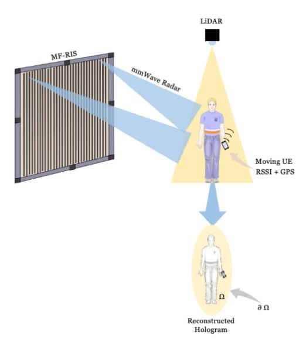

Fig. 2. Holographic sensor data fusion with MF-RIS.

used. For example, if no known prototype has been built for a proposed application and the technology is a pure concept, it is considered futuristic and is assigned a TRL level between 1 and 4, with 1 being the most conceptual. On the other hand, if a practical proof of concept exists, then it is assigned a TRL level between 5 and 9, with level 9 implying that the technology has been tested in operational environments and is ready for mass production.

While none of the applications have the TRL 9, the following applications for MF-RIS are identified as those with the highest score:

- • ISAC and RCC. While a traditional RIS could be used to improve the performance of wireless communication systems by controlling the reflection and scattering of EM waves, this model only works under the assumption of a static environment, where the location of the UE is either fixed or confined within a specific area. This is rarely the case in real networks. Creating a holographic sensor fusion framework with RIS will allow it to direct radio signals to a specific UE while monitoring its movement by digitally reconstructing the UE as a hologram as illustrated in Fig. 2. RIS-based sensing can be implemented either by integrating radar sensing capabilities on RIS directly for RCC [88] or with a beam scanning predictionbased approach performed by an O-RAN intelligent controller (RIC) in the ISAC case [89], as well as by a combination of both in a mobile edge computing (MEC) network. Such combination also implies the use of the sensing data that already exists on the network, such as global positioning system (GPS), received signal strength indicator (RSSI) with the local data inputs gathered by the MF-RIS itself, such as mmWave radar and LiDAR for example. Doing this will allow for more efficient use of the wireless spectrum, higher data rates, and more robust communications in challenging environments. Successful implementation of ISAC with RIS could kick-start the mass roll-out of 5G mmWave networks that suffer from the mentioned issues.
- Environmental modeling and SLAM. ISAC and RCC open up the possibility of modeling the environment

- surrounding an RIS. The following sections will show that integrating the LIDAR technology on an RIS allows for predicting the movement of users and the reflections from physical objects. This complex computation can be offloaded to a server that can perform the best path calculation with the help of AI, therefore minimizing the calculations performed by the RIS controller itself. However, the impact of latency must be considered. Additionally, sensors that measure humidity, temperature, and vibration can be added to an RIS, so that it can dynamically adjust its reflection properties according to the actual environmental conditions.
- Simultaneous wireless information and power transfer (SWIPT). Adding EH cells to an RIS allows it to efficiently capture and convert ambient EM energy into usable electrical power. RIS systems can also be integrated with solar cells on the same structure without increasing their size. Doing so can make the resulting surface energy-independent and harvest large amounts of energy, which may be sufficient even for powering neighboring devices. To take this a step further, the stored energy can be transmitted with WPT unit cells from the RIS to power neighboring internet of things (IoT) devices.
- Medical imaging. RIS technology could be used to create dynamic lenses for medical imaging equipment, such as ultrasound or magnetic resonance imaging (MRI) scanners, allowing for higher-resolution images and more accurate diagnoses. The reconfigurability of RIS beamforming can be explored to focus on a specific cluster of cells, therefore providing better diagnostic accuracy. The imaging functionality is different from sensing as it is expected to be performed in the near field and without general-purpose communication. However, the majority of principles described in this work can be easily applied to medical equipment.

We also consider the physical layer network security of MF-RIS. The successful integration of RIS into B5G networks will largely depend on its security, so it should not be ignored.

# III. THE THEORY OF ANOMALOUS REFLECTION AND REFRACTION

The constitutive parameters of Maxwell's equations describe how the electric permittivity  $(\varepsilon)$  and magnetic permeability  $(\mu)$  of known materials can interact with EM waves across the EM spectrum. Assuming that the material can interact with the impinging EM wave and the material surface is large compared to the EM wavelength  $(\lambda)$ , such material will either absorb the EM wave completely, reflect it outwards with some portion of the wave scattered on the surface, or refract it inwards. Refraction occurs when a large number of dipoles scatter coherently, resulting in a strong EM wave propagation inside the new material. Diffraction of EM waves is also possible but only occurs at the edges of a metasurface. The absorption and scattering of the EM wave inside the medium implies that it becomes trapped and cannot escape the medium, while the reflection and refraction allow the EM wave to propagate further. Historically, the material's reflection and refraction of impinging EM waves with an incident angle  $(\theta_i)$  have been

described with what is known as Snell's law, which states that such wave can reflect outwards with a reflection angle  $(\theta_r)$ , given as [87]:

$$\sin \theta_r - \sin \theta_i = \frac{\lambda_0}{2\pi n_i} \frac{d\Phi(x)}{dx},\tag{1}$$

where  $n_i$  is the refractive index of the transmission medium, which is typically air, and  $\frac{d\Phi(x)}{dx}$  specifies the phase gradient along the x axis. Or it can refract inwards with a transmission angle  $(\theta_t)$ , given as [87]:

$$n_r \sin \theta_t - n_i \sin \theta_i = \frac{\lambda_0}{2\pi} \frac{d\Phi(x)}{dx},\tag{2}$$

where  $n_T$  is the refractive index of the new transmission medium. Typically, the majority of impinging EM waves reflect and refract simultaneously. However, beyond the so-called critical angle, the beam becomes completely refracted or evanescent and creates no reflection. The EM wave reflection and/or refraction of common materials is referred to as "normal" and sometimes as "specular". When the theory of metamaterials was first applied to EM waves, the results showed that an "abnormal" or "anomalous"  $\theta_r$  and/or  $\theta_t$  can be achieved on a metasurface with an engineered material response  $(\varepsilon, \mu)$ . The mathematical framework for the calculation of  $\theta_r$ , and/or  $\theta_t$  described previously, became known as the modified Snell's law due to its relation to refractive indices, and is still frequently used in many RIS designs today.

However, this calculation method assumes that the reflected field at any point can be approximated with the field reflected by an infinite uniform surface and does not account for local interactions and the mutual coupling among the unit cells nor for the spatial dispersion of a metasurface itself. The beamwidth of the reflected signal is inversely proportional to the aperture length [45]. A more accurate calculation method has been described in [90], [91], [92], [93] that is based on modeling an RIS by utilizing the theory of EM boundary conditions, which is described below.

#### A. Modelling RIS as an Impedance Boundary

The conductive layer of the RIS can be described as a penetrable equivalent impedance **Z**, which relates the tangential electric field to the discontinuity of the average tangential magnetic field across the conductive layer and is expressed as [93]:

$$\mathbf{E}_{\mathbf{t}}(z=0) = \underline{\mathbf{Z}}_{s}\hat{\mathbf{z}} \times \left[\mathbf{H}_{\mathbf{t}}(z=0^{+}) - \mathbf{H}_{\mathbf{t}}(z=0^{-})\right], \quad (3)$$

where the underbar denotes the tensor quantity of the equivalent impedance, which accounts for all possible coupling between different polarizations and  $\times$  indicates the cross product. The resulting interactions of this impedance boundary with the incident EM waves are typically evaluated in the far field beyond the Fraunhofer distance at a distance  $r > 2D^2/\lambda$  with D being the maximum dimension of the RIS.

1For a large sub-6 GHz RIS, the Fraunhofer distance can easily exceed the dimensions of an average indoor environment, which means that the RIS will operate in the near field, where an often considered linear phase gradient configuration will give a significant phase error [94]. For an RIS to provide accurate phase configuration in the near field, it should be configured as a lens [95]. In the context of codebook design, the optimization of an RIS in the near field is less analyzed than in the far field [97], [98], [99], [100].

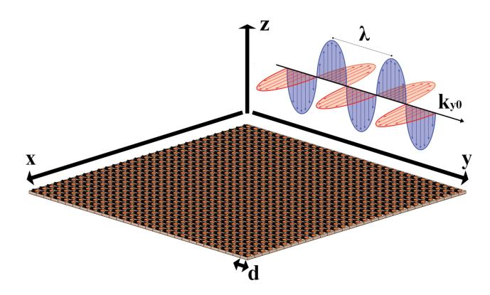

Fig. 3. RIS is modeled as an impedance boundary characterized by a transverse wavenumber  $k_{y0}$ .

The incident EM plane wave can be characterized in terms of its transverse wavenumber  $k_{y0}$  and the periodicity of m unit cells can be represented by the periodicity of the impedance profile d as per [93]:

$$Z(y) = \sum_{m} Z_m e^{-j \frac{2\pi m}{d} y}$$
 (4)

This relation is illustrated in Fig. 3. Then, the Floquet waves expansion of the currents induced in the equivalent impedance boundary in the  $\hat{y}$  direction can be expressed as

$$I(y)\hat{\mathbf{y}} = \hat{\mathbf{z}} \times \mathbf{H_t} = \sum_{h} I_h e^{-jk_{yh}y} \hat{\mathbf{y}}, \tag{5}$$

where the Floquet wavenumbers are defined as

$$k_{yh} = k_{y0} + \frac{2\pi}{d}h,\tag{6}$$

and h represents the individual reflecting coefficients of the propagating diffracting harmonics of index  $h=0, \mp 1, \ \mp 2, \dots$ . The sum of the induced currents on the equivalent impedance boundary provides an accurate description of the RIS, with the dispersion characteristics given in terms of frequency dispersion diagrams showing the transverse wavenumber as a function of the propagation direction for different frequencies.

Then, to determine the scattered field from an RIS at a distance  $|\mathbf{r}|$  with the coordinate (x, y, z), an equivalent Huygens surface model may be utilized, which can be described with the scalar Green's function as per [90], eq. (3.87):

$$\mathbf{E_{sc}}(\mathbf{r}) = \frac{1}{j\omega\varepsilon} \left[ \nabla \nabla + k^2 \right] \int \mathbf{j_e}(\mathbf{r}') G(\mathbf{r}, \mathbf{r}') dS' - \nabla \times \int \mathbf{j_m}(\mathbf{r}') G(\mathbf{r}, \mathbf{r}') dx_r dy_r,$$
(7)

where the integration is performed over the metasurface plane and  $\mathbf{r'}=(x_r,y_r)$  is the vector position of an arbitrary point on the metasurface. Also,  $\mathbf{j_e}=\hat{\mathbf{z}}\times(\mathbf{H_i}+\mathbf{H_r})$  and  $\mathbf{j_m}=-\hat{\mathbf{z}}\times(\mathbf{E_i}+\mathbf{E_r})$  are equivalent surface currents that are obtained as cross products of the sum of the incident and reflected EM fields on the z axis, and  $k=\omega\sqrt{\mu\varepsilon}$  is the wavenumber in the background medium. Finally, the scalar Green's function is given as [90]:

$$G(\mathbf{r}, \mathbf{r}') = \frac{1}{4\pi} \frac{e^{-jk|\mathbf{r} - \mathbf{r}'|}}{|\mathbf{r} - \mathbf{r}'|}.$$
 (8)

This formula can be used to calculate the scattered fields at any distance |**r**| from the RIS, assuming this distance is in the far field relative to the size of a unit cell and the effects of evanescent waves are negligible.

# *B. Relationship Between the RIS Size and Its Operational Frequency*

An RIS can be considered as a large array of unit cells with its overall size proportional to its operational wavelength. However, due to the extreme costs of large RISs, only small RISs with sizes between 8λ to 20λ have been developed in practice, as can be seen from Table [II.](#page-10-0) This means that RISs designed for mmWave tend to be physically smaller compared to RISs designed for sub-6 GHz. However, an RIS with a larger number of unit cells will have a better aperture efficiency with respect to an incident plane wave. Yet, it can be shown that the aperture efficiency in the reactive near field of a large RIS can be also poor due to low illumination efficiency [\[109\]](#page-33-5). To realize a desired reflection / refraction angle at a specific distance from an RIS, the phase induced by each unit cell should compensate for the phase variation caused by the distance from the center of the metasurface to its outer elements. This means that an RIS will have a focal point as a function of its operational frequency and located in its radiating near field, where its aperture efficiency will be at its highest value. Therefore, there is a trade-off between the aperture size of the RIS, its operational range, and the overall cost [\[110\]](#page-33-6). By controlling the RIS aperture size, it is also possible to adjust the beam width [\[111\]](#page-33-7). Further discussion and evaluation of RIS performance-cost analysis is considered in [\[112\]](#page-33-8).

# *C. Reflective RIS*

The majority of RISs considered in the literature, belong to the category of reflective RISs, which have the capability of reflecting incident EM waves toward reconfigurable angles that are different from the natural material's response, governed by Snell's law of reflection. Therefore, reflective RISs are characterized by a unique EM response that is not natural and is typically referred to as anomalous, according to (1). For example, a reflective RIS could be used to focus beams in a specific direction to create pencil-like beams with high energy intensity. Alternatively, a reflective RIS could be used to create a diffused reflection pattern, boost the multi-path propagation, and allow a signal to be received from multiple directions simultaneously, therefore increasing the spatial diversity and multiplexing gains. Moreover, if the communication system is operating in an environment with a lot of interference, the RIS can be configured to reflect the incident waves in a way that minimizes the impact of the interference. Table [II](#page-10-0) outlines the most recent practical implementations of RISs, which shows that the majority of practical RIS prototypes are of reflective type. Among these works, the authors of [\[150\]](#page-34-0) introduced the possibility of implementing an RIS on a semi-rigid structure that consists of a rigid Rogers RT5880 layer combined with flexible polyamide to give it bending properties as illustrated in Fig. [4.](#page-8-0) Thanks to the flexibility of

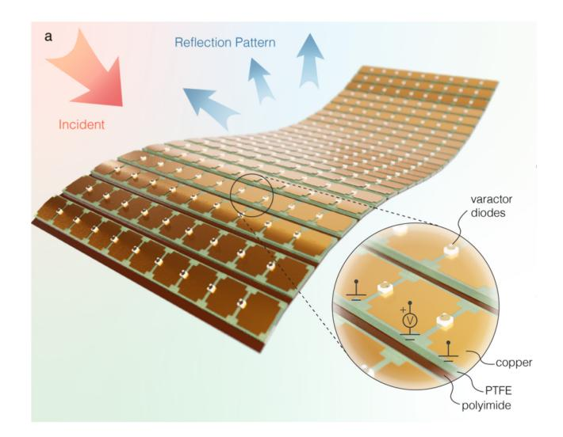

Fig. 4. Semi-rigid reflective 4.5-4.7 GHz RIS with flexible polyamide layer. Source: [\[150\]](#page-34-0).

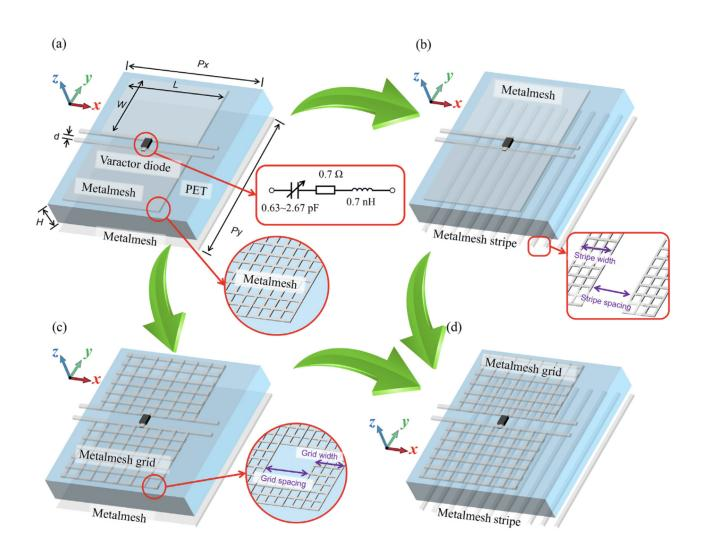

Fig. 5. Reflective 3.6 GHz RIS with 79% optical transparency, implemented as: a) PET patches, b) stripes, c) mesh grid, and d) stripes and grids. Source: [\[113\]](#page-33-9).

the structure, an RIS can even be wrapped around objects and structures, while maintaining its ability to respond to realtime free-form targets, which, for example, can be explored to cancel out the scattering from an object in front of the surface, keeping it from being detected in a certain direction. In [\[113\]](#page-33-9) a 79% optically transparent RIS is proposed, which is illustrated in Fig. [5.](#page-8-1) Such RIS can be implemented in several ways: with transparent copper (PET) patches, or by utilizing mesh grids and/or stripes. The work demonstrates that the performance of this 2-bit RIS is nearly identical to a previously developed 2-bit RIS at 3.6 GHz, that was fabricated on a regular substrate by the same authors.

# *D. Refractive or "Transmissive" RIS*

This category is the reverse of the reflective RIS and exploits the modified Snell's law of refraction, where the metasurface, instead of reflecting the EM waves to a specific direction outwards, refracts them inwards, as described in (2). Similarly to a reflective RIS, the dynamic control of the anomalous transmission angle can be achieved with active switching elements. Although this concept is not new in principle, its applications for the control of the wireless environment are promising. In particular, transmissive RIS structures can be implemented on transparent structures, such as glass [\[101\]](#page-33-10). They can be installed on moving vehicles in public transportation systems to boost outdoor-to-indoor signal transfer. Another potential use of a transmissive RIS is in the field of optics, where it could be used to create lenses or other optical elements that can be reconfigured in real-time. For example, a transmissive RIS could be used to create a variable focus lens that can be adjusted to different focal lengths simply by changing the configuration of the surface. The application of active transistor elements on transmissive RIS is also considered in the literature to achieve gain and an amplification factor. In contrast to the reflection mode, a transmissive RIS can achieve dynamic beamforming capabilities while still passing an in-band RF signal via its aperture. This unique quality greatly enhances coverage in indoor environments provided by outside cellular signals. In addition to its use as a terminal antenna, it may also act as a BS antenna's reconfigurable radome, as outlined in [\[102\]](#page-33-11). This work demonstrates that this technique can be used to suppress the sidelobes in the transmit beam effectively. A summary of potential applications for transmissive RIS is provided in [\[79\]](#page-32-19). As shown in [\[103\]](#page-33-12), it can even be used to boost the uplink communication in a multiantenna system, where the authors propose a far-near field channel model and a transmissive RIS receiver with a single antenna. At very high frequencies, transmissive metasurfaces can be realized on graphene [\[104\]](#page-33-13) or silicon-based nanobars placed in the substrate, therefore creating a PIN junction between them as shown in [\[105\]](#page-33-14). This is an interesting direction for future research as it proves the feasibility of implementing dynamic transmissive metasurfaces directly on semiconductor materials without any active components.

#### *E. Simultaneous Transmissive and Reflective (STAR)-RIS*

This metasurface is a combination of the two presented earlier. For example, STAR-RIS can be designed in such a way as to have reflective properties in one frequency band and refractive properties in another. This is possible due to the application of holographic theory for metasurface design, where small unit cells can form larger unit cells and therefore have a different response and a different frequency. Although, as seen from Table [II,](#page-10-0) practical implementations of STAR-RIS are scarce due to complex design, with only a few examples in [\[106\]](#page-33-15), [\[108\]](#page-33-16), such structures offer high potential for outdoor-to-indoor communication, where mmWave signals can be allowed to penetrate inside with a beamforming gain, while the 3.5 GHz 5G signals would get reflected to coverage gap areas. The authors of [\[107\]](#page-33-17) provided a comprehensive review of simultaneous reflection and refraction communication with RIS, also including equivalent circuit models. To realize this communication, the use of STAR-RIS is necessary, as shown in Fig. [6.](#page-9-0) The practical implementation of STAR-RIS creates

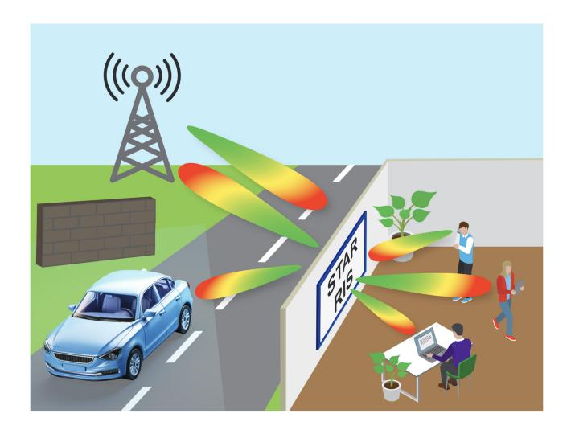

Fig. 6. STAR-RIS can merge outdoor and indoor communications, replacing conventional fiber-optic links.

a new challenge of the mutual influence between reflection and refraction coefficients. The authors of [\[108\]](#page-33-16) produced a STAR-RIS with an integrated incident power detection sensor for perceiving the incident power intensity to achieve a selfre-configurable RIS. In this work, non-tunable reflection is achieved at 6-10 GHz, and transmission is achieved at 5 GHz with tunable absorption coefficients. However, the method of switching between transmission and reflection modes remains an area of ongoing research. The solution proposed in [\[115\]](#page-33-18) considers the use of a time-switching protocol for STAR-RIS and offers a practical method for independently estimating each UE channel by using a training transmission/reflection pattern. The research takes into account the energy-splitting protocol for STAR-RIS in the context of a realistic coupled phase-shift model and develops an individual strategy for concurrently estimating the channels of both users. Another system architecture is presented in [\[116\]](#page-33-19), with a focus on its software configurations. This work introduces a signal model for STAR-RISs and offers three protocols for their operation: energy splitting, mode switching, and time switching. Several possible use cases for incorporating STAR-RISs into the nextgeneration wireless networks are considered, all of which build on the proposed protocols.

#### *F. Space-Time Coding (STC) Digital Metasurfaces*

The innovative concept of STC digital metasurfaces was originally proposed by Cui et al. in 2014 [\[117\]](#page-33-20). According to this concept, a digital signal pattern can be modulated as a hologram on a dynamic metasurface and decoded entirely within the digital domain by the receiver. The latest research by his team shows the implementation of 256-quadrature amplitude modulation (QAM) on a mmWave RIS [\[57\]](#page-32-2) as shown in Fig. [7.](#page-11-0) Digital coding of RIS creates the possibility to eliminate traditional analog waveform generation from RF systems, which is highly attractive, as it can significantly simplify the telecommunications infrastructure and improve its latency. However, digital metasurfaces suffer from several issues as well, which include: a) signal transmission can only

TABLE II PRACTICAL RIS IMPLEMENTATIONS AT SUB-6 GHZ AND 5G MMWAVE

| Type                                          | Size                                      | Frequency               | Gain                               | Substrate                  | Switching element        | Phase response  | Aperture eff. | SLL                  | Ref.  |
|-----------------------------------------------|-------------------------------------------|-------------------------|------------------------------------|----------------------------|--------------------------|-----------------|---------------|----------------------|-------|
| Reflective                                    | $1.2 \times 1.2 \text{ m}^2$              | 3.5 GHz                 | 15 dBi                             | F4BT450                    | Varactor diodes       | Analogue        | -             | -13dB                | [133] |
| Reflective                                    | 256 elements                              | 2.3 GHz and 28.5 GHz | 21.7 dBi 19.1 dBi               | Rogers                     | PIN diodes               | 2-bit digital   | 31.3%         | -16.7dB              | [134] |
| Transmissive                                  | $78.4 \times 78.4 \text{ mm}^2$           | 22.6- 28.2 GHz       | 22 dBi                             | Taconic TLX-8           | PIN diodes               | 2-bit digital   | 25.3%         | -22dB                | [135] |
| Transmissive                                  | $120 \times 120 \text{ mm}^2$             | 12.25 GHz               | 18.3 dBi                           | Taconic TLX-8           | PIN diodes               | 1-bit digital   | 22.6%         | -18dB                | [136] |
| Transmissive                                  | $400 \times 400 \text{ mm}^2$             | 5.6 GHz                 | 23.7 dBi                           | Taconic TLX-8           | Varactor diodes       | Analogue        | 33.5%         | -20dB                | [137] |
| Reflective                                    | $254 \times 272 \text{ mm}^2$             | 3.15 GHz                | -                                  | Rogers RO4350B          | Varactor diodes       | 3-bit digital   | -             | -                    | [138] |
| Reflective                                    | $12 \times 12 \times 5 \text{ mm}^3$      | 4.25 GHz                | -                                  | F4B                        | Varactor diodes       | 3-bit digital   | -             | -                    | [139] |
| Active Transmissive                        | $420 \times 420 \text{ mm}^2$             | 5 GHz                   | 25 dBi (adj.)                   | F4B                        | Bipolar RF transistor | Fixed 25° angle | 15%           | -                    | [140] |
| STAR                                          | $1.2 \times 0.6 \text{ m}^2$              | 3.6 GHz                 | -                                  | PTFE                       | PIN diodes               | 1-bit digital   | -             | -                    | [106] |
| Reflective                                    | $120 \times 120 \text{ mm}^2$             | 29 GHz                  | 15.46 dBi                          | Isola I-Tera MT 0.78 mm | PIN diodes               | 2-bit digital   | -             | -                    | [141] |
| Reflective                                    | $414 \times 259 \text{ mm}^2$             | 5.8 GHz                 | 15 dBi                             | Rogers RT6002           | PIN diodes               | 1-bit digital   | -             | -                    | [142] |
| STAR                                          | 900 elements                              | 5-10 GHz                | 15 dBi                             | F4B 0.508 mm            | PIN diodes               | 2-bit digital   | -             | -                    | [108] |
| Reflective                                    | $600 \times 600 \text{ mm}^2$             | 5.2 GHz                 | 20.1 dBi                           | Rogers 4003C 2 mm       | Varactor diodes       | 1-bit digital   | -             | -                    | [143] |
| Reflective                                    | $100 \times 100 \text{ mm}^2$             | 28.5 GHz                | 22.5 dBi                           | Meteorwave 8000 2 mm    | PIN diodes               | 1-bit digital   | -             | -13dB                | [144] |
| Reflective                                    | 1600 elements                             | 26-31 GHz               | 30 dBi                             | Meteorwave 8000         | PIN diodes               | 2-bit digital   | -             | -                    | [145] |
| Reflective                                    | $1.02 \times 0.72 \text{ m}^2$            | 3.75 GHz                | 21.1 dBi                           | F4BM-2                     | PIN diodes               | 3-bit digital   | -             | -                    | [126] |
| Reflective                                    | 1024 elements                             | 24.5 GHz                | -                                  | Rogers RO3003           | Varactor diodes          | 2-bit digital   | -             | -                    | [146] |
| Reflective                                    | 196 elements                              | 5.1- 5.75 GHz        | -                                  | -                          | Varactor diodes          | Analogue        | -             | -                    | [147] |
| Reflective                                    | 400 elements                              | 27.5 GHz                | 24.7 dBi                           | Rogers 5880                | PIN diodes               | 1-bit digital   | -             | -7.5dB               | [148] |
| Reflective                                    | $400 \times 400 \text{ mm}^2$             | 8.2- 12.4 GHz        | 23.3 dBi                           | GF265                      | PIN diodes               | 1-bit digital   | 22.03 %       | -17.5 to -18.3 dB | [149] |
| Reflective- flexible                       | 38.51 × 13.76 mm 2          | 4.5-4.7 GHz             | -                                  | Semi-rigid PTFE         | Varactor diodes       | Analogue        | -             | -                    | [150] |
| Reflective                                    | 400 elements                              | 2.4 GHz                 | -                                  | Rogers RO4003C          | PIN diodes               | 4-bit digital   | -             | -                    | [151] |
| Reflective                                    | $50 \times 50 \text{ mm}^2$               | 28 GHz                  | 17.9 dBi                           | LCP + FR4                  | Liquid Crys- tals     | Analogue        | 22.53%        | -4.47 to -15.8 dB | [152] |
| Absorptive and reflective                     | $160 \times 240 \text{ mm}^2$             | 5 GHz                   | -10 dBi abs.                    | Panasonic Megtron 7N    | Passive RC biasing       | Analogue        | -             | -                    | [153] |
| Absorptive and reflective multi-beam | 400 elements                              | 5.6-7.4 GHz             | -9 dBi abs. +10 dBi refl. | -                          | Varactor diodes       | Analogue        | -             | -                    | [154] |
| Reflective                                    | 100 and 400 elements                      | 5.3 GHz                 | 25 dBi                             | FR4 0.53 mm             | RF switches              | 3-bit digital   | -             | -10 dB               | [155] |
| Reflective with sensing                       | $60 \times 60 \text{ mm}^2$               | 29-32 GHz               | 26.5 dBi                           | LC + corn- ing glass    | Liquid crys- tals     | Analogue        | -             | -                    | [156] |
| Reflective dual-band                       | $249 \times 429 \text{ mm}^2$             | 2.4 GHz and 3.5 GHz  | -                                  | F4B                        | Varactor diodes       | 3-bit digital   | -             | -                    | [157] |
| Reflective, transparent                    | $\frac{384.6}{200.6 \text{ mm}^2} \times$ | 3.3-3.8 GHz             | -                                  | Polycarbonate (PC)         | Varactor diodes       | 2-bit digital   | -             | -                    | [113] |

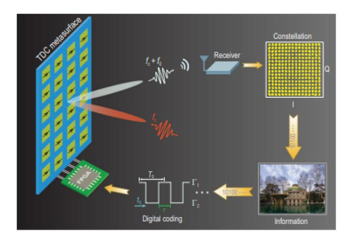

Fig. 7. The concept of 256-QAM digital coding with RIS. Source: [57].

be performed in LOS as the effects of multi-path propagation will distort the encoded image. b) a monochromatic wave has to impinge on the metasurface so that it can be converted into a holographic pattern. All inefficiencies of radio wave generation and propagation still apply to the impinging wave. c) the throughput of digital metasurfaces is severely limited compared to traditional RF architecture as shown in [118] where 78.125 kbps bit rate is reported at 3.5GHz.

Despite these disadvantages, STC digital metasurfaces still show great promise for B5G networks since the digital coding can be implemented in parallel with the main function of the metasurface, which could be radio signal reflection or refraction, or both. Therefore, a backscattering communication can be achieved [60], [61], [62]. In recent work [63], the authors considered a novel co-prime modulation technique that results in a uniform distribution of the scattered power in both spatial and frequency domains to improve the secrecy rate of backscattering communication. For example, the application of this technology could be meta-cryptography [119], which can be used to authenticate RISs and UEs in the network.

#### G. · · · and There be Dragons

As can be seen from Table II, all types of RIS metasurfaces have been built and implemented in practice. Therefore, the TRL of RIS as a technology is generally high. However, it has not received the financial backing from the telecommunications industry yet, which would be necessary for its integration into state-of-the-art 5G systems, and this is likely due to the following reasons:

-  Sub-6 GHz RIS structures are very large, which makes them expensive and difficult to install. Although benefits of sub-6GHz RIS structures on signal propagation have been demonstrated in [120], the RIS to non-RIS performance improvement is only about 3× better, but it would need to be 10× better or more to justify the cost increase of cellular network installations on the early adoption stage.
- The effects of interference that RIS can create on other network users are often not considered in the literature, as described in the previous section.
- Very few RISs presented in the literature can lock on a moving user, which means that the beam-steering ability

- of such RIS will be restricted to covering a specific coverage gap area or the network will be forced to spend extra resources on tracking the UE movement, which is also undesirable to network operators.
- • One of the key issues associated with RIS is precisely predicting the EM propagation in the RIS-assisted wireless channel, which becomes critical for telecom operators to distribute radio resources. For example, the work of [121] suggests using an Eulerian ray-tracing approach, called dynamical energy analysis (DEA) to account for the EM interaction between RISs and the surrounding environment. Also, the application of LiDAR on metasurfaces can be considered for environmental modeling and will be detailed in the next section. However, there is no unified approach to solving this problem at the time of writing.
- The literature lacks comprehensive studies on specific absorption rate (SAR) testing and the effects of EM fields (EMF) exposure of RIS on the human body. The authors of [122] provided an evaluation of the EE of an RIS with EMF constraints. This work shows that RIS-aided communications can achieve the same level of EE while ensuring SAR-compliant communications with or without EMF constraints. Other recently published work in this field includes [123], but it concentrates on mMIMO networks, and similar work [124], [125] addresses the problem of high-exposure regions created by MIMO beamforming. These studies propose an RISassisted beamforming scheme to reduce the resulting EMF and solve this problem, but the RIS must be able to self-reconfigure to use this scheme. While it is possible to send pilot signals in the BS-RIS-UE link, the UE location awareness can boost the obtained results and maximize the received signal power independently from system latency. It is an important conclusion because regulatory bodies such as the European Commission and the Federal Communications Commission (FCC) require telecommunications equipment with strong emitting RF power to operate in the far field while maintaining a specific distance to the user, which has to be fenced off and is only accessible to personnel wearing personal protective equipment (PPE). If such regulations were applied to RIS, its use cases would be severely restricted.
- • Estimation of the scattering from finite-sized anomalous reflectors and the behavior of metasurfaces, when illuminated from different directions, is often missing from the literature. An example of such work is [92], which investigates the angular response of anomalous reflectors and assesses the far-field scattering of reflective metasurfaces under varying illumination angles. This work shows that even a small deviation of the incident angle from the design value leads to a dramatic change in reflector performance, in which the reflection angle becomes different from the programmed value.
-  To the best of the authors' knowledge, all RIS demonstrations presented in Table II have obtained measurement results by illuminating RIS with horn antennas, except [126], which also provided measurements obtained with a monopole antenna. While a horn antenna is

an accurate representation of a signal emitted from a BS, it is not representative of a signal emitted from a UE, which is typically just a single patch antenna, as would be the case inside the majority of mobile phones. The mentioned monopole antenna measurements already show degradation in the received power at all locations, except for the reactive near field, and the levels are expected to be even worse with conventional patch antennas. Furthermore, global standards such as FCC CFR 47 Part 15 [127] and ETSI EN 301 908 [128] impose a +23 dBm transmit power limit on UE, which is rarely mentioned in the literature. Therefore, the size of the RIS must be sufficiently large to pick up plane waves from the UE transmitting at that level. Passively directing randomly scattered EM waves to BS is not likely to be enough to reach it with the increasing distance, especially if there is no LOS condition between the RIS and UE. In that case, for communication to work in the uplink direction, it would be necessary to use an MF-RIS with an integrated holographic sensor data fusion framework that is capable of localizing the UE to create a near-LOS channel. Additionally, polarization sensitivity remains a critical issue for RIS designers, since the incursion of phase-switching elements such as varactor diodes, PIN-diodes, etc. frequently results in a varied response of the RIS in transverse electric (TE) and transverse magnetic (TM) modes of linearly polarized (LP) impinging EM waves. RIS unit cells require symmetry in vertical and horizontal planes for the identical TE and TM modes response, which implies that an even number of phase-switching elements should be used to realize the polarization insensitivity of the RIS.

• The problem of RIS bandwidth and multi-user operation. While the RIS bandwidth is typically limited, the literature lacks comprehensive studies dedicated to RIS operating in a multi-user scenario. Several research works such as [131] propose using neural networks to create multi-beam reflection patterns while also exploiting the effects of mutual coupling. A different approach is taken in [132], where a power autonomous RIS selfreconfiguration is proposed based on sensory information about user location and the environment. In this case, the division is performed in the time domain, while each UE gets the full power of the beam, but only for a limited time frame in time division duplexing (TDD) mode. Despite various proposals, there is no common approach to solving the multi-beam multi-user scenario, and in practice, a combination of multiple methods might be necessary.

In summary, more research is required on RIS to make this technology mature enough for commercial and industrial applications. There is a clear need to provide solutions for the issues already mentioned and those are discussed next.

#### IV. OPEN ISSUES AND CHALLENGES

As outlined in the previous sections, there are many shortcomings in state-of-the-art RIS implementations, which have been designed as a proof of concept of reconfigurable anomalous reflection. Therefore, the next logical step in RIS evolution is its integration into real networks with physical constraints. In this section, we provide an overview of these constraints and the most promising novel proposals that can boost the chances of RIS succeeding in the B5G world.

#### A. Increasing the Effective Aperture

The effective aperture size of an RIS has to be sufficiently large to regulate the amount of reflected energy and phase distribution smoothly. It must be no less than several  $\lambda$ , with a typical value between  $8\lambda$  and  $20\lambda$ . However, even with these values of  $\lambda$ , the effective aperture rarely exceeds 30% in practical RIS, as seen from the literature. Although the obvious solution to this problem is to make the metasurface even larger, but this is not practical.

The novel work by [158], [159] considers the mutual coupling gain that can be realized with ultra-small RIS unit cell sizes of  $\lambda/8$  or even  $\lambda/16$ . Consequently, this forces a very tight spacing between unit cells, less than  $\lambda/2$ , and in this case, the effects of evanescent fields and mutual coupling between cells cannot be ignored. However, in the follow-up work [160] the authors have shown that in theory the sum rate can be almost tripled in the case of mutually coupled unit cells with cell size  $\lambda/16$  compared to  $\lambda/2$ . In practice, this means that such a metasurface will have ×8 more unit cell elements for the same aperture size, thus making the hardware development exponentially more complex. However, the disadvantages of low aperture efficiency can certainly be reduced that way. In this work, the authors have also provided an effective algorithm for the optimization of the precoding at the transmitter and the configuration of the RIS.

Another assumption that could be employed on the MIMO BS side is the non-uniform modulation for the antenna array. This means that the first harmonic components from antenna array elements will have different center frequencies, therefore it would be possible to distinguish between them and calculate the time difference of arrival (TDOA) with high resolution. The application of such an algorithm is described in detail in [161]. Although this method does not increase the aperture efficiency of the metasurface itself, it allows the BS to focus its beam directly at its center given the estimated TDOA.

Finally, a third approach to tackle the problem of the low aperture efficiency of an RIS would be to maximize the throughput by using a multi-band metasurface, therefore enabling communication to take place simultaneously across several frequency bands. It is worth mentioning that a similar concept has been implemented on reflectarrays for space applications, which is demonstrated in [162], [163]. However, a multi-band RIS can go a step further by decoupling transmit and receive signals. This is a novel concept that largely remained unexplored up until now, which can improve the overall efficiency of the design. The authors of [82] demonstrate a dual-band metasurface optimized for operation at 7.6-7.8 GHz and 11.2-11.8 GHz in a 2-bit mode, which is achieved by having four separate channels for phase distribution. Another design presented in [164] demonstrates a dual-band active RIS metasurface for 1-bit digital coding and the working range of the metasurface is 10 GHz to 13 GHz.

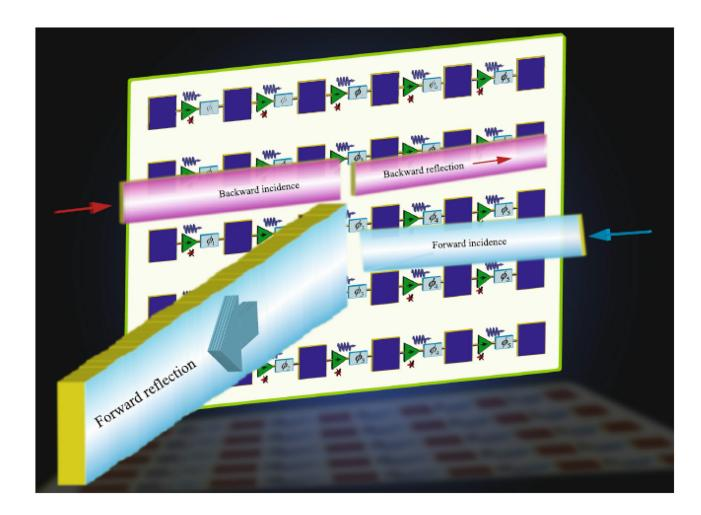

Fig. 8. The concept of hybrid active RIS with amplification gain. Source: [165].

By adding three separate PIN diodes the authors were able to separate transmitted and received phase responses and to control them independently in X and Y polarization.

#### B. Hybrid Active RIS With Amplification Gain

While the RISs available in the literature offer the ability to control the phase response of reflected waves, the ability of such metasurfaces to control the amplitude response is limited and can only be achieved through beamforming. Therefore, arguably such structures should be considered passive, meaning that they only reflect radio waves and do not provide amplification gain. On the other hand, a new class of intelligent metasurfaces has recently been proposed by Taravati and Eleftheriades in [165] that considers adding amplification gain to the reflecting signal by integrating an active element inside the unit cell, such as a transistor. Such metasurfaces can then be considered as a hybrid active RIS, as they will be able to achieve unrestricted control over both the phase and amplitude of the reflected signal. The mentioned work proposes cascaded radiator-amplifier-phased chains as shown in Fig. 8, where the received radio wave acquires power gain in one unit cell and is reflected at the desired angle of reflection through another unit cell. The system model of such metasurface has been proposed independently in [47] to overcome the double fading problem, which means that the end-to-end path loss between the transmitter and receiver is the product of the path loss coefficients between the BS and RIS and between the RIS and UE. However, the amplification gain of this metasurface is non-uniform meaning that it varies depending on the incidence angle. Also, the reflected signal must pass through the phase-shifting element before it gets amplified, implying that the specular reflection will likely reach the UE faster, which is undesirable and can result in intermodulation interference and distortion. Finally, for each transmitting unit cell there needs to be a receiving unit cell, meaning that the size and energy consumption of such metasurface will be doubled. In a separate work, [166] the same authors also proposed an intelligent metasurface capable of frequency conversion with controllable frequency bands and transmission magnitude. Similarly, the frequency conversion

is achieved by double-fed antenna pairs, where the patch sizes are  $\lambda$  and  $\lambda/2$  respectively. This results in up-and-down frequency conversion that is clean from spurious emissions and does not rely on conventional nonlinear RF mixers. One use case for such hybrid RIS could be to covert frequencies between outdoor and indoor communications.

Other research works [167], [168] have theorized the concept of hypersurfaces (HSFs) with the integration of RF chains on RIS for UE localization and information exchange. This work proposed a beamforming algorithm for HSF that is capable of dynamically locking into a target moving at a speed of 100 km/h such as a vehicle by sampling the received power P(t) with the RF chains integrated on the metasurface. While the concept of HSF is still considered an extension of RIS, the boundary between it and the concept of holographic MIMO described previously is rather unclear. However, it is important to note that the power consumption of hybrid active RISs must be significantly lower than the power consumption of active repeaters and BSs in order for this technology to move forward. Additionally, its EMF exposure limits must be defined and tightly controlled, so that from the radio compliance perspective a hybrid active RIS as well as an RIS with sensory elements would be considered as a short range device (SRD) [169] and not as a cellular IMT, such as BS [128], that can produce dangerous EMF exposure values [170] and requires restriction of access [171].

Overall, the concept of a hybrid active RIS is still in its infancy, and below we identified research directions that may help it succeed in the future:

1) Single Cell Reflection Amplification: Reflection amplifiers (RA) first emerged for applications in the X-band and were originally fabricated with Gunn and Tunnel diodes, exploiting their differential negative resistance region to amplify reflected signals. However, the resulting reflecting amplifiers were narrowband and featured low stability, making the design process extremely complex. In 1979 a prototype based on GaAs MESFETs with positive parallel feedback was developed, which showed 8dB gain at 23GHz [172]. A similar approach has been employed by the authors of [173], [174], [175] using HJ FET, but featured a series feedback mechanism, which significantly improved its stability and efficiency resulting in a 19 dB gain at 1.5 GHz. The main distinction between parallel and series feedback is the phase shift of the voltage feedback in comparison to the voltage source, which is  $2n \times \pi$  for the parallel feedback and (2n +1)  $\times \pi$  for the series feedback where  $n = (0, 1, 2 \cdots)$ . This means that the voltage source and voltage feedback phases are not equal in the series feedback circuit, which reduces the possibility of self-excitation and improves the stability of the amplifier. One of many challenges of one-port amplifier design is that the value of the transistor source inductance must be carefully calculated to resonate at the frequency of interest, while also including the effects of gate-source capacitance (Cgs). This source inductance acts as a reservoir of magnetic energy which enables the transistor to produce self-induction voltage. This voltage in turn creates the effect of negative resistance at the transistor's input and that is the key enabler for the amplification of the reflected signal.

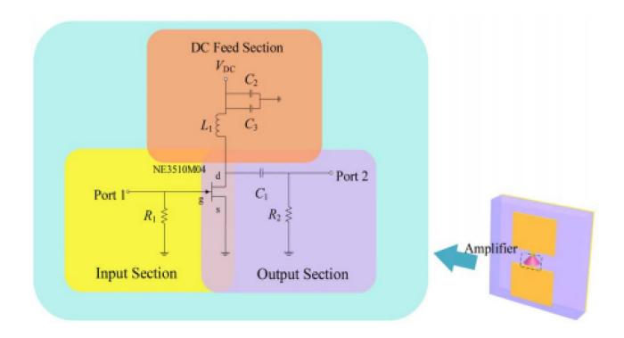

Fig. 9. Reflection amplifier (RA) circuit added to an RIS. Source: [\[180\]](#page-35-0).

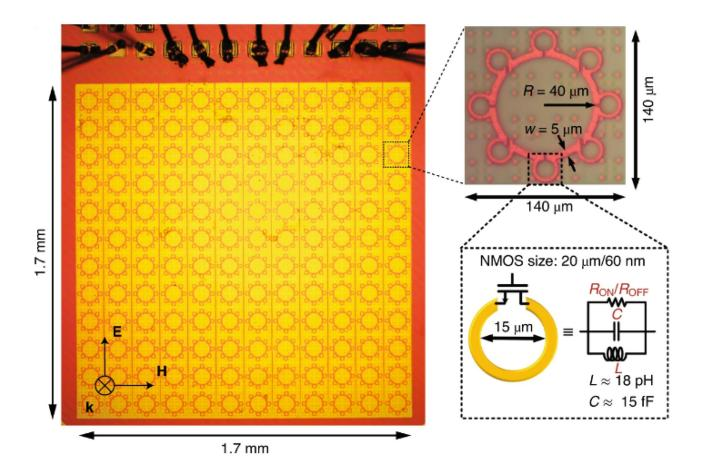

Fig. 10. Holographic THz metasurface integrated on CMOS. Source: [\[183\]](#page-35-1).

Aiming to improve the designs presented above, the author of [\[176\]](#page-34-19) developed a different FET-based approach to the design of a one-port reflection amplifier by adding an external inductor between the input source and the gate of the FET. This results in several advantages a) the current through the inductor is in phase with the signal, allowing positive feedback and signal amplification b) a mutual magnetic field reservoir is formed by the combination of an external inductor with the internal source inductance of the transistor, allowing easier control of the resonating frequency. This work achieved 29 dB of gain at 433 MHz for RFID applications.

In a different work, the authors of [\[177\]](#page-34-20) proposed a BJT-based one-port reflective amplifier that terminates the nonlinear transmission line (NLTL) in an oscillating circuit, which in this example can be thought of as a unit cell of an RIS, therefore providing amplification gain to oscillating signals. The incoming wave to the RA is reflected with the same shape. The incoming and reflected waves superpose to increase the joint voltage at the open end, therefore achieving a voltage gain. An important feature of this circuit is that it is capable of providing level-dependent amplification rather than uniform amplification of all signals by employing an adaptive bias scheme. This helps to reduce the effects of noise and signal modulation on the stability of the amplifier. Khalil in [\[178\]](#page-35-2) examines the amplification cell efficiency of an RIS and proposes several approaches to optimize it, to increase the gain of RIS reflection. He argues that the RA must remain active regardless of the reflective load impedance as, otherwise, its performance is compromised. In other work, the authors of [\[48\]](#page-31-30) and [\[179\]](#page-35-3) compare RIS structures with amplification gain against passive reflective structures in terms of achievable sum rate and power budget. They conclude that the application of active RIS is feasible with an optimal power splitting ratio between RIS and BS, while the achievable bit rate can be more than doubled in some situations with active RIS. The concept of active reflective FET amplification has been successfully applied to metasurfaces by the authors of [\[180\]](#page-35-0), achieving a 10 dB tunable range of reflection amplitude at 4.18 GHz. The basic circuit arrangement is shown in Fig. [9.](#page-14-0) This work proves the feasibility of the concept for 5G communication systems, however, the phase response of this structure is not reconfigurable, so in other words it cannot be described as an RIS. In a different work [\[181\]](#page-35-4), the authors developed a 2×2 RA prototype operating at 2.4 GHz capable of achieving 8.5 dB gain for four reconfigurable phases. The developed phase reconfigurable RA element contains a tradeoff between the RA gain and the phase shifter's losses, which requires careful tuning. However, this prototype is excessively large and contains only a small number of unit cells.

In summary, providing simultaneous signal reflection and amplitude boosting at a known UE location can become critical for facilitating uplink communications. Additionally, amplitude boosting can significantly improve the achievable radar detection performance of an active RIS in ISAC systems [\[182\]](#page-35-5). However, such signal boosting must be carefully controlled with a feedback mechanism to limit its application to signals that are already strong and ensure EMF exposure compliance. We envision this as a very promising direction for future RIS-related research.

- *2) Transmissive Amplification:* Just as in the case of reflecting RIS, a voltage-controlled transistor gain can also be applied in the refracting direction "inwards". In fact, in such applications the signal path already exists, which simplifies the design process. However, the designer still needs to think about controlling the amount of amplification gain. Because, as mentioned in the previous sections, the radiating power from the RIS must not exceed 23 dBm in any direction, which is the agreed regulatory limit.
- *3) CMOS Integrated Solutions:* As can be seen from previous sections, the implementation of gain control and active feedback is very complex and requires tight tolerances of components. This may not be possible to achieve with discrete components, and therefore the integration of RIS unit cells on silicon CMOS chips should be considered. That would offer much higher precision of control. The summary in [\[84\]](#page-32-22) provides an up-to-date overview of the published work on this topic. Among these works, particularly stands out the work presented in [\[183\]](#page-35-1), which is shown in Fig. [10.](#page-14-1) This metasurface is designed for THz frequencies, allowing it to be only 2 × 2 mm with 12 × 12 meta elements and implanted directly on CMOS. This work proves that dynamic amplitude control can be successfully realized on metasurfaces alongside the signal reflection, as originally proposed in [\[184\]](#page-35-6). It achieves 12.5 dB amplitude variation at 0.3 THz on the

same unit cell. By employing a FET-based design, the CMOS chip features a very low energy consumption of 200 uA and an extremely fast switching speed of 6 nS clocked at 5 GHz.

#### C. Cancelling Out the Specular Reflection

The analytical work presented in [185] provides the basis for analyzing the specular reflection that is inevitably created by an RIS along with the desired anomalous reflection. When an RIS is mounted against a solid surface with known physical properties, it becomes possible to engineer the natural reflection from the solid surface to cancel out the specular reflection of RIS as demonstrated in [186], [187]. To summarize this work, if the reflection from the solid surface is viewed as a negative reflection coefficient

$$\Gamma_{-1} = \sqrt{\eta_{eff}} \sqrt{\left(\frac{\cos\theta_i}{\cos\theta_r}\right)},$$
(9)

where  $\eta_{eff}$  in the maximum theoretical efficiency of reflection [92]. Then, the mutual coupling  $S_{21}$  between the receive and transmit power at the product of their respective distances  $R_t R_r$  can be expressed as

$$|S_{21}|^2 = \frac{P_r}{P_t} = G_t G_r \eta_{eff} \left(\frac{S}{4\pi R_t R_r}\right)^2 \cos \theta_i \cos \theta_r, (10)$$

where  $G_t$  and  $G_r$  are the corresponding transmit and receive antenna gains, and S is the area of RIS that is equal to the product of its width and height for a rectangular RIS. If the assumption is made that the material response of the solid wall is known and defined as

$$G_m = \eta_{eff} \left(\frac{S}{4\pi\lambda}\right)^2 \cos\theta_i \cos\theta_r. \tag{11}$$

Then, the received power can be optimized as a function of  $G_m$  to cancel out the unwanted reflection, as follows

$$P_r = P_t G_t G_r \frac{\lambda^2}{(4\pi R_t R_r)^2} G_m.$$
 (12)

While this method will work well for RISs placed against a defined surface, such as a concrete wall, the cancellation of specular reflection from a STAR RIS is less straightforward as it may not have a solid adjacent surface, and more research on this topic is needed. The application of sensors on the back of the RIS can help it to determine its surroundings and cancel out the specular reflection in a reconfigurable manner.

#### D. Optimization of Phase Switching Networks

The choice of phase-switching method has been covered extensively in the literature and the current proposals include PIN diodes, MEMS switches, varactor diodes, LCs, or graphene-based structures to name a few. Table III provides a comparison of phase-switching methods suitable for RISs with operational frequency up to mmWave. Designs that use varactor diodes, such as [133], [137], can achieve higher resolution for phase distribution, given their linear response which is accomplished with the use of digital to analogue converters (DACs). However, if 2-dimensional beamforming is desired,

TABLE III
COMMON RIS PHASE SWITCHING METHODS

| Item            | Voltage | Energy consumption | Switching speed   |
|-----------------|---------|-----------------------|-------------------|
| Varactor diodes | 0-30 V  | <1 mW                 | 1-100 nS          |
| PIN diodes      | 3-5 V   | 5-10 mW               | 1-100 nS          |
| RF switches     | 3.3 V   | <6 mW                 | <b>100-200</b> μS |
| FETs            | 3-5 V   | <0.1 mW               | 1-100 nS          |
| Liquid crystals | 1-8 V   | <0.1 mW               | 1-5 mS            |

the number of required DAC channels should match the number of unit cells. Meanwhile, high beamforming resolution is rarely necessary and in most cases, two-state switching or '1-bit' is sufficient to realize RIS-assisted beamforming. For a 1-bit digital RIS, the state of the switching element (i, j) is calculated as a function of reflection phase  $\theta_T$  and distance d, according to

$$\begin{cases} 1, \frac{\pi}{2} < \operatorname{mod}\left(\frac{2\pi}{\lambda}(d_{\mathrm{BS-RIS}} + d_{\mathrm{RIS-UE}}) - \theta_r, 2\pi\right) < \frac{3\pi}{2} \\ 0, \text{ otherwise} \end{cases}$$
(13)

Therefore, by either integrating n-switching elements within a single unit cell or by switching varactor diodes in nstates that correspond to defined voltage levels, it is possible to realize an n-bit digital RIS, and the authors of [188] show that 3-bit phase shifting is enough to achieve a phase response that is very similar to the one of an RIS with continuous phase response. Examples of 3-bit switching RISs include [126], [137], [138]. An alternative way of controlling the switching elements is proposed in [189], [190]. Rather than employing an independent control for each unit cell, the use of a biasing transmission line (TL) is proposed with a set of voltage standing waves that control varactor diodes. The sum of the standing waves provides the polarization bias to each varactor. The single port biasing TL is excited with a time domain periodic signal with a specific frequency. By employing this method, the amount of control signals can be significantly reduced, however, the disadvantage of this method is the time delay it takes to update the entire metasurface. A different method to reduce the number of biasing lines is proposed in [191]. In this work, the authors propose to develop a static metasurface with variable unit cell geometries on the top layer where each unit cell is also controlled with active varactor diodes placed on the bottom layer. The phaseshifting ability of such a structure is confined to only a specific range, but the switching speed will no longer be an issue. The authors of [192] have been able to reduce the number of control elements to only the relative amplitude and phase between the superimposed vortex components by application of composite vortex (CV) theory. This algorithm allows to switch on and off only a small portion of the metasurface at the time, however, it also restricts the beam scanning range. These works go in line with the mutual coupling gain described earlier. Given the tight spacing between unit cells and ultra-small unit cell dimensions, individual control of such elements can be impossible to achieve in practice and the reduction of the number of biasing lines is necessary for the successful realization of such structures. The authors of [193] considered an algorithm for the optimization of RIS phase shifts for various frequencies, which reports that to utilize the multiple frequency components simultaneously, it is essential to separate the harmonic waves so that they can be directed to different angles. The authors of [194] described an MF-RIS prototype with bianisotropic unit cells that are capable of separating a 33 GHz (third) harmonic from a 10.4 GHz fundamental radio wave while leaving the 52 GHz (fifth) harmonic intact. Implementation of such structures can allow operation at multiple frequencies and can be used to support several radio access technologies at once.

#### E. Increasing the Throughput With Multi-Layered LC RISs

Application of LCs for 5G mmWave RIS is considered in [195]. LCs provide a cheap and effective way to fabricate RIS with multiple layers that allows for increased communication throughput, however, its main drawback is the switching speed, which for LCs is given as

$$t_{\text{off}} = \frac{\gamma_{\text{rot}}}{\epsilon_0 \Delta \epsilon_r} \frac{\tau_{\text{LC}}^2}{V_{\text{th}}^2},\tag{14}$$

where  $\gamma_{\rm rot}$  is the rotational viscosity,  $\epsilon_0$  is the permittivity in free space,  $\epsilon_r$  is the dielectric anisotropy at the biasing frequency which is typically set to 1 kHz,  $\tau_{LC}^2$  is the thickness of the LC layer and  $V_{\rm th}$  is the threshold voltage needed to rotate the molecules. By reducing the rotational viscosity which is the physical property of various LCs, the switching speed can be reduced. The authors of [196] show that the switching speed of < 1 ms is possible with LCs by employing biaxial Freedericksz transition, which has not been considered before. Also, similar to a varactor diode, LCs can be tuned either continuously or in multi-bit steps with an application of defined voltage levels between 0 V and  $V_{\rm max}$ . Research shows that the response time of LCs can also be reduced by overdriving control signals based on LC director dynamics and adopting a polymer network LC (PNLC) [195]. A practical implementation of LC-based RIS is considered in [152], where a 2-layered LC structure is proposed to increase the throughput of RIS. The authors define the achievable throughput in terms of implemented number of LC layers in the structure vL as

$$T(\text{Mbps})$$

$$N_{\text{ppp}}^{\text{BW}j,u}$$

$$=10^{-6} \sum_{j=1}^{J} \left( v_{\rm L}^{j} Q_{\rm m}^{j} f_{\rm sc}^{j} R_{\rm max} \frac{N_{\rm PRB}^{{\rm BW}j,u}}{T_{\rm s}^{\rm u}} \left( 1 - {\rm OH}^{j} \right) \right), \quad (15)$$

where  $Q_m$  is the modulation order,  $f_{sc}$  is the scaling factor,  $T_{\rm s}$  is the symbol duration, PRB is the physical resource block with respect to the bandwidth (BW), and u and overhead (OH) are calculated with the number of carriers J. As can be seen from the formula, increasing the number of LC layers will allow to increase the throughput even further. In the follow-up work [197], the authors provided coverage enhancement results from field trials with their prototype. A different work in [156] presented a single-layer LC-based RIS prototype fabricated on glass, which is capable of maintaining a 2.8 Gbps communication link at a 1.5 m distance.

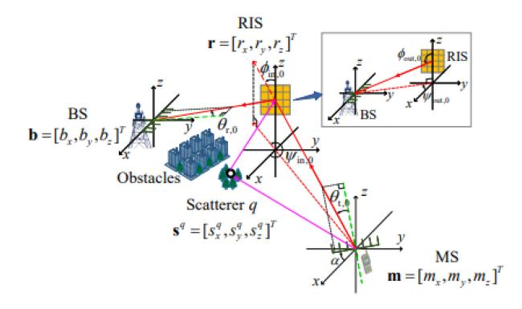

A geometrical model of an RIS-aided positioning system. Source: [208].

#### F. Adding Sensory Intelligence to an RIS

Integration of RIS with UE mobility tracking techniques is critical for its success as a technology, especially for mmWave communication that requires point-to-point links and cannot rely on multi-path reflections, since there are simply not many of them [198], [199].

For an RIS to perform point-to-point communication, it should know the positions of BS and UE. Traditionally, cellular networks use RSSI methods to estimate the location of a UE based on the known locations of at least three BSs or three Wi-Fi access points according to the trilateration process. However, the localization accuracy of this method is limited because a) having less than three Wi-Fi access points does not work [200] and it is rare that the environment has three access points, and b) the accuracy of the algorithm is dependent on the dropout rate [201] and can only provide 0.664 m accuracy at best [202], which is arguably not good enough for mmWave communication.

In contrast, MIMO antenna arrays enable localization through beam scanning methods, but these methods are not immediately applicable to RIS. While the traditional RIS does not contain any RF chains and cannot sample the impinging waves directly, it is still possible to use traditional RIS as the medium in the middle to perform beam scanning and adjustment as shown in Fig. 11, which is described in [211]. This concept is inspired by the pioneering work by W. B. Bridges, which was published in 1974 [203], and has since been implemented in my applications including optics [204], [205], 5G mmWave communication [206], [207], [208], and even with acoustic waves [209]. However, the main drawback of this approach is the introduced latency and computational complexity, since in the RIS case, the calculations would need to be performed by the BS with subsequent updates for all RIS configurations on the network. Additionally, this technique cannot predict blockages and assumes LOS conditions between the RIS and UE, as well as no LOS between BS and UE. Combined, the model becomes rather unrealistic for practical RIS implementations.

An alternative approach is to integrate a holographic sensor fusion data framework on the RIS controller itself. This approach offers several advantages in terms of latency performance as well as improvement in beam scanning accuracy and also allows the construction of non-LOS propagation channels by predicting the environmental response to radio wave propagation. The drawback is that the RIS would have to sample the impinging waves and incorporate either RF chains or radar elements, which leads to an increased complexity of the structure. However, this drawback can be mitigated by selecting low-power and low-cost sensing elements, that can be placed sparsely on the structure.

# V. DEFINITION OF MULTI-FUNCTIONALITY

MF-RIS is a new type of metasurface with functionality that exceeds simple radio wave reflection or transmission. Although the tuning of radio waves remains fundamental to RISs, additional components are needed to make them useful for practical networks. In this section, we provide a review of the various degrees of multi-functionality that an MF-RIS may employ.

#### *A. RIS With Sensing Capabilities*

To integrate sensory intelligence on an RIS, it may include some or all of the following:

*1) Radar Sensors for Simultaneous Localization and Mapping (SLAM):* this will allow an MF-RIS to tackle the issues of low aperture efficiency in uplink communications and improve the EE by establishing direct point-to-point links between the RIS and UE with pencil-beam waveforms that adapt real-time to UE movements. The authors of [\[156\]](#page-34-24) demonstrate an LC-based RIS with integrated 6 × 6 multi-port Rotman lens for DoA estimation of UE via a power sensing network at 28 GHz. The authors reported that this MF-RIS was able to track the UE mobility and adjust the channel with 2.4 Gbps throughput. However, a multi-user environment cannot be supported by this design, due to limitations of power sensing, which is unable to distinguish LOS signals from reflections and other UE. An alternative approach is to use state-of-the-art mmWave radar industrial solutions that report detectable distances up to 100 m for a person and up to 200 m for a car [\[212\]](#page-35-33), while also achieving micron-level accuracy in the near field [\[213\]](#page-35-34). Given a medium-size RIS with width 15 × λ, such a detection range is reasonable because the RIS gain fades away with increasing distance, as shown in [\[97\]](#page-33-1). This work along with [\[214\]](#page-35-35) shows that for an RIS of a certain size, there is a distance beyond which the structure will no longer be effective at reflecting radio waves. This calculated distance needs to match the radar range, which poses a challenge for MF-RIS implementations since the transmitted power of mmwWave radar SRDs is limited to 13 dBm by international EMF exposure standards [\[170\]](#page-34-13). However, with the use of mmWave MIMO radar technology implemented on an MF-RIS, it is possible to achieve centimeter-level position errors within a 10m2 area, as shown in [\[215\]](#page-35-36).

*2) LiDAR Sensors for Environmental Modeling:* it has been shown in [\[216\]](#page-35-37), [\[217\]](#page-35-38) that LiDAR technology can be successfully used for modeling radio propagation environments, including the estimation of physical properties of objects. Through the integration of LiDAR, MF-RIS will be able to manipulate radio waves based on natural reflections in the environment and consider alternative paths for radio propagation. Although slow and computationally expensive, maximum likelihood estimation (MLE) can be performed on the controller in the background, to estimate the best path for radio propagation between the RIS and UE. Then, the natural properties of objects, such as permittivity and permeability, would also be considered and taken into the calculation. The authors of [\[218\]](#page-35-39) demonstrate that a LiDAR antenna can be constructed on a Si*O*2 metasurface with an optimal optical response even at very high irradiance levels ranging from 1.6 kW/cm2 to 9.1 kW/cm2 that originate from an illuminating laser beam. This proves that in a complex MF-RIS structure, the LiDAR functionality can be integrated directly into the metasurface rather than treated separately.

*3) Other Environmental Sensors:* for example humidity, gyroscope, height, temperature, and GPS sensors would allow RIS to accurately position itself on the map and adjust the reflection phase based on the changing properties of the environment. An example of adaptive self-configurable MF-RIS is considered in [\[219\]](#page-36-0).

# *B. Power Autonomous RIS With Energy Harvesting Capabilities*

While RISs promise reduced energy consumption compared to active relays [\[225\]](#page-36-1) and BSs, they are still reliant on the availability of the electrical grid or efficient batteries. To lift this dependency, the power consumption model of an RIS needs to be considered, which can then be fed from an alternative source of power supply.

*1) RIS Power Consumption Model:* in [\[222\]](#page-36-2) the authors provided the first comparative analysis in terms of consumed power between a PIN-diode-based RIS and a varactor diodebased analogue RIS. They observe that, for either structure, the consumed power increases significantly with the increase of reconfigurable elements to the point, that it may be similar to the energy consumption of active relays. Although the current consumption of varactor diodes is negligible, the energy consumption of individual DAC channels is high. This becomes a problem if the individual control of unit cells is desired for two-dimensional beamforming, as mentioned previously. The authors did not consider switching varactors in discrete steps rather than with a DAC, which would give the lowest possible current consumption. However, the energy consumption of RIS should not be ignored. Recent results in [\[223\]](#page-36-3), [\[224\]](#page-36-4) provided a comprehensive RIS power consumption model. For an RIS with *M*s number of unit cells, the authors derived the following expression for total power consumed by an RIS

$$P_{\rm RIS} = M_{\rm s} \left( P_{\rm st} + 2 \frac{E_{\rm UC}}{T_{\rm fr}} \right), \tag{16}$$

where *P*st is the static power consumption of each unit cell, *T*fr is the frame duration, and *E*UC is the energy consumption required to reconfigure each unit cell, which is assumed to be the same for all unit cells.

*2) RF Energy Harvesting:* the authors of [\[226\]](#page-36-5) consider the power autonomous operation of an RF-identification (RFID) RIS system with RF-EH elements. It utilizes 10 × 10 Alien ALN-9840 Gen2 RFID tags as RIS unit cells operating at 870 MHz and placed in a planar structure. The authors have

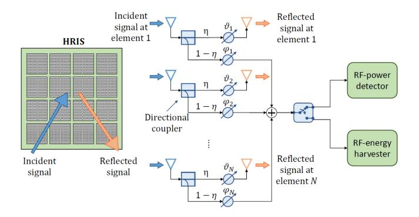

Fig. 12. Autonomous-RIS (ARES) with RF energy harvesting. Source: [\[132\]](#page-33-33).

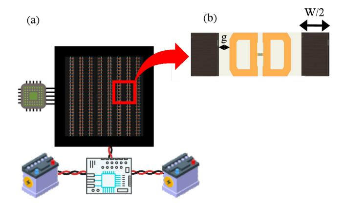

Fig. 13. RIS with interleaving solar cells a) diagonal metasurface b) unit cell. Source: [\[228\]](#page-36-6).

been able to achieve a power-autonomous operation without any batteries and by using RF energy alone. Of course, the power consumption of RFID tags is much lower than that of conventional microcontrollers and DACs required for driving an MF-RIS. However, the novel application-specific integrated circuit (ASIC) research presented in [\[227\]](#page-36-7) shows that a DAC developed specifically for metasurface applications can have a total static current as low as 190 μA, which gives 342 μW with 1.8V operational voltage for *P*st in the formula [\(16\).](#page-17-0) Such structures can then be equipped with EH cells that absorb radio energy and convert it to DC as shown in [\[132\]](#page-33-33) and illustrated in Fig. [12.](#page-18-0) The surface of MF-RIS has to be large enough to charge the battery and maintain the real-time operation of such MF-RIS. Several prototypes of MF-RIS capable of radio signal reflection and absorption are described in [\[153\]](#page-34-25), [\[154\]](#page-34-26). These works prove that RF harvesting could be possible to sustain an MF-RIS operation in active mode for low-power structures that do not require high computational performance.

*3) Solar Energy Harvesting:* While RF energy harvesting is suitable for densely populated indoor environments, its availability is less abundant outdoors. The amount of harvested energy can be significantly boosted with the integration of solar cells alongside the radio wave reflecting cells resulting in a combined solar and radio structure, which is the solution proposed in [\[228\]](#page-36-6) and illustrated in Fig. [13.](#page-18-1) This work shows that the reflecting cells of an RIS can be interleaved with solar cells without increasing the overall dimension of the structure and using the conventional λ/2 spacing. By doing so, one can make the resulting structure power autonomous and allow large amounts of harvested energy, which may be sufficient even for powering neighboring devices via WPT in an equally spaced domino-tiled structure [\[229\]](#page-36-8), with maximum efficiency achieved according to [\[230\]](#page-36-9). The prototype of such a system has been developed and demonstrated by the ELEDIA research center in [\[231\]](#page-36-10). A similar concept has been proposed for reflectarrays [\[220\]](#page-36-11) and implemented on NASA Cubesat satellites [\[232\]](#page-36-12). However, it should be noted that in these works, the efficiency of both solar panels and radio signal reflection is compromised due to the sub-optimal relative permittivity of glass.

# *C. Simultaneous Wireless Information and Power Transfer (SWIPT)*

Another promising future research direction for MF-RIS is the implementation of SWIPT, with MF-RIS acting as the distributing medium of wireless power, as outlined in [\[233\]](#page-36-13). One of the techniques to achieve WPT on metasurfaces is the use of split ring resonators (SRR) placed on planar surfaces, which are capable of inducing magnetic fields near another SRR-equipped object. Focusing WPT in a specific area is a special case, where the use of RIS beamforming characteristics is suitable. The topic of the self-sustainability of wireless-powered IoT networks is crucial for the EE of future wireless solutions. The authors of [\[234\]](#page-36-14) introduced the idea of simultaneous EH and data transmission capabilities of RIS without requiring significant amounts of RF spectrum or power. Following a discussion of the characteristics that give RIS its unique identity, a variety of applications are shown. System throughput, energy transmission time consumption, and EH are then used to provide a comprehensive evaluation of an RIS-assisted wireless-powered sensor network. The key challenges of EH and information decoding are addressed in [\[235\]](#page-36-15) which proposes a mathematical model for a MIMO SWIPT channel and analyses its secrecy rate. It is concluded that the secrecy of SWIPT communication can be significantly improved with the addition of RIS into the system model. Additionally, the authors of [\[236\]](#page-36-16) present an RIS-based wireless-powered caching system. In this example, a power station harvests the gathered power and delivers wireless energy to several IoT devices, transferring their information to an access point, which has a local cache that saves IoT data so that the IoT devices do not have to wake up regularly. Then, RISs can be deployed to enhance the quality of wireless energy and information transmission.

# VI. MULTI-FUNCTIONAL RIS

An MF-RIS with sensing capabilities can be thought of as a MIMO antenna array with *N* antenna elements, that has an additional RIS functionality and much lower implementation complexity as well as power consumption. Then, the conventional antenna array EM analysis can be applied to an MF-RIS as per [\[237\]](#page-36-17), [\[238\]](#page-36-18). The system model of MF-RIS that is capable of performing signal reflection, refraction, holographic positioning, and EH on a shared aperture is described in [\[132\]](#page-33-33), and is based on [\[239\]](#page-36-19), [\[240\]](#page-36-20), [\[241\]](#page-36-21). The proposed system model assumes that communication is performed with time division duplexing (TDD), where each UE receives a radio frame in defined time intervals *N*d and *N*u for downlink and uplink transmission on the same frequency channel, but using different time slots. This requires an MF-RIS to switch between the reflected beams frequently, placing tight constraints on the unit cell switching speed and the controller latency. In this section, we explore the potential applications of MF-RIS assisted communications.

# *A. MF-RIS Assisted Integrated Sensing and Communications (ISAC)*

The recent surveys [\[210\]](#page-35-40) and [\[245\]](#page-36-22) on localization techniques for communications list RIS as one of the key enablers for localization in 6G. The authors of [\[242\]](#page-36-23) proposed a system model for an RIS-assisted ISAC scenario with just one RIS assuming an LOS link between the RIS and BS as well as between the RIS and UE, but no LOS link between UE and BS. In this case, a radar-BS is transmitting radar probing waveforms and communication symbols in the downlink direction. A similar work is presented in [\[243\]](#page-36-24), which was later improved upon by the same authors with the addition of a full-duplex communication scenario in [\[244\]](#page-36-25). The work by the authors of [\[246\]](#page-36-26) considers an ISAC-RIS scenario, where the joint optimization of the transmit covariance matrix and RIS configuration allows to simultaneously enhance the communication ans sensing performance. The ISAC model has been experimentally evaluated on a working 5G network and measured by the authors of [\[247\]](#page-36-27). The results show that the ISAC system without RIS can achieve positioning accuracy between 0.3m and 3m over a 1.4km range. However, the positioning accuracy of the ISAC system can be significantly improved with an addition of RIS and a joint waveform and beamforming design as shown by the authors of [\[248\]](#page-36-28). The key feature of these works on ISAC is the fact that an RIS is acting as a completely passive medium. While this "classic RIS" scenario is attractive due to its relative simplicity compared to MF-RIS with integrated sensors, it is also prone to security risks and poor localization accuracy when the UE has no LOS links with either the RIS or the BS.

# *B. MF-RIS Assisted Radar and Communications Coexistence (RCC)*

A different scenario is considered for indoor localization by utilizing metasurfaces as a passive medium but also with active transmit and receive antennas that are used to send radar probing waveforms, as shown in Fig. [14.](#page-19-0) The authors of this illustration proposed constructing a 3D map in spacetime through the ability of RIS to adapt to different wireless environments by transmitting pilot signals to it and receiving them from a different device [\[249\]](#page-36-29), [\[250\]](#page-36-30). The same authors later progressed this idea further and developed mathematical models for localization accuracy [\[251\]](#page-36-31). It is shown that the overall radar accuracy is significantly improved with the addition of an RIS between the MIMO antenna array and the target. Additionally, a comparison between RIS-assisted radar and a traditional MIMO-array radar is provided, which shows

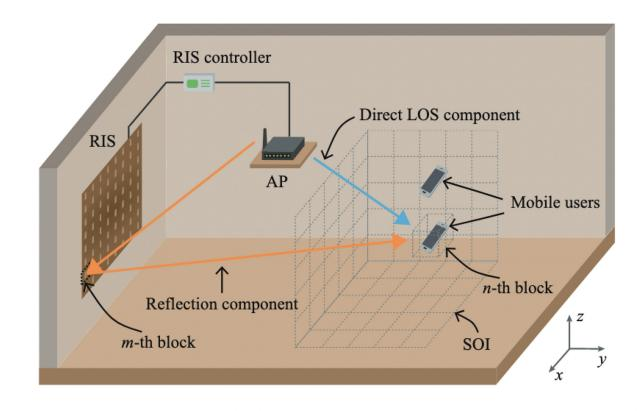

Fig. 14. The "MetaLocalization" system architecture. Source: [\[250\]](#page-36-30).

higher detection accuracy for RIS-assisted radar and enhanced power gain of the radar. Furthermore, based on this conclusion, the same authors propose utilizing an RIS for localization and mapping of the radio environment, which shows that by doing that the positioning error can be reduced by 31% compared to traditional schemes [\[252\]](#page-36-32) [\[253\]](#page-36-33). Similar work has also been performed by [\[254\]](#page-36-34), which also shows an increase in radar localization accuracy in RIS-assisted scenarios. While considering integration of sensing, the authors of [\[108\]](#page-33-16) proposed adding an external ultrawideband sensor to an RIS to track the reflected radio wave power density and adapt the RIS response based on that. A similar approach was taken in [\[156\]](#page-34-24) and [\[255\]](#page-36-35), which integrated the Rotman lens for power intensity sensing, as described previously. Such functionality can be used to predict signal movement and blockages as well as to avoid interference. Although adding processing power to the RIS adds complexity to the RIS controller design, there is no shortage of space, and the circuitry's energy consumption can be compensated with the integration of EH elements, as shown earlier. However, in the works presented above the sensing mechanism is external to the RIS. A different approach has been taken by the authors of [\[240\]](#page-36-20), [\[241\]](#page-36-21) that proposed integrating RF sensing chains on the metasurface alongside the reflecting unit cells. The reported results show that having an RF sensing chain under each reflecting unit cell is unnecessary. A comparison between densely sampled uniform masks and randomly sampled masks shows that with random masks, the amount of RF chains can be reduced by a factor of 1/4 without any significant impact on AoA estimation accuracy. The authors note that many factors have not been considered in this study, including the incident beam profile, resolution of the sensing matrix, the relative direction of the incident beam to the norm and/or to the angles in the sensing matrix, and the overall size of the RIS. To reduce the number of RF sensing chains further, a novel work by [\[256\]](#page-36-36) proposes a stacked intelligent metasurface (SIM) for DoA estimation that is based on the SIM wave domain beamforming model presented in [\[257\]](#page-36-37) and [\[258\]](#page-36-38). An experimental platform for DoA estimation with SIM has been developed and presented in [\[259\]](#page-36-39). This is illustrated in Fig. [15,](#page-20-0) where a metasurface is composed of 'N' layers that are referred to as 'stacked' with

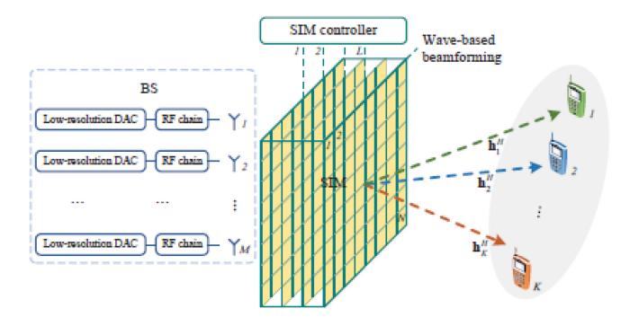

Fig. 15. Stacked Intelligent Metasurface (SIM) allows EM domain computations, such as DoA estimation. Source: [\[257\]](#page-36-37).

a common RF feed. The key principle of this device is that each layer operates as a refracting programmable metasurface and the input signal is processed in the analog domain as it propagates through the structure at the speed of light. For example, the phase shift vector for the input layer of the SIM can be reconfigured at each time slot to generate a set of discrete Fourier transform (DFT) matrices having orthogonal spatial frequencies along with an appropriate design of the phase shifts applied by the inner layers. This design is shown to obtain the spatial-domain spectrum of the input signal. The concept of SIM is similar to the concept of wave domain analogue computing with metasurfaces [\[260\]](#page-36-40) that has been proven able to perform mathematical calculations [\[261\]](#page-37-0), [\[262\]](#page-37-1), and is a promising direction for future research.

# *C. Is MF-RIS the Key Enabler for mmWave Communications?*

The World Radio Communication Conference (WRC-19) agreed that the frequencies 24.25-29.5 GHz (n258 and n257) and 37-43.5 GHz (n260 and n259) should be globally used for 5G NR as FR2, which have subsequently been integrated into the 3rd generation partnership project (3GPP) releases 17 and 18 [\[264\]](#page-37-2). However, this spectrum is mainly useful in LOS scenarios where narrow beams can be used to overcome the otherwise severe path loss. Coupled with high costs of hardware and low EE, mmWave network installations remain sparse and unpopular among network operators. The RIS technology aims to mitigate this issue by providing a programmable medium between BS and UE with beamforming capabilities. Results obtained in [\[263\]](#page-37-3) show how scaling up the number of reflecting elements can compensate for the path loss in mmWave wireless communications and prove that RIS can create virtual LOS paths preventing blockages in mmWave communications. While MF-RIS with integrated sensors for SLAM will be able to reduce the number of RIS elements, the added complexity, cost, and energy consumption cannot be ignored. Having said that, the benefits of mmWave communication for a smart city environment have been demonstrated in [\[265\]](#page-37-4) during the PyeongChang Winter Olympic Games 2018. The authors developed an intermediate-frequency-overfiber (IFoF) RAN with 28 GHz carrier frequency and have

been able to achieve 9 Gb/s downlink throughput when using a 4 × 4 MIMO system, which is sufficient for real-time 4K UHD mobile streaming. However, all nodes of the network were located in LOS, which raises concerns about the suitability of this network for environments with NLOS links. The work presented in [\[266\]](#page-37-5) argues that RIS can overcome path loss issues in dense urban environments, however, to be integrated within RAN, they need to have a low-latency controller and be visible on the network. The authors of [\[267\]](#page-37-6) provide an algorithm for mmWave network coverage extension in dense environments integrated with a local area network, which promises a guaranteed rate of 130 Mb/s within an airplane cabin with a single 256-element RIS. In [\[268\]](#page-37-7) the authors investigate the coverage of large-scale, stochasticgeometry-based mmWave cellular networks and obtain the peak reflection power expression of an RIS and the downlink signal-to-interference ratio (SIR) coverage expression. The findings of these analyses reveal the importance of the density ratio between BSs and RISs in enhancing mmWave SIR coverage, as well as the usefulness of installing RISs in this regard. The results also reveal that nearly passive reflectors are just as effective in increasing mmWave coverage as equipping BSs with additional active antennas. The research of [\[269\]](#page-37-8) concludes that mmWave networks should be used efficiently and seamlessly to satisfy the severe requirements of B5G applications, by using stochastic geometry methods [\[270\]](#page-37-9). A deep learning algorithm-based planner is proposed at the BS, that predicts future mmWave blockage conditions and ideal beamforming vectors of the mobile user, based on out-ofband information. This allows to reduce the load on mmWave channel state information (CSI). For precise blockage and beam prediction, this work proposes a deep neural network (DNN) with long short-term memory (LSTM) layers that extract temporal correlations from low-frequency CSI. It is envisaged that the mmWave technology is going to be used as an overlay on top of current lower-frequency networks. Using this paradigm, the authors of [\[271\]](#page-37-10) characterized the biased uplink and downlink cell association, SINR, and rate coverage probability in such a hybrid system. Decoupled uplink and downlink association is critical in this mixed deployment, according to the results of the analysis. The authors show that the SINR and rate trends can be studied when biasing small unit cells to get the benefits of mmWave bandwidths with extremely high biasing values. Due to the strong bias levels, robust modulation and coding techniques are required to function at low SINR.

To summarize, it is clear from these studies that the integration of mmWave into existing networks is not going to be an easy task. Holographic MIMO antennas and MF-RIS can be the key enablers to tackle this issue and, given the exponential increase in network capacity in mmWave networks [\[272\]](#page-37-11), we can argue that traditional wired networks can be eliminated from B5G networks and replaced with mmWave point-to-point wireless links, which is not possible with sub-6 GHz networks. In this case, the increase in mmWave hardware cost can be leveraged by mitigation of the costs associated with wired networks, which include:

• Installation costs, such as fiber optic cable tunnels.

- Maintenance costs, which include regular checks and replacement of damaged wires.
- • Itemized costs of the wire itself and house routers.

More research is required to demonstrate the outlined benefits in practical networks. Comprehensive full-stack field trials with mmWave software-defined radio (SDR) are very expensive to perform, so the literature on this topic is scarce, with only a few examples [\[273\]](#page-37-12), [\[274\]](#page-37-13), [\[275\]](#page-37-14) that do not consider RIS integration.

#### *D. How About Terahertz Communications?*

Frequency bands > 275 GHz are capable of enabling wireless systems with data rates of 100s of Gbps. Feasibility of wireless THz communications based on current developments and hardware demonstrations has been proven [\[276\]](#page-37-15) and therefore, THz communications is a real option for future wireless 6G networks. However, the majority of research so far has concentrated on THz device physics, circuits, and propagation, as well as researching physical layer solutions. A good design of the whole communication stack is needed to meet link- and system-level concerns, such as network setup, management, coordination, EE, and end-to-end connectivity in mobile networks. Medium access control (MAC), network, and transport layer challenges, as well as the end-to-end data flow performance on THz connections, need to be addressed to help with the introduction of the THz spectrum into mobile network architecture [\[277\]](#page-37-16). Next-generation WLAN systems, such as Tera-WiFi, THz wireless backhaul, and other novel communication paradigms, can be boosted by the core wireless infrastructure of THz communications. Impact and guidelines for 6G wireless networking have been developed in light of these findings. The so-called "THz Gap" is being closed, and we expect that THz communications will become a cornerstone of 6G wireless networks as a result of the advancement of THz technology. However, transmission distance and coverage range are generally constrained by substantial spreading loss and molecular absorption in the 100-1000 GHz frequency ranges with a physical layer distance-aware architecture examined in [\[278\]](#page-37-17). It is expected that the adoption of novel technologies such as MF-RIS and ISAC might be combined, and the THz communication distance could be increased through cooperative development. The qualitative and quantitative simulations performed by the authors show the potential of these new approaches and that they may be used to communicate at distances of up to 100 meters in both direct and indirect lines of sight, which would be sufficient for many applications. For example, wireless virtual reality (VR), where quality of experience (QoE) requirements can only be met by high data rates, high dependability, and minimal VR interaction latency. The THz frequency has a lot of bandwidth, allowing for fast data throughput across short distances. Also, the large computing capability of the MEC network design may allow for reduced VR interaction latency. Due to these factors, the authors of [\[279\]](#page-37-18) proposed an MEC-enabled and RIS-assisted THz VR network in an indoor situation, taking into account the uplink viewpoint prediction and position transmission, MEC rendering, and downlink transmission. This work argues that VR user perspectives may be predicted using a centralized online gated recurrent unit (GRU) and a distributed Federated Averaging (FedAvg) technique. According to this work, predicting where VR users will be and whether they are in LOS or out of LOS can be done in real-time using an algorithm that incorporates online LSTM and convolutional neural networks (CNN). The obtained simulation results demonstrate that the proposed learning architecture delivers near-optimal QoE as that of the genie-aided benchmark technique and around two times enhancement in QoE compared to the random phase shift selection scheme. Another study on THz RIS-assisted VR networks is described in [\[280\]](#page-37-19). The authors presented a unique risk-based framework for rate optimization and reliability performance based on the entropic value-at-risk. The issue is reformulated as a linear weighted function using a Lyapunov optimization approach to guarantee that the queue length's higher order statistics remain below a threshold. Given the randomness of the channel, a deep RL algorithm is used to learn the policy. To better capture the channel's dynamic behavior and increase the efficiency of traditional RL policy-search methods, a recurrent neural network (RNN) RL framework is presented. The simulation results showed that the maximum queue length produced by the suggested method is just 1% longer than the ideal one. With a validation accuracy of 91.92%, the findings indicate that the RNN is both accurate and converges quickly.

The implementation of RIS-assisted THz networks is envisioned with the use of dedicated THz miniature silicon transceivers that can be implemented on the RIS surface, such as the one previously described [\[183\]](#page-35-1). Due to the high frequency of operation, the unit cell size of RIS for THz applications is considerably smaller compared to mmWave and sub-6 GHz solutions. Therefore, it will become possible to have large metasurfaces with thousands of unit cell elements where each cell can have a dedicated wireless network on chip (WNoC) [\[281\]](#page-37-20) controller. However, because of the unique characteristics of the THz spectrum and the intrinsic attributes of dense deployments, it is still unclear whether or not network-wide communications are feasible. To deal with this problem, the authors of [\[282\]](#page-37-21) developed an analytical model to determine the first two moments and density functions for both metrics for measuring interference and the SINR in dense THz networks. The authors report that molecular noise does not influence the SINR qualitatively and that its quantitative effect has a minor impact when compared to interference.

To summarize, current studies show that while there certainly are scenarios where the application of THz frequencies for telecommunication is feasible, they are limited to a few where enormous bandwidth is required. Therefore, the widespread adoption of THz networks seems rather unlikely, but they may still be deployed on a smaller scale, for example, in private networks.

# VII. RELATED RESEARCH

In this section, we consider topics related to the MF-RIS technology. Specifically, the topics of physical layer security (PLS), RIS channel estimation, and RIS channel measurements are crucial for the adoption of this technology within the 3GPP framework for 6G and have been reviewed in detail.

# *A. Physical Layer Security of MF-RIS-Assisted Networks*

Traditionally, wireless network security has been seen as a distinct problem for a wireless system radio transmission security. An estimated 5 billion people can communicate through cellular technology alone, and this is only one of several wireless technologies developed in the last few decades. Increasingly, wireless networks are being utilized for a broad variety of purposes, including banking and other financial operations, in addition to social networking and environmental monitoring, amongst others. As a result, wireless network security is a major concern for the general public. Network security has generally been addressed on the upper logical levels of communication networks using encryption and authentication rather than within the physical transmission medium itself. There has been an upsurge in interest in the possibility of the physical features of the radio channel offering communications security due to the introduction of a novel networking topology that is not susceptible to standard secure communication approaches such as data encryption. Using information theory as a framework, recent research has focused on developing a better understanding of the underlying capabilities of the physical layer of wireless networks to offer security. Since MF-RIS is a disruptive technology that can be perceived as a threat to traditional wireless networks, we identified the following key security risk issues associated with MF-RIS deployments:

- The nearly passive nature of MF-RIS from the network point of view. Suppose these structures are not acting as nodes in the network. In that case, they become susceptible to potential hardware attacks, such as intentional jamming of a BS or other network users in a false MF-RIS attack.
- An MF-RIS can also unintentionally jam or cause interference to a UE belonging to a different network provider by re-directing radio waves that would interfere with the UE. Therefore, its bandwidth of influence should be carefully defined along with tight control over its specular reflection and side lobes. Interference cancellation i.e. "nulling" algorithms such as [\[289\]](#page-37-22) should be employed in the hardware, with an example presented in [\[290\]](#page-37-23). Also, the authors of [\[291\]](#page-37-24) show that given the known locations of various UEs, the interference can be mitigated without compromising the transmitted power by designing the MF-RIS phase shifts over different time slots.
- • An MF-RIS that is capable of real-time user mobility tracking with high accuracy can be viewed as a threat to the privacy of network users. Localization and other sensory data can be stolen from the MF-RIS and used to eavesdrop on the network users. Such data should be collected anonymously to ensure that it cannot be used to identify the person behind the UE, and discarded immediately upon use.

Considering the threats outlined above, the false MF-RIS attack is the most dangerous one, since it exposes the network at its core. Therefore, it is necessary to connect an MF-RIS to the network to ensure its continuous authentication and secure operation. There are several ways in which this can be accomplished:

- It can be connected directly to the backbone Internet with an Ethernet cable, which may also carry the power to the MF-RIS via a power-over-ethernet (PoE) technology.
- An external wireless transmitter/receiver with a SIM card can be added to the MF-RIS controller as a standalone entity to enable wireless authentication of the MF-RIS.
- The MF-RIS itself can be used to send/receive digital patterns to BS, by using the meta-cryptography technique discussed previously, resulting in a back-scattering authentication link between the BS and the MF-RIS.

MF-RIS-controlling strategies may include BS-controlled (through one or more BSs) and UE-controlled (one or more UEs). In the downlink (e.g., BS-controlled MF-RIS), the control information can be transmitted from the BS to the MF-RIS via the air interface, such as the physical downlink control channel (PDCCH) or the physical downlink shared channel (PDSCH) in the 5G NR architecture. In the uplink (e.g., UE-controlled MF-RIS), the control information can be transmitted from the UE to the MF-RIS via a direct communication interface, such as the physical sidelink control channel (PSCCH) or the physical sidelink shared channel (PSSCH) in the 5G NR architecture. Moreover, for an MF-RIS with uplink transmission capability, the feedback information (e.g., ACK-NACK) for the received control information can be transmitted from the MF-RIS to the BS via the air interface or transmitted from the MF-RIS to the UE via a direct communication interface. Assuming the existence of this link, the BS can authenticate the MF-RIS and perform probing. Therefore, continuously verifying that this MF-RIS is genuine. In the special case of MF-RIS with sensing capabilities, this security is boosted even further, as each added sensory element can provide an additional degree of safety by cross-checking the information perceived by the BS with the real world. Both the BS and the mmWave radar can perform pattern recognition checks to identify malicious UE. If the patterns match and identify a security threat, the MF-RIS can shut down and report an attack to the BS. Furthermore, by providing precise localization data to the BS, the network will be able to monitor the UE activity, meaning that security risk pattern recognition techniques can be significantly improved. Additionally, the BS will be able to authenticate each UE and match the data with the data from the radar mapping. The transfer of data itself will be secure as it relies on the same encryption techniques that are employed in wireless communication today.

The authors of [\[283\]](#page-37-25) provide a comprehensive a survey of MF-RIS-assisted PLS enhancement techniques, including the addition of artificial noise, the use of beamforming to improve security, and cooperative jamming as an advanced signal processing technique that can be used to ensure robust security of the wireless link. In this context, MF-RIS can be used to improve the PLS, as demonstrated in [\[284\]](#page-37-26). By adopting a weighted variation of the secrecy capacity concept, the authors were able to create an optimization problem to investigate the MF-RIS's efficacy in increasing system secrecy. To illustrate the trade-offs in the design and to demonstrate the superiority of MF-RIS-assisted networks over traditional ones in terms of secrecy performance, numerical simulations are performed. The design in [\[285\]](#page-37-27) proposed an MF-RIS, where the reflecting components not only modify the phase shift but also improve the amplitude of signals, hence increasing the security of wireless transmission. The authors propose an effective AO scheme to simultaneously optimize the beamformer at the transmitter and the reflecting coefficient matrix at the MF-RIS to tackle the non-convex optimization of the secrecy rate based on this architecture. The research by [\[286\]](#page-37-28) considers an RIS-assisted multi-antenna secure transmission. The BS-user/eavesdropper link and BS-RIS-user/eavesdropper links are analyzed and the research concludes that 1) the RIS-aided system model outperforms the system without RIS in the far field for distances beyond 40 m, in terms of secrecy rate and transmit power 2) as the user moves away from RIS, the energy consumption increases, however, it is still more efficient than the system without RIS 3) The RIS-assisted scheme becomes more effective as the number of reflective surface elements increases. In fact, as the number of RIS reflecting elements grows large (but remains operating in the far field), the system can obtain the same square power gain as an RIS with continuous phase shift, even based on a 1-bit discrete phase shift [\[287\]](#page-37-29). In a relevant study, the authors of [\[288\]](#page-37-30) also considered an RIS-assisted multiple-transmit and multiple-receive antenna communication. The authors provide an AO-based joint optimization algorithm of the transmit covariance matrix at the AP and the reflecting coefficients at the RIS to maximize the secrecy rate of RIS-assisted communication links. It is observed that the secrecy rate increases with the increase in the number of legitimate receiving antennas, which matches the results discussed earlier.

#### *B. Non-Orthogonal-Multiple-Access (NOMA) With MF-RISs*

NOMA's central idea is to serve numerous users on the same time-frequency resource block by using superimposed coding (SC) at the transmitter and sequential interference cancellation (SIC) at the receiver. There are two main information-theoretic benefits: making use of all the spatial degrees of freedom that the BS can manage (proportional to the number of antennas) and dividing the sum rate flexibly between the UEs. These features can greatly improve the service quality in large-scale IoT connectivity scenarios. The secrecy rate of NOMA systems can benefit from MF-RIS-assisted links [\[292\]](#page-37-31). Also, both downlink wireless power transfer and the uplink NOMA-based data transmission will benefit from the integration of RISs into the networks, as shown in [\[293\]](#page-37-32). This work proposes a new resource allocation technique that jointly optimizes the time allocation factor and the RIS phase shift matrices to produce a greater total throughput than the system without it. A NOMA IoT RIS-assisted network allows several NOMA IoT devices to connect with an AP. This work also considers the implementation of WPT on an MF-RIS. Using the NOMA protocol, the gathered energy may then be used to send wireless information (WIT) between IoT devices and the AP during the uplink transmission. This work suggests combining optimization of the time allocation factor and phase shift matrices of WET and WIT, together with a unique resource allocation technique to optimize the cumulative throughput of the investigated system. It concludes that RIS with NOMA significantly increased total throughput when compared to a control group that did not use RIS. Another study on the NOMA scheme in the uplink direction is presented in [\[294\]](#page-37-33), which proposes the use of a hybrid MF-RIS with both active and passive parts. Results show that the hybrid approach is a good compromise to achieve BER improvement without making the overall structure too expensive and energy-consuming. The same authors in [\[295\]](#page-37-34) analyzed NOMA performance in the STAR MF-RIS scenario, which shows that it outperforms the standard NOMA scheme in terms of achievable BER. The authors of [\[296\]](#page-37-35) present the combination of an RIS and downlink NOMA in a multi-user two-cell network (JT-CoMP). The RIS is placed at the boundary between two neighboring cells to facilitate communication through JT-CoMP between the cells and several remote NOMA users. In this configuration, the research aims to maximize the network sum rate subject to a target quality-of-service, defined in terms of the minimum needed data rate at each cellular user and the SIC constraints by concurrently optimizing the power allocation coefficients at BSs, the user clustering policy, and the phase-shift matrix of the RIS. A different study by [\[297\]](#page-37-36) considers a system that serves NOMA customers with paired power domains. The best-case and worst-case new channel statistics are initially derived to characterize the effective channel gains. The authors also constructed the best- and worst-case closed-form formulas for our prioritized user's outage probability and ergodic rate. Further insights may be gained by looking at the diversity orders of outage probability and the ergodic rate's SNR slopes. The planned network's SE and EE are also calculated. When the number of RISs is big enough, the BS-user linkages have essentially little effect on the diversity order. The high-SNR slope of the RIS-aided network is one, and the suggested RISaided NOMA network outperforms its orthogonal counterpart in terms of network performance. In the related work [\[298\]](#page-37-37), the same authors also consider a STAR MF-RIS, where signal-enhancement and signal-cancellation design combination offers a new simultaneous-signal-enhancement and cancellation (SSECB) architecture that concurrently eliminates inter-cell interference while also boosting desirable signals. By using a high number of RIS components, the authors were able to reduce inter-cell interference while simultaneously increasing the desired signals. Another study in [\[299\]](#page-37-38) used stochastic geometry to analyze the downlink performance of MF-RIS-enhanced NOMA networks. Using a Poisson cluster process (PCP) paradigm, which theoretically shows that the angles of incidence and reflection are evenly distributed, the authors assessed the angular distributions and produced closedform formulas for the coverage probability of the paired NOMA users. Their findings demonstrate that 1) NOMA networks with MF-RIS assistance outperform those without and 2) the SIC order in NOMA systems is flexible because MF-RISs can modify the channel gains of NOMA users.

# *C. MF-RIS Channel Estimation*

Another major difficulty associated with MF-RIS-assisted networks is the estimation of the resulting channel. While several comprehensive surveys of channel estimation methods for RIS-assisted communication exist in the literature [\[81\]](#page-32-23), [\[300\]](#page-37-39), one of the key issues with channel estimation research on MF-RIS remains unanswered, which is the lack of a reliable channel model. The most widely used model is the channel model defined in 3GPP TR 38.901 [\[301\]](#page-37-40), however, this model has been developed for a generic antenna node in the far field and does not apply to an MF-RIS. Aiming to develop a better model, the authors of [\[302\]](#page-38-0) proposed a set of equations to define the radiation power pattern of a single MF-RIS element and verified its performance with simulations in CST Microwave Studio. By using this model, the authors have also been able to draw several important conclusions: a) an MF-RIS deployed at the edge of the cell gives more advantage compared to an MF-RIS deployed in the middle of the cell; b) the overall performance of the system can be significantly improved by utilizing either a large number of elements per MF-RIS or a large number of MF-RISs per sector. In a different work [\[303\]](#page-38-1), the authors developed a novel equivalence principle-based method for raytracing wave propagation in wireless communication channels enabled by MF-RISs. This method closely follows the electric field scattering models presented in Chapter III and offers much higher precision than conventional models. Any wireless technology's performance evaluation that does not employ a channel model that accounts for its primary properties is unrealistic, and while the majority of theoretical work on multiple-antenna technologies in scattering conditions has been based on the identically distributed and independent Rayleigh fading channel model, the authors of [\[304\]](#page-38-2) demonstrate that such a model is not physically apparent when employing an MF-RIS with a two-dimensional shape. Instead, this work offers a different Rayleigh fading model that may be used as a benchmark for assessing MF-RISassisted communications in isotropic scattering. By utilizing this model, researchers were able to take a fresh look at some of the fundamental aspects of MF-RIS, such as the rank of spatial correlation matrices and channel hardening. The authors of [\[305\]](#page-38-3) show that the network transmit power efficiency can be improved by implementing an environmentaware codebook on an MF-RIS. The authors conclude that if the high-dimensional channels can be parameterized using substantially fewer coefficients, then these parameters can be estimated instead. Related work [\[306\]](#page-38-4) assumes a LOS path between the UE and MF-RIS, and exploits this characteristic to reduce the pilot signaling vastly. The pilots are selected dynamically to improve the estimation quality iteratively. The results demonstrated in this work show that for an indoor environment, the MF-RIS codebook has to be updated approximately every 1s with new AoAs, with a longer update time resulting in increased BER and outages.

Another problem frequently reported in the literature is that the pilot overhead can be excessively large because the number of coefficients of the cascaded channel between the BS, RIS, and UE is equal to the sum of the number of BS antennas, the number of RIS components, and the number of UEs. To take advantage of the fact that the BS-RIS channel is high dimensional but quasi-static while the RIS-UE channel is mobile but low dimensional, the authors in [\[307\]](#page-38-5) presented a two-timescale channel estimation methodology.

They suggested a dual-link pilot transmission technique, in which the BS both sends downlink pilots and retrieves uplink pilots projected by the RIS to calculate the quasi-static BS-RIS channel. They then suggested a technique based on coordinate descent for BS-RIS channel recovery. Over time, the average pilot overhead can be decreased by estimating the quasi-static BS-RIS channel less frequently than the mobile channel. The accompanying pilot overhead is low because of the modest dimension of the movable RIS-UE channel, even though the channel has to be estimated repeatedly in a brief time frame.

The study by [\[308\]](#page-38-6) presents the results of research into reducing the pilot resources needed for channel acquisition in a RIS-assisted multiuser MIMO system. The channel estimation issue in the RIS-assisted multiuser MIMO system is formulated as a matrix-calibration-based matrix factorization work, allowing for the estimation of the cascaded channels with a manageable training overhead. The study proposes a unique message-passing-based technique to factorize the cascaded channels, which makes use of knowledge about the slowvarying channel components and the hidden channel sparsity. To lessen the burden on the pilot, the use of deep learning to extrapolate the channel over the antenna and temporal domains is considered in [\[309\]](#page-38-7). The neural network is broken down into its time-domain and antenna-domain extrapolation networks, with the neural ordinary differential equations (ODE) used in both. With the former, ODE provides a precise description of the RIS channel dynamics, allowing for better time series reconstruction by a recurrent neural network.

In the special case of MF-RIS-aided mmWave MIMO communications, the authors of [\[310\]](#page-38-8) take advantage of the sparsity and correlation of multiuser cascaded channels in mmWave MISO systems and present a new cascaded channel estimation technique with reduced pilot overhead. To reduce the amount of pilot overhead required to estimate the channel gains in subsequent coherence blocks, the researchers first estimate all channel coefficients in the first coherence block. Another work that considers channel estimation for MF-RISassisted mmWave networks is presented in [\[311\]](#page-38-9). It offers a cascaded channel estimation approach that takes into account the wideband influence on the transmission model. The study adopts a parameter recovery approach to wideband channel estimation, in which a small number of pilot symbols are used to locate the channel parameters through an orthogonal matching pursuit method, which significantly improves the estimation accuracy of the method. However, particulates like dirt, salt, ice, and water droplets may completely or partially obstruct outdoor mmWave components as a result of weather and atmospheric conditions. These obstructions may result in a loss of system power and a signal-to-noise ratio that is roughly proportional to the area of the obstruction. Yet, the RIS lacks the signal processing abilities of traditional array diagnosis. To address this issue, studies [\[312\]](#page-38-10), [\[313\]](#page-38-11) suggest pilot transmission to help the receiver distinguish between signals from several MF-RISs and uncontrolled multipath signals. In doing so, the channel or its geometric characteristics may be evaluated for each route independently, which is helpful for channel estimation and localization. The approach used in this study involves coming up with orthogonal temporal phase profiles across MF-RISs without interfering with the beamforming capabilities of the MF-RISs themselves.

The studies presented above have a common issue due to their computational complexity growing rapidly with the number of MF-RIS units *N* (e.g., in the order of *N* 2 or *N* 3) and/or due to their dependence on the matrix characteristics (e.g., the matrix should be sparse for algorithm convergence to achieve satisfactory performance). The study in [\[314\]](#page-38-12) departs from the standard signal model found in the literature by instead adopting a model based on vectorization and reduction. Then, by capitalizing on the stability of unitary approximation message passing, a more effective channel estimator is developed, one that has a complexity that is linear with *N* and does not need any specific conditions on the required matrices. As a result, the suggested technique may be used in a wider variety of MF-RIS-assisted MIMO systems with larger *N*.

Another aspect of MF-RIS deployments is the double fading problem, where the end-to-end path loss is proportional to the product of two path loss coefficients. To put it in another way, the signals that travel through the longer MF-RIS reflection connection lose more power than those that travel over the geographically shorter direct link, which results in a limited increase in performance in comparison to the one that does not use an MF-RIS. For this reason, the use of an MF-RIS is more attractive when the direct path is blocked [\[315\]](#page-38-13). However, an active MF-RIS can provide a power boost to overcome the 'double fading' effect if it contains onboard processing power to decode and encode the signal, then provide a boost with amplifying elements. An active reflection imaging system's key advantage is that it enables the simultaneous modification of signal and phase amplification while only requiring a single power amplifier in each reflecting element. This is one of the system's most significant advantages. An active STAR MF-RIS-assisted single-input multiple-output uplink system and a downlink MISO multi-user system are analyzed in [\[316\]](#page-38-14). The authors developed numerical techniques to increase the active MF-RIS system's phase shift and amplification factor. Active MF-RIS has the potential to achieve far higher transmission rates than a passive RIS but also turns the MF-RIS into a more traditional kind of relay/repeater system and raises questions of what kind of alternative network nodes could have been deployed (e.g., a small BS).

# *D. MF-RIS Channel Measurement*

Channel measurement remains challenging for RIS-related research, as it requires a significant amount of time and resource investment. Also, different RISs are designed in very different ways, which does not help to provide uniform results. Based on the theoretical work of [\[317\]](#page-38-15) the general case path loss models for RIS have been provided by [\[318\]](#page-38-16), which also includes practical measurement of two prototypes designed to work at 4.25 GHz and 10.5 GHz. The same authors later expanded this study in [\[319\]](#page-38-17) to include the measurements of RIS designed to work in the mmWave spectrum at 27 GHz and 33 GHz. In [\[320\]](#page-38-18), the field trial results on RIS-assisted 5G network communication are provided with RISs of multiple types in both indoor and outdoor scenarios working on 2.6 GHz, 4.9 GHz, and 26 GHz. The results show a datarate increase of up to 442% for both downlink and uplink with a 2-bit RIS, as well as up to +38 dBi gain compared against a measurement without RIS and no LOS. The authors of [\[321\]](#page-38-19) performed statistical modeling and measurement of RIS-assisted channels in terms of cluster-level and ray-level parameters. The measurement performed within an indoor space at the frequency 2.6 GHz and a 1.6 m × 0.8 m 1-bit RIS shows an improved channel quality and a reduced channel impulse response time.

The study by [\[322\]](#page-38-20) examines the physics and EM properties of RISs to construct free-space route loss models for RISassisted wireless communications in a variety of contexts. The results show how the distance between the transmitter and receiver, the size of the RIS, the near-field and far field impacts of the RIS, and the radiation patterns of antennas and unit cells all affect the free-space path loss of RIS-assisted wireless communications. Experimental measurements are taken in a microwave anechoic chamber using three artificial metasurfaces to validate free-space route loss models further. Then, a practical measurement campaign has been performed and described in [\[323\]](#page-38-21) for a 1-bit RIS operating in the sub-6 GHz spectrum. The outdoor and indoor deployment field trials have been conducted that verify the suggested model. The authors of [\[126\]](#page-33-29) provide measurement results for indoor RIS-assisted wireless communication and obtain several important measurements or power comparisons for various locations of the UE. This work also investigates a phase shift codebook for RIS at different angles, which can be used to find the optimal location for RIS in a real-world indoor application. The same authors have also provided the outdoor field trial results for a varactorbased 3.5 GHz RIS in [\[324\]](#page-38-22) and reported a 50% increase in the downlink transmission rates. Another field trial described in [\[325\]](#page-38-23) provides results obtained within an active 5G network in Nanjing, China. The results show a significant improvement in achievable throughput when several 1-bi digital RISs have been added to the network in both indoor and outdoor scenarios.

Several recent works also investigated network planning with RIS by using conventional software. In [\[326\]](#page-38-24) the authors assessed the performance of large-scale RIS installations in urban environments, which showed that the coverage probability of a 5G mmWave network increased from 46% without RIS to 95% with RIS and from 77% to 95% at 3.5 GHz. The authors used sophisticated modeling tools to create accurate simulation models and assumed that there are no MIMO antennas at either the BS or UE. In [\[327\]](#page-38-25) the authors provide simulation results for the specific case of Rennes railway station in France. These results show significant improvements with the addition of an RIS on top of the existing network, which effectively eliminates all dead spot coverage areas inside the station even during rush hours.

# *E. MIMO Antenna Systems and MF-RIS Cooperation*

The successful implementation of MF-RIS technology is tightly correlated with MIMO systems. HMIMOS and MF-RIS cooperation [\[328\]](#page-38-26) becomes particularly important at mmWave frequencies where the beamforming capability of BSs should be assumed for an energy-efficient communication model. Several works [\[329\]](#page-38-27), [\[330\]](#page-38-28) considered MF-RIS and MIMO cooperation and interference mitigation techniques to boost overall network capacity and coverage. The authors suggest an iterative approach to estimate the channel matrix between the BS and the MF-RIS during the initial channel estimation that reflects the initial state of the system, with a carefully chosen starting point for the iterative process. The authors of [\[331\]](#page-38-29) consider an MF-RIS-assisted 4x4 MIMO orthogonal frequency division multiplexing (OFDM) system at 3.5GHz, assisted by a hybrid-active RIS. The authors developed an MF-RIS prototype, which samples RF signal with unit cells configured in a transmissive mode, and re-transmits them with gain given by LNAs. The results show that hybrid-active RIS outperforms its passive equivalent in terms of capacity, demonstrating its capability to enhance the multipath channel. In [\[332\]](#page-38-30) the authors consider the passive beamforming and information transfer (PBIT) method for MIMO systems with multiple users, where the MF-RIS improves primary communication through passive beamforming while also delivering additional information through spatial modulation, which modifies the on-off states of the reflecting elements. Due to the multiplicative modulation of the MF-RIS information onto the reflected wave of the reflecting parts, the receiver design poses a bilinear estimation challenge for signal recognition. The authors described a turbo message passing (TMP) algorithm to address this bilinear estimation issue, which partitions the factor graph connected with the problem into two modules: one for estimating the user signals and another for estimating the MF-RIS's on/off states. In [\[333\]](#page-38-31) the authors propose two novel RIS-based MIMO system designs to improve the performance and spectral efficiency (SE) of MIMO communication systems. The authors investigated Alamouti's scheme for spatial diversity and the vertical bell labs layered space-time (VBLAST) scheme for spatial multiplexing and suggested a basic transceiver design based on RIS. Adjusting the phases of the RIS elements significantly increases the SE of the VBLAST-based system by improving the effectiveness of the nulling and cancelingbased sub-optimal detection technique. The authors of [\[334\]](#page-38-32) investigate the trade-off between EE and SE in multi-user MIMO uplink communications using an RIS with digital phase shifts. The proposed transmission strategy design utilizes statistical CSI between the RIS and UTs and instantaneous CSI between the RIS and the BS to reduce the necessary signaling overhead and energy usage.

The research by [\[335\]](#page-38-33) considers the application of RIS for space shift keying (SSK) to reduce error and increase the throughput performance of traditional SSK systems. First, RIS-SSK with passive beamforming (RIS-SSK-PB) uses RIS for beamforming and maximizes the least squared Euclidean distance between any two decision sites. RIS-SSK with Alamouti space-time block coding (RIS-SSK-ASTBC) uses an RIS for ASTBC and allows the RIS to transmit its Alamouticoded information while reflecting incident SSK signals to the destination. RIS-SSK-PB and RIS-SSK-ASTBC have lowcomplexity beamformers and maximum likelihood detectors.

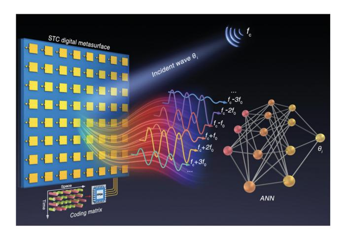

Fig. 16. DoA estimation with space-time coding (STC) digital metasurfaces. Source: [\[341\]](#page-38-34).

Closed-form formulas for source and/or RIS bit error probability were developed assuming ML detection. RIS-SSK-PB outperformed RIS-free and RIS-based SSK schemes, and RIS-SSK-ASTBC improved throughput and reliability. The authors of [\[58\]](#page-32-3), [\[336\]](#page-38-35) provided an overview of the IM principle for use in RIS-spatial modulation (RIS-SM) and RIS-SSK techniques. These two approaches use the IM principle to increase SE by using multiple receive antennas and intelligently reflecting incoming signals to enhance reception. The proposed system model shows that a RIS-assisted network can effectively replace many massive MIMO elements that require expensive and power-hungry components. The follow-up work in [\[337\]](#page-38-36), [\[338\]](#page-38-37) proposes the integration of this concept into mmWave massive MIMO systems with hybrid beamforming.

#### *F. Near-Field Imaging Systems*

The medical imaging systems are different from the positioning systems discussed previously, as they are designed to work within the reactive near field for medical purposes. Nevertheless, the concept of an MF-RIS with sensing capabilities is rather similar, and can be applied to imaging systems, which has been explored in [\[339\]](#page-38-38). In this work, the authors developed a 2-bit programmable digital metasurface with PIN diodes that can reconstruct real-time imaging at a single frequency of 3.2 GHz by using AI algorithms performed on the metasurface controller. Taking this work further, the same authors in [\[340\]](#page-38-39) constructed an artificial neural network (ANN) driven intelligent metasurface with a size 54 × 54 mm, that is capable of monitoring people's movement in an indoor environment and recognizes body gesture language. In medical applications, such systems can be used to recognize hand gesture movements [\[341\]](#page-38-34) or even to enhance the brain-tomachine communication link as shown in [\[342\]](#page-38-40).

The concept of STC digital metasurfaces, which has been described in Section [III,](#page-6-1) can also be applied to imaging systems for DoA estimation, which is illustrated in Fig. [16.](#page-26-0) The digitally coded metasurface first produces random radiation patterns, which are then received in a testing vector and analyzed by pattern recognition with ANN. This sensing algorithm can also be used to establish the DoA of the test vector because the space-time coding matrix intrinsically contains spectral information of the incident wave. Therefore, the spectral distribution for different incident phase angles will also be different on the metasurface itself. Similar results have also been reported by the authors of [\[343\]](#page-38-41), [\[344\]](#page-39-0).

#### *G. Self-Healing in the Presence of Unit Cell Failures*

The reliability of RIS over time is also a concern for practical networks since RIS phase response will be affected by the gradual degradation of switching elements, especially their capacitance. The authors of [\[345\]](#page-39-1) presented a concept of intelligent metasurface phase response optimization in the presence of failures. The authors introduced randomly distributed unit cell failures in a reflectarray antenna, and have been able to 'self-heal' the phase response with the optimization of the remaining healthy elements. The authors noted that the reconstructed gain comes at a compromise of the increase in side lobe levels, indicating that this topic can benefit from more research.

The authors of [\[346\]](#page-39-2) take this concept a step further and consider the effect of unit cell failures on the localization performance of a passive RIS-based localization algorithm. This work shows that a failure diagnosis can be successfully performed by a BS on an RIS alongside the localization by employing an algorithm that detects the unit cell failures and estimates the failure coefficients by heuristically iteratively solving them. This work also provides computational complexity analysis of the algorithm and numerical results for an RIS with 400 unit cells, resulting in a solid framework for practical implementations in real networks.

# VIII. FUTURE RESEARCH DIRECTIONS

In this section, we outline the RIS-related research directions that are promising, but not mature enough to have a high TRL score. This means that the prototype evaluation for these concepts has been rarely performed and the implementation of RIS for these technologies in the 5G6G era is unlikely. Nevertheless, they can benefit greatly from the further development of the MF-RIS concept.

# *A. Autonomous Vehicular Networks*

Recent advancements in vehicular technology, including the vehicle-to-everything (V2X) concepts 'connected vehicles,' the 'autonomous vehicles,' and the hybrid of the two, 'networks of connected autonomous vehicles' (CAV) caused a substantial debate in the scientific community about requirements for future 6G networks. Understanding how quickly these two fields will progress in parallel is the topic of the study in [\[347\]](#page-39-3). The authors examine two complementary research areas, namely, 6G for CAVs and CAVs for 6G, based on a summary of the technical progression of V2X to CAV and 6G essential technologies. In vehicular positioning systems, a system architecture may include an MF-RIS-assisted massive MIMO scenario and several autonomous cars. To simplify data, a new method in deep learning is proposed by [\[348\]](#page-39-4) to predict the position parameters of autonomous vehicles. When two cars are too close together, sensing technology can struggle to distinguish between the two; hence, there is a risk of accidents in the future deployment of autonomous vehicles in intelligent transportation systems (ITS). The authors propose an MF-RIS-assisted massive MIMO system with a conformal array that acts as an extension of the standard regular array. Once the data is obtained by the system, it is passed into the deep network architecture SBLNet to learn the nonlinear features. Experimental findings show that SBLNet outperforms state-of-the-art approaches in terms of estimate accuracy and success probability. The SBLNet is also suited for the real situation considering rapidly moving autonomous cars, whereas the standard block sparse recovery approaches fail in this complex scenario. Another comprehensive study by [\[349\]](#page-39-5) conducted a field trial to prove the feasibility of V2X communication over 5G FR2 networks. The authors reported an average of 6.5 ms end-to-end measured latency when using state-of-the-art mmWave 5G hardware while maintaining a 49.1 Mbps data rate in the uplink.

However, many unanswered questions should be answered before V2X systems can be implemented in practice. The authors of [\[350\]](#page-39-6) discuss the potential transmission architecture of RIS-aided V2X communications as a way to address these issues and encourage further study. In this case, two V2X sidelink modes benefit from the use of RISs and their variations, which are then followed by a tailored transmission frame structure that divides the transmission work into distinct stages. As a next step, the creation of efficient channel-tracking and resource allocation strategies for maximizing beamforming gain is considered. Future standardization proposals for RIS-enhanced V2X systems are also presented, along with a summary of the promising research directions. One of the open challenges with V2X networks remains the potential security issue, especially given the severe consequences in the event of a potential security breach. Therefore, considering that RIS is going to act as an enabling technology for V2X, it must conform to the same level of robustness against potential attacks. Although the overall network security of RIS has been analyzed in a separate section in this survey, it is worth pointing out the importance of it for V2X networks.

An MF-RIS-aided mmWave MIMO channel model with sensing capabilities for CAV networks is studied in [\[351\]](#page-39-7), which considers improvements in spectrum efficiency as well as a reduction in the amount of localization error performance in MF-RIS-assisted networks. When there is an obstacle in the LOS of a mmWave channel, the signaling overhead of the channel will often be negatively affected. As a consequence of this, the authors report that the system suffers a lot from disturbances caused by impediments that are either permanent or movable, such as buildings, trees, autos, or people. The results of the simulation show and justify the approach that was recommended in terms of the RIS-assisted equivalent channel for the mmWave vehicle-to-vehicle MIMO systems and provide a substantial benefit over the model without RIS. Additionally, the authors of [\[352\]](#page-39-8) considered implementing mmWave MF-RISs as a conformal surface on the vehicle's bodywork, specifically its doors. The numeric simulation results show a 70% reduction in the outage probability and up to 40 dB improvement in SNR when the vehicle is

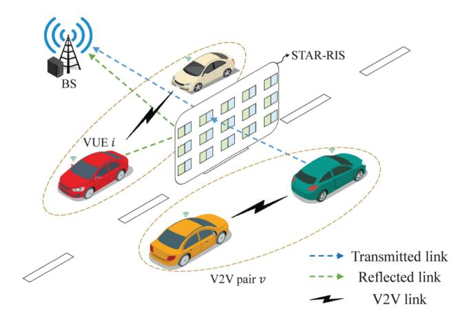

Fig. 17. V2X communication assisted by a STAR MF-RIS. Source: [\[357\]](#page-39-9).

near-stationary in traffic. The problem of optimal placement for RISs outside of the vehicle is addressed in [\[353\]](#page-39-10). The best placement of the RIS varies concerning the positions of the transmitter and the receiver. The authors propose MF-RIS-powered architecture, which enables continued use of current BS deployment plans and also allows a robust and power-efficient connection for autonomous cars. The Fox's H-function distribution [\[354\]](#page-39-11) may be used to describe the communication linkages between the beacon and client vehicles that occur owing to the multipath fading effects in an MF-RIS-aided vehicular ad-hoc network (VANET) in which the beacon vehicle is equipped with an MF-RIS. In this context, the authors of [\[355\]](#page-39-12) explore two models of vehicular networks, one with vehicle-to-vehicle communication and the source using an RIS-based access point, and another in the form of a VANET with an RIS-based relay installed on a building. Both methods inquire about the typical secrecy capability of the systems under consideration by assuming an eavesdropper is present. Their findings show that both the physical placement of the RIS relay and the total number of RIS cells affect the system's performance and secrecy capacity. Related work [\[356\]](#page-39-13) examines how well RIS-enhanced vehicular communications can withstand confidentiality breaches. In particular, the author focuses on two types of vehicular communication: 1) vehicle-to-vehicle (V2V) communication, in which the RIS works as a relay; and 2) vehicle-to-infrastructure (V2I) communication, in which the RIS operates as a receiver. A passive eavesdropper is present in both cases, to retrieve the sent data. The chance of a security breach is calculated in closed form and checked for accuracy. Results show that RIS has the potential to increase privacy for both V2V and V2I conversations. The authors of [\[357\]](#page-39-9) consider the integration of a STAR MF-RIS with autonomous vehicles, as depicted in Fig. [17,](#page-28-0) to maximize the achievable data rate for V2I users while satisfying the latency and reliability requirements of V2V pairs. The authors report that the proposed STAR MF-RIS system results in an improvement in 39% data rate improvement when compared to a conventional RIS model.

The spectrum sharing in RIS-enhanced vehicular networks is another important issue, which is studied by the authors

of [\[358\]](#page-39-14). Optimization of vehicle transmit power, multi-user detection matrix, spectrum reuse of V2V networks, and RIS reflection coefficients lead to a mixed-integer and non-convex optimization issue. This research introduces a method to estimate the outage probability of each V2V connection, which greatly reduces the complexity of the described issue. By using the block coordinate descent approach, the investigated optimization issue is divided into three sub-problems, whose optimum solutions are supplied separately and updated alternatively to provide a near-optimal solution. The authors show that the total capacity of V2I connections used for high-rate content transmission is increased when using RIS, which also helps to provide crucial safety data to end users.

To summarize, the deployment of V2X networks in ITS still appears to be in the long-term future. However, the high research interest shows that there is a lot of demand for solving V2X problems. The implementation of mmWave automotive radar addresses some of the challenges associated with V2X and the addition of RIS-like functionality to vehicles and roadside units can resolve many others. The integration of these concepts together in ISAC-based V2X networks can prove to be a major stepping stone for the adaptation of V2X networks in 6G and beyond.

#### *B. Autonomous aerial vehicle communication systems*

The deployment of AAVs and drones on a large scale is one of the key challenges that 6G networks will have to solve. The most recent research efforts concentrated on drone-based communication and were able to predict and steer wireless signals based on moving targets such as drones. The research by [\[359\]](#page-39-15) proposed a 'DeepSense' ML dataset for accurate beam prediction in mmWave/THz drone communication systems. Its proposed vision-aided solution achieves 86.32% top-1 and 99.69% top-5 accuracy. ML algorithms can be implemented directly on the RIS controllers, and therefore such metasurfaces have the potential to act as the key enabling technology for boosting drone-based communication in urban environments. When used in tandem with AAVs, an RIS can boost communication performance without adding complexity to the AAVs themselves. The study in [\[360\]](#page-39-16) analyses AAV communications for IoT networks to foster green communication in networking. According to this study, AAVs can be used to enhance network coverage and improve the stability and SE of IoT networks by integrating reflective metasurfaces as part of their design. The study first develops tractable analytic formulas for tractability. The authors derive the average SNR with strict upper and lower limitations, which asymptotically approaches either of the obtained limits depending on the number of reflective components. This provides evidence that, in terms of the ergodic capacity that may be achieved, RIS-assisted AAV communication systems can display a capacity that is 10 times larger than without RIS. The authors of [\[361\]](#page-39-17) envisioned the use of MF-RISs equipped with WPT for minimization of power consumption of MF-RIS-assisted AAV networks. By jointly optimizing the AAV 's trajectory, flight time, and the RIS's reflection coefficients the authors have obtained an efficient solution for this problem. In a related work, the authors of [\[362\]](#page-39-18) considered an active MF-RIS-assisted SWIPT system. The reported results show that an active MF-RIS can effectively address the multiplicative fading issue and minimize the required size of reflective structures. Additionally, the authors show that the deployment of hybrid active MF-RISs shortens the flight range required for the AAV to complete transmission tasks, further reducing the energy consumption of AAVs.

There yet remains a challenging issue to be addressed related to the interference mitigation between a) AAV to AAV, b) AAVs and CAVs, c) AAVs and NTNs, and any other network users. In this regard, the authors of [\[363\]](#page-39-19) proposed the use of rate spitting multiple access (RSMA) technology for the interference management between various network users. The reported results show significant reduction in the average outage probability (AOP) when RSMA is used. The authors of [\[364\]](#page-39-20) show that the use of a hybrid active MF-RIS can enhance the fairness for network access between users through jointly optimizing the location, trajectory, and transmit beamforming of the AAV, and MF-RIS amplifying coefficients.

# *C. Satellite and Space*

Integration of terrestrial, satellite, and aerial networks is viewed as the next evolution of cellular wireless infrastructure, which would have the potential to provide solutions to a diverse range of applications with various quality of service (QoS) requirements, including marine, rural, and remote applications, to name a few. However, the infrastructure that is used in satellite communications is vastly different, and cannot be interfaced with 5G directly. To address this, a 5G nonterrestrial network (NTN) standard has been proposed in 3GPP release 18 [\[264\]](#page-37-2), using the RF spectrum in the Ka-band. In [\[365\]](#page-39-21) the authors present an overview of NTN challenges and the role that RISs can play in solving them. Among them, frequency offsets caused by the Doppler shift cause substantial problems for the practical implementation of NTNs. The study presented in [\[366\]](#page-39-22) presents the design and optimization of joint beamforming for RIS-aided hybrid satellite-terrestrial relay networks, in which the links between the satellite and the BSs serving multiple users are blocked. The authors of [\[367\]](#page-39-23) envisioned the application of high altitude platform (HAP) station positioned in the stratosphere, and equipped with an RIS. The HAP station is proposed to act as a bridge between mmWave/THz NTNs and AAV receivers. The authors used ergodic secrecy rate (ESR) as a metric to determine the optimum number of RIS elements in this scenario. While these works are among the first to address this topic, it is expected to grow with the adoption of NTNs in the 3GPP framework.

# *D. Other Environments*

The authors of [\[368\]](#page-39-24) consider applications of an RIS in challenging environments such as industrial, underground, and underwater where communication links using traditional methods are hardly viable due to extreme scattering and absorption of radio signals. In such an environment, acoustic communication can be preferred over EM waves and the RIS will help to minimize losses caused by signal scattering and blockages. Preventing the RIS from corrosion and decay remains a problem to be solved for such environments. In a related work, the authors of [\[369\]](#page-39-25) considered the application of RIS-assisted network between an underwater optical wireless communication (UOWC) network and NTNs, also assisted by AAVs. In this complex scenario, the authors propose decoupled RF AAV-NTN and UOWC link models that have been analyses in terms of secrecy rate. The presented results show that RISs can help in establishing secure communication channels between underwater drones and submarines, while also receiving confidential data from surface ships and satellites. Also, the real-time data transmission from underwater sensors and vehicles to satellite networks may allow continuous oceanographic monitoring and surveying missions.

#### *E. Application of Quantum Mechanics*

Several applications for quantum mechanics have been considered in RIS research. An RIS phase configuration can be performed by using quantum computing, which is considered in [\[370\]](#page-39-26), [\[371\]](#page-39-27). These works present an optimization strategy based on the physics of quantum spins. Under this strategy, computing the ground state of a quantum-adiabatic optimizer machine yields values for local reflection phases over RIS. It relies on the fusion of conventional models for statistical models with quantum computing algorithms. This concept is taken a step further in [\[372\]](#page-39-28), where a quantum approximate optimization algorithm (QAOA) is proposed to maximize the beamforming gain of a reflective RIS. A mathematical model that can be used to describe the behavior of RIS is the Sherrington-Kirckpatrick (SK) model, which is a theoretical Hamiltonian that describes disordered and complex systems called spin glass systems. The authors found that searching for the optimal average RIS state translates into searching for the average ground state of an SK Hamiltonian, on which the EM model of the meta-surface scattered energy is mapped. Notably, the QAOA solution that describes the optimal RIS configuration, is not restricted to finding the highest beamforming gain. A multi-convex optimization problem can be formed to maximize the RIS beamforming gain and reduce its specular and mirror reflections since these spurious reflections are formed at known angles and can be considered by the QAOA to give nulls at these angles. The use of quantum optimization algorithms such as QAOA for RIS control has the potential to exceed the capabilities of state-of-the-art and is a promising direction for future research. Additionally, integrating quantum phase computation methods with quantum RF sensing [\[373\]](#page-39-29), [\[374\]](#page-39-30), [\[375\]](#page-39-31) allows the realization of a quantum MF-RIS that would employ a Rydberg RF receiver to localize the UE. However, the hardware practicality of such systems needs to be studied. For example, mutual coupling between tuning circuitry elements might create substantial noise for the quantum sensor and affect its performance.

# *F. Visible Light Communication*

Visible light communication (VLC) has many advantages for point-to-point links due to enormous bandwidth potential [\[376\]](#page-39-32). However, the concept of utilizing RIS for nLOS

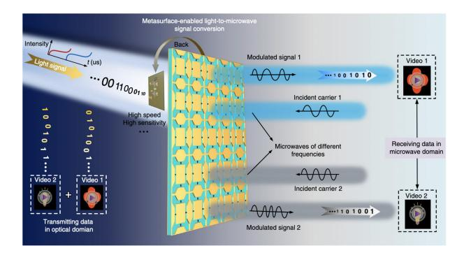

Fig. 18. RIS enabled light-to-microwave transmitter. Source: [\[384\]](#page-40-0).

operation in VLC is still in its infancy, which is discussed in [\[377\]](#page-39-33). The research by [\[378\]](#page-39-34) considers the application of RIS for 6G Systems through light-fidelity wireless networks (LiFi). In a separate work, the same author also proposed the application of RIS for NOMA-based VLC [\[379\]](#page-39-35), which allows it to reduce its theoretical BER significantly. The work in [\[380\]](#page-39-36) considers the application of digital coding RIS in optical wireless communication (OWC) networks, that enables digital signal processing in the EM domain. This concept is similar to the SIM concept, discussed previously that was proposed for RF waves.

Another example of optical communication is the proposed free-space optical (FSO) communication that expects using optical wavebands at frequencies around 200 THz [\[381\]](#page-39-37). Despite its benefits, FSO communication is difficult to design due to air turbulence and aiming mistakes. In the research made by [\[382\]](#page-39-38), RISs were studied in an FSO communication configuration that considers air turbulence and aiming faults. By using the optically controlled varactor diodes first introduced in [\[383\]](#page-40-1), the same authors have proposed a light-to-microwave transmitter via optically programmable metasurface in [\[384\]](#page-40-0). This concept is illustrated in Fig. [18.](#page-30-13) The authors validated the design by building a prototype and managed to simultaneously transfer two video files via this interface, although the transmission speed of the prototype was only 100 kbps. Nevertheless, as this interface does not use traditional RF chains for signal modulation, it becomes highly attractive for low-cost and highly efficient applications that may not require high data rates, for example, in space. Aiming at improving the performance of FSO systems, the authors in [\[385\]](#page-40-2) developed a phase shift distribution across the RIS with a Gaussian laser beam in mind. For the same phaseshift profile as the RIS in the original system, there is an FSO system employing a mirror to produce a reflected electric field on the mirror. Additionally, the novel work by [\[386\]](#page-40-3) and [\[387\]](#page-40-4) proposes a realistic LC-based RIS for signal amplification and light steering. Results show that the VLC transmission range can be increased from about 0.20 m to 1.08 m and the achievable data rate can be improved significantly with the use of the proposed model.

# IX. CONCLUSION

In this work, we considered the application of MF-RIS technology in future networks and its ability to perform holographic positioning in ISAC-based 6G networks. MF-RIS is the natural evolution and the logical continuation of research on RIS with some of the most exciting research fields for future work including the hybrid active RIS with amplification gain, the STAR-RIS, RIS for frequency conversion, and RIS with EH elements for WPT. We reviewed the applications for MF-RIS technology and arranged them in the order of their perceived TRL. We also reviewed the frequently reported problems associated with MF-RIS, such as the physical layer security, channel modeling and measurement, interference mitigation, and power consumption. We listed and compared several MF-RIS prototypes operating in the sub-6GHz / cmWave / mmWave / THz RF spectrum.

We conclude that the combination of the above concepts will ultimately lead to the integration of MF-RIS in 6G networks that can revolutionize radio communication and provide the basis for the next network capacity boost, thus fostering innovation and economic growth.

#### REFERENCES

- [\[1\]](#page-0-0) M. H. Alsharif, A. H. Kelechi, M. A. Albreem, S. A. Chaudhr, M. S. Zia, and S. Kim, "Sixth generation (6G) wireless networks: Vision, research activities, challenges, and potential solutions," *Symmetry*, vol. 12, no. 4, p. 676, 2020
- [\[2\]](#page-0-1) E. Semaan, E. Tejedor, R. Kumar-Kochhar, S. Magnusson, and S. Parkvall, "6G spectrum—Enabling the future mobile life beyond 2030," Ericsson, Stockholm, Sweden, White Paper, Mar. 2023
- [\[3\]](#page-0-2) M. Banafa et al., "6G mobile communication technology: Requirements, targets, applications, challenges, advantages, and opportunities," *Alex. Eng. J.*, vol. 64, pp. 245–274, Feb. 2023.
- [\[4\]](#page-0-3) X. Wang et al., "Millimeter wave communication: A comprehensive survey," *IEEE Commun. Surveys Tuts.*, vol. 20, no. 3, pp. 1616–1653, 3rd Quart., 2018, doi: [10.1109/COMST.2018.284432.](http://dx.doi.org/10.1109/COMST.2018.284432)
- [\[5\]](#page-0-3) T. S. Rappaport et al., "Millimeter wave mobile communications for 5G cellular: It will work!" *IEEE Access*, vol. 1, pp. 335–349, 2013, doi: [10.1109/ACCESS.2013.226081.](http://dx.doi.org/10.1109/ACCESS.2013.226081)
- [\[6\]](#page-0-3) T. S. Rappaport, R. W. Heath Jr., R. C. Daniels, and J. N. Murdock, *Millimeter Wave Wireless Communications*. London, U.K.: Pearson Educ., 2015
- [\[7\]](#page-0-3) T. S. Rappaport, Y. Xing, G. R. MacCartney, A. F. Molisch, E. Mellios, and J. Zhang, "Overview of millimeter wave communications for fifth-generation (5G) wireless networks—With a focus on propagation models," *IEEE Trans. Antennas Propag.*, vol. 65, no. 12, pp. 6213–6230, Dec. 2017, doi: [10.1109/TAP.2017.273424.](http://dx.doi.org/10.1109/TAP.2017.273424)
- [\[8\]](#page-1-0) S. Parkvall, R. Baldemair, and J. Lun, "Why cmWave spectrum is expected to be a powerful enabler of 6G and future networks." Ericsson. Accessed: Jul. 7, 2023. [Online]. Available: https://www.ericsson.com/ en/blog/2023/6/cm-wave-spectrum-6g-potent-enabler
- [\[9\]](#page-1-1) E. Björnson, L. Sanguinetti, J. Hoydis, and M. Debbah, "Optimal design of energy-efficient multi-user MIMO systems: Is massive MIMO the answer?" *IEEE Trans. Wireless Commun.*, vol. 14, no. 6, pp. 3059–3075, Jun. 2015, doi: [10.1109/TWC.2015.240043.](http://dx.doi.org/10.1109/TWC.2015.240043)
- [\[10\]](#page-1-1) E. Ali, M. Ismail, R. Nordin, and N. F. Abdulah "Beamforming techniques for massive MIMO systems in 5G: overview, classification, and trends for future research," *Front. Inf. Technol. Electron. Eng.*, vol. 18, pp. 753–772, Jun. 2017. [Online]. Available: https://doi.org/ 10.1631/FITEE.1601817
- [\[11\]](#page-1-1) H. Yang and T. L. Marzetta, "Energy efficient design of massive MIMO: How many antennas?" in *Proc. IEEE 81st Veh. Technol. Conf.*, 2015, pp. 1–5. [Online]. Available: http://dx.doi.org/10.1109/ VTCSpring.2015.7145809
- [\[12\]](#page-1-2) E. G. Larsson, O. Edfors, F. Tufvesson, and T. L. Marzetta, "Massive MIMO for next generation wireless systems," *IEEE Commun. Mag.*, vol. 52, no. 2, pp. 186–195, Feb. 2014, doi: [10.1109/MCOM.2014.673676.](http://dx.doi.org/10.1109/MCOM.2014.673676)
- [\[13\]](#page-1-3) "Studies for short-path propagation data and models for terrestrial radiocommunication systems in the frequency range 6 GHz to 100 GHz," ITU-Rec. P.2406-0, Int. Telecommun. Union, Geneva, Switzerland, Sep. 2017

- [\[14\]](#page-1-3) G. R. MacCartney, J. Zhang, S. Nie, and T. S. Rappaport, "pathloss models for 5G millimeter wave propagation channels in urban microcells," in *Proc. IEEE Global Communications Conference (GLOBECOM)*, 2013, pp. 3948–3953, doi: [10.1109/GLOCOM.2013.6831690.](http://dx.doi.org/10.1109/GLOCOM.2013.6831690)
- [\[15\]](#page-1-3) T. S. Rappaport, G. R. MacCartney, M. K. Samimi, and S. Sun, "Wideband millimeter-wave propagation measurements and channel models for future wireless communication system design," *IEEE Trans. Commun.*, vol. 63, no. 9, pp. 3029–3056, Sep. 2015, doi: [10.1109/TCOMM.2015.243438.](http://dx.doi.org/10.1109/TCOMM.2015.243438)
- [\[16\]](#page-1-4) R. Di Taranto, S. Muppirisetty, R. Raulefs, D. Slock, T. Svensson, and H. Wymeersch, "Location-aware communications for 5G networks: How location information can improve scalability, latency, and robustness of 5G," *IEEE Signal Process. Mag.*, vol. 31, no. 6, pp. 102–112, Nov. 2014, doi: [10.1109/MSP.2014.2332611.](http://dx.doi.org/10.1109/MSP.2014.2332611)
- [\[17\]](#page-1-4) J. Talvitie, T. Levanen, M. Koivisto, T. Ihalainen, K. Pajukoski, and M. Valkama, "Positioning and location-aware communications for modern railways with 5G new radio," *IEEE Commun. Mag.*, vol. 57, no. 9, pp. 24–30, Sep. 2019, doi: [10.1109/MCOM.001.1800954.](http://dx.doi.org/10.1109/MCOM.001.1800954)
- [\[18\]](#page-1-4) M. Koivisto, A. Hakkarainen, M. Costa, P. Kela, K. Leppanen, and M. Valkama, "High-efficiency device positioning and location-aware communications in dense 5G networks," *IEEE Commun. Mag.*, vol. 55, no. 8, pp. 188–195, Aug. 2017, doi: [10.1109/MCOM.2017.160065.](http://dx.doi.org/10.1109/MCOM.2017.160065)
- [\[19\]](#page-1-5) M. Zecchin, M. B. Mashhadi, M. Jankowski, D. Gündüz, M. Kountouris, and D. Gesbert, "LIDAR and position-aided mmWave beam selection with non-local CNNs and curriculum training," *IEEE Trans. Veh. Technol.*, vol. 71, no. 3, pp. 2979–2990, Mar. 2022, doi: [10.1109/TVT.2022.314251.](http://dx.doi.org/10.1109/TVT.2022.314251)
- [\[20\]](#page-1-5) K. Vuckovic, M. B. Mashhadi, F. Hejazi, N. Rahnavard, and A. Alkhateeb, "PARAMOUNT: Toward generalizable deep learning for mmWave beam selection using sub-6 GHz channel measurements," *IEEE Trans. Wireless Commun.*, vol. 23, no. 5, pp. 5187–5202, May 2024, doi: [10.1109/TWC.2023.332491.](http://dx.doi.org/10.1109/TWC.2023.332491)
- [\[21\]](#page-1-6) D. Marasinghe, N. Rajatheva, and M. Latva-Aho, "LiDAR aided human blockage prediction for 6G," in *Proc. IEEE Globecom Workshops (GC Wkshps)*, 2021, pp. 1–6, doi: [10.1109/GCWkshps52748.2021.968194.](http://dx.doi.org/10.1109/GCWkshps52748.2021.968194)
- [\[22\]](#page-1-7) C. Saigre-Tardif and P. del Hougne, "Self-adaptive RISs beyond free space: Convergence of localization, sensing, and communication under rich-scattering conditions," *IEEE Wireless Commun.*, vol. 30, no. 1, pp. 24–30, Feb. 2023, doi: [10.1109/MWC.001.220019.](http://dx.doi.org/10.1109/MWC.001.220019)
- [\[23\]](#page-1-7) R. E. Hodges et al., "Integrated solar array and reflectarray antenna for high bandwidth CubeSats," Nat. Aeronaut. Space Admin., Washington, DC, USA, Rep. FS-2018-07-03-ARC, Jul. 2018.
- [\[24\]](#page-1-8) H. Zhao et al., "Intelligent indoor metasurface robotics," *Nat. Sci. Rev.*, vol. 10, no. 8, 2022, Art. no. nwac266, doi: [10.1093/nsr/nwac266.](http://dx.doi.org/10.1093/nsr/nwac266)
- [\[25\]](#page-4-0) "Industry Specification Group (ISG) on Reconfigurable Intelligent Surfaces (RIS)." Accessed: Jul. 7, 2023. [Online]. Available: https:// www.etsi.org/committee/ris
- [\[26\]](#page-4-1) "Reconfigurable Intelligent Surfaces (RIS); use cases, deployment scenarios and requirements, Version 1.1.1," ETSI, Sophia Antipolis, France, Rep. GR RIS 001, 2023.
- [\[27\]](#page-4-2) "Reconfigurable Intelligent Surfaces (RIS); Technological challenges, architecture and impact on standardization, Version 1.1.1," ETSI, Sophia Antipolis, France, Rep. GR RIS 002, 2023.
- [\[28\]](#page-4-3) "Reconfigurable Intelligent Surfaces (RIS); communication models, channel models, channel estimation and evaluation methodology, Version 1.1.1," ETSI, Sophia Antipolis, France, Rep. GR RIS 003, 2023.
- [\[29\]](#page-1-9) S. Payami et al., "Developing the first mmWave fully-connected hybrid beamformer with a large antenna array," *IEEE Access*, vol. 8, pp. 141282–141291, 2020, doi: [10.1109/ACCESS.2020.301353.](http://dx.doi.org/10.1109/ACCESS.2020.301353)
- [30] J. C. De Luna Ducoing, C. Jayawardena, M. Filo, and K. Nikitopoulos, "Towards 6G MIMO systems, with massivelyparallel non-linear processing," in *Proc. IEEE Int. Mediterr. Conf. Commun. Netw. (MeditCom)*, 2021, pp. 300–305, doi: [10.1109/MeditCom49071.2021.964767.](http://dx.doi.org/10.1109/MeditCom49071.2021.964767)
- [\[31\]](#page-1-9) K. Nikitopoulos, "Massively parallel, nonlinear processing for 6G: Potential gains and further research challenges," *IEEE Commun. Mag.*, vol. 60, no. 1, pp. 81–87, Jan. 2022, doi: [10.1109/MCOM.001.2159.](http://dx.doi.org/10.1109/MCOM.001.2159)
- [\[32\]](#page-1-9) N. N. Moghadam, G. Fodor, M. Bengtsson, and D. J. Love, "On the energy efficiency of MIMO hybrid beamforming for millimeter-wave systems with nonlinear power amplifiers," *IEEE Trans. Wireless Commun.*, vol. 17, no. 11, pp. 7208–7221, Nov. 2018, doi: [10.1109/TWC.2018.286578.](http://dx.doi.org/10.1109/TWC.2018.286578)
- [\[33\]](#page-1-10) N. Engheta and R. W. Ziolkowski, *Metamaterials: Physics and Engineering Explorations*. New York, NY, USA: Wiley, 2006

- [\[34\]](#page-1-11) V. G. Veselago, "Electrodynamics of substances with simultaneously negative ε and μ," *Usp. Fiz. Nauk*, vol. 92, no. 7, p. 517, 1967.
- [\[35\]](#page-1-12) D. Sievenpiper, L. Zhang, R. F. J. Broas, N. G. Alexopolous, and E. Yablonovitch, "High-impedance electromagnetic surfaces with a forbidden frequency band," *IEEE Trans. Microw. Theory Techn.*, vol. 47, no. 11, pp. 2059–2074, Nov. 1999, doi: [10.1109/22.79800.](http://dx.doi.org/10.1109/22.79800)
- [\[36\]](#page-2-0) R. A. Shelby, D. R. Smith, and S. Schultz, "Experimental verification of a negative index of refraction," *Science*, vol. 292, no. 5514, pp. 77–79, Apr. 2021, doi: [10.1126/science.105884.](http://dx.doi.org/10.1126/science.105884)
- [\[37\]](#page-2-1) H. Kamoda, T. Iwasaki, J. Tsumochi, T. Kuki, and O. Hashimoto, "60-GHz electronically reconfigurable large reflectarray using singlebit phase shifters," *IEEE Trans. Antennas Propag.*, vol. 59, no. 7, pp. 2524–2531, Jul. 2011, doi: [10.1109/TAP.2011.2152338.](http://dx.doi.org/10.1109/TAP.2011.2152338)
- [\[38\]](#page-2-2) A. Clemente, L. Dussopt, R. Sauleau, P. Potier, and P. Pouliguen, "1-bit reconfigurable unit cell based on PIN diodes for transmit-array applications in X -band," *IEEE Trans. Antennas Propag.*, vol. 60, no. 5, pp. 2260–2269, May 2012, doi: [10.1109/TAP.2012.218971.](http://dx.doi.org/10.1109/TAP.2012.218971)
- [\[39\]](#page-2-3) S. V. Hum and J. Perruisseau-Carrier, "Reconfigurable reflectarrays and array lenses for dynamic antenna beam control: A review," *IEEE Trans. Antennas Propag.*, vol. 62, no. 1, pp. 183–198, Jan. 2014, doi: [10.1109/TAP.2013.228729.](http://dx.doi.org/10.1109/TAP.2013.228729)
- [\[40\]](#page-2-4) Y.-C. Liang, "Reconfigurable intelligent surfaces for smart wireless environments: Channel estimation, system design and applications in 6G networks," *Sci. China Inf. Sci.*, vol. 64, no. 10, pp. 1–21, 2021.
- [\[41\]](#page-2-5) G. C. Alexandropoulos et al., "Smart wireless environments enabled by RISs: Deployment scenarios and two key challenges," in *Proc. Joint Eur. Conf. Netw. Commun. 6G Summit (EuCNC/6G Summit)*, 2022, pp. 1–6, doi: [10.1109/EuCNC/6GSummit54941.2022.981561.](http://dx.doi.org/10.1109/EuCNC/6GSummit54941.2022.981561)
- [\[42\]](#page-2-5) A. Araghi, M. Khalily, P. Xiao, F. Wang, and R. Tafazolli, "Systematic design of a holographic-based metasurface reflector in the sub-6 GHz band," *IEEE Antennas Wireless Propag. Lett.*, vol. 21, pp. 1960–1964, 2022, doi: [10.1109/LAWP.2022.318692.](http://dx.doi.org/10.1109/LAWP.2022.318692)
- [\[43\]](#page-2-6) A. Tishchenko, A. Ali, P. Botham, F. Burton, M. Khalily, and R. Tafazolli, "Reflective metasurface for 5G mmWave coverage enhancement," in *Proc. Int. Symp. Antennas Propag. (ISAP)*, 2022, pp. 507–508, doi: [10.1109/ISAP53582.2022.999870.](http://dx.doi.org/10.1109/ISAP53582.2022.999870)
- [\[44\]](#page-2-6) (Ericsson, Stockholm, Sweden). *Leveraging the Potential of 5G Millimeter Wave*. 2021. [Online]. Available: https://www.ericsson.com/ en/reports-and-papers/further-insights/leveraging-the-potential-of-5gmillimeter-wave
- [\[45\]](#page-2-7) Ö. Özdogan, E. Björnson, and E. G. Larsson, "Intelligent reflecting surfaces: Physics, propagation, and pathloss modeling," 2019, *arXiv:1911.03359*.
- [\[46\]](#page-2-8) E. C. Strinati et al., "Reconfigurable, intelligent, and sustainable wireless environments for 6G smart connectivity," in *Proc. Joint Eur. Conf. Netw. Commun. 6G Summit*, 2021, pp. 562–567.
- [\[47\]](#page-2-9) M. H. Khoshafa, T. M. N. Ngatched, M. H. Ahmed, and A. R. Ndjiongue, "Active reconfigurable intelligent surfaces-aided wireless communication system," *IEEE Commun. Lett.*, vol. 25, no. 11, pp. 3699–3703, Nov. 2021, doi: [10.1109/LCOMM.2021.3110714.](http://dx.doi.org/10.1109/LCOMM.2021.3110714)
- [\[48\]](#page-2-10) K. Zhi, C. Pan, H. Ren, K. K. Chai, and M. Elkashlan, "Active RIS versus passive RIS: Which is superior with the same power budget?" *IEEE Commun. Lett.*, vol. 26, no. 5, pp. 1150–1154, May 2022, doi: [10.1109/LCOMM.2022.315952.](http://dx.doi.org/10.1109/LCOMM.2022.315952)
- [49] R. K. Fotock, A. Zappone, and M. D. Renzo, "Energy efficiency optimization in RIS-aided wireless networks: Active versus nearly-passive RIS with global reflection constraints," *IEEE Trans. Commun.*, vol. 72, no. 1, pp. 257–272, Jan. 2024, doi: [10.1109/TCOMM.2023.332070.](http://dx.doi.org/10.1109/TCOMM.2023.332070)
- [\[50\]](#page-2-10) C. Huang et al., "Holographic MIMO surfaces for 6G wireless networks: Opportunities, challenges, and trends," *IEEE Wireless Commun.*, vol. 27, no. 5, pp. 118–125, Oct. 2020, doi: [10.1109/MWC.001.190053.](http://dx.doi.org/10.1109/MWC.001.190053)
- [\[51\]](#page-2-11) T. Gong et al., "Holographic MIMO communications: Theoretical foundations, enabling technologies, and future directions," *IEEE Commun. Surveys Tuts.*, vol. 26, no. 1, pp. 196–257, 1st Quart., 2024, doi: [10.1109/COMST.2023.330952.](http://dx.doi.org/10.1109/COMST.2023.330952)
- [\[52\]](#page-2-12) L. Wei et al., "Tri-polarized holographic MIMO surfaces for nearfield communications: Channel modeling and precoding design," *IEEE Trans. Wireless Commun.*, vol. 22, no. 12, pp. 8828–8842, Dec. 2023, doi: [10.1109/TWC.2023.326629.](http://dx.doi.org/10.1109/TWC.2023.326629)
- [\[53\]](#page-2-12) A. T. Joy et al., "From reconfigurable intelligent surfaces to holographic MIMO surfaces and back," in *Proc. 18th Eur. Conf. Antennas Propag. (EuCAP)*, Glasgow, U.K., 2024, pp. 1–5, doi: [10.23919/EuCAP60739.2024.1050113.](http://dx.doi.org/10.23919/EuCAP60739.2024.1050113)
- [\[54\]](#page-2-12) H. Wu et al., "Information theory of metasurfaces," *Nat. Sci. Rev.*, vol. 7, no. 3, pp. 561–571, 2020, doi: [10.1093/nsr/nwz19.](http://dx.doi.org/10.1093/nsr/nwz19)

- [\[55\]](#page-2-13) T. J. Cui, S. Liu, G. D. Bai, and Q. Ma, "Direct transmission of digital message via programmable coding metasurface," *Research*, Jan. 2019, Art. no. 2584509, doi: [10.34133/2019/2584509.](http://dx.doi.org/10.34133/2019/2584509)
- [\[56\]](#page-2-14) J. Y. Dai et al., "Realization of multi-modulation schemes for wireless communication by time-domain digital coding metasurface," *IEEE Trans. Antennas Propag.*, vol. 68, no. 3, pp. 1618–1627, Mar. 2020.
- [\[57\]](#page-2-14) M. Z. Chen et a., "Accurate and broadband manipulations of harmonic amplitudes and phases to reach 256 QAM millimeter-wave wireless communications by time-domain digital coding metasurface," *Nat. Sci. Rev.*, vol. 9, no. 1, Art. no. nwab134, Jan. 2022. [Online]. Available: https://doi.org/10.1093/nsr/nwab134
- [\[58\]](#page-2-14) E. Basar, "Reconfigurable intelligent surface-based index modulation: A new beyond MIMO paradigm for 6G," *IEEE Trans. Commun.*, vol. 68, no. 5, pp. 3187–3196, May 2020, doi: [10.1109/TCOMM.2020.2971486.](http://dx.doi.org/10.1109/TCOMM.2020.2971486)
- [\[59\]](#page-2-14) S. Lin, F. Chen, M. Wen, Y. Feng, and M. Di Renzo, "Reconfigurable intelligent surface-aided quadrature reflection modulation for simultaneous passive beamforming and information transfer," *IEEE Trans. Wireless Commun.*, vol. 21, no. 3, pp. 1469–1481, Mar. 2022, doi: [10.1109/TWC.2021.3104059.](http://dx.doi.org/10.1109/TWC.2021.3104059)
- [60] R. Fara, D.-T. Phan-Huy, P. Ratajczak, A. Ourir, M. Di Renzo, and J. De Rosny, "Reconfigurable intelligent surface-assisted ambient backscatter communications—Experimental assessment," in *Proc. IEEE Int. Conf. Commun. Workshops (ICC Workshops)*, 2021, pp. 1–7, doi: [10.1109/ICCWorkshops50388.2021.9473842.](http://dx.doi.org/10.1109/ICCWorkshops50388.2021.9473842)
- [\[61\]](#page-3-1) Y.-C. Liang, Q. Zhang, J. Wang, R. Long, H. Zhou, and G. Yang, "Backscatter communication assisted by reconfigurable intelligent surfaces," *Proc. IEEE*, vol. 110, no. 9, pp. 1339–1357, Sep. 2022, doi: [10.1109/JPROC.2022.3169622.](http://dx.doi.org/10.1109/JPROC.2022.3169622)
- [\[62\]](#page-3-2) H. Zhao, Y. Shuang, M. Wei, T. J. Cui, P. Hougne, and L. Li, "Metasurface-assisted massive backscatter wireless communication with commodity Wi-Fi signals," *Nat. Commun.*, vol. 11, no. 1, p. 3926, 2020.
- [\[63\]](#page-3-3) L. Zhang et al., "Co-prime modulation for space-time-coding digital metasurfaces with ultralow-scattering characteristics," *Adv. Funct. Mater.*, vol. 34, no. 21, 2024, Art. no. 2314110.
- [\[64\]](#page-3-3) R. K. Fotock, A. Zappone, and M. Di Renzo, "Energy efficiency in RIS-aided wireless networks: Active or passive RIS?" in *Proc. IEEE Int. Conf. Commun.*, 2023, pp. 2704–2709, doi: [10.1109/ICC45041.2023.10279284.](http://dx.doi.org/10.1109/ICC45041.2023.10279284)
- [\[65\]](#page-3-3) G. C. Alexandropoulos et al., "RIS-enabled smart wireless environments: Deployment scenarios, network architecture, bandwidth and area of influence," *J. Wireless Commun. Netw.*, p. 103, 2023, doi: [10.1186/s13638-023-02295-8.](https://doi.org/10.1186/s13638-023-02295-8)
- [\[66\]](#page-11-1) M. A. Imran, L. Mohjazi, L. Bariah, S. Muhaidat, T. J. Cui, and Q. H. Abbasi, Eds., *Intelligent Reconfigurable Surfaces (IRS) for Prospective 6G Wireless Networks* (The ComSoc guides to communications technologies). New York, NY, USA: Wiley/IEEE Press, 2023.
- [\[67\]](#page-3-4) Q. Wu and R. Zhang, "Towards smart and reconfigurable environment: Intelligent reflecting surface aided wireless network," *IEEE Commun. Mag.*, vol. 58, no. 1, pp. 106–112, Jan. 2020.
- [\[68\]](#page-3-5) M. A. ElMossallamy, H. Zhang, L. Song, K. G. Seddik, Z. Han, and G. Y. Li, "Reconfigurable intelligent surfaces for wireless communications: Principles, challenges, and opportunities," *IEEE Trans. Cogn. Commun. Netw.*, vol. 6, no. 3, pp. 990–1002, Sep. 2020.
- [69] R. Alghamdi et al., "Intelligent surfaces for 6G wireless networks: A survey of optimization and performance analysis techniques," *IEEE Access*, vol. 8, pp. 202795–202818, 2020.
- [70] T. Sharma, A. Chehri, and P. Fortier, "Reconfigurable Intelligent Surfaces for 5G and beyond Wireless Communications: A Comprehensive Survey," *Energies*, vol. 14, no. 24, p. 8219, 2021. [Online]. Available: https://doi.org/10.3390/en14248219
- [71] M. Jian et al., "Reconfigurable intelligent surfaces for wireless communications: Overview of hardware designs, channel models, and estimation techniques," *Intell. Converg. Netw.*, vol. 3, no. 1, pp. 1–32, Mar. 2022.
- [72] Y. Liu et al., "Reconfigurable intelligent surfaces: Principles and opportunities," *IEEE Commun. Surveys Tuts.*, vol. 23, no. 3, pp. 1546–1577, 3rd Quart., 2021.
- [73] O. Tsilipakos et al., "Toward intelligent metasurfaces: The progress from globally tunable metasurfaces to software-defined metasurfaces with an embedded network of controllers," *Adv. Opt. Mater.*, vol. 8, no. 17, 2020, Art. no. 2000783. [Online]. Available: https://doi.org/10. 1002/adom.202000783

- [74] M. Di Renzo et al., "Smart radio environments empowered by reconfigurable intelligent surfaces: How it works, state of research, and the road ahead," *IEEE J. Sel. Areas Commun.*, vol. 38, no. 11, pp. 2450–2525, Nov. 2020, doi: [10.1109/JSAC.2020.3007211.](http://dx.doi.org/10.1109/JSAC.2020.3007211)
- [75] S. N. Sur, A. K. Singh, D. Kandar, A. Silva, and N. D. Nguyen, "Intelligent reflecting surface assisted localization: Opportunities and challenges," *Electronics*, vol. 11, no. 9, p. 1411, 2022. [Online]. Available: https://doi.org/10.3390/electronics11091411
- [76] S. K. Das et al., "Comprehensive review on ML-based RIS-enhanced IoT systems: basics, research progress and future challenges," *Comput. Netw.*, vol. 224, Apr. 2023, Art. no. 109581. [Online]. Available: https: //doi.org/10.1016/j.comnet.2023.109581
- [77] M. Di Renzo, F. H. Danufane, and S. Tretyakov, "Communication models for reconfigurable intelligent surfaces: From surface electromagnetics to wireless networks optimization," *Proc. IEEE*, vol. 110, no. 9, pp. 1164–1209, Sep. 2022.
- [78] E. Basar and H. V. Poor, "Present and future of reconfigurable intelligent surface-empowered communications [perspectives]," *IEEE Signal Process. Mag.*, vol. 38, no. 6, pp. 146–152, Nov. 2021.
- [79] J. Tang, S. Xu, F. Yang, and M. Li, "Recent developments of transmissive reconfigurable intelligent surfaces: A review," *ZTE Commun.*, vol. 20, no. 1, pp. 21–27, 2022.
- [80] F. Yang, P. Pitchappa, and N. Wang, "THz reconfigurable intelligent surfaces (RISs) for 6G communication links," *Micromachines*, vol. 13, no. 2, p. 285, 2022, doi: [10.3390/mi13020285.](http://dx.doi.org/10.3390/mi13020285)
- [81] B. Zheng, C. You, W. Mei, and R. Zhang, "A survey on channel estimation and practical passive beamforming design for intelligent reflecting surface aided wireless communications," *IEEE Commun. Surveys Tuts.*, vol. 24, no. 2, pp. 1035–1071, 2nd Quart., 2022.
- [\[82\]](#page-9-1) L. Li, H. Zhao, C. Liu, L. Li, and T. J. Cui, "Intelligent metasurfaces: Control, communication and computing," *eLight*, vol. 2, no. 1, p. 7, 2022. [Online]. Available: https://doi.org/10.1186/s43593-022-00013-3
- [83] C. Liaskos et al., "Software-defined reconfigurable intelligent surfaces: From theory to end-to-end implementation," *Proc. IEEE*, vol. 110, no. 9, pp. 1466–1493, Sep. 2022, doi: [10.1109/JPROC.2022.3169917.](http://dx.doi.org/10.1109/JPROC.2022.3169917)
- [\[84\]](#page-24-0) K. Sengupta, S. Venkatesh, H. Saeidi, and X. Lu, "Reconfigurable intelligent surfaces enabled by silicon chips for secure and robust mmWave and THz wireless communication," in *Proc. IEEE 48th Eur. Solid State Circuits Conf. (ESSCIRC)*, 2022, pp. 546–549, doi: [10.1109/ESSCIRC55480.2022.9911320.](http://dx.doi.org/10.1109/ESSCIRC55480.2022.9911320)
- [\[85\]](#page-12-0) H. Liu et al., "Stacked intelligent metasurfaces for wireless sensing and communication: Applications and challenges," 2024, *arXiv:2407.03566*.
- [86] D. Gürgünoglu, E. Björnson, and G. Fodor, "Impact of pilot contam- ˘ ination between operators with interfering reconfigurable intelligent surfaces," in *Proc. IEEE Int. Black Sea Conf. Commun. Netw.*, 2023, pp. 27–32.
- [\[87\]](#page-14-2) N. Yu et al., "Light propagation with phase discontinuities: Generalized laws of reflection and refraction," *Science*, vol. 334, no. 6054, pp. 333–337, 2011, doi: [10.1126/science.1210713.](http://dx.doi.org/10.1126/science.1210713)
- [88] L. Zheng, M. Lops, Y. C. Eldar, and X. Wang, "Radar and communication coexistence: An overview: A review of recent methods," *IEEE Signal Process. Mag.*, vol. 36, no. 5, pp. 85–99, Sep. 2019, doi: [10.1109/MSP.2019.2907329.](http://dx.doi.org/10.1109/MSP.2019.2907329)
- [\[89\]](#page-4-4) F. Liu, C. Masouros, A. P. Petropulu, H. Griffiths, and L. Hanzo, "Joint radar and communication design: Applications, state-of-the-art, and the road ahead," *IEEE Trans. Commun.*, vol. 68, no. 6, pp. 3834–3862, Jun. 2020.
- [\[90\]](#page-7-2) A. Osipov and S. Tretyakov, *Modern Electromagnetic Scattering Theory With Applications*. Hoboken, NJ, USA: Wiley, 2017.
- [\[91\]](#page-6-2) V. S. Asadchy, M. Albooyeh, S. N. Tcvetkova, A. Díaz-Rubio, Y. Ra'di, and S. A. Tretyakov "Perfect control of reflection and refraction using spatially dispersive metasurfaces," *Phys. Rev. B, Condens. Matter*, vol. 94, no. 7, 2016, Art. no. 75142.
- [\[92\]](#page-6-3) A. Díaz-Rubio and S. A. Tretyakov, "Macroscopic modeling of anomalously reflecting metasurfaces: Angular response and farfield scattering," *IEEE Trans. Antennas Propag.*, vol. 69, no. 10, pp. 6560–6571, Oct. 2021.
- [\[93\]](#page-7-3) E. Martini and S. Maci, "Theory, analysis, and design of metasurfaces for smart radio environments," *Proc. IEEE*, vol. 110, no. 9, pp. 1227–1243, Sep. 2022, doi: [10.1109/JPROC.2022.3171921.](http://dx.doi.org/10.1109/JPROC.2022.3171921)
- [\[94\]](#page-7-3) K. T. Selvan and R. Janaswamy, "Fraunhofer and Fresnel distances: Unified derivation for aperture antennas," *IEEE Antennas Propag. Mag.*, vol. 59, no. 4, pp. 12–15, Aug. 2017, doi: [10.1109/MAP.2017.2706648.](http://dx.doi.org/10.1109/MAP.2017.2706648)

- [\[95\]](#page-7-3) R. Ebrahimzadeh, S. E. Hosseininejad, B. Zakeri, A. Darvish, M. Khalily, and R. Tafazolli, "Ultra-compact 60 GHznear-field focusing configuration using SIW slot array loaded by transmission coding metasurface lens," *IEEE Trans. Antennas Propag.*, vol. 72, no. 2, pp. 1977–1982, Feb. 2024, doi: [10.1109/TAP.2023.3331775.](http://dx.doi.org/10.1109/TAP.2023.3331775)
- [\[96\]](#page-7-3) B. H. Fong, J. S. Colburn, J. J. Ottusch, J. L. Visher, and D. F. Sievenpiper, "Scalar and tensor holographic artificial impedance surfaces," *IEEE Trans. Antennas Propag.*, vol. 58, no. 10, pp. 3212–3221, Oct. 2010.
- [\[97\]](#page-7-4) P. Mei et al., "On the study of reconfigurable intelligent surfaces in the near-field region," *IEEE Trans. Antennas Propag.*, vol. 70, no. 10, pp. 8718–8728, Oct. 2022, doi: [10.1109/TAP.2022.3147533.](http://dx.doi.org/10.1109/TAP.2022.3147533)
- [\[98\]](#page-7-5) Y. Liu, Z. Wang, J. Xu, C. Ouyang, X. Mu, and R. Schober, "Nearfield communications: A tutorial review," *IEEE Open J. Commun. Soc.*, vol. 4, pp. 1999–2049, 2023, doi: [10.1109/OJCOMS.2023.3305583.](http://dx.doi.org/10.1109/OJCOMS.2023.3305583)
- [99] Y. Jiang, F. Gao, M. Jian, S. Zhang, and W. Zhang, "Reconfigurable intelligent surface for near field communications: Beamforming and sensing," *IEEE Trans. Wireless Commun.*, vol. 22, no. 5, pp. 3447–3459, May 2023.
- [\[100\]](#page-7-6) E. Björnson, Ö. T. Demir, and L. Sanguinetti, "A primer on near-field beamforming for arrays and reconfigurable intelligent surfaces," in *Proc. Asilomar Conf. Signals, Syst., Comput.*, 2021, pp. 105–112.
- [\[101\]](#page-7-6) D. Kitayama, Y. Hama, K. Goto, K. Miyachi, T. Motegi, and O. Kagaya, "Transparent dynamic metasurface for a visually unaffected reconfigurable intelligent surface: Controlling transmission/reflection and making a window into an RF lens," *Opt. Exp.*, vol. 29, no. 18, pp. 29292–29307, 2021, doi: [10.1364/OE.435648.](http://dx.doi.org/10.1364/OE.435648)
- [\[102\]](#page-7-6) W. Du et al., "Hybrid beamforming design for ITS-assisted wireless networks," *IEEE Wireless Commun. Lett.*, vol. 12, no. 3, pp. 451–455, Mar. 2023, doi: [10.1109/LWC.2022.3230095.](http://dx.doi.org/10.1109/LWC.2022.3230095)
- [\[103\]](#page-7-6) Z. Li et al., "Toward transmissive RIS transceiver enabled uplink communication systems: Design and optimization," *IEEE Internet Things J.*, vol. 11, no. 4, pp. 6788–6801, Feb. 2024, doi: [10.1109/JIOT.2023.3312776.](http://dx.doi.org/10.1109/JIOT.2023.3312776)
- [\[104\]](#page-9-2) S. Zhuo et al., "Dynamic transmissive metasurface for broadband phase-only modulation based on phase-change materials," *Laser Photon. Rev.*, vol. 17, no. 1, 2023, Art. no. 2200403.
- [\[105\]](#page-9-3) A. Forouzmand and H. Mosallaei, "A tunable semiconductor-based transmissive metasurface: Dynamic phase control with high transmission level," *Laser Photon. Rev.*, vol. 14, no. 6, 2020, Art. no. 1900353.
- [106] S. Zeng et al., "Intelligent omni-surfaces: Reflection-refraction circuit model, full-dimensional beamforming, and system implementation," *IEEE Trans. Commun.*, vol. 70, no. 11, pp. 7711–7727, Nov. 2022.
- [\[107\]](#page-9-4) H. Zhang and B. Di, "Intelligent omni-surfaces: Simultaneous refraction and reflection for full-dimensional wireless communications," *IEEE Commun. Surveys Tuts.*, vol. 24, no. 4, pp. 1997–2028, 4th Quart., 2022.
- [\[108\]](#page-9-5) Y. She et al., "Intelligent reconfigurable metasurface for self-adaptively electromagnetic functionality switching," *Photon. Res.*, vol. 10, no. 3, pp. 769–776, 2022.
- [\[109\]](#page-9-6) A. Araghi and M. Khalily, "Holographic beamforming," in *MIMO Communications—Fundamental Theory, Propagation Channels, and Antenna Systems*. London, U.K.: IntechOpen, 2023, doi: [10.5772/intechopen.112467.](http://dx.doi.org/10.5772/intechopen.112467)
- [\[110\]](#page-9-7) R. Liu, Q. Wu, M. Di Renzo, and Y. Yuan, "A path to smart radio environments: An industrial viewpoint on reconfigurable intelligent surfaces," *IEEE Wireless Commun.*, vol. 29, no. 1, pp. 202–208, Feb. 2022, doi: [10.1109/MWC.111.2100258.](http://dx.doi.org/10.1109/MWC.111.2100258)
- [\[111\]](#page-9-8) A. Bagheri et al., "Mathematical model and real-world demonstration of multi-beam and wide-beam reconfigurable intelligent surface," *IEEE Access*, vol. 11, pp. 19613–19621, 2023, doi: [10.1109/ACCESS.2023.3248501.](http://dx.doi.org/10.1109/ACCESS.2023.3248501)
- [\[112\]](#page-9-7) H. Taghvaee et al., "Scalability analysis of programmable metasurfaces for beam steering," *IEEE Access*, vol. 8, pp. 105320–105334, 2020, doi: [10.1109/ACCESS.2020.3000424.](http://dx.doi.org/10.1109/ACCESS.2020.3000424)
- [\[113\]](#page-8-2) J. C. Liang, P. Zhang, Q. Cheng, and T. J. Cui, "Reconfigurable intelligent surface with high optical-transparency based on metalmesh," *J. Inf. Intell.*, vol. 1, no. 3, pp. 228–237, 2023.
- [\[114\]](#page-8-3) J. C. Liang et al., "An optically transparent reconfigurable intelligent surface with low angular sensitivity," *Adv. Opt. Mater.*, vol. 12, no. 6, 2022, Art. no. 2202081.
- [\[115\]](#page-8-4) C. Wu, C. You, Y. Liu, X. Gu, and Y. Cai, "Channel estimation for STAR-RIS-aided wireless communication," *IEEE Commun. Lett.*, vol. 26, no. 3, pp. 652–656, Mar. 2022.

- [\[116\]](#page-8-5) Y. Liu et al., "STAR: Simultaneous transmission and reflection for 360◦coverage by intelligent surfaces," *IEEE Wireless Commun.*, vol. 28, no. 6, pp. 102–109, Dec. 2021.
- [\[117\]](#page-8-6) T. J. Cui, M. Q. Qi, X. Wan, J. Zhao, and Q. Cheng, "Coding metamaterials, digital metamaterials and programmable metamaterials," *Light Sci. Appl.*, vol. 3, no. 10, p. e218, 2014.
- [118] J. Zhao et al., "Programmable time-domain digital-coding metasurface for non-linear harmonic manipulation and new wireless communication systems," *Nat. Sci. Rev.*, vol. 6, no. 2, pp. 231–238, 2019.
- [\[119\]](#page-9-9) H. Rajabalipanah, K. Rouhi, A. Abdolali, S. Iqbal, L. Zhang, and S. Liu, "Real-time terahertz meta-cryptography using polarization-multiplexed graphene-based computer-generated holograms," *Nanophotonics*, vol. 9, no. 9, pp. 2861–2877, 2020.
- [\[120\]](#page-9-10) W. Tang et al., "Wireless communications with reconfigurable intelligent surface: Pathloss modeling and experimental measurement," *IEEE Trans. Wireless Commun.*, vol. 20, no. 1, pp. 421–439, Jan. 2021.
- [\[121\]](#page-9-11) S. Terranova, M. Richter, N. Mohammed, G. Gradoni, and G. Tanner, "Integration of reconfigurable intelligent surfaces in dynamical energy analysis," in *Proc. 3rd URSI Atlantic Asia Pacific Radio Sci. Meeting (AT-AP-RASC)*, 2022, pp. 1–3.
- [\[122\]](#page-11-2) A. Zappone and M. D. Renzo, "Energy efficiency optimization of reconfigurable intelligent surfaces with electromagnetic field exposure constraints," *IEEE Signal Process. Lett.*, vol. 29, pp. 1447–1451, Jun. 2022, doi: [10.1109/LSP.2022.3181532.](http://dx.doi.org/10.1109/LSP.2022.3181532)
- [\[123\]](#page-11-3) Q. Gontier et al., "Joint metrics for EMF exposure and coverage in real-world homogeneous and inhomogeneous cellular networks," *IEEE Trans. Wireless Commun.*, vol. 23, no. 10, pp. 13267–13284, Oct. 2024, doi: [10.1109/TWC.2024.3400612.](http://dx.doi.org/10.1109/TWC.2024.3400612)
- [\[124\]](#page-11-4) A. Nour, D.-T. Phan-Huy, R. Visoz, and M. Di Renzo, "A novel RISaided EMF-aware beamforming using directional spreading, truncation and boosting," in *Proc. Joint Eur. Conf. Netw. Commun. 6G Summit (EuCNC/6G Summit)*, 2022, pp. 7–12.
- [\[125\]](#page-11-5) G. Hao, D.-T. Phan-Huy, and T. Svensson, "Electromagnetic field exposure avoidance thanks to non-intended user equipment and RIS," in *Proc. IEEE Globecom Workshops (GC Wkshps)*, 2022, pp. 1537–1542.
- [\[126\]](#page-11-6) J. Rains et al., "High-resolution programmable scattering for wireless coverage enhancement: an indoor field trial campaign," *IEEE Trans. Antennas Propag.*, vol. 71, no. 1, pp. 518–530, Jan. 2023, doi: [10.1109/TAP.2022.3216555.](http://dx.doi.org/10.1109/TAP.2022.3216555)
- [\[127\]](#page-11-7) *Code of Federal Regulations: CFR Title 47 Telecommunication*, Nat. Arch. Rec. Admin., College Park, MD, USA. Accessed: Nov. 19, 2024.
- [\[128\]](#page-11-8) "IMT cellular networks; harmonised standard covering the essential requirements of article 3.2 of the directive 2014/53/EU," ETSI, Sophia Antipolis, France, Rep. EN 301 908, 2022.
- [\[129\]](#page-11-8) M. Karimipour and I. Aryanian, "High-efficiency dual-polarized broadband reflecting metasurface using continuous polarization conversion technique and element with multi degree of freedom," *Sci. Rep.*, vol. 12, p. 7577, May 2022
- [\[130\]](#page-11-9) A. Clemente, R. Madi, F. F. Manzillo, M. Smierzchalski, J. Reverdy, and R. Sauleau, "Reconfigurable transmitarrays at kaband with beam-forming and polarization agility," in *Proc. 17th Eur. Conf. Antennas Propag. (EuCAP)*, Florence, Italy, 2023, pp. 1–5, doi: [10.23919/EuCAP57121.2023.10133517.](http://dx.doi.org/10.23919/EuCAP57121.2023.10133517)
- [\[131\]](#page-12-1) Y. Ma, J. F. Kolb, A. A. Ihalage, A. S. Andy, and Y. Hao, "Incorporating meta-atom interactions in rapid optimization of large-scale disordered metasurfaces based on deep interactive learning," *Adv. Photon. Res.*, vol. 4, no. 4, Apr. 2023, Art. no. 2200099.
- [\[132\]](#page-12-2) A. Albanese, F. Devoti, V. Sciancalepore, M. D. Renzo, A. Banchs, and X. Costa-Pérez, "ARES: Autonomous RIS solution with energy harvesting and self-configuration towards 6G," *IEEE Trans. Mobile Comput.*, vol. 23, no. 12, pp. 12006–12019, Dec. 2024, doi: [10.1109/TMC.2024.340507.](http://dx.doi.org/10.1109/TMC.2024.340507)
- [133] A. Araghi et al., "Reconfigurable intelligent surface (RIS) in the sub-6 GHz band: Design, implementation, and real-world demonstration," *IEEE Access*, vol. 10, pp. 2646–2655, 2022.
- [134] L. Dai et al., "Reconfigurable intelligent surface-based wireless communications: Antenna design, prototyping, and experimental results," *IEEE Access*, vol. 8, pp. 45913–45923, 2020.
- [\[135\]](#page-12-3) J. Tang, M. Cui, S. Xu, L. Dai, F. Yang, and M. Li, "Transmissive RIS for B5G communications: Design, prototyping, and experimental demonstrations," *IEEE Trans. Commun.*, vol. 71, no. 11, pp. 6605–6615, Nov. 2023, doi: [10.1109/TCOMM.2023.329247.](http://dx.doi.org/10.1109/TCOMM.2023.329247)
- [\[136\]](#page-12-4) Y. Wang, S. Xu, F. Yang, and D. H. Werner, "1 bit dual-linear polarized reconfigurable transmitarray antenna using asymmetric dipole elements with parasitic bypass dipoles," *IEEE Trans. Antennas Propag.*, vol. 69, no. 2, pp. 1188–1192, Feb. 2021, doi: [10.1109/TAP.2020.300571.](http://dx.doi.org/10.1109/TAP.2020.300571)

- [\[137\]](#page-15-1) J. Tang, S. Xu, F. Yang, and M. Li, "Design and measurement of a reconfigurable transmitarray antenna with compact varactor-based phase shifters," *IEEE Antennas Wireless Propag. Lett.*, vol. 20, no. 10, pp. 1998–2002, Oct. 2021, doi: [10.1109/LAWP.2021.310189.](http://dx.doi.org/10.1109/LAWP.2021.310189)
- [138] J. C. Liang et al., "An angle-insensitive 3-bit reconfigurable intelligent surface," *IEEE Trans. Antennas Propag.*, vol. 70, no. 10, pp. 8798–8808, Oct. 2022, doi: [10.1109/TAP.2021.313010.](http://dx.doi.org/10.1109/TAP.2021.313010)
- [139] W. Tang et al., "Programmable metasurface-based RF chain-free 8PSK wireless transmitter," *Electron. Lett.*, vol. 55, no. 7, pp. 417–420, Apr. 2019
- [140] S. E. Hosseininejad, A. Bagheri, F. Wang, M. Khalily, and R. Tafazolli, "Active gain-controlled beam-steering transmissive surface," *IEEE Open J. Antennas Propag.*, vol. 5, pp. 1786–1794, 2024, doi: [10.1109/OJAP.2024.346281.](http://dx.doi.org/10.1109/OJAP.2024.346281)
- [\[141\]](#page-15-1) J. Jeong, J. H. Oh, S. Y. Lee, Y. Park, and S.-H. Wi, "An improved path-loss model for reconfigurable-intelligent-surface-aided wireless communications and experimental validation," *IEEE Access*, vol. 10, pp. 98065–98078, 2022, doi: [10.1109/ACCESS.2022.320511.](http://dx.doi.org/10.1109/ACCESS.2022.320511)
- [\[142\]](#page-15-2) G. C. Trichopoulos et al., "Design and evaluation of reconfigurable intelligent surfaces in real-world environment," *IEEE Open J. Commun. Soc.*, vol. 3, pp. 462–474, 2022, doi: [10.1109/OJCOMS.2022.315831.](http://dx.doi.org/10.1109/OJCOMS.2022.315831)
- [143] A. Sayanskiy et al., "A 2D-programmable and scalable reconfigurable intelligent surface remotely controlled via digital infrared code," *IEEE Trans. Antennas Propag.*, vol. 71, no. 1, pp. 570–580, Jan. 2023, doi: [10.1109/TAP.2022.321732.](http://dx.doi.org/10.1109/TAP.2022.321732)
- [144] J.-B. Gros, V. Popov, M. A. Odit, V. Lenets, and G. Lerosey, "A reconfigurable intelligent surface at mmWave based on a binary phase tunable metasurface," *IEEE Open J. Commun. Soc.*, vol. 2, pp. 1055–1064, 2021, doi: [10.1109/OJCOMS.2021.307627.](http://dx.doi.org/10.1109/OJCOMS.2021.307627)
- [145] V. Popov et al., "Experimental demonstration of a mmWave passive access point extender based on a binary reconfigurable intelligent surface," *Front. Commun. Netw.*, vol. 2, Oct. 2021, Art. no. 733891.
- [146] L. G. da Silva, Z. Chu, P. Xiao, and S. A. Cerqueira Jr., "A varactorbased 1024-element RIS design for mmWaves," *Front. Comms. Net., Sec. Wireless Commun.*, vol. 4, Mar. 2023, Art. no. 1086011, doi: [10.3389/frcmn.2023.108601.](http://dx.doi.org/10.3389/frcmn.2023.108601)
- [147] R. Fara, P. Ratajczak, D.-T. Phan-Huy, A. Ourir, M. Di Renzo, and J. de Rosny, "A prototype of reconfigurable intelligent surface with continuous control of the reflection phase," *IEEE Wireless Commun.*, vol. 29, no. 1, pp. 70–77, Feb. 2022.
- [148] R. Wang, Y. Yang, B. Makki, and A. Shamim, "A wideband reconfigurable intelligent surface for 5G millimeter-wave applications," *IEEE Trans. Antennas Propag.*, vol. 72, no. 3, pp. 2399–2410, Mar. 2024, doi: [10.1109/TAP.2024.335282.](http://dx.doi.org/10.1109/TAP.2024.335282)
- [149] X. Ma et al., "A wideband 1-bit reconfigurable electromagnetic surface for monopulse radar applications," *IEEE Trans. Antennas Propag.*, vol. 71, no. 6, pp. 5475–5480, Jun. 2023, doi: [10.1109/TAP.2023.326320.](http://dx.doi.org/10.1109/TAP.2023.326320)
- [150] E. Wen, X. Yang, and D. F. Sievenpiper, "Real-data-driven realtime reconfigurable microwave reflective surface," *Nat. Commun.*, vol. 14, p. 7736, Nov. 2023. [Online]. Available: https://doi.org/10. 1038/s41467-023-43473-y
- [151] J. Rao et al., "A novel reconfigurable intelligent surface for wide-angle passive beamforming," *IEEE Trans. Microw. Theory Techn.*, vol. 70, no. 12, pp. 5427–5439, Dec. 2022, doi: [10.1109/TMTT.2022.3195224.](http://dx.doi.org/10.1109/TMTT.2022.3195224)
- [152] H. Kim, S. Oh, S. Bang, H. Yang, B. Kim, and J. Oh, "Independently polarization manipulable liquid-crystal-based reflective metasurface for 5G reflectarray and reconfigurable intelligent surface," *IEEE Trans. Antennas Propag.*, vol. 71, no. 8, pp. 6606–6616, Aug. 2023, doi: [10.1109/TAP.2023.328313.](http://dx.doi.org/10.1109/TAP.2023.328313)
- [153] A. Pitilakis et al., "A multi-functional reconfigurable metasurface: Electromagnetic design accounting for fabrication aspects," *IEEE Trans. Antennas Propag.*, vol. 69, no. 3, pp. 1440–1454, Mar. 2021, doi: [10.1109/TAP.2020.3016479.](http://dx.doi.org/10.1109/TAP.2020.3016479)
- [\[154\]](#page-8-7) R. Phon, M. Lee, C. Lor, and S. Lim, "Multifunctional reflective metasurface to independently and simultaneously control amplitude and phase with frequency tunability," *Adv. Opt. Mater.*, vol. 11, no. 14, 2023, Art. no. 2202943.
- [155] M. Rossanese, P. Mursia, A. Garcia-Saavedra, V. Sciancalepore, A. Asadi, and X. Costa-Perez, "Design and validation of scalable reconfigurable intelligent surfaces," *Comput. Netw.*, vol. 241, Mar. 2024, Art. no. 110208. [Online]. Available: https://doi.org/10.1016/j.comnet. 2024.110208
- [\[156\]](#page-16-1) Y. Youn et al., "Liquid-crystal-driven reconfigurable intelligent surface with cognitive sensors for self-sustainable operation," *IEEE Trans. Antennas Propag.*, vol. 71, no. 12, pp. 9415–9423, Dec. 2023, doi: [10.1109/TAP.2023.331281.](http://dx.doi.org/10.1109/TAP.2023.331281)

- [\[157\]](#page-18-2) J. C. Liang, W. H. Gao, J. Y. Dai, P. Zhang, Q. Cheng, and T. J. Cui, "A dual-band 3-bit reconfigurable intelligent surface with independent control of phases," *ITU J. Future Evol. Technol.*, vol. 4, no. 1, pp. 60–69, 2023.
- [\[158\]](#page-18-2) M. Di Renzo, V. Galdi, and G. Castaldi, "Modeling the mutual coupling of reconfigurable metasurfaces," in *Proc. 17th Eur. Conf. Antennas Propag. (EuCAP)*, Florence, Italy, 2023, pp. 1–4, doi: [10.23919/EuCAP57121.2023.1013377.](http://dx.doi.org/10.23919/EuCAP57121.2023.1013377)
- [159] G. Gradoni and M. Di Renzo, "End-to-end mutual coupling aware communication model for reconfigurable intelligent surfaces: An electromagnetic-compliant approach based on mutual impedances," *IEEE Wireless Commun. Lett.*, vol. 10, no. 5, pp. 938–942, May 2021, doi: [10.1109/LWC.2021.305082.](http://dx.doi.org/10.1109/LWC.2021.305082)
- [\[160\]](#page-16-2) P. Mursia, S. Phang, V. Sciancalepore, G. Gradoni, and M. D. Renzo, "SARIS: Scattering aware reconfigurable intelligent surface model and optimization for complex propagation channels," *IEEE Wireless Commun. Lett.*, vol. 12, no. 11, pp. 1921–1925, Nov. 2023, doi: [10.1109/LWC.2023.329930.](http://dx.doi.org/10.1109/LWC.2023.329930)
- [161] X. L. Tran, J. Vesely, F. Dvorak, "Optimization of nonuniform linear antenna array topology," *Inf. Commun. Technol. Services*, vol. 16, no. 3, pp. 1–9, Sep. 2018.
- [\[162\]](#page-12-5) T. Hand et al., "Dual-band shared aperture reflector/reflectarray antenna: Designs, technologies and demonstrations for NASA's ACE radar," in *Proc. IEEE Int. Symp. Phased Array Syst. Technol.*, 2013, pp. 352–358, doi: [10.1109/ARRAY.2013.673185.](http://dx.doi.org/10.1109/ARRAY.2013.673185)
- [\[163\]](#page-12-5) I. Derafshi, N. Komjani, E. Ghasemi-Mizuji, and M. Mohammadirad, "Dual-band X/Ku reflectarray antenna using a novel FSS-backed unitcell with quasispiral phase delay line," *J. Microw., Optoelectron. Electromagn. Appl.*, vol. 15, no. 3, pp. 225–236, 2016.
- [\[164\]](#page-12-6) L. Bao, Q. Ma, R. Y. Wu, X. Fu, J. Wu, and T. J. Cui, "Programmable reflection–transmission shared-aperture metasurface for real-time control of electromagnetic waves in full space," *Adv. Sci.*, vol. 8, no. 15, Aug. 2021, Art. no. 2100149.
- [\[165\]](#page-12-7) S. Taravati and G. V. Eleftheriades, "Full-duplex reflective beamsteering metasurface featuring magnetless nonreciprocal amplification," *Nat. Commun.*, vol. 12, p. 4414, Jul. 2021.
- [\[166\]](#page-12-8) S. Taravati and G. V. Eleftheriades, "Pure and linear frequencyconversion temporal metasurface," *Phys. Rev. Appl.*, vol. 15, no. 6, 2021, Art. no. 64011.
- [\[167\]](#page-12-8) A. C. Tasolamprou et al., "Exploration of intercell wireless millimeter-wave communication in the landscape of intelligent metasurfaces," *IEEE Access*, vol. 7, pp. 122931–122948, 2019, doi: [10.1109/ACCESS.2019.293335.](http://dx.doi.org/10.1109/ACCESS.2019.293335)
- [168] N. Ashraf et al., "Intelligent beam steering for wireless communication using programmable metasurfaces," *IEEE Trans. Intell. Transp. Syst.*, vol. 24, no. 5, pp. 4848–4861, May 2023, doi: [10.1109/TITS.2023.324121.](http://dx.doi.org/10.1109/TITS.2023.324121)
- [\[169\]](#page-12-9) *Commission Decision of 30 June 2010 amending Decision 2006/771/EC on Harmonisation of the Radio Spectrum for Use by Short-Range Devices*, Eur. Union, Brussels, Belgium, 2010.
- [170] International Commission on Non-Ionizing Radiation Protection, "Guidelines for limiting exposure to electromagnetic fields (100 kHz to 300 GHz)," *Health Phys.*, vol. 118, no. 5, pp. 483–542, 2020.
- [171] "The control of electromagnetic fields at work regulations," U.K. Parliament, London, U.K., U.K. Statut. Instrum., Rep. 2016/588, 2016.
- [\[172\]](#page-13-1) H. Tohyama and H. Mizuno, "23-GHz band GaAs MESFET reflection type amplifier," *IEEE Trans. Microw. Theory Techn.*, vol. MTT-27, no. 5, pp. 408–411, May 1979
- [\[173\]](#page-13-2) A. P. Venguer, J. L. Medina, R. A. Chávez, and A. Velázquez, "Low noise one-port microwave transistor amplifier," *Microw. Opt. Technol. Lett.*, vol. 33, no. 2, pp. 100–104, Apr. 2002.
- [\[174\]](#page-13-2) A. P. Venguer, J. L. Medina, R. A. Chávez, and A. Velázquez, "A new microwave one—Port transistor amplifier with high performance for L- band operation," in *Proc. WSEAS Int. Conf.*, May 2002, pp. 2061–2066.
- [\[175\]](#page-13-3) A. P. Venguer, J. L. Medina, R. A. Chávez, A. Velázquez, and A. Zamudio, "The teoretical and experimental analysis of resonant microwave reflection amplifiers," *Microw. J.*, vol. 47, no. 10, pp. 80–93, Oct. 2004.
- [\[176\]](#page-13-4) I. B. Shirokov, "Increasing of operation range of system of RFID and positioning," *IEEE J. Radio Freq. Identif.*, vol. 4, no. 4, pp. 444–451, Dec. 2020, doi: [10.1109/JRFID.2020.300829.](http://dx.doi.org/10.1109/JRFID.2020.300829)
- [\[177\]](#page-13-5) O. O. Yildirim, D. S. Ricketts, and D. Ham, "Reflection soliton oscillator," *IEEE Trans. Microw. Theory Techn.*, vol. 57, no. 10, pp. 2344–2353, Oct. 2009, doi: [10.1109/TMTT.2009.202902.](http://dx.doi.org/10.1109/TMTT.2009.202902)

- [\[178\]](#page-13-6) M. I. Khalil, "Enhancing active reconfigurable intelligent surface," *Intell. Converg. Netw.*, vol. 3, no. 4, pp. 351–363, Dec. 2022, doi: [10.23919/ICN.2022.002.](http://dx.doi.org/10.23919/ICN.2022.002)
- [\[179\]](#page-13-7) Z. Zhang et al., "Active RIS vs. passive RIS: Which will prevail in 6G?" *IEEE Trans. Commun.*, vol. 71, no. 3, pp. 1707–1725, Mar. 2023, doi: [10.1109/TCOMM.2022.3231893.](http://dx.doi.org/10.1109/TCOMM.2022.3231893)
- [\[180\]](#page-13-7) T. Qiu, Y. Jia, J. Wang, Q. Cheng, and S. Qu, "Controllable reflectionenhancement metasurfaces via amplification excitation of transistor circuit," *IEEE Trans. Antennas Propag.*, vol. 69, no. 3, pp. 1477–1482, Mar. 2021, doi: [10.1109/TAP.2020.301935.](http://dx.doi.org/10.1109/TAP.2020.301935)
- [\[181\]](#page-13-7) J. Rao, Y. Zhang, S. Tang, Z. Li, C.-Y. Chiu, and R. Murch, "An active reconfigurable intelligent surface utilizing phase-reconfigurable reflection amplifiers," *IEEE Trans. Microw. Theory Techn.*, vol. 71, no. 7, pp. 3189–3202, Jul. 2023, doi: [10.1109/TMTT.2023.3237029.](http://dx.doi.org/10.1109/TMTT.2023.3237029)
- [\[182\]](#page-14-3) M. Rihan, E. Grossi, L. Venturino, and S. Buzzi, "Spatial diversity in radar detection via active reconfigurable intelligent surfaces," *IEEE Signal Process. Lett.*, vol. 29, pp. 1242–1246, 2022, doi: [10.1109/LSP.2022.317541.](http://dx.doi.org/10.1109/LSP.2022.317541)
- [\[183\]](#page-14-4) S. Venkatesh, X. Lu, H. Saeidi, and K. Sengupta, "A high-speed programmable and scalable terahertz holographic metasurface based on tiled CMOS chips," *Nat. Electron.*, vol. 3, pp. 785–793, Dec. 2020.
- [\[184\]](#page-14-5) L. Liu et al., "Broadband metasurfaces with simultaneous control of phase and amplitude," *Adv. Mater.*, vol. 26, no. 29, pp. 5031–5036, Aug. 2014, doi: [10.1002/adma.20140148.](http://dx.doi.org/10.1002/adma.20140148)
- [185] V. Degli-Esposti, E. M. Vittorio, M. Di Renzo, and S. A. Tretyak, "Reradiation and scattering from a reconfigurable intelligent surface: A general macroscopic model," *IEEE Trans. Antennas Propag.*, vol. 70, no. 10, pp. 8691–8706, Oct. 2022.
- [\[186\]](#page-14-6) S. Kosulnikov, X. Wang, and S. A. Tretyakov, "Discrete-impedance metasurfaces for wireless communications in D-band," *IEEE Trans. Antennas Propag.*, vol. 72, no. 1, pp. 591–599, Jan. 2024, doi: [10.1109/TAP.2023.332965.](http://dx.doi.org/10.1109/TAP.2023.332965)
- [\[187\]](#page-14-7) S. Kosulnikov, F. S. Cuesta, X. Wang, and S. A. Tretyakov, "Simple link-budget estimation formulas for channels including anomalous reflectors," *IEEE Trans. Antennas Propag.*, vol. 71, no. 6, pp. 5276–5288, Jun. 2023, doi: [10.1109/TAP.2023.326498.](http://dx.doi.org/10.1109/TAP.2023.326498)
- [\[188\]](#page-14-8) H. Zhang, B. Di, L. Song, and Z. Han, "Reconfigurable intelligent surfaces assisted communications with limited phase shifts: How many phase shifts are enough?" *IEEE Trans. Veh. Technol.*, vol. 69, no. 4, pp. 4498–4502, Apr. 2020, doi: [10.1109/TVT.2020.2973073.](http://dx.doi.org/10.1109/TVT.2020.2973073)
- [\[189\]](#page-14-9) E. Ayanoglu, F. Capolino, and A. L. Swindlehurs, "Wave-controlled metasurface-based reconfigurable intelligent surfaces," *IEEE Wireless Commun.*, vol. 29, no. 4, pp. 86–92, Aug. 2022.
- [190] M. Saavedra-Melo, K. Rouhi, and F. Capolino, "Wave-controlled RIS: A novel method for reconfigurable elements biasing," in *Proc. IEEE Int. Symp. Antennas Propag. USNC-URSI Radio Sci. Meeting (USNC-URSI)*, Portland, OR, USA, pp. 979–980, 2023, doi: [10.1109/USNC-URSI52151.2023.1023745.](http://dx.doi.org/10.1109/USNC-URSI52151.2023.1023745)
- [\[191\]](#page-14-10) J. García-Fernández, F. Caminita, C. Della Giovampaola, E. Martini, and S. Maci, "Reconfigurable metasurface antenna based on a single control signal," in *Proc. IEEE Int. Symp. Antennas Propag. USNC-URSI Radio Sci. Meeting (USNC-URSI)*, Portland, OR, USA, pp. 629–630, 2023, doi: [10.1109/USNC-URSI52151.2023.1023786.](http://dx.doi.org/10.1109/USNC-URSI52151.2023.1023786)
- [\[192\]](#page-15-3) M. Barbuto, A. Alù, F. Bilotti, and A. Toscano, "Composite vortex manipulation as a design tool for reflective intelligent surfaces," *IEEE Antennas Wireless Propag. Lett.*, vol. 22, no. 10, pp. 2392–2396, Oct. 2023, doi: [10.1109/LAWP.2023.328894.](http://dx.doi.org/10.1109/LAWP.2023.328894)
- [\[193\]](#page-15-4) F. Maresca, A. Albanese, P. Mursia, V. Sciancalepore, and X. Costa-Pérez, "A frequency-agnostic RIS-based solution to control the smart radio propagation environment," in *Proc. IEEE 23rd Int. Workshop Signal Process. Adv. Wireless Commun. (SPAWC)*, 2022, pp. 1–5.
- [\[194\]](#page-15-4) T. H.-Y. Nguyen, J. Lee, and G. Byun, "Bianisotropic metasurface for spatial separation of multiple harmonic waves," *IEEE Trans. Microw. Theory Techn.*, vol. 71, no. 11, pp. 4682–4691, Nov. 2023, doi: [10.1109/TMTT.2023.3275176.](http://dx.doi.org/10.1109/TMTT.2023.3275176)
- [\[195\]](#page-15-5) J. Ma et al., "Liquid crystals for advanced smart devices with microwave and millimeter-wave applications: Recent progress for nextgeneration communications," *Adv. Mater.*, vol. 35, no. 45, 2023, Art. no. 2302474.
- [\[196\]](#page-15-6) C. Meyer et al., "Fréedericksz-like transition in a biaxial smectic-a phase," *Phys. Rev. X*, vol. 11, no. 3, 2021, Art. no. 31012.
- [\[197\]](#page-15-6) H. Yang et al., "Beyond limitations of 5G with RIS: Field trial in a commercial network, recent advances, and future directions," *IEEE Commun. Mag.*, vol. 62, no. 10, pp. 132–138, Oct. 2024, doi: [10.1109/MCOM.024.2300440.](http://dx.doi.org/10.1109/MCOM.024.2300440)

- [\[198\]](#page-15-7) M. Mezzavilla et al., "End-to-end simulation of 5G mmWave networks," *IEEE Commun. Surveys Tuts.*, vol. 20, no. 3, pp. 2237–2263, 3rd Quart., 2018, doi: [10.1109/COMST.2018.2828880.](http://dx.doi.org/10.1109/COMST.2018.2828880)
- [\[199\]](#page-15-8) H. Poddar, T. Yoshimura, M. Pagin, T. S. Rappaport, A. Ishii, and M. Zorzi, "Full-stack end-to-end mmWave simulations using 3GPP and NYUSIM channel model in ns-3," in *Proc. IEEE Int. Conf. Commun.*, 2023, pp. 1048–1053, doi: [10.1109/ICC45041.2023.10278890.](http://dx.doi.org/10.1109/ICC45041.2023.10278890)
- [\[200\]](#page-16-3) X. Zhu and Y. Feng, "RSSI-based algorithm for indoor localization," *Commun. Netw.*, vol. 5, no. 2B, pp. 37–42, 2013, doi: [10.4236/cn.2013.52B007.](http://dx.doi.org/10.4236/cn.2013.52B007)
- [\[201\]](#page-16-4) H. Rizk, A. Elmogy, and H. Yamaguchi, "A robust and accurate indoor localization using learning-based fusion of Wi-Fi RTT and RSSI," *Sensors*, vol. 22, no. 7, p. 2700, 2022. [Online]. Available: https://doi.org/10.3390/s22072700
- [\[202\]](#page-16-5) S. Sadowski and P. Spachos, "RSSI-based indoor localization with the Internet of Things," *IEEE Access*, vol. 6, pp. 30149–30161, 2018, doi: [10.1109/ACCESS.2018.2843325.](http://dx.doi.org/10.1109/ACCESS.2018.2843325)
- [\[203\]](#page-16-6) W. B. Bridges et al., "Coherent optical adaptive techniques," *Appl. Opt.*, vol. 13, no. 2, pp. 291–300, 1974.
- [\[204\]](#page-16-7) I. M. Vellekoop and A. P. Mosk, "Focusing coherent light through opaque strongly scattering media," *Opt. Lett.*, vol. 32, no. 16, pp. 2309–2311, 2007.
- [\[205\]](#page-16-8) A. P. Mosk, A. Lagendijk, G. Lerosey, and M. Fink, "Controlling waves in space and time for imaging and focusing in complex media," *Nat. Photon.*, vol. 6, no. 5, pp. 283–292, 2012. [Online]. Available: https: //doi.org/10.1038/nphoton.2012.88
- [\[206\]](#page-16-8) M. Feng, B. Akgun, I. Aykin, and M. Krunz, "Beamwidth optimization for 5G NR millimeter wave cellular networks: A multi-armed bandit approach," in *Proc. IEEE Int. Conf. Commun.*, 2021, pp. 1–6, doi: [10.1109/ICC42927.2021.9500381.](http://dx.doi.org/10.1109/ICC42927.2021.9500381)
- [\[207\]](#page-16-9) R. Sun et al., "Millimeter-wave radio channels vs. synthetic beamwidth," *IEEE Commun. Mag.*, vol. 56, no. 12, pp. 53–59, Dec. 2018, doi: [10.1109/MCOM.2018.1800177.](http://dx.doi.org/10.1109/MCOM.2018.1800177)
- [\[208\]](#page-16-10) H. Sheng, M. Li, C. Pan, M. D. Renzo, W. Zhang, and L. Hanzo, "RIS-position and orientation estimation in dispersive mmWave MIMO scenarios," 2023, *arXiv:2302.04499*.
- [\[209\]](#page-16-11) G. Ma, X. Fan, P. Sheng, and M. Fink, "Shaping reverberating sound fields with an actively tunable metasurface," *Proc. Nat. Acad. Sci.*, vol. 115, no. 26, pp. 6638–6643, 2018.
- [\[210\]](#page-16-12) S. E. Trevlakis et al., "Localization as a key enabler of 6G wireless systems: A comprehensive survey and an outlook," *IEEE Open J. Commun. Soc.*, vol. 4, pp. 2733–2801, 2023, doi: [10.1109/OJCOMS.2023.3324952.](http://dx.doi.org/10.1109/OJCOMS.2023.3324952)
- [\[211\]](#page-16-13) A. Elzanaty, A. Guerra, F. Guidi, and M.-S. Alouini, "Reconfigurable intelligent surfaces for localization: Position and orientation error bounds," *IEEE Trans. Signal Process.*, vol. 69, pp. 5386–5402, Aug. 2021, doi: [10.1109/TSP.2021.3101644.](http://dx.doi.org/10.1109/TSP.2021.3101644)
- [\[212\]](#page-16-13) X. Huang, J. K. P. Tsoi, and N. Patel, "mmWave radar sensors fusion for indoor object detection and tracking" *Electronics*, vol. 11, no. 14, p. 2209, 2022. [Online]. Available: https://doi.org/10.3390/ electronics11142209
- [\[213\]](#page-16-14) L. Piotrowsky, J. Barowski, and N. Pohl, "Near-field effects on micrometer accurate ranging with ultra-wideband mmWave radar," *IEEE Antennas Wireless Propag. Lett.*, vol. 21, pp. 938–942, 2022, doi: [10.1109/LAWP.2022.3152558.](http://dx.doi.org/10.1109/LAWP.2022.3152558)
- [\[214\]](#page-16-14) R. Hansen, "Focal region characteristics of focused array antennas," *IEEE Trans. Antennas Propag.*, vol. 33, no. 12, pp. 1328–1337, Dec. 1985.
- [215] A. Tishchenko, A. Elzanaty, F. Guidi, A. Guerra, A. Zanella, and M. Khalily, "Dual functional mm wave RIS for radar and communication coexistence in near field," in *Proc. 18th Eur. Conf. Antennas Propag. (EuCAP)*, 2024, pp. 1–4, doi: [10.23919/EuCAP60739.2024.10501244.](http://dx.doi.org/10.23919/EuCAP60739.2024.10501244)
- [\[216\]](#page-16-15) M. Padmal, D. Marasinghe, V. Isuru, N. Jayaweera, S. Ali, and N. Rajatheva, "Elevated LiDAR based sensing for 6G-3D maps with cm level accuracy," in *Proc. IEEE 95th Veh. Technol. Conf.*, 2022, pp. 1–5.
- [\[217\]](#page-19-1) R. Soosahabi and M. Bayoumi, "A novel LOS assessment for 5G/6G radio network planning using LiDAR point cloud," TechRxiv, Preprint, 2022. [Online]. Available: https://doi.org/10.36227/techrxiv. 20279922.v2
- [\[218\]](#page-16-16) R. Sokhoyan et al., "Electrically tunable conducting oxide metasurfaces for high power applications," *Nanophotonics*, vol. 12, no. 2, pp. 239–253, 2023. [Online]. Available: https://doi.org/10.1515/ nanoph-2022-0594

- [\[219\]](#page-17-1) Q. Ma, G. D. Bai, H. B. Jing, C. Yang, L. Li, and T. J. Cui, "Smart metasurface with self-adaptively reprogrammable functions," *Light Sci. Appl.*, vol. 8, no. 1, p. 98, 2019.
- [\[220\]](#page-17-2) S. X. Ta, J. J. Lee, and I. Park, "Solar-cell metasurface-integrated circularly polarized antenna with 100% insolation," *IEEE Antennas Wireless Propag. Lett.*, vol. 16, pp. 2675–2678, 2017.
- [221] S. Dhok, P. Raut, P. K. Sharma, K. Singh, and C.-P. Li, "Nonlinear energy harvesting in RIS-assisted URLLC networks for industry automation," *IEEE Trans. Commun.*, vol. 69, no. 11, pp. 7761–7774, Nov. 2021.
- [\[222\]](#page-17-3) J. Wang et al., "Reconfigurable intelligent surface: Power consumption modeling and practical measurement validation," *IEEE Trans. Commun.*, vol. 72, no. 9, pp. 5720–5734, Sep. 2024, doi: [10.1109/TCOMM.2024.3382332.](http://dx.doi.org/10.1109/TCOMM.2024.3382332)
- [\[223\]](#page-17-4) K. Ntontin et al., "Time-and unit-cell splitting comparison for the autonomous operation of reconfigurable intelligent surfaces," *IEEE Trans. Green Commun. Netw.*, vol. 7, no. 3, pp. 1566–1582, Sep. 2023, doi: [10.1109/TGCN.2023.3266925.](http://dx.doi.org/10.1109/TGCN.2023.3266925)
- [\[224\]](#page-17-5) K. Ntontin et al., "Wireless energy harvesting for autonomous reconfigurable intelligent surfaces," *IEEE Trans. Green Commun. Netw.*, vol. 7, no. 1, pp. 114–129, Mar. 2023, doi: [10.1109/TGCN.2022.3201190.](http://dx.doi.org/10.1109/TGCN.2022.3201190)
- [\[225\]](#page-17-5) M. Di Renzo et al., "Reconfigurable intelligent surfaces vs. relaying: Differences, similarities, and performance comparison," *IEEE Open J. Commun. Soc.*, vol. 1, pp. 798–807, 2020, doi: [10.1109/OJCOMS.2020.3002955.](http://dx.doi.org/10.1109/OJCOMS.2020.3002955)
- [\[226\]](#page-17-6) I. Vardakis, G. Kotridis, S. Peppas, K. Skyvalakis, G. Vougioukas, and A. Bletsas, "Intelligently wireless batteryless RF-powered reconfigurable surface: Theory, implementation & limitations," *IEEE Trans. Wireless Commun.*, vol. 22, no. 6, pp. 3942–3954, Jun. 2023, doi: [10.1109/TWC.2022.3222733.](http://dx.doi.org/10.1109/TWC.2022.3222733)
- [\[227\]](#page-17-7) L. Petrou and J. Georgiou, "An ASIC architecture with inter-chip networking for individual control of adaptivemetamaterial cells," *IEEE Access*, vol. 10, pp. 80234–80248, 2022, doi: [10.1109/ACCESS.2022.3194601.](http://dx.doi.org/10.1109/ACCESS.2022.3194601)
- [\[228\]](#page-18-3) A. Tishchenko, A. Ali, A. Araghi, P. Botham, F. Burton, and M. Khalily, "Autonomous reconfigurable intelligent surface based on highly-efficient solar cells," in *Proc. 17th Eur. Conf. Antennas Propag. (EuCAP)*, 2023, pp. 1–5, doi: [10.23919/EuCAP57121.2023.10133121.](http://dx.doi.org/10.23919/EuCAP57121.2023.10133121)
- [229] S. Desreux and E. Rémila, "An optimal algorithm to generate tilings," *J. Discrete Algorithms*, vol. 4, no. 1, pp. 168–180, 2006.
- [\[230\]](#page-17-8) G. Oliveri, L. Poli, and A. Massa, "Maximum efficiency beam synthesis of radiating planar arrays for wireless power transmission," *IEEE Trans. Antennas Propag.*, vol. 61, no. 5, pp. 2490–2499, May 2013, doi: [10.1109/TAP.2013.2241714.](http://dx.doi.org/10.1109/TAP.2013.2241714)
- [\[231\]](#page-17-9) A. Massa, G. Oliveri, F. Viani, and P. Rocca, "Array designs for longdistance wireless power transmission: State-of-the-art and innovative solutions," *Proc. IEEE*, vol. 101, no. 6, pp. 1464–1481, Jun. 2013, doi: [10.1109/JPROC.2013.2245491.](http://dx.doi.org/10.1109/JPROC.2013.2245491)
- [\[232\]](#page-17-9) R. Baktur et al., "Integrated solar-panel antenna array for cube sats," NASA, Washington, DC, USA, Rep. NASA FS-2018-07-07-ARC, Aug. 2018.
- [\[233\]](#page-17-10) J. Zhou, P. Zhang, J. Han, L. Li, and Y. Huang, "Metamaterials and metasurfaces for wireless power transfer and energy harvesting," *Proc. IEEE*, vol. 110, no. 1, pp. 31–55, Jan. 2022, doi: [10.1109/JPROC.2021.3127493.](http://dx.doi.org/10.1109/JPROC.2021.3127493)
- [\[234\]](#page-17-11) Z. Chu et al., "Unlock self-sustainability of reconfigurable intelligent surface in wireless powered IoT networks," *IEEE Commun. Mag.*, vol. 60, no. 6, pp. 74–80, Jun. 2022.
- [\[235\]](#page-18-4) N. Hehao and L. Ni, "Intelligent reflect surface aided secure transmission in MIMO channel with SWIPT," *IEEE Access*, vol. 8, pp. 192132–192140, 2020.
- [236] Z. Chu et al., "Intelligent reflecting surface empowered wireless powered caching networks," *IEEE Internet Things J.*, vol. 9, no. 15, pp. 13153–13167, Aug. 2022.
- [\[237\]](#page-18-5) S. J. Orfanidis, *Electromagnetic Waves and Antennas*. San Francisco, CA, USA: WordPress, 2008. [Online]. Available: http://eceweb1. rutgers.edu/~orfanidi/ewa/
- [\[238\]](#page-18-6) A. S. Y. Poon, R. W. Brodersen, and D. N. C. Tse, "Degrees of freedom in multiple-antenna channels: A signal space approach," *IEEE Trans. Inf. Theory*, vol. 51, no. 2, pp. 523–536, Feb. 2005, doi: [10.1109/TIT.2004.840892.](http://dx.doi.org/10.1109/TIT.2004.840892)
- [\[239\]](#page-18-7) A. Albanese, F. Devoti, V. Sciancalepore, M. Di Renzo, and X. Costa-Pérez, "MARISA: A self-configuring metasurfaces absorption and reflection solution towards 6G," in *Proc. IEEE Conf. Comput. Commun.*, 2022, pp. 250–259.

- [240] I. Alamzadeh, G. C. Alexandropoulos, N. Shlezinger, and M. F. Imani, "A reconfigurable intelligent surface with integrated sensing capability," *Sci. Rep.*, vol. 11, no. 1, 2021, Art. no. 20737.
- [\[241\]](#page-18-8) I. Alamzadeh and M. F. Imani, "Sensing and reconfigurable reflection of electromagnetic waves from a metasurface with sparse sensing elements," *IEEE Access*, vol. 10, pp. 105954–105965, 2022, doi: [10.1109/ACCESS.2022.3206831.](http://dx.doi.org/10.1109/ACCESS.2022.3206831)
- [\[242\]](#page-18-9) Z.-M. Jiang et al., "Intelligent reflecting surface aided dual-function radar and communication system," *IEEE Syst. J.*, vol. 16, no. 1, pp. 475–486, Mar. 2022.
- [\[243\]](#page-18-10) R. S. Prasobh Sankar, B. Deepak, and S. P. Chepuri, "Joint communication and radar sensing with reconfigurable intelligent surfaces," in *Proc. IEEE 22nd Int. Workshop Signal Process. Adv. Wireless Commun. (SPAWC)*, 2021, pp. 471–475, doi: [10.1109/SPAWC51858.2021.9593143.](http://dx.doi.org/10.1109/SPAWC51858.2021.9593143)
- [\[244\]](#page-18-11) Z. Shao, X. Yuan, W. Zhang, and M. Di Renzo, "Joint localization and information transfer for RIS aided full-duplex systems," in *Proc. IEEE Global Commun. Conf.*, 2022, pp. 3253–3258, doi: [10.1109/GLOBECOM48099.2022.10001508.](http://dx.doi.org/10.1109/GLOBECOM48099.2022.10001508)
- [\[245\]](#page-18-12) R. Liu, M. Li, H. Luo, Q. Liu, and A. L. Swindlehurst, "Integrated sensing and communication with reconfigurable intelligent surfaces: Opportunities, applications, and future directions," *IEEE Wireless Commun.*, vol. 30, no. 1, pp. 50–57, Feb. 2023.
- [\[246\]](#page-18-13) T. Ma, Y. Xiao, X. Lei, and M. D. Renzo, "Integrated sensing and communication with reconfigurable intelligent surfaces," *IEEE Trans. Veh. Technol.*, vol. 73, no. 12, pp. 19051–19064, Dec. 2024, doi: [10.1109/TVT.2024.3442574.](http://dx.doi.org/10.1109/TVT.2024.3442574)
- [\[247\]](#page-18-13) R. Liu et al., "Integrated sensing and communication based outdoor multi-target detection, tracking, and localization in practical 5G networks," *Intell. Converg. Netw.*, vol. 4, no. 3, pp. 261–272, Sep. 2023, doi: [10.23919/ICN.2023.0021.](http://dx.doi.org/10.23919/ICN.2023.0021)
- [\[248\]](#page-18-14) K. Zhong, J. Hu, C. Pan, M. Deng, and J. Fang, "Joint waveform and beamforming design for RIS-aided ISAC systems," *IEEE Signal Process. Lett.*, vol. 30, pp. 165–169, Feb. 2023, doi: [10.1109/LSP.2023.3242554.](http://dx.doi.org/10.1109/LSP.2023.3242554)
- [\[249\]](#page-18-14) H. Zhang et al., "MetaRadar: Indoor localization by reconfigurable metamaterials," *IEEE Trans. Mobile Comput.*, vol. 21, no. 8, pp. 2895–2908, Aug. 2022.
- [\[250\]](#page-18-14) H. Zhang, B. Di, K. Bian, Z. Han, and L. Song, "MetaLocalization: Reconfigurable intelligent surface aided multi-user wireless indoor localization," *IEEE Trans. Wireless Commun.*, vol. 20, no. 12, pp. 7743–7757, Dec. 2021.
- [\[251\]](#page-19-2) H. Zhang, H. Zhang, B. Di, K. Bian, Z. Han, and L. Song, "MetaRadar: Multi-target detection for reconfigurable intelligent surface aided radar systems," *IEEE Trans. Wireless Commun.*, vol. 21, no. 9, pp. 6994–7010, Sep. 2022, doi: [10.1109/TWC.2022.3153792.](http://dx.doi.org/10.1109/TWC.2022.3153792)
- [\[252\]](#page-19-3) Z. Yang et al., "MetaSLAM: Wireless simultaneous localization and mapping using reconfigurable intelligent surfaces," *IEEE Trans. Wireless Commun.*, vol. 22, no. 4, pp. 2606–2620, Apr. 2023, doi: [10.1109/TWC.2022.3213053.](http://dx.doi.org/10.1109/TWC.2022.3213053)
- [\[253\]](#page-19-4) H. Zhang et al., "Holographic integrated sensing and communication," *IEEE J. Sel. Areas Commun.*, vol. 40, no. 7, pp. 2114–2130, Jul. 2022, doi: [10.1109/JSAC.2022.3155548.](http://dx.doi.org/10.1109/JSAC.2022.3155548)
- [\[254\]](#page-19-5) S. Buzzi, E. Grossi, M. Lops, and L. Venturino, "Radar target detection aided by reconfigurable intelligent surfaces," *IEEE Signal Process. Lett.*, vol. 28, pp. 1315–1319, Jun. 2021.
- [\[255\]](#page-19-6) M. Hwang et al., "Demonstration of millimeter-wave reconfigurable intelligent surface (RIS) with built-in sensors for automatic tracking of direction-of-arrival (DOA)," *IEEE Sens. Lett.*, vol. 7, no. 8, pp. 1–4, Aug. 2023, doi: [10.1109/LSENS.2023.3294523.](http://dx.doi.org/10.1109/LSENS.2023.3294523)
- [\[256\]](#page-19-7) J. An et al., "Two-dimensional direction-of-arrival estimation using stacked intelligent metasurfaces," *IEEE J. Sel. Areas Commun.*, vol. 42, no. 10, pp. 2786–2802, Oct. 2024, doi: [10.1109/JSAC.2024.3414613.](http://dx.doi.org/10.1109/JSAC.2024.3414613)
- [\[257\]](#page-19-8) J. An, M. Di Renzo, M. Debbah, and C. Yuen, "Stacked intelligent metasurfaces for multiuser beamforming in the wave domain," in *Proc. IEEE Int. Conf. Commun.*, 2023, pp. 2834–2839, doi: [10.1109/ICC45041.2023.10279173.](http://dx.doi.org/10.1109/ICC45041.2023.10279173)
- [\[258\]](#page-19-9) J. An et al., "Stacked intelligent metasurfaces for efficient holographic MIMO communications in 6G," *IEEE J. Sel. Areas Commun.*, vol. 41, no. 8, pp. 2380–2396, Aug. 2023, doi: [10.1109/JSAC.2023.3288261.](http://dx.doi.org/10.1109/JSAC.2023.3288261)
- [\[259\]](#page-19-10) Z. Wang, "Multi-user ISAC through stacked intelligent metasurfaces: New algorithms and experiments," 2024, *arXiv:2405.01104*.
- [\[260\]](#page-19-11) B. Yang et al., "Reconfigurable intelligent computational surfaces: When wave propagation control meets computing," *IEEE Wireless Commun.*, vol. 30, no. 3, pp. 120–128, Jun. 2023.

- [\[261\]](#page-19-12) A. Silva, F. Monticone, G. Castaldi, V. Galdi, A. Alù, and N. Engheta, "Performing mathematical operations with metamaterials," *Science*, vol. 343, no. 6167, pp. 160–163, 2014.
- [\[262\]](#page-19-13) A. Cordaro, B. Edwards, V. Nikkhah, A. Alù, N. Engheta, and A. Polman, "Solving integral equations in free space with inversedesigned ultrathin optical metagratings," *Nat. Nanotechnol.*, vol. 18, no. 4, pp. 365–372, 2023.
- [\[263\]](#page-19-14) P. Wang, J. Fang, X. Yuan, Z. Chen, and H. Li, "Intelligent reflecting surface-assisted millimeter wave communications: Joint active and passive precoding design," *IEEE Trans. Veh. Technol.*, vol. 69, no. 12, pp. 14960–14973, Dec. 2020.
- [\[264\]](#page-19-15) *NR; User Equipment (UE) Radio Transmission and Reception; Part 1: Range 1 Standalone, Version 18.0.0*, 3GPP Standard TS 38.101-1, Dec. 2022.
- [\[265\]](#page-19-16) M. Sung et al., "RoF-based radio access network for 5G mobile communication systems in 28GHz millimeter-wave," *J. Lightw. Technol.*, vol. 38, no. 2, pp. 409–420, Jan. 15, 2020.
- [\[266\]](#page-19-17) M. Khalily, O. Yurduseven, T. J. Cui, Y. Hao, and George V. Eleftheriades, "Engineered electromagnetic metasurfaces in wireless communications: Applications, research frontiers and future directions," *IEEE Commun. Mag.*, vol. 60, no. 10, pp. 88–94, Oct. 2022, doi: [10.1109/MCOM.004.2200052.2022.](http://dx.doi.org/10.1109/MCOM.004.2200052.2022)
- [\[267\]](#page-19-18) Z. Li, O. A. Topal, Ö. T. Demir, E. Björnson, and C. Cavdar, "mmWave coverage extension using reconfigurable intelligent surfaces in indoor dense spaces," in *Proc. IEEE Int. Conf. Commun.*, 2023, pp. 5805–5810, doi: [10.1109/ICC45041.2023.10279515.](http://dx.doi.org/10.1109/ICC45041.2023.10279515)
- [\[268\]](#page-19-19) M. Nemati, J. Park, and J. Choi, "RIS-assisted coverage enhancement in millimeter-wave cellular networks," *IEEE Access*, vol. 8, pp. 188171–188185, 2020.
- [\[269\]](#page-20-1) F. Göttsch and M. Kaneko, "Deep learning-based beamforming and blockage prediction for sub-6 GHz/mm wave mobile networks," in *Proc. IEEE Global Commun. Conf.*, 2020, pp. 1–6.
- [\[270\]](#page-20-2) H. Ibrahim, H. Tabassum, and U. T. Nguyen, "The meta distributions of the SIR/SNR and data rate in coexisting sub-6 GHzand millimeter-wave cellular networks," *IEEE Open J. Commun. Soc.*, vol. 1, pp. 1213–1229, 2020.
- [\[271\]](#page-20-2) H. Elshaer, M. N. Kulkarni, F. Boccardi, J. G. Andrews, and M. Dohler, "Downlink and uplink cell association in sub-6 GHzand millimeter wave 5G heterogeneous networks," in *Proc. IEEE Globecom Workshops (GC Wkshps)*, 2016, pp. 1–6.
- [\[272\]](#page-20-3) J. S. Kim, J. S. Shin, S.-M. Oh, A.-S. Park, and M. Y. Chung, "System coverage and capacity analysis on millimeter-wave band for 5G mobile communication systems with massive antenna structure," *Int. J. Antennas Propag.*, 2014, Art. no. 139063. [Online]. Available: https: //doi.org/10.1155/2014/139063
- [\[273\]](#page-20-4) J. Lacruz, D. Garcia, P. Jiménez, J. Palacios, and J. Widmer, "Mm-FLEX: An open platform for millimeter-wave mobile full-bandwidth experimentation," in *Proc. 18th Int. Conf. Mobile Syst., Appl. Services*, 2020, pp. 1–13.
- [\[274\]](#page-20-5) X. Gu et al., "Development, implementation, and characterization of a 64-element dual-polarized phased-array antenna module for 28-GHz high-speed data communications," *IEEE Trans. Microw. Theory Techn.*, vol. 67, no. 7, pp. 2975–2984, Jul. 2019, doi: [10.1109/TMTT.2019.2912819.](http://dx.doi.org/10.1109/TMTT.2019.2912819)
- [\[275\]](#page-20-6) S. Mohebi, F. Michelinakis, A. Elmokashfi, O. Grøndalen, K. Mahmood, and A. Zanella, "Sectors, beams and environmental impact on the performance of commercial 5G mmWave cells: An empirical study," *IEEE Access*, vol. 10, pp. 133309–133323, 2022, doi: [10.1109/ACCESS.2022.3229588.](http://dx.doi.org/10.1109/ACCESS.2022.3229588)
- [\[276\]](#page-20-7) D. Serghiou, M. Khalily, T. W. C. Brown, and R. Tafazolli, "Terahertz channel propagation phenomena, measurement techniques and modeling for 6G wireless communication applications: A survey, open challenges and future research directions," *IEEE Commun. Surveys Tuts.*, vol. 24, no. 4, pp. 1957–1996, 4th Quart., 2022, doi: [10.1109/COMST.2022.3205505.](http://dx.doi.org/10.1109/COMST.2022.3205505)
- [\[277\]](#page-20-8) M. Polese, J. M. Jornet, T. Melodia, and M. Zorzi, "Toward end-toend, full-stack 6G terahertz networks," *IEEE Commun. Mag.*, vol. 58, no. 11, pp. 48–54, Nov. 2020.
- [\[278\]](#page-20-9) I. F. Akyildiz, C. Han, and S. Nie, "Combating the distance problem in the millimeter wave and terahertz frequency bands," *IEEE Commun. Mag.*, vol. 56, no. 6, pp. 102–108, Jun. 2018.
- [\[279\]](#page-20-10) X. Liu, Y. Deng, C. Han, and M. D. Renzo, "Learning-based prediction, rendering and transmission for interactive virtual reality in RIS-assisted terahertz networks," *IEEE J. Sel. Areas Commun.*, vol. 40, no. 2, pp. 710–724, Feb. 2022.

- [\[280\]](#page-20-11) C. Chaccour, M. N. Soorki, W. Saad, M. Bennis, and P. Popovski, "Risk-based optimization of virtual reality over terahertz reconfigurable intelligent surfaces," in *Proc. IEEE Int. Conf. Communications (ICC)*, 2020, pp. 1–6.
- [\[281\]](#page-20-12) E. Tahanian, A. Tajary, M. Rezvani, and M. Fateh, "Scalable THz network-on-chip architecture for multichip systems," *J. Comput. Netw. Commun.*, 2020, Art. no. 8823938, doi: [10.1155/2020/8823938.](https://doi.org/10.1155/2020/8823938)
- [\[282\]](#page-21-0) V. Petrov, D. Moltchanov, and Y. Koucheryavy, "Interference and SINR in dense terahertz networks," in *Proc. IEEE 82nd Veh. Technol. Conf.*, 2015, pp. 1–5.
- [\[283\]](#page-21-0) M. H. Khoshafa et al., "RIS-assisted physical layer security in emerging RF and optical wireless communication systems: A comprehensive survey," *IEEE Commun. Surveys Tuts.*, early access, Oct. 28, 2024, doi: [10.1109/COMST.2024.3487112.](http://dx.doi.org/10.1109/COMST.2024.3487112)
- [\[284\]](#page-21-0) A. Almohamad, A. Al-Kababji, A. Tahir, T. Khattab, and M. Hasna, "On optimizing the secrecy performance of RIS-assisted cooperative networks," in *Proc. IEEE 92nd Veh. Technol. Conf.*, 2020, pp. 1–5.
- [\[285\]](#page-21-1) L. Yang, J. Yang, W. Xie, M. O. Hasna, T. Tsiftsis, and M. D. Renzo, "Secrecy performance analysis of RIS-aided wireless communication systems," *IEEE Trans. Veh. Technol.*, vol. 69, no. 10, pp. 12296–12300, Oct. 2020.
- [\[286\]](#page-21-2) Z. Chu, W. Hao, P. Xiao, and J. Shi, "Intelligent reflecting surface aided multi-antenna secure transmission," *IEEE Wireless Commun. Lett.*, vol. 9, no. 1, pp. 108–112, Jan. 2020.
- [\[287\]](#page-21-3) Q. Wu and R. Zhang, "Intelligent reflecting surface enhanced wireless network: Joint active and passive beamforming design," in *Proc. IEEE Global Commun. Conf.*, 2018, pp. 1–6.
- [\[288\]](#page-21-4) W. Jiang, Y. Zhang, J. Wu, W. Feng, and Y. Jin, "Intelligent reflecting surface assisted secure wireless communications with multiple-transmit and multiple-receive antennas," *IEEE Access*, vol. 8, pp. 86659–86673, 2020.
- [\[289\]](#page-21-5) J. Ye, A. Kammoun, and M.-S. Alouini, "Reconfigurable intelligent surface enabled interference nulling and signal power maximization in mmWave bands," *IEEE Trans. Wireless Commun.*, vol. 21, no. 11, pp. 9096–9113, Nov. 2022, doi: [10.1109/TWC.2022.3172885.](http://dx.doi.org/10.1109/TWC.2022.3172885)
- [\[290\]](#page-21-6) F. Wang and A. L. Swindlehurst, "Applications of absorptive reconfigurable intelligent surfaces in interference mitigation and physical layer security," *IEEE Trans. Wireless Commun.*, vol. 23, no. 5, pp. 3918–3931, May 2024, doi: [10.1109/TWC.2023.3312693.](http://dx.doi.org/10.1109/TWC.2023.3312693)
- [\[291\]](#page-21-7) A. Khaleel and E. Basar, "Electromagnetic interference cancellation for RIS-assisted communications," *IEEE Commun. Lett.*, vol. 27, no. 8, pp. 2192–2196, Aug. 2023, doi: [10.1109/LCOMM.2023.3280131.](http://dx.doi.org/10.1109/LCOMM.2023.3280131)
- [\[292\]](#page-22-0) Q. Chen, M. Li, X. Yang, R. Alturki, M. D. Alshehri, and F. Khan, "Impact of residual hardware impairment on the IoT secrecy performance of RIS-assisted NOMA networks," *IEEE Access*, vol. 9, pp. 42583–42592, 2021.
- [\[293\]](#page-22-1) X. Li, Z. Xie, Z. Chu, V. G. Menon, S. Mumtaz, and J. Zhang, "Exploiting benefits of IRS in wireless powered NOMA networks," *IEEE Trans. Green Commun. Netw.*, vol. 6, no. 1, pp. 175–186, Mar. 2022.
- [\[294\]](#page-23-0) E. Arslan et al., "Reconfigurable intelligent surface enabled over-theair uplink NOMA," *IEEE Trans. Green Commun. Netw.*, vol. 7, no. 2, pp. 814–826, Jun. 2023, doi: [10.1109/TGCN.2022.3227870.](http://dx.doi.org/10.1109/TGCN.2022.3227870)
- [\[295\]](#page-23-1) M. Aldababsa, A. Khaleel, and E. Basar, "STAR-RIS-NOMA networks: An error performance perspective," *IEEE Commun. Lett.*, vol. 26, no. 8, pp. 1784–1788, Aug. 2022, doi: [10.1109/LCOMM.2022.3179731.](http://dx.doi.org/10.1109/LCOMM.2022.3179731)
- [\[296\]](#page-23-2) M. Elhattab, M. A. Arfaoui, C. Assi, and A. Ghrayeb, "RISassisted joint transmission in a two-cell downlink NOMA cellular system," *IEEE J. Sel. Areas Commun.*, vol. 40, no. 4, pp. 1270–1286, Apr. 2022.
- [\[297\]](#page-23-3) T. Hou, Y. Liu, Z. Song, X. Sun, Y. Chen, and L. Hanzo, "Reconfigurable intelligent surface aided NOMA networks," *IEEE J. Sel. Areas Commun.*, vol. 38, no. 11, pp. 2575–2588, Nov. 2020.
- [\[298\]](#page-22-2) T. Hou, J. Wang, Y. Liu, X. Sun, A. Li, and B. Ai, "A joint design for STAR-RIS enhanced NOMA-CoMP networks: A simultaneous-signalenhancement-and-cancellation-based (SSECB) design," *IEEE Trans. Veh. Technol.*, vol. 71, no. 1, pp. 1043–1048, Jan. 2022.
- [\[299\]](#page-22-3) C. Zhang, W. Yi, Y. Liu, Z. Qin, and K. K. Chai, "Downlink analysis for reconfigurable intelligent surfaces aided NOMA networks," in *Proc. IEEE Global Commun. Conf.*, 2020, pp. 1–6.
- [\[300\]](#page-22-4) C. Pan et al., "An overview of signal processing techniques for RIS/IRS-aided wireless systems," *IEEE J. Sel. Topics Signal Process.*, vol. 16, no. 5, pp. 883–917, Aug. 2022.
- [\[301\]](#page-23-4) "5G; study on channel model for frequencies from 0.5 to 100 GHz (3GPP TR 38.901 version 16.1.0 Release 16)," ETSI, Sophia Antipolis, France, Rep. 138 901, 2020.

- [\[302\]](#page-23-5) Q. Gu, D. Wu, X. Su, H. Wang, J. Cui, and Y. Yuan, "System-level simulation of RIS assisted wireless communications system," in *Proc. IEEE Global Commun. Conf.*, 2022, pp. 1540–1545, doi: [10.1109/GLOBECOM48099.2022.10000700.](http://dx.doi.org/10.1109/GLOBECOM48099.2022.10000700)
- [\[303\]](#page-23-6) Y. Liu, Z. Liu, S. V. Hum, and C. D. Sarris, "An equivalence principle-based hybrid method for propagation modeling in radio environments with reconfigurable intelligent surfaces," *IEEE Trans. Antennas Propag.*, vol. 72, no. 7, pp. 5961–5973, Jul. 2024, doi: [10.1109/TAP.2024.3402339.](http://dx.doi.org/10.1109/TAP.2024.3402339)
- [\[304\]](#page-23-7) E. Björnson and L. Sanguinetti, "Rayleigh fading modeling and channel hardening for reconfigurable intelligent surfaces," *IEEE Wireless Commun. Lett.*, vol. 10, no. 4, pp. 830–834, Apr. 2021.
- [\[305\]](#page-23-8) X. Jia, J. An, H. Liu, H. Liao, L. Gan, and C. Yuen, "Environmentaware codebook for reconfigurable intelligent surface-aided MISO communications," *IEEE Wireless Commun. Lett.*, vol. 12, no. 7, pp. 1174–1178, Jul. 2023.
- [\[306\]](#page-23-9) M. Haghshenas, P. Ramezani, and E. Björnson, "Efficient LOS channel estimation for RIS-aided communications under non-stationary mobility," in *Proc. IEEE Int. Conf. Commun. (ICC)*, 2023, pp. 2007–2012.
- [\[307\]](#page-23-10) C. Hu, L. Dai, S. Han, and X. Wang, "Two-timescale channel estimation for reconfigurable intelligent surface aided wireless communications," *IEEE Trans. Commun.*, vol. 69, no. 11, pp. 7736–7747, Nov. 2021.
- [\[308\]](#page-23-11) H. Liu, X. Yuan, and Y.-J. A. Zhang, "Matrix-calibration-based cascaded channel estimation for reconfigurable intelligent surface assisted multiuser MIMO," *IEEE J. Sel. Areas Commun.*, vol. 38, no. 11, pp. 2621–2636, Nov. 2020.
- [309] M. Xu, S. Zhang, J. Ma, and O. A. Dobre, "Deep learning-based timevarying channel estimation for RIS assisted communication," *IEEE Commun. Lett.*, vol. 26, no. 1, pp. 94–98, Jan. 2022.
- [\[310\]](#page-24-0) G. Zhou, C. Pan, H. Ren, P. Popovski, and A. L. Swindlehurst, "Channel estimation for RIS-aided multiuser millimeter-wave systems," *IEEE Trans. Signal Process.*, vol. 70, pp. 1478–1492, Mar. 2022.
- [\[311\]](#page-24-1) Y. Liu, S. Zhang, F. Gao, J. Tang, and O. A. Dobre, "Cascaded channel estimation for RIS assisted mmWave MIMO transmissions," *IEEE Wireless Commun. Lett.*, vol. 10, no. 9, pp. 2065–2069, Sep. 2021.
- [\[312\]](#page-24-2) B. Li, Z. Zhang, Z. Hu, and Y. Chen, "Joint array diagnosis and channel estimation for RIS-aided mmWave MIMO system," *IEEE Access*, vol. 8, pp. 193992–194006, 2020.
- [\[313\]](#page-24-3) R. Schroeder, J. He, G. Brante, and M. Juntti, "Two-stage channel estimation for hybrid RIS assisted MIMO systems," *IEEE Trans. Commun.*, vol. 70, no. 7, pp. 4793–4806, Jul. 2022.
- [\[314\]](#page-24-4) Y. Guo et al., "Efficient channel estimation for RIS-aided MIMO communications with unitary approximate message passing," *IEEE Trans. Wireless Commun.*, vol. 22, no. 2, pp. 1403–1416, Feb. 2023.
- [\[315\]](#page-24-5) E. Björnson, H. Wymeersch, B. Matthiesen, P. Popovski, L. Sanguinetti, and E. de Carvalho, "Reconfigurable intelligent surfaces: A signal processing perspective with wireless applications," *IEEE Signal Process. Mag.*, vol. 39, no. 2, pp. 135–158, Mar. 2022, doi: [10.1109/MSP.2021.3130549.](http://dx.doi.org/10.1109/MSP.2021.3130549)
- [\[316\]](#page-24-6) A. Papazafeiropoulos, H. Ge, P. Kourtessis, T. Ratnarajah, S. Chatzinotas, and S. Papavassiliou, "Two-timescale design for active STAR-RIS aided massive MIMO systems," *IEEE Trans. Veh. Technol.*, vol. 73, no. 7, pp. 10118–10134, Jul. 2024.
- [\[317\]](#page-24-7) F. H. Danufane, M. D. Renzo, J. de Rosny, and S. Tretyakov, "On the path-loss of reconfigurable intelligent surfaces: An approach based on Green's theorem applied to vector fields," *IEEE Trans. Commun.*, vol. 69, no. 8, pp. 5573–5592, Aug. 2021.
- [\[318\]](#page-24-8) W. Tang et al., "Wireless communications with reconfigurable intelligent surface: Path loss modeling and experimental measurement," *IEEE Trans. Wireless Commun.*, vol. 20, no. 1, pp. 421–439, Jan. 2021.
- [\[319\]](#page-24-9) W. Tang et al., "Path loss modeling and measurements for reconfigurable intelligent surfaces in the millimeter-wave frequency band," *IEEE Trans. Commun.*, vol. 70, no. 9, pp. 6259–6276, Sep. 2022.
- [\[320\]](#page-24-10) R. Liu, J. Dou, P. Li, J. Wu, and Y. Cui, "Simulation and field trial results of reconfigurable intelligent surfaces in 5G networks," *IEEE Access*, vol. 10, pp. 122786–122795, 2022, doi: [10.1109/ACCESS.2022.3223447.](http://dx.doi.org/10.1109/ACCESS.2022.3223447)
- [\[321\]](#page-24-11) J. Sang et al., "Measurement-based small-scale channel model for sub-6 GHzRIS-assisted communications," *IEEE Trans. Veh. Technol.*, vol. 73, no. 8, pp. 12178–12183, Aug. 2024.
- [\[322\]](#page-24-12) M. Dajer et al., "Reconfigurable intelligent surface: Design the channel—A new opportunity for future wireless networks," *Digit. Commun. Netw.*, vol. 8, no. 2, pp. 87–104, 2022.

- [\[323\]](#page-24-12) P. Zheng et al., "Field trial measurement and channel modeling for reconfigurable intelligent surface," *Digit. Commun. Netw.*, vol. 9, no. 3, pp. 603–612, 2023.
- [\[324\]](#page-25-0) J. Rains, A. Tukmanov, Q. Abbasi, and M. Imran, "RISenhanced MIMO channels in urban environments: Experimental insights," in *Proc. 18th Eur. Conf. Antennas Propag. (EuCAP)*, 2024, pp. 1–5, doi: [10.23919/EuCAP60739.2024.10501311.](http://dx.doi.org/10.23919/EuCAP60739.2024.10501311)
- [\[325\]](#page-25-1) J. Sang et al., "Coverage enhancement by deploying RIS in 5G commercial mobile networks: Field trials," *IEEE Wireless Commun.*, vol. 31, no. 1, pp. 172–180, Feb. 2024, doi: [10.1109/MWC.011.2200356.](http://dx.doi.org/10.1109/MWC.011.2200356)
- [\[326\]](#page-25-2) B. Sihlbom, M. I. Poulakis, and M. Di Renzo, "Reconfigurable intelligent surfaces: Performance assessment through a system-level simulator," *IEEE Wireless Commun.*, vol. 30, no. 4, pp. 98–106, Aug. 2023, doi: [10.1109/MWC.015.2100668.](http://dx.doi.org/10.1109/MWC.015.2100668)
- [\[327\]](#page-25-3) A. Albanese, G. Encinas-Lago, V. Sciancalepore, X. Costa-Pérez, D.-T. Phan-Huy, and S. Ros, "RIS-aware indoor network planning: The Rennes railway station case," in *Proc. IEEE Int. Conf. Commun.*, 2022, pp. 2028–2034, doi: [10.1109/ICC45855.2022.9838688.](http://dx.doi.org/10.1109/ICC45855.2022.9838688)
- [\[328\]](#page-25-4) J. C. Ruiz-Sicilia, X. Qian, M. Di Renzo, V. Sciancalepore, M. Debbah, and X. Costa-Perez, "On the degrees of freedom of RIS-aided holographic MIMO systems," in *Proc. 26th Int. ITG Workshop Smart Antennas 13th Conf. Syst., Commun., Coding*, 2023, pp. 1–6.
- [\[329\]](#page-25-5) N. S. Perovic, L.-N. Tran, M. Di Renzo, and M. F. Flanagan, "Achievable rate optimization for MIMO systems with reconfigurable intelligent surfaces," *IEEE Trans. Wireless Commun.*, vol. 20, no. 6, pp. 3865–3882, Jun. 2021.
- [\[330\]](#page-25-6) A. Abrardo, D. Dardari, M. Di Renzo, and X. Qian, "MIMO interference channels assisted by reconfigurable intelligent surfaces: Mutual coupling aware sum-rate optimization based on a mutual impedance channel model," *IEEE Wireless Commun. Lett.*, vol. 10, no. 12, pp. 2624–2628, Dec. 2021.
- [\[331\]](#page-25-7) D.-M. Chian et al., "Active RIS-assisted MIMO-OFDM system: Analyses and prototype measurements," *IEEE Commun. Lett.*, vol. 28, no. 1, pp. 208–212, Jan. 2024, doi: [10.1109/LCOMM.2023.3333688.](http://dx.doi.org/10.1109/LCOMM.2023.3333688)
- [\[332\]](#page-25-8) W. Yan, X. Yuan, Z.-Q. He, and X. Kuai, "Passive beamforming and information transfer design for reconfigurable intelligent surfaces aided multiuser MIMO systems," *IEEE J. Sel. Areas Commun.*, vol. 38, no. 8, pp. 1793–1808, Aug. 2020.
- [\[333\]](#page-25-9) A. Khaleel and E. Basar, "Reconfigurable intelligent surfaceempowered MIMO systems," *IEEE Syst. J.*, vol. 15, no. 3, pp. 4358–4366, Sep. 2021.
- [\[334\]](#page-25-10) L. You, J. Xiong, D. W. K. Ng, C. Yuen, W. Wang, and X. Gao, "Energy efficiency and spectral efficiency tradeoff in RIS-aided multiuser MIMO uplink transmission," *IEEE Trans. Signal Process.*, vol. 69, pp. 1407–1421, Dec. 2020.
- [\[335\]](#page-25-11) Q. Li, M. Wen, S. Wang, G. C. Alexandropoulos, and Y.-C. Wu, "Space shift keying with reconfigurable intelligent surfaces: Phase configuration designs and performance analysis," *IEEE Open J. Commun. Soc.*, vol. 2, pp. 322–333, 2021.
- [\[336\]](#page-25-12) A. E. Canbilen, E. Basar, and S. S. Ikki, "Reconfigurable intelligent surface-assisted space shift keying," *IEEE Wireless Commun. Lett.*, vol. 9, no. 9, pp. 1495–1499, Sep. 2020, doi: [10.1109/LWC.2020.2994930.](http://dx.doi.org/10.1109/LWC.2020.2994930)
- [\[337\]](#page-25-13) M. Raeisi, A. Koc, I. Yildirim, E. Basar, and T. Le-Ngoc, "Cluster index modulation for reconfigurable intelligent surface-assisted mmWave massive MIMO," *IEEE Trans. Wireless Commun.*, vol. 23, no. 2, pp. 1581–1591, Feb. 2024, doi: [10.1109/TWC.2023.3290618.](http://dx.doi.org/10.1109/TWC.2023.3290618)
- [\[338\]](#page-26-1) I. Yildirim, A. Koc, E. Basar, and T. Le–Ngoc, "RIS-aided angularbased hybrid beamforming design in mmWave massive MIMO systems," in *Proc. IEEE Global Commun. Conf.*, 2022, pp. 5267–5272, doi: [10.1109/GLOBECOM48099.2022.10001250.](http://dx.doi.org/10.1109/GLOBECOM48099.2022.10001250)
- [\[339\]](#page-26-2) L. Li et al. "Intelligent metasurface imager and recognizer," *Light Sci. Appl.*, vol. 8, no. 1, p. 97, 2019.
- [\[340\]](#page-26-2) H. P. Wang et al., "Noncontact electromagnetic wireless recognition for prosthesis based on intelligent metasurface," *Adv. Sci.*, vol. 9, no. 20, 2022, Art. no. 2105056.
- [\[341\]](#page-26-3) Q. Ma et al., "Directly wireless communication of human minds via non-invasive brain-computer-metasurface platform," *eLight*, vol. 2, no. 1, p. 11, 2022, doi: [10.1186/s43593-022-00019-x.](http://dx.doi.org/10.1186/s43593-022-00019-x)
- [\[342\]](#page-26-4) X. Q. Chen, L. Zhang, S. Liu, and T. J. Cui, "Artificial neural network for direction-of-arrival estimation and secure wireless communications via space-time-coding digital metasurfaces," *Adv. Opt. Mater.*, vol. 10, no. 23, 2022, Art. no. 2201900.
- [\[343\]](#page-26-5) S. E. Hosseininejad et al., "Reprogrammable graphene-based metasurface mirror with adaptive focal point for THz imaging," *Sci. Rep.*, vol. 9, no. 1, p. 2868, 2019.

- [\[344\]](#page-26-6) X. Fang et al., "Accurate direction–of–arrival estimation method based on space–time modulated metasurface," *IEEE Trans. Antennas Propag.*, vol. 70, no. 11, pp. 10951–10964, Nov. 2022, doi: [10.1109/TAP.2022.3184556.](http://dx.doi.org/10.1109/TAP.2022.3184556)
- [\[345\]](#page-26-7) R. J. Chaky, S. D. Campbell, P. L. Werner, and D. H. Werner, "Adjoint optimization of reflectarray antennas in the presence of failures," in *Proc. IEEE Int. Symp. Antennas Propag. USNC-URSI Radio Sci. Meeting (USNC-URSI)*, 2023, pp. 1127–1128, doi: [10.1109/USNC-URSI52151.2023.10237693.](http://dx.doi.org/10.1109/USNC-URSI52151.2023.10237693)
- [\[346\]](#page-26-8) C. Ozturk, M. F. Keskin, V. Sciancalepore, H. Wymeersch, and S. Gezici, "RIS-aided localization under pixel failures," *IEEE Trans. Wireless Commun.*, vol. 23, no. 8, pp. 8314–8329, Aug. 2024, doi: [10.1109/TWC.2023.3348421.](http://dx.doi.org/10.1109/TWC.2023.3348421)
- [347] J. He, K. Yang, and H.-H. Chen, "6G cellular networks and connected autonomous vehicles," *IEEE Netw.*, vol. 35, no. 4, pp. 255–261, Jul./Aug. 2021.
- [\[348\]](#page-26-9) L. Wan, Y. Sun, L. Sun, Z. Ning, and J. J. P. C. Rodrigues, "Deep learning based autonomous vehicle super resolution DOA estimation for safety driving," *IEEE Trans. Intell. Transp. Syst.*, vol. 22, no. 7, pp. 4301–4315, Jul. 2021.
- [\[349\]](#page-26-9) J. Kim, Y.-J. Choi, G. Noh, and H. Chung, "On the feasibility of remote driving applications over mmWave 5G vehicular communications: Implementation and demonstration," *IEEE Trans. Veh. Technol.*, vol. 72, no. 2, pp. 2009–2023, Feb. 2023, doi: [10.1109/TVT.2022.3210689.](http://dx.doi.org/10.1109/TVT.2022.3210689)
- [\[350\]](#page-26-10) Y. Chen, Y. Wang, J. Zhang, P. Zhang, and L. Hanzo, "Reconfigurable intelligent surface (RIS)-aided vehicular networks: Their protocols, resource allocation, and performance," *IEEE Veh. Technol. Mag.*, vol. 17, no. 2, pp. 26–36, Jun. 2022.
- [\[351\]](#page-26-11) M. A. L. Sarker and D. S. Han, "RIS-assisted hybrid beamforming with connected autonomous user vehicle localization for millimeter wave MIMO systems," TechRxiv, Preprint, 2022.
- [352] M. Mizmizi, R. A. Ayoubi, D. Tagliaferri, K. Dong, G. G. Gentili, and U. Spagnolini, "Conformal metasurfaces: A novel solution for vehicular communications," *IEEE Trans. Wireless Commun.*, vol. 22, no. 4, pp. 2804–2817, Apr. 2023, doi: [10.1109/TWC.2022.3213901.](http://dx.doi.org/10.1109/TWC.2022.3213901)
- [\[353\]](#page-26-12) Y. U. Ozcan, O. Ozdemir, and G. K. Kurt, "Reconfigurable intelligent surfaces for the connectivity of autonomous vehicles," *IEEE Trans. Veh. Technol.*, vol. 70, no. 3, pp. 2508–2513, Mar. 2021.
- [\[354\]](#page-27-0) L. Kong, J. He, Y. Ai, S. Chatzinotas, and B. Ottersten, "Channel modeling and analysis of reconfigurable intelligent surfaces assisted vehicular networks," in *Proc. IEEE Int. Conf. Commun. Workshops (ICC Workshops)*, 2021, pp. 1–6.
- [\[355\]](#page-27-0) A. U. Makarfi, K. M. Rabie, O. Kaiwartya, X. Li, and R. Kharel, "Physical layer security in vehicular networks with reconfigurable intelligent surfaces," in *Proc. IEEE 91st Veh. Technol. Conf.*, 2020, pp. 1–6.
- [\[356\]](#page-27-1) Y. Ai, F. A. P. deFigueiredo, L. Kong, M. Cheffena, S. Chatzinotas, and B. Ottersten, "Secure vehicular communications through reconfigurable intelligent surfaces," *IEEE Trans. Veh. Technol.*, vol. 70, no. 7, pp. 7272–7276, Jul. 2021.
- [\[357\]](#page-27-2) P. S. Aung, L. X. Nguyen, Y. K. Tun, Z. Han, and C. S. Hong, "Deep reinforcement learning-based joint spectrum allocation and configuration design for STAR-RIS-assisted V2X communications," *IEEE Internet Things J.*, vol. 11, no. 7, pp. 11298–11311, Apr. 2024, doi: [10.1109/JIOT.2023.3329893.](http://dx.doi.org/10.1109/JIOT.2023.3329893)
- [\[358\]](#page-27-3) Y. Chen, Y. Wang, J. Zhang, and M. D. Renzo, "QoS-driven spectrum sharing for reconfigurable intelligent surfaces (RISs) aided vehicular networks," *IEEE Trans. Wireless Commun.*, vol. 20, no. 9, pp. 5969–5985, Sep. 2021.
- [\[359\]](#page-27-4) G. Charan et al., "Towards real-world 6G drone communication: Position and camera aided beam prediction," in *Proc. IEEE Global Commun. Conf.*, 2022, pp. 2951–2956, doi: [10.1109/GLOBECOM48099.2022.10000718.](http://dx.doi.org/10.1109/GLOBECOM48099.2022.10000718)
- [\[360\]](#page-27-5) A. Mahmoud, S. Muhaidat, P. C. Sofotasios, I. Abualhaol, O. A. Dobre, and H. Yanikomeroglu, "Intelligent reflecting surfaces assisted UAV communications for IoT networks: Performance analysis," *IEEE Trans. Green Commun. Netw.*, vol. 5, no. 3, pp. 1029–1040, Sep. 2021.
- [\[361\]](#page-27-6) H. Ren, Z. Zhang, Z. Peng, L. Li, and C. Pan, "Energy minimization in RIS-assisted UAV-enabled wireless power transfer systems," *IEEE Internet Things J.*, vol. 10, no. 7, pp. 5794–5809, Apr. 2023, doi: [10.1109/JIOT.2022.3150178.](http://dx.doi.org/10.1109/JIOT.2022.3150178)
- [\[362\]](#page-27-7) Z. Peng, R. Liu, C. Pan, Z. Zhang, and J. Wang, "Energy minimization for active RIS-aided UAV-enabled SWIPT systems," *IEEE Commun. Lett.*, vol. 28, no. 6, pp. 1372–1376, Jun. 2024, doi: [10.1109/LCOMM.2024.3389990.](http://dx.doi.org/10.1109/LCOMM.2024.3389990)

- [\[363\]](#page-27-8) A. Bansal, N. Agrawal, and K. Singh, "Rate-splitting multiple access for UAV-based RIS-enabled interference-limited vehicular communication system," *IEEE Trans. Intell. Veh.*, vol. 8, no. 1, pp. 936–948, Jan. 2023, doi: [10.1109/TIV.2022.3168159.](http://dx.doi.org/10.1109/TIV.2022.3168159)
- [\[364\]](#page-28-1) N. T. Nguyen et al., "Fairness enhancement of UAV systems with hybrid active-passive RIS," *IEEE Trans. Wireless Commun.*, vol. 23, no. 5, pp. 4379–4396, May 2024, doi: [10.1109/TWC.2023.3317934.](http://dx.doi.org/10.1109/TWC.2023.3317934)
- [\[365\]](#page-28-2) J. Ye, J. Qiao, A. Kammoun, and M.-S. Alouini, "Nonterrestrial communications assisted by reconfigurable intelligent surfaces," *Proc. IEEE*, vol. 110, no. 9, pp. 1423–1465, Sep. 2022, doi: [10.1109/JPROC.2022.3169690.](http://dx.doi.org/10.1109/JPROC.2022.3169690)
- [\[366\]](#page-28-3) Z. Lin et al., "Refracting RIS aided hybrid satellite-terrestrial relay networks: Joint beamforming design and optimization," *IEEE Trans. Aerosp. Electron. Syst.*, vol. 58, no. 4, pp. 3717–3724, Aug. 2022.
- [\[367\]](#page-28-4) J. Yuan, G. Chen, M. Wen, R. Tafazolli, and E. Panayirci, "Secure transmission for THz-empowered RIS-assisted non-terrestrial networks," *IEEE Trans. Veh. Technol.*, vol. 72, no. 5, pp. 5989–6000, May 2023, doi: [10.1109/TVT.2022.3229409.](http://dx.doi.org/10.1109/TVT.2022.3229409)
- [\[368\]](#page-28-5) S. Kisseleff, S. Chatzinotas, and B. Ottersten, "Reconfigurable intelligent surfaces in challenging environments: Underwater, underground, industrial and disaster," *IEEE Access*, vol. 9, pp. 150214–150233, 2021.
- [\[369\]](#page-28-6) A. B. Sarawar, A. S. M. Badrudduza, M. Ibrahim, I. S. Ansari, and H. Yu, "Secrecy performance analysis of integrated RF-UOWC IoT networks enabled by UAV and underwater-RIS," *IEEE Internet Things J.*, early access, Sep. 27, 2024, doi: [10.1109/JIOT.2024.3469731.](http://dx.doi.org/10.1109/JIOT.2024.3469731)
- [\[370\]](#page-28-7) C. Ross, G. Gradoni, Q. J. Lim, and Z. Peng, "Engineering reflective metasurfaces with Ising Hamiltonian and quantum annealing," *IEEE Trans. Antennas Propag.*, vol. 70, no. 4, pp. 2841–2854, Apr. 2022, doi: [10.1109/TAP.2021.3137424.](http://dx.doi.org/10.1109/TAP.2021.3137424)
- [\[371\]](#page-28-8) Q. J. Lim, C. Ross, A. Ghosh, F. W. Vook, G. Gradoni, and Z. Peng, "Quantum-assisted combinatorial optimization for reconfigurable intelligent surfaces in smart electromagnetic environments," *IEEE Trans. Antennas Propag.*, vol. 72, no. 1, pp. 147–159, Jan. 2024, doi: [10.1109/TAP.2023.3298134.](http://dx.doi.org/10.1109/TAP.2023.3298134)
- [\[372\]](#page-28-9) E. Colella, L. Bastianelli, M. Khalily, F. Moglie, Z. Peng, and G. Gradoni, "Quantum optimisation of reconfigurable surfaces in complex propagation environments," in *Proc. 18th Eur. Conf. Antennas Propag. (EuCAP)*, 2024, pp. 1–5, doi: [10.23919/EuCAP60739.2024.10500955.](http://dx.doi.org/10.23919/EuCAP60739.2024.10500955)
- [\[373\]](#page-29-0) L. W. Bussey, A. Winterburn, M. Menchetti, F. Burton, and T. Whitley, "Rydberg RF receiver operation to track RF signal fading and frequency drift," *J. Lightw. Technol.*, vol. 39, no. 24, pp. 7813–7820, Dec. 15, 2021, doi: [10.1109/JLT.2021.3098348.](http://dx.doi.org/10.1109/JLT.2021.3098348)
- [\[374\]](#page-29-1) G. Wang, Y. X. Liu, J. M. Schloss, S. T. Alsid, D. A. Braje, and P. Cappellaro, "Sensing of arbitrary-frequency fields using a quantum mixer," *Phys. Rev. X*, vol. 12, no. 12, 2022, Art. no. 21061.
- [\[375\]](#page-29-2) C. L. Holloway et al., "Broadband Rydberg atom-based electricfield probe for SI-traceable, self-calibrated measurements," *IEEE Trans. Antennas Propag.*, vol. 62, no. 12, pp. 6169–6182, Dec. 2014, doi: [10.1109/TAP.2014.2360208.](http://dx.doi.org/10.1109/TAP.2014.2360208)
- [\[376\]](#page-29-3) H. Haas, L. Yin, Y. Wang, and C. Chen, "What is LiFi?" *J. Lightw. Technol.*, vol. 34, no. 6, pp. 1533–1544, Mar. 15, 2016, doi: [10.1109/JLT.2015.2510021.](http://dx.doi.org/10.1109/JLT.2015.2510021)
- [\[377\]](#page-29-4) S. Aboagye, A. R. Ndjiongue, T. M. N. Ngatched, O. A. Dobre, and H. V. Poor, "RIS-assisted visible light communication systems: A tutorial," *IEEE Commun. Surveys Tuts.*, vol. 25, no. 1, pp. 251–288, 1st Quart., 2023, doi: [10.1109/COMST.2022.3225859.](http://dx.doi.org/10.1109/COMST.2022.3225859)
- [\[378\]](#page-29-5) H. Abumarshoud, L. Mohjazi, O. A. Dobre, M. Di Renzo, M. A. Imran, and H. Haas, "LiFi through reconfigurable intelligent surfaces: A new frontier for 6G?" *IEEE Veh. Technol. Mag.*, vol. 17, no. 1, pp. 37–46, Mar. 2022, doi: [10.1109/MVT.2021.3121647.](http://dx.doi.org/10.1109/MVT.2021.3121647)
- [\[379\]](#page-29-6) H. Abumarshoud, B. Selim, M. Tatipamula, and H. Haas, "Intelligent reflecting surfaces for enhanced NOMA-based visible light communications," in *Proc. IEEE Int. Conf. Commun.*, 2022, pp. 571–576.
- [\[380\]](#page-29-7) A. R. Ndjiongue, T. M. N. Ngatched, O. A. Dobre, and H. Haas, "Digital RIS (DRIS): The future of digital beam management in RIS-assisted OWC systems," *J. Lightw. Technol.*, vol. 40, no. 16, pp. 5597–5604, Aug. 15, 2022, doi: [10.1109/JLT.2022.3176762.](http://dx.doi.org/10.1109/JLT.2022.3176762)
- [\[381\]](#page-29-8) A. K. Majumdar, *Optical Wireless Communications for Broadband Global Internet Connectivity*. Amsterdam, The Netherlands: Elsevier, 2019. [Online]. Available: https://doi.org/10.1016/C2016-0-02116-2
- [\[382\]](#page-29-8) R. P. Naik, P. Krishnan, and G. D. G. Simha, "Reconfigurable intelligent surface-assisted free-space optical communication system under the influence of signal blockage for smart-city applications," *Appl. Opt.*, vol. 61, no. 20, pp. 5957–5964, 2022.

- [\[383\]](#page-29-9) X. G. Zhang et al., "An optically driven digital metasurface for programming electromagnetic functions," *Nat. Electron.*, vol. 3, no. 3, pp. 165–171, 2020. [Online]. Available: https://dx.doi.org/10.1038/ s41928-020-0380-5
- [\[384\]](#page-29-10) X. G. Zhang et al., "A metasurface-based light-to-microwave transmitter for hybrid wireless communications," *Light Sci. Appl.*, vol. 11, no. 1, p. 126, 2022. [Online]. Available: https://dx.doi.org/10.1038/s41377- 022-00817-5
- [\[385\]](#page-29-10) M. Najafi and R. Schober, "Intelligent reflecting surfaces for free space optical communications," in *Proc. IEEE Global Commun. Conf. (GLOBECOM)*, 2019, pp. 1–7.
- [\[386\]](#page-29-10) S. Aboagye, A. R. Ndjiongue, T. M. N. Ngatched, and O. A. Dobre, "Design and optimization of liquid crystal RIS-based visible light communication receivers," *IEEE Photon. J.*, vol. 14, no. 6, pp. 1–7, Dec. 2022, doi: [10.1109/JPHOT.2022.3211730.](http://dx.doi.org/10.1109/JPHOT.2022.3211730)
- [\[387\]](#page-29-11) A. R. Ndjiongue, T. M. N. Ngatched, O. A. Dobre, and H. Haas, "Re-configurable intelligent surface-based VLC receivers using tunable liquid-crystals: The concept," *J. Lightw. Technol.*, vol. 39, no. 10, pp. 3193–3200, May 15, 2021.

**Arman Shojaeifard** (Senior Member, IEEE) received the B.Eng. degree in information systems engineering from Imperial College London in 2008, and the M.Sc. degree in signal processing and the Ph.D. degree in wireless communications from King's College London in 2009 and 2012, respectively. He has extensive experience in research, development and standardization of radio transmission technologies, protocols, and architectures. He is currently a Senior Manager of Engineering with InterDigital, Inc., where he is responsible for the

Radio Access Network Research and Development with the Wireless Lab Europe, London, U.K.. He also serves as the Chairman of the ETSI Industry Specification Group on Reconfigurable Intelligent Surfaces. He was previously a Research Manager and a 3GPP RAN1 WG Delegate with British Telecommunications.

**Fraser Burton** (Senior Member, IEEE) received the first degree in physics from Oxford University and the master's degree in telecommunication engineering from Kings College London. He leads the Network Physics Research Team within British Telecommunications' Research Department. His research interests include novel antenna structures to reduce energy consumption in the mobile network's physical layer whilst continuing to improve users' quality of experience.

**Anton Tishchenko** (Student Member, IEEE) received the B.Sc. degree in sound engineering from Wrexham University in 2015, and the M.Sc. (Distinction with Hons.) degree in electronic engineering from the University of Surrey in 2021, where he is currently pursuing the Ph.D. degree within the 5G and 6G Innovation Centres, Institute for Communication Systems, focusing on reconfigurable metamaterials and metasurfaces for the next generation of wireless communication networks. Prior to his academic work, he established himself as

an electronic/RF design specialist, developing hardware for the professional audio, telecommunications, and intelligent transportation industries. He hosts an RF-dedicated YouTube channel "Dr. EMC".

**Emil Björnson** (Fellow, IEEE) received the M.S. degree in engineering mathematics from Lund University, Sweden, in 2007, and the Ph.D. degree in telecommunications from the KTH Royal Institute of Technology, Sweden, in 2011.

From 2012 to 2014, he was a Postdoctoral Researcher with the Alcatel-Lucent Chair on Flexible Radio, SUPELEC, France. From 2014 to 2021, he held different professor positions with Linköping University, Sweden. He has been a Full Professor of Wireless Communication with KTH

since 2020, and has been the Head of the Communication Systems Division since 2024. He has authored the textbooks *Optimal Resource Allocation in Coordinated Multi-Cell Systems* (2013), *Massive MIMO Networks: Spectral, Energy, and Hardware Efficiency* (2017), *Foundations of User-Centric Cell-Free Massive MIMO* (2021), and *Introduction to Multiple Antenna Communications and Reconfigurable Surfaces* (2024). He is dedicated to reproducible research and has published much simulation code. He researches multiantenna communications, reconfigurable intelligent surfaces, radio resource allocation, machine learning for communications, and energy efficiency. He co-hosts the podcast Wireless Future and has a popular YouTube channel with the same name. He has performed MIMO research since 2006. His papers have received more than 31000 citations, he has filed more than 30 patent applications, and he is recognized as a Clarivate Highly Cited Researcher.

Dr. Björnson has received the 2014 Outstanding Young Researcher Award from IEEE ComSoc EMEA, the 2015 Ingvar Carlsson Award, the 2016 Best Ph.D. Award from EURASIP, the 2018 and 2022 IEEE Marconi Prize Paper Awards in Wireless Communications, the 2019 EURASIP Early Career Award, the 2019 IEEE ComSoc Fred W. Ellersick Prize, the 2019 IEEE Signal Processing Magazine Best Column Award, the 2020 Pierre-Simon Laplace Early Career Technical Achievement Award, the 2020 CTTC Early Achievement Award, the 2021 IEEE ComSoc RCC Early Achievement Award, the 2023 IEEE ComSoc Outstanding Paper Award, and the 2024 IEEE ComSoc Stephen O. Rice Prize. He also coauthored papers that received Best Paper Awards at the Conferences WCSP 2009, the IEEE CAMSAP 2011, the IEEE SAM 2014, the IEEE WCNC 2014, the IEEE ICC 2015, and WCSP 2017. He is a Wallenberg Academy Fellow, a Digital Futures Fellow, and an SSF Future Research Leader.

**Mohsen Khalily** (Senior Member, IEEE) is currently an Associate Professor of Antennas and Propagation and the Head of the Surface Electromagnetics Lab, Institute for Communication Systems, University of Surrey, U.K. He has published four book chapters and almost 200 academic articles in international peer-reviewed journals and conference proceedings and has been the Principal Investigator on research grants totalling in excess of £4.5 million in the field of surface electromagnetics. He is the leading rapporteur for the work item on

implementation and practical considerations of the Reconfigurable Inteligent Surface in the dedicated Industry Specification Group within the European Telecommunications Standards Institute. His research interests include surface electromagnetics, metamaterials, topological insulators, mmWave, and THz antennas and propagation modeling. He serves as an Associate Editor for IEEE TRANSACTION ON ANTENNAS AND PROPAGATION, IEEE ANTENNAS AND WIRELESS PROPAGATION LETTERS, and *Scientific Reports* (Nature-Index). He is a Fellow of the U.K. Higher Education Academy.

**Marco Di Renzo** (Fellow, IEEE) received the Laurea (cum laude) and Ph.D. degrees in electrical engineering from the University of L'Aquila, Italy, in 2003 and 2007, respectively, and the Habilitation à Diriger des Recherches degree from University Paris-Sud (currently Paris-Saclay University), France, in 2013. He is currently a CNRS Research Director (Professor) and the Head of the Intelligent Physical Communications Group, Laboratory of Signals and Systems, Paris-Saclay University – CNRS and CentraleSupelec, Paris,

France. Also, he holds the 2023 France-Nokia Chair of Excellence in ICT with the University of Oulu, Finland, and the Tan Chin Tuan Exchange Fellowship in Engineering with Nanyang Technological University, Singapore. He was a Fulbright Fellow with The City University of New York, USA, a Nokia Foundation Visiting Professor with Aalto University, Finland, and a Royal Academy of Engineering Distinguished Visiting Fellow with Queen's University Belfast, U.K. His recent research awards include the 2022 Michel Monpetit Prize conferred by the French Academy of Sciences, the 2023 IEEE VTS James Evans Avant Garde Award, the 2024 Best Tutorial Paper Award, and the 2024 IEEE COMSOC Marconi Prize Paper Award in Wireless Communications. He is a Highly Cited Researcher. He served as the Editorin-Chief for IEEE COMMUNICATIONS LETTERS from 2019 to 2023, and he is currently serving on the advisory board. He is currently serving as a Voting Member of the Fellow Evaluation Standing Committee and as the Director of Journals of the IEEE Communications Society. He is a Fellow of IET, EURASIP, and AAIA; an Academician of AIIA; an Ordinary Member of the European Academy of Sciences and Arts, and of the Academia Europaea; an Ambassador of the European Association on Antennas and Propagation.

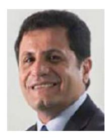

**Rahim Tafazolli** is a Professor and the Director of the 5G and 6G Innovation Centres, Institute for Communication Systems, University of Surrey, U.K. He has published more than 500 research papers in refereed journals, international conferences, and as a invited speaker. He is the Editor of two books on *Technologies for Wireless Future* (published by Wiley's Vol.1 in 2004 and Vol.2 2006). He was appointed as a Fellow of Wireless World Research Forum in April 2011, in recognition of his personal contribution to the wireless world as well as heading

one of Europe's leading research groups.