Contents lists available at [ScienceDirect](www.sciencedirect.com/science/journal/00304018)

# Optics Communications

journal homepage: [www.elsevier.com/locate/optcom](https://www.elsevier.com/locate/optcom)

# Design and modelling of InAs detection system on SOI via monolithic integration for mid-infrared integrated sensing and communication

Hao Luo a , Ning Xu a , Shengyi Wang b , Hanzhuo Kuang a , Hua Ge a , Xiang Li c , Bowen Jia a,\*

- a *School of Information Engineering and the Hubei Key Laboratory of Broadband Wireless Communication and Sensor Networks, Wuhan University of Technology, Wuhan, 430070, China*
- b *Key Laboratory of Artificial Micro- and Nano-Structures of Ministry of Education and School of Physics and Technology, Wuhan University, Wuhan, 430072, China*
- c *School of Mechanical Engineering and Electronic Information, China University of Geosciences (Wuhan), Wuhan, 430074, China*

# ARTICLE INFO

*Keywords:* Silicon photonics Mid-infrared Photodetector Monolithic integration

# ABSTRACT

Mid-infrared (MIR) silicon photonics exhibits significant potential for integrated sensing and communication (ISAC) applications. In this work, an InAs detection system on silicon-on-insulator (SOI) via heteroepitaxial integration is proposed. The detection system employs a grating coupler for the input of the MIR light, achieving a maximum coupling efficiency of 35.3 %. The light evanescently couples from the waveguide to the active layer of the InAs photodetector (PD) through precisely engineered GaAs/Ge buffer structures that accommodate lattice mismatches between InAs and silicon. Optical simulations systematically evaluate buffer thicknesses and compare alternative epitaxial architectures. The optimized 20 μm-long integrated waveguide PD demonstrates absorption efficiency exceeding 95 % with a 3 dB bandwidth of 21.51 GHz. Electrical simulations analyse dark current mechanisms, revealing a responsivity of 0.81 A/W at 3 μm and a detectivity of 2.34 × 109 cm Hz1/2 W− 1 at − 1 V bias and 300 K. The introduction of a pBn architecture reduces the dark current density by 58.5 %, thereby further increasing the detectivity to 2.65 × 109 cm Hz1/2 W− 1 . The influence of integration and fabrication processes on the overall device performance is also discussed. This study demonstrates a promising integrated optics approach for highly efficient MIR detection, paving the way for advanced on-chip photonic applications.

# **1. Introduction**

In recent years, most research in silicon photonics has focused on the near-infrared (NIR) spectrum, particularly in areas such as photonic quantum computing [[1,2\]](#page-9-0). Although silicon photonics has demonstrated potential beyond this wavelength range, the development of integrated devices operating at longer wavelengths remains challenging [\[3\]](#page-9-0). The MIR range, defined approximately from 2 to 20 μm, is increasingly significant due to its broad applications in biochemical sensing, thermal imaging, medicine, and free-space optical communication [\[4\]](#page-9-0). Si does not inherently support MIR applications, and monolithic integration provides an effective approach to overcome this limitation [\[5\]](#page-9-0). Recent advancements include on-chip chalcogenide glass resonators for Brillouin lasers [\[6\]](#page-9-0), b-AsP/MoTe2 optoelectronic retinas capable of simultaneous perception and encoding [\[7\]](#page-9-0), and broadband PbS/HgTe colloidal quantum dot imagers [\[8\]](#page-9-0) have been developed using MIR silicon photonics platforms.

PDs, typically categorized into surface-illuminated and waveguide types, play a crucial role in MIR integrated sensing systems, as their performance directly determines detection sensitivity, response speed, and overall system efficiency. To fully realize the potential of MIR ISAC, it is essential to optimize the design and integration of MIR PDs. Surfaceilluminated PDs often employ metasurface structures to enhance performance. Precisely engineered metasurface, such as plasmonic arrays [[9](#page-9-0)], Mie resonance [[10\]](#page-9-0), or photonic crystal structures [[11\]](#page-9-0), can significantly enhance local electric fields and improve optical absorption. However, in heterogeneously integrated material systems, the mismatch between the metasurface resonance regions and the actual optical absorption areas, together with the complexity arising from various resonance modes (such as multipolar resonances induced by high-index dielectric elements, guided modes generated by periodic structures, Fabry-P´erot resonances caused by buffer layers, and leaky modes formed through coupling with free space), indicates that metasurface-based PDs still face limitations in heterogeneous

*E-mail address:* [jiabowen@whut.edu.cn](mailto:jiabowen@whut.edu.cn) (B. Jia).

\* Corresponding author.

integration. In contrast, waveguide-integrated PDs exhibit reduced dark current due to a reduced absorbing area. Additionally, the perpendicular transport direction of photo-generated carriers relative to optical transmission direction facilitates a balance between responsivity and response rate. Furthermore, the shorter carrier transit distance mitigates quantum efficiency degradation caused by limited carrier diffusion length. These characteristics make waveguide PDs more advantageous for monolithic integration and on-chip optical interconnection.

Waveguide PDs demonstrate diverse integration strategies, which differ in material selection, fabrication complexity, and performance metrics. For instance, for on-chip integration, bonding is a traditional method. A broadband thermoelectric PD is integrated with a MIR waveguide through flip-chip bonding technology and operates at 3.9 μm [[12\]](#page-9-0). Manufacturing steps like wafer bonding and substrate thinning are expensive, posing a challenge for mass production [\[13](#page-9-0)]. Alternatively, defect-mediated PDs obviate the need for heterogeneous integration, but require attention to potential device noise due to the application of high bias voltage. Through the introduction of B+ into Si on an SOI substrate, the PD attains an external responsivity of 0.3 A/W at 1.96–2.5 μm [\[14](#page-9-0)]. Recently, two-dimensional (2D) materials, such as black phosphorus and graphene, have shown substantial potential in the MIR spectral range in recent years. By combining their unique properties with traditional 3D semiconductors, devices with enhanced functionality can be developed [[15\]](#page-10-0). A high-responsivity MIR black phosphorus PD could operate at 3.8 μm with a responsivity of 11.31 A/W under 0.5 V bias [[16\]](#page-10-0). Another architecture, heteroepitaxial growth, involves directly growing the epitaxial layer containing the PD structure on a Si substrate, presenting notable benefits for large-scale integration and cost reduction. The technical challenge lies in minimizing epitaxial defects and threading dislocations. Therefore, researchers have devised graded buffer layers, quantum well structures and superlattice to enhance material quality during the growth process. The type-II InAs/InAsSb superlattice barrier nBn PDs grown on a GaSb-on-Si buffer layer overcome the challenge of directly growing GaSb on Si, which extend the cutoff wavelength to ~5.5 μm [\[17](#page-10-0)]. The complex buffer has little effect on surface-illuminated PDs, but it is not the case for waveguide-integrated types. Although it significantly improves the growth quality, excessively thick buffers can impede optical coupling in waveguide PDs, consume growth materials, and reduce production efficiency, which contradicts the original intention of using heteroepitaxial technology for the large-scale production of on-chip devices.

In this work, we propose an InAs-based detection system on an SOI platform using heteroepitaxial integration. A grating coupler was optimized for a high coupling efficiency at 3 μm wavelength. For InAs PD, the buffers were designed to bridge the lattice mismatch between InAs and Si, while the Si layer functioned as the MIR waveguide. The light propagating in the waveguide evanescently coupled to the active layer of the PD. To achieve the superior optical and electrical properties, the influence of design parameters, including duty cycle, etch depth and period of the grating coupler, the thickness of the Ge buffer and the geometry of the InAs PD was simulated using the finite difference time domain (FDTD) for optical propagation analysis. An electrical model was established to explore the dark current mechanisms associated with the proposed device. The optimized PD exhibits high quantum efficiency, responsivity and detectivity, while maintaining a low level of dark current density. This work provides guidance for the development of III-V detection systems on SOI via heteroepitaxial growth in MIR silicon photonics, demonstrating potential applications in on-chip infrared ISAC.

# **2. Material, structural design and integration approach**

The selection of material systems for PDs depends on the growth strategy, fabrication constraints, and optical transmission characteristics. For the InAs epitaxial growth strategy, the buffer layers typically consist of Si, Ge, and GaAs [\[18](#page-10-0),[19\]](#page-10-0), with Si and Ge serving as potential waveguide materials. Compared to Ge, Si waveguides exhibit broader applicability, making the PDs more suitable for both laboratory research and commercial applications. Furthermore, the relatively lower refractive index of Si leads to weaker optical confinement, which promotes evanescent coupling in the buffer layer and intrinsic absorption in the active layer. This enables a substantial increase in the PD's external quantum efficiency while simultaneously reducing the device footprint. Si waveguides can be fabricated by etching SOI wafers. The use of SOI substrates effectively suppresses substrate leakage and improves waveguide transmission efficiency. In addition, the grating coupler required for the detection system can be directly integrated on the SOI platform. However, the presence of SiO2 in the SOI substrate introduces a thermal expansion mismatch, increasing the risk of wafer cracking during processing. Therefore, the challenges associated with epitaxial growth on SOI substrates must be carefully addressed to ensure structural integrity and fabrication reliability.

Based on these considerations, the detection system comprises a grating coupler, a waveguide, and a PD, as shown in [Fig. 1.](#page-2-0) The grating coupler exploits the diffraction effect to alter the propagation direction of the optical field, facilitating the coupling of laser-emitted light into the waveguide. Notably, in experimental implementations, commercial 3 μm lasers with fiber pigtails are generally unavailable. Therefore, laser-to-fiber coupling or lens-based systems are typically employed to couple the optical source into the grating. The waveguide connects the grating coupler to the PD, ensuring single-mode transmission and enabling evanescent coupling. A Si adiabatic taper is employed to enhance coupling between the waveguide and the Si buffer. The InAs PIN PD has a rectangular shape with buffer layers. From bottom to top, the buffer comprises Si, Ge, and GaAs layers, while the PIN active layer, arranged from top to bottom, includes p+-type InAs, p-type InAs, unintentionally doped InAs, and n-type InAs. Given the narrow bandgap nature of InAs, free-carrier absorption in highly-doped layers must be considered. Based on measurements from previous studies [20–[22\]](#page-10-0), the material parameters of different PD layers are detailed in [Table 1.](#page-2-0) The doping profile of the p+-type InAs follows a Gaussian distribution. Additionally, the extinction coefficient (*k*) of the n-InAs layer at 3 μm is nearly zero due to the absorption edge blue shift in n-type InAs, where donor doping induces a Fermi level rise [[23\]](#page-10-0).

A possible fabrication process for the proposed InAs detection system consists of two main stages: epitaxial growth and device fabrication. During epitaxial growth, the interfacial misfit (IMF) array technique is employed to manage lattice mismatch strain between epitaxial layers, which periodically relaxes strain via misfit dislocations at the interface. This method eliminates the need for thick buffer layers, increases design flexibility for optical coupling structures, and reduces the cost associated with heterogeneous epitaxy. Unlike the randomly distributed misfit dislocations commonly observed in heteroepitaxy, the IMF array consists of highly ordered 90◦ dislocations. A. Rockett et al. demonstrated that the formation of such dislocation network is a dynamic process in which initially random misfit dislocations interact during growth and gradually evolve into a uniform network [\[24](#page-10-0)]. A molecular dynamics study further revealed the IMF formation process at the GaSb/GaAs heterointerface. The lattice mismatch between GaSb and GaAs distorts Sb–Ga chemical bonds, and as these distortions accumulate, the strain energy increases until Sb atoms spontaneously skip one Ga atom to relieve the accumulated energy [\[25](#page-10-0)]. The IMF strategy has previously been applied successfully in various material systems, including GaSb/Si, InAs/GaAs, InSb/GaAs, and SnTe/InP [\[18,26,27](#page-10-0)]. Initially, a Ge/SOI virtual substrate is prepared, and a GaAs layer is grown using solid-state molecular beam epitaxy (MBE). To avoid anti-phase boundary formation, strict 2D layer-by-layer growth must be maintained during initial GaAs deposition, achievable through migration enhanced epitaxy [\[28](#page-10-0)]. Subsequently, the InAs layer is grown on GaAs using the IMF technique to relax lattice strain and minimize dislocation density. On SOI, the dislocation density, strain, and thermal stress control have negligible effect on the 3 μm optical mode and evanescent coupling.

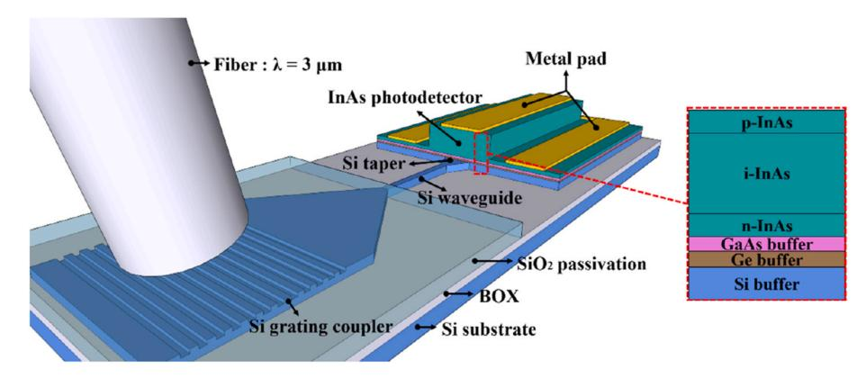

**Fig. 1.** 3D schematic of the detection system.

**Table 1**  Epitaxial structure.

| Layer   | Lattice constant (Å) | Doping level (cm− 3 ) | Doping elements | n@3 μm | k@3 μm |
|---------|----------------------|--------------------------|-----------------|--------|--------|
| Si      | 5.431                | \                        | \               | 3.4699 | 0      |
| Ge      | 5.658                | \                        | \               | 4.0021 | 0      |
| GaAs    | 5.658                | \                        | \               | 3.3128 | 0      |
| n-InAs  | 6.058                | 3.8✕1018                 | Si              | 3.5413 | 0.0003 |
| i-InAs  | 6.058                | 3.6✕1016                 | u.i.d           | 3.5413 | 0.1033 |
| p-InAs  | 6.058                | 1✕1018                   | Be              | 3.5413 | 0.1033 |
| p+-InAs | 6.058                | 1✕1018–1✕1019            | Be              | 3.5413 | 0.1033 |

Their influence is mainly electrical through defect density and carrier lifetime, which govern recombination, dark current, and detectivity. In the device fabrication stage, a grating coupler is patterned on the top Si layer of the SOI substrate via photolithography and inductively coupled plasma (ICP) etching. A co-planar Si waveguide is fabricated simultaneously for compact integration. For the InAs PD, fabrication begins by depositing an amorphous SiO2 hard mask, followed by spin-coating photoresist and patterning through lithography. Reactive ion etching transfers this pattern onto the SiO2, and Cl-based ICP etching defines the InAs layer down to the n-InAs contact layer. The bottom mesa fabrication process mirrors the top mesa process but involves multiple material layers (InAs, GaAs, Ge, and Si) etched using F-based ICP. Metal contacts (Au/Ti) are formed through a standard lift-off technique. To address etch rate differences and ensure process precision, systematic etching experiments are required. Surface passivation using SiO2 or SiNx helps mitigate defect-induced degradation. It should be noted that the formation of IMF array is influenced by the growth temperature, the surface reconstruction prior to the growth, and the growth mode [[29,30](#page-10-0)], therefore, a carefully controlled growth process is essential in the experiment. Transmission electron microscopy (TEM) and X-ray diffraction (XRD) characterization methods are employed to investigate and resolve discrepancies between simulated and experimental results. Based on this manufacturing process, relevant material characterization, such as transmission electron microscope (TEM) and atomic force microscope (AFM) images, are shown in Fig. S1 and Fig. S2.

To illustrate the optical coupling and carrier absorption clearly, the operating mechanism of the proposed PD is described as follows. When the PD is operational, light emitted from the optical source is initially coupled into the Si waveguide via the grating coupler. It then propagates through the Si taper into the buffer layers of the PD and ultimately undergoes evanescent coupling into the active layer, where it is absorbed by i-InAs. After the material and structural strategy is determined, various geometric parameters of the grating and the thickness of the PD's buffer layers can be tuned according to the operating mechanism to optimize device performance.

# **3. Optical properties**

# *3.1. Mid-infrared grating coupler*

Primary performance indicators for grating couplers include coupling efficiency, bandwidth, polarization dependence, and alignment tolerance. Compared with edge couplers, vertical grating couplers require less precision during alignment, simplifying fabrication and enabling wafer-level testing. In integrated designs, polarization dependence can be compensated by additional strategies such as polarization controllers. Therefore, coupling efficiency and bandwidth are prioritized in this work. The former directly determines the energy utilization of the system, while the latter governs its spectral adaptability and tolerance. Both are strongly influenced by the geometric parameters of the grating. Vertical grating couplers efficiently redirect vertically incident light into the in-plane waveguide mode [[31\]](#page-10-0). However, they typically have lower coupling efficiency and higher sensitivity to wavelength variations. In this work, a grating coupler optimized for an operating wavelength of 3 μm is designed. As shown in Fig. 1, a fiber represents the optical source, and a Gaussian optical source simulates realistic testing conditions, with an incident angle of 10◦ relative to the normal grating plane. This incident angle is designed to mimic a standard experimental setup and to avoid back-reflections into the fiber. The grating height is set at 450 nm, matching the single-mode waveguide dimension, ensuring propagation primarily in the fundamental mode while allowing partial evanescent coupling in the PD.

The optimal grating parameters were determined using the Finite-Difference Time-Domain (FDTD) method. As shown in [Fig. 2](#page-3-0)(a), with a fixed grating period (the sum of a grating tooth width and trench width), the impact of duty cycle and etch depth on coupling efficiency was analysed, revealing the optimal efficiency at a duty cycle of 0.45 and etch depth of 238 nm. Subsequently, the grating period's effect on coupling efficiency was examined, as shown in [Fig. 2](#page-3-0)(b). The grating coupler achieved a maximum efficiency of 35.3 % with a period of 1308 nm. Compared with state-of-the-art MIR grating couplers [\[32](#page-10-0),[33](#page-10-0)], this design is competitive at 3 μm. Considering practical fabrication constraints, parameters were refined to a duty cycle of 0.5, an etch depth of

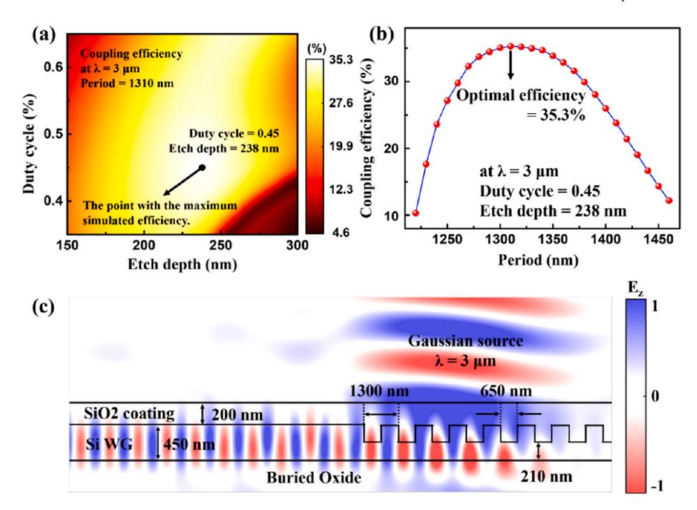

**Fig. 2.** (a) Simulated coupling efficiency of the grating coupler at 3 µm wavelength as a function of duty cycle and etch depth; (b) Relationship between the coupling efficiency and period; (c) Simulated optical field distribution of the grating coupler and waveguide.

240 nm, a period of 1300 nm, yielding a coupling efficiency of 34.4 %, which indicates that the designed grating exhibits excellent tolerance to fabrication precision and remains competitive for MIR applications. As shown in Fig. S3, independent parameter sweeps confirm that the designed grating coupler exhibits a broad fabrication tolerance window. Furthermore, simulations for perpendicular incidence resulted in a coupling efficiency of 18.3 %, addressing practical calibration challenges associated with fiber deformation. Fig. 2(c) presents the simulated optical field distribution of the designed grating coupler and waveguide, which demonstrates partial evanescent coupling extending beyond the Si waveguide, effectively facilitating coupling into the PD despite inevitable energy losses during waveguide propagation.

## 3.2. Evanescent coupling in PDs

The waveguide PD is the core component of the detection system, designed to achieve an optimal balance between quantum efficiency and bandwidth. The schematic in Fig. 3 illustrates the buffer structural configuration, where the Si layer is placed above the buried oxide layer, and the GaAs buffer sits atop the Ge buffer. To systematically analyse evanescent coupling within this structure, a ray-optics model is employed. Optical propagation in the buffer layers can thus be conceptualized as directional coupling between separate waveguides. The TE mode propagation in the Si waveguide is governed by the self-consistency condition, expressed as follows [34]:

$$\frac{2\pi}{\lambda}n_1 2d_1 \sin \theta_1 = -\varphi_{1,0} - \varphi_{1,2} + 2\pi m \tag{1}$$

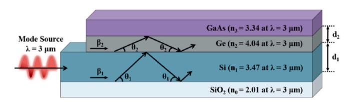

Fig. 3. The structural layout of the Si and Ge buffers.

$$arphi_{1,0} = -2 \arctan\left(rac{\sqrt{\left(1-\sin^2 heta_1
ight)-\left(rac{n_0}{n_1}
ight)^2}}{\sin heta_1}
ight)$$
 (2)

$$\varphi_{1,2} = -2\arctan\left(\frac{\sqrt{\left(1-\sin^2\theta_1\right) - \left(\frac{n_2}{n_1}\right)^2}}{\sin\theta_1}\right) \tag{3}$$

where  $\theta_1$  is the reflection angle of the wavefront at the planar interfaces, while  $\varphi_{1,0}$  and  $\varphi_{1,2}$  denote the reflection phase shifts at the Si/SiO $_2$  and Si/Ge interfaces, respectively.  $\lambda$  is the operating wavelength,  $n_1$  is the effective refractive index of Si at this wavelength,  $d_1$  is the thickness of the Si buffer, and m is a positive integer. Using these parameters, the reflection angle  $\theta_1$  is calculated, facilitating the determination of the propagation constant  $\beta_1$ :

$$\beta_1 = \frac{2\pi}{\lambda} n_1 \cos \theta_1 \tag{4}$$

Compared to Si-based Ge waveguide PDs, SOI-based Si waveguide PDs differ mainly in the role of the Ge layer. Although both structures utilize Ge as a buffer in heteroepitaxial integration, in SOI-based Si waveguide PDs, the Ge layer shifts from functioning as both a waveguide and coupling medium to solely serving as a coupling medium. Consequently, the optimized thicknesses for GaAs and intrinsic InAs remain consistent at 0.1  $\mu$ m and 1.0  $\mu$ m, respectively, matching those in Sibased Ge waveguide PDs [19]. To effectively support single-mode transmission and facilitates evanescent coupling, the thickness of Si waveguide should be 0.45  $\mu$ m. Under these conditions, the TE propagation constant  $\beta_1$  is calculated to be 6.28  $\mu$ m-1. Similarly, the TE mode in the Ge waveguide is governed by the self-consistency condition, which can be expressed as follows:

$$\frac{2\pi}{1}n_2 2d_2 \sin \theta_2 = -\varphi_{2,1} - \varphi_{2,3} + 2\pi m \tag{5}$$

$$\varphi_{2,1} = -2 \arctan \left( \frac{\sqrt{\left(1 - \sin^2 \theta_2\right) - \left(\frac{n_1}{n_2}\right)^2}}{\sin \theta_2} \right) \tag{6}$$

$$\varphi_{2,3} = -2 \arctan\left(\frac{\sqrt{\left(1 - \sin^2\theta_2\right) - \left(\frac{n_3}{n_2}\right)^2}}{\sin\theta_2}\right) \tag{7}$$

$$\beta_2 = \frac{2\pi}{\lambda} n_2 \cos \theta_2 \tag{8}$$

where  $\theta_2$  is the reflection angle at the planar interfaces,  $\varphi_{2,1}$  and  $\varphi_{2,3}$  are the reflection phase shifts at the Ge/Si and Ge/GaAs interfaces, respectively.  $\lambda$  is the operating wavelength,  $n_2$  is the effective refractive index of Ge at this wavelength, and  $d_2$  is the Ge buffer thickness. Achieving phase-matching between the modes in the Si and Ge buffers is essential for optimal evanescent coupling. Thus, the structural parameters become optimal when the propagation constants of the two waveguides are equal ( $\beta_2 = \beta_1$ ). For  $\beta_2 = 6.28~\mu\text{m}^{-1}$ , the theoretically optimal thickness of the Ge buffer is calculated as  $d_2 = 0.277~\mu\text{m}$ . It should be noted that mode matching under evanescent coupling theory assumes sufficient waveguide length, but the performance benefits associated with a finite device length must be considered in PD design.

### 3.3. Mid-infrared InAs waveguide PDs

The Ge buffer thickness can be effectively analysed through simulations based on evanescent coupling theory, with its influence on absorption efficiency further explored near the previously identified optimal condition ( $d_2 = 0.277 \,\mu\text{m}$ ). Fig. 4(a) and (b) illustrate the optical field distribution in the PD for varying Ge buffer thicknesses. As the thickness of the Ge buffer increases, the absorption efficiency in the PD decreases. Specifically, Fig. 4(b) shows a scenario where the Ge buffer thickness closely matches the Si waveguide thickness, differing by just  $0.5\,\mu m$ . Due to Ge's higher effective refractive index, it strongly confines optical fields, thereby reducing the absorption efficiency within the PD. This strong optical confinement also explains why Si waveguide PDs typically have shorter device lengths compared to Ge waveguide PDs. Fig. 4(c) demonstrates how varying Ge buffer thickness affects both PD length and absorption efficiency. With thinner Ge buffers, absorption efficiency increases and quickly saturates at shorter device lengths. For instance, when the Ge buffer thickness is 0.1 or 0.2 µm, a PD length as short as 20 µm can achieve absorption efficiency exceeding 95 %. However, excessively reducing buffer thickness to improve device performance is not recommended, given the practical limitations imposed by fabrication precision and potential defects during epitaxial growth.

The previous analysis based on the evanescent coupling theory suggested that optimal thickness is 0.3  $\mu m.$  In this case, the absorption efficiency approaches 100 % when the length is 50  $\mu m$ , which ensures stable optical transmission and high absorption efficiency. In practical application, waveguide PDs tend to absorb light more uniformly along the entire length rather than concentrating absorption at the front end. This distributed absorption makes contribution to suppress carrier transit time dispersion, localized current spikes and thermal accumulation. Therefore, a 0.3  $\mu m$  Ge buffer thickness is recommended for practical applications, whereas the 0.1  $\mu m$  thickness remains a suitable reference for further structural optimization.

The PD's operational wavelength region is another critical aspect. The designed PD targets a central operational wavelength of 3  $\mu m$ . In practical sensing systems, the optical source typically possesses a certain spectral width. Therefore, the PD must exhibit a broad operational wavelength region to accommodate signal detection across various wavelengths. A wider operational range enhances the PD's adaptability and performance in complex or multi-component spectral environments. Fig. 5 presents the absorption efficiency of the PD across different wavelengths for two distinct device lengths. Within the  $2.5 \mu m$ – $3.4 \mu m$ range, a 10 µm-long PD achieves over 80 % absorption efficiency. Extending the device length to 50 µm further increases efficiency, nearing saturation and helping determine the optimal PD length. However, limited by the bandgap of InAs, the absorption efficiency of the PD declines sharply beyond the central wavelength of 3.5 µm, despite maintaining high responsivity [35]. In contrast, InSb demonstrates superior absorption characteristics for wavelength exceeding 5

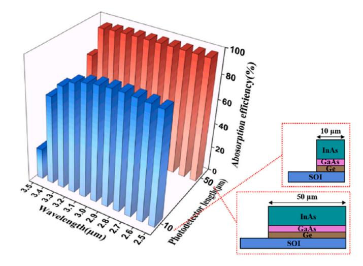

Fig. 5. Absorption efficiency of the PD at different wavelengths for two device lengths.

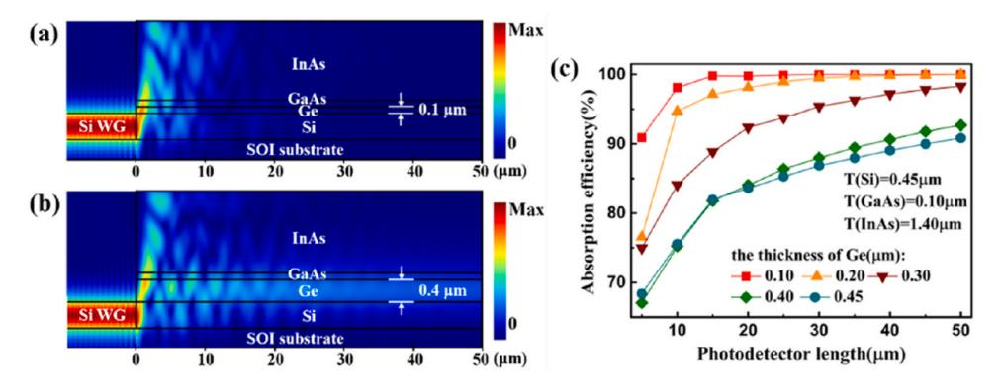

Fig. 4. (a) Optical field intensity distribution in the PD with 0.1  $\mu$ m thick Ge; (b) Optical field intensity distribution in the PD with 0.4  $\mu$ m thick Ge; (c) Absorption efficiency as a function of PD length at different thickness of Ge.

μm. Importantly, the epitaxial growth process for InSb on GaAs is similar to that of InAs on GaAs. Between wavelengths of 3.5 and 5 µm, partial infrared absorption occurs at the surface of the InSb PD, leading to a lower photocurrent collected by the electrodes [27]. Therefore, InAsSb alloy is commonly used as the active material. Notably, the band bending at the interface of the heterostructure enhances long-wavelength infrared absorption, thereby extending the operational wavelength of InAsSb PDs up to 8 µm. While the designed PD inherently has a broader operational wavelength region, the overall wavelength region of the detection system is constrained by the grating coupler. Generally, grating couplers target specific operating wavelengths. The designed grating coupler achieves coupling efficiencies above 20 % within the narrower range of 2.8-3.2  $\mu m$ , limiting the operational wavelength region compared to the PD alone. Future research efforts should therefore aim at improving the operational wavelength region of grating couplers, with approaches such as metasurface gratings [36], blazed and apodized gratings [37].

## 3.4. InAs PDs with different epitaxial buffers

Besides the Si-Ge-GaAs buffer structure discussed above, researchers have proposed various buffer layer structures to facilitate the heteroepitaxial growth of InAs on Si platforms. As previously mentioned, for waveguide-integrated PDs, it is important to avoid excessive buffer thickness and overly complex material systems. Therefore, alternative buffer structures such as superlattice (e.g., InAs/AlSb dislocation filter superlattices [38]) or transition-material alloys (e.g., AIxIn1-xAs buffer [18]) are not suitable here. Aside from the Si-Ge-GaAs buffer discussed in this study (Buffer I), the Si-GaSb-AlSb-GaSb buffer (Buffer II) also meets structural requirements for waveguide PDs. Both buffer structures proposed by B. W. Jia et al., have previously been employed in surface-illuminated PDs. The InSb PD using Buffer I achieved a responsivity of 0.7 A/W at 80 K and a detectivity of 8.8  $\times~10^9~\text{cm}~\text{Hz}^{1/2}$  $W^{-1}$  at 5.7  $\mu m$  [27], while the PD using Buffer II exhibited a responsivity of 0.475 A/W at 77 K and a detectivity of  $3.08 \times 10^9$  cm  $\mathrm{Hz}^{1/2} \, \mathrm{W}^{-1}$  at 5.3 μm [39].

Since InAs and InSb share a similar epitaxial growth process, a comparative analysis was conducted using Buffer II structure for InAs waveguide PDs. Fig. 6(a) and (b) show structural models and simulated optical field distributions for the two buffer structures. Both configurations demonstrate strong optical absorption and high efficiency at a compact device length of 20  $\mu m$ , with minimal differences between them. Fig. 6(c) further compares the absorption efficiency and responsivity as a function of PD length. Both structures saturate around 15  $\mu m$ , though Buffer II shows approximately 10 % lower maximum efficiency compared to Buffer I due to partial absorption by GaSb and AlSb layers within the buffer. Both PDs exhibit excellent quantum efficiency and responsivity despite their compact dimensions. However, the fabrication of Buffer II involves the formation of quantum dots [27], making it

slightly more complex. Consequently, Buffer II can serve as an alternative option to the primary buffer structure discussed in this study.

### 4. Electrical properties

## 4.1. Waveguide-integrated InAs PIN PD

In optical simulations, the primary objective is to assess the absorption efficiency of PDs. However, it should be noted that only a part of photo-generated carriers can be collected by electrodes due to the inherent characteristics of narrow-bandgap semiconductors operating in the MIR region and crystal defects from epitaxial growth. Therefore, electrical calculations are essential for accurately determining both photocurrent and dark current. Dark current significantly affects the performance of narrow-bandgap semiconductor PDs. The primary mechanisms generating dark current include carrier diffusion, Auger recombination, radiative recombination, Shockley-Read-Hall (SRH) recombination, trap-assisted tunneling (TAT), band-to-band (BTB) tunneling, and surface recombination.

For the narrow bandgap PDs, the SRH recombination makes significant contribution to the dark current due to high-density trap centers in the depletion region, originating either intrinsically from InAs or from growth-related defects. The expression of the SRH recombination current ( $I_{SRH}$ ) is as follows [40]:

$$I_{SRH} = \frac{qAn_i}{2\tau_{SRH}} \left[ \frac{2\varepsilon_0 \varepsilon_s (N_a + N_d)}{qN_a N_d} \cdot V_t \right]^{\frac{1}{2}} \left[ \exp\left(\frac{qV}{2kT}\right) - 1 \right]$$
 (9)

where q is the elementary charge, A is the junction area of the PD,  $n_i$  is the intrinsic carrier concentration,  $\tau_{SRH}$  is the generation-recombination lifetime,  $\varepsilon_0$  is the vacuum permittivity,  $\varepsilon_s$  is the static dielectric constant,  $V_t$  is the built-in potential of the PN junction,  $N_a$  is the acceptor concentration,  $N_a$  is the donor concentration, k is the Boltzmann constant, and T is the absolute temperature.

The description of the TAT model is based on tunneling current. TAT current mainly originates from minority carriers in both the depletion region and adjacent neutral regions that tunnel to the opposite side of the junction through trap-assisted processes. In the PN junction of an InAs PD, the TAT dark current primarily arises from electrons tunneling through trap levels into the conduction band of the heavily doped region [41]. Since TAT involves complex multi-dimensional modelling, a simplified one-dimensional fitting model is adopted here to describe the TAT current ( $I_{TAT}$ ) [42]:

$$I_{TAT} = \frac{q^2 \pi^2 A N_t m_V E M^2}{h^3 (E_g - E_t)} \left[ \frac{2\varepsilon_0 \varepsilon_s (N_a + N_d)}{q N_a N_d} \right]^{\frac{1}{2}} \cdot \exp \left[ -\frac{4(2m_V)^{\frac{1}{2}} (E_g - E_t)^{\frac{3}{2}}}{3q \hbar E} \right]$$
(10)

where  $N_t$  is the density of hole-occupied traps in the n-region,  $m_v$  is the

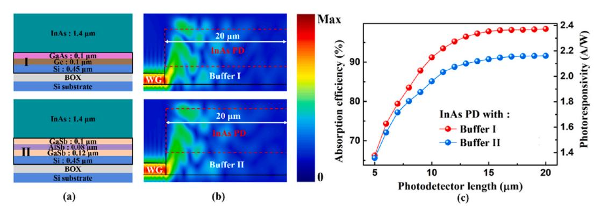

Fig. 6. (a) Structures of InAs PDs with two different buffers; (b) Optical field distribution of InAs PDs with two different buffers; (c) Simulated absorption efficiency and photoresponsivity as a function of PD length. Buffer II: Si-GaSb-AlSb-GaSb.

effective mass of valence band carriers, E is the electric field across the depletion region, and M is the trap-related matrix element.  $E_g$  represents the bandgap of InAs, and  $E_t$  is the energy level of the trap state within the bandgap. h and  $\hbar$  are the Planck constant and the reduced Planck constant, respectively.

When the PIN PD operates under a high reverse bias, BTB tunneling primarily occurs at the PN junction. Under such conditions, the band structure of InAs is distorted by the applied voltage, causing the Fermi level to shift above the conduction band and below the valence band. As a result, some electrons tunnel from the valence band of the p-region to the conduction band of the n-region, leading to a significant increase in dark current under high reverse bias [43,44].

In this study, the designed PD operates at room temperature. Therefore, the effect of temperature variations on the dark current model can be neglected. As the PD operates under a low reverse bias, the contributions of diffusion and BTB tunneling processes to the dark current are minimal [45,46]. Carrier diffusion is primarily significant under forward bias, whereas under reverse bias, drift dominates carrier transport. Additionally, Auger recombination and radiative recombination mechanisms are typically not dominant in narrow-bandgap PDs. Consequently, for the InAs PD designed in this work, the primary sources of dark current include surface leakage, SRH recombination, and the TAT process. Surface leakage current arises from complex mechanisms involving surface states, dislocations, and defects introduced during fabrication. For the InAs waveguide PD, surface leakage is considered as a surface recombination process, and the surface leakage current density (*Jsurf*) is expressed as follows [47]:

$$J_{surf} = \frac{qn_i s_0 dP}{2A} \tag{11}$$

where q is the electron charge,  $n_i$  is the intrinsic carrier concentration,  $s_0$  is the surface carrier recombination velocity, A is the top mesa area, d is the mesa depth and P is the mesa perimeter.

Both SRH recombination and the TAT process are defect-related mechanisms, as the presence of defects determines the carrier lifetime. According to the modified model proposed by G.A.M. Hurkx, the current densities associated with SRH and TAT recombination can be described by the following equation [48,49]:

$$J_{SRH} + J_{TAT} = (1 + \Gamma)J_{SRH} = (1 + \Gamma)\frac{qn_iW_d}{\tau}$$
 (12)

where  $\Gamma$  is the TAT enhancement factor,  $W_d$  is the depletion width, and  $\tau$  is the carrier lifetime. Despite the use of an optimized growth strategy, the influence of defects on the minority carrier lifetime remains nonnegligible in the heteroepitaxial integration of InAs on Si. The carrier lifetime can be expressed as follows [50,51]:

$$\tau = \frac{1}{\nu_{th}\sigma_t N_t} \tag{13}$$

where  $v_{th}$  is the carrier thermal velocity,  $\sigma_t$  is the trap parameter related to trap capture cross-section.  $N_t$  is the defect state density related to dislocation. It is well known that a high defect density reduces the minority carrier lifetime. Although experimental data on the carrier lifetime or dislocation density for the heterostructure proposed in this work are currently unavailable, reasonable estimates can be made based on previous studies. At 300 K, the reported carrier lifetime is 300 ns for high-purity vapor-phase homoepitaxial InAs [52], 59 ns for heteroepitaxial InAs grown on GaAs [53], and 0.13 ns for InAs nanowires grown on GaAs substrates [54]. Based on these data, carrier lifetimes of 1 ns, 10 ns, and 100 ns are used in the electrical simulations presented here, to cover the above orders of magnitude. To assess the sensitivity of the model to the lifetime assumption, Fig. 7 illustrates the influence of carrier lifetime on the dark current density of the designed InAs PD. As the carrier lifetime decreases, the dark current density increases correspondingly. The sensitivity of the dark current density to the defect state

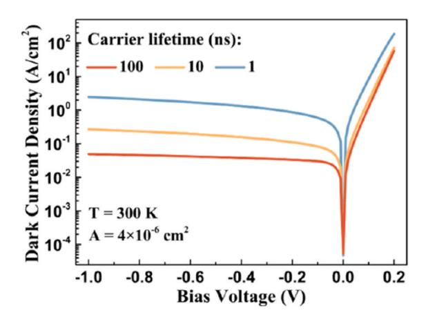

Fig. 7. Dark current density of the designed PD under different carrier lifetimes.

density and trap parameter was further calculated, as shown in Fig. S4. Increasing the carrier lifetime leads to a more pronounced suppression of dark current under larger reverse bias. Therefore, enhancing crystal quality and optimizing epitaxial growth strategies to extend carrier lifetime can effectively suppress the dark current within a limited range. Although the specific lifetime values affect the absolute dark current, they do not change the main conclusions regarding device electrical performance and the mechanisms for dark current suppression. Taking dislocation density and the reliability of the IMF technique into account, the carrier lifetime in the active region of the designed PD is set to 10 ns, as a conservative estimate. At  $-1\ V$  bias, the device exhibits a dark current of  $1.08\times 10^{-6}\ A$  and a dark current density of  $0.27\ A/cm^2$ , which indicates better performance from a numerical simulation perspective compared to the heteroepitaxial InAs PIN PD reported by Woo et al. [55].

The responsivity (R), which characterizes the response capability of the PD, is defined by the following equation:

$$R = \frac{I_{photo}}{P_{in}} \tag{14}$$

where  $I_{photo}$  is the photocurrent of the PD, and  $P_{in}$  is the power of the light source. The optical power entering the PD structure ( $P_{in0}$ ) is defined as follows:

$$P_{in0} = P_{in} \cdot \eta_{grating} \tag{15}$$

where  $\eta_{grating}$  is the coupling efficiency of the MIR grating coupler. In electrical simulations, the input power must conform to the relationship

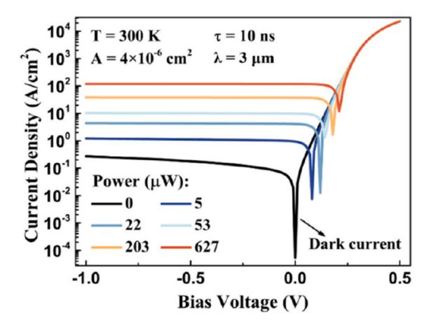

Fig. 8. Current density of the designed PD under different input powers.

defined above. At a wavelength of 3  $\mu$ m, the current density of the PD under various incident optical powers is illustrated in Fig. 8. As the input power increases, the current density under reverse bias gradually rises, consistent with the expected behaviour of a MIR PD. The black curve represents the dark current density when no optical input is present, which remains at a relatively low level.

The detectivity  $(D^*)$  and noise-equivalent power (NEP) can be further calculated based the obtained dark current density. The expressions for  $D^*$  and NEP of the PD are given as follows [56]:

$$D^* = \frac{R}{\sqrt{2qJ_{dark} + \frac{4kT}{R_0A}}}\tag{16}$$

$$NEP = \frac{\sqrt{2qI_{dark} + \frac{4kT}{R_0}}}{R} \tag{17}$$

where  $J_{dark}$  is the dark current density,  $I_{dark}$  is the dark current, k is the Boltzmann constant, and T=300 K.  $R_0$  is the shunt resistance, which is extracted using:

$$R_0 = \frac{dI_{dark}}{dU_{bias}} \Big|_{U_{bias} = 0}, I_{dark} = J_{dark} \cdot A$$
(18)

The shunt resistance-area product  $(R_0A)$  is thus obtained as 0.518  $\Omega$ cm2, which is broadly consistent with the typical range reported for III-V MIR PDs [57]. At a wavelength of 3  $\mu$ m, the  $D^*$  under different input power is shown in Fig. 9. Due to enhanced scattering and recombination of photo-generated carriers, the responsivity decreases under high incident power density. As a result, D\* also decreases with increasing input power. When the optical power exceeds approximately  $200 \mu W$ , its influence on  $D^*$  tends to saturate. At an input power of 22  $\mu W$  and -1~Vbias, the PD achieves a responsivity of 0.81 A/W, comparable to that of commercial InAs photovoltaic PDs. Correspondingly, the calculated D\* and NEP are  $2.34 \times 10^9$  cm Hz1/2 W-1 and 0.855 pW/Hz1/2, respectively. The surface-illuminated InAs PD reported by Khai L. W. et al. [18] exhibits a  $D^*$  of  $6.1 \times 10^8$  cm  $Hz^{1/2}$   $W^{-1}$  at 3.5  $\mu$ m, while the waveguide-integrated InAs PD designed in this study theoretically demonstrates higher  $D^*$  from a simulation perspective. Compared to MIR PDs integrated on SOI waveguides via bonding technology, the proposed InAs PD in this work exhibits a higher NEP. For example, the GaInAsSb PD based on an SOI waveguide [58] achieves an NEP of 0.54  $pW/Hz^{1/2}$  at 2.3  $\mu m,$  and the InP-based Type II PD on an SOI waveguide [59] achieves an NEP of 0.035 pW/Hz $^{1/2}$  at 2.35  $\mu$ m. These comparisons indicate that our integration pathway holds significant promise if high material quality can be achieved.

Additionally, a key figure-of-merit for high-speed PDs is the 3 dB bandwidth. It can be calculated from the carrier transit frequency and the RC frequency [60]:

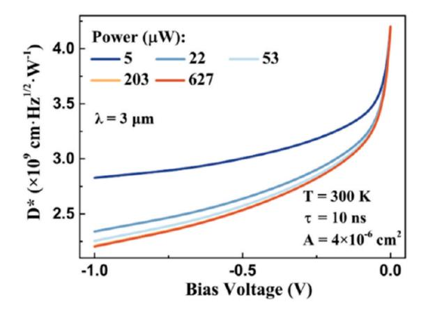

Fig. 9. Responsivity of the designed PD under different input power.

$$f_{3dB} = \frac{1}{\sqrt{f_T^{-2} + f_{RC}^{-2}}} = \frac{1}{\sqrt{\left(\frac{\sqrt{2}\nu_{sat}}{\pi d_i}\right)^{-2} + \left(\frac{d_i}{2\pi R\left(eA + C_{por}d_i\right)}\right)^{-2}}}$$
(19)

where  $f_{\rm T}$  is the carrier transit frequency, and  $f_{\rm RC}$  is the RC frequency.  $\nu_{\rm sat}$ is the saturated hole drift velocity, which is assumed to be  $5 \times 10^4$  cm/s in the calculation, as the impact of defects on the  $v_{\text{sat}}$  is negligible [61].  $d_i$ is the intrinsic layer thickness, and  $\varepsilon$  is the dielectric constant of InAs. R is the sum of the load resistance and the series resistance of the PD. The load resistance is set to 50  $\Omega$  to match the radio frequency (RF) measurement system, reduce signal reflection, improve bandwidth measurement accuracy, and ensure compatibility with standard RF systems for reliable and consistent test data. The series resistance of the III-V PD is small and negligible [62]. Cpar is the parasitic capacitance, which mainly originates from pad-to-ground and interconnect/probe coupling. For the designed PD dimensions,  $C_{par}$  is set to 100 fF [63]. Then the calculated 3 dB bandwidths for PDs with lengths of 10  $\mu$ m, 20  $\mu$ m, and 50 µm are 16.76 GHz, 15.25 GHz, and 11.65 GHz, respectively. Compared with state-of-the-art MIR PDs [64], these simulated results highlight the potential advantage of the waveguide-integrated PIN structure for high-speed applications.

#### 4.2. Waveguide-integrated InAs pBn PD

Although the designed InAs waveguide PD already exhibits relatively low dark current density, further suppression of dark current remains important due to inherent challenges associated with narrow-bandgap semiconductors, such as high doping concentration and epitaxial growth-induced defects. Employing a unipolar barrier structure can effectively block one type of carrier while permitting the other to pass freely, significantly reducing SRH recombination in the wide-bandgap barrier region and thus suppressing dark current [65]. Additionally, such a barrier structure can effectively limit surface leakage current.

To further enhance performance, a pBn structure is introduced into the InAs PD design. As shown in Fig. 10(a), the pBn PD incorporates a 0.12  $\mu m\text{-thick}$  p-type AlAs $_{0.085}Sb_{0.915}$  (Be-doped concentration: 1  $\times$  $10^{15}\ \mathrm{cm^{-3}}$ ) barrier layer between the p-type and intrinsic InAs regions. The corresponding band diagram is presented in Fig. 10(b), where the barrier layer exhibits a high potential barrier in the conduction and near-zero valence-band offset adjacent intrinsic InAs layer [66]. In the pBn architecture, the majority of the depletion electric field is concentrated within the wide bandgap barrier layer. This design significantly reduces generation-recombination currents associated with SRH centers and tunneling-induced dark currents. Additionally, the barrier effectively mitigates surface leakage currents typically encountered in heterogeneously integrated PDs. While photo-generated carriers in the intrinsic region can be efficiently collected by electrodes, electrons-generated in the p-type InAs encounter the barrier, leading to a slight reduction in the overall photoresponsivity of the PD. Simulation results in Fig. 10(c) illustrate the significant reduction in dark current density achieved by incorporating the barrier structure. At -1 V bias, the dark current density decreases from 0.27 A/cm2 to 0.112 A/cm2, representing a reduction of 58.5 %. The SRH and TAT components of the dark current are further evaluated to identify the dominant mechanism under reverse bias and to quantify the suppression induced by the barrier, as shown in Fig. S5. Without the barrier, TAT is comparable to or exceeds SRH at higher reverse bias, whereas SRH dominates near 0 V. With the barrier, SRH remains dominant over a wider bias range due to the stronger reduction of TAT.

Fig. 11(a) and (b) compare the responsivity and  $D^*$  of the pBn and PIN PD structures. Although the pBn structure slightly reduces responsivity by suppressing photocurrent, its substantial reduction in dark current density results in an enhanced  $D^*$ . Within the operational wavelength range of 2.6–3.5  $\mu$ m, both PD structures demonstrate

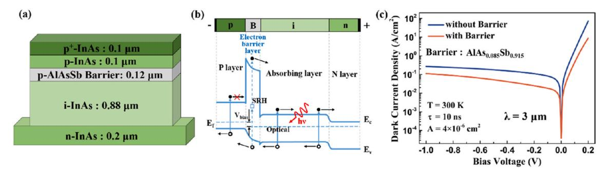

**Fig. 10.** (a) Active layer of the InAs pBn PD; (b) Band diagram of the pBn structure; (c) Dark current density of the designed PD with/without the barrier at different bias.

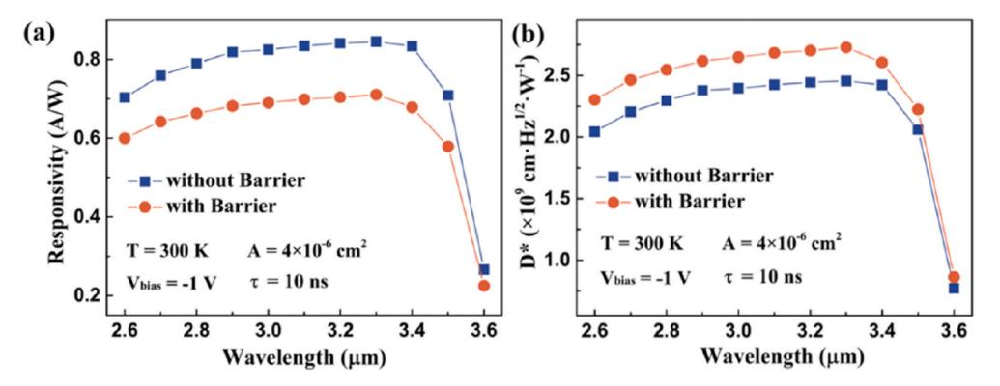

**Fig. 11.** (a) Responsivity of the designed PD with/without barrier at different wavelengths. (b) Detectivity of the designed PD with/without barrier at different wavelengths.

excellent performance. Specifically, the pBn InAs PD achieves a responsivity of 0.69 A/W and a *D\** of 2.65 × 109 cm Hz1/2 W− 1 at 3 μm and − 1 V bias. These results indicate the effectiveness of the pBn structure in improving overall PD performance.

# **5. Proposal for sensing applications**

The MIR spectral range encompasses several important absorption bands corresponding to chemical molecules and functional groups. As a result, MIR sensors hold great promise for applications in industrial inspection and biomedical diagnostics. Q. Guo et al. [[67\]](#page-11-0) demonstrated a monolithically integrated MIR sensor capable of characterizing the absorption spectra of solid-phase benzoic acid. B. Hinkov et al. [\[68](#page-11-0)] employed quantum cascade technology to integrate the emitter, sensing section, and detector onto a single chip, presenting a fully integrated on-chip sensing platform. The MIR InAs detection system developed in this work operates within the wavelength range of 2.5–3.4 μm, which

corresponds to absorption features of chemical bonds such as O-H, N-H, and C-H. Achieving complete on-chip integration of sensor systems remains a key research focus and a longstanding challenge in silicon photonics.

By employing quantum cascade technology, the monolithic integration of a quantum cascade laser (QCL), a plasmonic waveguide, and a MIR InAs waveguide PD on a single Si-based chip can be achieved, enabling compact and efficient on-chip sensing systems. As illustrated in Fig. 12(a), the proposed MIR sensing platform consists of a QCL source, a metal-structured plasmonic waveguide section, a connecting dielectric waveguide region, and an InAs PD integrated via a Si/Ge/GaAs heteroepitaxial stack. In the plasmonic section, a dielectric-loaded surface plasmon polariton (SPP) mode is excited and primarily confined at the metal-dielectric interface, with a significant portion of the field extending into the surrounding medium [[67\]](#page-11-0). This evanescent field enables strong light-matter interaction with the target analyte positioned near the waveguide surface, thereby enhancing absorption

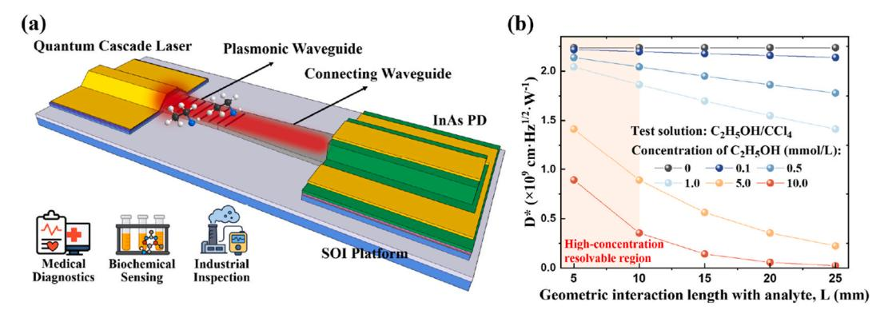

**Fig. 12.** (a) 3D schematic of the on-chip MIR sensing system; (b) *D*\* of the MIR InAs sensing system at different analyte concentrations.

sensitivity. To facilitate downstream photodetection, the plasmonic SPP mode is gradually transformed into a conventional dielectric waveguide mode (TE or TM) through the connecting waveguide, which functions as a mode-conversion region. At the waveguide terminus, the optical mode is matched to the epitaxial structure of the InAs PD, where the guided light undergoes attenuated coupling through the Ge/GaAs buffer and is absorbed in the InAs active layer, resulting in photocurrent generation. Variations in the concentration or density of the analyte modulate the strength of light-matter interaction within the plasmonic waveguide, leading to analyte-specific absorption of the MIR signal. This absorption reduces the optical power reaching the PD, thereby lowering the measured photocurrent. By correlating the photocurrent amplitude or D\* with analyte concentration using calibration curves, the system establishes a quantitative relationship for accurate chemical or biological sensing. To further quantify sensing performance, we assume a non-scattering analyte solution and model evanescent absorption in the plasmonic waveguide using the Beer-Lambert relation [69]:

$$P_{PD,in}(c) = P_0 \exp[-\Gamma_{env}\alpha_{abs}(c)L] = P_0 \exp\{-\Gamma_{env}[\varepsilon_{mol}(\lambda)\ln(10)c]L\} \quad (20)$$

where c is the analyte concentration,  $P_{PD, in}$  (c) is the optical power entering the PD at concentration c,  $P_0$  is the laser input power,  $\varepsilon_{mol}(\lambda)$  is the molar extinction coefficient of the solution at the operating wavelength, L is the geometric interaction length with the solution, and  $\Gamma_{env}$  is the power overlap factor between the waveguide mode and the solution. The background propagation loss of the metal/waveguide is neglected. Accordingly, at a working wavelength of 3 μm, ethanol (C2H5OH, as the analyte) in carbon tetrachloride (CCl4, as the transparent solvent) is used as an example, and the concentration unit is mmol/L.  $\varepsilon_{mol}(\lambda)$  for ethanol at 3  $\mu m$  is set to 800 L mol-1 cm-1,  $\Gamma_{env}$  of a typical lateral waveguide evanescent field is taken as 0.1, and Po is 10 mW here. The relationship between L and the  $D^*$  at different ethanol concentrations is thus obtained, as shown in Fig. 12(b). Lager L strengthens light-matter interaction and increases absorption loss, while high analyte concentrations drive  $D^*$  toward zero. For L < 10 mm, the designed MIR sensing system can resolve solutions with high molar concentrations, defining a highconcentration resolvable region.

## 6. Conclusion

In this work, we demonstrated a MIR waveguide-integrated InAs detection system based on the SOI platform. The detailed material parameters, growth and fabrication process were first demonstrated. Then, we first optimized the structural parameters of a 3 µm grating coupler to achieve high coupling efficiency, focusing on the etch depth, duty cycle, and period. We subsequently conducted a numerical investigation of a MIR Si waveguide PD based on a heteroepitaxial integration strategy. To enhance device performance, we developed a phase-matching model to estimate the optimal thickness of the Ge layer in the buffer and verified the result through optical simulations. We also compared the performance of InAs waveguide PDs with different buffer structures and confirmed the feasibility of alternative epitaxial designs. In addition, we analysed dark current mechanisms and calculated the electrical performance of the InAs PIN PD. The proposed detection system demonstrated broadband operation, with a responsivity of 0.81 A/W and a detectivity of  $2.34 \times 10^9$  cm Hz1/2 W-1 at -1 V and 300 K. By introducing the AlAs0.085Sb0.915 barrier, we reduced the dark current density by 58.5 %, which increased the detectivity to  $2.65 \times 10^9$  cm Hz1/2 W-1. Overall, we believe this InAs detection system shows strong potential for ISAC applications. As the first demonstration of a heteroepitaxial integrated InAs detection system on an SOI platform, our work lays a foundation for future development of MIR PDs through heteroepitaxial growth in silicon photonics.

#### CRediT authorship contribution statement

Hao Luo: Writing – original draft, Investigation, Data curation, Conceptualization. Ning Xu: Writing – review & editing, Supervision, Funding acquisition. Shengyi Wang: Validation, Formal analysis. Hanzhuo Kuang: Visualization, Validation. Hua Ge: Methodology. Xiang Li: Writing – review & editing, Methodology. Bowen Jia: Writing – review & editing, Supervision, Funding acquisition, Conceptualization.

## **Funding**

This work was supported by the National Natural Science Foundation of China (62104174, 92373102) and the Hubei Provincial Natural Science Foundation of China (2021CFB054).

#### **Declaration of competing interest**

The authors declare that they have no known competing financial interests or personal relationships that could have appeared to influence the work reported in this paper.

#### Appendix A. Supplementary data

Supplementary data to this article can be found online at https://doi.org/10.1016/j.optcom.2025.132782.

## Data availability

Data will be made available on request.

#### References

- F. Ashtiani, A.J. Geers, F. Aflatouni, An on-chip photonic deep neural network for image classification, Nature 606 (7914) (2022) 501–506, https://doi.org/10.1038/ s41586-022-04714-0.
- [2] PsiQuantum team, A manufacturable platform for photonic quantum computing, Nature 641 (8064) (2025) 876–883, https://doi.org/10.1038/s41586-025-08820
- [3] A. Spott, E.J. Stanton, N. Volet, J.D. Peters, J.R. Meyer, J.E. Bowers, Heterogeneous integration for mid-infrared silicon photonics, IEEE J. Sel. Top. Quant. Electron. 23 (6) (2017) 1–10, https://doi.org/10.1109/jstqe.2017.2697723.
- [4] R. Soref, Mid-infrared photonics in silicon and germanium, Nat. Photonics 4 (8) (2010) 495–497, https://doi.org/10.1038/nphoton.2010.171.
- [5] H. Lin, Z. Luo, T. Gu, L.C. Kimerling, K. Wada, A. Agarwal, J. Hu, Mid-infrared integrated photonics on silicon: a perspective, Nanophotonics 7 (2) (2017) 393–420, https://doi.org/10.1515/nanoph-2017-0085.
- [6] K. Ko, D. Suk, D. Kim, S. Park, B. Sen, D.-G. Kim, Y. Wang, S. Dai, X. Wang, R. Wang, B.J. Chun, K.-H. Ko, P.T. Rakich, D.-Y. Choi, H. Lee, A mid-infrared Brillouin laser using ultra-high-Q on-chip resonators, Nat. Commun. 16 (1) (2025), https://doi.org/10.1038/s41467-025-58010-2.
- [7] F. Wang, F. Hu, M. Dai, S. Zhu, F. Sun, R. Duan, C. Wang, J. Han, W. Deng, W. Chen, M. Ye, S. Han, B. Qiang, Y. Jin, Y. Chua, N. Chi, S. Yu, D. Nam, S.H. Chae, Z. Liu, Q.J. Wang, A two-dimensional mid-infrared optoelectronic retina enabling simultaneous perception and encoding, Nat. Commun. 14 (1) (2023) 1938, https://doi.org/10.1038/s41467-023-37623-5.
- [8] G. Mu, Y. Tan, C. Bi, Y. Liu, Q. Hao, X. Tang, Visible to mid-wave infrared PbS/ HgTe colloidal quantum dot imagers, Nat. Photonics 18 (11) (2024) 1147–1154, https://doi.org/10.1038/s41566-024-01492-1.
- [9] Z. Chen, Y. Weng, J. Liu, N. Guo, Y. Yu, L. Xiao, Dual-band perfect absorber for a mid-infrared photodetector based on a dielectric metal metasurface, Photon. Res. 9 (1) (2020), https://doi.org/10.1364/prj.410554.
- [10] S.Y. Wang, Q. Wang, H. Luo, H. Ge, X. Li, B.W. Jia, InSb all-dielectric metasurface for ultrahigh efficient Si-based mid-infrared detection, Opt. Lett. 49 (10) (2024) 2641–2644. https://doi.org/10.1364/OL.519664.
- [11] X. Gan, X. Yao, R.J. Shiue, F. Hatami, D. Englund, Photonic crystal cavity-assisted upconversion infrared photodetector, Opt. Express 23 (10) (2015) 12998–13004, https://doi.org/10.1364/OE.23.012998.
- [12] M.S. Yazici, B. Dong, D. Hasan, F. Sun, C. Lee, Integration of MEMS IR detectors with MIR waveguides for sensing applications, Opt. Express 28 (8) (2020) 11524–11537, https://doi.org/10.1364/OE.381279.
- [13] J.H. Lau, Recent advances and new trends in flip chip technology, J. Electron. Packag. 138 (3) (2016), https://doi.org/10.1115/1.4034037.
- [14] J.J. Ackert, D.J. Thomson, L. Shen, A.C. Peacock, P.E. Jessop, G.T. Reed, G. Z. Mashanovich, A.P. Knights, High-speed detection at two micrometres with

- monolithic silicon photodiodes, Nat. Photonics 9 (6) (2015) 393–396, [https://doi.](https://doi.org/10.1038/nphoton.2015.81)  [org/10.1038/nphoton.2015.81.](https://doi.org/10.1038/nphoton.2015.81)
- [15] D.K. Singh, R. Pant, A.M. Chowdhury, B. Roul, K.K. Nanda, S.B. Krupanidhi, Defect-mediated transport in self-powered, broadband, and ultrafast photoresponse of a MoS2/AlN/Si-Based photodetector, ACS Appl. Electron. Mater. 2 (4) (2020) 944–953, <https://doi.org/10.1021/acsaelm.0c00007>.
- [16] Y. Ma, B. Dong, J. Wei, Y. Chang, L. Huang, K.W. Ang, C. Lee, High-responsivity mid-infrared black phosphorus slow light waveguide photodetector, Adv. Opt. Mater. 8 (13) (2020), <https://doi.org/10.1002/adom.202000337>.
- [17] E. Delli, V. Letka, P.D. Hodgson, E. Repiso, J.P. Hayton, A.P. Craig, Q. Lu, R. Beanland, A. Krier, A.R.J. Marshall, P.J. Carrington, Mid-infrared InAs/InAsSb superlattice nBn photodetector monolithically integrated onto silicon, ACS Photonics 6 (2) (2019) 538–544, [https://doi.org/10.1021/acsphotonics.8b01550.](https://doi.org/10.1021/acsphotonics.8b01550)
- [18] L.W. Khai, T.K. Hua, L. Daosheng, S. Wicaksono, Y.S. Fatt, Room Temperature 3.5 μm Mid-Infrared InAs Photovoltaic Detector on a Si Substrate, IEEE Photon. Technol. Lett. 28 (15) (2016) 1653–1656, [https://doi.org/10.1109/](https://doi.org/10.1109/lpt.2016.2564979)  [lpt.2016.2564979.](https://doi.org/10.1109/lpt.2016.2564979)
- [19] H. Ge, H. Luo, S.-Y. Wang, X. Li, P. Liu, S. Pu, N. Xu, B.-W. Jia, Design and optimization of InAs Waveguide- integrated photodetectors on silicon via heteroepitaxial integration for Mid- infrared silicon photonics, IEEE Photon. J. 16 (5) (2024) 1–10, <https://doi.org/10.1109/jphot.2024.3450091>.
- [20] J.R. Dixon, J.M. Ellis, Optical properties of n-Type indium arsenide in the fundamental absorption edge region, Phys. Rev. 123 (5) (1961) 1560–1566, [https://doi.org/10.1103/PhysRev.123.1560.](https://doi.org/10.1103/PhysRev.123.1560)
- [21] A.B. Djuriˇsi´c, E.H. Li, D. Raki´c, M.L. Majewski, Modeling the optical properties of AlSb, GaSb, and InSb, Appl. Phys. Mater. Sci. Process 70 (1) (2000) 29–32, [https://](https://doi.org/10.1007/s003390050006)  [doi.org/10.1007/s003390050006](https://doi.org/10.1007/s003390050006).
- [22] S. Adachi, Optical dispersion relations for GaP, GaAs, GaSb, InP, InAs, InSb, AlxGa1− xAs, and In1− xGaxAsyP1− y, J. Appl. Phys. 66 (12) (1989) 6030–6040, [https://doi.org/10.1063/1.343580.](https://doi.org/10.1063/1.343580)
- [23] F. Stern, R.M. Talley, Impurity band in semiconductors with small effective mass, Phys. Rev. 100 (6) (1955) 1638–1643, [https://doi.org/10.1103/](https://doi.org/10.1103/PhysRev.100.1638) [PhysRev.100.1638.](https://doi.org/10.1103/PhysRev.100.1638)
- [24] A. Rockett, C.J. Kiely, Energetics of misfit- and threading-dislocation arrays in heteroepitaxial films, Phys. Rev. B Condens. Matter 44 (3) (1991) 1154–1162, [https://doi.org/10.1103/physrevb.44.1154.](https://doi.org/10.1103/physrevb.44.1154)
- [25] A. Jallipalli, G. Balakrishnan, S.H. Huang, A. Khoshakhlagh, L.R. Dawson, D. L. Huffaker, Atomistic modeling of strain distribution in self-assembled interfacial misfit dislocation (IMF) arrays in highly mismatched III–V semiconductor materials, J. Cryst. Growth 303 (2) (2007) 449–455, [https://doi.org/10.1016/j.](https://doi.org/10.1016/j.jcrysgro.2006.12.032)  [jcrysgro.2006.12.032](https://doi.org/10.1016/j.jcrysgro.2006.12.032).
- [26] Q. Zhang, M. Hilse, W. Auker, J. Gray, S. Law, Growth conditions and interfacial misfit array in SnTe (111) films grown on InP (111)A substrates by molecular beam epitaxy, ACS Appl. Mater. Interfaces 16 (36) (2024) 48598–48606, [https://doi.](https://doi.org/10.1021/acsami.4c10296) [org/10.1021/acsami.4c10296.](https://doi.org/10.1021/acsami.4c10296)
- [27] B.W. Jia, K.H. Tan, W.K. Loke, S. Wicaksono, K.H. Lee, S.F. Yoon, Monolithic integration of InSb photodetector on silicon for mid-infrared silicon photonics, ACS Photonics 5 (4) (2018) 1512–1520, [https://doi.org/10.1021/](https://doi.org/10.1021/acsphotonics.7b01546)  [acsphotonics.7b01546](https://doi.org/10.1021/acsphotonics.7b01546).
- [28] H. Tanoto, S.F. Yoon, W.K. Loke, E.A. Fitzgerald, C. Dohrman, B. Narayanan, M. T. Doan, C.H. Tung, Growth of GaAs on vicinal Ge surface using low-temperature migration-enhanced epitaxy, J. Vac. Sci. Technol. B: Microelectr. Nanometer Struct. Proc. Measurement Phenomena 24 (1) (2006) 152–156, [https://doi.org/](https://doi.org/10.1116/1.2151220)  [10.1116/1.2151220](https://doi.org/10.1116/1.2151220).
- [29] B.W. Jia, K.H. Tan, W.K. Loke, S. Wicaksono, S.F. Yoon, Growth and characterization of InSb on (1 0 0) Si for mid-infrared application, Appl. Surf. Sci. 440 (2018) 939–945, [https://doi.org/10.1016/j.apsusc.2018.01.219.](https://doi.org/10.1016/j.apsusc.2018.01.219)
- [30] B.W. Jia, K.H. Tan, W.K. Loke, S. Wicaksono, S.F. Yoon, Effects of surface reconstruction on the epitaxial growth of III-Sb on GaAs using interfacial misfit array, Appl. Surf. Sci. 399 (2017) 220–228, [https://doi.org/10.1016/j.](https://doi.org/10.1016/j.apsusc.2016.12.051)  [apsusc.2016.12.051](https://doi.org/10.1016/j.apsusc.2016.12.051).
- [31] L. Cheng, S. Mao, Z. Li, Y. Han, H. Fu, Grating couplers on silicon photonics: design principles, emerging trends and practical issues, Micromachines 11 (7) (2020), <https://doi.org/10.3390/mi11070666>.
- [32] N. Chen, B. Dong, X. Luo, H. Wang, N. Singh, G.Q. Lo, C. Lee, Efficient and broadband subwavelength grating coupler for 3.7 mum mid-infrared silicon photonics integration, Opt. Express 26 (20) (2018) 26242–26256, [https://doi.org/](https://doi.org/10.1364/OE.26.026242)  [10.1364/OE.26.026242](https://doi.org/10.1364/OE.26.026242).
- [33] G. Yang, H. Xiang, Z. Li, L. Yu, Y. Li, Y. Zhao, G. Zhang, J. Guo, Y. Shi, D. Dai, Highperformance full-etched fiber-to-chip grating couplers at 3.7-micron wavelength on silicon, APL Photo. 9 (12) (2024), <https://doi.org/10.1063/5.0235403>.
- [34] D. Ahn, L.C. Kimerling, J. Michel, Efficient evanescent wave coupling conditions for waveguide-integrated thin-film Si/Ge photodetectors on silicon-on-insulator/ germanium-on-insulator substrates, J. Appl. Phys. 110 (8) (2011), [https://doi.org/](https://doi.org/10.1063/1.3642943)  [10.1063/1.3642943](https://doi.org/10.1063/1.3642943).
- [35] S. Woo, G. Ryu, S.S. Kang, T.S. Kim, N. Hong, J.-H. Han, R.J. Chu, I.-H. Lee, D. Jung, W.J. Choi, High-performance flexible InAs thin-film photodetector arrays with heteroepitaxial growth using an abruptly graded InxAl1–xAs buffer, ACS Appl. Mater. Interfaces 13 (46) (2021) 55648–55655, [https://doi.org/10.1021/](https://doi.org/10.1021/acsami.1c14687)  [acsami.1c14687.](https://doi.org/10.1021/acsami.1c14687)
- [36] T. Afra, M.R. Salehi, E. Abiri, Design of two compact waveguide display systems utilizing metasurface gratings as couplers, Appl. Opt. 60 (28) (2021), [https://doi.](https://doi.org/10.1364/ao.428733)  [org/10.1364/ao.428733](https://doi.org/10.1364/ao.428733).
- [37] Y. Liu, L. Xia, T. Li, Y. Sun, P. Zhou, L. Shen, Y. Zou, High-efficiency mid-infrared on-chip silicon grating couplers for perfectly vertical coupling, Opt Lett. 48 (2) (2023), [https://doi.org/10.1364/ol.478751.](https://doi.org/10.1364/ol.478751)

- [38] E. Delli, P.D. Hodgson, M. Bentley, E. Repiso, A.P. Craig, Q. Lu, R. Beanland, A.R. J. Marshall, A. Krier, P.J. Carrington, Mid-infrared type-II InAs/InAsSb quantum Wells integrated on silicon, Appl. Phys. Lett. 117 (13) (2020), [https://doi.org/](https://doi.org/10.1063/5.0022235)  [10.1063/5.0022235](https://doi.org/10.1063/5.0022235).
- [39] B.W. Jia, K.H. Tan, W.K. Loke, S. Wicaksono, S.F. Yoon, Integration of an InSb photodetector on Si via heteroepitaxy for the mid-infrared wavelength region, Opt. Express 26 (6) (2018),<https://doi.org/10.1364/oe.26.007227>.
- [40] S. Velicu, R. Ashokan, S. Sivananthan, A model for dark current and multiplication in HgCdTe avalanche photodiodes, J. Electron. Mater. 29 (6) (2000) 823–827, <https://doi.org/10.1007/s11664-000-0231-0>.
- [41] S.K. Singh, V. Gopal, R.K. Bhan, V. Kumar, An analysis of the dynamic resistance variation as a function of reverse bias voltage in a HgCdTe diode, Semicond. Sci. Technol. 15 (7) (2000) 752–755, [https://doi.org/10.1088/0268-1242/15/7/315.](https://doi.org/10.1088/0268-1242/15/7/315)
- [42] J.Y. Wong, Effect of trap tunneling on the performance of long-wavelength Hg1 xCdxTe photodiodes, IEEE Trans. Electron. Dev. 27 (1) (1980) 48–57, [https://doi.](https://doi.org/10.1109/t-ed.1980.19818)  [org/10.1109/t-ed.1980.19818.](https://doi.org/10.1109/t-ed.1980.19818)
- [43] Y. Nemirovsky, D. Rosenfeld, R. Adar, A. Kornfeld, Tunneling and dark currents in HgCdTe photodiodes, J. Vac. Sci. Technol. A: Vacuum Surfaces Films 7 (2) (1989) 528–535, <https://doi.org/10.1116/1.576215>.
- [44] Y. Nemirovsky, A. Unikovsky, Tunneling and 1/f noise currents in HgCdTe photodiodes, J. Vac. Sci. Technol. B: Microelectr. Nanometer Struct. Proc. Measurement Phenomena 10 (4) (1992) 1602–1610, [https://doi.org/10.1116/](https://doi.org/10.1116/1.586256) [1.586256](https://doi.org/10.1116/1.586256).
- [45] G. Perrais, O. Gravrand, J. Baylet, G. Destefanis, J. Rothman, Gain and dark current characteristics of planar HgCdTe avalanche photo diodes, J. Electron. Mater. 36 (8) (2007) 963–970, [https://doi.org/10.1007/s11664-007-0147-z.](https://doi.org/10.1007/s11664-007-0147-z)
- [46] S.-N. Cui, W.-Q. Chen, D.-W. Jiang, D.-h. Wu, G.-W. Wang, Y.-Q. Xu, Z.-C. Niu, Dark current simulation and analysis for InAs/GaSb long wavelength infrared barrier detectors, Infrared Phys. Technol. 121 (2022), [https://doi.org/10.1016/j.](https://doi.org/10.1016/j.infrared.2021.104006) [infrared.2021.104006](https://doi.org/10.1016/j.infrared.2021.104006).
- [47] G. Chen, A.M. Hoang, M. Razeghi, Evaluating the size-dependent quantum efficiency loss in a SiO2-Y2O3 hybrid gated type-II InAs/GaSb long-infrared photodetector array, Appl. Phys. Lett. 104 (10) (2014), [https://doi.org/10.1063/](https://doi.org/10.1063/1.4868486)  [1.4868486.](https://doi.org/10.1063/1.4868486)
- [48] G.A.M. Hurkx, D.B.M. Klaassen, M.P.G. Knuvers, A new recombination model for device simulation including tunneling, IEEE Trans. Electron. Dev. 39 (2) (1992) 331–338, <https://doi.org/10.1109/16.121690>.
- [49] B. Son, Y. Lin, K.H. Lee, Q. Chen, C.S. Tan, Dark current analysis of germanium-oninsulator vertical p-i-n photodetectors with varying threading dislocation density, J. Appl. Phys. 127 (20) (2020), [https://doi.org/10.1063/5.0005112.](https://doi.org/10.1063/5.0005112)
- [50] L.M. Giovane, H.-C. Luan, A.M. Agarwal, L.C. Kimerling, Correlation between leakage current density and threading dislocation density in SiGe p-i-n diodes grown on relaxed graded buffer layers, Appl. Phys. Lett. 78 (4) (2001) 541–543, <https://doi.org/10.1063/1.1341230>.
- [51] Q. Chen, S. Wu, L. Zhang, W. Fan, C.S. Tan, Simulation of high-efficiency resonantcavity-enhanced GeSn single-photon avalanche photodiodes for sensing and optical quantum applications, IEEE Sens. J. 21 (13) (2021) 14789–14798, [https://doi.org/](https://doi.org/10.1109/jsen.2021.3074407)  [10.1109/jsen.2021.3074407.](https://doi.org/10.1109/jsen.2021.3074407)
- [52] V.L. Dalal, W.A. Hicinbothem, H. Kressel, Carrier lifetimes in epitaxial InAs, Appl. Phys. Lett. 24 (4) (1974) 184–185, <https://doi.org/10.1063/1.1655145>.
- [53] [V. Tetyorkin, A. Sukach, S. Stary, N. Zotova, S. Karandashev, B. Matveev,](http://refhub.elsevier.com/S0030-4018(25)01310-0/sref53) [M. Remennyi, Performance of Inas-based Infrared Photodiodes, Optical Sensing](http://refhub.elsevier.com/S0030-4018(25)01310-0/sref53)  [Technology and Applications, SPIE, 2007, pp. 547](http://refhub.elsevier.com/S0030-4018(25)01310-0/sref53)–556.
- [54] J.L. Boland, F. Amaduzzi, S. Sterzl, H. Potts, L.M. Herz, A. Fontcuberta i Morral, M. B. Johnston, High electron mobility and insights into temperature-dependent scattering mechanisms in InAsSb nanowires, Nano Lett. 18 (6) (2018) 3703–3710, [https://doi.org/10.1021/acs.nanolett.8b00842.](https://doi.org/10.1021/acs.nanolett.8b00842)
- [55] S. Woo, E. Yeon, R.J. Chu, Y. Kim, T.S. Kim, D. Jung, W.J. Choi, Flexible p-i-n InAs thin-film photodetector with low dark current enabled by an InAlAs barrier, Opt. Mater. Express 12 (6) (2022), <https://doi.org/10.1364/ome.457345>.
- [56] Y. Lin, K.H. Lee, B. Son, C.S. Tan, Low-power and high-detectivity Ge photodiodes by in-situ heavy as doping during ge-on-si seed layer growth, Opt. Express 29 (3) (2021) 2940–2952, [https://doi.org/10.1364/OE.405364.](https://doi.org/10.1364/OE.405364)
- [57] J. Tong, L.Y.M. Tobing, P. Ni, D.H. Zhang, High quality InAsSb-based heterostructure n-i-p mid-wavelength infrared photodiode, Appl. Surf. Sci. 427 (2018) 605–608, [https://doi.org/10.1016/j.apsusc.2017.08.177.](https://doi.org/10.1016/j.apsusc.2017.08.177)
- [58] A. Gassenq, N. Hattasan, L. Cerutti, J.B. Rodriguez, E. Tournie, G. Roelkens, Study of evanescently-coupled and grating-assisted GaInAsSb photodiodes integrated on a silicon photonic chip, Opt. Express 20 (11) (2012) 11665–11672, [https://doi.](https://doi.org/10.1364/OE.20.011665) [org/10.1364/OE.20.011665.](https://doi.org/10.1364/OE.20.011665)
- [59] R. Wang, M. Muneeb, S. Sprengel, G. Boehm, A. Malik, R. Baets, M.C. Amann, G. Roelkens, III-V-on-silicon 2-microm-wavelength-range wavelength demultiplexers with heterogeneously integrated InP-based type-II photodetectors, Opt. Express 24 (8) (2016) 8480–8490, <https://doi.org/10.1364/OE.24.008480>.
- [60] M. Oehme, J. Werner, E. Kasper, M. Jutzi, M. Berroth, High bandwidth Ge p-i-n photodetector integrated on Si, Appl. Phys. Lett. 89 (7) (2006), [https://doi.org/](https://doi.org/10.1063/1.2337003) [10.1063/1.2337003](https://doi.org/10.1063/1.2337003).
- [61] G. Satyanadh, R.P. Joshi, N. Abedin, U. Singh, Monte carlo calculation of electron drift characteristics and avalanche noise in bulk InAs, J. Appl. Phys. 91 (3) (2002) 1331–1338, <https://doi.org/10.1063/1.1429771>.
- [62] D. Chen, K. Sun, Y. Shen, A.H. Jones, A.A. Dadey, B. Guo, J.A. McArthur, S.R. Bank, J.C. Campbell, Frequency behavior of AlInAsSb nBn photodetectors and the development of an equivalent circuit model, Opt. Express 30 (14) (2022) 25262–25276, [https://doi.org/10.1364/OE.457057.](https://doi.org/10.1364/OE.457057)

- [63] M. Gould, T. Baehr-Jones, R. Ding, M. Hochberg, Bandwidth enhancement of waveguide-coupled photodetectors with inductive gain peaking, Opt. Express 20 (7) (2012) 7101–7111, <https://doi.org/10.1364/OE.20.007101>.
- [64] C. Jia, G. Deng, P. Zhao, Z. Zhu, J. Zhao, Y. Zhang, Uncooled InAsSb-based highspeed mid-wave infrared barrier detector, J. Infrared Millim. Waves 43 (2) (2024) 166–172, [https://doi.org/10.11972/j.issn.1001-9014.2024.02.004.](https://doi.org/10.11972/j.issn.1001-9014.2024.02.004)
- [65] E. Yablonovitch, T. Gmitter, Auger recombination in silicon at low carrier densities, Appl. Phys. Lett. 49 (10) (1986) 587–589, [https://doi.org/10.1063/](https://doi.org/10.1063/1.97049)  [1.97049](https://doi.org/10.1063/1.97049).
- [66] W. Gawron, P. Madejczyk, P. Martyniuk, S. Krishna, Infrared barrier detectors with metamorphic InAsSb absorbers on GaAs substrates, IEEE Sens. J. 24 (9) (2024) 14151–14158, <https://doi.org/10.1109/jsen.2024.3379680>.
- [67] Q. Guo, J. Zhang, K. Yang, Y. Zhu, Q. Lu, N. Zhuo, S. Zhai, J. Liu, L. Wang, S. Liu, F. Liu, Monolithically integrated mid-infrared sensor with a millimeter-scale sensing range, Opt. Express 30 (22) (2022) 40657–40665, [https://doi.org/](https://doi.org/10.1364/OE.472667) [10.1364/OE.472667](https://doi.org/10.1364/OE.472667).
- [68] B. Hinkov, F. Pilat, L. Lux, P.L. Souza, M. David, A. Schwaighofer, D. Ristanic, B. Schwarz, H. Detz, A.M. Andrews, B. Lendl, G. Strasser, A mid-infrared lab-on-achip for dynamic reaction monitoring, Nat. Commun. 13 (1) (2022) 4753, [https://](https://doi.org/10.1038/s41467-022-32417-7)  [doi.org/10.1038/s41467-022-32417-7.](https://doi.org/10.1038/s41467-022-32417-7)
- [69] M. Sieger, B. Mizaikoff, Toward On-Chip mid-infrared sensors, Anal. Chem. 88 (11) (2016) 5562–5573, [https://doi.org/10.1021/acs.analchem.5b04143.](https://doi.org/10.1021/acs.analchem.5b04143)