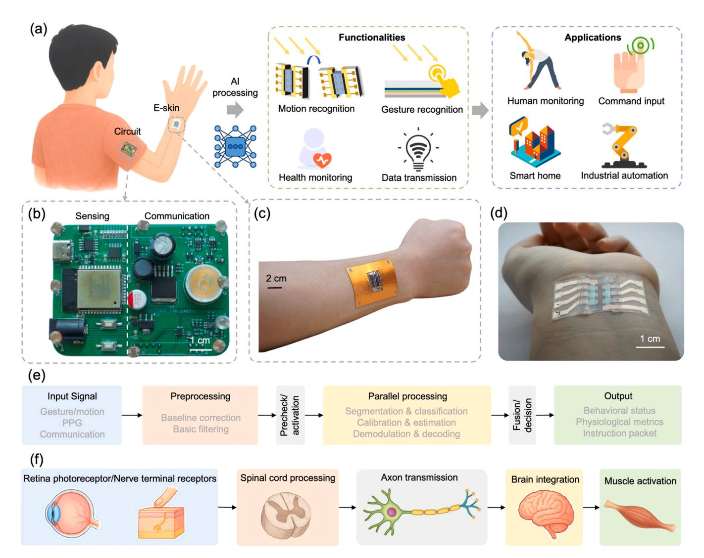
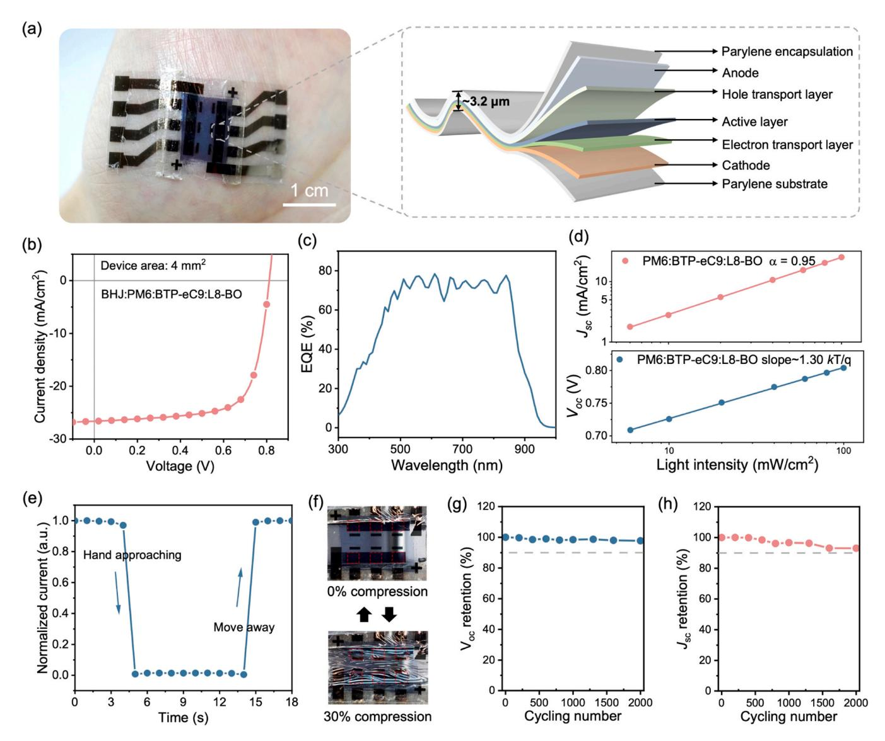
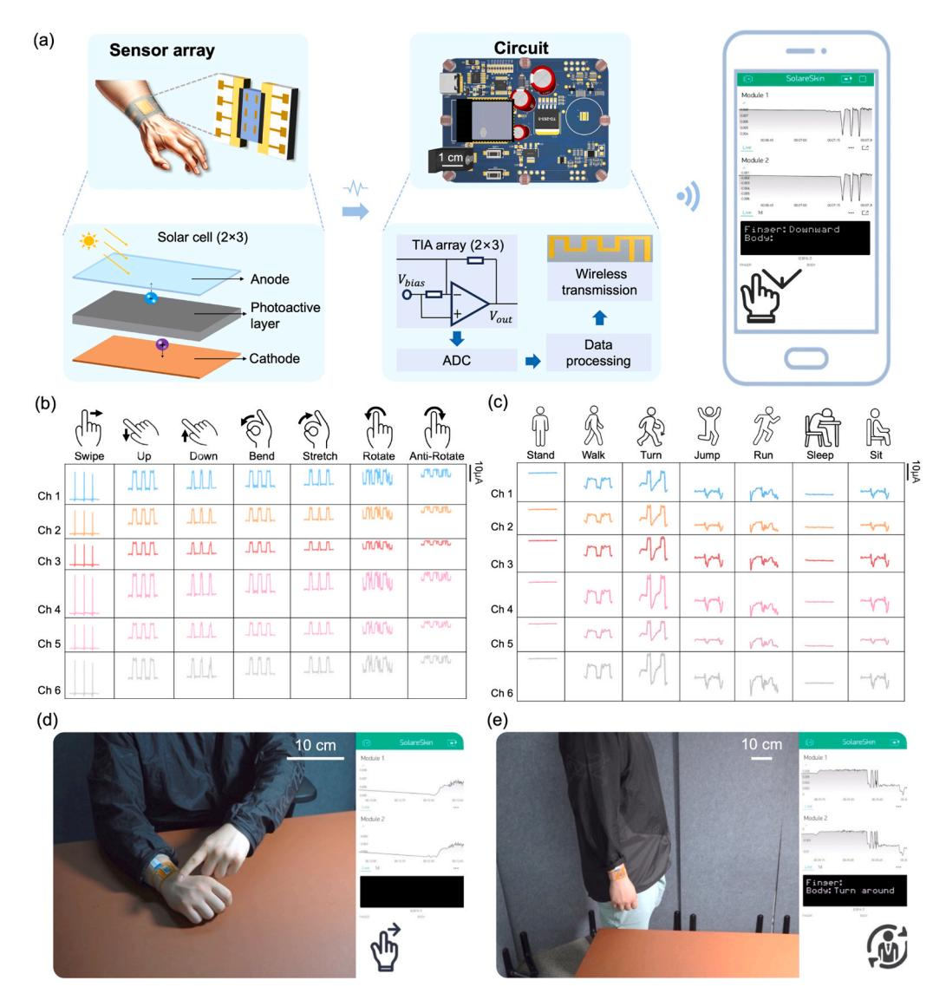
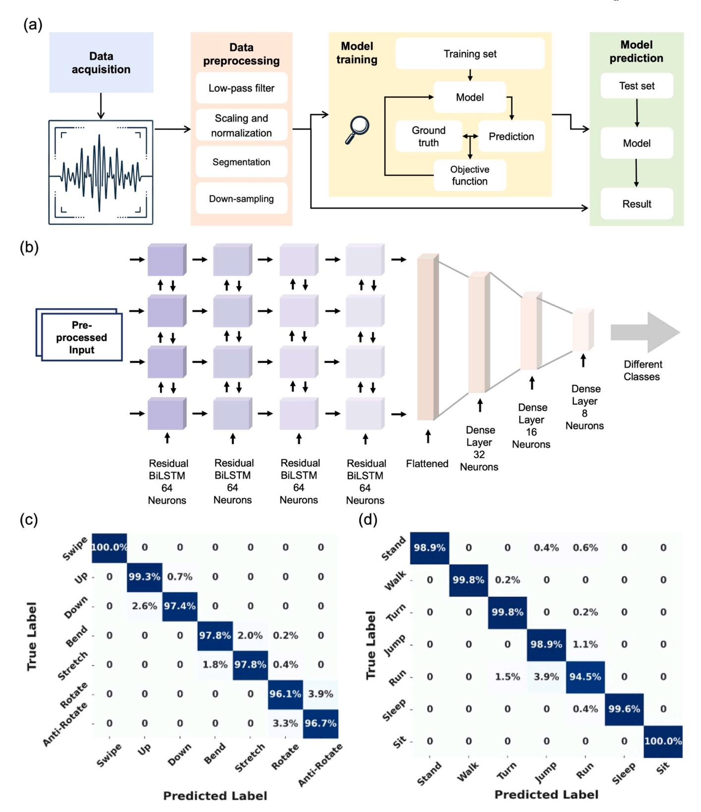
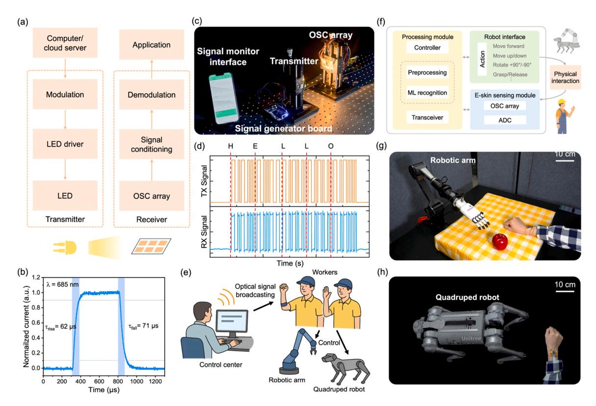
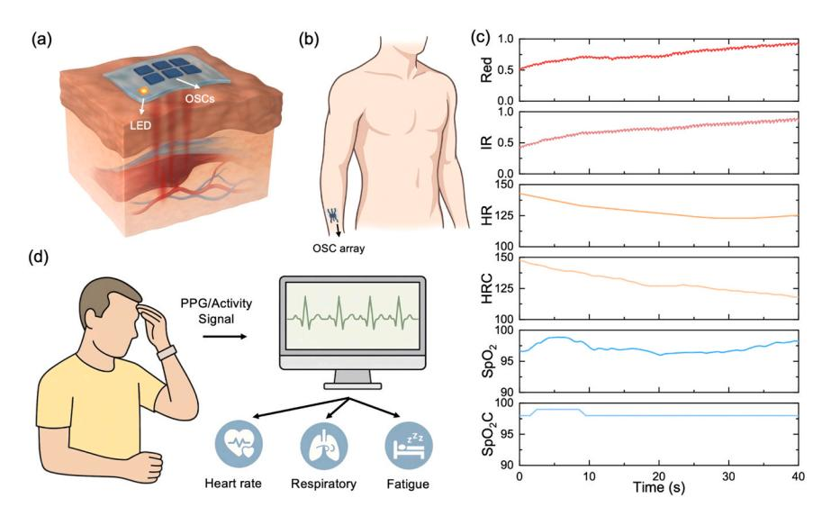
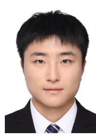

ELSEVIER

Contents lists available at ScienceDirect

## Nano Energy

journal homepage: www.elsevier.com/locate/nanoen

# An integrated sensing and communication solar skin for health monitoring and human–machine interaction

Jiarong Li a,b,1, Jun Tao a,1, Changshuo Ge a,1, Chihan Xu a,b, Jingyang Wang a, Zhancong Xu a, Hao Wang b, Qinghao Xu a, Hongfa Zhao a, Chaobo Zhang b, Weihua Gui c, Wen Gao b,d, Xiaojun Liang b,\*, Xiaomin Xu a,\*, Wenbo Ding a,b,\*\*

- a Tsinghua Shenzhen International Graduate School, Tsinghua University, Shenzhen 518055, China
- b Pengcheng Laboratory, Shenzhen 518066, China
- c School of Automation, Central South University, Changsha 410083, China
- d National Engineering Research Center of Visual Technology, School of Computer Science, Peking University, Beijing 100871, China

#### ARTICLE INFO

# Keywords: Multimodal sensing Electronic skin Human-machine interaction Health monitoring Optical wireless communication

#### ABSTRACT

Wearable electronic systems have garnered significant interest due to their potential in real-time health monitoring, human–machine interaction, and smart infrastructures. Most existing platforms face challenges in power sustainability, sensor bulkiness, and limited multifunctionality. Ultraflexible organic solar cells (OSCs), known for their lightweight nature and self-powered capabilities, have emerged as promising candidates for addressing these issues. Yet, current ultraflexible OSC-based devices are often limited to single functionalities with inadequate system integration and poor adaptability to complex, dynamic scenarios. Here, we present an integrated wearable solar e-skin system that combines multimodal sensing, energy harvesting, and optical wireless communication (OWC) into a single ultrathin and mechanically robust platform. Leveraging the designed ultraflexible structure and high performance of OSCs, the system enables continuous physiological monitoring, precise gesture and activity recognition, and reliable optical data transmission. By mimicking biological sensory pathways for localized signal processing and energy-efficient operation, the platform achieves enhanced functionality and reliability. Demonstrations include accurate heart rate and SpO $_2$  monitoring, robust motion recognition with > 97 % accuracy, and secure OWC. This work provides a scalable and practical solution for next-generation wearable systems, offering potential in healthcare, industrial safety, and human–machine interaction.

#### 1. Introduction

The rapid development of wearable electronics has reshaped fields such as personalized healthcare, human–machine interaction, robotics, and ubiquitous computing, providing opportunities for real-time health monitoring and intuitive, flexible interaction with intelligent systems [1–4]. Among these innovations, electronic skin (e-skin) technologies have gained considerable attention due to their intrinsic mechanical flexibility, ultra-thin profile, conformability, and the potential to seamlessly integrate onto complex surfaces of the human body [5–7]. Recent advancements have demonstrated e-skin platforms with different capabilities, including strain and pressure sensing [8,9], physiological

parameter monitoring [10,11], and human motion detection [12]. However, substantial challenges remain, particularly regarding achieving self-powered sensing, enhancing skin conformability and biocompatibility, improving long-term wearing comfort for wearable applications [13,14].

To address these problems in wearable electronics, ultraflexible organic solar cells (OSCs) have emerged as a promising solution due to their intrinsic flexibility, lightweight structure, good mechanical durability, and facile integration into wearable devices [15–17]. Ultraflexible OSC-based devices have been explored not only for self-powered sensing but also for versatile roles such as photodetection [18], proximity sensing [19], and gesture recognition [20], leveraging their

\* Corresponding authors.

\*\* Corresponding author at: Tsinghua Shenzhen International Graduate School, Tsinghua University, Shenzhen 518055, China. E-mail addresses: liangxj@pcl.ac.cn (X. Liang), xu.xiaomin@sz.tsinghua.edu.cn (X. Xu), ding.wenbo@sz.tsinghua.edu.cn (W. Ding).

 $^{\rm 1}$  These authors contributed equally: Jiarong Li, Jun Tao, Changshuo Ge

sensitivity to optical stimuli and structural adaptability. Recent studies have demonstrated OSC integration into textile-based wearables [\[21,](#page-11-0)  [22\],](#page-11-0) and flexible health-monitoring devices [\[23](#page-11-0)–27]. Despite these advancements, challenges persist, such as integrating multimodal sensing functionalities into a single compact platform, and establishing efficient and reliable data transmission methods [\[28,29\].](#page-11-0)

Parallel to advancements in ultraflexible self-powered sensors, wearable health monitoring technologies have advanced toward multiparameter, continuous physiological monitoring [\[30,31\]](#page-11-0). Photoplethysmography (PPG), widely utilized in wearable health-monitoring systems, measures physiological parameters such as heart rate (HR) and blood oxygen saturation (SpO2) through noninvasive optical methods [\[32,33\].](#page-11-0) Conventional PPG sensors, typically rigid photodiodes or light-emitting diodes (LEDs), present limitations in comfort, flexibility, and integration potential, restricting long-term wearability and continuous monitoring capabilities [\[34,35\]](#page-11-0). Flexible and conformable OSC-based photodetectors represent an attractive alternative, enabling comfortable, unobtrusive wear while potentially providing dual functionality for sensing and energy harvesting [\[30,36\].](#page-11-0) Yet, implementing OSC-based PPG sensors still encounters challenges, such as ensuring consistent signal quality under dynamic movement conditions and

maintaining accurate physiological measurements over extended usage periods [\[37,38\].](#page-11-0)

As wearable systems evolve toward interactive and connected functionalities, communication demands have escalated [\[2,39\].](#page-10-0) Optical wireless communication (OWC) has attracted research interest due to distinct advantages over traditional radio frequency (RF) communication methods, including inherent security, reduced electromagnetic interference, and abundant spectral resources [40–[42\]](#page-11-0). Visible-light communication (VLC), a subtype of OWC, has shown potential for secure and efficient data transfer in wearable and Internet of things (IoT) applications [\[43,44\].](#page-11-0) Integrating OSC-based photodetectors into wearable platforms presents opportunities for energy-efficient, secure optical communication systems [\[45,46\]](#page-11-0). However, practical integration of ultraflexible OSCs into wearable OWC systems remains relatively unexplored, with current challenges including optimizing modulation and demodulation algorithms and achieving robust data transmission reliability under realistic environmental variations [47–[49\].](#page-11-0)

In this study, we propose an integrated wearable system utilizing ultraflexible OSCs combining energy harvesting, multimodal sensing, and OWC into a single wearable platform. Our system employs OSC arrays with ultrathin configurations (~3.2 µm) to ensure mechanical

**Fig. 1.** Design of the solar cell-based e-skin. a) System schematics with functionalities and potential applications. The ultraflexible OSC patch on the wrist is connected to an off-skin processing module via a lightweight cable. b) Integrated communication and sensing circuit module used as a VLC transmitter and signalconditioning / preliminary-processing unit; this rigid module is carried in a pocket or sleeve rather than directly worn on skin. c) Photograph of the sensor module with an integrated ultraflexible OSC array worn on the wrist. d) Enlarged view of the ultraflexible OSC array corresponding to the OSC sensing region highlighted in (c). e) Diagram of the data parallel processing pipeline. f) Bio-inspired framework mimicking sensory reception, spinal processing, and motor actuation.

flexibility and robust performance in various wearable scenarios. Leveraging advanced signal processing and machine learning techniques, we demonstrate effective gesture and motion recognition, accurate physiological monitoring (including HR and SpO2), and stable optical communication performance. This integrated solar-powered eskin platform thus reveals a potential toward realizing multifunctional wearable systems suitable for personalized healthcare, human–machine interfaces, and secure, efficient communication networks.

#### **2. Results and discussion**

#### *2.1. Design and system architecture*

A multifunctional wearable system is developed, in which light harvesting, multimodal sensing, and OWC are integrated into a platform based on ultrathin, skin-conformal OSCs. Device functional modules—including physiological monitoring, motion recognition, gesture input, and data transmission—are achieved through system optimization and algorithmic coordination. The overall system schematics ([Fig. 1](#page-1-0)a) illustrate the integration of these diverse functionalities and potential applications.

Core functionalities of the system are categorized into four modules: motion recognition, health monitoring, OWC, and gesture-based interaction. Variations in the angle or intensity of incident light, caused by finger gestures or movement, are utilized for motion classification, while external light modulation is decoded for communication purposes. For physiological sensing, dual-wavelength reflectance PPG using two LEDs enables the extraction of heart rate and blood oxygen saturation metrics. The integration of these functionalities within a shared interface minimizes system redundancy and enhances wearable compactness.

The system incorporates a designed communication and sensing module ([Fig. 1b](#page-1-0)). This module serves two complementary functions. First, it can operate as a high-speed VLC transmitter, where the customized front-end—anchored on fast-switching LEDs driven by MOSFET circuits—enables robust OOK modulation with stable optical output. Photodetectors with high sensitivity and sub-microsecond response times are embedded. In this mode, the module may be placed on indoor surfaces such as a desktop or wall to emit or receive

**Fig. 2.** Characterization of ultraflexible OSCs. a) Photograph showing 3.2 μm-thick freestanding OSCs adhered to skin with high conformability (scale bar: 1 cm), with the device structure shown on the right. b) Current density–voltage (J–V) characteristics of ultraflexible OSCs. c) External quantum efficiency (EQE) curves of ultraflexible OSCs. d) *J*SC and *V*OC versus light intensity plots. e) Photocurrent variation during hand approaching and moving away. f) Illustration of ultraflexible OSCs under 0 % and 30 % compression; the device subjected to cyclic compression/release is indicated by the red dashed box. g) Mechanical durability of ultraflexible OSCs, showcasing *V*OC during cyclic compression/release. h) Jsc under cyclic compression/release.

optical commands. Second, the same module also functions as the signalconditioning and preliminary-processing unit when paired with the ultraflexible OSC patch, allowing the circuitry to process both communication signals and OSC-generated physiological or motion signals within a single hardware platform. Signal conditioning and analog-todigital conversion (ADC) are performed directly on the module, which is connected to the ultraflexible OSC array via a lightweight cable so that it can be carried in a pocket or sleeve compartment instead of being placed on the skin. In this configuration, all high-speed driving and processing circuits remain off-skin, while the ultrathin OSC patch maintains full conformability and wearability on the user's wrist.

The ultraflexible sensor module, shown worn on the wrist ([Fig. 1c](#page-1-0)) along with an enlarged view of the OSC array structure [\(Fig. 1d](#page-1-0)), demonstrates the system's high mechanical flexibility and excellent wearability. In [Fig. 1c](#page-1-0), the OSC-based sensing patch corresponds to the 2 × 3 ultraflexible OSC array, while [Fig. 1d](#page-1-0) provides a magnified view of the OSC array. Fabricated on 1.5 µm-thick parylene substrates and encapsulated with an additional 1.5 µm parylene layer, the total device thickness is approximately 3.2 μm. This ultrathin configuration allows the freestanding OSCs to conform seamlessly to curved and dynamic surfaces, such as the human wrist [\(Fig. 2](#page-2-0)a), without delamination or visible wrinkling. The lightweight and conformal form factor supports long-term skin integration without affecting the user's mobility or comfort. Additionally, the array's distributed layout enhances spatial sensing resolution and ensures reliable performance under dynamic conditions or partial occlusion (Note S9).

The system architecture adopts a layered modular design that supports real-time signal acquisition and multimodal data handling. [Fig. 1e](#page-1-0) outlines the data parallel processing pipeline. Raw electrical signals, including variations in photocurrent induced by motion or ambient occlusion, are subjected to adaptive preprocessing steps such as drift compensation, envelope normalization, and edge feature enhancement. The conditioned signals are further analyzed by lightweight recognition algorithms for physiological and behavioral classification. Simultaneously, digital data can be transmitted via modulated light pulses and received through the same OSC interface. The OSC sensors are selfpowered and can operate continuously while contributing to additional energy storage when conditions allow, even though the overall wearable system still requires support from conventional power management.

The system design draws inspiration from biological sensory pathways ([Fig. 1f](#page-1-0)), where environmental signals are captured at peripheral sites, processed locally, and relayed to downstream effectors. Similarly, sensory signals in the proposed platform are acquired via the OSC and processed by on-board microcontrollers. Distributed data handling across local modules facilitates edge computation and supports taskspecific activation—computation related to a given modality is initiated only when corresponding signal features are detected—thereby enhancing efficiency without relying on full-system activation.

The developed e-skin system is suited for some practical applications. In smart home environments, optical gesture inputs can be used to control lighting or appliances. In industrial contexts, real-time motion monitoring enhances operational safety in acoustically or visually constrained settings. For fitness and health monitoring, physiological signals such as heart rate and SpO2 can be captured unobtrusively during routine activities. Benefiting from low power requirements and selfharvesting operation, the system supports long-term use with minimal maintenance in both indoor and outdoor environments.

#### *2.2. Fabrication and characterization of device*

To realize a skin-compatible, multifunctional system, ultraflexible OSCs were fabricated using an inverted architecture of indium tin oxide (ITO)/zinc ion-chelated polyethyleneimine (PEI-Zn)/PM6:BTPeC9:L8- BO/MoOx/Ag. The complete device, including parylene substrate and encapsulation, exhibits a total thickness of approximately 3.2 μm. As

shown in [Fig. 2a](#page-2-0), the freestanding OSC can conform seamlessly to curved and dynamic surfaces such as human skin. The image demonstrates high mechanical adaptability without delamination or visible wrinkling, highlighting its potential for long-term skin integration in wearable applications.

The photovoltaic performance of the ultraflexible OSC was evaluated under simulated AM 1.5 G solar illumination. As depicted in [Fig. 2b](#page-2-0), the device exhibits a short-circuit current density (*J*SC) of 26.6 mA cm− 2 , an open-circuit voltage (*V*OC) of 0.81 V, and a fill factor (FF) of 0.76, resulting in a power conversion efficiency (PCE) of 15.3 %. These values confirm the effectiveness of the PM6:BTPeC9:L8-BO blend as an active layer for light harvesting. The J–V curve maintains a well-defined shape with minimal leakage, indicating a balanced carrier extraction and efficient charge transport.

Further insights into spectral performance are provided by the external quantum efficiency (EQE) curves in [Fig. 2c](#page-2-0). The device shows a broad spectral response across 300–1000 nm, with peak EQE values exceeding 75 %. This wide responsivity band not only supports efficient solar energy harvesting under ambient lighting conditions but also enables integration with photoplethysmographic sensing, which relies on red and near-infrared light detection.

To analyze carrier recombination behavior and assess charge transport losses, light intensity-dependent measurements of *J*SC and *V*OC were conducted. As plotted in [Fig. 2](#page-2-0)d, the Jsc follows a power-law relationship with light intensity (Jsc ∝ *P*light α ), where the fitted exponent α = 0.95. This near-unity value indicates that bimolecular recombination is minimal and photogenerated carriers are efficiently collected. Concurrently, *V*OC increases logarithmically with illumination power, as predicted by the diode equation *V*OC ∝ *nkT/qln*(*P*light). The extracted ideality factor n = 1.30 further supports the dominance of bimolecular recombination, suggesting that trap-assisted recombination pathways are suppressed due to the well-optimized active layer morphology.

The dark current characteristics of the device, shown in [Figure S1](#page-10-0), with a measured dark current density of approximately 1.84 × 10− 9 A/ cm2 at 0 V, indicating strong rectification and minimal leakage. This is essential for wearable sensing, where a low signal floor enables higher sensitivity to weak physiological signals. The low dark current also supports stable performance when the device operates in dual roles as a light harvester and photodetector. Characterization of its linear dynamic range is provided in Note S11.

To evaluate the system's capability for dynamic signal acquisition, real-time photocurrent measurements were performed under controlled occlusion. As illustrated in [Fig. 2e](#page-2-0), the OSC's photocurrent shows clear modulation during hand approach and withdrawal events. The signal decreases upon partial occlusion and rapidly recovers when the obstruction is removed, indicating the OSC's potential for motion and gesture recognition. The observed signal stability and fast response (*<*0.5 s) indicate that no significant trap filling or delayed recombination occurs under transient illumination changes.

Considering the intended skin-worn usage scenarios, mechanical durability is a critical parameter for long-term application. Compressive testing was conducted by mounting the 3.2 μm-thick OSC on a prestretched elastomeric substrate. Upon releasing the substrate, the OSC experiences a compressive strain of approximately 30 %, as illustrated in [Fig. 2](#page-2-0)f. After 2000 cycles of compression and relaxation, the *V*OC and *J*SC retain 97.7 % and 93.0 % of their initial values, respectively [\(Fig. 2g](#page-2-0)–h). This mechanical endurance under repeated strain deformation demonstrates that the active layers and electrodes remain intact without cracking, delamination, or fatigue.

In addition to compression testing, cyclic bending evaluations were performed to simulate daily motion, such as wrist flexion and finger articulation. As shown in [Figure S2a,](#page-10-0) the devices were wrapped repeatedly around a stainless-steel rod with a radius of 2.5 mm, corresponding to a bending angle of approximately 120◦. After 2000 bending cycles, the device maintains more than 95 % of its initial Voc and over 90 % of Jsc [\(Figure S2b](#page-10-0)), underscoring the robustness of the device

under small-radius deformations. These results suggest that the functional layers are sufficiently ductile to withstand significant mechanical stress without compromising photovoltaic integrity.

The combination of performance and flexibility positions this ultrathin OSC as a versatile core element in a wearable sensing platform. The high PCE ensures sufficient power supply under indoor or low-light conditions, while the low dark current and fast photocurrent response enable its use in real-time optical sensing. Simultaneously, the device's mechanical resilience supports long-term conformal adhesion to moving body surfaces, such as joints or skin folds.

The optical, electrical, and mechanical characterization results validate the OSC's dual roles as a reliable power supply and active sensing interface in the proposed solar e-skin system. Its compatibility with compression and bending, together with efficient and stable optoelectronic performance, forms the basis for multimodal applications in health monitoring, gesture recognition, and self-powered communication.

#### *2.3. Sensing signal acquisition and processing*

To achieve versatile sensing and communication capabilities in a

unified platform, we developed a comprehensive signal acquisition and processing pipeline tailored explicitly for the solar cell-based e-skin system. This pipeline, illustrated in [Figure S3](#page-10-0), expands upon the architecture initially presented in [Fig. 1](#page-1-0)b, enabling simultaneous multimodal signal processing. It efficiently handles signals associated with physiological parameters, gesture recognition, activity classification, and passive OWC.

The multimodal signals collected by the solar cell array first undergo preprocessing. Specifically, as outlined in the preprocessing flow of [Figure S3,](#page-10-0) baseline correction and basic filtering remove low-frequency drift caused by ambient illumination changes or artifact motion such as slow mechanical deformation. Each channel signal is normalized independently to eliminate amplitude disparities arising from variations in incident illumination or subtle differences in the solar cells' optical sensitivity. A shared baseline-compensation module first stabilizes slow illumination drift and deformation-induced offsets. On top of this, two task-specific filtering paths operate in parallel: the communication path applies edge-preserving smoothing to maintain sharp OOK transitions, while the sensing path uses multiscale denoising to enhance motionrelated morphology. This dual-function operation is enabled by the intrinsic signal differences: OOK-modulated optical inputs produce

**Fig. 3.** Sensing data characterization of solar cell-based e-skin. a) Data acquisition and transmission process. b) Six-channel sensor signals of different finger gestures in an indoor environment. c) Sensor signals of different body activities in an outdoor environment. d) Experimental setup for finger gesture recognition, with corresponding demo shown in Video S1. e) Experimental setup for body activity recognition, with corresponding demo shown in Video S2.

sharp mid-frequency rectangular transitions, whereas gesture, motion, and PPG signals appear as slow, low-frequency variations (*<*5 Hz). These modality-dependent characteristics allow the system to separate communication and sensing streams purely through frequency–temporal filtering, without requiring hardware-level time division. Moreover, the combination of baseline stabilization and structured OOK transitions effectively suppresses background-light interference. More comprehensive details about this adaptive filtering method are provided in Note S3.

Following initial preprocessing, the unified data stream diverges into specialized parallel pathways tailored to each application type. Physiological metrics like heart rate (HR) and oxygen saturation (SpO₂) are estimated from PPG signals. Gesture and activity classification signals pass through a sequence of feature extraction and segmentation modules. Communication signals undergo demodulation and cyclic redundancy check (CRC) verification, ensuring robust message decoding and error rejection.

The detailed hardware and signal acquisition mechanism underlying this multimodal processing is presented in [Fig. 3a](#page-4-0). The sensing platform consists of an ultrathin 2 × 3 OSC array integrated onto a flexible data acquisition printed circuit board (PCB), which is comfortably adhered to the dorsal side of the user's wrist. The enlarged schematic illustrates the fundamental structure and working principle of a single solar cell: an anode-photoactive layer-cathode stack generates a photocurrent under illumination. Modulations in this photocurrent, induced by incident optical changes, encode various environmental and physiological signals.

The analog signals from each cell are first converted into voltage signals using a custom-designed analog front-end. The amplified analog signals are digitized by an ADC integrated within an ESP32 microcontroller platform. The ESP32 then conducts preliminary local data processing, including noise reduction and signal scaling operations. The detailed components and bill of materials for the sensing signal acquisition and transmission module are listed in [Table S3](#page-10-0). Subsequently, the processed data streams are transmitted wirelessly via low-powered Bluetooth or Wi-Fi to a custom-developed mobile application. This app interface, shown on the right of [Fig. 3a](#page-4-0), displays live signals from two selected channels, textual identification of the current gesture or activity type, and corresponding visual representations to facilitate intuitive user interaction.

In our experimental evaluation, we recorded and analyzed the e-skin system's performance under indoor and outdoor scenarios, as demonstrated in [Fig. 3](#page-4-0)b–e and [Figures S4](#page-10-0)–S5. For indoor experiments, the setup simulated typical daily wear scenarios. Participants wore the OSC array on their right forearms, ensuring comfortable alignment without special exposure considerations. [Fig. 3d](#page-4-0)–e visually illustrate indoor experimental setups. Volunteers performed seven distinct finger gestures with their left index finger over the e-skin, including right finger swipes, upward and downward vertical movements, finger bending and stretching, and clockwise and anticlockwise finger rotations (palm up/ down to palm down/up). Through our data processing methods and model structure, the recognition model can readily generalize to other fingers or symmetrical gestures involving the right hand. Volunteers also performed seven different body activities: standing, walking, turning in a quarter circle, jumping, running, sleeping on a desk (head lying on arms), and sitting. Representative waveform signals for these actions under indoor conditions are presented in [Figure S4a](#page-10-0) (finger gestures) and [Figure S4b](#page-10-0) (body activities), clearly showing distinct temporal and amplitude signatures for each category across the six OSC channels.

[Fig. 3](#page-4-0)d demonstrates the experimental scenarios for finger gesture recognition, with a volunteer performing a "swipe" gesture. Sensor signals exhibit clear temporal patterns characteristic of finger motions, accurately classified and reflected on the user interface (UI). [Fig. 3e](#page-4-0) depicts body activity recognition, capturing a volunteer performing a turning activity. Six-channel signals are recorded and processed in realtime, with accurate classification shown on the UI. Corresponding

demonstrations for these setups and evaluations of the functionality of the system are available in Video S1 (finger gestures) and Video S2 (body activities). To rigorously evaluate the system's robustness under more challenging conditions, experiments were conducted outdoors with uncontrolled disturbances. Representative outdoor waveforms ([Fig. 3](#page-4-0)b for finger gestures and [Fig. 3c](#page-4-0) for body activities) exhibit increased baseline drift and amplitude variability. Nevertheless, the system maintained distinguishable signal features necessary for effective classification.

For classification tasks, we employed concise yet effective preprocessing methods, briefly summarized in [Fig. 4](#page-6-0)a and expanded in Note S4. Signals underwent low-pass filtering (below 5 Hz) to remove irrelevant high-frequency noise, followed by mean-variance normalization across channels. Processed signals were segmented into fixed-length windows (3 s for gestures, 5 s for activities) with slight overlaps (0.05 s) and down sampled from the initial 1000 Hz to 128 points per channel. This approach balanced computational efficiency with robust model input. A deep-learning recognition model was trained based on the Residual Bidirectional Long Short-Term Memory (Residual BiLSTM) architecture (outlined briefly in [Fig. 4](#page-6-0)b and elaborated in Note S5). The model consists of four stacked Residual BiLSTM layers (each 64 neurons), followed by a flattening layer and three dense layers containing 32, 16, and 8 neurons, respectively, efficiently capturing temporal dynamics and subtle differences across multichannel inputs. Classical machine-learning classifiers such as K-Nearest Neighbors (KNN), Support Vector Machines (SVM), and Random Forests (RF) were also evaluated, but their performance was lower due to limited capability in modeling long-range temporal dependencies and transient variations inherent in OSC-based time-series data.

Confusion matrices from outdoor testing ([Figs. 4c](#page-6-0) and [4d](#page-6-0)) highlight high recognition accuracy. For finger gesture recognition, the model demonstrated high performance (precision: 97.87 %, recall: 97.86 %, F1 score: 97.86 %, AUROC: 99.79 %). Specific actions such as "swipe," "up," and "down" yielded nearly perfect classification. Minor misclassifications occurred between "rotate" and "anti-rotate," with occasional overlaps (up to 19 errors), attributable to similar spatial-temporal patterns. For body activity recognition, the Residual BiLSTM model achieved high accuracy (98.8 % accuracy, precision, recall, and F1 score). Nearly perfect discrimination occurred across most activities, including "stand", "walk", "sleep", and "sit", with minor confusions involving higher-intensity movements such as "jump" and "run". In comparison, classical machine-learning baselines (KNN, SVM, RF) exhibited lower accuracy on the same datasets (see [Tables S7](#page-10-0)–S8).

Indoor experimental results [\(Figure S5](#page-10-0)) similarly revealed robust performance. Finger gesture recognition accuracy was 96.1 %, with minor overlaps primarily occurring between structurally similar gestures. Body activity classification accuracy reached 96.7 %, demonstrating consistency between indoor and outdoor scenarios. To further benchmark the performance of our system, [Table S1](#page-10-0)[\[50](#page-11-0)–53] and [Table S2](#page-10-0)[\[54,55\]](#page-11-0) compare the gesture and activity recognition performance of our system against other reported solar-based wearable systems, showing its notable accuracy in both indoor and outdoor scenarios.

Notably, our data processing and model training approaches exhibit good adaptability and generalization capability. Through targeted preprocessing and effective model architecture, the developed system demonstrates the capacity to reliably identify diverse human behaviors under realistic environmental conditions.

#### *2.4. Optical wireless communication module*

The solar cell-based e-skin system incorporates a dedicated OWC module capable of efficiently receiving and decoding modulated optical signals, as illustrated in [Fig. 5a](#page-7-0). This module utilizes the ultraflexible OSC array as a self-powered photoreceiver, benefiting from the dual functionality of the OSC to build a low-powered communication

**Fig. 4.** Activity and gesture recognition based on solar cell-based e-skin and machine learning. a) Schematic diagram of the recognition process. b) Schematics of the process and parameters for the Residual BiLSTM. c) Confusion matrix of 7-class finger gesture recognition in an outdoor environment. d) Confusion matrix of 7-class body activity recognition in an outdoor environment.

#### module.

[Fig. 5](#page-7-0)a depicts the end-to-end communication architecture, beginning with command generation at a computer or cloud server. Data packets are encoded and transmitted through a transmitter comprising a

modulation circuit, an LED driver, and a fast-switching LED. The modulation adopts OOK, where binary data is represented as structured sequences of optical pulses, ensuring high robustness against bit errors (Note S1).

**Fig. 5.** Communication functionality of the solar cell-based e-skin system and extended applications on robotic control. a) Schematic diagram of the communication module using the OSC array as a receiver. b) Phototransient response under 685 nm LED illumination at 0 V. c) Digital photo of the constructed experimental system, showing the device setup. d) The waveform of the optical pulsed signal emitted by the transmitter (upper part) and the received signal with the decoded message "HELLO" (lower part). e) Application scenario of remote command broadcasting and control using optical signal reception by the e-skin system. f) System flowchart illustrating gesture-driven robotic interaction. g, h) Experimental setups: wearable e-skin used for gesture-based control of (g) a robotic arm and (h) a quadruped robot.

The receiver side, implemented by the OSC array, captures these optical pulses and translates them into photocurrents. The received signal then undergoes a signal conditioning phase involving amplification, baseline drift compensation, and adaptive filtering (detailed in Note S3). Subsequently, signals are demodulated and decoded via a redundancy-based decoding algorithm, utilizing techniques such as sliding window detection and weighted channel fusion (Note S2).

The experimental setup used for validating this communication functionality is shown in Fig. 5c and detailed in Note S6. The communication signals generated by a BeagleBone Black (BBB)-based signal generator board [\[56\]](#page-11-0) and transmitted via the OpenVLC module [\[57,58\]](#page-11-0) were successfully received by the OSC array mounted on the e-skin system. The components and bill of materials for the OpenVLC-based transceiver module are summarized in [Table S3](#page-10-0). The mobile application interface, displayed on the left side of Fig. 5c, visualizes two real-time channel signals (top section) and decoded text messages (bottom section), showing the successful and accurate decoding of transmitted data. The upper portion of Fig. 5d illustrates the transmitted optical pulse waveform from the LED transmitter, while the lower portion shows the corresponding signal received by the OSC array. The decoded message "HELLO" demonstrates clear transitions and robust signal recovery, affirming the system's reliable OOK demodulation capabilities.

The temporal resolution of the OSC photodetection was experimentally characterized using a 685 nm LED illumination at zero bias voltage, as depicted in Fig. 5b. Measured rise and fall times were approximately 62 µs and 71 µs, respectively. Based on these values, the theoretical bandwidth *BW* can be estimated using the relation *BW* ≈ 1*/*2*πτ*. Using the average response time *τ* ≈ 67 *μs*, the theoretical bandwidth reaches approximately 2.38 kHz. These response times are mainly governed by

the intrinsic carrier dynamics in the PM6:BTP-eC9:L8-BO active layer and the RC time constant of the OSC stack, including junction capacitance and series resistance under zero bias. The sub-100 µs transients indicate that neither carrier transport nor recombination introduces a severe kinetic bottleneck, and that the device can faithfully follow intensity changes on the microsecond scale. Consequently, the extracted bandwidth provides a realistic upper bound for symbol rates in simple OOK links and a useful baseline for mapping device-level parameters to link-level data rate and latency. Leveraging advanced modulation techniques, such as discrete multi-tone (DMT) or DC-biased optical OFDM (DCO-OFDM), and employing multi-channel OSC array-based MIMO architectures, the theoretical data rate is on the order of several tens of kilobits per second. For detailed calculations, please refer to Note S7.

Fig. 5e illustrates a representative application scenario demonstrating the advantages of OWC in an industrial or construction environment. A control center transmits secure and directional optical commands to field workers via LEDs. Workers equipped with the OSCbased e-skin system receive, decode, and execute these commands, such as operating robotic arms or quadruped robots remotely. Compared to traditional wireless technologies (see [Figure S6](#page-10-0) radar plot), OWC offers high security, high data rates, good energy efficiency, abundant spectrum resources, and immunity to radio frequency interference (detailed in Note S6). These attributes make OWC particularly beneficial for secure, interference-sensitive, and energy-constrained application scenarios.

### *2.5. Wireless health monitoring and gesture-based interaction system*

The solar cell-based e-skin integrates OWC, multimodal sensing, and

gesture-driven interactions, realizing real-time robotic manipulation and continuous physiological monitoring capabilities.

A systematic flowchart detailing the gesture-based closed-loop interaction is presented in [Fig. 5f](#page-7-0). As illustrated in [Fig. 5](#page-7-0)g, real-time hand gestures detected by the OSC-based e-skin were used to control a robotic arm to grasp an apple and deliver it to the user. Similarly, [Fig. 5](#page-7-0)h presents an interaction scenario in which the wearable e-skin enabled the user to remotely command a quadruped robot's locomotion. The OSC array within the e-skin sensing module captures optical signals, which are digitized by an ADC. The data subsequently undergoes preprocessing and machine learning-based classification to identify specific user commands accurately. Concurrently, the transceiver module facilitates additional communication functionalities. Classified commands are then translated into actionable instructions through a controller, directing robotic devices to perform tasks such as moving forward, rotating ±90◦, or executing grasp and release actions.

For physiological monitoring, Figs. 6a and 6b illustrate the construction and application of the skin-integrated PPG sensing functionality. The ultraflexible patch integrates a 2 × 3 OSC array with dualwavelength LED emitters (660 nm and 850 nm), which penetrate skin tissue and interact with subdermal blood vessels to detect dynamic changes in blood volume. This configuration facilitates accurate and continuous monitoring of health indicators such as HR and SpO₂.

Comparative analysis of physiological states is illustrated through processed PPG waveforms under post-exercise (Fig. 6c) and breathholding conditions [\(Figure S7\)](#page-10-0). Post-exercise conditions show a relativity stable trend in SpO₂ levels, with heart rate initially elevated and gradually decreasing from around 140 bpm to 113 bpm, indicative of the body's transition from exertion to recovery. Breath-holding conditions result in heart rate fluctuations between 80 bpm and 70 bpm, while SpO₂ levels initially drop to around 90 % before recovering back to 98 %, reflecting typical physiological responses. Importantly, the data from both our device and the commercial device exhibit good agreement. [Figure S8](#page-10-0) further illustrates heart rate variability (HRV) under these two conditions, with [Figure S8a](#page-10-0) for post-exercise and [Figure S8b](#page-10-0) for breathholding, showing corresponding variations in heart rate dynamics. In the post-exercise condition, heart rate variability (HRV) metrics derived from our device over a 4-minute window indicated relatively high variability. Specifically, the standard deviation of NN intervals (SDNN) was 0.209 s, and the root mean square of successive differences

(RMSSD) was 0.276 s—both suggesting strong parasympathetic activity and effective cardiovascular recovery. Poincar´e plot–derived short-term and long-term variability measures (SD1 = 0.195 s, SD2 = 0.222 s; SD1/SD2 ≈ 0.88) exhibited a rounded distribution pattern, consistent with balanced autonomic modulation. In contrast, during breathholding, HRV was markedly reduced: SD1 = 0.111 s, SD2 = 0.124 s, SDNN = 0.118 s, and RMSSD = 0.157 s. These indicate diminished short-term variability and likely sympathetic predominance. The corresponding Poincar´e plot appeared elongated, reflecting a shift toward reduced vagal tone. These comparative results validate the system's sensitivity and effectiveness in capturing real-time physiological variations and further emphasize the robustness of the applied signal processing methodologies detailed in Note S8.

Fig. 6d demonstrates continuous remote health monitoring applications. Physiological signals captured by the wearable e-skin are transmitted wirelessly to computational servers, enabling advanced analytics for real-time monitoring of health conditions such as heart rate variability, respiratory efficiency, and fatigue assessment.

#### **3. Conclusion**

This study demonstrates an integrated, multifunctional wearable eskin system based on OSCs. Through device engineering and optimized system integration, our OSC-based e-skin achieves good mechanical robustness, sustained photovoltaic performance, and versatile multimodal sensing capabilities, making it suitable for daily use. The proposed system integrates energy harvesting, physiological monitoring, motion recognition, gesture interaction, and OWC functionalities within a conformal wearable platform. Employing dual-wavelength reflectance PPG, the system effectively captures critical physiological metrics, including heart rate and blood oxygen saturation, enabling continuous health monitoring under routine activities. Moreover, the OSC array serves as a responsive sensor interface for precise gesture and activity recognition, demonstrating high classification accuracy under both controlled indoor conditions and common outdoor environments.

The OWC module further enhances the platform's versatility, utilizing inherent photodetection capabilities to achieve reliable and secure data transmission via optical modulation. This communication modality offers advantages over traditional RF-based systems, such as high data security, reduced electromagnetic interference, and enhanced energy

**Fig. 6.** Extended applications of the solar cell-based e-skin system for health monitoring. (a) Cross-sectional view of the skin-integrated PPG sensor showing light interaction with subdermal blood vessels via a 2 × 3 OSC array and LED emitters. (b) Schematic of ultrathin wearable patch with integrated OSCs and LEDs for PPG sensing on skin (c) PPG pulse waveforms after exercise and at rest under red (660 nm) and near-infrared (850 nm) LED illumination, along with device-extracted heart rate (HR, orange, in b.p.m.), commercial oximeter heart rate (HRC, orange, in b.p.m.), device-estimated SpO2 (blue, in %) and commercial oximeter SpO2 (SpO2C, blue, in %) over time. (d) Conceptual diagram of health monitoring applications based on physiological signal sensing.

efficiency. Inspired by biological sensory processing mechanisms, our platform also incorporates adaptive data handling, reducing computational resource consumption and improving operational efficiency. These designs expand the practical applications of our solar e-skin system in various fields such as healthcare, smart homes, industrial settings, and human-machine interaction, thereby offering a promising alternative for developing sustainable, efficient, and user-friendly platforms for ubiquitous sensing and interaction.

#### **4. Experimental section**

#### *4.1. Chemicals*

Here, the polymer donor of PM6 and nonfullerene small molecular acceptor BTP-ec9, L8-BO were purchased from Solarmer Material Inc. Zinc acetate dihydrate (Zn(Ac)2⋅2H2O), Chloroform (CF), 1-chloronaphthalene (1-CN), and 2-methoxyethanol were obtained from J&K Scientific. PEIE solution (80 % ethoxylated, 37 % in H2O) was purchased from Sigma-Aldrich. The ITO target for magnetron sputtering, as well as gold, silver, and MoO3 source materials for thermal evaporation, were purchased from ZhongNuo Advanced Material.

#### *4.2. Fabrication of ultraflexible OSCs*

Soda-lime glass with a size of 14.9 × 19.9 mm2 was taken as the rigid supporting substrate, and a fluorinated polymer (Delo D3, Shenzhen Sino-fluorine) sacrificial layer was spin-coated on top. A 1.5 μm-thick parylene-C film was deposited by chemical vapour deposition (CVD) onto a glass plate with the surface coated in the fluorinated polymer layer. A 100 nm thick layer of ITO electrodes was sputtered. PEI-Zn chelated film was subsequently deposited by spin-coating the precursor solution (prepared by adding 0.3 g Zn(Ac)2⋅2 H2O into 17.2 μL PEIE (37 % in H2O) and 4 mL methoxyethanol with subsequent stirring for at least 3 h) and subsequent annealing at 180 ◦C for 10 min. The active layer was deposited in a glove box at 3000 rpm for 30 s. Specifically, the photoactive film consisted of a ternary PM6:BTP-eC9:L8-BO blend, in which 15 wt% of the non-fullerene acceptor L8-BO was incorporated into the binary PM6:BTP-eC9 host, giving a weight ratio of 7:7.14:1.26 and a total solids concentration of 15.4 mg mL⁻¹ . The blend solution was spin-coated at 2500 r.p.m. for 40 s and subsequently thermally annealed at 100 ◦C for 10 min to optimize the active-layer morphology. MoOx (8 nm) and Ag (100 nm; as a top electrode) were deposited sequentially by a thermal evaporator with a pressure of less than 1 × 10− 4 Pa. Finally, the device was encapsulated with a 1.5 µm-thick parylene-C film, and delaminated from the supporting glass, resulting in the ultraflexible OSCs.

#### *4.3. Evaluation of mechanical properties*

Mechanical properties of the ultraflexible OSC devices were assessed through cyclic mechanical durability tests. Compressive strain testing was carried out by laminating the OSC samples onto pre-stretched elastomer substrates. Upon release, the samples underwent approximately 30 % cyclic compressive strain at room temperature, maintaining a constant strain rate. *V*OC and *J*SC values were recorded after every compression-release cycle using a Keithley 2400 source meter to evaluate mechanical robustness. Cyclic bending durability was similarly tested by repeatedly wrapping OSCs around a stainless steel rod with a fixed radius of 2.5 mm. Electrical performance stability (*V*OC and *J*SC retention) after 2000 mechanical cycles was evaluated to confirm device integrity under realistic wearable scenarios.

### *4.4. Optical properties characterization*

Photocurrent responses under transient illumination (685 nm LED) were captured using an oscilloscope (RIGOL DS1102) to quantify temporal response characteristics (rise/fall time), enabling theoretical calculation of bandwidth and OWC capabilities (Note S7). All optical measurements were conducted at zero bias to simulate real-use passive photodetection conditions.

#### *4.5. Photodetector performance evaluation*

Photodetection parameters, including current–voltage (J–V) curves, responsivity, and specific detectivity, were characterized using an Enlitech PD-QE measurement system calibrated with reference Si and Ge photodetectors. The linear dynamic range (LDR) was evaluated at 660 nm and 850 nm using LED sources, whose optical intensities were tuned with a series of calibrated optical filters. The corresponding photocurrent was recorded by a Keithley 2400 source meter while systematically varying the incident power, enabling accurate extraction of the LDR at both wavelengths.

#### *4.6. Motion and PPG signal acquisition*

Volunteer participation was strictly voluntary. All participants provided informed written consent prior to their inclusion in the study. The study protocol was conducted in accordance with institutional guidelines, and ethics approval was not required for this type of non-invasive sensor evaluation.

Multimodal signals were collected using an integrated data acquisition circuit composed of an ESP32 microcontroller with built-in ADC. Additionally, an NI-9253 current input module installed in a NI cDAQ-9174 chassis was employed during laboratory evaluation phases to capture high-fidelity current signals, while the ESP32 platform was used for on-device testing and application demonstrations. A sampling rate of 1000 Hz was maintained.

For motion sensing experiments, each subject performed finger gestures (swipe, vertical movements, bending/stretching, rotations) and body activities (standing, walking, turning, jumping, running, sleeping, sitting) in both indoor and outdoor settings. The data processing methods are detailed in Notes S4 and S5. Each action class was recorded over multiple repeated trials, resulting in approximately 6000 labeled gesture segments and around 8000 labeled activity segments in total. The outdoor recordings naturally included substantial illumination variations such as direct sunlight, partial shadowing, occlusions, and user-induced motion.

PPG signals were recorded under dual-wavelength LED illumination (660 nm and 850 nm). Volunteers maintained stationary postures during recording sessions lasting over 40 s in both post-exercise and breathholding states (100 Hz sampling rate). Processing, normalization, and extraction of physiological parameters including HR and SpO₂ were implemented via customized Python routines (Note S8).

#### *4.7. Data preparation and model training*

All gesture and activity segments were randomly partitioned into training and testing subsets using an 80:20 split at the sample level. The model was trained using the Adam optimizer (learning rate = 0.0015) with a batch size of 512 for 250 epochs. Dropout regularization was enabled within the recurrent layers, and early stopping was applied when the validation loss failed to improve.

#### *4.8. Optical wireless communication*

The OWC transceiver module was developed based on the OpenVLC architecture integrated with a BBB board, which facilitated real-time data encoding, modulation, and demodulation. Binary data was modulated using OOK into structured optical pulses via a high-speed LED driver circuit. Received signals from the OSC array underwent signal conditioning, adaptive filtering, and decoding (see Notes S1–S3, S6). Communication performance was validated by transmitting and

accurately decoding the encoded message "HELLO" under various angular and distance conditions. Experimental evaluation across five distances (10–50 cm), five incident angles (0◦–60◦), and three lighting conditions (dark/normal/strong) further confirms stable communication performance. In all practical scenarios (≤30 cm, ≤30◦), the system maintains low error rates (BER = 0–0.06; PER = 0–0.3), with consistent SNR levels of ~12 dB, demonstrating reliable decoding under diverse indoor conditions (details provided in Note S10).

#### *4.9. Robotic interaction system*

For robotic control experiments, the solar cell-based e-skin sensing module provided real-time gesture detection and classification using a four-layer Residual BiLSTM neural network architecture (Note S5). Classified gestures were wirelessly transmitted to a processor controlling a robotic arm and a quadruped robot. Gesture commands translated into robotic actions such as object grasping and directional locomotion. System responsiveness and command execution were assessed by evaluating the correspondence between user gestures and robotic movements, confirming gesture recognition performance above 98 % in typical use cases.

#### *4.10. Statistical analysis*

The collected data was analyzed using Origin 2019b software. Data segments for motion and physiological analyses involved multiple volunteers with repeated measurements. Gesture and activity recognition performance was statistically validated using confusion matrix-based metrics (precision, recall, F1-score) across indoor and outdoor scenarios.

#### **CRediT authorship contribution statement**

**Qinghao Xu:** Writing – review & editing. **Hao Wang:** Writing – review & editing. **Chaobo Zhang:** Writing – review & editing. **Hongfa Zhao:** Writing – review & editing. **Weihua Gui:** Writing – review & editing. **Xiaojun Liang:** Writing – review & editing. **Jun Tao:** Methodology, Formal analysis, Conceptualization. **Wen Gao:** Writing – review & editing. **Jiarong Li:** Writing – review & editing, Writing – original draft, Visualization, Validation, Software, Methodology, Data curation, Conceptualization. **Wenbo Ding:** Writing – review & editing, Funding acquisition, Conceptualization. **Chihan Xu:** Validation, Formal analysis, Data curation. **Xiaomin Xu:** Writing – review & editing, Conceptualization. **Changshuo Ge:** Validation, Formal analysis, Data curation. **Zhancong Xu:** Validation. **Jingyang Wang:** Visualization.

#### **Declaration of Competing Interest**

The authors declare that they have no known competing financial interests or personal relationships that could have appeared to influence the work reported in this paper.

#### **Acknowledgements**

This research was supported by the National Key R&D Program of China (No. 2024YFB3816000), the Shenzhen Science and Technology Program (No. KJZD20240903100905008) the Tsinghua Shenzhen International Graduate School-Shenzhen Pengrui Young Faculty Program of the Shenzhen Pengrui Foundation (No. SZPR2023008), the Major Key Project of Pengcheng Laboratory (Nos. PCL2025A13, PCL2025A03-2, PCL2023A09), the National Natural Science Foundation of China (62303062), and the Shenzhen Ubiquitous Data Enabling Key Lab (No. ZDSYS2022-0527171406015). We would like to express our sincere gratitude to Qinghao Xu, Hongfa Zhao, Chenxin Liang, Liguang Ruan, Kit-Wa Sou, and Xintao Chao for their valuable suggestions and support. Their assistance has been instrumental in the completion of this project.

#### *Author contributions*

W.D. supervised and guided the project. J. L., J. T., and C. G. contributed equally to this work. J.L. designed the experiments, analyzed the data, and drafted the manuscript. J.T. fabricated and characterized the sensor and performed the experiment for PPG sensing. J.L. and C.G. designed and built the multifunctional solar skin system. J. L. designed and implemented the algorithm. J.L., C.G., and C.X. conducted the sensing and communication experiments and performed the related demonstrations. J.W., Z.X., H.W., C.Z., W.G., X.L., X.X., and W.D. revised the manuscript. All authors discussed the results and provided comments on the manuscript.

#### **Appendix A. Supporting information**

Supplementary data associated with this article can be found in the online version at [doi:10.1016/j.nanoen.2025.111639.](https://doi.org/10.1016/j.nanoen.2025.111639)

#### **Data availability**

Data will be made available on request.

#### **References**

- [1] M. Zarei, G. Lee, S.G. Lee, K. Cho, Advances in biodegradable electronic skin: Material progress and recent applications in sensing, robotics, and human–machine interfaces, Adv. Mater. 35 (2022) 2203193, [https://doi.org/10.1002/](https://doi.org/10.1002/adma.202203193) [adma.202203193.](https://doi.org/10.1002/adma.202203193)
- [2] A.S. Farooq, P. Zhang, A comprehensive review on the prospects of next-generation wearable electronics for individualized health monitoring, assistive robotics, and communication, Sens. Actuators A 344 (2022) 113715, [https://doi.org/10.1016/j.](https://doi.org/10.1016/j.sna.2022.113715)  [sna.2022.113715.](https://doi.org/10.1016/j.sna.2022.113715)
- [3] Q. Shi, B. Dong, T. He, Z. Sun, J. Zhu, Z. Zhang, C. Lee, Progress in wearable electronics/photonics—moving toward the era of artificial intelligence and internet of things, InfoMat 2 (2020) 1131–1162, [https://doi.org/10.1002/](https://doi.org/10.1002/inf2.12122) [inf2.12122.](https://doi.org/10.1002/inf2.12122)
- [4] Z. Wang, J. Li, Y. Jin, J. Wang, F. Yang, G. Li, X. Ni, W. Ding, Sensing beyond itself: multi-functional use of ubiquitous signals towards wearable applications, Digit. Signal Process 116 (2021) 103091, [https://doi.org/10.1016/j.dsp.2021.103091.](https://doi.org/10.1016/j.dsp.2021.103091)
- [5] W. Heng, S. Solomon, W. Gao, Flexible electronics and devices as human-machine interfaces for medical robotics, Adv. Mater. 34 (2022) 2107902, [https://doi.org/](https://doi.org/10.1002/adma.202107902)  [10.1002/adma.202107902](https://doi.org/10.1002/adma.202107902).
- [6] M. Chen, Y. Ma, Y. Li, D. Wu, Y. Zhang, C.-H. Youn, Wearable 2.0: Enabling humancloud integration in next generation healthcare systems, IEEE Commun. Mag. 55 (2017) 54–61, <https://doi.org/10.1109/mcom.2017.1600410cm>.
- [7] R. Yin, D. Wang, S. Zhao, Z. Lou, G. Shen, Wearable sensors-enabled human–machine interaction systems: From design to application, Adv. Funct. Mater. 31 (2020) 2008936, <https://doi.org/10.1002/adfm.202008936>.
- [8] Q. Wang, M. Li, P. Guo, L. Gao, L. Weng, W. Huang, Shape-position perceptive fusion electronic skin with autonomous learning for gesture interaction, Microsyst. Nanoeng. 10 (2024) 103, [https://doi.org/10.1038/s41378-024-00739-9.](https://doi.org/10.1038/s41378-024-00739-9)
- [9] L. Yang, X. Chen, A. Dutta, H. Zhang, Z. Wang, M. Xin, S. Du, G. Xu, H. Cheng, Thermoelectric porous laser-induced graphene-based strain-temperature decoupling and self-powered sensing, Nat. Commun. 16 (2025) 792, [https://doi.](https://doi.org/10.1038/s41467-024-55790-x) [org/10.1038/s41467-024-55790-x](https://doi.org/10.1038/s41467-024-55790-x).
- [10] R.T. Arwani, S.C.L. Tan, A. Sundarapandi, W.P. Goh, Y. Liu, F.Y. Leong, W. Yang, X. T. Zheng, Y. Yu, C. Jiang, Y.C. Ang, L. Kong, S.L. Teo, P. Chen, X. Su, H. Li, Z. Liu, X. Chen, L. Yang, Y. Liu, Stretchable ionic–electronic bilayer hydrogel electronics enable in situ detection of solid-state epidermal biomarkers, Nat. Mater. 23 (2024) 1115–1122, [https://doi.org/10.1038/s41563-024-01918-9.](https://doi.org/10.1038/s41563-024-01918-9)
- [11] Y. Du, C. Zhou, Y. Feng, L. Qiu, Flexible, multimodal device for measurement of body temperature, core temperature, thermal conductivity and water content, npj Flex. Electron 8 (2024) 85,<https://doi.org/10.1038/s41528-024-00373-5>.
- [12] W. Dong, M. Li, C. Chen, K. Xie, J. Hong, L. Yang, Flexible hybrid self-powered piezo-triboelectric nanogenerator based on bto-pvdf/pdms nanocomposites for human machine interaction, Sci. Rep. 15 (2025) 15991, [https://doi.org/10.1038/](https://doi.org/10.1038/s41598-025-00686-z)  [s41598-025-00686-z](https://doi.org/10.1038/s41598-025-00686-z).
- [13] F. Wen, C. Wang, C. Lee, Progress in self-powered sensors—moving toward artificial intelligent and neuromorphic system, Nano Res 16 (2023) 11801–11821, <https://doi.org/10.1007/s12274-023-5879-4>.
- [14] R. Chirila, A.S. Dahiya, P. Schyns, R. Dahiya, Self-powered multimodal sensing using energy-generating solar skin for robotics and smart wearables, Adv. Intell. Syst. 6 (2024) 2300824, <https://doi.org/10.1002/aisy.202300824>.
- [15] J. Zhu, J. Xia, Y. Li, Y. Li, Perspective on flexible organic solar cells for selfpowered wearable applications, ACS Appl. Mater. Interfaces 17 (2025) 5595–5608, [https://doi.org/10.1021/acsami.4c12238.](https://doi.org/10.1021/acsami.4c12238)
- [16] Z. Wang, S. Cheng, K. Fukuda, W. Hu, X. Xu, T. Someya, Flexible near-infrared organic photodetectors for emergent wearable applications, Wearable Electron 1 (2024) 53–77, [https://doi.org/10.1016/j.wees.2024.04.001.](https://doi.org/10.1016/j.wees.2024.04.001)

- [17] H. Guo, S. Saifi, K. Fukuda, H.-M. Cheng, Z. Lou, X. Xu, Flexible organic photodetectors and their use in wearable systems, Digit. Signal Process 125 (2022) 103145, <https://doi.org/10.1016/j.dsp.2021.103145>.
- [18] J. Wan, R. Zhang, Y. Li, Y. Li, Applications of organic solar cells in wearable electronics, Wearable Electron 1 (2024) 26–40, [https://doi.org/10.1016/j.](https://doi.org/10.1016/j.wees.2024.03.001)  [wees.2024.03.001.](https://doi.org/10.1016/j.wees.2024.03.001)
- [19] J. Choi, D. Kwon, B. Kim, K. Kang, J. Gu, J. Jo, K. Na, J. Ahn, D. Del Orbe, K. Kim, Wearable self-powered pressure sensor by integration of piezo-transmittance microporous elastomer with organic solar cell, Nano Energy 74 (2020) 104749, [https://doi.org/10.1016/j.nanoen.2020.104749.](https://doi.org/10.1016/j.nanoen.2020.104749)
- [20] J. Li, C. Ge, J. Tao, J. Wang, X. Xu, X. Chen, W. Gui, X. Liang, W. Ding, Solareskin: Self-powered visible light sensing through a solar cell e-skin, UbiComp (2023) 664–669, [https://doi.org/10.1145/3594739.3612904.](https://doi.org/10.1145/3594739.3612904)
- [21] H. Ke, M. Gao, S. Li, Q. Qi, W. Zhao, X. Li, S. Li, V. Kuvondikov, P. Lv, Q. Wei, L. Ye, Advances and future prospects of wearable textile- and fiber-based solar cells, Sol. RRL 7 (2023) 2300109, <https://doi.org/10.1002/solr.202300109>.
- [22] D. Lv, Q. Jiang, Y. Shang, D. Liu, Highly efficient fiber-shaped organic solar cells toward wearable flexible electronics, npj Flex. Electron 6 (2022) 38, [https://doi.](https://doi.org/10.1038/s41528-022-00172-w)  [org/10.1038/s41528-022-00172-w](https://doi.org/10.1038/s41528-022-00172-w).
- [23] Z. Lou, J. Tao, B. Wei, X. Jiang, S. Cheng, Z. Wang, C. Qin, R. Liang, H. Guo, L. Zhu, P. Müller-Buschbaum, H.-M. Cheng, X. Xu, Near-infrared organic photodetectors toward skin-integrated photoplethysmography-electrocardiography multimodal sensing system, Adv. Sci. 10 (2023) 2304174, [https://doi.org/10.1002/](https://doi.org/10.1002/advs.202304174)  [advs.202304174.](https://doi.org/10.1002/advs.202304174)
- [24] S. Jung, U.J. Yang, J. Oh, S. Jeong, Y. Cho, G.H. Lee, M.K. Choi, C. Yang, Transfer printing of photoactive layer enabling efficient, wearable, and dual-function organic solar cell modules for a wireless healthcare monitoring system, Adv. Funct. Mater. 34 (2024) 2406200, [https://doi.org/10.1002/adfm.202406200.](https://doi.org/10.1002/adfm.202406200)
- [25] L. Zhan, J. Lv, S. Chen, A. Gupta, Y. Xin, F. Jiang, J.P. Lee, J. Xiong, N. Wang, P. S. Lee, Moisture-triggered hybrid soft actuator and electric generator for selfsensing wearables and adaptive human-environment interaction, Nano Energy 132 (2024) 110410, <https://doi.org/10.1016/j.nanoen.2024.110410>.
- [26] W. Li, Z. Lu, Y. Zhang, L. Zhu, J. Zhang, Y. Zhang, M. Wu, X. Zhou, J. Xiong, Recyclable and healable electro-optical fiber for sensing and information transmission, Adv. Funct. Mater. 35 (2025) 2423596, [https://doi.org/10.1002/](https://doi.org/10.1002/adfm.202423596) [adfm.202423596.](https://doi.org/10.1002/adfm.202423596)
- [27] Z. Lu, W. Li, L. Zhu, Y. Zhang, Z. Ming, Y. Zhang, X. Zhou, J. Xiong, Self-healing electro-optical skin for dual-mode human-machine interaction, Nano Energy 135 (2025) 110617, <https://doi.org/10.1016/j.nanoen.2024.110617>.
- [28] X. Liu, T. Ratnarajah, M. Sellathurai, Y.C. Eldar, Multimodal learning for integrated sensing and communication networks, EUSIPCO (2024) 1177–1181, [https://doi.](https://doi.org/10.23919/eusipco63174.2024.10715410) [org/10.23919/eusipco63174.2024.10715410](https://doi.org/10.23919/eusipco63174.2024.10715410).
- [29] H. Li, J. Le, H. Tan, L. Hu, X. Li, K. Zhang, S. Zeng, Q. Liu, M. Zhang, L. Shi, Z. Cai, S. Liu, H. Li, L. Ye, X. Hu, Y. Chen, Synergistic multimodal energy dissipation enhances certified efficiency of flexible organic photovoltaics beyond 19, Adv. Mater. 37 (2024) 2411989, [https://doi.org/10.1002/adma.202411989.](https://doi.org/10.1002/adma.202411989)
- [30] J.V. Dcosta, D. Ochoa, S. Sanaur, Recent progress in flexible and wearable all organic photoplethysmography sensors for spo2 monitoring, Adv. Sci. 10 (2023) 2302752, [https://doi.org/10.1002/advs.202302752.](https://doi.org/10.1002/advs.202302752)
- [31] J. Mathew, D. Zheng, J. Xu, H. Liu, Systematic review on fabrication, properties, and applications of advanced materials in wearable photoplethysmography sensors, Adv. Electron. Mater. 10 (2024) 2300765, [https://doi.org/10.1002/](https://doi.org/10.1002/aelm.202300765)  [aelm.202300765.](https://doi.org/10.1002/aelm.202300765)
- [32] Q. Lin, W. Sijbers, C. Avidikou, C. Van Hoof, F. Tavernier, N. Van Helleputte, Photoplethysmography (ppg) sensor circuit design techniques, CICC (2022) 1–8, [https://doi.org/10.1109/cicc53496.2022.9772851.](https://doi.org/10.1109/cicc53496.2022.9772851)
- [33] D. Ray, T. Collins, S. Woolley, P. Ponnapalli, A review of wearable multiwavelength photoplethysmography, IEEE Rev. Biomed. Eng. 16 (2023) 136–151, [https://doi.org/10.1109/rbme.2021.3121476.](https://doi.org/10.1109/rbme.2021.3121476)
- [34] A. Ajmal, T. Boonya-Ananta, A.J. Rodriguez, V. Nguyen Du Le, J.C. Ramella-Roman, Investigation of optical heart rate sensors in wearables and the influence of skin tone and obesity on photoplethysmography (ppg) signal, Biophotonics Exerc. Sci. Sports Med. Health Monit. Tech. Wearables (2021) 5, [https://doi.org/](https://doi.org/10.1117/12.2578023)  [10.1117/12.2578023.](https://doi.org/10.1117/12.2578023)
- [35] T. Kong, A. Hedayatipour, Oximeter for all: An innovative look in inclusive physiological monitoring, BioCAS (2023) 1–5, [https://doi.org/10.1109/](https://doi.org/10.1109/biocas58349.2023.10388555) [biocas58349.2023.10388555](https://doi.org/10.1109/biocas58349.2023.10388555).
- [36] J. Song, G. Tang, J. Cao, H. Liu, Z. Zhao, S. Griggs, A. Yang, N. Wang, H. Cheng, C. K. Liu, I. McCulloch, F. Yan, Perovskite solar cell-gated organic electrochemical transistors for flexible photodetectors with ultrahigh sensitivity and fast response, Adv. Mater. 35 (2022) 2207763, [https://doi.org/10.1002/adma.202207763.](https://doi.org/10.1002/adma.202207763)
- [37] A. Khatoun, S. Stuart, A.-R. Petre, B. Peeters, A. Soundararajan, N. E. Uzunbajakava, V.S. Zoutenbier, H.B. Akkerman, A. Amelink, Design and development of a new wearable optic patch towards increased functionality and reduced motion artifacts, Biophotonics Exerc. Sci. Sports Med. Health Monit. Tech. Wearables (2024) 7, <https://doi.org/10.1117/12.3002506>.
- [38] A.K. Maity, A. Veeraraghavan, A. Sabharwal, Ppgmotion: model-based detection of motion artifacts in photoplethysmography signals, Biomed. Signal Process. Control 75 (2022) 103632, [https://doi.org/10.1016/j.bspc.2022.103632.](https://doi.org/10.1016/j.bspc.2022.103632)
- [39] A. Sabban, Wearable communication systems and antennas: Design, efficiency, and miniaturization techniques, IOP Publishing, Bristol, 2022, [https://doi.org/](https://doi.org/10.1088/978-0-7503-5224-6) [10.1088/978-0-7503-5224-6](https://doi.org/10.1088/978-0-7503-5224-6).
- [40] X. Zhang, G. Klevering, X. Lei, Y. Hu, L. Xiao, G.-H. Tu, The security in optical wireless communication: a survey, ACM Comput. Surv. 55 (2023) 1–36, [https://](https://doi.org/10.1145/3594718)  [doi.org/10.1145/3594718.](https://doi.org/10.1145/3594718)

- [41] A. Celik, I. Romdhane, G. Kaddoum, A.M. Eltawil, A top-down survey on optical wireless communications for the internet of things, IEEE Commun. Surv. Tutor. 25 (2023) 1–45, [https://doi.org/10.1109/comst.2022.3220504.](https://doi.org/10.1109/comst.2022.3220504)
- [42] Z. Wang, J. Li, H. Zhao, J. Song, Z.L. Wang, W. Ding, Self-powered optical communication: Opportunities, challenges and future prospects, Adv. Energy Mater. 15 (2025) e02803, [https://doi.org/10.1002/aenm.202502803.](https://doi.org/10.1002/aenm.202502803)
- [43] C. Liang, J. Li, S. Liu, F. Yang, Y. Dong, J. Song, X.-P. Zhang, W. Ding, Integrated sensing, lighting and communication based on visible light communication: a review, Digit. Signal Process 145 (2024) 104340, [https://doi.org/10.1016/j.](https://doi.org/10.1016/j.dsp.2023.104340) [dsp.2023.104340](https://doi.org/10.1016/j.dsp.2023.104340).
- [44] L.E.M. Matheus, A.B. Vieira, L.F.M. Vieira, M.A.M. Vieira, O. Gnawali, Visible light communication: concepts, applications and challenges, IEEE Commun. Surv. Tutor. 21 (2019) 3204–3237, [https://doi.org/10.1109/comst.2019.2913348.](https://doi.org/10.1109/comst.2019.2913348)
- [45] S. Chang, J.H. Koo, J. Yoo, M.S. Kim, M.K. Choi, D.-H. Kim, Y.M. Song, Flexible and stretchable light-emitting diodes and photodetectors for human-centric optoelectronics, Chem. Rev. 124 (2024) 768–859, [https://doi.org/10.1021/acs.](https://doi.org/10.1021/acs.chemrev.3c00548)  [chemrev.3c00548.](https://doi.org/10.1021/acs.chemrev.3c00548)
- [46] L. Li, D. Wang, D. Zhang, W. Ran, Y. Yan, Z. Li, L. Wang, G. Shen, Near-infrared light triggered self-powered mechano-optical communication system using wearable photodetector textile, Adv. Funct. Mater. 31 (2021) 2104782, [https://](https://doi.org/10.1002/adfm.202104782) [doi.org/10.1002/adfm.202104782](https://doi.org/10.1002/adfm.202104782).
- [47] J. Jin, H. Lu, J. Wang, J. Huang, L. Feng, D. Chen, H. Chen, T. Dong, Y. Su, Y. Wang, Adaptive feedback threshold based demodulation for mobile visible light communication and positioning integrated system, Opt. Express 30 (2022) 13331–13344, [https://doi.org/10.1364/oe.456076.](https://doi.org/10.1364/oe.456076)
- [48] K. Ullah, M. Salman, J. Bolboli, W.-Y. Chung, Image-based vlc signal demodulation using machine learning, IEEE Commun. Lett. 29 (2025) 145–149, [https://doi.org/](https://doi.org/10.1109/lcomm.2024.3504524)  [10.1109/lcomm.2024.3504524.](https://doi.org/10.1109/lcomm.2024.3504524)
- [49] P.P. Manousiadis, K. Yoshida, G.A. Turnbull, I.D.W. Samuel, Organic semiconductors for visible light communications, Philos. Trans. A Math. Phys. Eng. Sci. 378 (2020) 20190186, [https://doi.org/10.1098/rsta.2019.0186.](https://doi.org/10.1098/rsta.2019.0186)
- [50] Y. Li, T. Li, R.A. Patel, X.-D. Yang, X. Zhou, Self-powered gesture recognition with ambient light, UIST (2018) 595–608, [https://doi.org/10.1145/3242587.3242635.](https://doi.org/10.1145/3242587.3242635)
- [51] G. Thomas, A. Pockett, K. Seunarine, M. Carnie, Simultaneous energy harvesting and hand gesture recognition in large area monolithic dye-sensitized solar cells, arXiv preprint arXiv:2311.16284 (2023). [https://doi.org/10.48550/arXiv.2311.](https://doi.org/10.48550/arXiv.2311.16284)  [16284](https://doi.org/10.48550/arXiv.2311.16284).
- [52] D. Ma, G. Lan, M. Hassan, W. Hu, M.B. Upama, A. Uddin, M. Youssef, Solargest: ubiquitous and battery-free gesture recognition using solar cells, MobiCom (2019) 1–15, [https://doi.org/10.1145/3300061.3300129.](https://doi.org/10.1145/3300061.3300129)
- [53] R. Wu, H. Yang, W. Xu, Xsolar: a generative framework for solar-based human gesture sensing via wearable signals, MobiSys (2024) 41–46, [https://doi.org/](https://doi.org/10.1145/3662009.3662024)  [10.1145/3662009.3662024.](https://doi.org/10.1145/3662009.3662024)
- [54] M. Deumer, M. Sandhu, S. Khalifa, B. Kusy, K. Geissdoerfer, M. Zimmerling, R. Jurdak, A battery-free wearable system for on-device human activity recognition using kinetic energy harvesting, EWSN (2023) 163–169, [https://doi.org/10.5555/](https://doi.org/10.5555/3639940.3639962)  [3639940.3639962](https://doi.org/10.5555/3639940.3639962).
- [55] M.M. Sandhu, S. Khalifa, K. Geissdoerfer, R. Jurdak, M. Portmann, Solar: energy positive human activity recognition using solar cells, PerCom (2021) 1–10, [https://](https://doi.org/10.1109/PERCOM50583.2021.9439128)  [doi.org/10.1109/PERCOM50583.2021.9439128.](https://doi.org/10.1109/PERCOM50583.2021.9439128)
- [56] G. Coley, Beaglebone black system reference manual, Texas Instruments, Dallas 5 (2013).
- [57] Q. Wang, D. Giustiniano, D. Puccinelli, Openvlc: software-defined visible light embedded networks, MobiCom (2014) 15–20, [https://doi.org/10.1145/](https://doi.org/10.1145/2643164.2643167) [2643164.2643167](https://doi.org/10.1145/2643164.2643167).
- [58] A. Galisteo, D. Juara, D. Giustiniano, Research in visible light communication systems with openvlc 1. 3, WFIoT (2019) 539–544, [https://doi.org/10.1109/WF-](https://doi.org/10.1109/WF-IoT.2019.8767252)[IoT.2019.8767252.](https://doi.org/10.1109/WF-IoT.2019.8767252)

**Jiarong Li** received his B.Eng. degree in Electronic Science and Technology from the University of Electronic Science and Technology of China in 2019, and dual master's degrees in data science from Tsinghua University and Industrial Engineering from the University of California, Berkeley, in 2022. He is currently pursuing his Ph.D. degree in Data Science at Tsinghua University under the supervision of Prof. Wenbo Ding and Prof. Xiaojun Liang. His research interests include ubiquitous sensing and communication.

**Jun Tao** received his B.Eng. degree in Material Physics from the Institute of Advanced Studies, Nanchang University, in 2021. He is currently pursuing his Ph.D. degree in Environmental Science and New Energy at Tsinghua University under the supervision of Prof. Xiaomin Xu. His research interests include near-infrared organic photodetector arrays and imaging systems for physiological signal sensing and mapping.

**Hao Wang** received the M.S. degree from Hainan University, Haikou, China, in 2022. He is currently pursuing the Ph.D. degree with the South China University of Technology, Guangzhou, China. His research interests include computer vision, industrial intelligence, and knowledge-enhanced learning.

**Changshuo Ge** received his B.Eng. degree in Electronic Information Science and Technology from the Department of Electronic Engineering, Tsinghua University in June 2022. He received his Master's degree in Electronic Information at the School of Electronic and Communication Engineering, Tsinghua University Shenzhen International Graduate School in June 2025. He is currently working at ByteDance.

**Qinghao Xu** received his B.S. degree (2019) and M.S. degree (2022) from Nanjing University of Posts and Telecommunications. Currently, he is a Ph.D. candidate at the Institute of Data and Information, Tsinghua University. His research focuses on wireless technologies and advanced manufacturing for medical devices, aiming to enable monitoring and intervention of invivo medical conditions.

**Chihan Xu** received his B.S. degree in Mathematics and Applied Mathematics from the Lanzhou University in 2024. He is currently pursuing his Ph.D. degree in Electronic Information at Tsinghua University under the supervision of Prof. Wenbo Ding and Prof. Wenfeng Deng. His research interests include multi-agent collaboration and agentic reinforcement learning.

**Hongfa Zhao** received his B.S. and M.S. degree in Marine Engineering from Dalian Maritime University in 2018 and 2021, respectively, and his Ph.D. Degree from Tsinghua University in 2025. He was a visiting scholar at the University of California, Berkeley, from 2024 to 2025. He is currently a postdoctoral fellow at Tsinghua University. His research interests focus on the theoretical analysis of nanogenerators and the development of intelligent systems.

**Jingyang Wang** received his B.S. degree from the School of Information Engineering, Wuhan University of Technology in 2023. He is currently pursuing a Master's degree at the Institute of Data and Information, Tsinghua Shenzhen International Graduate School, under the supervision of Associate Professor Wenbo Ding. His main research focuses on intelligent sensing.

**Chaobo Zhang** received the master's and Ph.D. degrees in civil engineering from the Hong Kong University of Science and Technology, Hong Kong, in 2017 and 2020, respectively. He is currently a Research Associate with the Department of Strategic and Advanced Interdisciplinary Research, Peng Cheng Laboratory, Shenzhen, China. His research interests include intelligent sensing, Big Data analysis, deep learning, and computer vision for industrial applications.

**Zhancong Xu** received his B.Eng. degree in Electronic Engineering from Tsinghua University in 2022. He then earned his M.Eng. degree under the supervision of Prof. Wenbo Ding in Electronic Information from the Shenzhen International Graduate School, Tsinghua University, in 2025. He is currently pursuing his Ph.D. degree in Data Science at the Shenzhen International Graduate School, Tsinghua University, under the supervision of Prof. Xun Guan. His research interests include signal processing techniques and optical sensing technologies.

**Weihua Gui** received the B.S. degree in electrical engineering and the M.S. degree in automatic control engineering from Central South University, Changsha, China, in 1976 and 1981, respectively. From 1991–2018, he was a Full Professor with the School of Information Science and Engineering, Central South University. Since 2019, he has been a Full Professor with the School of Automation at the same university. He was a Visiting Scholar with the University Duisburg-Essen, Duisburg, Germany, from 1986 to 1988. Since 2013, he has been an Academician with the Chinese Academy of Engineering, in Beijing, China. His main research interests include the modeling and optimal control of complex industrial processes, fault diagnoses, and distributed robust control.

**Wen Gao** received the Ph.D. degree in electronics engineering from The University of Tokyo, Japan, in 1991. He is currently a Professor with the School of Electronic Engineering and Computer Science, Peking University, Beijing, China, and the Director of Peng Cheng Laboratory, Shenzhen, China. He is also an Academician of the Chinese Academy of Engineering. He has authored over 600 technical articles and five books, and has served as the chair of multiple international conferences in the multimedia and video signal processing fields. His research interests include image processing, video coding, pattern recognition, and multimedia analysis.

**Xiaomin Xu** is an Associate Professor at Shenzhen International Graduate School, Tsinghua University. She graduated with a bachelor's degree from University of Science and Technology of China (USTC) in 2011 and obtained Ph.D. in Chemistry from the Chinese University of Hong Kong (CUHK) in 2015. From 2016 to 2019, she worked as a postdoctoral fellow at RIKEN, and Humboldt University of Berlin. She joined Tsinghua University in 2019, leading the "Flexible Materials and Electronic Devices" research team. She currently serves on the Editorial Board of Wearable Electronics, and the Early Career Editorial Advisory Board of Appl. Phys. Rev.

**Xiaojun Liang** received the Ph.D. degree in mechanical engineering and applied mechanics from the University of Pennsylvania, Philadelphia, PA, USA, in 2017. From 2017–2020, he was a Senior Research and Development Engineer with the Intelligent Robot Division, JD Group, Beijing, China. Since 2021, he has been an Associate Research Fellow with the Peng Cheng Laboratory, Shenzhen, China. His research interests include mechanical modeling and analysis, industrial intelligent systems, and industrial artificial intelligence (AI) technology.

**Wenbo Ding** received the BS and PhD degrees (Hons.) from Tsinghua University in 2011 and 2016, respectively. He worked as a postdoctoral research fellow at Georgia Tech from 2016 to 2019. He is now an associate professor and PhD supervisor at Tsinghua University, where he leads the Smart Sensing and Robotics (SSR) lab. His research interests include tactile sensing, embodied intelligence and AI4S. He has received many prestigious awards, including the Gold Medal of the 47th International Exhibition of Inventions Geneva and the IEEE Scott Helt Memorial Award, the IAS Residential Fellow.