Contents lists available at [ScienceDirect](www.sciencedirect.com/science/journal/01438166)

# Optics and Lasers in Engineering

journal homepage: [www.elsevier.com/locate/optlaseng](https://www.elsevier.com/locate/optlaseng)

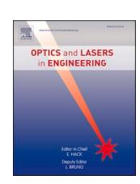

# Multi-service integrated sensing and communication system for industrial internet-of-things

Jiajia Shen , Jiamin Fan , Meixia Li , Yang Fei , Tingyu Fu , Mingyi Gao \*

*Jiangsu Engineering Research Center of Novel Optical Fiber Technology and Communication Network, Suzhou Key Laboratory of Advanced Optical Communication Network Technology, the School of Electronic and Information Engineering, Soochow University, Jiangsu Province 215006, China*

#### ARTICLE INFO

#### *Keywords:* Distributed optical fiber sensing Integration of sensing and communication (ISAC)

#### ABSTRACT

Industrial Internet-of-Things (IIoT) deeply integrates advanced information and communication technologies with industry, forming new infrastructure and ecosystem for full connectivity. With the evolution of IIoT, its significance and applicability have grown due to interconnected devices. However, potential bottlenecks are caused by increasing network traffic and data generation, which requires IIoT to support multiple services for efficient data transmission and resource optimization. In this work, we proposed a multi-service integrated sensing and communication (ISAC) system that is compatible with various common signals, i.e., pulse amplitude modulation (PAM), multicarrier and quadrature-amplitude-modulation (QAM) signals, in the same optical fiber and wavelength channel. The proposed ISAC architecture encompassed an economical, low-complexity approach for fiber vibration localization and vibration frequencies demodulation, where the frequency response of system is theoretically decoupled from the pulse frequency limitations. Consequently, 25-GBaud PAM-4 signals, 25- GBaud 16-quadrature-amplitude-modulation (16-QAM) universal filter multi-carrier (UFMC) signals, and 20- GBaud polarization-division multiplexed (PDM) 16-QAM signals for loading multiple services have been successfully transmitted over 12-km standard single-mode fiber (SSMF). Simultaneously, a spatial resolution of 2.4 m, a 28-dB signal-to-noise ratio (SNR) of Rayleigh backscattering (RBS) frequency shift, and a 20-dB SNR of vibration frequency identification have been achieved.

# **1. Introduction**

The Industrial Internet-of-Things (IIoT) is a new infrastructure, application model, and industrial ecosystem formed by the deep integration of advanced information and communication technologies with industrial economy. It achieves comprehensive interconnection between people, machines, objects, and systems, constructing a new manufacturing and service system that spans the entire industrial chain and value chain. As a significant cornerstone of the Fourth Industrial Revolution, IIoT establishes networked communication channels for industrial end devices, including sensors, robots, logistics vehicles, machine tools, and advanced control devices such as automatic controllers, data analyzers, and information systems [[1](#page-8-0)]. Its robust data collection and analysis capabilities enable precise quality control, fault localization, and overall process enhancement [\[2\]](#page-8-0). With the evolution of the IIoT, the use of various devices that communicate with each other has become commonplace, elevating the significance and applicability of IIoT. However, due to the increasing traffic on the Internet,

advancements in communication technology, and the vast amount of data generated by various objects, bottlenecks may emerge [\[3\]](#page-8-0). Some IIoT devices generate minimal data and require shorter response times, while others produce substantial data and necessitate multiple responses [[4](#page-8-0)]. Therefore, it is crucial for IIoT to achieve efficient data transmission and optimize resource allocation across the physical layer, the network layer, and the application layer, thereby facilitating the realization of information efficiency and automation [[5](#page-8-0)]. Given the flexible data transmission rate and latency requirements of various service terminals, IIoT necessitates support for diverse modulation formats, as each performs differently under varying transmission speeds [[6](#page-9-0)].

In IIoT domain, wireless communication security has established robust solutions, exemplified by a low-power, multi-carrier waveformdefined security framework to address emerging artificial-intelligence (AI)-powered eavesdropping threats [\[7\]](#page-9-0). However, research on physical-layer security in optical fiber communications remains notably underdeveloped. Industrial environments often present harsh operating conditions including extreme temperatures, high humidity, strong

*E-mail address:* [mygao@suda.edu.cn](mailto:mygao@suda.edu.cn) (M. Gao).

\* Corresponding author.

vibrations, and electromagnetic interference. Fiber optic distributed sensing (FODS) technology has good environmental resistance to ensure long-term stable operation [8–[12](#page-9-0)]. Integration FODS technology to IIoT enables the monitoring of signal security at the physical layer and provides real-time surveillance of events along the entire fiber network. Integrated sensing and communication (ISAC) technology achieves more efficient and intelligent data acquisition, transmission and processing. Recently, ISAC techniques have been proposed and experimented by wavelength-division multiplexing (WDM) technique and space-division multiplexing (SDM) technique to realize both FODS and communication for multi-services applications [[13](#page-9-0)–16]. A self-homodyne coherent transmission of SDM system over 41.4-km weakly-coupled 7-core fiber was demonstrated to realize 6.35-Tb/s coherent signal transmission and forward fiber sensing [[17](#page-9-0)]. By redesigning and reusing narrow-bandwidth fraction-Fourier-transform-based synchronization pilot, 16-quadrature-amplitude-modulation (16-QAM) 100-Gb/s transmission and 12-kHz vibration detection has been achieved by an endogenous distributed acoustic sensing (DAS) in point-to-multipoint digital subcarrier coherent transmission systems [\[18](#page-9-0)]. Traditional FODS systems utilize pulses as probing signals, but their backscattered lights are extremely weak. Hence, many studies have employed chirped pulses as probing signals, which are similar to continuous light with stronger backscattered signals for improved demodulation of sensing signals. Frequency-diverse chirped-pulse DAS system was proposed to enable coexistence with WDM data transmission on over 1000-km fiber networks, yielding a sensitivity of ~100 pε/√Hz, and 10-Tb/s data transmission [\[19\]](#page-9-0). Based on multiplexing techniques, such as WDM and SDM, the sensing signal occupies a transmission channel, and reduces the signal transmission capacity. Therefore, the ISAC architecture in same channel and band is attractive. Utilizing a periodic linear frequency modulation light as optical carrier and sensing probe in transmission and sensing, respectively, an ISAC system was demonstrated to yield 4-m spatial resolution, 4.32-nε/√Hz strain resolution, over 21-kHz frequency response for the vibration sensing and 56-Gb/s 4-level pulse amplitude modulation (PAM-4) transmission over 24.5-km fiber link [\[20\]](#page-9-0). Compared to the above ISAC scheme, the proposed ISAC scheme improves upon existing PAM-based systems by supporting multiple modulation formats (PAM4, multi-carrier and coherent signals) without performance loss. Meanwhile, the proposed method simplifies signal processing through fast-Fourier-transform (FFT) operations and reduces hardware costs with low-speed devices, while maintaining transmission performance.

In this work, we propose and experimentally demonstrate a multiservice ISAC architecture that is compatible with various types of transmission signals on the same wavelength channel. The multi-service ISAC architecture encompasses a novel method for demodulating vibration frequencies and an economical, low-complexity approach for fiber vibration localization. The system operates in dual-mode configuration. During vibration-free periods, a phase-noise-optimized narrowlinewidth laser (NLL) maintains continuous signal transmission while generating Rayleigh backscattering (RBS) components along the fiber channel. This design preserves compatibility with various modulation formats without increasing user-end equipment complexity while simultaneously extending vibration signal reception time and theoretically decoupling the system's frequency response from conventional pulse repetition rate limitations. Additionally, FODS section and the communication section do not interfere with each other, the quality of signal transmission remains unaffected by the FODS processes. The sensing receiver module performs coherent detection by mixing the RBS light with a frequency-shifted local light (LO), with vibration events being identified through spectral analysis of the resulting beat signal's time-frequency characteristics. When vibrations are detected, the system transitions to wide-linewidth laser (WLL) operation, enabling pulsemode FODS that provides precise event localization through optimized time-domain correlation processing. Experimental results demonstrate that the system successfully transmits 25-GBaud PAM-4 signals, 25- GBaud 16-QAM universal filter multi-carrier (UFMC) signals, and 20GBaud polarization-division multiplexed (PDM) 16-QAM coherent signals over 12-km standard single-mode fiber (SSMF) link, achieving a spatial resolution of 2.4 m, a 28-dB signal-to-noise ratio (SNR) of RBS frequency shift, and a 20-dB SNR of vibration frequency identification.

## **2. Principle**

#### *2.1. Principle of multi-service ISAC*

[Fig. 1](#page-2-0) depicts the application scenario and principle of the multiservice ISAC for the IIoT, which consists of transmitter, fiber link, and receivers. Due to the requirements of data transmission rates and latency across different service terminals, IIoT necessitates the support for a diverse range of modulation formats. Without vibration, at the IIoT transmitters, the narrow-linewidth laser (NLL) is in operation with extremely low phase noise, while the common wide-linewidth laser (WLL) is in a non-operative state. Subsequently, when the modulated signal is launched into the fiber link through the circulator, the RBS light is stimulated and propagates back to the transmitter through another output of the circulator. The received RBS light is mixed with local light frequency shifted by acoustic optical modulator (AOM), and detected by the balanced photodetector (BPD). The control terminal demodulates the received signal and performs intrusion monitoring. Continuous transmission signal propagates through the fiber link, with RBS light being excited at every point in the fiber link at each moment. The BPD catches a constant beat frequency between the RBS light and the local light. When an intrusion occurs, caused by such as the excavator, the refractive index of the fiber at the vibration location changes and a phase shift in the RBS light is induced, which in turn leads to a frequency shift in the RBS light near the beat frequency. The novel method of demodulating the vibration frequency based on the transmitted signal allows for the continuous acquisition of the RBS vibration signal, and in theory, the response frequency is no longer constrained by the pulse frequency. Once a vibration event occurs, the control terminal will send commands to turn off the NLL, and turn on the WLL for pulse signal switching. Then, a pulse signal is generated by the AOM. After that the pulse signal is launched into the optical fiber link through the circulator, and the RBS light detected by the BPD across the circulator for vibration probing. The remote receivers process and recover the corresponding modulated format signal. The proposed multi-service ISAC for the IIoT, is competitive with various modulation formats, without additional complexity to user-end equipment. Simultaneously, the signal transmission quality is maintained.

# *2.2. Principle of distributed optical fiber sensing*

Rayleigh scattering does not transform the optical frequency, and the continuous wave light stimulates continuous RBS light at the vibration position, which is emulated by a piezoelectric transducer (PZT), as shown in [Fig. 2](#page-2-0). Hence, the RBS light *ERBS*(*t*) emitted at vibration position can be utilized as a signal source and written by,

$$E_{RBS}(t) = E_s(t)\cos(2\pi f_c t + \Delta \varphi + \varphi_s) \tag{1}$$

where, *Es*(*t*) is signal amplitude. *fc*, Δ*φ*, and *φs* are the signal light frequency, the phase variation caused by the PZT, and original phase, respectively. The strain of the vibration position is denoted as *V*=*δ*L*/L*, where δL is variable fiber length, and *L* denotes the length of the strained fiber. Then, the phase variation Δ*φ* can be expressed as,

$$\Delta \varphi = 2 \times \frac{2\pi}{\lambda} [(n + \delta n)(L + \delta L) - nL]$$

$$= \frac{4\pi}{\lambda} (n\delta L + \delta nL + \delta n\delta L),$$
(2)

where, the third item is trivial and ignored. Hence, Δ*φ* can be rewritten as,

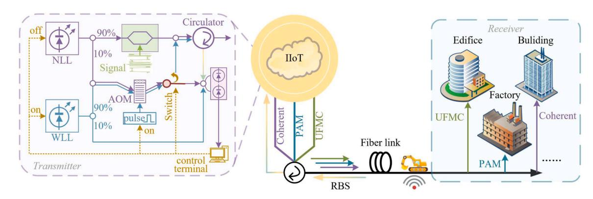

Fig. 1. Illustration of the multi-service ISAC for IIoT application scenario and principles.

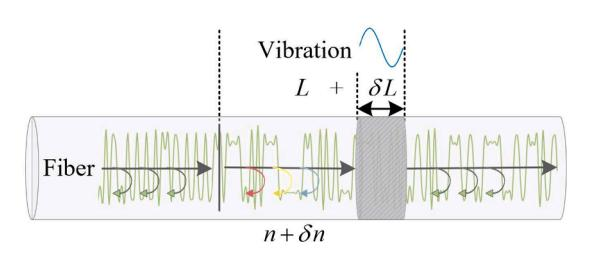

Fig. 2. Diagram of strain induced fiber behavior change.

$$\Delta \varphi \approx \frac{4\pi}{\lambda} (n\delta L + \delta nL)$$

$$= \frac{4\pi}{\lambda} \left( n + \frac{\delta n}{V} \right) VL$$

$$= \frac{4\pi}{\lambda} (n + C_{\varepsilon}) VL,$$
(3)

where,  $C_{\ell} = \delta_n/V$  is refractive index strain coefficient. Since the vibration position is determined by the PZT with a sinusoidal variation in the amount of tension,  $\delta_L$  can be represented as,

$$\delta L = U \frac{\delta L_{\text{max}}}{U_{\text{max}}} \sin \left( 2\pi f_p t \right) \tag{4}$$

where, U,  $U_{\rm max}$ , and  $f_P$  are the voltage, maximum tolerable voltage, and frequency of the sinusoidal signal applied on the PZT, respectively.  $\delta L_{max}$  is the maximum fiber variation corresponded to  $U_{\rm max}$ . Therefore, the RBS light frequency f can be given by,

$$f = \frac{w}{2\pi} = \frac{1}{2\pi} \frac{d\varphi(t)}{dt}$$

$$= \frac{1}{2\pi} \frac{d(2\pi f_c t + \Delta \varphi + \varphi_s)}{dt}$$

$$= f_c + \frac{d\frac{2}{\lambda}(n + C_e)VL}{dt}$$

$$= f_c + \frac{2}{\lambda}(n + C_e) \frac{d\delta L}{dt}$$

$$= f_c + \frac{4\pi}{\lambda} U \frac{\delta L_{\text{max}}}{U_{\text{max}}} f_p(n + C_e) \cos\left(2\pi f_p t\right).$$
(5)

The range D of RBS frequency shift is defined as,

$$D = \frac{4\pi}{\lambda} U \frac{\delta L_{\text{max}}}{U_{\text{max}}} f_p(n + C_{\varepsilon})$$
 (6)

which is proportional to the PZT voltage U and the vibration frequency  $f_P$ .

Then, the RBS signal with the vibration can be expressed as,

$$E_{bs}(t) = E_s(t)\cos\left[2\pi f_c t + \frac{D}{f_p}\sin\left(2\pi f_p t\right) + \varphi_s\right]$$
 (7)

The local light can be written as,

$$E_L(t) = E_0(t)\cos(2\pi f_L t + \varphi_L) \tag{8}$$

where,  $E_0(t)$ ,  $f_L$ , and  $\varphi_L(t)$  are the amplitude, frequency, and initial phase of the local light, respectively.  $f_c = f_L - \Delta f$ , where  $\Delta f$  is the acoustic frequency of AOM.

The intensity *I* of output signal at the detector is,

$$I = [E_{bs}(t) + E_{L}(t)]^{2}$$

$$= [E_{s}^{2}(t) + E_{0}^{2}(t)]$$

$$+ \frac{1}{2}E_{s}^{2}(t)\cos\left[4\pi(f_{L} - \Delta f)t + 2\frac{D}{f_{p}}\sin(2\pi f_{p}t) + 2\varphi_{s}\right]$$

$$+ \frac{1}{2}E_{0}^{2}(t)\cos[4\pi f_{L}t + 2\varphi_{L}]$$

$$+ E_{s}(t)E_{0}(t)\cos\left[2\pi(2f_{L} - \Delta f)t + \frac{D}{f_{p}}\sin(2\pi f_{p}t) + \varphi_{s} + \varphi_{L}\right]$$

$$+ E_{s}(t)E_{0}(t)\cos\left[2\pi\Delta f t - \frac{D}{f_{p}}\sin(2\pi f_{p}t) - \varphi_{s} + \varphi_{L}\right],$$
(9)

where, five distinct components are present. The first component is the direct current component. The subsequent three, namely the second, third, and fourth terms, involves high-frequency components that cannot be detected due to the bandwidth and sensitivity limitations of the BPD. The final term, conversely, represents the beat frequency signal. Thus, the output power of the BPD can be evaluated by,

$$P_{BPD} \propto E_s(t) E_0(t) \cos \left[ 2\pi \Delta f t - \frac{D}{f_p} \sin \left( 2\pi f_p t \right) - \varphi_s + \varphi_L \right]. \tag{10}$$

Therefore, the spectrum signal of the received signal can be written as:

$$f_{BPD} = \frac{1}{2\pi} \frac{d\varphi}{dt} = \Delta f - D\cos(2\pi f_p t). \tag{11}$$

As shown above, the spectrum of the received signal undergoes a periodic frequency shift near the beat frequency, identical to the frequency loaded onto the PZT. Furthermore, the range D of RBS frequency shift is proportional to the PZT voltage and frequency. The traditional phase-sensitive optical time-domain reflectometer ( $\varphi$ -OTDR) system uses pulse light to detect vibration. Each pulse light can only return one vibration point information, and therefore the sampling rate at the vibration point is equal to the pulse frequency. Consequently, the maximum frequency response of system is dependent on the pulse frequency. To avoid interference from the simultaneous detection of two

pulses in the optical fiber link, the next detection pulse is only emitted after the RBS light from the current detection pulse has fully returned to the sensing receiver. The frequency of the probe pulse is determined by the length of the fiber link. Therefore, in traditional sensing methods, the length of the fiber link essentially determines its response frequency. Usually, the frequency response of DAS is several kHz and decreases with the increase of the fiber length. In this work, the continuous wave light is used to probe the RBS frequency shift continuously, therefore, the precision can be enhanced by reducing the sampling period *T* of time-domain sensing signal. This work employs continuous-wave optical detection to monitor RBS frequency shifts. By reducing the sampling period *T* of time-domain RBS sensing signals, the system can achieve enhanced measurement precision. Consequently, the maximum frequency response is no longer constrained by the pulse repetition rate.

#### **3. Experimental setup and data transmission**

## *3.1. Experimental setup*

The experimental setup of the proposed ISAC system is illustrated in Fig. 3(a). In the absence of disturbances, the NLL with a linewidth *<*1 kHz, a wavelength of 1550 nm and a power of 15 dBm, is used as the optical signal source. In the signal transmission section, the NLL light in the upper branch (90 %) is modulated by signals, where three types of signals are used in the experiment to illustrate the general applicability of the system. According to different data requirements, different types of modulation signals are transmitted. The symbol rate of PAM-4 signals and UFMC signals are both 25 GBaud. The number of UFMC sub-bands, subcarriers per sub-band and FFT points are set to 18, 16 and 512, respectively, where 16-QAM signal is used. The arbitrary waveform generator (AWG) with a sampling rate of 50 GSa/s is used for digital-toanalog conversion (DAC). Following the Mach-Zehnder modulator (MZM), the signal traverses a circulator to be transmitted across a 12-km SSMF, wherein a PZT is embedded at the 10-km position to induce dynamic strains. At the remote intensity modulation and direct detection (IM/DD) receiver, a variable optical attenuator (VOA) is utilized to adjust the received power, which is subsequently fed into a photodiode (PD) for conversion from photonic to electric signals. The mixed signal oscilloscope (MSO) samples these analog signals into their digital

counterparts and forwards them to the digital signal processing (DSP) module. The system is also compatible with coherent transmission signals. The NLL in the upper branch with 90 % power is modulated to 20- GBaud PDM coherent 16-QAM signal. The AWG with a sampling rate of 64 GSa/s is used for DAC. The signal traverses a circulator to be transmitted across a 12-km SSMF. At the coherent receiver, a VOA is utilized to adjust the received power, which is subsequently fed into a polarization controller (PC) to ensure the polarization alignment of the coherent signal. Another NLL with linewidth of *<*1 kHz is used as the local light. After detected by an integrated coherent receiver, the received signal is digitized by a four-channel MSO with a sample rate of 50 GSa/s per channel. In the remote DSP module, conventional DSP algorithms are used to demodulate the 16-QAM signal. More detailed physical parameters of the optical transmission scheme are listed in Table 1.

In the sensing section, continuous wave lights are injected into the fiber link via the circulator, thereby stimulating RBS light signals along the fiber path. These RBS light signals, mixed with NLL light frequency shifted 200 MHz by an AOM in the low branch with 10 % power, are received by the circulator's backward end. The BPD with 1.6-GHz bandwidth receives the mixed light, which is then sampled by MSO with a sample rate of 625 MSa/s. The control terminal determines the occurrence of vibration events in the channel by detecting whether the frequency of the RBS signal spectrum is shifted. When there is no vibration event, the spectrum of RBS light remains constant, as shown in

**Table 1**  Physical parameters of the optical transmission scheme.

| Parameter                               | Value                |            |
|-----------------------------------------|----------------------|------------|
| Center wavelength                       | 1550.061 nm (C-band) |            |
| Laser linewidth                         | <1 kHz               |            |
| Fiber attenuation factor                | 0.183 dB/km          |            |
| Analog-to-digital conversion resolution | 14 bits              |            |
| Modulation                              | PAM, UFMC,           | PDM 16-QAM |
| Baud rate                               | 25 GBaud             | 20 GBaud   |
| Optical power of signal                 | 5.5 dBm              |            |
| UFMC frame size                         | 512                  |            |
| Number of UFMC data subcarrier          | 288                  |            |
| Fiber length                            | 12 km                |            |

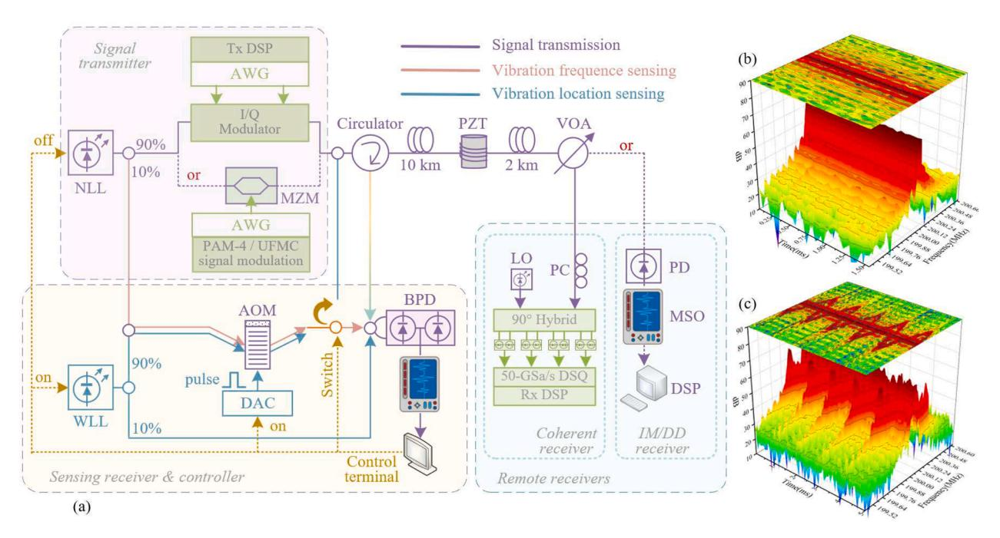

**Fig. 3.** (a) Experimental setup of multi-service ISAC system, (b) RBS signal spectrum in the scenario without vibration, (c) with vibration.

## [Fig. 3\(](#page-3-0)b).

When the vibration occurs along the fiber, the control terminal detects a shift in the RBS light spectrum, which is the RBS frequency shift, as shown in [Fig. 3\(](#page-3-0)c). At this moment, the control terminal sends a shutdown signal to the NLL and activation signals to the WLL, DAC, and switch. The transmission signal is no longer sent to the channel. A WLL with a linewidth of about 150 MHz, a wavelength of 1550 nm and a power of 13.72 dBm, is used as the optical source. The AOM switches from the continuous wave signal to the pulse signal, which enter the fiber through the circulator for vibration location detection. The RBS light is mixed with 10 % of the WLL light and received by the BPD. The sensing signal is then demodulated at the control terminal to extract the vibration location information.

#### *3.2. Measurement of transmission performance*

To verify the transmission performance and versatility of the system, experiments are conducted on three commonly employed communication signals over a 12-km SSMF link, as shown in Fig. 4. Notably, both the PAM-4 and 16-QAM UFMC signals have a rate of 25 GBaud. As shown by circle-marked and square-marked curves in Fig. 4, the biterror-rates (BER) reach forward error correction (FEC) threshold of 3.8 × 10–3 at received optical powers of − 18 dBm and − 17 dBm, respectively. The coherent 20-GBaud PDM 16-QAM signal reaches the FEC threshold at received optical power of about − 28 dBm, as shown by cross-sign-marked curve in Fig. 4. Insets in Fig. 4 are the constellation diagrams of 16-QAM UFMC signal and the PDM coherent 16-QAM signal, and eye diagram of PAM-4 signal, respectively, which are clearly distinguishable below the FEC threshold. Experimental results demonstrate that 25-GBaud PAM-4 signals, 25-GBaud 16-QAM UFMC signals, and 20-GBaud coherent PDM 16-QAM signals have been successfully transmitted over 12-km SSMF. Since the transmitters in the optical fiber communication system are independent on the fiber sensing part, the transmission performance of signals is unaffected by the fiber sensing processes.

#### *3.3. Measurement of vibration frequency*

Prior to a vibration event detected by the control terminal, the signal is launched into the optical fiber by the optical circulator. After that, the RBS light is excited at every position along the fiber link. In areas without vibration, the beat frequency extracted by the BPD between the RBS light and the local light remains constant, as shown in [Fig. 3\(](#page-3-0)b).

However, in the location with vibration, the fiber is compressed or

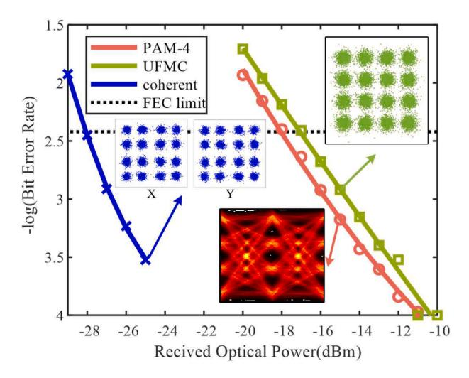

**Fig. 4.** Measured BER curves of PAM-4, 16-QAM UFMC, and coherent 16- QAM signals.

stretched, resulting in a change in its refractive index, which in turn affects the frequency of the RBS light. The vibration point can be regarded as a signal source, transmitting a continually varying frequency signal to the sensing receiver by the optical circulator. At the sensing receiver, the RBS light is mixed with the local optical oscillator with the frequency-shifted by the AOM. Due to the bandwidth limitations of the BPD, the beat signal with a center frequency corresponding to the AOM acoustic frequency of 200 MHz is obtained, where the vibration signal experiences frequency shifts around the center frequency, as illustrated in Fig. 5. Fig. 5(a) presents the two-dimensional demodulated RBS time-frequency diagram, while Fig. 5(b) depicts the three-dimensional counterpart. The graph clearly indicates that the SNR of RBS frequency shift reaches 28 dB, demonstrating a robust signal dominance. In subsequent sections, the two-dimensional spectrum-time diagrams have adopted a two-color mapping to further highlight the RBS frequency shift characteristics. [Fig. 6](#page-5-0)(a) shows the demodulated RBS sensing at each sampling period *T* with different PZT vibration frequencies while transmitting PAM signals, where the PZT voltage *U, Umax*, and δ*Lmax* are 30 V, 150 V, and 173.952 μm, respectively, and refractive index strain coefficient *Cε* is − 0.1649 /με [[21\]](#page-9-0). The

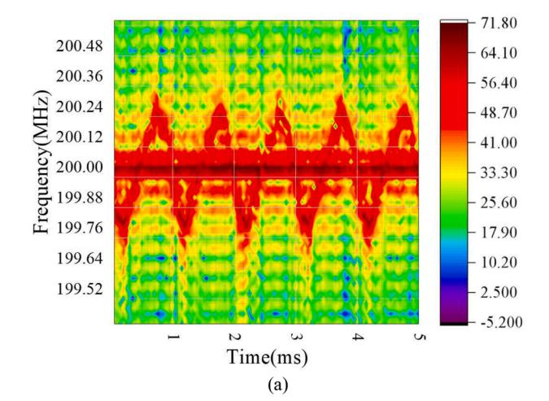

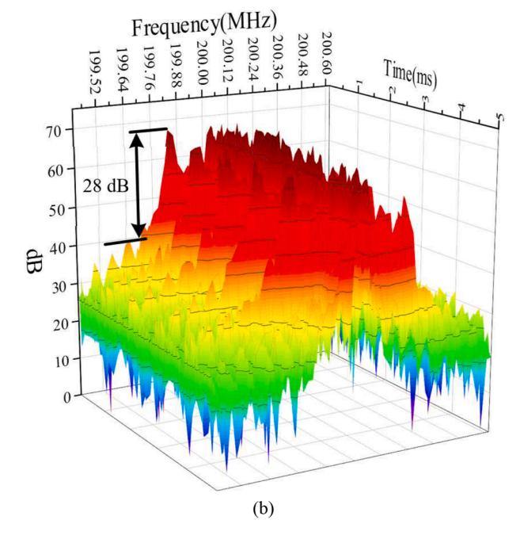

**Fig. 5.** Demodulated RBS time-frequency diagram in the scenario with vibration (a) two-dimensional signal diagram, (b) three-dimensional mapping signal diagram.

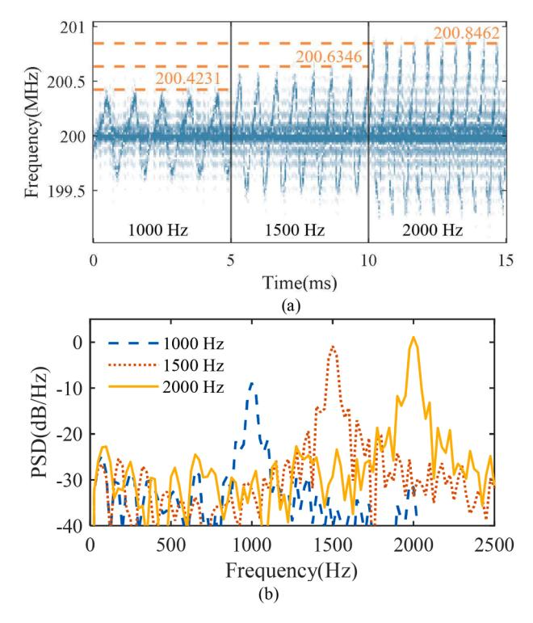

**Fig. 6.** Transmission of PAM-4 signals, (a) time-frequency diagram of the demodulated sensing signal at different PZT vibration frequencies, (b) PSD for different vibration frequencies with PZT voltage of 30 V.

peak-to-peak strain varies linearly with the PZT voltage, which is 4.639  $\mu\epsilon$  with 30-V PZT voltage. The frequencies of PZT are set to 1000 Hz, 1500 Hz, and 2000 Hz, respectively. The PZT voltage is fixed to 30 V. With the increase of the PZT vibration frequency, the range D of RBS frequency shift in the sensing signal increases. Then, we calculate the theoretical maximum range D of RBS frequency shift given in (6), represented by the dashed orange line in Fig. 6(a). The theoretical values align is observed closely with the experimental results. Fig. 6(b) depicts the power spectral density (PSD) for different vibration frequencies when PAM-4 signals are transmitted with a PZT voltage of 30 V, and the SNR of vibration frequency identification is approximately 20 dB.

Fig. 7(a) presents the demodulated sensing signal with different PZT voltages while transmitting UFMC signals, with the 1000-Hz PZT vibration frequency, and PZT voltages of 20 V, 30 V, and 40 V, respectively. The PZT vibration frequency keep constant, and with the increase of the PZT voltage, the RBS frequency shift of the sensing signal increases. Then, we calculate the theoretical maximum range *D* of RBS frequency shift given in (6), represented by the dashed orange line, and observed that the theoretical values align closely with the experimental results. The theoretical and experimentally measured values are compatible well. Fig. 7(b) measures the PSD for different voltages when transmitting UFMC signals with a PZT vibration frequency of 1000 Hz, yielding approximately 20-dB SNR of vibration frequency identification.

Fig. 8 illustrates the measured vibration frequency sensing when transmitting coherent 16-QAM signals. Fig. 8(a) shows the demodulated sensing signal with different PZT vibration frequencies. The frequencies of PZT are set to 1000 Hz, 1500 Hz, and 2000 Hz, respectively. The PZT voltage is set to 30 V, and with the increase of the PZT vibration frequency, the RBS frequency shift of the sensing signal increase. Fig. 8(b) presents the demodulated sensing signal spectra with different PZT voltages of 20 V, 30 V, and 40 V, respectively. The PZT vibration frequency remains 1000 Hz, and with the increase of the PZT voltage, the RBS frequency shift of the sensing signal increases. Then, we calculate the theoretical maximum range *D* of RBS frequency shift given in (6), represented by the dashed orange line in Fig. 8(a) and (b), and observe

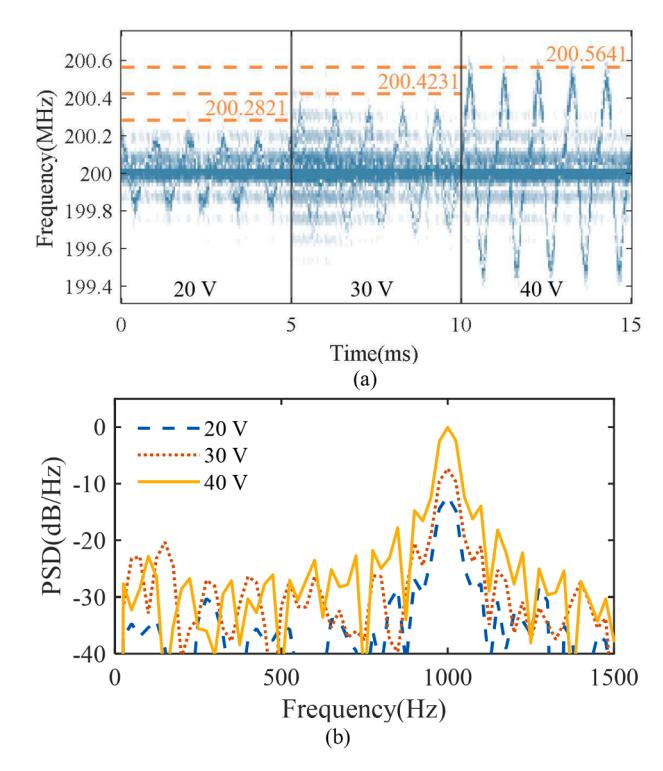

**Fig. 7.** Transmission of 16-QAM UFMC signals, (a) demodulated sensing signal time-frequency diagram at different PZT voltages, (b) PSD for different vibration frequencies with PZT vibration frequency of 1000 Hz.

that the theoretical values align closely with the experimental results. Fig. 8(c) depicts the PSD with different voltages and frequencies while transmitting coherent 16-QAM signals, achieving approximately 15-dB SNR of vibration frequency identification.

In traditional  $\varphi$ -OTDRs, the probing signal consists of periodic pulses. These pulse signals scan along the optical fiber, and the RBS corresponds to each position within the fiber. Consequently, the information about the vibration point's position can only be acquired once per pulse cycle, implying that the sampling rate is equivalent to the pulse frequency. Additionally, the maximum frequency response of traditional  $\varphi$ -OTDR is limited to half of the maximum pulse frequency. Traditional impulse detection sensing methods significantly limit the system's response and demodulation of high-frequency vibration signals. In this work, however, the probing signal is a continuous wave signal, each position within the optical fiber is continuously illuminated, and the RBS is continuously stimulated at every instant from the vibration point. The method allows for continuous acquisition of the signal from the vibration point, the maximum response frequency  $f_{resp}$  is given by,

$$f_{resp} = \frac{1}{2} \frac{1}{T} = \frac{1}{2} \frac{f_s}{N},\tag{12}$$

where,  $f_s$  is the sampling rate of MSO, which is set to 625 MSa/s in the experiment, and N is the number of sampling points,  $N = f_s \times T$ . According to (12), the maximum response frequency  $f_{resp}$  is limited by the sampling period T.

As shown in Fig. 9(a), with T of 0.1 ms, the time-frequency diagram becomes blurred due to the excessive length of T. In contrast, Fig. 9(b) illustrates the case with a T of 0.05 ms. The red box indicates that within the same sampling time of 0.2 ms, there are only two sampling points when T is 0.1 ms, while there are four sampling points when T is 0.05. This enhances the signal time resolution and allows for a clear observation of the vibration waveform. In the signal time-frequency diagram, maximum frequency response  $f_{resp}$  and time resolution can be improved by reducing the sampling period T of time-domain sensing signal. A

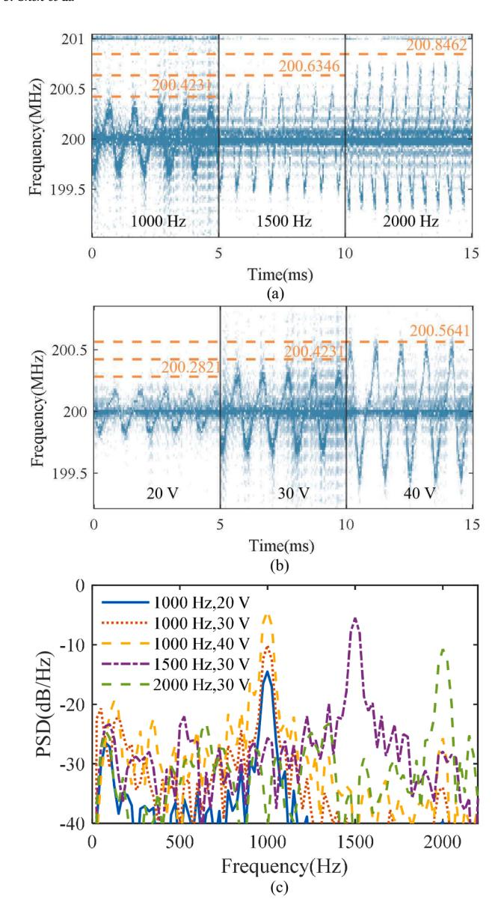

**Fig. 8.** Transmission of coherent 16-QAM signals, (a) demodulated sensing signal time-frequency diagram at different PZT vibration frequencies, (b) demodulated sensing signal time-frequency diagram at different PZT voltages, (c) PSD for different vibration frequencies and voltages.

pulse with the frequency of 20 kHz corresponding to a 0.05 ms can only detect a 5-km optical fiber in traditional  $\varphi$ -OTDRs.

As RBS light is generated by continuous wave excitation, it remains stable throughout except at vibration points where RBS frequency shift occurs. With a given sampling rate, a reduced sampling period T leads that fewer sampling points N are collected. Ideally, the minimum of spectrum resolution  $f_{\Delta}$  can be represented as,

$$f_{\Delta} = \frac{1}{T} = \frac{f_s}{N} \le \frac{1}{2}D = 7.05 \times U \times f_P,$$
 (13)

According to (12) and (13), the maximum response frequency  $f_{resp}$  is rewritten by,

$$f_{resp} = \frac{1}{2} \frac{1}{T} \le \frac{1}{4} D = 3.52 \times U \times f_P.$$
 (14)

To guarantee the frequency response  $f_{resp}$  dominates the PZT vibration frequency  $f_P$ , the PZT voltage U must be greater than 0.28 V.

Nevertheless, distributed phase noise, laser phase noise, shot noise,

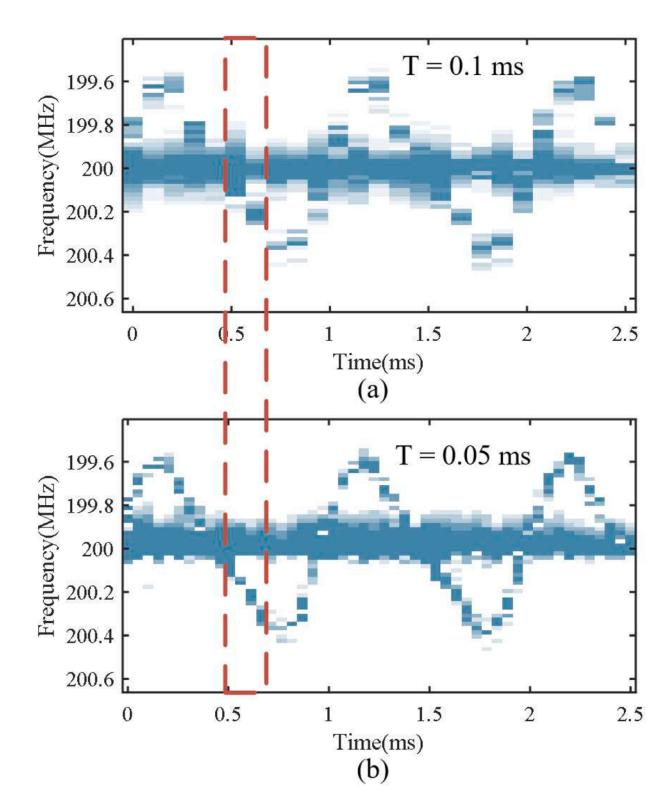

**Fig. 9.** Signal time-frequency diagrams with different sampling periods of (a) 0.1 ms, (b) 0.05 ms.

and fiber dispersion effects cause persistent peaks near the beat frequency, in the received RBS time-frequency diagram, which could impact frequency demodulation. Thus, the minimum range D of RBS frequency shift should satisfy,

$$D = 14.1 \times U \times f_p \ge f_{noise}, \tag{15}$$

where,  $f_{\text{noise}}$  is the noise near the beat frequency, about 0.03 MHz. For instance, at a vibration frequency  $f_P$  of 1 kHz, PZT voltage U above 2.13 V is required for detection.

Therefore, its demodulation accuracy is theoretically limited only by the sampling period T. The system's maximum frequency response  $f_{resp}$  can be improved by reducing the sampling period T. Alternatively, a higher sampling rate  $f_s$  with the same number of sampling points N can also extend the system's maximum frequency response  $f_{resp}$ . As a result, the maximum frequency response is no longer constrained by the probing pulse frequency, fundamentally overcoming the limitation in the conventional ISAC schemes.

#### 3.4. Measurement of vibration location

Since the vibration position is essentially detected in the time domain by pulse signals, its spatial resolution  $\Delta z$  can theoretically be expressed as:

$$\Delta z = \frac{d_{pulse}}{2} = \frac{cT_{pulse}}{2n} \tag{16}$$

where,  $d_{pulse}$  is the width of pulse, c is the velocity of light,  $T_{pulse}$  is the pulse duration, and n is the refractive index of the optical fiber. A 10-ns pulse width typically provides 1-m spatial resolution.

Once the vibration is detected at the control terminal, the optical source is switched from the NLL to the WLL. Then, a probing pulse with the width of 30 ns and the repetition rate  $f_{pulse}$  of 8 kHz is generated by the AOM to locate the fiber vibration position. The PZT is embedded at the 10-km position and driven to simulate vibration. By calculating the

root-mean-square (RMS) value, the RBS signal of probing pulses is mapped along the fiber, as shown in Fig. 10. A distinct peak is observed in Fig. 10, marking the vibration location, with a rising-edge spatial resolution of 2.4 m and a peak width of 4.9 m. This closely matches the theoretical prediction.

Fig. 11 illustrates the SNR of the vibration signal under different pulse widths, PZT voltages, and vibration frequencies. It is evident that the PZT voltage magnitude and vibration frequency have a minimal impact on the SNR. However, as the pulse width decreases, the SNR increases. Therefore, the SNR is dependent on the ratio between the local optical oscillator and the RBS light. A larger ratio results in a higher SNR. When the pulse width decreases, the total optical power diminishes, and the power of the stimulated RBS also declines accordingly. When the local optical power remains constant, the ratio between the local optical oscillator and the RBS light increases, thereby the SNR increases.

In other work, the proposed architecture was successfully implemented in an embedded system, achieving efficient data acquisition within 4 ms over a 12-km fiber link while demonstrating nanosecondscale response times for both AOM and BPD. The system maintained stable operation with the embedded processor running at 480 MHz, consistently completing the full sensing-to-positioning workflow within 5 ms, significantly outperforming the 100-ms latency requirement for IIoT applications.

### **4. Discussion**

# *4.1. Analysis of nonlinearity*

The NLL output power of 15 dBm is attenuated to approximately 5.5 dBm upon entering the fiber due to insertion losses in patch cords and MZM. As illustrated in Fig. 12(a) the stimulated Brillouin scattering (SBS) threshold for the 12-km SSMF is approximately 7 dBm. As the spectra of RBS light shown in Fig. 12(b), at an elevated input power of 13 dBm (significantly exceeding the SBS threshold), SBS dominates the emission spectrum. However, when reducing the power to the optimal 5.5 dBm, we observe that a measured RBS power of − 27 dBm, representing over 10 dB suppression compared to − 40-dBm optical power of Brillouin scattering. Maintaining the input optical power at 5.5 dBm, below SBS threshold, effectively mitigates excessive nonlinear effects throughout the 12-km transmission span. Moreover, as the input power decreases, the Brillouin scattering in the backscattered light also decreases. These measurements confirm minimal impact of nonlinearity on signal integrity.

Furthermore, the Brillouin scattering frequency shift (typically 10–20 GHz) falls completely outside the 1.6 GHz bandwidth of our balanced photodetector (BPD) when mixed with the local oscillator. This spectral separation ensures the BPD cannot detect Brillouin components,

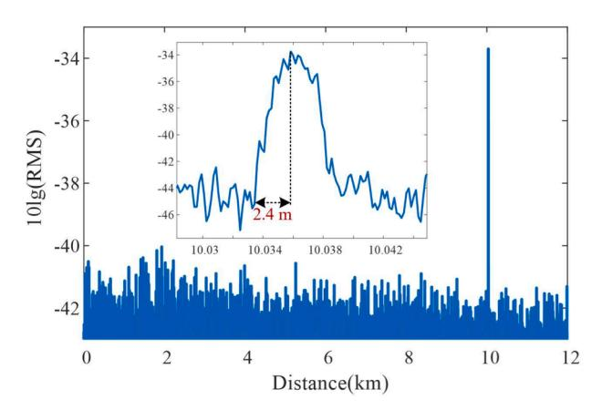

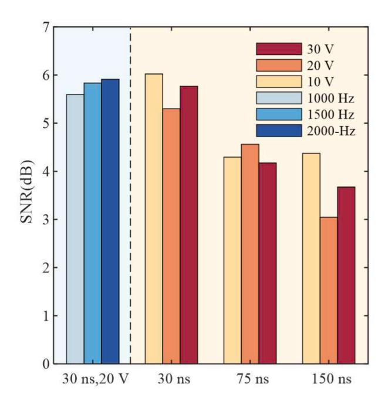

**Fig. 11.** Measured SNR of vibration signal at different pulse widths, voltages, and vibration frequencies.

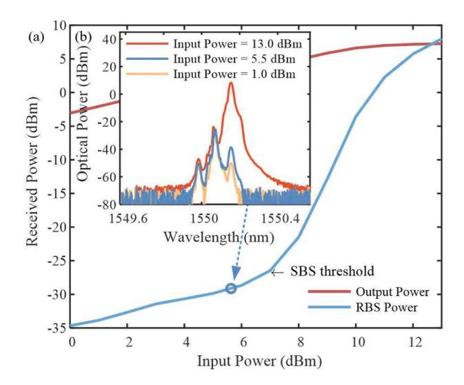

**Fig. 12.** (a) Measured transmitted optical power and RBS power; (b) Measured optical spectra of received RBS light.

maintaining sufficiently low nonlinear impairment levels to preserve signal integrity throughout demodulation.

# *4.2. The effect of different modulation formats on RBS light*

[Fig. 5](#page-4-0)(b) depicts the three-dimensional time-frequency diagram of RBS signal during PAM transmission. [Figs. 13 and 14](#page-8-0) display the RBS spectra under UFMC and PDM 16-QAM coherent transmission, respectively. The PAM signal demonstrates superior performance with the highest 28-dB SNR of RBS frequency shift, as shown in [Fig. 5.](#page-4-0) While coherent signals exhibit a 20-dB SNR, as shown in [Fig. 14.](#page-8-0) The observed SNR degradation in PDM 16-QAM coherent transmission primarily stems from polarization-dependent effects. Unlike IM/DD signals, PDM 16-QAM coherent signal introduces dual orthogonal polarizations. The polarization multiplexing may lead to incomplete polarization align-**Fig. 10.** Measured RMS for vibration location's detection. ment during heterodyne detection, consequently reducing the effective

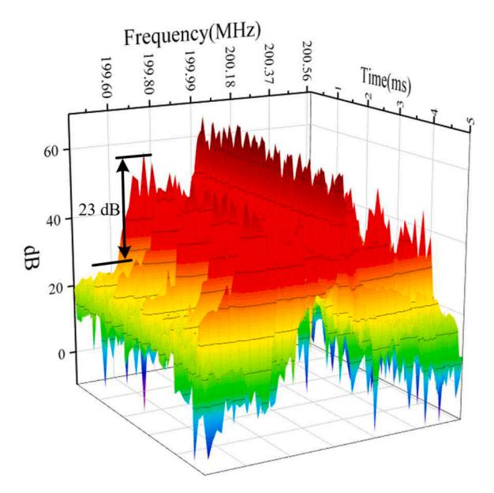

**Fig. 13.** Time-frequency diagram of RBS signal during UFMC transmission.

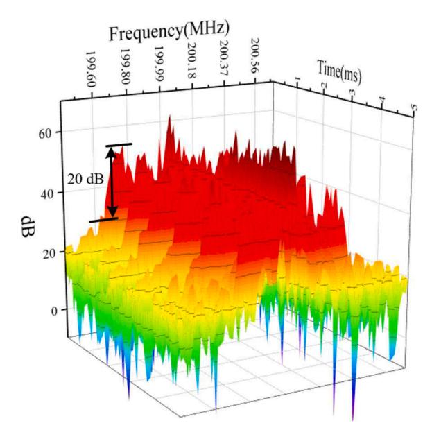

**Fig. 14.** Time-frequency diagram of RBS signal during PDM 16-QAM coherent transmission.

SNR after optoelectronic conversion. The comparative analysis reveals that the proposed method successfully maintains high SNR levels across different transmission signals.

# **5. Conclusions**

IIoT achieves comprehensive connectivity among people, machines, objects, systems, etc., building a brand-new manufacturing and service system within the entire industrial chain and value chain. It provides a pathway for the digital, networked, and intelligent development of industry and beyond, and servers as an important cornerstone of the Fourth Industrial Revolution. Some IIoT devices require quick, minimal data transmission, while others need extensive data handling and multiple responses. Thus, it is essential for IIoT's efficiency and automation to optimize data transmission and resource allocation across layers. Various service terminals' data rates and latency demands necessitate

supporting diverse modulation formats, each performing uniquely at different speeds. Hence, its demand for sensory communication is mainly reflected in the efficient, reliable and intelligent data collection and transmission. In this work, we propose and experimentally demonstrate a multi-service ISAC architecture that is compatible with various types of transmission signals in the same wavelength channel. The sensing section of ISAC architecture consists of a novel vibrationdemodulation method based on continuous transmission signals and an economical, low-complexity approach for fiber vibration localization. Without additional complexity to user-end equipment, the proposed method also extends the sampling rate of vibration signal, theoretically decoupling the system's frequency response from the pulse frequency limitations. Additionally, as the sensing section does not interfere with the communication segment, the quality of signal transmission remains unaffected. Experimental results demonstrate that 25- GBaud PAM-4 signals, 25-GBaud 16-QAM UFMC signals, and 20- GBaud PDM 16-QAM coherent signals have been successfully transmitted over 12-km SSMF, achieving a spatial resolution of 2.4 m, a 28-dB SNR of RBS frequency shift, and a 20-dB SNR of vibration frequency identification. The proposed method offers superior advantages including enhanced modulation format flexibility, reduced implementation complexity, lower hardware costs, and improved overall system performance. These collective advantages position the proposed scheme as a more practical and high-performance alternative for emerging ISAC applications.

## **Funding**

This work was supported in part by the National Natural Science Foundation of China Project under Grant 62075147 and the Suzhou Industry Technological Innovation Project under Grant SYG202348.

## **CRediT authorship contribution statement**

**Jiajia Shen:** Writing – original draft, Visualization, Validation, Software, Formal analysis, Data curation, Conceptualization. **Jiamin Fan:** Visualization, Validation. **Meixia Li:** Visualization, Validation. **Yang Fei:** Visualization, Validation. **Tingyu Fu:** Visualization, Validation. **Mingyi Gao:** Writing – review & editing, Validation, Supervision, Project administration, Funding acquisition, Conceptualization.

## **Declaration of competing interest**

The authors declare that they have no known competing financial interests or personal relationships that could have appeared to influence the work reported in this paper.

## **Data availability**

The authors do not have permission to share data.

# **References**

- [1] Mishra N, Islam SK, Zeadally S. A survey on security and cryptographic perspective of Industrial-Internet-of-Things. IEEE Internet Things J 2024;25:101037. [https://](https://doi.org/10.1016/j.iot.2023.101037)  [doi.org/10.1016/j.iot.2023.101037](https://doi.org/10.1016/j.iot.2023.101037).
- [2] Jiang D, Wang Z, Wang Y, Tan L, Wang J, Zhang P. A blockchain-reinforced federated intrusion detection architecture for IIoT. IEEE Internet Things J 2024;11 (16):26793–805. <https://doi.org/10.1109/JIOT.2024.3406602>.
- [3] Ding J, Liu T, Xu T, Hu W, Popov S, Leeson MS. Intra-channel nonlinearity mitigation in optical Fiber transmission systems using perturbation-based neural network. J Lightwave Techno 2022;40(21):7106–16. [https://doi.org/10.1109/](https://doi.org/10.1109/JLT.2022.3200827)  [JLT.2022.3200827](https://doi.org/10.1109/JLT.2022.3200827).
- [4] Laghari AA, Wu K, Laghari RA, Ali M, Khan AA. A review and state of art of Internet of Things (IoT). Arch Computat Methods Eng 2022;29:5150. [https://doi.](https://doi.org/10.1007/s11831-023-09985-y)  [org/10.1007/s11831-023-09985-y.](https://doi.org/10.1007/s11831-023-09985-y)
- [5] Mukherjee A, Goswami P, Yang L, Tyagi SKS, Samal UC, Mohapatra SK. Deep neural network-based clustering technique for secure IIoT. Neural Comput Appl 2020;32:16109–17.<https://doi.org/10.1007/s00521-020-04763-4>.

- [6] Hao W, Ziyu Z, Futai H, Yuan M, Zeqi L, Fu Xing, Liu Q. Intelligent optoelectronic processor for orbital angular momentum spectrum measurement. PhotoniX 2023;4 (9):1–21. [https://doi.org/10.1186/s43074-022-00079-9.](https://doi.org/10.1186/s43074-022-00079-9)
- [7] Tongyang X, Zhongxiang W, Tianhua X, Gan Z. A low-cost multi-band waveform security framework in resource-constrained communications. IEEE Trans Wireless Commun 2024;23(8):9190–205. [https://doi.org/10.1109/TWC.2024.3360130.](https://doi.org/10.1109/TWC.2024.3360130)
- [8] Ma P, Liu K, Sun Z, Jiang J, Wang S, Xu T, Xu Z, Liu T. Distributed single fiber optic vibration sensing with high frequency response and multi-points accurate location. Opt Lasers Eng 2020;129:106060. [https://doi.org/10.1016/j.](https://doi.org/10.1016/j.optlaseng.2020.106060) [optlaseng.2020.106060](https://doi.org/10.1016/j.optlaseng.2020.106060).
- [9] Shao Y, Liu H, Peng P, Pang F, Yu G, Chen Z, Chen N, Wang T. Distributed vibration sensor with laser phase-noise immunity by phase-extraction φ-OTDR. Photonic Sens 2019;9(3):223–9. <https://doi.org/10.1007/s13320-019-0540-2>.
- [10] Li C, Liu Z, Zhuang Y, Zheng H, Zhu C, Hu W, Wang J, Ma L, Rao Y. Phase correction based SNR enhancement for distributed acoustic sensing with strong environmental background interference. Opt Lasers Eng 2023;168:107678. <https://doi.org/10.1016/j.optlaseng.2023.107678>.
- [11] Wu Y, Wang F, Deng T, Zhang J, Xia G, Wu Z. Long-range temperature sensing based on forward brillouin scattering in highly nonlinear fiber. Opt Laser Technol 2025;181:111619.<https://doi.org/10.1016/j.optlastec.2024.111619>.
- [12] Fan B, Li J, Cheng Z, Xue X, Zhang M. Realizing submeter spatial resolution for Raman distributed fiber-optic sensing using a chaotic asymmetric paired-pulse correlation-enhanced scheme. Photon *Re* 2024;12(10):2365–75. [https://doi.org/](https://doi.org/10.1364/PRJ.528799) [10.1364/PRJ.528799.](https://doi.org/10.1364/PRJ.528799)
- [13] Zhu B, Li Y, Westbrook P, Feder KS, Shi Z, Wang T, Digiovanni DJ. Distributed acoustic sensing over XGS-PON by using "coded" enhanced scattering fiber. ECOC 2024:1667–70. Mar 17. URL, [https://ieeexplore.ieee.org/document/10926642.](https://ieeexplore.ieee.org/document/10926642)
- [14] Hao Y, Na Q, Zhang D, Fan L, Zhang Q, Cheng C, Yue B, Wang J, Yang Y, Li J, Hu W, Li X. Integrated vibration sensing and self-homodyne coherent transmission

- using a 100 kHz linewidth telecom laser and weakly-coupled 7-core fiber. ECOC 2024:1655–8. Mar 17. URL, <https://ieeexplore.ieee.org/document/10926678>.
- [15] Wang J, He H, Yan Y, Lu L, Wang L, Zhao Z, Tam HY, Lau APT, Lu C. Dual comb enabled simultaneously multi-path sensing and communication over fiber access network. ECOC 2024:1651–4. Mar 17. URL, [https://ieeexplore.ieee.org/document](https://ieeexplore.ieee.org/document/10926681)  [/10926681.](https://ieeexplore.ieee.org/document/10926681)
- [16] Huang M, Salemi M, Chen Y, Zhao J, Xia T, Wellbrock GA, Huang YK, Milione G, Ip E, Ji P, Wang T, Aono Y. First field trial of distributed fiber optical sensing and high-speed communication over an operation telecom network. J Lightwave Techno 2020;38(1):75–81. <https://doi.org/10.1109/JLT.2019.2935422>.
- [17] Tang J, Li X, Cheng C, Fan L, Hao Y, Yue B, Li J, He Z, Yang Y, Hu W. Distributed vibration sensing and simultaneous self-homodyne transmission of single-carrier net 5.36-Tb/s signal using 7-core fiber. OFC 2024. URL, [https://ieeexplore.ieee.or](https://ieeexplore.ieee.org/document/10526803)  [g/document/10526803](https://ieeexplore.ieee.org/document/10526803).
- [18] Hu Z, Zhang M, Li Y, Chen J, Li W, Xiong Y, Zhao L, Zhao C, Tang M. Enabling endogenous distributed acoustic sensing in a digital subcarrier coherent transmission system with enhanced frequency response. Opt Lett 2024;49(11): 3166–9. <https://doi.org/10.1364/OL.524132>.
- [19] Huang Y, Ip E, Hu J, Huang M, Yaman F, Wang T, Wellbrock G, Xia T, Asahi K, Aon Y. Simultaneous sensing and communication in optical fibers. ECOC Switzerland 2022. URL, [https://ieeexplore.ieee.org/document/9979501.](https://ieeexplore.ieee.org/document/9979501)
- [20] He H, Jiang L, Pan Y, Yi A, Zou X, Pan W, Willner AE, Fan X, He Z, Yan L. Integrated sensing and communication in an optical fibre. Light Sci Appl 2023;12: 25. [https://doi.org/10.1038/s41377-022-01067-1.](https://doi.org/10.1038/s41377-022-01067-1)
- [21] Yan L. Effect of temperature and strain on fiber optic refractive index. ACTA Opt Sin 1997;17(12):1713–7. URL, [https://researching.cn/articles/OJa37f0060e6c](https://researching.cn/articles/OJa37f0060e6c598b9) [598b9](https://researching.cn/articles/OJa37f0060e6c598b9).