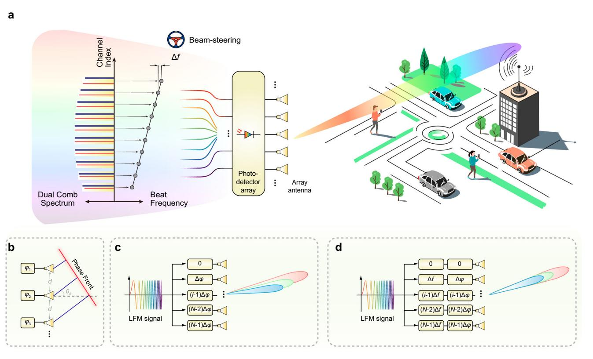
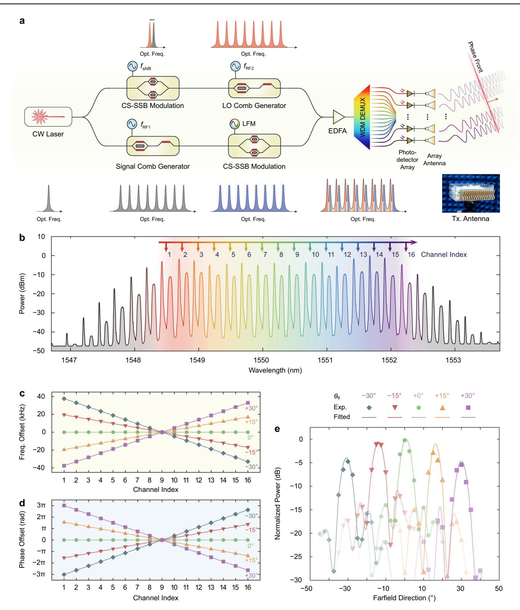
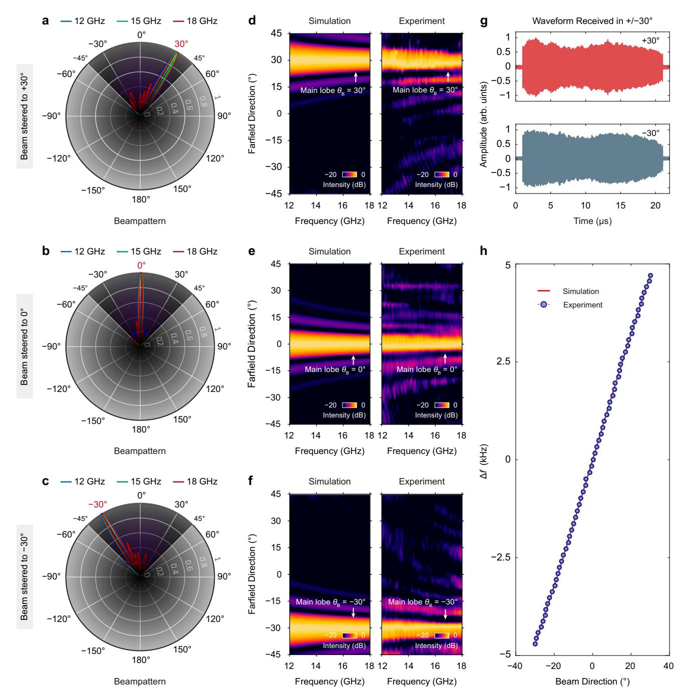
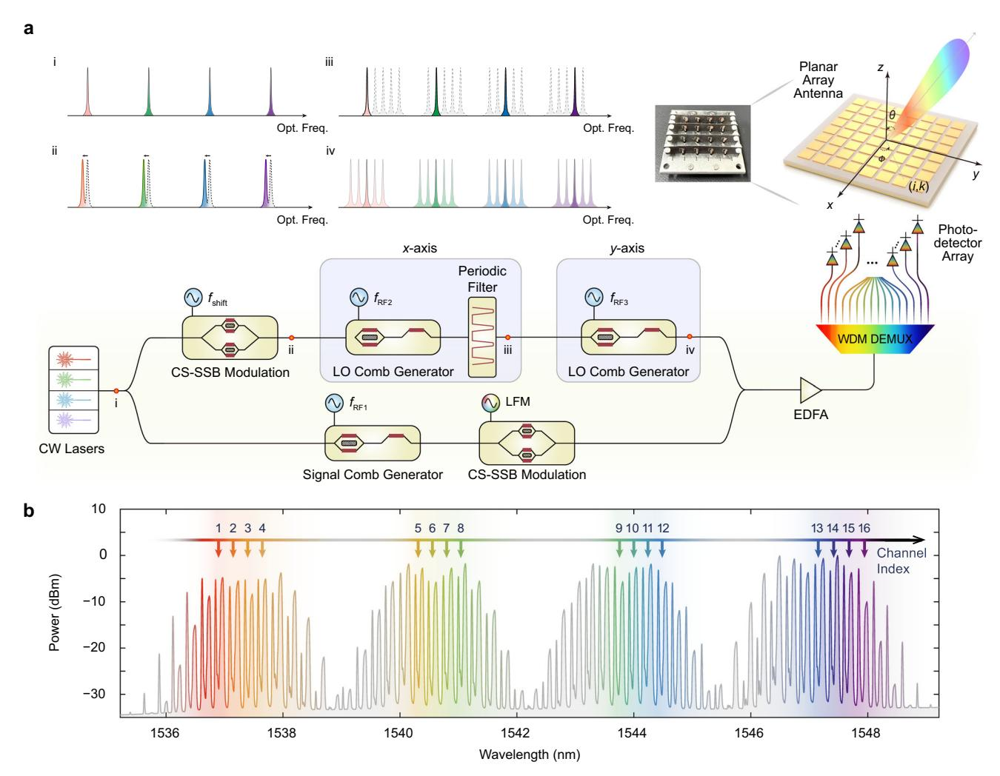
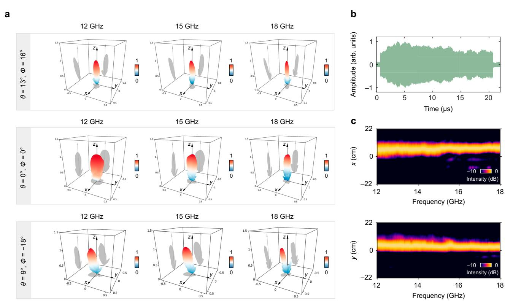
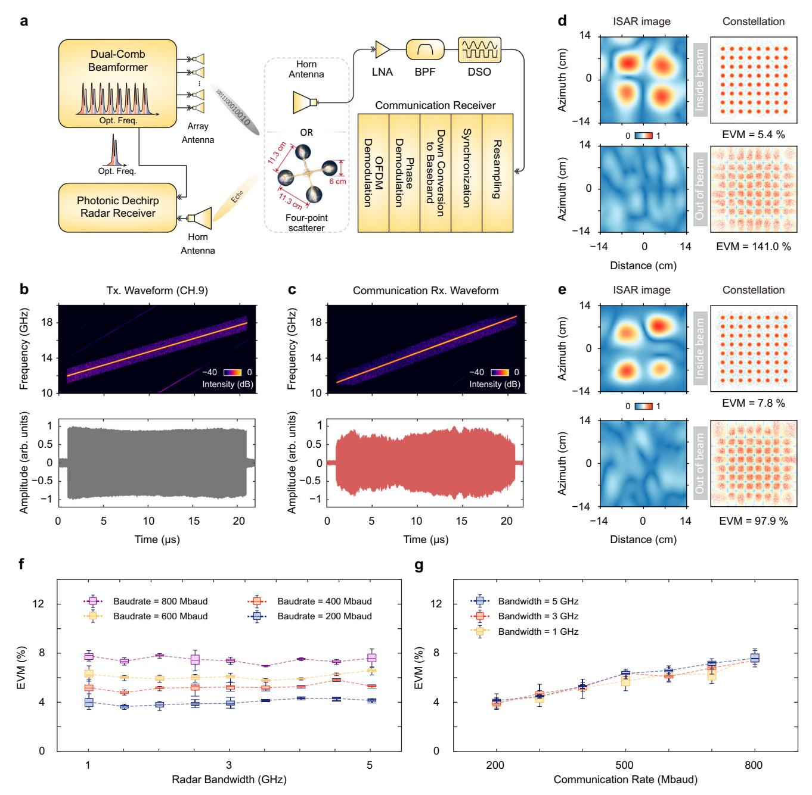

Article https://doi.org/10.1038/s41467-025-62854-z

# Frequency-comb-steered ultrawideband quasi-true-time-delay beamformer for integrated sensing and communication

Received: 19 January 2025

Accepted: 31 July 2025

Mian Wang, Wenxin Zhang, Zeyu Ren, Shangyuan Li, Xiaoping Zheng & Xiaoxiao Xue

Ultrawideband beamforming is essential for next-generation radar and communication systems, however, the instantaneous bandwidth of phase-shifterbased phased array antennas (PAAs) is limited by beam squint. Photonic truetime-delay (TTD) beamformers offer a potential solution, yet their practical deployment is hindered by complex delay-line architectures. Here, we report a frequency-comb-steered photonic quasi-TTD beamforming approach that eliminates delay lines by leveraging frequency-diverse arrays and photonic microwave mixing arrays. This enables squint-free beamforming and continuous beam steering for widely used linear frequency modulation (LFM) waveforms, effectively delivering infinite spatial resolution. We present 16 element linear and 4×4 planar PAA prototypes, achieving 6 GHz instantaneous bandwidth across the entire Ku-band. Furthermore, we demonstrate integrated sensing and communication capabilities, including inverse synthetic aperture radar imaging with 2.6 × 3.0 cm resolution and 4.8 Gbps wireless transmission. This work establishes a compact, robust, and scalable architecture for ultrawideband, large-scale photonic PAAs, paving the way for future integrated radar and communication systems.

Phased array antennas (PAAs) have fundamentally transformed the way people manipulate electromagnetic waves in free space and have played important roles in radar and communication applications. By controlling the phase of each antenna element, PAAs can generate flexible radiation patterns and steer the beam toward any specific directio[n1](#page-9-0) . Traditional PAA beamformers employ electronic phase shifters in each channe[l2](#page-9-0) . However, the well-known beam-squint issue that smears frequency components in space restricts the system to narrowband operations. The true-time-delay (TTD) technology can eliminate the beam squint by introducing time delays to the radiated signal[s3](#page-9-0) . With the ability to provide ultra-large instantaneous bandwidth, TTD beamformers show great potential for future highresolution radar sensing[4](#page-9-0) and high-capacity communications[5](#page-9-0) . However, the high-loss, long-wavelength-scale microwave transmission lines inherently lead to lossy electronic TTD beamformers. Alternatives that promise low loss, such as artificial transmission lines[5,6](#page-9-0) and switched filter[s7](#page-9-0) , frequently encounter challenges with inconsistent broadband delay and the complexities of achieving precise impedance matching.

Photonic TTD beamformers have emerged as compelling contenders in superseding their electronic counterparts, leveraging the exceptional intrinsic benefits of photonic delay lines. These advantages include low propagation loss, a broad and flat delay spectrum, and robust immunity to electromagnetic interference[8](#page-9-0)–[10](#page-9-0). One classic design of the photonic TTD beamformer is based on the programmable binary optical delay line, which utilizes a series of optical switches and waveguides to alter the optical path length[11](#page-9-0)–[13](#page-9-0). Photonic TTD beamformers built of optical fibers have long been investigated, but the system is bulky and not suitable for large-scale PAAs[14.](#page-9-0) Recent research has increasingly focused on demonstrating integrated

Department of Electronic Engineering, Beijing National Research Center for Information Science and Technology, Tsinghua University, Beijing, China. e-mail: [xuexx@mail.tsinghua.edu.cn](mailto:xuexx@mail.tsinghua.edu.cn)

photonic TTD beamformers. Novel delay structures have been proposed for enhanced delay range and fine delay control, such as multimode waveguides12, tunable Mach-Zehnder interferometers15,16, and slow-light devices17,18. Despite significant research endeavors, it is still particularly challenging for photonic TTD beamformers to support high-resolution and large-scale PAAs. As the number of antenna elements escalates alongside the need for greater resolution, the requisite number of optical switches and waveguides also surges, resulting in a marked increase in insertion loss and system complexity.

In this article, we introduce a novel frequency-comb-steered photonic quasi-TTD beamforming approach that eschews the need for delay lines, which substantially decreases complexity and enhances the scalability of the beamformer. The core concept is based on a photonically steered frequency diverse array, as depicted in Fig. 1(a). Traditionally, frequency-diverse arrays are designed to produce beampatterns that depend on both range and angle, which are limited to narrowband operations19,20. However, we demonstrate that by incorporating the well-known linear frequency modulation (LFM) and precisely controlling the frequency offsets between antenna channels, it is possible to achieve an elegant broadband quasi-TTD beamformer that boasts infinite angle resolution. Furthermore, we introduce a dualcomb heterodyne mixing scheme for massively parallel conversion of microwave frequencies21-24. Dual optical frequency combs, consisting of two sets of equally spaced discrete spectral lines, have emerged as pivotal bridges between the optical and microwave frequencies, with extensive applications in fields such as metrology and spectroscopy25. The dual comb mixing approach not only ensures an optimal linear frequency correlation across various antenna channels but also has the potential to support large-scale PAAs by exploiting a large number of comb lines. We present proof-of-concept frequency-comb-steered quasi-TTD beamformers with both one-dimensional (1D) and two-dimensional (2D) arrays. A 1×16 linear beamformer and a 4×4 planar beamformer are realized, demonstrating squint-free beamforming across the entire Ku band (12–18 GHz). By leveraging the ultra-large instantaneous bandwidth of 6 GHz, we have successfully demonstrated joint high-resolution inverse synthetic aperture radar (ISAR) imaging and high-speed communication with the linear quasi-TTD beamformer, achieving an imaging resolution of  $2.6\times3.0\,\mathrm{cm}$  and a communication data rate of  $4.8\,\mathrm{Gbps}$ .

#### **Results**

## Principle of frequency-comb-steered linear quasi-TTD beamformer

The generalized principle of a linear PAA is depicted in Fig. 1b. The electromagnetic field intensity reaches its peak at the phase front with a distance R and an angle  $\theta_B$ , provided that the following condition for constructive interference is met

$$\varphi_1(t - R/c) = \varphi_2(t - R/c - \tau_B) = \dots = \varphi_N[t - R/c - (N-1)\tau_B]$$
 (1)

Here,  $\varphi_i(t)$  with i=1,2,...,N represents the instantaneous phase of the field from the i-th antenna; c is the speed of light;  $\tau_B$  is the differential time delay between adjacent antennas, given by  $\tau_B = d \sin \theta_B/c$  where d is the antenna spacing. For beamforming of LFM signals with traditional phase-shifter-based PAAs, the instantaneous phase of each

Fig. 1 | Concept of the frequency-comb-steered quasi-TTD beamformer.

**a** Illustration of the beamformer. The microwave signals feeding the antenna array are generated by heterodyne mixing of dual optical frequency combs. Linear frequency increments with a frequency step  $\Delta f$  are introduced across the antennas. Seamless and continuous beam steering can be achieved by changing  $\Delta f$  and the phase increment of each antenna channel. **b** Generalized principle of a linear antenna array. The electromagnetic waves interfere constructively at the phase

front perpendicular to the beam direction. Comparison between a conventional phase-shifter-based array (**c**) and the proposed frequency-diverse quasi-TTD beamformer (**d**) for beamforming of LFM signals. The beam directions of different frequencies are dispersed for the conventional array. In contrast, all the beam directions are aligned to form a squint-free beam for the frequency-diverse quasi-TTD beamformer.

antenna element can be written as

$$\varphi_i(t) = 2\pi (f_0 t + \kappa t^2 / 2) + (i - 1)\Delta \varphi$$
 (2)

where  $f_0$  is the instantaneous frequency at t=0;  $\kappa$  is the chirp rate;  $\Delta \varphi$  is the differential phase shift between adjacent antennas. The beam direction according to Eq. (1) is approximately given by

$$\theta_{\rm B}(R,t) \approx \arcsin\left\{\frac{\Delta \varphi}{2\pi [f_0 + \kappa(t - R/c)]} \frac{c}{d}\right\}$$
 (3)

Obviously, the beam direction is range- and time-dependent (and therefore also dependent on the instantaneous frequency; see Fig. 1c). However, if a linear frequency offset is simultaneously introduced across the antenna array, the instantaneous phases are given by

$$\varphi_i(t) = 2\pi \left( f_0 t + \kappa t^2 / 2 \right) + (i - 1)(2\pi \Delta f t + \Delta \varphi) \tag{4}$$

where  $\Delta f$  is the frequency increment. The instantaneous frequency at t=0 for the i-th channel is thus  $f_i=f_0+(i-1)\Delta f$  and the additional phase shift for the i-th channel is  $\Delta \phi_i=(i-1)\Delta \phi$ . It can be verified that the beam direction will be time-invariant if the following conditions are satisfied

$$\Delta f = \kappa \tau_{\rm B}$$
 and  $\Delta \varphi = 2\pi f_0 \tau_{\rm B}$  (5)

The beam direction is given by

$$\theta_{\rm B} = \arcsin \frac{\Delta f c}{\kappa d}$$
 (6)

Beam scanning can be achieved simply by changing  $\Delta f$  and  $\Delta \varphi$ . It should be noted that the LFM signal may have a very large instantaneous bandwidth. Nevertheless, similar to a delay-line-based TTD beamformer, there is no beam squint at all instantaneous frequencies in this configuration, as illustrated in Fig. 1d (see Supplementary Note 1 for the derivation of far-field beampatterns of the linear quasi-TTD beamformer).

Constructing a large-scale frequency-diverse array traditionally demands an extensive array of electronic mixers and synchronized local oscillators (LOs), each operating at distinct frequencies. This approach is not only complex but also consumes significant power. To surmount these challenges, we employ a massively parallel photonic microwave mixer array that leverages dual optical frequency combs. As depicted in Fig. 1a, the dual-comb configuration comprises two optical frequency combs with slightly different repetition rates. One comb is modulated by the microwave signal, while the other acts as the LO comb. Upon combining the two combs, the comb line pairs are demultiplexed and detected by an array of photodetectors (PDs), generating a series of microwave signals with linearly increasing frequencies and phase offsets. For the i-th channel, the instantaneous microwave phase compared to the first channel is given by

$$\Delta \varphi_i = (i - 1)(2\pi \Delta f t + \Delta \varphi) \tag{7}$$

where  $\Delta f$  is the difference in comb repetition rates and  $\Delta \phi$  is the initial phase offset at t=0. In addition to significantly reducing hardware complexity, the dual-comb-based photonic microwave mixer array boasts another notable advantage – the frequency conversion is inherently synchronized across channels. This synchronization is a natural consequence of the mode-locking properties inherent to optical frequency combs.

### Seamless squint-free beamforming of ultra-wideband LFM signals

The experimental setup of a 16-element frequency-comb-steered linear quasi-TTD beamformer is shown in Fig. 2a. We employ electrooptic (EO) combs for the dual-comb heterodyne mixing scheme. Among the various techniques for frequency comb generation26,27, EO combs stand out for their exceptionally flat spectral profile and the capability to adjust the repetition rate with great flexibility, making them ideal for frequency-diverse array applications28,29. A continuouswave (CW) laser serves as the seed light which is split into two distinct paths—the signal path and the LO path—to create dual EO combs. The combs are produced using an intensity modulator (IM) followed by a phase modulator (PM). In the signal path, the modulators are driven by a single-tone microwave at  $f_{\rm RF1}$  = 31 GHz. Subsequently, the generated signal comb is modulated by a 2-8 GHz LFM microwave signal through carrier-suppressed single-sideband (CS-SSB) modulation. In the LO path, the CW light is frequency-shifted by  $f_{\rm shift}$  = 10 GHz through CS-SSB modulation. Then the modulators are driven by a single-tone microwave at  $f_{RF2} = (31 + \Delta f)$  GHz to generate the LO comb. The signal and LO combs are merged, demultiplexed, and detected by a PD array. The frequency of the generated LFM signals is upconverted to the 12-18 GHz range, covering the entire Ku band. These signals are subsequently directed to a 16-element Vivaldi antenna array with an element spacing of 9.4 mm, as shown in the inset of Fig. 2a. It is worth highlighting that our dual-comb scheme seamlessly integrates photonic microwave frequency up-conversion with beamforming, thereby substantially diminishing the reliance on high-frequency electronic components. Moreover, the system can be easily upgraded to the millimeter wave and terahertz bands by employing readily available larger-bandwidth modulators and PDs.

Figure 2b shows the optical spectrum of the combined dual combs, as measured at the input of the wavelength demultiplexer. Over 16 pairs of comb lines are generated within a 3-dB bandwidth. The sharper teeth represent the LO comb, while the wider teeth represent the signal comb modulated by the LFM signal. Sixteen pairs of comb lines highlighted in Fig. 2b are selected for beamforming. To illustrate the principle of frequency-comb-steered beamforming, the experimental results of beam steering at angles of -30°, -15°, 0°, +15°, and +30° are shown in Fig. 2c-e, respectively. The pulse width of the transmitted 12-18 GHz LFM signal is 20 µs, corresponding to a chirp rate of 0.3 GHz/µs. To steer the beam direction, the relative frequencies and initial phase offsets of the two microwave tones that drive the dual combs are adjusted in accordance with Eq. (5). The resultant frequency and phase offsets for each channel, compared to the 9th channel, are depicted in Fig. 2c, d. The far-field waveforms of the antenna array are captured with a high-gain Vivaldi horn antenna positioned at various angles and are subsequently recorded by a realtime oscilloscope. The beam patterns at different frequencies are then obtained by performing the Fast Fourier Transform (FFT) on the received signals. The results at 15 GHz are shown in Fig. 2e, clearly illustrating the system's capability for agile beam steering. The reduction in beam power at angles that deviate from 0° can be ascribed to the non-omnidirectional radiation pattern of the antenna array elements (see Supplementary Note 3). It is worth noting that, in a dualcomb structure, when one comb (e.g., the signal comb) is fixed, adjusting the repetition frequency and initial phase of the other comb (e.g., the LO comb) directly changes the repetition rate difference  $\Delta f$ and initial phase offset  $\Delta \varphi$ . Therefore, one can easily manipulate the beam direction by simply altering the frequency and phase of the microwave tone that drives one of the two combs (i.e.,  $f_{RF1}$  or  $f_{RF2}$ ). This configuration presents a significant simplification compared to the conventional delay-line-based TTD beamformer, which requires individual control of the delay for each channel.

Figure 3 illustrates the beamforming performance across a wide bandwidth. The beamforming results for the directions of +30°, 0°,

Fig. 2 | Demonstration of the frequency-comb-steered linear quasi-TTD beamformer. a Experimental setup. Dual-frequency combs (i.e., signal comb and LO comb) are generated with cascaded modulators. The signal comb is modulated by an intermediate-frequency LFM signal, while the LO comb is frequency-shifted through carrier-suppressed single-sideband (CS-SSB) modulation. The dual combs are then amplified, demultiplexed, and heterodyned to generate microwave signals that feed a 16-element Vivaldi antenna array. The inset shows the antenna's picture. EDFA erbium-doped fiber amplifier, WDM DEMUX wavelength division

multiplexing demultiplexer, Opt Freq optical frequency, Tx transmitter. b Spectrum of the dual combs. The highlighted 16 channels are used for beamforming. c, d Frequency and phase offset of the transmitted LFM signals in each channel, compared to the 9th channel. Freq., frequency. e Radiation patterns at the instantaneous frequency of 15 GHz when the beam direction is −30°, −15°, 0°, +15°, and +30°, respectively. The main lobes are highlighted. Angles from –30° to +30° are indicated by both color and marker shape. Exp., experiment.

Fig. 3 | Experimental results of ultrawideband beamforming and continuous beam steering by the linear quasi-TTD beamformer. a–c Polar plots of radiation patterns at 12 GHz, 15 GHz, and 18 GHz when the beam is steered to +30°, 0°, and −30°, respectively. d–f Space-frequency contour plots that depict consistent beam direction throughout 12–18 GHz. The experimental results (right) show remarkable

agreement with the simulations (left). g Time domain waveforms detected with a receiving antenna placed in the beam direction when the beam is steered to −30° and +30°, respectively. Arb. units, arbitrary units. h Demonstration of seamless beam steering. The beam direction is scanned with an azimuth step of 1° in experiments.

and −30° are detailed in Fig. 3a–c, respectively. Each subplot displays the transient beam patterns at three distinct frequencies: 12 GHz, 15 GHz, and 18 GHz. The alignment of the main lobes indicates the absence of beam-squint issues. Furthermore, the space-frequency contour plots presented in Fig. 3d–f demonstrate that the main lobe direction is maintained consistently throughout the entire LFM bandwidth, with a remarkable agreement between experimental and simulation results. Figure 3g depicts the 12–18 GHz LFM signals received at −30° and +30°. The waveform envelope remains continuous throughout the full 20-μs pulse duration, without obvious fading, thereby further demonstrating the squint-free beamforming characteristic. The minor variation of the envelope is attributed to the broadband frequency response of the transmitting and receiving antennas (see Supplementary Note 3).

An additional noteworthy advantage of the dual-comb-based beamformer is its ability to continuously scan the beam direction by simply adjusting the frequency and phase offset of the microwave source that drives one of the two combs. Figure 3h shows the result of beam steering with a step of 1°. The microwave frequency shift needed to adjust the beam direction by 1° is approximately 157 Hz. Finer

**Fig. 4** | **Demonstration of the frequency-comb-steered two-dimensional quasi-TTD beamformer. a** Experimental setup. Four CW lasers are multiplexed and seed the generation of signal and LO combs. In the signal path, the signal comb is modulated by an intermediate-frequency LFM. In the LO path, two stages of EO comb generators are employed, responsible for the generation of *x*- and *y*-axis LO

combs. The dual combs are then amplified, demultiplexed, and heterodyned to generate LFM signals that feed a  $4\times4$  microstrip antenna array. **b** Optical spectra of the four sets of dual combs. The sixteen highlighted channels are selected for the beamforming test.

steering steps, such as 16 Hz frequency adjustment for a 0.1° beam steering, can also be easily achieved by modifying the microwave source frequency. The maximum frequency shift required for beam steering across a range of  $-30^\circ$  to  $+30^\circ$  is around 9.4 kHz, well within the capabilities of current electronic systems. This straightforward tunability, coupled with ultra-high resolution, greatly reduces the complexity of the beam control system. In contrast, a traditional 16-element TTD beamformer relying on binary delay lines would require at least 9-bit resolution to steer the beam over the same  $-30^\circ$  to  $+30^\circ$  range with a 1° step8. This would entail at least 160 optical switches and waveguides that require high-precision fabrication and control, posing substantial challenges.

### Frequency-comb-steered two-dimensional quasi-TTD beamformer

One-dimensional PAAs are well-suited for air-defense radar and air-traffic-control radar30. In some scenarios, such as satellite communications, two-dimensional (2D) PAAs are preferred. In this section, we extend the quasi-TTD concept to 2D planar PAAs. In a 2D quasi-TTD configuration, linear frequency and phase offset should be simultaneously introduced along both the x and y axes. The frequency increments  $\Delta f_x$  and  $\Delta f_y$ , together with phase increments

 $\Delta \varphi_x$  and  $\Delta \varphi_y$  are applied across the array to form time-invariant beams in both azimuth and elevation directions. For the (i,k) channel, the instantaneous frequency at t=0 is thus  $f_{(i,k)}=f_0+(i-1)\Delta f_x+(k-1)\Delta f_y$ , and the additional phase shift is  $\Delta \varphi_{(i,k)}=(i-1)\Delta \varphi_x+(k-1)\Delta \varphi_y$ . It can be verified that the beam's elevation direction  $\theta_B$  and azimuth direction  $\phi_B$  will be time-invariant if the following conditions are satisfied

$$\begin{cases} \Delta f_x = \kappa \tau_{B,x}, \ \Delta \varphi_x = 2\pi f_0 \tau_{B,x} \\ \Delta f_y = \kappa \tau_{B,y}, \ \Delta \varphi_y = 2\pi f_0 \tau_{B,y} \end{cases}$$
(8)

where  $\tau_{B,x} = d_x \sin\theta_B \cos\phi_B/c$  and  $\tau_{B,y} = d_y \sin\theta_B \sin\phi_B/c$  denote the required differential time delay between adjacent antenna elements along the x and y axes, with  $d_x$  and  $d_y$  representing the corresponding element spacings. In this case, the beam direction  $(\theta_B, \phi_B)$  is given by

$$\begin{cases} \theta_{\rm B} = \arcsin\left[\sqrt{\left(\frac{\Delta f_x c}{\kappa d_x}\right)^2 + \left(\frac{\Delta f_y c}{\kappa d_y}\right)^2}\right] \\ \phi_{\rm B} = \arctan2\left(\frac{\Delta f_y c}{\kappa d_y}, \frac{\Delta f_x c}{\kappa d_x}\right) \end{cases}$$
(9)

Fig. 5 | Experimental results of ultrawideband beamforming by the two-dimensional quasi-TTD beamformer. a Measured far-field radiation patterns at 12, 15, and 18 GHz when the beam is steered to  $(13^{\circ}, 16^{\circ})$ ,  $(0^{\circ}, 0^{\circ})$ , and  $(9^{\circ}, -18^{\circ})$ , respectively. The consistent main lobe direction confirms the squint-free beamforming capability of the proposed 2D quasi-TTD architecture. **b** The received LFM

waveform at the beam direction of  $(13^{\circ},16^{\circ})$ . **c** Coordinate-frequency contour plots for the  $(13^{\circ},16^{\circ})$  beam, representing its projection onto the receiving plane. The location of the beam maxima along both the x and y axes remain nearly consistent throughout 12-18 GHz.

Beam scanning can be achieved by simply changing  $\Delta f_x$ ,  $\Delta f_y$ ,  $\Delta \varphi_x$  and  $\Delta \varphi_y$ . This 2D quasi-TTD beamforming preserves the squint-free beamforming capability across the entire signal bandwidth, analogous to delay-line-based TTD implementations (see Supplementary Note 2 for the derivation of 2D far-field beampatterns).

Conventional 2D TTD schemes are typically realized by stacking a 1D array along the other dimension31,32, with a dramatically increased hardware complexity. To address this challenge, we propose a wavelength-multiplexed dual-comb scheme for 2D beamforming, as shown in Fig. 4a. The PAA is a 4×4 microstrip array antenna with element spacings of 9.4 mm along both axes. Four equally spaced CW lasers (spaced by  $\Delta f_c = 400 \,\text{GHz}$ ) are multiplexed and seed the generation of both signal and LO combs. In the signal path, the signal combs are generated with  $f_{RFI}$  = 31 GHz, which are then modulated by a 2-8 GHz LFM microwave signal. The resulting signal comb has four sets of modulated combs, each corresponding to one row of the planar array. In the LO path, each CW wavelength is frequency-shifted by  $f_{\rm shift}$  = 10 GHz and passed through two EO comb generation stages. In the first stage, the modulators are driven at  $f_{RF2} = (31 + \Delta f_x)$ GHz to generate the x-axis LO combs. A periodic filter with a free spectral range of  $(\Delta f_c + f_{RF2})$ GHz selects one comb tooth per wavelength, which subsequently seeds the second stage, generating the y-axis LO comb at  $f_{RF3} = (31 + \Delta f_v)$ GHz. The signal and LO combs are then combined, producing four sets of dual combs. They are subsequently demultiplexed and heterodyned, generating LFM signals covering the 12–18 GHz range. It is found that the differential fiber length drift between the signal and LO combs can cause microwave phase drift. A fiber stretcher and a feedback controller are thus used to stabilize the fiber (not shown)33.

Figure 4b shows the optical spectra of the four dual-comb sets, as measured at the input of the wavelength demultiplexer. In each set of

dual combs, four pairs of comb teeth (highlighted) are selected to feed elements in a row of the planar array. A total of 16 pairs of comb teeth are selected for  $4 \times 4$  2D beamforming. For the (i,k) array element, which is fed by the i-th channel of the x-axis dual combs and the k-th channel of the y-axis dual combs, the instantaneous microwave phase compared to the (1,1) channel is given by

$$\Delta \varphi_{(i,k)} = (i-1) \left( 2\pi \Delta f_x t + \Delta \varphi_x \right) + (k-1) \left( 2\pi \Delta f_y t + \Delta \varphi_y \right) \tag{10}$$

The far-field waveforms are captured, and the beam patterns at different frequencies are evaluated. Figure 5a presents the beamforming results for three arbitrarily selected directions:  $(13^{\circ},16^{\circ})$ ,  $(0^{\circ},0^{\circ})$ , and  $(9^{\circ},-18^{\circ})$ . For each direction, the far-field radiation patterns at 12, 15, and 18 GHz are plotted. As shown, the main lobe remains aligned in both azimuth and elevation, confirming the absence of beam squint. Figure 5b shows the received LFM waveform when the beam is steered to  $(13^{\circ},16^{\circ})$ . Analogous to the linear array depicted in Fig. 3g, there is no obvious power fading effect. Figure 5c displays coordinate-frequency contour plots for the  $(13^{\circ},16^{\circ})$  beam, representing its projection onto the receiving plane (0.3 m) away from antenna array). The location of the beam maxima remain nearly consistent along both the x and y axes throughout the entire LFM bandwidth, further confirming the squint-free beamforming performance.

#### Integrated radar imaging and communication

Integrated sensing and communication (ISAC) technology34–37 is garnering increasing interest due to its significant potential in applications such as unmanned vehicles, smart homes, and the Internet of Things37–39. In this section, we present the capabilities of our frequency-comb-steered ultrawideband beamformer for the dual functions of high-resolution ISAR imaging and high-speed communication. The

dual-function waveform we utilized for ISAC is constant envelope (CE) linear frequency modulation with orthogonal frequency division multiplexing (LFM-OFDM[\)40](#page-10-0),[41](#page-10-0). This waveform leverages the pulse compression benefits of broadband LFM signals and the multipath resistance of OFDM. By embedding real-valued OFDM symbols onto the phase of the LFM carrier, the CE-LFM-OFDM modulation scheme generates waveforms with a constant envelope, effectively preventing nonlinear distortions in power amplifier[s42](#page-10-0),[43.](#page-10-0)

The experimental configuration is depicted in Fig. [6a](#page-8-0). To demonstrate the dual-function capability of the proposed architecture, the following ISAC experiments are conducted using the 1D quasi-TTD beamformer. The CE-LFM-OFDM waveform, operating in the 12–18 GHz LFM band with a symbol rate of 800 Mbaud and 64- QAM modulation (corresponding to a bit rate of 4.8 Gbps), is transmitted by the frequency-comb-steered linear PAA. An imitated radar target, comprising a four-point scatterer assembly mounted on a rotating pedestal, is positioned 1.5 m away from the linear PAA. For imaging purposes, a receiving horn antenna is positioned next to the PAA transmitter, while another horn antenna is placed near the target for communication. The transmitted and received CE-LFM-OFDM waveforms are shown in Fig. [6b](#page-8-0), c, with the received waveform captured by the communication receiver. For imaging, a photonic dechirp scheme is employed to capture the radar echoes. It performs optical mixing of the echoes with the transmitted radar signal, producing a demodulated signal at a frequency of MHz leve[l4,](#page-9-0)[44.](#page-10-0) The resulting target image, captured when the beam is directed at 0° and −30° respectively and the target is aligned with the beam, is shown in Fig. [6](#page-8-0)d, e. Four distinct scatterers are clearly visible with a spatial resolution of 2.6 × 3.0 cm. Concurrently, the demodulated constellation of the communication data is depicted. The error vector magnitudes (EVMs) are 5.4% and 7.8% for the beam angles of 0° and −30°, respectively, complying with the maximum permissible EVM of 8.0% as stipulated by the 3rd Generation Partnership Project (3GPP) for 64- QAM modulation. As anticipated, both ISAR imaging and symbol recovery are unsuccessful when the target and the communication receiver are positioned outside the beam's coverage area. It should be noted that the OFDM modulation breaks the perfect LFM phase relations, thus may potentially cause degradation of the beam patterns. A detailed numerical investigation is presented in Supplementary Note 4.

The variation of EVMs in relation to the radar bandwidth and symbol rate is shown in Fig. [6](#page-8-0)f, g, respectively. All tests were conducted with the carrier LFM centered at 15 GHz. Each box chart represents measured EVMs of 30 consecutive CE-LFM-OFDM pulses. As can be observed, the LFM bandwidth for radar imaging has a negligible impact on the communication EVM at the tested data rates. For a fixed radar bandwidth, the EVM increases as the symbol rate rises, as shown in Fig. [6](#page-8-0)g. This increase is primarily due to the reduced energy per bit at higher symbol rates, leading to a lower signal-to-noise ratio (SNR) per bit and a degradation in demodulation accuracy. Higher SNR and lower EVM are within reach by using microwave amplifiers with higher gain at the transmitter.

#### Discussion

In conclusion, we have demonstrated a frequency-comb-steered delayline-free quasi-TTD beamforming approach capable of broadband beamforming with infinite steering resolution. The proposed approach is validated in both 1D and 2D, employing a 16-element linear array and a 4 × 4 planar array, respectively, for squint-free beam steering of 12–18 GHz LFM signals. Furthermore, by leveraging the 1D system, we successfully demonstrated integrated ISAR imaging and communications, achieving a high imaging resolution of 2.6 × 3.0 cm and a data rate of 4.8 Gbps with 64-QAM, 800 Mbaud CE-LFM-OFDM signals. These results highlight the system's versatility for emerging multifunctional applications that demand wideband beamformers.

LFM waveforms are widely used in modern radar system[s45](#page-10-0) and are gaining increasing prominence in emerging applications such as autonomous vehicle[s46](#page-10-0) and the Internet of Things[39](#page-10-0). Their large timebandwidth product, resilience to interference, and compatibility with de-chirp processing make them a practical and robust choice in both legacy and forward-looking systems. In this context, although the proposed quasi-TTD beamformer is closely related to the characteristics of LFM and not applicable to arbitrary waveforms, a wide range of applications can still benefit from this novel approach. Besides, with microwave photonic technology, high-quality ultrawideband LFM waveforms can be synthesized and processed with low-speed electronic[s44,47](#page-10-0)–[49,](#page-10-0) making it possible to achieve highperformance ISAC.

To further highlight the advantages of the proposed beamforming architecture, Table [1](#page-9-0) presents a quantitative comparison with state-of-the-art photonic TTD beamformers reported in the literature. The advantages of our frequency-comb-steered quasi-TTD approach are multifold. Firstly, the scale of our antenna array is directly related to the number of comb lines. The number of comb lines can be further increased by leveraging EO modulators with lower half-wave voltage[50,51](#page-10-0) and nonlinear spectrum expansion techniques. Generation of hundreds to thousands of comb lines has been demonstrated, covering the S + C + L band (1460–1625 nm)[52](#page-10-0)–[55](#page-10-0). Large-scale antenna arrays can thus be supported without a significant increase in hardware complexity. Although our architecture employs additional RF components for EO comb generation, the number of them does not scale with the array size. These benefits become increasingly pronounced for large-scale arrays, where conventional TTD beamformers demand a proportionally growing number of delay components. Secondly, the effective time delay of our approach can be tuned by tuning the frequency shift applied to each channel. Ultra-large time delays beyond the capability of conventional delay lines can be easily achieved. Moreover, the microwave amplitude is intrinsically uncorrelated with the time delay. This is in sharp contrast to the delay-line-based method, for which the loss is generally higher with larger delay, and an additional equalization stage is thus required. Thirdly, the beam direction can be scanned continuously by simply tuning one microwave source in the 1D beamforming case or two sources in the 2D beamforming case. This convenience greatly reduces the challenges of beam control in comparison to a conventional delay-line-based beamformer, for which tens to hundreds of switches need to be synchronously controlled, and their bias drifting and crosstalk issues should be carefully addressed.

Our current experimental demonstration is based on discrete components. Future work will focus on miniaturization and integration of the system. Recent advances in integrated photonic circuits may facilitate the hybrid integration of laser source[s56](#page-10-0), modulator[s57](#page-10-0), amplifier[s58,](#page-10-0) and PD[s59](#page-10-0) onto a single chip, paving the way for compact, power-efficient implementations suitable for mobile or spaceconstrained platform[s60,61.](#page-10-0) With these improvements, the proposed frequency-comb-steered quasi-TTD beamformer can readily be an efficient and scalable solution for broadband applications, meeting the growing demand for high-frequency, large-scale arrays in nextgeneration radar and communication systems.

#### Methods

#### ISAR imaging

The radar ISAR imaging is carried out by transmitting a sequence of pulses of a CE-LFM-OFDM signal. The emulated target is a fourscatterer assembly (containing four metallic balls) mounted on a rotating pedestal with a rotational speed of 2.4 rev/s. The target is positioned 1.5 m away from the beamformer. A photonic radar dechirp receive[r4,](#page-9-0)[44](#page-10-0) is used to capture the echoes. An unused pair of comb lines, from one output of the demultiplexer, is used as

**Fig. 6** | **Integrated radar imaging and communication with the frequency-comb-steered quasi-TTD beamformer. a** Experimental setup. The radar receiver is co-located with the PAA transmitter, while the communication receiver and the 4-point scatterer are positioned 1.5 m away. The communication receiver collects signals by a Vivaldi horn antenna. After being amplified and filtered, the received signals are digitized by a DSO, followed by demodulation of communication symbols in a computer. LNA low noise amplifier, BPF bandpass filter, DSO digital storage oscilloscope. Spectrograms and waveforms of the 12–18 GHz, 800 Mbaud, 64-QAM CE-LFM-OFDM signal. The transmitted (**b**) and received (**c**) signals were acquired at the input of the 9th antenna and at the output of the BPF in the communication receiver, respectively. Results of ISAR imaging and communication

EVM when the beam direction is  $0^{\circ}$  (**d**) and  $-30^{\circ}$  (**e**), respectively. Instances where the target and communication receiver are either aligned with the antenna beam (upper) or misaligned (lower) are depicted. **f** Communication EVM versus radar bandwidth with different communication rates. **g** Communication EVM versus communication rate with different radar bandwidths. Each box plot in **f** and **g** shows the median (central line), the lower (25th percentile) and upper (75th percentile) quartiles (box edges), and data within 1.5 times the interquartile range (IQR). The IQR, defined as the difference between the upper and lower quartiles, captures the middle 50% of the data. Whiskers extend to the minimum and maximum values within this range, while data points beyond 1.5×IQR from the quartiles are outliers and thus not shown.

an optical reference in the de-chirp receiver. The transmitted radar signal is optically mixed with the received target echoes by using an optical intensity modulator to generate a de-chirped intermediate frequency (IF) signal in the MHz frequency band. The IF signal is then amplified, filtered, and recorded by an oscilloscope for subsequent processing. To reconstruct the ISAR image, a two-

dimensional Fourier transform approach is used62. First, an in-pulse FFT is performed to obtain the target's range profile. Next, an interpulse FFT is applied to extract azimuth information by analyzing the Doppler frequency shifts across successive pulses. Each frame of the target's two-dimensional ISAR image is generated by processing 1200 pulses.

Table 1 | Quantitative comparison of state-of-the-art photonic TTD beamformers

| Structure                           | Dimension | Channel number | Number of key TTD components                          | Number of beam angles | Delay range (ps)   | RF Fre- quency (GHz) | Antenna experiment |
|-------------------------------------|-----------|----------------|-------------------------------------------------------|-----------------------|--------------------|-------------------------|--------------------|
| OSDL 65                  | 1D        | 16             | 112×Switches                                          | 9 ~ 17ª               | 0~201.6            | 40                      | No                 |
| Anti- resonant MRR 17 | 1D        | 8              | 36×MRRs                                               | Continuous            | 0~560              | 8                       | No                 |
| Comb + dispersion 66  | 1D        | 81             | 1×Kerr comb, 1×SMF                                    | 1 ~ 27ª               | 0 ~ 1184           | 17                      | No                 |
| AWG 67                   | 1D        | 8              | 1×(1×8 AWG), 1×(23×23 AWG)                         | 8                     | 0~278              | 12                      | No                 |
| MZI mesh 68              | 1D        | 4              | 26×Tunning points                                     | 9                     | 0~134.9            | 10                      | No                 |
| Comb + dispersion 11     | 1D/2D     | 287 / 7×41     | 1×Kerr comb, 2× (1×5 switches), 1× 7-core fiber | 5 / 1×5               | 0~6886.9           | 18.5                    | No                 |
| MZDI 15                  | 1D        | 4              | 4×MZDIs                                               | Continuous            | 0~50               | 28                      | Yes                |
| Tunable FBG 69           | 2D        | 2×2            | 2×Multi-channel FBGs                                  | Continuous            | -82.8 ~ 103.1      | 10                      | No                 |
| FMF-FBG 32               | 2D        | 2×3            | 3×FMF-FBG                                             | 7                     | 4.82 ~ 57.61       | 6                       | Yes                |
| Dual Combs (this work)           | 1D/2D     | 16 / 4×4       | 2×EO combs (1D) 3×EO combs (2D)                    | Continuous            | Large b | 21°                     | Yes                |

OSDL optical switch-based delay line, MRR micro-ring resonator, AWG arrayed waveguide grating, MZI Mach-Zehnder interferometer, MZDI Mach-Zehnder delay interferometer, FBG fiber Bragg grating, FMF few-mode fiber.

#### **CE-LFM-OFDM modulation and demodulation**

To generate the CE-LFM-OFDM signal, the inverse discrete Fourier transform (IDFT) is first used to generate the time-domain samples of each OFDM frame carrying  $N_{\mathrm{QAM}}$  data symbols. A conjugated symmetric data vector is constructed as the input to the IDFT to ensure real-valued OFDM41. The size of IDFT is given by  $N_{\text{DFT}} = 2N_{\text{OAM}} + N_{\text{ZP}} + 2 = 1024$ , where  $N_{7P}$  is the number of zero-padding points added for oversampling. A cyclic prefix is inserted into each OFDM symbol to mitigate inter-symbol interference. The IDFT output is then modulated onto the phase of the LFM signal, with a phase modulation index of 0.5. The memory phase is introduced in phase modulation to achieve smooth phase transitions and minimize spectral leakage63. At this point, the CE-LFM-OFDM waveform is complete and ready for transmission. In the receiver, the demodulation process is the inverse of modulation. First, the received CE-LFM-OFDM signals are down-converted to the baseband, followed by phase demodulation to extract the real-valued OFDM symbols with cyclic prefixes. The cyclic prefixes are then removed, and the discrete Fourier transform (DFT) is performed to recover the QAM symbols carried by the subcarriers. Frequency-domain equalization is performed to correct the channel-induced distortions.

#### Data availability

The data that support the figures within the manuscript and Supplementary Information are available in Zenodo database: https://doi.org/10.5281/zenodo.165006206464.

#### Code availability

The codes used in this work are available from the corresponding author upon request.

#### References

- 1. Robert, M. Phased Array Antenna Handbook 3rd edn (Artech, 2017).
- Lee, A. W., Kim, S. H., Lee, D. M., Kim, J. H. & Jang, T. H. The generalization of stage-reduced STPS for low-loss unequal 1 × 4 phased array architecture for 5G IoT applications. *IEEE Internet Things J.* 11, 19978–19987 (2024).

- 3. Rotman, R., Tur, M. & Yaron, L. True time delay in phased arrays. *Proc. IEEE* **104**, 504–518 (2016).
- 4. Gao, B., Zhang, F., Zhao, E., Zhang, D. & Pan, S. High-resolution phased array radar imaging by photonics-based broadband digital beamforming. *Opt. Express* **27**, 13194–13203 (2019).
- Govind, B., Tapen, T. & Apsel, A. Ultra-compact quasi-true time delay for boosting wireless channel capacity. *Nature* 627, 88–94 (2024).
- Meng, X., Xie, W., Chen, C. & Chi, B. A compact 1–11-GHz 106.7-ps CMOS passive true time delay chain implemented by spiral transmission lines. *IEEE Trans. Microw. Theory Tech.* 72, 4801–4809 (2024).
- Elkholy, M., Shakib, S., Dunworth, J., Aparin, V. & Entesari, K. Lowloss highly linear integrated passive phase shifters for 5G front ends on bulk CMOS. *IEEE Trans. Microw. Theory Tech.* 66, 4563–4575 (2018).
- Martinez-Carrasco, P., Ho, T. H., Wessel, D. & Capmany, J. Ultrabroadband high-resolution silicon RF-photonic beamformer. *Nat. Commun.* 15, 1433 (2024).
- Pan, S., Ye, X., Zhang, Y. & Zhang, F. Microwave photonic array radars. *IEEE J. Microw.* 1, 176–190 (2021).
- Yao, J. Microwave photonics. J. Lightwave Technol. 27, 314–335 (2009).
- Zhang, C. et al. Large-scale true-time-delay remote beamforming with EO frequency combs and multicore fiber. Opt. Lett. 46, 3793–3796 (2021).
- Hong, S. et al. Ultralow-loss compact silicon photonic waveguide spirals and delay lines. *Photonics Res.* 10, 1-7 (2022).
- Zhu, C. et al. Silicon integrated microwave photonic beamformer. Optica 7, 1162–1170 (2020).
- Ng, W. et al. The first demonstration of an optically steered microwave phased array antenna using true-time-delay. *J. Lightwave Technol.* 9, 1124–1131 (1991).
- Duarte, V. C. et al. Modular coherent photonic-aided payload receiver for communications satellites. *Nat. Commun.* 10, 1984 (2019).

&lt;sup>aThe number of addressable angles varies with the number of channels used

bThe effective time delay of our approach can be tuned by tuning the frequency shift applied to each channel. Ultra-large time delays beyond the capability of conventional delay lines can be easily achieved.

&lt;sup>cAlthough the LFM frequency range in our demonstration is 12–18 GHz, the maximum achievable bandwidth of the dual comb mixing scheme is equal to the comb repetition rate (31 GHz) minus the transition band of the WDM demultiplexer (10 GHz). The result is 21 GHz.

- 16. Petrini, M. et al. Variable optical true-time delay line breaking bandwidth-delay constraints. Opt. Lett. 48, 460–463 (2023).
- 17. Sun, H. et al. Broadband 1×8 optical beamforming network based on anti-resonant microring delay lines. J. Lightwave Technol. 40, 6919–6928 (2022).
- 18. Tsokos, C. et al. True time delay optical beamforming network based on hybrid inp-silicon nitride integration. J. Lightwave Technol. 39, 5845–5854 (2021).
- 19. Sammartino, P. F., Baker, C. J. & Griffiths, H. D. Frequency diverse MIMO techniques for radar. IEEE Trans. Aerosp. Electron. Syst. 49, 201–222 (2013).
- 20. Wang, W. Q. Frequency diverse array antenna: new opportunities. IEEE Antennas Propag. Mag. 57, 145–152 (2015).
- 21. Deakin, C. & Liu, Z. Dual frequency comb assisted analog-to-digital conversion. Opt. Lett. 45, 173–176 (2020).
- 22. Tang, Z., Li, Y., Yao, J. & Pan, S. Photonics-based microwave frequency mixing: methodology and applications. Laser Photonics Rev. 14, 1800350 (2020).
- 23. Xie, X. et al. Broadband photonic RF channelization based on coherent optical frequency combs and I/Q demodulators. IEEE Photonics J. 4, 1196–1202 (2012).
- 24. Hu, X., Zhu, D., Liu, S., Xiao, H. & Pan, S. Photonics-assisted simultaneous RF channelization and self-interference cancellation. J. Lightwave Technol. 41, 5902–5910 (2023).
- 25. Coddington, I., Newbury, N. & Swann, W. Dual-comb spectroscopy. Optica 3, 414–426 (2016).
- 26. Fortier, T. & Baumann, E. 20 years of developments in optical frequency comb technology and applications. Commun. Phys. 2, 153 (2019).
- 27. Gaeta, A. L., Lipson, M. & Kippenberg, T. J. Photonic-chip-based frequency combs. Nat. Photonics 13, 158–169 (2019).
- 28. Parriaux, A., Hammani, K. & Millot, G. Electro-optic frequency combs. Adv. Opt. Photonics 12, 223–287 (2020).
- 29. Zhuang, R. et al. Electro-optic frequency combs: theory, characteristics, and applications. Laser Photonics Rev. 17, 2200353 (2023).
- 30. Radartutorial. Phased Array Antenna. [https://www.radartutorial.eu/](https://www.radartutorial.eu/06.antennas/Phased%20Array%20Antenna.en.html) [06.antennas/Phased%20Array%20Antenna.en.html](https://www.radartutorial.eu/06.antennas/Phased%20Array%20Antenna.en.html) (2025/6/30).
- 31. Tong, D. T. K. & Wu, M. C. Multiwavelength optically controlled phased-array antennas. IEEE Trans. Microw. Theory Tech. 46, 108–115 (1998).
- 32. Wang, S., Li, X., Jia, Y. & Hu, G. Two-dimensional phased array antenna beamforming system based on mode diversity. Opt. Express 31, 37197–37211 (2023).
- 33. Li, J. et al. Ultrahigh-factor frequency multiplication based on optical sideband injection locking for broadband linear frequency modulated microwave generation. Opt. Express 29, 40748–40758 (2021).
- 34. Liu, F., Masouros, C., Petropulu, A. P., Griffiths, H. & Hanzo, L. Joint radar and communication design: applications, state-of-the-art, and the road ahead. IEEE Trans. Commun. 68, 3834–3862 (2020).
- 35. Liu, F. et al. Seventy years of radar and communications: the road from separation to integration. IEEE Signal Process. Mag. 40, 106–121 (2023).
- 36. Zheng, L., Lops, M., Eldar, Y. C. & Wang, X. Radar and communication coexistence: an overview: a review of recent methods. IEEE Signal Process. Mag. 36, 85–99 (2019).
- 37. Liu, F. et al. Integrated sensing and communications: toward dualfunctional wireless networks for 6g and beyond. IEEE J. Sel. Areas Commun. 40, 1728–1767 (2022).
- 38. Liu, F. & Masouros, C. A tutorial on joint radar and communication transmission for vehicular networks—Part II: state-of-the-art and challenges ahead. IEEE Commun. Lett. 25, 327–331 (2021).
- 39. Cui, Y., Liu, F., Jing, X. & Mu, J. Integrating sensing and communications for ubiquitous IoT: applications, trends, and challenges. IEEE Netw. 35, 158–167 (2021).

- 40. Bai, W. et al. Millimeter-wave joint radar and communication system based on photonic frequency-multiplying constant envelope LFM-OFDM. Opt. Express 30, 26407–26425 (2022).
- 41. Thompson, S. C., Ahmed, A. U., Proakis, J. G., Zeidler, J. R. & Geile, M. J. Constant envelope OFDM. IEEE Trans. Commun. 56, 1300–1312 (2008).
- 42. Raab, F. H. et al. Power amplifiers and transmitters for RF and microwave. IEEE Trans. Microw. Theory Tech. 50, 814–826 (2002).
- 43. Cheng-Po, L., Je-Hong, J., Stark, W. E. & East, J. R. Nonlinear amplifier effects in communications systems. IEEE Trans. Microw. Theory Tech. 47, 1461–1466 (1999).
- 44. Liu, Y., Zhang, Z., Burla, M. & Eggleton, B. J. 11-GHz-bandwidth photonic radar using MHz electronics. Laser Photonics Rev. 16, 2100549 (2022).
- 45. Skolnik, M. I. Radar Handbook 3rd edn (McGraw Hill, 1970).
- 46. Ma, D., Shlezinger, N., Huang, T., Liu, Y. & Eldar, Y. C. Joint radarcommunication strategies for autonomous vehicles: combining two key automotive technologies. IEEE Signal Process. Mag. 37, 85–97 (2020).
- 47. Zhou, P., Zhang, R., Li, N., Jiang, Z. & Pan, S. An RF-source-free reconfigurable microwave photonic radar with high-resolution and fast detection capability. J. Lightwave Technol. 40, 2862–2869 (2022).
- 48. Guillet de Chatellus, H., Romero Cortés, L., Schnébelin, C., Burla, M. & Azaña, J. Reconfigurable photonic generation of broadband chirped waveforms using a single CW laser and low-frequency electronics. Nat. Commun. 9, 2438 (2018).
- 49. Zhang, Z., Liu, Y., Stephens, T. & Eggleton, B. J. Photonic radar for contactless vital sign detection. Nat. Photonics 17, 791–797 (2023).
- 50. Liu, H. et al. Ultrahigh-efficiency dual-band thin-film lithium niobate modulator incorporating low-k underfill for 390 Gbit s−1 PAM8 transmission. Laser Photonics Rev. 19, 2570057 (2025).
- 51. Meng, X. et al. Thin-film lithium niobate modulators with ultra-high modulation efficiency. Laser Photonics Rev. 19, 2400809 (2025).
- 52. Chang, L., Liu, S. & Bowers, J. E. Integrated optical frequency comb technologies. Nat. Photonics 16, 95–108 (2022).
- 53. Yu, M. et al. Integrated femtosecond pulse generator on thin-film lithium niobate. Nature 612, 252–258 (2022).
- 54. Wang, J. et al. Highly tunable flat-top thin-film lithium niobate electro-optic frequency comb generator with 148 comb lines. Opt. Express 33, 23431–23439 (2025).
- 55. Carlson, D. R. et al. Ultrafast electro-optic light with subcycle control. Science 361, 1358–1363 (2018).
- 56. Liu, Y. et al. A fully hybrid integrated erbium-based laser. Nat. Photonics 18, 829–835 (2024).
- 57. Wang, C. et al. Integrated lithium niobate electro-optic modulators operating at CMOS-compatible voltages. Nature 562, 101–104 (2018).
- 58. Liu, Y. et al. A photonic integrated circuit–based erbium-doped amplifier. Science 376, 1309–1313 (2022).
- 59. Xue, Y. et al. High-performance III-V photodetectors on a monolithic InP/SOI platform. Optica 8, 1204–1209 (2021).
- 60. Dang, S., Amin, O., Shihada, B. & Alouini, M.-S. What should 6G be?. Nat. Electron. 3, 20–29 (2020).
- 61. Jornet, J. M., Knightly, E. W. & Mittleman, D. M. Wireless communications sensing and security above 100 GHz. Nat. Commun. 14, 841 (2023).
- 62. Chen, V. C. & Martorella, M. Inverse Synthetic Aperture Radar Imaging: Principles, Algorithms and Applications. (Scitech, 2014).
- 63. Thompson, S. C., Ahmed, A. U., Proakis, J. G., Zeidler, J. R. Constant envelope OFDM phase modulation: spectral containment, signal space properties and performance. In IEEE MILCOM 2004. Military Communications Conference (2004).
- 64. Wang, M. et al. Dataset for "Frequency-comb-steered ultrawideband quasi-true-time-delay beamformer for integrated sensing and

- communication". Zenodo [https://doi.org/10.5281/zenodo.](https://doi.org/10.5281/zenodo.16500620) [16500620](https://doi.org/10.5281/zenodo.16500620) (2025).
- 65. Hong, S. et al. Versatile parallel signal processing with a scalable silicon photonic chip. Nat. Commun. 16, 288 (2025).
- 66. Xu, X. et al. Photonic microwave true time delays for phased array antennas using a 49 GHz FSR integrated optical micro-comb source [Invited]. Photonics Res. 6, B30–B36 (2018).
- 67. Hu, G. et al. Optical beamformer based on diffraction order multiplexing (DOM) of an arrayed waveguide grating. J. Lightwave Technol. 37, 2898–2904 (2019).
- 68. Pérez-López, D. et al. General-purpose programmable photonic processor for advanced radiofrequency applications. Nat. Commun. 15, 1563 (2024).
- 69. Ye, X., Zhang, F. & Pan, S. Compact optical true time delay beamformer for a 2D phased array antenna using tunable dispersive elements. Opt. Lett. 41, 3956–3959 (2016).

#### Acknowledgements

This work is funded by Tsinghua-Toyota Joint Research Fund and the open research fund of Key Laboratory of All Optical Network and Advanced Telecommunication Network, Ministry of Education, Beijing Jiaotong University (grant No. AON2024K02 to X.X.), the Natural Science Foundation of China (grant No. 62127805 to X.Z.). The authors thank Dr. Xiaoxue Chen and Dr. Zi-Wen Zhang for their insightful suggestions on the experiments and illustrations.

### Author contributions

M.W. and X.X. conceived the idea and designed the experimental setup. M.W. conducted the experiments and analyzed the data with the help from S.L. and X.Z.; W.Z. and Z.R. characterized the parameters of the antenna arrays. M.W. and X.X. prepared the manuscript. All the authors were involved in discussions of the manuscript.

### Competing interests

The authors declare no competing interests.

#### Additional information

Supplementary information The online version contains supplementary material available at <https://doi.org/10.1038/s41467-025-62854-z>.

Correspondence and requests for materials should be addressed to Xiaoxiao Xue.

Peer review information Nature Communications thanks the anonymous reviewers for their contribution to the peer review of this work. A peer review file is available.

Reprints and permissions information is available at <http://www.nature.com/reprints>

Publisher's note Springer Nature remains neutral with regard to jurisdictional claims in published maps and institutional affiliations.

Open Access This article is licensed under a Creative Commons Attribution-NonCommercial-NoDerivatives 4.0 International License, which permits any non-commercial use, sharing, distribution and reproduction in any medium or format, as long as you give appropriate credit to the original author(s) and the source, provide a link to the Creative Commons licence, and indicate if you modified the licensed material. You do not have permission under this licence to share adapted material derived from this article or parts of it. The images or other third party material in this article are included in the article's Creative Commons licence, unless indicated otherwise in a credit line to the material. If material is not included in the article's Creative Commons licence and your intended use is not permitted by statutory regulation or exceeds the permitted use, you will need to obtain permission directly from the copyright holder. To view a copy of this licence, visit [http://](http://creativecommons.org/licenses/by-nc-nd/4.0/) [creativecommons.org/licenses/by-nc-nd/4.0/](http://creativecommons.org/licenses/by-nc-nd/4.0/).

© The Author(s) 2025