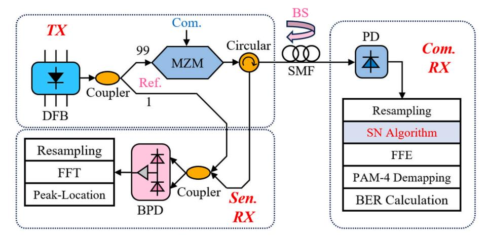
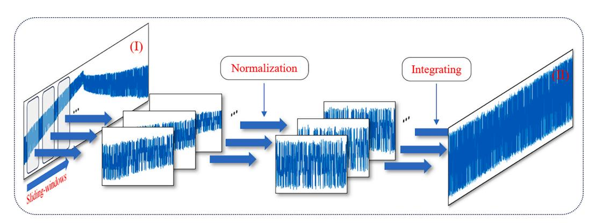
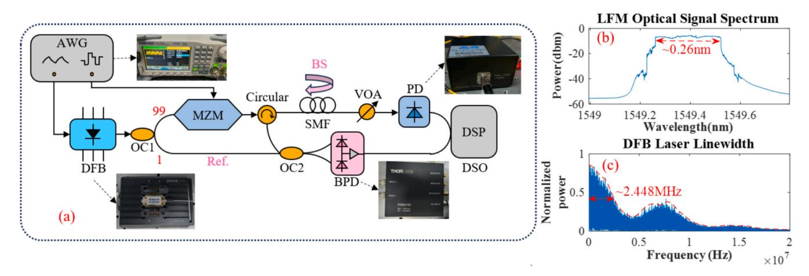
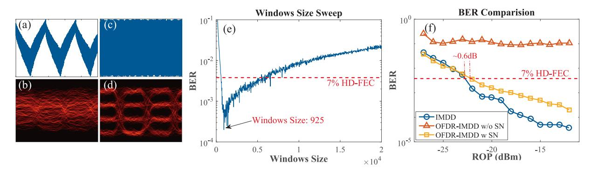
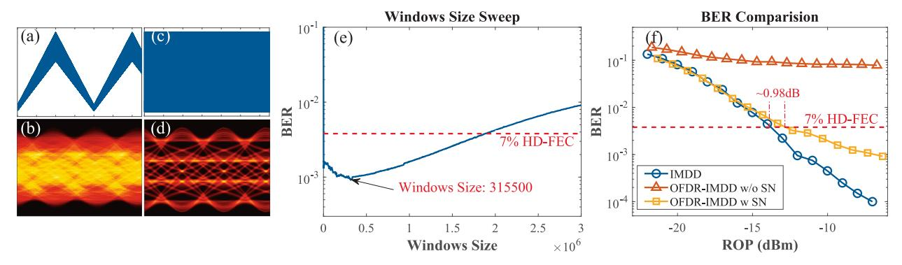
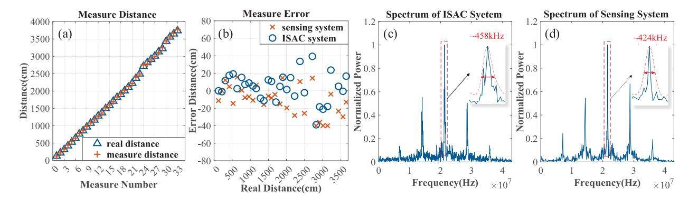
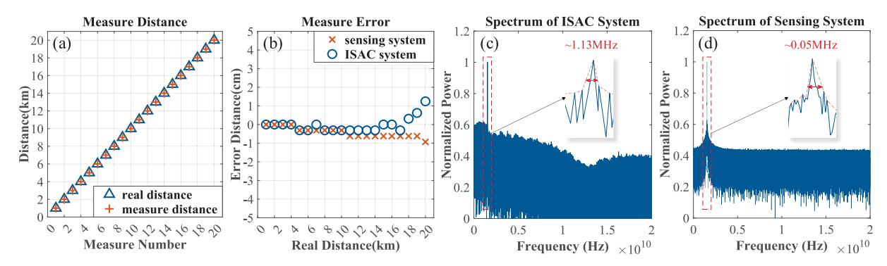

ELSEVIER

Contents lists available at ScienceDirect

## Optics and Laser Technology

journal homepage: www.elsevier.com/locate/optlastec

### Full length article

# Joint break-point localization sensing based on OFDR and non-disruptive communication fiber ISAC system

Mingxuan Ma a • Meihua Bi a,b,\*, Mengmeng Xu a, Yongqiang Zhang a • Jie Luo a, Xuefang Zhou a, Lu Zhang c, Miao Hu a

- a School of Communication Engineering, Hangzhou Dianzi University, Xiasha Gaojiaoyuan 2nd Street, Hangzhou, Zhe Jiang province 310018, China
- b State Key Laboratory of Photonics and Communications, Shanghai Jiao Tong University, 800 Dongchuan Rd, Shanghai 200240 China
- c College of Information Science and Electronic Engineering, Zhejiang University, Hangzhou, Zhe Jiang province 310018, China

#### ARTICLE INFO

#### ABSTRACT

Keywords:
Optical communication
Integrated sensing and communication
Distributed fiber-optic sensor
Optical frequency domain reflectometer

In this paper, a novel scheme of integrated sensing and communication in optical fiber systems based on optical frequency domain reflectometer (OFDR) is proposed, combining intensity modulation direct detection (IMDD) technology with OFDR technology to achieve simultaneous data transmission and fiber breakpoint localization within a single wavelength channel. Conventional optical fiber sensing systems are endowed with communication capability by the proposed scheme, thereby enhancing system intelligence. A periodically linearly frequency-modulated optical signal, generated by a tunable laser with nonlinear frequency sweep compensation, is utilized as both the communication carrier and OFDR sensing probe. Through intensity modulation, communication information is modulated onto the optical signal, thereby enabling the concurrent realization of optical fiber communication based on intensity information and fiber break-point localization sensing based on frequency domain information. In addition, to address the issue of periodic fading of the optical carrier power induced by the tunable laser, a sliding-windows normalization algorithm is employed to achieve the optimal communication performance by selecting optimal window length. Through system experiments verification, the proposed system can achieve 25 Mbps data transmission and high-precision fiber fault point localization with a distance resolution of 12.28 cm. Moreover, simulation results demonstrate that the proposed system can achieve 25 Gbps data transmission and fiber break-point localization sensing over a 20 km standard single-mode fiber. Therefore, the proposed scheme thus enables fast and accurate fiber breakpoint localization alongside high-speed communication, representing a promising solution for high precision integrated fiber communication and

### 1. Introduction

Recently, with the rapid development of Internet services [1–3] such as cloud computing, the Internet of Things, and virtual reality technology, the global network has been experiencing exponential growth. The intelligent monitoring and management of large-scale in-service optical networks, notably optical access networks, has become an increasingly important requirement. At the same time, benefiting from its sensitivity of optical fiber to its surrounding environment [4], optical fiber can serve not only as a transmission medium in communication network but also as a sensing medium in sensor network [5]. Among various optical fiber sensors, owing to its inherent advantages of long-distance and

continuous sensing, the distributed fiber optical sensors (DOFS) [6] have become the mainstream solution in intelligent optical monitor areas. Especially in muti-point distributed scenarios such as marine seismic monitoring [7], urban traffic surveillance [8], and et al, they can offer overwhelming advantages over the traditional node-based sensors. These DOFS technologies are mostly based on the backscattered optical signals (including Fresnel reflection [9], Rayleigh scattering [10], Brillouin scattering [11], and Raman scattering [12]) balanced both measurement accuracy and sensing distance, attraction widespread attention and extensive research. Among various sensing parameters, fiber breakpoints, which induce the reflection of optical signals [13], are critical in optical network systems. Based on this, accurately detecting

E-mail address: bmhua@hdu.edu.cn (M. Bi).

\* Corresponding author at: School of Communication Engineering, Hangzhou Dianzi University, Xiasha Gaojiaoyuan 2nd Street, Hangzhou, Zhe Jiang province 310018, China.

reflected signals for the purpose of fiber fault identification has emerged as a research focus in the field of optical systems, particularly in the pursuit of intelligent monitoring. And, due to the requirement for longdistance sensing, the power of the sensing signal in the aforementioned DOFS systems is significantly higher than that of the communication signal in optical networks [[14\]](#page-7-0). As a result, deploying such systems often requires disconnecting communication devices in the network to prevent damage. Meanwhile, due to the inherent contradiction between the deterministic characteristics of sensing signals and the stochastic characteristics of communication signals [\[15](#page-7-0)], it poses an additional challenge to the effective integration of sensing and communication functions.

As the potential for integrating communication and sensing functions within optical fibers has been progressively recognized, the Integrated Sensing and Communication over Optical Fiber (ISAC-OF) [[16\]](#page-7-0) technology has emerged to address the aforementioned challenges. The ISAC-OF technology enables existing optical fiber networks to sense both their own state and the external environment while maintaining communication capabilities. This diversification of optical network services enhances network management, making it be more intelligent and efficient. Among these ISAC-OF systems, with the help of simple system architecture and signal processing algorithms, the systems based on Optical Time-Domain Reflectometer (OTDR) [\[17](#page-7-0)] were employed in for realizing the network monitoring. However, the traditional OTDR techniques face a critical limitation that they struggle to distinguish backscattered signals from multiple branches, rendering them ineffective for point-to-multipoint architectures [\[18](#page-7-0)]. To overcome this challenge, the deployment of reference reflectors assigned to each fiber branch [[19\]](#page-7-0) is widely presented. By utilizing different backscattered light characteristics such as frequency shifts or time delays, this approach allows for the separation of signals from various branches. Besides, some schemes distinguish branches by deploying optical fibers with different Brillouin scattering spectra [\[20](#page-7-0)] or fiber Bragg gratings (FBGs) [[21\]](#page-7-0). However, these solutions require the extra specialized fibers or components, making them uneconomical for cost–sensitive optical networks. Furthermore, as for the pulsed OTDR-based method, the trade-off between sensing range and spatial resolution poses another significant limitation [[22\]](#page-7-0), making them difficult to simultaneously achieve long-distance and high-accuracy sensing. In addition, the chirped-signal-based phase-sensitive OTDR (Φ-OTDR) technique integrated with an intensity modulation direct detection (IMDD) transmission system scheme [[16\]](#page-7-0) was also presented to realize the integration of optical communication and vibration sensing over a single wavelength. As for this scheme, the external modulation technique was utilized to generate the up-chirped linear frequency modulated (LFM) signal, in which the extra narrowband optical bandpass filter (OBPF) and optical amplifier were also employed to remove the residual optical signal and compensate for the insertion loss, respectively. In addition, only the limited sweep frequency range was employed in this system, which would achieve limited sensing resolution. These would bring practical and cost limitations for deploying in the intelligent management of existing optical transmission systems. To deal with these limitations, the Optical Frequency Domain Reflectometer (OFDR) [[23](#page-7-0)] was introduced into the ISAC system for decoupling the sensing signal's time window from its frequency bandwidth, thus supporting both long-range and high-resolution sensing. And, owing to its inherent frequency characteristic, the OFDR-based scheme can also be applied in wavelength-division multiplexed (WDM) optical networks [[23\]](#page-7-0) without causing confusion between fiber branches. Moreover, as for this scheme, the intensity of the sensing signal can be increased without concerns about stimulated Brillouin scattering [\[16](#page-7-0)], thereby enhancing the sensing sensitivity. However, these reported schemes realize a hybrid rather than an integrated system by sharing the wavelength or the fiber link, effectively resulting in two separate systems. This separation leads to inefficient utilization of spectral and hardware resources. Therefore, realizing a tightly integrated communication and sensing solution

within optical networks remains an open and pressing research problem.

To address the aforementioned issues, we propose a novel joint nondisruptive communication and fiber breakpoints localization ISAC-OF system scheme in this paper. Different from the scheme reported in [[16\]](#page-7-0), our approach employs a directly modulated laser (DML) to generate the continuously swept LFM optical signal with the tunable wide-bandwidth sweep frequency range. This can effectively improve the sensing sensitivity compared to the limited sweep frequency bandwidth case. Additionally, benefiting from the inherent advantage of DML, such as simplicity and low cost, our scheme can be considered as a low-cost and high executable system solution. In addition, owing to the integration of OFDR with IMDD technology, our scheme can effectively realize simultaneous data transmission and fiber breakpoint localization over a single wavelength channel. The LFM light signal, output by the DML after nonlinear sweep compensation [\[24](#page-7-0)], is employed as both the communication carrier and the sensing probe. This enables optical communication in the forward direction while, based on backscattered and reflected light signals, it allows for the detection of reflection events in the fiber. Additionally, to address the issue of periodic fading of LFM optical carrier power [[25\]](#page-7-0) caused by the power variation of the tunable laser during frequency sweeping, a sliding-windows normalization (SN) algorithm is proposed at the communication receiver. By selecting the optimal window size, the system's communication performance is significantly improved. Through system experiments verification, the proposed system can achieve 25 Mbps data transmission and highprecision fiber fault point localization with a distance resolution of 12.28 cm. Furthermore, simulation results demonstrate that the proposed system can achieve 25 Gbps data transmission and fiber breakpoint localization sensing over a 20 km standard single-mode fiber (SMF). Therefore, the proposed approach supports high-speed communication and precise fault detection simultaneously, offering a highperformance solution for short-distance integrated sensing and communication over optical fiber.

#### **2. Architecture and principle of the ISAC-OF base on OFDR**

To achieve a high-performance ISAC-OF system, an OFDR-based ISAC-OF system scheme is proposed, the corresponding schematic diagram is given as in [Fig. 1](#page-2-0). Here, the TX part is the system transmitter, which generates the integrated waveform signals and then are injected into the fiber link for realizing the ISAC on optical fiber link. At the receiver, the Com. RX part is used as the communication receiver located at the other end of the optical fiber link, which receives and analyzes the communication signal and extracts communication information. The Sen. RX part is employed as the sensing receiver, which receives and analyzes the backward signal (BS) light output from the circulator and extracts sensing information. In the subsequent sections, the principles of break-point localization and the compensation mechanism for periodic optical power fading in the OFDR-based ISAC-OF system are discussed in detail.

#### *2.1. Principle of the OFDR-based ISAC-OF system and optical fiber breakpoint localization*

At the TX terminal, the distributed feedback (DFB) laser is directly driven by a pre-distorted super-triangular wave generated by an arbitrary waveform generator (AWG), thereby producing an LFM optical signal that has been corrected for frequency sweep nonlinearity. The optical field of the LFM optical signal within one frequency sweep period can be mathematically expressed as,

$$E_{LFM} = \begin{cases} E_{U-P}(t) exp[i2\pi(v_0t + \frac{2B}{T}t^2)], 0 \le t < \frac{T}{2} \\ E_{D-P}(t) exp[i2\pi((v_0 + B)t - \frac{2B}{T}t^2)], \frac{T}{2} \le t < T \end{cases}$$
(1)

Fig. 1. Schematic diagram of the OFDR-based ISAC-OF system. DFB: Distributed feedback laser, MZM: Mach-Zehnder modulator, Com.: communication signal, Sen.: Sensing signal, Ref.: reference signal.

where  $E_{U-P}$  and  $E_{D-P}$  denote the optical intensities output by the DFB laser during the up-sweep and down-sweep within a single frequency sweep period, respectively.  $v_0$ , B, and T represent the initial frequency, frequency sweep bandwidth, and sweep period of the LFM signal, respectively, while i denotes the imaginary unit. Subsequently, the LFM optical signal is split into two beams via an optical coupler with the 99:1 power ratio. The minor portion is directed to the sensing receiver as the reference signal, while the majority is input to the optical amplitude modulator, simultaneously serving as both the communication carrier and the sensing probe. The modulated output signal, serving as the integrated communication and sensing signal, whose optical field of can be mathematically expressed as,

$$E_{\text{CS}} = \begin{cases} A_{C}(t)E_{U-P}(t)exp[i2\pi(v_{0}t + \frac{2B}{T}t^{2})], 0 \leq t < \frac{T}{2} \\ A_{C}(t)E_{D-P}(t)exp[i2\pi((v_{0} + B)t - \frac{2B}{T}t^{2})], \frac{T}{2} \leq t < T \end{cases}$$
 (2)

where,  $A_C(t)$  represents the variation in optical intensity induced by the communication signal via intensity modulation. The signal is transmitted into the optical fiber link via an optical circulator. When a certain point in the optical fiber causes an increase in backscattering or reflection due to factors such as damage or breakage, the backscattered signal can be detected at the other output port of the optical circulator. The optical field of the backward signal within one frequency sweep period is expressed as,

where,  $\varphi(\tau)$  represents the phase component in the photocurrent signal that is solely related to delay  $\tau$ . This current signal can be considered a single frequency signal, and its frequency  $4B\pi\tau/T$  can be obtained by applying the fast Fourier transform (FFT) and peak-finding algorithm to its spectrum. Based on the principle of OFDR, the distance of the sensing target from the transmitter can be determined by  $d=c\tau/2n$ , where c is the speed of light in vacuum, and n is the refractive index of the optical fiber core. Through the above operations, the precise positioning of the sensing target can be achieved.

In addition, the other received terminal serves as the communication receiver. Benefiting from the use of the same modulation scheme as traditional IMDD for the communication signal, a single photodetector (PD) is sufficient to realize the optoelectronic conversion and reception of the communication signal. The photocurrent output by the PD is expressed as:

$$i_{C} \propto \sqrt{E_{CS} E_{CS}^*} = \begin{cases} A_C(t - \tau_c) E_{U-P}(t - \tau_c), \tau_c \le t < \frac{T}{2} + \tau_c \\ A_C(t - \tau_c) E_{U-P}(t - \tau_c), \frac{T}{2} + \tau_c \le t < T + \tau_c \end{cases}$$
(5)

where,  $\tau_c$  represents the signal delay induced by communication transmission. As observed from the above equation, the system exhibits periodic power fading of the signal caused by frequency sweeping. Therefore, the sliding-windows normalization method is proposed. By selecting an appropriate window size to segment the signal, each

$$E_{BS} = \begin{cases} \gamma E_{C}(t-\tau) E_{U-P}(t-\tau) exp[i2\pi(v_{0}(t-\tau) + \frac{2B}{T}(t-\tau)^{2})], \tau \leq t < \frac{T}{2} + \tau \\ \gamma E_{C}(t-\tau) E_{D-P}(t-\tau) exp[i2\pi((v_{0}+B)(t-\tau) - \frac{2B}{T}(t-\tau)^{2})], \frac{T}{2} + \tau \leq t < T + \tau \end{cases}$$
(3)

where,  $\gamma$  represents the backscattering or reflection coefficient of the fiber at the event point. And  $\tau$  represents the signal delay caused by transmission. The backward signal, along with the sensing reference signal, is fed into a 1:1 optical coupler and then input into a balanced photodetector (BPD) for event point localization. The primary component of the photocurrent output by the BPD is expressed as,

$$i_{\text{BPD-OUT}} \propto \cos\left[\frac{4B}{T}\pi\tau t + \varphi(\tau)\right], t \in \left[\tau, \frac{T}{2}\right], \left[\frac{T}{2} + \tau, T\right]$$
 (4)

segment undergoes normalization based on the amplitude distribution characteristics of the signal.

#### 2.2. Design of the sliding-windows normalization algorithm

By controlling the injection current of the DFB laser, the output optical frequency is modulated, thereby enabling linear frequency modulation of the optical signal. This technique has been widely applied in LiDAR and optical fiber sensing [24]. However, the periodic variation in the injection current causes the laser's output power to exhibit periodic fading, which results in periodic power fading in the optical signal

within the proposed integrated sensing and communication scheme, thereby not only cause the reduction of the signal-to-noise ratio (SNR) of the sensing signal, but also would lead to the severe degradation of the communication system performance. Neglecting the signal transmission delay, the communication receiver signal during the up-sweep phase can be expressed as *iC*− *U*∝*AC*(*t*)*EU*− *P*(*t*), where *AC*(*t*) contains the communication information, while *EU*− *P*represents the interference imposed on the communication information due to the periodic power fading. Since the communication rate is far higher than the sweep rate of the DFB laser, the signal intensity variations induced by communication modulation can be regarded as fast changes relative to the periodic power fading caused by the laser sweep. Consequently, the sliding-windows normalization algorithm is proposed to address the issue of periodic power fading. By adjusting the window length, the intensity variations introduced by the SN algorithm are made slow with respect to the communication signal while remaining fast relative to the variations induced by the sweep. The window size of the SN algorithm is closely related to both the period of the LFM signal and the symbol duration of the PAM4 communication signal. Therefore, the relation between the communication performance and different window sizes needs to be evaluated to determine the optimal window size. Subsequently, the normalization operation is performed based on the amplitude distribution within each window, thereby mitigating the impact of periodic power fading on communication performance without affecting the communication signal. The schematic diagram of the SN algorithm is shown in Fig. 2. Firstly, the signal is segmented by the windows, which can be expressed as:

$$\dot{i}_{C-U} = \sum_{k=1}^{N/l} \dot{i}_k \tag{6}$$

where *N* represents the total number of signal samples, and *l* represents the window size. Next, each segment of the signal is normalized using min–max normalization, which can be expressed as:

$$i_{out} = \sum_{k=1}^{N/l} \frac{i_k - \min(i_k)}{\max(i_k) - \min(i_k)}$$
 (7)

By appropriately selecting the window size, the SN algorithm ensures the more uniform signal amplitude distribution while preserving the integrity of the communication information. This effectively mitigates the impact of periodic power fading, thereby enhancing the overall communication performance of the system. Additionally, we analyze the computational complexity of the proposed SN algorithm. As for our method, in the case of n iterations, the total time complexity is determined by the number of iterations multiplied by the cost of each iteration, resulting in an overall complexity of O(n). It can be efficiently implemented on dedicated DSP or FPGA hardware for real-time processing, thus minimizing the impact of computation latency at the communication received terminal.

Based on the aforementioned principles, the proposed OFDR-based ISAC-OF system integrates high-precision fiber sensing with highspeed fiber-optic communication by modulating the communication information onto the intensity of the OFDR sensing probe. Additionally, the SN algorithm is employed to mitigate the impact of periodic power fading in the laser, further enhancing system performance and enabling a high-performance integrated communication and sensing system over optical fiber.

#### **3. Experiments setup**

To verify the feasibility of the proposed scheme, the experimental setup of the OFDR-based ISAC-OF system is shown in [Fig. 3](#page-4-0). A DFB laser (DFB-1550-I-N-1-PM) serves as the laser source. An arbitrary waveform generator (AWG, Siglent SDG1022X with two channels) is employed as the signal source to generate a super-triangular waveform, which linearly modulates the DFB laser for frequency sweeping. The output LFM optical signal from the laser has a starting wavelength of 1549.25 nm, a sweep range of ~ 0.26 nm, and a signal bandwidth of 33 GHz. The optical spectrum of the LFM signal is shown in [Fig. 3\(](#page-4-0)b). The LFM light is split into two branches by a 99:1 optical coupler (OC1). For communication, the light in the upper branch (99 %) serves as the carrier. A PAM4 signal generated by the AWG is modulated onto the optical intensity via a Mach-Zehnder modulator (AM, LN81S-FC). Similar to conventional PAM4 signal transmission, the MZM operates in the linear region. In the message generation part, a test sequence with a 215-1 pseudorandom bit sequence (PRBS) is generated and mapped into PAM4 with 2 samples per symbol. The output signal of the MZM is fed into the test fiber link through a circulator. A 20 km fibre is used in the experiments and we fix the repetition frequency of the LFM waveform to 5 kHz. At the communication receiving terminal, the power of the transmitted light is first tuned by a variable optical attenuator (VOA) and then directly detected with a photodetector (PD, Conquer, KG-PR-200 M− A− FC with a 3 dB bandwidth of 200 MHz). The output electrical signal of the PD is sampled by a digital storage oscilloscope (DSO, Keysight MSO9404A) with a 4 GHz bandwidth and a 20 GSa/s sampling rate and processed offline. Offline digital signal processing (DSP) is then performed, including resampling, sliding-window normalization (SN), feed-forward equalization (FFE), PAM4 demapping, and bit error rate (BER) calculation. For sensing, the light in the lower branch (1 %) serves as the reference optical signal. At the sensing receiving terminal, the BS light from the fiber is combined with the reference optical signal via a 1:1 optical coupler (OC2) and then converted into an electrical signal at a balanced photodetector (Thorlabs, PDB415C, 100 MHz bandwidth). Finally, the electrical signal is sampled by the same DSO and processed offline. The sensing DSP operations include resampling, FFT, and peak location for precise event point identification and break-point localization.

**Fig. 2.** Schematic diagram of the sliding-windows normalization algorithm, (I) the input signal, and (II) the output signal.

**Fig. 3.** (a) Experimental setup of the OFDR-based ISAC-OF system. AWG: Arbitrary waveform generator, VOA: Variable optical attenuator; (b) The optical spectrum of the LFM signal; (c) The measured linewidth spectrum of the DFB laser.

**Fig. 4.** The received communication signal (a) output from the PD and (c) after SN, and the eye diagram of received communication signal (b) output from the PD and (d) after SN; (e) The BER performance versus window length; (f) The comparison of system BER performance.

#### **4. Experiments results**

#### *4.1. Transmission performance*

To verify the communication performance of the proposed OFDRbased ISAC-OF system, we set the communication data rate to 25 Mbps and conducted the transmission experiment. At the communication receiver, the communication signal received by the PD is shown in Fig. 4(a). As illustrated, the amplitude of the signal is significantly affected by the periodic power fading induced by the DFB laser modulation, which severely degrades system communication performance. This degradation is further confirmed by the eye diagram in Fig. 4(b) and the BER performance of the OFDR-ISAC w/o SN shown in Fig. 4(f). To mitigate the impact of periodic fading, the SN algorithm was applied to the received signal. The step size of the sliding window was set to half the window length. The relationship between system BER and window size is shown in Fig. 4(e). It can be observed that the system BER is minimized when the window size is 925. Additionally, when the window length is below this optimal value, increasing the window size gradually improves BER performance. This trend indicates that the normalization operation becomes slower relative to the fast-varying PAM4 signal, thereby reducing its interference with the modulated information. However, when the window length exceeds the optimal value, BER begins to increase. In this regime, the SN algorithm's response time becomes comparable to or slower than the laser's periodic power variations, reducing its ability to suppress the fading. Specifically, the BER curve exhibits fluctuations when the window length exceeds the optimal window size. These fluctuations are attributed to the SN algorithm capturing random power noise from the laser, which introduces signal amplitude jitter and ultimately degrades system performance. This behavior further indicates the reduced ability to suppress residual power noise. As shown in Fig. 4(c), the received signal processed with the SN algorithm using the optimal window size demonstrates a significant reduction in power fading. The corresponding eye diagram in Fig. 4(d) shows that the PAM4 modulation characteristics are well preserved, confirming a substantial improvement in signal integrity and overall communication performance.

Additionally, when the optimal window size is selected, the bit error rate (BER) performance of the OFDR-ISAC system is measured under different levels of received optical power (ROP). For comparison, the performance of the traditional IMDD system is measured under the same conditions. Fig. 4(f) shows how the BER performance varies with the increase in received optical power. It can be observed that for the OFDR-ISAC system without the SN algorithm, the BER cannot be reduced to an acceptable level. For the OFDR-ISAC system with the SN algorithm, due to the issue of signal power periodic fading, the system exhibits a worse SNR compared to the single-frequency IMDD system when the received optical power is the same. Moreover, because the carrier changes from a single frequency to a time-varying wideband optical signal, pulse broadening caused by fiber dispersion becomes uneven in time, resulting in some degradation in the performance of the feed-forward equalizer (FFE). Therefore, the OFDR-IMDD system experiences an approximate 0.6 dB power budget loss at the 7 % HD-FEC threshold. However, when the optical power reaches − 21 dBm, both the OFDR-ISAC system with the SN algorithm and the traditional IMDD system can achieve the usable BER threshold.

To further validate the high-speed transmission performance of the OFDR-ISAC system, a simulation system was built using VPI

**Fig. 5.** The received communication signal (a) output from the PD and (c) after SN, and the eye diagram of received communication signal (b) output from the PD and (d) after SN in simulation experiments; (e) The BER performance versus window length in simulation experiments; (f) The comparison of system BER performance in simulation experiments.

Transmission Maker. This system employs a 25 Gbps PAM4 signal as the communication information, with the DFB laser linewidth compressed to 1 kHz. Meanwhile, the laser's sweep frequency is adjusted to 2.5 kHz to enable scanning over the entire 20 km optical fiber link. All other system parameters are aligned with those used in the physical experiment described previously. The results of the simulation experiment are shown in Fig. 5. As can be seen, the communication received signal is also affected by periodic power fading, causing significant fluctuations in the signal in Fig. 5(a). Additionally, in Fig. 5(e), since the modulation rate of the communication signal and the rate of power periodic fading further diverge, when the window size of the SN algorithm exceeds the optimal window size, the rate of BER increase slows down, making the optimal window size easier to identify. When the optimal window size is selected, the comparison between the signal waveforms in Figs. 5(a) and (c), as well as the eye diagrams in Figs. 5(b) and (d), clearly demonstrates that the impact of periodic power fading is significantly mitigated. The processed eye diagram exhibits well-defined PAM4 signal level distribution compared to the unprocessed signal. The residual dispersion in the signal is subsequently compensated by a 30-tap FFE. Similarly, the BER comparison between the OFDR-ISAC system and the traditional IMDD system under the same experimental conditions is shown in Fig. 5(F). It can be observed that the OFDR-IMDD system experiences approximately a 0.98 dB power budget loss at the 7 % HD-FEC threshold. However, when the optical power reaches − 12.7 dBm, both the OFDR-IMDD system with the SN algorithm and the traditional IMDD system can achieve the usable BER threshold. This demonstrates that the proposed OFDR-ISAC system possesses high-speed optical communication capabilities.

#### *4.2. Sensing results*

In addition to transmission performance, the OFDR-ISAC system's ability to locate fiber fault points was also tested. Due to the measurement range of OFDR being influenced by the laser's coherence length, we used the delay self-coherence method to measure the linewidth spectrum of the DFB laser used in the experiment, as shown in [Fig. 3\(](#page-4-0)c). It can be observed that the laser linewidth is approximately 2.448 MHz, and after calculation, the coherence length in the SMF is about 83.77 m. The theoretical maximum perceivable range is approximately 41.88 m. We replaced the 20 km transmission fiber with fibers of different lengths and with exposed ends to conduct experiments on the system's sensing performance. Fig. 6 shows the OFDR-ISAC system's ability to locate fiber breakpoints at different positions, with the distances in the experiment being relative to the port 2 of the circulator. In Fig. 6(a), it can be seen that when the distance is within 38 m, the system's measured values match the actual distances closely, allowing for precise location sensing. However, when the distance exceeds 38 m, a stable signal frequency peak can be found after the FFT algorithm, and it is concluded that fiber fault point sensing is no longer possible. This is because fiber and connector losses cause the actual maximum sensing range to be slightly smaller than the theoretical maximum range. Furthermore, as shown in Fig. 6(b), when the sensing distance is within 20 m, the measurement error is within ± 20 cm. When the sensing distance is between 20 m and 38 m, the measurement error increases to within ± 40 cm, both of which are within an acceptable error range. Additionally, the sensing reception signal spectrum at 0 m is shown in Fig. 6(c). By measuring the full width at half maximum (FWHM) of the frequency peak, which is 458 kHz, the system's distance resolution is calculated to be 12.28 cm. This resolution

**Fig. 6.** (a) The performance of the OFDR-ISAC system's sensing of fiber fault point location; (b) The sensing error of OFDR-ISAC and sensing system; (c) The spectrum of the sensing reception signal at 0 m of OFDR-ISAC system; (d) The spectrum of the sensing reception signal at 0 m of sensing system.

confirms the system's capability to detect and localize fiber anomalies with high precision. Furthermore, to evaluate the impact of the communication signal on sensing performance, the comparison between the standalone sensing system (without communication signals) and our OFDR-ISAC system was conducted. As shown in [Fig. 6\(](#page-5-0)b), the low-speed communication signals exert the minimal influence on the overall localization error, with only a slightly broader distribution observed at longer distances. Additionally, from the [Figs. 6\(](#page-5-0)c) and (d), it can be seen that, the FWHM of the received spectral signal in the sensing-only system is 424 kHz, corresponding to a distance resolution of 11.34 cm, which is marginally better than the OFDR-ISAC system presented in [Fig. 6\(](#page-5-0)d). These results indicate that the inclusion of low-speed communication signals introduces only a negligible degradation in the sensing performance.

To further investigate the influence of laser linewidth on the sensing capabilities of the proposed OFDR-ISAC system, a simulation system was set up using VPI Transmission Maker. The laser linewidth does not have the direct mathematical relationship with the distance resolution, but it can indirectly affect whether the actual sensing resolution can approach the theoretical limit. Specifically, the phase noise introduced by the larger laser linewidth degrades the SNR of the received sensing signal, thereby limiting the system's distance resolution to achieve its theoretical value. Additionally, the sensing range of the OFDR system is closely related to the laser linewidth. To maintain coherence between the signal and reference light, the sensing range should be less than half of the laser coherence length. The relationship between the laser coherence length and linewidth is given by [[26\]](#page-7-0):

$$L_{c} = \frac{c}{\pi \Delta \nu_{line}} \tag{8}$$

where *Lc* is the coherence length, *c* is the speed of light, and Δ*νline* is the laser linewidth. Therefore, the laser linewidth is inversely proportional to the sensing range of the system. The configuration of this system is the same as that of the simulation system used in the previous transmission performance study, and the results of the simulation experiment are shown in Fig. 7. It can be seen that as the laser linewidth decreases, the coherence length increases significantly, and the system's maximum sensing range expands to 20 km. The system's sensing distance highly matches the actual distance, with the sensing error remaining within ± 2 cm. Additionally, the frequency spectrum peak at the sensing receiver signal has a FWHM of 1.13 MHz, corresponding to a distance resolution of 0.7 m. These results highlight the significant advantage of utilizing narrow-linewidth lasers in OFDR-based sensing, particularly for applications requiring long-range and high-precision monitoring. In addition, the impact of high-speed communication signals on sensing performance is also further evaluated through simulation. As shown in Fig. 7(b), the sensing system without communication signals exhibits smaller localization errors compared to the OFDR-ISAC system, with the discrepancy becoming more pronounced at longer

sensing distances. Moreover, as illustrated in Fig. 7(d), in the absence of communication signals, the FWHM of the received spectral signal is approximately 0.05 MHz, corresponding to a distance resolution of about 3.3 cm. These results indicate that the presence of high-speed communication signals inevitably introduces the additional noise on the sensing system, thereby degrading the SNR, sensing accuracy, and distance resolution. This observation further highlights the inherent trade-off between communication and sensing performance in ISAC systems, which must be carefully considered in system design. In summary, the proposed OFDR-ISAC system is demonstrated to support both high-speed optical fiber communication and high-resolution, long-distance fault localization within the same frequency band, offering a unified platform that lays the foundation for intelligent and converged optical networks.

#### **5. Conclusion**

In this paper, we propose an OFDR-based ISAC-OFD system. The system uses the DFB laser to generate LFM optical signals, which serve both as optical probes for OFDR sensing and optical carriers for communication. By assigning the sensing and communication functionalities to the frequency and amplitude domains of the optical signal respectively, the system effectively reduces functional interference, enabling high-speed optical communication while simultaneously achieving high-precision and long-range fiber fault point localization. To overcome the detrimental effects of periodic power fading induced by laser modulation, we introduce a novel sliding window normalization (SN) algorithm. By selecting the window size, the SN algorithm preserves the high-frequency variations of the communication signal while suppressing the low-frequency amplitude distortions caused by laserinduced fading, thereby significantly improving communication performance. Extensive experimental and simulation results validate the feasibility and effectiveness of the proposed system. The system achieves 25 Gbps PAM4 communication and supports centimeter-level fault localization accuracy over 20 km of standard single-mode fiber (SMF). Furthermore, simulation studies confirm that narrowing the laser linewidth extends the system's sensing range to the full transmission distance, while maintaining high spatial resolution. Overall, the proposed OFDR-ISAC-OF system offers a low-complexity and efficient solution for future intelligent optical networks, seamlessly integrating highspeed communication with high-precision sensing in a unified architecture.

#### **CRediT authorship contribution statement**

**Mingxuan Ma:** Writing – review & editing, Writing – original draft, Visualization, Validation, Software, Project administration, Methodology, Investigation, Funding acquisition, Formal analysis, Data curation,

**Fig. 7.** The simulation results about (a) the performance of the OFDR-ISAC system's sensing of fiber fault point location, (b) the sensing error of OFDR-ISAC and sensing system, (c) the spectrum of the sensing reception signal at 1 km of OFDR-ISAC system, and (d) the spectrum of the sensing reception signal at 1 km of sensing system.

Conceptualization. **Meihua Bi:** Writing – review & editing, Supervision, Project administration, Funding acquisition. **Mengmeng Xu:** Resources, Project administration, Investigation. **Yongqiang Zhang:** Project administration, Data curation. **Jie Luo:** Software, Resources. **Xuefang Zhou:** Supervision, Conceptualization. **Lu Zhang:** Project administration, Data curation. **Miao Hu:** Resources, Data curation.

#### **Funding**

Project supported by the Key R&D "Pioneer" Tackling Plan Program of Zhejiang Province, China (No. 2025C01216), the 2023 Zhejiang Province "Jian Bing" and "Ling Yan" Research and Development Project (No. 2023C03SA8A4450), and the National Natural Science Foundation of China (Grant No. 62427816).

#### **Declaration of competing interest**

The authors declare the following financial interests/personal relationships which may be considered as potential competing interests: Meihua Bi reports financial support was provided by Zhejiang Province. Meihua Bi reports financial support was provided by Zhejiang Province. Meihua Bi reports financial support was provided by National Natural Science Foundation of China. If there are other authors, they declare that they have no known competing financial interests or personal relationships that could have appeared to influence the work reported in this paper.

#### **Data availability**

Data will be made available on request.

#### **References**

- [1] N. Antonopoulos, L. Gillam (Eds.), Computer Communications and Networks, Springer International Publishing, Cham, 2017, [https://doi.org/10.1007/978-3-](https://doi.org/10.1007/978-3-319-54645-2) [319-54645-2](https://doi.org/10.1007/978-3-319-54645-2).
- [2] S. Li, L.D. Xu, S. Zhao, The internet of things: a survey, Inf. Syst. Front. 17 (2) (2015) 243–259, <https://doi.org/10.1007/s10796-014-9492-7>.
- [3] S.M. LaValle, *Virtual reality*[, Cambridge University Press, 2023.](http://refhub.elsevier.com/S0030-3992(25)01317-9/h0015)
- [4] [Y. Yan, et al., Distributed optical fiber sensing assisted by optical communication](http://refhub.elsevier.com/S0030-3992(25)01317-9/h0020) [techniques, J. Light. Technol. 39 \(12\) \(2021\) 3654](http://refhub.elsevier.com/S0030-3992(25)01317-9/h0020)–3670.
- [5] C. Pendao, ˜ [I. Silva, Optical fiber sensors and sensing networks: overview of the](http://refhub.elsevier.com/S0030-3992(25)01317-9/h0025) [main principles and applications, Sensors 22 \(19\) \(2022\) 7554.](http://refhub.elsevier.com/S0030-3992(25)01317-9/h0025)

- [6] [A. Rogers, Distributed optical-fibre sensing, Meas. Sci. Technol. 10 \(8\) \(1999\) R75.](http://refhub.elsevier.com/S0030-3992(25)01317-9/h0030)
- [7] [C. Li, et al., A high-responsivity subsurface buoy system with a fiber-optic acoustic](http://refhub.elsevier.com/S0030-3992(25)01317-9/h0035)  [vector sensor for continuous low-frequency acoustic monitoring in the deep ocean:](http://refhub.elsevier.com/S0030-3992(25)01317-9/h0035)  [development and sea trials, IEEE J. Ocean. Eng. \(2025\).](http://refhub.elsevier.com/S0030-3992(25)01317-9/h0035)
- [8] M. Tekinay, T. Sylvester, M. Brunton, T. Ganesh, Applications of fiber optic sensors in traffic monitoring: a review, Innov. Infrastruct. Solut. 8 (3) (2023) 88, [https://](https://doi.org/10.1007/s41062-023-01057-1)  [doi.org/10.1007/s41062-023-01057-1.](https://doi.org/10.1007/s41062-023-01057-1)
- [9] [A. Brientin, D. Leduc, V. Gaillard, M. Girard, C. Lupi, Numerical and experimental](http://refhub.elsevier.com/S0030-3992(25)01317-9/h0045)  [study of a multimode optical fiber sensor based on Fresnel reflection at the fiber tip](http://refhub.elsevier.com/S0030-3992(25)01317-9/h0045)  [for refractive index measurement, Opt. Laser Technol. 143 \(2021\) 107315](http://refhub.elsevier.com/S0030-3992(25)01317-9/h0045).
- [10] M. Mądry, B. Szczupak, M. Smigielski, ´ [B. Matysiak, Investigation of using neural](http://refhub.elsevier.com/S0030-3992(25)01317-9/h0050) [networks for temperature and relative humidity measurement with the Rayleigh](http://refhub.elsevier.com/S0030-3992(25)01317-9/h0050)  [scattering-based distributed optical fiber sensor, Photonics Lett. Pol. 17 \(1\) \(2025\)](http://refhub.elsevier.com/S0030-3992(25)01317-9/h0050)  13–[15.](http://refhub.elsevier.com/S0030-3992(25)01317-9/h0050)
- [11] [B.-H. Choi, BOCDA sensor measurement system for 1 mm spatial resolution at](http://refhub.elsevier.com/S0030-3992(25)01317-9/h0055) [distances over 200 m, Opt. Laser Technol. 189 \(2025\) 113006](http://refhub.elsevier.com/S0030-3992(25)01317-9/h0055).
- [12] [B. Fan, J. Li, K. Feng, W. Zhang, F. Zhang, M. Zhang, High spatial resolution Raman](http://refhub.elsevier.com/S0030-3992(25)01317-9/h0060)  [distributed optical fiber sensing using self-pulse time-domain delay differential](http://refhub.elsevier.com/S0030-3992(25)01317-9/h0060)  [demodulation, J. Light. Technol. \(2025\)](http://refhub.elsevier.com/S0030-3992(25)01317-9/h0060).
- [13] [M.M. Rad, K. Fouli, H.A. Fathallah, L.A. Rusch, M. Maier, Passive optical network](http://refhub.elsevier.com/S0030-3992(25)01317-9/h0065)  [monitoring: challenges and requirements, IEEE Commun. Mag. 49 \(2\) \(2011\)](http://refhub.elsevier.com/S0030-3992(25)01317-9/h0065)  s45–[s52.](http://refhub.elsevier.com/S0030-3992(25)01317-9/h0065)
- [14] [Y. Wen, F. Yang, J. Song, Z. Han, Optical integrated sensing and communication:](http://refhub.elsevier.com/S0030-3992(25)01317-9/h0070) [architectures, potentials and challenges, IEEE Internet Things Mag. 7 \(4\) \(2024\)](http://refhub.elsevier.com/S0030-3992(25)01317-9/h0070)  68–[74.](http://refhub.elsevier.com/S0030-3992(25)01317-9/h0070)
- [15] [M.R. Bell, Information theory and radar waveform design, IEEE Trans. Inf. Theory](http://refhub.elsevier.com/S0030-3992(25)01317-9/h0075)  [39 \(5\) \(1993\) 1578](http://refhub.elsevier.com/S0030-3992(25)01317-9/h0075)–1597.
- [16] [H. He, et al., Integrated sensing and communication in an optical fibre, Light Sci.](http://refhub.elsevier.com/S0030-3992(25)01317-9/h0080)  [Appl. 12 \(1\) \(2023\) 25.](http://refhub.elsevier.com/S0030-3992(25)01317-9/h0080)
- [17] [D.R. Anderson, L.M. Johnson, F.G. Bell,](http://refhub.elsevier.com/S0030-3992(25)01317-9/h0085) *Troubleshooting optical fiber networks: [understanding and using optical time-domain reflectometers](http://refhub.elsevier.com/S0030-3992(25)01317-9/h0085)*, Elsevier, 2004.
- [18] [K. Yuksel, V. Moeyaert, M. Wuilpart, P. M](http://refhub.elsevier.com/S0030-3992(25)01317-9/h0090)´egret, Optical layer monitoring in passive [optical networks \(PONs\): a review, in:](http://refhub.elsevier.com/S0030-3992(25)01317-9/h0090) *2008 10th Anniversary International [Conference on Transparent Optical Networks](http://refhub.elsevier.com/S0030-3992(25)01317-9/h0090)*, IEEE, 2008, pp. 92–98.
- [19] [F. Caviglia, V.C. Di Biase, A. Gnazzo, Optical maintenance in PONs, Opt. Fiber](http://refhub.elsevier.com/S0030-3992(25)01317-9/h0095)  [Technol. 5 \(4\) \(1999\) 349](http://refhub.elsevier.com/S0030-3992(25)01317-9/h0095)–362.
- [20] [N. Honda, D. Iida, H. Izumita, Y. Azuma, In-service line monitoring system in PONs](http://refhub.elsevier.com/S0030-3992(25)01317-9/h0100)  [using 1650-nm Brillouin OTDR and fibers with individually assigned BFSs, J. Light.](http://refhub.elsevier.com/S0030-3992(25)01317-9/h0100)  [Technol. 27 \(20\) \(2009\) 4575](http://refhub.elsevier.com/S0030-3992(25)01317-9/h0100)–4582.
- [21] [X. Zhang, T. Yang, X. Jia, A PON monitoring system integrating fault detection and](http://refhub.elsevier.com/S0030-3992(25)01317-9/h0105)  [localization, IEEE Photonics J. 14 \(5\) \(2022\) 1](http://refhub.elsevier.com/S0030-3992(25)01317-9/h0105)–7.
- [22] [M. Tateda, T. Horiguchi, Advances in optical time domain reflectometry, J. Light.](http://refhub.elsevier.com/S0030-3992(25)01317-9/h0110)  [Technol. 7 \(8\) \(2002\) 1217](http://refhub.elsevier.com/S0030-3992(25)01317-9/h0110)–1224.
- [23] H. Guo, et al., Single-ended*>* [100 km distributed vibration sensor based on OFDR](http://refhub.elsevier.com/S0030-3992(25)01317-9/h0115)  [using Pearson correlation coefficient, IEEE Sens. J. \(2025\)](http://refhub.elsevier.com/S0030-3992(25)01317-9/h0115).
- [24] [Y. Jiang, et al., Frequency modulation nonlinear correction and ranging in FMCW](http://refhub.elsevier.com/S0030-3992(25)01317-9/h0120)  [LiDAR, IEEE J. Quantum Electron. \(2024\).](http://refhub.elsevier.com/S0030-3992(25)01317-9/h0120)
- [25] [G. Beheim, Remote displacement measurement using a passive interferometer with](http://refhub.elsevier.com/S0030-3992(25)01317-9/h0125)  [a fiber-optic link, Appl. Opt. 24 \(15\) \(1985\) 2335](http://refhub.elsevier.com/S0030-3992(25)01317-9/h0125)–2340.
- [26] [C. Henry, Theory of the linewidth of semiconductor lasers, IEEE J. Quantum](http://refhub.elsevier.com/S0030-3992(25)01317-9/h0130)  [Electron. 18 \(2\) \(2003\) 259](http://refhub.elsevier.com/S0030-3992(25)01317-9/h0130)–264.