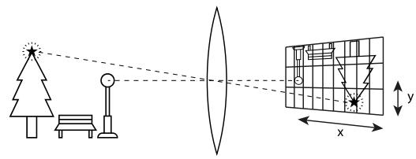
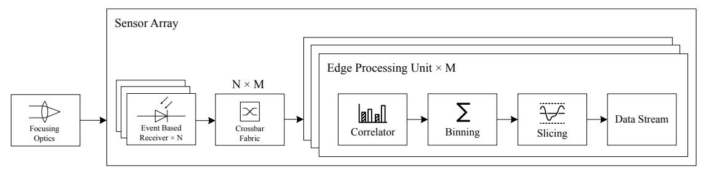
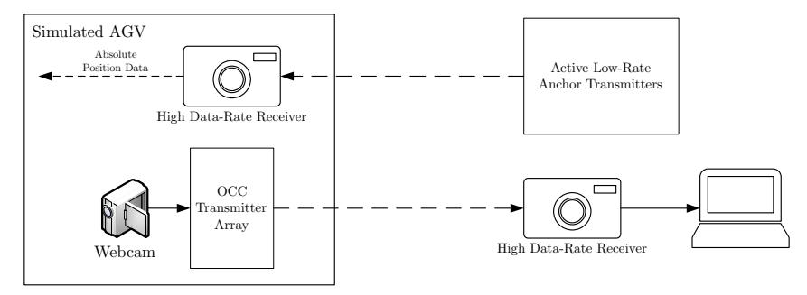
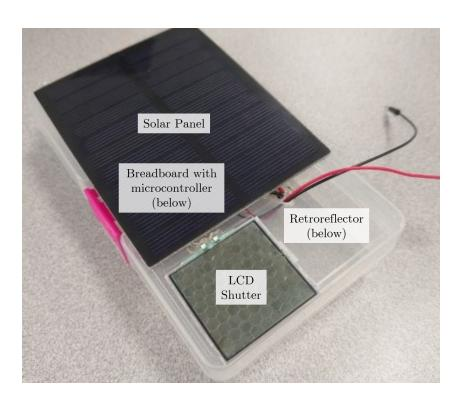
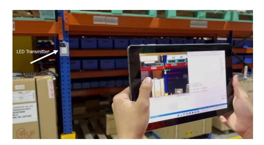

.

Latest updates: [hps://dl.acm.org/doi/10.1145/3680207.3765690](https://dl.acm.org/doi/10.1145/3680207.3765690)

#### POSTER

## Poster: High-Performance Optical Camera Communications for ISAC Localization and Sensing

[LIHWEI](https://dl.acm.org/doi/10.1145/contrib-99661368570) CHIA, National University of [Singapore,](https://dl.acm.org/doi/10.1145/institution-60017161) Singapore City, Singapore MEHUL [MOTANI](https://dl.acm.org/doi/10.1145/contrib-81100216771), National University of [Singapore,](https://dl.acm.org/doi/10.1145/institution-60017161) Singapore City, Singapore

Open Access [Support](https://libraries.acm.org/acmopen) provided by: National [University](https://dl.acm.org/doi/10.1145/institution-60017161) of Singapore

PDF Download 3680207.3765690.pdf 28 December 2025 Total Citations: 0 Total Downloads: 238

Published: 03 November 2025

[Citation](https://dl.acm.org/action/exportCiteProcCitation?dois=10.1145%2F3680207.3765690&targetFile=custom-bibtex&format=bibtex) in BibTeX format

ACM [MOBICOM](https://dl.acm.org/conference/mobicom) '25: 31st Annual [International](https://dl.acm.org/conference/mobicom) Conference on Mobile Computing and [Networking](https://dl.acm.org/conference/mobicom) *November 4 - 8, 2025 Hong Kong, China*

ISBN: 9798400711299

Conference Sponsors: [SIGMOBILE](https://dl.acm.org/sig/sigmobile)

# Poster: High-Performance Optical Camera Communications for ISAC Localization and Sensing

[Lih-Wei Chia](https://orcid.org/0000-0002-5368-6566) clw@u.nus.edu National University of Singapore

#### Abstract

High-Performance Optical Camera Communications (HP-OCC) extends conventional Optical Camera Communication (OCC) by combining single-photon avalanche diode (SPAD) sensors with on-sensor edge processing. This enables highspeed optical communication and centimetre-level localization within a single platform, offering a compelling opticaldomain alternative for Integrated Sensing and Communication (ISAC) in RF-restricted or congested environments.

In collaboration with Kuehne+Nagel, HP-OCC was deployed in an operational warehouse to evaluate two logistics applications: inventory tracking using passive optical tags and warehouse automation via an AGV equipped with HP-OCC for simultaneous video streaming and localization. Passive tags, operating without dedicated power, were reliably identified despite interference from ambient LED lighting, while AGV trials demonstrated stable 5Mbps video transmission and 10cm localization accuracy over 25m. Higher data rates are possible with advancements in SPAD technology.

#### CCS Concepts

• Networks → Mobile networks; Physical links; • Hardware → Wireless devices.

#### Keywords

Optical Camera Communication, OCC, ISAC, integrated sensing, localization, spatial multiplexing, localization

#### ACM Reference Format:

Lih-Wei Chia and Mehul Motani. 2025. Poster: High-Performance Optical Camera Communications for ISAC Localization and Sensing. In The 31st Annual International Conference on Mobile Computing and Networking (ACM MOBICOM '25), November 4–8, 2025, Hong Kong, China. ACM, New York, NY, USA, [3](#page-3-0) pages. [https://doi.org/10](https://doi.org/10.1145/3680207.3765690) [.1145/3680207.3765690](https://doi.org/10.1145/3680207.3765690)

Permission to make digital or hard copies of all or part of this work for personal or classroom use is granted without fee provided that copies are not made or distributed for profit or commercial advantage and that copies bear this notice and the full citation on the first page. Copyrights for thirdparty components of this work must be honored. For all other uses, contact the owner/author(s).

ACM MOBICOM '25, Hong Kong, China © 2025 Copyright held by the owner/author(s). ACM ISBN 979-8-4007-1129-9/25/11 <https://doi.org/10.1145/3680207.3765690>

## [Mehul Motani](https://orcid.org/0000-0003-3262-0207) motani@nus.edu.sg

National University of Singapore

Figure 1: Illustration of how a camera sensor can isolate signals from multiple transmitters simultaneously.

#### 1 Motivation

Integrated sensing and communication (ISAC) has emerged as a key enabler for next-generation wireless systems, promising to unify data transmission and environmental perception within a single platform. While most ISAC research to date has focused on radio-frequency (RF) technologies [\[5\]](#page-3-1), the growing congestion of the RF spectrum, coupled with performance and regulatory limitations, motivates the exploration of alternative physical layers. High-Performance Optical Camera Communications (HP-OCC), built on singlephoton avalanche diode (SPAD) sensing and conventional optical camera communications (OCC), presents a compelling optical-domain counterpart to conventional RF-based ISAC, offering unique advantages in: 1) sensing precision, 2) power efficiency, and 3) environmental compatibility.

## 2 High-Performance Optical Camera Communications

HP-OCC[\[3\]](#page-3-2) is an optical wireless communication technique that leverages the extreme sensitivity and high temporal resolution of SPAD sensors. Unlike conventional OCC, which are limited by the frame rate of typical image sensors, HP-OCC performs event-based, parallel pixel processing directly at the sensor edge. This allows it to capture and decode highspeed optical signals while simultaneously preserving spatial information for localization and sensing tasks.

As illustrated in [Figure 1,](#page-1-0) OCC, and by extension HP-OCC, functions as an optical analogue to receiver-side beamforming. A camera lens maps light from distinct directions onto unique sensor regions, enabling simultaneous reception across all azimuths and elevations within the field-of-view (FOV). Unlike optical angle diversity schemes that segment the FOV into a limited number of cells [\[2\]](#page-3-3), OCC can achieve resolutions on the order of millions of pixels, thereby providing very fine spatial resolution.

Figure 2: System architecture of HP-OCC receivers designed for OOK and ASK transmissions. The crossbar and multiple edge processing units within the sensor array allows each edge processing unit to be dynamically assigned to a pixel or group of pixels.

Figure 3: Illustration of the warehouse automation setup.

This fine spatial mapping enables quasi-orthogonal, point-to-point channels between transmitters and receiver pixels, effectively minimizing interference and reducing the complexity of front-end hardware and protocol design. Furthermore, angle-of-arrival and ranging methods can be applied to locate transmitters for precise localization using trilateration. Conversely, through sensing the reflections from its own transmitted signals, a HP-OCC device can reconstruct the 3D structure of its own environment.

#### 3 Key Benefits of HP-OCC for ISAC

HP-OCC's architecture and sensing capabilities confer three principal advantages against RF-based methods for integrated sensing and communications. Firstly, the high temporal and spatial resolution enables accurate centimetre-level localization of optical sources and precise environmental mapping compared to RF-based methods which are limited by wavelength and baseline distances.

Secondly, the extreme sensitivity of SPAD detectors allows reliable communication with minimal optical power. Passive retro-reflective tags can be employed for remote sensing and data exchange without active light sources on the tag side. This is advantageous compared to RFID and BLE-like tags which are either short range or require batteries to operate.

Finally, as an optical domain solution, HP-OCC is resistant to and is less likely to cause RF spectrum congestion and electromagnetic interference. This makes it more suitable for environments where RF communication is restricted, impractical, or unreliable, such as in industrial facilities, medical settings, or military operations.

#### 4 System Design & Prior Works

We define the HP-OCC system architecture in Figure 2 and in our prior work [3]. To practically handle the immense number of events generated by each SPAD pixel, a pool of on-sensor edge processing units are dynamically assigned to a specific or group of pixels through a crossbar. Each edge processing unit is designed to demodulate and decode a single optical stream and is assigned to the relevant pixel or pixels as the transmitter tracks across the surface of the SPAD detector array.

Unlike conventional OCC, HP-OCC does not operate on individual image frames. Instead, it operates on a frameless architecture by independently processing the individual photon arrival events of each pixel or group of pixels. As a result, it is possible to achieve much higher data rates and temporal resolution compared to conventional OCC, which is limited by the maximum achievable frame rate of the sensor. By measuring the time difference between transmitted and received pulses, ranging at the centimetre level can also be achieved.

Similar concepts have been explored in other works, such as [1] which implements localization using an event-based imaging array, and [4] which demonstrates a custom hybrid 'communication' sensor that embeds multiple communication-capable pixels within a typical imaging sensor.

Figure 4: Annotated image of a passive transmitter tag.

Figure 5: Image of the portable HP-OCC receiver being used for inventory search.

#### 5 Deployment Test in Warehouse Setting

To evaluate the practicality of HP-OCC for ISAC in logistics, we collaborated with Kuehne+Nagel (K+N) to deploy an experimental system in one of their operational warehouses in Singapore. The facility handles diverse inventory categories, including just-in-time (JIT) high-value products, fast-moving consumer goods (FMCG), and high-mix palletised consumer returns. Access to the warehouse enabled testing under real operational conditions, with a 25m by 3m lane serving as the trial zone. Two application scenarios were demonstrated: inventory tracking and warehouse automation.

For inventory tracking, we demonstrate inventory search using passive tags [\(Figure 4\)](#page-3-6). The passive tags were constructed using a solar panel, a retroreflector and an LC shutter that modulated incoming light with its tag ID using a microcontroller. A portable HP-OCC receiver with integrated interrogation light [\(Figure 5\)](#page-3-7) allowed workers to locate tagged items on shelves, though performance with passive tags degraded under the warehouse's mains-powered LED lighting due to 100Hz flicker. This issue was resolved by using higher optical data rates that were at much higher rates than the light flicker, though range performance suffered due to limitations in the LC shutter switching speed producing reduced signal contrast at higher data rates.

For warehouse automation, as illustrated in [Figure 3,](#page-2-1) a simulated automated guided vehicle (AGV) based on a

forklift integrated HP-OCC for both live video streaming and real-time localization using active anchors installed on the warehouse shelves. The system performed simultaneous communication and localization using a single receiver on the AGV.

The video link operated at a fixed 5 Mbps rate with low packet loss across the trial lane, while localization accuracy was maintained around 10cm over distances up to 25m. This dual-function capability allowed the AGV to receive navigation commands and stream live video of its environment while continuously updating its position, demonstrating the ISAC capability of HP-OCC.

#### 6 Reflections & Conclusion

The warehouse trials demonstrated HP-OCC's potential as a practical ISAC solution for logistics, combining high-speed communication with centimetre-level localization in a single system. In both the inventory tracking and warehouse automation scenarios, the system performed effectively under realistic industrial conditions, demonstrating advantages in sensing precision and power efficiency in potentially challenging environments. Kuehne+Nagel provided positive feedback on the system's potential to improve operational efficiency, citing faster retrieval of items from high-mix inventory and greater opportunities for warehouse automation.

The trials also revealed several practical considerations. Most notably, HP-OCC requires line-of-sight between transmitters and receivers, which can limit coverage in cluttered environments or when assets are occluded. While strategic placement of HP-OCC readers and transmitters can mitigate this limitation, it remains a key constraint compared to RF-based alternatives. For large-scale deployments, a hybrid optical-RF ISAC approach could be employed, using RF for coarse localization and identification in non line-of-sight conditions, then switching to optical ISAC once line-of-sight is established. Future work will investigate this hybrid model and assess its feasibility in broader deployments.

#### Acknowledgments

This work was supported by the Neptune Orient Lines Fellowship in Singapore through the grant NOL20RP03.

### References

- [1] G. Chen et al. 2020. A novel visible light positioning system with event-based neuromorphic vision sensor. IEEE Sens. J, 20, 17.
- [2] Z. Chen et al. 2014. Angle diversity for an indoor cellular visible light communication system. In IEEE Veh. Tech. Conf.
- [3] L. W. Chia et al. 2024. High-Performance OCC with Edge Processing on SPAD and Event-Based Cameras. IEEE Commun. Mag., 62, 3.
- [4] M. K. Hasan et al. 2022. Optical camera communication in vehicular applications: a review. IEEE Trans. Intell. Transp. Syst., 23, 7.
- [5] X. W. Luo et al. 2025. Isac – a survey on its layered architecture, technologies, standardizations, prototypes and testbeds. IEEE Commun. Surv. Tutorials, 1–1.