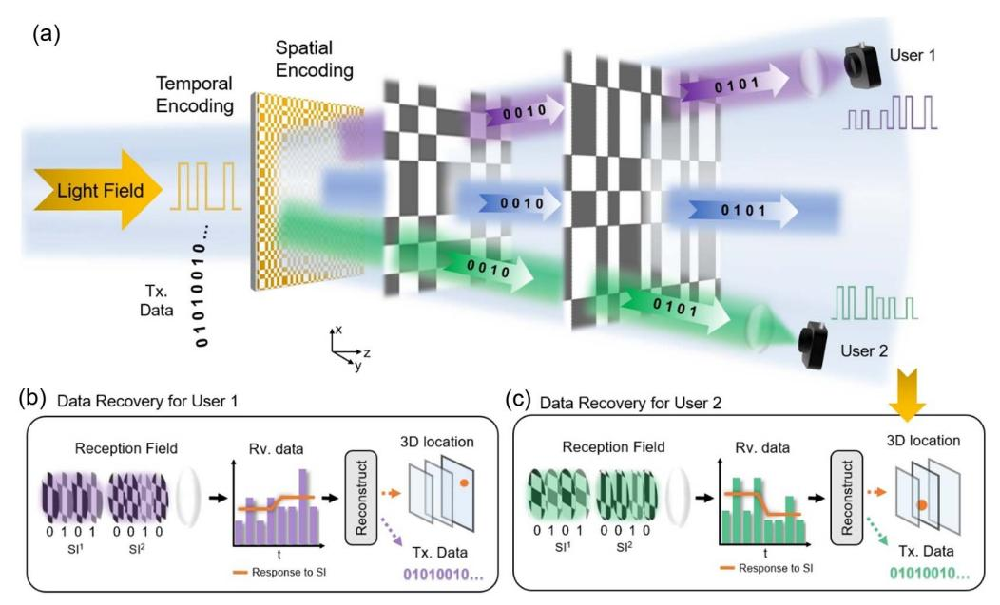
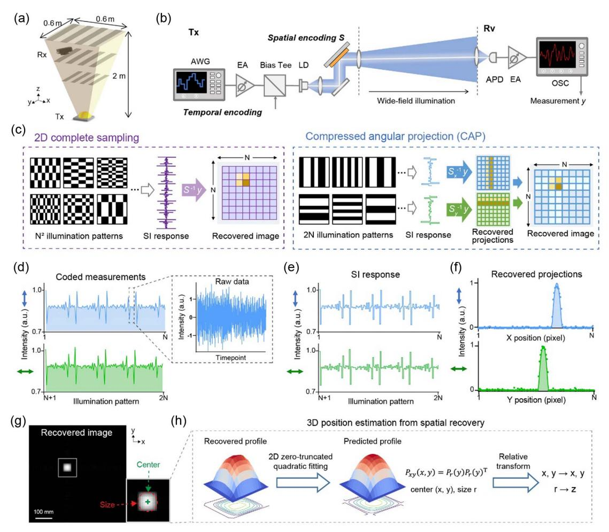
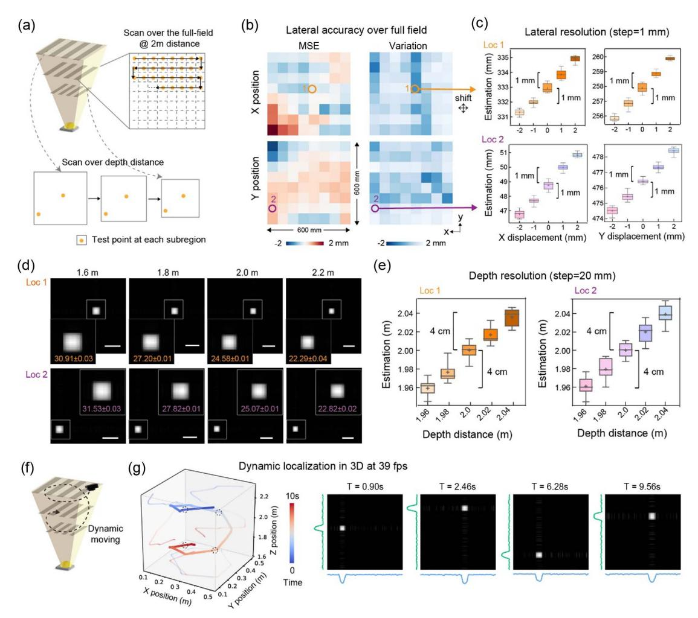
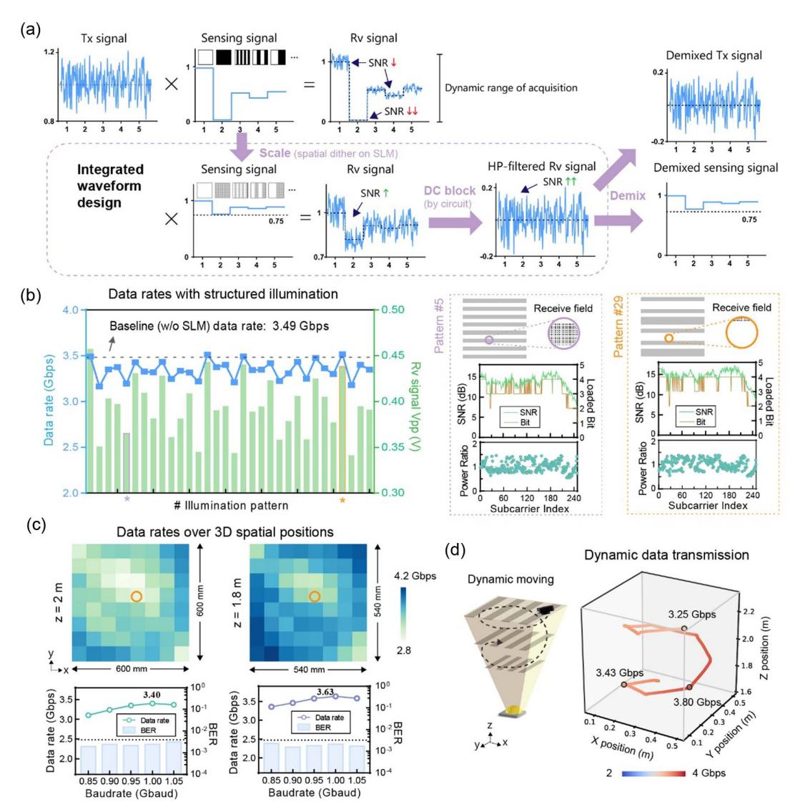
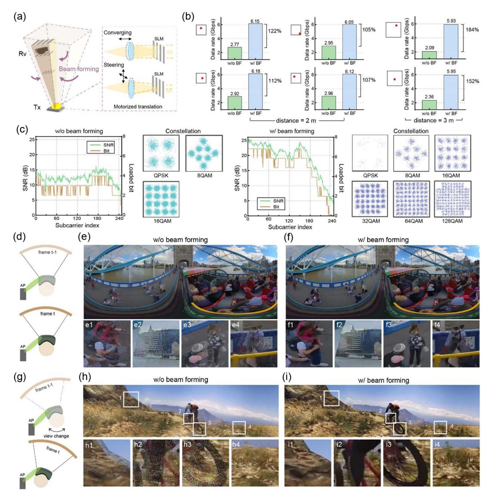
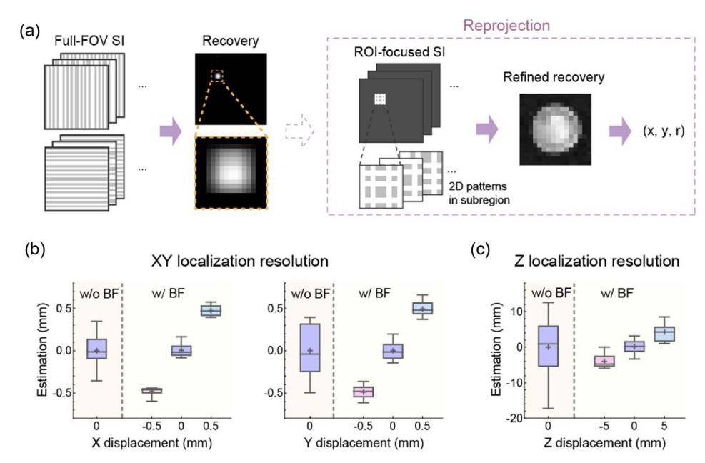

### **PHOTONICS Research**

# Adaptive visible light integrated sensing and communication for cable-free virtual reality

ZIWEI LI,1,2,†,\* D JIANYANG SHI,1,3,† D CHAO SHEN,1,3 D YUANLONG ZHANG,4 JUNWEN ZHANG,1,3 D AND NAN CHI1,3,5 D

Received 18 March 2025; revised 5 June 2025; accepted 5 June 2025; posted 6 June 2025 (Doc. ID 561888); published 13 August 2025

Visible light communication plays an essential role in the next-generation 6G network due to its extremely high bandwidth and ultrafast transmission speed. Incorporating position sensing functionality into the communication system is highly desired for achieving target-oriented beamforming and accommodating high-speed data service. However, an efficient solution to integrated sensing and light communication remains challenging. Here, we demonstrate an integrated system that concurrently accomplishes high-precision sensing and high-speed data transmission by spatio-temporal modulation of the illumination and computational reconstruction. We developed a compressive angular projection imaging scheme to achieve rapid three-dimensional localization with high resolution, and a jointly optimized waveform design ensures slight sacrifice in the transmission data rate on the integrated system. We experimentally demonstrated a resolving resolution of 1 mm in lateral and 4 cm in depth within  $0.6 \text{ m} \times 0.6 \text{ m} \times 0.6 \text{ m}$  volume over 2 m distance at the sensing speed of 39 Hz in both static and dynamic conditions. This capability enables adaptive beamforming, which significantly enhances the data rate by 184% to permit errorless transmission of high-throughput virtual reality videos. Our work offers a promising route for intelligent wireless light communication systems with spatial perception capability, presenting the possibility of cable-free, immersive virtual reality experiences. © 2025 Chinese Laser Press

https://doi.org/10.1364/PRJ.561888

#### 1. INTRODUCTION

6G networks are expected to provide wireless communications with extremely high capacity and transmission speed for the Internet of Everything [1]. Traditional radio wireless communications are allocated with limited bandwidth, which will be quickly exhausted with the ever-increasing demand. Optical wireless communication (OWC), especially visible light communication (VLC), is an emerging technique utilizing the unlicensed ultra-high bandwidth within the optical frequency range [2–4] and holds great potential to bring breakthroughs to next-generation high-speed networks. Since VLC can be easily deployed on existing illumination systems such as indoor lightings and car headlights, it has been brought to various applications spanning from civil (e.g., indoor LiFi networks [5] and secure transmission in environments with high electromagnetic interference [6]) to military tasks (e.g., underwater bluegreen light communication with over gigabits data rates [7], and inter-satellite long-range laser communication [8]).

It is foreseen that sensing functionalities should serve as a basic service in 6G, enabling future networks to see the physical world and facilitate applications such as the Internet of Vehicles (IoV) and virtual reality (VR). In addition, communication and sensing systems can be mutually beneficial; for example, employing localization to assist beam-steered communication allows the integrated system to fulfill the broad coverage and high-speed requirements. Driven by this demand, efforts have been made towards high-resolution localization in electromagnetic wave wireless communication using radio [9], millimeter [10,11], and terahertz waves [12], achieving localization accuracy from several meters to tens of centimeters. Light communication, which works on much shorter wavelengths, is promising to achieve higher localization resolution. Nevertheless, integrated localization in light communication systems has not yet been well established, hampered by the low sensitivity of available photodetectors, which struggle to discern the low-budget reflective photons from the receiver

&lt;sup>1Key Laboratory for Information Science of Electromagnetic Waves (MoE), Fudan University, Shanghai 200433, China

&lt;sup>2Shanghai Artificial Intelligence Laboratory, Shanghai 200232, China

&lt;sup>3Shanghai Engineering Research Center of Low-Earth-Orbit Satellite Communication and Applications, Shanghai 200433, China

&lt;sup>4Institute for Brain and Cognitive Sciences, Tsinghua University, Beijing 100084, China

&lt;sup>5e-mail: nanchi@fudan.edu.cn

&lt;sup>†These authors contributed equally to this work.

\*Corresponding author: lizw@fudan.edu.cn

in the presence of ambient light. Previous visible light positioning techniques are primarily developed in two categories: camera-based and photodetector (PD)-based methods. The former techniques adopt additional array detectors to acquire the sensing information, whereas the sensing and communication functionalities are achieved by two independent systems and are costly in the hardware budget [13,14]. PD-based methods retrieve the position information from received signals by interpreting the arriving time delay or channel attenuation responding to single or multiple separately placed transmitters that encode unique identification signals [15,16]. Yet, these methods are vulnerable to ambient noise and only provide centimeter-level localization resolution. In addition, the multitransmitter approaches greatly increase the system complexity with the demand for stringent clock synchronization among transmitters. The generalized and efficient implementation of a deeply integrated sensing and transmission system with optical waves remains a challenging yet important task.

In this work, we described a novel solution to visible light integrated sensing and communication by jointly manipulating the spatio-temporal properties of the emitting light field. We employed active spatial modulation on the illumination, in addition to temporal modulation on its intensity, which encodes transmission signals with discrete multi-tone modulation, and achieves high-resolution localization in 3D via computational reconstruction. To improve sensing efficiency, an angular projection imaging scheme supported by compressive sensing [17] was proposed that leads to a 64-fold reduction in measurement time. Following an integrated waveform design, we achieved precise location perception and data transmission with negligible communication performance degradation by processing on the same optical signals, hence greatly augmenting the information throughput. Demonstrating on a free-space optical link covering a wide field of 0.6 m × 0.6 m over 2 m length, we exhibited simultaneous data transmission at ~3 Gbps and 3D localization with <1 mm accuracy in horizontal, 4 cm accuracy in vertical at the 39 Hz frame rate. The retrieved localization information was leveraged to achieve beamforming, which adaptively focused and steered the illumination towards the target. We experimentally verified that adaptive beamforming largely enhanced the data rate by 122% at 2 m and 184% at 3 m distance, reaching >6 Gbps to enable high-speed wireless VR. Structured illumination with beamforming also improved the localization precision by 2- and 4-fold in lateral and vertical to be millimeter-level in 3D, offering the possibility of more precise and narrower beamforming.

#### 2. RESULTS

### A. Computational Illumination Enables Integrated Sensing and Communication

In a typical wireless light communication system, data to be transmitted are encoded into analog signals and drive the illumination light switching at fast speed. Assuming a wide coverage light communication situation, the receiver located within the illumination area collects and measures the streaming light intensity with a photodetector. Since the illumination light is usually designed with a near-uniform or axially symmetric irradiance to maintain similar transmission performance over

the working region, the receiver cannot determine its location solely based on the detected light intensity.

To empower spatial sensing ability to PD-based optical communication, leveraging the concept of computational imaging that allows spatial information being demixed from coded single-pixel measurements [18-21], we introduce active spatial encoding to the emitting light to allow spatial-resolving perception. As illustrated in Fig. 1(a), the transmission (Tx) data are temporally encoded on the amplitude (or phase) of the light field as in a standard light communication manner, followed by spatial encoding to produce a sequence of structured illumination (SI). Let u(t) represent the transmission signals and  $S^{k}(p)$  the kth SI pattern, and the spatio-temporal modulated emission light can be expressed as  $E^k(p,t) = u(t) \cdot S^k(p)$ , k = 1, 2, ..., m. Here, t represents the timestamp, p represents the spatial index, and m is the number of SI patterns. The receiver located at a certain position perceives a small portion of spatially encoded light within its reception field (RF), the integral of which will vary with the position change. Specifically, the received optical signal at the kth SI elapse is

$$y^{k}(t) \propto \int_{p} M(p) \cdot E^{k}(p, t) dp,$$

$$M(p) = \begin{cases} 1, & p \in RF \\ 0, & p \notin RF \end{cases},$$
(1)

Since the Tx signal modulation rate is commonly several orders higher than the SI switch rate, an average smoothing on the received signal leads to the decoupling of the SI-dependent responses from the communication signals:

$$\tilde{y}^k \propto \frac{1}{T} \int_t \int_p M(p) \cdot u(t) \cdot S^k(p) dp dt = \tilde{u} \int_p M(p) \cdot S^k(p) dp.$$
(2

Here,  $\tilde{u}$  indicates the average intensity of u(t) in each SI pattern elapse T, which is constant for most modulation formats. Given the receiver's responses to a sequence of SI patterns, the spatial information of the RF can be computationally reconstructed by solving an inverse problem. Meanwhile, the Tx signals at each SI interval can be retrieved by applying a high-pass filter on the received data and conducting the standard demodulation algorithm. Notably, the spatial information is recovered from the same amount of received signals necessitated for data transmission without any increase in sampling budget or hardware complexity. The proposed spatio-temporal modulated optical communication network allows multiple users to directly connect in as working in the broadcast manner, while their position information is kept private from each other and even from the emitter. Since the sensing and communication processes rely on localized spatial modulation and detection, no optical interference or cross-talk occurs across users. These merits make it a promising solution for intelligent and secure interconnection. More importantly, the position sensing functionality will assist the light communication system to perform beamforming, which is essential in practical applications.

### B. Real-Time High-Resolution 3D Localization with CAP

We demonstrate the computational localization capability in a free-space VLC system [see Figs. 2(a) and 2(b); see

**Fig. 1.** Principle of computational sensing integrated with free-space optical communication. (a) Spatial light modulation is incorporated into a temporally encoded free-space optical communication system. (b), (c) Recorded optical signals by separate users are computationally processed to recover both the transmitting data and the 3D location. The position-variant responses to the SI sequence within each receiver's reception field are leveraged to retrieve the spatial information.

Appendix A]. In addition to temporal encoding to load transmission data, a series of spatial encoding on the illumination is applied to introduce spatial variance. Traditional imaging techniques require dense sampling of the spatial region (e.g., raster scanning or applying a complete set of spatial illuminations). To achieve fast and high-resolution localization in dynamic conditions, we propose an efficient compressive sensing framework to computationally estimate receiver's position from relatively few coded measurements. Specifically, we design a compressive angular projection imaging scheme, referred to as "CAP," where stripe patterns along a few directions are used for structured sampling [see Fig. 2(c)]. The concept is similar to the tomographic imaging widely applied in biomedical imaging, which records linear projections of a sample along multiple angles to reduce radiation dose and improve imaging speed [22,23]. Harnessing the geometric symmetry of the receiver's reception field, the CAP approach merely requires sampling the full field with stripe patterns in two angles to achieve spatial information decoding. The stripe illumination patterns are derived from a complete set of Hadamard basis, which has good tolerance to noise [24,25] and enables projection profiles reconstruction by a simple linear back-projection algorithm. With the sampling pixel resolution of the full field to be  $N \times N$ , CAP greatly reduces the sampling time to be proportional to 2N, compared to  $N^2$  for that of dense sampling. For sampling resolution N = 128, CAP requires only a 1.56% sampling ratio (i.e., 512 patterns) and can achieve a frame rate of 39 Hz using a fast spatial light modulator (SLM) working at 20 kHz.

We further explained the procedure of CAP with a representative experimental testcase. The spatially encoded illumination pattern with a pixel resolution of N=128 was projected onto a 0.6 m  $\times$  0.6 m area at a distance of 2 m using an SLM

and preserved good contrast spanning >0.6 m along the depth. The received coded signals by one user [Fig. 2(d)] were divided by the pattern interval and averaged to calculate the location-variant response to each SI pattern [Fig. 2(e)]. The reconstructed projections in the X and Y axes [Fig. 2(f)] were then fused to generate a recovered image as

$$I_{\text{rec}} = \text{proj}_X \cdot (\text{proj}_Y)^T,$$
 (3)

indicating the reception field of the receiver located within the full field [Fig. 2(g), Appendix C]. The projective intensity profiles can be theoretically modeled by a zero-truncated quadratic function, and a 2D joint fitting method was developed to estimate the center coordinates in X,Y axes and the size of the reception field [see Fig. 2(h)]. With the pre-calibrated knowledge of the full-field size at a certain depth and the receiver's aperture size, the receiver's lateral position and depth can be calculated (see Appendix C). The proposed detection algorithm allows for subpixel precision, hence leading to high-resolution 3D localization.

We experimentally characterized the performance of *XY* localization with CAP by traversing the illumination area at 2 m distance at each of the 8-by-8 subregions [Fig. 3(a)]. The reception field profile at each location is recovered, and the mean squared errors (MSEs) and variations of the estimated *X* and *Y* positions calculated on 10 repetitive trials are plotted in Fig. 3(b). The absolute error is mostly below 1 mm throughout the field and no more than 2 mm at the worst case (possibly caused by the system error of manually placing the receiver to the corners). The results indicate that CAP achieves accurate and robust 2D localization. To examine the lateral resolving limit of CAP, we next translated the receiver by small displacements starting at two representative positions highlighted by

Fig. 2. 3D position reconstruction from compressive sampling. (a) Illustration of wireless optical communication of a wide angle with structured illumination. (b) Pipeline of temporal and spatial modulation on the illumination at the transmitter side. (c) Concept of CAP, which optimizes structured illumination to speed up the computational sensing. (d) Coded measurements captured by the receiver and (e) corresponding average downsampled signals in response to different SIs. (f ) Recovered angular projections via back-projection. (g) Spatial recovery from (f ); scale bar: 100 mm. (h) Pipeline of zero-truncated quadratic fitting-based position estimation.

orange and purple circles in Fig. [3](#page-4-0)(c). It was observed that the receiver located at two places close to 1 mm could be well distinguished. The experiments validate a high lateral localization resolution of 1/600 of the field size, which is much larger than the spatial modulation resolution.

We further verified the 3D localization performance of CAP by vertically moving the receiver to scan over the depth distance as illustrated in Fig. [3\(](#page-4-0)a). Testing at four distances spanning from 1.6 to 2.2 m, we presented the recovered images indicating the relative position and size of the receiver reception field to the full-field illumination region in Fig. [3\(](#page-4-0)c). The magnified subregions reveal the change in pixel number of the receiver aperture as the depth grows, while the recovered aperture size remains similar for different lateral positions. We examined the depth resolving ability by applying small depth displacements of 2 cm starting at 2 m distance, and the estimation results repeated by 10 trials show that CAP can mostly distinguish positions spaced by 4 cm in depth [see Fig. [3\(](#page-4-0)d)].

After characterizing 3D localization precision of CAP in static context, we next experimented in a practical dynamic scenario where the receiver kept moving within the volume at a fast speed [Fig. [3\(](#page-4-0)f )]. Attributed to the capability of fast and precise 3D localization, CAP achieved real-time tracking of the receiver at 39 fps (frames per second) [see Fig. [3\(](#page-4-0)g)]. The swirling 3D trace within a 10 s duration and representative recovered spatial profiles during the tracing are presented for visualization.

#### C. Integrated Waveform Design for Efficient Sensing and Communication

In a light communication system with structured illumination, the received optical signal at each illumination pattern elapse is the product of the communication signals and the response to the SI. Large fluctuations among sensing signals corresponding to different SIs are expected to maintain high signal-tonoise ratio (SNR) for accurate spatial recovery. However, the received signals may be largely attenuated when the sensing responses to certain illumination patterns are low, leading to a decrease in the communication data rate. To address this issue, we developed an integrated waveform design to jointly

**Fig. 3.** Characterization of 3D localization resolution. (a) Illustration of testing points by lateral scanning at 2 m and vertical scanning over distance. (b) MSE and variations in lateral position estimation over the full field at 2 m prove the high accuracy of CAP. (c) Lateral position estimations at small displacements prove the spatial resolving limit of CAP. (d) Recovered images describing the relative position and size of receiver's reception field at different depths. The estimated aperture sizes by repeated trials are noted in millimeters. (e) Estimation on depth resolution at small depth displacement. (f) Dynamic moving of the receiver and (g) reconstructed 3D trace with example time-points presented.

minimize the illumination power degradation and to preserve high-resolution localization [see Fig. 4(a)]. An intensity rescaling of the SI, i.e.,  $S^k(p) = 1 - \alpha(1 - S^k(p))$ , is applied by spatial dithering on the SLM to increase the optical intensity collected by the receiver. At the receiver end, a direct current (DC) blocking circuit is utilized to remove the intensity offset of received signals at each illumination pattern elapse. To balance the SNRs of communication signals and sensing signals, an intensity scaling factor of  $\alpha = 1/4$  was empirically chosen in all experiments. The cutoff frequency of the DC-block was properly set to be several orders larger than the illumination switching rate to suppress the SI-variant DC components. As a result, the dynamic range of the data acquisition is fully exploited to enable high SNR data transmission, while the SI-relevant intensity variations still guarantee robust spatial reconstruction.

We evaluated the impact of structured illumination on the communication performance in the 2 m free-space VLC link. Discrete multi-tone (DMT) modulated signals with bit and power loading were transmitted, and the received signal

intensity and estimated data rates following standard demodulation with respect to different SIs were compared, as shown in Fig. 4(b). We observed small fluctuations in the data rate ranging from 3.16 to 3.52 Gbps when the normalized signal intensity varies from 0.75 to 1. The averaged data rate over different SIs was 3.35 Gbps, only a 4.3% decrease compared with the baseline case without structured illumination [denoted in the dashed line in Fig. 3(b)]. Although the illumination patterns within the receiver's reception field are largely distinct under different SIs (for example, see the received light field when projecting patterns #5 and #29), we observed similar transmission data rates and tendencies of SNR distribution and bit-power allocations. To conclude, the proposed integrated waveform design ensures that the incorporation of structured illumination into light communication systems will scarcely affect its data transmission performance.

We further characterized the data rates at different spatial positions in 3D. Testing at two distances of 2 and 1.8 m, the measured data rate maps are shown in Fig. 4(c). We

Fig. 4. Integrated waveform design and communication performance. (a) Waveform design of spatio-temporal encoding to optimize SNR for both data transmission and position sensing. (b) Transmission data rate and received signal intensity with respect to different SIs. Estimated communication performance for SI patterns #5 and #29 is presented in detail. (c) Transmission data rates recorded at different spatial positions at 2 and 1.8 m distances. The relation of data rates and the baud rate is analyzed. (d) Transmission data rates when the receiver is dynamically moving in 3D.

saw an increase in the data rate as the distance was reduced because the illumination density gets larger at closer distances. Variations in the data rate across the lateral position are due to the uneven irradiation of the light source and can be avoided by using more uniform illumination. We also investigated the relationship between the bandwidth and data rate to determine the system bandwidth, and the maximum data rates for the position highlighted in Fig. 4(c) at two depths are 3.40 and 3.63 Gbps with 1.0 Gbaud.

Lastly, we demonstrated the performance of data transmission in dynamic conditions. The receiver is swirling within the volume of 0.6 m × 0.6 m × 0.6 m. Notably, using CAP with integrated optimized spatio-temporal encoded illumination, we achieved simultaneous data transmission and localization. The reconstructed 3D trace of the moving receiver with estimated transmission data rates encoded by color is presented in Fig. 4(d). We see fast and stable data transmission over the illumination volume with data rates modestly varying between 3.2 and 3.8 Gbps as the spatial position changes.

#### D. Adaptive Beamforming Assisted by Position Sensing for High-Throughput Service

The integration of communication and localization brings the benefit of increased information throughput. Moreover, the perceived knowledge of location can be exploited to promote data transfer. Here, we demonstrated adaptive beamforming at the transmitter that converges the illumination light into a narrower beam and steers towards the target receiver [see Fig. [5](#page-6-0)(a)]. The position information reconstructed by the receiver could be passed to the transmitter via a low-speed upload link. Optical converging and steering were realized by vertically and laterally translating the collimating lens after the light source, electrically driven by a motorized stage. Since the illumination light density sensed by the receiver is greatly increased, the communication

Fig. 5. Adaptive beamforming to enhance the transmission data rate and support VR video transmission. (a) Illustration of adaptive beamforming to focus structured illumination onto the target receiver. (b) Data rates with and without beamforming tested at representative locations: X and Y coordinates in the unit of mm are (264, 190), (346, 264), (554, 554), (190, 129) originating from the left-top corner at 2 m, and (232, 30), (265, 319) at 3 m. (c) Comparison of communication performance after beamforming at the first position at 2 m in (b). Concept of (d) content change and (g) user view change in wireless VR application. Recovered VR video frames transmitted via the 2 m free-space VLC link (e), (h) without and (f ), (i) with beamforming.

performance will gain from the increase of received SNR (assuming that the PD is not saturated).

We examined the improvement in data rate with adaptive beamforming at four example positions where the irradiance is relatively weak. Given the position information estimated with CAP, the emission light beam was converged to be 1/8 of its original divergence and steered towards the target, and the focused region-of-interest (ROI) covers a 75 mm × 75 mm area around the receiver at 2 m distance. As compared in Fig. 5(b), we observed a 122% maximum increase in the data rate after beamforming, and the maximum data rate acquired exceeded 6 Gbps. For the first position, we also compared the marked improvement in averaged SNR from 12.30 to 18.79 dB and the highest bit allocation number from 4 to 7 bit/(s Hz), and the constellations of 128-QAM and 64-QAM appeared after beamforming, revealing that beamforming allows higher-order modulated signal transmission [see Fig. 5(c)]. The data rate improvement is more remarkable at a longer distance where the full-field illumination is weaker. By projecting structured illumination at 3 m distance, which covers an area of 0.9 m × 0.9 m, the measured data rate at the peripheral of the field merely reached 2.09 Gbps. After adaptive beamforming, the transmission speed was increased by 184% to achieve 5.93 Gbps, which is quite close to that achieved at the shorter distance. So far, the bottleneck of the data rate is the bandwidth of the emitter [[26\]](#page-10-0) instead of the optical SNR.

The enhancement of integrated data transmission and localization will play an essential role in high-throughput applications such as VR. The pursuit of cable-free VR devices that cut the wire to the content-generating server requires a network to deliver enormous data at low latency. Here, using our 2 m VLC link for data transmission, we tested two VR videos with high spatio-temporal resolution. The first one is a panoramic 3D video in an equi-rectangular projection of 7680 × 3840 pixels, 120 Hz frame rate, and true color (24-bit), and it is encoded in HEVC format at an averaged compression ratio of 94%. The required data rate for errorless transmission with 7% forward-error-check overhead is computed as  $7680 \times 3840 \times 120 \times 24 \times (1-94\%) \times (1+7\%) = 5.45$  Gbps. The second video is a monoscopic 360° video in an equi-angular cube map of 7200 × 3840 pixels, 120 Hz frame rate, and 24-bit color, requiring a data rate of 5.11 Gbps. Under the wide-field illumination condition, the data transmission becomes erroneous, and the packet loss rates for the two testing videos are ~38.5% and 34.4%. For visual representation, when the screen content changes or the user's view rapidly switches [Figs. 5(d) and 5(g)], the display via wide-field VLC transmission exhibits obvious trailing shadows and pixel contamination [Figs. 5(e) and 5(h)]. This can lead to a desynchronized perception of motion in the visual cortex to induce dizziness. The erroneous transmission could even cause content loss [e.g., people become unrecognizable within the cropped ROIs in Figs. 5(e1) and 5(e4)] and fuzziness of fine patterns [Figs. 5(h2) and 5(h3)], whereas, with position sensing-assisted adaptive beamforming, the data rate is enhanced to support lossless transmission of the high-throughput video, offering the possibility for wireless immersive VR experiences [Figs. 5(f) and 5(i)].

Location estimation can also be refined by reprojecting structured illumination within the concentrated ROI. As shown in Fig. 6(a), we generate ROI-focused SI with finer spatial modulation in a subregion surrounding the receiver and consequently achieve more precise spatial resolving. In the refined localization phase, we used a complete set of 2D

Hadamard patterns of N = 16 to recover the subregion, which takes identical measurements to the two-angle CAP sampling of N = 128. Comparing the recovered images, we saw that the reception field was more sharply reconstructed and looked closer to its real shape. We quantitatively evaluated the localization improvement by fixing the receiver and repeatedly measuring its X, Y and depth position. As shown in Fig. 6(b), the estimated values at the testing point after beamforming show a >2-fold reduction in estimation variation. While we bi-directionally translated the receiver in lateral space by a small step of 0.5 mm, the estimated lateral displacements for 10 trials were  $-0.491 \pm 0.006$  mm and  $0.494 \pm 0.008$  mm for the X axis, and  $-0.482 \pm 0.003$  mm and  $0.473 \pm 0.004$  mm for the Y axis [Fig. 6(b)], demonstrating that the refined recovery enables sub-millimeter spatial resolution. The localization improvement is more significant for the Z axis. As shown in Fig. 6(c), while moving the receiver back-and-forth by 5 mm, the estimated Z displacements were  $-4.01 \pm 3.69$  mm and  $4.55 \pm$ 5.48 mm, respectively. Two depths of 10 mm distance were well distinguished after refined localization, showing a vertical resolution improvement of ~4-fold.

#### 3. CONCLUSION

Wireless light communication is expected to play an important role in 6G, and it is desired to achieve intelligent sensing functionalities via the same communication channel, yet this pursuit has remained very challenging for visible light. Here, we developed a spatio-temporal modulated structured illumination system with a jointly optimized waveform design and compressive sampling to achieve fast and accurate localization and high-speed data transfer in one integrated system. We demonstrated that the integrated sensing and communication design was mutually beneficial, i.e., adaptive beamforming

**Fig. 6.** Structured illumination reprojection to achieve refined localization resolution. (a) Concept of refined location recovery after beamforming using ROI-focused structured illumination. Characterization of the localization resolution improvement in the (b) XY plane and (c) Z direction.

proceeded assisted by position sensing and gave rise to up to 184% data rate enhancement and approximately 2- to 4-fold localization resolution improvement. The proposed visible light integrated sensing and communication system shows great potential in future wireless VR and other high-speed applications.

In our localization experiments, the effective illumination field, localization resolution, and number of sensing patterns are mutually restricted. The spatial resolution of about 1/600 of the field size with 256 spatial encoded illuminations was demonstrated in the article. For accurate localization in wider field of view, larger quantity of illumination patterns will be required. Higher localization accuracy can be achieved if using more patterned illumination with a finer structure, or faster sensing using fewer illumination patterns with the sacrifice of spatial resolution. To break the limit of spatio-temporal bandwidth, advanced neural network algorithms [27-29] will be developed for illumination pattern design and localization estimation under highly compressed conditions. The CAP method relies on orthogonal stripe projections to estimate the receiver position. This is efficient when the receiver exhibits symmetric geometry. For more complex or irregularly shaped receivers, the reconstructed position tends to represent the centroid of the illuminated region. Including additional projection angles can improve robustness to misalignments and receiver irregularity.

The proposed computational sensing scheme is well applicable to various optical communication systems regardless of signal formats and in diverse contexts such as indoor, intervehicle, and underwater scenarios. The implementation is easy to produce, i.e., we only need to add a spatial modulation module to the emitter and the newly coming receiver can be directly connected into the network. Moreover, miniaturized design of the structured illumination module (e.g., micro-DMD chips) and even customized integrated structured light engines will be explored to push this method forward into practical use. We expect that our method would provide an alternative route for integrated sensing and communication of next-generation optical wireless networks.

### APPENDIX A: VISIBLE LIGHT COMMUNICATION SETUP AND DIGITAL SIGNAL PROCESSING

The transmitted DMT signal is generated by an AWG (Tektronix 710B) with the sampling rate set at 4.0 GSa/s. A 1.0 GHz electrical amplifier (EA, Mini-Circuits ZHL-2-8-S+) and a 4.2 GHz bias tee (Mini-Circuits ZFBT-4R2GW-FT+) are employed to amplify the signal and drive the broadband fluorescent white laser diode (LD, Kyocera SLD Laser 910-00004-IT, optical power 225 mW). The LD with a divergence angle of 120° is collimated by a collective lens (f = 19 mm) and its output beam reaches the active area of a digital micromirror device (DMD, DLP4100) that achieves switching spatial modulation at 20 kHz. The collective lens is mounted on a piezo stage (Thorlabs PD2) for controllable translation. A projective lens (f = 35 mm) relays the DMD plane to a magnified illumination pattern of 0.6 m × 0.6 m at 2 m distance. At the receiver side, an achromatic lens ( $\Phi = 50$  mm, f = 75 mm) is utilized to converge

the optical signal onto the avalanche photodiode (APD210A, bandwidth 1 GHz). To generate controlled motion paths for evaluating 3D tracking performance under dynamic conditions, the receiver module is mounted on an electrical controllable three-axis translational stage. The output signal from the APD is amplified by the EA (ZHL-2-8-S+) and then sampled by the oscilloscope (OSC, Keysight DASO9404A). The sampling rate of the OSC is set at 4 GSa/s.

In the experiments, we adopted a standard bit-power loading DMT modulation based on the Levin-Campello (LC) algorithm [30] to maximize the spectral efficiency of the visible light communication channel. The implemented DSP can be divided into two phases: the training phase and the testing phase. To decide the optimal bit-power loading, we first generate a quadratic phase-shift keying (QPSK) signal containing 256 subcarriers and its conjugate symmetry (Hermitian) to estimate the SNR at every subcarrier. Zero padding of eight subcarriers is applied to the low-frequency components of the signal to avoid the low-pass filtering effect induced by the circuits. The signal is then upsampled by a factor of 2. The DMT modulated signal u(t) for transmission in the training phase can be expressed as

$$u(t) = \sum_{k=0}^{uN_{\text{sub}}-1} U(k)e^{j\frac{2\pi kt}{wN_{\text{sub}}}},$$

where U(k) is the QPSK signal on the kth subcarrier,  $N_{\rm sub}$  is the number of signal subcarriers, and w is twice the upsampling ratio. The u(t) is then normalized. At the receiver side, standard DMT demodulation is implemented, and the SNR for each subcarrier is determined by the constellation point-based error vector magnitude (EVM) [31]. The optimal bit and power allocations for each subcarrier can be calculated by the LC algorithm. Next, we proceed to the testing phase, during which we transmit the bit and power loaded signals. The DMT modulated signal  $u_{\rm bp\_load}(t)$  for transmission in the testing phase is modified as

$$u_{\text{bp\_load}}(t) = \sum_{k=0}^{wN_{\text{sub}}-1} P(k)U(k)e^{j\frac{2\pi kt}{wN_{\text{sub}}}},$$

where P(k) and U(k) are the allocated power and data on the kth subcarrier, respectively. DMT demodulation and QAM demapping are implemented to the received signals and return the final recovered communication signal.

For all experiments, the SNR table used corresponds to the hard decision-forward error correction (HD-FEC) threshold of  $3.8 \times 10^{-3}$ . The transmission data rate with 7% FEC overhead is calculated by the following equation:

$$R = \frac{R_{\rm s}}{2} \cdot \frac{N_{\rm sub} - N_{\rm zero}}{N_{\rm sub}} \cdot M.$$

Here,  $R_s$  is the sampling rate of the AWG,  $N_{\rm sub}$  and  $N_{\rm zero}$  are the number of signal subcarriers and zero-padding subcarriers, respectively, and M is the average of loaded bits in the valid subcarriers.

## APPENDIX B: ILLUMINATION PATTERN GENERATION AND PROJECTION RECONSTRUCTION

To recover a field of pixel dimension N-by-N, we first generate stripe patterns  $\{S^k\}$  from a complete set of Hadamard basis of N-order as

$$H_N = (\vec{b}_1, \vec{b}_2, ..., \vec{b}_N),$$
  
 $S^k = \vec{b}_k \cdot \mathbf{1}^T, \qquad k = 1, ..., N.$ 

The measurements  $y_{\theta}^k$  of scene I illuminated by stripe pattern  $S^k$  from angle  $\theta$  is

$$y_{\theta}^{k} = \sum_{p} \operatorname{rot}_{\theta}(S^{k}(p)) \odot I(p)$$

$$= \sum_{p} \operatorname{rot}_{\theta}(\vec{h}_{k} \cdot \mathbf{1}^{T}) \odot I(p)$$

$$= \sum_{p} (\vec{h}_{k} \cdot \mathbf{1}^{T}) \odot \operatorname{rot}_{-\theta}(I(p))$$

$$= \sum_{p} \vec{h}_{k} \odot (\mathbf{1}^{T} \cdot \operatorname{rot}_{-\theta}(I(p)))$$

$$= \vec{h}_{k}^{T} \cdot \operatorname{proj}_{-\theta}(I(p)).$$

Here,  $\operatorname{rot}_{\theta}()$  and  $\operatorname{proj}_{\theta}()$  represent the rotation and angular projection operations, respectively, along angle  $\theta$ , and p is the spatial index. The  $\cdot$  and  $\odot$  operators represent dot product and Hadamard product, respectively. The integration operation over spatial index  $\sum_{p}()$  is rotational invariance. We can write the measurement sequences in vector format as

$$\vec{y}_{\theta} = \begin{pmatrix} y_{\theta}^{1} \\ y_{\theta}^{2} \\ \vdots \\ y_{\theta}^{N} \end{pmatrix} = \begin{pmatrix} \vec{h}_{1}^{T} \\ \vec{h}_{2}^{T} \\ \vdots \\ \vec{h}_{N}^{T} \end{pmatrix} \cdot \operatorname{proj}_{-\theta}(I) = H_{N}^{T} \cdot \operatorname{proj}_{-\theta}(I).$$

Since  $H_N$  is inversible, i.e.,  $H_N^{-1} = \frac{1}{N} H_N^T$ , the projection in angle  $-\theta$  can be derived as

$$\operatorname{proj}_{-\theta}(I) = \frac{1}{N} H_N \cdot \vec{y}^{\theta}.$$

Recovered angular projections  $\operatorname{proj}_{\theta} \in \mathcal{R}^N$  along a few angles can be fused together to generate a 2D image. If we use two perpendicular angles (i.e.,  $\theta = 0^\circ, 90^\circ$ ), then the final image can be computed as the multiplication of the two projections:

$$\hat{I} = \text{proj}_0(I) \cdot \text{proj}_{00}(I)^T$$
.

Using denser sampling will improve the reconstruction accuracy and robustness, yet meanwhile increase the measurement time.

### APPENDIX C: THREE-DIMENSIONAL LOCATION ESTIMATION

To estimate the receiver's 3D localization from the recovered image, we adopted a 2D fitting approach to determine the reception aperture location and size. Assuming the clear aperture

of the receiver has a perfect round shape of radius *R*, the angular projection of the receiver's transmitting function is the integral of the aperture along the projection direction,

$$A(r) = \begin{cases} 1, & |r - r_0| < R \\ 0, & \text{otherwise} \end{cases},$$

$$P_x(y) = \int_x A(x, y) dx = \begin{cases} 2\sqrt{R^2 - (y - y_0)^2}, & |y - y_0| < R \\ 0, & \text{otherwise} \end{cases},$$

$$P_y(x) = \int_y A(x, y) dy = \begin{cases} 2\sqrt{R^2 - (x - x_0)^2}, & |x - x_0| < R \\ 0, & \text{otherwise} \end{cases}.$$

Here,  $x_0$  and  $y_0$  are the center positions of the receiver. Given the recovered projections, we used 2D fitting to resolve  $x_0$ ,  $y_0$ , and R. The 2D Gaussian fitting could give a good initial estimation. Next, we developed a customized function to better approximate the non-continuous zero-truncated quadratic model, expressed as

$$f(x, y; x_0, y_0, R) = P_x^2(y) \cdot P_y^2(x)^T$$
  
=  $(R^2 - (y - y_0)^2) \times (R^2 - (x - x_0)^2) \times W(x, y).$ 

The window function W(x, y) is the product of two symmetric Sigmoid functions,

$$W(x,y) = S(x,y) \times (1 - S(-x, -y)),$$

$$S(x,y) = \frac{1}{1 + \exp((R - \sqrt{(x - x_0)^2 + (y - y_0)^2})^k)}.$$

The factor k is empirically set to be 10 to produce a steep curve. By applying a least-squares minimization fitting of the projection  $\hat{I}$  to the above approximal model, we are able to predict the X, Y position  $x_0$ ,  $y_0$  and radius R. The spatial mapping between the projected structured patterns and the target scene is established at the transmitter side to define the global field of view during system calibration.

The receiver's depth is inversely proportional to the aperture size. We assume that the receiver plane is perpendicular to the incident optical beam for maximizing the captured optical signal and for ensuring geometric consistency between the projected pattern and the receiving aperture. With a precalibration of a reference  $R_{\rm ref}$  at a known depth  $D_{\rm ref}$ , we can map any recovered R to its depth by

$$D = D_{ref} \times R_{ref}/R$$
.

Assuming an equal estimation accuracy of the radius, under the formed beam illumination, the relative error of radius estimation will be suppressed. Hence, the accuracy of distance estimation will be enhanced proportionally to the ROI reduction.

**Funding.** National Key Research and Development Program of China (2023YFB2804701); National Natural Science Foundation of China (62401156, 61925104, 62201157, 62231018).

**Author Contributions.** Z. L. and J. S. conceived the idea. N. C. supervised the project. Z. L. and J. S. developed the algorithm, performed the experiments, and analyzed data with advice from Y. Z., C. S., and J. Z. Z. L. wrote the manuscript with input from all authors.

Disclosures. Z. L., J. S., C. S., and N. C. have a pending patent on the presented frameworks. Other authors declare no competing interests.

Data Availability. All data are available from the corresponding author upon reasonable request.

#### REFERENCES

- 1. S. Dang, O. Amin, B. Shihada, et al., "What should 6G be?" [Nat.](https://doi.org/10.1038/s41928-019-0355-6) Electron. 3, 20–[29 \(2020\)](https://doi.org/10.1038/s41928-019-0355-6).
- 2. P. Yang, Y. Xiao, M. Xiao, et al., "6G wireless communications: vision and potential techniques," [IEEE Netw.](https://doi.org/10.1109/MNET.2019.1800418) 33, 70–75 (2019).
- 3. N. Chi, Y. Zhou, Y. Wei, et al., "Visible light communication in 6G: advances, challenges, and prospects," [IEEE Veh. Technol. Mag.](https://doi.org/10.1109/MVT.2020.3017153) 15, 93–[102 \(2020\)](https://doi.org/10.1109/MVT.2020.3017153).
- 4. D. O'brien, G. Parry, and P. Stavrinou, "Optical hotspots speed up wireless communication," [Nat. Photonics](https://doi.org/10.1038/nphoton.2007.52) 1, 245–247 (2007).
- 5. H. Haas, L. Yin, Y. Wang, et al., "What is LiFi?" [J. Lightwave Technol.](https://doi.org/10.1109/JLT.2015.2510021) 34, 1533–[1544 \(2015\).](https://doi.org/10.1109/JLT.2015.2510021)
- 6. Y. Y. Tan and W. Y. Chung, "Mobile health–monitoring system through visible light communication," [Biomed. Mater. Eng.](https://doi.org/10.3233/BME-141179) 24, 3529–[3538 \(2014\).](https://doi.org/10.3233/BME-141179)
- 7. H. Chen, W. Niu, Y. Zhao, et al., "Adaptive deep-learning equalizer based on constellation partitioning scheme with reduced computational complexity in UVLC system," [Opt. Express](https://doi.org/10.1364/OE.432351) 29, 21773–21782 [\(2021\).](https://doi.org/10.1364/OE.432351)
- 8. M. Toyoshima, "Recent trends in space laser communications for small satellites and constellations," [J. Lightwave Technol.](https://doi.org/10.1109/JLT.2020.3009505) 39, 693– [699 \(2021\).](https://doi.org/10.1109/JLT.2020.3009505)
- 9. H. Zhang, B. Di, K. Bian, et al., "Toward ubiquitous sensing and localization with reconfigurable intelligent surfaces," [Proc. IEEE](https://doi.org/10.1109/JPROC.2022.3169771) 110, 1401– [1422 \(2022\)](https://doi.org/10.1109/JPROC.2022.3169771).
- 10. T. Wang, N. Zheng, J. Xin, et al., "Integrating millimeter wave radar with a monocular vision sensor for on-road obstacle detection applications," Sensors 11, 8992–[9008 \(2011\).](https://doi.org/10.3390/s110908992)
- 11. F. Guidi, A. Guerra, and D. Dardari, "Personal mobile radars with millimeter-wave massive arrays for indoor mapping," [IEEE Trans. Mob.](https://doi.org/10.1109/TMC.2015.2467373) Comput. 15, 1471–[1484 \(2015\).](https://doi.org/10.1109/TMC.2015.2467373)
- 12. H. Sarieddeen, N. Saeed, T. Y. Al-Naffouri, et al., "Next generation terahertz communications: a rendezvous of sensing, imaging, and localization," [IEEE Commun. Mag.](https://doi.org/10.1109/MCOM.001.1900698) 58, 69–75 (2020).
- 13. C. Xie, W. Guan, Y. Wu, et al., "The LED-ID detection and recognition method based on visible light positioning using proximity method," [IEEE Photonics J.](https://doi.org/10.1109/JPHOT.2018.2809731) 10, 7902116 (2018).
- 14. K. Liang, C.-W. Chow, Y. Liu, et al., "Thresholding schemes for visible light communications with CMOS camera using entropy-based algorithms," Opt. Express 24, 25641–[25646 \(2016\).](https://doi.org/10.1364/OE.24.025641)

- 15. S. H. Yang, D.-R. Kim, H.-S. Kim, et al., "Visible light based high accuracy indoor localization using the extinction ratio distributions of light signals," [Microw. Opt. Technol. Lett.](https://doi.org/10.1002/mop.27575) 55, 1385–1389 (2013).
- 16. J. Jiang, W. Guan, Z. Chen, et al., "Indoor high-precision three-dimensional positioning algorithm based on visible light communication and fingerprinting using K-means and random forest," [Opt. Eng.](https://doi.org/10.1117/1.OE.58.1.016102) 58, [016102 \(2019\).](https://doi.org/10.1117/1.OE.58.1.016102)
- 17. M. F. Duarte, M. A. Davenport, D. Takhar, et al., "Single-pixel imaging via compressive sampling," [IEEE Signal Process. Mag.](https://doi.org/10.1109/MSP.2007.914730) 25, 83–91 [\(2008\)](https://doi.org/10.1109/MSP.2007.914730).
- 18. M. P. Edgar, G. M. Gibson, and M. J. Padgett, "Principles and prospects for single-pixel imaging," [Nat. Photonics](https://doi.org/10.1038/s41566-018-0300-7) 13, 13–20 [\(2018\)](https://doi.org/10.1038/s41566-018-0300-7).
- 19. B. Sun, M. P. Edgar, R. Bowman, et al., "3D computational imaging with single-pixel detectors-science," [Science](https://doi.org/10.1126/science.1234454) 340, 844–847 [\(2013\)](https://doi.org/10.1126/science.1234454).
- 20. E. Hahamovich, S. Monin, Y. Hazan, et al., "Single pixel imaging at megahertz switching rates via cyclic Hadamard masks," [Nat.](https://doi.org/10.1038/s41467-021-24850-x) Commun. 12[, 4516 \(2021\)](https://doi.org/10.1038/s41467-021-24850-x).
- 21. N. Radwell, K. J. Mitchell, G. M. Gibson, et al., "Single-pixel infrared and visible microscope," Optica 1, 285–[289 \(2014\)](https://doi.org/10.1364/OPTICA.1.000285).
- 22. A. Kazemipour, O. Novak, D. Flickinger, et al., "Kilohertz frame-rate two-photon tomography," [Nat. Methods](https://doi.org/10.1038/s41592-019-0493-9) 16, 778–786 (2019).
- 23. M. Lustig, D. Donoho, and J. M. Pauly, "Sparse MRI: the application of compressed sensing for rapid MR imaging," [Magn. Reson. Med.](https://doi.org/10.1002/mrm.21391) 58, 1182–[1195 \(2007\)](https://doi.org/10.1002/mrm.21391).
- 24. W. K. Pratt, J. Kane, and H. C. Andrews, "Hadamard transform image coding," [Proc. IEEE](https://doi.org/10.1109/PROC.1969.6869) 57, 58–68 (1969).
- 25. Z. Zhang, X. Wang, G. Zheng, et al., "Hadamard single-pixel imaging versus Fourier single-pixel imaging," [Opt. Express](https://doi.org/10.1364/OE.25.019619) 25, 19619–19639 [\(2017\)](https://doi.org/10.1364/OE.25.019619).
- 26. Y. Hou, C. Ma, D. Li, et al., "3 Gbit/s wide field-of-view visible light communication system based on white laser diode," in Asia Communications and Photonics Conference (Optica Publishing Group, 2021), paper M5B.2.
- 27. F. Wang, C. Wang, M. Chen, et al., "Far-field super-resolution ghost imaging with a deep neural network constraint," [Light Sci. Appl.](https://doi.org/10.1038/s41377-021-00680-w) 11, 1 [\(2022\)](https://doi.org/10.1038/s41377-021-00680-w).
- 28. C. F. Higham, R. Murray-Smith, M. J. Padgett, et al., "Deep learning for real-time single-pixel video," Sci. Rep. 8[, 2369 \(2018\)](https://doi.org/10.1038/s41598-018-20521-y).
- 29. X. Jiang, Z. Li, G. Du, et al., "Fast hyperspectral single-pixel imaging via frequency-division multiplexed illumination," [Opt. Express](https://doi.org/10.1364/OE.458742) 30, 25995–[26005 \(2022\)](https://doi.org/10.1364/OE.458742).
- 30. J. Campello, "Practical bit loading for DMT," in IEEE International Conference on Communications (IEEE, 1999), pp. 801–805.
- 31. R. A. Shafik, M. S. Rahman, A. R. Islam, et al., "On the extended relationships among EVM, BER and SNR as performance metrics," in International Conference on Electrical and Computer Engineering (IEEE, 2006), pp. 408–411.